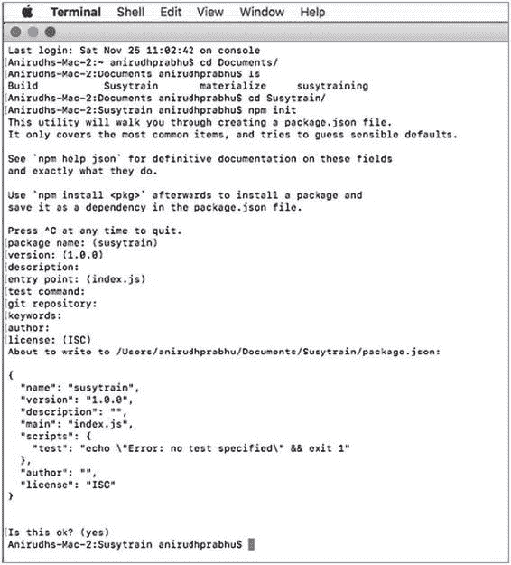
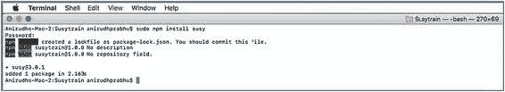
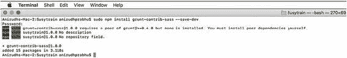
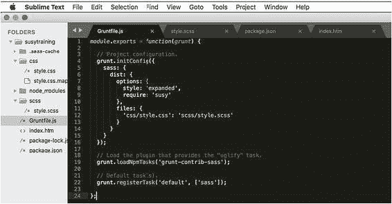
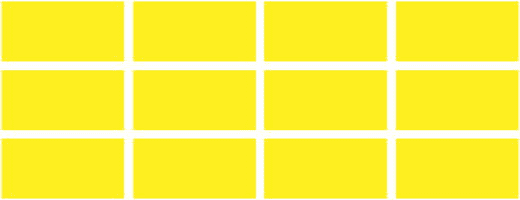

# 六、Susy 简介

## 创建 4×3 响应网格布局

There are many ways to install Susy, but for this example, we will be using Node Package Manager (NPM ) and a task runner called Grunt to get going. We will walk you through each phase in this example. Follow these steps:

1.  1.创建项目目录。
2.  2.在创建的目录中执行 npm init 命令。这将初始化目录中的节点项目，并创建执行项目所需的文件和目录。参见图 6-1 。图 6-1 使用 npm init 创建项目
3.  3.使用以下命令通过 NPM 安装 Susy:NPM install Susy 但是，如果您使用的是 Linux 或 Mac，则需要使用 sudo 来执行安装。由于在本例中我们使用的是 Mac，我们将使用以下命令:sudo npm install susy 图 6-2 显示了我们输入该命令的终端。图 6-2 Susy 的安装
4.  4.您将安装一个名为 Grunt 的任务运行器(一个构建自动化工具)。当你需要执行重复的任务时，比如缩小、编译、单元测试和林挺等等，Grunt 是非常有用的。它在很大程度上简化了任务，是实时 web 设计项目中非常好的工具包。关于安装 Grunt 的步骤，请参考以下网站:[`gruntjs.com/installing-grunt`](https://gruntjs.com/installing-grunt)。npm 安装–保存-开发任务
5.  5.为 Grunt 安装 Sass 插件。这可以通过以下命令完成:NPM install grunt-contrib-sass-save-dev 然而，如果您使用的是基于 Mac 或 Linux 的系统，则需要在前面的命令之前添加 sudo，如图 6-3 所示。图 6-3 安装用于 Grunt 的 Sass 插件
6.  6.在项目根目录下创建 Gruntfile.js。这个文件需要包含所有普通任务运行者的信息，如清单 6-1 所示。module . exports = function(grunt){//项目配置。grunt . init config({ sass:{ dist:{ options:{ style:' expanded '，require: 'susy' }，files:{ ' CSS/style . CSS ':' scss/style . scss ' } })；//加载提供“sass”任务的插件。grunt . loadnpmtasks(' grunt-contrib-sass ')；//默认任务。grunt.registerTask('default '，[' sass '])；};清单 6-1 Grunt 任务运行器的配置图 6-4 显示了文本编辑器中的配置。图 6-4 Grunt 任务运行程序的配置 grunt.initConfig 部分包含项目所需的 Grunt 配置。接下来，从[`github.com/gruntjs/grunt-contrib-sass`](https://github.com/gruntjs/grunt-contrib-sass)加载项目所需的 Sass 插件 Grunt。您可以按照前面提到的网站上的安装过程来安装 Sass 插件。加载插件后，您可以定义需要自动化的任务。请参考相同的网站以查看详细的过程。
7.  7.在 sass 目录中创建您的 Sass 文件。对于本项目，您将创建一个 4×3 网格布局，通常用于显示照片库。清单 6-2 显示了网格的 HTML 代码。<！DOCTYPE html><html><head><title>Susy 示例</title><meta name = " viewport " content = " width = device-width， initial-scale = 1 "><link rel = " style sheet " type = " text/CSS " href = " CSS/style . CSS "></head><body>
<section><ul class = " blocks "><Li class = " block _ _ item "></Li><Li class = "李 > <李 class = " block _ _ item "></李> <李 class = " block _ _ item "></李> <李 class = " block _ _ item "></李> <李 class = " block _ _ item "></李> < /ul >
8.  8.在 scss 文件夹的 style.scss 文件中定义 Sass 代码。这个文件的代码如清单 6-3 所示。首先，使用 Sass 的@import 组件将 Susy 导入到 Sass 文件中。接下来是定义 susy 配置，它在 Susy()中指定。该配置将包含列数、装订线、容器最大宽度等的值。然后使用 Sass 变量为媒体查询定义颜色和断点。接下来，您将为类容器和 block_item 定义样式。您使用 Susy 框架中可用的 mixins 容器()、gutter()和 gallery()。container() mixin 将容器位置设置为居中，并在配置中指定最大宽度。同样，gutter()设置装订线间距。gallery() mixin 用于创建所需的块布局。这个 mixin 接受所需的列数作为参数。@导入“susy”；$susy:(列:12，槽:1/4，容器:71.25rem，全局框大小:边框，)；//colors $ color-primary:# 38a1d 6；$ color-secondary:# 16f4d 0；$ color-thirty:# fcee 21；$ color-grey:# a1ac b5；$ color-grey-light:# DCE 8 ef；$彩色-灰色-深色:# 333；//断点$ mobile-landscape:30 rem；//480 px $ table t:40 rem；//640 px $平板全:48rem//768 px $ desktop:64 rem；//1024 px $宽屏:71.25rem//1140 px * { box-sizing:border-box；} %clearfix { &:在{内容: ""之后；显示:表格；明确:两者都有；} } body { padding:0 . 625 rem；} .容器{ @ include container()；}节{ @ extend % clearfixmargin-bottom:gutter()；} .块{ margin:0；@ extend % clearfix} .block _ _ item { background-color:$ color-thirty；身高:8 雷姆；margin-bottom:gutter()；列表样式:无；&:n-last-child(-n+2){ margin-bottom:0；} @ media(min-width:$ table t){ @ include gallery(4)；&:n-last-child(-n+3){ margin-bottom:0；} } @ media(min-width:$ desktop){ @ include gallery(3)；&:n-last-child(-n+4){ margin-bottom:0；} } }清单 6-3 定义样式
9.  9.使用以下命令从终端根目录中运行 Grunt 文件
10.  10.style.scss 文件编译成 style.css，现在当你点击 HMTL 文件时，你会看到如图 6-5 所示的输出。图 6-5 4×3 网格的输出

If you resize the browser, then you will see that the grid behaves in a responsive way as defined in the code. Also, if you check the style.css file created by compiling the style.scss Sass file, you can see the code shown in Listing 6-4. * {   box-sizing: border-box; } section:after, .block:after {   content: "";   display: table;   clear: both; } body {   padding: 0 .625rem; } .container {   max-width: 71.25rem;   margin-left: auto;   margin-right: auto; } .container:after {   content: " ";   display: block;   clear: both; } section {   margin-bottom: 1.6949152542%; } .block {   margin: 0; } .block__item {   background-color: #fcee21;   height: 8rem;   margin-bottom: 1.6949152542%;   list-style: none; } .block__item:nth-last-child(-n+2) {   margin-bottom: 0; } @media (min-width: 40rem) {   .block__item {     width: 32.2033898305%;     float: left;   }   .block__item:nth-child(3n + 1) {     margin-left: 0;     margin-right: -100%;     clear: both;     margin-left: 0;   }   .block__item:nth-child(3n + 2) {     margin-left: 33.8983050847%;     margin-right: -100%;     clear: none;   }   .block__item:nth-child(3n + 3) {     margin-left: 67.7966101695%;     margin-right: -100%;     clear: none;   }   .block__item:nth-last-child(-n+3) {     margin-bottom: 0;   } } @media (min-width : 64rem) {   .block__item {     width: 23.7288135593%;     float: left;   }   .block__item:nth-child(4n + 1) {     margin-left: 0;     margin-right: -100%;     clear: both;     margin-left: 0;   }   .block__item:nth-child(4n + 2) {     margin-left: 25.4237288136%;     margin-right: -100%;     clear: none;   }   .block__item:nth-child(4n + 3) {     margin-left: 50.8474576271%;     margin-right: -100%;     clear: none;   }   .block__item:nth-child(4n + 4) {     margin-left: 76.2711864407%;     margin-right: -100%;     clear: none;   }   .block__item:nth-last-child(-n+4) {     margin-bottom: 0;   } } /*# sourceMappingURL=style.css.map */ Listing 6-4Style.css This is how the mixins and variables created in Sass were compiled to CSS code, helping you keep the content and styling separate .

## 摘要

In this chapter, you got an overview of Susy. With Susy, you can develop interactive and advanced grid layouts for your web designing projects. The learning curve of grids is steep, and the more you delve deep, you will realize that there is much more to learn. In a way, more is less (pun intended). In this book we covered five frameworks that you can use instead of Bootstrap, Foundation, and Materialize. We stressed how these lightweight frameworks provide enough capability to design immersive web sites. However, this book was just an introduction to these frameworks. You are just on the shore of the island; the sea of knowledge is far beyond. In addition to these frameworks, there are several other user interface kits and web design toolkits that can make your web designing projects a breeze. Ideally, this book has helped you gain insight into the inner workings of these streamlined frameworks and whetted your appetite to go for more. Keep learning!