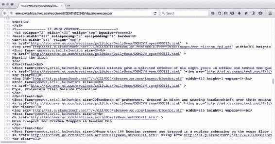
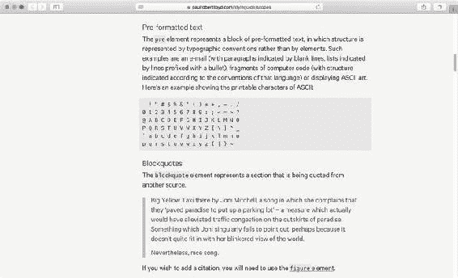

# 一、奠定基础

###### 电子补充材质

本章的在线版本(doi:[10.1007/978-1-4302-5864-3 _ 1](http://dx.doi.org/10.1007/978-1-4302-5864-3_1))包含补充材质，可供授权用户使用。

人类是天生好奇的物种。我们只是喜欢摆弄东西。当我们在办公室拿到新的 Parrot AR 无人机时，我们甚至在看说明书之前就已经把它拆成了碎片。我们喜欢自己解决问题，创造自己的思维模式来思考事物的行为。我们蒙混过关，只有在出现问题或出乎我们意料时才求助于手册。

学习级联样式表(CSS)的最好方法之一是直接开始动手修改。事实上，这可能是你们中有多少人学会了编码；通过从博客中获取技巧，查看源代码以了解您最喜欢的设计者是如何实现特定效果的，以及通过浏览开放源代码库来获取代码片段。几乎可以肯定，你一开始并没有阅读完整的规范，这足以让人昏昏欲睡。

修补是一个很好的开始方式，但是如果你不小心的话，你可能会误解一个重要的概念或者为以后的工作埋下隐患。我们知道；我们已经这样做过好几次了。在这一章中，我们将回顾一些基本但经常被误解的概念，并向你展示如何让你的 HTML 和 CSS 保持清晰和良好的结构。

在本章中，您将了解:

*   可维护性的重要性

*   HTML 和 CSS 的不同版本

*   未来友好和向后兼容代码的策略

*   给你的 HTML 增加意义并使用新的 HTML5 元素

*   向 HTML 添加适当的样式挂钩

*   用 ARIA、微格式和微数据扩展 HTML 语义

*   浏览器引擎模式和验证

## 构建您的代码

大多数人不会考虑建筑物的地基。然而，如果没有坚实的基础，大多数建筑都不会屹立不倒。虽然这本书是关于 CSS 技术和概念的，但是如果没有一个结构良好且有效的 HTML 文档，你将要学习的很多东西是不可能的(或者至少是非常困难的)。

在本节中，您将了解为什么结构良好且有意义的 HTML 对于基于标准的开发至关重要。您将了解如何为您的文档添加更多的含义和灵活性，这样做可以使您作为开发人员的工作更加轻松。但是首先是一个非常重要的话题，不管我们碰巧用什么语言工作。

### 可维护性

可维护性可以说是任何好的代码库最重要的特征。如果你的代码开始失去结构，变得难以阅读，那么很多事情都会变得困难。如果您正在与不可读和脆弱的代码作斗争，添加新功能、修复 bug 和提高性能都会变得更加复杂和令人沮丧。在某些情况下，情况变得如此糟糕，以至于开发人员会完全拒绝进行更改，因为几乎每次他们这样做时，都会有一些东西出错。这可能导致没有人喜欢在网站上工作的情况，或者在非常糟糕的情况下，导致严格的变更控制过程，发布只能每周一次，甚至每月一次！

如果你正在构建一个要交给客户或其他开发团队的网站，可维护性就更加重要了。关键是你要提供易于阅读、意图明确的代码，并且*针对变化*进行了优化。“唯一不变的是变化”在这里是一个特别合适的陈词滥调，因为谁的项目没有不断变化的需求，以及不断的特性请求和错误修复？

随着代码库的增长，CSS 是最难维护的语言之一，即使是相对较小的网站的样式表也可能很快失控。其他现代编程语言具有内置的变量、函数和名称空间等特性；默认情况下，所有有助于保持代码结构化和模块化的特性。CSS 没有这些特性，所以我们需要将它们构建到我们使用语言和构建代码的方式中。当我们在整本书中讨论不同的主题时，你会发现可维护性的主题几乎贯穿了所有的主题。

### 标记简史

> 网络的力量在于它的普遍性。无论是否残疾，每个人都能获得服务是一个重要方面。
> 
> —蒂姆·伯纳斯·李

蒂姆·伯纳斯·李在 1990 年创造了 HTML，目的是格式化科学研究文件。它是一种简单的标记语言，能够赋予文本基本的结构和含义，如标题、列表和定义。这些文档通常很少或没有视觉修饰，可以很容易地被计算机索引，并由人们使用纯文本终端、网络浏览器或屏幕阅读器(如果需要)来阅读。

然而，人类是非常视觉化的生物，随着万维网的流行，HTML 开始获得创建演示效果的特性。人们将使用字体和粗体标签的组合来创建特定的视觉效果，而不是使用标题元素作为页面标题。表格被当作一种布局工具，而不是显示数据的方式，人们会使用块引用元素来缩进文本，而不是表示引用。很快，HTML 失去了给内容提供结构和意义的主要目的，变成了字体和表格标签的混乱。网页设计师为这种标记起了一个名字；他们称之为*标记汤*(见图 1-1 )。



###### 图 1-1。2000 年 8 月 14 日 abcnews.com 的头条新闻的标记使用表格作为布局，大而粗的文本作为标题。代码缺乏结构，难以理解

网络已经变得一团糟，CSS 被创造出来帮助整理东西。CSS 的主要目的是允许 HTML 中的表示规则被提取出来并放入它们自己的系统中；为了*分离内容和呈现*。这鼓励了意义和语义潜移默化地回到 HTML 文档中。像字体标签这样的表示性标签可以被抛弃，布局表格可以被慢慢取代。这对于网站的可访问性和速度来说是一个福音，但 CSS 也为网站设计者和开发者提供了许多好处:

*   一种专门设计用来控制视觉样式和布局的语言

*   可以更容易地在一个站点中重用的样式

*   通过关注点分离改进代码结构

###### 关注点分离

关注点分离的概念在软件开发中很常见。在 Web 上，它不仅可以应用于标记和样式的分离，还可以应用于样式的编写方式。事实上，这是确保代码可维护性的主要方法之一。

Unix 开发社区中有一个常见的短语，通过“小块、松散连接”来表达这个概念“一小块”是专注于做好一件事的代码模块。因为它与其他组件是“松散连接”的，所以该模块可以很容易地在系统的其他部分重用。Unix 中的“小片段”可以是字数统计功能，它可以处理你输入的任何文本。在 web 开发中,“一小块”可以是产品列表组件，如果松散耦合，它将可以在站点的多个页面上重用，或者在布局的不同部分重用。

你可以把这些小段代码想象成乐高积木。每一块砖都非常简单，但是它们可以以多种方式连接在一起，创造出极其复杂的物体。在本书的最后，在第十二章中，我们将回到这个主题，并研究如何以结构化的方式使用这个策略。

#### HTML 和 CSS 的不同版本

CSS 有各种不同的版本，或者说“层次”,了解一下这些版本的含义以及它们如何影响你应该或不应该使用的 CSS 特性是很有好处的。万维网联盟(W3C)是负责 Web 技术标准化的组织，它的每个规范在最终成为 W3C 推荐标准之前都经历了许多发展阶段。CSS 1 在 1996 年底成为 W3C 的推荐标准，包含非常基本的属性，如字体、颜色和边距。CSS 2 在 1998 年成为一个推荐标准，并增加了高级概念，如浮动和定位，以及新的选择器，如子、相邻兄弟和通用选择器。

CSS 3 是一个稍微不同的野兽。事实上，这里的*并不是*css3 本身，而是每个*独立升级*的模块集合。当一个模块规格继续改进一个现有的概念时，它从第 3 级开始。如果它是一种全新的技术，它从第 1 级开始。当使用 CSS 3 这个术语时，它通常指任何足以成为模块规范一部分的新东西。模块的例子包括“CSS 背景和边框级别 3”、“选择器级别 4”和“CSS 网格布局级别 1”这种模块化方法允许不同的规范以不同的速度发展，一些 3 级规范，如“CSS 颜色 3 级”，已经作为推荐标准发布。其他人处于候选人推荐状态，许多人仍处于工作草案状态。

虽然 CSS 3 的工作大约在 CSS 2 发布的时候就开始了，但是这些新规范的进展最初是缓慢的。因此，在 2002 年，W3C 发布了 CSS 2 修订版 1。CSS 2.1 修复了 CSS 2 中的错误，删除了浏览器中不太支持或不存在的功能，并在总体上进行清理，以提供更准确的浏览器实现情况。CSS 2.1 在 2011 年 6 月达到推荐状态，这是在 CSS 3 的工作开始十多年之后。这让你知道标准机构和浏览器制造商需要多长时间才能确定这些技术的工作原理。也就是说，当特性处于草案阶段时，浏览器通常会提供对特性的实验性支持，而在候选推荐阶段，事情通常是相当稳定的。某样东西成为可用技术的日期通常比它成为推荐的日期要早得多。

HTML 的历史同样复杂。1999 年，HTML 4.01 成为推荐标准，W3C 开始关注 XHTML 1.0。XHTML 1.1 本应遵循这一标准，但它强加的严格程度被证明是不切实际的，并且在 web 开发社区的成员中不受欢迎。实质上，网络主要语言的发展停滞了。

2004 年，一些公司成立了网络超文本应用技术工作组(WHATWG ),并开始制定一套新的规范。W3C 在 2006 年认识到这项工作的必要性，并加入了这项工作。2009 年，W3C 完全放弃了 XHTML，正式接受了 WHATWG 的新标准，即 HTML5。最初，WHATWG 和 W3C 都协调了他们在标准方面的工作，但是随着时间的推移，他们的关系变得复杂了。今天，他们编辑了两个独立的标准，一个来自 WHATWG，被称为 HTML，另一个来自 W3C，被称为 HTML5。是的，我们知道，这有点疯狂。幸运的是，这两个标准非常接近，所以将 HTML5 作为一个单独的东西来说还是有意义的。

#### 我应该使用什么版本？

设计师和开发人员经常问他们应该使用哪个版本的 HTML 或 CSS，但是这个问题没有简单的答案。尽管规范为标准和 web 技术开发工作提供了一个焦点，但它们在很大程度上与设计人员和开发人员的日常工作无关。*重要的是*知道 HTML 和 CSS 的哪些部分已经在浏览器中实现，以及这些实现有多健壮和无错误。它们是应该谨慎使用的实验特性吗？或者，它们是否健壮且经过良好测试，在大量浏览器上实现匹配？

理解浏览器支持的状态是当今编写 CSS 和 HTML 最棘手的部分之一。有时候事情似乎进展得很快，你必须努力工作才能跟上。在其他时候，它会感觉慢得令人沮丧。在这本书里，你会看到关于 HTML 和 CSS 各种特性的浏览器支持说明，以及关于如何和何时应该考虑使用它们的提示。不可避免地，这里打印的信息会过时，所以你自己跟上这些信息是很重要的。

有几个学习浏览器支持的好地方。对于 CSS 属性，“我可以使用”网站([`caniuse.com`](http://caniuse.com))允许你搜索一个属性或一套属性，包括桌面和移动浏览器中支持它的浏览器的百分比统计。另一个雄心勃勃的计划是 http://webplatform.org 的 ??，这是 W3C 和几个浏览器制造商和行业巨头之间的合作，试图收集和合并他们各自支持 CSS、HTML、JavaScript APIs 等的文档。然而，正如大型项目往往会做的那样，将这种规范的 web 技术文档放在一起需要花费大量的时间。在这种情况下，Mozilla 的开发者文档 MDN(【http://developer.mozilla.org】)被普遍认为是黄金标准。

当讨论浏览器支持时，重要的是要接受并非所有的浏览器都是生来平等的；他们永远也不会。如今只有极少数浏览器支持 CSS 3 的一些特性。例如，直到 11 版的 Internet Explorer 和 6.1 版的 Safari 才支持灵活框布局(或简称为 *flexbox* )。即使需要支持遗留浏览器，也不代表 flexbox 一点用都没有。您可能会避免在站点的核心布局中使用 flexbox，但是您仍然可以选择在特定的组件中使用它，因为它的强大功能非常有用，并且确保在不理解属性的浏览器中有一个可接受的后备。判断向后兼容性和未来友好代码的能力是定义真正 CSS 大师的一部分。

### 渐进增强

平衡向后兼容性与最新 HTML 和 CSS 特性的能力涉及到一种称为*渐进增强*的策略。这代表的基本意思是“从使它在最小公分母上工作良好开始，但是在它们被支持的地方自由地进一步发展。”使用渐进式增强意味着您将在“层”中编写代码，其中每个连续的增强只有在被支持或被认为合适时才被应用。这听起来可能很复杂，但好消息是 HTML 和 CSS 都部分内置了这一点。

对于 HTML，这意味着未知的元素或属性一般不会给浏览器带来麻烦；它会毫无怨言地将它们一扫而光，但可能不会将结果应用到页面的工作方式上。例如，您可以使用 HTML5 中定义的新型输入元素。假设您有一个电子邮件地址的表单域，标记如下:

```html
<input type="text" id="field-email" name="field-email">
```

您可以像这样更改 type 属性的值:

```html
<input type="email" id="field-email" name="field-email">
```

没有实现新字段类型的浏览器将简单地回答“我不知道那是什么意思”，并退回到默认的类型值，即“文本”，就像第一个例子一样。理解“电子邮件”类型的新浏览器会知道用户应该在这个字段中输入什么类型的数据。在许多移动设备上，软件键盘会调整以显示为输入电子邮件地址而优化的视图，如果你在较新的浏览器中使用内置的表单验证支持，这也会起作用。我们已经逐步增强了页面，对老版本浏览器的用户没有负面影响。

另一个简单的变化是将文档类型声明从 HTML5 标准更新为新的、更短的版本。文档类型，或简称为 doctype，是 HTML 文档顶部的一位，它被认为是关于文档中使用的标记语言版本的机器可读提示。在旧版本的 HTML 和 XHTML 中，这曾经是一件漫长而复杂的事情，但在 HTML5 中，它被简化为:

```html
<!DOCTYPE html>
```

您可以安全地切换到使用此 doctype 编写 HTML 文档，因为 HTML5 语法和 doctype 向后兼容。在接下来的章节中，我们将进一步了解 HTML5 中的一些新元素，但如果你需要更多关于如何开始编写 HTML5 标记的深入信息，请查看 Jeremy Keith 在 http://html5forwebdesigners.com[的为网页设计师编写的 *HTML5。*](http://html5forwebdesigners.com)

当涉及到浏览器如何解释新属性时，CSS 中的渐进式增强以类似的方式工作。浏览器无法识别的任何属性或值都会导致它丢弃该声明，因此添加新属性不会有任何不良影响，只要您提供合理的后备。

例如，许多现代浏览器支持颜色值的 rgba 函数符号。它允许您使用红色、绿色和蓝色通道的单独值以及透明度值(称为 alpha 通道)来指定颜色。我们可以这样使用它:

```html
.overlay {
    background-color: #000;
    background-color: rgba(0, 0, 0, 0.8);
}
```

该规则规定，具有覆盖类名的元素应该具有黑色背景色，但是随后立即使用 rgba 将背景色重新声明为略微透明的黑色。对于不理解 rgba 表示法的浏览器，第二条语句将被忽略，元素将具有纯黑色背景色。对于那些*理解 rgba 符号的浏览器来说，第二条语句覆盖了第一条语句。因此，即使 rgba 表示法并不是在所有地方都受支持，我们仍然可以使用它，只要我们先使用后备声明。*

#### 供应商前缀

浏览器制造商使用同样的原理在他们的浏览器中引入实验性的特性。他们通过在属性名或属性值前添加一个特殊的字符串来实现这一点，这样只有他们自己的浏览器引擎会应用它，而其他浏览器会忽略它。这使得浏览器制造商可以在规范缺失或不成熟时引入新功能。如果不同的浏览器对新特性有不同的解释，样式表作者可以在不破坏页面的情况下尝试它们。例如:

```html
.myThing {
  -webkit-transform: translate(0, 10px);
  -moz-transform: translate(0, 10px);
  -ms-transform: translate(0, 10px);
  transform: translate(0, 10px);
}
```

这将一个转换应用到带有几个不同前缀的元素(我们将在第十章中讨论)。那些以-webkit-开头的应用于基于 webkit 的浏览器，比如 Safari。Google Chrome 和 Opera 基于 Blink 引擎，而 Blink 引擎最初是基于 WebKit 的，所以-WebKit-前缀通常也适用于它们。前缀-moz 适用于基于 Mozilla 的浏览器，如 Firefox，前缀-ms 适用于微软的 Internet Explorer。

最后，我们添加了无前缀版本，这样支持该属性标准化版本的浏览器就不会错过。从历史上看，开发人员在添加标准化版本时一直很马虎。这已经走得很远，一些浏览器制造商已经开始支持竞争引擎的前缀，只是为了确保流行的网站能在他们的浏览器上工作。这种混乱的结果是，大多数浏览器制造商不再使用厂商前缀。实验性的特性被隐藏在偏好标志后面，或者在特殊的预览版本中。

书中的例子大多只使用不带前缀的标准化属性，所以建议你去像[`caniuse.com`](http://caniuse.com)这样的网站查看，以确保当前的支持情况如何。

#### 条件规则和检测脚本

对于更高级的情况，我们需要基于 CSS 支持的完全不同的解决方案，有@supports-block。这个特殊的块称为条件规则，它检查括号内的声明，并且仅在声明受支持时才应用该块内的规则:

```html
@supports (display: grid) {
  /* rules for when grid layout is supported go here */
}
```

这样做的问题是，这条规则本身相当新，所以我们只能将它用于任何传统浏览器都没有实现的前沿功能(例如，我们将在第七章中查看网格布局)。对于其他情况，我们可以使用 JavaScript 来判断某样东西是否受支持。这种类型的特性测试在几个 JavaScript 库中都有，最流行的是 Modernizr(【http://modernizr.com】??)。它的工作原理是将支持提示附加到 HTML 中，然后您可以将它作为 CSS 的基础。

我们将在接下来的章节中更仔细地研究类似的策略和工具，但是重要的是渐进式增强可以帮助我们摆脱对版本号和规范的过多担心。通过谨慎的应用，我们可以在适当的地方使用新的闪亮玩具，而不会把用户留在旧的浏览器上。

## 创建结构和语义丰富的 HTML

语义标记是任何好的 HTML 文档的基础。*语义学*是对意义的科学研究。在具有一组正式符号(如 HTML 及其元素和属性)的虚构语言的上下文中，语义指的是我们通过使用某个符号所表达的意思。简单地说，*语义标记*就是在正确的地方使用正确的元素，从而产生有意义的文档。

有意义的文档有助于确保尽可能多的人可以访问内容，无论他们是使用最新版本的谷歌浏览器，运行 Lynx 等纯文本浏览器，还是依赖屏幕阅读器或盲文显示器等辅助技术。无论项目后期可能需要什么样的图形或交互，文档的基本语义都不应该也不需要被破坏。

良好的结构化标记也意味着你的内容更容易被机器使用，特别是搜索引擎蜘蛛，如 Googlebot，它对页面进行索引和排序，以纳入谷歌的搜索结果。Googlebot 从您的页面中获取的数据越丰富，它就越有可能对这些页面进行正确的索引和排名。因此，你很可能会受益于搜索排名中更高的位置。

更重要的是，在 CSS 的上下文中，有意义的标记为您提供了一种简单的方法来定位您想要样式化的元素。它为文档增加了结构，并为您创建了一个基础框架。

事实上，许多制作 CSS 的现代方法都建议从网站的一组“基础”样式开始。图 1-2 所示的保罗·劳埃德的样式指南页面包含了他在个人博客上可能需要的所有看似合理的元素。它描述了如何以及何时使用它们，并且他的样式表确保了无论他在页面上添加什么元素，都将被适当地样式化，而不必做进一步的工作。



###### 图 1-2。paulrobertlloyd.com 样式指南，位于[`paulrobertlloyd.com/about/styleguide/`](http://paulrobertlloyd.com/about/styleguide/)

保罗的样式指南包含了所有明显有意义的元素，例如:

*   h1、h2 等等

*   p、ul、ol 和 dl

*   强壮和 em

*   批量引用和引证

*   预编码和编码

*   时间、图片标题和标题

它还包括表单和表格及其相关元素的基本样式，包括:

*   字段集、图例和标签

*   标题、thead、tbody 和 tfoot

拥有这套基本样式的价值怎么强调都不为过。很明显，在设计和开发过程中，您需要很快开始继承和覆盖它们，但是拥有一个坚实的元素样式基础可以为您将来的工作做好准备。它也可以作为校样。当您对 CSS 进行更改时，您可以浏览样式指南中的组件，并验证您在处理其他样式时没有无意中覆盖某些样式。

### 类别和 ID 属性

有意义的元素提供了一个很好的基础，但是它们不会为你提供应用每一个视觉效果所需的所有“钩子”。十有八九你会希望根据上下文来调整基本元素的样式。我们需要一种在文档中提供其他样式“挂钩”的方法，一种常见的方法是使用 ID 和 class 属性。

添加一个 ID 或类属性并不会*固有地*给你的文档添加意义或结构。添加这些属性是一种通用的方式，允许其他东西与您的文档交互并解析您的文档，CSS 就是一种可以利用它们的东西。这些属性的价值在于它们可以包含您定义的名称。

这听起来很琐碎，但是命名是编写代码中最重要(通常也是最困难)的部分之一。选择一个名字可以让你陈述某个东西*是什么*，并暗示它的用途或者应该如何使用它。当你写代码时，清晰和明确是绝对重要的。所以让我们取一个简单的链接列表，并给它一个 class 属性，这个属性有一个很好的可读性和有用的值:

```html
<ul class="product-list">
  <li><a href="/product/1">Product 1</a></li>
  <li><a href="/product/2">Product 2</a></li>
  <li><a href="/product/3">Product 3</a></li>
</ul>
```

这里，我们使用 class 属性在文档中创建了一个产品列表模块。在 CSS 中，我们认为类名是定义事物的一种方式。product-list 类名为我们提供了一种方法来指定我们希望成为这种类型的任何列表。一旦我们创建了 CSS 来样式化我们的产品列表，我们不仅可以在这里使用它，还可以在网站的任何其他上下文中使用它——比如蓝图或模板。

即使我们添加了一个类名作为样式的显式挂钩，我们通常也应该避免使用一个在视觉上表明它看起来像什么的名字(我们将在第十二章讨论是否以及何时打破这个规则)。相反，我们应该选择一个表明组件类型的名称。例如，这里我们选择了 product-list，而不是一个通用名称，比如 large-centered-list。

您会注意到，在前面的例子中，我们选择了使用 class 属性，而不是 ID 属性。在用于样式化时，ID 和 class 属性之间有一些重要的区别，但是此时最适用的是一个 ID 名称只能应用于页面上的一个元素。这意味着它不能像为我们的产品列表这样的模块定义一个可重用的“模板”那样简单。如果我们使用了 ID 属性，我们就不能在每页上重用产品列表一次以上。

我们更喜欢使用 ID 属性来标识特定模块的*单个实例*。例如，我们的产品列表模块的一个实例可能如下所示:

```html
<ul id="primary-product-list" class="product-list">
  <li><a href="/product/1">Product 1</a></li>
  <li><a href="/product/2">Product 2</a></li>
  <li><a href="/product/3">Product 3</a></li>
</ul>
```

这是我们的 product-list 的另一个实例，它根据 class 属性选择样式，但是这里它也被定义为 *primary* product-list。每页只能有一个主要产品列表，这似乎是合理的，因此 ID 属性可能是一个合适的选择。然后，该 ID 可以用于向模块添加额外的覆盖样式，或者可以用于向模块添加一些与 JavaScript 的交互，或者作为导航的页面内锚。

实际上，使用 ID 属性作为 CSS 的挂钩通常并不特别有价值。如果您喜欢使用类进行样式化，并且只使用 id 来标识文档中的元素，而不是用于样式化，那么您通常会创建更简单、更易于维护的代码。我们将在第十二章更详细地讨论这个话题。

### 结构元素

HTML5 引入了一系列全新的结构元素:

```html
section
header
footer
nav
article
aside
main
```

引入这些元素是为了创建 HTML 文档的逻辑部分。您可以使用它们来表示包含独立内容(文章)、导航组件(nav)、特定部分的标题(标题)等的部分。main 元素是最新添加的元素，突出显示了包含页面主要内容的区域。http://html5doctor.com 是一个很好的资源，可以让你深入了解所有这些新元素的正确用法。

除了 main 元素之外，所有这些新元素都可以在一个文档中多次使用，这给了机器和人类更好的解释机会。在这些新元素出现之前，您经常会看到具有相似类名的 div 元素，例如在标记博客帖子时:

```html
<div class="article">
  <div class="header">
    <h1>How I became a CSS Master</h1>
  </div>
  <p>Ten-thousand hours.</p>
</div>
```

那些 div 元素没有为文档提供任何真正的语义值；它们可能只是作为样式挂钩，使用类名。前面片段中唯一有实际意义的部分是 h1 和 p，但是使用我们新发现的 HTML5 元素，我们可以改进一些东西:

```html
<article>
  <header>
    <h1>How I became a CSS Master</h1>
  </header>
  <p>Ten-thousand hours.</p>
</article>
```

我们通过这一改变改进了 HTML 的语义，但是带来了意想不到的副作用。现在，我们唯一可以用来设计样式的挂钩是文章和标题元素。用于样式化它们的 CSS 选择器可能如下所示:

```html
article {
  /* styles here */
}
article header {
  /* other styles here */
}
```

文章和标题元素都可以在页面的其他地方重用，用于显示博客文章之外的其他目的。如果它们*现在被*重用，并且我们将样式直接附加到选择器中的元素上，那么它们将会选择我们为博文设计的样式规则，不管它们是否适合新的情况。一种更灵活、更具前瞻性的方法是将这两个例子结合起来:

```html
<article class="post">
  <header class="post-header">
    <h1>How I became a CSS Master</h1>
  </header>
  <p>Ten-thousand hours.</p>
</article>
```

关联的 CSS 规则然后可以使用类名来挂钩到这个结构:

```html
.post {
  /* styles here */
}
.post-header {
  /* other styles here */
}
```

通过这个简单的改变，我们实际上展示了一个非常重要的概念。我们已经将文档的语义从样式化的方式中分离出来，使其更易于移植，目的更清晰，因此更易于维护。如果我们现在决定一篇文章不是包含该内容的最合适的元素，或者我们发现我们的内容管理系统(CMS)出于某种原因限制我们使用 div，我们不需要做任何进一步的更改。无论我们选择(或被迫)使用什么元素，我们与类属性挂钩的样式都会工作得很好。

###### 旧互联网探索者和新元素

在大多数浏览器中，使用这些新元素可以很好地工作，但 Internet Explorer 8 和更早版本不会将样式应用于它不知道的元素。幸运的是，这可以通过使用一个叫做“填充”或“多填充”脚本的 JavaScript 片段来解决。

你可以在 https://github.com/aFarkas/html5shiv 找到这样一个脚本的版本。

它也包含在前面提到的 Modernizr 库中，我们将在接下来的章节中回到这个库中。

如果您预计很大一部分用户使用的是非常旧的浏览器，那么在严重依赖这些新元素时应该小心，因为这会导致额外的 JavaScript 依赖，从而使事情按预期工作。

### 使用 div 和跨度

所有这些新奇的语义元素并不意味着我们的老工具 div 元素是多余的。当没有其他更符合您的目的的语义正确的元素时，div 是用于对内容进行分组的合适元素。有时，纯粹出于样式目的，您需要向文档中添加额外的元素，例如围绕整个页面的包装，以帮助创建居中布局。

如果您可以使用一种更具语义的元素来构建您的内容，那么总是这样做，如果需要样式化，就给它一个合适的 class 属性。但是，如果您需要一个非语义元素作为额外的样式挂钩，请使用 div。有一个古老的术语叫做“divitis ”,指的是 HTML 作者倾向于在他们的标记中加入 div，或者对任何事情都使用 div，而不管是否有更合适的元素。只在必要的地方添加 div，以提供简单明了的造型挂钩，但不要因为不得不添加一些 div 而感到尴尬或羞愧。我们将在后面的章节中看到一些具体的例子，在这些例子中，一些额外的无意义的 div 对于创建干净的、可维护的代码变得非常有价值。

div 元素的一个关联是 span。像 div 一样，它没有语义意义，可以纯粹用于向文档添加表示挂钩。span 不同于 div，因为它是一个*文本级元素*，用于在一段文本流中提供结构。同样，在使用无意义的 span 之前，一定要确保没有语义丰富的 HTML 元素可以代替它。例如，time 应该用来标记时间和日期，q 用来标记引文，而通常的疑点 em 用来强调重音，strong 用来表示非常重要:

```html
<p>At <time datetime="20:07">7 minutes past eight</time> Harry shouted, <q>Can we just end this, now!</q> He was <strong>very</strong> angry.</p>
```

### 重新定义的表示性文本元素

**和*元素是表示标记时代的残余，分别用来代表粗体和斜体文本。你可能会认为它们已经从新的 HTML5 规范中剔除了，但是它们实际上仍然存在。由于它们广泛出现在网络上的旧内容中，或者通过亚标准的 WYSIWYG 编辑器创建的内容中，HTML5 规范的编辑决定将它们留在那里，而不是更新它们的定义。***

今天，*元素代表了不同于其周围环境的内容，通常会被排版为斜体。HTML5 规范中的例子包括不同语言的表达式或船名。*

元素有几乎完全相同的定义，但是对于传统上是粗体的内容。这里的例子包括产品名称或类别。

这听起来有点模糊，但重要的是，这两个元素与它们的表亲*和**不同，因为它们没有说明其中内容的重点。大多数时候你会想要*或**，因为它们是在一段文本中强调和强调的语义上正确的选择。******

### 扩展 HTML 的语义

长期以来，web 开发人员一直在探索向 HTML 有限的词汇中添加新的语义和结构的方法。内容中更丰富的意义表达为网络和围绕它构建的工具提供了各种可能性。尽管迈向语义网天堂的进程还没有快到令人眼花缭乱的地步，但在允许 HTML 作者向他们的文档中添加更细粒度和更具表达性的语义方面已经取得了一些积极的进展。

#### ARIA 角色属性

许多新的 HTML5 元素为可访问性优势开辟了可能性。例如，如果屏幕阅读器等辅助技术能够理解导航元素在页面中的位置和内容，它们就可以帮助用户跳过这个导航来找到内容，或者在需要时返回导航。

实现这一点的另一种方法是使用可访问的富互联网应用程序(ARIA ),它作为 HTML 的补充规范。ARIA 允许您为辅助技术提供更多的语义含义，通过指定文档包含的不同元素或它们提供的功能。例如，role="navigation "是所谓的" landmark role "属性，它声明一个元素具有导航角色。其他标志性角色包括:

*   旗帜

*   形式

*   主要的

*   搜索

*   补充的

*   内容信息

*   应用

ARIA 角色及其定义的完整列表可以在 ARIA 规范[`www.w3.org/TR/wai-aria/roles#role_definitions`](http://www.w3.org/TR/wai-aria/roles#role_definitions)中找到。

如果你需要一个何时使用里程碑式角色的简短分类，Paciello Group 的 Steve Faulkner 已经在[`blog . paci ello Group . com/2013/02/using-wai-aria-landmarks-2013/`](http://blog.paciellogroup.com/2013/02/using-wai-aria-landmarks-2013/)上发布了如何以及何时使用它们的概述。

ARIA 还允许开发人员指定更复杂的内容或界面元素。例如，在 HTML 中重新创建音量控制滑块小部件时，它将包含一个值为 slider 的角色属性:

```html
<div id="volume-label">Volume</div>
<div class="volume-rail">
  <a href="#" class="volume-handle" **role="slider" aria-labelledby="volume-label" aria-valuemin="1" aria-valuemax="100" aria-valuenow="67"**></a>
</div>
```

额外的属性 aria-labelledby、aria-valuemin、aria-valuemax 和 aria-valuenow 都提供了额外的信息，辅助技术可以使用这些信息来帮助有视觉障碍、运动障碍或不同能力的用户使用滑块小部件。

添加关于 HTML 页面各种组件所扮演角色的额外语义信息也是为脚本和样式提供钩子的一个好方法，所以这是一个典型的双赢。

#### 微格式

到目前为止，最广泛采用的扩展 HTML 语义的方式是*微格式*，这是一组标准化的命名约定和标记模式，用于表示特定类型的数据。这些命名约定基于现有的数据格式，如 vCard 和 iCalendar。例如，以下是一些以 hCard 格式标记的联系方式:

```html
<section class="h-card">
  <p><a class="u-url p-name" href="http://andybudd.com/">Andy Budd</a>
     <span class="p-org">Clearleft Ltd</span>
     <a class="u-email" href="mailto:info@andybudd.com">info@andybudd.com</a>
  </p>
  <p class="p-adr">
    <span class="p-locality">Brighton</span>,
    <span class="p-country-name">England</span>
  </p>
</section>
```

用微格式标记的联系信息使开发人员更容易编写提取这些数据的工具。例如，浏览器插件可以在您浏览的页面中找到微格式，并允许您将联系人下载到您的地址簿中，或者将事件添加到您的日历应用程序中。一系列数据类型都有微格式:联系方式、事件、食谱、博客文章、简历等等。微格式也可以用来表达一段内容和该内容链接到的另一个 URL 之间的关系。

微格式之所以受欢迎，部分是因为它们易于实现，并且已经被包括 Yahoo！以及直接添加到 WordPress 和 Drupal 等出版工具中。2012 年一项关于结构化数据实现的研究([`microformats.org/2012/06/25/microformats-org-at-7`](http://microformats.org/2012/06/25/microformats-org-at-7))发现，微格式在网络上的应用最为广泛，但也有一些替代品在最近开始取得重大进展，比如微数据。

#### 微观数据

微数据是 HTML5 中引入的，它提供了另一种向 HTML 添加结构化数据的方式。它的目的和目标与微格式非常相似，但是将微数据嵌入内容的细节有些不同。让我们看看如何使用微数据标记上一节中相同类型的联系信息:

```html
<section itemscope itemtype="http://schema.org/Person">
  <p><a itemprop="name" href="http://thatemil.com/">Emil Björklund</a></p>
     <span itemprop="affiliation" itemscope             itemtype="http://schema.org/Organization">
       <span itemprop="name">inUse Experience AB</span>
     </span>
     <a itemprop="email" href="mailto:emil@thatemil.com">emil@thatemil.com</a>
  </p>  <p itemprop="address" itemscope itemtype="http://schema.org/PostalAddress">
    <span class="addressLocality">Malmö</span>,    <span class="addressCountry">Sweden</span>  </p>
</section>
```

如本例所示，微数据语法比相应的微格式略显冗长；但这是有原因的。微数据被设计为可扩展的，因此它可以表示所需的任何类型的数据。它只是提供了一些表达数据结构的语法，但本身并没有定义任何特定的词汇表。这与微格式相反，微格式定义了特定类型的结构化数据，如 hCard 或 hCalendar。

微数据留给其他人来定义和记录特定的格式。我们在前面的例子中使用的格式是由 http://schema.org 定义的词汇表之一，它是由必应、谷歌和雅虎的代表创建的。这些搜索引擎使用它来帮助他们索引和排列页面，这意味着这些词汇表是帮助搜索蜘蛛丰富有效地索引您的内容的另一种方式。

### 确认

即使您的标记的核心是经过深思熟虑的，语义上也是合理的，但是仍然存在输入错误或格式错误会给您带来不可预见的麻烦的风险。这就是验证的用武之地。

现实世界中的大多数 HTML 文档实际上都不是有效的 HTML。用规范编写者的话说，他们是*不符合规范的*。这些文档的元素嵌套不正确，包含未编码的&符号，并且缺少必需的属性。浏览器非常优雅地处理这类错误，并且总是试图猜测作者的意图。事实上，HTML 规范中包含了处理无效 HTML 的规则，以确保浏览器开发者以一致的方式处理错误。

浏览器如此善于处理我们的错误，这一事实对整个网络来说是一件幸事，但这并不能免除我们在这方面的责任。我们应该尽可能尝试创建有效的文档。这样做将有助于我们更快地捕捉错误，或者完全阻止它们被引入。如果您有一个呈现或布局错误，但没有立即和明显的修复方法，一个好的第一步是验证 HTML，以确保您尝试的是一个格式正确的文档。

有许多工具可以帮助您验证 HTML。您可以使用 W3C 站点上的 HTML 验证器([`validator.w3.org/`](http://validator.w3.org/))，或者与它通信的许多浏览器插件中的一个。例如，Web Developer extension(【http://chrispederick.com/work/web-developer/】??)可用于 Mozilla Firefox、Opera 和 Google Chrome，并具有验证公开可用网站和本地网站的选项(以及其他真正有用的功能！).或者，如果您的项目有任何类型的自动化构建或测试过程，您可以在这里包含 HTML 验证作为一个步骤。

CSS 验证也是可能的。W3C 在 http://jigsaw.w3.org/css-validator/有一个 CSS 验证器。有人可能会说验证 CSS 文件不如验证 HTML 重要——CSS 中的错误不太可能导致 JavaScript 失败或使使用辅助技术(如屏幕阅读器)的人无法访问您的页面。尽管如此，你应该确保不时地检查你的 CSS，以确保你没有犯任何简单的错误，比如忘记在度量中添加单位。

根据您在 CSS 验证器中选择的设置，您会收到许多关于在代码中使用供应商前缀的警告或错误。这些是非标准的属性或值，浏览器制作者在实现对 CSS 特性的实验性支持时，允许您将其设置为真实事物的替身。例如，display 属性的-webkit-flex 值是基于 webkit 的浏览器中 flex 属性的实验版本。这很可能被验证器标记为警告或错误，但是即使验证器对您大喊大叫，您的文件也能正常工作。你只需要确保你明白为什么它会把事情标记为有问题。

验证本身并不是目的，由于来自第三方的内容、笨拙的 CMS 系统或您可能想要使用的实验性 CSS 功能，许多本来很好的页面都无法通过验证。还有一个风险是，验证器实际上没有跟上标准和浏览器实现。所以不要在验证上较劲，而是把它作为一种手段，在错误引起太多连锁反应之前，捕捉那些容易修复的错误。

## 摘要

在这一章中，我们看了一些可以确保你在 HTML 和 CSS 方面有一个坚实基础的方法。您学习了一些关于 HTML 和 CSS 的历史，如何跟上变化，以及如何使您的代码既向后兼容又对未来友好。现在，您已经知道了编写可维护代码的重要性，以及一些构建 HTML 的方法，这样就可以轻松、一致地使用 CSS 样式。

在下一章中，我们将回顾一些基本的 CSS 选择器，然后从第 3 级和第 4 级选择器规范转移到一系列更高级的选择器。您将了解特殊性、继承性和级联，以及如何将它们用于创建高效的样式表。