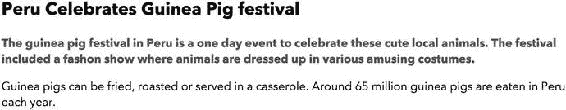
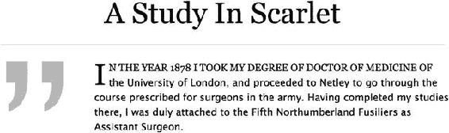
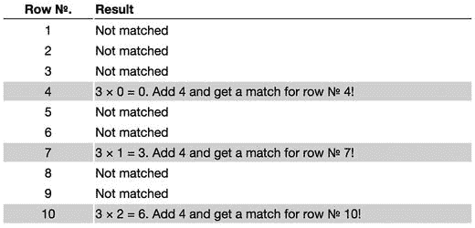
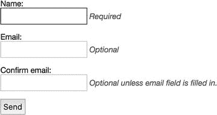
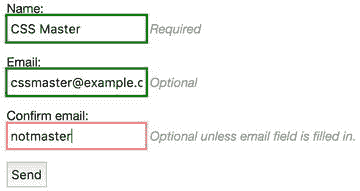
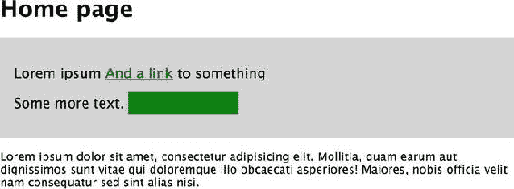
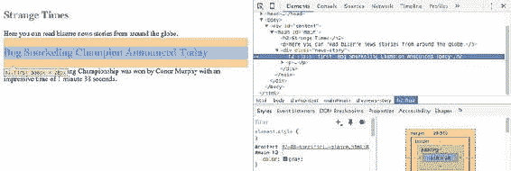
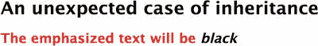

# 二、让你的样式达到目标

一个有效的、结构良好的文档为你的样式的应用提供了基础。您可能已经在 HTML 中添加了适当的样式“挂钩”,或者随着页面设计需求的发展，您可能还会添加更多的样式。在这一章中，我们将看看我们可以用来定位 HTML 的*选择器*的范围，以及我们可以用来获得更多控制的额外钩子。我们将涵盖:

*   公共选择器

*   面向现在和未来的前沿选择器

*   特异性和级联的奇妙世界

*   将样式应用到页面

## CSS 选择器

最基本的选择器是*型*和*后代*选择器。*类型*选择器用于定位特定类型的元素，比如一个段落(如下图所示)或者一个标题元素。您只需简单地指定想要样式化的元素的名称。*类型*选择器有时也被称为*元素*选择器。

```html
p {
  color: black;
}
```

*Descendant* 选择器允许您定位特定元素或元素组的后代。后代选择器由两个其他选择器之间的空格表示。在此示例中，只有作为块引号后代的段落元素才会缩进，而所有其他段落将保持不变:

```html
blockquote p {
  padding-left: 2em;
}
```

这两个选择器非常适合全面应用基本样式。为了更具体和有针对性地选择元素，可以使用 *ID* 和*类*选择器。顾名思义，这些选择器将以具有相应 ID 属性或类名值的元素为目标。ID 选择器使用散列字符来标识；类选择器用句点标识。本示例中的第一条规则将使介绍性段落中的文本加粗，第二条规则将使日期变灰:

```html
#intro {
  font-weight: bold;
}
.date-posted {
  color: #ccc;
}
<p id="intro">Happy Birthday, Andy</p>
<p class="date-posted">20/1/2013</p>
```

有时，将 ID 和类选择器与类型和后代选择器结合起来会很有用，而不是将 ID 或类属性添加到每个要作为目标的元素中:

```html
#latest h1 {
  font-size: 1.8em;
}
#latest .date-posted {
  font-weight: bold;
}
<article id="latest">
<h1>Happy Birthday, Andy</h1>
<p class="date-posted"><time datetime="2013-01-20">20/1/2013</time></p>
</article>
```

这些都是非常简单明显的例子。然而，您会惊讶地发现，仅仅使用到目前为止讨论的四个选择器，就可以成功地定位到多少个元素。通常，这些是可维护 CSS 系统的真正主力。其他高级选择器可能非常有用，但是它们没有这些更简单和更常用的选择器灵活和强大。

### 子代和同级选择器

在这些基本的选择器之上，CSS 包含了许多更高级的选择器。这些高级选择器中的第一个是*子*选择器。一个*后代*选择器将选择一个元素的所有后代，而一个*子代*选择器只针对元素的直接后代，或者子代。在下面的例子中，外部列表中的列表项将被赋予一个自定义图标，而嵌套列表中的列表项将保持不变(见图 2-1 )。


###### 图 2-1。 *child* 选择器设计列表的子元素，而不是它的孙元素

```html
#nav > li {
  background: url(folder.png) no-repeat left top;
  padding-left: 20px;
}
<ul id="nav">
  <li><a href="/home/">Home</a></li>
  <li><a href="/services/">Services</a>
  <ul>
      <li><a href="/services/design/">Design</a></li>
      <li><a href="/services/development/">Development</a></li>
      <li><a href="/services/consultancy/">Consultancy</a></li>
    </ul>
  </li>
  <li><a href="/contact/">Contact Us</a></li>
</ul>
```

有时，您可能希望根据一个元素与另一个元素的接近程度来设置该元素的样式。*相邻兄弟选择器*允许你定位一个元素，这个元素的前面是另一个共享相同父元素的元素。使用*相邻的* *同级* *选择器*，你可以使顶层标题后的第一段加粗，灰色，并且比后续段落稍大(见图 2-2 ):



###### 图 2-2。h2 后面的第一段有不同的样式

```html
h2 + p {
  font-size: 1.4em;
  font-weight: bold;
  color: #777;
}
```

这可能是一种有用的技术，但是请记住，用自己的类值(如 intro-text)来设计开头段落的样式可能会使 CSS 更简单、更灵活。然后，这个 intro-text 类可以用来设计不紧跟 h2 的其他段落的样式。

>和+标记被称为*组合符*，因为它们描述了规则两边组合的方式。我们已经看到了*子组合符* ( >)和*相邻兄弟组合符* (+)的例子，但是我们还应该看看第三个组合符——一般兄弟组合符(∾)。回到上一个例子，您可以使用*通用兄弟组合符*来定位每一个具有前一个兄弟 h2 的段落元素。

```html
h2 ∼ p {
  font-size: 1.4em;
  font-weight: bold;
  color: #777;
}
```

###### 注意

你可能已经注意到*相邻兄弟*和*普通兄弟*组合符不允许你选择*前面的*兄弟——例如，后面不是 h2 的段落。对这样一个有用的选择器有抵触的原因有点复杂，但与页面呈现性能有关。

一般来说，当元素出现在页面上时，浏览器会对它们进行样式化，而在应该对段落进行样式化时，HTML 源代码中的 h2 可能还不存在。先前的兄弟组合符意味着浏览器必须跟踪这些选择器，然后在处理文档时执行应用样式的附加步骤。

然而，有一个以前的兄弟选择器的建议版本正在考虑标准化，但到目前为止，这个想法是将它的有效性限制在 CSS 选择器的特殊用途上，比如当它们在 JavaScript 中被评估时，所以即使该标准在浏览器中发布，它也可能不会按照您希望的方式工作。

### 通用选择器

*通用*选择器就像一个通配符，匹配任何元素。像其他语言中的通配符一样，通用选择器用星号表示。单独使用时，通用选择器匹配页面中的每个元素。使用以下规则来删除每个元素的默认浏览器填充和边距可能很有吸引力:

```html
* {
  padding: 0;
  margin: 0;
}
```

这可能会有许多不可预见的情况，特别是在表单 UI 元素(如按钮和选择元素)的格式化方面。最好更明确地说明您要重置的内容，如下例所示:

```html
h1, h2, h3, h4, h5, h5, h6,
ul, ol, li, dl, p {
  padding: 0;
  margin: 0;
}
```

幸运的是，有许多小型的开源库可以帮你解决这个问题。埃里克·迈耶的 CSS 重置([`meyerweb.com/eric/tools/css/reset/`](http://meyerweb.com/eric/tools/css/reset/))和尼古拉斯·加拉格尔的 normalize . CSS([`necolas.github.com/normalize.css/`](http://necolas.github.com/normalize.css/))就是很好的例子。后者采用了一种略有不同的方法:Normalize.css 确保所有元素在不同浏览器中以一致的样式开始，而不是将边距和填充重置为 0。我们认为这是一组比简单地将所有内容重置为 0 稍微安全的默认设置。

当然，您不必只使用通用选择器来设置文档中每个元素的属性。您还可以将它与组合子一起使用，以特定的嵌套级别为目标，其中嵌套级别很重要，但元素的类型不重要。举个例子:

```html
.product-section > * {
    /* ...  */
}
```

这将针对作为具有 product-section 类名的元素的直接后代的任何元素，但是不关心 product-section 的后代的类型或属性。当您想要针对这些元素而不增加特异性时，这种技术是有用的——我们将在本章前面进一步讨论特异性。

### 属性选择器

顾名思义，*属性*选择器允许您基于属性或属性值的存在来定位元素。这让你可以做一些非常有趣和强大的事情。

例如，当您将鼠标悬停在具有 title 属性的元素上时，大多数浏览器都会显示工具提示。您可以使用这种行为来扩展事物的含义，如首字母缩写词和缩写词，由<abbr>元素表示:</abbr>

```html
<p>The term <abbr title="self-contained underwater breathing apparatus">SCUBA</abbr> is an acronym rather than an abbreviation as it is pronounced as a word.</p>
```

但是，如果不将鼠标悬停在元素上，就无法知道这些额外的信息是否存在。为了解决这个问题，您可以使用*属性*选择器来设计标题不同于其他元素的 abbr 元素的样式——在本例中，通过给它们一个底部虚线边框。当光标悬停在元素上时，通过将光标从指针变为问号，可以提供更多的上下文信息，表明此元素不同于大多数元素。

```html
abbr[title] {
  border-bottom: 1px dotted #999;
}

abbr[title]:hover {
  cursor: help;
}
```

除了根据属性的存在来设置元素的样式之外，还可以根据特定的值来应用样式。例如，这可以用来修复光标悬停在提交按钮上时浏览器显示的不一致性。有了下面的规则，所有类型属性值为 submit 的 input 元素在鼠标经过时都会显示一个手形指针:

```html
input[type="submit"] {
  cursor: pointer;
}
```

由于我们可能对属性值的模式感兴趣，而不是对确切的值感兴趣，所以属性选择器允许以更细粒度的方式匹配这些属性。通过在等号前添加一个特殊字符，我们可以指出我们感兴趣的匹配类型。

要匹配属性开头的值，请在等号前使用脱字符(^)。

```html
a[href^="http:"]
```

要匹配属性末尾的值，请使用美元符号($)。

```html
img[src$=".jpg"]
```

要匹配属性中任何位置的值，请使用星号(*)。

```html
a[href*="/about/"]
```

要匹配以空格分隔的字符串列表中的值(如 rel 属性中的值)，请使用波浪号字符(∩)。

```html
a[rel∼=next]
```

还有一个属性选择器，可以选择值的开头匹配的元素，或者是单独匹配，或者后面紧跟一个破折号。对于这种匹配，请使用管道字符(|)。

```html
a[hreflang|=en]
```

这个例子将匹配属性值 en 和 en-us，并提示使用这个选择器的意图:这对于在属性值中选择具有特定语言代码的元素很方便，因为它们是用破折号分隔的。从技术上讲，您可以将它与 class 属性一起使用来匹配类名，例如分别匹配 message 和 message-error，但是这样做的可移植性不是很好:如果您在 HTML 中的 message 类之前放置了另一个类，例如 class="box message "，那么选择器将不起作用。

### 伪元素

有时，您希望将页面的一部分作为目标，而该部分不是由元素表示的，但是您又不想在页面上添加额外的标记。CSS 为一些最常见的情况提供了一个简短的列表。这些被称为*伪元素*。

首先，您可以通过使用::first-letter 伪元素来定位一段文本的第一个字母。每段文本的第一行可以用::first-line 版本作为目标。

还有一些伪元素，分别使用::before 和::after 伪元素，对应于存在于一段内容的开头和结尾的假设元素。这对于插入小符号和印刷修饰非常有用，并且通常作为创建视觉效果的挂钩，否则您会附加到真实元素上。一种方法是使用 content 属性以文本的形式插入内容，但是可以随意使用背景、边框等来设置伪元素的样式，就像设置任何其他元素的样式一样。

###### 警告

使用伪元素注入内容时要小心！不要用它们来添加任何形式的文本内容，如果你的 CSS 不能正确加载的话，你的用户就离不开它们。还要注意，屏幕阅读器没有一个标准的方法来解释伪元素的内容:有些人忽略它，有些人阅读它。

将这些伪元素放在一个例子中，我们可以用最少的标记得到类似图 2-3 的东西。



###### 图 2-3。夏洛克·福尔摩斯小说的开头一段,*的血字研究，借助伪元素做了一些排版处理*

下面是实现这一点的 HTML 和 CSS 的缩略版本。

HTML:

```html
<h1>A Study In Scarlet</h1>
<section class="chapter">
    <p>In the year 1878 I took my degree of Doctor of Medicine of the University of London, and proceeded to Netley to go through the course prescribed for surgeons in the army. Having completed my studies there, I was duly attached to the Fifth Northumberland Fusiliers as Assistant Surgeon.</p>
</section>
```

CSS:

```html
.chapter::before {
    content: '”';
    font-size: 15em;
}
.chapter p::first-letter {
    float: left;
    font-size: 3em;
    font-family: Georgia, Times, "Times New Roman", serif;
}

.chapter p::first-line {
    font-family: Georgia, Times, "Times New Roman", serif;
    text-transform: uppercase;
}
```

正如您所看到的，我们使用::first-letter 伪元素在段落的开头创建了一个不同字体的首字下沉字母。第一行被转换成大写字母，并使用不同的字体和::first-line 伪元素。我们还使用::before 伪元素在章节容器中添加了一个装饰性的引号。所有这些都不需要添加任何多余的元素！确实方便。

我们将在第四章中仔细研究更多的印刷技术。

###### 小费

伪元素应该使用我们到目前为止看到的双冒号语法，以区别于伪类，在下一节中您将看到伪类使用单冒号。然而，伪元素是在旧浏览器中用单冒号语法引入的，并且仍然以这种方式编写。因此，为了兼容起见，您仍然可以对一些伪元素使用单冒号语法，我们已经在本书中的示例中适当地这样做了。

### 伪类

有些情况下，您可能希望根据文档结构之外的内容来设置元素的样式，例如，超链接或表单元素的状态。这可以使用一个*伪类*选择器来完成。这些选择器以冒号(:)开头，用于定位应用它们的元素中的特定状态或关系。

一些最常见的*伪类*选择器可以用于样式化链接，如下所示，并且应该总是包含在针对最常见 HTML 元素的基本样式集中:

```html
/* makes all unvisited links blue */
a:link {
  color: blue;
}
/* makes all visited links green */
a:visited {
  color: green;
}
/* makes links red on mouse hover, keyboard focus */
a:hover,
a:focus {
  color: red;
}
/*...and purple when activated. */
a:active {
  color: purple;
}
```

这些伪类选择器的顺序很重要。首先需要:link 和:visited 规则，然后是与用户交互相关的规则。当用户悬停在链接上或将键盘焦点给予链接时,: hover 和:focus 选择器将覆盖:link 和:visited，最后当用户单击或用键盘选择链接时，后跟:active。链接是交互式内容，默认情况下可以聚焦和激活。默认情况下，还有很多其他的交互元素，比如表单域和按钮，所以这些伪类也适用于它们。您还可以通过使用 JavaScript 使其他元素具有交互性。

最后，您可以对几乎任何元素使用:hover 伪类，但是请记住，像触摸屏和键盘这样的输入方法实际上没有悬停状态，所以不要对基本功能使用:hover。

#### 目标和否定

另一个有用的伪类是:target，它匹配任何具有 ID 属性的元素，该属性当前在页面的 URL 哈希中表示。如果我们去[`example.com/blog/1/#comment-3`](http://example.com/blog/1/#comment-3)并在那个页面上找到一个标记为<的评论文章 class = " comment " id = " comment-3 ">...</文章>，我们可以使用以下规则用淡黄色背景突出显示评论:

```html
.comment:target {
  background-color: #fffec4;
}
```

现在，如果我们想要突出显示那个评论，但前提是它不是那些内容被隐藏的灰显的、被否决的评论中的一个呢？还有一个选择器，用来排除某些选择器。遇到否定伪类，或者:not()选择器！假设我们在标记为“否决”的注释上有一个特殊的类名，我们可以将规则改为:

```html
.comment:target:not(.comment-downvoted) {
  background-color: #fffec4;
}
```

除了伪元素和它本身之外，negation 伪类几乎可以与您放入括号中的任何类型的选择器一起工作。

### 结构伪类

CSS 3 引入了大量与文档结构相关的新伪类。其中最常见的是第*个子*选择器，它可以用来设置表格中交替行的样式:

```html
tr:nth-child(odd) {
  background: yellow;
}
```

这将使表格中的第一行以及随后的每一行都具有黄色背景。第 n 个子选择器充当一个函数，它可以接受许多不同的表达式作为参数。它将接受关键字 odd 和 even，如前面的示例所示。它也可以是表示目标元素的序号位置的数字，例如在下面的示例中，它将所有表格的第三行设置为粗体:

```html
tr:nth-child(3) {
  font-weight: bold;
}
```

当我们看到对数字表达式的支持时，事情开始变得有点复杂；例如:

```html
tr:nth-child(3n+4) {
  background:  #ddd;
}
```

上一个表达式中的数字 4 与我们要定位的第一个元素的序号位置有关，在本例中是第四个表行。数字 3 与第一个元素之后的每个目标元素的顺序位置相关。所以在前面的例子中，第*个子*选择器将匹配表中的第四、第七、第十等行，如图 2-4 所示。为了更好地理解这里的数学，表达式中括号内的 n 被替换为一个数字，从零开始，然后增加 1，直到不再有匹配的元素。



###### 图 2-4。一个表，其中的行使用:n-child(3n+4)设置样式。表达式以 n 为数字进行计算，从 0 开始，只要有匹配项，就增加 1

你可以用这些表达式做各种疯狂的事情。例如，您可以减去一个数字，而不是添加一个数字，因此我们可以这样做:n-child(3n-4)并得到不同的结果。这同样适用于 n 之前的数字，或者 n 本身——将它改为负数可以得到一些有趣的结果。例如，表达式:n-child(-n+3)将只选择前三个元素！

还有其他伪类选择器支持这些类型的表达式，如下所示:

```html
:nth-last-child(N)
```

:n-last-child 选择器的操作方式与:n-child 选择器非常相似，只是它从最后一个子元素开始计数，而不是从第一个子元素开始计数。

回到 CSS 2.1 中，第一个孩子有一个伪元素，名为 first-child，因此，使用它可以更简单地编写第 n 个孩子(1)。三级选择器规范为最后一个孩子添加了一个对应的，名为(你猜对了):last-child，对应于:n-last-child(1)。还有:独生子女和独生子女。如果一个元素是特定元素类型的唯一子元素，则:only-of-type 选择器适用于该元素。通过使用这些伪类选择器，我们可以更好地定位特定类型的元素:

```html
:nth-of-type(N)
:nth-last-of-type(N)
```

这两个伪类选择器的行为方式与:n-child 选择器相同，只是它们忽略(并且不计算)任何不属于它们所应用的元素类型的元素。这让我们有机会创建一些非常高效的模式，而不会将选择器过多地绑定到标记上。

#### 巧妙使用结构伪类

仅仅使用结构化的伪类就可以做很多事情:当根据元素在文档中的位置和它们的环境来选择元素时，它们给了你很大的精确性。例如，可以根据某种类型的子元素的数量来选择项目，这使得可以根据项目的总数来设计网格列等样式。这是通过结合使用:n-last-of-type 伪选择器和:first-child 选择器来实现的。下面是一个匹配包含四个“列”的内容的示例，假设这些列具有相同的元素类型:

```html
.column:nth-last-of-type(4):first-child,
.column:nth-last-of-type(4):first-child  ∼ .column {
  /* Rules for when there is exactly four .column elements */
}
```

当这个选择器匹配时，意味着从末尾算起的第四个元素也是第一个元素，因此有四个与。列类。我们还包括相邻兄弟选择器，以确保我们选择了所有其余的列。很整洁，是吧？

请注意，编号匹配不仅仅计算具有类名列的元素:它选择具有该类名的所有元素，然后根据它们具有相同的元素类型*来计算项目。在选择器级别 4 规范中，有一个过滤匹配项的建议，使用 of 关键字，后跟括号内的选择器:*

```html
:nth-child(2 of .column):first-child {}
```

可悲的是，这种更有用的结构化伪类还没有在浏览器中广泛使用。

结构选择器通常有广泛的支持，但在 Internet Explorer 8 和更早的版本中却没有。如果您需要支持这些遗留浏览器，您可能希望将这种技术限制在小的增强上，而使用标记挂钩来定位整体布局模式的元素。

有关基于元素计数的样式的更多启发，请参见海登·皮克林的文章“CSS 的数量查询”([`alistapart.com/article/quantity-queries-for-css`](http://alistapart.com/article/quantity-queries-for-css))。

### 形成伪类

有许多专门针对表单中元素的伪类。这些可以用来反映特定表单输入的状态，这取决于用户如何与它们交互。

例如，HTML5 为表单输入引入了几个新的属性，其中一些我们在第一章中看到了。这些新属性之一是必需属性:

```html
<label for="field-name">Name: </label>
<input type="text" name="field-name" id="field-name" **required**>
```

如果您想在视觉上突出显示必填字段，使其对用户更明显，您可以使用:required 伪类来定位具有必填属性的表单元素，并使输入的边框具有不同的颜色(参见图 2-5 ):



###### 图 2-5。使用:required 伪类为必填字段提供深色边框

```html
input:required {
  outline: 2px solid #000;
}
```

类似地，我们可以对那些*没有*所需属性的输入使用

```html
input:optional {
  border-color: #ccc;
}
```

我们还有伪类来帮助设计有效和无效字段的样式。如果 input 元素需要特定的有效类型，比如电子邮件地址，那么我们可以在 type 属性中使用 HTML5 中定义的一系列不同的输入类型:

```html
<input type="email" />
```

然后，可以使用以下样式基于输入的当前值的有效性对该元素进行样式化(图 2-6 显示了无效输入的示例):



###### 图 2-6。最后一个字段不是一个有效的电子邮件地址，并被赋予了一个明显不同的轮廓:invalid 伪类。在屏幕上，您会看到这个无效的电子邮件地址用红色标出

```html
/* When the field contains a valid email address: */
input[type="email"]:valid {
  border-color: green;
}
/* When the contents are not a valid email address: */
input[type="email"]:invalid {
  border-color: red;
}
```

还有许多其他的表单伪类，例如:in-range 和:out-of-range，用于数字类型的目标输入；readonly 属性的只读输入；以及 read-write，用于没有 readonly 属性的输入。要了解这些伪类的更多信息，可以在[`developer.mozilla.org/docs/Web/CSS/Pseudo-classes`](https://developer.mozilla.org/docs/Web/CSS/Pseudo-classes)从 MDN 拿货。

## 瀑布

即使是中等复杂的样式表，也可能有两个或更多的规则针对同一个元素。CSS 通过一个被称为*级联*的过程来处理这种冲突，这个概念非常重要，以至于它的名字就叫级联样式表。级联通过给每个规则分配一个重要性来工作。作者样式表是由站点开发人员编写的，被认为是最重要的。用户可以通过浏览器设置应用他们自己的样式，这些样式被认为是次重要的。最后，您的浏览器或用户代理使用的默认样式表是最不重要的，因此您可以随时覆盖它们。为了给用户更多的控制权，他们可以通过将规则指定为！重要的是，即使规则标记为！作者认为重要。那个！重要注释添加到属性声明的末尾，在规则中使用时如下所示:

```html
p {
  font-size: 1.5em !important;
  color: #666 !important;
}
```

让用户覆盖规则的原因是！重要的是支持特定的可访问性需求，比如允许有某种形式阅读障碍的用户使用中等对比度的用户样式表。

因此，级联按以下重要性顺序工作:

*   用户样式标记为！重要的

*   作者样式标记为！重要的

*   作者样式

*   用户样式

*   浏览器/用户代理应用的样式

然后根据选择器的具体程度对规则进行排序。具有更具体选择器的规则会覆盖那些不太具体的规则。如果两个规则同样具体，则最后定义的规则优先。

## 特征

为了计算规则的具体程度，每种类型的选择器都被赋予一个数值。然后，通过累加每个选择器的值来计算规则的特异性。不幸的是，特异性不是以 10 为基数计算的，而是一个很高的、未指定的基数，这意味着 10 个类选择器(或者 43 个)的特异性不等于或大于 1 个 ID 选择器。这是为了确保高度特定的选择器(如 ID)永远不会被许多不太特定的选择器(如类型选择器)覆盖。但是，如果一个特定规则中的选择器少于 10 个，为了简单起见，可以用 10 进制计算特异性。

选择器的特异性被分解成四个组成级别:a、b、c 和 d。

*   如果样式是内联样式，则 a 等于 1。

*   b 等于 ID 选择器的总数。

*   c 等于类、伪类和属性选择器的数量。

*   d 等于类型选择器和伪元素选择器的数量。

使用这些规则，可以计算任何 CSS 选择器的特异性。表 2-1 显示了一系列选择器，以及它们相关的特性。

###### 表 2-1。特异性示例

<colgroup class="calibre17"><col class="calibre18"> <col class="calibre18"> <col class="calibre18"></colgroup> 
| 

选择器

 | 

特征

 | 

碱基 10 的特异性

 |
| --- | --- | --- |
| Style= " " | 1,0,0,0 | One thousand |
| #包装#内容{} | 0,2,0,0 | Two hundred |
| #内容。发布日期{} | 0,1,1,0 | One hundred and ten |
| div #内容{} | 0,1,0,1 | One hundred and one |
| #内容{} | 0,1,0,0 | One hundred |
| p .评论。发布日期{} | 0,0,2,1 | Twenty-one |
| 页:1 | 0,0,1,1 | Eleven |
| div p {} | 0,0,0,2 | Two |
| p {} | 0,0,0,1 | one |

乍一看，所有这些关于特异性和高但未定义的基数的谈论似乎有点令人困惑，所以这里是你需要知道的。本质上，用样式属性编写的规则总是比任何其他规则更具体。有 ID 的规则比没有 ID 的规则更具体，有类选择器的规则比只有类型选择器的规则更具体。最后，如果两个规则具有相同的特征，由于级联生效，最后定义的规则优先。

###### 注意

通用选择器(*)的特异性始终为 0，不管它在选择器链中出现多少次或出现在什么位置。稍后我们将在“继承”一节中展示一个例子，说明这是如何产生一些意想不到的结果的。

### 解析级联时的规则顺序

当两个规则具有相同的特性时，最后定义的规则优先，这是一个重要的事实。这意味着您必须考虑将规则放在样式表中的什么位置，以及选择器的顺序。

级联的一个很好的例子是在 link 元素上使用伪类，如前所述。因为每个选择器都有相同的特性，所以声明它们的顺序变得很重要。如果在 a:hover 选择器之后有 a:visited 选择器，一旦访问了链接，悬停样式就不会再出现，因为它被:visited 样式覆盖了。这看起来并不直观，直到你理解了特异性和级联的细节。记住链接伪类的顺序的一个方便的记忆方法是“维德勋爵讨厌毛茸茸的动物。”所以你应该从:link 伪类开始，然后是:visited，:hover，:focus，最后是:active。

### 管理特异性

理解特殊性对于编写好的 CSS 至关重要，这也是大型网站中最难控制和管理的方面之一。特异性允许您为公共元素设置常规样式，然后为更具体的元素覆盖它们。在下面的例子中，我们为不同类型的介绍性文本设置了一些规则。我们有一个灰色的基本介绍性文本颜色，覆盖了正文的默认黑色。在主页上，介绍文本是浅灰色背景的黑色，里面的链接是绿色的。

```html
body {
  color: black;
}
.intro {
  padding: 1em;
  font-size: 1.2em;
  color: gray;
}
#home .intro {
  color: black;
  background: lightgray;
}
#home .intro a {
  color: green;
}
```

这就引入了一系列对他们具有广泛针对性的规则。这在较小的网站上不太可能造成任何问题，但是随着代码库的增长和越来越多的样式影响页面，这种规则可能会变得难以管理，因为要对主页介绍文本应用任何进一步的规则，需要一个至少具有一个 ID 和一个类的选择器。

例如，假设我们有另一个组件，它有一个行动号召链接，通过简单地使用背景颜色和一些填充，它看起来有点像一个按钮:

```html
a.call-to-action {
    text-decoration: none;
    background-color: green;
    color: white;
    padding: 0.25em;
}
```

如果我们想在主页简介中添加一个行动号召链接，会发生什么？好吧，说得委婉一点，这会看起来很糟糕，因为文本是不可见的:主页介绍中的链接选择器会覆盖我们的“按钮”样式，并在绿色背景上创建绿色文本(见图 2-7 )。



###### 图 2-7。主页简介中的行动号召组件。介绍的链接样式(#home。intro a)比组件的样式(a.call-to-action)更具体，在绿色背景上给出绿色文本

为了减轻这一点，我们需要以某种方式增加特异性，可能是在行动号召组件上使用另一个更强大的选择器:

```html
a.call-to-action,
#home .intro a.call-to-action {
    text-decoration: none;
    background-color: green;
    color: white;
    padding: 10px;
}
```

随着样式表的增长，必须像这样改进规则，这可能导致特异性军备竞赛，最终导致代码过于复杂。

更好的方法是简化您的选择器，减少它们的特异性:

```html
body {
    color: black;
}
.intro {
    font-size: 1.2em;
    color: gray;
}

.intro-highlighted {
    color: black;
    background: lightgray;
}
.intro-highlighted a {
    color: green;
}
a.call-to-action {
    text-decoration: none;
    background-color: green;
    color: white;
    padding: 10px;
}
```

我们通过重写前面的代码做了两件事。首先，我们移除了 ID 选择器，这将这些选择器的特异性降到了最低。我们还删除了对简介的*上下文*的任何引用。我们没有在主页上谈论介绍，而是将主页介绍(改名为“高亮介绍”)作为原始介绍的一个更具体的版本。您现在可以像这样使用这些介绍类:

```html
<p class="intro">A general intro</p>
<p class="intro intro-highlighted">We might need to use this on the homepage, or in the future, on a <a href="/promo-page" class="call-to-action">promo page</a>.</p>
```

这种更简单、更有针对性的方法让作者可以更好地控制自己的样式。突出显示的链接不再覆盖行动号召链接的颜色，您还可以在其他页面上重用突出显示的组件，而无需更改 CSS。

### 特异性和调试

在修复 bug 时，特殊性可能是极其重要的，因为您需要知道哪些规则优先以及为什么优先。例如，假设您有以下一组规则。快速浏览一下，你认为这两个标题会是什么颜色？

```html
#content #main h2 {
    color: gray;
}

div > #main > h2 {
    color: green;
}

#content > [id="main"] .news-story:nth-of-type(1) h2.first {
    color: hotpink;
}
:root [id="content"]:first-child > #main  h2:nth-last-child(3) {
    color: gold;
}
```

HTML:

```html
<div id="content">
  <main id="main">
    <h2>Strange Times</h2>
    <p>Here you can read bizarre news stories from around the globe.</p>
    <div class="news-story">
      <h2 class="first">Bog Snorkeling Champion Announced Today</h2>
      <p>The 2008 Bog Snorkeling Championship was won by Conor Murphy
    with an impressive time of 1 minute 38 seconds.</p>
    </div>
  </main>
</div>
```

令人惊讶的是，答案是两个标题都是灰色的。第一个选择器具有最高的特异性，因为它由两个 ID 选择器组成。一些后来的选择器可能看起来更复杂，但是因为它们只包含一个 ID，所以它们总是比不上更具体的选择器。值得注意的是，即使一些选择器包含对 HTML 的 ID *属性*的引用，它们仍然只是属性选择器，并且具有较低的特异性。如果您只有 ID 属性来挂钩您的样式，并且不想让您的规则具有太高的特异性，那么这可能是一个有用的工具。

调试特殊性问题可能是一件棘手的事情，但幸运的是，有一些工具可以帮助您。所有现代浏览器都内置了开发人员工具，可以非常清楚地看出特定性是如何应用于特定元素的。在 Chrome 中，开发者工具(DevTools)允许你“检查一个元素”，并会列出所有的 CSS 选择器和与之匹配的规则，包括浏览器默认设置。图 2-8 显示了前一个示例代码中的第二个 h2，证明第二个标题实际上是灰色的，这是因为第一个最具体的选择器。



###### 图 2-8。通过谷歌 Chrome 开发者工具，看看实际应用了哪些规则

## 遗产

人们经常混淆遗传和级联。虽然乍看之下，这两个概念似乎有关联，但实际上是完全不同的。幸运的是，继承是一个更容易理解的概念。某些属性(如颜色或字体大小)由应用这些样式的元素的后代继承。例如，如果您将 body 元素的文本颜色设置为黑色，那么 body 元素的所有后代也将具有黑色文本。字体大小也是如此。

如果您设置了正文的字体大小，您会注意到页面上的任何标题都不会选择这种样式。你可以假设标题不继承文本大小。但实际上是浏览器默认样式表设置了标题大小。任何直接应用于元素的样式都会重写继承的样式。这是因为继承的样式具有空特性。

继承是非常有用的，因为它让您不必为元素的每个后代添加相同的样式。如果您试图设置的属性是一个继承属性，您也可以将其应用于父元素。毕竟，写作的意义是什么:

```html
p, div, h1, h2, h3, ul, ol, dl, li {color: black;}
```

当你可以写下面的内容时。

```html
body {color: black;}
```

继承的属性值根本没有特异性，甚至为零。这意味着通过通用选择器设置的属性(其特异性为零)将覆盖继承的属性。这给了我们图 2-9 所示的可能意想不到的情况，其中通用选择器设置的颜色覆盖了从标题继承的颜色:



###### 图 2-9。通用选择器的特异性为 0，但它仍然优于继承属性

```html
* {
  color: black;
}
h2 {
  color: red;
}

<h2>The emphasized text will be <em>black</em></h2>
```

相反，在 body 元素上设置一个基本颜色对于这种情况来说是一个更好的选择，所以这个颜色是*继承的*，而不是*为所有其他元素设置的*。

正如明智地使用级联可以帮助简化 CSS 一样，良好地使用继承可以帮助减少代码中选择器的数量和复杂性。如果您有许多继承不同样式的元素，那么确定样式的来源可能会变得很混乱。

## 将样式应用到您的文档

当你在写 CSS 的时候，你需要知道如何将这些样式应用到一个给定的 HTML 文档中。有各种方法可以做到这一点，每种方法都有自己的优点和缺点。

### 链接和样式元素

通过将样式放置在 style 元素中，可以直接将样式添加到文档的标题:

```html
<style>
 body {
   font-family: Avenir Next, SegoeUI, sans-serif;
   color: grey;
 }
</style>
```

如果您有少量的样式想要立即应用到页面，并且您不希望浏览器下载单独的文件的开销，有时这很有用。但是，您通常希望应用外部样式表中的样式，以便在其他页面中重用。有两种方法可以将外部样式表附加到网页。最常见的方法是使用 link 元素:

```html
<link href="/c/base.css" rel="stylesheet" />
```

这将指导浏览器下载 base.css 文件，并将其包含的任何样式应用于页面。您可以将它添加到任意数量的 HTML 页面中，因此这是跨多个页面甚至跨多个站点重用一组样式的好方法。

您还可以使用@import 指令来加载外部 CSS 文件:

```html
<style>
  @import url("/c/modules.css");
</style>
```

@import 指令可以用在 HTML 文档头部的样式块中，也可以用在外部样式表本身中。后一种用法意味着在页面上包含一个外部 CSS 文件可能会导致浏览器加载后续的 CSS 文件。

从表面上看，使用 link 元素或@import 指令可以获得几乎相同的结果，但是有一些重要的考虑因素使 link 优于@import，我们将在下一节的性能中讨论这些因素。

当向页面添加样式时，不要忘记顺序对层叠很重要:当两个或多个具有相同特征的规则在设置元素的属性上竞争时，最后声明的规则获胜。

当您向 HTML 添加几个引用样式表的链接元素或添加样式元素时，它们在声明顺序方面的位置由它们在 HTML 源代码中的顺序决定。考虑来自 HTML 元素头部的以下片段，其中所有引用的样式表和样式元素为 h1 元素声明了不同的颜色，具有相同的特异性:

```html
<link rel="stylesheet" href="css/sheet1.css">
<style>
    @import 'css/sheet3.css';

    h1 {
        color: fuchsia;
   }
</style>
<link rel="stylesheet" href="css/sheet2.css">
```

在这种情况下，声明的顺序如下:

1.  来自 sheet1.css 的声明

2.  sheet3.css 中的声明，在 style 元素中导入

3.  style 元素内部的声明

4.  来自 sheet2.css 的声明

胜出的声明将是 sheet2.css 中的声明，因为它是列表中的最后一个。

### 表演

选择哪种方式将 CSS 加载到页面中是控制浏览器显示页面速度的最大选择(假设 HTML 页面本身加载速度很快！).

web 性能的一个重要指标是内容开始显示在屏幕上所需的时间。这有时被称为“渲染时间”或“玻璃时间”

现代浏览器在开始在屏幕上呈现内容之前至少需要两样东西:HTML 和 CSS。这意味着让浏览器尽快下载 HTML 和所有 CSS 是非常重要的。

不要试图通过将 CSS 放在主体中或靠近页脚来延迟它的加载。当浏览器预先拥有了布局页面所需的所有 CSS 信息时，它们的反应最好。这样，他们就可以开始理解页面的外观，并一次性将页面呈现到屏幕上，而不是不断地在加载新样式时进行调整。

#### 减少 HTTP 请求

当链接到外部样式表时，将文件数量保持在最小是很重要的。每个额外的文件都会导致一个额外的 HTTP 请求，从服务器请求文件的行为会大大增加浏览器下载和应用所有样式的时间开销。额外的 HTTP 请求意味着从浏览器发送额外的数据，比如 cookies 和请求头。然后，服务器必须为每个请求发回响应头。两个文件总是比一个具有相同 CSS 内容的文件在浏览器和服务器之间发送更多的数据。

总是试着把你在一个实时网站上发布的 CSS 文件的数量保持在一到两个。只使用一个 link 元素加载 CSS 文件，然后在其中使用@import，这并不意味着浏览器只使用一个请求:相反，这意味着它需要一个对链接文件的请求，然后是获取所有导入文件的后续请求。所以避免使用@import(至少在直播网站上)。

#### 压缩和缓存内容

同样非常重要的是，你在现场使用的任何文件都是用 GZIP 压缩的。CSS 压缩非常有效，因为它有许多重复的模式，如属性名和值。在许多情况下，可以将 CSS 文件的大小减少 70–80 %,这可以显著减少用户的带宽和加载时间。大多数 web 服务器都有一种机制，可以将内容自动压缩到支持它的浏览器中。

同样，指导 web 服务器为 CSS 文件设置适当的缓存时间也很重要。理想情况下，你希望用户的浏览器下载一次 CSS 文件，并且在它改变之前不再下载。这方面的策略包括设置各种 HTTP 头，指示浏览器将文件缓存很长时间，然后在有任何变化时通过更新文件名来“破坏缓存”。

这是如何工作的细节已经超出了本书的范围。您可能需要您的主机提供商或您公司的系统管理员的支持来帮助配置服务器，但是压缩和正确缓存内容是您可以做的提高网站性能的两件最重要的事情。

#### 避免呈现阻塞 JavaScript

当您在 HTML 文档的元素中添加一个

这导致了在 HTML 页面的底部，紧接在结束的

```html
  <!-- Load scripts last -->
  <script src="/scripts/core.js"></script>
</body>
```

一种更现代的方法是在中使用

```html
<head>  
  <!-- will load asynchronously, but execute immediately when downloaded -->
  <script src="/scripts/core.js" async></script>
  <!-- will load asynchronously, but execute after HTML is done-->
  <script src="/scripts/deferred.js" defer></script>
</head>
```

通过使用这两种方法加载 JavaScript，您可以确保浏览器能够解析和显示 HTML 内容和 CSS，而不会因 JavaScript 文件请求而延迟。选择哪种方法主要是浏览器支持的问题:async 和 defer 属性是 HTML5 标准的一部分，因此是较新的。最明显的是，10 版之前的 Internet Explorer 缺少或部分支持。

## 摘要

在这一章中，你已经重新熟悉了常见的 CSS 选择器，并且了解了一些你以前可能没有遇到过的强大的新选择器。现在，您对特异性如何工作以及如何使用级联来构建 CSS 规则并帮助它们达到目标有了更好的理解。我们已经初步了解了如何避免陷入特异性军备竞赛，以及如何利用你对特异性、级联和遗传的理解来获得优势。您还了解了如何将 CSS 应用于文档，以及这会影响网页性能的一些方式。

在下一章，你将学习 CSS 盒子模型，边距如何以及为什么折叠，以及浮动和定位是如何工作的。