# 三、可视化格式模型概述

一些需要掌握的最重要的 CSS 概念是浮动、定位和盒子模型。这些概念控制元素在页面上的排列和显示方式，并构成许多布局技术的基础。最近，专门为控制布局而设计的新标准已经被引入，我们将在接下来的章节中单独讨论这些标准。但是，您在本章中学习的概念将帮助您完全掌握盒模型的复杂性、绝对和相对定位之间的差异以及浮动和清除实际上是如何工作的。一旦你牢牢掌握了这些基础知识，使用 CSS 开发网站就变得容易多了。

在本章中，您将了解:

*   盒子模型的复杂性

*   利润崩溃的方式和原因

*   不同的定位属性和值

*   浮动和清算是如何工作的

*   什么是格式化上下文

## 盒子模型概述

盒子模型是 CSS 的基石之一，它决定了元素是如何显示的，并且在一定程度上决定了元素之间的交互方式。页面上的每个元素都被认为是一个由元素内容、填充、边框和边距组成的矩形框(见图 3-1 )。

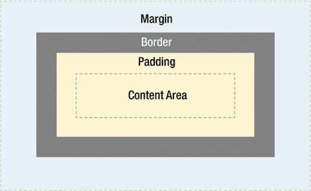

###### 图 3-1。盒子模型的插图

内容区域周围应用了填充。如果向元素添加背景，它将应用于由内容和填充形成的区域。因此，填充通常用于在内容周围创建一个装订线，使其看起来不会与背景边缘齐平。添加边框会在填充区域的外部应用一条线。这些线条有多种样式，如实线、虚线或虚线。边框之外是边距。边距是框的可见部分之外的透明空间，允许您控制页面中元素之间的距离。

另一个可以应用于框但不影响其布局的属性是 outline 属性，它在元素的边框周围绘制一条线。它不影响框的宽度或高度，在调试复杂布局或演示布局效果时会很有用。

填充、边框和边距是可选的，默认值为零。然而，用户代理样式表将为许多元素提供边距和填充。例如，默认情况下，标题总是有一些边距，尽管这些边距因浏览器而异。您当然可以在自己的样式表中覆盖这些浏览器样式，或者在特定的元素上，或者通过使用一个重置的样式表，如第二章所讨论的。

### 盒子尺寸

默认情况下，框的宽度和高度属性指的是*内容框*的宽度和高度——由元素的呈现内容的边缘形成的矩形。添加边框和填充不会影响内容框的大小，但会增加元素框的整体*大小。如果您希望一个边框为 5 像素、两边填充为 5 像素的框的总宽度为 100 像素，则需要将内容的宽度设置为 80 像素，如下所示。如果盒子周围也有 10 像素的边距，它将占据总共 120 像素宽的空间(见图 3-2 )。*

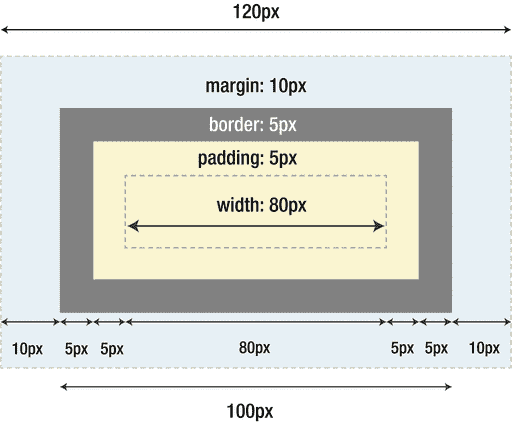

###### 图 3-2。默认的盒子模型。width 属性适用于内容区域

```html
.mybox {
**width: 80px;** 
  padding: 5px;
  border: 5px solid;
  margin: 10px;
}
```

您可以使用 box-sizing 属性更改计算框宽度的方式。框大小的默认值是 content-box，并应用到目前为止描述的行为。然而，让宽度和高度属性不仅仅影响内容框是非常有用的，尤其是在响应式布局中。

###### 注意

在某些浏览器中，某些表单控件元素(如 input)可能有不同的框大小默认值。这是由于与传统行为的兼容性，在传统行为中，不可能更改填充或边框等内容。

如果将 box-sizing 属性的值设置为 border-box，如下所示，那么 width 和 height 属性将包括框的填充和边框所需的空间(参见图 3-3 )。边距仍然影响元素在页面上占据的总大小，但仍然不包括在宽度中。使用这些规则，您可以实现如图 3-2 所示的整体布局:

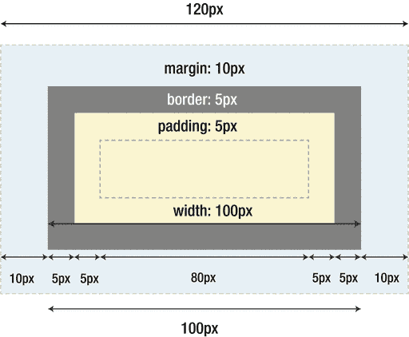

###### 图 3-3。当 box-sizing 属性设置为 border-box 时的框模型。width 属性现在对应于元素可见部分的整个宽度

```html
.mybox {
  box-sizing: border-box;
**width: 100px;** 
  padding: 5px;
  border: 5px;
  margin: 10px;
}
```

那么这为什么有用呢？从很多方面来说，这是一种更直观的处理盒子的方式，事实上，在 IE6 之前的旧版本的 Internet Explorer 中，盒子模型就是这样工作的。它是“直观的”,因为当你仔细想想，这就是盒子在现实世界中的工作方式。

想象一个 CSS 盒子就像一个包装箱。盒子的壁作为一个边界，并提供视觉定义，而填充物在里面保护内容。如果框需要特定的宽度，添加更多的填充或增加墙的厚度会侵蚀可用的内容空间。现在，如果您需要在堆叠盒子之前将它们隔开，每个盒子之间的空间(实际上是边距)对盒子本身的宽度没有影响，或者实际上对可用内容空间的大小没有影响。这感觉像是一个更合理的解决方案，所以很遗憾浏览器开发者，包括微软在 IE 后续版本中，决定走不同的方向。

幸运的是，box-sizing 属性允许我们覆盖默认行为并简化 CSS 布局中的一些常见模式。举以下例子:

```html
<div class="group">
  <article class="block">
  </article>
</div>
```

如果我们想确保任何。块在我们的。组始终是其包含列宽度的三分之一，我们可以应用以下规则:

```html
.group .block {
  width: 33.3333%;
}
```

这将工作得很好，直到我们开始添加水槽使用 adding 对我们的边。块，使其内容远离可见边缘。现在我们的。块元素是父元素的三分之一。group 元素的宽度加上填充，这可能会破坏我们想要的布局。图 3-4 说明了不同之处。

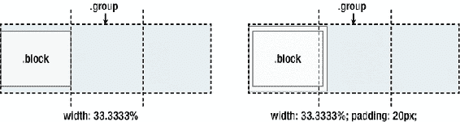

###### 图 3-4。假设我们想要。块元素是。组元素，当我们向它添加填充时，可能会得到意外的结果

例如，我们可以通过添加额外的内部元素来解决这个问题，或者我们可以选择不同的框大小属性来改变宽度的计算方式(参见图 3-5 ):

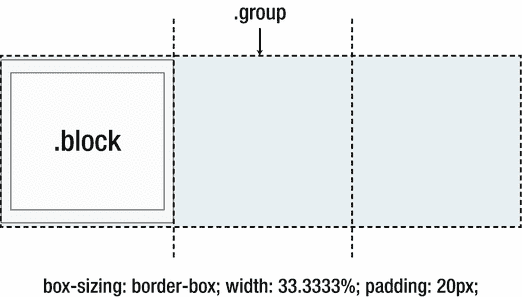

###### 图 3-5。添加框尺寸:即使添加了填充，border-box 也将我们的框保持在 33.3333%的宽度

```html
.group .block {
  width: 33.3333%;
**box-sizing: border-box;** 
**padding: 20px;** 
}
```

现在我们的。block 元素的宽度正好是父元素宽度的三分之一，正如我们声明的那样，无论我们向它添加多少填充或边框。

填充、边框和边距可以应用于元素的所有边或单个边。边距也可以为负值。这可以以多种有趣的方式用于将元素拉入或拉出页面的位置。我们将在后面的章节中探讨这些技术。

您可以使用 CSS 规范中的任何长度度量(如像素、ems 和百分比)来为元素添加填充和边距。使用百分比值有一些值得一提的特点。假设加价和上一个例子中的一样，那么这个例子中的 5%实际上代表了什么？

```html
.block {
  margin-left: 5%;
}
```

答案是，在这种情况下，它是父项宽度的 5%。组元素。如果我们假设。组元素的宽度为 100 像素，它的左边有 5 像素的边距。

当使用这些尺寸来测量元素顶部和底部的填充或边距时，猜测百分比是从父元素的*高度*得出的是情有可原的。这乍一看似乎很合理——然而，由于高度通常没有声明，并且可以随着内容的高度而变化，CSS 规范规定填充和边距的顶部和底部值也从包含块的*的*宽度*中取值。在这种情况下，包含块是父块，但是这是可以改变的——我们将在本章的前面一点说明这意味着什么。*

### 最小值和最大值

有时，对元素应用最小宽度和最大宽度属性可能很有用。这样做在实践响应式设计时特别有用，因为它允许块级框默认情况下自动填充其父元素的宽度，但不会收缩到小于 min-width 中指定的值，也不会增长到大于 max-width 中指定的值。(我们将在第八章回到响应式网页设计，以及它与 CSS 的关系。)

类似地，也存在最小高度和最大高度属性，尽管在 CSS 中应用任何高度值时应该小心，因为元素从它们包含的内容中隐式地导出它们的高度几乎总是更好。否则，如果内容量增加或文本大小改变，内容可能会流出固定高度的框。如果你因为某种原因需要设置一个默认的高度，使用最小高度通常会更好，因为它可以让你的框随着内容扩展。

## 可视化格式模型

了解了盒子模型之后，我们可以开始探索一些可视化的格式和定位模型。

人们通常将 p、h1、article 等元素称为块级元素。这意味着它们是可视地显示为内容块或*块框*的元素。相反，诸如 strong、span 和 time 之类的元素被描述为内联级元素，因为它们的内容在行内显示为*内联框*。

使用 display 属性可以更改生成的框的类型。这意味着您可以通过将 span 等内联级元素的 display 属性设置为 block，使其行为类似于块级元素。通过将元素的 display 属性设置为 none，也可以使元素根本不生成任何框。该框以及所有内容不再显示，也不占用文档空间。

CSS 中有许多不同的定位模型，包括浮动、绝对定位和相对定位。除非指定，否则所有盒开始时都位于正常流中，并具有默认的静态属性。顾名思义，元素框在正常流中的位置将由元素在 HTML 中的位置决定。

块级框将一个接一个地垂直出现；框之间的垂直距离由框的垂直边距计算。

内联框水平排列成一行，跟随文本流向，当文本换行时换行。可以使用水平填充、边框和边距来调整它们的水平间距(参见图 3-6 )。但是，垂直填充、边框和边距对内嵌框的高度没有影响。类似地，在内联框上设置显式的高度或宽度也不会有任何效果。

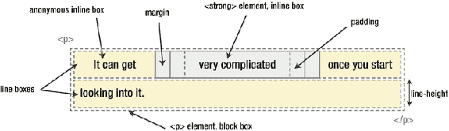

###### 图 3-6。段落块框内的内嵌组件

由一行文本形成的水平框被称为*行框*，一个行框对于它可能包含的所有行内框来说总是足够高。改变行框尺寸的唯一方法是更改行高，或者设置行框内任何行框的水平边框、填充或边距。图 3-6 显示了具有两行文本的段落的块框，其中一个单词在内联显示的< strong >元素内。

还可以将元素的 display 属性设置为 inline-block。顾名思义，该声明使元素水平排列，就像它是一个行内框一样。但是，盒子内部的行为就好像盒子是块级的，包括能够显式设置宽度、高度、垂直边距和填充。

当您使用表格标记(table、tr、th 和 td 元素等)时，表格本身表现为一个块，但是表格的内容将根据生成的行和列进行排列。还可以设置其他元素的 display 属性，以便它们采用表格的布局行为。通过以正确的方式应用值 table、table-row 和 table-cell，您可以实现 HTML 表格的一些属性，而无需在标记中使用表格。

像 Flexible Box Layout(也称为 *flexbox* )和 Grid Layout(我们将在后面的章节中介绍)这样的模块进一步扩展了显示属性。通常，这些新的布局模式创建的框在其外部环境中充当块，但创建了如何处理框内内容的新规则。

外部和内部显示模式之间的这种划分(在内嵌块、表格和新值(如 flex 或 grid)中都可以看到)现在正在显示级别 3 模块中进行标准化。在那里，显示模式的现有属性和关键字被扩展，以允许更细粒度的控制。重要的一点是，行内级别的框和块级别的框仍然是 HTML 元素默认行为的基础，但实际情况稍有不同。

### 匿名信箱

与 HTML 元素可以嵌套的方式一样，框可以包含其他框。大多数盒子都是由明确定义的元素组成的。但是，有一种情况，即使没有显式定义块级元素，也会创建块级元素—当您在块级元素(如 section)的开头添加一些文本时，如下所示。即使您没有将“some text”位定义为块级元素，它也会被视为块级元素。

```html
<section>
  some text
  <p>Some more text</p>
</section>
```

在这种情况下，盒子被描述为一个*匿名* *块* *盒子*，因为它不与一个特别定义的元素相关联。

块级元素中的文本行框也会发生类似的情况。假设您有一个包含三行文本的段落。每行文本形成一个*匿名行框*。您不能直接设置匿名块框或行框的样式，除非通过使用:first-line 伪元素，该元素显然用途有限，仅允许您更改与版式和颜色相关的某些属性。然而，理解你在屏幕上看到的一切都创造了某种形式的盒子是很有用的。

### 边距折叠

对于普通的块盒，有一种行为被称为*边距折叠*。边距折叠是一个相对简单的概念。然而，在实践中，当你设计一个网页时，它会引起很多混乱。简单来说，当两个或两个以上的垂直边距相遇时，它们将折叠形成一个单独的边距。此边距的高度将等于两个折叠边距中较大的一个的高度。

当两个元素在另一个之上时，第一个元素的底边将与第二个元素的上边一起折叠(见图 3-7 )。

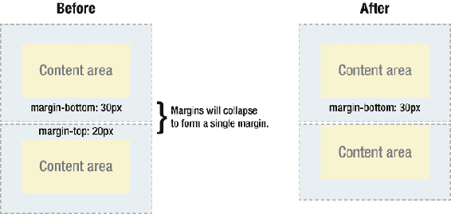

###### 图 3-7。元素的上边距与前一个元素的下边距一起折叠的示例

当一个元素包含在另一个元素中时，假设没有填充或边界分隔边距，它们的顶部和/或底部边距也将折叠在一起(参见图 3-8 )。

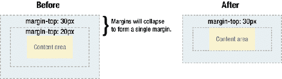

###### 图 3-8。元素的上边距与其父元素的上边距一起折叠的示例

乍一看，这似乎很奇怪，但利润率甚至会自行下降。假设您有一个空元素，它有边距，但没有边框或填充。在这种情况下，上边距接触下边距，它们一起折叠(见图 3-9 )。

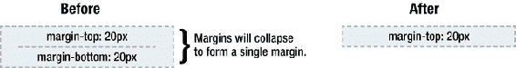

###### 图 3-9。元素的上边距与其下边距一起折叠的示例

如果此页边空白接触到另一个元素的页边空白，它将自行折叠(见图 3-10 )。

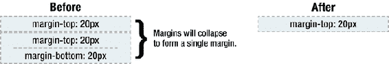

###### 图 3-10。一个空元素的折叠边距与另一个空元素的边距一起折叠的示例

这就是为什么一系列空的段落元素占用很少的空间，因为它们所有的边距都折叠在一起形成一个小的边距。

利润率下降乍一看似乎很奇怪，但实际上很有意义。取一个由几个段落组成的典型文本页面(见图 3-11 )。第一段上方的空间将等于段落的上边距。如果没有边距折叠，所有后续段落之间的间距将是它们两个相邻的上边距和下边距的总和。这意味着段落之间的间距将是页面顶部间距的两倍。随着页边距的折叠，每个段落之间的顶部和底部页边距也会折叠，使间距与其他地方的间距相同。

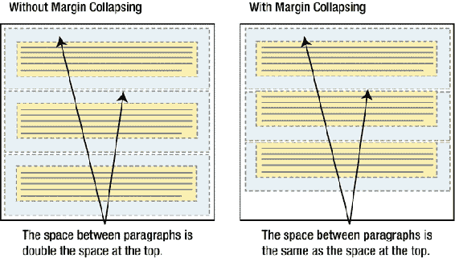

###### 图 3-11。边距折叠以保持元素之间的间距一致

在文档的正常流动中，边距折叠仅发生在块框的垂直边距上。内联框、浮动框或绝对定位框之间的边距永远不会缩小。

### 包含块

赋予元素包含块的*的概念很重要，因为它决定了如何解释各种属性，就像我们前面看到的用百分比设置填充和边距的情况。*

元素的包含块取决于元素的定位方式。如果元素有一个静态位置(与没有声明 position 属性相同)或相对位置，则它的包含块被计算到其最近的父元素的边缘，该父元素的 display 属性被设置为导致类似块的上下文的内容，包括 block、inline-block、table-cell、list-item 等。

默认情况下，当以百分比设置时，宽度、高度、边距和填充的声明是根据父元素的尺寸计算的。当您将元素更改为具有绝对或固定的定位模型时，这种情况会发生变化。接下来，我们将介绍不同的模型，以及它们如何与包含块的概念进行交互。

### 相对定位

当您将元素的 position 属性设置为 relative 时，它最初将完全停留在原来的位置。然后，通过使用 top、right、bottom 和 left 属性设置垂直或水平位置，可以相对于元素的起点移动元素。如果您将顶部位置设置为 20 像素，该框将出现在其原始位置顶部下方 20 像素处。将左侧位置设置为 20 像素，如下所示，将在元素左侧创建一个 20 像素的空间，将元素向右移动(参见图 3-12 )。

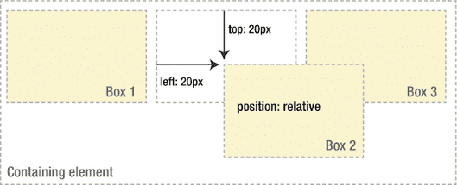

###### 图 3-12。相对定位元素

```html
.mybox {
  position: relative;
  left: 20px;
  top: 20px;
}
```

使用相对定位，无论是否偏移，元素都会继续占据页面流中的原始空间。因此，偏移元素会导致它与其他框重叠。

### 绝对定位

相对定位实际上被认为是正常流程定位模型的一部分，因为元素是相对于其在正常流程中的位置的。相比之下，绝对定位将元素从文档流中移除，因此不占用空间。文档正常流程中的其他元素将表现为绝对定位的元素从未出现过(见图 3-13 )。

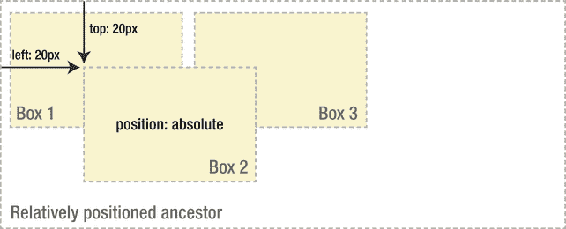

###### 图 3-13。绝对定位元素

绝对定位元素的包含块是其最近的定位祖先，这意味着 position 属性设置为 static 以外的任何值的任何祖先元素。如果元素没有定位的祖先，它将相对于文档的根元素 html 元素定位。这也被称为初始包含块。

与相对定位的框一样，绝对定位的框可以从其包含块的顶部、底部、左侧或右侧偏移。这给了你很大的灵活性。您可以将一个元素放在页面上的任何位置。

因为绝对定位的框被从文档流中取出，所以它们可能会与页面上的其他元素重叠。您可以通过设置一个名为 z-index 的数值属性来控制这些框的堆叠顺序。z 索引越高，盒子在堆栈中的位置就越高。当用 z-index 堆叠物品时，有各种各样的复杂情况需要考虑:我们将在第六章中对它们进行分类。

尽管绝对定位是布局页面元素的有用工具，但它很少用于创建高级布局。绝对定位的框不参与文档的流动，这使得创建适应和响应不同宽度和不同长度内容的视口的布局变得相当麻烦。网络的本质不允许我们精确地测量元素在页面上的位置。随着我们越来越精通 CSS 中的其他布局技术，绝对定位在页面布局中的使用已经变得相当少见了。

### 固定定位

固定定位是绝对定位的一个子类。不同之处在于固定元素的包含块是视口。这使您可以创建始终停留在窗口中相同位置的浮动元素。许多网站使用这种技术，通过将它们固定在侧栏或顶栏中的位置，使它们的导航部分始终可见(图 3-14 )。这有助于提高可用性，因为用户不必看很远就能回到界面的重要部分。

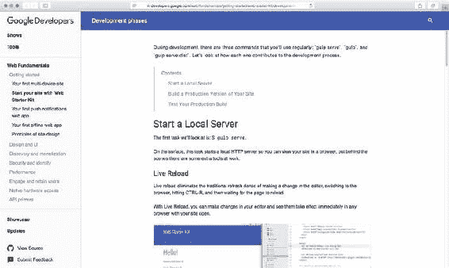

###### 图 3-14。当你向下滚动时，谷歌开发者文档的顶部栏和侧边导航保持不变

### 浮动的

另一个重要的视觉模型是浮动模型。浮动框可以向左或向右移动，直到其外边缘接触到其包含块或另一个浮动框的边缘。因为浮动框不在正常的文档流中，所以正常文档流中的块框几乎就像浮动框不存在一样。我们一会儿会解释“几乎”。

如图 3-15 所示，当您向右浮动框 1 时，它被从文档流中取出并向右移动，直到其右边缘接触到包含块的右边缘。它的宽度也会收缩到包含其内容所需的最小宽度，除非您通过设置特定的宽度或最小宽度/最大宽度明确地告诉它。

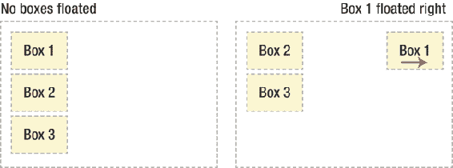

###### 图 3-15。元素右浮动的示例

在图 3-16 中，当您向左浮动框 1 时，它被从文档流中取出并向左移动，直到其左边缘接触到包含块的左边缘。因为它不再在流中，所以它不占用空间，实际上位于盒子 2 的顶部，从视图中隐藏了它。如果将所有三个框都向左浮动，框 1 将向左移动，直到接触到其包含的块，另外两个框将向左移动，直到接触到前一个浮动的框。

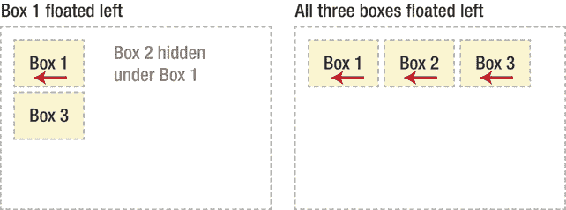

###### 图 3-16。向左浮动的元素示例

如果包含元素对于所有浮动元素来说太窄，以至于不能水平放置，那么剩余的浮动将下降，直到有足够的空间(参见图 3-17 )。如果被浮动的元素有不同的高度，当它们落下时，浮动可能会被其他浮动“卡住”。

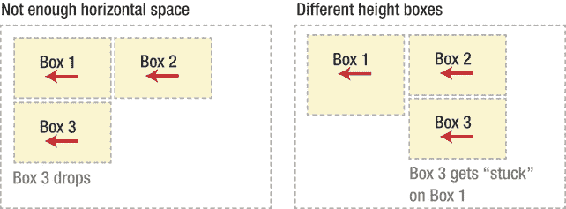

###### 图 3-17。如果没有足够的可用水平空间，浮动的元素将向下移动，直到有足够的水平空间

#### 线盒和清除

在上一节中，您了解了浮动一个元素会将它从文档流中移除，不再对非浮动项目产生影响。实际上，这并不完全正确。如果文档流中的一个浮动元素后面跟着一个元素，则该元素的框将表现为好像该浮动元素不存在一样。但是，框中的文本内容保留了浮动元素的一些内存，并移开以腾出空间。在技术术语中，浮动元素旁边的行框被缩短，以便为浮动元素腾出空间，从而围绕浮动框流动。事实上，创建浮动是为了让文本围绕图像流动(见图 3-18 )。

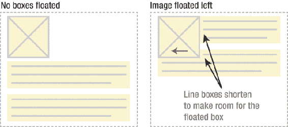

###### 图 3-18。行框在靠近浮动时会变短

要阻止线条框环绕浮动框的外部，需要对包含这些线条框的元素应用 clear 属性。clear 属性可以是 left、right、both 或 none，它指示框的哪一侧不应该靠近浮动框。许多人认为 clear 属性只是删除了一些否定先前浮动的标志。然而，现实要有趣得多。当你清除一个元素时，浏览器会在元素的顶部添加足够的边距，将元素的上边框边缘垂直向下推，越过浮动(见图 3-19 )。当您尝试将自己的边距应用于“已清除”的元素时，这有时会令人困惑，因为该值只有在达到并超过浏览器自动添加的值时才会生效。

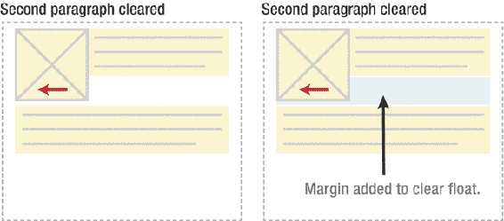

###### 图 3-19。清除元素的上边距，为前面的浮动创建足够的垂直空间

正如您所看到的，浮动元素被从文档流中取出，除了将行框缩短到足以为浮动框腾出空间之外，对周围的元素没有任何影响。但是，清除一个元素实质上是为所有前面的浮动元素清除一个垂直空间。这在使用浮动作为布局工具时很有用，因为它允许周围的元素为浮动的元素腾出空间。

让我们看看如何使用浮动创建一个简单的组件布局。假设您有一张图片，您希望它浮动在标题的左侧，一小块文本浮动在标题的右侧，这通常被称为“媒体对象”，因为常见的模式是有一段媒体(如图形、图像或视频)和一段伴随的文本。您希望此图片和文本包含在另一个具有背景颜色和边框的元素中。你或许可以试试这样的东西:

```html
.media-block {
  background-color: gray;
  border: solid 1px black;
}
.media-fig {
  float: left;
  width: 30%; /* leaves 70% for the text */
}
.media-body {
  float: right;
  width: 65%; /* a bit of "air" left on the side */
}
<div class="media-block">
  
  <div class="media-body">
    <h3>Title of this</h3>
    <p>Brief description of this</p>
  </div>
</div>
```

但是，因为浮动元素是从文档流中取出的，所以具有。media-block 不占用空间，它只有浮动的内容，因此在文档流中没有给它一个高度。如何可视化地让包装器包含浮动的元素？您需要在该元素内部的某个地方应用 clear，正如我们前面看到的，这在被清除的元素上创建了足够的垂直边距，以便为浮动的元素留出空间(参见图 3-20 )。不幸的是，由于示例中没有要清除的现有元素，您可以在结束 div 标记之前添加一个空元素，并清除:

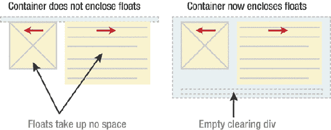

###### 图 3-20。添加一个清除 div 会强制容器包含浮动

```html
/* Added CSS: */
.clear {
    clear: both;
}
<div class="media-block">
      
      <div class="media-body">
        <h3>Title of this</h3>
        <p>Brief description of this</p>
      </div>
      <div class="clear"></div><!-- added extra empty div -->
</div>
```

这得到了我们想要的结果，但代价是在我们的标记中添加了额外的代码。通常会有一个现有的元素，您可以对其应用 clear，但有时您可能不得不硬着头皮为布局的目的添加无意义的标记。然而，在这种情况下，我们可以做得更好。

我们可以这样做的方法是使用:after 伪元素模拟额外的 clearing 元素，如下所示。通过将此应用到浮动元素的包含元素，将创建一个额外的框，您可以将清除规则应用到该框。

```html
.media-block:after {
  content: " ";
  display: block;
  clear: both;
}
```

这种方法和它的一些变体在尼古拉斯·加拉格尔的一小段代码中得到了最好的展示，这段代码被称为 micro clearfix，在[`nicolasgallagher.com/micro-clearfix-hack/`](http://nicolasgallagher.com/micro-clearfix-hack/)展示。

### 格式化上下文

CSS 有许多不同的规则，适用于元素在页面上水平或垂直流动时如何相互交互。这些规则集之一的技术名称是*格式化上下文*。我们已经看到了*内联格式上下文*的一些规则——例如，垂直边距对内联框没有影响。类似地，某些规则适用于块盒如何堆叠，就像我们在折叠边距一节中看到的那样。

其他规则定义了页面必须如何自动包含任何在末尾突出的浮动(否则浮动元素内的内容可能会在可滚动区域之外结束)，并且默认情况下所有块框的边缘都与包含块的左边缘对齐(或右边缘，取决于文本方向)。这组规则被称为*块格式化上下文*。

一些规则允许元素建立自己的内部块格式上下文。其中包括以下内容:

*   元素的 display 属性被设置为一个值，该值为元素的内容创建一个类似块的上下文，如 inline-block 或 table-cell。

*   float 属性不是 none 的元素。

*   绝对定位的元素。

*   将 overflow 属性设置为 visible 以外的任何内容的元素。

正如我们之前讨论的，块的边缘接触其包含块的边缘的规则甚至适用于前面有浮动的内容。浮动从页面流中移除，并通过触发跟随它的元素中的行框来缩短，从而产生为自己腾出空间的视觉效果。元素本身仍然在浮动之下伸展到它需要的程度。

当一个元素有触发一个新的块格式上下文*的规则，并且*在一个 float 旁边时，它将忽略这条规则，即它的边缘必须靠着它包含的块的边。相反，它会缩小以适应——不仅仅是线路盒，而是整个系统。这可用于重新创建。上一节中的媒体块示例，但规则更简单:

```html
.media-block {
  background-color: gray;
  border: solid 1px black;
}
.media-fig {
  float: left
  margin-right: 5%;
}
.media-block, .media-body {
  overflow: auto;
}
<div class="media-block">
  
  <div class="media-body">
    <h3>Title of this</h3>
    <p>Brief description of this</p>
  </div>
</div>
```

在设置溢出:自动；在两个容器上。媒体块和我们的。媒体主体元素，我们为它们建立了新的块格式化上下文。这有几个影响(见图 3-21 中的比较):

*   它包含在中的浮动图像。无需清除规则的媒体块组件，因为块格式化上下文也自动包含浮动。

*   作为一个额外的好处，它允许我们抛弃宽度的规则以及。media-body 元素，如果我们需要的话——它将简单地调整到浮动旁边的剩余空间，并且仍然在图像旁边保持一个漂亮的直边。如果没有新的格式上下文，并且文本有点长，则下面的任何行框都会浮动。media-fig 将在它的下面伸展，最后在图像的左边齐平。

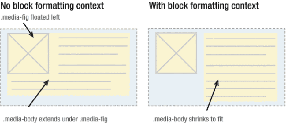

###### 图 3-21。要是。media-fig 元素是浮动的，并且文本足够长，一些行将在浮动下换行并结束于左侧。创建新的块格式化上下文强制。要收缩的媒体主体

创建尽可能具有可预测和简单行为的布局降低了代码的复杂性，增加了布局的健壮性，因此知道何时应用这样的技巧来避免浮动和清除元素之间的复杂交互是一件好事。幸运的是，更好的布局技术正在迅速普及。

### 内在和外在规模

CSS 模块“内部和外部大小调整级别 3”定义了一个关键字列表，可以应用于(最小和最大)宽度和高度属性，而不是以像素或百分比等为单位的长度。这些表示从周围上下文(外部)或元素内容(内部)派生的显式长度，但让浏览器计算出最终值，而不是将属性设置为 auto 或使用 floats 或 block 格式上下文创建收缩到适合的场景而根本不设置宽度的隐式值。

我们不会在这里深入讨论不同关键字的细节，但是有趣的是，我们在其中发现了包含浮动。这个关键字应该和你预期的差不多；例如，您可以使用以下代码使元素包含任何浮点:

```html
.myThing {
  min-height: contain-floats;
}
```

到目前为止，对这个模块中各种关键字的支持还很弱——最值得注意的是，在撰写本文时，没有任何版本的 IE 支持其中的任何一个。尽管如此，它在未来创建健壮的规模估算时可能非常有用，而不需要求助于更复杂的技术。

## 其他 CSS 布局模块

我们已经讨论了 CSS 可视化格式模型的基础和最常见的部分，但是还有一些其他的地方需要简单的提一下。

您可能会认为健壮灵活的布局模型是 CSS 这样的可视化表示工具的关键部分。你是对的。但不幸的是，我们花了很长时间才得到一个。从历史上看，我们使用语言中任何可用的特性来实现我们的目标，即使它们远不是工作的理想工具。最初这包括采用数据表，因为它们有用的布局特征——尽管它们有臃肿的标记和不恰当的语义。最近，我们一直在强制使用浮动和绝对定位来实现大多数复杂的页面布局，但同样，这些功能都不是为布局网页而设计的。两者都有严重的限制，其中大部分我们只是训练自己去忍受。

幸运的是，最近的 CSS 模块引入了新的内容模型，专门用于创建灵活和健壮的页面布局。在撰写本文时，这些模块都处于不同的就绪状态，有些还没有可互操作的跨浏览器实现。我们将在接下来的章节中详细讨论其中的一些，以及它们带来的一些更有用的技术，但这只是对它们所提供的功能的一个快速总结。

### 灵活的盒子布局

我们之前提到的 Flexible Box 布局模块，或者说 *flexbox* ，是 CSS 3 中引入的布局模型。Flexbox 允许您水平或垂直布局一个盒子的子项，并确定这些子项的大小、间距和分布。它还允许您更改元素在页面上呈现的顺序，而不管它们在 HTML 源代码中的位置。Flexbox 作为正常流模型(内嵌和块)的升级，在内容本身及其如何影响大小方面提供了精确控制和灵活性的平衡。

Flexbox 得到了广泛的应用，但是在旧版本的 Internet Explorer 中，这种支持明显缺失或不完整。好消息是，它的构造方式可以让你把它和其他方法结合起来，比如 floats，来创建非常健壮的布局。我们将在第六章中详细了解 flexbox。

### 网格布局

Grid layout 是第一个成熟的 CSS 高级布局工具，其目标是取代复杂的页面布局，这些页面布局过去是用浮动和定位元素创建的。它提供了布局与源代码顺序的完全分离，并从内容结构和单个模块的表示中抽象出网格系统的概念。其中 flexbox 是“微观”，网格布局是“宏观”，所以这两种方法很好的互补。

网格布局还没有得到广泛的支持，但是在本书编写的时候，浏览器制造商正在竞相实现它。我们将在第七章中了解这个强大的新模块。

### 多栏布局

多栏布局模块是允许内容流入不同栏的一种相当简单的方式；例如，创建一个类似报纸的布局，其中段落的文本排列成多个垂直的列。该模块允许您选择一组列数或一个首选宽度，并根据可用空间选择列数。您还可以控制列之间的间距，并对这些间距应用类似边框的视觉效果。由于多栏布局更多的是一种排版工具，而不是一般布局，我们将在第四章中讨论它。

### 地区

CSS 区域允许您指定内容如何在页面上的元素之间流动。一个元素充当内容的来源，但是该内容可以流入页面上其他位置的其他占位符元素，而不是正常的块流。这意味着布局不再受 HTML 源代码顺序的影响，布局表示也不再受内容结构的影响。

CSS 区域允许以前单独使用 CSS 不可能实现的布局，并可能在未来推动某些基于打印的布局模式的采用。然而，很少有浏览器制造商对 CSS 区域表现出任何喜爱，而且这种类型的布局在一段时间内可能还不够成熟。出于这个原因，我们在本书中将不再详细讨论区域。

## 摘要

在本章中，您学习了盒子模型以及填充、边距、宽度和高度如何影响盒子的尺寸。您还了解了边距折叠的概念以及它如何影响布局。向您介绍了 CSS 的各种格式模型，如正常流、绝对定位和浮动。您了解了内联框和块框之间的区别，如何在相对定位的祖先中绝对定位元素，以及清除是如何工作的。

既然你已经掌握了这些基本原则，让我们开始好好利用它们吧。在本书接下来的章节中，你将会了解到一些核心的 CSS 概念，你将会看到它们是如何被应用到各种实用的技术中的。所以，启动你最喜欢的编辑器，让我们开始编码吧。