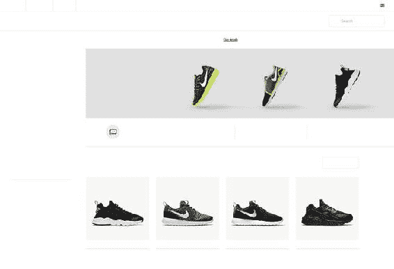

# 四、网络排版

自从印刷机发明以来，排版一直是平面设计的基本部分，所以你会期望它在网页设计领域发挥核心作用。有些人甚至说网页设计 95%是排版。因此，令人惊讶的是，浏览器直到最近才允许我们完全接受网页上的排版和排版。这为我们提供了从数百年的印刷历史中学习的可能性，并创造出样式丰富的内容，阅读起来令人愉悦。

以前版本的 CSS 掌握不包含一个单独的网页排版章节，所以也许这给了你一些过去几年在这个领域的进步。在本章中，我们将涉及许多领域:

*   如何使用基本的 CSS 字体和文本属性应用实心排印规则

*   控制度量、多栏文本和断字

*   使用自定义 web 字体和高级字体功能

*   使用阴影和其他技巧的文本效果

## CSS 中的基本排版

大多数设计师要做的第一件事就是添加基本的印刷样式。从 body 元素开始，向下发展到越来越具体的规则，我们为可读性、清晰性和音调设置了基础。作为本章的第一个例子，我们将这样做:选取一个示例页面并应用基本的排版处理。

图 4-1 显示了一个非常简单的 HTML 文档(关于月球的文本，转载自维基百科),显示在浏览器中，没有添加样式。它仍然呈现为可读文档的事实是由于浏览器中的默认样式表，其中设置了一些相对合理的印刷规则。


###### 图 4-1。一个简单的 HTML 文档，还没有应用样式

我们的简单文档包含几个标题和一些文本段落(在适用的地方有一些行内元素来增强文本)，位于 article 元素中:

```html
<article>
  <h1>The Moon</h1>
  <p> The <strong>Moon</strong> (in Greek: σελήνη...</p>
  ...
  <h2>Orbit</h2>
  <p>The Moon is in synchronous…</p>
  ...
  <h3>Gravitational pull &amp; distance</h3>
  <p>The Moon's gravitational...</p>
  <h2>Lunar travels</h2>
  <p>The Soviet Union's Luna programme...</p>
  <p class="source">Text fetched from...</p>
</article>
```

虽然未样式化的文档是可读的，但它远非理想。我们的目标是创建一个相对较短的样式表，以帮助提高页面的可读性和美观性。在图 4-2 中，我们看到了我们想要的最终结果。


###### 图 4-2。应用了新字体属性的文档

让我们仔细检查每一个规则，分解术语，为什么制定规则，以及基本排版属性背后的 CSS 机制是如何工作的。

### 文本颜色

文本颜色可能是我们为文档设置的最基本的东西之一，但是我们很容易忽略它的效果。默认情况下，浏览器将大多数文本呈现为黑色(当然，链接除外；那些是充满活力的蓝色)，这与白色背景形成了非常高的对比度。足够的对比度对于可访问性至关重要，但也可能在另一个方向走得太远。事实上，屏幕的对比度非常高，以至于对于较长的文本来说，白底黑字会显得过于密集，影响可读性。

我们将标题设为默认的黑色，并将段落设置为非常暗的蓝灰色阴影。链接也仍然是蓝色的，但是我们会稍微调低一点活跃程度。

```html
p {
    color: #3b4348;
}
a {
   color: #235ea7;
}
```

### 字体系列

font-family 属性允许您按优先顺序列出您想使用的字体:

```html
body {
  font-family: 'Georgia Pro', Georgia, Times, 'Times New Roman', serif;
}
h1, h2, h3, h4, h5, h6 {
  font-family: Avenir Next, SegoeUI, arial, sans-serif;
}
```

body 元素(以及几乎所有其他元素，因为 font-family 是继承的)有一个字体堆栈，包括“Georgia Pro”，Georgia，Times，“Times New Roman”，serif。Georgia 是一种几乎普遍可用的衬线字体，其中较新的 Georgia Pro 变体安装在一些版本的 Windows 10 上。如果两个版本的 Georgia 都不可用，那么 Times 和 Times New Roman back 也存在于许多系统中。最后，我们回到通用系统 serif 字体。

对于标题，我们将 Avenir Next 列为我们的首选，这种字体有许多变化，预装在现代 Mac OS X 电脑和 iOS 设备上。如果这种字体不可用，浏览器会查找 Segoe UI，这是一种类似的多功能无衬线字体，存在于大多数版本的 Windows 电脑和 Windows Phone 设备上。如果浏览器找不到，它将尝试使用 Arial 字体(可在各种平台上使用)，最后使用任何通用的 sans-serif 字体作为当前平台的默认字体。

图 4-3 显示了这些字体在 Mac OS X 上的 Safari 9 中的外观，与 Windows 10 上的 Microsoft Edge 进行了比较。


###### 图 4-3。我们的页面在 Safari 9 上使用 Avenir Next 和乔治亚进行渲染(左)与在微软 Edge 上使用 Segoe UI 和乔治亚进行渲染(右)

###### 注意

衬线是字形笔画末端的小角度形状，常见于许多经典字体。无衬线只是指没有衬线的字体。

这种回退机制是 font-family 属性的一个重要特性，因为不同的操作系统和移动设备并不都有相同的可用字体。字体的选择也比字体是否存在更复杂:如果首选字体缺少文本中使用的字形，如重音字符，浏览器也将退回到字体堆栈中查找这些单独的字符。

关于各种操作系统上可用的默认字体的一些研究可以帮助您为项目选择正确的堆栈。你可以在 http://cssfontstacks.com 找到一个好的起点。

列表末尾定义的 sans-serif 和 seriffont 族被称为*通用族*，作为一个总括选项。我们也可以选择草书、幻想和等宽字体。serif 和 sans-serif 通用族可能是最常用于文本的族。当选择预格式化文本(如代码示例)的字体时，monospace 会尝试选择所有字符都具有相同宽度的字体，使字符跨行对齐。fantasy 和草书属类稍微不常见一些，但它们分别对应于更精致的装饰字体或类似笔迹的字体。

###### 注意

严格来说，您不需要将包含空格的字体系列名称放在引号中，但这样做是个好主意。该规范只要求在字体系列名称与通用系列名称相同的情况下使用引号，但是对于包含可能会在浏览器中出错的非标准符号的名称，也建议使用引号。如果不考虑其他因素，代码编辑器中的语法高亮器通常会更好地处理带空格的名字，如果它们被引用的话。

#### 字体和字体之间的关系

关于字体、字体系列和字体的术语会变得非常混乱。*字样*(也称为*字体族*)是字母、数字和其他共享一种样式的字符的形状(也称为*字形*)的集合。对于每个字形，字体可以有几种不同的变体，包括粗体、正常体和轻体、斜体、不同的数字显示方式、将几个字符组合成一个字形的连字以及其他变体。

最初，*字体*(或*字体面*)是一种字体的特定变体的所有字形的集合，被铸造成金属片。这些收藏品随后被用于机械印刷机。在数字世界中，我们用这个词来表示保存字体表示的文件。假设的字体“CSS Mastery”可以只是一个字体文件，也可以由包含“CSS Mastery Regular”、“CSS Mastery Italic”、“CSS Mastery Light”等的几个字体文件组成。

### 字体大小和行高

几乎所有浏览器的默认字体大小都是 16 像素，除非用户改变了他们的偏好。我们保留了默认的字体大小，而是选择使用 em 单位来调整特定元素的大小:

```html
h3 {
  font-size: 1.314em; /* 21px */
}
```

用于 font-size 时，em 单位是继承了 font-size 的元素*的比例因子。例如，对于我们的 h3 元素，大小是 1.314 * 16 = 21px。我们也可以将字体大小设置为 21px，但是 ems 更灵活一些。大多数浏览器允许用户缩放整个页面，即使是像素也能很好地工作。使用 ems，如果用户仅改变他们偏好中的默认字体大小，测量也可以缩放。*

由于 em 单位基于继承的大小进行缩放，我们也可以通过调整父元素的大小来缩放页面的一部分的字体大小。另一方面——也是使用 ems 的棘手之处——是我们不希望仅仅因为它在标记中的位置就意外地扩展它。考虑以下假设的样式规则:

```html
p {
  font-size: 1.314em;
}
article {
  font-size: 1.314em;
}
```

前面的规则意味着默认情况下，p 和 article 元素的字体大小都是 21px。但这也意味着，作为 article 元素的子元素的 p 元素的字体大小将为 1.314em × 1.314em，大约为 1.73em 或 28px。这可能不是设计中的意图，所以当使用相对长度时，您需要跟踪尺寸计算。

当谈到字体大小时，我们可以用百分比来代替 ems。设置 133.3%和用 1.333em 完全一样，用哪个是个人喜好问题。作为最后的灵活测量，我们可以使用 rem 单位。它是一个缩放因子，就像 em 一样，但是总是基于根元素 em 的大小进行缩放(因此得名 rem)，这意味着在 html 元素上设置的字体大小。我们使用了 rem 单位来为所有标题获得一致的页边距上限值:

```html
h1, h2, h3, h4, h5, h6 {
  margin-top: 1.5rem; /* 24px */
}
```

当 ems 用于盒子模型尺寸时，它与继承的字体大小无关，而是与元素本身的计算字体大小有关。因此，这种测量对于所有标题级别都是不同的。为了获得一致(但灵活)的值，我们需要使用 rem，或者在 ems 中为每个标题级别单独计算边距。

rem 单元相对较新，可以在所有现代浏览器中工作。作为 Internet Explorer 8(以及更早版本)等旧浏览器的后备，我们可以利用 CSS 的容错能力，在基于 rem 的声明之前声明一个边距的像素度量:

```html
h1, h2, h3, h4, h5, h6 {
  **margin-top: 24px;** /* non-scalable fallback for old browsers */
  margin-top: 1.5rem; /* 24px, will be ignored by old browsers */
}
```

###### 警告

还有基于物理尺寸的*绝对*测量单位，如 mm、cm、in 和 pt，主要用于打印样式表。这些不应该用于屏幕样式。我们不会在这里讨论打印样式表，但是会在第八章中讨论如何针对不同的媒体类型。

#### 带刻度的字体大小

在决定使用哪种字体时，并没有硬性规定选择哪种字体。最重要的是要确保文本足够大以便阅读，然后努力找到在当前上下文中有意义的大小。一些人喜欢观察它，而另一些人相信测量是基于数学关系的。

我们将三个标题的大小松散地建立在一个被称为“完美第四”的数学尺度上每个增加的标题级别都是其自身大小比前一个级别大四分之一，或者(以反比关系表示)是其下一个级别的 1.3333333 倍。然后将尺寸四舍五入以匹配最接近的像素尺寸，并截断到三位小数:

```html
h1 {
  font-size: 2.315em; /* 37px */
}
h2 {
  font-size: 1.75em; /* 28px */
}
h3 {
  font-size: 1.314em; /* 21px */
}
```

当开始设计工作时，像这样的规模可以是一个很大的帮助，即使你最终通过感觉设置最终测量。你可以在[`www.modularscale.com/`](http://www.modularscale.com/)的模块化比例计算器中摆弄一堆不同的预设比例(见图 4-4 )。


###### 图 4-4。模块化比例计算器允许您使用字体和数学大小比例的组合

### 行距、对齐和线盒的剖析

当我们为文本设置额外的尺寸时，我们将开始看到各种印刷概念之间的关系。因此，有必要更深入地了解 CSS 内联格式模型，以及更多的印刷术语——至少当它应用于西方书写系统时。图 4-5 展示了组成一行文本的各个部分，使用了我们例子中第一段的前两个单词。


###### 图 4-5。内联格式模型的组成部分和技术术语

```html
<p>The <strong>Moon</strong>…[etc]</p>
```

我们在第三章中看到了内联格式的高级视图。每行文本生成一个*行框*。这个框可以通过表示内联元素(比如本例中的<强>元素)或者它们之间的*匿名内联框*，进一步分成几个*内联框*。

文本绘制在内嵌框的中间，即所谓的*内容区域*。内容区域的高度是字体大小测量的定义——在图 4-5 中“月亮”一词的后面，我们看到一个 1em × 1em 的正方形，以及它与字形本身大小的关系。给 em 单元命名的传统印刷术语“em”源于大写字母“M”的大小，但正如我们所见，这不是 web 印刷中的正确定义。

小写字母如“x”的上边缘决定了所谓的 *x 高度*。不同字体之间的高度差异很大，这解释了为什么很难给出准确的字体大小的一般建议——你需要用实际的字体进行测试，看看感觉大小是多少。在我们这里使用的 Georgia 中，x-height 相当高，使得它看起来比其他相同字体尺寸的字体要大。

然后，实际的字形被放置成在内容区域内的某个地方垂直平衡出现，这样，默认情况下，每个行内框在靠近底部的一条公共线上对齐，这条公共线被称为*基线*。字形也不一定受内容区域的约束:例如，在某些字体中，小写的“g”可能会突出显示在内容区域的下面。

最后，行高定义了行框的总高度。这通常被称为*行距*，或者在排印术语中，*行距*(发音为“ledding”)，这是由于在印刷机上用于分隔字符行的铅字排字机块。与 mechanical 类型不同，CSS 中的前导始终应用于行框的顶部和底部。

从总行高中减去字体大小，得到的尺寸分成两个相等的部分(称为*半前导*)。如果字体大小为 21px，行高为 30px，每条半行距将为 4.5px 高。

###### 注意

如果一个行框包含不同行高的行框，行框的行高作为一个整体将至少与最高的行框一样高。

#### 设置行高

当设置行高时，我们需要考虑什么对当前字体有意义。在我们的文章示例中，我们为 body 元素设置了基本字体系列 Georgia 和 1.5 的行高:

```html
body {
    font-family: Georgia, Times, 'Times New Roman', serif;
    line-height: 1.5;
}
```

行高通常在 1.2 到 1.5 之间。当你调整这个值时，你需要找到这些线既不太拥挤也不太间隔和不连接的地方。一般来说，x 高度较大的文本可以容忍更大的行间距，就像我们在 Georgia 的文本集一样。文本的长度和字体大小也很重要:较短的较小文本通常可以处理更紧凑的行高值。

我们用一个无单位的 1.5 来设置行高，简单来说就是当前字体大小的 1.5 倍。正文的字体大小为 16px，默认行高为 24px。

可以使用像素、百分比或 ems 来设置行高，但请记住，body 的所有子体都将继承该值。一个可能的“陷阱”是，即使对于百分比和 em，继承的行高也是行高的*计算的*像素值，而对于无单位值则不是这样。通过省略单位，我们确保特定元素的行高作为乘数被继承，总是与其字体大小成比例。

#### 竖向定线

除了行高之外，内联框还会受到垂直对齐属性的影响。默认值为 baseline，这意味着元素的基线将与父元素的基线对齐。在文章的最后，我们引用了在维基百科上查找的日期，其中序数“rd”后缀用一个 span 标记:

```html
<time datetime="2016-02-23">the 23**<span class="ordinal">**rd**</span>** of February 2016.</time>
```

我们将使用 vertical-align 和 super 关键字为该文本设置一个上标对齐方式(以及一个稍小的字体大小):

```html
.ordinal {
**vertical-align: super;** 
  font-size: smaller;
}
```

其他可能的关键字有 sub、top、bottom、text-top、text-bottom 和 middle。它们都或多或少地与内容区域和父行框有着复杂的关系。仅举一个例子，text-top 或 text-bottom 将内容区域的顶部或底部与父行框的内容区域对齐，这仅在内联框的字体大小或行高与父行框不同时才有效。就像我们说的:复杂。

也许更直观的方法是将元素基线的垂直对齐方式从父基线向上或向下移动一个设定的长度——以像素为单位，或者相对于字体大小的长度(例如 em 或%)。值得注意的是，不仅行高值会影响一段文本的最终行距。如果行框中有一个使用垂直对齐移动的项目，该元素将推出最终的行框高度。图 4-6 显示了当通过不同的垂直对齐值移动元素时，我们文章中的一行文本会发生什么。


###### 图 4-6。可以与 vertical-align 一起使用的各种关键字和值。请注意线条框的顶部和底部是如何被最大值推出的，从而增加了该线条的整体行高

###### 注意

与内联文本相比，内联块和图像对垂直对齐的反应略有不同，因为它们不一定有自己的单一基线。当我们在第六章中查看一些布局技巧时，我们将利用这一点。

### 字体粗细

接下来，我们使用 font-weight 属性设置标题的权重。一些字体有许多变化，如 Helvetica 新光，Helvetica 新光粗体，Helvetica 新光黑色，等等。我们没有声明字体变体的名称，而是使用关键字(普通、粗体、粗体和浅体)或数值。数值被写成偶数，从 100 开始，然后是 200、300、400 等等，直到 900。

normal 的默认值映射为 400，bold 为 700，这是大多数字体中最常见的粗细。关键字 bolder 和 light 的工作方式稍有不同，用于使文本比继承的值更重或更轻。

值 100–300 通常分别映射到名称中带有“细”或“细线”、“超轻”和“轻”的字体。相反，值 800 或 900 将映射到名称中包含“超粗体”、“粗体”或“黑色”字样的字体。介于 500(中等)和 600(半粗体或半粗体)之间。

作为标题的默认设置，我们将中等粗细设置为 500，对于超粗体 h1 元素和半粗体 h2 元素有所不同:

```html
h1, h2, h3, h4, h5, h6 {
**font-weight: 500;** 
}
h1 {
**font-weight: 800;** 
}
h2 {
**font-weight: 600;** 
}
```

Avenir Next 和 Segoe UI(我们最喜欢的字体)都包含很多粗细变化。如果字体缺少所需的粗细，它可能会尝试模仿更粗的粗细，但不会比正常粗细。遗憾的是，人工加粗字体的效果往往不太理想。

### 字体样式

设置声明字体样式:italic 从字样中选择斜体样式，如果有字样的话。如果没有，浏览器会试图通过倾斜字体来伪造——同样，结果往往不太理想。斜体通常用于强调或区分不同语调的事物。在我们的例子中，我们用标签*包装了月球的拉丁和希腊名字。这个标记最初是早期 HTML 实现的表示标记的残余，但在 HTML5 中被重新定义，用于标记传统的斜体文本，如名称。*

```html
<p>The <strong>Moon</strong> (in Greek: σελήνη **<i lang="el">Selene</i>**, in Latin: **<I lang="la">Luna</i>**)
```

虽然标签*不表示*斜体，但是浏览器默认样式表将字体样式设置为斜体:

```html
i {
**font-style: italic;** 
}
```

如果我们愿意，我们可以重新定义这个元素，使其显示为粗体、非字母化的文本:

```html
i {
  font-weight: 700;
**font-style: normal;** 
}
```

除了斜体和默认的正常值，您还可以使用倾斜关键字(倾斜文本的另一种变体)，但这很少使用，因为很少有字体附带倾斜样式。

### 转换大小写变体

有时设计要求文本以不同于 HTML 源代码的形式显示。CSS 允许您通过文本转换属性对此进行一些控制。在我们的示例中，h1 在标记中被写成大写(首字母大写)，但是通过 CSS 被强制显示为大写(参见图 4-7 ):


###### 图 4-7。我们的 h1 显示为大写

```html
h1 {
**text-transform: uppercase;** 
}
```

除了大写值之外，您还可以指定 lowercase 使所有字母小写，大写使每个单词的第一个字母大写，或 none 将大小写恢复为 HTML 中创作的默认大小写。

#### 使用字体变体

CSS 还有一个名为 font-variant 的属性，它允许你为你的字体选择所谓的小型大写字母。Small-caps 是字体的一种变体，其中小写字母显示为大写(或大写)字母的形状已经“缩小”到它们的大小。适当的小型大写字母变体对字母形状有更大的尊重，而不仅仅是简单地缩小它们，但这些变体大多出现在更独特的字体系列中。如果没有这样的字体，浏览器会试图为你伪造。我们可以在我们的文档中包含缩写“NASA”的缩写标签上说明这一点(见图 4-8 ):


###### 图 4-8。使用字体变量关键字 small-caps 使浏览器将大写字形向下收缩到 x 高度

```html
<abbr title="National Aeronautics and Space Administration">NASA</abbr>
```

我们将把它与 text-transform: lowercase 规则一起应用，因为 HTML 源代码中的字母已经是大写的了。最后一个调整是将 abbr 元素设置为稍微小一点的行高，因为在某些浏览器中，小型大写字母似乎会将内容框向下推，从而影响整个行框的高度。

```html
abbr {
  text-transform: lowercase;
  font-variant: small-caps;
  line-height: 1.25;
}
```

CSS 2.1 规范将 small-caps 定义为 font-variant 属性的唯一有效值。在 CSS 字体模块级别 3 规范中，这一点已经扩展到包括大量表示选择替代字形的方式的值。浏览器在采用这些方面进展缓慢，但幸运的是有更好的支持方式来实现这一点；我们将在下一节高级排版技术中讨论它们。

### 改变字母和单词之间的间距

改变单词和单个字符之间的间距通常最好留给字体的设计者。CSS 确实允许你用一些粗糙的工具来改变这一点。

word-spacing 属性很少使用，但正如您可能猜到的那样，它会影响单词之间的间距。你给它的值指定了从默认的*间距增加或减少多少，由当前字体中的空白字符宽度决定。以下规则将*将*0.1 毫米添加到段落中单词之间的默认间距:*

```html
p {
  word-spacing: 0.1em;
}
```

同样，您可以使用 letter-spacing 属性影响每个字母之间的间距。对于小写文本，这通常不是一个好主意——大多数字体都是为了让你在阅读时一次识别整个单词的形状而设计的，所以打乱间距会使文本难以阅读。大写(或小型大写)字形更适合单独解释，就像首字母缩写词的情况一样。一点额外的间距实际上可以使它们更容易阅读。让我们通过给我们的缩写标签增加一点字母间距来尝试一下(见图 4-9 ):


###### 图 4-9。应用于 abbr 元素的少量字母间距

```html
abbr {
  text-transform: lowercase;
  font-variant: small-caps;
**letter-spacing: 0.1em;** 
}
```

这是我们最后的字体相关设置和小的排版调整。接下来，我们将关注文本如何布局，以进一步确保良好的阅读体验。

## 小节、节奏和节奏

我们下一个关注的领域是使文本读起来愉快的一个关键因素:行的长度。在印刷术语中，这被称为*度量*。过长或过短的线条会扰乱读者在文本中的眼球运动，会导致读者迷失方向，甚至完全放弃文本。

对于什么是完美的线长度，没有确切的答案。这取决于字体的大小、屏幕的大小以及正在显示的文本内容的类型。我们所能做的是参考关于行长度一般规则的研究和历史建议，并尝试将它们合理地应用到我们的页面中。

Robert Bringhurst 的经典著作*The Elements of Typographic Style*指出，正文通常设置在 45 到 75 个字符之间，平均约为 66 个字符。在将这个建议应用到网络上时，排版专家 Richard Rutter 发现这个范围在网络上也很有效——至少在大屏幕上是这样。在非常小的屏幕(或在远处观看的大屏幕，如电视或投影)的情况下，尺寸与到屏幕的距离相结合可能保证短至 40 个字符的度量。

###### 注意

我们将在第八章回到响应式网页设计的排版挑战。

可以通过在包围文本的元素上或者在标题、段落等上设置宽度来实现对行长度的约束。他们自己。

在我们的正文中，Georgia 字体有相对较宽的字母形式，这是 x 高度较大的结果。这意味着我们可以在更高的范围内进行测量。我们选择了简单的选项，将 article 元素的最大宽度设置为 36em(一个字符平均为 0.5em)，使其在页面上居中。如果视窗比这个更窄，元素会自动缩小。

```html
article {
  max-width: 36em;
  margin: 0 auto;
}
```

这使得我们的段落文本在更宽的视窗中的行长度约为 77 个字符，如图 4-10 所示。我们选择使用 ems 来应用宽度，这样即使我们或者用户决定改变字体大小，也可以很好地缩放尺寸。


###### 图 4-10。article 元素的最大宽度被限制为 36em，即使我们增加了字体大小

### 文本缩进和对齐

默认情况下，我们的文本将被设置为左对齐。文本的左边缘保持平直有助于眼睛找到下一行，保持阅读速度。对于一段接一段的段落，通常要么在一行之间使用空白，要么少量缩进文本，以强调从一个段落到下一个段落的转换。在设置文章文本时，我们选择了后者，使用相邻的兄弟组合符和 text-indent 属性:

```html
p + p {
**text-indent: 1.25em;** 
}
```

文本的右边缘非常不均匀(见前面的图 4-9 )，我们暂时让它保持原样。这种不均匀的形状在印刷术语中被称为“rag”(如“ragged”)。末端边缘参差不齐并不是一种灾难，但是在对除了非常短的文本之外的任何内容使用居中对齐之前，您应该仔细考虑。居中文本最适合小块用户界面文本(如按钮)或短标题，但两边参差不齐会破坏可读性。

然而，我们已经将样本页面的 h1 居中。我们还给它加了一个底部边框，让它在视觉上锚定到下面的文章文本，如图 4-11 所示。


###### 图 4-11。我们已经将 h1 居中对齐

```html
h1 {
**text-align: center;** 
  border-bottom: 1px solid #c8bc9d;
}
```

text-align 属性可以接受几个关键字值，包括 left、right、center 和 justify。CSS 文本级别 3 规范定义了一些额外的值，包括开始和结束。这两个*逻辑方向*关键字对应于文本的书写模式:大多数西方语言是从左向右书写的，因此如果文档语言是英语，则起始值将表示左对齐，结束值将表示右对齐。在从右向左的语言中，如阿拉伯语，这将是相反的。如果您在父元素上设置了 dir="rtl "属性，大多数浏览器也会自动反转默认的文本方向，以指示从右向左的文本。

text-align 属性也可以使用值 justify，分布单词之间的间距，以便文本与左右边缘对齐，消除不规则的右边。这是印刷媒体中的一种常见技术，在这种情况下，可以调整副本、断字和字体属性，以匹配页面上的空间。

网络是一种不同的媒介，它的准确呈现取决于我们无法控制的因素。不同的屏幕尺寸、不同的字体安装和不同的浏览器引擎都会影响用户查看我们页面的方式。如果你使用对齐的文本，它可能会看起来很糟糕，变得很难阅读，如图 4-12 所示。空白的“河流”可能会在你的文本中形成，尤其是当小节减少的时候。


###### 图 4-12。文本对齐的文本段落:对齐会导致单词之间出现“河流”

浏览器用来对齐文本的默认方法是一种相当笨拙的算法，其结果不如桌面出版软件中的精确。使用的算法类型可以通过 text-justify 属性进行更改，但是对各种值的支持很少，并且主要涉及如何调整除大多数西方书写系统之外的其他语言类型的字母形式和单词。

有趣的是，Internet Explorer 支持该属性的非标准值报纸，它似乎使用了一种更聪明的算法，在字母和单词之间分配空白。

### 用连字符号连接

如果你仍然想让页面中的文字对齐，断字可以在一定程度上帮助消除河流。您可以使用­ HTML 实体在标记中手动插入软连字符。该连字符只有在浏览器需要断开它以适合该行时才可见(见图 4-13 ):


###### 图 4-13。用软连字符手动断字

```html
<p>The <strong>Moon</strong> […] is Earth's only natural satel**&shy;**lite.[…]
```

对于像一篇文章这样的较长文本，你不太可能仔细检查并手动断字。使用连字符属性，我们可以让浏览器来完成这项工作。它仍然是一个相对较新的特性，所以大多数支持它的浏览器都需要厂商前缀。Internet Explorer 版之前的版本，Android 设备上的股票 WebKit 浏览器，以及令人惊讶的是，Chrome 和 Opera(在编写本文时)等基于 Blink 的浏览器根本不支持断字。

如果你想激活自动断字，你需要两段代码。首先，您需要确保设置了文档的语言代码，通常是在 html 元素上:

```html
<html **lang="en"**>
```

接下来，将相关元素的连字符属性设置为 auto。图 4-14 显示了在 Firefox 中出现的结果。


###### 图 4-14。激活自动断字会在 Firefox 中显示更直的右边横条

```html
p {
 hyphens: auto;
}
```

要关闭断字功能，可以将连字符属性设置为手动值。手动模式仍然尊重软连字符。

### 在多列中设置文本

虽然对文章整体宽度的 36em 限制有助于限制尺寸，但它确实会在较大的屏幕上浪费很多空间。这么多未使用的空白！有时，为了更有效地使用更宽的屏幕，同时保持合理的度量，将文本设置在多列中是有意义的。CSS 多列布局模块的属性为我们提供了实现这一点的工具，将内容分成相等的列。

“多列布局”这个名称可能会有点误导，因为这组属性并不是指为一个*页面*的不同部分创建具有列和间距的通用布局网格，而是指页面的一部分内容像报纸一样以列的形式流动。尝试将它用于其他目的肯定是可能的，但也许不可取。

如果我们将最大宽度增加到 70em，我们可以放入三列。我们可以通过将 columns 属性设置为所需的最小列宽来告诉文章自动将内容排列成列(参见图 4-15 )。列间距由列间距属性控制:


###### 图 4-15。文章内容现在会自动流入 70em 最大宽度范围内的尽可能多的列中，只要它们的最小宽度为 20em

```html
article {
**max-width: 70em;** 
**columns: 20em;** 
**column-gap: 1.5em;** 
  margin: 0 auto;
}
```

columns 属性是设置列数和列宽属性的简写。如果只设置列数，浏览器将生成一定数量的列，而不考虑宽度。如果设置列宽*和计数*，列宽作为最小值，而计数作为最大列数。

```html
columns: 20em; /* automatic number of columns as long as they are at least 20em */
column-width: 20em; /* same as above */

columns: 3; /* creates 3 columns, with automatic width */
column-count: 3; /* same as above */

columns: 3 20em; /* at most 3 columns, at least 20em wide each */

/* the following two combined are the same as the above shorthand: */
column-count: 3;
column-width: 20em;
```

#### 后退宽度

为了避免在不支持多列属性的浏览器中出现过长的行，我们可以添加一些规则来设置段落本身的最大宽度。旧的浏览器将会显示一个单独的列，但是仍然容易阅读:

```html
article > p {
  max-width: 36em;
}
```

#### 列跨度

在前面的示例中，文章包装中的所有元素都流入列中。我们可以选择从那个流中剔除一些元素，迫使它们跨越所有列。在图 4-16 中，文章标题和最后一段(包含源链接)跨越所有列:


###### 图 4-16。第一个标题和最后一个段落跨越所有列

```html
.h1,
.source {
  column-span: all; /* or column-span: none; to explicitly turn off. */
}
```

如果我们选择让流中间的元素跨越所有列，文本将被分成几个垂直堆叠的基于列的流。在图 4-17 中，h2 元素被添加到先前的规则中，显示了标题前后的文本如何在它自己的一组列中流动。


###### 图 4-17。具有柱跨的元素:all 会将柱流分成几个垂直堆叠的柱集

几乎所有浏览器都支持多栏布局属性，IE9 和更早版本除外。尽管如此，一些警告仍然适用:

*   几乎每个浏览器都需要适当的供应商前缀来应用列属性。

*   在编写本文时，Firefox 根本不支持列跨度规则。

*   各种浏览器之间存在相当多的错误和不一致。大多数情况下，当元素跨列流动时，像边距折叠和边框呈现这样的事情会奇怪地发生。Zoe Mickley Gillenwater 有一篇关于这个和其他陷阱的文章:[。](http://zomigi.com/blog/deal-breaker-problems-with-css3-multi-columns/)

#### 垂直节奏和基线网格

我们已经提到了排版中尺寸之间的一些数学关系是如何帮助它走到一起的。例如，我们使用“完美的第四”尺寸作为标题尺寸的基础。我们还为所有标题设置了一个通用的页边距-上限值 1.5 雷姆，等于一行正文的高度，并对各列之间的间距再次使用了相同的度量。一些设计师坚信这些和谐的尺寸，让基线高度作为设计其余部分的节拍器。

在印刷设计中，紧密遵循这种节奏是很常见的，这样正文的行就会落在一个*基线网格*上，即使标题、引用或其他部分不时打破这种节奏。它不仅有助于扫描页面时的眼球运动，还有助于防止(薄)纸另一面上的打印线条在双面打印中穿透，因为相同的基线网格适用于两者。

在 Web 上，获得正确的基线网格要挑剔得多——尤其是在处理可变大小和用户生成的内容(如图像)时。至少在某些情况下尝试是有意义的，比如多栏文本。在图 4-18 中，我们可以看到，由于标题的原因，各列的基线并没有完全对齐。


###### 图 4-18。我们的多栏布局，叠加了基线网格。有些部分不合节奏

让我们调整标题的边距，使两个标题级别的上边距、行高和下边距之和等于基线行高值的倍数。这样，基线应该在所有三列中对齐。

```html
h2 {
  font-size: 1.75em; /* 28px */
  line-height: 1.25; /* 28*1.25 = 35px */
  margin-top: 1.036em; /* 29px */
  margin-bottom: .2859em; /* 8px */
}
h3 {
  font-size: 1.314em; /* 21px */
  line-height: 1.29; /* 1.29*21 = 27px */
  margin-top: .619em; /* 13px */
  margin-bottom: .38em;/* 8px */
}
```

最初，所有标题的行高值都是 1.25，但是为了简化计算，我们已经覆盖了这个值。总的来说，上边距和下边距的划分多少是通过感觉来完成的。重要的是，这两条规则的总和是基线高度的倍数:h2 为 72px，h3 为 48px。所有三列中正文文本的基线现在应该对齐了(参见图 4-19 )。


###### 图 4-19。多栏文章，现在设置了垂直节奏，以便所有段落都落在基线网格上

## 网页字体

到目前为止，在这一章中，我们已经把自己限制在本地安装在用户计算机上的字体。常见的网络字体如 Helvetica 字体、佐治亚字体和 Times New Roman 字体之所以常见，恰恰是因为它们传统上可以在流行的操作系统如 Windows 和 Mac OS X 上使用

多年来，设计者希望能够从网络上嵌入远程字体，就像他们可以将图像嵌入网页一样。自 1997 年 Internet Explorer 4 发布以来，这种技术就已经存在，但直到 2009 年 Firefox、Safari 和 Opera 引入类似技术后，才出现了良好的跨浏览器支持。

从那以后，网络字体被大量采用。最初在小型博客和个人网站上进行试验，随后大公司甚至政府组织(例如，见图 4-20 )都采用了定制的网络字体。


###### 图 4-20。http://www.gov.uk 网站使用了由 Margaret Calvert 和 Henrik Kubel 设计的自定义字体

### 批准

处理网络字体的另一个复杂因素是许可。最初，字体代工厂对于允许个人浏览器下载他们的字体非常谨慎。人们担心这会导致对他们字体的不可控制的盗版，这种担心需要几年时间才能消除。

大多数在网上提供字体的铸造厂都要求对如何提供字体有一定的安全限制。例如，他们可能只允许从具有特定域名的站点下载链接到的字体，或者要求服务器上的字体名称定期更改以避免字体的热链接。

###### 网络字体托管服务

如果您还没有开始尝试自定义字体，最简单的方法就是使用 web 字体服务。像 Adobe type kit([`typekit.com`](http://typekit.com))、cloud . typography(【http://www.typography.com/cloud】)和 Fonts.com()这样的商业服务负责托管和提供网络字体的所有细节。还有谷歌字体([`www.google.com/fonts`](https://www.google.com/fonts))，谷歌从一系列字体代工厂收集并托管免费使用的字体。

这些在线服务处理与铸造厂的不同许可交易，以及将字体转换为正确文件格式的困难工作，确保包含正确的字符集并进行良好的优化。然后，他们从可靠的高速服务器上托管和提供这些字体。

选择托管服务允许您单独许可字体以供一次性使用，或者作为字体资源库订阅的一部分。托管服务消除了处理网页字体的大量痛苦，让你可以专注于网页中字体的设计和使用。

### @font-face 规则

嵌入式 web 字体的关键是@font-face 规则。此规则允许您指定供浏览器下载的字体在 web 服务器上的位置，然后允许您在样式表的其他地方引用该字体:

```html
@font-face {
  font-family: Vollkorn;
  font-weight: bold;
  src: url("fonts/vollkorn/Vollkorn-Bold.woff") format('woff');
}
h1, h2, h3, h4, h5, h6 {
  font-family: Vollkorn, Georgia, serif;
  font-weight: bold;
}
```

前面的@font-face 块中的代码声明，当样式表使用字体系列值 Vollkorn 和粗体字时，应用此规则，然后提供一个 URL 供浏览器下载包含粗体字的 Web 开放字体格式(WOFF)文件。

一旦声明了这个新的 Vollkorn 字体，就可以在样式表的普通 CSS 字体系列属性中使用它。在前面的例子中，我们选择对页面上的所有标题元素使用粗体 Vollkorn 字体。

#### 字体文件格式

尽管现在所有主流浏览器对 web 字体的支持都非常好，但对一致字体文件格式的支持却不太好。字体格式的历史悠久而复杂，并且与微软、苹果和 Adobe 等公司的历史紧密相连。幸运的是，所有的浏览器制造商现在都支持标准化的 WOFF 格式，有些甚至支持新的更高效的 WOFF2。如果你需要支持 IE8 和更早的版本，Safari 的旧版本，或者旧的 Android 设备，你可能需要用额外的文件格式来补充你的代码，比如 SVG 字体，EOT 和 TTF。

###### 小费

如果你有网络字体使用许可的字体，你可以使用在线工具创建这些额外的格式，如字体松鼠([`fontsquirrel.com`](http://fontsquirrel.com))。

为了处理这种不一致的支持，@font-face 规则能够接受 src 描述符的多个值(很像 font-family 的工作方式)以及 format()提示，让浏览器来决定哪个文件最适合下载。

使用这个特性，我们可以通过@font-face 规则获得对 web 字体的几乎通用的跨浏览器支持，如下所示:

```html
@font-face {
  font-family: Vollkorn;
  src: url('fonts/Vollkorn-Regular.eot#?ie') format('embedded-opentype'),
       url('fonts/Vollkorn-Regular.woff2') format('woff2'),
       url('fonts/Vollkorn-Regular.woff') format('woff'),
       url('fonts/Vollkorn-Regular.ttf') format('truetype'),
       url('fonts/Vollkorn-Regular.svg') format('svg');
}
```

这涵盖了所有支持 EOT、WOFF(包括 WOFF2)、TTF 和 SVG 的浏览器，也就是说几乎现在使用的所有浏览器。它甚至解释了 IE6–8 中的古怪行为，通过声明带有 querystring 参数的第一个 src 值。这种模式被称为“Fontspring @font-face 语法”，在[`www . font spring . com/blog/further-hardening-of-bullet-syntax`](http://www.fontspring.com/blog/further-hardening-of-the-bulletproof-syntax)中有详细的记录，以及它所考虑的格式和边缘情况。

###### 注意

在 IE6–8 中使用 web 字体时，尤其是在使用同一字样的几种变体时，还会遇到一些问题。这里我们就不细说了，但是你可以从 Typekit 的这篇文章中找到更多的背景:[`blog . type kit . com/2011/06/27/new-from-type kit-variation-specific-font-family-names-in-ie-6-8/`](http://blog.typekit.com/2011/06/27/new-from-typekit-variation-specific-font-family-names-in-ie-6-8/)。我们还在随书附带的代码示例中记录了变通方法。

在其余使用 web 字体的示例中，我们将只使用 WOFF 和 WOFF2 格式——通过使用这些格式，我们可以支持大多数浏览器，同时保持代码简单。

#### 字体描述符

@font-face 规则接受许多声明，其中大部分是可选的。最常用的有

*   font-family:必选，字体系列的名称。

*   src:必选，URL 或 URL 列表，可以在其中获得字体。

*   字体粗细:可选的字体粗细。默认为正常。

*   字体样式:可选的字体样式。默认为正常。

重要的是要明白，这些不是你应用于常规规则集的相同字体属性——它们实际上根本不是常规属性，而是*字体描述符*。我们并没有改变任何关于字体的东西，而是解释了当在样式表中使用时，这些属性的哪些值应该触发这个特定字体文件的使用。

如果字体粗细在这里设置为粗体，这意味着“当这个字体系列中的某个设置的字体粗细设置为粗体时，使用这个块中的文件。”一个缺陷是，如果这是 Vollkorn 唯一可用的*实例，它也将用于其他权重，尽管不是正确的权重。这是浏览器如何加载和选择字体的规范的一部分:正确的字体系列高于正确的权重。*

许多 typefaces 有不同的字体以适应不同的粗细、样式和变体，所以您可能有几个不同的@font-face 块引用指向不同文件的字体族名称 Vollkorn。在下面的例子中，我们加载了两种不同的字体，并声明了每种字体的粗细和样式:

```html
@font-face {
  font-family: AlegreyaSans;
  src: url('fonts/alegreya/AlegreyaSans-Regular.woff2') format('woff2'),
       url('fonts/alegreya/AlegreyaSans-Regular.woff') format('woff');
  /* font-weight and font-style both default to "normal". */
}
@font-face {
  font-family: Vollkorn;
  src:  url('fonts/vollkorn/Vollkorn-Medium.woff') format('woff'),
        url('fonts/vollkorn/Vollkorn-Medium.woff') format('woff');
  font-weight: 500;
}
@font-face {
  font-family: Vollkorn;
  font-weight: bold;
  src:  url('fonts/vollkorn/Vollkorn-Bold.woff') format('woff'),
        url('fonts/vollkorn/Vollkorn-Bold.woff') format('woff');
}
```

然后，我们可以在样式表的其他地方使用正确的字体文件，方法是声明我们需要的变体:

```html
body {
  font-family: AlegreyaSans, Helvetica, arial, sans-serif;
}
h1, h2, h3, h4, h5, h6 {
  font-family: Vollkorn, Georgia, Times, 'Times New Roman', serif;
  font-weight: bold; /* will use the Vollkorn Bold font. */
}
h3 {
  font-weight: 500; /* will use the Vollkorn Medium font. */
}
```

将这些样式应用于我们在月球文章示例中使用的相同标记，我们得到了不同的外观，其中用于正文的 Alegreya sans-serif 字体系列与用于标题的 serif Vollkorn 形成了对比(见图 4-21 )。h1 和 h2 现在使用 Vollkorn Bold 字体文件，而 h3 自动使用 Vollkorn Medium，因为字体粗细匹配 500。


###### 图 4-21。应用了新字体的文章示例

###### 警告

在加载 web 字体时，一个常见的错误是在@font-face 块中加载粗体字体，并将其字体粗细描述符设置为 normal，然后将其用于 font-weight 属性设置为 bold 的元素。这导致一些浏览器认为这种字体没有合适的加粗变体，让他们在原来的加粗字体上加上“假加粗”。

在前面的例子中，我们可以看到字体系列的机制是如何与我们的新字体相结合的:原来 Alegreya Sans 字体不包含任何希腊字母，这些字母出现在月亮的翻译名称中(见图 4-22 )。对于这些字形，使用备用字体—在本例中为 Helvetica。从两种字体中不同的 x 高度可以明显看出这一点。


###### 图 4-22。希腊字形使用字体系列堆栈中的备用字体。请注意 x 高度略有不同

坏消息是，我们没有为 Alegreya 加载斜体字体文件，对于缺失的字体样式，浏览器使用基于正常样式的“假斜体”。当我们查看文章最后的来源参考段落时，这一点变得更加清晰(见图 4-23 )。


###### 图 4-23。*我们文章底部的假斜体文本*

幸运的是，Alegreya 包含了各种各样的变体，所以如果我们添加一个指向正确文件的新的@font-face 块，这个问题应该会为任何已经设置为 font-style: italic 的正文文本自行解决(见图 4-24 ):


###### 图 4-24。现在用真正的斜体

```html
@font-face {
  font-family: AlegreyaSans;
  src: url('fonts/alegreya/AlegreyaSans-Italic.woff2') format('woff2'),
       url('fonts/alegreya/AlegreyaSans-Italic.woff') format('woff');
  font-style: italic;
}
```

### Web 字体、浏览器和性能

虽然网页字体为网页设计提供了一个相当大的飞跃，但它们的应用带有一定的免责声明。

很明显，下载额外的字体会增加用户的页面总重量。你首先要考虑的是限制你需要加载多少字体文件。同样非常重要的是，如果您托管自己的自定义字体，您必须应用适当的缓存头以最小化网络流量。但是，关于浏览器如何将字体实际呈现到屏幕上，还有其他一些考虑因素。

下载 web 字体时，浏览器有两种文本内容选择。首先，它可以阻止在屏幕上显示文本，直到网络字体已经下载并可供使用，这被称为不可见文本的*闪光*(或 FOIT)。这是 Safari、Chrome 和 Internet Explorer 默认显示的行为，它可能会导致用户无法阅读您站点的内容，因为字体下载速度很慢。对于在慢速网络连接上浏览的用户来说，这可能是一个特别的问题，如图 4-25 所示。



###### 图 4-25。等待字体下载时，[`www.nike.com`](http://www.nike.com)上的一个页面

浏览器的另一个选择是在等待浏览器下载 web 字体时，以备用字体显示内容。这避免了缓慢的网络阻止内容的问题，但也有一个权衡，你得到了回退字体的闪光。这种闪现有时被称为无样式文本的闪现，或 FOUT。

这种无样式文本的闪烁会影响可感知的性能，尤其是当备用字体的规格与您试图加载的首选 web 字体不同时。如果在下载和应用字体时页面内容跳跃太多，用户可能会失去他们在页面中的位置。

如果您使用 web 字体，您可以选择通过 JavaScript 加载字体，以进一步控制使用哪种方法，以及如何显示 web 字体和回退字体。

### 用 JavaScript 加载字体

在最近的 CSS 字体加载规范中定义了一个用于加载字体的实验性 JavaScript API。遗憾的是，浏览器支持还不是特别广泛。相反，我们需要使用第三方库来确保一致的字体加载体验。

Typekit 维护一个开源的 JavaScript 工具，叫做 Web Font Loader([`github.com/typekit/webfontloader`](https://github.com/typekit/webfontloader))。这是一个小的库，在后台使用本地字体加载 API，并在其他浏览器中模拟相同的功能。它支持一些常见的 web 字体提供商，如 Typekit、Google Fonts 和 Fonts.com，但也允许您自己托管字体。

你可以下载这个库，或者从谷歌自己的服务器上下载，详情见[`developers . Google . com/speed/libraries/# we B- font-loader`](https://developers.google.com/speed/libraries/#web-font-loader)。

Web 字体加载器提供了许多有用的功能，但最有用的功能之一是确保字体加载的跨浏览器行为一致的能力。在这种情况下，我们希望确保缓慢加载的字体永远不会阻止用户阅读我们的内容。换句话说，我们希望在其他受支持的浏览器上启用 FOUT 行为。

Web 字体加载器为以下事件提供挂钩:

*   加载:字体开始加载时

*   活动:当字体完成加载时

*   无效:如果字体加载失败

在这个实例中，我们将把所有的@font-face 块移动到一个名为 alegreya-vollkorn.css 的单独样式表中，并把它放在一个名为 css 的子文件夹中。然后，我们将在示例页面的头部添加一小段 JavaScript 代码:

```html
<script type="text/javascript">
  WebFontConfig = {
    custom: {
        families: **['AlegreyaSans:n4,i4', 'Vollkorn:n6,n5,n7']**,
        urls: ['css/alegreya-vollkorn.css']
    }
  };
  (function() {
    var wf = document.createElement('script');
    wf.src = 'https://ajax.googleapis.com/ajax/libs/webfont/1/webfont.js';
    wf.type = 'text/javascript';
    wf.async = 'true';
    var s = document.getElementsByTagName('script')[0];
    s.parentNode.insertBefore(wf, s);
  })();
</script>
```

这段代码将下载 Web 字体加载器脚本本身，并配置我们使用的字体和变体(在代码中以粗体突出显示)。我们想要的变体在字体系列名称之后描述:n4 代表“正常样式，权重为 400”，等等。当在这个样式表中找到的字体被加载时，脚本会自动将生成的类名添加到 html 元素中。这样，您可以根据字体加载的当前状态来定制 CSS。

```html
body {
  font-family: Helvetica, arial, sans-serif;
}
.wf-alegreya-n4-active body {
  font-family:  Alegreya, Helvetica, arial, sans-serif;
}
```

这两个 CSS 规则意味着在 Alegreya 字体加载之前，我们将显示备用字体堆栈。然后，一旦 Alegreya 完成加载，加载器脚本将 wf-alegreya-n4-active 类添加到 html 元素，浏览器开始使用我们新下载的字体。现在，我们不仅可以看到跨浏览器的一致行为，还可以调整后备字体和网页字体的排版细节。

#### 匹配后备字体大小

当字体正在加载但尚未完成时，应用类似的规则，我们可以避开 web 字体和 fallbacks 之间的字体度量差异。这一点很重要，因为当 web 字体替换后备字体时，您希望这种大小变化尽可能地谨慎和不引人注意。

在我们的例子中，Alegreya 字体的 x 高度明显小于 Helvetica 字体和 Arial 字体(两者具有相似的度量)。通过稍微调整字体大小和行高，我们可以非常接近地匹配高度。类似地，我们可以通过稍微调整单词间距来调整字符宽度的差异。这样，我们最终得到的结果更接近于网页字体加载后的文本外观。

```html
.wf-alegreyasans-n4-loading p {
  font-size: 0.905em;
  word-spacing: -0.11em;
  line-height: 1.72;
  font-size-adjust:
}
```

###### 小费

如果您使用的是垂直节奏，那么在使用这种技术时，您可能需要在几个地方调整这些类型的属性，以便不同的字体大小仍然与基本尺寸相对应。

我们将使用 web 字体加载器的另一个目的是在 Web 字体加载后设置字体大小调整属性。此属性允许您指定 x 高度和字体大小之间的纵横比。在首选字体中缺少字形的情况下，将调整备用字体的大小以匹配该比例。这通常会降低到大约一半高(值为 0.5)，但它可能会有一点不同，使您的备用字体和您的首选 web 字体之间的差异非常明显。我们可以设置关键字 auto，让浏览器为我们完成这项工作，而不是手动测量并将这个值设置为一个数字:

```html
.wf-alegreyasans-n4-active body {
  font-size-adjust: auto;
}
```

在撰写本文时，Firefox 是唯一支持字体大小调整的浏览器，Chrome 在偏好标志后提供实验性支持。如果我们在 Firefox 中查看文章示例，如图 4-26 所示，我们可以看到希腊字形(在 Helvetica 看到的)现在与周围的 Alegreya 具有相同的高度。


###### 图 4-26。Firefox 显示了调整了 x 高度的 Helvetica 希腊字形

## 高级排版功能

OpenType 是微软和 Adobe 在 20 世纪 90 年代开发的一种字体格式，允许在字体文件中包含字体的附加特征和功能。如果您使用的字体文件包含 OpenType 特性(可以包含在。ttf，。otf 或者。woff/.woff2 文件)，您可以在大多数现代浏览器中控制一系列 CSS 功能。这些特征包括字距调整、连字和替代数字，以及装饰性特征，如图 4-27 所示。


###### 图 4-27。“胖脸”字体上带有花式符号的“&”会议发言人的名字

CSS 字体规范有许多 OpenType 特性的目标属性，如字体字距调整、字体变体数字和字体变体连字。对这些目标属性的支持目前还不能跨浏览器使用，但有一些方法可以通过另一个更低级的属性(字体功能设置)来访问这些功能，该属性在许多现代浏览器中都有支持。通常，您最好两者都指定，因为有些浏览器可能支持目标属性，但不支持低级设置。

font-feature-settings 属性通过向其传递四个字母的 OpenType 代码(可选地带有一个数值)来接受切换某些功能集的值。例如，我们可以启用连字——将两个或更多字符组合成一个的字形——如图 4-28 所示。


###### 图 4-28。Vollkorn 中的两个文本集，第一个没有连字，第二个启用了连字。请注意“fi”、“ff”和“fj”对的区别

字体设计者可以指定几种类型的连字，这取决于它们是用于一般情况还是特殊情况。要启用 Vollkorn 字体中的两种连字，即标准连字*和 ?? 自选连字*，我们将使用以下规则:

```html
p {
  font-variant-ligatures: common-ligatures discretionary-ligatures;
  font-feature-settings: "liga", "dlig";
}
```

在支持 OpenType 的浏览器中，使用 font-variant-ligations 时，默认情况下总是启用标准连字，因此它们在第一个声明中被忽略。某些浏览器支持字体功能设置属性，但语法略有不同，而其他浏览器需要该属性的供应商前缀版本，因此打开常用和任意连字的完整规则是

```html
h1, h2, h3 {
  font-variant-ligatures: discretionary-ligatures;
  -webkit-font-feature-settings: "liga", "dlig";
  -moz-font-feature-settings: "liga", "dlig";
  -moz-font-feature-settings: "liga=1, dlig=1";
  font-feature-settings: "liga", "dlig";
}
```

语法差异需要解释一下:

*   影响 OpenType 特性的标准方式是在引号中使用它的四个字母的代码，后面可选地跟着一个关键字(开或关)或一个数字。这些代码指示功能的状态，如果您忽略它们(如前面的示例)，它们将默认为 on。

*   使用 0 表示状态也会关闭该功能。如果该功能只有开和关两种状态，则值为 1 会将其打开。一些功能有几个“状态”，可以通过为每个状态使用适当的数字来选择这些状态，这意味着什么取决于您想要激活的单个字体和功能类型。

*   当几个特性同时受到影响时，它们需要用逗号隔开。

*   大多数浏览器仍然将这些特性作为厂商前缀来实现，所以要确保包含这些特性。

*   一些 Mozilla 浏览器的旧语法略有不同:所有受影响的功能都以逗号分隔的方式命名在一个带引号的字符串中，状态受等号和数字部分的影响。

OpenType 特性代码的完整列表可以在微软 http://www.microsoft.com/typography/otspec/featurelist.htm 的[找到。在其余的例子中，我们将只使用字体特征设置的标准化形式以及目标特征属性。](http://www.microsoft.com/typography/otspec/featurelist.htm)

### 数码

有些字体包含多种不同情况下使用的数字样式。许多字体，如 Georgia 或 Vollkorn，默认使用旧式数字，数字和字母一样有上升和下降。Vollkorn 还包括内衬数字，其中数字位于基线上，与大写字母具有相同的一般高度。在图 4-29 中，我们使用以下代码在旧式数字和衬里数字之间进行了明确切换:


###### 图 4-29。衬里数字(上)与 Vollkorn 字体的旧式数字(下)

```html
.lining-nums {
  font-variant-numeric: lining-nums;
  font-feature-settings: "lnum";
}
.old-style {
  font-variant-numeric: oldstyle-nums;
  font-feature-settings: "onum";
}
```

大多数字体都有不同宽度的数字(比例数字)，就像普通的字母一样。如果您在表格或列表中使用的数字需要垂直对齐，您可能想要切换到表格数字。在图 4-30 中，我们将它们与衬里数字结合使用，配置如下:


###### 图 4-30。Alegreya Sans 中设置的表格衬里数字。右边的价格垂直排列，尽管宽度不同

```html
table {
  font-variant-numeric: tabular-nums lining-nums;
  font-feature-settings: "tnum", "lnum";
}
```

### 字距调整选项和文本呈现

高质量的字体内部通常有数据来调整某些字形对之间的间距。这个微调间距的过程被称为*字距调整*。这意味着一些字母对之间可能需要额外的空间，以使彼此看起来不太拥挤，一些甚至需要稍微重叠，以使彼此看起来不太远。在图 4-31 中可以看到一些常见字距对的例子，这里我们已经激活了 Alegreya 字体的字距。


###### 图 4-31。一个没有(上)和有(下)详细字距调整的句子。注意像“AT”、“Ad”和“Ta”这样的词对之间的空间是如何缩小的

浏览器中的文本呈现大多试图基于已知的度量自动处理这一点，但您也可以在许多现代浏览器中激活从单个字体读取详细的字距调整数据。我们通过设置字体字距微调属性或激活 kern OpenType 特性来触发它:

```html
.kern {
  font-kerning: normal;
  font-feature-settings: "kern";
}
```

关键字 normal 告诉浏览器从字体中获取字距调整数据(如果有)。auto 值允许浏览器在适当的时候打开它；例如，对于非常小的文本大小，它可能会被忽略。最后，您可以通过将该值设置为 none 来显式关闭它。

###### 注意

在某些浏览器中，激活其他 OpenType 功能(如连字)可能会自动触发使用字体的字距调整数据，因此如果您想要关闭字距调整但仍使用连字，则需要明确指定。相反，使用“字距”功能也可能会触发常用或标准连字的应用。

###### 避免文本呈现属性

设置声明 text-rendering:optimize legability 是同时激活字距调整和常用连字的另一个技巧。它不是任何 CSS 标准的一部分，而是 SVG 规范中的一个属性，告诉浏览器选择一种在 SVG 中呈现字母形状的方法。它可以优先考虑性能(optimizeSpeed)、更精确的形状(optimizeGeometricPrecision)或更可读的形状(optimizeLegibility)。

这个属性已经存在了一段时间，并且得到了很好的支持，所以经常可以看到站点使用它——在基于 WebKit 的旧浏览器支持字体功能设置之前，这是激活这些功能的唯一方法。但是，您应该知道，使用该属性会产生很多严重的渲染错误，所以您最好避免使用它。

## 文本效果

当涉及到网页排版的基础知识时，仍然有很多需要探索的地方，有些情况下，你可能会对标题和标识之类的东西着迷。在这一节中，我们将看看一些让你超越自我的技巧的例子，这些技巧可以创造出引人注目的效果，使你的网站与众不同。

### 使用和滥用文本阴影

CSS 文本阴影属性允许你在一段文本后面画一个阴影。对于较长的正文来说，这通常不是一个好主意，因为这会降低文本的可读性。对于标题或其他短文本，它确实有一些很好的用途，特别是用于创建“凸版印刷”一样的效果或重新创建传统绘画标志的阴影。

文本阴影的语法非常简单。您需要提供 x 轴和 y 轴相对于原始文本的偏移长度(正或负)、模糊距离的长度(其中 0 表示完全清晰的阴影)和颜色，所有这些都用空格分隔(参见图 4-32 ):


###### 图 4-32。一个简单的文本阴影 *应用了一些扩散。除 0 之外的任何扩散值都意味着阴影模糊*

```html
h1 {
  text-shadow: -.2em .4em .2em #ccc;
}
```

除此之外，您可以使用逗号分隔的阴影列表为一段文本创建多个阴影。应用多个阴影时，它们会堆叠在一起，定义的第一个阴影显示在顶部，其他阴影堆叠在它的后面，按照定义的顺序逐渐向下堆叠。

给一个文本添加多个阴影的能力使它成为一个多才多艺的效果。这可以让你模拟一种“凸版印刷”效果，通过添加一个较暗和一个较亮的阴影，在文本上方或下方突出来，字体看起来要么被压入页面，要么被凸起(见图 4-33 )。浅色和深色阴影的偏移量取决于文本是比背景更亮还是更暗:上面有浅色阴影、下面有深色阴影的深色文本通常会出现在页面中，反之亦然。


###### 图 4-33。简单的“凸版印刷”效果

以下代码示例说明了两种不同的效果:

```html
.impressed {
  background-color: #6990e1;
  color: #31446B;
  text-shadow: 0 -1px 1px #b3d6f9, 0 1px 0 #243350;
}
.embossed {
  background-color: #3c5486;
  color: #92B1EF;
  text-shadow: 0 -1px 0 #243350, 0 1px 0 #def2fe;
}
```

在多重阴影技术的基础上，我们可以创建看起来像伪 3D 阴影样式的字体，模仿手绘标牌的样式。添加大量清晰的阴影，其中每个阴影之间的对角线偏移为一个像素或更少，使我们能够实现这种效果:

```html
h1 {
  font-family: Nunito, "Arial Rounded MT Bold", "Helvetica Rounded", Arial, sans-serif;
  color: #d0bb78;
  text-transform: uppercase;
  font-weight: 700;
  text-shadow:
    -1px 1px 0 #743132,
    -2px 2px 0 #743132,
    -3px 3px 0 #743132,
    /* …and so on, 1px increments */
    -22px 22px 0 #743132,
    -23px 23px 0 #743132;
}
```

这给了我们在图 4-34 中看到的时髦的 70 年代样式。文本设置在 Nunito 中，从 Google 字体加载。


###### 图 4-34。随着偏移量的增加，大量的文本阴影会从文本中创建一个对角线阴影

为了进一步增加手绘标牌的感觉，我们可以应用一些效果。首先，我们可以用第一批白色阴影创建一个轮廓效果，因为标志画家通常会在字母和阴影之间留一些空间，这样他们可以更快地工作，因为字母中的油漆不必干燥，就可以移动到阴影中。我们将需要复制白色的阴影，并在所有方向上使用偏移，使其完全围绕字母。

其次，我们可以使用另一个技巧，使阴影看起来随着它的方向改变颜色，创造一个更加伪 3D 的外观，模拟照明方向。这是通过以交错的方式偏移各个阴影来实现的，其中颜色在较亮和较暗的颜色之间交替。这样，我们就利用它们的叠加来使一种颜色在水平方向更加突出，而另一种颜色在垂直方向更加突出。最终结果如图 4-35 所示。


###### 图 4-35。我们完成的阴影标题

下面是所描述的两个技巧的结果代码:

```html
h1 {
  /* some properties left out */
  text-shadow:
      /* first, some white outline shadows in all directions: */
       -2px 2px 0 #fff,
       0px -2px 0 #fff,
       0px 3px 0 #fff,
       3px 0px 0 #fff,
       -3px 0px 0 #fff,
       2px 2px 0 #fff,
       2px -2px 0 #fff,
       -2px -2px 0 #fff,
       /* …then some alternating shades that increasingly stick out in either direction: */
       -3px 3px 0 #743b34,
       -4px 3px 0 #a8564d,
       -4px 5px 0 #743b34,
       -5px 4px 0 #a8564d,
       -5px 6px 0 #743b34,
        /* ..and so on… */
       -22px 21px 0 #a8564d,
       -22px 23px 0 #743b34,
       -23px 22px 0 #a8564d,
       -23px 24px 0 #743b34;
}
```

在 Typekit Practice 网站([`practice.typekit.com/lesson/using-shades/`](http://practice.typekit.com/lesson/using-shades/))上可以找到一篇关于这种网络阴影和旧式标牌技术的深入文章，该网站也有大量其他学习网络排版艺术的资源。

几乎所有的浏览器都支持文本阴影属性，只有 IE9 和更早的版本没有支持。至于性能，如果支持的话，绘制阴影可能是非常昂贵的操作，所以你应该在你的设计中尽量少用阴影效果。

### 使用 JavaScript 增强排版

在某些情况下，纯粹的 CSS 并不能解决问题。例如，您可以使用:first-letter 伪元素定位一段文本的第一个字母，但是没有选择器可以单独定位其余的字母。例如，如果您希望每个字母都有不同的颜色，那么您唯一的选择就是用一个元素(比如一个)将每个字母包装起来，并以这些元素为目标。这种方法不太可行，尤其是如果您无法手动控制想要设置样式的元素的标记。

幸运的是，我们可以将这些视觉效果视为一种增强，并使用 JavaScript 自动创建额外的挂钩。lettering.js jQuery 插件([`letteringjs.com`](http://letteringjs.com))将会做到这一点。这个插件背后的一个人是设计者和开发者 Trent Walton。图 4-36 在他个人网站的一个标题中显示了在野外使用的 lettering.js。


###### 图 4-36。一个使用 lettering.js jQuery 插件的例子，来自[`trentwalton.com`](http://trentwalton.com)

有大量不同的基于 JavaScript 的解决方案可以帮助你调整文本。以下是一些例子:

*   fitText.js:来自 lettering.js(来自 agency Paravel)背后的同一个人的 jQuery 插件，用于根据页面大小调整文本大小( [`fittext.js`](http://fittext.js) )。

*   BigText.js:来自 Filament Group 的 Zach Leatherman 的一个脚本，它试图根据其容器([`github.com/zachleat/BigText`](https://github.com/zachleat/BigText))使一行文本尽可能大。

*   鳏夫:来自 Gridset.com 的内森·福特的一个脚本，它通过在距离段落结尾一定距离的单词之间插入不间断空格字符([`github.com/nathanford/widowtamer`](https://github.com/nathanford/widowtamer))来确保防止意外的寡妇。

###### 注意

SVG 实现了一些非常酷的文本效果，这通常超出了本书的范围。然而，在第十二章中，我们将会看到一些先进的视觉效果技术，其中包括使用 SVG 的可缩放文本的简要介绍。

## 进一步的类型灵感

网络上的字体设计是一个丰富的研究、实验和挑战极限的领域。有数百年的历史和传统可以探索，并研究我们可以应用什么以及我们如何在网络环境中明智地应用它。

罗伯特·布林赫斯特(Robert Bringhurst)所著的《排版样式的要素》(The Elements of Typographic Style)一书是排版方面的权威之一，该书记录并解释了这一传统的大部分内容。它谈到了我们在本章中讨论过的许多特性，比如垂直节奏，断字和单词间距的细微差别。

前面提到的 Richard Rutter 已经花时间思考如何将 Bringhurst 建立的一些最佳实践带到 Web 上。*应用于 Web 的排版样式元素*(【http://webtypography.net】)展示了如何使用 HTML 和 CSS 来应用排版传统的特性，如果你对如何为 Web 排版获得更详细的规则和实践感兴趣，这是非常值得一看的。

另一个很好的排版实践指南是 *Buttericks 的实用排版*，它解释了如何将建议翻译成 CSS，可以在 http://practicaltypography.com/的[买到。](http://practicaltypography.com/)

最后，杰克·吉尔特索夫的字体链接集“网络字体”([`typographyontheweb.com`](https://typographyontheweb.com))，是一个关于设计和代码的绝佳资源。

记住，如果你在网页上添加任何文本，那么你就是在排版。

## 摘要

在这一章中，我们已经学习了 CSS 中文本和字体属性的基础知识，以及如何使用它们来获得最大的可读性和灵活性的一些技巧。使用多列布局模块，我们以类似报纸的格式创建了文本集。我们看到了行高和其他间距属性中的系统距离如何让您将文字设置为垂直节奏。

我们研究了如何使用@font-face 规则加载自定义字体，以及影响加载哪个字体文件的各种参数。我们还快速了解了如何使用 Web 字体加载器 JavaScript 库来控制字体加载的感知性能。

我们看了一些更详细的 OpenType 选项，这些选项可用于增强印刷控制—连字、数字和字距—以及字体功能设置属性如何允许我们对如何打开或关闭这些功能进行低级控制。

最后，我们探索了一些尝试更激进的标题和海报字体排版技术的方法，使用文本阴影和 JavaScript 的进一步帮助。

在下一章，我们将看看如何为你漂亮的排版页面搭建舞台:使用图像、背景色、边框和阴影。