# 五、漂亮的盒子

在前面的章节中，你学习了 HTML 文档的每个元素都是由矩形框组成的:从保存页面结构部分的容器到段落中的文本行。然后，在最后一章中，您学习了如何设计页面文本内容的样式。

如果我们不能增强这些盒子的外观，或者用颜色、形状和图像来补充它们，网页设计就不会有创造性或灵活性。这就是背景、阴影和边框的 CSS 属性，以及通过 img 元素的内容图像和其他嵌入对象的来源。

在本章中，您将了解

*   背景颜色和不同种类的不透明度

*   使用背景图像和不同的图像格式

*   使用 calc()函数对长度进行数学计算

*   给你的盒子添加阴影效果

*   使用简单和高级边框效果

*   用 CSS 生成渐变

*   设置内容图像和其他嵌入对象的样式和大小

## 背景颜色

我们将从一个非常基本的例子开始，向整个页面的背景添加一种颜色。下面的代码将我们的背景设置为柔和的绿色:

```html
body {
  background-color: #bada55;
}
```

我们还可以使用 shorter background 属性设置背景颜色:

```html
body {
  background: #bada55;
}
```

这两个属性有什么区别？第二个是 background，它是一个简写属性，允许您同时设置许多其他与背景相关的属性。在前面的例子中，我们只在速记中声明了一个背景颜色，但是其他值(对于背景图像)也会受到影响——它们被重置为默认值。这可能会无意中覆盖您已经明确设置的内容，所以要小心使用它——我们将在本章的后面详细讨论它。

### 颜色值和不透明度

在前面的颜色示例中，我们用十六进制的符号设置值:一个哈希字符(也称为*八位数*、*英镑符号*或*数字符号*)后跟一个六字符的字符串。该字符串由三组两个字符组成，每组字符的范围为 0 到 F。十六进制意味着每个“数字”可以有 16 个不同的值，因此 0-9 由代表第 11 到第 16 个值的 A-F 来补充:

```html
0123456789ABCDEF
```

这三对代表颜色的红色、绿色和蓝色(RGB)值。每个颜色通道有 256 个不同的可能值，因此每个颜色通道有两个字符(16 × 16 = 256)。

所有三对颜色在两个地方都有相同的值，允许缩短为三个字符:#aabbcc 变成#abc，#663399 变成#639，依此类推。

###### 小费

您也可以使用许多可用的颜色关键字之一来指定颜色，如红色、黑色、蓝绿色、一枝黄花或暗海绿色。有一些非常奇怪的颜色关键字——它们源于一个名为 X11 的旧图形系统，开发人员依次从一盒蜡笔中选择一些颜色关键字！

很难找到任何好的理由来解释你为什么要使用这些关键字——除了可能为了调试的目的想快速地想出一种颜色。我们将通过使用更精确的方法向前推进。

设置 rgb 值可以用另一种方式完成，使用 RGB()函数符号。RGB 的每个值可以表示为数字(从 0 到 255)或百分比(0%到 100%)。以下是上一节中使用 rgb()符号的示例:

```html
body {
  background-color: rgb(186, 218, 85);
}
```

十六进制和 rgb()符号从 CSS 1 开始就存在了。最近，我们有了一些处理颜色的新方法:hsl()、rgba()和 hsla()。

首先，有 hsl()函数符号。十六进制和 RGB 表示法都是指计算机如何利用颜色在屏幕上显示它们——红、绿、蓝的混合。hsl()符号是指使用色调-饱和度-亮度(HSL)模型描述颜色的不同方式。色调从一个假设的*色轮*中获得其值(见图 5-1 )，其中颜色根据您选择的度数逐渐相互转换:红色在顶部(0 度)，绿色在周围的三分之一处(120 度)，蓝色在三分之二处(240 度)。

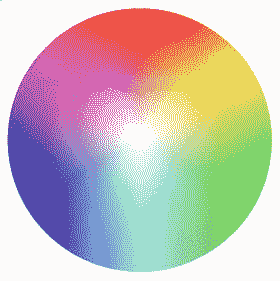

###### 图 5-1。HSL 色轮

如果你使用过任何类型的图形设计软件，你可能在颜色选择器中看到过一个色轮。要使用 hsl()语法，您需要向它传递表示您想要选择的圆的角度的度数，以及两个百分比。这两个百分比首先代表你想要在颜色混合中使用的“颜料”(饱和度)的数量，然后是亮度。下面是如何用 hsl()符号编写前面的代码:

```html
.box {
  background-color: hsl(74, 64%, 59%);
}
```

重要的是要注意，选择这两种方法中的任何一种来书写颜色值都没有本质上的区别:它们只是表示同一事物的不同方式。

下一个新的颜色符号是 RGB 的 turbo-powered 版本，称为 rgba()。“a”代表 *alpha* ，控制透明度的是 alpha 通道。如果我们想要和上一个例子一样的基本背景色，但是现在想要它有 50%的透明度，我们可以用下面的例子:

```html
.box {
  background-color: rgba(186, 218, 85, 0.5);
}
```

rgba()函数参数中的第四个值是 alpha 值，它是一个介于 1.0(完全不透明)和 0(完全透明)之间的值。

最后，还有 hsla()符号。它与 hsl()的关系与 rgb()与 rgba()的关系相同:您为 alpha 通道传递一个额外的值来选择颜色的透明度。

```html
.box {
  background-color: hsla(74, 64%, 59%, 0.5);
}
```

现在你知道了如何让颜色变得或多或少的透明，需要注意的是，在 CSS 中还有另外一种控制透明度的方法。这可以通过不透明度属性来实现:

```html
.box {
  background-color: #bada55;
  opacity: 0.5;
}
```

这会让我们。框元素的颜色和透明度与上一个示例相同。那么这里有什么不同呢？在前面的例子中，我们只将背景色设为透明，但是在这里我们将整个元素设为透明，*包括其中的任何内容*。当一个元素使用 opacity 设置为透明时，不可能使其中的子元素变得不透明。

实际上，这意味着具有透明度的颜色值非常适合制作半透明的背景或文本，而较低的不透明度会使整个元素淡出。

###### 警告

注意文字和背景颜色的对比！虽然这本书不是关于设计理论本身，但我们想强调的是，网页设计是关于你的用户能够接受你创建的网页上的信息。背景和文本颜色对比选择不当会影响在阳光下用手机访问你的网站的人，屏幕不好的人，视力受损的人等等。关于色彩对比的一个很好的资源是在 http://contrastrebellion.com/的现场对比反叛。

## 背景图像基础

添加背景色是创建更有趣页面的好工具。有时我们想更进一步，在我们的元素上使用图像作为背景，无论是微妙的图案，解释用户界面的象形图，还是给页面增加一些额外字符的更大的背景图形(见图 5-2 )。CSS 有很多工具可以做到这一点。

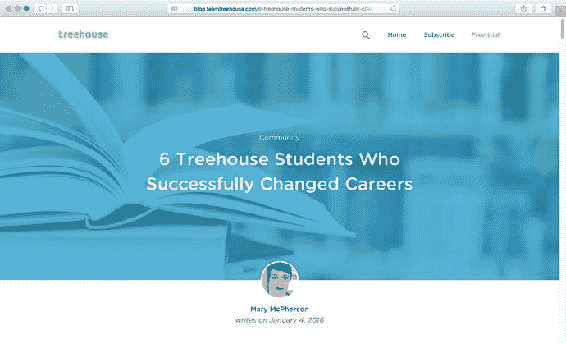

###### 图 5-2。https://teamtreehouse.com 上的博客使用了褪色和彩色的背景图片

### 背景图像与内容图像

首先:什么时候图像是背景图像？您可能知道有一个专门用于向网站添加内容图片的 HTML 元素:img 元素。我们如何决定在 CSS 中什么时候使用 img，什么时候使用背景图片？

简单的答案是，任何可以从网站上删除但仍然有意义的东西都应该作为背景图片来应用。或者换句话说:如果网站具有完全不同的外观和感觉，任何仍然有意义的东西都应该是内容图像。

可能会出现界限不清的情况，最终你为了达到特定的视觉效果而变通了规则。请记住，任何来自 img 元素的内容图片，如果纯粹是为了装饰你的网站，可能会出现在其他地方，在那里你的内容最好不要被打扰:例如，在 feed 阅读器和搜索结果中。

### 使用背景图像的简单示例

想象一下，我们正在设计一个页面，类似于 Twitter 或脸书等社交网站的个人资料页面上的大标题(见图 5-3 )。

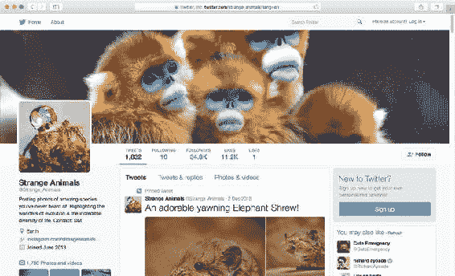

###### 图 5-3。[上一页简介*https://twitter.com*](https://twitter.com)

相反，我们的页面将是一个猫的社交网络，在这一章中，我们将使用各种属性来创建一个类似图 5-4 的头部组件。

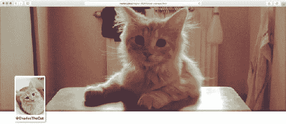

###### 图 5-4。带有文本和个人资料图片的巨型标题图像和个人资料框

首先，我们将添加一个默认的蓝灰色背景颜色和一个背景图像，以及一些尺寸到页面的大标题。如果图像加载失败，添加默认背景色很重要:

```html
.profile-box {
  width: 100%;
  height: 600px;
  background-color: #8Da9cf;
  background-image: url(img/big-cat.jpg);
}
```

该组件的 HTML 可能如下所示:

```html
<header class="profile-box">
</header>
```

这样做的结果可以在图 5-5 中看到:我们的图像被加载并平铺在整个轮廓框中。

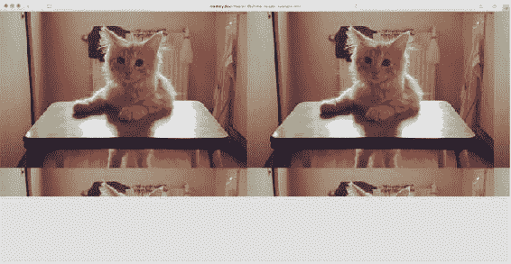

###### 图 5-5。背景图像沿两个方向平铺在轮廓框上

为什么它像那样平铺在整个盒子上？因为默认值的另一个属性与背景图像有关，名为 background-repeat。默认值 repeat 表示图像在 x 轴和 y 轴上重复。这对于包含图案的背景来说非常有用，但对于照片来说可能不是。我们可以通过将值设置为 repeat-x 或 repeat-y 来将其限制为任意方向，但现在我们将通过将其设置为 no-repeat 来完全移除平铺效果:

```html
.profile-box {
  background-image: url(img/cat.jpg);
  background-repeat: no-repeat;
}
```

3 级背景和边框规范使用扩展的语法和新的关键字重新定义了该功能。首先，它允许您指定两个方向的重复值，用空格分隔关键字，因此下面的内容相当于设置 repeat-x:

```html
.profile-box {
  background-repeat: repeat no-repeat;
}
```

其次，它定义了一些新的关键字。在支持的浏览器中，您可以将 space 或 round 设置为一个或两个关键字。使用空间意味着，如果背景图像两次或更多次适合元素内部(不进行裁剪或调整大小)，它将重复适合的次数并隔开，以便背景图像的第一个和最后一个“副本”接触元素的边缘。使用 round 意味着将调整图像的大小，使其多次适合元素内部。

老实说，这些新的背景重复功能可能不是非常有用。如果你想使用一个符号或重复的图案作为背景，并想在设计中保持某种对称，它们会很方便，但它们也很难保持图像的纵横比。支持也参差不齐:老版本的浏览器被遗漏了，但是即使是现代版本的 Firefox 也缺少支持。

### 加载图像(和其他文件)

在使用 url()函数符号时，就像我们在前面的例子中所做的那样，我们可以使用一个相对 URL——例如 url(img/cat.jpg)。浏览器将尝试在 img 子目录中查找与保存 CSS 本身的文件相关的文件 cat.jpg。如果路径以斜杠“/img/cat.jpg”开头，浏览器将在顶级 img 目录中查找图像，该目录与加载 CSS 文件的域相关。

我们也可以使用绝对 URL。绝对 URL 的一个例子是，如果我们精确地指定哪种协议、域和路径的组合指向图像，就像[`example.com/img/my-background.jpg`](http://example.com/img/my-background.jpg)。

除了绝对和相对 URL，我们可以选择加载图像(和其他资源)而不指向任何文件，而是将数据直接嵌入样式表中。这是通过一种叫做*数据 URI* 的东西来完成的，在这里，文件中的二进制编码数据被转换成一长串文本。有很多工具可以帮你做到这一点，包括在线版本，如 http://duri.me/的。

然后，您可以将该文本粘贴到 url()函数中，并将数据保存为样式表的一部分。它看起来像这样:

```html
.egg {
  background-image:
    url(data:image/png;base64,iVBORw0KGgoAAAANSUhEUgAAAC gAAAAoAQAAAACkhYXAAAAAjElEQVR4AWP…
    /* ...and so on, random (?) data for a long time.. */
...4DwIMtzFJs99p9xkOXfsddZ/hlhiY/AYib1vsSbdn+P9vf/1/hv8//oBIIICRz///r3sPMqHsPcN9MLvn1s6SfIbbUWFl74HkdTB5rWw/w51nN8vzIbrgJDuI/PMTRP7+ByK//68HkeUg8v3//WjkWwj5G0R++w5WyV8P1gsxB2EmwhYAgeerNiRVNyEAAAAASUVORK5CYII=);
}
```

带数据的起始位:image/png；base64 告诉浏览器应该得到什么样的数据，其余的是转换成字符串的图像的实际像素数据。

使用嵌入式数据 URIs 有好有坏——使用它们的主要原因是为了减少 HTTP 请求的数量，但同时它们会增加样式表的大小，所以要谨慎使用。

### 图像格式

您可以在网上使用几种不同格式的图像文件，它们都可以作为内容图像或背景图像。这里有一个简短的介绍:

*   **JPEG:** 一种位图格式，可以高度压缩，但在细节上有一些质量损失，适合照片。不支持透明。

*   **PNG:** 一种无损压缩的位图格式，这种格式不适合照片(它会创建非常大的文件)，但对于图标或插图之类的“扁平”图形，它可以实现非常小的文件大小。可以是透明的。

*   GIF: 一种旧的位图格式，类似于 PNG，主要用于猫的动画图片。说真的，除了动画图像之外，它在很大程度上已经被 PNG 所取代:PNG 也支持动画图像，但浏览器支持有点落后。GIF 支持透明度，但不支持 alpha 级别，因此边缘看起来经常呈锯齿状。

*   **SVG:** 一种矢量图形格式，也是它自己的标记语言。SVG 既可以直接嵌入网页，也可以作为背景图像或内容图像的来源。

*   WebP: 由 Google 开发的一种新格式，压缩效率极高，结合了 JPEG(高度可压缩)和 PNG(透明)的特点。到目前为止，浏览器支持非常不稳定(只有 Chrome 和 Opera 等基于 Blink 的浏览器)，但这可能会很快改变。

除了 SVG 之外，所有这些都是位图格式，这意味着它们包含逐像素的数据，并且具有固有的尺寸(意味着“内置”的宽度和高度)。对于细节层次高的图形元素，如照片或详细的插图，这是有意义的。但是对于许多用途来说，真正有趣的格式是 SVG，它包含如何在屏幕上绘制特定形状的指令。这使得 SVG 图像可以自由调整大小或以任何像素密度显示在屏幕上:它们永远不会失去任何清晰度或细节水平。

SVG 本身是一个足以写几本书的主题(事实上，有许多这样的书存在)，但是我们仍然希望在本书中让您对 SVG 的灵活性有所了解(特别是在第十一章，当我们看到 CSS 中一些更前沿的视觉效果时)。SVG 是一种古老的格式(它从 1999 年就出现了)，但是近年来浏览器支持变得足够广泛，使得 SVG 成为一种可行的替代方案。唯一坚持的是有点古老的 Internet Explorer 版本(版本 8 和更早版本)和 Android 上的 WebKit browers 的早期版本(版本 2 和更早版本)。

## 背景图像语法

回到图 5-5 ，我们开始创建带有 JPEG 格式背景图像的个人资料页面示例，因为它是一张照片。到目前为止，我们已经把它放在了元素的背景中，但是它看起来还不是很好。我们将讨论让您调整背景图像的属性。

### 背景位置

我们可以试着把我们的图像放在元素的中心。背景图像的位置由 background-position 属性控制。

我们还使用了更大版本的图像文件，以确保它即使在更大的屏幕上也能覆盖元素(见图 5-6 )。在较小的屏幕上，边会被剪掉，但至少图像是居中的。

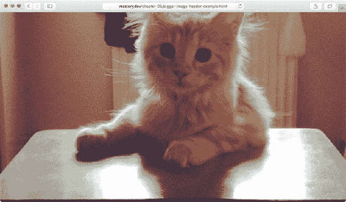

###### 图 5-6。我们的页面有一个更大的，居中的背景图片来覆盖整个元素

```html
.profile-box {
  width: 100%;
  height: 600px;
  background-color: #8Da9cf;
  background-image: url(**img/big-cat.jpg**);
  background-repeat: no-repeat;
**background-position: 50% 50%;** 
}
```

您可以使用关键字或单位(如像素、ems 或百分比)来设置背景位置属性值。最简单的形式是，该值由两个子值组成:一个表示从左侧的偏移量，一个表示从顶部的偏移量。

###### 注意

有些浏览器支持 background-position-x 和 background-position-y 属性，这两个属性分别在每个轴上定位图像。这些最初是 IE 中的非标准属性，但是正在被标准化。在撰写本文时，基于 Mozilla 的浏览器仍然不支持它们。

如果使用 pixels 或 ems 设置这些值，图像的左上角将从元素的左上角开始按指定的像素数定位。因此，如果您指定 20 个像素的垂直和水平位置，图像的左上角将出现在距离元素左边缘 20 个像素和距离元素上边缘 20 个像素的位置。使用百分比的背景定位略有不同。百分比定位不是定位背景图像的左上角，而是使用图像上的相应点。如果您将垂直和水平位置设置为 20%，那么您实际上是将一个点定位在距离图像的顶部和左侧边缘 20%的位置，距离父元素的顶部和左侧边缘 20%的位置(参见图 5-7 )。

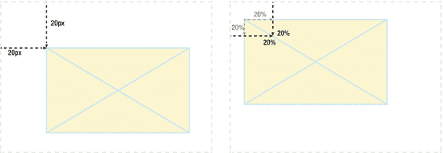

###### 图 5-7。当使用像素定位背景图像时，使用图像的左上角。使用百分比定位时，会使用图像上的相应位置

关键字对齐的工作方式是将 x 轴和 y 轴的一个或两个测量值替换为 x 轴的左侧、中间或右侧，或者 y 轴的顶部、中间或底部。你应该养成这样的习惯，总是先声明 x，再声明 y。这是为了一致性和可读性，也是为了避免错误:规范允许你改变顺序，如果你使用两个关键字(比如左上)，但是当一个是关键字，一个是长度时就不允许了。以下内容将被破坏:

```html
.box {
  background-position: 50% left; /* don’t do this */
}
```

背景定位的约束已经困扰设计师很久了。考虑图 5-8 中的设计:我们有一些未知长度的文本，在最右边有一个图标图像，周围有一些空白。使用像素或 ems 来定位图像是没有用的，因为我们不知道图像应该位于离*左边*多远的地方。

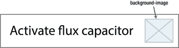

###### 图 5-8。右边缘带有图标作为背景图像的一段文本

以前，除了为图标提供自己的包装元素和定位之外，唯一的解决方案是使用一个背景图像，将其定位在距离左边 100%的位置，并将右边的空白作为透明像素烘焙到图像文件中。这不是很优雅，因为它没有让我们通过 CSS 来控制这些空白。幸运的是，3 级背景和边框规范支持我们！

背景位置的新语法允许我们做我们所希望的事情，就像刚才描述的那样:我们可以用相应的 edge 关键字作为每个距离的前缀，我们想用它作为参考。看起来是这样的:

```html
<p>
  <a href="/activate" class="link-with-icon">Activate flux capacitor</a>
</p>

.link-with-icon {
  padding-right: 2em;
  background-image: url(img/icon.png);
  background-repeat: no-repeat;
  background-position: **right 1em top 50%**;
}
```

前面的例子意味着我们将图像定位在距离右边缘 1 em，距离顶部 50%的位置。问题解决了！可悲的是，这个版本的语法在 IE8 或 7 版之前的 Safari 中不起作用。根据您的使用情况，它可以作为一种增强，但在不受支持的浏览器中很难优雅地降级。

#### 介绍 Calc

实际上，我们可以通过引入另一个具有更广泛支持的 CSS 构造(calc()函数符号)来获得与上一节中的示例相同的结果。使用 calc 可以让浏览器为你计算任何类型的数字(角度、像素、百分比等)。).它甚至可以处理混合单元，直到页面被渲染才知道！这意味着您可以说“100% + *x* 像素数”，例如，这对于以百分比表示的大小或位置与以 ems 或像素设置的其他距离相冲突的任何情况都非常有用。

在我们之前讨论的“背景图像从右侧定位”问题的情况下，我们可以使用 calc()符号来表示 x 轴上的相同位置:

```html
.link-with-icon {
  /* other properties omitted for brevity. */
  background-position: **calc(100% - 1em) 50%**;
}
```

###### 注意

Internet Explorer 9 确实支持 calc()符号，但遗憾的是，当它专门用于背景位置时，有一个严重的错误，导致浏览器崩溃。因此，前面的例子主要是理论上的。calc()函数对于许多其他情况也很有用——元素大小、字体大小等等。

calc()函数符号与加法(+)、减法(-)、乘法(*)和除法(/)这四个运算符一起使用。calc()表达式中可以有多个值；以下规则集中的声明也完全有效:

```html
.thing {
  width: calc(50% + 20px*4 - 1em);
}
```

###### 注意

使用 calc()时，在使用加法和减法时，运算符两边需要有空格。这显然是为了更清楚地将运算符与数字上的任何*符号*区分开来，例如长度-10 px。

calc()符号是在 Level 3 值和单位规范中定义的，它有相当不错的支持。就像你之前看到的“四值”背景位置一样，IE8 和更早的版本，以及更老的 WebKit 浏览器，正在失去乐趣。一些稍旧版本的基于 WebKit 的浏览器确实支持它，但可能需要一个前缀，形式为-webkit-calc()。

### 背景剪辑和原点

默认情况下，用于背景的图像将绘制在元素的边框上，这意味着它们可能会覆盖元素的所有可见边缘。请注意，由于它们被绘制在任何边框的下面，半透明的边框可能会显示在图像的顶部。

背景剪辑属性可以改变这种行为。默认对应于背景剪辑:边框框。设置值 padding-box 将切换到裁剪边框内的图像，覆盖填充框，设置值 content-box 将裁剪任何填充内的图像，到内容框。图 5-9 显示了不同之处。

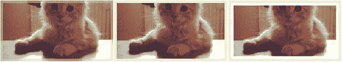

###### 图 5-9。剪裁到边框(左)、填充框(中)和内容框(右)的背景之间的差异

```html
.profile-box {
  border: 10px solid rgba(220, 220, 160, 0.5);
  padding: 10px;
  background-image: url(img/cat.jpg);
**background-clip: padding-box;** 
}
```

即使更改了背景剪辑值，背景位置的默认原点(即图像开始定位的参考点)仍然是填充框的左上角，这意味着定位值从元素上任何边框的内部开始。

幸运的是，您也可以通过背景-原点属性来影响原点位置。它接受与背景剪辑相同的与框模型相关的值:边框、填充框或内容框。

背景剪辑和背景源都是前面提到的 3 级背景和边界规范的一部分。它们已经存在了一段时间，但仍然缺乏在真正老的浏览器中的支持:再次，IE8 是主要的落后者，但这次即使是老的 Android 浏览器也实现了这些属性，尽管带有-webkit-前缀。

### 背景附件

背景附加到显示在后面的元素上。如果你滚动页面，背景也随之滚动。可以通过 background-attachment 属性来更改此行为。如果我们希望标题图像的背景在用户向下滚动时“粘”在页面上，我们可以使用下面的代码:

```html
.profile-box {
  background-attachment: fixed;
}
```

图 5-10 试图捕捉用户滚动页面时背景的行为:它给出了页眉隐藏在页面其余部分后面的外观，这可能是一个很酷的效果。

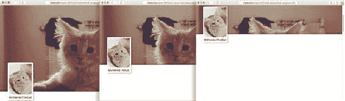

###### 图 5-10。带有固定背景附件的个人资料标题

除了固定和默认值，滚动，你可以设置背景附件到本地。很难在纸上说明，但是局部值影响元素滚动位置内的附件:当元素有滚动条时，它通过将溢出属性设置为 auto 或 scroll 并使内容足够高以突出元素，使元素内容一起滚动。如果我们在标题上这样做，那么当页面滚动时，背景图像将随着元素一起滚动，但是当内部滚动位置改变时，背景图像也会随着内容一起滚动。

本地值在桌面浏览器中得到相对较好的支持，但在移动浏览器中却不太可靠:有理由认为一些移动浏览器制造商忽略了这一属性(以及固定值),因为元素滚动是不常见的，并且会对使用触摸滚动的小屏幕产生可用性影响。事实上，该规范还允许实现者忽略背景附件，如果它被认为在设备上不合适的话。移动浏览器专家彼得-保罗·科赫(Peter-Paul Koch)在他的网站 QuirksMode.org(http://www . quirksmode . org/blog/archives/2013/03/new _ CSS _ tests _ c _ 2 . html)上有一篇关于这个主题的文章(以及其他移动浏览器测试的宝库)。

### 背景尺寸

在上一节的例子中，我们使用了一个更大的图像来覆盖轮廓框。这意味着在较小的浏览器窗口中查看时，它会被剪切。当窗户变得很大时，它的侧面也可能会有缝隙。假设我们希望防止这种情况，并在缩放页面时保持内容的纵横比，我们需要利用 background-size 属性。

通过将 background-size 设置为显式长度度量，您可以将背景图像的大小调整为新的固定度量，或者让它随元素一起缩放。

如果我们仍然有一个大文件，并且出于某种原因想要显示得小一些，我们可以给它新的像素度量:

```html
.profile-box {
  background-size: 400px 240px;
}
```

让图像和框一起缩放意味着我们需要切换到使用百分比。您可以设置宽度和高度的百分比，但是这些百分比与图像的固有大小无关，而是与容器的大小有关:如果容器的高度随内容而变化，这可能会扭曲图像的纵横比。

使用百分比的一个更明智的方法是对一个值使用 percent，对另一个值使用关键字 auto。例如，如果我们希望图像的宽度为 100%(x 轴，第一个值)，并保持其纵横比(见图 5-11 )，我们可以使用以下方法:

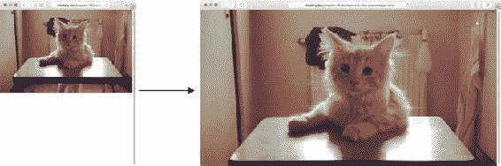

###### 图 5-11。使用百分比和 auto 关键字设置背景大小允许背景覆盖元素的宽度，而不管视口大小如何

```html
.profile-box {
  background-size: **100% auto**;
}
```

使用百分比给了我们一些灵活性，但并不适用于所有情况。有时，我们可能希望确保背景永远不会被裁剪，在 profile header 示例中，我们可能希望确保背景总是覆盖元素的整个区域。幸运的是，有一些神奇的关键字为我们解决了这个问题。

首先，我们可以使用关键字 contain 作为背景尺寸。这意味着浏览器将试图在不扭曲其纵横比或裁剪图像的情况下尽可能放大图像:这几乎与上一个示例类似，但它会自动确定哪个值应该是 auto，哪个值应该是 100%(见图 5-12 )。

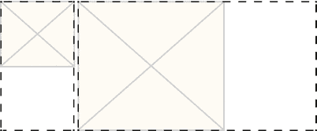

###### 图 5-12。使用 contain 关键字作为背景大小可以防止裁剪

```html
.profile-box {
  background-size: contain;
}
```

在又高又窄的元素中，正方形背景最多 100%宽，但可以留有垂直间隙；在宽元素中，它最多 100%高，但会留下水平间隙。

我们可以使用的第二个关键字值是 cover:这意味着图像的大小可以完全覆盖元素的每个像素，而不会扭曲图像。这就是我们想要在我们的个人资料页面的例子。图 5-13 显示了一个窄而高的元素上的正方形背景如何填充高度但剪裁侧面，一个宽的元素如何在填充元素宽度的同时剪裁顶部和底部，配置如下:

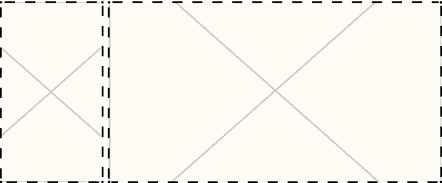

###### 图 5-13。使用 cover 关键字在裁剪背景时完全覆盖元素的表面

```html
.profile-box {
  background-size: cover;
}
```

与 clip 和 origin 的属性一样，background-size 是一个相对较新的背景属性，支持级别也类似。

### 背景速记

正如我们在本章开始时看到的，有一个后台简写语法，用于同时设置许多与后台相关的属性。一般来说，你可以随意指定不同的值——浏览器会从不同的关键字和语法中判断出你的意思。不过，还是有一些问题。

首先，由于长度对可用于背景位置和背景大小，您需要将它们写在一起，首先是背景位置，然后是背景大小，并用斜杠(/)字符分隔它们。

第二个是用于背景源和背景剪辑的*-box 关键字。以下规则适用:

*   如果只有一个*-box 关键字(border-box、padding-box 或 content-box)，则两个值都被设置为声明的值。

*   如果有两个*-box 关键字，第一个设置背景-原点，第二个设置背景-剪辑。

下面是一个将各种背景属性组合在一起的例子:

```html
.profile-box {
 background: url(img/cat.jpg) 50% 50% / cover no-repeat padding-box content-box #bada55;
}
```

正如我们在本章开始时所说的，要小心后台简写:它会自动将您没有提到的所有值设置回它们的默认值。如果您确实要使用它，首先放入速记声明，然后根据需要覆盖特定的属性。尽可能多地使用快捷键来节省一些击键次数可能很诱人，但作为编写代码的一般规则，显式代码通常比隐式代码更不容易出错，也更容易理解。

## 多重背景

到目前为止，我们已经处理了背景图像，就好像你总是使用一个单独的图像作为背景。过去是这样，但是 3 级背景和边框规范中定义的背景属性现在允许您为单个元素指定多个背景，并为每个属性指定相应的多值语法。多个值用逗号分隔。下面是一个例子，如图 5-14 所示:

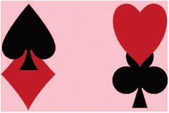

###### 图 5-14。一个元素上的多个重叠背景

```html
.multi-bg {
  background-image: url(img/spades.png), url(img/hearts.png),
                    url(img/diamonds.png), url(clubs.png);
  background-position: left top, right top, left bottom, right bottom;
  background-repeat: no-repeat, no-repeat, no-repeat, no-repeat;
  background-color: pink;
 }
```

背景层在声明时从上到下堆叠，第一个在顶部，最后一个在底部。颜色层在它们后面结束(见图 5-15 )。

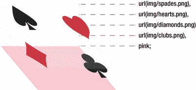

###### 图 5-15。多个背景层按照声明的顺序从上到下堆叠。颜色层总是在底部

您还可以声明多个后台简写值:

```html
.multi-bg-shorthand {
  background: url(img/spades.png) left top no-repeat,
              url(img/hearts.png) right top no-repeat,
              url(img/diamonds.png) left bottom no-repeat,
              url(img/clubs.png) right bottom no-repeat,
              pink;
}
```

使用这种语法，你只允许在最后一个背景层上声明一种颜色，考虑到图 5-15 中的顺序，这是有意义的。

如果任何背景属性的值列表短于背景图像的数量，则值列表会循环。这意味着如果它们的值都相同，你只需要声明一次:如果它在两个值之间交替，你只需要声明两个，以此类推。因此，前一个示例中的循环不重复可以写成如下形式:

```html
.multi-bg-shorthand {
  background: url(img/spades.png) left top,
              url(img/hearts.png) right top,
              url(img/diamonds.png) left bottom,
              url(img/clubs.png) right bottom,
              pink;
  background-repeat: no-repeat; /* goes for all four */
}
```

因为多重背景的东西来自于 3 级规范，所以它在一些老的浏览器中也不可用。很多时候，通过使用单值后台语法的组合，您可以为较旧的浏览器实现完全可以接受的回退:

```html
.multi-fallback {
  background-image: url(simple.jpg);
  background-image: url(modern.png), url(snazzy.png), url(wow.png);
}
```

就像书中的其他例子一样，旧的浏览器将获得更简单的第一个图像并丢弃第二个声明，而新的浏览器将忽略第一个，因为第二个会覆盖它。

## 边框和圆角

我们在第三章中提到了边界是盒子模型属性的一部分。在现代浏览器中，我们对边框有了进一步的控制，允许我们用图像和圆角给它们增添情趣——所以我们终于可以创建除了尖锐矩形之外的东西了！

首先快速回顾一下旧的边界属性:

*   您可以分别设置边框各边的属性，也可以同时设置所有边的属性。

*   您可以使用 border-width 设置整个边框的宽度，或者使用 border-top-width 设置特定的边。请记住，边框的宽度决定了框的整体大小，除非 box-sizing 属性另有说明。

*   同样，您可以用 border-color 设置整个边框的颜色，或者用 border-left-color 设置特定的边。

*   边框的样式、边框样式(或右边框样式等。)是由关键字设置的:实线、虚线或虚线是非常常用的。还有一些更奇特的，比如 double(在由 border-width 指定的表面上画两条平行线)、groove 和 inset。老实说，这些很少有用:一是因为它们看起来很时髦，二是因为你让浏览器来控制它们的外观——这在标准中并没有明确规定。您也可以通过设置 border-style: none 来完全移除边框。

*   最后，您可以使用 border 速记来设置所有的边框属性。简写将所有边的宽度、样式和颜色设置为相同的值，如下所示:border:2px solid # 000；。

### 边框半径:圆角

很长一段时间，圆角一直是开发者的首选。我们花了无数的时间，使用可扩展的、跨浏览器工作的图像来想出新的方法。事实上，这本书以前的版本详细描述了它们。今天，幸运的是，我们已经过了那个阶段。目前唯一不支持边框半径属性的浏览器是老版本的 IE 浏览器(8 及以下版本)和 Opera Mini。关于圆角的事情是，它们通常是一个很好的特性，而不是页面可用性的关键，所以我们认为使用标准化的属性是有意义的，而不是让一些最弱的浏览器(就性能而言)负担更多的代码，以模拟所有其他浏览器中存在的东西。

#### 边框半径速记

这一次，我们将从速记属性开始——因为这是最常见的用例——使盒子上的所有角都变圆。

border-radius 属性允许您通过简单地声明一个长度值来一次设置所有的角。让我们添加一个侧面照片框到我们的例子，并使角落变圆。首先，一些标记:

```html
<header class="profile-box" role="banner">
  <div class="profile-photo">
    
    <h1 class="username">@CharlesTheCat</h1>
  </div>
</header>
```

下面是添加的 CSS 来调整我们的个人资料照片框的大小和位置，以突出标题区域的底部，并给它一个边框以突出背景(参见图 5-16 中的结果):

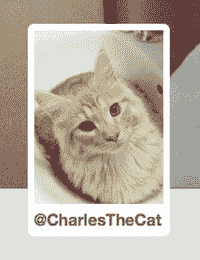

###### 图 5-16。轮廓照片组件上的圆角

```html
.profile-box {
  position: relative;
  /* other properties omitted for brevity */
}

.profile-photo {
  width: 160px;
  min-height: 200px;
  position: absolute;
  bottom: -60px;
  left: 5%;
  background-color: #fff;
  border: 1px solid #777;
**border-radius: 0.5em;** 
}
```

#### 更复杂的边框半径语法

您也可以使用速记属性来单独设置每个值。首先从左上角开始，然后顺时针旋转:

```html
.box {
  border-radius: 0.5em 2em 0.5em 2em;
}
```

这个声明中的每个长度值已经是一个简写，因为它在每个角的水平轴和垂直轴上表示相同的半径。如果需要不同的值(即不对称的角形状)，可以将每个轴指定为一个值列表(先水平，再垂直)，并用斜杠分隔两个轴:

```html
.box {
  border-radius: 2em .5em 1em .5em / .5em 2em .5em 1em;
}
```

如果值对角地反映在角上，您可以省略右下角和左下角；如果只有两个或三个值，其余的将被填入:

```html
.box {
  border-radius: 2em 3em; /* repeated for bottom right and bottom left. */
}
```

在前面的示例中，第一个值设置左上角和右下角，第二个值设置右上角和左下角。如果我们为右下角包含第三个值，左下角将获得与右上角相同的值。

#### 在单个角上设置边界半径

当然，您可以使用边框左上半径、边框右上半径等来设置单个角的值。

为这些单个拐角属性提供与前面速记示例中相同的半径长度:一个长度值(创建对称拐角)或两个长度值(用斜线分隔，第一个设置水平半径，第二个设置垂直半径)。

下面是应用于我们的个人资料照片框的单个对称圆角的代码，如图 5-17 所示:

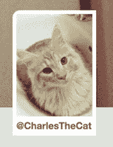

###### 图 5-17。我们的个人资料照片框的一个版本，只有左上角是圆形的

```html
.profile-photo {
  border-top-left-radius: 1em;
}
```

### 创建具有边框半径的圆形和药丸形状

到目前为止，我们一直在谈论使用长度值来设置半径，但您也可以使用百分比。以百分比设置边框半径时，x 半径与元素的宽度相关，y 半径与元素的高度相关。这意味着我们可以很容易地创建一个正方形元素，然后将其边界半径设置为至少 50%的圆形。

为什么是“至少”？嗯，确实没有理由为所有拐角设置高于 50%的值，但是知道当两条拐角曲线开始重叠时，两轴都减小，直到它们不再重叠，这可能是有用的。对于正方形上的对称角，任何高于 50%的值都会产生一个圆(见图 5-18 )。注意，具有相同边界半径的*矩形*元素将变成椭圆形，因为半径与该方向的尺寸成比例减小:

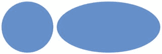

###### 图 5-18。圆形和椭圆形使用边界半径:50%

```html
<div class="round"></div>
<div class="round oval"></div>

.round {
  width: 300px;
  height: 300px;
  border-radius: 50%;
  background-color: #59f;
}
.oval {
  width: 600px;
}
```

圆形通常是理想的，但椭圆形就不那么理想了。有时，我们想要一个“药丸形状”——一个带半圆的长方形元素。这种形状的专业术语(如图 5-19 所示)是一个 *obrund* 。百分比或精确的长度测量不会帮助我们创建这样的形状，除非我们知道元素的精确测量，这在网页设计中很少出现。

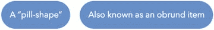

###### 图 5-19。使用大的边界半径来创建药丸形状

然而，我们可以使用一种奇怪的边界半径计算来创建这个形状。我们看到，当半径不再合适时，半径会减小。但是当它被设置为一个长度时(*不是*一个百分比)，半径与元素的大小无关，相反它们最终是对称的。因此，为了创建一个 obrund 的半圆边，我们可以欺骗和使用一个长度，我们知道这个长度比创建一个半圆边所需的半径长*，并且这个形状会自己创建:*

```html
.obrund {
  border-radius: 999em; /* arbitrarily very large length */
}
```

关于边框半径的最后一点，你应该知道它们是如何影响页面上元素的形状的。我们终于找到了一种方法来创建矩形之外的东西，但是唉:就布局而言，它们仍然会表现得好像它们是覆盖盒子原始表面的矩形。在如何解释元素的形状方面，*改变了*的一点是，元素的可点击(或“可触摸”)表面遵循了角的形状。在创建圆角按钮、链接等时，请记住这一点。，以便可点击的表面不会变得太小。

### 边框图像

级别 3 背景和边框规范还允许您定义一个图像作为元素的边框。你可能会问，单一图像有什么好处？border-image 属性的美妙之处在于，它允许您根据“切割”位置的规则将图像分割成九个独立的部分，浏览器将自动为相应的边框部分使用正确的部分。这种技术被称为九切片缩放，有助于避免在调整图像大小以覆盖框时通常会出现的失真。这有点难以想象，所以举个例子吧。

使用边框图像的典型例子可能是为元素创建类似图片框的东西。图片框架的来源是一个边长为 120 像素的正方形图像。如果你从盒子的上、右、下、左边缘画 40 像素的线，你将把盒子分成九个部分(见图 5-20 )。

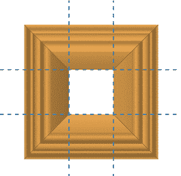

###### 图 5-20。我们的边框图像的源文件，为了便于说明，分割点画在上面

border-image 属性将自动使用每个扇区中的图像作为相应边框部分的背景。左上角的图像切片将用作该角的图像，中上位的切片将用于上边框，右上角的切片用于该角，依此类推。默认情况下，中间的切片会被丢弃，但是您也可以更改这种行为。

您还可以告诉浏览器在覆盖边框时如何处理上、右、下和左位。它们可以拉伸、重复或间隔，四舍五入显示的完整重复次数:它的工作方式很像更新的背景重复关键字。默认情况下，每一侧的中间切片都被拉伸，这很好地满足了我们的目的。

为了显示边界图像，还需要设置边界宽度——测量将根据特定线段的边界宽度拉伸每个切片。

将此图形用作边界图像，我们可以创建类似于我们在图 5-21 中看到的“座右铭”的东西。

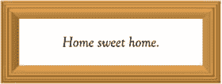

###### 图 5-21。拉伸边框图像以适合元素

这个组件的 CSS 如下所示:

```html
.motto {
  border-width: 40px solid #f9b256;
  border-image: url(picture-frame.png) 40;
  /* ...same as border-image: url(picture-frame.png) 40 40 40 40 stretch; */
}
```

前面的代码将加载图像 picture-frame.png，从四个边中的每个边对其进行 40 像素的切片，并在顶部、右侧、底部和左侧拉伸中间的切片。请注意，切片辅助线的“20 像素”测量值是在没有 px 单位的情况下给出的；这是一个与矢量图像(SVG)和位图图像之间的差异有关的怪癖。

关于前面的例子，另一件值得一提的事情是，您需要在 border-image 属性之前放置 border 速记(如果使用的话)。规范要求速记重置所有的边界属性，而不仅仅是它自己设置的属性。

如您所料，有特定的边框图像属性来分别设置每个值。事实上，有一大堆值可以让你控制边框图像的工作方式。事情是这样的，我们一方面可以计算出在我们的职业生涯中使用边框图像的次数，所以我们不会在这里做更多的细节。

几年前，边框图像支持*在许多网页设计师的愿望清单上排在第一位，主要是因为它可以方便地创建圆角而无需黑客攻击。现在我们有了边界半径，这种需求就不那么迫切了。当然，根据项目的设计，边框图像可能是一个很好的选择——例如，很容易看出位图图像作为边框如何有利于古灵精怪的美感。*

如果你想更深入地了解边框图像属性的复杂性，可以看看诺拉·布朗关于 CSS 技巧的文章:[`css-tricks.com/understanding-border-image/`](http://css-tricks.com/understanding-border-image/)。对边框图像属性的支持相当广泛——主要是 Internet Explorer 10 和更早版本缺少支持。可悲的是，即使在支持浏览器中也存在相当多的错误和怪癖。

## 箱形阴影

暂时把背景图片和边框放在一边，我们将探索另一种给页面添加视觉效果的方法:阴影。过去，设计师不得不通过使用额外的元素和图像来为他们的设计添加阴影。不再是了！

CSS 允许您使用 box-shadow 属性添加阴影。它得到了很好的支持。事实上，几乎只有老版本的 IE(8 版及更早版本)和 Opera Mini 被遗漏了。为了支持旧的 Android WebKit 浏览器(和其他一些旧的 WebKit 版本)，您需要-webkit-前缀。Firefox(和其他基于 Mozilla 的浏览器)已经有了足够长的时间来安全地跳过-moz 前缀。

你已经在前一章看到了文本阴影的语法:框阴影有一个非常相似的语法，但是增加了一些额外的东西。

让我们添加一个阴影到个人资料照片框来说明，使用以下标记和 CSS(图 5-22 显示结果):

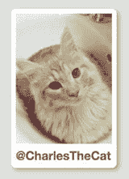

###### 图 5-22。添加了细微阴影的轮廓图像框

```html
.profile-photo {
  box-shadow: .25em .25em .5em rgba(0, 0, 0, 0.3);
}
```

本例中的语法与文本阴影版本完全相同:x 和 y 偏移的两个值，然后是模糊半径值(阴影边缘模糊的程度)，最后是颜色，使用 rgba()。注意阴影是如何跟随圆形盒子的拐角形状的！

### 扩散半径:调整阴影的大小

box-shadow 属性比 text-shadow 更灵活一些。例如，您可以在模糊半径后添加一个值来指定*扩散半径*:阴影应该有多大。默认值为 0，表示与其应用的元素大小相同。增加该值会使阴影变大，负值会使阴影变小(参见图 5-23 )。

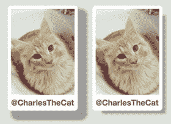

###### 图 5-23。显示有不同扩散半径值的框

```html
.larger-shadow {
  box-shadow: 1em 1em .5em **.5em** rgba(0, 0, 0, 0.3);
}
.smaller-shadow {
  box-shadow: 1em 1em .5em **-.5em** rgba(0, 0, 0, 0.3);
}
```

### 嵌入阴影

另一个比文本阴影更灵活的额外的方框阴影功能是 inset 关键字。应用插入阴影意味着元素被假定为阴影投射到的表面，从而产生它被从背景中“剔除”的效果。例如，我们可以使用插入阴影效果，使它看起来像我们的个人资料标题的背景有点沉入页面，在个人资料照片和其余内容的后面。我们将向配置文件框规则集添加以下内容(参见图 5-24 ):

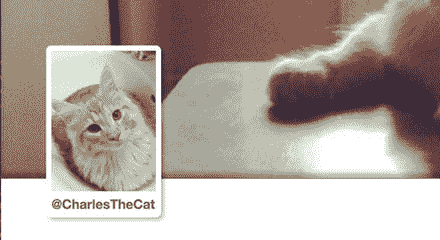

###### 图 5-24。轮廓标题组件的详细信息，显示了大背景底部边缘上的嵌入框阴影

```html
.profile-box {
  box-shadow: inset 0 -.5em .5em rgba(0, 0, 0, 0.3);
}
```

### 多重阴影

就像文本阴影一样，您可以对单个元素应用多个阴影，用逗号分隔不同的值。我们将看一个例子来说明如何将它与“平面”阴影技术相结合，并完全消除模糊半径。

如果你忽略模糊半径或将其设置为 0，你将得到一个边缘非常清晰的阴影。这可能是有益的，因为它允许你远离伪现实阴影的心理模型，并开始更多地将它们视为在应用它们的元素后面生成的“额外的盒子”，这些盒子不会影响布局——对于各种效果来说非常方便。

一个有用的例子是在一个元素上创建多个“假边框”。border 属性只允许你画一个边框(诡异的 double 关键字除外，但那不算)。使用 0 模糊半径和不同扩散半径的阴影，你可以创建几个类似边界的区域(见图 5-25 )。因为它们不影响布局，所以它们的行为更像 outline 属性。

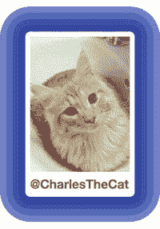

###### 图 5-25。使用多重阴影和扩散半径绘制假轮廓

```html
.profile-photo {
  box-shadow: 0 0 0 10px #1C318D,
              0 0 0 20px #3955C7,
              0 0 0 30px #546DC7,
              0 0 0 40px #7284D8;
}
```

## 使用 CSS 渐变

设计中的一个常见用例是使用颜色渐变作为元素的背景，为页面添加微妙的深度感。加载包含渐变的图像文件可以很好地工作，但是 CSS 也有一个为您绘制渐变图像的机制。这是通过各种样式的梯度函数符号，结合任何接受图像(包括背景图像)的属性来实现的。假设我们有一个用户尚未上传背景图片的个人资料页面(见图 5-26 )，我们希望默认显示渐变背景:

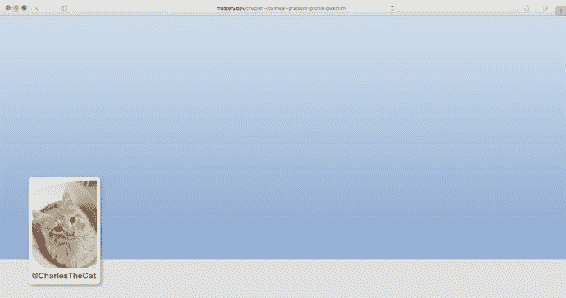

###### 图 5-26。应用于轮廓框背景的线性渐变

```html
.profile-box {
  background-image: linear-gradient(to bottom, #cfdeee 0%, #8da9cf 100%);
}
```

由于用 CSS 创建的渐变图像没有特定的大小，这个渐变最初会覆盖整个元素，除非你特别指定使用背景大小来度量它。

### 浏览器支持和浏览器前缀

大多数现代浏览器都支持渐变。Internet Explorer 9(及更早版本)和 Opera Mini 是最明显的例外。一些稍旧的基于 WebKit 的浏览器只支持线性渐变版本。在接下来的章节中，我们将会看到不止一种类型的渐变。

###### 注意

CSS 渐变的语法在 Safari 中首次作为非标准属性引入以来，已经发生了几次变化。有三种不同的语法，根据您需要的浏览器支持级别，您可能需要同时使用多个版本，并带有不同的供应商前缀。为了使这一部分易于管理并且不会太混乱，我们将使用最新的无前缀语法来浏览它们。你可以仔细阅读本文中的各种语法:[`www . site point . com/using-un fixed-css3-gradients-in-modern-browsers/`](http://www.sitepoint.com/using-unprefixed-css3-gradients-in-modern-browsers/)。

### 线性渐变

前面的示例使用 linear-gradient()函数沿着从元素顶部到底部的假想线绘制渐变。这条线的角度，在本例中是一个关键字对(到底部)，是函数的第一个参数，后面是逗号分隔的色标列表。色标定义了渐变线上颜色发生变化的点，在这种情况下，我们从 0%的较亮蓝灰色开始，以 100%的较暗蓝色结束，这意味着元素的底部。

我们可以使用 to 关键字指定方向，后跟一个边(上、右、下、左)或一个角(左上、右下等)。)，后者使梯度成对角线。它从对角或对边开始，渐变线总是穿过图像区域的中心。我们也可以使用以度为单位的角度，其中 0 度表示向上/向北，然后顺时针增加到 360 度，就像 HSL 色轮一样。在这种情况下，度数意味着渐变的绘制方向，所以它仍然从我们指向的相反方向开始。这是一个 45 度的梯度:

```html
.profile-box {
  background-image: linear-gradient(45deg, #cfdfee, #4164aa);
}
```

这里，渐变线不是从背景图像区域的边缘开始。相反，它会自动缩放，以便 0%和 100%的任何颜色都与图像的角重合。图 5-27 解释了其工作原理。

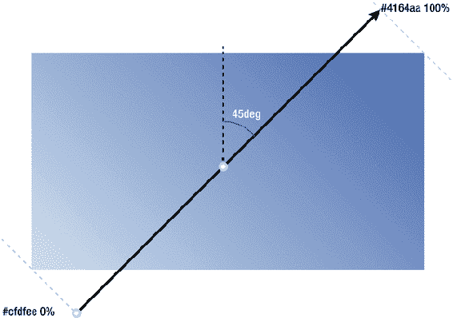

###### 图 5-27。对角线渐变中渐变线的位置和比例

#### 默认值和颜色停止位置

由于从上到下(180 度)是默认设置，0%和 100%分别隐含在第一个和最后一个色标中，我们实际上可以将第一个示例缩短如下(参见图 5-26 ):

```html
.profile-box {
  background-image: linear-gradient(#cfdfee, #8da9cf);
}
```

任何没有指定位置的附加色标将以 0%到 100%之间的比例间隔结束，如果有五种颜色，它们将分别为 0%、25%、50%、75%和 100%:

```html
.profile-box {
  background-image: linear-gradient(red, green, blue, yellow, purple);
}
```

我们可以使用百分比之外的其他测量值来表示色标，从而进一步控制渐变的绘制方式:

```html
.profile-box {
  background-image: linear-gradient(#cfdfee, #8da9cf **100px**);
}
```

这将绘制一个渐变，从顶部的浅蓝色开始，然后经过 100 个像素转换到深蓝色，然后保持这种颜色，直到背景图像区域的底部边缘。

### 径向梯度

您还可以使用径向渐变来创建沿着假想的*渐变光线*发生的颜色偏移，以圆形或椭圆形的形式从中心点向所有方向延伸。

径向渐变的语法稍微复杂一些。您可以指定以下属性:

*   哪种形状:圆形或椭圆形。

*   渐变光线的半径，决定渐变区域的大小。圆形只接受一个尺寸测量(对于半径)，而椭圆分别接受 x 轴和 y 轴上的两个尺寸测量。椭圆可以使用任何长度或百分比，其中百分比是相对于该轴上的背景图像大小。圆只接受长度，不接受百分比。还有表示渐变区域边缘结束位置的关键字，以便渐变可以延伸到距离中心最远或最近的一侧(最近侧和最远侧)的内，或者渐变形状的边缘接触图像区域的最近或最远角(最近角或最远角)。

*   使用与背景位置属性非常相似的位置值来确定形状中心的位置。这些值前面有 at 关键字，以区别于大小。

*   随着形状的扩展，颜色以逗号分隔的方式停止(尽可能多)。

一个例子可能是这样的:

```html
.profile-box {
  background-image: radial-gradient(circle closest-corner at 20% 30%, #cfdfee, #2c56a1);
}
```

这将给我们一个圆形径向梯度，其中心位于 x 轴上的 20%和 y 轴上的 30%,延伸使得圆的圆周接触最近的角。在圆圈之外，最终颜色停止颜色继续覆盖整个背景图像区域(参见图 5-28 )。

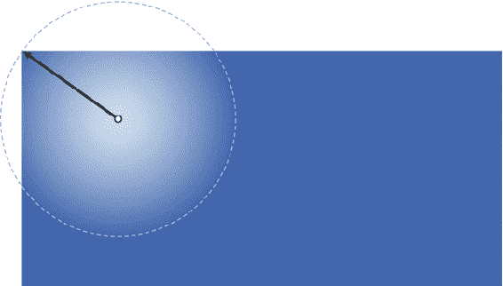

###### 图 5-28。我们的个人资料页面标题有一个圆形径向梯度，定位在 20% 30%，大小扩展到最近的角落

考虑到我们的轮廓框示例形状，我们可能需要一个居中的径向渐变，椭圆形状。让我们尝试一些更迷幻的东西(见图 5-29 ):

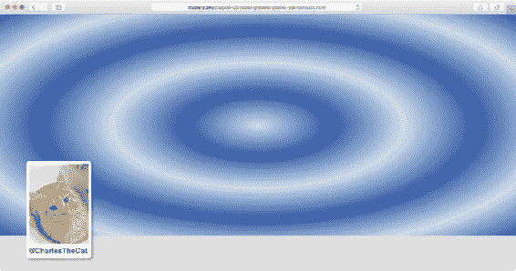

###### 图 5-29。放射状渐变中的几个重复色标

```html
.profile-box {
  background-image: radial-gradient(#cfdfee, #2c56a1, #cfdfee, #2c56a1, #cfdfee, #2c56a1);
}
```

我们实际上忽略了声明它是一个椭圆的部分，该椭圆居中并覆盖整个元素(通过延伸到最远的角)；在这种情况下，所有这些属性都包含在默认值中。但是像那样重复这些颜色停止似乎有点乏味，不是吗？这就是重复渐变的由来。

### 重复渐变

在沿着线(或光线)的某一点，法线渐变在最终颜色处停止。还有线性和径向的重复渐变函数(见图 5-30 )，只要它们的大小允许(通过背景大小属性或元素大小)，就重复颜色停止序列。例如，这里有一个重复的线性渐变:

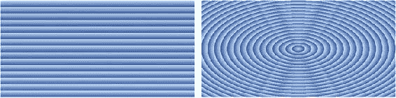

###### 图 5-30。重复渐变功能会在整个背景图像区域重复颜色停止列表

```html
.linear-repeat {
  background-image: repeating-linear-gradient                              (#cfdfee, #2c56a1 20px);
}
```

这是一个重复的径向梯度:

```html
.radial-repeat {
  background-image: repeating-radial-gradient(#cfdfee, #2c56a1 20px);
}
```

### 渐变作为图案

渐变不一定需要在几个像素上平滑过渡。它们也可以从一个像素变化到下一个像素，让我们可以创建更清晰的线条和圆圈。将这一点与在彼此之上层叠多个背景图像的能力相结合，为我们提供了一种工具来声明性地创建简单的背景图像模式，而无需打开图像编辑软件！

创造清晰图案的诀窍是以正确的方式放置色标。例如，要画一条简单的垂直线，我们需要将相邻的色标放在一起，这样就没有颜色逐渐变化的空间(见图 5-31 ):

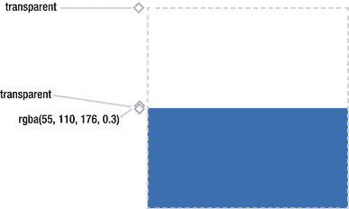

###### 图 5-31。第二个和第三个色标都位于 50%，在颜色之间产生明显的变化

```html
body {
    background-color: #fff;
    background-image: linear-gradient(
        transparent,
        transparent **50%**,
rgba(55, 110, 176, 0.3) **50%** 
      );
    background-size: **40px 40px**;
  }
```

根据浏览器的不同，您可能会发现它并没有完全清晰地显示线条，而是实际上向两边渐变了 1 px。随着浏览器在渲染渐变方面变得更好，这可能会得到改善，但对于更微妙的模式来说应该足够好了。

我们没有在整个元素上使用重复的线性渐变，而是使用了单一渐变，然后使用背景属性调整和重复生成的图像。这让我们可以控制线条的比例，而不会影响颜色停止。通过添加另一个渐变图像，这次是水平运行，我们可以构建一个“桌布”图案(见图 5-32 ):

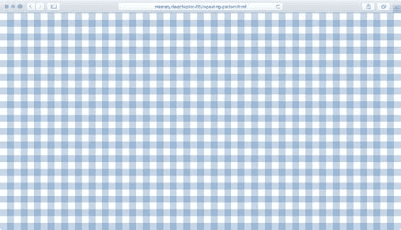

###### 图 5-32。用两条线性渐变线绘制背景图案

```html
body {
    margin: 0;
    background-color: #fff;
    background-image: linear-gradient(
          transparent,
          transparent 50%,
          rgba(55, 110, 176, 0.3) 50%
        ),
      linear-gradient(
          to right,
          transparent,
          transparent 50%,
          rgba(55, 110, 176, 0.3) 50%
        );
    background-size: 40px 40px;
  }
```

想象一下你可以用线条、三角形(半填充对角线渐变)、圆形和椭圆形的基本形状(重叠)的倍数想象出丰富的形状，这并不是一个很大的进步。

一个很大的灵感来源是 Lea Verou 在[`lea.verou.me/css3patterns/`](http://lea.verou.me/css3patterns/)的 CSS3 模式画廊(见图 5-33 )。

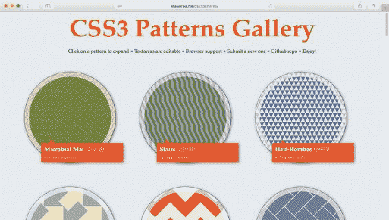

###### 图 5-33。Lea Verou 的 CSS3 模式库

#### 使用 CSS 绘图

将渐变图案与方框阴影和伪元素结合起来，你就有足够的机会创造出创造性的效果*，而无需加载一张图像*。另一个鼓舞人心的资源是艺术家兼设计师林恩·费希尔的项目“一个单独的格子”(【http://a.singlediv.com】[)。这是一个用 CSS 完成的插图集合，其中每幅插图只需要标记中的一个元素，没有图像(见图](http://a.singlediv.com) 5-34 )。

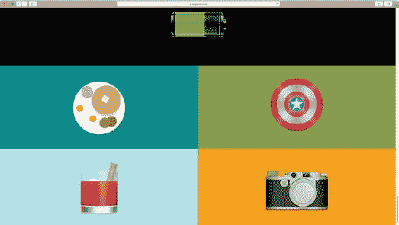

###### 图 5-34。《一个格子》的插图

请记住，在某些时候，这些 CSS 绘图的代码可能会变得比创建一个 SVG(或 PNG)图像文件并使用它更难理解和维护。还值得记住的是，尽管渐变避免了加载外部图像资源，但它们本身也会对性能产生相当大的影响——尤其是在手机等资源受限的设备上。径向梯度尤其值得保持最小。

## 设计嵌入图像和其他对象的样式

在设计文档流中的图像样式时，您处理的内容不同于构成页面的其他框。这是因为图像可能有固有的宽度和高度(以像素为单位)、需要考虑的设定纵横比，或者两者都有。在灵活的设计中，内容取决于浏览器窗口的宽度，您需要使用 CSS 来驯服图像和其他嵌入对象。

###### 注意

为当前渲染尺寸加载不同的图像——被称为*响应图像*——对于性能来说是一个非常重要的话题，但我们现在把它放在一边。我们将回到第八章的响应技术。

### 灵活的图像模式

使用理查德·鲁特([`clagnut.com/blog/268/`](http://clagnut.com/blog/268/))发明的一项技术，可以使图像变得灵活，而不会显示得比其固有尺寸大，也不会扭曲纵横比。在其核心，你只需要以下规则:

```html
img {
  max-width: 100%;
}
```

应用于图像的 max-width 属性意味着图像将根据其所在容器的边界缩小，但如果容器更宽，它将不会增长到其固有大小之外*(参见图 5-35 )。*

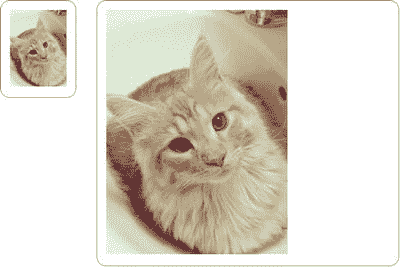

###### 图 5-35。320 像素宽的位图图像，最大宽度:100%显示，容器宽度为 100 像素，而容器宽度为 500 像素

我们可以通过将此规则扩展到以下内容来扩展它，以涵盖更多的基础:

```html
img {
  width: auto;
  max-width: 100%;
  height: auto;
}
```

为什么有额外的规则？嗯，有时标记作者或内容管理系统在 HTML 源代码中把宽度和高度属性与图像尺寸放在一起。

将宽度和高度设置为 auto 部分是为了覆盖这些属性，但也是为了解决 IE8 中的一个错误，即没有声明宽度属性的图像有时无法正确缩放。

### 新的对象大小调整方法

有时，您最终希望将大小应用于 img 元素和其他嵌入对象(如视频或对象元素),这些对象与它们内部显示的媒体具有不同的纵横比。例如，您可能有一个矩形图像文件作为用户头像占位符(见图 5-36 )，但您希望使用 CSS 将其显示为正方形。


###### 图 5-36。矩形用户化身图像

一些新的神奇属性和关键字最近已经被标准化，并正在进入浏览器，允许您以更灵活的方式调整这些类型元素的内容的大小和位置。使用 object-fit 属性，我们可以调整图像内容的大小，就像使用较新的背景大小关键字一样，同时保持纵横比:

```html
img {
  width: 200px;
  height: 200px;
}
img.contain {
  object-fit: contain;
}
img.cover {
  object-fit: cover;
}
img.none {
  object-fit: none;
}
img.scaledown {
  object-fit: scale-down;
}
```

图 5-37 说明了当以与固有尺寸不匹配的设定尺寸显示图像时，这些关键字之间的区别。

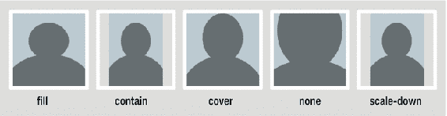

###### 图 5-37。固定大小图像的示例，其内容使用对象适合属性的不同关键字来调整大小

对象适配的默认行为是填充，这意味着图像的内容将随着元素尺寸而拉伸，这可能会导致纵横比失真。

cover 和 contain 关键字的作用与它们在 background-size 属性中的作用相同。当使用 none 时，使用原始图像的精确尺寸，而不管元素的大小。最后，还有缩小，它会在无和包含之间自动选择，选取最小的结果尺寸。生成的图像居中，但可以使用对象位置进行定位，就像定位背景图像一样。

到目前为止，支持仅限于 Chrome、Opera、Safari 和 Firefox 的最新版本，尽管在编写本文时 Safari 还不支持对象位置。没有任何版本的 IE 或 Edge 支持这种行为，尽管 Edge 很可能会紧随其后，很快支持这些属性。

### 具有长宽比意识的柔性容器

对于位图图像，正如我们在前面几节中看到的，纵横比是内置的:它们有固定的宽度和高度，只要您将高度设置为自动，并且只更改宽度(反之亦然)，事情看起来仍然正确。

但是，如果您正在设计的元素没有固有的纵横比，而您想给它一个纵横比，同时保持它的灵活性和可调整性，会发生什么情况呢？

iframe 和 object 元素就是这种情况，在某种程度上，SVG 内容也是如此。一个常见的例子是将来自 YouTube 或 Vimeo 等网站的视频嵌入页面时得到的标记:

```html
<iframe width="420" height="315" src="https://www.youtube.com/embed/dQw4w9WgXcQ" frameborder="0" allowfullscreen></iframe>
```

如果我们像这样设置一个灵活的宽度:

```html
iframe {
  width: 100%; /* or any other percentage, really…*/
}
```

…这将产生一个 100%宽的 iframe，但由于 height 属性，它仍然是 315 像素高。由于视频有一个设定的长宽比，我们希望高度自动调整。

设置自动高度或删除该属性不起作用，因为 iframe 没有固有的高度，它很可能变成 150 像素高。为什么是 150 像素？CSS 规范规定被替换的内容(比如 iframes、images、object 元素等。)没有指定的或固有的尺寸，退回到 300 像素宽和/或 150 像素高的尺寸。奇怪但真实。

为了解决这个问题，我们需要应用一些聪明的 CSS 技巧。首先，我们将 iframe 放在包装元素中:

```html
**<div class="object-wrapper">** 
    <iframe width="420" height="315" src="https:////www.youtube.com/embed/dQw4w9WgXcQ" frameborder="0" allowfullscreen></iframe>
**</div>** 
```

然后，我们让包装框的大小与我们想要嵌入的对象的长宽比相同。为了弄清楚这一点，我们用原始高度(315 像素)除以原始宽度(420 像素)得到一个结果比率:315/420 = 0.75。所以高度是宽度的 75%。

接下来，我们将包装器的高度设置为 0，但是将底部填充设置为我们得到的数字—75%:

```html
.object-wrapper {
  width: 100%;
  height: 0;
  padding-bottom: 75%;
}
```

你可能从第三章中记得，当垂直填充和边距以百分比设置时，它们实际上指的是包含块的*宽度——在这种情况下，宽度是 100%(与包含块相同)，所以填充是 75%。我们现在已经创建了一个具有设定纵横比的块。*

最后，我们将嵌入的对象放在包装器中。即使包装器的高度为 0，我们也可以使用绝对定位将元素放置在“支持纵横比”的填充框中:

```html
.object-wrapper {
  width: 100%;
  height: 0;
**position: relative;** 
  padding-bottom: 75%;
}
.object-wrapper iframe {
**position: absolute;** 
  top: 0;
  right: 0;
  bottom: 0;
  left: 0;
}
```

就是这样！现在，我们有办法将灵活的对象嵌入到页面中，并创建其他保持纵横比的元素。图 5-38 显示了该过程。

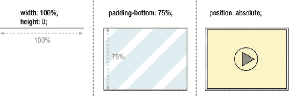

###### 图 5-38。创建支持纵横比的容器

存在一个警告:如果我们希望包装器不是 100%宽，我们将不得不重新计算填充底部的尺寸。因此，使用另一个包装器来实现进一步的灵活性可能是一个好主意；然后，我们可以将外层包装的宽度设置为我们喜欢的宽度，将内层包装的宽度设置为 100%，这样就完成了。

这项技术是由开发者 Thierry Koblentz 率先提出的，你可以在[`alistapt . com/article/creating-intrinsic-ratios-for-video`](http://alistapart.com/article/creating-intrinsic-ratios-for-video)阅读对它的深入解释。

### 减小图像文件大小

当你使用图片作为设计的一部分时，你需要确保你不会向你的用户发送不必要的大图片。当然，您可以使用 CSS 来缩放和裁剪它们，但是每个不必要的像素都会导致性能损失。下载时间过长，电池耗尽，处理器浪费时间调整图像大小，这些都是良好用户体验的敌人。

减少不必要的文件大小的第一步是优化您的图像。图像文件通常包含大量的元数据，浏览器并不真正需要这些元数据来正确显示图像，有一些程序和服务可以帮助你从文件中剥离这些内容。艾迪·奥斯马尼在 https://addyosmani.com/blog/image-optimization-tools/做了一次精彩的综述。他提到的许多工具都是自动化任务运行器的一部分——我们将在第十二章中回头来看看这类工作流。

如果您正在处理 PNG 图像以获得更简单的图形，那么通过减少图像中的颜色数量，您也可以极大地减小文件大小。如果您在图像中使用 alpha 透明度，大多数图像编辑软件只会让您以 PNG24 格式导出它。事实是，即使是更简单(也小得多)的 PNG8 格式也可以包含 alpha 透明度，因此通过将图形转换为这种格式，您可以获得更多的收益。有基于网络的服务，比如帮助你在线转换 PNG 文件的[`tinypng.com`](https://tinypng.com)，还有几个适用于所有操作系统的独立应用。一些专业图像编辑程序，如 Photoshop，在最新版本中内置了这一功能。

如果您正在使用 SVG 图形，您应该知道大多数处理 SVG 的图像编辑器导出的文件中有许多不必要的数据。一个非常有用的优化 SVG 的工具是杰克·阿奇博尔德的 OMG SVG([`jakearchibald.github.io/svgomg/`](https://jakearchibald.github.io/svgomg/))——一个在线工具，让你调整一系列参数，使你的文件更精简，它甚至可以离线工作！

我们将在第十二章中深入分析和调试性能的技术。

## 摘要

在这一章中，我们已经学习了很多设计页面盒子样式的技巧。我们探讨了如何使用各种颜色语法，以及如何使用透明度。我们已经了解了如何控制背景图像，以及如何相对于元素框定位、调整大小、重复和裁剪它们。

我们还向您展示了如何使用边框，以及如何通过使用边框半径来创建圆角，甚至是圆形，从而打破默认的四方形。

我们尝试使用阴影，既作为一种在页面中创造深度的手段(作为盒子上的插入或开始阴影)，也作为一种绘制“额外矩形”来创造其他视觉效果的手段。此外，我们还研究了如何使用线性和径向渐变，既作为微妙的效果，也作为让浏览器为您绘制图像模式的一种方式。

我们讨论了内容图像和背景图像之间的差异，以及如何灵活地设计内容图像的样式，还有其他嵌入的内容，包括支持纵横比的容器。

我们将在第十一章回到一些更高级(但不太受支持)的视觉效果。同时，在下一章中，我们将最终结合我们的尺寸、样式、定位框和文本的知识，使用新旧技术和属性为 Web 做适当的布局。