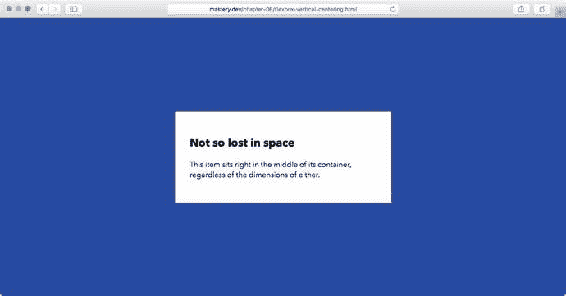

# 六、内容布局

一个网页，在最基本的层面上，是由不同的内容块组成的:标题、段落、链接、列表、图像、视频等等。这些要素可以按主题分组；构成新闻故事的标题、一些文本和图像。通过控制每个组件中项目的位置、大小、顺序和间距，我们可以更好地传达它们的功能和意义。

这些内容通常会进一步组合到整个页面的布局中。我们将在下一章中探讨如何系统地编排整个页面。在本章中，我们将继续关注各个内容块以及如何对它们进行布局。

我们已经简单地提到了使用定位和浮动来布局，它们都有优点和缺点。您还可以引导其他属性，如表格显示模式和内联块，在布局中发挥它们的作用，各有利弊。新的*柔性盒布局模块*——或简称为*flexbox*——提供了一整套属性来控制排序、方向、对齐和大小。Flexbox 是一个强大的工具，我们将详细介绍它。

在本章中，我们将了解以下内容:

*   绝对与相对定位以及 z 索引的常见使用案例

*   使用浮动、内联块和表格显示进行布局

*   掌握垂直对齐和垂直居中

*   使用 flexbox 进行定位、调整、订购和调整

## 使用定位

在第三章中，我们提到定位并不是高级布局的最佳工具，因为它将元素从页面流中剔除。另一方面，这使得定位成为 CSS 的一个重要部分。在这一节中，我们将简要分析一些定位是有用工具的场景。

从第章到第章，快速回顾一下:

*   元素最初被定位为*静态*，这意味着块级元素垂直堆叠。

*   我们可以给元素*相对*定位，允许我们相对于它们的原始位置轻推它们，而不改变它们周围的元素流。这样做也为后代元素创建了一个新的定位上下文。最后一个事实使得相对定位非常有用。从历史上看，移动元素的能力是许多老派布局技巧的重要组成部分，但现在我们没有它们也能应付过去。

*   *绝对*定位允许我们给一个元素一个关于最近的定位上下文的精确位置，它或者是一个定位非静态的祖先，或者是 html 元素。在这个模型中，元素被从页面流中提取出来，并相对于它们的定位上下文放回原处。默认情况下，它们会停留在原本应该停留的位置，但不会影响周围的元素。然后，我们可以选择更改它们相对于定位上下文的位置。

*   *固定*定位基本与绝对相同，但定位上下文自动设置为浏览器视口。

### 绝对定位用例

绝对定位的本质使它成为创建覆盖、工具提示和对话框等位于其他内容之上的东西的理想选择。它们的位置可以用 top、right、bottom 和 left 属性给出。关于绝对定位，有几件事是值得了解的，可以帮助您编写更高效的代码。

#### 使用初始位置

对于这个例子，我们使用的是一篇关于宇宙飞船的文章，我们想引入一些行内注释。我们希望将它们显示为空白处的小注释气泡，如图 6-1 所示。


###### 图 6-1。在文章旁边显示页面内评论

每个注释都是位于注释所指段落之后的旁注元素:

```html
<p>This is a fake article[...]</p>
<aside class="comment"> I've never done this. Is that really true?</aside>
<p>You may think[...]</p>
```

为了让评论显示在它所指的段落的末尾，我们需要绝对定位它。诀窍是我们*不需要*给它一个从物品容器顶部的精确的偏移量来在垂直方向上正确定位它。

当定位上下文的偏移量未定义时，绝对定位的元素将保留它们作为静态元素的位置，因此第一步是将注释留在原处(参见图 6-2 ):

```html
.comment {
 position: absolute;
}
```


###### 图 6-2。对注释应用绝对定位会将它从流中提升出来，但默认情况下会将它留在原本会以静态位置结束的地方

现在，我们需要将注释向左上方移动，使其位于上一段末尾的空白处。这种轻推听起来像是相对定位的工作，但是我们不能让一个元素同时被绝对定位和相对定位。如果我们使用方向偏移(顶部、右侧、左侧和底部)来定位它，我们将依赖于父定位上下文和周围元素的确切大小。幸运的是，我们不需要！相反，我们可以使用负边距来微调元素:

```html
.comment {
  position: absolute;
**width: 7em;** 
**margin-left: -9.5em;** 
**margin-top: -2.5em;** 
}
```

负边距在 CSS 中完全有效，并且有一些有趣的行为:

*   左边距或上边距为负会将元素拉向那个方向，与它旁边的任何元素重叠。

*   负的右边距或下边距会拉近任何相邻的元素，使它们与具有负边距的元素重叠。

*   在浮动元素上，与浮动方向相反的负边距将减小浮动区域，导致相邻元素与浮动元素重叠。浮动方向上的负边距会将被浮动的元素拉向那个方向。

*   最后，当在没有定义宽度的非浮动元素上使用时，侧面的负边距行为会稍微缓和一些。在这种情况下，左边和右边的负边距都将元素拉向那个方向。这个*扩展了*元素，潜在地覆盖了任何相邻的元素。

在我们的注释气泡的例子中，我们使用负的左边距和上边距来将元素拉到适当的位置，就像我们使用相对定位一样。

#### 额外收获:在 CSS 中创建三角形

在图 6-1 所示的评论气泡中，指向前一段的小三角形状依次相对于评论气泡绝对定位。它被创建为一个伪元素，并使用一个带有边框的老技巧赋予了一个三角形。(这至少可以追溯到 2001 年——请看坦泰克·切利克的这篇文章:【http://tantek.com/CSS/Examples/polygons.html。)图 6-3 显示了它是如何工作的。

```html
.comment:after {
  position: absolute;
  content: '';
  display: block;
  width: 0;
  height: 0;
  border: .5em solid #dcf0ff;
  border-bottom-color: transparent;
  border-right-color: transparent;
  position: absolute;
  right: -1em;
  top: .5em;
}
```


###### 图 6-3。创建具有零尺寸元素和边框的箭头。由于右边缘和下边缘是透明的，所以留下了一个三角形

在这里，我们创建一个 0 × 0 像素的块，它有一个 5 em 的边界，但是只有顶部和右侧的边界边缘有颜色，所以我们最终得到一个三角形，因为角的边界边缘是倾斜的。一种不用图像就能生成三角形的简便方法！然后我们定位三角形，使其突出于评论框的右上角(见图 6-4 )。


###### 图 6-4。相对于注释内容定位三角形

#### 使用偏移量自动调整大小

在标尺的另一端，它有助于了解当元素被绝对定位并声明了许多或所有的偏移量时，元素是如何反应的。没有任何声明的*大小*，绝对定位的元素将回落到包含其内容所需的大小。当我们从定位上下文的相对两侧声明偏移量时，元素将拉伸以适应满足这些规则所需的大小。

例如，我们可能会遇到这样的情况，我们希望在距离另一个元素的边缘一定距离处调整某个元素的大小，但不在任何一个元素上使用特定的大小。例如，我们可能在一幅图像的上面有一个包含文本的框，如图 6-5 所示。


###### 图 6-5。图像顶部的半透明框相对于右侧、底部和左侧绝对定位。到顶端的距离由内容决定

```html
<header class="photo-header">
  
  <div class="photo-header-plate">
    <h1>SpaceX unveil the Crew Dragon</h1>
    <p>Photo from SpaceX on <a href="https://www.flickr.com/photos/spacexphotos/16787988882/">Flickr</a></p>
  </div>
</header>
```

假设我们不希望容纳标题的半透明“板”占据特定的宽度，我们可以从右侧、底部和左侧放置它，让它自己计算出它的尺寸和顶部边缘位置:

```html
.photo-header {
  position: relative;
}
.photo-header-plate {
  position: absolute;
**right: 4em;** 
**bottom: 4em;** 
**left: 4em;** 
  background-color: #fff;
  background-color: rgba(255,255,255,0.7);
  padding: 2em;
}
```

无论图像的尺寸如何，板现在将位于图像的底部，距离底部和侧面 4 ems。这为我们提供了一些在不同屏幕尺寸下都能很好工作的东西——如果有换行符，板的上边缘会根据内容高度进行调整(见图 6-6 )。


###### 图 6-6。在较小的屏幕尺寸下，文字会随着框的向上增长而换行

### 定位和 z 索引:堆叠上下文陷阱

聪明地使用定位的最后一个要素是很好地掌握 z 索引:元素的堆叠顺序。我们在第三章中提到了基础知识:位置不是静态的元素根据它们在源代码树中的深度排列成堆栈，就像扑克牌叠放在一起一样。更改 z 索引会更改它们在堆栈中的顺序。

任何具有设置为正值的显式 z-index 声明的元素在堆栈中的位置都比没有 z-index 声明的元素高。具有负值的元素显示在没有 z 索引的元素后面。

但是 z 索引并不是唯一控制元素堆叠方式的东西。我们还有一个*堆栈上下文*的概念。将卡片组的类比延伸一点，每张卡片也可以是它自己的卡片组，卡片只能根据当前的卡片组级别进行排序。总是有一个*根堆栈上下文*开始，z 索引不是 auto 的定位元素在其中排序。随着其他上下文的形成，它们创建了堆栈的层次结构。

特定的属性和值创建了这些新的堆叠上下文。例如，position: absolute 和 z-index 声明设置为除 auto 之外的任何值的元素将为其中的后代元素形成堆栈上下文。

在堆栈上下文中，z-index 值的大小无关紧要:你不能相对于*另一个*堆栈上下文重新排序(见图 6-7 )。


###### 图 6-7。容器 A、B、C 和 D 都是绝对定位的，其中 C 是 B 的子元素。容器 C 和 D 应用了 z-index，但是由于容器 B 的不透明度小于 1，它创建了一个新的堆叠上下文，与其他上下文分开。z-index 不会将 C 放在 D 的前面，不管数字有多高

这些触发规则之一是将不透明度设置为小于 1 的值。不透明度较低的元素在放置到页面上之前需要单独呈现(与其后代元素一起),因此这些规则是为了确保在这种情况下没有外部元素可以插入半透明元素之间。本书附带的文件中有一个代码示例，可以让您处理这种情况。

在本书的前面，我们将遇到其他的例子，比如 transform 和 filter 属性，它们也可以触发新的堆栈上下文的创建。在本章的最后，我们将了解使用 z-index 和 flexbox 的一些特性。

## 水平布局

一般来说，随着内容的增加，网页在垂直方向上增长。您添加的任何块容器(div、article、h1–h6 等。)将垂直堆叠，因为它们显示为具有自动宽度的块。正因为如此，当你想给内容块一个宽度，并让它们在水平方向*彼此相邻*时，最基本的布局挑战之一就出现了。

我们已经在第三章看到了一个使用浮动设计小型“媒体组件”的例子。这种一边是图像(或其他类型的媒体)，另一边是一段文本的模式是布局的原子模式的一个很好的例子:“这个东西紧挨着另一个东西，它们属于一起。”如果你查看任何网站，你肯定会看到这种模式一次又一次地重复(见图 6-8 )。


###### 图 6-8。Wired.com 一部分的截图。你能发现多少“媒体对象”？

还有许多其他常见的模式出现在各种各样的网站上。很多都和横向布局有关。像 flexbox 这样的新标准是为了满足水平布局(以及更多)而创建的，但是在 flexbox 得到普遍支持之前，您可能需要采用浮动、内嵌块显示或表格显示模式来创建水平布局模式。

### 使用浮动

在飞船文章中，我们有一个关于浮动最基本用法的例子。该图浮动到右侧，允许文本的行框围绕其周围和下方流动(参见图 6-9 )。我们还使用了负的右边距来将图像从文本中拉出一段距离。


###### 图 6-9。使用一个浮动的数字，使用负边距-右拉出

```html
<p>You may think[...]</p>
  <figure>
    
    <figcaption>The "Dragon" spaceship, created by SpaceX. Image from <a href="https://www.flickr.com/photos/spacexphotos/16787988882/">Flickr.com</a></figcaption>
  </figure>
<p>There's various [...]</p>
figure {
  background-color: #eee;
  margin: 0;
  padding: 1em;
  float: right;
  max-width: 17em;
  margin-right: -8em; /* pull to the right */
  margin-left: 1em;
}
```

在图 6-10 中，我们移除了负边距，并限制该图占据宽度的 50%。我们还在第一个数字之后添加了第二个数字。这两个图形现在将水平并排放置。


###### 图 6-10。两个宽度为 50%的浮动图形，并排放置

```html
figure {
  float: right;
  width: 50%;
}
```

这种效果——浮动项目充当“行”中的“列”——形成了无数 CSS 布局技术的基础。正如在第三章中所讨论的，浮动有一些奇怪的地方会让你犯错。请记住，浮动实际上并不在页面流中，所以您可能需要一个包含浮动的元素。通常，这是通过对容器内的(伪)元素应用 clear，或者通过一个规则使容器成为一个新的块格式上下文来实现的。如果需要的话，浮动也可以包装成多行，但是会卡在从上面的行伸出的前面的浮动上。

浮动还可以提供一些有限的水平内容的重新排序，与源顺序无关。例如，我们可以通过向左浮动而不是向右浮动来切换图形的位置(参见图 6-11 )。


###### 图 6-11。通过向另一个方向浮动来交换图形的位置

由于无处不在的浏览器支持和浮动的相对多功能性，它们已经成为许多水平布局变化的首选解决方案。当我们为高级页面布局构建一个小的网格系统时，我们将在第七章回到使用它们。但是还有其他 CSS 属性允许我们创建水平布局模式，它们有各自不同的优缺点，我们将在接下来的章节中看到。

### 作为布局工具的内嵌块

文本行本身就是一种水平布局，至少在从左到右或从右到左书写的语言中是这样。当我们使用行内元素(如 span、time 或 a)时，它们与文本在同一方向水平排列。我们还可以将*内联块*放入该流中，创建水平排列的元素，但在视觉格式方面充当块，并且可以在其中包含其他块。

例如，让我们在飞船文章的底部添加一些元数据，由一个作者姓名、一张照片和一个电子邮件地址组成。我们还增加了几个额外的跨度作为造型挂钩:

```html
<p class="author-meta">
  <!-- image from Jeremy Keith on Flickr: https://flic.kr/p/dwFRgH -->
  
  <span class="author-info">
    <span class="author-name">Written by Arthur C. Lark</span>
    <a class="author-email" href="mailto:arthur.c.lark@example.com">arthur.c.lark@example.com</a>
  </span>
</p>
```

的内容。作者-元段落现在将对齐，图像的底部边缘位于文本的基线上。任何空白字符，包括例如图像和作者信息开始的行之间的换行符，都将呈现为空白。该空间的宽度取决于字体系列和字体大小(参见图 6-12 )。


###### 图 6-12。我们的作者元数据。注意图像和文本之间的空白。

接下来，我们将把图像和作者信息转换成内嵌块:

```html
.author-image,
.author-info {
  display: inline-block;
}
```

在渲染方面，组件在这个阶段看起来是一样的。不同之处在于，我们可以开始将图像和信息视为块。例如，我们可以将作者信息中的姓名和电子邮件地址放在图像旁边的单独行中，方法是将它们更改为块显示:

```html
.author-name,
.author-email {
  display: block;
}
```

我们现在已经非常接近视觉效果了，例如，一个文本块旁边的浮动图像(如第三章中的“媒体块”示例)。一个区别是作者信息块的最后一条基线与图像的底部对齐。我们在图 6-13 中看到了结果，我们在图像和作者信息周围添加了一个虚线轮廓，以可视化这两个元素之间的关系。


###### 图 6-13。作者信息的基线现在与图像的底部对齐

我们现在可以通过改变 vertical-align 属性来相对于图像移动作者信息。当对齐设置为顶部时，作者信息块的顶部将与图像的顶部对齐(参见图 6-14 )。


###### 图 6-14。使用 vertical-align: top 将作者信息对齐到图像顶部

#### 带内嵌块的垂直居中

现在，假设我们想要的设计是作者信息块相对于图像垂直居中。尝试这样的事情可能很有诱惑力:

```html
.author-info {
  vertical-align: middle;
}
```

…但这可能不会达到您预期的效果！图 6-15 显示了结果。


###### 图 6-15。使用垂直对齐时作者信息的位置:中间

这就是事情变得有些棘手的地方。关键字 middle 应用于内联块时，意味着“将该内联块的垂直中心与文本行的 x 高度的中间对齐”在这种情况下，有*就有*没有内联文本。因此，图像(是行中最高的元素)决定了行框的高度和基线的结束位置。因此，x 高度的中心正好位于图像底部的上方。为了使作者信息在图像的垂直中心居中，我们需要使两个元素指向同一个“中间”:

```html
.author-image,
.author-info {
  vertical-align: middle;
}
```

当图像是一个内嵌块时，它也在作者信息的同一个垂直点上垂直居中，产生了我们想要的布局，如图 6-16 所示。


###### 图 6-16。将 vertical-align: middle 应用于图像和作者信息，使它们在同一点上垂直居中

如何决定行框基线的规则，以及它如何影响行内和行内块元素，是相当复杂的。如果你想深潜，我们推荐克里斯托弗·奥伊的文章《垂直对齐:你需要知道的一切》([`christopheraue.net/2014/03/05/vertical-align/`](http://christopheraue.net/2014/03/05/vertical-align/))。为了将内嵌块显示用作布局工具，在垂直对齐方面有两个重要的要点:

*   要使内联块顶端对齐(很像浮动)，设置 vertical-align: top。

*   要使内容彼此垂直居中，请确保它们都是内联块，然后使用 vertical-align: middle。

#### 容器元素内的垂直居中

上一个列表中的最后一点使我们能够在任意高度的容器中垂直居中内容，这需要一点技巧。唯一的先决条件是容器的高度设置为一个确定的长度。

例如，让我们假设我们想要使作者信息块 10 米高，并在其中垂直和水平地居中放置作者图像和信息。首先，我们将高度应用于。作者-元块。我们还将添加一个边框，使变化更容易被发现(见图 6-17 )。

```html
.author-meta {
  height: 10em;
  border: 1px solid #ccc;
}
```


###### 图 6-17。那个。添加了高度和边框的作者元块

照片和作者信息的垂直对齐与容器块无关，但与它们所在的假想文本行有关。为了垂直对齐它们，我们需要添加另一个内嵌块元素*，它占据了 100%的高度。该元素将强制 middle 关键字的对齐点位于容器的中间。为此，我们将使用伪元素。图 6-18 显示了当添加这个“虚元素”时，假设基线是如何计算的。*


###### 图 6-18。使用 100%高的伪元素来强制 middle 关键字以表示容器的垂直中心结束

```html
.author-meta:before {
  content: '';
  display: inline-block;
  vertical-align: middle;
  height: 100%;
}
```

至此，整个。author-meta 容器实际上将有一个占据整个高度的单行框。由于伪元素是垂直对齐设置为中间的内联块，所以其他内联块将垂直对齐容器的中心。我们现在需要做的就是将内容水平居中。由于内联块响应文本对齐，我们需要使用文本对齐:

```html
.author-meta {
  height: 10em;
**text-align: center;** 
  border: 1px solid #ccc;
}
.author-info {
**text-align: left;** 
}
```

这将导致。author-meta 水平和垂直居中，如图 6-19 所示。


###### 图 6-19。内容现在水平和垂直居中

实际上，水平居中并不完全正确。请记住，行框中的任何空白字符都将显示为一个空格。伪元素将创建一个这样的空间，将内容向右推几个像素。我们可以通过对伪元素应用负边距来取消空白空间的宽度:

```html
.author-info:before {
**margin-right: -.25em;** 
}
```

为什么是 0.25 毫米？在这种情况下，它恰好是当前字体中空白字符的宽度。这是一个“神奇的数字”，会随着使用的字体而变化。因此，它不是很健壮，我们不推荐任何系统化的布局工作。在我们的下一个水平布局例子中，我们将关注内联块作为布局工具的更详细的应用。

#### 获取正确的细节:对抗空白

当处理水平布局时，每个块占用一个精确的宽度，空白问题变得更加明显。我们将通过构建另一个通用组件来强调如何在使用内联块时解决这个问题，使用更少的幻数。

这一次我们创建了一个导航栏，由四个链接项组成，每个链接项正好占宽度的四分之一。我们从标记开始:

```html
<nav class="navbar">
  <ul>
      <li><a href="/home">Home</a></li>
      <li><a href="/spaceships">Spaceships</a></li>
      <li><a href="/planets">Planets</a></li>
      <li><a href="/stars">Stars</a></li>
    </ul>
</nav>
```

CSS 在颜色和字体方面为我们提供了一些基本的样式，以及突出项目之间边缘的轮廓。每个项目都设置为 25%的宽度，因此四个项目应该作为一个整体适合导航栏:

```html
.navbar ul {
  font-family: Avenir Next, Avenir, Century Gothic, sans-serif;
  list-style: none;
  padding: 0;
  background-color: #486a8e;
}
.navbar li {
  text-transform: uppercase;
  display: inline-block;
  text-align: center;
  box-sizing: border-box;
  width: 25%;
  background-color: #12459e;
  outline: 1px solid #fff;
}
.navbar li a {
  display: block;
  text-decoration: none;
  line-height: 1.75em;
  padding: 1em;
  color: #fff;
}
```

我们使用 box-sizing: border-box 来确保每个项目的任何边框或填充都包含在每个项目的 25%宽度中。导航栏本身的背景是蓝灰色的，而项目的背景是略暗的蓝色，带有白色的链接文本。

现在来看结果，如图 6-20 所示。


###### 图 6-20。遗憾的是，这个列表不能放在一行中，而且项目是分开的

HTML 源代码中的换行符呈现为空格字符，增加到每个项目的 25%宽度，并导致换行。例如，我们可以通过将所有的

*   Tags are placed in a line to eliminate these blank characters, but this requirement for tag format is fragile.

我们解决这个问题的首选方法有点残忍。它的工作原理是将容器本身的字体大小设置为 0(从而导致空格字符的宽度为零)，然后重新设置项目的大小:

```html
.navbar ul {
**font-size: 0;** 
}
.navbar li {
**font-size: 16px;** 
**font-size: 1rem;** 
}
```

这以一种可预测的方式消除了空白，使项目很好地适应容器，如图 6-21 所示。


###### 图 6-21。具有四个等宽项目的导航栏

这种技术有几个缺点。第一个与继承的字体大小有关。假设我们在导航条上使用 16 像素的字体大小，我们不能再使用 em 单位或百分比来继承列表项的灵活字体大小——它只会变成 0 的倍数。相反，我们可以通过使用 rem 单位将大小基于根字体大小来保留灵活的大小调整。对于不支持 rem 单位的浏览器(大多数是 Internet Explorer 8 和更早版本)，基于像素的测量作为一种后备措施。

第二个缺点与稍旧的基于 WebKit 的浏览器有关，在这种浏览器中，字体大小为 0 并不总是受欢迎的——例如，早期版本的 Android 4 上基于 WebKit 的浏览器。正如我们将在本章前面看到的，我们通常只使用内嵌块显示作为旧浏览器的后备，然后在 flexbox 等更现代的技术上再加一层。因为即使是这些旧的 Android 浏览器也支持 flexbox——尽管是旧版本——空白问题可能会成为一个问题。

###### 小费

如果你出于某种原因需要在这些旧的 Android 浏览器中使用内嵌块技术，还有一个关于字体的技巧。它的工作原理是在父元素上使用一个很小的自定义字体，只包含一个宽度为零的空格字符。然后在子元素上重置原始字体系列。详见开发者 Matthew Lein 的这个演示:[`Matthew Lein . com/articles/inline-block-no-space-font/`](https://matthewlein.com/articles/inline-block-no-space-font/)。

### 将表格显示属性用于布局

表格中的行具有我们在 navbar 示例中寻找的精确质量:许多“单元格”划分它们之间的空间，从不在多行上滑落。这也是为什么在网络早期，实际的 HTML 表格被用于布局的原因之一。现在，我们可以通过 CSS 借用表格的显示模式，而不需要借助基于表格的标记。

如果我们将导航栏示例更改为使用 ul 元素的表格显示模式，并将每个项目设置为显示为表格单元格，我们将获得与使用内联块时相同的外观:

```html
.navbar ul {
  /* some properties omitted for brevity. */
**width: 100%;** 
**display: table;** 
**table-layout: fixed;** 
}
.navbar li {
  width: 25%;
**display: table-cell;** 
}
```

这给了我们与前面的内嵌块示例完全相同的外观(如图 6-21 所示)。

请注意，我们已经将 ul 元素设置为 100%宽。这是为了确保 navbar 扩展以填充其父级。与常规块不同，没有设置宽度的表格具有“收缩以适应”宽度，除非单元格的内容将它们推出以填充其父容器。

对于如何计算表格行中每列的宽度，有两种算法。默认情况下，浏览器将使用“自动”算法。从标准的角度来看，它有些不明确，但是它基本上允许表格根据整个表格的单元格内容来调整列宽。

另一种算法是“固定的”表格布局。使用表格布局:固定，列宽根据表格的第一行确定。第一行上声明的任何宽度都会遇到“win”，如果后续行有更宽的内容，该内容将在单元格内换行，或者溢出。

虽然在这个示例中，将表格布局设置为 fixed 在技术上不是必需的，但是在使用表格显示模式作为布局工具时，通常会使用它，以避免自动模式带来的任何意外。

当使用表格显示模式进行布局时，您应该知道表格呈现的其他特点也适用。例如，不可能对呈现为表格单元格的元素应用边距，应用于表格单元格的定位行为充其量也是不可靠的。我们将在第九章回到 HTML 表格和 CSS 表格显示模式。

#### 表格单元格中的垂直对齐

表格显示模式的另一个有用的方面是，在这种情况下，垂直对齐的工作方式略有不同。在显示为表格单元格的元素上设置 vertical-align: middle 将使单元格的内容垂直居中对齐，没有任何额外的技巧。图 6-22 显示了如果我们给以表格形式显示的列表添加一个设定的高度，并将列表项垂直居中对齐会发生什么。

```html
.navbar ul {
  display: table;
  height: 100px;
}
.navbar li {
  display: table-cell;
  vertical-align: middle;
}
```


###### 图 6-22。为显示为表格单元格的列表项添加高度和垂直居中

### 不同技术的优缺点

当考虑将浮动、内联块和表格显示模式作为水平布局和垂直对齐的工具时，我们如何确定使用哪一种呢？每种方法都有利弊:

*   与内联块一样，**float**能够换行。浮动还根据其内容“收缩包装”到一个大小，这是一个有用的行为。消极的一面是，当包含或清除浮动时，浮动可能会给你带来痛苦，当浮动的项目卡在更高的浮动上时。另一方面，浮动在某种程度上是独立于源代码顺序的，因为您可以将一些元素浮动在一行的右边，而将其他元素浮动在左边。

*   内联块有空白问题，但是这些问题是可以解决的，尽管有一些蹩脚的解决方案。从积极的一面来看，内联块也可以换行到多行上，它们给你一些对垂直对齐的控制，并且它们有和浮动一样的“收缩换行”大小行为。

*   使用**表格显示模式**进行水平布局也很有效，但是只适用于非换行的内容行。它们和表格有相同的怪癖，也就是说，例如，它们不受边距的影响，并且里面的项目不能被重新排序。它们还允许其内容简单地垂直居中。

## flex box(flex box)的缩写形式

灵活框布局模块，称为 flexbox，是我们可以用来创建布局的一组较新的 CSS 属性。它由许多与容器元素( *flex 容器*)及其直接子元素( *flex 项目*)以及这些子元素的行为相关的属性组成。Flexbox 可以控制 flex 项目的几个方面:

*   大小，基于内容和可用空间

*   流向:水平或垂直，向前或向后

*   在两个轴上对齐和分布

*   订购，不考虑来源订单

如果对布局使用内联块、浮动和表格属性让你感到不舒服，flexbox 可能是你想要的解决方案。它是作为对我们在本章中已经看到的各种常见场景的直接响应而开发的。

### 浏览器支持和语法

所有主流浏览器的最新版本都支持 Flexbox。通过对语法和供应商前缀的一些调整，您也可以让它适用于各种稍旧的浏览器。

为了在 IE10 和更老的 WebKit 浏览器中实现支持，您需要用厂商前缀和稍微不同的属性来补充我们在本章中使用的标准语法，因为 flexbox 的语法在规范的各种迭代中已经改变了很多。有许多工具和文章描述了如何做到这一点，比如“Flexy Boxes”代码生成器([`the-echoplex.net/flexyboxes/`](http://the-echoplex.net/flexyboxes/))。

请注意，Internet Explorer 9 和更早版本根本不支持 flexbox。我们将在本章后面讨论这些浏览器的一些回退策略。

### 了解挠曲方向:主轴和横轴

Flexbox 允许您定义页面的一个区域，在这个区域中，可以根据顺序、大小、分布和对齐来控制一组元素。该空间内的框按两个方向排列:默认情况下，水平(作为一行)或垂直(作为一列)。该方向被称为*主轴*。

内部的方框也可以在垂直于主轴的方向上移动和调整大小:这被称为*横轴*(见图 6-23 )。通常，使用 flexbox 创建布局的最重要的度量是沿着主轴的尺寸:水平布局的宽度和垂直布局的高度。我们称这个尺寸为物品的*主尺寸*。


###### 图 6-23。定义行与列模式下的主轴和横轴，以及它们各自的主要大小属性

回到我们第一次在图 6-20 中看到的导航栏例子(一个包含链接的无序列表的包装器)，我们可以很容易地将其转换成一个水平的 flex 容器。假设其余的样式(颜色，字体，链接样式，边框)是相同的，我们需要最少的 CSS。我们还不需要列表项目本身的任何特定属性，并且项目上没有声明宽度(见图 6-24 ):

```html
.navbar ul {
  display: flex;
  /* this also implies flex-direction: row; unless told otherwise */
}
```


###### 图 6-24。使用 flexbox 创建的导航条

如图 6-24 所示，项目水平排列，并根据其中的内容缩小到最小尺寸。看待它的一种方式是，好像我们把块流旋转了 90 度。

项目也聚集在左侧，这是语言方向从左向右时的默认行为。如果我们将 flex-direction 属性更改为 row-reverse，项目将从右边缘开始，从右向左流动(参见图 6-25 )。注意顺序也是颠倒的！

```html
.navbar ul {
  display: flex;
**flex-direction: row-reverse;** 
}
```


###### 图 6-25。行中的流动项目-反向

如果没有其他尺寸，flex 容器中的项目会缩小到这个尺寸。这意味着行中的项自动获得最小宽度，列中的项获得最小高度，这两者都基于每个项中内容的最小大小。

### 对齐和间距

我们可以使用 flexbox 以各种方式沿着行分布项目。Flexbox 称沿主轴分布*对齐*，横轴分布称*对齐*。(为了便于记忆，请记住水平方向是默认的，在水平书写系统中，文本对齐也在水平方向上进行。诀窍是当方向改变时要记住哪个是哪个。)

现在我们可以用各种关键字和 justify-content 属性在主轴上分布项目。使项目按当前文本方向(在本例中是从左到右)对齐的默认值称为 flex-start。使用弯曲端使它们移动到另一侧(见图 6-26 )，但这次保持相同的顺序。图 6-27 、 6-28 和 6-29 分别显示了其他关键字:中心、间隔和环绕。


###### 图 6-26。使用 justify-content: flex-end 将项目向右移动


###### 图 6-27。使用 justify-content: center 使 flex 项目居中。额外的空间放置在边缘项目的外侧


###### 图 6-28。使用对齐内容:空格。在项目之间放置额外的空间


###### 图 6-29。使用对齐内容:空格。空间被平均划分并放置在每个项目的两侧。请注意，项目之间的空间不会折叠

Flexbox 不允许您使用这些关键字来调整单个项目。然而，当应用于 flexbox 项目时，用关键字 auto 设置边距值有稍微不同的含义，我们可以在这里使用它。如果某个元素的一侧的 margin 设置为 auto，并且容器中还有剩余空间，则该边距会扩展以填充可用空间。这可用于除一件物品外所有物品都需要放在一边的模式。例如，我们可以将所有项目放在右边，但将“Home”项目放在左边(见图 6-30 ):

```html
.navbar li:first-child {
  margin-right: auto;
}
```


###### 图 6-30。在第一个项目上使用 margin-right: auto 会耗尽所有剩余的空间，将其余的项目推到右边

请注意，像这样使用自动边距会抵消其他项目上任何对齐的影响，因为没有剩余的空间来分配。不过，您仍然可以在其他元素上设置单独的边距。

#### 横轴对齐

到目前为止，我们只处理了水平布局的基本问题，这对于 flexbox 来说轻而易举。Flexbox 还允许我们控制另一个轴的工作方式。如果我们增加 flex 容器本身或其中一个项目的高度，我们会发现默认属性会产生有趣的效果(参见图 6-31 ):

```html
.navbar ul {
**min-height: 100px;** 
}
```


###### 图 6-31。默认情况下，项目将拉伸以填充跨轴维度中的伸缩容器

似乎我们自动拥有了等高的物品！控制跨轴对齐的 align-items 属性的默认值是 stretch。这意味着所有 flex 项目将填满可用空间。我们还可以设置 flex-start、center 或 flex-end 的值(分别参见图 6-32 到 6-34 )，以使项目收缩回其原始大小，并与导航栏的顶部、中部或底部对齐。


###### 图 6-32。使用对齐项目:弹性开始


###### 图 6-33。使用对齐-项目:居中


###### 图 6-34。使用对齐-项目:柔性端

最后，可以使用 baseline 关键字将项目内文本的基线与容器的基线对齐，类似于内联块的默认工作方式。如果您有不同大小的盒子，您希望它们在横轴上放置不同的位置，但它们之间是对齐的，这将非常有用。

在图 6-35 中，我们添加了一个代表当前活动项目的类名:


###### 图 6-35。使用一个 navbar-active 类来显示选中的状态

```html
<ul>
      <li><a href="/home">Home</a></li>
      <**li class="navbar-active"**><a href="/spaceships">Spaceships</a></li>
      <li><a href="/planets">Planets</a></li>
      <li><a href="/stars">Stars</a></li>
</ul>
```

活动项目被赋予了更大的字体大小和 1:

```html
.navbar .navbar-active {
    font-size: 1.25em;
}
```

较大的活动项目现在决定了基线，其他项目也相应地自行对齐。

#### 对齐单个项目

除了将所有项目作为一组对齐之外，您还可以在横轴上为每个项目设置单独的对齐方式。例如，我们可以让“Home”项与左上方对齐，其余项与右下方对齐(参见图 6-36 ):

```html
.navbar ul {
   min-height: 100px;
   align-items: flex-end;
}
.navbar li:first-child {
**align-self: flex-start;** 
  margin-right: auto;
}
```


###### 图 6-36。使用自对齐进行单独对齐

#### 与 Flexbox 垂直对齐

最后，flexbox 对齐用很少的代码解决了垂直对齐问题。当容器中有单个项目时，我们只需要将父容器设置为 flex 容器，然后将我们希望居中的项目的边距声明设置为自动。请记住，在 flex 项目上设置为自动的边距将向所有方向扩展以“填充”。

```html
<div class="flex-container">
    <div class="flex-item">
      <h2>Not so lost in space</h2>
      <p>This item sits right in the middle of its container...<p>
    </div>
  </div>
```

我们现在可以将。使用下面的 CSS 水平伸缩项目*和垂直伸缩项目*，不管容器或项目的大小。在这个例子中，我们让容器和视窗一样高(在 html、body 和。flex-container 元素)，只是为了可视化结果，如图 6-37 所示。

```html
html, body {
  height: 100%;
}
```

```html
.flex-container {
  height: 100%;
  display: flex;
}
.flex-item {
  margin: auto;
}
```



###### 图 6-37。带 flexbox 和自动边距的垂直和水平居中

当 flex 容器中有几个项目时——就像我们的作者元数据示例中一样——我们可以使用对齐属性将它们聚集到水平和垂直中心(参见图 6-38 )。为此，我们将对齐和对齐都设置为居中。(顺便说一下，这也适用于单个项目，但是 margin: auto 方法需要的代码要少一些。)

```html
.author-meta {
  display: flex;
  flex-direction: column;
  justify-content: center;
  align-items: center;
}
```


###### 图 6-38。使用 flexbox 轻松实现多个元素的垂直居中

### 灵活的尺寸

Flexbox 让我们能够更好地控制规模。这是 flexbox 在详细内容布局方面如此出色的部分原因，但也是迄今为止 flexbox 最复杂的部分。不要担心这一部分一开始会让人不知所措——灵活的规模调整是您在“点击”之前需要做的事情之一

#### 灵活的上浆性能

这就是 flexbox 中“flex”的用武之地，正如三个属性 flex-basis、flex-grow 和 flex-shrink 中定义的那样。这些属性是在每个 flex 项目上设置的，而不是在容器上。

*   **flex-basis** 在根据可用空间进行修正之前，规定项目在主轴上的“首选”大小(宽度或高度)。它可以设置为长度(例如 18em)、百分比(基于容器的主轴大小)或关键字 auto(默认值)。

auto 关键字听起来像是将 width 或 height 设置为 auto，但事实并非如此。相反，这意味着项目将从相应的属性(宽度或高度)中获取其主要大小(如果设置了该属性的话)。如果没有设置主大小，元素将根据其内容调整大小，有点像浮点或内联块，

您还可以将值设置为 content，这也将根据项目的内容设置大小，但是*将忽略*任何设置了宽度或高度的主轴大小(与 auto 不同)。请注意，content 关键字是 flexbox 的新增功能，在撰写本文时对它的支持还不稳定。

*   **flex-grow** 规定当每个元素通过 flex-basis 被赋予其首选大小时，如果还有剩余空间会发生什么:你向它提供一个数字，称为*伸缩因子*，它作为额外空间的一部分计算出来。我们马上会解释分数是如何工作的。flex-grow 的默认值为 0，这意味着项目的增长不会超过它们从 flex-basis 获得的大小。

*   flex-shrink 的工作方式与 flex-grow 类似，但方向相反:如果没有足够的空间，元素将如何收缩？当伸缩开始起作用时，计算就有点复杂了——我们将在后面进一步讨论。默认值为 1，这意味着如果没有足够的空间，所有项目都将与其首选大小成比例缩小。

理解 flex-basis 如何处理 flex-grow 和 flex-shrink 是棘手的部分。Flexbox 使用一种相当复杂的算法来计算大小，但是如果我们将其简化为两个步骤，就会更容易处理:

1.  通过查看弹性基准来确定假设的主要尺寸。

2.  确定实际主要尺寸。如果在将项目放入具有假设主要大小的容器后，容器中还有任何剩余空间，它们可以增长。这一增长基于弹性增长因素。出于同样的原因，如果空间太小无法容纳它们，这些项目可以根据伸缩系数缩小。

我们可以通过一个例子把这些属性拼凑起来。在这个例子中，我们想象一个 1000 像素宽的容器。标记中的容器内有两个子项。其中一个包含一个短单词，导致这个特定的元素占据 200 像素的宽度。另一个包含一个长单词，宽度为 400 像素(见图 6-39 )。这些物品还没有放入容器中。


###### 图 6-39。一个 1000 像素宽的 flex 容器，以及两个尚未放入容器的 flex 项目

如果这些项目的 flex-basis 设置为 auto，并且没有声明显式宽度值，如下所示，则当它们被放入容器时，它们将保留基于内容的大小(参见图 6-40 )，总共占用 600 个像素的可用宽度。这是 flex-basis 的默认行为，与我们到目前为止在导航栏示例中看到的一样。

```html
.navbar li {
  **flex-basis: auto;** /* default value. */
}
```


###### 图 6-40。这些项目总共占用了可用的 1000 个像素中的 600 个像素，留下了 400 个像素的未使用空间

由于还有空间可供分配，灵活增长开始发挥作用。默认情况下，flex-grow 设置为 0，这不会改变项目的大小。但是当我们将两个项目的 flex-grow 都设置为 1 时会发生什么呢？

```html
.navbar li {
  flex-basis: auto;
**flex-grow: 1;** 
}
```

1 和 0 代表什么？嗯，这有点像鸡尾酒配方:1 份这个，2 份这个，3 份苏打水。它并不代表一个特定的度量，只是整体的一部分。

在这种情况下，有两个项目。两者现在将相等地增加可用空间的*1%*,这意味着它们都将增加剩余空间的一半，即 200 个像素。这意味着第一个项目将被调整到 400 像素的最终大小，第二个项目将是 600 像素，加起来正好填满容器，如图 6-41 所示。


###### 图 6-41。两个项目都增加了剩余 400 像素的一部分，即每个项目增加 200 像素

我们还可以为项目设置单独的弹性增长系数:

```html
.navbar li:first-child {
**flex-grow: 3;** 
}
.navbar li:last-child {
**flex-grow: 1;** 
}
```

这将导致第一个项目获得可用空间的四分之三，第二个项目获得四分之一。结果，这两个项目最终都是 500 像素宽！图 6-42 显示了在这种情况下，布局算法如何调整尺寸。


###### 图 6-42。第一项将增加可用空间的四分之三，而第二项仅增加四分之一

本例中的项目碰巧以同样的宽度结束。如果我们希望项目之间按比例划分整个空间，而不考虑内容，有更好的 flexbox 技术，我们接下来会发现。

#### 纯粹根据灵活因素进行规模调整

在我们在上一节中使用的简化 flexbox 布局算法的第一步中，项目的大小基于其内容的宽度，使用 flex-basis of auto，没有显式的宽度声明。如果我们假设弹性基数为 0，那么结果将是在第一步中没有空间被分配。*容器内的所有空间*将保留在步骤 2 中，根据伸缩系数进行划分，并设置项目的最终大小。

在图 6-43 中，项目的弹性基数为 0，弹性增长设置为 1。这意味着要划分的总空间由两部分组成，因此每个项目将正好占据分配空间的一半。这种效果接近于为布局计算和使用百分比，额外的好处是 flexbox 不在乎有多少个项目，它们会自动调整大小以适应总宽度。


###### 图 6-43。弹性基础设置为 0 的两个项目在算法的第一步中将占用零空间。然后，将完全根据它们的伸缩系数来确定它们的大小

这一次，我们将使用 flex 简写来同时设置 flex-grow、flex-shrink 和 flex-basis，按顺序声明并用空格分隔:

```html
.navbar li {
**flex: 1 0 0%;** 
}
```

注意值中 flex-basis 最后一个后面的百分号:速记中的 flex-basis 不能是无单位的，所以在这个实例中必须使用 0%或另一个单位，如 0px。

如果我们希望第一个项目占用的空间是任何其他项目的两倍，我们可以给它一个伸缩因子 2:

```html
.navbar li {
  flex: 1 0 0%;
}
**.navbar li:first-child {** 
**flex-grow: 2;** 
**}** 
```

将这一点应用到前面的带有四个项目的 navbar 标记中，我们得到一个 navbar，其中第一个项目占宽度的五分之二(或 40%)，接下来三个项目各占五分之一(或 20%)(见图 6-44 )。


###### 图 6-44。navbar 示例，其中第一个项目设置为增长 2 个单位，其余项目设置为增长 1 个单位

#### 收缩弹性项目

当要放入 flex 容器中的项目加起来超过可用空间时，我们可以允许它们基于 flex-shrink 属性进行收缩。机制比 flex-grow 更复杂一些。缩小项目的更复杂规则背后的想法是防止小项目缩小到零，只是因为较大的项目导致总宽度过大。允许一个项目有更多的空间是非常简单的(正如我们在 flex-grow 中看到的)，并且与可用空间成比例。当收缩发生时，它的方式略有不同。

回到我们假设的 1000 像素宽的导航栏，让我们假设有两个子项目，每个项目都有一个通过 flex-basis 设置的首选大小。它们一起超出容器宽度 300 个像素，如图 6-45 所示。

```html
.navbar li:first-child {
   flex: 1 1 800px;
}
.navbar li:last-child {
  flex: 1 1 500px;
}
```


###### 图 6-45。两个弹性物料，其组合弹性基础超出了容器宽度

组合的首选宽度(800 + 500 = 1300)超出了容器的大小 300 个像素，并且两项的 flex-shrink 值都为 1。你可能会认为这两个项目都缩小了 150 像素以腾出空间，但这不会发生。取而代之的是，每一项都将按伸缩系数和伸缩基数的比例收缩。从技术上讲，每个项目的伸缩系数都要乘以伸缩基数。接下来，该值除以每个项目的伸缩因子与其伸缩基准的乘积之和。最后，除法的结果乘以负的空间，给出我们要缩小的空间量。

这是你要记住的很多东西，但要点是:首选尺寸较大的项目比首选尺寸较小的项目收缩更多(相对于伸缩系数)。即使我们两个项目的伸缩系数都是 1，它们也会收缩不同的量。如果我们完成第一项的计算，结果如下:

```html
((800 × 1) / ((800 × 1) + (500 × 1))) * 300 = 184.6
```

第一项会缩小 184.6 像素。对第二个项目进行同样的计算，我们应该得到余数:

```html
((500 × 1) / ((800 × 1) + (500 × 1))) * 300 = 115.4
```

…这意味着第二个项目将缩小 115.4 个像素，总共减少了 300 个像素，以适应 flex 容器中的两个项目(参见图 6-46 )。


###### 图 6-46。更复杂的伸缩计算

在使用 flexbox 时，您需要牢记这一点吗？最有可能的答案是“不”。但是如果你正在努力使一个布局工作，意识到伸缩与伸缩的工作方式不同可能会防止你抓狂。

### 包装 Flexbox 布局

在导航栏和作者元数据示例中，我们只处理了一行内容。就像内联块或浮动一样，flexbox 允许我们将内容分成几行(或几列)，但是增加了控制。

###### 警告

包装成多行或多列的属性来自较新版本的规范。支持老的 flexbox 规范的浏览器，比如 Safari 的老版本，4.4 版之前的存量 Android 浏览器，28 版之前的 Firefox，都不支持换行。

这一次，我们将使用一个标签列表，代表行星的类别。这是一个带有链接的无序列表，很像导航栏，但是条目的数量可能会大得多，因此无法将它们都放在一行中。我们给每个项目一个背景颜色，和一个物理行李标签的形状外观，使用我们用于评论气泡的相同类型的伪元素技巧(见图 6-47 )。


###### 图 6-47。我们的标签列表

标记非常简单:

```html
<ul class="tags">
  <li><a href="/Binary_planet">Binary planet</a></li>
  <li><a href="/Carbon_planet">Carbon planet</a></li>
  <!-- …and so on… -->
</ul>
```

标签的样式稍微复杂一点，但是没有我们以前没见过的:

```html
.tags {
  border: 1px solid #C9E1F4;
  margin: 0;
  padding: 1em;
  list-style: none;
}
.tags li {
  display: inline-block;
  margin: .5em;
}
.tags a {
  position: relative;
  display: block;
  padding: .25em .5em .25em .25em;
  background-color: #C9E1F4;
  color: #28448F;
  border-radius: 0 .25em .25em 0;
  line-height: 1.5;
  text-decoration: none;
  text-align: center;
}
.tags a:before {
  position: absolute;
  content: '';
  width: 0;
  height: 0;
  border: 1em solid transparent;
  border-right-width: .5em;
  border-right-color: #C9E1F4;
  left: -1.5em;
  top: 0;
}
```

使用前面的样式，标记被声明为内联块，并且将很好地换行。现在是时候对 flexbox 进行增强了。首先，我们将列表转换成一个 flex 容器，并告诉它允许使用设置为 wrap 的 flex-wrap 属性换行:

```html
.tags {
**display: flex;** 
**flex-wrap: wrap;** 
  margin: 0;
  padding: 0;
  list-style: none;
}
```

在这一点上，这个列表看起来和它最初的样子非常相似。但是现在我们拥有 flexbox 的所有功能来控制行的方向、大小和对齐。

#### 包装和方向

首先，我们可以反转行的方向，就像我们最初对导航栏所做的那样。当 flex-direction 更改为 row-reverse 时，项目将从右上方开始，从右向左流动，绕成右对齐的行，如图 6-48 所示。


###### 图 6-48。用弯曲方向反转流动:行反转

我们也可以反转垂直流，使行从底部开始，向上缠绕！在图 6-49 中，flex-direction 设置为 row-reverse，flex-wrap 设置为 wrap-reverse。


###### 图 6-49。使用 wrap-reverse 关键字从下到上排列内容

###### 注意

Flexbox 方向是*逻辑方向*，这意味着它们依赖于文本方向作为开始和结束边缘。例如，如果您正在构建一个具有从右向左文本的阿拉伯语网站，水平方向将被反转(假设您在标记中设置了正确的 dir 属性)，而垂直方向保持不变。

#### 包装布局中的灵活大小调整

多行 flexbox 布局的另一个好处是灵活的尺寸允许我们均匀地填充行(见图 6-50 )。flex-grow 计算是基于每一行进行的，因此项目将仅增长到填充当前行所需的量。

```html
.tags li {
**flex: 1 0 auto;** 
}
```


###### 图 6-50。应用伸缩因子创建完美填充的行

当以稍微不同的尺寸观看时，最后一个项目包裹在最后一行上，变得不舒服地宽(参见图 6-51 )。不幸的是，在包装 flexbox 布局中没有处理特定行的机制。例如，如果项目在最后一行，我们不能让它们变得不灵活。


###### 图 6-51。当最后一个标签自己换行到最后一行时，它会变得非常宽，并不断增长以填充空间

我们将通过在标签上设置 max-width 属性来解决眼前的问题，以便它们在一定的限制内保持灵活性(参见图 6-52 ):

```html
.tags li {
  display: inline-block;
  margin: .5em;
  flex: 1 0 auto;
**max-width: 14em;** 
}
```


###### 图 6-52。通过在标签项目上设置合理的最大宽度，我们可以防止项目增长到令人不舒服的长度

通常，填充可用空间的能力是 flexbox 的核心优势。将 flex-grow 与最小和最大宽度相结合，我们可以构建非常智能的包装 flexbox 布局，无论屏幕大小或物品数量如何，物品都保持在合理的尺寸范围内。我们将在第八章中深入探讨这方面的技术，在那里我们将讨论响应式网页设计，以及如何使布局适应它们的环境。

#### 对齐所有行

在我们之前对跨轴对齐属性(align-items 和 align-self)的回顾中，我们看到了 flexbox 如何允许我们根据单行的 flex-start、center、baseline 和 flex-end 点来对齐*项*。在换行布局中，我们可以根据容器对齐行或列本身。

如果我们将标记列表容器的最小高度设置为 300px，那么 align-content 属性的效果就很明显了。默认情况下，它被设置为 stretch，这意味着每一行都将被拉伸以填充其在容器高度中的份额。如果我们检查物品，我们可以看到每个 li 元素将伸展以填充三分之一的高度，如图 6-53 所示。

```html
.tags {
  display: flex;
  flex-wrap: wrap;
**min-height: 300px;** 
**/* align-content: stretch; is implied here */** 
}
```


###### 图 6-53。拉伸每一行，以便所有行的组合填充容器

align-content 的效果与使用 justify-content 在主轴上分布内容的方式非常相似。我们现在可以将内容分布到 flex-start(容器的顶部)、flex-end(底部)、center(聚集到中间)，或者使用 space-between 或 space-around 分隔。

### 列布局和单独排序

使用 flexbox 订单属性，您可以完全摆脱来源订单。你可以简单地告诉浏览器你想要的盒子的顺序。默认情况下，所有项的顺序值为 0，具有相同顺序值的项按照它们在源中出现的顺序排序。

Flexbox 让我们可以完全控制订单。在我们的下一个 flexbox 示例中，我们将离开水平布局技术，并创建一个小的“文章预告”组件，其中显示了我们的飞船文章的摘录，以及标题、图像和继续阅读全文的链接。我们将把它显示为单列。

从标记开始，我们将按重要性顺序排列每个组成部分:

1.  带有文章标题的标题

2.  摘要文本

3.  文章题目的一幅图像插图

4.  文章的链接

```html
<div class="article-teaser">
  <h2>The Dragon and other spaceships</h2>
  <div class="article-teaser-text">
     <p>There are actual spaceships…</p>
  </div>
  
  <p class="article-teaser-more">
    <a href="/spaceships">Read the whole Spaceship article</a>
  </p>
</div>
```

文章预告如图 6-54 所示。我们为这个组件添加了一些基本的样式，主要是处理边距、颜色和排版。这种特殊的样式对于这个例子来说并不重要，所以我们暂时不考虑它。


###### 图 6-54。我们的文章摘要组件的第一次迭代

视觉上，把图像放在第一位，抓住潜在读者的眼球，也许对设计有益。但是就标记而言，把图像放在前面不太合理。例如，我们可能希望屏幕阅读器的用户将文章标题作为摘要中的第一个元素。

为了实现这种重新排序，我们需要将。文章摘要容器到 flexbox 列:

```html
.article-teaser {
  display: flex;
  flex-direction: column;
}
```

接下来，我们给图像一个低于缺省值 0 的顺序值，这样它首先出现(见图 6-55 ):

```html
.article-teaser img {
  order: -1;
}
```


###### 图 6-55。我们重新排序的文章预告

例如，如果我们首先需要标题，我们可以在标题和图像上设置顺序值:

```html
.article-teaser h2 {
  order: -2;
}
.article-teaser img {
  order: -1;
}
```

…其余项目将保持不变，因为它们保留订单值 0。您设置的顺序值不必是连续的(我们可以分别为 header 和 image 使用-99 和-6)，它们可以是正数也可以是负数。只要它们是可以比较的数字，这些项目就会相应地重新排序。请记住 0 是默认值。

###### 警告

值得强调的是，使用 flexbox 重新排序项目只是一种视觉上的转变。像 tab 键顺序和屏幕阅读器朗读内容的顺序这样的事情不会被 order 属性改变。由于这个原因，确保 HTML 源代码仍然是合乎逻辑的，而不是将 flexbox 作为草率标记实践的借口是很重要的。

### 嵌套 Flexbox 布局

作为我们的最后一个例子，我们将展示 flexbox 布局可以嵌套，并带来一些真正有用的结果。

我们将重复使用文章预告的例子，但是这一次有两个预告，我们想把它们放在一起展示。为此，我们将添加一个包装元素，设置为显示为 flexbox 行:

```html
<div class="article-teaser-group">
  <div class="article-teaser">
    <!-- first article teaser contents… -->
  </div>
  <div class="article-teaser">
    <!-- second article teaser contents… -->
  </div>
</div>
```

包装元素设置为显示为 flexbox 行:

```html
.article-teaser-group {
   display: flex;
 }
```

在图 6-56 中，我们可以看到现在熟悉的效果，默认情况下，flex 项目将在横轴方向拉伸，创建两个等高的文章预告。


###### 图 6-56。我们的两篇文章摘要现在是嵌套的 flexbox 列，也作为 flexbox 行中的项目

我们以前见过使用 flexbox 的等高物品。但是当物品也是像这样的 flexbox 容器时，我们可以玩最后一个把戏。我们可以看到，第二个预告中的内容比第一个短得多，这在两个预告中的高对比度“阅读更多”链接组件之间造成了不平衡的印象。在这种情况下，Flexbox 也可以帮助我们。

还记得在伸缩项上设定为自动的边距会在每个方向上耗尽所有剩余空间吗？在“read more”元素上设置 margin-top: auto 会将其推到列的底部，使其与其旁边的组件对齐(参见图 6-57 ):

```html
.article-teaser-more {
  margin-top: auto;
}
```


###### 图 6-57。在链接上使用 margin-top: auto 会将它推到列的底部，创建一个更整洁的印象

这是一种动态内容的布局，如果使用浮动、内联块和定位等旧技术，这种布局会很麻烦。当 flexbox 不受支持时，它会退回到更简单但完全可行的设计——这很好地引导我们进入下一个主题。

### Flexbox 倒回

虽然 flexbox 在理论上得到广泛支持，但是仍然会有一些情况，您可能希望依靠像 floats 或 inline blocks 这样的技术。您可能需要支持旧版本的 Internet Explorer(IE10 之前)。可能会有一些浏览器错误阻止您实现 flexbox 布局，即使是在声称支持的浏览器之间。或者，您可能想要一种与旧的 Android 手机一致的包装行为。你明白了。

幸运的是，在 flexbox 的设计中有一些智慧，可以让你实现这些回退。

首先，由于 flexbox 是容器上的一种显示模式，不理解 flex 关键字的浏览器会忽略它。这意味着您可以让不支持的浏览器将容器本身显示为普通块。

其次，您可以向 flex 项目添加浮点声明，或者将它们设置为显示为内嵌块，而不会影响 flexbox 布局。float 和 clear 属性对 flex 项目没有影响，设置不同的显示值不会影响框的布局。这给了你一个很好的机会开始使用 flexbox 进行水平布局。首先，您将创建一个适用于任何地方的简单布局，然后使用 flexbox 增强它——例如，利用自动边距、垂直对齐或其他漂亮的修饰。

在某些情况下，您可能想单独区分理解 flexbox 的浏览器和不理解 flexbox 的浏览器。在这种情况下，我们建议您使用像 Modernizr([`modernizr.com`](http://modernizr.com))这样的 JavaScript 库来检测浏览器的功能，为您提供作为样式基础的类名挂钩。我们将在第七章中更仔细地看看 Modernizr 技术。

如果您只关心该规范在最新浏览器中的最新实现，您也可以使用@supports 符号，这是专门为区分基于浏览器支持的样式而设计的:

```html
@supports (flex-wrap: wrap) {
  /* flexbox rules here */
}
```

在这种情况下，我们将@supports 块限制在既理解条件规则语法又理解 flex-wrap: wrap 声明的浏览器中，该声明只存在于实现最新语法的浏览器中。有很多浏览器理解 flexbox 的变体，但不支持@supports，反之亦然。当您只想应用 flexbox 的一些非常新的方面，或者解决旧实现中的错误时，这种构造会非常方便。

这种技术的重要方面是将更简单的后备解决方案作为基线，然后在此基础上构建 flexbox 增强功能。

### Flexbox 错误和陷阱

由于 flexbox 相当新，并且已经经历了不同语法的多次迭代，所以有相当多的错误和不一致需要考虑。

为了跟踪稍老的浏览器中的 flexbox bugs，请查看 Philip Walton 的社区管理的“Flexbugs”库([`github.com/philipwalton/flexbugs`](https://github.com/philipwalton/flexbugs))，其中列出了 bug 和解决方法。

除了纯粹的 bug，还有一些其他的东西可能会让你犯错:

*   当图像、视频和其他具有固有长宽比的对象成为 flex 项目时，调整它们的大小是很棘手的。随着时间的推移，规范在这方面已经发生了变化，所以最好的办法可能是在这些对象周围添加一个包装器元素，让包装器充当 flex 项目。

*   Flex 项目也有所谓的*隐含最小宽度*。实际上，这意味着 flex 项目可能会拒绝缩小到基于内容的大小以下，尽管它被告知可以通过灵活调整大小来这样做。重写 min-width 属性或设置显式主尺寸会重写此行为。

*   flex 项目的绘制顺序由 order 属性决定(如果存在)。这可能会影响项目的重叠，就像 z 索引一样。

*   此外，与普通块不同，flex 项可以被赋予一个 z 索引，而不必赋予它们一个非静态的位置。如果给定 z 索引，该索引将覆盖堆叠顺序。设置了 z 索引的伸缩项还会创建新的堆叠上下文。

*   有些元素的渲染模型有点不正常。例如，button 和 fieldset 元素的默认呈现并不完全遵循 CSS 样式的一般规则。试图让这些元素充当 flex 容器可能会严重失败。

## 摘要

在这一章中，我们已经研究了几种常见的内容布局模式和它们的各种用例。我们已经看到了如何将内联块、表格显示模式和浮动用于布局目的，以及它们各自的利弊。

我们还研究了一些使用绝对或相对定位的有用模式，并结合边距来实现一些有效的模式。

最后，我们深入研究了 flexbox 标准，找到了更有效的方法来横向和纵向分发、调整、对齐和排序项目。

在接下来的两章中，我们将在布局方面加大努力。首先，我们将看看如何将布局技术应用到整个页面的布局系统中，并了解专门为该场景创建的新网格模块。然后，我们将会看到如何使用响应式网页设计的技术，使我们的设计适应不同的屏幕尺寸。