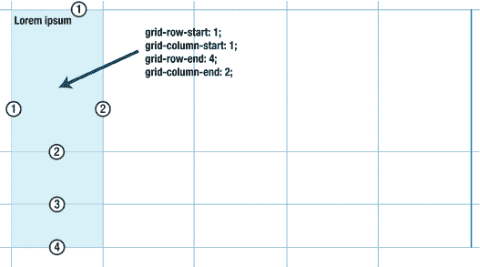

# 七、页面布局和网格

这一章是关于创建页面布局的系统方法。在前一章中，我们从单个页面组件的角度关注布局。当设计页面的整体布局时，各个组件之间的优先级和关系是一个很好的起点。但是在某个时候，你会开始发现整体结构的循环模式。本章是关于将这些结构整理成可重用的解决方案:容器，你可以将你的内容“倒入”其中。

创建这些容器时，很可能会使用预先确定大小和比例的网格系统。本章将探索用 CSS 创建这样一个系统的不同方法。首先，我们将着眼于更传统的技术，然后用 flexbox 增强它们。在下半部分，我们将关注即将到来的 CSS 网格布局规范。

在本章中，您将了解

*   页面布局的系统方法

*   关于页面网格的术语

*   使用浮动和内嵌块构建健壮的页面布局，并由 flexbox 增强

*   使用网格布局模块

## 规划您的布局

当开始将设计转化为功能齐全的模板时，很容易让人直接跳入，开始标记页面并编写 CSS。风险在于，你可能会很快将自己逼入绝境。少量的计划可以在以后省去很多麻烦。或者说，俗话说“量两次；割一次。”

在这个阶段重要的事情是找到重复的模式和你试图翻译成代码的设计系统的本质。

### 网格

当谈到一个网站的整体布局系统时，*网格*是一个经常出现的词。它是指设计者用来将布局划分为若干行和列的一组基本规则(参见图 7-1 中的示例)。行和列之间的空间被称为*间距*。通过讨论一个跨越三列、左右两边有檐槽的元素，设计人员和开发人员对正在构建的内容有了更清晰的了解。这种系统的布局方法提供了一定的可预测性和稳定性。它仍然允许你离开网格，拥有非对称的布局——但这通常是例外而不是规则。


###### 图 7-1。在[](http://www.theguardian.com)*上使用的列和装订线尺寸的图解叠加视图。这个视图主要使用总共五列的组合，最右边的四列中有三个嵌套列*

 *#### 传统网格术语

网格远不是网页设计师的发明；几个世纪以来，它们以各种形式出现在平面设计中。在网页设计中，我们经常将术语简化为行、列和间距，但是在传统印刷设计中使用的网格有更丰富的词汇。

在更传统的意义上，行和列是整个网格的名称，横跨整个宽度或高度。横跨一列和一行的网格的单个单元被称为*单元*或*模块*。然后，这些单元以一定的比例组合成更大的区域，例如，一个区域可以是三列宽、两行高。这些垂直和水平的单元组合，传统上被称为*区域*或*区域*。

整个网格中的总单元数通常基于一个数字，该数字可以用多种方式划分，以创建不同的比率。例如，24 列网格可以进一步分为 4 列，每列 6 个单位宽，或者 3 列，每列 8 个单位，依此类推。

这些术语的传统含义可能并不是为 Web 构建网格所必需的知识。另一方面，当与同事交流或为代码创建命名约定时，掌握它们不会有什么坏处。拥有一个通用的命名方案对于从一开始就创建一个结构化的代码库非常有帮助——通常您会使用它们来为您的设计创建助手类。

### 布局助手类

类名显然是悬挂布局样式的钩子。对于一个非常简单的站点，你可能最终只有几个类名来决定你布局的基础。用于控制两栏博客布局的类名可能看起来很简单，如下所示:

```html
.main-content {}
.secondary-content {}
```

当您在更复杂的站点上工作时，您可能会发现重复的模式，这些模式无法清楚地识别为属于特定的内容层次结构。这使得以一种可重用的方式命名你的类变得更加困难。为了创建可重用的样式，很多人使用更直观的描述性类名，如下所示:

```html
.column { /* general column styles */ }
.column-half { /* taking up 50% of the row width */ }
.row { /* general row styles */ }
```

这些类名在严格意义上是表示性的，这意味着你把关于表示的信息放在你的 HTML 中。另一方面，它们具有高度的可读性、可重用性，并且允许你一次性解决布局问题。

另一种方法是在一个列表中收集所有具有某种共同样式的选择器:

```html
.thing,
.other-thing,
.third-thing,
.fourth-thing {
  /* styles in common here */
}
```

这种组织的好处是，您不需要将这些样式与 HTML 中的任何单个名称联系起来，而是可以在选择器列表中添加和删除。风险在于，选择器的数量可能会失控，难以扫描。这也提出了代码组织方面的问题。当基于相似的样式而不是基于可重用的组件来划分样式时，当对站点的特定部分进行编辑时，您可能不得不在 CSS 中跳来跳去，达到令人不舒服的程度。

命名方案是创建高质量代码的一个极具挑战性的部分，将表示和标记结合在一起是一个棘手的权衡。在这一章中，我们将尝试走中间路线，使用少量的布局助手类，同时尽可能地减少与表示的联系。这是一种创建布局系统的高度紧凑的方式，允许快速原型和一致的样式。我们将在第十二章回到创建模块化和可重用 CSS 系统的挑战。

不管是你自己创造了视觉设计，还是你在为别人的设计编码，你都会感谢自己创造了一个健壮的、经过深思熟虑的东西。当您需要与团队中的其他设计人员和开发人员协作时，为布局系统的组件命名也非常有帮助。如果你的设计非常复杂，你甚至可以从整合现成的 CSS 布局框架中获益。

### 使用现成的设计网格和框架

由于 CSS 布局可能很复杂，而且你在规划它们时发现的模式经常会在许多网站设计中重复出现，所以有许多现成的 CSS 框架或库包含了某种网格系统。

它们中的许多工作得相当好，并允许您快速组装跨浏览器支持的设计。这是一件非常好的事情，它可能会节省您大量的精力。特别是对于尺寸之间有复杂关系的布局，像 Gridset([`gridsetapp.com`](https://gridsetapp.com))这样帮助你生成 CSS 的工具真的很有帮助(见图 7-2 )。


###### 图 7-2。Gridset 是一个帮助你为你的布局生成网格规则的工具

不利的一面是，许多较大的 CSS 框架都附带了一套完整的布局规则，用于您的设计可能不需要的情况。这意味着在您的项目中包含那些从未使用过但仍然占用网络和大脑带宽的代码——在您的项目中包含您自己都不理解的 CSS 可能是一件坏事。

您是否应该选择第三方代码而不是您自己构建的代码，这总是取决于具体情况。如果您正在构建一个快速原型来测试一些东西，那么使用一个预构建的库可能是很好的。对于中等复杂程度的站点，您可能会发现自己必须对现有的库进行大量修改，以至于自己构建库更有意义。

### 固定的、流动的或弹性的

你可能以前遇到过*固定布局*、*流体布局*和*弹性布局*这些术语。这些是指我们如何在特定的布局中约束元素的大小。

*   **固定布局**:我们在页面布局上强加特定度量的布局。例如，我们可以说“我们的页面是 960 像素宽，仅此而已。”这是很长一段时间的趋势，因为它给了设计师和开发人员对设计的很大控制权。多年来，设计师们一直在争论他们的布局应该基于哪个尺寸:“是大多数用户都有 1024 像素宽的屏幕，还是现在假设每个人都有 1280 像素宽的显示器是安全的？”

*   **弹性布局**:这种布局的灵活性来自于在 ems 中调整布局组件的大小。这样，即使用户调整文本的大小，布局的比例也会保留。这可以与最小和最大宽度相结合，使页面更好地适应屏幕尺寸。即使弹性布局在今天有些过时，借用 ems 中使用最大宽度集的想法也是约束流体布局的好方法。

*   **流体布局**:也称为*流体布局*，布局中的元素按百分比调整大小，大小之间的比例(有时还有它们之间的距离)保持不变。以像素为单位的实际大小因浏览器窗口的大小而异。这在某种程度上是 Web 的默认模式，其中块级元素没有定义宽度，而是根据可用空间进行动态调整。

人们仍然在构建固定的布局，因为从设计师的角度来看，他们给人一种控制感。但是这种控制是强加在访问网站的人身上的，固定宽度的网站在当今设备和屏幕尺寸多样化的情况下工作不佳。

正如你可能已经猜到的，最好避免固定宽度的设计，让你的布局变得流畅，适应你正在浏览的设备。这种让设计对环境做出反应的方法是所谓的*响应式网页设计*的基石之一。

###### 注意

创建响应式布局需要更多的要素。我们将在第八章中讨论这些，但是在这一章中，为了保持例子的简单，我们假设我们正在处理大屏幕的布局。

## 创建灵活的页面布局

在这一节中，我们将介绍一些实用的技巧，告诉你如何创建一个样式系统，帮助你创建可靠的、灵活的、可重用的页面布局。

本节中的许多技术和 CSS 属性都是你在第六章中看到的相同技术的变体，但是从更高层次的角度来看。

我们将重新创建一个布局，类似于我们在[`www.theguardian.com`](http://www.theguardian.com)的一些部分中发现的布局(见图 7-3 )，在列和水平部分有一些不同的变化。


###### 图 7-3。《世界新闻报》在[](http://www.theguardian.com)*上分版面。我们可以看到不同数量的柱子和不同尺寸的一些变化*

 *如果我们将这个设计分解成主要布局模式的简化草图，我们最终会得到类似于图 7-4 所示的东西。在本节的其余部分，我们将尝试重新创建这个布局。


###### 图 7-4。布局中不同大小的列的草图

草图中没有显示的是，布局作为一个整体在页面中居中，并有一个最大宽度。我们将从创建这种包装元素的规则开始。

### 定义内容包装

使用某种保存页面内容的包装元素是很常见的，就像这样:

```html
<body>
    <div class="wrapper">
        <h1>My page content</h1>
    </div>
</body>
```

你可以使用 body 元素吗——毕竟，它已经存在(或者应该存在！)——但很多时候，你最终想要的不仅仅是一张包装纸。可以有一个站点范围的导航栏，在包装器外面有不同的宽度，或者只是覆盖整个屏幕宽度的堆叠部分，在它们里面有居中的包装器。

接下来，我们需要为这个包装器的行为设置一些规则。我们会给它一个宽度和一个最大宽度，并使用自动边距将其居中。对于流体布局，通常使用百分比设置的宽度，略小于窗口的全宽。然后根据字体大小设置最大宽度，使用 ems:

```html
.wrapper {
  width: 95%;
  max-width: 76em;
  margin: 0 auto;
}
```

body 元素也有自己的默认边距，所以我们需要删除它，否则它会影响我们的样式。在第二章中，我们提到了“重置”样式，比如埃里克·迈耶的 CSS 重置和尼古拉斯·加拉格尔的 Normalize.css:他们会为你创建一个一致的基线，但有时慢慢开始并建立你自己的样式是个好主意。我们将保持这个例子的简单性:

```html
body {
  margin: 0;
}
```

图 7-5 中的结果为我们提供了一个良好的基础。我们在这几行代码中做出了许多决定:

*   主包装器通常会占据 95%的视窗宽度。

*   对于速记 margin: 0 auto，我们已经告诉它在顶部或底部没有边距，并自动将空白空间划分到它的左侧和右侧(每侧留 2.5%)，这使它在页面上居中。

*   包装材质的最大宽度应为 76 ems。基于 16 像素的默认字体大小，这相当于 1216 像素，但是如果用户在浏览器中增加字体大小设置，这将自动改变。这个 76em 的数字并不是什么硬性规定:它只是在尝试布局时看起来合适的数字。


###### 图 7-5。我们的内容包装器——我们暂时给了它一个背景颜色和一些高度来观察样式的效果

我们正在回避许多可能发生变化的因素。我们不知道屏幕有多大，所以我们不想为了整体宽度而将自己束缚在任何特定的像素大小上。我们也不知道用户的字体设置是什么。

我们所知道的是，无论屏幕大小如何，我们都需要一个居中的包装，在两侧至少留有一些空间。我们还希望在某个时候限制布局宽度，以防止像行长度这样的事情失控。如果用户的字体大小设置不同于正常的 16px 默认设置，将遵循最大宽度。

您选择的特定度量将会改变以适应您正在进行的设计，但是原则是相同的:找到您想要为整个内容包装器设置的基本约束，但是不要太严格地定义它们。相反，要确保针对不断变化的环境进行优化。

“为改变而优化”是你在软件设计的所有领域都会听到的口头禅。我们已经为我们的布局包装器应该做什么建立了原则，而没有过分具体的像素度量。现在可以一次性编辑使用包装类的元素。

我们可以直接利用包装类的一致性，在三个不同的地方使用它。我们将为虚构的报纸添加一个报头部分和一个导航栏。这两个元素都是全角元素，但是有一个内部包装器约束其中的内容。保存特定于页面的内容的主要元素位于这两个块之后。

```html
<header class="masthead">
**<div class="wrapper">** 
    <h1>Important News</h1>
**</div>** 
</header>
<nav role="navigation" class="navbar">
**<div class="wrapper">** 
    <ul class="navlist">
        <li><a href="/">Home</a></li>
        <!-- ...and so on -->
    </ul>
**</div>** 
</nav>
**<main class="wrapper">** 
  <!-- the main content goes here -->
**</main>** 
```

我们不会在这里深入讨论报头和导航条的样式(见图 7-6 )，但是 CSS 在本书的代码示例中是可用的，并且我们已经在第六章中介绍了如何创建导航条组件。


###### 图 7-6。使用包装类将两个堆叠的页面部分中的元素居中

### 行容器

接下来，我们关注水平内容组的行为。在这个阶段，我们希望他们做的唯一一件事就是包含任何浮动的元素。在第三章中，我们看到了如何通过创建一个新的块格式化上下文，使用溢出属性来实现浮动包容。虽然溢出方法对于较小的组件来说通常是最简单的方法，但是在这种情况下，我们将使用清除伪元素来代替。页面中这些较大的部分更有可能将定位内容突出到行容器之外，所以弄乱溢出可能会反过来伤害我们。

```html
.row:after {
  content: '';
  display: block;
  clear: both;
  height: 0;
}
```

### 创建列

我们有自己的行容器，我们想把它分成列。首先:选择一种水平布局的方法。正如我们在前一章看到的，有许多方法可以做到这一点。使用 floats 可能是最常用的技术，并且具有非常普遍的浏览器支持，所以让我们从这里开始。默认情况下，向左浮动项目对于从左到右的语言来说似乎是一个不错的选择。

如果我们想在不改变宽度的情况下直接在列容器上添加边框或填充，我们还应该将框大小调整方法设置为 border-box:

```html
.col {
  float: left;
  box-sizing: border-box;
}
```

接下来，我们需要决定调整列大小的方法。许多 CSS 库使用明确的表示大小类来调整各个列的大小:

```html
.col-1of4 {
  width: 25%;
}
.col-1of2 {
  width: 50%;
}
/* ...etc */
```

当您可能在台式机或笔记本电脑上工作时，这种方法对于快速原型制作非常有帮助。根据前面的规则，最左边的列占据一半宽度的三列布局变得非常容易在标记中声明:

```html
<div class="row">
  <div class="col **col-1of2**"></div>
  <div class="col **col-1of4**"></div>
  <div class="col **col-1of4**"></div>
</div>
```

这种技术的缺点是过分强调一种特定的布局。当我们以后想要调整布局以适应不同的屏幕尺寸时，命名方案就没有什么意义了。

如果我们想保留可重用类名的策略来调整大小，我们将在标记和表示之间留下一些联系。我们可以选择通过使用其他类名使这些联系更松散，而不用提及具体的宽度或比例。使用音乐世界的一个比喻，我们可以，例如，为通常有四个相等部分的行容器创建一个规则——一个*四重奏*:

```html
.row-quartet > * {
  width: 25%;
}
```

在这里，我们的目标是带有通用选择器的行容器的直接子容器。这是为了保持这个一般规则的特异性较低。因为通用选择器的特异性值为 0，所以我们可以稍后用一个类名来覆盖这个宽度。下面的标记现在将创建一个具有四个等宽列的行:

```html
<div class="row row-quartet">
  <div class="col"></div>
  <div class="col"></div>
  <div class="col"></div>
  <div class="col"></div>
</div>
```

任何与这个“节奏”的偏差。row-quartet 现在将获得自己的覆盖类名，但没有特定于布局的类。之前的三列布局示例现在看起来略有不同:

```html
<div class="row row-quartet">
  <div class="col my-special-column"></div>
  <div class="col"></div>
  <div class="col"></div>
</div>
**.my-special-column {** 
**width: 50%;** 
**}** 
```

我们现在可以根据需要用更多的“速度”类来补充行规则:

```html
.row-quartet > * {
  width: 25%;
}
**.row-trio > * {** 
**width: 33.3333%;** 
**}** 
```

在我们构建的布局草图中，两个子类别部分都有一个占据页面最左边五分之一的标题区域，以及一个占据剩余五分之四的内容区域。在第一小节中，还有一个更大的文章栏，占据了 50%的内容区域。

```html
.subcategory-content {
  width: 80%;
}
.subcategory-header {
  width: 20%;
}
.subcategory-featured {
  width: 50%;
}
```

HTML:

```html
<section class="subcategory">
  <div class="row">
    <header class="col subcategory-header">
      <h2>Sub-section 1</h2>
    </header>
    <div class="col subcategory-content">
      <div class="row row-quartet">
        <div class="col subcategory-featured"></div>
        <div class="col"></div>
        <div class="col"></div>
      </div>
      <div class="row row-quartet">
        <div class="col"></div>
        <div class="col"></div>
        <div class="col"></div>
        <div class="col"></div>
      </div>
    </div>
  </div>
</section>
<section class="subcategory">
  <div class="row">
    <header class="col subcategory-header"></header>
    <div class="col subcategory-content">
      <div class="row row-trio">
        <div class="col"></div>
        <div class="col"></div>
        <div class="col"></div>
      </div>
    </div>
  </div>
</section>
```

###### 使用额外的包装元素

在这个例子中，我们为“内部”列组使用了带有 row 类的额外嵌套元素。您还可以将 row 类添加到 col 项本身。虽然在许多情况下，减少标记是一种很好的感觉，通常也是一种很好的实践，但是如果概念上不同的规则开始冲突，也会适得其反。在某些地方添加额外的元素来分隔它们可以最小化发生这种情况的风险，尽管有些多余。

将这些与包装器和一个简单的标题放在一起，我们离“页面框架”还有很长的路要走如下面所列和图 7-7 所示，我们还添加了一些占位符内容标题和一些列的最小高度，以及一个轮廓。(轮廓是可视化和调试布局的一个便利技巧，因为它们不影响元素的大小。)

```html
.col {
  min-height: 100px;
  outline: 1px solid #666;
}
```


###### 图 7-7。我们的页面布局现在开始成形

现在我们已经有了自己的网格类，我们可以轻松地用更多的度量来组合或扩展它们，以创建更复杂的布局模式。接下来，我们将在每个容器中添加一些虚拟内容，并添加细节。

以下是带有图像的文章在标记中的外观:

```html
<div class="col">
  <article class="story">
    
    <h3>Cras suscipit nec leo id.</h3>
    <p>Autem repudiandae...</p>
  </article>
</div>
```

图 7-8 显示了当我们加入这些虚拟内容时的样子。


###### 图 7-8。现在，我们已经在网格单元格中添加了一些内容，以查看我们的布局如何，以及一些轻微的印刷样式

我们在列容器中使用了一个类名称为 story 的 article 元素。额外的元素将布局从内容中分离出来，为我们提供了一个可移植的解决方案，而不是重载包装器本身。

虚拟内容样式只包含一种背景颜色、一点填充和一条规则，这条规则使故事中的任何图像变得流畅，以填充元素的宽度:

```html
.story {
  padding: .6875em;
  background-color: #eee;
}
.story img {
  width: 100%;
}
```

### 流槽

现在很明显，我们需要在我们的列之间增加一些间距，让布局有一些喘息的空间。这就是水槽的用武之地。

在流体布局中，您可以选择按百分比设置的流体间距，也可以选择固定长度的间距，通常相对于字体大小进行设置。无论您选择哪种方式，最常用的技术之一是在列元素的两侧设置相等的间距，每侧的宽度为预期总装订线尺寸的一半(参见图 7-9 )。


###### 图 7-9。在列的两侧添加等量的空间，每个空间是总装订线宽度的一半

如果您需要直接在列上设置背景颜色或图像，并且仍然希望它们间隔开，那么使用边距作为边距可能是有意义的。如果你需要迎合像 IE7 这样甚至不支持框定大小的老浏览器，这也是有意义的。考虑到这是一个不固定的布局，您可能希望使用设置了百分比的边距，因为如果不使用 calc()，混合百分比和其他长度会变得很棘手，而 calc()在旧的浏览器中也不受支持。

在任何情况下，知道如何计算百分比边距都是有用的，这样可以使它们与其他宽度很好地配合。在前面的例子中，我们使用了 16 像素的字体大小和 1.375 的行高，这相当于 22 像素。比方说，我们希望间距等于相当宽的屏幕上文本的行高，将排版尺寸连接到网格。我们从布局的最宽点开始，76 ems 或 1216 像素。

因为边距是相对于包含块的，所以我们用计算相对字体大小的相同方法来计算装订线与总宽度的比率:用所需的尺寸除以总宽度。用 22 除以 1216 得到 0.018092105，所以整个檐槽大约是 1.8%。最后，我们将它分成两半，得到每列两边的边距，最后得到 0.9%:

```html
.col {
  float: left;
  box-sizing: border-box;
**margin: 0 0.9% 1.375em;** 
}
```

我们还添加了一个底部边距，以一行文本的高度来分隔各行内容。请注意，垂直间距是以 ems 而不是百分比设置的，因为行高与屏幕大小无关，所以我们希望保持这种关系不变。

看看正在进行的示例，我们会看到一个不完整的布局(见图 7-10 ),因为页边距增加了列的尺寸。甚至没有框的大小:边框可以让我们摆脱这一点，所以我们需要修改列宽。


###### 图 7-10。我们的布局现在被打破了，因为页边距使各列相加超过 100%

为了在使用流体槽边距时固定列宽计算，我们需要从每个列宽中减去 1.8%:

```html
.row-trio > * {
  width: **31.53333%**;
}
.row-quartet > * {
  width: **23.2%**;
}

.subcategory-featured {
  width: **48.2%**;
}
.subcategory-header {
  width: **18.2%**;
}
.subcategory-content {
  width: **78.2%**;
}
```

这给了我们在图 7-11 中看到的工作版本。在截图中，我们稍微缩小了浏览器窗口，你可以看到边框也随之缩小。


###### 图 7-11。我们的页面现在有了流畅的装订线，可以随着页面的宽度而增长和收缩

#### 否定外水槽

此时，我们有了一个表示行、流体列和流体槽的工作系统。剩下的工作就是把细节做好，把视觉差异的风险降到最低。

首先，我们用来创建檐槽的边距会在外部容器的左右两边造成额外的缩进，这可能是不希望的。在更多的行容器中嵌套列会加剧这个问题(参见图 7-12 )。我们可以取消第一项的左边距和最后一项的右边距来应对这种情况。但是这会使计算栏宽和装订线宽度的数学计算更加复杂。


###### 图 7-12。由于我们应用于每一列的外部边距来创建装订线，文章容器最终离部分边框的右边缘有一段距离

相反，我们将使用负边距的技巧来缓解这个问题。我们在第六章中提到过，没有指定宽度的非浮动块元素在给定负的左边距*和右边距*时会扩展它们的宽度。

由于我们选择使用一个单独的元素作为我们的行容器(而不是让列元素兼作任何嵌套列的行)，我们可以很好地利用这一点。我们修改了网格规则，规定每一行容器的每一侧都有一个等于半个装订线的负边距(见图 7-13 ):

```html
.row {
**margin: 0 -.9%;** 
}
```


###### 图 7-13。在行容器元素上使用负边距，我们可以抵消嵌套行的额外缩进和复合边距

#### 备用排水沟策略

为了进一步简化列宽计算，我们可以利用 box-sizing 属性，并使用 padding 来设置间距。

如果我们继续使用流体檐槽，我们只需要将檐槽尺寸改为填充。现在，我们可以再次将柱的尺寸表示为整体的适当分数，而不考虑檐槽的宽度:

```html
.col {
  float: left;
  box-sizing: border-box;
**padding: 0 .9% 1.375em;** 
}
.row-trio > * {
**width: 33.33333%;** 
}
.subcategory-featured {
**width: 50%;** 
}
/* ...etc */
```

这也为使用带有排印尺寸的装订线设置开辟了道路:我们可以使用 ems 来设置装订线，使其与字体大小相关，而不是与网格的宽度相关。在下面的例子中(见图 7-14 )，装订线的尺寸与行高相同，无论网格的宽度如何，都在列之间产生相等的垂直和水平间距。


###### 图 7-14。使用与字体大小相关的“弹性”边距设置，无论内容的宽度如何，边距都保持不变

```html
.col {
  float: left;
  box-sizing: border-box;
**/* one half of the line-height as padding on left and right: */** 
**padding: 0 .6875em 1.375em;** 
}
```

### 增强的列:换行和等高

到目前为止，我们使用浮动作为创建布局的方法。正如我们在前一章中所看到的，我们还有一系列其他的工具可以使用。我们将简要地看一些以与浮动列相同的一般方式使用它们的例子。这将帮助我们创建更加灵活的布局。

#### 用内嵌块环绕列行

如果你仔细看《卫报》的截图(见图 7-15 ，你会注意到最上面的小节底部实际上有两行标题链接。在我们的布局版本中，到目前为止我们只有一行稍微大一点的故事预览。


###### 图 7-15。顶部小节的底部包含两行故事

使用浮动来包装容器行是一件棘手的事情:如果其中一个项目较高，浮动可能会被卡住，产生一个丑陋的阶梯效果。

为了解决这个问题，我们可以创建一个通用的类名，在内容需要包装成几行的地方使用。对于具有这个类名的容器，我们将使用我们在第六章中使用的字体大小技术来使用内嵌块显示。这样做的时候，我们需要以 rem 为单位设置行容器的负边距，因为元素本身的字体大小现在是 0。为了完全向后兼容，我们在 IE 8 中使用了像素测量。

```html
.row-wrapping {
  font-size: 0;
  margin: 0 -11px;
  margin: 0 -.6875rem;
}
.row-wrapping > * {
  float: none;
  vertical-align: top;
  display: inline-block;
  font-size: 16px;
  font-size: 1rem;
}
```

此时，我们可以添加任意多的故事预览，它们会在连续填充四项后整齐地换行。但是在我们查看结果之前，我们将使用 flexbox 进一步润色细节。

#### 将 Flexbox 用于等高列

正如我们在第六章中看到的，flexbox 可以帮助创建等高的列。创建系统布局时，我们希望有一些特定的规则集，仅在支持 flexbox 时应用。

为了能够检测 flexbox 支持，我们将在页面顶部添加一个小脚本。为此，我们将使用 Modernizr，它为受支持的每个特性在 html 元素中添加类名。在[`modernizr.com`](https://modernizr.com)上，你可以创建你自己的检测脚本文件，里面只有你需要的检测代码。对于本例，我们将只为各种 flexbox 特性添加检测，以保持文件较小。

创建检测脚本后，将它放入 JavaScript 文件中，在加载任何 CSS 文件之前，*加载页面的 head 元素。顺序很重要，因为检测需要在加载时、应用样式之前进行。*

```html
<script src="modernizr.js"></script>
```

我们现在可以开始使用带前缀的类来编码我们的解决方案，并且确信只有支持的浏览器才能看到它。flexbox 类表示现代 flexbox 支持，而 flexwrap 类表示支持将 flexbox 项目包装到多行或多列中。

在完整的代码示例中，您会发现我们将这些与 flexboxtweener 类结合在一起，这表明支持 IE10 中发布的 flexbox 版本。

首先，我们将把标准行转换成 flexbox 行:

```html
.flexbox .row {
  display: flex;
}
```

此时，我们已经创建了等高列，这是默认拉伸 flex 项以填充父项的直接结果。

由于我们在每一列的内容周围使用了一个包装器元素，所以我们需要再加点 flexbox 的魔力，让内容均匀地填充各列。每个列本身都是一个列 flexbox 容器，其中的直接子项被设置为在分配任何额外空间时均匀填充空间:

```html
.flexbox .col {
  display: flex;
  flex-direction: column;
}
.flexbox .col > * {
  flex: 1;
}
```

简写 flex: 1 是 flex 简写的特例，它将 flex-grow 设置为 1，将 flex-shrink 设置为 1，将 flex-basis 设置为 0。

最后，我们扩充了用于包装行的类，这样它们也可以利用 flexbox 的等高机制:

```html
.flexwrap .row-wrapping {
  display: flex;
  flex-wrap: wrap;
}
```

请看图 7-16 所示的布局示例，它向我们展示了整齐的行和列，完美地填满了空间。


###### 图 7-16。网格的行和列现在完美地填满了它们的容器，调整到每行中最高的内容

至此，我们已经为创建页面布局创建了一个灵活的小规则系统。我们可以通过重组简单的类名集合来实现行、列和间距的一致性。这基本上就是像 Bootstrap 和 Foundation 这样的 CSS 框架中现成的网格规则为您做的事情，但是通常更依赖于表示性的类名。

像我们在本章中所做的那样从简单开始，允许您创建项目特别需要的网格规则，保持代码小且易于管理(最后的示例文件有大约 80 行用于整个网格系统的大间距代码，包括所有浏览器前缀)。

### Flexbox 作为页面布局的通用工具

在前一章中，我们看到 flexbox 是一个强大的工具，可以实现详细而灵活的内容布局。在这一章中，我们将它放在一个更加向后兼容的基于浮动的布局系统之上。这种策略非常强大，事实上，这与《卫报》在他们的页面布局中采用的策略完全相同——如果你深究他们的页面来源，你会发现很多相似之处！

我们在第六章中看到了为什么这种“在顶部喷洒 flexbox”的策略如此有效——flexbox 被设计成忽略浮动并显示 flex 项目的属性。这使得使用 flexbox 来修饰基于浮动的布局变得很容易。flex 项采用已经设置的属性中的宽度、边距、填充等。但是 flexbox 是创建全页面布局和网格状结构的合适工具吗？

没有任何东西(除了在旧浏览器中缺乏支持)阻止你使用 flexbox 作为页面布局的核心方法，尽管它并没有明确地为此目的而设计。毕竟，浮动也不是！不过，使用 flexbox 作为高级布局工具既有好处也有坏处。

#### 利弊

从积极的一面来看，flexbox 很快——至少在实现最新规范的浏览器中是如此。现代的 flexbox 通常比 floats 更具性能。不过，最早的 flexbox 规范的实现通常表现很差，所以您应该小心地将它应用于较旧的浏览器。

Flexbox 还使得获取页面的一部分变得非常容易，只需要很少的代码行，就可以使用增长和收缩因子将它分成灵活的部分。这种容纳内容而不考虑项目数量的能力对于创建类似网格的布局来说是一个明显的优势。

不利的一面是，由于这种灵活性要求在内容加载到项目中时进行重新计算，因此在第一次加载页面时可能会导致紧张的体验。例如，加载到一个灵活项目中的图像可以随着项目的增长而“推动”其他项目以容纳新的内容。

我们之前处理的示例依赖于行的默认 flex 值(其中元素不会自动增长)结合显式宽度来最小化跳动效应。

#### 一维或二维布局

到目前为止，我们研究的所有布局方法，包括 flexbox，都是通过排列来创建行和列的变体。即使它们中的一些允许将内容包装成几行(从而堆叠成垂直维度)，它们基本上是一维的——内容从左到右、从右到左或从上到下流动(参见图 7-17 )，但是项目不能同时跨越行和列。这意味着我们需要使用包装元素来细分布局。


###### 图 7-17。到目前为止，我们所看到的所有布局方法(甚至包括换行的方法)都是一维的，因为内容是单向流动的

在 web 布局的早期，创建布局的少数工具之一是使用实际的 HTML 表格元素。在 CSS 成为一种可行的替代方案之后，实践仍然存在的原因之一是它实际上使我们能够创建二维布局——表中的项目可以具有 colspan 和 rowspan 属性，允许它们参与复杂的布局场景，如图 7-18 所示。


###### 图 7-18。二维布局——看看您是否能确定需要多少容器元素才能用 floats 或 flexbox 实现这种布局

对于目前的 CSS 布局，我们已经接受了布局中的任何子部分都可能需要自己的容器元素，并且这种布局是我们应用于单个元素的东西。但是即将到来的 CSS 网格布局模块旨在改变这一切。

## CSS 网格布局模块:2D 布局

当谈到页面布局的宏观层面时，到目前为止，我们所看到的技术都不是控制二维网格中的顺序、位置和大小的完整解决方案。CSS 网格布局模块定义了第一组 CSS 属性来专门做这件事。

使用 Grid Layout 模块，我们可以删除许多添加到控件布局中的额外元素，从而极大地简化了我们的标记。它还将设置列或行维度的负担从元素本身转移到表示页面上网格的单个包含元素。

###### 警告:前方实验性质！

应该注意，网格布局规范是本章中支持最少的布局技术，在撰写本文时仍处于实验阶段。

Google Chrome Canary、Firefox Developer Edition、Safari Technology Preview 和 WebKit Nightly prerelease 浏览器版本都相当全面地实现了网格布局。Chrome Canary 的实现往往是最新的——我们建议您尝试该版本中的示例。它要求您打开首选项标志“启用实验性 Web 平台特性”

令人惊讶的是，Internet Explorer 是第一个支持网格布局的浏览器。它随 Internet Explorer 10 一起提供，但当时的规范看起来有点不同，并不支持所有的功能。为了使基础工作正常进行，您需要稍微修改一下语法，并对网格属性使用-ms-前缀。Microsoft Edge 也支持这种旧语法。

在这一章中，我们将只看今天定义的标准语法。如果你想修改 IE10-11 和微软 Edge 的语法，看看微软开发者网络页面的网格布局([`msdn . Microsoft . com/en-us/library/ie/hh 673533(v = vs . 85)。aspx`](http://msdn.microsoft.com/en-us/library/ie/hh673533(v=vs.85).aspx) )。

### 理解网格术语

图 7-19 向你展示了一个完全成熟的网格，就像 CSS 中定义的那样。


###### 图 7-19。网格容器及其组成部分

事情是这样的:

*   设置为显示为网格的元素被称为*网格容器*——图中较厚的外部部分。

*   然后容器被*网格线*分割成几个部分，称为*网格单元*，穿过网格容器。

*   这些线条形成水平和垂直延伸的条带，称为*网格轨迹*。水平轨迹是*网格行*，垂直轨迹是*网格列*。

*   由一组相邻单元覆盖的组合矩形表面被称为*网格区域*。

*   网格容器的直接子容器称为*网格项目*。这些可以放置在网格区域。

您可能会注意到，这些术语与我们在本章开始时概述的更传统的网格术语没有什么共同之处。像 Mark Boulton 这样的设计者批评了这种术语上的差异([`markboulton . co . uk/journal/open-letter-to-W3C-CSS-working-group-re-CSS-grids`](http://markboulton.co.uk/journal/open-letter-to-w3c-css-working-group-re-css-grids))，但是编写规范的人决定最好使用来自表格和电子表格概念的名称来让开发人员理解网格的概念。不管是好是坏，这些名字是我们所坚持的。

### 定义行和列

为了创建网格，我们需要告诉浏览器它的行和列的数量和行为。为了实现图 7-19 中的 4×2 网格，使用我们可信赖的旧包装器 div 作为容器，我们需要将显示模式设置为 grid。我们还提供行和列的度量，称为网格模板:

```html
.wrapper {
    display: grid;
    grid-template-rows: 300px 300px;
    grid-template-columns: 1fr 1fr 1fr 1fr;
}
```

前面的代码为我们提供了一个网格，其中有两行各 300 像素高，四列等宽。它还在每一列和每一行的边缘生成网格线——我们稍后需要使用这些网格线。

我们使用的列宽单位是新的:fr 单位代表*分数*(可用空间)。它与我们在 flexbox flex-grow-factors 中看到的灵活单位非常相似，但在这里它有自己的单位符号，大概是为了避免与其他无单位数字混淆。可用空间是在用明确的长度或根据它们自己的内容来调整任何网格轨迹的大小时剩下的空间。

因此，这里的每个 fr 单元代表网格中可用空间的四分之一；如果我们增加第五列 1fr，每个单元将代表可用空间的五分之一。

我们还可以在行和列中混合和匹配单位:您几乎可以选择任何类型的长度测量。例如，可以将列声明为 200px 20% 1fr 200px，在边缘处给出两个固定宽度的 200 像素列，从左数第二列占总空间的 20%,第三列占用其后剩余的任何空间——fr 单元处理计算完其他长度后的剩余空间，就像 flexbox 中一样。

#### 为我们的页面子部分制作网格

查看到目前为止我们一直在使用的示例页面部分，我们现在可以将每个子部分分割成一个网格。第一部分最简单的网格应该是三行五列。列需要是总宽度的五分之一，行可以有自动高度，完全取决于内容(见图 7-20 )。


###### 图 7-20。从第一个页面子部分创建一个网格容器需要我们将其分成五列和三行。数字表示生成的网格线

现在可以从根本上简化内容所需的标记。我们仍然要为网格容器使用一个包装器元素，将它与任何子部分样式分开，但是在里面所有的故事都是直接的子元素:

```html
<section class="subcategory">
  <div class="grid-a">
    <header class="subcategory-header">
      <h2>Lorem ipsum</h2>
    </header>
    <article class="story story-featured">
      <!-- The slightly bigger article goes here -->
    </article>
    <article class="story">[...]</article>
    <article class="story">[...]</article>
    <!-- ...and so on, for all our articles. -->      
  </div>
</section>
```

接下来，我们将在 CSS 中定义这个特定的网格设置。正如我们从图 7-20 中的网格“切片”中看到的，我们需要三行自动高度和五列，每一列占据相等的空间:

```html
.grid-a {
  display: grid;
**grid-template-rows: auto auto auto;** 
**grid-template-columns: repeat(5, 1fr);** 
  margin: 0 -.6875em;
}
```

您还可以看到 grids 附带的一个新的函数符号:能够对列或行重复指定次数的跟踪声明，而不是逐个输入每个跟踪。

由于网格轨道不是由文档对象模型(DOM)中的任何特定元素表示的，所以我们不能用最小宽度、最大宽度等来调整它们的大小。为了在网格轨迹声明中实现相同的功能，引入了 minmax()函数符号。例如，我们可以将最后两行设置为至少 4em 高，但除此之外，它们将占用等量的可用空间:

```html
.grid-a {
  display: grid;
  grid-template-rows: auto **minmax(4em, 1fr) minmax(4em, 1fr)**;
  grid-template-columns: repeat(5, 1fr);
  margin: 0 -.6875em;
}
```

如果要将网格轨迹定义压缩成一个简写，可以使用 grid-template 属性，在该属性中可以提供行定义和列定义，用斜杠分隔:

```html
.grid-a {
  display: grid;
**grid-template: auto minmax(4em, 1fr) minmax(4em, 1fr) / repeat(5, 1fr);** 
  margin: 0 -.6875em;
}
```

### 在网格上放置项目

要在网格上放置项目，我们需要引用项目开始和结束的网格线。例如，子节标题占据了整个最左边的列。最冗长的说法是设置两个维度的起始行和结束行的属性(参见图 7-21 ):

```html
.subsection-header {
  grid-row-start: 1;
  grid-column-start: 1;
  grid-row-end: 4;
  grid-column-end: 2;
}
```



###### 图 7-21。使用带编号的网格线将页眉放置在网格上

我们可以通过分别使用 grid-row 和 grid-column 属性在一个声明中设置起始行和结束行来简化这一过程。每个属性中的起始行和结束行用斜杠字符分隔。

```html
.subsection-header {
  grid-row: 1/4;
  grid-column: 1/2;
}
```

如果我们不确定网格中有多少行，但仍然希望标题跨越所有行，我们会希望指定标题在最后一行结束。Grid Layout 允许您使用负索引向后计算行数，因此最后声明的轨道的结束行总是-1。默认范围始终是一个单元格，因此我们也可以省略网格列值的最后一部分:

```html
.subsection-header {
  grid-row: 1/-1;
  grid-column: 1; /* equivalent to grid-column: 1/2 */
}
```

最后，我们可以将这些值进一步压缩到 grid-area 属性中:它最多包含四个用斜线分隔的值。它们依次指定网格-行-开始、网格-列-开始、网格-行-结束和网格-列-结束。

```html
.subsection-header {
  grid-area: 1/1/-1;
}
```

在前面的代码片段中，我们省略了第四个参数，该参数指示列方向的末端位置。您可以使用两个 end-direction 参数来实现这一点，因为网格定位将默认为在任一方向上跨越一个网格轨迹的项目。

#### 网格项目对齐

当您将项目放置在网格上时，它们会自动变得与您放置它们的网格区域一样宽和一样高。自动扩展高度与 flex 行项目在 flexbox 中的工作方式非常相似。这不是巧合。

flexbox 和 Grid 布局都根据 CSS Box 对齐规范指定了子项的行为，CSS Box 对齐规范是一种在多个 CSS 上下文中负责对齐和对齐的标准。

就像在 flexbox 行中一样，可以使用 align-items 和 align-self 来控制垂直对齐。对齐方式默认为拉伸，这会导致项目垂直扩展以填充该区域。这里使用与 flexbox 中相同的值(但没有 flex 前缀),例如开始、结束或中心——图 7-22 解释了不同之处。


###### 图 7-22。网格项目对齐的一些可能值

网格项目的行为类似于块级元素，并自动填充它们所在的网格区域的宽度，除非您为它们提供另一种度量。宽度的百分比基于项目所在的网格区域，而不是网格容器。

如果网格项目没有填满它们所在区域的整个宽度，您也可以使用 justify-items 和 justify-self 属性将它们在该区域内左对齐、右对齐或居中对齐。

就像在 flexbox 中一样，您可以在单个项目上使用 align-self，但是在网格布局上下文中，您也可以设置 justify-self。在网格容器上，align-items 或 justify-items 设置项目的默认对齐方式。

#### 对齐网格轨迹

同样，当网格区域内的项目没有占据整个区域时，您可以对齐网格区域内的项目，也可以在容器内对齐网格轨道本身。只要轨道大小加起来没有覆盖网格容器的整个大小，就可以使用 align-content(垂直)和 justify-content(水平)来移动轨道。

例如，以下网格声明中的列加起来不等于容器的总大小:

```html
.grid {
  width: 1000px;
  grid-template-columns: repeat(8, 100px); /* 800px in total */
}
```

现在，您可以选择容器内剩余空间的最终位置。默认情况下，justify-content 计算开始。图 7-23 显示了可能的值及其影响。


###### 图 7-23。使用对齐内容移动网格轨道

以类似的方式，您可以使用具有 align-content 属性的相同关键字垂直对齐轨道(如果容器具有固定的高度)。

#### 网格布局中的檐槽

有几种方法可以在网格中创建檐槽。通过在项目本身上使用边距，可以避免将它们与网格属性一起声明。也可以使用栅格轨迹对齐(例如，请参见前面的间距示例)，或者创建类似于檐槽的空栅格轨迹。

如果您需要在所有轨道之间保持相同的固定大小的装订线，最简单的方法是使用 grid-column-gap 和 grid-row-gap 属性，如下所示。这会创建固定大小的装订线，就好像网格线本身有宽度一样，相当于多列布局中的列间距或表格中的边框间距。

```html
.grid {
  display: grid;
  grid-template-columns: repeat(5, 1fr);
**grid-column-gap: 1.5em;** 
**grid-row-gap: 1.5em;** 
}
```

### 自动网格放置

在我们正在处理的新闻站点子部分中，最左边的列是为标题保留的，但是其余的空间只是用。故事元素。例如，使用:n-of-type()选择器和显式网格位置来定位它们不会太难，但那会相当乏味:

```html
.story-featured {
  grid-area: 1/2/2/4;
}
.story:nth-of-type(2) {
  grid-area: 1/4/2/5;
}
/* ...and so on */
```

幸运的是，网格布局规范有一个叫做*自动布局*的东西。它是网格布局的属性默认值的一部分，在不做任何更改的情况下，项目按源顺序排列在第一行的第一个可用单元格中，其中有一个空列。当行填满时，网格将在下一行以及那里的任何空单元格上继续。

这意味着我们只需指定以下内容，网格布局算法就能完成其工作:

*   网格定义

*   标题区域

*   这篇专题文章跨越了两个专栏

其他东西都打包好了。复制我们之前创建的基于浮动的网格的完整代码(但是使用了更干净的标记)如下所示:

```html
.grid-a {
**display: grid;** 
**grid-template-rows: auto auto auto;** 
**grid-template-columns: repeat(5, 1fr);** 
}
.subcategory-header {
**grid-row: 1/-1;** 
}
.story-featured {
**grid-column: span 2;** 
}
```

那就是*共五个* *申报*用于控制实际布局！不可否认，完整的代码示例有更多的填充和空白边规则，但这与之前基于浮动的示例是一样的。图 7-24 显示了。故事条目填满了网格。


###### 图 7-24。只有子节标题具有任何显式位置，即使这样也使用第 1 列的默认位置。其余的项目一列一列、一行一行地放置

#### 自动放置的顺序

在这个例子中，自动布局缺省值非常适合我们。有几件事允许我们进一步控制位置，而不需要明确项目的最终位置。

在我们到目前为止所玩的例子中，源顺序与网格放置项目的顺序整齐地排列在一起。我们还可以像使用 flexbox 一样，利用 order 属性来控制项目的处理顺序。项目默认为订单值 0，并且允许任何整数值，包括负数值。

```html
.story:nth-of-type(2),
.story:nth-of-type(3) {
**order: -2;** 
}
.story-featured {
**order: -1;** 
}
```

这将更改布局，使专题文章成为放置在网格上的第三个项目:第二个和第三个文章排在前面(由类为。网格包装内的故事)。之后，放置所有默认为 order: 0 的其他故事，如图 7-25 所示。


###### 图 7-25。更改 order 属性决定了自动布局发生的顺序

###### 注意

没有什么可以阻止你把几个项目重叠在同一个网格区域。在这种情况下，order 属性也会影响它们的绘制顺序。您可以使用 z-index 进一步控制网格项目的堆叠，而无需设置任何特定的定位属性，就像使用 flexbox 一样。每个网格项目也形成自己的堆叠上下文。

#### 切换自动放置算法

默认情况下，自动放置逐行发生。您可以将其设置为逐列放置，这由网格自动流动属性控制:

```html
.my-row-grid {
  grid-auto-flow: row; /* default value */
}
.my-columnar-grid {
  grid-auto-flow: column;
}
```

默认情况下，放置算法非常简单:它进行一次遍历，并试图找到要放置的项目的下一个网格单元序列。当项目跨越多个单元格时，这可能会导致网格中出现孔洞(参见图 7-26 )。


###### 图 7-26。当项目跨越几个单元格时，默认的稀疏算法可能会导致间隔。使用密集算法时，可以更有效地打包项目

如果我们将算法更改为使用所谓的密集模式(稀疏模式是默认模式)，自动放置算法会返回到每一遍的起点，尝试找到第一个空槽。这导致了更加密集的网格。

```html
.grid {
  grid-auto-flow: row **dense**;
}
```

### 网格模板区域

CSS 网格布局中的“命名模板区域”语法可能是 CSS 中最奇怪的部分之一。它允许你以一种非常直观的方式指定事情将如何被安排。因为它可能更适合简单的网格，让我们看看我们一直在处理的例子的第二小节(见图 7-27 )。我们会说，我们希望在这个布局中放入两个故事和几个广告。


###### 图 7-27。第二小节，左边有一个标题，两个故事块，中间有几个广告

在这一部分的标记中，我们希望按照优先顺序列出内容，首先是标题，然后是文章，最后是广告:

```html
<section class="subcategory">
  <div class="grid-b">
    <header class="subcategory-header"></header>
    <article class="story"></article>          
    <article class="story"></article>
    <div class="ad ad1"></div>
    <div class="ad ad2"></div>
  </div>
</section>
```

然后，我们可以使用 grid-template-areas 属性声明网格布局:

```html
.grid-b {
  display: grid;
**grid-template-columns: 20% 1fr 1fr 1fr;** 
**grid-template-areas: "hd st1 . st2"** 
**"hd st1 . st2";** 
}
```

grid-template-areas 属性采用空格分隔的引用字符串列表，这些引用字符串本身由空格分隔的网格每行的自定义标识符组成。您可以自由地为这些标识符选择名称，只要它们不与现有的 CSS 关键字冲突。

列或行之间相邻的同名单元格组成了*命名的网格区域*。这些区域必须是矩形的。用点标记的区域是匿名单元格，没有名称。

我们已经可视化地排列了这些行，所以它们从上到下排成一行，这是可选的，但是很有帮助——注意它们是如何形成我们布局的可视化表示的？这就像描述网格的 ASCII 艺术(图 7-28 显示了生成的网格区域)。


###### 图 7-28。基于我们的模板产生的命名网格区域

各列的模板为第一列提供 20%,其余各列使用 fr 单位各占剩余 80%的三分之一。

为了在这个网格上放置项目，我们现在可以再次使用 grid-area 属性，但是这次使用我们已经定义的自定义区域名称:

```html
.grid-b .subcategory-header {
**grid-area: hd;** 
}
.grid-b .story:nth-child(2) {
**grid-area: st1;** 
}
.grid-b .story:nth-child(3) {
**grid-area: st2;** 
}
```

在这个例子中，我们没有任何命名区域或特定广告位置的原因是我们不需要这样做。它们简单地默认为自动放置算法，并结束剩下的两个空单元格。全部完成！

现在，当老板不可避免地要你在故事的前面和下面再插入五个广告时，你只需要将它们添加到标记的最后，并调整网格模板区域(见图 7-29 ):

```html
.grid-b {
  display: grid;
  grid-auto-columns: 1fr;
**grid-template-areas: "hd ... ... ..."** 
**"hd st1 ... st2"** 
**"hd ... ... ...";** 
}
```


###### 图 7-29。更多的广告被放入网格布局中

此示例还显示了用于表示未命名单元格的点模式的变体。该规范允许多个相邻的点代表一个匿名单元格，以便让您更整齐地排列模板字符串。

#### 网格布局上的结束语

我们已经了解了网格布局的最重要的特性，但是还有更多要学习的。网格布局规范庞大而复杂，因为它允许您选择多种方式来表达网格结构。

网格布局成为布局的默认方式可能还需要一段时间——不理解它的浏览器至少还会存在几年。因为它影响了我们页面的一个非常重要的部分，所以很难在不退回到一个简单的页面元素列的情况下逐步分层。至少可以找到一个基于 JavaScript 的 polyfill，它是由弗朗索瓦·雷米([`github.com/FremyCompany/css-grid-polyfill`](https://github.com/FremyCompany/css-grid-polyfill))创建的。

和任何新技术一样，我们设计师和开发人员如何创造性地将网格布局应用到我们构建的网站中，还有待观察。但是因为它将很快出现在大多数浏览器中(如果不是在你读这本书的时候！)，尽早开始使用网格布局将是一个好主意。

## 摘要

这一章是关于设计网页布局系统的系统方法，从行、列和间距的角度考虑。我们开始使用 floats 构建向后和向前兼容的网格系统，内嵌块和 flexbox 属性使设计更进一步。

在 CSS 的整个历史中，我们需要有嵌套的元素结构，以便创建结构来保存我们的布局。这甚至适用于 flexbox 布局，否则它将是一个非常强大的布局工具。我们在本章的后半部分讨论了 CSS 网格布局规范，其中涉及到了很多问题。使用网格属性的布局将网格创建从单个元素转移到网格容器，我们只需要将项目放置并对齐到正确的位置。

有了这种理解，我们现在准备好掌握网页设计中的另一层思维:使你的页面适应各种不同的设备和形式。所以，系好安全带，准备下一章:响应式网页设计& CSS。**