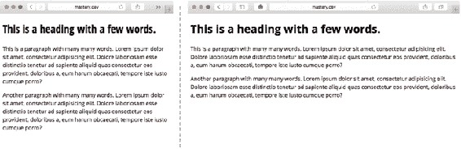

# 八、响应式网页设计和 CSS

当 iPhone 在 2007 年首次亮相时，它标志着在移动设备上浏览体验的重大飞跃。人们争先恐后地为手机和触摸屏开发不同的优化网站，导致了“手机网络”和“桌面网络”的概念。

今天，你可以在手机中找到小到可笑的超大尺寸的浏览器；小平板，大平板，大小电脑，电视，手表，各种游戏机。

为每一种外形和输入类型创建一个单独的站点是不可能的，界限只会变得更加模糊。建立一个适应人们观看的设备的网站——一个响应迅速的网站——已经成为一种规范。

响应式网站设计原则上很简单，但是当你深入细节时，它就变得复杂了。在这一章中，我们将看看 CSS 中的技术，在某种程度上也包括 HTML，这些技术让你从基本原则出发，对响应式网页设计有一个坚实的理解。

我们会掩护

*   响应式网页设计背后的历史和推理

*   视窗、媒体类型和媒体查询的工作方式

*   创建响应式网站时的基本“移动优先”策略

*   何时何地创建断点

*   使用 flexbox、网格布局和多栏布局等现代技术的响应示例

*   响应式排版和响应式媒体内容

## 一个有反应的例子

从 CSS 的角度来看，响应式 web 设计最实际的部分是使用根据视区大小进行调整的流畅布局。我们将从重写第七章的新闻站点示例的第一部分开始这一章，作为一个响应性布局。

### 开始简单

对于较窄的视口，如移动设备上的视口，简单的布局通常就足够了。一列条目，按照内容的优先级排序(它们应该在 HTML 源代码中)，是一种常见的方法，如图 8-1 所示。


###### 图 8-1。适用于较窄屏幕的单列布局

就布局代码而言，这意味着从我们在第七章中使用的示例中移除样式，而不是添加样式。我们可以删除几乎所有提及特定宽度的内容。我们设置为基本样式的唯一内容是行和列的填充和边距。我们还将把列设置为浮动的和 100%宽，遵守确保行包含任何浮动子元素的规则。

```html
.row {
  padding: 0;
  margin: 0 -.6875em;
}
.row:after {
  content: '';
  display: block;
  clear: both;
}
.col {
  box-sizing: border-box;
  padding: 0 .6875em 1.375em;
  float: left;
  width: 100%;
}
```

### 介绍我们的第一个媒体提问

如果我们以稍微宽一点的尺寸来看这个设计，我们可以同时在屏幕上显示更多的内容。例如，我们可以让第二层和第三层占据集装箱宽度的一半，如图 8-2 所示。


###### 图 8-2。两个故事并排放在略宽的屏幕上的专题报道下

通过调整窗口大小，并试图找到并排显示两个故事的合理位置，我们最终得到的最小宽度约为 560 像素，或 35 ems。这就是我们需要添加一个叫做*媒体查询*的东西的地方，只有当满足最小宽度要求时，它才会触发其中的规则:

```html
**@media only screen and (min-width: 35em) {** 
  .row-quartet > * {
    width: 50%;
  }
  .subcategory-featured {
    width: 100%;
  }
**}** 
```

如果你曾经用 JavaScript、PHP、Python、Java 等做过任何编程。，你可能见过 if 语句——“如果这个条件为真，就这样做。”使用@media 规则的媒体查询，很像它的表亲@supports 规则，就像 CSS 的 if 语句，特别适合显示页面的环境的功能。在这种特殊情况下，浏览器视窗至少需要 35 ems 宽。我们引入媒体查询的宽度通常被称为*断点*。

请注意，我们放置断点的地方的测量与任何特定类型的设备(移动设备或其他设备)的测量无关。这只是一个我们可以更好、更有效地利用空间的地方。我们应该避免根据特定的器件宽度设置断点，因为新的器件总是在不断地产生。最终，我们将无法通过进一步划分来打破“移动网络”和“桌面网络”的人为划分。

在这一章的后面，我们将再看一看如何构造媒体查询和断点。现在，需要记住的重要事情是，媒体查询中的 CSS 仅在满足特定条件时应用。

### 查找更多断点

继续增加浏览器窗口的大小，我们发现更多的地方可以更有效地利用空间。在大约 800 像素(50 ems)的情况下，我们可以并排放置四个故事，让特色故事占据一半的宽度(见图 8-3 )。这开始类似于最初的“无响应”的例子，但是子类别标题仍然在故事的顶部。


###### 图 8-3。内容区现在有四个栏目，而专题文章占据了两倍的空间。尽管如此，标题仍然在顶部。

```html
@media only screen and (min-width: 50em) {
  .row-quartet > * {
    width: 25%;
  }
  .subcategory-featured {
    width: 50%;
  }
}
```

最后，我们发现我们可以在大约 70 ems 或 1120 像素的位置将标题放入故事的侧面(见图 8-4 )。


###### 图 8-4。随着窗口变宽，我们可以添加另一个媒体查询来调整标题，使其作为侧边栏工作

```html
@media only screen and (min-width: 70em) {
  .subcategory-header {
    width: 20%;
  }
  .subcategory-content {
    width: 80%;
  }
}
```

现在，我们已经重新创建了这个例子的响应版本，涵盖了四种不同的布局。我们还做了一些进一步的微小的样式调整，这里没有涉及。完整的示例代码(可以在本书附带的文件中找到)包括这些调整，以及使响应式布局在移动设备上工作的视口声明。(我们将在本章的后面深入研究视口的细节。)

前一个示例中相对较短的代码片段包含了许多有用的技术和原则。我们从一个简单的单栏布局开始，并使用媒体查询来创建设计变更的范围——这是响应性 web 设计的健壮方法的基础。在我们进一步探索响应式编码技术之前，我们先来看看响应式 web 设计的由来。

## 响应的根源

设计师兼开发人员伊桑·马科特(Ethan Marcotte)在 2010 年发表在《与众不同》([`alistapart.com/article/responsive-web-design`](http://alistapart.com/article/responsive-web-design))上的一篇同名文章中创造了“响应式网页设计”这个术语(见图 8-5 )。在那篇文章中，他使用这个术语来描述流体网格、灵活的嵌入对象(如图像或视频)和媒体查询的组合使设计适应任何屏幕尺寸。这篇文章后来变成了同名的书，球在滚动。


###### 图 8-5。引发这一切的文章。有趣的事实:插图本身是有反应的——去找到文章并调整浏览器窗口的大小！

虽然响应式网页设计作为一种现象还是相对较新的，但将单一设计应用于多种设备的根源比它的名字还要古老。

在技术层面上，响应式网页设计的组成部分在这个术语被创造出来之前就已经存在了。如果没有一些人预见到需要适应浏览器的布局，媒体查询(及其前身，媒体类型)就不会被标准化。事实上，伊桑这篇文章的主要灵感之一是约翰·奥尔索普 2000 年的一篇名为“网页设计之道”([`alistapart.com/article/dao`](http://alistapart.com/article/dao))的文章。在那篇文章中，John 认为好的网页设计更多的是适应用户，而不是实现完美的控制。我们花了一段时间才到达那里，但事情正在发生变化。

到 2010 年，媒体询问获得了更广泛的支持。这也是在移动设备上浏览变得很普遍的一个时间点。通过将这些技术结合在一起，并创造了响应式网页设计这个术语，Ethan 为一个方向起了一个名字，这个方向是网页已经想发展很久了。

响应式网页设计正迅速成为设计网页的事实方式，并可能很快被视为“好的网页设计”在此之前，响应式网页设计是一个有用的术语，用来描述在多种设备和多种屏幕尺寸上进行设计的具体方法。

### 超越 CSS 的响应

今天，响应技术被用在大大小小的网站上。Ethan 的响应性的三个主要支柱仍然构成了响应性网页设计的基础，但是它们补充了更多的适应工具。最常见的一种方法是使用 JavaScript 来增加交互性或改变页面在不同设备上的呈现方式。

例如，你可能见过现在无处不在的“汉堡菜单”一种常见的模式是在较大的屏幕尺寸上展开全局导航菜单，但隐藏在较小视窗上的按钮下面(见图 8-6 )。通常，根据视口大小改变菜单会涉及到一些 JavaScript。需要指出的是，初始内容和标记仍然是相同的，与使用什么设备查看站点无关。这种“核心体验”可以用你喜欢的任何方式通过脚本进行转换。


###### 图 8-6。Shopify 是许多在小视窗上使用“汉堡菜单”的网站之一

这种模式应该是一种常见的模式:首先加载一组核心资源，然后在确定了设备的功能后再加载更多的资源。响应式网页设计的确是渐进式改进的另一个例子。

在这一章中，我们将试着把重点放在响应式网页设计中我们可以用 CSS 来影响的部分，并简短地探讨一下响应式图片。如果你想开始为响应式网站寻找更高级的模式，布拉德·弗罗斯特收集了大量的模式和代码示例，名为“这就是响应式”([`bradfrost.github.io/this-is-responsive/`](https://bradfrost.github.io/this-is-responsive/))。

掌握响应式 CSS 的第一步是理解我们必须使用的画布——视口。

## 浏览器视口的工作方式

视窗是显示网页的矩形。它是影响我们布局的区域:我们在 CSS 方面有多少空间。为了让视口很好地与我们的响应式设计配合，我们需要理解它是如何工作的以及如何操作它。在桌面浏览器上，视口的概念非常简单。我们有许多 CSS 像素可以使用，并且我们尽可能地使用了视窗中的空间。

这里有一个重要的区别，CSS 像素和物理像素不是一回事。我们在 CSS 中衡量事物时谈论的像素与屏幕的物理像素有着非常不稳定的关系，这取决于硬件、操作系统、浏览器以及用户是否放大或缩小了页面等因素。

作为一个思想实验，我们可以想象将两个 div 元素直接放在页面的 body 元素中。如果我们将第一个 div 的宽度设置为 100%,第二个 div 的宽度设置为 px，那么在哪个 px 度量下它们的宽度相同？该度量是以 CSS 像素为单位的当前视区的宽度，而不管使用多少物理像素来显示它。

作为一个具体的例子，iPhone 5 的物理屏幕宽度为 640 像素，但就 CSS 而言，视口宽度为 320 像素。这里有一个缩放因素—这个特定设备上的每个 CSS 像素都使用 2×2 物理像素显示(见图 8-7 )。


###### 图 8-7。CSS 像素和高分辨率设备上的设备像素之间的差异

“虚拟”CSS 像素和实际硬件像素之间的比率目前范围从 1(其中每个 CSS 像素= 1 个物理像素)到大约 4(其中每个 CSS 像素= 4×4 个硬件像素)，具体取决于设备。

好消息是，由于我们只需要跟踪 CSS 像素，以实现响应性布局，像素比率在很大程度上是不相关的。坏消息是，我们需要更深入地挖掘视口的真实世界机制，以了解如何按照我们的意愿来弯曲它们。

### 视口定义的细微差别

触摸屏智能手机和其他移动设备稍微搅动了一下。他们更多地使用缩放来处理不适合在如此小的屏幕上浏览的网页。这使得设备制造商发明了影响视口的新概念。移动平台战略家彼得-保罗·科赫([`quirksmode.org`](http://quirksmode.org))发表了关于这些不同级别的视口如何工作的广泛研究，并试图给它们起一个有用的名字。

#### 默认和理想视口

随着智能手机浏览器的出现，没有多少网站针对这种尺寸的屏幕进行了优化。因此，默认情况下，大多数手机(以及平板电脑)上的浏览器都是硬连接的，显示桌面大小的视窗，允许非优化的网站显示。通常，它们模拟大约 1000 个 CSS 像素的视口宽度，有效地缩小页面。我们称之为*默认视窗*。这就是为什么当我们希望响应式设计正确显示时，我们必须经历一些困难。

由于默认视口是仿真的视口尺寸，因此从逻辑上讲，存在更接近设备本身尺寸的视口定义。这就是我们所说的*理想视口*。理想的视口因设备、操作系统和浏览器而异，但通常手机的视口宽度为 300 至 500 CSS 像素，平板电脑的视口宽度为 800 至 1400 CSS 像素。在之前的 iPhone 5 例子中，这就是 320 像素宽度的来源。

在响应式设计中，这是我们设计的视口。图 8-8 显示了加载使用理想视窗的移动优化[`mobile.nytimes.com`](http://mobile.nytimes.com)与加载相同站点的“桌面版”之间的比较，显示了使用默认视窗的缩小桌面布局。


###### 图 8-8。纽约时报网站的移动站点使用理想的视口进行布局(左)。如果您切换到“桌面”站点，您将获得缩小的默认视口外观(右)，模拟 980 像素的宽度。

#### 视觉和布局视口

通过区分手机和平板电脑上的默认视口和理想视口来设置场景，我们得到了一个关于视口实际工作方式的通用、更直观的定义。我们称其内部显示网页的基本矩形为*可视视口*。这意味着浏览器窗口，没有任何按钮，工具栏，滚动条等。(被称为“浏览器 chrome”)围绕在实际的 web 内容周围。

当我们放大一个页面时，布局的某些部分会在可视视窗之外结束，如图 8-9 所示。我们现在看到的矩形仍然是可视视口，但我们现在将约束*整个页面*布局的假想矩形称为*布局视口*。视觉视口和布局视口之间的这种分离在概念上在桌面浏览器上的工作方式与在手机和平板电脑上的工作方式相同。


###### 图 8-9。在手机上查看的放大站点上的可视视口和布局视口

正如您所看到的，对于视窗来说，不仅仅是看上去那么简单。底线是在响应式网页设计中，我们的目标是设计我们的页面来适应每个设备的理想视窗。桌面浏览器不需要任何特殊处理，因为理想视口等于默认视口。但是在手机和平板电脑上，我们需要排除默认视口的虚假测量，并使其等于理想视口。这是通过一小段被称为 *meta viewport* 标签的 HTML 完成的。

### 配置视口

通过在页面的 head 元素中添加一个小标签，我们可以让具有不同默认视口的设备使用理想视口。看起来是这样的:

```html
<meta name="viewport" content="width=device-width, initial-scale=1">
```

这告诉浏览器我们希望使用设备的理想尺寸(设备宽度)作为视窗宽度的基础。这里还有另一个偏好设置:initial-scale=1 位。该部分设置缩放级别以匹配理想的视口，这也有助于防止 iOS 中一些奇怪的缩放行为。当设置缩放级别时，大多数设备将采用设备宽度，但为了在设备和操作系统之间完全兼容，两者都是必需的。

将“初始比例”设置为大于 1 的值意味着进一步缩放布局，这样做可以减小布局视口的大小，因为适合的像素更少。相反，将该值设置得越低，缩小的布局视口就 CSS 像素而言就越大。

#### 其他值并结合初始比例

还可以将视口内的宽度设置为像素度量，而不是 device-width 关键字，从而有效地将布局视口锁定为您选择的值。如果你把它和一个初始比例值结合起来，移动浏览器会选择两者中较大的一个。

###### 不要禁用缩放！

通过在 meta viewport 标签中设置最大比例和最小比例属性(为一个数值),可以将缩放锁定在特定级别。您也可以通过设置 user-scalable=no 来完全禁用缩放。这样的 meta viewport 标记并不少见:

```html
<meta name="viewport" content="initial-scale=1.0, maximum-scale=1.0, minimum-scale=1.0, user-scalable=no">
```

这使得你的用户无法在移动设备上缩放页面，这意味着你的页面不容易被访问。

即使你小心翼翼地设计页面，使文本清晰可辨，页面上可操作的部分(如链接和按钮)有足够的尺寸，视力较低或有运动障碍的用户可能不这么认为。

一些开发人员倾向于锁定缩放因子，以使 web 应用程序的行为更像本地应用程序。这样做也解决了一些与旧平台上缩放和定位相关的错误和古怪行为，但随着移动平台的成熟，这些错误正在得到修复。

我们认为锁定缩放因子听起来就像把婴儿和洗澡水一起倒掉——毕竟，通用访问是网络建设的最大好处之一。

#### 设备自适应和 CSS @viewport

在一个标签中声明 viewport 属性是目前最好的方法，但是这也是一种非标准的机制，正如您可能从上一节中看到的那样。苹果在第一代 iPhone 自带的 Safari 浏览器中引入了它作为专有开关，其他人也纷纷效仿。

因为这是页面呈现方式的一部分，所以视口属性应该是 CSS 的一部分是有意义的。为此提出了一个标准，称为 CSS 设备适配。它建议我们在页面的头部使用类似这样的东西来代替 meta viewport 标签:

```html
<style>
@viewport {
  width: auto;
}
</style>
```

将 viewport 声明放在 HTML 的样式元素中，而不是放在实际的 CSS 文件中，这是一个很小但很重要的细节。浏览器不应该在知道视窗大小之前等待 CSS 文件被下载。将这些信息作为 HTML 文件的一部分可以防止浏览器在外部 CSS 文件到达时做额外的工作。

到目前为止,@viewport 声明还没有被广泛实现。在撰写本文时，它仅在 Windows 和 Windows Phone 8 上的 Internet Explorer 10+中得到部分支持。像 Chrome 和 Opera 这样的基于 Blink 的浏览器在一些平台上实现了隐藏设置。它也许是未来最有可能控制视口的候选者，但在撰写本书时并不是非常重要。

这项技术有几个小警告，正如实验技术所预期的那样:开发人员 Tim Kadlec 有一篇关于这些缺陷的好文章([`timkad LEC . com/2013/01/windows-phone-8-and-device-width/`](http://timkadlec.com/2013/01/windows-phone-8-and-device-width/))。

## 媒体类型和媒体查询

既然我们已经对视口有了透彻的了解，视口是我们约束布局的空间，那么是时候进入响应式设计的“如何”部分了:根据媒体查询调整您的设计。我们用一个简单的例子开始了这一章，但是这一次我们要更深入，从媒体查询的前身:媒体类型开始。

### 媒体类型

基于设备的能力来分离样式的能力始于媒体类型。这些是在 HTML 4.01 和 CSS 2.1 中定义的，创建它们是为了让你针对特定类型的环境:屏幕样式、打印样式、电视样式等等。

您可以通过向链接元素添加媒体属性来定位媒体类型，如下所示:

```html
<link rel="stylesheet" href="main.css" **media="screen, print"**>
```

前面的代码片段意味着该样式表适用于两种屏幕(任何类型的屏幕)以及打印页面时。如果您不关心它用于哪种类型的媒体，您可以将 all 作为值，或者省略 media 属性。逗号分隔的有效类型列表意味着它们中的任何一个都可以匹配，如果没有一个匹配，则不应用样式表。

您也可以将媒体类型选择作为 CSS 文件的一部分。最常见的方法是使用@media 语法，如下所示:

```html
**@media print {** 
  /* selectors and rule sets for print media go in here */
  .smallprint {
    font-size: 11pt;
  }
**}** 
```

还有几种媒体类型可供选择:其中包括手持设备和电视。这些听起来似乎应该对响应式设计有用，但遗憾的是它们没有。出于各种原因，浏览器制造商回避明确传输他们属于什么类型的设备，所以唯一有用的类型几乎是屏幕、打印和所有。

### 媒体查询

因为我们不仅要针对设备的类型，还要针对设备的功能，所以创建了 CSS 3 媒体查询规范。它定义了媒体类型基础的扩展。媒体查询被写成媒体类型和由括号内的*媒体特征*组成的*媒体条件*的组合。媒体选择语法中还有一些其他新的关键字，提供了一些额外的逻辑。

链接元素上的媒体查询可能如下所示:

```html
<link rel="stylesheet" href="main.css" **media="screen and (min-width: 600px)"**>
```

这表明 main.css 文件应该用于任何与媒体条件相匹配的屏幕媒体，其中视窗的宽度至少为 600 个 css 像素。

###### 注意

许多浏览器仍然下载 CSS 文件，即使媒体查询当前不匹配。这意味着您应该小心不要在媒体查询中过度使用 link 元素—您可能会不必要地为您的用户创建额外的请求，这是一个严重的性能问题。

与 CSS 文件中的@media 规则结合使用的相同语句如下所示:

```html
@media screen and (min-width: 600px) {
  /* rules go here */
}
```

and 关键字就像是媒体类型和我们测试的任何条件之间的粘合剂，所以我们的查询可以有几个媒体条件:

```html
@media screen and (min-width: 600px) and (max-width: 1000px) {}
```

多个媒体查询可以用一个逗号字符连接在一起，该字符用作“或”如果任何媒体查询为真，将应用块内的规则。如果所有的媒体查询都是假的，它将被跳过。

您可以完全省略媒体类型，但仍然使用语句的媒体条件部分:

```html
@media (min-width: 30em) {/*...*/}
/* ...is the same as... */
@media all and (min-width: 30em) {/*...*/}
```

还可以用 not 关键字否定媒体查询。下面的意思是里面的规则对除了屏幕以外的任何媒体都有效:

```html
@media not screen {
  /* non-screen styles go here. */
}
```

我们还有唯一的关键字，这是为了防止旧浏览器误解媒体查询而引入的。

当不支持媒体查询的浏览器看到屏幕和(最小宽度:...，它应该把整个东西作为一个糟糕的媒体类型丢弃，然后继续前进。然而，一些旧的浏览器似乎在看到屏幕的第一个字符串后停止，将其识别为有效的媒体类型，并将样式应用于所有屏幕。

因此，在媒体查询规范中引入了唯一的关键字。当老的浏览器在开始看到它时，他们放弃了整个@media 规则，因为不存在唯一的媒体类型。所有支持媒体查询的浏览器都被要求忽略唯一的部分，就好像它不存在一样。

为了真正防止较旧的浏览器应用错误的样式，您应该声明任何需要将范围限定为特定媒体类型的媒体查询，如下所示:

```html
@media only screen and (min-width: 30em) {/*...*/}
```

如果您不关心具体的媒体类型，您可以将其简化为:

```html
@media (min-width: 30em) {/*...*/}
```

#### 维度查询

除了宽度和高度，宽度尺寸(及其最小和最大前缀)是响应式网页设计的真正主力。当 quirksmode.org 的 Peter-Paul Koch 在网站开发者和设计者中进行一项关于媒体查询的调查时，他发现与宽度相关的媒体查询是最受欢迎的，而且是压倒性的。

宽度如此重要的原因是，我们创建网页的默认方式是仅在填充视窗之前使用水平布局。在垂直方向上，我们可以让事物随心所欲地增长，让用户滚动。我们想知道何时用尽(或获得更多)布局的水平空间是有意义的。

###### 远离设备测量

我们还可以向浏览器询问设备宽度和设备高度。这并不总是意味着与视窗尺寸相同的东西，而是整个屏幕的尺寸。

可悲的是，许多开发人员将设备宽度与普通宽度查询互换使用，导致移动浏览器制造商效仿，以确保网站在其浏览器上工作。在即将发布的媒体查询规范版本中，设备测量查询也已被弃用。总而言之，设备宽度和设备高度很容易混淆，所以除非出于某种原因被迫使用，否则请远离它们。

#### 其他维度:分辨率、纵横比和方向

虽然对视口尺寸的查询可能构成媒体查询使用的绝大部分，但是应该注意，我们可以查询设备的其他方面。例如，我们可以仅在设备宽度小于设备高度时更改布局，这意味着它处于纵向方向:

```html
@media **(orientation: portrait)** {
  /* portrait orientation styles here. */
}
```

类似地，我们可以仅在例如视口匹配某个最小纵横比时应用规则:

```html
@media **(min-aspect-ratio: 16/9)** {
   /* only applied when the viewport aspect ratio is at least the widescreen 16:9 ratio. */
}
```

我们之前提到过，设备的像素比例在很大程度上是不相关的。说到*布局*确实如此。在本章的前面，我们将使用 min-resolutionmedia 查询来调整加载哪个图像，其中像素比率非常重要。

媒体查询可能会在未来得到扩展，以便能够检测用户设备和环境的其他方面。虽然有许多令人兴奋的进步即将出现(甚至在浏览器中已经有了一些实验性的支持)，但我们将把重点放在本书中最有用的查询上，让您为今天的工作做准备。

#### 对媒体查询的浏览器支持

基本的媒体查询几乎在任何地方都得到支持。可悲的是，与许多其他“CSS 3”功能一样，像 IE8 和更老版本的浏览器有点落伍了。

您可以使用各种策略来应对这种情况，要么为这些旧浏览器提供固定宽度的布局，要么使用 polyfill 一种假装支持缺失功能的脚本。

Scott Jehl([`github.com/scottjehl/Respond`](https://github.com/scottjehl/Respond))的 Respond.js 就是这样一个脚本。在不支持媒体查询的浏览器中，它会查看所有链接的 CSS 文件并搜索媒体查询语法。然后，它根据屏幕尺寸应用或删除这些部分，模拟本地媒体查询的工作方式。

使用 Respond.js 有一些缺点。例如，该脚本不能直接在页面的样式元素中处理媒体查询。还有其他边缘情况约束需要考虑，所以在使用 Respond.js 之前一定要参考网站上的说明。

如果使用 JavaScript 不能解决这个问题，你可以使用一个单独的样式表，将旧版本 IE 中的设计锁定在一个特定的“桌面”宽度，并使用条件注释来包含它。

条件注释是一个奇怪的特性，在 IE10 之前(但不包括 IE10)一直存在于 IE 中。它们使得将 HTML 片段包装在所有其他浏览器视为普通注释的东西中成为可能，但 IE 可以进入并获取隐藏在其中的 HTML。一个特殊的语法可以让你针对个别或分组版本的 IE 浏览器。

为桌面 IE 提供这些宽屏样式的条件评论需要考虑旧版本的 IE，同时仍然不针对旧版本 Windows Phone 中的 IE。它看起来像这样:

```html
<!--[if (lt IE 9) & (!IEMobile)]>
<link rel="stylesheet" href="oldIE.css" media="all">
<![endif]-->
```

这种策略依赖于您将规则的其余部分放在一个样式表中，其中小屏幕样式是“默认”的，宽屏幕样式是媒体查询的范围。无论如何，这是一个好主意，我们将在下一节看到。

## 为响应式设计构建 CSS

在本章开始的初始示例中，我们从代码中去掉了宽度和布局规则，并将它们添加回最小宽度媒体查询的范围。这种方法不仅仅是一种高效的模式，因为您只需要编写很少的代码；这也是一项重要战略的一部分。

### 移动第一 CSS

你可能听说过“移动优先”这个术语这是一个围绕如何集中你的设计和开发努力的策略。移动设备的屏幕较小，更难打字，而且通常比台式机处理器更弱，内存更少。它们也是离大多数人最近的设备。

通过在设计和开发过程中首先关注这些设备，我们从一组强调数字产品核心的约束条件开始。当我们扩展网站或应用程序以在其他设备上工作时，我们可以利用扩展的容量。

如果我们反过来做，我们将需要把现有的特性塞进一个更加受限的平台——这是一个更加困难的壮举。

同样的思维模式也适用于 CSS，即使你正在重写一个最初被认为是“桌面”网站的项目。

CSS 文件中的第一条规则构成了最小屏幕和不理解媒体查询的浏览器的基本体验:

*   **排版基础:**大小、颜色、行高、标题、段落、列表、链接等。

*   **“框”的基础:**任何特定的边框样式、填充项目、灵活的图像、背景颜色和一些有限的背景图像

*   **浏览和消费内容的基本组件:**导航、表单、按钮

当您在各种类型和大小的移动设备和浏览器上测试这些样式时，您会发现它们在某个点开始出现问题。线的长度将变得太长，项目将变得太远，等等。当这种情况发生时，你应该考虑在那个时候添加一个媒体查询——这就是为什么它被称为*断点*的原因。重申一下，这可以是任何度量:代码适应站点的*内容*比适应任何特定设备的像素度量更重要。

```html
/* start off with the baseline and small-screen styles. */
.myThing {
  font-size: 1em;
}
/* ...then adjust inside min-width media queries: */
@media only screen and (min-width: 23.75em) {
  .myThing {
    width: 50%;
    float: left;
  }
}
/* ...and further adjustments... */
@media only screen and (min-width: 38.75em) {
  .myThing {
    width: 33.333%;
  }
}
```

你会从我们在本章开始时如何重写新闻站点的例子中认出这个方法。这就是转化为代码的“移动优先”的思维模式。它也反映了移动优先、响应性网页设计和渐进式改进是如何齐头并进的。编写尽可能少的代码，同时满足尽可能多的设备的需求，这是你做得对的一个明确标志！

###### 媒体查询和 Ems

正如我们在这里所做的那样，使用 ems 编写媒体查询是一种针对不断变化的环境进一步增强设计的方法。当你在桌面浏览器中缩放时，大多数浏览器将缩放基于像素的查询，但是用户也可以选择改变基本字体大小而不是缩放。

使用 ems 作为度量标准可以确保您的布局也能适应这种情况，因为它与文档的基本字体大小有关。

请注意，ems 中设置的媒体查询始终与浏览器首选项中的基本字体大小相关，*而不是*您可以在 CSS 中调整的 html 元素(1rem)的字体大小。

#### 高效小屏幕样式的最大宽度查询

使用最小宽度查询作为我们的主要工具，我们可以对越来越宽的视口进行分层调整。但是最大宽度查询不可低估。有时，我们可能有一些样式在小屏幕上有意义，但在大屏幕上没有意义。这意味着，如果使用最小宽度，我们必须首先声明样式，然后否定它。使用最大宽度查询可以减少工作量。

作为一个浓缩的例子(没有双关语的意思！)，您可能希望在较小的视窗上使用窄字体，以防止过度换行(见图 8-10 )。



###### 图 8-10。响应式排版的一个例子是在较小的视窗上使用较窄的字体，以避免过多的换行

使用最小宽度查询和“移动优先”CSS 策略，这个场景可能如下所示:

```html
body {
**font-family: 'Open Sans', 'Helvetica Neue', Arial, sans-serif;** 
}
h1,h2,h3 {
  font-family: 'Open Sans Condensed', 'Arial Narrow', Arial, sans-serif;
}
@media only screen and (min-width: 37.5em) {
  h1,h2,h3 {
**font-family: 'Open Sans', 'Helvetica Neue', Arial, sans-serif;** 
  }
}
```

突出显示的部分指出了基本字体系列声明需要如何重复，以否定精简标题的小屏幕样式。如果我们使用最大宽度查询，我们会得到一个稍微短一点的例子，没有重复，因此需要维护的代码更少:

```html
body {
  font-family: 'Open Sans', 'Helvetica Neue', Arial, sans-serif;
}
@media only screen and (max-width: 37.5em) {
  h1,h2,h3 {
    font-family: 'Open Sans Condensed', 'Arial Narrow', Arial, sans-serif;
  }
}
```

当然，还有其他类型的媒体查询，你可以用来改变你的网站。正如许多事情一样，每个项目的具体细节都可以归结为一点“视情况而定”但是使用最小宽度查询作为您的主要工具与使用媒体查询作为一种渐进增强形式的想法非常一致。

### 在哪里放置您的媒体查询

首先是基本的“未分段”样式，然后是最小宽度查询，这个例子很适合作为包含媒体查询的样式表的基本结构的例子。

不过，媒体查询可以服务于稍微不同的目的:调整一个小细节或者重新安排整个布局。通常，这两类媒体查询也以略微不同的方式出现，因此区别对待它们是有意义的。

对于如何选择自己的结构没有硬性规定，但是我们发现对不同种类的媒体查询进行稍微不同的分组是有意义的:

*   影响页面整体布局的媒体查询通常与描述站点主要组件的几个类名有关，并且跨越几个屏幕尺寸。将它们放在靠近这些布局规则的地方通常是有意义的。

*   如果您有特定的媒体查询，只调整站点的一个特定组件，请将媒体查询代码放在描述该组件的规则旁边。

*   最后，如果您发现对布局的大量更改以及对单个组件的一些较小的调整都出现在相同的断点，那么最好将它们都放在样式表的末尾。这样做，您就保持了从“未分类的”规则开始，然后通过覆盖样式变得更加具体的模式。

重要的是，在你的 CSS 中没有一个明确的地方可以放置所有的媒体查询。这也意味着，作为开发人员，创建适合您或您的团队的结构和约定是您的责任。

###### 警告

媒体查询不会增加选择器的特殊性，所以您需要确保放置它们的结构和顺序不意味着它们会在源代码的其他地方被覆盖。将它们放在最后并不保证它们会覆盖任何东西:它们仍然遵循级联的正常规则。

## 更敏感的模式

“移动优先”的 CSS 编写方式是响应式设计基本模式的一个例子。还有很多其他的模式可以让你的设计更加灵活，反应更加灵敏，随着新技术的出现，我们会创造和改进更多的模式。这一节包含几个好的。

### 响应文本列

我们在第四章中遇到的 CSS 3 多列布局规范是 CSS 从一开始就内置了响应模式的第一部分之一，远远早于这个术语的出现。通过使用列宽而不是设定的列数，内容将流入容器中适合的尽可能多的列中(参见图 8-11 )。


###### 图 8-11。在较窄的视口中，段落排列成一列，而在较宽的视口中，会自动出现多列

```html
<div class="multicol">
  <p>Lorem ipsum [...]<p>
  <!-- ...etc -->
</div>
```

CSS 是一个单独的列声明行——不需要媒体查询！

```html
.multicol {
**column-width: 16em;** 
}
```

值得重申的是，在网页上应该少用多栏文本。不过，它肯定有一个用例。只要文本不太长，即使在较宽的屏幕上也不会迫使用户上下滚动，这是一种回收水平空间的方法，而不需要使用宽得令人不舒服的尺寸。

### 无媒体查询的响应式 Flexbox

Flexbox 是 CSS 的另一部分，它内置了一定程度的响应能力。无需使用任何媒体查询，我们就可以创建使其布局适应可用空间的组件。

假设我们想要构建一个小部件，通过点击按钮来增加或减少购物篮中的部件数量，您可以在其中订购时间机器的备件(参见图 8-12 )。


###### 图 8-12。我们订购零件的小工具

部件列表是一个无序列表，其中每个项目具有以下结构:

```html
<ul class="ordering-widget">
  <li class="item">
    <span class="item-name">Flux capacitor regulator</span>
    <span class="item-controls">
      <button class="item-control item-increase" aria-label="Increase">+</button>
      <button class="item-control item-decrease" aria-label="Decrease">-</button>
    </span>
  </li>
  <!-- ...and so on. -->
</ul>
```

通过使用灵活的大小来设计项目名称和按钮控件的样式，我们可以创建一个组件，当没有足够的空间将它们放在同一行时，它可以改变布局。

首先，列表的一些重置样式，以及基本的排版规则:

```html
.ordering-widget {
  list-style: none;
  margin: 0;
  padding: 0;
  font-family: 'Avenir Next', Avenir, SegoeUI, sans-serif;
}
```

然后，我们将每个项目转换成一个包装 flex 行:

```html
.item {
  color: #fff;
  background-color: #129490;
**display: flex;** 
**flex-wrap: wrap;** 
  font-size: 1.5em;
  padding: 0;
  margin-bottom: .25em;
}
```

每个项目的名称必须至少有 13 个 ems 宽，以适应最长的名称，否则应该扩展以填充可用空间:

```html
.item-name {
  padding: .25em;
**flex: 1 0 13em;** 
}
```

接下来，包裹两个按钮的 span 元素也应该填充可用空间，并且至少 4em 宽。它还充当按钮的 flex 容器。

```html
.item-controls {
  flex: 1 0 4em;
  display: flex;
}
```

每个按钮又是一个 flex 项目，占用相同的空间。其余的样式主要是中和按钮元素的默认样式(我们将在第九章回到表单控件的样式):

```html
.item-control {
**flex: 1;** 
  text-align: center;
  padding: .25em;
  cursor: pointer;
  width: 100%;
  margin: 0;
  border: 0;
  color: #fff;
  font-size: inherit;
}
```

剩下的只是按钮本身的背景颜色:

```html
.item-increase {
  background-color: #1E6F6D;
}
.item-decrease {
  background-color: #1C5453;
}
```

这就是响应式小部件的所有样式！有趣的部分来了:当按钮控制(的。item-controls 元素)空间不足，无法与固定宽度的元素放在同一行。item-name 元素，它们自然会换行到第二行。自从。item-controls 元素的 flex-grow 因子为 1，它将扩展到占据整个第二行(参见图 8-13 )。每个按钮将依次增长，占据其自身行的一半。


###### 图 8-13。当空间紧张时，按钮会出现在物品名称的下方

#### 灵活的容器相关组件

在前面的例子中，我们创建了另一个响应组件，而没有求助于媒体查询，从而降低了 CSS 的复杂性。这种包装行为虽然简单，但对于浮动或内联块显示是不可能的。

还需要注意的是，这种类型的灵活组件并不响应视口的大小，而是响应组件中渲染它的实际可用空间。这往往是我们实际想要实现的。

虽然媒体查询非常适合基于视口调整布局，但是它们没有考虑到一个特定的组件可以出现在多个位置，以不同的宽度呈现。换句话说，如果一个组件出现在一个窄边栏中，我们希望它使用在窄上下文中有意义的样式来显示，而不管视窗大小如何。直到我们有了某种形式的“容器查询”(容器查询正在研究中——见[`github.com/ResponsiveImagesCG/cq-usecases`](https://github.com/ResponsiveImagesCG/cq-usecases))，像 flexbox 这样的技术帮助我们实现了部分目标。

### 具有网格模板区域的响应式网格

网格布局属性允许您将大量布局工作从单个元素转移到网格容器中。当使用我们在第七章中看到的命名模板区域语法时，下一个模式极大地简化了使页面布局响应的过程。

###### 注意

提醒一下，在撰写本文时，Grid Layout 仍然有非常不稳定的浏览器支持。然而，在未来几年，它很可能成为响应式布局的重要组成部分。

如果我们从第七章来看新闻网站例子的第二小节，我们可以用相对较少的改变把它改编成一个完全响应的布局。但是首先，回顾一下标记结构:

```html
<section class="subcategory">
  <div class="grid-b">
    <header class="subcategory-header"></header>
    <article class="story"></article>
    <article class="story"></article>
    <div class="ad"></div>
    <div class="ad"></div>
  </div>
</section>
```

标记包含部分标题、两篇文章和两条广告。在不应用任何布局样式(网格布局或其他)的情况下，它们在页面上排列成全幅块。这在小视窗中非常有效(见图 8-14 )。


###### 图 8-14。左侧是未设置样式的单列布局。在右边，通过使用网格模板在故事之间插入了一个广告。

源顺序突出了页面内容中的重要内容，故事首先出现在标记中，然后是广告。但是，如果广告销售团队需要我们在移动视图上的故事之间插入广告，这样广告就不会在页面底部丢失，该怎么办？

我们可以使用网格声明来解决这个问题。首先，我们需要为标题和故事定义网格区域名称:

```html
.grid-b .subcategory-header {
  grid-area: hd;
}
.grid-b .story:nth-of-type(1) {
  grid-area: st1;
}
.grid-b .story:nth-of-type(2) {
  grid-area: st2;
}
```

在不使用媒体查询的情况下，我们现在可以定义网格容器的基本内容，以及其中单个列的行顺序。网格模板现在可以控制单个内容列中项目的排序。广告现在自动流入故事之间的未命名区域(用点表示)。

```html
.grid-b {
  display: grid;
  grid-template-columns: 1fr;
  grid-template-areas: "hd" "st1" "." "st2" ".";
}
```

当有更多的空间时，我们可以通过在媒体查询中添加新模板来将故事部分更改为 2×2 的网格(参见图 8-15 )。


###### 图 8-15。对于稍微大一点的视窗，故事和广告现在是以方格形式出现的

```html
**@media only screen and (min-width: 37.5em)** {
  .grid-b {
    grid-template-columns: **1fr 1fr**;
grid-template-areas: **"hd  hd "** 
**"st1 ..."** 
                         **"... st2"**;
  }
**}** 
```

请记住，我们可以使用任意数量的连续点来表示一个匿名网格区域，以便更整齐地排列模板字符串。

在稍微大一点的视窗中，标题仍然在内容的上面，但是故事和广告形成了我们在第七章的例子中看到的相同的三栏布局(见图 8-16 ):

```html
@media only screen and (**min-width: 55em**) {
  .grid-b {
    grid-template-columns: **1fr 1fr 1fr**;
grid-template-areas: **"hd  hd hd "** 
**"st1 .. st2"** 
                         **"st1 .. st2"**;
  }
}
```


###### 图 8-16。标题横跨顶部，故事和广告形成三列/两行的布局

最后，我们切换到使用侧边栏标题和三列布局的布局(见图 8-17 )。


###### 图 8-17。侧边栏标题现在非常适合三个栏

```html
@media only screen and (min-width: 70em) {
  .grid-b {
    grid-template-columns: **20% 1fr 1fr 1fr**;
grid-template-areas: **"hd st1 . st2"** 
                         **"hd st1 . st2"**;
  }
}
```

如您所见，网格布局属性允许我们在某些断点处重新定义整个网格，而无需触及各个组件。当然，对于响应式布局，您可以使用其他网格定位方法，但是网格模板区域功能特别适合于响应式工作。请记住，不支持的浏览器将退回到单列布局，所以这可能还需要一段时间才能成为响应网格的首选武器。

## 超越布局

到目前为止，我们已经熟悉了视窗和媒体查询如何工作的细节，以及响应性布局技术的示例。但是响应式网站需要处理的不仅仅是布局。在这一节中，我们将研究一些技术来确保我们网站的其他方面也能适应。我们将从媒体开始，首先作为背景图像，然后作为嵌入的页面内容。

### 响应背景图像

在 CSS 中使背景图像适应屏幕大小相当简单，因为我们可以访问媒体查询。

对于我们的例子，我们将重温第五章的页面标题例子(猫的社交网络，记得吗？).标记由单个元素组成，充当页面的标题——我们现在将省略标题的其余内容，只关注应用背景。

```html
<header class="profile-box" role="banner"></header>
```

我们将使用两个不同的图像文件作为背景。较小的版本为 600 像素宽，裁剪为正方形，而较大的版本为 1200 像素宽，裁剪更宽松(见图 8-18 )。


###### 图 8-18。我们的两只猫形象

对于最小的视窗，我们将使用紧密裁剪的较小版本:

```html
.profile-box {
  height: 300px;
  background-size: cover;
  background-image: url(img/small-cat.jpg);
}
```

现在，当视口变得比背景图像大时，它会被放大(通过 background-size: cover 声明)，并开始看起来模糊。此时，我们可以将它换成大图:

```html
@media only screen and (min-width: 600px) {
  .profile-box {
    height: 600px;
    background-image: url(img/big-cat.jpg);
  }
}
```

这个简单的例子说明了两件事。首先，我们可以使用媒体查询来为视口提供最合适大小的图像。其次，我们不仅可以使用响应式背景来加载不同分辨率的图像源，还可以通过根据视口裁剪不同的背景图像来指导响应式设计。

#### 使用分辨率查询切换图像

在前面的示例中，我们根据视口的尺寸更改了图像。但是，我们可能还希望根据设备的像素比率，为相同的视窗大小加载不同分辨率的图像。对于图像，图像的实际像素尺寸和 CSS 像素需要协同工作。即使在高分辨率屏幕上，内在尺寸为 400 x400 像素的图像也会显示为 400 x400*CSS 像素*。这意味着图像将被放大，在这个过程中失去清晰度。如果我们只想在高分辨率设备上加载更大、更清晰的图像，我们需要使用分辨率查询。

假设我们想为最小的视窗提供 medium-cat.jpg 文件，但前提是它的像素比率至少为 1.5。这个 medium-cat.jpg 文件是同样的正方形裁剪，但是大小为 800×800 像素。数字 1.5 有些武断，但它确保了大图像用于大多数高分辨率手机和平板电脑，其中 1.5 是最低的范围。您可以随时添加更多的媒体查询(和更详细的图像大小)以获得更高的分辨率，只需留意图像的文件大小即可！

为了根据像素比率切换出图像，要测试的标准化媒体功能称为分辨率，因此我们使用 dppx 单位(“设备像素/像素”)检查最小分辨率。然而，并不是所有的设备都支持这种标准化的查询，所以我们用检查-webkit-min-device-pixel-ratio 来补充它，这主要是由 Safari 使用的。后者的度量是一个无单位的数。

```html
@media (-webkit-min-device-pixel-ratio: 1.5),
       (min-resolution: 1.5dppx) {
  .profile-box {
    background-image: url(medium-cat.jpg);
  }
}
```

将对尺寸的查询与对分辨率的查询结合起来，可以确保为每个设备类别加载最佳图像。

###### 旧的解析查询语法

对于解析查询，您可能会遇到各种其他建议。有一些非标准的查询，比如非常奇怪的 min - moz-device-pixel-ratio，在非常老的 Firefox 浏览器中使用，还有在 dpi 单元中设置的最小分辨率查询。

在一些较旧的实现中，dpi 单元是唯一支持标准化最小分辨率查询的单元，最著名的是 Internet Explorer 9–11。可悲的是，IE 实现错误地获取了设备的 dpi 数字，这导致在某些情况下错误地加载了高分辨率图像。

仅将-webkit-min-device-pixel-ratio 查询与 min-resolution 查询(和 dppx 单元)结合使用，可能会覆盖大多数运行高分辨率设备的用户，并将代码复杂性保持在最低水平，这就是我们推荐它的原因，尽管缺乏 IE 支持。如需进一步阅读，请参见 W3C 的 Elika Etemad 的这篇博文:[`www . w3 . org/blog/CSS/2012/06/14/un fix-WebKit-device-pixel-ratio/`](https://www.w3.org/blog/CSS/2012/06/14/unprefix-webkit-device-pixel-ratio/)

### 响应式嵌入式媒体

响应式 web 设计的一个更棘手的方面是获得内容图像、视频和其他嵌入对象的灵活性。有了 CSS 中的背景图片，我们可以让媒体查询做很多工作。随着东西嵌入到页面中，CSS 的逻辑并不总是帮助浏览器做出正确的决定。

其中一些在技术上超出了 CSS 的范围，但是掌握这些问题是很重要的，因为它们会以如此巨大的方式影响你构建的站点的性能。

#### 响应式媒体基础

在第五章中，我们已经遇到了让图像、视频和其他物体以流畅的方式表现的最基本的技术之一。将最大宽度设置为 100%会使元素流动，但仍不会超出其固有尺寸:

```html
img, object, video, embed {
  width: auto;
  max-width: 100%;
  height: auto;
}
```

虽然前面的规则有些天真，但它代表了一个很好的基线，可以防止固定宽度的元素潜入您的流体和响应设计中。但是，每种使用情况可能需要不同的调整方法。

第五章中的“长宽比感知容器”技巧对于创建灵活的视频容器特别有用。它还有助于解决许多 SVG 内容的大小调整问题；Sara Soueidan 写了一篇关于如何响应性地调整 SVG 大小的好文章([`tym pus . net/codrops/2014/08/19/making-svgs-responsive-with-CSS/`](http://tympanus.net/codrops/2014/08/19/making-svgs-responsive-with-css/))。

#### 响应图像和 srcset 属性

虽然调整图像大小相对简单，但它并没有解决加载右*图像的更大问题。图像文件的大小是整个页面权重的头号因素，而 Web 正以惊人的速度变得越来越重。今天，平均网页超过 2MB，其中图片占 60%以上(见图 8-19 )。*


###### 图 8-19。来自[`httparchive.org`](http://httparchive.org)的截图:平均网页上不同内容之间的字节大小分布，2016 年 2 月

当响应式 web 设计被引入时，许多开发人员通过向每个设备提供相同的图像而加剧了文件大小的问题，而不管屏幕大小或功能如何。这意味着提供最大的图像，并针对较小的视窗缩小图像，以保持图像清晰。这不仅是因为页面的整体重量；缩放图像需要处理器时间和大量内存空间，这两者在手机等设备上都不充足。

浏览器会对 HTML 进行所谓的 *pre-* *解析*，在浏览器完成在内存中构建完整页面或执行任何 JavaScript 之前，图像等资产就已经开始下载了。这使得单独使用脚本不可能以合理的方式解决响应图像。这就是为什么在过去的几年里，有很大的努力来标准化响应图像。由此带来的改进之一是 srcset 属性。

srcset 属性及其伴随的属性大小，是 img 元素最简单的扩展形式。它允许您指定图像的几个不同方面:

*   这张图片的替代源文件是什么，它们的像素宽度是多少？

*   就 CSS 而言，图像在各种断点处应该有多宽？

通过在标记中而不是在 CSS 中提供这些信息，预解析器可以尽快决定加载哪个图像。

srcset 语法的早期版本最初是几年前在基于 WebKit 的浏览器中引入的。它只处理目标分辨率，并允许您指定一个备选图像源列表，以及物理像素与 CSS 像素的最小比率，称为“x 描述符”对于新闻部分示例中的专题文章，我们可以将 600×300 的图像用于默认分辨率或不支持的浏览器，但当比例更高时，可以切换到两倍大的图像(见图 8-20 ):

```html

```


###### 图 8-20。在高分辨率屏幕上查看新闻示例页面，使用 x-descriptor 语法加载更高分辨率的“专题文章”图像(最左边的文章)

分辨率切换不考虑图像将以何种尺寸显示。为此，您需要添加 sizes 属性，并描述图像的宽度，而不是预期的像素比率。

这就是 srcset 语法变得有点棘手的地方。如果我们有许多包含不同尺寸(从 300×150 到 1200×600)的相同图形的源图像，我们将它们与一系列成对的介质条件和宽度测量值结合，描述如何使用图像。我们可以按照自己的意愿精确地表达预期的大小，例如，使用相对于视口的单位和从 CSS 借用的 calc()函数符号:

```html

```

我们会一点一点地分解它。除了正常的 src 和 alt 属性，我们还有 srcset。它描述了一个图像 URL 列表，并为浏览器提供了一个线索，显示它们的实际像素宽度——而不是 CSS 像素。这个语法，在宽度后面有一个 w 字符，叫做*宽度描述符*。

```html
srcset="img/xsmall.png **300w**,
        img/small.png **400w**,
        ..."
```

接下来，我们需要向浏览器解释我们打算如何使用图像。我们通过提供一个宽度列表来做到这一点，每个宽度可以选择以一个媒体条件开始，就像在媒体查询中一样。需要注意的是，这些表达式不是 CSS，所以它们不遵循级联规则，即最后声明的匹配规则获胜。相反，第一个匹配规则缩短了评估并胜出，因此我们从最宽的媒体条件开始。最后一个尺寸不需要条件，因为它作为一个后备测量，匹配最小的屏幕。

```html
sizes="(min-width: 70em) 12.6875em,
       (min-width: 50em) calc(25vw * 0.95 - 2.75em),
       (min-width: 35em) calc(95vw / 2 - 4.125em),
       calc(95vw - 1.375em)"
```

媒体条件之后的测量是基于当前响应布局，计算图像在各种断点处将显示的大致宽度。这是对响应图像的权衡:我们实际上需要将一些关于 CSS 的信息放入标记中。我们不能在这里使用百分比，因为这些是相对于 CSS 样式的计算，但是我们可以使用像 vw 和 ems 这样的视口单位。这里的 em 单位大小对应于浏览器的默认字体大小，就像媒体查询一样。

###### 注意

vw 单位与视口宽度相关，其中 1 个单位是视口的 1%。我们将在本章稍后回到相对于视口的单位。

最后，浏览器决定当前视窗尺寸的最佳候选，并下载该图像。

要完全掌握 srcset 和 sizes 属性是如何结合在一起的，需要一段时间。最终结果是，通过向浏览器提供一个图像文件列表和 img 元素的预期宽度，浏览器将为您解决这个问题。

这可能导致基于高速缓存中已经存在的图像加载较大的文件，或者基于带宽限制、低电量等加载较小的文件。类似地，它会判断你是否在一个高密度屏幕的设备上，并加载更大的图像，而不需要在标记中指定。

#### 图片元素:艺术指导、文件类型支持等等

除了在不同分辨率的源图像之间切换之外，响应式图像还有一些更重要的使用案例:

*   由于渲染尺寸和观看距离的不同，我们可能希望在较小和较大的屏幕上以不同的方式裁剪图像，就像背景图像示例中一样。当我们只使用 srcset/sizes 时，浏览器可能会认为源文件都具有相同的纵横比，只是分辨率不同。

*   我们可能希望基于浏览器支持的不同文件格式来加载图像。我们已经在第五章提到了 WebP 格式，但是也有其他格式，比如 JPEG2000 格式(Safari 支持)和 JPEG-XR 格式(IE 和 Edge 支持)，等等。与跨浏览器支持的格式相比，这些格式中的许多都节省了大量文件大小。

这些问题的标准解决方案是图片元素。它充当了一个标签的包装器，并在 srcset 和 sizes 属性之上添加了更多的功能。

我们可以在支持的地方加载 WebP 格式的图像来补充 responsive news 站点示例中的 srcset 标记。标记现在看起来像这样:

```html
**<picture>** 
**<source type="image/webp"** 
**srcset="img/xsmall.webp 300w,** 
**img/small.webp 400w,** 
**img/medium.webp 600w,** 
**img/large.webp 800w,** 
**img/xlarge.webp 1200w"** 
**sizes="(min-width: 70em) 28em,** 
**(min-width: 50em) calc(50vw * 0.95 - 2.75em),** 
**calc(95vw - 1.375em)" />** 
  
**</picture>** 
```

虽然这非常冗长，但逻辑只是稍微复杂一点。标签及其所有内容都是相同的。新的是<picture>包装器，以及其中的<source>标签，重复了中的许多模式。</picture>

首先，img 仍然需要在图片元素中——图片和源元素的功能是选择哪个图像文件成为 img 的最终源。此外，它还可以作为不支持图片的浏览器的后备。

我们在 img 上仍然有 srcset 和 sizes 属性，但是让我们暂时保留它们。当浏览器遇到一个包含 img 的图片元素时，它将开始遍历所有的源元素，试图找到与 img 元素相匹配的内容。在我们的例子中，只有一个源元素，但也可能有几个:

```html
<source **type="image/webp"** ...>
```

我们的 source 元素有一个设置为 image/webp 的 type 属性，所以只有在浏览器知道该文件类型的情况下，它才会继续被评估为潜在的匹配。

接下来，source 元素具有与 img 元素相同的 srcset 和 sizes 属性，但是 srcset 属性中列出的源文件都是 WebP 文件:

```html
<source type="image/webp"
**srcset="img/xsmall.webp 300w,** 
**img/small.webp 400w, ..."** 
**sizes="(min-width: 70em) 28em,** 
               **(min-width: 50em) calc(50vw * 0.95 - 2.75em)..."**>
```

如果浏览器设法匹配其中一个，那么该文件将作为 img 元素的源进行加载。如果没有匹配的源元素，它最终会转到 img 元素本身，并检查那里的任何属性。如果没有匹配项(或者图片语法不受支持)，则使用 src 属性。

此时，该示例为我们协商了分辨率*和*图像文件类型支持。如果我们将这个例子在 Firefox 的高分辨率屏幕上和 Chrome 的标准分辨率屏幕上进行比较，每个浏览器都会为我们选择最合适的图像。在图 8-21 中，我们看到 Chrome 加载了一个较小的 WebP 文件，而 Firefox 选择了高分辨率的 PNG 文件。


###### 图 8-21。标准分辨率屏幕上的 Chrome(左)加载了一个较小的 WebP 文件。高分辨率屏幕上的 Firefox(右)加载高分辨率 PNG 文件。

在前面的示例中，我们检查了 sizes 属性中的媒体条件，以匹配带有断点的显示宽度。如果我们想更好地控制何时使用哪个源，我们还可以在源元素本身上使用 media 属性，在其中包含完整的媒体查询:

```html
<picture>
  <source **media="(min-width: 70em) and (min-resolution: 3dppx)"** srcset="..." />
  
</picture>
```

通过这样的组合，您可以很好地控制何时加载哪些文件。与 srcset 的不同之处在于，浏览器将*而不是*在选择使用哪个源元素方面为您做出判断。srcset 属性中的选择仍然由浏览器决定，但是它必须使用与 media 或 type 属性匹配的第一个 source 元素。

这意味着作为开发人员，您将获得更多的控制权。例如，当您想要艺术导向的图像时，对于不同的视口使用不同的裁剪是有意义的。但这也带来了更大的小心谨慎的责任。毕竟，目标是减少不必要的大量下载。

对于大多数情况，srcset 和 sizes 就足够了，但是对于 picture，您需要使用大工具箱。

#### 浏览器支持和图片填充

在撰写本文时，几乎所有浏览器的最新版本都完全支持 srcset 和 sizes 语法。一些浏览器(最明显的是稍旧版本的 Safari)提供部分支持，使用带有 x 描述符的语法。Internet Explorer 11(及更早版本)完全被排除在外。

对图片元素的支持稍弱，但正在赶上。Chrome、Opera、Firefox 和 Microsoft Edge 已经提供了支持。在本文撰写之时，Safari 正准备在 OS X 和 iOS 上提供支持，首先是桌面版 Safari 9.1 和 iOS 9.3。

好的一面是 srcset 和 picture 解决方案被设计成有一个后备，如果没有支持，它们都依赖于现有的 img 元素。这意味着您仍然可以立即使用这些技术实现一个解决方案，并具有合理的后备映像大小。由于响应性图像会对性能产生巨大影响，如果使用聚合填充，可能会有更大的影响。

这些标准有一个官方的基于 JavaScript 的 polyfill，叫做 picture fill([`scottjehl.github.io/picturefill/`](http://scottjehl.github.io/picturefill/))。您可能还记得，从本节开始，JavaScript 不足以成为 responsive images 解决方案的合适解决方案。这仍然是事实，polyfill 附带一些警告:

*   您需要在 img 元素上有一个“假”src 属性，以避免在不支持的浏览器中重复下载。这意味着不加载 JavaScript polyfill 和不支持图片的浏览器将根本看不到任何图像。

*   IE 10 之前的版本将忽略 HTML 中的源元素，除非它们是视频元素的子元素(源元素在加载视频时起着类似的作用)，因此，如果您需要使用针对 IE 的源文件类型的图片，您将需要摆弄条件注释，以将“假”视频元素添加到您的标记中。详细信息在 Picturefill 的文档中。

###### 注意

对于本书附带的图片元素示例，您会看到我们没有为 IE 使用 hack 这是因为 IE 不理解 WebP 格式，所以没有必要多填充该特定功能。

### 响应式印刷

很容易理解为什么布局对响应式设计很重要。在为各种不同类型的设备设计时，字体可能同样重要。不仅屏幕的大小不同，而且我们与不同类型的设备的交互方式也不同。在这一节中，我们将介绍在各种外形中调整版式的最重要的考虑因素。

#### 不同的设备，不同的措施

当我们在大屏幕上阅读时，我们通常习惯于每行 45 到 70 个字符。对于手机等较小的屏幕，超过 70 个字符意味着字体太小，让人不舒服。这意味着我们需要在较小的屏幕上调整大小，使平均行长度更接近 35 到 45 个字符。

当每行的字符数变少时，我们通常可以稍微降低行高。如果你为桌面大小的字体设置 1.5 左右的行高，那么最小的屏幕也可以设置 1.3。

当决定尺寸时，你正在影响测量——这两者总是联系在一起的。那么，如何决定网站正文的合适大小呢？

一个简单的方法是坐在你的屏幕前，保持一个舒适的距离，然后在你正常阅读的距离举起一本实体书籍或杂志。将书中的文本大小与您屏幕上的文本大小进行比较(参见图 8-22 )。屏幕上的文字是变小了还是变大了？通常，你最终会得到一个 20 像素左右的文本大小来匹配这本书。


###### 图 8-22。在舒适的阅读距离拿着一本书作为指南，你可以找到其他设备的正确尺寸和尺寸

网页上的文本设置得比这小很多是很常见的。这可能更多是出于设计者和开发者的习惯，而不是文本的实际可读性。然而，传统正在改变，以阅读体验为中心的网站正在引领潮流。例如，[`medium.com`](https://medium.com)使用 22 像素的字体在桌面浏览器上显示正文。

在手机上重复同样的实验，你可能会发现你拿手机的距离比拿书的距离更近一点。尝试这种方法可能会让你的字体大小达到 16-18 像素。

要判断这一指标是否在特定屏幕尺寸和字体组合的可接受范围内，你可以使用设计师特伦特·沃尔顿(Trent Walton)的技巧。他只是在可接受的范围开始和结束的字符位置添加了一个特殊字符，并在设备上将其测试为段落文本([`trentwalton.com/2012/06/19/fluid-type/`](http://trentwalton.com/2012/06/19/fluid-type/)):

```html
<p>Lorem ipsum dolor sit amet, consectetur adip *isicing elit, sed do eius mod* tempor incidid.</p>
```

该段落中的星号位于字符编号 45 和 70 处。这意味着当它们都在第一行时，这个小节就太长了。在移动设备上测试时，段落的第一个换行符应该靠近(或在)第一个星号之前。

当你为最小和最大的屏幕找到了一个好的字体大小和尺寸，你就有了一个好的基础来为你网站的其他响应排版做准备。下一步是实现它，正如许多其他事情一样，有许多方法可以实现它。其中一些方式比其他方式更灵活。

#### 使用灵活的字体大小

在讨论排版时，我们经常会谈到像素大小，但是正如我们在第四章中看到的，还有其他描述大小和距离的方式。

使用相对长度(如 em、rem 和视口单位(vw、vh、vmin 和 vmax ))来调整字体大小是在不同屏幕尺寸上调整文本大小的一种非常有效的方法。这些单元为我们提供了一种方式，通过在更高的级别更新字体大小，然后让所有元素向下级联，对各种形状因子进行小的调整。毕竟，这些是级联样式表。

#### 设置基本字体大小

几乎每个浏览器在其用户代理样式表中都将基本字体大小设置为 16 像素。我们可以通过改变 html 元素的字体大小来改变它。基于 em 单元的媒体查询总是基于由*浏览器*设置的基本大小，因此为了响应站点的 CSS 的一致性，您可能希望在 body 元素上设置新的基本大小。

使用适合最小屏幕的基本字体大小是有意义的，因为它允许我们将“移动优先”的策略应用到我们的排版中。我们的下一个任务是设置不同于基本大小的字体大小:标题、列表、菜单和其他内容。我们提到了在响应式设计中使用灵活字体大小的重要性，现在是时候深入研究这项技术了。随着我们的目标是越来越大的屏幕，我们将需要扩大我们的整个排版。

如果您的字体大小是以像素为单位设置的，您可能会得到如下所示的样式表:

```html
p { font-size: 16px; }
h1 { font-size: 36px; }
h2 { font-size: 30px; }
h3 { font-size: 26px; }
/* ...etc */
@media only screen and (min-width: 32.5em) {
  p { font-size: 18px; }
  h1 { font-size: 40px; }
  /* ...and on and on... */
}
@media only screen and (min-width: 52em) {
  p { font-size: 20px; }
  h1 { font-size: 44px; }
  /* oh no, there’s more... */
}
```

你可以看到这是怎么回事:基于像素的字体大小使得重新缩放布局变得非常乏味。使用相对大小使重缩放更容易:

```html
p { font-size: 1em; }
h1 { font-size: 2.25em; }
h2 { font-size: 1.875em; }
h3 { font-size: 1.625em; }
/* ...etc */
@media only screen and (min-width: 32.5em) {
  body { font-size: 1.125em; /* done! */ }
}
@media only screen and (min-width: 52em) {
  body { font-size: 1.25em; } /* done! */
}
```

这种技术效率很高，但还远远不够。制作一个排版系统的比例尺并不仅仅是在几个断点处改变基本字体大小那么简单。例如，您可能希望在超大屏幕上使用相对于正文而言较大的标题，但在手机上使用稍微适中的大小差异。如果你想要一个良好的基础，贾森·帕曼瑟尔的综合文章《一个更现代的网页排版尺度》(http://typecast . com/blog/A-More-Modern-Scale-for-Web-排版)为你提供了建议和样板代码(见图 8-23 )。


###### 图 8-23。Jason Pamenthal 关于响应式排版的文章是一个方便的资源

使用灵活的度量允许您在媒体查询中上下缩放字体大小(以及其他相对度量，如边距、行高和填充)，然后花时间调整缩放不一致的地方。这比每个断点都重新声明要有效得多。

#### 排版的视口相关单位

em 和 rem 单位是灵活的，因为它们不代表任何特定的像素度量。灵活调整大小的下一步是使用相对于视口的单位将字体的大小与视口的大小联系起来。使用这些单位，值 1 等于视口宽度或视口高度的 1%:

*   vw 表示视口宽度。

*   vh 表示视口高度。

*   vmin 代表宽度或高度中最小的一个。

*   vmax 代表最大的宽度或高度。

开始时，了解视口单位是如何工作的可能有些棘手。让我们试一个例子。

```html
p {
  font-size: 5vw;
}
```

5vw 是什么意思？好吧，假设你在一个 400 像素宽的视窗(像在一些移动浏览器中)上查看一个具有该大小的段落集，它将是视窗宽度的 1%的五倍，1%是 4 个像素。数学变成 5 × 4 = 20 像素。

在某种程度上，这给了我们最终的响应排版，因为类型将改变没有任何媒体查询。这也是与视口相关的单位的风险:您可能会错过一些不应该缩放得太远的东西，在极端情况下会变得太大或太小。在上一段的例子中，我们对典型的移动屏幕尺寸做得很好，但是对于桌面大小的浏览器来说，该有多大呢？假设视窗宽度为 1400 像素(举例来说)，那么大小就是 14 × 5 = 70 像素。那有点太大了！

这意味着我们仍然需要以某种方式限制范围。开发人员 Mike Riethmuller 在他的文章“对响应式排版的精确控制”([`madebymike . com . au/writing/Precise-control-responsive-typography`](http://madebymike.com.au/writing/precise-control-responsive-typography))中记录了一个非常有创意的方法，那就是用 CSS calc()函数变得非常有创意。由于 calc()有自己的怪癖和缺陷，我们经常不得不求助于设置断点来重新定义字体大小，即使是在相对于视口的单位中设置。不管是哪种方法，好处是任何设置了视窗相对大小的东西都可以很好地缩放，甚至是断点之间的 ??。

浏览器对视口单位的支持相对较好。从版本 9 开始，IE 以及所有最新版本的 Chrome、Firefox 和 Safari 都支持它们。在 4.4 版之前的 Android 浏览器和 Opera Mini 中缺少支持。不过也有一些怪癖:

*   IE9 将 vmin 单元实现为 vm。

*   IE9、IE10 和 Safari 6–7 缺少 vmax 单元。

*   iOS 上的 safari 6–7 也有一些严重的错误，其中视口单元完全混乱(见[`github.com/scottjehl/Device-Bugs/issues/36`](https://github.com/scottjehl/Device-Bugs/issues/36))。

#### 调整和测试

响应式印刷是一种全新的看待字体的方式。与响应式布局一样，我们的任务是试图找到将它作为一个系统来思考的方法，我们需要这个系统转化为任何形式的因素和设备。同时，底线是非常相同的。有基本的样式、尺寸和度量规则可以遵循，但是对于每种情况，您都需要测试、调整和再测试。选择构建 CSS 的方法是很重要的，但是最终的目标应该是让使用你构建的东西的人有很好的体验，不管是什么设备。

## 摘要

在这一章中，我们已经了解了如何构建响应式 CSS——用于布局、图像和排版。我们深入探究了响应式设计的技术基础，解读了各种视口，以及在使用 CSS 时如何让它们按照你想要的方式运行。

我们还看了一系列例子，说明如何使用 flexbox 和 Grid Layout 等新规范来调整响应性布局，无论有无媒体查询。我们已经看到了如何使用 CSS 的新增内容以及响应内容图像的新标准来实现响应图像。最后，我们研究了不同形式的字体设计的一些注意事项。

在下一章，我们将关注样式的另一个重要领域:表单和表格。我们将会看到那里也有相应的挑战。