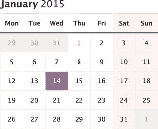

# 九、设计表单和数据表的样式

表单是现代 web 应用程序中极其重要的一部分。它们允许用户与系统交互，使他们能够做任何事情，从留下评论到预订复杂的旅行路线。表单可以像电子邮件地址和消息字段一样简单，也可以非常复杂，跨越多个页面。

除了需要捕获用户数据，web 应用程序越来越需要以一种易于理解的格式显示这些数据。表格可能是显示复杂数据的最佳方式，但需要仔细设计以避免过于庞大。组成表格的元素集合是 HTML 中比较复杂的部分之一，很容易出错。

表单和数据表的设计相对来说被忽略了，而倾向于更高层次的设计。然而，好的信息和交互设计可以成就或毁灭一个现代的网络应用。

在本章中，您将了解

*   创建有吸引力和可访问的数据表

*   让表格为响应式布局服务

*   创建简单和复杂的表单布局

*   设计各种表单元素的样式，包括复选框和选择菜单的定制样式

*   提供可访问的表单反馈

## 样式数据表

表格数据是可以按列和行排列的信息。一个月的日历视图是可以标记为表格的一个很好的例子。

即使是相对简单的数据表，如果包含多行和多列，也很难阅读。如果数据单元格之间没有分隔，信息会模糊在一起，导致布局混乱(见图 9-1 )。


###### 图 9-1。乍一看，紧凑的数据表可能非常令人困惑

相反，有大量空白的表格也很难阅读，因为列和单元格开始失去彼此之间的视觉关联。当你试图跟踪具有很大列间距的表格上的信息行时，这尤其成问题，如图 9-2 所示。如果不小心，在列之间移动时很容易不小心误入错误的行。这在桌子中间最明显，桌子顶部和底部的硬边提供了较少的视觉锚。


###### 图 9-2。间距很大的表格也很难立即理解

幸运的是，通过应用一些基本的设计技术，可以大大提高数据表的可读性。图 9-3 中的日期被赋予了一点行高和默认宽度的喘息空间。表头用不同的文字样式和一个边框清晰区分，涉及当前日期的各种状态和周末是哪几天都有清晰的标注。结果是一个易于使用的日历小部件。



###### 图 9-3。样式数据表

### 特定于表的元素

如果表格对视力正常的用户来说很困难，那么想象一下，对于使用辅助技术(如屏幕阅读器)的人来说，表格是多么复杂和令人沮丧。在最基本的层次上，表格是从 table 元素创建的，由 tr 元素(表格行)和 td 元素(表格单元格)组成。幸运的是，HTML 规范包含了更多的元素和属性，旨在提高数据表的可访问性。

#### 表格标题

表格标题元素充当表格的标题。尽管不是必需的元素，但尽可能使用标题总是一个好主意。在本例中，我们使用标题向用户显示他们正在查看的月份:

```html
<table class="cal">
  <caption><strong>January</strong> 2015</caption>
</table>
```

#### thead、tbody 和 tfoot

使用 thead、tfoot 和 tbody 可以将表分成逻辑部分。例如，您可以将所有的列标题放在 thead 元素中，这为您提供了一种单独设置特定区域样式的方法。如果选择使用 thead 或 tfoot 元素，则必须至少使用一个 tbody 元素。在一个表中只能使用一个 thead 和 tfoot 元素，但是可以使用多个 tbody 元素来帮助将复杂的表分成更易于管理的块。

行和列的标题应该标记为 th 而不是 td。可以给表格标题一个范围属性值 row 或 col，以定义它们是行标题还是列标题。如果 scope 属性与多行或多列相关，也可以为它们赋予 rowgroup 或 colgroup 值。一周中的日期标记列，因此它们应该将 scope 属性设置为 col。

```html
<thead>
  <tr>
    <th scope="col">Mon</th>
    <!-- ...and so on -->
    <th scope="col">Sun</th>
  </tr>
</thead>
```

#### 列和列组

tr 元素提供了对整行进行样式化的目标。但是列呢？我们可以使用:n-child 来选择表格单元格，这可能会变得混乱。col 和 colgroup 元素就是为此而存在的。colgroup 用于定义一个或多个列的组，由 col 元素表示。col 元素本身没有任何内容，而是在实际表格的一个特定列中代表表格单元格。

```html
<colgroup>
   <col class="cal-mon">
   <col class="cal-tue">
   <col class="cal-wed">
   <col class="cal-thu">
   <col class="cal-fri">
   <col class="cal-sat cal-weekend">
   <col class="cal-sun cal-weekend">
</colgroup>
```

colgroup 需要放在 table 元素中，在任何标题之后，任何 thead、tfoot 或 tbody 元素之前。

然后将样式应用于 col(或 colgroup)元素，而不是特定列中的所有表格单元格，例如日历中的所有星期六和星期天。可以为列设置样式的属性非常有限。您可以设置背景属性、边框属性以及宽度和可见性的样式，但仅此而已。

最重要的是，列的可见性只能有 visible 或 collapse 值，即使这样，浏览器也不太支持。值折叠应该不仅仅是隐藏，而且是折叠表格部分的维度，这在某些情况下会很方便，但这只是一些浏览器开发者似乎跳过的事情之一。

#### 完成的表格标记

将所有这些 HTML 元素和属性放在一起，您可以创建如图 9-1 所示的日历表格的基本轮廓。

```html
<table class="cal">
  <caption><strong>January</strong> 2015</caption>
  <colgroup>
    <col class="cal-mon">
    <!-- ...and so on -->
    <col class="cal-sat cal-weekend">
    <col class="cal-sun cal-weekend">
  </colgroup>
  <thead>
    <tr>
      <th scope="col">Mon</th>
      <!-- ...and so on one per day.-->
      <th scope="col">Sun</th>
    </tr>
  </thead>
  <tbody>
    <tr>
      <td class="cal-inactive">29</td>
      <td class="cal-inactive">30</td>
      <td class="cal-inactive">31</td>
      <td><a href="#">1</a></td>
      <td><a href="#">2</a></td>
      <td><a href="#">3</a></td>
      <td><a href="#">4</a></td>
    </tr>
    <!-- ...and so on, one row per week... -->
    <tr>
      <td><a href="#">26</a></td>
      <td class="cal-current"><a href="#">27</a></td>
      <!-- ...and so on -->
      <td><a href="#">31</a></td>
      <td class="cal-inactive">1</td>
    </tr>
  </tbody>
</table>
```

我们已经用一个占位符锚元素包装了所有的日子(假设当您单击一个日期时，日历组件会将您带到某个地方或做一些事情)。我们还添加了几个类名来表示当天。cal-current)和当月之外的天数(。校准-无效)。

### 设置表格元素的样式

CSS 规范有两种表格边框模型:分离的和折叠的。在单独的模型中，边框放置在单个单元格周围，而在折叠模型中，单元格共享边框。我们希望单元格共享单个 1 像素的边框，因此我们将表格的边框折叠属性设置为折叠。

表格也有一个调整单元格大小的算法，我们可以通过 table-layout 属性来控制。默认情况下，使用 auto 值，这基本上是让浏览器根据单元格的内容来决定单元格的宽度。通过将其更改为 fixed，任何单元格宽度都将根据表格第一行或任何 col 或 colgroup 元素中的单元格宽度来确定。这通过 CSS 给了我们更多的控制。

接下来，我们设置字体堆栈，将表格中的所有文本居中。最后，我们将添加一个宽度和一个最大宽度来创建一个流体组件，它尽可能多地占用空间，而不会宽得令人难以接受。

```html
.cal {
  border-collapse: collapse;
  table-layout: fixed;
  width: 100%;
  max-width: 25em;
  font-family: "Lucida Grande", Verdana, Arial, sans-serif;
  text-align: center;
}
```

#### 设置表格内容的样式

基础工作已经做好了，现在是开始添加视觉样式的时候了。为了让表格标题看起来更像普通标题，我们将增加字体大小和行高。我们还会将它向左对齐，并给它一个边框，将它与表头分开。

```html
.cal caption {
  text-align: left;
  border-bottom: 1px solid #ddd;
  line-height: 2;
  font-size: 1.5em;
}
```

接下来，我们将使用 col 元素为周末设置粉色背景。请记住，背景属性是您可以对整列进行更改的少数几项内容之一。我们将使用一种高度透明的颜色，这样它可以和任何背景融为一体，但是在此之前提供一个纯色的后备声明，以适应旧的浏览器。

```html
.cal-weekend {
  background-color: #fef0f0;
  background-color: rgba(255, 0, 0, 0.05);
}
```

接下来，我们将对单个单元格进行样式化。所有单元格都需要多一点行高，我们将为它们提供一个宽度。默认情况下，表格有一个根据单元格内容分配空间的布局算法。由于工作日表标题的大小不同，这导致列略有不同。我们可以指定一个等于表格宽度七分之一的宽度(14.285%)来纠正这个问题。事实上，宽度只需要*至少为*表格宽度的七分之一—如果单元格相加超过 100%(当使用固定表格布局模型时)，它们将各自按比例缩小，直到适合为止。如果我们想让单元格等宽，不管有多少个，我们可以将它们的宽度设置为 100%。虽然这是一个很方便的技巧，但是为了清楚起见，在本例中我们将宽度保留为总宽度的七分之一。你可以在这篇由克里斯·科伊尔撰写的 CSS-Tricks 文章中阅读更多关于表格布局的古怪之处:【https://css-tricks.com/fixing-tables-long-strings/[。](https://css-tricks.com/fixing-tables-long-strings/)

在一些浏览器中，表格单元格也有默认的填充，我们想要移除它。我们还将为表格单元格添加一个模糊的边框，但不是标题单元格。

```html
.cal th,
.cal td {
  line-height: 3;
  padding: 0;
  width: 14.285%;
}
.cal td {
  border: 1px solid #eee;
}
```

为了将表格标题与表格数据(实际日期)分开，我们将添加一个更粗的边框。这应该和在 *thead* 元素上设置边框一样简单。

```html
.cal thead {
  border-bottom: 3px solid #666;
}
```

这在大多数浏览器(Chrome、Firefox、Safari、Opera 等)中都能正常工作。)但遗憾的是在 Internet Explorer 或 Edge 中没有。表格中的边框，不管它们是在表格单元格、一行还是一组行上(例如 thead 或 tbody)，都在我们选择的折叠表格模型中融合在一起。幸运的是，大多数浏览器在设置一整行的边框时都会覆盖垂直边框。IE 和 Edge 会尝试将左右两边的边框和 thead 元素上的边框连接起来，造成难看的缝隙(见图 9-4 )。


###### 图 9-4。IE 和 Edge 都让垂直边框撞上了表头的水平边框，产生了空隙

有*种方法可以解决这个问题。我们可以退出折叠的边框模型，为单个表格单元格的边框添加更多的规则，但是在这种情况下，我们将保持原样。如果你遇到这个问题，并需要它在 IE 中看起来和在其他浏览器中完全一样，你可能不得不求助于单独的边框模型或使用类似背景图像的东西来代替。*

接下来，我们将处理日历小部件中代表可点击日期的锚链接。我们将删除下划线，给他们一个深紫色，并设置他们显示为块。这将导致它们扩展以填充整个表格单元格，从而创建一个更大的可点击区域。最后，我们将为悬停和聚焦状态添加规则，其中我们显示半透明的背景色(使用与前面相同的后退技术到纯色)。

```html
.cal a {
   display: block;
   text-decoration: none;
   color: #2f273c;
}

.cal a:hover,
.cal a:focus {
  background-color: #cde7ca;
  background-color: rgba(167, 240, 210, 0.3);
}
```

最后，我们将为日历日期的其他状态添加样式。我们有不在当前月份的日期，所以我们会给它们一个褪色的颜色，并清楚地表明它们不能通过使用不同的指针来选择。

对于当前日期，我们将把背景颜色改为另一种稍微半透明的色调。各种状态的半透明颜色混合在一起，因此我们将根据我们是否有当前日期、当前日期被悬停、当前日期被悬停在“周末”内等，自动得到不同的结果颜色。，都没有任何额外的规则(见图 9-5 )。


###### 图 9-5。我们为悬停、当前和非活动日期添加了各种微妙的状态

```html
.cal-inactive {
  background-color: #efefef;
  color: #aaa;
  cursor: not-allowed;
}
.cal-current {
  background-color: #7d5977;
  background-color: rgba(71, 14, 62, 0.6);
  color: #fff;
}
.cal-current a {
  color: #fff;
}
```

现在你有了一个漂亮的日历，如图 9-3 所示。

### 响应式表格

桌子本身就需要空间。它们内置了两个轴的概念，并且随着列数的增加需要更多的宽度。结果是，复杂的桌子往往需要相当大的空间，这与能够在所有屏幕上舒适地显示事物的响应目标相冲突，无论屏幕大小。

我们之前提到过，在 CSS 中，表格(以及表格的每个组件)都有自己的显示模式。我们可以利用这一点，让不是表格的东西借用表格的“网格特性”，以达到布局的目的。但是我们也可以使用相反的策略，让表格不显示为表格！我们将采用这种方法使表格数据适合较小的屏幕。

#### 线性化表格

当我们有一个包含大量列的表格时，我们可以翻转它，使每一行都表示为一个由表格标题文本和该行的值组成的块。让我们创建一个示例表来直观显示这一点，其中包含一组汽车模型的数据。最终结果将在大屏幕上看起来如图 9-6 所示。


###### 图 9-6。汽车模型的数据表，带有一些简单的样式

对于较小的屏幕，每行都有自己的块。表格标题行是隐藏的，列标签打印在每条数据之前。它看起来有点像图 9-7。


###### 图 9-7。小屏幕线性化的表格

```html
<table class="cars">
  <caption>Tesla car models</caption>
  <thead>
    <tr>
      <th scope="col">Model</th>
      <th scope="col">Top speed</th>
      <th scope="col">Range</th>
      <th scope="col">Length</th>
      <th scope="col">Width</th>
      <th scope="col">Weight</th>
      <th scope="col">Starting price</th>
    </tr>
  </thead>
  <tbody>
    <tr>
      <td>Model S</td>
      <td>201 km/h</td>
      <td>426 km</td>
      <td>4 976 mm</td>
      <td>1 963 mm</td>
      <td>2 108 kg</td>
      <td>$69 900</td>
    </tr>
    <tr>
      <td>Roadster</td>
      <td>201 km/h</td>
      <td>393 km</td>
      <td>3 946 mm</td>
      <td>1 873 mm</td>
      <td>1 235 kg</td>
      <td>$109000</td>
    </tr>
  </tbody>
</table>
```

该表格的样式由一些简单的边框、字体规则和一种“斑马条纹”技术组成，其中表格的每一偶数行都有不同的背景颜色:

```html
.cars {
  font-family: "Lucida Sans", Verdana, Arial, sans-serif;
  width: 100%;
  border-collapse: collapse;
}

.cars caption {
  text-align: left;
  font-style: italic;
  border-bottom: 1px solid #ccc;
}

.cars tr:nth-child(even) {
  background-color: #eee;
}
.cars caption,
.cars th,
.cars td {
  text-align: left;
  padding: 0 .5em;
  line-height: 2;
}
.cars thead {
  border-bottom: 2px solid;
}
```

如果我们调整屏幕大小，我们发现在大约 760 像素宽时，这个表格开始变得非常拥挤，难以阅读(见图 9-8 )。这就是我们需要放置断点并开始改变的地方。


###### 图 9-8。我们的桌子在大约 760 像素宽时开始变得拥挤

表格有很多默认样式和显示模式。如果我们走“移动优先”的路线，改变默认样式，然后使用最小宽度条件为更大的屏幕重置默认值，我们可能要做很多工作。这就是为什么我们将使用最大宽度条件，以在较小的屏幕上特别针对这种特殊情况:

```html
@media only screen and (max-width: 760px) {
  .cars {
    display: block;
  }
  .cars thead {
    display: none;
  }
  .cars tr {
    border-bottom: 1px solid;
  }
  .cars td, .cars th {
    display: block;
    float: left;
    width: 100%;
    box-sizing: border-box;
  }
  .cars th {
    font-weight: 600;
    border-bottom: 2px solid;
    padding-top: 10px;
  }
  .cars td:before {
    width: 40%;
    display: inline-block;
    font-style: italic;
    content: attr(data-label);
  }
}
```

表格单元格现在设置为以块的形式显示，并占据 100%的宽度，在行内将它们堆叠在一起。表格标题完全隐藏。为了保持列标签和 td 元素中的单个值之间的关联，我们在标记中的每个表格单元格上插入了每个列的标签作为数据标签属性:

```html
<th scope="row">Model S</th>
<td data-label="Top speed">201 km/h</td>
<td data-label="Range">426 km</td>
<td data-label="Length">4 976 mm</td>
<!-- ...and so on -->
```

我们现在可以使用:before 伪元素在每一行单元格内容之前插入这些标签。我们可以通过使用 attr()函数符号和 content 属性来获取元素属性的内容——这是一个揭示隐藏在 HTML 中的额外数据的简便技巧。为了避免在 CSS 中硬编码标签的值，标签在标记中的重复是一个很小但必要的代价。

除了一些进一步的样式更改以保持表格的可读性之外，上一个示例中还有一些其他重要的代码部分。

首先，我们将表格本身设置为显示:block。这对于演示来说不是必需的，但是有助于提高可访问性。切换表格的显示模式不应该改变屏幕阅读器对它的解释，但它确实改变了。这意味着，当标记中有一个表格，但表格单元格设置为显示为其中的常规块(通过 CSS)时，一些屏幕阅读器会感到困惑。将表格本身设置为显示为一个块似乎会触发这些屏幕阅读器将表格作为文本流来读取，这保持了内容的可访问性，尽管失去了表格的性质。accessibleculture.org 的 Jason Kiss 在 http://accessible culture . org/articles/2011/08/responsive-data-tables-and-screen-reader-accessibility/上发表了一篇很有帮助的文章，解释了各种屏幕阅读器之间的差异。

为了使这个解决方案有效，我们做的第二件事是向表格单元格添加一个 float 声明。这只是为了应对 IE9 中的一个错误，IE9 支持媒体查询，但似乎不接受将表格单元格的显示模式更改为@media 规则内部的块。但是，它确实应用了浮动，这实际上是把单元格变成了块，这是一个副作用。将单元格的宽度设置为 100%可以抵消浮动的收缩包装效果，并保证它们像块一样垂直排列。

#### 高级响应表

为小视口线性化表格只是创建响应表格的解决方案之一。有几种方法可以解决同一个问题，老实说，这仍然是一个相当新的问题，因为这本书正在编写。没有“一刀切”的解决方案，但有一些策略可供选择。大多数依赖 JavaScript 在需要时结合 CSS 来操作标记。各种策略都是一些基本机制的变体:

*   当屏幕太小时，为表格的列引入某种滚动机制。例如，第一列可以固定在适当的位置，并作为一个锚点，帮助您知道您正在查看哪一行，其余的列可以滚动。

*   当屏幕变小时隐藏列，以便只显示最重要的内容。

*   在一个单独的窗口中链接到一个更大版本的表格，用户必须依赖缩放。

*   使得用切换机制显示和隐藏列成为可能。

如果您需要支持复杂的响应式表格场景，您可能会发现 tool Tablesaw 非常适合([`www.filamentgroup.com/lab/tablesaw.html`](http://www.filamentgroup.com/lab/tablesaw.html))，如果没有什么可以作为设计模式的灵感的话。它是 jQuery 插件的集合，可以帮助您实现前面列表中提到的一些策略。

## 样式表单

表单是 web 页面的访问者实际上做其他事情而不是消费内容的地方。它可以是填写一个联系表格，写一篇要发表的文章，输入付款信息，或者最后点击“立即购买”按钮。很明显，这些都是非常有价值的活动，但是尽管非常重要，表单的设计和编码通常很糟糕。

也许其中一个原因是表单编码总是有点麻烦。它们有很多活动部件，传统上很难设计。这是因为许多表单控件被实现为用*替换内容*，这意味着像 select 元素中下拉菜单中的箭头这样的控件实际上并不由任何 HTML 元素表示。它更像是一个黑盒，每当你在标记中声明一个<选择>标签时，浏览器就扔在那里。这主要是为了确保与用户当前操作系统的默认 UI 控件保持一致。

但是，我们至少可以设计表单控件外观的某些部分。对于我们不能设计样式的部分，我们可以用一些创造性的编码来伪装自定义控件的外观。

表单也不仅仅是表单控件本身，所以这一节将介绍如何标记和样式化组件，使之成为一个有吸引力的 HTML 表单。应该注意的是，它绝不是 HTML 表单各个方面的全面指南——元素和属性太多了，我们无法在这里一一介绍。

### 一个简单的表单示例

当表单标签垂直显示在相关表单元素上方时，简短且相对简单的表单最容易填写。用户只需一步一步地向下移动表单，阅读每个标签并完成下面的表单元素。这种方法适用于收集相对简单且可预测的信息(如联系信息)的短表单(见图 9-9 )，但对于在较小的视窗(如移动浏览器)上查看表单，这也是一个非常好的基准。


###### 图 9-9。简单表单布局

#### 字段集和图例

HTML 提供了许多有用的元素，可以帮助表单增加结构和意义。第一个是 fieldset 元素。字段集用于对相关的信息块进行分组。在图 9-9 中，使用了三个字段集:一个用于联系详情，一个用于评论，一个用于“记住我”偏好设置。

要确定每个字段集的用途，可以使用 legend 元素。图例的作用有点像字段集的标题，通常垂直居中显示在字段集的顶部边框上，并稍微向右缩进。默认情况下，字段集通常呈现为双边框。不同的浏览器以不同的方式实现了这种略有不同的外观。这似乎是浏览器渲染引擎中的一个特例，用普通的 CSS 属性来撤销奇怪的定位很少会有你期望的效果。当我们设计表单的时候，我们将回头来讨论这个问题。

#### 标签

label 元素是一个非常重要的元素，因为它可以帮助添加结构，提高表单的可用性和可访问性。顾名思义，这个元素用于为每个表单元素添加一个有意义的描述性标签。在许多浏览器中，单击 label 元素会使关联的 form 元素获得焦点。

使用标签的真正好处是为使用辅助设备的人增加表单的可用性。如果表单使用标签，屏幕阅读器会正确地将表单元素与其标签相关联。屏幕阅读器用户还可以调出表单中所有标签的列表，允许他们以听觉方式浏览表单，就像视力正常的用户以视觉方式浏览表单一样。

可以通过以下两种方式之一将 label 元素与 form 控件关联起来:通过在 label 元素中嵌套 form 控件来隐式关联:

```html
<label>Email <input name="comment-email" type="email"/><label>
```

或者通过将标签的 for 属性设置为与相关表单元素的 id 属性值相等来显式设置:

```html
<label **for="comment-email"**>Email<label>
<input name="comment-email" **id="comment-email"** type="email"/>
```

你会注意到这个输入和本章中的大多数表单控件都包含了一个 name 属性和一个 id 属性，因为我们通常不会将输入嵌套在标签中。id 属性是创建表单输入和标签之间的关联所必需的，而 name 属性是必需的，这样表单数据就可以发送回服务器。id 和名称不必相同，但是为了保持一致性，尽可能保持它们相同是一个方便的约定。

与使用 for 属性的表单控件相关联的标签不需要靠近源代码中的那些控件；它们可能在文档中完全不同的部分。从结构的角度来看，将表单控件与其标签分开是不明智的，应该尽可能避免。

#### 输入字段和文本区域

在这个简单的例子中，我们有两种类型的表单控件元素:input 和 textarea。文本区域用于键入多行文本，就像在注释字段中一样。cols 和 rows 属性可用于设置文本区域的默认大小，主要用于指示预期内容的大致长度。稍后我们将自由地用 CSS 进一步样式化文本区域。

```html
<textarea name="comment-text" id="comment-text" cols="20" rows="10"></textarea>
```

input 元素是一个更加通用的表单控件。默认情况下，它呈现为单行文本输入，但是 type 属性可以将其更改为各种不同的窗体控件。设置 type="password "会创建一个值模糊的输入，而 type="checkbox "会创建一个复选框。type 属性有许多不同的值，其中许多是在 HTML5 中添加的。有些主要是文本输入的变体，但在幕后有特殊的行为—例如，电子邮件、url 和搜索。一些类型创建了非常不同的界面控件，如复选框、单选、颜色、范围和文件。除了类型之外，还有一大堆用于输入的属性来声明预期的格式。

不同类型的表单输入及其属性对于表单的自动验证非常有用。我们将在这一章的后面简要介绍一下，但是现在，我们将讨论另一个大的好处。在带有屏幕键盘的设备上，更改类型会触发软件键盘更改其布局。如果我们添加正确类型的电子邮件字段和 URL 字段，智能手机和平板电脑上的键盘将自动调整，以便在我们聚焦每个字段时更容易键入正确的值(见图 9-10 )。


###### 图 9-10。当输入具有 type="email "属性时，软件键盘会显示更适合键入电子邮件地址的布局

因为 type 属性的缺省值是 text，所以不支持 HTML5 的旧浏览器将忽略这些新类型，并退回到普通输入。这使得选择新的输入类型对我们来说是一个非常有用的改进。

#### 将字段集放在一起

使用到目前为止我们已经看到的结构元素，我们可以通过标记第一个字段集的内容来开始布局表单。未样式化的字段集如图 9-11 所示。


###### 图 9-11。无样式字段集

在表单内部，我们用一个 div 包装了 fieldset 元素，原因稍后将会清楚。标签和输入的每个组合也用 p 元素包装。过去，输入元素不允许作为表单元素的直接子元素。HTML5 中不再是这种情况，但是标准仍然建议您用像 p 这样的块元素包装标签和表单控件，因为它们在语义上表示表单中不同的内容“短语”。

我们还为每个段落添加了一个 field 的类名，以便在以后想要将它们与表单中的其他类型的段落分开时有一个特定的样式挂钩。此外，我们通过给包含文本输入组件的字段起一个类名称 field-text 来分离它们。

```html
<form id="comments_form" action="/comments/" method="post">
  <div class="fieldset-wrapper">
    <fieldset>
      <legend>Your Contact Details</legend>
      <p class="field field-text">
        <label for="comment-author">Name:</label>
        <input name="comment-author" id="comment-author" type="text" />
      </p>
      <p class="field field-text">
        <label for="comment-email">Email Address:</label>
        <input name="comment-email" id="comment-email" type="email" />
      </p>
      <p class="field field-text">
        <label for="comment-url">Web Address:</label>
        <input name="comment-url" id="comment-url" type="url" />
      </p>
    </fieldset>
  </div>
</form>
```

如果您希望更改字段集和图例元素的默认外观，最好的办法是不要设计实际字段集元素本身的样式，而是尽可能多地删除默认样式，然后在字段集周围添加一个包装元素。您的样式将被添加到包装元素中。

要取消字段集的样式，我们将为其指定以下规则:

```html
fieldset {
  border: 0;
  padding: 0.01px 0 0 0;
  margin: 0;
  min-width: 0;
  display: table-cell;
}
```

我们删除了默认的边界和空白。我们还将填充设置为 0——顶部填充除外，它被设置为一个很小的值(0.01 像素)。这是为了应对一些基于 WebKit 的浏览器中的怪异行为，在这些浏览器中，图例之后元素上的任何边距都被转移到 fieldset 元素的顶部。给字段集一点点填充顶部可以阻止这个错误。

下一个奇怪之处是:一些浏览器(基于 WebKit 和 Blink 的)对字段集元素有一个默认的最小宽度，我们会覆盖它——如果没有，字段集有时会以最小的尺寸突出视口，产生水平滚动条。Firefox 也有字段集元素的最小宽度，但这是硬编码的，覆盖最小宽度没有帮助。解决方法是将显示模式改为表格单元。这与 IE 混淆了，所以我们需要使用特定于 Mozilla 的非标准规则块，只针对基于 Mozilla 的浏览器:

```html
@-moz-document url-prefix() {
  fieldset {
    display: table-cell;
  }
}
```

@-moz-document 规则允许基于 Mozilla 浏览器的用户在其用户样式表中覆盖特定站点的样式，但它也适用于作者样式。通常，您会在 url-prefix()函数中放入一个特定的 url，但是让它为空意味着不管 URL 是什么，它都会工作。不可否认，这是一个丑陋的黑客，但它代表了移除我们的字段集的默认样式的最后一块拼图。现在我们可以专注于包装器的样式。

我们将给包装一个背景，一些空白和填充，和一个微妙的阴影。不支持 box-shadow 属性的旧浏览器会得到一个边框，然后使用:root 伪类作为选择器的前缀来删除它。这只是指 HTML 元素(作为文档的根元素)，但 IE8 和其他旧浏览器不理解这个选择器，所以它们将获得边框。

```html
.fieldset-wrapper {
  padding: 1em;
  margin-bottom: 1em;
  border: 1px solid #eee;
  background-color: #fff;
  box-shadow: 0 0 4px rgba(0, 0, 0, 0.25);
}
:root .fieldset-wrapper {
  border: 0;
}
```

至于图例，我们将删除默认填充，并在底部添加一些额外的内容，以增加它和表单字段之间的空间。遗憾的是，边距对图例元素的影响不一致，因此我们将避免这些影响。最后，我们将把它的显示模式改为表格。这种方法允许它在必要时在 IE 中包装成多行，否则这是不可能的。

```html
legend {
  padding: 0 0 .5em 0;
  font-weight: bold;
  color: #777;
  display: table;
}
```

此时，字段集本身看起来不错，如图 9-12 所示，我们可以将注意力转向字段。


###### 图 9-12。字段集现在失去了图例的双边框和奇怪的定位，并获得了背景和阴影

#### 设置文本输入字段的样式

接下来，我们将添加一个规则，使表单控件从文档的其余部分继承字体属性。这将覆盖浏览器的默认设置:例如，输入字段中的字体大小被设置为小于文档中正常文本的大小。

```html
input,
textarea {
  font: inherit;
}
```

定位标签使其垂直出现在表单元素的上方非常简单。默认情况下，标签是内联元素。将它的 display 属性设置为 block 将导致它生成自己的块框，将输入元素强制放到下面的行上。

文本输入框的默认宽度因浏览器而异，但是我们可以用 CSS 来控制它。为了创建一个灵活的输入字段，我们将在默认情况下以百分比来设置宽度，但是在 ems 中设置字段包装器的最大宽度，这样它就不会变得太宽。这将适用于大多数屏幕尺寸。在计算 100%的含义时，我们还需要更改 box-sizing 属性以考虑边框和填充。

```html
.field-text {
  max-width: 20em;
}
.field-text label {
  cursor: pointer;
}
.field-text label,
.field-text input {
  width: 100%;
  box-sizing: border-box;
}
```

标签的 cursor 属性设置为 pointer，使基于鼠标的用户更清楚这是一个可点击的元素。标签也包含在上面设置宽度的规则中，因此它们与输入具有相同的宽度。

最后，我们将稍微调整文本输入的样式。我们将为它们设置微妙的圆角，设置边框颜色，并添加一些填充:

```html
.field-text input {
  padding: .375em .3125em .3125em;
  border: 1px solid #ccc;
  border-radius: .25em;
  -webkit-appearance: none;
}
```

设置 border 属性通常会删除呈现文本输入时可能显示的任何特定于操作系统的边框外观和嵌入阴影。一些基于 WebKit 的浏览器(如 iOS 上的 Safari)仍然显示嵌入阴影，因此为了消除这种情况，我们将 proprietary -webkit-appearance 属性设置为 none。

###### 注意

没有标准化的外观属性，但是-webkit-appearance(基于 webkit 和 Blink 的浏览器)和-moz-appearance (Firefox)都允许您覆盖特定于操作系统的控件的一些呈现细节。通常，你最好避开这些，但是它们对于*移除*特定于浏览器的输入元素样式很有用。

#### 处理焦点状态

更改输入元素的边框后，我们还需要注意元素的焦点状态。当输入元素被聚焦时，大多数浏览器会在输入元素周围显示某种形式的轮廓或光晕。此标记帮助用户区分哪个字段是焦点，并且可以通过重写 outline 属性或 border 属性来移除，具体取决于浏览器。一旦我们影响了这些属性中的*或*，我们需要确保我们没有无意中让键盘用户无法访问表单。

这意味着为了跨浏览器的兼容性，我们必须自己关注焦点状态。我们将添加一个不同的边框颜色:焦点，以及一个微妙的蓝色发光使用框阴影(见图 9-13 )。这样，我们还可以在聚焦时将 outline 属性设置为 0，以避免在某些浏览器中出现聚焦状态的双重标记。


###### 图 9-13。一个聚焦的文本输入使用框阴影得到不同的边框颜色和一点光晕

```html
.field-text input:focus {
  box-shadow: 0 0 .5em rgba(93, 162, 248, 0.5);
  border-color: #5da2f8;
  outline: 0;
}
```

在我们到目前为止创建的规则中，我们已经明确地将我们在这个表单中使用的基于文本的输入类型作为目标。字段文本选择器。这是为了避免为其他类型的输入部件(如复选框)设置不必要的规则。我们本来可以用一个属性选择器列表来代替，但是因为 type 属性有许多可能的值，所以父元素上的一个实用程序类名称会使代码更加简洁。

#### 添加剩余的字段集

到目前为止，我们创建的规则同样适用于其他表单元素，如 textareas:

```html
<div class="fieldset-wrapper">
  <fieldset>
    <legend>Comments</legend>
    <p class="field field-text">
      <label for="comment-text">Message:</label>
      <textarea name="comment-text" id="comment-text" cols="20" rows="10"></textarea>
    </p>
  </fieldset>
</div>
```

要调整 textarea 元素的外观，我们可以简单地将它添加到任何规则的选择器列表中，在这里我们为文本输入和标签设置属性，并获得相同的行为:

```html
.field-text label,
.field-text input,
**.field-text textarea {** 
**/*...*/** 
**}** 
```

Textareas 将获得基于 rows 属性的默认高度，但是我们当然可以用 height 来覆盖它。当用户输入比可见空间更长的文本时，文本区将溢出并接收滚动条。

许多浏览器还会让用户调整文本区域的大小，这样他们就可以看到输入的整个文本。有些浏览器允许文本区域调整宽度和高度，有些只允许调整高度。我们实际上可以在 CSS 中使用 resize 属性来明确这一点。它可以设定为任何关键字“垂直”、“水平”、“无”或两者兼有，但此处显示为设定为“垂直”:

```html
textarea {
  height: 10em;
  resize: vertical;
}
```

#### 添加单选按钮

对于表单的最后一部分，我们添加了一个单选按钮控件，使用户只能从两个选项中选择一个。这些由类型设置为 radio 的输入元素表示。这些元素的标签通常在右边，而不是在上面(见图 9-14 )。


###### 图 9-14。我们的单选按钮，标签文本在右边而不是上面

只能选择其中一个输入的效果是通过使这两个输入的 name 属性相等来实现的(尽管 id 属性仍然可以不同):

```html
<div class="fieldset-wrapper">
  <fieldset>
    <legend>Remember Me</legend>
    <p class="field">
      <label><input **name="comment-remember"** type="radio" value="yes" />Yes</label>
    </p>
    <p class="field">
      <label><input **name="comment-remember"** type="radio" value="no" checked="checked" />No</label>
    </p>
  </fieldset>
</div>
```

注意，在这种情况下，我们选择将输入嵌套在标签中，而不是将其与输入元素上的 for 属性和 id 相关联。这意味着标签上的 display: block 声明不会将它放在与单选按钮不同的行上。

我们要做的最后一件事是给单选按钮添加一点右边距，以在标签之间提供一些间距:

```html
input[type="radio"] {
  margin-right: .75em;
}
```

#### 小跟班

在我们的表格完成之前，我们还有一件事要添加。用户需要一个按钮来提交表单，这样服务器就可以处理它。

用 HTML 创建按钮有两种方法。首先，输入元素的类型设置为 button、reset 或 submit:

```html
<input type="submit" value="Post comment" />
```

然后是按钮元素，它可以具有相同的类型属性值:

```html
<button type="submit">Post comment</button>
```

当在表单外使用时，按钮类型可用于 JavaScript 启动的操作，而不是实际将表单提交给服务器。重置类型(目前不常用)将表单重置为初始值。最后，如果按钮在表单元素中，submit 值将表单数据发送到表单的 action 属性中指定的 URL。当缺少 type 属性时，它是默认值。

按钮的这两个元素工作方式相同，最初看起来也一样。我们建议您为按钮使用 button 元素，因为您可以在其中放置其他元素(如 spans 或 images)来帮助设计样式。

按钮在每个平台上都有特定的默认外观(见图 9-15 )，复选框、单选按钮和其他表单控件也是如此。因为按钮是用户界面中无处不在的一部分，所以你很有可能想要根据你正在构建的站点的特定外观来设计它们。幸运的是，它们是用 CSS 样式化的更容易的表单组件之一。


###### 图 9-15。来自 OS X 的 Chrome、Windows 7 的 IE10、Windows 7 的 Firefox 和 Windows 10 的 Microsoft Edge 的无样式按钮元素

我们将使用渐变和方框阴影为我们的按钮添加一个非常微妙的 3D 外观的边缘(见图 9-16 )。与 input 元素一样，修改 border 属性会关闭特定于操作系统的样式。


###### 图 9-16。我们的样式按钮

```html
button {
  cursor: pointer;
  border: 0;
  padding: .5em 1em;
  color: #fff;
  border-radius: .25em;
  font-size: 1em;
  background-color: #173b6d;
  background-image: linear-gradient(to bottom, #1a4a8e, #173b6d);
  box-shadow: 0 .25em 0 rgba(23, 59, 109, 0.3), inset 0 1px 0 rgba(0, 0, 0, 0.3);
}
```

按钮上的伪 3D 边缘是用框阴影而不是边框属性创建的。这允许我们保持按钮的尺寸不变，因为阴影不会影响盒子模型。阴影也会自动跟随按钮的圆角。注意，我们使用了两个阴影。一个是创建边缘的外部阴影，一个是插入，在按钮顶部添加一个微妙的 1 像素的颜色偏移。

我们还为按钮的焦点状态添加了一条规则(见图 9-17 )，这里的背景变浅了一点，并添加了第三个阴影，产生了与文本输入相同的轻微“发光轮廓”效果。(在第十章的中，当我们探索变换和转换的时候，我们将会重温按钮被按下的状态。)


###### 图 9-17。按钮的正常状态(左)和聚焦状态(右)

```html
button:focus {
  background-color: #2158a9;
  background-image: linear-gradient(to bottom, #2063c0, #1d4d90);
  box-shadow: 0 .25em 0 rgba(23, 59, 109, 0.3),
              inset 0 1px 0 rgba(0, 0, 0, 0.3);
}
```

不支持圆角、渐变和方框阴影的浏览器在这两种状态下都会有一个看起来很平的按钮，但是仍然可以很好地使用。

### 清除表单反馈和帮助文本

糟糕的反馈和错误信息一直被认为是网络上最糟糕和最常见的设计问题。当设计表单时，确保你不只是让表单控件看起来漂亮，还要注意帮助和错误信息的样式。

您可以使用占位符属性将预期输入的示例放入输入字段(参见图 9-18 )。浏览器将显示该文本，直到您聚焦该字段或开始书写。


###### 图 9-18。使用占位符属性的输入示例

```html
<input **placeholder="http://example.com"** name="comment-url" id="comment-url" type="url" />
```

我们可以对占位符属性进行一些有限的样式设置，例如，将其设置为斜体。占位符没有标准的选择器，但是不同的浏览器提供了不同的前缀伪元素，您可以对它们进行样式化。因为每一个都只能被各自的浏览器引擎识别，所以它们不能合并成一个规则。当浏览器看到一个无法识别的选择器时，它会将规则作为一个整体丢弃，所以我们需要重复一下:

```html
::-webkit-input-placeholder {
  font-style: italic;
}
:-ms-input-placeholder {  
  font-style: italic;
}
::-moz-placeholder {
  font-style: italic;  
}
```

占位符是用来举例输入的，所以不能用作标签。毕竟，占位符会随着用户与表单的交互而消失，所以如果用户失去焦点(没有双关语！)在一段时间内，他们需要能够让任何指令仍然存在。

如果标签不够，可以在表单控件旁边添加帮助文本。因为我们想节省空间并使表单更整洁，所以我们将使用同级选择器仅在输入字段被聚焦时显示额外的帮助(见图 9-19 )。


###### 图 9-19。当字段被聚焦时显示额外的帮助文本

我们希望在视觉上隐藏文本，但不一定是为了屏幕阅读器，即使字段没有被聚焦。使用 clip 属性、绝对定位和 overflow: hidden 的组合可以达到这个目的。

这种特定的属性组合是为了避免旧浏览器中的各种错误。在 Jonathan Snook 的博客([`Snook . ca/archives/html _ and _ CSS/hiding-content-for-accessibility`](http://snook.ca/archives/html_and_css/hiding-content-for-accessibility))中可以找到关于这种技术的更深入的讨论。然后，当帮助文本位于焦点输入旁边时，使用同级选择器覆盖这些属性:

```html
.form-help {
  display: block;
  /* hide the help by default,
     without hiding it from screen readers */
**position: absolute;** 
**overflow: hidden;** 
**width: 1px;** 
**height: 1px;** 
**clip: rect(0 0 0 0);** 
}

input:focus + .form-help {
  padding: .5em;
  margin-top: .5em;
  border: 1px solid #2a80fa;
  border-radius: .25em;
  font-style: italic;
  color: #737373;
  background-color: #fff;
  /* override the "hiding" properties: */
**position: static;** 
**width: auto;** 
**height: auto;** 
**crop: none;** 
}
```

###### 易接近的隐藏技术

帮助文本示例中的技术使用 CSS 来隐藏可视内容，同时保持屏幕阅读器可以访问它。使用其他技术，如 display: none 或 visibility: hidden，可以让屏幕阅读器完全跳过文本。

在设计表单时，视觉设计中省略一个标签或者多个字段使用一个标签是很常见的模式。例如，您可能将日期部分分成三个字段，分别表示年、月和日，但只有一个标签显示“出生日期”

在这种情况下，使用可访问的隐藏技术允许您为任何字段添加标签，而无需在页面上实际显示它。当然，这种技术可以用于任何有助于页面语义结构的元素，但对于视觉用户来说可能是不必要的。

这是“助手类”的理想选择，只要出现这种情况，就可以应用到标记中。HTML5 样板项目([`html5boilerplate.com/`](http://html5boilerplate.com/))对类名使用了这种技术。例如，视觉隐藏。

我们的帮助文本的标记非常简单，但是增加了一些语义丰富性，以确保帮助是可访问的:

```html
<input placeholder="http://example.com" name="comment-url" **aria-described-by="comment-url-help"** id="comment-url" type="url"  />
<span **id="comment-url-help" role="tooltip"** class="form-help">Fill in your URL if you have one. Make sure to include the "http://"-part.</span>
```

input 元素上的 aria-describedby 属性应该指向帮助文本的 id。这使得屏幕阅读器将帮助文本与字段相关联，并且当字段被聚焦时，他们中的许多人除了阅读标签之外还会阅读帮助文本。设置为 tooltip 的角色属性进一步向屏幕阅读器阐明了这是在用户与表单域交互时显示的文本。

如果您在服务器上或者在浏览器中使用 JavaScript 进行表单验证，HTML 中的任何错误消息都可以用类似的方式标记，使用 aria-describedby 将消息与表单控件相关联。

支持 HTML5 的现代浏览器也有内置的表单验证，以及一系列帮助客户端验证的 CSS 伪类。

#### HTML5 表单验证和 CSS

一旦您使用 HTML5 表单的新属性，浏览器将尝试帮助您验证表单字段的值。例如，当您使用类型设置为电子邮件的输入，并填写无效的内容并尝试提交表单时，浏览器将显示一条错误消息(参见图 9-20 )。


###### 图 9-20。Mozilla Firefox 中的验证消息

支持 HTML5 验证的浏览器也为我们提供了许多对应于表单字段中各种状态的伪类。例如，我们可以使用下面的代码用红色边框和红光突出显示无效的文本输入字段:

```html
.field-text :invalid {
  border-color: #e72633;
  box-shadow: 0 0 .5em rgba(229, 43, 37, 0.5);
}
```

我们已经在第二章中看到了:required，:optional，:valid 和:invalid 伪类。它们还有几个，对应于数字输入、滑块等的各种状态。基于这些伪类设计输入字段的样式没有问题，但是实际的错误消息呢？

可悲的是，这些是 CSS 无法触及的界面元素的另一个例子。基于 WebKit 的浏览器提供了一些有限的可能性来使用特定于浏览器的伪元素来样式化错误消息，例如::-webkit-validation-bubble，但是除此之外，还没有其他方法来样式化它们的外观。

如果您需要对这些错误消息进行更多的控制，有许多 JavaScript 插件可以与浏览器触发的表单事件挂钩。它们覆盖内置的验证，通常为您提供为错误消息生成元素(和设置文本)的方法，并为旧浏览器提供验证支持。例如，参见 Webshim 项目的表单插件([`afarkas.github.io/webshim/demos/`](http://afarkas.github.io/webshim/demos/))。

### 高级表单样式

到目前为止，我们将表单样式保持在非常合理的最低限度。理由很充分:表单很少是实验的地方。想要注册个人资料或为产品付费的人可能会喜欢清晰，而不是为了清晰而与众不同。这并不意味着更有创造性的 CSS 技术在表单设计中没有一席之地。在这一节中，我们将展示一些技巧来解决细节问题。

#### 用于表单布局的现代 CSS

默认情况下，大多数表单元素显示为内嵌块，因此沿文本方向排列。我们在前面的示例中使用了块显示模式，使标签和输入字段在页面上堆叠显示。

当我们想要更高级的表单布局时，一些新的布局机制真的大放异彩。Flexbox 是专门针对按钮的行或列或其他界面元素而创建的，它们之间的空间需要以一种巧妙的方式进行划分。这是表单的常见情况，所以让我们看一个使用 flexbox 的例子。

基于我们在前一个简单示例中看到的样式，让我们创建一个稍微复杂一点的表单，在这里我们收集一些关于求职者的信息。我们的目标是收集申请人的姓名、电子邮件地址和 Twitter 账号，以及申请人已经掌握的编码语言列表(见图 9-21 )。


###### 图 9-21。我们的申请表

对于较大的视口，表单的顶部从堆叠版本(标签堆叠在字段上)切换到标签与字段显示在同一行的版本。Twitter handle 字段前面还有一些指导文本，表明只需要填写“@”后面的部分。让我们从内联字段开始。

我们将使用 flexbox 来控制字段布局。为了检测它，我们将使用在第六章中看到的 Modernizr 库。简单回顾一下，Modernizr 可以通过 JavaScript 检测 CSS 特性，并将每个受支持特性的类名添加到页面的 html 元素中。您可以创建一个自定义脚本，只包含您在 https://modernizr.com 的[需要的检测。在这种情况下，flexbox 检测将 flexbox 类添加到 html 元素中。](https://modernizr.com)

我们现在可以开始使用。flexbox 类作为选择器前缀，并且确信只有支持它的浏览器才能看到它。

首先，我们只想在视窗大到足以处理它时服务于内联布局。大约 560 像素看起来差不多，也就是 35em:

```html
@media only screen and (min-width: 35em) {
  /* the rest of the code snippets go here */
}
```

接下来，我们的文本输入字段需要在较大的视口中变成一个 flex 容器，其中的项目水平排列(这是默认设置)。它们还需要具有更大的最大宽度。

```html
.flexbox .field-text {
  display: flex;
  max-width: 28em;
}
```

我们希望标签都具有相同的宽度(大约 8em 似乎就可以了)，既不收缩也不增长，也就是说，flex-grow 和 flex-shrink 设置为 0，flex-basis 为 8em:

```html
.flexbox .field-text label {
  flex: 0 0 8em;
}
```

至于标签文本，我们希望它垂直居中。我们可以用行高来做这件事，但是我们会把它和输入元素的高度联系起来。Flexbox 实际上也可以帮助我们做到这一点，不需要具体的测量。

为了达到这种效果，我们需要将标签本身声明为内容居中的 flex 容器。因为 label 元素没有可以居中的子元素，所以我们依赖于这样一个事实，即 flex 容器中的任何文本内容都成为一个匿名的 flex 项。然后，我们可以告诉容器将其所有项目垂直居中。

```html
.flexbox .field-text label {
  flex: 0 0 8em;
**display: flex;** 
**align-items: center;** 
}
```

这为我们提供了更大视窗的最终视场布局，如图 9-22 所示。


###### 图 9-22。用于较大视口的内嵌标签/字段放置

至于输入元素的宽度，flexbox 会自动算出来。它们已经设置为宽度:之前的 100%,由于默认的伸缩值为 0 1 auto，因此将会缩小以便为固定宽度的标签腾出空间。读出该值意味着“根据 width 属性(auto)确定宽度，不要超过该值，但可以随意缩小以腾出空间。”

#### 带 Flexbox 前缀的输入字段

当谈到前置文本时，这是 flexbox 真正擅长的情况。我们有一些限制，使用任何其他布局技术都很难灵活解决:

*   输入和前置文本组件需要具有相同的高度。

*   前置元素的宽度需要保持灵活，这取决于里面的文本。

*   然后需要调整输入的宽度，以便前置文本和输入字段的组合与其他文本字段的宽度相同。

为了定位这些组件，我们将把整个东西包装在一个 span 中，并应用一些通用的类名。我们还将添加相关属性，以使前置文本的目的易于理解。以下是该字段的完整标记:

```html
<p class="field field-text">
  <label for="applicant-twitter">Twitter handle:</label>
**<span class="field-prefixed">** 
**<span class="field-prefix" id="applicant-twitter-prefix" aria-label="You can omit the @">@</span>** 
**<input aria-describedby="applicant-twitter-prefix" name="applicant-twitter" id="applicant-twitter" type="text" />** 
**</span>** 
</p>
```

aria-label 属性在这里为 prefix 元素提供了一个屏幕阅读器可访问的名称，解释了带前缀的文本的用途。

对于样式，我们将首先为不支持 flexbox 的浏览器创建一个后备样式。我们将保持简单，只提供一个包含前置文本的内嵌块框，并使它旁边的输入足够短，不会在小屏幕上出现在不同的行上(见图 9-23 )。


###### 图 9-23。我们的基线只是一个样式化的内联块框中的前置文本

```html
.field-prefix {
  display: inline-block;
  /* border and color etc omitted for brevity. */
  border-radius: .25em;
}
.field-prefixed input {
  max-width: 12em;
}
```

我们还必须补充设置输入宽度的规则，方法是将我们预先添加的字段类名添加到选择器中:

```html
.field-text label,
.field-text input,
**.field-prefixed,** 
.field-text textarea {
  /* ... */
}
```

最后，我们将应用 flexbox 的魔力，使用。flexbox 类名来限定我们的规则。我们会赶上的。字段前缀包装到 flex 容器中，并将前缀元素的内容垂直居中。就像前面内联字段示例中的标签一样，我们创建一个嵌套的 flex 容器，并在里面垂直对齐匿名项。我们还调整了边框，使其只在物品的外角变圆。

```html
.flexbox .field-prefixed {
  display: flex;
}
.flexbox .field-prefix {
  border-right: 0;
  border-radius: .25em 0 0 .25em;
  display: flex;
  align-items: center;
}
```

输入需要重新应用它的最大宽度。除此之外，它会自动填满剩余的空间。

```html
.flexbox .field-prefixed input {
  max-width: 100%;
  border-radius: 0 .25em .25em 0;
}
```

图 9-24 显示了结果。这些样式为将文本(和其他控件)添加到文本输入字段提供了一个灵活且可重用的基础，同时使它们与其他输入保持相同的宽度。它可以很容易地扩展为在字段后追加*。*


###### 图 9-24。完成的前缀字段

#### 对复选框集合使用多列布局

与内联字段放置可以节省垂直空间一样，我们可以通过将复选框集合放置到列中来节省空间。多列布局模块是一个很好的选择，在不支持的情况下，它会回到单列布局。

我们的标记非常简单:一个带有复选框类名的无序列表，在每个列表项中包含单个复选框及其相关标签。

```html
<ul class="checkboxes">
  <li>
    <input type="checkbox" name="lang-as" id="lang-as">
    <label for="lang-as">ActionScript</label>
  </li>
  <!-- ...and so on-->
</ul>
```

我们可以像处理单选按钮一样将复选框嵌套在标签中，但是在下一个示例中，这里的顺序实际上将用于样式目的。

要让复选框按列排列，我们可以简单地告诉浏览器每列的最小宽度。考虑到较长的标签，10 个左右的 ems 似乎是合理的。除此之外，我们将删除列表样式，并调整边距和填充。图 9-25 显示了复选框列。


###### 图 9-25。中等大小的视窗中自动生成的四列中的复选框

```html
.checkboxes {
  list-style: none;
  padding: 0;
  column-width: 10em;
}
.checkboxes li {
  margin-bottom: .5em;
}
```

#### 设置不稳定的样式:仿自定义复选框

我们已经看到，按钮和文本输入可以通过移除默认样式(如边框)来驯服。但是按钮大多只是一个平面，里面有一些文本，其他表单组件更复杂。例如，复选框由小方框和其中可能的勾号组成。例如，对复选框应用填充是什么意思？它是在盒子的图形里面还是外面？我们对复选框应用的任何大小调整会影响复选标记吗？

避开这些问题，我们可以选择用图形完全替换复选框。这是通过巧妙使用 label 元素和表单状态的伪类实现的。

由于标记的顺序，结合兄弟选择器和:checked 伪类，我们可以根据复选框的状态为复选框和标签的外观生成规则。

我们还需要在浏览器支持方面划清界限。不理解选择器的旧浏览器，比如:checked 需要退回到非样式化的本地复选框。为了实现这一点，我们将重用:root 选择器技巧，它会导致 IE8 等旧浏览器跳过整个规则:

```html
:root input[type="checkbox"] + label {
  /* unchecked checkbox label */
}
:root input[type="checkbox"]:checked + label {
  /* checked checkbox label */
}
```

接下来，我们需要使复选框本身不可见，但仍然可以访问和聚焦。我们将使用我们自己创建的复选框的*图像*作为标签的背景图像。图 9-26 说明了思路。


###### 图 9-26。使用 CSS 隐藏复选框本身，label 元素有一个显示假复选框的背景图像

使用鼠标或触摸屏的人可以点击标签，这将触发复选框改变状态，从而更新样式。键盘用户仍然可以聚焦复选框并与之交互，状态同样会反映在标签的样式中。

这项技术有两个关键部分。首先，标签需要紧跟在标记中的 input 元素之后，并具有关联两者的适当的 for 属性。第二，标签需要隐藏但仍可访问。最后一个问题是为它提供与前面示例中隐藏的帮助消息相同的样式集合:

```html
:root input[type="checkbox"] {
  position: absolute;
  overflow: hidden;
  width: 1px;
  height: 1px;
  clip: rect(0 0 0 0);
}
```

现在我们需要为复选框的各种状态的图像提供规则，包括键盘访问的焦点状态。我们总共需要四个图像:未选中的、选中的、带焦点的未选中的和带焦点的选中的。图 9-27 显示了最终结果。


###### 图 9-27。我们的复选框样式的结果:我们的复选框现在在所有现代浏览器中遵循页面的整体颜色主题

我们使用 Modernizr 来检测对 SVG 的支持，因此我们的规则中添加了一个 svgasimg 类:

###### 注意

Modernizr 测试实际上检测了对 SVG 中的元素的支持，但是它与对背景图像的 SVG 支持重叠得很好，否则是检测不到的，还有用于 img 元素源的 SVG 文件(因此有了类名)。

```html
:root.svgasimg input[type="checkbox"] + label {
  background: url(img/checkbox-unchecked.svg) .125em 50% no-repeat;
}
:root.svgasimg input[type="checkbox"]:checked + label {
  background-image: url(img/checkbox-checked.svg);
}
:root.svgasimg input[type="checkbox"]:focus + label {
  background-image: url(img/checkbox-unchecked-focus.svg);
}
:root.svgasimg input[type="checkbox"]:focus:checked + label {
  background-image: url(img/checkbox-checked-focus.svg);
}
```

在最后的示例文件中，我们还包含了一些标签填充和文本样式的规则。我们还对(微小的)SVG 文件进行了 URL 编码，并将它们作为数据 URIs 内嵌在 CSS 文件中，这有助于减少请求数量。

遗憾的是，有些浏览器支持我们用过的所有选择器，但不支持 SVG。为了解决这个问题，我们需要使用一个后备解决方案，如果 JavaScript 无法运行或者浏览器不支持 SVG 作为背景图像，我们就退回到 PNG 图像。我们在 CSS 中的 SVG 解决方案之前添加了基于 PNG 的解决方案:

```html
:root input[type="checkbox"] + label {
  background-image: url(img/checkbox-unchecked.png);
}
:root input[type="checkbox"]:checked + label {
  background-image: url(img/checkbox-checked.png);
}
/* ...and so on. */
```

好处是我们现在在任何支持表单伪类的浏览器中都完全支持我们的自定义复选框。IE8(及更老版本)退回到普通的本地复选框。完全相同的技术也可以用于单选按钮，在样式方面，您可以随心所欲。

你也可以为复选框图形使用其他技术，包括动画显示选中和取消选中的动作，就像马诺埃拉·伊里奇([`tympanus.net/Development/AnimatedCheckboxes/`](http://tympanus.net/Development/AnimatedCheckboxes/))的演示一样，如图 9-28 所示。


###### 图 9-28。一个使用动画 SVG 图形来“铅笔”单选按钮选项的演示

缺点是我们引入了一个对 JavaScript 的小依赖，以增强我们的 checkbox 组件的全部潜力，但这是一个非常小的依赖，并且有一个非常好的后备。

#### 关于自定义表单小部件的一句话

到目前为止，我们已经看到，我们可以成功地用 CSS 样式化输入字段和按钮。我们还可以使用 CSS 和图像替换技术来设计复选框和单选按钮的样式。select 元素是一个稍微复杂一点的表单控件，由下拉菜单本身、箭头指示器和选项列表组成。还有像 input 元素的文件上传和颜色选择器版本这样的东西，它们有更复杂的小部件来表示。

传统上，这些类型的小部件实际上不可能进行样式化，导致大量 JavaScript 驱动的解决方案使用常规的 div 和 spans 来伪造文件选择器或 select 元素的外观。虽然这些解决方案解决了能够对小部件进行样式化的问题，但它们通常会带来更难解决的新挑战。

这些挑战包括在移动设备上不中断，使用与原生版本相同的键盘控制，以及跨不同设备和浏览器运行。例如，试图在一个选择元素中伪造选项，然后对其进行样式化是一件非常危险的事情，因为控件在移动设备上看起来完全不同(见图 9-29 )。


###### 图 9-29。iOS 上的选择元素根本不显示选择下方的选项，而是在屏幕底部触发一个旋转器类型的小部件

当决定一个设计时，你可能要再三考虑自定义这些类型的控件，以及让它们匹配页面的主题是否值得潜在的麻烦。

也就是说，也有很多开发人员努力尝试使用 JavaScript 以深思熟虑的方式解决问题，所以使用第三方库的选项是存在的。这些库大多依赖于 jQuery 这样的通用 DOM 操作库，因为页面中元素的创建和处理对于这类小部件来说很快就变得不简单了。

您可能想要签出以下任何一个库:

*   Filament Group 为 jQuery 发布了一个简单的选择菜单插件，它的工作方式类似于前面描述的复选框技术，但是增加了一些 JS 技巧。它提供了一种快速的方式来设计选择元素本身的样式，但不是选项列表:[`github.com/filamentgroup/select`](https://github.com/filamentgroup/select)。Filament Group 也有一个小插件，使用类似的方法进行文件输入。

*   chosen([`harvesthq.github.io/chosen/`](http://harvesthq.github.io/chosen/))和 Select 2([`select2.github.io/`](https://select2.github.io/))是两个比较流行的 jQuery 插件，用于 select 元素的高级增强。选项包括设置占位符和选项的样式、搜索或过滤，以及更好的多选 UI。这两个库在最近的版本中都在可访问性方面做了改进，但是你应该知道它们可能仍然有问题。

开发人员 Todd Parker 做出了巨大的努力，为最简单的选择元素下拉按钮的样式找到了这样一个纯粹的 CSS 解决方案。你可以在 http://filamentgroup.github.io/select-css/demo/看到他的解决方案。在撰写本文时，它更多的是一种概念验证，而不是一种已完成的技术，但是它设法在大多数浏览器中对 select 元素(没有选项)进行样式化，不使用 JavaScript，只使用一个包装器元素进行样式化。旧的浏览器被聪明的黑客过滤掉了，所以它们得到了无样式的默认选择。

对于表单，无论您使用自定义样式还是高级小部件，都要确保在现场使用时，它们能像本地元素一样工作。

## 摘要

在这一章中，我们已经学习了设计表单和表格的样式。它们是一些更复杂的 HTML 元素的集合，但是对于帮助用户与网页交互和理解复杂的数据来说通常是至关重要的。

我们已经了解了如何设计数据表的样式，以及一种简单的方法来使它们具有响应性。

我们创建了一个简单的表单，并学习了如何设计字段集、标签、文本输入和按钮的样式。我们还了解了如何使用现代 CSS 布局技术来更有效地利用表单中的空间，以及如何解决复选框和单选按钮等表单组件的样式问题。

在下一章中，我们将把交互性提升到另一个层次，并向您展示如何使用变换、过渡和动画使您的网页变得生动。