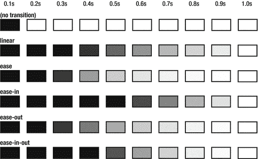
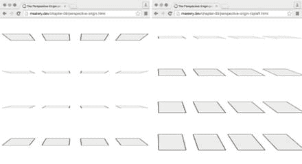

# 十、让它动起来：变换、过渡和动画


这一章是关于移动物体的——或者通过空间，变换，或者通过时间，使用动画和过渡。通常，这两个系列的属性一起工作。

变换与移动具有定位或其他布局属性的事物是不同的概念。事实上，变换一个对象根本不会影响页面的布局。您可以旋转，倾斜，平移和缩放元素，甚至在三维！

动画元素可以用 CSS 动画属性来完成。过渡是动画的一种简化形式。当你只有一个开关状态时(比如悬停在一个元素上)，转换是用来自动完成这个过程的。

综上所述，这些属性为您的页面注入了活力。作为额外的奖励，他们也有非常好的表现。

在本章中，我们将讨论以下内容:

*   二维变换:平移、缩放、旋转和倾斜

*   简单和高级过渡效果

*   你能做什么，不能做什么

*   关键帧动画和动画属性

*   三维转换和透视

## 这一切是如何结合在一起的

CSS 变换允许我们在空间中移动事物，而 CSS 过渡和 CSS 关键帧动画控制元素如何随时间变化。

即使这两个方面有些不相关，变换、过渡和关键帧动画通常在概念上被混为一谈。这是因为它们经常被用来相互补充。当制作动画时，你每秒钟要改变它的外观 60 次。转换允许您以浏览器可以非常有效地计算的方式描述外观的某些类型的变化。

转场和关键帧动画允许您以一种智能的方式制作这些变化的动画。因此，这些功能是相辅相成的。最终结果让我们有能力做一些事情，就像谷歌创造的动画 3D 弹出书(见图 10-1 )展示其产品的创造性使用(【http://creativeguidebook.appspot.com/】??)。


###### 图 10-1。谷歌制作了一个动画 3D 立体书来展示其产品的创造性使用

因为这一章中的例子确实有很多移动的部分，所以很难在一本书的页面上描述它们。我们强烈建议您在阅读时在浏览器中尝试这些示例，以了解发生了什么。很多时候，JavaScript 用于交互性——我们不会深入研究脚本如何工作的细节，但是示例也包括 JS 文件供您探索。

### 关于浏览器支持的说明

变换、过渡和关键帧动画的规范仍在制定中。尽管如此，大多数这些功能在常用的浏览器上都得到了很好的支持，明显的例外是 Internet Explorer 8 和 Opera Mini。IE9 仅支持使用-ms 前缀的 2D 变换子集，不支持关键帧动画或过渡。变换、过渡和关键帧动画都需要-webkit-前缀才能在各种版本的基于 webkit 和 Blink 的浏览器中工作。只有当您需要覆盖旧版本的 Firefox 时，才需要-moz-前缀。

## 2D 变换

CSS 转换允许您通过平移、旋转、倾斜或缩放来改变页面上元素的呈现方式。此外，您可以在组合中添加第三个维度！在这一节，我们将从 2D 变换开始，稍后再看 3D。图 10-2 给出了 2D 变换的概述。


###### 图 10-2。不同类型的 2D 变换举例说明

用技术术语来说，当元素出现在页面上时，转换会改变元素的坐标系。看待变换的一种方式是将它们视为“扭曲场”任何属于已转换元素的渲染的像素都被捕捉到失真场中，并被传送到页面上的新位置或新大小。元素仍然保持在页面上原来的位置，但是元素的结果*图像*被转换。

假设页面上有一个 100×100 像素的元素，类名为 box。元素的位置会受到页边距、位置、页面流中其他元素的大小等因素的影响。不管它是如何结束的，我们都可以通过使用视口内的坐标来描述框的位置，例如，距离页面顶部 200 像素，距离页面左侧 200 像素。这是*视口坐标系*。

在页面中，为元素保留了一个 100×100 像素的空间，就像它正常呈现的那样。现在，让我们设想将元素旋转 45 度进行变换:

```html
.box {
**transform: rotate(45deg);** 
}
```

对一个元素应用变换会为该元素最初放置的空间创建一个所谓的*局部坐标系*。局部坐标系是变形场，它取代了元素的像素。

因为元素在页面上被表示为矩形，所以可能最容易想到的是在盒子的四个角上的四个点会发生什么。Firefox 开发人员工具在检查元素时有一个很好的可视化效果。在检查器的“规则”面板中，将鼠标悬停在变换规则上以查看结果变换(参见图 10-3 )。


###### 图 10-3。在 Firefox 开发工具中可视化 45 度转变。原始框和变换后的框与箭头一起显示，箭头显示角的改变位置。

页面仍然保留了它的 100×100 像素的间隙，该间隙曾经是框的位置，但是属于框的任何点现在都被扭曲场所转换。

除了影响元素在页面上的位置的其他属性之外，对元素应用转换时，理解这一技术背景非常重要。当我们对转换后的 div 应用 margin-top: 20px 时会发生什么？指向上方的角现在是否在距离原始位置顶部 20 个像素处结束？否:旋转属于盒子的任何东西的整个局部坐标系，包括边距，如图 10-4 所示。


###### 图 10-4。旋转一个框包括旋转它的整个坐标系，因此上边距也会旋转

同样重要的是要注意，旋转后的外观不会干扰页面其余部分的布局，就像没有转换时一样。如果我们将盒子旋转整整 90 度，使上边距在视觉上向右突出，它不会推动可能位于盒子右侧的任何元素。

###### 注意

页面上实际上有一样东西会受到变换元素的影响，那就是溢出。如果转换后的元素最终在任何具有导致滚动条的溢出属性的框的文本方向上突出，则转换后的元素可能会影响可滚动区。在从左到右的语言中，这意味着你可以使用向上或向左的平移来隐藏屏幕外的内容，但不能向下或向右。

### 变换原点

默认情况下，任何变换都基于元素边框的中心进行计算。负责控制的属性是 transform-origin。例如，我们可以围绕一个点旋转盒子，这个点距离盒子顶部 10 个像素，距离盒子左侧 10 个像素。

我们可以为 transform-origin 提供一到三个值，给出 x、y 和 z 轴的坐标。(z 轴用于 3D 变换；我们将在本章的后面回到这一点。)如果你只提供一个值，第二个被假定为关键字中心，就像你设置背景位置一样。第三个值不影响二维转换，所以我们现在可以放心地忽略它。

```html
.box {
**transform-origin: 10px 10px;** 
  transform: rotate(45deg);
}
```

这给了我们旋转盒子时完全不同的结果，如图 10-5 所示。


###### 图 10-5。围绕距离上边缘和左边缘 10 个像素的点旋转盒子

###### 注意

如果将转换应用于 SVG 元素，那么转换的工作方式会有所不同。一个例子是 transform-origin 属性的默认值:它默认为左上角，而不是元素的中心。

### 翻译

翻译一个元素仅仅意味着把它移动到一个新的位置。您可以选择使用 translateX()和 translateY()函数沿单个轴平移，或者使用 translate()同时设置两者。

translate()函数的工作方式是向它提供一对表示 x 和 y 轴上平移量的位置。此数量可以是任何长度，如像素、ems 或百分比。值得注意的是，上下文中的百分比指的是元素本身的尺寸，*不是*包含的块。这允许你在不知道元素有多宽的情况下，将元素平移到其原始位置的右侧(见图 10-6 )。


###### 图 10-6。我们的盒子 100%向右平移

```html
.box {
  /* equivalent to transform: translateX(100%); */
  transform: translate(100%, 0);
}
```

### 多重转换

一次应用多个变换是可能的。转换以空格分隔值列表的形式提供给 transform 属性，并按声明顺序应用。让我们看一个例子，我们既做平移又做旋转。

在这个例子中，我们将使用一个有序的规则列表来表示“搏击俱乐部”我们将对编号规则进行一些格式化，并将它们旋转到列表中每一项的下方(见图 10-7 )。我们希望列表编号从下到上读取，但定位在列表项的顶部。


###### 图 10-7。规则列表，带有向下旋转的编号项目

首先，我们的标记中需要一个有序列表。我们将从第三条规则开始，因为前两条规则神秘地丢失了:

```html
<ol class="rules" start="3">
  <li>If someone says "stop", goes limp or taps out, the fight is over.</li>
  <li>Only two guys to a fight.</li>
  <li>One fight at a time.</li>
  <li>No shirts, no shoes.</li>
  <li>Fights will go on as long as they have to.</li>
  <li>If this is your first night at FIGHT CLUB, you HAVE to fight.</li>
</ol>
```

默认情况下，我们无法真正影响有序列表中数字的呈现。CSS 列表和计数器模块 3 级规范描述了一个::marker 伪元素来控制列表标记样式，但是在编写本文时还没有浏览器支持它。我们将发挥创造性，使用 CSS 中支持良好的计数器属性结合伪元素来解决这个问题。计数器允许您通过计算某些元素来生成数字，然后您可以将这些数字插入到页面中。

首先，我们删除了默认的列表样式(删除了数字),并添加了一个计数器重置规则。它告诉浏览器这个元素重置了一个名为 rulecount 的计数器的编号。这个名称是我们自己选择的任意标识符。名字后面的数字告诉计数器它应该有哪个初始值。

```html
.rules {
  list-style: none;
  counter-reset: rulecount 2;
}
```

接下来，我们将告诉计数器在每次遇到列表中的列表项时增加 rulecount 值。这意味着第一个项目将被编号为 *3* ，依此类推。

```html
.rules li {
  counter-increment: rulecount;
}
```

最后，我们使用 content 属性将 rulecount 计数器中的数字作为伪元素注入到每个列表项的文本之前。我们将在数字前插入一个分段符号()。这给了我们在图 10-8 中看到的渲染内容。


###### 图 10-8。带有注入部分符号和编号的列表

```html
.rules li:before {
  content: '§ ' counter(rulecount);
}
```

它看起来还不是很好，但是我们现在有一些东西可以抓取和设计，而不是默认的数字。接下来，我们将尝试沿嵌线的边垂直放置节编号，而不是与文本内联。

我们不希望列表数字在页面中占据任何空间，所以我们需要绝对地定位它们；这样做会自动将章节号放在项目的左上角。为了实现数字被旋转但固定在列表项顶部的效果，我们需要考虑如何平移和旋转它。我们将变换原点设置在右下方(100% 100%)，将其向左平移 100%，向上平移 100%(记住百分比指的是变换元素的尺寸)，然后逆时针旋转 90 度。图 10-9 显示了一步一步的转变。


###### 图 10-9。转换计数器的步骤，使其在列表项文本旁边从上到下运行

```html
.rules li {
  counter-increment: rulecount;
**position: relative;** 
}
.rules li:before {
  content: '§ ' counter(rulecount);
**position: absolute;** 
**transform-origin: 100% 100%;** 
**transform: translate(-100%, -100%) rotate(-90deg);** 
}
```

转换函数的顺序在这里非常重要。如果我们从旋转伪元素开始，平移会相对于旋转的坐标发生，x 和 y 轴上的偏移会指向错误的方向 90 度！转换列表越来越多，因此您必须提前计划它们。

###### 更改转换列表

当您声明一个转换列表时，您不能在事实之后添加它，而只能替换整个列表。例如，如果您有一个带平移的变换元素，并且您还想旋转它:hover，下面的*将不会像预期的那样工作:*

```html
   .thing {
     transform: translate(0, 100px);
   }
   .thing:hover {
     /* CAUTION: this will remove the translation! */
     transform: rotate(45deg);
   }
```

相反，您必须重新声明整个列表，但是要附加循环:

```html
   .thing:hover {
     /* preserves the initial translation, and then rotates. */
     transform: translate(0, 100px) rotate(45deg);
   }
```

在完成的示例中，我们已经向列表项添加了一个灰色的左边界，区域编号位于它的顶部。在这里使用边框的好处是，如果规则超过几行，它会自动延伸到列表项的高度。我们还添加了一些排版规则，并稍微调整了一下填充。例如，生成的部分编号在顶部有一点填充。但是请记住，这实际上意味着填充-右，因为它现在是旋转的！(参见图 10-10 。)


###### 图 10-10。使用边框可以让我们在换行的情况下绘制侧边栏背景。我们添加到节号的右填充现在位于旋转后的元素的顶部。

### 缩放和倾斜

到目前为止，我们已经研究了 translate()和 rotate()转换函数。在剩下的 2D 变换中，只剩下缩放()和倾斜()。这两者都具有在单个轴上缩放和倾斜的相应功能。就像 translate 一样，我们有 scaleX()、scaleY()、skewX()和 skewY()

使用 scale()函数非常简单。scale()函数中使用无单位数字。它接受一个或两个数字。如果只使用一个元素，则该元素在 x 轴和 y 轴上的缩放比例相等。例如，两个轴的比例都为 2，意味着元素的宽度和高度都是原来的两倍。比例测量值为 1 表示元素未改变。

```html
.doubled {
  transform: scale(2);
  /* ...is equivalent to transform: scale(2, 2);
  /* ...and also equivalent to transform: scaleX(2) scaleY(2); */
}
```

仅缩放一个轴意味着元素挤压(见图 10-11 )或伸展。


###### 图 10-11。缩放到 x 轴上小于 1 的尺寸的文本会被挤压

```html
.squashed-text {
  transform: scaleX(0.5);
  /* ...equivalent to transform: scale(0.5, 1);
}
```

倾斜意味着元件的水平或垂直平行边缘相对于彼此移动一定的度数。很容易把 x 轴和 y 轴搞混——在 x 轴上歪斜意味着水平线还是水平的，而*垂直线*是倾斜的。关键是考虑你希望边相对于彼此移动到哪个轴。

回到搏击俱乐部的例子，我们可以使用倾斜来创建一个流行的“2.5D”效果，也许是受复古视频游戏的启发(它的花哨名称似乎是*轴测投影*)。

如果我们给列表项交替的背景和边框颜色以及交替的倾斜变换，我们会得到一个“手风琴”式表面的外观(见图 10-12 ):


###### 图 10-12。使用倾斜变换创建“2.5D”外观

```html
/* some properties omitted for brevity */
.rules li {
  transform: skewX(15deg);
}
.rules li:nth-child(even) {
  transform: skewX(-15deg);
}
```

### 2D 矩阵变换

正如我们在本节开始时所讨论的，变换导致变换元素表面上的每个点都经过一次计算，该计算确定了它在局部坐标系中的最终位置。

当我们写 CSS 的时候，我们会用“围绕它的中心旋转这个元素，并向左上方移动它”这样的术语来思考。对于浏览器来说，我们应用的所有这些转换都被融合到一个数学结构中，称为*转换矩阵*。您可以使用底层的 matrix()函数，使用六个不同数值的组合来直接操作它的值。

现在，不要担心:这不是你通常会用手做的事情，因为任何超出单个缩放或平移操作的事情都需要相当的数学技能。

下面是 matrix()函数的一个应用程序，它等于将一个元素旋转 45 度，然后将其放大两倍，然后在旋转后的 x 轴上平移 100 个像素，最后在 x 轴上倾斜 10 度。乍看之下，得到的数字(为了节省空间，已经进行了一定程度的四舍五入)与单个变换的原始值几乎没有相似之处。

```html
.box {
  width: 100px;
  height: 100px;
  transform: matrix(1.41, 1.41, -1.16, 1.66, 70.7, 70.7);
  /* equivalent to:
     transform: rotate(45deg) translate(100px, 0) scale(2) skewX(10deg); */
}
```

不太容易解释，是吗？

对于所有的意图和目的，转换矩阵是一个“黑盒”,需要输入各种数字来表示最终的转换，这可能是几个步骤的组合。我们可以预先计算这些值(如果我们知道数学的话),然后将它们输入 matrix()函数，但是我们无法查看 matrix()函数的值并知道其中包含了哪些单独的转换。

关键点在于，单个矩阵可以简洁地表示任意数量的变换的组合*。matrix()函数的主要用例不是为了节省空间和炫耀数学技能——但是当与 JavaScript 结合使用时，它真的会大放异彩。事实上，当您在一个元素上设置一个转换并在 JavaScript 文件中请求转换的计算样式时，您会得到一个矩阵表示。*

由于矩阵可以由脚本非常有效地操纵，然后插回到 matrix()函数中，许多基于 JavaScript 的动画库大量使用它。如果你正在手工编写 CSS，那就简单多了(可读性也更好！)坚持使用正常的转换函数。

如果你想了解更多关于如何操作 CSS 变换矩阵背后的数学知识，你可以在[`www . useragentman . com/blog/2011/01/07/css3-matrix-transform-for-the-the-mathematical-challenged/`](http://www.useragentman.com/blog/2011/01/07/css3-matrix-transform-for-the-mathematically-challenged/)找到 Zoltan·霍利卢克的精彩介绍。

### 转换和性能

当浏览器计算 CSS 如何影响页面上的元素时，有些东西在性能方面比其他东西更昂贵。例如，如果更改文本大小，生成的行框可能会随着文本换行而变得不同，然后元素可能会变高。变高会推低页面上的其他元素，这反过来又会迫使浏览器做进一步的重新计算。

当您使用 CSS 变换时，这些计算只影响应用它的元素的坐标系，既不改变元素内部的布局，也不改变元素外部的布局。此外，这种计算几乎可以独立于页面中的所有其他事情(如运行脚本或布置其他元素)来完成，因为转换不太可能干扰这些。大多数浏览器也试图让图形处理器来处理这些事情(如果有的话)，因为它是专门为这种数学而构建的。

这意味着从性能的角度来看，转换是非常好的。任何时候，当你想创造一个可以通过变换复制的效果时，它很有可能会有更好的表现。快速连续地进行多次变换会增加收益，例如在制作元素动画或变换元素时。

###### 一些最终转换“抓住了”

转换具有很好的性能，并且非常容易使用。也就是说，使用转换有一些意想不到的副作用:

*   有些浏览器会为转换后的元素切换抗锯齿方法。这意味着当动态应用转换时，像文本呈现这样的事情看起来会突然不同。为了解决这个问题，您可以尝试应用一个仅使用初始值的转换，在页面加载时将元素保留在原位。这样，渲染甚至会在应用最终变换之前切换。

*   应用于元素的任何变换都会创建新的堆叠上下文。这意味着在组合 z-index 和 transform 时需要小心，因为转换后的元素会创建自己的堆栈——即使在转换后的元素内将子元素的 z-index 设置得很高，它们也不会位于元素外的元素之上。

*   变换后的元素还为固定定位建立了新的包含块。如果已转换的元素中包含 position: fixed 元素，它会将已转换的元素视为其视口。

## 过渡

转换是从一种状态到另一种状态的自动动画，例如当按钮从正常状态变为按下状态时。通常情况下，这种变化会立即发生，或者至少以浏览器最快的速度发生。当你点击一个按钮时，浏览器会计算出页面的新外观，并在几毫秒内绘制出来。当你应用一个过渡时，你告诉浏览器这个变化需要多长时间，浏览器会计算在这段时间内屏幕应该是什么样子。

过渡会自动在两个方向上运行，因此一旦状态反转(就像释放按钮时)，动画就会反向运行。

让我们从表单章节(第九章)中的按钮来说明这一点，并为它创建一个平滑的按下状态动画。我们的目标是通过将按钮在页面上向下移动几个像素来创建按钮被按下的外观，并减少阴影的偏移来进一步增强按钮消失在页面后面的错觉(见图 10-13 ):


###### 图 10-13。正常和:按钮的活动状态

```html
<button>Press me!</button>
```

以下是第九章中按钮代码的基础(为简洁起见，省略了一些属性)。这一次，我们向规则添加了转换属性。

```html
button {
  border: 0;
  padding: .5em 1em;
  color: #fff;
  border-radius: .25em;
  background-color: #173b6d;
  box-shadow: 0 .25em 0 rgba(23, 59, 109, 0.3), inset 0 1px 0 rgba(0, 0, 0, 0.3);
**transition: all 150ms;** 
}
button:active {
**box-shadow: 0 0 0 rgba(23, 59, 109, 0.3), inset 0 1px 0 rgba(0, 0, 0, 0.3);** 
t**ransform: translateY(.25em);** 
}
```

当按钮被激活时，我们将其向下平移与 y 轴阴影偏移相同的距离。同时，我们减少了阴影偏移。通过使用 transform 属性来移动按钮，我们避免了强制页面回流。

前面的代码还告诉按钮使用一个转换来更改所有受影响的属性，并且更改应该在 150 毫秒或 0.15 秒内发生。使用动画向我们介绍了新的与时间相关的单位:ms 代表毫秒，s 代表秒。用户界面组件中的大多数过渡应该低于 0.3 秒，否则会感觉迟钝。其他视觉效果可能需要更长时间。

transition 属性是一种允许我们一次设置几个属性的简写方式。设置转换的持续时间并告诉浏览器转换所有在状态之间改变的属性也可以通过以下方式完成:

```html
button {
  transition-property: all;
  transition-duration: .15s;
}
```

如果我们只想专门转换 transformand 和 box-shadow 属性，而其他更改(例如，不同的背景颜色)应该立即发生，我们将不得不指定单个属性，而不是所有属性。

我们不能为单个转换指定一个以上的属性名，但是我们可以指定几个转换，用逗号分隔。这意味着我们可以重复相同的值，但是对于不同的属性关键字:

```html
button {
  transition: box-shadow .15s, transform .15s;
}
```

请注意，我们现在必须在两个转场中重复持续时间。这种重复是以后事情不同步的原因。不要重复自己(简称 DRY)是写好代码的一个基本准则。当过渡更复杂时，最好单独设置 transition-property 以避免重复:

```html
button {
  /* First, specify a list of properties using transition-property */
  transition-property: transform, box-shadow;
  /* Then, set values that go for those properties. */
  transition-duration: .15s;
}
```

当您在转换声明中使用多个逗号分隔的值时，它们的工作方式类似于多个背景属性。transition-property 中的列表决定了要应用的过渡数量，如果其他列表较短，它们会重复。

在前面的示例中，过渡持续时间只有一个值，但定义了两个过渡属性，因此持续时间值适用于这两个属性。

###### 注意

当转换带前缀的属性时，必须将带前缀的属性名作为转换属性。例如，transition: transform .25s 通常需要用-webkit-transition:**-WebKit-transform**. 25s 来补充，在基于 WebKit 的旧浏览器中，transition 和 transform 都有前缀。

### 过渡时序功能

默认情况下，转场的变化速率在帧与帧之间并不完全相同，它开始时稍慢，然后快速加速，最后逐渐减速，直到达到最终值。

这种移动速度在动画术语中被称为*放松*，它通常会让变化看起来更自然、更平稳。有一些数学函数负责创建这种变量变化，并使用转换时间函数属性来控制它们。

有一些关键字代表不同样式的计时功能。前面描述的缺省值称为 ease。其他的是线性、渐进、渐出和渐出。

“放松”意味着开始时缓慢，然后加速。“放松”的意思正好相反:开始时快速，然后在结束时慢下来。最后，双管齐下会让我们在开始和结束时缓慢变化，但在中间会加速变化。

将结果可视化在书页上很难，但是图 10-14 中的插图应该会给你一个想法。它代表一个矩形，我们在一秒钟内将背景颜色从黑色变为白色。



###### 图 10-14。在 1 秒钟的动画中，采样停止点之间相隔 100 毫秒

如果我们想改变按钮动画来使用渐强计时功能，我们可以这样做:

```html
button {
  transition: all .25 ease-in;
  /* ...or we could set transition-timing-function: ease-in; */
}
```

#### 三次贝塞尔函数和“弹性”过渡

在幕后，处理变化率的数学函数建立在一种叫做三次贝塞尔函数的东西上。每个关键字都是使用这些带有特定参数的函数的快捷方式。通常情况下，使用这些函数的时间变化被视为一条曲线，从初始时间和初始值(左下角)到持续时间结束时的最终值(右上角)，如图 10-15 所示。


###### 图 10-15。显示渐出转场定时功能的曲线

一个三次贝塞尔函数需要四个参数来计算随时间的变化，我们可以使用三次贝塞尔()函数作为 CSS 转换中的缓动值。这意味着您可以通过计算和填充这四个值来创建自己的计时函数。这四个值代表形成该曲线的两个*控制点*的两对 x 和 y 坐标。

就像矩阵变换一样，这不是你通常手工做的事情，因为它需要高级数学技能。幸运的是，还有其他人使用这些技能为我们其他人创造工具！Lea Verou 专门为 CSS 编写了一个这样的工具，可在[`cubic-bezier.com`](http://cubic-bezier.com)获得(见图 10-16 )。


###### 图 10-16。在[`cubic-bezier.com`](http://cubic-bezier.com)，你可以玩不同赛季的预设值，并创建自己的预设值

使用自定义计时功能的一个更有趣的结果是，您可以在转换时将值更改到起始值和结束值之外(如图 10-16 所示)。例如，在实践中，这意味着当你移动某物时，在最终停止之前超过你的目标。这使您有可能创建有弹性的过渡，其中元素看起来有弹性或咬合到位。试着在 http://cubic-bezier.com 的[上玩这个例子看看效果！](http://cubic-bezier.com)

#### 阶跃函数

除了使用预设关键字和立方贝塞尔()函数指定缓动之外，您还可以创建逐步发生的过渡。这对于创建定格动画非常有用。假设有一个元素，它的背景图像由七个不同的图像组成，都在同一个文件中。定位图像，以便仅显示其中一个(参见图 10-17 )。


###### 图 10-17。使用背景位置的七帧定格动画

当我们将鼠标悬停在该元素上时，我们希望通过移动 background-position 属性来动画显示背景图像。如果我们使用线性或缓和的过渡来做这件事，背景图像将会滑过，破坏这种错觉。相反，我们需要它以六个不连续的步骤进行过渡:

```html
.hello-box {
  width: 200px;
  height: 200px;
  transition: background-position 1s **steps(6, start)**;
  background: url(steps-animation.png) no-repeat 0 -1200px;
}
.hello-box:hover {
  background-position: 0 0;
}
```

transition-timing-function 现在设置为 steps(6，start)，意思是“将转换持续时间分成六个步骤，并在每个新步骤开始时更改属性。”总而言之，我们得到七个不同的帧，包括起始状态。

默认情况下，steps(6)会在每一步的 *end* 处更改属性，但是如果您将 start 或 end 作为第二个参数传入，您可以明确地说明这一点。因为我们想在用户悬停在元素上时直接看到变化，所以我们选择在每一步开始时开始转换。

现在，转换的 steps()函数有一个问题。当您在过渡完成之前反转状态时(例如，通过快速移开鼠标指针)，过渡将向后播放。这是意料之中的，但出乎意料的是，反向转换*仍然有六个步骤*。这些步骤现在不再映射到仔细考虑过的背景位置，使我们的动画看起来很糟糕。

可悲的是，这在当前版本的规范中是未定义的行为，所有浏览器似乎都以这种可以说是糟糕的方式对待 step 函数。为了应对这种糟糕的体验，我们可以使用一些有用的过渡技巧，这将在下一节中介绍。

### 正向和反向的不同转换

有时，我们希望某些东西在一个方向上快速过渡，而在另一个方向上缓慢过渡，反之亦然。在前面的步进示例中，当悬停状态在转换完成之前中止时，我们不能优雅地后退。我们可以通过立即恢复过渡来解决这个问题。

为此，我们需要定义不同的转换属性集:一个用于未悬停状态，一个用于悬停状态。诀窍是把正确的放在正确的地方。

我们给初始转换一个 0 的持续时间，然后设置“真正的”转换在元素悬停时发生。现在悬停状态触发动画，当悬停被取消时，图像会迅速恢复。

```html
.hello {
  transition: background-position **0s** steps(6);
}
.hello:hover {
  transition-duration: **.6s**;
}
```

### “粘性”过渡

转换的另一个技巧是让转换完全不反转，这与我们之前的例子相反。为了进行“粘性”转换，我们可以使用一个长得离谱的转换持续时间。从技术上来说，当我们取消悬停时，它仍然会向后运行，但非常非常慢——你必须让浏览器标签打开多年才能看到任何变化！

```html
.hello {
  transition: background-position **9999999999s** steps(6);
}
.hello:hover {
  transition-duration: **0.6s**;
}
```

### 延迟转换

通常，状态一改变，元素就开始转换——例如，当一个类名被 JavaScript 改变或者一个按钮被按下时。我们可以选择使用 transition-delay 属性来延迟这个转换。例如，我们可能只想在用户将指针悬停在停止动画上超过一秒钟时运行停止动画。

就值的顺序而言，转换的简写相当宽松，但是延迟必须是第二次出现的时间值，第一次出现的时间值将被解释为持续时间。

```html
.hello {
  transition: background-position 0s **1s** steps(6);
  /* equivalent to adding transition-delay: 1s; */
}
```

你也可以使用负延迟。遗憾的是，这并不能实现时间旅行，但它可以让你从一开始就直接跳到过渡的中途。如果在 10 秒的过渡上设置过渡延迟:-5s，则当触发过渡时，它将立即跳到中间标记。

### 你能做什么，不能做什么

到目前为止，我们已经转换了变换、框阴影值和背景位置。但是并不是每个 CSS 属性都可以被动画化，也不是每个值都可以。大多数情况下，使用长度或颜色的就可以了:边框、宽度、高度、背景颜色、字体大小等等。关键是你能否计算出它们之间的一个值。您可以在 *100px* 和 *200px* 之间以及*红色*和*蓝色*之间找到中间值(因为颜色也是幕后的数值)，但不能在例如显示属性的 block 和 none 之间找到中间值。这条规则也有一些例外。

#### 插值

尽管没有明确的中间值，但有些属性是可以动画化的。例如，当使用 z-index 时，值不能是 1.5，但 1 或 999 就可以了。对于许多属性，比如只接受整数值的 z-index 或 column-count，浏览器会将它们插值成整数，有点像前面的 steps()函数。

一些可以插值的值有点令人惊讶。例如，您可以转换 visibility 属性的值，但是一旦转换通过两个结束状态之间的中点，浏览器就会将该值“捕捉”到两个结束状态中的任一个。

设计师奥利·斯图德霍尔姆有一个很方便的属性列表，既有 CSS 规范中的属性，也有 SVG 中的属性，可以通过 CSS 制作动画:[`oli.jp/2010/css-animatable-properties/`](http://oli.jp/2010/css-animatable-properties/)。

#### 过渡到内容高度

转换的最后一个缺陷是，*可以*转换的属性，比如高度，只能在数值之间转换。这意味着其他关键字，如 auto，不能表示为要转换到的状态之一。

一种常见的模式是拥有一个折叠的元素，当用户与它交互时，您可以将它转换为完整的高度，就像手风琴组件一样。浏览器不知道如何在像 0 这样的长度和关键字 auto 之间转换，甚至不知道如何在像 max-content 这样的固有测量关键字之间转换。

在图 10-18 中，我们有一个餐馆菜单组件，最初显示了前三个菜单选项。当我们切换列表的其余部分时，它应该向下滑动并淡入。


###### 图 10-18。扩展菜单列表组件

在这种情况下，我们知道列表的大致高度，因为它总共有 10 个条目——它仍然会有一些变化，因为可能会有带换行符的长名称。我们现在可以用最大高度来代替它。使用这种技术，我们从最初设置的尺寸到一定比元素扩展高度高的长度。在这种情况下，我们决定将其余的“顶部菜单选项”限制为另外七个项目。

组件的标记基于两个有序列表，其中第二个列表从数字 4 开始:

```html
<div class="expando">
  <h2 class="expando-title">Top menu choices</h2>
  <ol>
    <li>Capricciosa</li>
    <li>Margherita</li>
    <li>Vesuvio</li>
  </ol>
  <ol class="expando-list" start="4" aria-label="Top menu choices, continued.">
    <li>Calzone</li>
    <!-- …and so on… -->
    <li>Fungi</li>
  </ol>
</div>
```

该标记在第二个列表中包含 aria-label 属性，以便让屏幕阅读器的用户清楚这两个列表的用途。

为了切换状态，我们使用一小段 JavaScript 来设置场景。在运行的示例中，您可以找到这个脚本，它为我们创建了一个按钮，将它附加到标题，并在单击按钮时切换容器元素上 is-expanded 的类名。

它还向 html 元素添加了一个类名 js。然后，我们可以将我们的样式基于这些类名的存在，因此如果 JavaScript 不运行，用户将从一开始就看到完整的扩展列表。

```html
.js .expando-list {
  overflow: hidden;
  transition: all .25s ease-in-out;
**max-height: 0;** 
**opacity: 0;** 
}
.js .is-expanded .expando-list {
**max-height: 24em;** 
**opacity: 1;** 
}
```

扩展的 max-height 被设置为一个比实际列表的预期最大高度大很多的值。这是为了有一个安全余量:例如，如果在小屏幕上的菜单项中有几个意外的换行符，我们不希望列表被最大高度截断。

小缺点是 max-height 转换仍然会运行，就好像元素正好是 24 ems 高一样，这使得缓和点和停止点超出了列表的整个高度。如果您使用该示例，这在塌陷动画中作为一个小延迟是最明显的。在一个更健壮的例子中，脚本最初可以过渡到一个非常高的 max-height，然后在过渡之后测量元素*，以基于内容动态更新 max-height。*

## CSS 关键帧动画

CSS 转场是*隐式*动画。我们为浏览器提供了两种不同的状态，当一个元素从一种状态转换到另一种状态时，包含在转换中的任何属性都将被激活。有时，我们需要做的不仅仅是在两种状态之间动画化，或者明确地动画化某些可能一开始就不存在的属性。

CSS 动画规范允许我们使用*关键帧*的概念来定义这些种类的动画。此外，它们允许我们控制动画运行的其他几个方面。

### 让生活的幻觉栩栩如生

使用动画的好处之一是通过展示而不是讲述来传达信息。我们可以用它来引导注意力(就像移动的箭头告诉你“看这里！这很重要！”)，解释刚刚发生的事情(例如，当使用淡入动画来显示添加了列表项时)，或者只是为了使我们的网页看起来更生动一些，以建立情感联系。

华特·迪士尼工作室教授通过动画表达性格和个性的 12 条原则。这些后来被收集在一本名为《生活的幻觉》的书中。动画师文森佐·洛迪贾尼用一个小立方体作为主角，创作了一部动画短片来说明这些原则(【https://vimeo.com/93206523】[)。去看看吧！](https://vimeo.com/93206523)

受此启发，我们将创建一个动画方形标志，展示一些关键帧动画可以做什么。徽标的静态渲染由单词“Boxmodel”旁边的一个正方形组成(见图 10-19 )，这将是我们虚构的公司名称。


###### 图 10-19。静态徽标

标记非常简单:一个 heading 元素和一些额外的 span 元素来包装单词，两个嵌套的 span 元素来表示小方块。使用额外的空元素来表示并不理想，但是为了达到我们想要的效果，这是必要的，原因将变得很清楚。

```html
<h1 class="logo">
  <!-- This is the box we are animating -->
  <span class="box-outer"><span class="box-inner"></span></span>
  <span class="logo-box">Box</span><span class="logo-model">model</span>
</h1>
```

对于基本的样式，我们给页面一个背景颜色，给 logo 一些字体属性，并设置正方形的尺寸和颜色。我们通过将表示正方形的两个 span 元素的显示模式设置为 inline-block 来准备动画，因为不可能转换内联文本元素。

```html
body {
  background-color: #663399;
  margin: 2em;
}
.logo {
  color: #fff;
  font-family: Helvetica Neue, Arial, sans-serif;
  font-size: 2em;
  margin: 1em 0;
}
.box-outer {
  display: inline-block;
}
.box-inner {
  display: inline-block;
  width: .74em;
  height: .74em;
  background-color: #fff;
}
```

#### 创建动画关键帧块

接下来，我们需要创建实际的动画。我们想模仿“生命的幻觉”电影的开场序列，小方块挣扎着滚过屏幕。

CSS 动画在语法和结构上有点奇怪。使用@keyframes 规则定义和命名动画序列，然后使用 animation-*属性将该序列连接到 CSS 中的一个或多个规则集。

下面是第一个关键帧块的外观:

```html
@keyframes roll {
  from {
    transform: translateX(-100%);
    animation-timing-function: ease-in-out;
  }
  20% {
    transform: translateX(-100%) skewX(15deg);
  }
  28% {
    transform: translateX(-100%) skewX(0deg);
    animation-timing-function: ease-out;
  }
  45% {
    transform: translateX(-100%) skewX(-5deg) rotate(20deg) scaleY(1.1);
    animation-timing-function: ease-in-out;
  }
  50% {
    transform: translateX(-100%) rotate(45deg) scaleY(1.1);
    animation-timing-function: ease-in;
  }
  60% {
    transform: translateX(-100%) rotate(90deg);
  }
  65% {
    transform: translateX(-100%) rotate(90deg) skewY(10deg);
  }
  70% {
    transform: translateX(-100%) rotate(90deg) skewY(0deg);
  }
  to {
    transform: translateX(-100%) rotate(90deg);
  }
}
```

它确实很长，但是有很多重复的地方。首先，我们将关键帧序列命名为 roll——这可以是任何有效的标识符，只要它不与 CSS 中任何预定义的名称冲突。我们还没有决定这个动画需要多长时间，所以使用*关键帧选择器*选择块内的时间点，以百分比的形式写在时间轴上。

我们还可以使用特殊的关键字 from 和 to，它们分别是 0%和 100%的别名。如果缺少 from(或 0%)或 to(或 100%)，它们将根据元素现有属性的初始状态自动构建。您可以拥有的关键帧选择器的数量从一个到您需要的任何数量，由您决定。

第一个关键帧(0%)设置动画计时功能属性。它的工作原理与过渡类似:使用预置关键字进行缓动，或使用三次贝塞尔()函数。在关键帧选择器中设置计时功能可以控制这个关键帧和下一个关键帧之间的过渡时间。

我们还使用 translateX(-100%)将正方形的起始位置移动到其自身左侧的 100%。

接下来，我们设置应用各种变换的整个范围的关键帧，以及单独的定时功能。图 10-20 显示了元素在每个关键帧中的样子。请注意，有些关键帧是相同的，例如在结尾:这是为了控制动画的速度。


###### 图 10-20。我们动画的各种关键帧

该元素将首先倾斜一点，好像是为了聚集动量，然后旋转和拉伸，几乎在 45 度角处停止，最终完成 90 度旋转，并在旋转轴线上倾斜一点，进行弹性停止。那是我们的第一部动画。

#### 将关键帧块连接到元素

现在我们已经定义了一个动画关键帧序列，我们需要将它连接到徽标中的方块。正如转场属性一样，也有控制持续时间、延迟和计时功能的动画属性，但还有一些附加控件:

```html
.box-inner {
  animation-name: roll;
  animation-duration: 1.5s;
  animation-delay: 1s;
  animation-iteration-count: 3;
  animation-timing-function: linear;
  transform-origin: bottom right;
}
```

我们将 animation-name 应用于该元素，以使用滚动动画。使用动画持续时间，我们设置每次迭代的时间。animation-delay 属性告诉浏览器在运行动画之前等待 1 秒钟。我们希望盒子在停止前翻转三次，所以我们将动画-迭代-计数设置为 3。

我们可以在关键帧选择器和动画元素上设置动画计时功能。这里，定时功能在整个序列中设置为线性，但我们已经看到如何在单个关键帧之间覆盖它。

###### 注意

您可以使用与过渡相同的逗号分隔语法将多个动画应用到同一元素。如果两个动画试图同时制作同一属性的动画，则最后声明的动画获胜。

最后，我们将 transform-origin 属性设置为 bottom right，因为我们希望正方形以其右下角为轴心。

使用速记动画属性，我们可以将前面的所有细节浓缩成一行，就像过渡一样:

```html
.box-inner {
**animation: roll 1.5s 1s 3 linear;** 
  transform-origin: bottom right;
}
```

但是我们还没完。到目前为止，我们有一个广场，重复滚动动画到位。我们需要它从视窗外移动到最终目的地。这在使用单个动画时是可能的，但是使用大量的关键帧。相反，我们可以在外部跨度元素上应用另一个动画和另一组变换。这一次，动画简单多了。我们希望它从左边移动，移动的距离是盒子宽度的三倍:

```html
@keyframes shift {
  from {
    transform: translateX(-300%);
  }
}
```

因为我们想要从某个东西到初始状态的动画，我们可以省略关键帧，只留下从状态。

###### 关于关键帧块和前缀的注释

我们在这一章中保持了各种属性的标准化的、无前缀的版本。代码示例具有完整的带前缀的代码。

在带有动画属性前缀的浏览器中，关键帧规则也带有前缀。这意味着您必须为每个前缀编写一套关键帧规则！幸运的是，现在大多数浏览器都接受无前缀的版本，所以通常只需要添加-WebKit-前缀。

现在，我们可以使用步进时序函数将移位序列应用于外部跨度。共有三个步骤，因此每次滚动动画结束并将正方形恢复到初始位置时，步进函数都会将其向前移动相同的量。这就是产生正方形在屏幕上滚动的错觉的原因；这很难说明，但是可以尝试一下代码示例，看看它是如何工作的。

```html
.box-outer {
  display: inline-block;
**animation: shift 4.5s 1s steps(3, start) backwards;** 
}
```

最后一个关键字 backwards 设置动画序列的动画填充模式属性。填充模式告诉浏览器如何在动画运行之前或之后处理动画。默认情况下，在动画运行之前，不会设置第一个关键帧中的属性。如果我们提供 backward 关键字，这些值会在时间上向后填充，因此即使动画最初被延迟或暂停，第一个关键帧属性也会立即设置。向前填充使序列中的最后一个值在时间上保持向前，并且向前和向后填充。

在这种情况下，我们希望动画立即离开屏幕，但保留最终值(因为它与盒子的初始位置相同)，所以我们向后填充。

至此，我们的第一个关键帧动画完成了。当你加载这个例子时，这个小方块高兴地在屏幕上挣扎。

### 沿着曲线制作动画

根据定义，对两点之间的元素位置设置动画会使其沿直线移动。您可以通过创建大量关键帧来创建曲线运动的外观，每次都略微改变方向。更好的方法是通过以特定顺序组合旋转和平移来移动对象，就像 Lea Verou 的这个示例:[`Lea . Verou . me/2012/02/moving-an-element-along-a-circle/`](http://lea.verou.me/2012/02/moving-an-element-along-a-circle/)。

在示例文件中，我们包含了一个加载动画的示例，它使用这种技术来演示文件上传到服务器的过程。这些文件沿着一个半圆形的路径从计算机“跳到”服务器图标上，同时缩小一点以适应服务器图标的后面(见图 10-21 )。


###### 图 10-21。文件图标沿着弯曲的路径移动到服务器图标

这是该动画的关键帧块:

```html
@keyframes jump {
  from {
    transform: rotate(0) translateX(-170px) rotate(0) scale(1);
  }
  70%, 100% {
    transform: rotate(175deg) translateX(-170px) rotate(-175deg) scale(.5);
  }
}
```

初始关键帧将文件元素向左平移 170 个像素(以便在计算机图标上重新开始)。第二个关键帧选择器将元素旋转 175 度，仍然平移相同的量，然后以相反的方向将其旋转 175 度。由于这是在平移位置完成的，它用于保持元素直立，因此在旋转时不会上下颠倒。最后，我们将元素缩小到一半大小。

图 10-22 展示了这种特殊的变换组合是如何沿着弧线运动的。


###### 图 10-22。由于旋转是在平移之前应用的，因此图标沿弧线移动。这是它在动画中大约四分之一处旋转 45 度后的样子。

然后，我们将这个动画连接到 file-icon 元素，并设置持续时间和放松功能。由于是加载动画，所以我们设置为无限重复(我们都经历过！)，通过添加关键字 infinite 作为 animation-iteration-count 值。

```html
.file-icon {
**animation: jump 2s ease-in-out infinite;** 
}
```

您可能已经注意到，最终的关键帧选择器同时针对动画的 *70%* 标记和 *100%* 标记。这是因为我们希望动画在重新开始之前暂停一会儿。

没有特定的属性来控制这种延迟，所以我们希望 70%和 100%的状态保持不变，我们可以以这种方式组合具有完全相同属性的关键帧，就像我们组合普通的逗号分隔选择器一样。

#### 动画事件、播放状态和方向

在某个时候，文件传输应该完成了，希望如此。在完整的代码示例中，我们添加了按钮来模拟动画的结束、重新开始和暂停。它们唯一的功能是给文件图标添加两个类名中的一个。这些类将属性 animation-play-state 添加到文件图标，并将其设置为 paused。这个属性有两个值:默认情况下，它被设置为 running。

停止动作不同于暂停，因为它与动画开始、停止或启动新的迭代时触发的 JavaScript 事件挂钩。动画完成当前迭代后，文件图标会消失，服务器图标旁边会出现一个复选标记。您可以研究这个示例的源代码，看看它是如何工作的，或者在 MDN 上阅读更多关于 JavaScript 动画事件的内容([`developer . Mozilla . org/en-US/docs/Web/API/animation event`](https://developer.mozilla.org/en-US/docs/Web/API/AnimationEvent))。

最后，您还可以使用 animation-direction 属性来控制动画的方向。默认情况下，它被设置为正常，但是您可以使用 reverse 关键字反向运行动画，并且您将有一个免费的“下载”动画！

还有 alternate 和 alternate-reverse 关键字，它们在动画迭代之间改变方向。它们之间的区别是交替开始于正常方向，而交替-反向开始于反向。

###### 一些动画“Gotchas”

当使用 CSS 关键帧动画时，有相当多的陷阱和不一致。以下是一些值得了解的信息:

*   一些动画在页面加载时就开始运行，尽管会有一点延迟。这可能很棘手，因为一些浏览器在一开始就运行流畅时会出现错误行为；如果您在一些不同的浏览器中查看滚动正方形示例，您有时会注意到这一点。当一切就绪时，使用 JavaScript 触发动画通常更好。

*   关键帧中的属性没有任何特异性。它们只是改变它们所应用到的元素的属性。尽管如此，一些浏览器(但不是全部)允许您用！正常规则中的重要标志，来自动画内部，这可能会令人困惑。

*   相反，在关键帧块中设置的属性不允许用！重要的旗帜。关键帧块中设置了该标志的任何声明都将被忽略。

*   Android 操作系统的版本 2 和 3 支持 CSS 动画，但是一次只能支持一个属性！如果您尝试制作两个或更多属性的动画，该元素将完全消失。为了解决这个问题，您可以将动画分割成单独的关键帧块。

## 3D 转换

现在我们已经使用了常规的 2D 变换、过渡和动画，是时候看看 CSS 工具包中可能最令人印象深刻的工具:3D 变换了。

我们已经学习了 2D 空间中变换和坐标系的基础知识。当我们转向 3D 时，我们正在处理完全相同的概念，但这一次，我们还必须考虑 z 维度。3D 变换允许我们将坐标系旋转、倾斜、缩放或移动*到*或*远离我们*。为了达到这种效果，有必要引入透视的概念。

### 获得一些观点

当处理 3D 时，我们需要在三个轴上表示变换。x 和 y 轴仍然代表同样的东西，但是 z 代表一条穿过屏幕并朝向我们观众的线，可以这么说(见图 10-23 )。屏幕本身的表面通常被称为 *z 平面*，这是 z 轴上的默认位置。


###### 图 10-23。3D 坐标系中的 z 轴

这意味着，当我们远离它们(z 轴的负方向)时，它们需要显得更小，当我们靠近它们时，它们需要显得更大。在 x 或 y 轴上旋转某物会使它的一部分变大，另一部分变小，等等。

让我们开始尝试一个例子。我们将使用来自 2D 部分的可靠的 100×100 像素的盒子，并围绕 y 轴旋转它:

```html
.box {
  margin: auto;
  border: 2px solid;
  width: 100px;
  height: 100px;
  transform: **rotateY(60deg)**;
}
```

仅仅这样并不能让你走得更远:盒子会看起来更窄(这是在 y 轴上旋转时所期望的)，但会完全缺乏任何 3D 感(参见图 10-24 的最左边部分)。


###### 图 10-24。我们旋转的 100×100 像素的盒子，没有透视(左)，透视:140 像素(中)，透视:800 像素(右)

原因是我们还没有定义一个*视角*:我们必须选择我们应该出现在离盒子多远的地方。你离一个物体越近，变化就越明显，离得越远，变化就越小。默认的视角基本上是无限远，所以我们没有得到非常明显的效果。

我们通过在要转换的元素的父元素上设置 perspective 属性来解决这个问题:

```html
body {
  perspective: 800px;
}
```

这个测量值表示视点应该位于离屏幕多远的地方。您必须根据具体情况进行实验以找到正确的值，但是大约 600 到 1000 像素是一个很好的起点。

#### 透视原点

默认情况下，假定查看者的视角以应用了该视角的元素为中心。从技术上讲，这意味着*消失点*在中心。您可以使用透视原点属性对此进行控制。它的工作方式类似于 transform-origin 属性:您为它提供一对带有关键字(上、右、下、左)、百分比或长度的 x 和 y 坐标值。

图 10-25 展示了三维物体在物体元素上的透视。所有的盒子都在 x 轴上旋转了 90 度(所以它们都是朝上的)，但是左边和右边的图像有不同的透视原点。



###### 图 10-25。左侧的浏览器窗口有一个默认的透视原点(50% 50%)，右侧的透视原点设置为左上角

#### Perspective()转换函数

在父元素上设置 perspective 属性会使其内部元素上的所有 3D 转换共享同一个透视图。这通常是你想要的，因为它能产生更真实的效果。

perspective()函数允许您在每个变换的元素上设置单独的透视图。通过下面的方法可以得到与前面的例子相似的结果，但是透视图不能在元素之间共享:

```html
.box {
  transform: perspective(800px) rotateY(60deg);
}
```

### 创建 3D 微件

现在我们有了移动东西并以 3D 视角显示它们的方法，我们可以创建一些更有用的东西。除了使用动作来增加一点趣味或解释正在发生的事情，我们还可以结合动作和 3D 来节省空间，同时整理设计。

我们的目标是使用 CSS 和 JavaScript 构建一个 3D 小部件，其中用户界面的一些部分隐藏在元素的背面。我们将重用前面的菜单组件，并添加过滤选项，而不是展开所有项目。通过点击“显示过滤器”按钮，元件将翻转 180 度并显示背板(参见图 10-26 )。点击“给我看看披萨！”再次翻转它，在现实世界的例子中，比萨饼列表现在将根据复选框的选择进行过滤。


###### 图 10-26。我们的“可翻转”部件

首先，对于不支持 3D 转换的浏览器，或者当 JavaScript 不能正常运行时，我们需要一些可靠的标记和默认情况。当浏览器不支持 3D 变换时，我们可以在页面上一个接一个地显示正面和背面，如图 10-27 所示。理论上，点击“给我看看披萨！”按钮将简单地重新加载应用了新过滤器的页面。


###### 图 10-27。基本的“2D”版本在页面中一个接一个地显示了小部件的两面

标记类似于本章前面的菜单，但是我们添加了一些新的类名和一个包装器来保存整个结构。

```html
<div class="flip-wrapper menu-wrapper">
  <div class="flip-a menu">
    <h1 class="menu-heading">Top menu choices</h1>
    <ol class="menu-list">
      <li>Capricciosa</li>
      <!-- ...and so on, all 10 choices -->
    </ol>
  </div>
  <div class="flip-b menu-settings">
    <!-- the form on the back of the widget goes here. -->
  </div>
</div>
```

我们将使用 Modernizr 来检测对 3D 转换的支持，因此当支持 CSS 3D 转换时，增强的小部件的规则将以添加到 html 元素中的类名作为“前缀”。

首先，我们将在 body 元素上设置透视图，并使 wrapper 元素成为其后代的定位上下文。然后我们将添加转换，目标是包装器的 transform 属性。

```html
.csstransforms3d body {
  perspective: 1000px;
}
.csstransforms3d .flip-wrapper {
  position: relative;
  transition: transform .25s ease-in-out;
}
```

现在，我们将使小部件背面的内容绝对定位，使其覆盖与正面相同的空间，并在 y 轴上将它翻转 180 度。我们也希望双方都是不可见的，当他们以错误的方式翻转时，这样一方就不会遮住另一方。我们将使用背面可见性属性来控制这一点；它默认为可见，但将其设置为隐藏会使元素在从后面看时不可见。

```html
.csstransforms3d .flip-b {
  position: absolute;
  top: 0;  left: 0;  right: 0;  bottom: 0;
  margin: 0;
  transform: rotateY(-180deg);
}
.csstransforms3d .flip-b,
.csstransforms3d .flip-a {
  backface-visibility: hidden;
}
```

当我们旋转小部件时，我们希望整个东西都被旋转，包括已经翻转的背面。默认情况下，应用于父元素的任何 3D 变换都会使子元素上的 3D 变换无效，从而使它们变平。我们需要创建一个 *3D 上下文*，其中子对象的变换发生在与父对象相同的 3D 空间中。我们通过将包装元素上的 transform-style 属性设置为 preserve-3d 值来实现这一点:

```html
.csstransforms3d .flip-wrapper {
  position: relative;
  transition: all .25s ease-in-out;
  **transform-style: preserve-3d;** /* default is flat */
}
```

现在拼图的最后一块是让 JavaScript 在点击前后按钮时切换包装元素上的类名。添加的 is-flipped 类名会触发整个小部件在 y 轴上旋转 180 度:

```html
.csstransforms3d .flip-wrapper.is-flipped {
  transform: rotateY(180deg);
}
```

就这样，造型到位了。但是，可悲的是，现实世界中有一些约束，迫使我们重新审视这个小部件，使其能够跨浏览器兼容和访问。

#### IE 和 preserve-3d 的缺失

Internet Explorer 10 和 11 不支持 preserve-3d 关键字。这意味着任何元素都不能共享父元素的 3D 空间，这也意味着我们不能翻转整个小部件并让侧面跟随。我们必须单独转换每一面以使 IE 工作。

此外，IE 在父元素与多个转换元素的组合上有一些严重的错误，这意味着我们必须求助于转换列表中的 perspective()函数。

更新后的代码在小部件的前面设置一个 0 度的初始变换，在后面设置一个-180 度的变换，然后在切换包装器元素上的类名时翻转这两个变换。此外，perspective()函数需要在每一个转换链中首先引入。

```html
.csstransforms3d .flip-b,
.csstransforms3d .flip-a {
  transition: transform .25s ease-in-out;
}
.csstransforms3d .flip-a {
  transform: perspective(1000px) rotateY(0);
}
.csstransforms3d .flip-b {
  transform: perspective(1000px) rotateY(-180deg);
}
.csstransforms3d .flip-wrapper.is-flipped .flip-a {
  transform: perspective(1000px) rotateY(180deg);
}
.csstransforms3d .flip-wrapper.is-flipped .flip-b {
  transform: perspective(1000px) rotateY(0deg);
}
```

iOS 8 上的 Safari 有一个相反的错误，应用了 perspective()变换的元素有时会在开始过渡时消失。一种解决方法是将多余的透视属性重新应用到 body 元素上:

```html
.csstransforms3d .flip-wrapper {
  perspective: 1000px;
}
```

#### 负责任的代码:处理键盘控制和可访问性

当开发隐藏东西的组件时，我们在前面的章节中已经看到*如何*隐藏它们是很重要的。简单地将某些内容旋转出视图并不会将其从例如文档的 tab 键顺序中移除。在 3D 小部件的最终代码(以及随之而来的 JavaScript 代码)中，我们加入了几个其他的修正以使小部件更加健壮:

*   除了使用 Modernizr 来检测对 3D 转换的支持，我们还检测对 classList JavaScript API 的支持。这用于在小部件状态改变时有效地切换类名。这意味着最终代码中的所有 CSS 规则都以. csstransforms3d.classlist 为前缀。

    对 3D 转换的支持和对 classList API 的支持*几乎*重叠，但是我们不希望有任何边缘情况留下坏的小部件。如果浏览器不支持这两个特性，小部件将不会运行，并且“2D”样式也不会改变。

*   当小部件的一侧被隐藏时，它会自动添加类名 is-disabled，并将 aria-hidden 属性设置为 true。is-disabled 类将 CSS 中的 visibility 属性设置为 hidden。

    这可以防止键盘用户意外跳转到他们看不到的表单控件，并防止屏幕阅读器读取内容。(aria-hidden 属性仅用于屏幕阅读器，因此不依赖于 CSS 隐藏技术。)隐藏首先发生在翻转完成之后，因此它取决于 transitionend 事件。

*   相反，在使用类名 is-enabled 显示之前，另一侧是显式可访问的。

*   当向后翻转小部件时，键盘焦点移回到“显示过滤器”按钮。

### 3D 转换的高级功能

本节介绍了 3D transforms 规范中在日常编码中可能较少使用的部分，但是提供了一些额外的功能。

#### Rotate3d()函数

除了单独的旋转函数——rotateX()、rotateY()和 rotateZ()(及其 2D 等价的 rotate())—还有一个名为 rotate3d()的函数。此函数允许您围绕穿过 3D 空间的任意线旋转元素，而不是在每个轴上旋转指定的量。下面是使用该函数的情况:

```html
.box {
  transform: rotate3d(1, 1, 1, 45deg);
}
```

rotate3d()函数有四个参数:代表 x、y 和 z 的三个数字*向量坐标*和一个角度。坐标定义了空间中的一条线，旋转围绕该线发生。例如，如果向量坐标是 1，1，1，旋转将围绕一条假想的线，该线从变换原点出发，经过位于相对于原点的 x 轴(右)1 个单位、y 轴(下)1 个单位和 z 轴(朝向观察者)1 个单位处的点。

我们不需要在这里指定*是哪个*单位，因为这些点都是相对于彼此的——如果我们使用 100，100，100，我们会得到相同的结果，因为穿过元素的线是相同的。

实际上，3D 旋转相当于*在每个轴上的一些*旋转(0 度或更大)，但是在计算*在每个轴上的旋转量*时涉及到一些非常复杂的数学运算。更容易把这个函数看作是围绕你选择的线旋转某个角度的一种方式。如果您需要同时在几个轴上旋转特定的角度，那么坚持单轴旋转的组合要容易得多。

#### 3D 矩阵变换

正如 CSS 变换的 2D 子集一样，matrix3d()函数允许您在三个轴中的每个轴上组合任意数量的平移、缩放、倾斜和旋转。

我们不会在这里深入讨论 3D 矩阵如何工作的细节，但是函数本身需要 16(！)最终操纵坐标系的各个方面的论据。可以说，它获得了“有史以来最复杂的 CSS 属性”的奖项

就像 2D 版本一样，3D 矩阵不是你通常手写的东西，但它们可以帮助你创建高性能的交互体验，如使用 CSS 和 JavaScript 组合的游戏。例如，本章开头的数字创意指南示例(如图 10-1 所示)大量使用 matrix3d()来计算动画书中所有角色的变换。

## 摘要

在这一章中，我们开始操纵空间和时间中的元素。我们研究了 2D 或 3D 中的变换如何改变元素的呈现，但不影响页面上的其他元素。我们先睹为快，了解了 matrix()函数和 rotate3d()等高级转换。

将这些与动画放在一起，使用 CSS 过渡或 CSS 关键帧动画，我们可以创建像动画标志一样生动的“喜悦者”，或者像翻转披萨菜单一样更实用的 3D 小部件。

纵观全文，我们已经看到了相应地应用这些效果的技术，尽一切努力不破坏浏览器不支持它们的用户以及使用屏幕阅读器浏览或仅使用键盘导航的用户的体验。