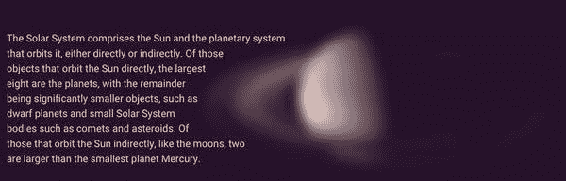

# 十一、前沿视觉效果

单独使用 CSS 对创造性的设计进行编码总是很困难。直到最近，这种语言本身在你可以使用的视觉效果方面还相当有限。从像 Photoshop 这样的图形编辑包中重新创建视觉效果是困难的，如果不是不可能的话，而且经常需要令人讨厌的黑客。

我们总是能够通过牺牲简单性(纯粹用于表示目的的额外元素)或性能(页面上图像太多，JavaScript 做不出视觉效果)来解决这些限制。

在这一章中，我们将看看如何使用各种 CSS 特性来实现这些效果。其中一些是非常新的，目前只支持有限的浏览器，而另一些已经存在了几年。许多已经在 SVG 中存在了很长时间，但只是现在才渗透到 CSS 中——我们将在本章的后面看到一些这种协调的例子。

所有这些技术都可以让你的设计更上一层楼:它们是将原材质提升到新高度的调味品。因此，应该谨慎使用它们，并在应用时考虑到逐步增强。您还应该意识到，这些技术中的许多都有相关的缺陷。因此，即使在支持它们的浏览器中，它们也经常是一项正在进行的工作。

在本章中，我们将探讨以下主题:

*   CSS 形状

*   通过 CSS 和 SVG 使用剪辑路径和蒙版

*   CSS 混合模式

*   使用 CSS 和通过 SVG 过滤

在图 11-1 中，我们拼凑了一个充满视觉效果的页面(描述一些天体)。就在几年前，这些效果在 CSS 中是不可能重现的。页面布局，如果曾经尝试过的话，将会用大量的图片和额外的元素重新创建。


###### 图 11-1。使用一系列视觉效果的页面

今天，这些类型的效果实际上可以在许多浏览器中用 CSS 来实现，如果它们失败了，可以让它们优雅地失败。在页面上同时使用大量的视觉效果仍然需要小心，因为它们会带来性能损失；有些比其他人多。尽管如此，将这些效果作为 CSS 的一部分还是有很大的好处。它们变得不那么依赖于粗糙的标记，并且更容易维护。此外，一旦功能在竞争浏览器中标准化，性能往往会随着时间的推移而变得更好。

在这一章的剩余部分，我们将会浏览在“观星”页面例子中使用的所有技术，以及更多。

## 打破常规:CSS 形状

正如我们之前说过的，网页布局都是关于矩形的，所以有一个内在的盒子。在前面的章节中，我们已经看到了如何通过使用图像和渐变来引入更有机的感觉，以及通过使用圆角来创建更柔和的形状甚至圆形来解决这个问题的例子。

CSS 形状是一个新的标准，允许在网页设计中使用更广泛的形状。形状元素影响页面中内容的实际流动，而不仅仅是表面外观。

### 内部和外部形状

CSS Shapes 由两组新属性组成:一组设置影响框内内容的形状，另一组设置影响形状元素周围内容流的外部形状。在图 11-2 中，一个元素被设置为圆形。左边的示例显示了外部形状如何影响围绕圆形流动的内容，而右边的示例显示了内部形状如何影响圆形内的内容。


###### 图 11-2。外部形状与内部形状

这两种形状方法是在 CSS 形状规范的不同层次中定义的。shape-outside 属性(在 CSS Shapes Level 1 中定义)是唯一一个已经达到合理成熟度的属性，并且已经开始进入浏览器。我们将 shape-inside 排除在这一部分之外，因为它还没有在任何浏览器中实现，但它很可能很快就会出现。

shape-outside 属性只对浮动元素有效。它的工作原理是雕刻出一个影响元素外部内容流动的形状，但它不会改变元素本身的外观。

在我们示例的“月亮”部分，文本通过 shape-outside 围绕月亮图像的形状流动(见图 11-3 ),如下所示:


###### 图 11-3。文字在月亮图像外呈圆形流动

```html
.fig-moon {
  float: right;
  max-width: 40%;
  shape-outside: circle();
}
```

在我们深入了解形状如何工作之前，值得注意的是形状外部如何影响布局。图像文件本身具有黑色背景。如果我们改变这部分页面的背景颜色，形状的效果会显示得更清楚(见图 11-4 )。图像本身仍然是一个正方形，但是文本在图像上*流动，围绕着图像内部的一个圆形。在不支持 CSS 形状的浏览器中，文本将正常围绕矩形流动。*


###### 图 11-4。文本流入已成形元素的元素边界

###### 注意

如图 11-4 所示，文字仅跟随浮动左侧的形状。您只能让形状影响一侧的行框，因此即使形状在自身右侧留出空间，文本也不会流到那里。

#### 形状函数

月亮图像的 shape-outside 属性的值为 circle()。有许多这样的*形状函数*:圆()、椭圆()、多边形()和插入()。除了 insert()之外，大多数都是不言自明的，insert()表示从盒子边缘插入的矩形，可以选择圆角。它基本上是旧 CSS 2.1 clip 属性的增强版本，但语法略有不同。

圆和椭圆的语法类似于我们在第五章中看到的调整和定位径向渐变的语法:

```html
.shape-circle {
  /* circles take 1 radius and a position value: */
**shape-outside: circle(150px at 50%);** 
}
.shape-ellipse {
  /* ellipses take 2 radii and a position value: */
**shape-outside: ellipse(150px 40px at 50% 25%);** 
}
```

就像梯度函数一样，圆和椭圆也有一些合理的默认值。月亮图像的 circle()值没有提供参数，这导致将圆形定位在元素的中心，并将半径扩展到最近的一侧。

inset()形状通过提供一个长度列表来工作，该列表表示从上、右、下和左边缘的距离，很像边距或填充简写。当提供一到三个值时，同样的边距或填充的缩短规则也适用。还可以通过添加 round 关键字，后跟与 border-radius 属性相同的半径值来提供圆角值:

```html
.shape-inset {
  /* shape the outside of the box 20px from
   * the top and bottom edges and 30px from
   * the left and right edges, with 10px
   * radius rounded corners.
   */
**shape-outside: inset(20px 30px round 10px);** 
}
```

一个更复杂的例子是使用 polygon() shape 函数。这使您可以为长方体表面上相对于左上角的点提供一个坐标对列表，并在它们之间绘制一条线，从而形成一个形状。列出的最后一个点连接到第一个点以闭合造型。在“行星”部分，我们已经根据土星的图像创建了一个多边形。

快速创建多边形的最简单方法是使用 CSS Shapes Editor 插件，该插件可用于 Google Chrome 和 Opera 开发工具([`github.com/oslego/chrome-css-shapes-editor`](https://github.com/oslego/chrome-css-shapes-editor))。Chrome 和 Opera 都支持形状，并在检查元素时提供形状预览。该插件增加了额外的工具，这样你既可以可视化一个形状如何影响页面，也可以通过创建和拖动控制点来创建新的控制点(见图 11-5 )。


###### 图 11-5。用谷歌浏览器的形状插件在土星图像上绘制的多边形

现在，我们可以将生成的多边形形状复制并粘贴到代码中:

```html
.fig-planet {
  float: right;
  max-width: 65%;
  shape-outside: polygon(41.85% 100%, 22.75% 92.85%, 5.6% 73.3%, 0.95% 52.6%, 5.6% 35.05%, 21.45% 17.15%, 37.65% 12.35%, 40% 0, 100% 0%, 100% 100%);
}
```

多边形上每个点的坐标在这里表示为百分比，以获得最大的灵活性，但您也可以使用其他长度，如像素、ems，甚至 calc()表达式。

#### 形状图像

基于复杂图像创建多边形可能会很繁琐。幸运的是，我们还可以基于图像透明度直接从图像源创建形状。我们可以用所需的轮廓形状创建一个单独的图像文件，但是 Saturn 图像已经是一个带有透明度的 PNG，所以我们可以用它来生成形状。我们需要做的就是将 shape-outside 值从 polygon()函数更改为指向图像的 url()函数:

```html
.fig-planet {
  float: right;
  max-width: 65%;
  shape-outside: url(img/saturn.png);
}
```

如果我们现在检查 Chrome 开发工具(DevTools)中的图像，如图 11-6 所示，我们可以看到图像中的透明度数据被拾取，生成了形状。


###### 图 11-6。图像透明部分的轮廓用于创建形状

###### 小费

如果您尝试在浏览器中直接打开 HTML 文件，即使浏览器支持 CSS 形状，也不会成功。您需要通过 web 服务器获取页面，以便引用的图像具有适当的 HTTP 头，将它描述为来自与 CSS 相同的源服务器。这是一些较新的浏览器中存在的安全权衡，以防止引用的文件对您的计算机做不安全的事情。

默认情况下，形状轮廓将从图像完全透明的轮廓生成，但是我们可以使用 shape-image-threshold 属性更改该值。默认值为 0.0(完全透明)，而较高的值(接近 1.0)意味着在创建形状边缘之前可以接受较高的不透明度值。例如，如果我们将土星图像更改为使用 0.9 的图像阈值，半透明环将不会包含在形状轮廓中，文本将会与它们重叠(参见图 11-7 ):


###### 图 11-7。使用形状-图像-阈值，图像的半透明部分现在在生成形状时会被忽略

```html
.fig-planet {
  float: right;
  max-width: 65%;
  shape-outside: url(img/saturn.png);
  shape-image-threshold: 0.9;
}
```

#### 异形框和页边距

除了使用形状函数或图像，我们还可以使用元素的参考框来生成形状。这一开始听起来可能很奇怪，因为这是我们想要摆脱的四方形，但形状也将遵循圆角。

例如，如果我们回到月亮的例子，我们可能希望改变该部分的背景颜色，但同时去掉图像周围的黑色方框，如图 11-8 所示。我们可以在图像上使用边界半径来创建圆形:


###### 图 11-8。将边界半径应用于月球图像

```html
.fig-moon {
  float: right;
  max-width: 40%;
**border-radius: 50%;** 
}
```

边界半径本身不会生成形状，但是我们可以告诉 shape-outside 属性使用现在的圆形边界框作为形状的参考:

```html
.fig-moon {
  float: right;
  max-width: 40%;
  border-radius: 50%;
**shape-outside: border-box;** 
}
```

外部形状现在回到圆形，跟随元素的边框。形状的其他可能的引用框值是内容框、填充框和边距框。我们以前见过引用框(具有类似框大小和背景剪辑的属性)，除了边距框。因为形状在浮动区域上操作，所以它们也可以包含边距，所以这个关键字对形状来说是特殊的——没有框大小:例如，边距框。

形状项目上的边界框也将遵循边界半径。这意味着我们可以对月亮图像使用普通的边距声明来在其周围创建一些空间:

```html
.fig-moon {
  float: right;
  max-width: 40%;
  border-radius: 50%;
  shape-outside: margin-box;
**margin: 2em;** 
}
```

文本现在将围绕弯曲的边距形状流动。如果我们在 Chrome DevTools 中检查该项目，我们将看到该形状的行为，以及原始的边距(见图 11-9 )。


###### 图 11-9。使用边界框作为形状参考，边界距离跟随圆角

如果我们想给土星图像更复杂的形状添加一个边距，有一个新的属性叫做 shape-margin 来设置整个形状周围的边距距离，而不管创建它的方法如何(见图 11-10 ):


###### 图 11-10。在土星图像形状上添加形状边距属性

```html
.fig-planet {
  max-width: 65%;
  shape-outside: url(img/saturn.png);
  shape-margin: 1em;
}
```

#### CSS 形状的浏览器支持

在撰写本文时，CSS 形状只能在较新的基于 WebKit 或 Blink 的浏览器中工作:Google Chrome、Opera 和 Safari 7.1+(或 iOS 8+上的 Mobile Safari)。

## 剪裁和遮罩

CSS Shapes 允许您改变元素形状周围的内容流，但不允许您改变元素本身的外观。我们看到，添加边框半径是视觉上塑造元素的一种方式。还有其他方法可以影响元素的形状，例如使元素的一部分透明。

*裁剪*使用路径形状来定义元素可见性完全打开和关闭的锐边。*蒙版*略有不同，用于设置元素区域的透明度。剪裁也会影响对象的撞击表面，而遮罩则不会。例如，只有当鼠标指针位于被裁剪元素的可见部分时，才会触发悬停效果。当您将鼠标悬停在被屏蔽的元素上时，无论鼠标指针下方的部分是否可见，any :hover 规则都将变为活动状态。

### 剪报

CSS 2.1 中首次引入了 clip，带有 clip 属性。然而，它只能用于绝对定位的元素，使用 rect()函数将它们裁剪成矩形。无聊！

幸运的是，新的 clip-path 属性允许我们以更令人兴奋的方式裁剪元素。它可以使用与 CSS 形状相同的基本形状函数来定义如何裁剪元素。我们还可以使用一个 SVG 文档来裁剪一个元素，通过一个 URL 引用其中的一个<clippath>元素。</clippath>

我们将从使用形状函数来查看版本开始。在撰写本文时，这个版本只能在基于 Blink 和 WebKit 的浏览器中工作，除了 prefix 属性之外，还需要一个-webkit-前缀。在接下来的例子中，为了简洁起见，我们将坚持使用标准的无前缀属性。

观星示例页面中的所有部分都被剪辑，以使它们稍微倾斜(见图 11-11 )。


###### 图 11-11。这一页的所有部分都被修剪过，以使它们稍微倾斜

每个部分都被赋予了类名 stacked，对于这个类名，我们添加了一个规则，将裁剪路径定义为多边形形状:

```html
.stacked {
  clip-path: polygon(0 3vw, 100% 0, 100% calc(100% - 3vw), 0% 100%);
}
```

这个多边形形状不像前面的土星形状那样复杂，这给了我们一个深入研究语法的机会。多边形中的每个点都表示为一对空格分隔的值，这些点用逗号分隔。

从左上角开始，我们从 x 轴上的 0 和 y 轴上的 3vw 开始剪辑。我们在这里使用相对于视口的单位来保持相对于视口大小的角度。下一个坐标对在元素的右上角，所以坐标对是 100% 0。下一个点是右下角的 3vw，不能用百分比表示，因为我们从顶部开始。这意味着我们需要将其计算为 100% - 3vw。最后，我们将最后一个点放在元素的左下角，0 100%。

由于剪辑路径只影响元素的渲染外观，而不影响页面的流动，因此被剪辑的元素之间现在会有透明的间隙(参见图 11-12 )。为了解决这个问题，我们可以为每个堆叠的元素应用一个负的边距，比我们裁剪掉的 3vw 距离稍大一些，这样部分就会重叠。我们只想在支持 clip-path 的浏览器中使用这个负边距，这给了我们一个使用@supports-rule 的绝佳机会。由于这些新的视觉效果只在最近的浏览器中实现，我们可以安全地用这种方式来定义它们。


###### 图 11-12。仅用剪贴，各部分之间会有间隙

```html
@supports ((clip-path: polygon(0 0)) or
           (-webkit-clip-path: polygon(0 0))) {
    .stacked {
        margin-bottom: -3.4vw;
    }
}
```

在@supports-block 中，我们测试了对由一个点组成的最小多边形形状的支持。

通过此修复，这些部分可以很好地堆叠起来，不支持 clip-path via 形状的浏览器可以获得没有重叠的正常直线部分。

#### 使用 SVG 剪辑源进行剪辑

您可以使用 polygon()、circle()、ellipse()和 inset()函数创建剪辑路径，就像在 CSS 形状中一样。对于更复杂的形状，使用图像编辑器创建它们，然后使用图形作为剪辑形状的源可能更容易。这就是我们对图 11-13 所示的页面导航中的形状所做的。


###### 图 11-13。导航部分中的复杂形状是从 SVG 源中截取的

为了实现这一点，我们需要使用 SVG 来创建我们的剪辑路径，然后使用这个*剪辑源*的 URL 引用来代替 shape 函数。首先，我们需要在 Illustrator、Sketch 或 Inkscape 等图形编辑程序中创建形状。这个过程没有想象中那么简单，但是可行的。

导航本身是一个包含页面内链接的无序列表:

```html
<nav class="stacked section nav-section inverted">
  <ul class="wrapper">
    <li><a href="#moon">The Moon</a></li>
    <li><a href="#sun">The Sun</a></li>
    <li><a href="#planets">Planets</a></li>
    <li><a href="#milky-way">Galaxy</a></li>
    <li><a href="#universe">Universe</a></li>
  </ul>
</nav>
```

我们将把导航样式的细节排除在这个例子之外；简单地说，我们使用 flexbox 来水平放置项目，并以默认字体大小将它们调整为 100×100 像素的正方形。

接下来，我们在支持 SVG 的图形编辑器中创建一个图像，在本例中是 Adobe Illustrator。图像尺寸也被设置为 100×100 像素(参见图 11-14 )。我们通过创建两个黑色形状来绘制行星:一个圆形和一个旋转的省略号。接下来，我们将图形保存为一个名为 clip.svg 的 SVG 文件，这个过程在不同的图形编辑软件之间有所不同；我们将省略这方面的细节，并将重点放在一般的工作流程上。


###### 图 11-14。在 Illustrator 中创建行星形状

如果我们现在在代码编辑器中打开 SVG 文件，它看起来会像这样:

```html
<svg xmlns=http://www.w3.org/2000/svg width="100px" height="100px" viewBox="0 0 100 100">
  <circle cx="50" cy="50" r="45"/>
  <ellipse transform="matrix(-0.7553 0.6554 -0.6554 -0.7553 -12.053 54.99)" cx="50" cy="50" rx="63.9" ry="12.8"/>
</svg>
```

为了将这个图像转换成一个剪辑路径，我们需要将内容包装在一个<clippath>元素中，并给这个元素一个 ID:</clippath>

```html
<svg 
     width="100px" height="100px" viewBox="0 0 100 100">
**<clipPath id="saturnclip">** 
    <circle cx="50" cy="50" r="40.1"/>
    <ellipse transform="matrix(0.7084 -0.7058 0.7058 0.7084 -20.7106 49.8733)" cx="50" cy="50" rx="62.9" ry="12.8"/>
**</clipPath>** 
</svg>
```

我们终于准备好引用 CSS 中 clip.svg 文件内部的剪辑路径了:

```html
.nav-section [href="#planets"] {
    clip-path: url(img/clip.svg#saturnclip);
}
```

使用这种技术，您可以在一个 SVG 文件中保存许多剪辑源，并通过它们在 URL 片段中的 ID 来引用它们。

可悲的是，为了使 SVG 剪辑源可靠地工作，浏览器的当前状态留下了两个需要克服的主要障碍:

*   到目前为止，只有 Firefox 允许将外部剪辑源应用于 CSS 中的 HTML 内容——其他浏览器最终可能会效仿。

*   SVG <clippath>中的坐标被解释为像素，因此剪辑形状是不灵活的，不会随着它所应用的 HTML 内容而调整大小。测量中的百分比在技术上是有效的，但缺乏支持。</clippath>

这些障碍都有解决方案，但是它们需要对我们的代码进行一些轻微的重组。

#### 内嵌 SVG 片段源

不支持外部剪辑源引用的浏览器*允许使用 SVG 剪辑路径，只要 CSS、HTML 和 SVG 都在同一个文件中。*

如果将 CSS 放在与内容内联的

```html
<!-- Here's the element we want to clip -->
<li><a href="#planets">Planets</a></li>

<style>
/* in the same HTML file, we put the CSS for the clip-properties */
.nav-section [href="#planets"] {
  clip-path: url(img/clip.svg#saturnclip);
}
</style>
<!-- Still in the same HTML file, the clipping path inline as SVG -->
<svg xmlns=http://www.w3.org/2000/svg height="0" viewBox="0 0 100 100">
  <clipPath id="saturnclip">
    <circle cx="50" cy="50" r="40.1"/>
    <ellipse transform="matrix(0.7084 -0.7058 0.7058 0.7084 -20.7106 49.8733)" cx="50" cy="50" rx="62.9" ry="12.8"/>
  </clipPath>
</svg>
```

前面的技术为我们提供了稍微好一点的跨浏览器支持，但代价是牺牲了在一个外部 SVG 文件中包含所有剪辑路径的可重用性，以及不必在 HTML 中乱搞。

###### 注意

基于 WebKit 的浏览器有一个缺陷，裁剪路径的位置坐标从页面的左上角开始，而不是相对于元素。为了使它们正确定位，最后一个示例还在被剪辑的项目上使用了 transform: translate(0，0 ),这在视觉上没有任何作用，但修复了问题。

#### 使用对象边界框来调整剪辑路径的大小

下一个问题是，剪辑路径不会随着导航项目的大小而调整大小；它具有 100×100 像素的硬编码大小。

我们可以使用两个坐标系来确定裁剪路径的大小。缺省值称为“使用中的用户空间”，意思是应用剪辑路径的内容的坐标系。在我们的例子中，这意味着剪辑路径中的一个单元被解释为被剪辑的 HTML 内容中的一个 CSS 像素。

另一个坐标系称为“对象边界框”，它使用一个单位相对于被剪切内容大小的比例。在此比例中，x 轴上的值 0 表示剪辑内容边框的左边缘，1 表示右边缘。同样的，0 是 y 轴上盒子的顶部，1 是底部。

对于较简单的图形，您可以手动更改这些值——在我们 100×100 像素的图像中，值 50 会变成 0.5，依此类推——但是对于较复杂的图形，这太容易出错了。更简单的解决方案是在导出 SVG 之前，在图像编辑软件中将图形大小调整为 1×1 像素。

在最后一个示例中，我们将 objectBoundingBox 值用于内嵌 SVG 剪辑路径。对于 Saturn 剪辑路径，最终代码如下所示:

```html
<clipPath id="saturnclip" **clipPathUnits="objectBoundingBox"**>
  <circle cx="**0.5**" cy="**0.5**" r="**0.45**"/>
  <ellipse transform="matrix(-0.7553 0.6554 -0.6554 -0.7553 **1.2053 0.5499**)" cx="**0.5**" cy="**0.5**" rx="**0.639**" ry="**0.125**"/>
</clipPath>
```

#### 浏览器对剪辑路径的支持

使用内嵌 SVG 方法裁剪路径，您可以针对大多数现代浏览器:Chrome、Opera、Safari 和 Firefox 都支持这个版本。基于 WebKit 和 Blink 的浏览器也支持裁剪路径的基本形状功能。可悲的是，IE 根本不支持裁剪路径。在撰写本文时，Edge 也缺少支持，但它已经在路线图上，很可能很快就会添加进来。在撰写本文时，SVG 剪辑源的外部引用只能在 Firefox 中使用，但预计在不久的将来可以在其他地方使用。

### 掩饰

“观星”页面页眉中的标题似乎在地球图形“大气层”的后面(见图 11-15 )。这种逐渐透明是通过掩蔽实现的。


###### 图 11-15。*“观星”标题被渐变蒙版图像所掩盖*

Safari 早在 2008 年就实现了屏蔽，使用了一个名为- webkit-mask-image 的非标准属性。此属性允许您拍摄图像并将其用作被遮罩元素透明度级别的来源。这是基于蒙版中每个像素的 *alpha 等级*:透明程度。当遮罩图像完全透明时，被遮罩的元素也将完全透明。相反，遮罩的完全不透明部分将使被遮罩的元素完全可见。遮罩的颜色值是不相关的，因此最常见的方法是使用灰度图像来进行遮罩。

除了创建图像文件，我们还可以使用 CSS 渐变来创建遮罩。这正是我们在标题中所做的:

```html
.header-title {
  mask-image: radial-gradient(ellipse 90% 30% at 50% 50%,
                              rgba(0,0,0,0) 45%,
                              #000 70%);
  mask-size: 100% 200%;
}
```

您将认识到语法:遮罩图像的声明与背景属性的声明非常相似。例如，mask-image 属性在语法上就像背景图像一样工作；您甚至可以在彼此之上声明多个遮罩图像。

除了选择遮罩图像，您还可以指定大小和位置。在这个例子中，我们选择使用两倍高度的蒙版图像，以将其放置在文本的底部，而不是放置在那里。如果我们简单地向下移动渐变图像，蒙版图像表面的顶部将是透明的，这将掩盖掉文本的顶部。图 11-16 展示了渐变遮罩在文本上的大小和位置。


###### 图 11-16。遮罩图像，就像它是文本顶部的图像一样

自从最初的 WebKit 实现以来，遮罩属性正在被标准化和扩展，并与相应的 SVG 效果相协调。是的，没错:就像 clip-path 一样，屏蔽存在于 SVG 中，并且也适用于 HTML 内容。

在撰写本文时，基于 WebKit 和 Blink 的浏览器提供了对 alpha 透明遮罩图像的前缀 webkit-mask-properties 的支持。除了 Firefox，它们还支持 SVG <mask>源。除了 Firefox，所有的都需要我们看到的裁剪路径的内联方法。</mask>

```html
.header-title {
  /* inline CSS, pointing to an inline SVG <mask> element */
  mask: url(#ellipseMask);
}
```

我们创建的 CSS 渐变的 SVG 等价物如下所示:

```html
<mask id="ellipseMask" maskUnits="objectBoundingBox" maskContentUnits="objectBoundingBox">
  <radialGradient id="radialfill" r="0.9" cy="1.1">
    <stop offset="45%" stop-color="#000"/>
    <stop offset="70%" stop-color="#fff"/>
  </radialGradient>
</mask>
```

就像裁剪路径一样，我们需要使用从 0-1 的 objectBoundingBox 坐标系来根据元素的边界调整蒙版表面的大小。SVG 遮罩还具有附加的 maskContentUnits 属性，该属性在这里为遮罩形状设置相同的坐标系。

SVG 蒙版源使用蒙版的亮度值，而不是 alpha。这意味着被遮罩的元素在遮罩较暗的地方是透明的，在遮罩较亮的地方是不透明的。在前面的 SVG 遮罩示例中，我们使用了从黑到白的渐变。

浏览器会自动假设您使用 alpha 遮罩来遮罩图像源，如果指向 SVG 源，则使用亮度遮罩。对于建议的标准版本，您可以使用 mask-type 属性在它们之间切换。

带-webkit 前缀的版本和提议的屏蔽标准之间还有一些进一步的区别。有关 WebKit 实现的属性和语法的完整列表，请参考 MDN 文档([`developer . Mozilla . org/en-US/docs/Web/CSS/-WebKit-mask`](https://developer.mozilla.org/en-US/docs/Web/CSS/-webkit-mask))。

### 带 SVG 遮罩的透明 JPEGs

页眉在两个地方使用了遮罩，其中一个比另一个更难被发现。标题本身使用了蒙版文字，但地球的背景图像(取自阿波罗探险队)实际上有它自己的蒙版。

这张图片是一张分辨率相当高的照片，标题有一个漂亮、平滑的渐变背景。在图 11-17 中，我们已经移除了文本，并稍微减轻了渐变，这样结果更加清晰可见。


###### 图 11-17。有地球照片的页眉

通常使用 PNG 图像来获得具有烘焙透明度的照片图像。PNG 的缺点是文件太大——作为 PNG，地球图像大约有 190 KB。在这项技术中，我们将使用 SVG 的强大功能，通过遮罩将 alpha 透明度应用于 JPEG 文件。结果文件大约为 24 KB。

#### SVG 中的图像

我们需要做的第一件事是创建一个普通的 JPEG 图像，背景仍然在那里，如图 11-18 所示。


###### 图 11-18。JPG 照片

接下来，我们创建一个名为 earth.svg 的 SVG“包装器”文件来加载位图图像。SVG 主要是一种矢量格式，但是您可以通过元素加载和使用 SVG 文件中的位图图像。我们最终将使用这个 SVG 文件作为 CSS 中的标题背景图片。

我们将使用 viewBox、width 和 height 属性将 SVG 图形调整到与位图图像相同的尺寸。viewBox 属性负责设置图像内部的坐标系，而 width 和 height 属性用于设置图像外部的尺寸。大多数浏览器不需要后者，但 IE 有一个缺陷，如果这两个缺失，就会扭曲 SVG 背景图像。

代码看起来像这样:

```html
<svg  width="1200" height="141" viewBox="0 0 1200 141" xmlns:xlink="http://www.w3.org/1999/xlink">
  <image width="100%" height="100%" xlink:href="earth.jpg" />
</svg>
```

#### SVG 遮罩

接下来，我们需要创建遮罩。对于这个形状，我们可以用一个径向梯度，我们将确定它的大小和位置，以覆盖图像中地球的地平线。径向渐变在边缘有轻微的透明度。挑选出正确的坐标有点困难，但是我们可以通过使用图形编辑器使这变得更容易。在图 11-19 中，我们在 Adobe Illustrator 中的位图图像上画了一个巨大的半透明圆圈，以便快速获得一些测量值。我们也可以绘制一条路径来创建遮罩形状，但是径向渐变给了我们一个更平滑边缘的可能性。这只是一份一次性文件，用来提供正确的数字。


###### 图 11-19。我们在照片上画了一个巨大的圆圈，以快速找出蒙版坐标

原来，渐变需要具有大约 1224 像素的半径，并且定位在 y 轴上的 1239 像素和 x 轴上的 607 像素。然后，我们在 earth.svg 文件中创建一个 SVG <mask>元素，它由一个覆盖整个 SVG 视口的矩形组成，用径向渐变填充。</mask>

```html
<mask id="earthmask">
  <radialGradient gradientUnits="userSpaceOnUse" id="earthfill" r="1224" cx="607" cy="1239">
    <stop offset="99.5%" stop-color="#fff"/>
    <stop offset="100%" stop-color="#000"/>
  </radialGradient>
  <rect width="1200" height="141" fill="url(#earthfill)" />
</mask>
```

渐变色标从白色到黑色，边缘有轻微羽化。请注意，渐变维度的工作方式与剪辑路径相反，因为它们的大小默认情况下是根据 objectBoundingBox 维度来调整的。因此，我们还需要添加 gradientUnits="userSpaceOnUse "。

我们现在可以使用我们创建的遮罩来指向图像:

```html
<mask id="earthmask"><!-- mask content here --></mask>
<image width="100%" height="100%" xlink:href="earth.jpg" **mask="url(#earthmask)"** />
```

#### 内嵌图像

此时，如果我们要将它作为独立的 SVG 图形使用，我们的文件就可以完成了。问题是 SVG 背景图片无法加载其他资源。因此，最后一步是将位图图像(earth.jpg)转换为 Base64 编码的数据 URI。有很多工具和服务可以让你做到这一点，比如 http://duri . me——只需到那里拖放图像文件就可以得到文本字符串。

最后，我们将 SVG 中的图像文件引用换成编码字符串:

```html
<image width="100%" height="100%" mask="url(#earthmask)" xlink:href="data:image/jpg;base64,/9j/4AAQSkZ..." />
```

注意，这个字符串可能很长。与二进制图像文件相比，Base64 编码增加了大约 30%的文件大小，但是由于原始 JPEG 文件大约为 18KB，所以我们总共得到 24 KB。

现在，我们终于准备好应用这个 SVG 图像作为标题背景，以及渐变:

```html
.page-header {
  background-image: url(img/earth.svg),
                        linear-gradient(to bottom, #000, #102133);
  background-repeat: no-repeat;
  background-size: 100% auto, cover;
  background-position: 50% bottom;
}
```

这种技术可以在几乎所有支持 SVG 的浏览器中工作，但 IE9 和一些完全不支持 SVG 屏蔽的旧版本 Android 除外。

#### 自动化技术

创建这个背景图片需要大量的工作，但是与透明的 PNG 相比，我们确实把文件大小缩小到了原来的十分之一。对于这个形状，径向渐变很好地完成了遮罩的功能，尽管需要一些手工操作。

对于更复杂的形状，有一个非常方便的 web 服务可以帮你做到这一点，叫做 ZorroSVG (mask，明白吗？).在[`quasimondo.com/ZorroSVG/`](http://quasimondo.com/ZorroSVG/)，你可以上传一个透明的 PNG，它会吐回一个蒙版的 SVG，里面有一个 JPEG。缺点是，它将透明数据转换为位图蒙版，与将其绘制为 SVG 形状相比，会占用一些额外的空间。即便如此，你仍然有可能用这种技术获得大量的节省。

## 混合模式和合成

在 Photoshop、Sketch 或 Gimp 等图形编辑应用程序中，设计人员很早就可以在将设计元素叠加在一起时选择颜色的混合方式(见图 11-20 )。在 CSS 中，我们最近才被赋予对 *alpha* 混合的适当控制:透明 PNG 文件形式的常规透明度、rgba 背景颜色、不透明属性、遮罩等。不用说，设计师们希望看到与他们在图形编辑应用程序中使用的 CSS 相同的混合模式。在合成和混合标准中，这一天终于到来了。


###### 图 11-20。在 Adobe Photoshop 中混合图层

*合成*是将图像图层合并在一起的技术术语。混合模式可能是最常见的合成方式。如果你以前没有使用过混合模式，或者没有考虑过它们是什么，它们都代表了将一个图像(称为*源*)的颜色值组合到另一个图像(称为*目的地*)之上的不同数学方法。

最简单的例子可能是“乘法”混合模式，其中源像素的每个颜色通道值与其后面像素的值相乘，从而产生更暗的图像。这有助于从灰度的角度来考虑这个例子，颜色从 0(黑色)到 1(白色)。如果源为 0.8，目标为 0.5，则结果像素的颜色值将为 0.8 × 0.5 = 0.4。

### 给背景图像着色

另一个例子是“光度”混合模式。它从光源获取亮度级别，并将它们应用到目标的色调和饱和度。我们的示例页面中的“银河系”部分有一个背景图像，带有一些相当鲜明的蓝色调。我们通过应用略带紫色的背景颜色，然后应用背景混合模式:亮度，对其进行了微调(见图 11-21 )。这将为图像着色，并为其提供更均匀的颜色范围。


###### 图 11-21。用亮度混合模式给背景图像着色

```html
.section-milkyway {
  background-image: url(img/milkyway.jpg);
**background-color: #202D53;** 
**background-blend-mode: luminosity;** 
}
```

###### 注意

如果你正在用黑白打印或单色电子阅读器阅读这篇文章:对不起！在这种情况下，很难展示色彩效果。您可以在书中的示例文件中找到工作代码。

如果不了解颜色数学，很难解释全部 16 种混合模式的作用。它们中的大多数只在某些情况下有用，比如光度允许你通过混合纯色层给图像着色。在图 11-22 中，我们将相对深蓝色的背景图像与浅粉色的背景颜色混合，向您展示当两个图层存在夸大的差异时每个模式的效果。


###### 图 11-22。16 种混合模式

如果你想更深入地了解每种模式是如何工作的，我们推荐派尔·吉尔萨([`www.slrlounge.com/school/photoshop-blend-modes/`](http://www.slrlounge.com/school/photoshop-blend-modes/))的文章和视频《理解混合模式的终极视觉指南》。

正如我们在第五章中所讨论的，每个元素可以有多个背景图像，并且背景按照它们被声明的相反顺序堆叠在一起。背景色位于这一叠背景层的底部。如果您有多个图像层，您可以声明一个逗号分隔的背景混合模式列表，依次应用于每个层及其下面的层。

请注意，无论背景透明度如何，背景图层都不会与元素本身后面的内容混合在一起。你不能为一个单独的背景颜色层设置背景混合模式——混合元素是通过一个单独的属性来实现的，我们将在下一步解决这个问题。

### 混合元素

就像你可以混合背景层一样，你也可以混合*元素*和它们的背景。这意味着一个静态定位的子元素与其父元素混合，或者类似于一个绝对定位的元素覆盖了页面的另一部分。需要注意的是，不同堆栈环境中的元素不会相互融合；我们稍后将进一步研究这种影响。

语法与其背景对应物完全相同，但该属性被称为 mix-blend-mode。Saturn 图像使用屏幕混合模式来更好地适应页面部分的背景颜色(参见图 11-23 )。


###### 图 11-23。土星图像使用屏幕混合模式来更好地适应背景

```html
.fig-planet {
  mix-blend-mode: screen;
}
```

屏幕混合模式是另一种更直接有用的模式。它得名于在同一个屏幕上投影两个图像到另一个之上，从而产生一个整体更亮的图像。在一个图像“发光”较少(即较暗)的情况下，来自第二个图像的任何光都会透过，反之亦然，从而生成整体较亮的图像。

这意味着白色源部分将完全不透明，但黑色源部分变得透明，这使它成为一种有用的遮罩技术。我们可以用它来制作一些有趣的“挖空文本”效果。

#### 带有挖空文本的排版锁定

这种透视效果正是我们在示例页面的“可观察宇宙”部分标题中所做的，如图 11-24 所示。


###### 图 11-24。使用屏幕混合模式的“印刷锁定”

文本位于图像顶部的白色背景上。这也是有时所谓的“排版锁定”的一部分，通过调整文本的大小或间距，使文本完全适合容器。CSS 使得这种效果有点棘手。它将与视口相关的单位一起工作，但即使是那些也有其缺点；例如，由于相对于视口的单元不相对于元素本身，我们需要在最大断点处锁定它们。

相反，该示例使用 SVG 文本来实现相对于元素大小的流畅文本大小调整。标题的标记包含一段 SVG:

```html
<h2 class="universe-title">
  <svg viewBox="0 0 400 120" role="presentation">
    <text>
      <tspan class="universe-span-1" x="6" dy="0.8em">The Observable</tspan>
      <tspan class="universe-span-2" x="3" dy="0.75em">Universe</tspan>
    </text>
  </svg>
</h2>
```

SVG 文本本身是一个复杂的主题，但是要快速注意代码在做什么:

*   SVG 文本更像图形对象，而不像 HTML 内容那样流动。换行符不是自动的，所以每一行都需要用一个<tspan>元素包装起来，并用手定位。</tspan>

*   每个<tspan>都是水平放置的，x 属性相对于 SVG 视窗的左边缘。</tspan>

*   文本从行框的*底部*垂直放置。如果我们想保持大小的灵活性，我们需要垂直放置每一行，相对于它的大小有一个偏移量，作为一种行高。这就是 dy 属性的用途。

*   理论上，内联 SVG 中的文本对于屏幕阅读器来说应该是完全可访问的。实际上，一些辅助技术存在问题，但是添加 role="presentation "应该可以最大化可访问性。

由于<svg>内嵌在我们的 HTML 中，我们可以在普通的 CSS 中设计它的样式。请注意，SVG 中的文本颜色是由 fill 属性而不是颜色控制的。</svg>

```html
.universe-span-1 {
    font-size: 53.2px;
}
.universe-span-2 {
    font-size: 96.2px;
}
.universe-title text {
    fill: #602135;
    text-transform: uppercase;
}
```

每个<tspan>元素的大小由像素决定，以精确填充空间。需要注意的是，像素大小是相对于 SVG 片段的坐标系的，而不是 HTML。这意味着随着页面调整 SVG 的大小，文本的字体大小也随之调整，保持锁定不变。</tspan>

为了保持<svg>元素本身在不同浏览器中的大小一致，我们使用了我们在第 <a xmlns:xsi="http://www.w3.org/2001/XMLSchema-instance" href="05.html" class="pcalibre pcalibre3 calibre3 pcalibre1 pcalibre2">5 章</a>中看到的相同的纵横比。有关这方面的完整细节，请参见示例代码。然后，整个标题绝对位于图像的顶部。</svg>

最后，我们将混合模式添加到标题中:

```html
@supports (mix-blend-mode: screen) {
  .universe-title {
    mix-blend-mode: screen;
  }
    .universe-title text {
        fill: #000;
  }
}
```

SVG 中的文本最初是用暗红色设计的，这种颜色与它后面的图像的整体颜色很协调。对于不支持 mix-blend-mode 的浏览器来说，这是一种备用方案(见图 11-25 )。在@supports 规则中，我们设置了混合模式，但也将文本的填充颜色更改为黑色，使其完全透明。


###### 图 11-25。IE9 中出现的标题，不支持 mix-blend-mode。尽管如此，SVG 大小调整工作得很好，即使是在这个较旧的浏览器中

一般来说，考虑到渐进增强，混合模式并不难应用。影响通常是微妙的，当我们做更剧烈的改变时,@supports 规则会有所帮助。元素的混合模式适用于最新版本的 Chrome、Opera 和 Firefox，以及 Safari(Mac 上的 7.1 版本和 iOS8 的移动 Safari 版本)。然而，Safari 缺少对亮度、色调和颜色混合模式的支持。在撰写本文时，IE、Edge、Opera Mini 和 Android WebKit 浏览器都缺乏支持。

#### 隔离

除了混合模式，我们可以用 CSS 控制的另一个合成方面是*隔离*。实际上，这意味着创建在组内融合但不在组外融合的元素组。我们之前提到过，不同堆叠环境中的元素(见第三章)不会融合在一起。

在图 11-26 中，我们有两个应用了多重混合模式的一组项目的例子。每组坐在有图案的背景上。在左边的例子中，混合模式不是孤立的，所以单个元素也与背景混合。在右边的示例中，图形的不透明度设置为 0.999，这将强制一个新的堆叠上下文并隔离混合。


###### 图 11-26。左边的组一直融合到背景中，但是右边的组是孤立的

```html
.item {
  mix-blend-mode: multiply;
}
.group-b {
    opacity: 0.999;
}
```

“B 组”中的项目相互融合，但不与背景融合。

我们可以使用新的隔离属性创建新的堆叠上下文(从而隔离组),而不会破坏不透明度。通过以下改变可以获得与上述相同的结果:

```html
.group-b {
**isolation: isolate;** 
}
```

## CSS 中的图像处理:滤镜

现代 CSS 的下一个工具也是直接来自图像编辑软件:对元素应用图形过滤器。过滤器应用于整个元素及其子元素。这有点像对页面的一部分进行截图，然后像在 Photoshop 中一样调整图像的各个方面。(事实上，这个类比与浏览器实际上是如何实现这些东西的相差不远——我们将在第十二章回到这个话题。)过滤器在基于 WebKit 和 Blink 的浏览器中可用，如 Safari、Chrome 和 Opera，以及 Firefox 和 Edge，因此支持相当广泛。有十种不同的过滤器可用，加上在 SVG 中定义自己的过滤器的能力。我们将从浏览 CSS 中可用的预定义过滤器开始。

### 可调颜色处理滤镜

滤镜允许您将一种或多种效果按顺序应用到元素。其中一些是更通用的颜色处理滤镜，允许你调整亮度、对比度、饱和度等。下面的代码片段应该是非常自我描述的(结果见图 11-27 ):


###### 图 11-27。应用了一系列过滤器的“Universe”标题

```html
.universe-header {
  filter: grayscale(70%) brightness(0.7) contrast(2);
}
```

我们已经将元素的饱和度降低了 70%,使其完全变成灰度，然后将亮度从 1(正常亮度)降低到 0.7，最后将对比度调高到正常值的两倍。

大多数过滤器可以采用百分比或数字值。对于可以上下变化的值，如对比度()、亮度()和饱和度()，默认值为 100%或 1。对于灰度()、反转()和棕褐色()，默认值为 0，接近 100%或 1。任何高于该值的值都被限制为最大值。

还有一个不透明度()滤镜，默认值为 1(或 100%)，取值低至 0。此滤镜和 opacity 属性之间的区别在于，根据滤镜在滤镜链中的添加位置，滤镜可能会有不同的结果。相比之下，不透明度属性总是在应用所有滤镜后应用。我们将在本章的后面重新讨论应用的顺序。

最后，有几个过滤器的工作方式稍有不同，我们将使用“观星”页面中的示例分别检查它们。

#### 色调旋转

太阳及其黑子的图像实际上是一张黑色背景的灰度照片。这不是最令人愉快的照片，在大多数情况下，你甚至会在把它放在页面上之前打开图像编辑器——你应该这样做，因为这可能是最好的执行路线。为了说明过滤器是如何工作的，让我们假设我们根本不能访问图像，只能访问 CSS。就像我们之前给背景图像着色一样，我们要给太阳图像着色，让它稍微亮一点。图 11-28 显示了没有应用任何滤镜的图像。


###### 图 11-28。太阳的原始天文照片。不太闪亮

hue-rotate()滤镜允许我们根据标准色轮将图像的所有色调旋转一定的角度。明亮的黄色位于大约 40 度(从顶部开始)在这个轮子上，所以色调旋转(40 度)应该做到这一点。问题是，图像是灰度的，所以没有色调，色调旋转不会有任何影响！

为了解决这个问题，我们可以使用一个包含另一个过滤器的技巧。sepia()滤镜已经用位于色轮上大约 30 度的褐色色调给图像着色。然后，我们可以将它与大约 10 度的色调旋转链接在一起，得到正确的黄色细微差别。最后，我们需要降低对比度，提高亮度一点，让太阳发光。这需要在色调操作之前*完成；否则黄色会变得太淡。记住，过滤器是按顺序应用的。*

```html
.fig-sun {
  filter: contrast(0.34) brightness(1.6) sepia(1) hue-rotate(10deg);
}
```

接下来，我们用之前提到的 SVG 蒙版技术将黑色背景蒙版掉，得到图 11-29 中的结果:


###### 图 11-29。应用了遮罩的过滤日光图像

```html
.fig-sun {
  filter: contrast(0.34) brightness(1.6) sepia(1) hue-rotate(10deg);
  mask: url(#circlemask); /* points to a circular SVG mask we created */
}
```

#### 裁剪形状上的阴影

我们要看的下一个滤镜是投影()。这个滤镜非常类似于框阴影和文本阴影属性，但是它有一些限制和额外的技巧。

当框阴影应用于元素的矩形边框形状时，drop-shadow()滤镜应用于元素的透明轮廓。这包括将阴影放在具有 alpha 透明度的图像上，并使它们跟随图像的轮廓，或者将阴影添加到使用 clip-path 成形的元素。

在观星页面的导航菜单中，项目被裁剪成不同的形状，然后用投影()过滤(结果见图 11-30 )。语法看起来与 text-shadow 属性完全一样:它包括 x 和 y 偏移、模糊半径和颜色。这意味着我们在 box-shadow 中找到的 spread 参数在这里丢失了。


###### *图 11-30* *。导航菜单项在其剪辑形状周围有投影效果。向右，一个悬停或聚焦的元素得到一个较亮的阴影，产生一个光晕效果*

```html
.nav-section li {
  filter: **drop-shadow(0 0 .5em rgba(0,0,0,0.3))**;
}
```

CSS 滤镜效果在可用时使用专用图形芯片。这使得 drop-shadow()过滤器具有惊人的性能。例如，在制作阴影动画时，使用滤镜版本可能比使用方框阴影版本更好。在第十二章中，我们将深入开发工具，看看如何测量 CSS 属性对渲染的影响。我们要讨论的下一个效应对性能的影响就不那么好了。

#### 模糊滤镜

blur()滤镜对元素应用高斯模糊。您为它提供一个长度设置模糊半径扩散的距离。在图 11-31 中，我们在示例页面的土星图像上设置了 10px 的模糊半径:



###### 图 11-31。模糊了土星的图像

```html
.fig-planet {
  filter: blur(10px);
}
```

至少在当前的实现中，blur()过滤器往往是一个性能猪，所以要明智地使用它。这有点遗憾，因为模糊可以产生一些有趣的动画效果。当在界面中引导注意力，或者淡化背景中的某些东西时，模糊和聚焦是一种有效的工具。

#### 背景滤镜

说到背景，还有一些地方过滤器已经潜入了 CSS。在示例页面的“银河”部分，我们使用了 2 级滤镜效果规范中的一个实验属性:背景滤镜。

它的工作方式与 filter 属性完全一样，但是它将滤镜应用于元素背景与其后面的页面的合成中。这使我们能够做一些漂亮的“毛玻璃”效果，例如(见图 11-32 )。


###### 图 11-32。对半透明元素后面的背景应用背景模糊

```html
.section-milkyway .section-text {
  backdrop-filter: blur(5px);
  background-color: rgba(0,0,0,0.5);
}
```

到目前为止，这个属性只在最近的基于 WebKit 的浏览器中实现，如 Safari 9(as-WebKit-background-filter)和 Google Chrome 中的一个标志后面。

#### 使用图像过滤功能过滤背景图像

滤镜效果规范还规定了在 CSS 中加载图像时可以使用滤镜。要过滤背景图像，您可以通过 filter() *函数*运行它。该函数使用与滤镜*属性*相同类型的滤镜链，但在加载图像时使用。图像是第一个参数，滤镜链是第二个参数。

例如，我们可以改变背景图像的不透明度并将其变为灰度(见图 11-33 ):


###### 图 11-33。一个组件，我们已经改变了背景的不透明度，并把它完全灰度化

```html
.figure-filtered {
  background-image: filter(url(img/saturn.png), grayscale(1) opacity(0.4));
}
```

坏消息是浏览器支持。在撰写本文时，只有 WebKit browser 的最新实验版本支持这一功能。出于某种原因，所有其他实现了过滤器的浏览器都忽略了图像过滤器功能。

###### 注意

Safari 9 确实有一个带前缀(且未记录)的 filter()函数版本，但它被严重破坏了，因为背景无法正确调整大小。因此，不要在这个属性上使用-webkit-前缀。

### 高级过滤器和 SVG

在像 Instagram 这样的照片应用程序中，你可以对图像应用预先合成的滤镜，通常是通过结合颜色叠加和我们迄今为止在速记滤镜功能中看到的一些操作。开发人员和设计师乌娜·克拉韦茨将 Instagram 滤镜合并成一个小型 CSS 库([`una.im/CSSgram/`](http://una.im/CSSgram/))，在这里巧妙地使用伪元素、CSS 渐变和混合模式来创建颜色叠加(见图 11-34 )。


###### 图 11-34。CSSgram 库中一些过滤器的屏幕截图

CSS 滤镜最强大的一个方面是，我们可以使用 SVG 来创建这样的自定义滤镜，实际上对滤镜效果的复杂性没有限制，并且只需要较少的 CSS 工作。

CSS 版本的过滤器最初是作为 SVG 中的过滤器出现的。如同本章中的大多数其他视觉效果一样，它们开始渗透到 HTML 中。第一个浏览器是 Firefox，它允许我们对 HTML 内容应用简单的 SVG 过滤器，使用我们见过的裁剪和遮罩技术。然后是 2011 年由 Adobe、Apple 和 Opera 编写的 CSS 滤镜规范，该规范将 SVG 滤镜捆绑成我们目前看到的易用的“速记”滤镜功能。

事实上，所有 CSS 过滤器函数都是根据它们的 SVG 对应物来定义的。比如一个滤镜:灰度(100%)；声明对应于这个 SVG 过滤器:

```html
<filter id="grayscale">
  <feColorMatrix type="matrix"
    values=".213 .715 .072 0 0
            .213 .715 .072 0 0
            .213 .715 .072 0 0
            0 0 0 1 0" />
</filter>
```

前面的滤镜声明只包含一个*滤镜原语*，由一个“颜色矩阵”滤镜效果元素(< feColorMatrix >)表示。颜色矩阵滤镜是一个非常通用的工具，允许您以各种方式将输入颜色映射到输出。确切地知道每个值做什么并不重要，但关键是灰度本身并不是一个低级的东西，而是一个通用颜色处理的结果——至少就 SVG 而言是这样。

还有其他几种滤镜原语，大多数效果都是组合几种的结果。例如，投影()滤镜由滤镜基元高斯模糊、偏移、泛光、合成和合并组成。

现在，有趣的部分是，我们可以创作自己的 SVG 过滤器并将其应用于 HTML 内容。这意味着我们可以自由地创建尽可能复杂的过滤器，只要我们在 SVG 中定义它们并将其作为过滤器的来源。这是通过过滤器声明中的 url()函数符号来完成的，就像屏蔽和剪辑一样。为了显示稍微复杂一点的东西，在图 11-35 中，我们从 SVG 的 CSSgrams 中重新创建了“1977”过滤器。


###### 图 11-35。左边是原始图像，右边是过滤后的图像

在 CSSgram 版本的滤镜的原始代码中，有三个滤镜操作:对比度(1.1)亮度(1.1)饱和(1.3)。还有一个颜色覆盖伪元素，粉红色调设置为 0.3 的不透明度和屏幕的混合混合模式。由于过滤器是在 SVG 方面的规范中定义的，我们可以查找如何编写它们并计算值。结果我们需要两个 feComponentTransfer(用于对比度和亮度)和一个 feColorMatrix(用于饱和度)滤镜。我们可以用 feFlood 滤镜创建颜色叠加，它创建一个具有纯色填充的滤镜层。所有这些然后合并在一起使用一个混合过滤器，我们设置混合模式为屏幕。

```html
<filter id="filter-1977" color-interpolation-filters="sRGB">
  <feComponentTransfer result="contrastout">
    <feFuncR type="linear" slope="1.1" intercept="-0.05"/>
    <feFuncG type="linear" slope="1.1" intercept="-0.05"/>
    <feFuncB type="linear" slope="1.1" intercept="-0.05"/>
  </feComponentTransfer>
  <feComponentTransfer in="contrastout" result="brightnessout">
    <feFuncR type="linear" slope="1.1"/>
    <feFuncG type="linear" slope="1.1"/>
    <feFuncB type="linear" slope="1.1"/>
  </feComponentTransfer>
  <feColorMatrix in="brightnessout" type="saturate" values="1.3" result="img" />
  <feFlood flood-color="#F36ABC" flood-opacity="0.3" result="overlay" />
  <feBlend in="overlay" in2="img" mode="screen" />
</filter>
```

SVG 过滤器允许您通过分别用 in 和 result 属性命名输入和输出，将各种过滤器和过滤器原语的结果“管道化”到彼此之中。第一个 filter 原语没有定义，默认使用源图形作为输入。

我们现在可以在 CSS 中引用这个 SVG 片段:

```html
.filter-1977 {
  filter: url(#filter-1977);
}
```

SVG 过滤器是可链接和可组合的。你可以制造噪音，添加灯光效果，并根据自己的需要控制颜色通道。唯一的限制是你的想象力——以及对有点晦涩的语法的兴趣。但是要注意性能:SVG 效果还没有在浏览器中进行硬件加速，所以要谨慎使用自定义过滤器。

同样的警告也适用:一些浏览器对使用外部 SVG 片段标识符有限制，所以您可能需要暂时使用“全在一个 HTML 文件中”的技术。

应用于 HTML 的 SVG 过滤器在任何支持“速记”CSS 过滤器的地方都是受支持的，除了编写本文时的 Edge。注意 IE 版本 10 和 11 确实支持 SVG 中的过滤器*，但是不适用于 HTML 内容。*

## 视觉效果的应用顺序

由于我们可能会根据裁剪、遮罩、混合和过滤的顺序得到不同的(也许是不理想的)结果，因此这些属性有一个标准化的应用顺序。

所有的剪裁、蒙版、混合和过滤都是在设置了其他属性(除了不透明度，我们马上会谈到它)之后进行的:颜色、宽度、高度、边框、背景属性等等。设置元素的基本外观。然后是具有高级效果的“后处理”步骤，其中元素及其内容被有效地视为单个图像。

首先，过滤器按照它们被声明的顺序被应用。然后元素被剪裁，然后被屏蔽。请注意，由于裁剪和遮罩是在应用滤镜后发生的，因此我们不能直接在裁剪后的形状上使用 drop-shadow()滤镜。阴影(例如，模糊元素的边缘)将被剪掉。在观星示例的导航中，我们通过向项目内部的链接添加剪辑路径，但是向项目元素添加投影，解决了这个问题。

最后，是合成步骤，应用混合模式。他们用不透明属性共享这个步骤，这本身就是一种有效的混合。

## 摘要

在这一章中，我们已经从过去枯燥乏味、四四方方的书页中迈出了一大步。我们已经探索了如何用 CSS 形状来塑造页面的流动，以及如何用裁剪路径来消除视觉边界。使用遮罩，我们可以进一步控制设计元素的可见性。

我们还看了如何通过 CSS 混合模式最终实现不同图层的混合，这是许多设计师在图形编辑软件中习惯的。

CSS 过滤器开始将更多我们从图形世界中期待的效果添加到我们实际可以在浏览器中影响的设计中。

在这些效果中，我们看到了 CSS 是如何与 SVG 强大的图形编辑相协调的，让我们推动了网页设计的发展。

在这一章之后，我们将把 CSS 看做软件:如何编写模块化的、可读的和可维护的代码。