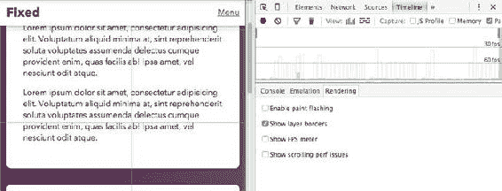

# 十二、代码质量和工作流程

在本书中，我们讨论了各种技术和(许多！)CSS 的不同规范和属性。在这个过程中，我们接触了一些负责任地思考这些解决方案的有用方法。在这最后一章中，我们将重新审视这些方法中的一些，以更深入地探究其中一些方法优于其他方法的原因。

掌握 CSS 是关于编写不仅能工作(而且工作得很好)而且具有可读性、可移植性和可维护性等品质的标记和样式。我们的目标是在这最后一章中给你所有你需要的知识，来解决写好 CSS 的更复杂的方面。

在大多数情况下，我们不会引入太多新标准，而是在理论和一些实际例子之间切换。在本章的最后，我们将探索一些有效处理代码的工具，并让你对语言的未来有所了解。

在这一章中，我们将涵盖以下主题，以帮助您编写更好的 CSS:

*   浏览器如何从样式表到呈现的网页

*   如何使用开发人员工具来帮助优化渲染性能

*   通过限制选择器类型和选择器深度来管理级联

*   HTML 与 CSS 中的命名方案和复杂性平衡

*   像 linters、预处理程序和构建系统这样的工具来处理复杂的 CSS

*   未来的标准，如定制属性、HTTP/2 和 Web 组件

## 调试 CSS:外部代码质量

在这一节中，我们将解释浏览器如何处理 HTML 和 CSS，以及我们如何使用这些知识来解决渲染性能等问题。

代码的这些方面有时被称为*外部*代码质量——对于使用最终结果的人来说是显而易见的。几个重要的例子包括:

*   **正确性**:代码是否按预期工作？我们在 CSS 中输入了正确的属性名吗，浏览器能理解吗？

*   **可用性**:代码的结果不仅看起来正确，而且可以使用吗？例如，可访问性就属于这一类。

*   **健壮性**:如果出了问题会怎么样？例如，我们可以声明两组属性，其中一组是旧浏览器的备用属性。

*   **性能**:设计加载速度快吗，动画和滚动流畅吗？

其中一些品质是在编写任何代码之前拥有正确心态的问题，我们在本书中一直试图展示可用性和健壮性的良好原则。当对真实世界的项目进行编码时，您需要深入思考正确性和良好的性能对于每个独特的组件意味着什么。这是使用大多数浏览器内置的开发工具的好地方。

在前面的章节中，我们已经看到了如何使用这些工具来查看哪些属性被应用到一个元素或者调试动画。开发者工具在不断改进，我们可以用它们做的远不止这些。例如，图 12-1 显示了我们如何使用 Firefox 中的开发工具来找出使用了哪个字体文件，而不仅仅是字体堆栈声明是什么。


###### 图 12-1。使用 Firefox 开发工具来找出哪个字体文件被用在了[`www.microsoft.com`](http://www.microsoft.com)的特定元素上

进一步深入开发工具，您会发现面板和按钮，让您检查其他质量。这使您不仅可以看到应用了什么，还可以看到如何应用以及何时应用。为了理解这些工具，了解一点浏览器如何解析 CSS 是有帮助的。

### 浏览器如何解释 CSS

接下来是从 CSS 文件到“屏幕上的像素”的旋风之旅，以便更好地理解我们编写的 CSS 的影响。以下部分描述的步骤代表了每次加载新页面时发生的情况的简化模型，但是当页面被交互时，一些(或所有)步骤也可能发生。

#### 解析文件和构造对象模型

当你加载一个站点时，浏览器首先会收到一个 HTML 响应。这种响应被解释为彼此有关系的对象(节点)。例如，body 节点是 html 节点的后代，p 和 h1 节点可能存在于 body 节点中。这就是 DOM:文档对象模型(见图 12-2 )。


###### 图 12-2。文档对象模型是浏览器内部理解 HTML 的方式

当在 HTML 文档中遇到指向 CSS 文件的链接元素时，浏览器将获取并解析该文件。类似于如何将 HTML 转换成 DOM 树，CSS 文件被解析成称为 CSSOM 的东西:CSS 对象模型。不仅是外部文件，样式元素或内联样式属性中的任何 CSS 都将被解析并添加到 CSSOM 中。就像 DOM 一样，它是一个树状结构，包含页面样式的组合层次结构(见图 12-3 )。


###### 图 12-3。CSSOM 树表示样式表中样式的层次结构

每个 DOM 节点都与相关的 CSS 选择器相匹配，并进行最终的样式计算(基于级联、继承和特定性之类的东西)。

DOM 和 CSSOM 都是标准化的，并且应该跨浏览器工作。在这一步之后，如何从现在拥有的数据到屏幕上显示的内容取决于浏览器，但所有浏览器都遵循类似的步骤来实现这一点。

#### 渲染树

呈现页面的下一步是构建另一个树结构，通常称为*呈现树*。在这里，每个对象都代表要在屏幕上呈现的内容。这个结构看起来有点像 DOM 的树，但是它们并不相同。例如，可视化隐藏的 DOM 节点将不会出现在渲染树中，而像::before 这样的伪元素可能会有一个不在 DOM 中的渲染对象。浏览器还需要表现页面视觉表现的其他方面，比如滚动块和视窗(见图 12-4 )。


###### 图 12-4。一个简化的假想渲染树。head、title 和 meta 等元素没有自己的渲染对象。对于带有显示的元素也是如此:例如，none

构建渲染树时，渲染树中的每个对象都知道它应该是什么颜色，任何文本是什么字体，它是否有明确的宽度，等等。

#### 布局

在下一阶段，计算每个渲染对象的几何属性。这被称为*布局*或*回流*阶段。浏览器将遍历渲染树，并试图找出每个项目在页面上的位置。

由于很多网页布局都是为了保持页面的流动，其中元素“推”上其他元素，这可能会变得相当复杂。图 12-5 来自程序员 Satoshi Ueyama 的一个有趣的视频(【https://www.youtube.com/watch?v=dndeRnzkJDU】)他破解了 Gecko 引擎，展示了 Firefox 在布局网站时的实际回流操作。


###### 图 12-5。一段视频截图，显示了火狐浏览器中[`www.wikipedia.org`](http://www.wikipedia.org)的缓慢回流

有时，在这个阶段需要构建具有自己的呈现属性的附加呈现对象。例如，一段具有特定字体大小的文本可能会生成一个换行符，将它拆分成两个匿名的行框。这反过来会影响父元素的最终高度，以及它后面的其他元素。

最终，每个渲染对象的位置都会被计算出来，是时候把它们放到屏幕上了。

#### 绘画、合成和绘图

在一个非常简化的模型中，浏览器现在从渲染树中获取它可以学习到的一切，并将可视化表示放在屏幕上。实际上，事情要复杂一些。

当每个渲染对象的位置和属性被确定后，浏览器可以计算出屏幕上要显示的实际像素，这个过程被称为*绘制*。但除此之外，浏览器可能还需要做一些进一步的工作。

当浏览器知道最终图形表示的某个部分不能影响页面其余部分的显示时，它可能会决定将绘制工作分成不同的任务，每个任务负责页面的一个特定部分，称为*层*。

有些东西，如 3D 变换，甚至可以通过使用专用的图形芯片进行硬件加速。其他图层可能应用了滤镜或混合模式，这将决定它们如何与其他图层混合。这种将渲染分割成层，然后将它们重新组合成最终结果的任务称为*合成*。如果页面是用描图纸做的，这就相当于在不同的纸上画画，然后把它们粘在一起。

最后，页面准备好在屏幕上显示(或*绘制*)。唷！

### 优化渲染性能

如果页面中有任何变化，浏览器将需要再次执行前面的一些步骤。为了保持页面在屏幕上平滑显示，最好在 16 毫秒内完成，这是每次屏幕更新之间的时间，假设它有标准的 60hz 刷新率。

从性能角度来看，有些东西通常非常便宜，比如滚动:整个最终渲染只是在不同的位置重新绘制。当某个因素导致页面样式改变时，性能会有所下降。

如果我们在 JavaScript 中更改元素的宽度或高度属性，浏览器将需要进行布局、合成和绘制。仅改变文本的颜色不会影响布局，因此会触发绘画和合成。最后，我们能做的最便宜的操作是完全通过合成来完成的。

网站[`csstriggers.com`](https://csstriggers.com)是哪个属性映射到哪个渲染操作的便利参考(见图 12-6 )。该网站(由 Paul Lewis 创建)目前跟踪谷歌 Chrome 的渲染操作，但它们很可能在大多数浏览器中类似地工作。


###### 图 12-6。CSS 属性和它们在浏览器中触发的工作量，来自[`csstriggers.com`](https://csstriggers.com)

我们可以使用开发人员工具来查看这些不同的步骤何时执行，以及最终的性能如何。通过进入 Chrome DevTools 中的时间轴面板，我们可以记录我们与页面的交互，并跟踪交互是否触发了特定的呈现步骤。其他浏览器也有时间线记录功能，但 Chrome DevTools 一直是功能最丰富的。在图 12-7 中，我们记录了一个 1.5 秒的时间线，我们滚动了一个示例页面，在滚动的同时，一个固定的标题被动画显示在视图中。


###### 图 12-7。Chrome DevTools 中的时间线记录。单击右侧面板中的圆形图标可以开始和停止录制

我们可以放大到单个帧的级别，并确定浏览器内部正在进行何种操作。每个条代表一个渲染帧，每个条的彩色位代表一个渲染操作。在这种情况下，绿色代表绘画操作。在时间线下方，列出了每项操作，我们可以单击每一行以获得更多详细信息。

正如时间轴所示，某些东西导致了每一帧中的绘画操作。这并不可怕，但它可能会阻止在较慢的机器上平滑滚动，并且不应该在滚动时发生。为了弄清楚发生了什么，我们可以在渲染选项卡中打开一个叫做“绘画闪烁”的东西。然后，当我们与页面交互时，浏览器会在任何重新绘制的区域周围绘制一个颜色高亮(见图 12-8 )。


###### 图 12-8。打开绘画闪烁显示，当我们滚动时，固定标题被重新绘制

当我们滚动时，固定的标题会不断地被重画，因为它会影响下面的滚动内容。幸运的是，浏览器优化了绘制区域，所以至少它不是整个页面。但是我们可以做得更好，通过强制浏览器在一个单独的层中渲染固定的部分，并且只进行合成。页眉的当前样式如下所示:

```html
.page-head {
   position: fixed;
   top: 0;
   left: 0;
   width: 100%;
   transition: top .25s ease-in-out;
}
.page-head-hide {
   top: -3.125em;
}
```

那个。page-head-hide 规则是通过 JavaScript 切换的，当我们向下滚动时，它将页眉移出视图，当我们向上滚动时，它将页眉移回视图。

避免画图的诀窍是强制浏览器创建一个单独的硬件加速层来呈现标题，然后将它与页面的其余部分合成在一起。我们将使用 will-change 属性来做到这一点。此属性向浏览器提供了一个提示，表明此元素将来会更新 transform 属性。变换属性不会自己创建新层，但动画变换会创建新层。当浏览器得到预览提示，标题将在未来的动画，它将创建一个新的层的权利，从一开始。

这意味着我们可以过渡 transform 属性而不是 top 属性，一举两得:滚动性能和动画性能都会受益。

新的样式看起来像这样:

```html
.page-head {
   /* some styles left out for brevity */       
   transition: transform .25s ease-in-out;
   transform: translateY(0);
   will-change: transform;
}

.page-head-hide {
  transform: translateY(-100%);
}
```

重新运行时间线记录现在显示没有绘画在进行。我们还可以通过打开渲染选项卡中的“显示层边界”选项来验证是否创建了一个单独的层。现在标题周围应该有一个彩色边框(见图 12-9 )。



###### 图 12-9。当我们滚动时，时间线现在显示没有绘制操作正在进行。打开“显示图层边框”会在标题图层周围绘制一个彩色轮廓

###### 注意

在撰写本文时，最新版本的 Firefox、Safari、Chrome 和 Opera 都支持 will-change 属性。对于更向后兼容的技术，您可以使用 3D 变换来移动标题，这也会强制一个单独的层。

像这样使用开发人员工具来窥探浏览器内部的能力还没有出现很长时间，而发现幕后到底发生了什么的工具正在突飞猛进地发展。您不必为项目中的每一个规则都考虑这么多细节，但是要理解 CSS 是如何工作的(以及为什么有些东西比其他东西更贵)，掌握浏览器渲染和调试是非常重要的。

## 人类的 CSS:内部代码质量

我们应该始终考虑用户的需求，而不是开发人员的便利，所以花大力气保护代码的外部质量是有意义的。

这可能看起来有些矛盾，有些人可能会认为*内部*代码质量更加重要。举几个内部质量标记:

*   ****(“不要重复自己”)代码有多枯燥:**每个独特的问题是在一个地方解决的，还是如果你改变一个解决方案，你必须更新许多不同的地方？**

***   **可读性**:有人能在阅读时轻松理解代码做了什么吗？

    *   可移植性:你的一段代码只有在与你的代码库的其他部分结合时才能工作，还是独立存在？

    *   模块化:你能以一种不言而喻的方式将你的部分代码组合并重用到新的事物中吗？** 

 **这些品质如此重要的原因是它们会影响到编写或修改代码的人。如果外部质量有问题(一个 bug)，没有人能理解导致 bug 的源代码，你就不知道怎么修复。高外部质量通常是高内部质量的结果，但反之则很少。

内部代码质量也更加主观，基于个人偏好以及每个单独项目的属性。所以，戴上你的批判护目镜，让我们一起探索吧！

### 理解 CSS 的形状

CSS 是根据几个设计原则构建的。最重要的原则之一是简单:CSS 应该易于学习。你不应该需要一个计算机科学学位来使用它。作为一名设计师，你应该能够掌握如何选择页面的一部分，并对其应用样式。这不需要广泛的软件构造知识。

#### 将 CSS 视为软件

同时 CSS 是*也是*软件。作为软件，它的品质不仅仅是工作。对于一个快速原型来说，代码的质量在很大程度上是无关紧要的，只要它能完成工作。但是一旦某样东西成为活产品的一部分，代码的质量可能会产生广泛的反响。它将影响诸如随着时间的推移维护的成本有多高，出现新错误的可能性有多大，以及对新开发人员来说使用起来有多容易。

即使你正在创建的东西是一个人的项目，假设团队中至少有两个人也是健康的:你，和*未来的你*。当你在几个月或几年内修复某个 bug 时，你可能已经忘记了最初编写代码时你在想什么。

#### 带上你自己的结构

CSS 通常被描述为一种声明性语言。简而言之，这意味着你用它来告诉计算机*做什么*，仅限于该语言知道如何做的一系列事情。相比之下，许多通用编程语言更像是*命令式的*，这意味着你可以用它们来告诉计算机如何*(以及以什么样的顺序)做事情的一步一步的指令。*

许多命令式编程语言都配备了少量的构建块，允许特定于您的代码的新型控制结构和逻辑。在 CSS 中却不是这样:它有可以调用的函数，比如 url()函数，但是它缺少允许你定义自己的函数的构件。

添加到文档中的所有 CSS 也共享一个全局范围。如果您有一个带有选择器 p 的规则，那么它将成为所有段落元素的样式计算中的一个因素，不管它来自哪个样式表或者它是如何加载的。选择器决定每个*规则*的范围，但是样式表和文档之间的连接总是全局的。例如，您不能创建一个包含 p 选择器的 CSS 文件，并以一种仅将它应用于页面一部分的段落的方式加载它。(这种模式*在 Web 组件领域*存在吗，这是一项仍处于起步阶段的技术。我们将在本章末尾回到 Web 组件。)

###### 范围属性

有一种方法可以用自己的独立样式来样式化页面的一部分:样式元素上的 scoped 属性。这是一个相当笨拙的机制，浏览器制造商一直不愿意实现它(迄今为止只有 Firefox 在船上)。

使用 scoped 时，style 元素仅限于应用于父元素或其中的子元素。在下面的标记中，只有内部的

是红色的:

```html
<p>I will not be red</p>
<div>
  <p>I will be red.</p>
  <style scoped>
    p { color: red; }
  </style>
</div>
```

虽然这是一个方便的概念，但它在向后兼容性方面效果不佳——不支持的浏览器无论如何都会全局应用这些样式。

许多编程语言都有*名称空间*的概念:代码无法影响外部世界或受外部世界影响的隔离上下文，除非显式导入或导出。这使得管理代码库变得更加容易，而不会在其他地方产生意想不到的后果。

CSS 语言的简单模型意味着我们想要强加的任何结构必须来自我们编写规则的方式。在这一章的下一部分，我们将看一个简单的例子，并试图推导出一些编写高质量 CSS 的指导方针。

### 代码质量:一个例子

图 12-10 中的警告消息框看起来完全一样，但实现方式不同。当我们查看源代码时，我们希望关于内部代码质量的一些理论性的谈论会变得更加清晰。


###### 图 12-10。一个警告消息框，以三种略有不同的方式实现

第一个实现使用以下标记和 CSS:

```html
<div id="pink-box">
   <p>This is alert message implementation one</p>
</div>
div#pink-box {
  border-radius: .5em;
  padding: 1em;
  border: .25em solid #D9C7CC;
  background-color: #FFEDED;
  color: #373334;
}
```

首先要注意的是选择器中 id 的使用。这可以防止在页面上的任何地方重用这个选择器，这是不必要的限制。使用 id 属性本身没有任何问题:它们对于页面内链接或 JavaScript 挂钩来说非常有用。也没有什么可以阻止你使用它们作为 CSS 选择器，但是高度的专一性(正如我们在第二章中讨论的)使得忽略任何规则的变化都很麻烦。像消息组件这样的东西很可能在页面上被覆盖和重复，所以在这种情况下，ID 肯定是个问题。

此外，我们在选择器中添加了一个完全不必要的 div 限定符，在这种情况下，它除了增加特异性之外什么也没做。以这种方式将元素选择器与 id 或类一起使用是很常见的——通常这是试图在其他地方覆盖某些过于具体的规则的结果。通常，解决方案不是升级特异性“军备竞赛”,而是重新思考您的命名策略。

另一个需要注意的是 id 属性名:#pink-box 描述了警告消息框的一个特定属性。我们可以决定将警告消息改为内部带有红色图标的白盒，这样类名就不再有意义了。

就样式声明而言，它们本身没有任何问题:边框、填充和边框半径属性有相对于字体的大小，文本、边框和背景有一些颜色。但是我们可以做得更好，看一下第二个实现，我们将突出一些明显的区别:

```html
<div class="warning-message">
  <p>This is alert message implementation two</p>
</div>
.warning-message {
  border-radius: .5em;
  padding: 1em;
  border: .25em solid rgba(0, 0, 0, 0.15);
  background-color: #FFEDED;
  color: rgba(0, 0, 0, 0.8);
}
```

这里，类名的目的要清楚得多:它是一个警告消息组件，名称中省略了实现细节。颜色的定义不同:文本和边框的不同阴影都是使用半透明的黑色与粉色背景混合生成的。这意味着我们可以只改变背景颜色，免费获得另外两种颜色——少了一个更新代码的地方。

但是这个名字仍然是特定于一种样式的消息框的。如果我们有一个想要覆盖颜色的成功消息框规则，那么在标记中有一个以 warning 开头的类名是没有意义的。第三个示例解决了这个问题:

```html
<div class="message message-warning">
  <p>This is alert message implementation three</p>
</div>
.message {
  border-radius: .5em;
  padding: 1em;
  border: .25em solid rgba(0, 0, 0, 0.15);
  background-color: #ffffed;
  color: rgba(0, 0, 0, 0.8);
}
.message-warning {
  background-color: #FFEDED;
}
```

乍一看，这个例子使用了更多的代码来做同样的事情。诀窍在于。消息规则实际上是一种带有淡黄色的中性消息样式。那个。消息警告规则通过改变唯一不同的东西——背景颜色，将普通消息变成警告消息。

我们可以通过决定其他名称来轻松创建其他类型的消息规则，例如 green。消息成功规则(见图 12-11 ):


###### 图 12-11。智能结构允许我们快速创建其他样式的消息框

```html
.message-success {
  background-color: #edffed;
}
```

通过以这种方式构建代码，我们获得了许多好处:

*   半透明的文本和边框让我们可以通过一个声明来创造新的变化。

*   名称消息与该组件的功能有关，而不是最终结果(某种配色方案的盒子)。希望对于不熟悉该代码的人来说，这个名称的目的也很清楚。

*   通过用基本名称(.消息)并将它们一起保存在 CSS 文件中，这样就更容易直观地扫描文件并识别这些规则的用途。

消息框最初的三种变体完全有效，并且在浏览器中的外观上完全相同。通过构建代码，给它一组不同的名称，并仔细选择如何应用属性，最终的实现在质量上有很大的不同。在这一章的剩余部分，我们将更深入地探讨一些用于编写高质量 CSS 的常见模式、方法和工具。

### 管理级联

我们可以从前面的消息示例中提取一些原则来帮助提高代码的质量:

*   使用类名作为主要的样式挂钩

*   使类名可读且清晰

*   打破单一目的的规则，避免不必要的重复

*   避免将元素类型绑定到样式规则

所有这些都有一个共同点:它们主要通过控制特异性来限制级联效应。

为什么要限制这种语言最强大的特性之一的使用呢？在某种程度上，这个问题本身就有答案，因为任何电动工具都需要附有安全说明——“使用时远离身体。”但是级联也是为了一个特定的目的而发明的:允许混合样式规则源(用户代理默认值、作者规则和用户规则)来决定文档的最终表示。

我们在这里使用“文档”这个词是有原因的——在 CSS 发明的时候，Web 主要被视为一种共享文本文档的技术。CSS 允许一种优雅的方式通过层叠和继承来提高一致性。它还带来了像用户样式表这样的概念:如果用户更喜欢用高对比度的样式表阅读网页，他们可以覆盖作者的样式。

虽然 Web 仍然具有文档模型的底层架构，但它现在被用来创建更高级的视觉设计和用户界面。实际上，这意味着作者样式的重要性转移。随着这些变得越来越复杂，有一种趋势是将它们划分开来，使它们更加可移植、独立和可预测。前面列出的原则是实现这一目的的起点。在下一节中，我们将从一个稍微不同的角度来看 CSS，找出我们如何进一步发展这些原则。

### 结构化命名方案和 CSS 方法

在前面的消息示例中，我们用。留言。这种“前缀”的思想不仅使代码更具可读性，而且以类似于名称空间思想的方式组织代码。

有几个人和组织已经承担了提出方法的任务，这些方法概括了到目前为止概述的质量原则，通常与这种结构化命名方案相结合，作为指导 CSS 作者的一种方式。您可能偶然发现了像 OOCSS、SMACSS 或 BEM 这样的名字，因为它们已经流行了好几年了。

#### OOCSS

OOCSS 代表面向对象的 CSS，它是由妮可·沙利文在 2009 年创造的一种编写 CSS 的方法。从许多方面来说，这是从可维护软件的角度探索如何编写 CSS 的浪潮的起点。对于 OOCSS，Nicole 使用了来自面向对象编程的隐喻，在面向对象编程中，与 CSS 中定义良好的规则集相关联的可重用类名充当了创建对象层次结构的一种方式。

在 OOCSS 中，类名(在语义正确的 HTML 的基础上)被用作解释组件在 UI 中的用途的主要机制。妮可称之为“视觉语义学”

也许 OOCSS 思维中最著名的例子是我们在第三章中第一次遇到的“媒体对象”——一种图像、视频或其他媒体的常见模式，位于文本块旁边(见图 12-12 )。通过将这种模式提取到单个对象中，并在需要的地方加入类名，Nicole 展示了可以从 CSS 中删除大量重复内容。


###### 图 12-12。截图来自妮可·沙利文关于“媒体对象”的文章的评论部分，其中每个评论实际上都说明了该模式的原理

OOCSS 包括将“皮肤与结构”和“容器与内容”分开的建议将皮肤从结构中分离出来意味着你应该尽量避免编写像排版和颜色(皮肤)以及定位、浮动等这样的规则。(结构)。在这种情况下，您最好为每个方面创建一个单独的规则和类名。例如，“媒体对象”负责浮动图像和相关文本的布局，而颜色和版式则附加到组件本身。以下博客文章摘要的标记说明了标记中的类的组合:

```html
<article class="media-block post-teaser">
    <div class="media-body post-teaser-body">
        <h2 class="post-title">Media object</h2>
        <p>Article text goes here…</p>
    </div>
    
</article>
```

后置类可以代表这个组件的“皮肤”,媒体对象模式有自己的类名。

“容器与内容”的分离可以在我们在第七章看到的网格策略中看到。通过将组件如何适应页面布局的样式应用于技术上冗余的外部元素(。col)，我们消除了与组件本身的样式冲突的风险:

```html
<div class="row row-trio">
  <div class="col">
    <article class="media-block post-teaser">
      <div class="media-body post-teaser-body">
         <h2 class="post-title">Post teaser heading</h2>
         <p>Article text goes here...</p>
       </div>
       
    </article>
  </div>
  <!-- ..and so on, more post-teasers here.
</div>
```

#### SMACSS

CSS 的可扩展和模块化架构，或简称 SMACSS，是 Jonathan Snook 在雅虎工作时创造的一种方法。它与 OOCSS 有很多相似之处，比如提倡将类名和以组件为中心的规则集作为创建 UI 元素层次结构的主要机制，以及避免特殊性冲突。Jonathan 通过引入一种规则分类，使 SMACSS 的思路有所不同:

*   基本样式，为 HTML 元素提供默认样式以及基于元素属性的变体。

*   布局样式，处理网格系统和其他布局助手，类似于我们在第六章看到的抽象(“行”、“列”等)。).

*   模块样式，由所有规则组成，这些规则构成了特定于您正在构建的站点的组件:产品和产品列表、站点标题等。这是你的大部分样式可能结束的地方。

*   状态，即改变现有模块外观的覆盖。例如，菜单项可以是活动的，也可以是非活动的。

在坚持这种规则分类的过程中，SMACSS 鼓励你思考如何给事物命名，以及它们适合在哪里。这些规则通常应该按照描述的顺序包含在您的样式表中，以便它们从最一般的到最具体的。这是避免特异性斗争的另一部分，并以一种明智的方式使用级联。

除了样式的分类之外，SMACSS 方法还提倡在一些类名前使用前缀，以便更清楚地表明预期的目的。在第六章中，我们讨论了布局助手，并使用了像。SMACSS 建议您在这样的类前面加上能够传达其本质的前缀，比如。l-对于布局:

```html
.l-row { /* row container */ }
.l-row-trio { /* row with three equally weighted "columns"  */ }
.l-col { /* column container */ }
/* ...etc */
```

类似地，您可以用 is-来阐明状态前缀，因此一个名为。处于禁用状态的 productlist 可能以类似。is-productlist-disabled 或。productlist 被禁用。组件本身不使用特定的前缀，但是组件本身的名称可以作为任何子组件的前缀:

```html
.productlist { /* styles for the product list container */ }
.productlist-item { /* item container in the list */ }
.productlist-itemimage { /* image inside a product list item */ }
```

#### 不列颠帝国勋章

OOCSS 和 SMACSS 可以被看作是一个考虑结构化 CSS 的框架，并结合一些方便的经验法则，BEM 是一个关于如何创作和命名你的样式的更加严格的系统。

BEM 最初是来自搜索引擎公司 Yandex 的一种应用程序开发方法。它包括几个关于如何在大型 web 应用程序中构造 UI 的约定、库和工具。这些应用程序中使用的命名约定已经成为 HTML 和 CSS 上下文中 BEM 一词的同义词。

首字母缩写 BEM 代表*块*、*元素*、*修饰语*。块是顶层抽象，相当于 SMACSS 中的模块或 OOCSS 中的对象。任何远程独立的东西都可以被描述为一个块。元素是块的子组件，不要与纯 HTML 元素混淆。最后，修饰符是块或元素的不同状态或变体。

BEM 中的块、元素和修饰符用小写字母书写，用破折号分隔多字项:

```html
.product-list { /* this is a block name */ }
```

块中的元素用两条下划线分隔:

```html
.product-list__item { /* this is the item element inside the product list */ }
```

修饰符用单下划线添加，可以修改块或元素:

```html
.product-list_featured { /* product list variation */ }
.product-list_featured__item { /* item inside featured product list */ }
.product-list__item_sold-out { /* Sold out item inside normal product list */ }
```

这种语法还有几种变体。开发人员 Harry Roberts 使用了一种变体，用双破折号而不是单下划线来分隔修饰符:

```html
.product-list__item--sold-out {}
```

哈利还在他的网站([`csswizardry.com`](http://csswizardry.com))上写了大量关于如何使用这些类型的命名方案的文章，包括将 BEM 语法与前缀结合的各种方法。(他还写了一个关于编写高质量 CSS 的综合资源，包括如何构造和命名事物，可在 [`cssguidelin.es`](http://cssguidelin.es) 获得。)

不管您选择哪种语法，BEM 的主要思想是，只要您知道所使用的命名方案，就能够立即识别与某个类名相关联的规则类型。这也有助于保持代码的焦点。如果一个类承担了太多的责任，它将开始与名字的明确目的相冲突。这是重新思考抽象的一个信号。没有什么可以阻止您将一个块的复杂部分分解成它自己的嵌套块，这反过来会带来进一步的可重用性。

### 管理复杂性

到目前为止，我们描述的所有指导方针和方法的底线可以总结为目标是*管理复杂性*。任何超出一小段代码的东西都会很快变得复杂，所以我们要么极大地限制范围(只允许更简单的设计)，要么把复杂的部分分解成更简单的块。

使用代表 UI 行为的命名方案和类名使 CSS 更容易理解，但并没有降低整体的复杂性。相反，它将一些复杂性转移到了 HTML 上。对于网页或网站的不同部分，它可能在不同程度上这样做，但它总是这样做。为了理解这是为什么，我们需要回溯一下 CSS 被引入的时间。

#### 关注点分离

随着网络从一大堆<font>和</font>

<center>标签转变为一种由 CSS 决定表现形式的模式，有一股巨大的推动力促使公司开始使用 CSS 并保持 HTML 的纯净，不提及文档如何表现。</center>

像 CSS 禅宗花园([`www.csszengarden.com/`](http://www.csszengarden.com/))这样的网站；见图 12-13 )做了大量的工作来说服设计者和开发者语义标记的价值和 CSS 的力量。将表示层视为独立于底层文档的标记，这很好地说明了*关注点分离* (SoC)的软件设计原则:标记不应该包括表示层，也不应该依赖于表示层，两个层应该尽可能少地混合。这是内置于 Web 本身的东西:即使没有 CSS(或 JavaScript，就此而言)，网页的基本表示也应该是有意义的。


###### 图 12-13。CSS Zen Garden 展示了单个 HTML 页面的各种变化，只是通过操纵 CSS——有时非常聪明地使用伪内容

划分为不同的责任区域有助于最终用户体验网站，也有助于我们构建网站。最终用户应该能够使用 HTML 中表示的内容，而不管其能力如何，或者 CSS 是否由于某种原因无法加载。作为开发人员，我们应该能够专注于 CSS 文件，而不是在我们想要更新设计时更新每个 HTML 元素。

现在，考虑使用一个仅处理特定表示方面的类名的情况，比如水平布局结构的行和列(我们在第七章中使用过):

```html
.row {
  margin: 0 -.9%;
  padding: 0;
}
.row:after {
  content: '';
  display: block;
  clear: both;
}
.col {
  float: left;
  box-sizing: border-box;
  margin: 0 .9% 1.375em;
}  
```

即使我们将它们重命名为不太直观的名称，如 group 和 block，它们仍然有一个目的，那就是创建表示挂钩。我们已经在 HTML 中放置了表示信息，这是毫无疑问的。这违背了 SoC，那么为什么会被接受呢？

SoC 原理本身比 Web 要古老得多。它是由传奇计算机科学家 Edsger Dijkstra 在 1974 年创造的([`www . cs . ute xas . edu/users/EWD/transcriptions/ewd 04 xx/ewd 447 . html`](https://www.cs.utexas.edu/users/EWD/transcriptions/EWD04xx/EWD447.html))，他在一篇文章中阐述了如何推进软件工程领域。

用 Dijkstra 的文章来概括，面对日益增加的复杂性的方法是“将一个人的注意力集中在某个方面”，而不是“同时处理这些不同的方面”。由于我们可能需要同时处理 HTML 和 CSS，我们在一个地方违反了这个原则。

事情是这样的:我们可以在代码的任何层次上自由地应用“关注点分离”原则，为了另一部分的利益而牺牲一部分的理论纯度可能是有益的。

像这样的规则的唯一目的。row 是 Dijkstra 所说的焦点类型的一个例子。当我们在一个地方解决了基于列的布局的一般问题时，它就解决了:当我们找到一个更好的方法时，我们不必更新我们在 CSS 中重复相同解决方案的所有地方。

代价是，当名称改变时，我们需要更新 HTML，或者代码的特定部分不再使用该解决方案。使用这种命名挂钩的支持者倾向于认为，在 HTML 中找到并替换我们使用类名的地方比重构一个混乱的 CSS 文件更容易。

#### HTML 语义与类语义

下面是 HTML 规范对类名的说明:

> *对于作者可以在* *类* *属性中使用的标记没有额外的限制，但是鼓励作者使用描述内容性质的值，而不是描述内容的期望表示的值。*

谈到 CSS，CSS 2.1 规范对类名有如下描述:

> CSS 赋予了“class”属性如此强大的力量，以至于作者可以基于几乎没有关联表示的元素(如 HTML 中的 DIV 和 SPAN)设计自己的“文档语言”,并通过“class”属性分配样式信息。作者应该避免这种做法，因为文档语言的结构元素通常有公认的含义，而作者定义的类可能没有。

首先要注意最后一句话使用的语言:“鼓励”、“应该”、“经常”、“可能。”使用可能被认为是表示性的类名并没有被禁止:它不会导致验证错误，并且它本身对文档的结构语义或可访问性没有影响。类名和其他标识符主要是为了开发人员，而不是用户。因此，我们应该明确区分:HTML 及其属性的语义不同于作者定义的值(如类)的语义。

关于设计你自己的“文档语言”的部分是很重要的:看起来像按钮的东西和使用像 Click me！，并使用<button>点击我！</button>。标签<button>创建了一个可聚焦和可访问的元素，默认情况下，它是根据操作系统惯例设计的，并且可能与一个表单相关联。同样的原则也适用于 HTML 中任何具有语义意义的元素或属性——负责任地使用它们。</button>

规范*没有说*的是，我们不能使用类作为这些元素的正确使用的扩展，或者用一些额外的语义上无意义的元素增加文档来帮助表示。

开发人员尼古拉斯·加拉格尔在一篇题为“关于 HTML 语义和前端架构”([`nicolasgallagher . com/About-HTML-semantics-front-end-architecture/`](http://nicolasgallagher.com/about-html-semantics-front-end-architecture/))的有影响力的文章中提出了重新评估类名语义的论点，这篇文章发表于 2012 年。它很好地总结了将表示性类名视为有效(如果不总是更可取)工具而不是被禁止的反模式背后的思想。

#### 找到正确的平衡

通过与表示无关的名字来最小化样式和结构的混合显然是一个好的目标。但是，即使当类名代表“视觉语义”时，我们也可以尽量保持最小的表示性质。

如果你走上允许表示类名的道路，你可能会倾向于认为 arial-green-text 是一个好名字。也许你会发现一个可重复使用的规则对这种字体和颜色组合是有益的，因为它是品牌指南的一部分。如果你创建了这样一个规则，试着把实现细节从名字中去掉——也许 brand-primary-text 会是一个更好的选择？这样，即使不能完全避免哪些部分使用这种特定的样式，至少可以避免颜色和字体准则的变化。

我们还必须记住，无论我们如何命名我们的类或构建我们的规则，我们都不必做出二元选择。任何元素都可以有描述内容的类名，*以及描述其作为 UI 一部分的功能的*名。

类似地，我们可以完全放弃在标记的某些部分使用类名，尤其是非开发人员使用它的地方。应用程序 UI 中的标记很可能是在完全控制属性的情况下创作的，而博客文章的内容可能只是从内容管理系统中产生的纯 HTML。

如果您为基本排版设置了合理的规则，并避免过多地基于上下文进行样式设计(实际上，在适用的情况下，更多地基于类名)，这些情况会自行解决。另一方面，将使用您编写的代码集合的人可能或多或少对标记的复杂性感到满意。

在博客文章“美国代码重构”([`adactio.com/journal/7276`](https://adactio.com/journal/7276))中，杰瑞米·基思写道，他和安娜·德本汉姆在“美国代码模式库”项目中不得不稍微放弃大量使用类名。简而言之，基于模式库创建页面的人不一定是编写 CSS 或理解所用命名约定的人。因此，它们受益于可读性更强、更简短的 HTML，而不是 CSS。

### 代码是给人用的

说到底，关于一种特定的 CSS 和 HTML 编写方式是好是坏的结论取决于情况和相关人员，只要它在技术上是合理的和可访问的。如果你或者和你一起工作的团队发现做事情的某些方式降低了事情的复杂性，那就去做吧。如果他们阻碍多于帮助，你应该考虑避开他们。

## 工具和工作流程

随着我们开始将 CSS 视为软件，并对我们如何编写和优化它提出了更高的要求，我们经常会寻找更好的工具来管理我们的工作流。近年来，像预处理器和构建系统这样的东西激增，以至于很容易迷失在术语丛林中。在这一节中，我们将简要介绍一些增强您的工具包的选项。

### 预处理器和 Sass

正如我们在本章开始时提到的，CSS 被有意设计成没有许多你在通用编程语言中所期望的构件。像循环、函数、列表和变量这样的东西是不可用的。正如我们已经得出的结论，有很好的理由让它们远离 CSS，但另一方面，有编程经验的人在编写 CSS 时也有很好的理由错过它们。它们允许您更容易地创建可重用的代码，有望降低创建和维护您的样式的总体工作量。

人们已经创造了其他语言，被称为*预处理程序*，在这些构建模块存在的地方，依次输出 CSS。有几种样式可供选择——Sass、Less、Stylus、PostCSS 等。在撰写本文时，最流行的是 Sass——语法上很棒的样式表。我们将看一个简单的例子来说明这种特殊样式的预处理器是如何工作的。

编写 Sass 最常见的方式是使用一个名为 SCSS 的 CSS 语法超集，这意味着您可以编写 CSS 中已经有效的任何内容，以及您选择使用的额外 Sass 功能。

###### 安装和运行 SASS

Sass 编译器有多种版本，或者作为独立程序，或者作为许多流行代码编辑器的插件。您通常可以设置编辑器，以便在保存. scss 文件时，它会自动更新相应的 css 文件。

如果你进入 Sass 语言安装页面([`sass-lang.com/install`](http://sass-lang.com/install))，你可以找到在各种平台上安装的说明，以及几个编辑器和内置支持插件的链接。

下面是使用了大量 Sass 特性的两个文件的片段。这远远不是 Sass 所能做到的全部，但它是语法外观和各种语言特性用途的一个尝试。如果你不能马上理解，不要担心。

首先，名为 library.scss 的文件:

```html
$primary-color: #333;
$secondary-color: #fff;

@mixin font-smoothing($subpixel: false) {
    @if $subpixel {
        -webkit-font-smoothing: subpixel-antialiased;
        -moz-osx-font-smoothing: auto;
    }
    @else {
        -webkit-font-smoothing: antialiased;
        -moz-osx-font-smoothing: grayscale;
    }
}
```

接下来，main.scss 文件:

```html
@import 'library';

body {
    color: $primary-color;
    background-color: darken($secondary-color, 10%);
}
.page-header {
  color: $secondary-color;
  background-color: $primary-color;
  @include font-smoothing;
}
.page-footer {
    @extend .page-header;
    background-color: #14203B;
    a {
        color: #fff;
    }
}
```

浏览器不需要这些代码，所以 SCSS 文件总是通过输出普通 CSS 的预处理程序运行。结果如下:

```html
body {
  color: #333;
  background-color: #e6e6e6;
}
.page-header,
.page-footer {
  color: #fff;
  background-color: #333;
  -webkit-font-smoothing: antialiased;
  -moz-osx-font-smoothing: greyscale;
}
.page-footer {
  background-color: #14203B;
}
.page-footer a {
  color: #fff;
}
```

main.scss 文件中的许多内容您可能都很熟悉:选择器、规则集、属性/值对等都有相同的语法。使用常规的@import 语句将 library.scss 文件导入主文件。对于 Sass 编译器来说，这意味着文件包含在输出中。在这种情况下，库文件实际上不包含任何要输出的内容，而是支持材质的集合。

例如，Sass 允许我们定义*变量*，然后我们可以在多个地方重用它们。例如，$primary-color 和$secondary-color 变量可用于设置背景和文本颜色。

library.scss 文件还包含一个 *mixin* ，它是我们可以在任何地方输出的可重用 css 的集合。我们定义的字体平滑混合允许我们切换特定于浏览器的属性，这些属性跟踪哪种抗锯齿方法用于文本。

在 main.scss 文件中，我们使用了这个 mixin 来包含字体平滑属性，作为。页眉规则。使用@include 语法调用 Mixins。

那个。页脚规则又使用了另一种语言特性——@ extend 语法。这意味着它的选择器被添加到它所扩展的选择器中，在这种情况下意味着。页脚正在与共享样式。页眉。

最后，有*嵌套*:在。页脚规则里面有一个用于 a 元素的选择器。通过这样写规则:

```html
.page-footer {
  /* rules for page footer here */
  a {
    /* rules for links in footer here */
  }
}
```

Sass 编译器会自动创建如下两组规则:

```html
.page-footer {}
.page-footer a {}
```

虽然嵌套使我们不必键入完整的选择器，但嵌套选择器可能会太过分。为了某种视觉整洁，将特定组件的所有规则嵌套在彼此内部可能很有吸引力，但是输出会受到过于具体的规则的影响:

```html
.my-component {
  /*...rules here */
  .subcomponent {
    /*...rules here */
    .nested-subcomponent {
      /*...rules here */
      h3 { /*...rules here */ }
    }
  }
}
/* ...will output... */
.my-component { /* ...rules here... */ }
.my-component .subcomponent { /* ...rules here... */ }
.my-component .subcomponent .nested-subcomponent { /* ...rules here... */ }
.my-component .subcomponent .nested-subcomponent h3 { /* ...rules here... */ }
```

经常检查你的输出 CSS 是一个好主意，这样你就不会无意中创建臃肿的样式表。

#### 预处理程序的情况

预处理程序对你如何编写 CSS 有很大的影响。当代码开始变得庞大和复杂时，预处理程序可以帮助您实现代码的一致性和结构化，并加快开发速度。

当您习惯使用预处理器时，即使较小的项目也能受益；尤其是当您开始构建一个可以在项目间共享的约定、混合和功能的武库时。

#### ..反对的理由是

但是在选择使用预处理器之前，还有一些事情需要考虑。在学习使用和正确使用它的过程中有一个明确的障碍。如果您编写了其他人将要维护或协作的代码，您也承诺让他们知道如何用您选择的预处理器语言编写。这也是对这种语言长期存在并得到支持的一种押注。

回顾关于代码质量的最初部分，我们看到好代码的主要敌人是复杂性。同样的规则也适用于这里:不要假设预处理程序总是让你的代码更容易处理，但是如果它们看起来能帮助你写出更好的代码，不要犹豫尝试使用它们。

还有其他工具可以帮助你以不同的方式检查你的代码。在下一节中，我们将看看其中的一些。

## 工作流工具

无论您使用 CSS 还是预处理程序语言，在开发时通常都有需要反复执行的任务。幸运的是，计算机擅长处理无聊和重复的东西。在本节中，我们将简要介绍一些有用的工具。

### 静态分析和棉绒

就代码的正确性而言，许多代码编辑器都有内置的语法检查器，可以突出显示任何看起来不正确的选择器或样式声明。这种错误检查通常被称为“静态分析”，这是程序员的一种时髦说法，意思是试图在代码运行之前发现其中的问题。

如果您想增强代码的静态分析，可以配置一些工具来检查语法错误以外的问题。这些工具被称为*棉绒*，专注于寻找“棉绒”——不应该在那里的碎屑。对于 CSS，有 CSS Lint(【http://csslint.net】)和 style Lint([【http://stylelint.io/】](http://stylelint.io/))。这些工具检查你的选择器和声明中可能不需要的语法错误和模式(见图 12-14 )。两者都是可配置的，你甚至可以编写自己的规则。


###### 图 12-14。在崇高文本编辑器中使用 CSS Lint。左边空白处的圆点表示潜在的问题，解释信息打印在底部栏上

### 构建工具

除了林挺之外，在开发一个网站时，我们可能需要在编辑器之外反复做很多工作:

*   预处理 CSS

*   如果在多个较短的文件中工作，将 CSS 文件连接在一起

*   缩小 CSS，删除注释等等来节省空间

*   优化 CSS 中引用的图像

*   运行开发服务器

*   重新加载一个或多个浏览器来检查我们的更改

幸运的是，有许多工具可以帮助您在项目中自动完成这些任务。它们包括从命令行运行的更高级的工具，以及可以在图形用户界面中管理的更简单的设置，如考拉(见图 12-15 )。


###### 图 12-15。考拉是一个可用于 Windows、Mac 和 Linux 的构建工具 GUI

也有很多应用程序允许你完全用代码来配置你的构建系统。这通常需要更多的设置，但是由于配置可以在开发人员和项目之间共享，它可以帮助保持开发环境的一致性和快速设置。

#### 使用节点和吞咽设置 CSS 构建工作流

Node 是一种 JavaScript，可以在浏览器之外运行，并用于任何类型的编程任务。自从 Node 出现以来，许多前端开发工具都是基于 JavaScript 的，可以说，已经知道它的人可以自己动手了。

对于前端构建工作流，有许多专门管理构建任务的节点应用程序，如 Grunt、Gulp 和花椰菜(是的，这些是实际名称)。它们通过配置和链接独立任务的输出来提供帮助，每个任务负责工作流的一部分。

对于我们的示例工作流，我们将使用 Gulp，它又通过 NPM 来处理，这是 Node 附带的一个实用程序。NPM 是一个命令行工具，因此示例中的所有命令都在终端窗口中运行。

###### 注意

如果您需要如何使用命令行的速成课程，请访问[`learnpythonthehardway . org/book/appendix-a-CLI/introduction . html`](http://learnpythonthehardway.org/book/appendix-a-cli/introduction.html)并完成一些示例。这可能是一项艰巨的任务，但您将学到管理计算机和利用更高级工具的宝贵技能。

首先:你需要安装节点。前往[`nodejs.org`](https://nodejs.org)下载并运行您平台的安装程序。接下来，导航到本书附带的代码中的 12 示例章节内的 workflow-project 文件夹。

这个文件夹有一个名为 package.json 的文件，这个文件记录了运行项目所需的内容。这些依赖关系存储在 https://www.npmjs.com 的一个中央代码库中，那里有成千上万的自由代码库被共享。通常，您可以通过调用命令 npm init 来创建自己的包文件，并回答一些关于您的项目的问题，但是这一次我们走了 TV-chef 的路线，提前准备了一个。

要安装程序包文件中列出的依赖项，请运行 npm install 命令。这将在本地项目文件夹中下载并安装以下小应用程序:

*   **Gulp:** 任务运行器，将其余的程序放在一起。

*   **Gulp-Sass:**Sass 预处理器库的一个版本。

*   **Browser-sync:** 运行轻量级开发服务器的工具，跨浏览器同步网页的重新加载和交互。还包括一个调试器，所以你可以调试，例如在移动设备上。

*   Autoprefixer: 一个非常有用的库，它检查你的 CSS，并根据你想要支持的浏览器列表为 CSS 属性添加相关的前缀和替换语法。

*   **Gulp-PostCSS:**PostCSS 预处理器的一个版本，运行 Autoprefixer 需要它。

这些应用程序将把它们的文件放在项目目录中名为 node_modules 的文件夹中。如果您对您的文件使用任何类型的版本控制，您可能会想要告诉它忽略这个文件夹:里面会有成千上万个小文件，您可以随时使用包文件重新创建它们。

下一个组件是 gulpfile.js 文件，它包含如何一起使用已安装的软件包的说明。我们不会深入讨论这是如何工作的所有细节，但是作为一个例子，下面是处理 CSS 预处理的部分:

```html
gulp.task('styles', function(){
  var processors = [autoprefixer()];
  gulp.src(['*.scss'])
    .pipe(sass())
    .pipe(postcss(processors))
    .pipe(gulp.dest('./'))
    .pipe(browserSync.reload({stream:true}))
});
```

当告诉 gulp 程序运行样式任务时，任何。提取同一目录下的 scss 文件。然后，它通过 Sass 预处理器运行。之后，它运行通过 PostCSS 处理器，在那里 Autoprefixer 添加必要的前缀。它通过去[`caniuse.com`](http://caniuse.com)并找出要使用的前缀和语法变化来做到这一点。默认情况下，它覆盖了所有主流浏览器的最新两个版本，以及大约超过 1%的市场份额的浏览器，但是这个设置是高度可配置的。最后，CSS 被保存到磁盘，浏览器同步程序被通知重新加载任何连接的浏览器窗口。

为了运行任务，我们使用 NPM。package.json 文件包含针对我们安装的应用程序的命令映射。当我们现在运行 npm run gulp 时，默认的任务集是 run，并且在我们保存文件时继续自动重新运行，直到我们停止它。

我们机器上的默认浏览器也在一个新的选项卡中启动，当前目录中的 index.html 文件就在这个选项卡中。CSS 文件一改变，浏览器(以及您指向同一地址的任何其他浏览器)就会重新加载。

在设置任务运行器和工作流时很容易迷路。当您将它归档，并准备好跨项目重用或共享时，您就赢了。新的合作者只需要安装 Node 并运行 npm install，然后他们的机器上就有了完全相同的设置。虽然对大多数人来说，开发工具可能是网站建设中最无趣的部分，但是一旦你建立并运行了网站，这通常是一种“设置好就忘了”的任务，从长远来看可以节省很多时间。如果你需要稍微详细一点的介绍(使用 Grunt 任务运行器而不是 Gulp)，我们推荐克里斯·科伊尔的文章《Grunt 给那些认为 Grunt 这样的事情很怪异很难的人》([`24ways.org/2013/grunt-is-not-weird-and-hard/`](https://24ways.org/2013/grunt-is-not-weird-and-hard/))。

## CSS 语法和结构的未来

在本书中，我们一直在使用 CSS 特性来支持不同层次的浏览器。我们在应用新功能时重复了渐进增强的咒语——这意味着今天你可以使用很多新功能，只要在它们还不被支持时你有一个合理的替代方案。这适用于很多情况，但不是所有情况。

对于我们如何编写 CSS 有一些基本的改变。其中一些已经得到了实验支持，但由于它们很难以渐进的方式应用，很可能需要几年时间我们才能在日常工作流中使用它们。然而，关注 CSS 的发展方向是很有用的。

### 自定义属性 CSS 中的变量

很长一段时间以来，向 CSS 中添加变量一直是最受欢迎的功能之一。一个规范已经准备了好几年，直到最近才成为候选推荐标准。在本书撰写之际，Chrome 和 Safari 即将发布支持版本。Firefox 已经支持变量很久了。

这些变量在技术上的正确名称是*自定义属性*:它们看起来非常像变量在 Sass 中的工作方式，但是略有不同。

自定义属性的声明语法与供应商前缀属性非常相似，只是供应商名称为空，导致两个破折号。要定义一个全局可用的变量，可以将它添加到:root 选择器中。您还可以定义(或重新定义)一个变量，使其在特定的选择器上下文中具有特定的值。

```html
:root {
  --my-color: red;
}
.myThing {
  --my-color: blue;
}
```

我们可以在自定义属性值级联的任何地方访问该值。var()函数表示法提取自定义属性值，如果属性未定义或无效，还可以选择回退值。在下面的代码片段中，颜色声明将被设置为蓝色，因为前面的示例将其设置在。神话祖先:

```html
.myThing .myInnerThing {
  /* second (optional) argument is the fallback */
  color: var(--my-color, purple);
}
```

自定义属性不仅可以作为整个值与 var()一起使用，还可以作为另一个子值的一部分:

```html
:root {
  --max-columns: 3;
}
.myThing {
  columns: var(--max-columns, 2) 12em;
}
```

既然像 Sass 这样的预处理程序有内置的变量，为什么我们要选择在客户端完成这项工作，而不是事先通过构建脚本或服务器进程呢？因为自定义属性是在浏览器中计算的，而不是预先计算的，所以它们可以访问动态 DOM 树和整个层叠。如果有变化，样式可以重新计算。如果我们在页面加载后使用 JavaScript 为 html 元素设置- my-color 变量，那么依赖于该颜色值的每个元素都会立即更新其颜色。

在广泛的浏览器支持自定义属性之前，对代码的重要部分使用自定义属性是很棘手的。任何对常规值的回退都必然会导致大量重复的声明。然而，它们无疑是 CSS 的一个强大补充。

### HTTP/2 和服务器推送

我们今天使用的许多与性能相关的模式都与 HTTP 的工作方式有关。更具体地说，我们试图应对当前版本 HTTP/1.1 在一次获取多个内容时相对较慢的事实，因此我们将所有样式混合到一个文件中，并避免像瘟疫一样的外部请求。

在 HTTP/2 中，底层协议为一次交付许多小资产而优化。一个连接可以承载多个文件，这大大减少了发出新请求的开销。HTTP/2 中也有一些关于 web 页面如何交付的聪明想法。使用所谓的“服务器推送”，服务器可以自动发送包含 HTML 和 CSS 的单个响应，除非请求表明浏览器的缓存中已经有了 CSS 文件。

这些新的进步可能会帮助我们摆脱像内联样式或制作图像精灵这样的模式。@import 语句长期以来一直是一种反模式，它可以获得新生，允许我们按照自己的意愿分割文件，而不用担心额外的请求开销。

HTTP/2 已经在很多地方得到了支持，并且今天还可以使用，因为当它在浏览器中不受支持时，它会退回到旧的行为。但是，它要求您使用的 web 服务器支持它。与许多基础设施的变化一样，这意味着在它真正成为主流并内置到我们的工具中之前，还需要一段时间。

### Web 组件

Web Components 是一系列标准的名称，这些标准允许 Web 开发人员将 HTML、CSS 和 JavaScript 打包成真正独立且易于重用的组件，就像它们是本地元素一样。当使用一个 Web 组件时，您应该能够将它直接放入您的项目中，而不用担心您的样式(或脚本)和那些属于该组件的样式之间的命名冲突。

如果我们创建了一个假想的 Web 组件来包含来自互联网电影数据库的缩略图预览([`www.imdb.com`](http://www.imdb.com))，我们将使用一个 JavaScript 文件来告诉浏览器我们打算在标记中使用一个定制的 imdb-preview 元素。然后可以在 HTML 中像这样调用该元素:

```html
<imdb-preview>
  <a href="http://www.imdb.com/title/tt0118715/>The Big Lebowski</a>
</imdb-preview>
```

在页面上，结果可能如图 12-16 所示，有几个部分。


###### 图 12-16。调用我们的<imdb-preview>元素的假设结果</imdb-preview>

在幕后，这个定制元素可以根据链接的 URL 获取数据，并用自己隐藏的 DOM 片段(称为影子 DOM)替换其内容。标题、评论分数和图片在这个片段中都有自己的元素。在某种意义上，这有点像 iframe——内容被屏蔽在页面的常规 DOM 树之外，它们使用单独的上下文来编写脚本和样式。

在 Shadow DOM 片段中，样式元素的范围自动限制在 web 组件的根元素，就像我们使用 scoped 属性一样。父文档中的样式也不会渗透到元素中，因此组件样式被完全封装。诀窍在于定制属性*可以*级联到组件中——因此组件作者可以准确地指定允许您覆盖哪些属性。有了这种机制，可以安全地更改排版和配色方案等内容，以匹配使用组件的站点。

到目前为止，许多提议的 Web 组件标准还不受支持，但是封装到影子 DOM 中已经在具有类似的元素的浏览器中发生了。即使标记中的元素是空的，它也隐藏了视频控件之类的元素——例如，你可以激活 Chrome DevTools 中的“显示用户代理阴影 DOM”选项来查看它的运行情况(参见图 12-17 )。


###### 图 12-17。如果我们打开阴影 DOM 检查并检查一个<video>，我们会看到它由许多其他元素组成——例如音量控制和播放器按钮</video>

在 Web 组件思维中，我们获得了许多其他方法所追求的模块化和可组合性——不仅仅是在 CSS 中，而是在 HTML、CSS 和 JavaScript 中。所有主要的浏览器供应商都在实现 Web 组件，但是对于应该使用哪些特性集和语法仍然存在分歧。

它们会在多大程度上影响我们编写 CSS，现在说还为时过早。也许它们会改变我们一起构建网站的方式，也许它们只是我们偶尔会遇到的另一种做事方式。

### CSS 和可扩展 Web

Web 组件背后的一个想法是，它们可以用作新的本机功能的各种试验场。如果某个组件成为创建某种类型的小部件或内容的事实方式，并在数百万个网站上使用，那么也许该元素应该成为 HTML 标准的一部分？

基于开发人员实际使用的东西来创建标准的想法并不新鲜。例如，jQuery JavaScript 库使用 CSS 选择器方法来选择 DOM 元素，并且变得非常流行。如今，我们有了原生 JavaScript 中的 querySelector API，其工作方式非常相似:

```html
// jQuery code:
jQuery('.myThing p');
// Standardized way:
document.querySelectorAll('.myThing p');
```

同样，像预处理程序这样的东西会影响 CSS 未来的样子。有一些关于 CSS 标准的建议，包括 native @extend 指令、原生嵌套、自定义命名媒体查询等等。

有一个文档，由网络社区中的许多人签名，名为“可扩展的网络宣言”([`extensiblewebmanifesto.org/`](https://extensiblewebmanifesto.org/))，它推动了这样一个想法，即标准需要朝着让开发人员更好地访问较低层次的浏览器内部的方向发展，这样他们就可以探索新的构建方式。然后，他们提出的解决方案会反馈给标准组织，以进行更高级别的构建块标准化。

这种模式与当前的情况有所不同，在当前的情况下，浏览器制造商和其他行业利益相关者提出了拟议的高级标准，开发者只有在浏览器中实现后才能尝试这些标准。

对于 CSS 来说，可扩展 Web 的想法并不一定意味着这种语言会被底层特性所拖累。相反，JavaScript APIs 将有望向渲染和自定义语法等事物开放，这样，任何提议的新 CSS 功能都可以在构思时作为脚本 polyfills 实现。如果成功了，CSS 的创新率只会增加。我们最好准备好。

## 摘要

在这最后一章，我们已经涵盖了从浏览器如何解释你的 CSS，到作者如何编写灵活和可维护的代码，任何称职的前端开发人员都可以理解。即使你写的 CSS 没有错误，包装良好，可维护，开发仍然是一件苦差事。像预处理器和构建脚本这样的强大工具可以在这个过程中帮助你，但是不要让它们本身变得过于复杂。毕竟，权力越大，责任越大。

最后，我们已经看到了 CSS 的一些前景，以及我们如何规划未来。我们面前还有许多发展，太多了，一本书无法详细介绍。当这本书的第一个版本写出来的时候，曾经被认为是普遍的和不可改变的概念，随着语言(以及对它的要求)的成熟，已经变得更加微妙和复杂。

最好的 CSS 作者总是一只眼睛看着现在，另一只眼睛看着未来，不断质疑今天的趋势如何可能成为明天的瓶颈。与其全力支持某个特定的工具或技术，不如花时间和精力去理解其基本原理。这是掌握 CSS 的真正途径。**