# 一、Windows 8 设计

 **注**“现在和以前完全不同了”(巨蟒剧团)

**重新构想的 Windows**

毫无疑问，你听说过 Windows 8 被称为“Windows reimagined ”,你根本无法否认 Windows 8 和之前的 Windows 版本之间的范式转变有多么巨大。

我清楚地记得我第一次使用 Windows 8 时，试图抓住关于使用屏幕边缘和角落的概念，从新的用户界面识别桌面，从 Charms 栏在应用程序内搜索，甚至只是重新启动系统！

从第一个屏幕开始，对旧模式的背离就很明显。图 1-1 显示了用户登录 Windows 8 时看到的内容。

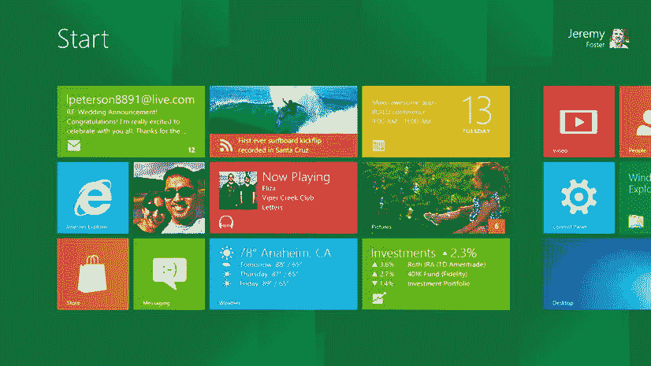

图 1-1 。Windows 8 中的开始屏幕

把这个和图 1-2 对比一下，这是我们刚登录 Windows 7 后看到的。

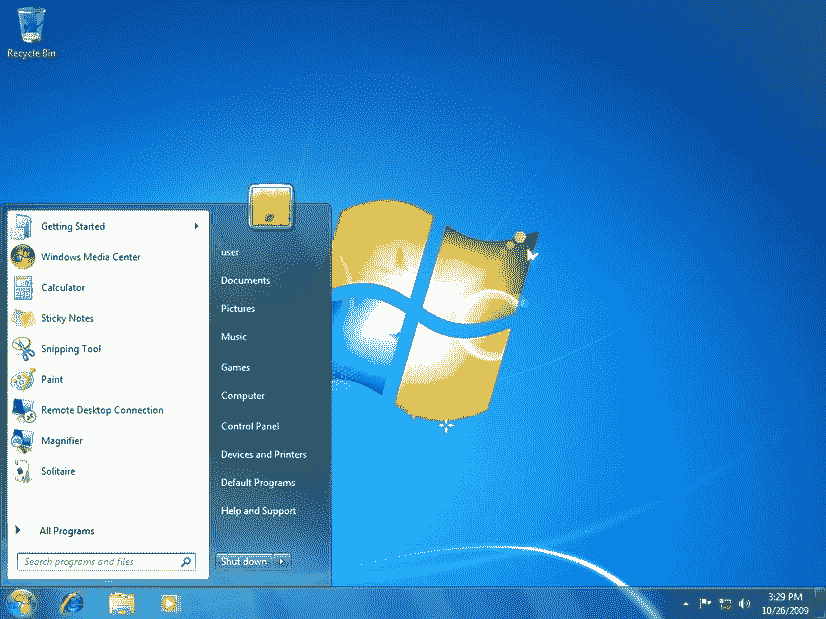

图 1-2 。Windows 7 中显示开始菜单的桌面

开始屏幕取代了开始菜单。眼球追踪研究证明，一旦用户打开 Windows 7 中的开始菜单，绝大多数人都不会看屏幕上的其他地方。全屏专用于启动体验的概念非常有意义。将开始屏幕视为一个应用程序，并了解 Windows 如何创建身临其境的开始体验。

事实上，在 Windows 8 带来的所有变化中，我认为与我们作为应用程序设计师最相关的是用户对其任务和内容的沉浸感。Windows 8 把屏幕的每一个像素都奉献给了你的应用，你的应用独自站在舞台上接受用户的尝试和评判。

你不需要走很远就能找到一个很好的应用程序的例子，它具有沉浸式的体验。图 1-3 中内置的地图 app 就是一个很优秀的。

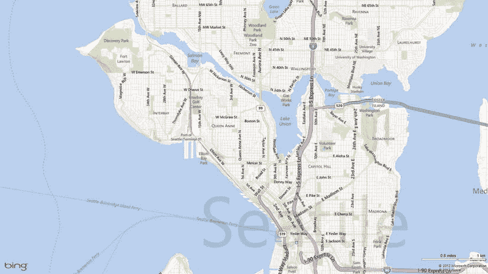

图 1-3 。地图应用很好地展示了 Windows 8 应用的沉浸感。毫无疑问，屏幕上的每个像素都是应用程序专用的

通过 Windows 8，微软带给我们的不仅仅是一个好的设计，还有一个好的设计框架。微软不仅提供了一种应用开发语言，还提供了一种 ?? 设计语言 ??。这种设计语言被完整地记录下来，并成为你的应用程序设计的基础。

Windows 8 的设计语言记录在`http://design.windows.com`。MSDN 强大的开发者网站的这一部分专注于一个伟大的应用程序所要求的整个设计过程。这包括对以下事项的建议:

*   界定你的应用范围，帮助你决定你的应用擅长什么
*   你的应用程序的盈利策略
*   左边距的建议大小
*   命令在应用程序栏中的位置

设计你的应用程序排除了你对用户界面语言的选择。你也可以使用微软的 XAML 语言实现好的设计，但是我们将使用 HTML 和 CSS。我们将首先进行设计，然后实现好的设计。有些设计原则一开始可能看起来有点深奥，但是看看它们能提供什么指导是很重要的。不要担心，因为当我们学习如何实现我们的好设计时，我们将在本章的结尾得到更多的具体内容。

我们将通过观察设计良好的应用程序的一些特征来探索良好的 Windows 8 应用程序设计。

出色的 Windows 8 应用程序设计的特点

在`http://msdn.microsoft.com/en-us/library/windows/apps/hh464920.aspx`的 design.windows.com 网站中列举了一个设计良好的 Windows 8 应用程序的一些特征。在这一章中，我将一步一步地介绍这些特质，就像它们在微软的网站上呈现的那样，并且用我自己的观点和经验来逐一剖析它们。

使用微软设计风格

如果你从关于 Windows 8 设计的一章中学到一个概念，可能是这个: *Windows 8 设计就是让用户沉浸在他们的内容中。*

什么是内容？应用程序的内容是用户启动应用程序的原因。对于一个财经 app 来说，内容就是股价或者一篇财经文章。对于一个社交应用来说，内容就是朋友或者对话。对于照片应用程序来说，内容就是照片。

Windows 8 基本上只是显示内容，而不是用关于内容的辅助信息来包装内容。当你在看一张照片时，你通常只会看到一张从屏幕的一边延伸到另一边的照片，而当你在社交网络上查看朋友的个人资料时，你会看到一个专用于该朋友基本信息的视图。

这不是用户界面发展的下一步。这与当前的趋势有所不同，当前的趋势是将所有内容都塞进一个屏幕，这样只需点击一下鼠标就能看到所有内容。视图设计表面 25%甚至更少的部分用于内容本身并不罕见。然而，这种趋势的缺陷是，当一个视图中添加了太多内容时，它就不能达到让用户的生活更轻松的目的，因为单个部分失去了它们的意义，而所有部分都失去了用户。

屏幕上不是内容的都是 *chrome* 。镀铬是汽车行业的一个术语，添加抛光的金属部件来吸引买家，即使它们在车辆功能中不起作用。单纯的审美没有错，但 chrome 在应用程序中的问题是，它会分散用户对其内容的注意力，从而影响应用程序。

Windows 8 的设计原则试图将*内容放在 chrome* 之前。并不是说 chrome 永远不会存在，而是一个 app 设计师要小心翼翼的介绍。你的应用应该总是优先考虑内容，排除干扰。请注意图 1-4 中 Windows 8 中的 Xbox Music 应用程序如何只显示内容。

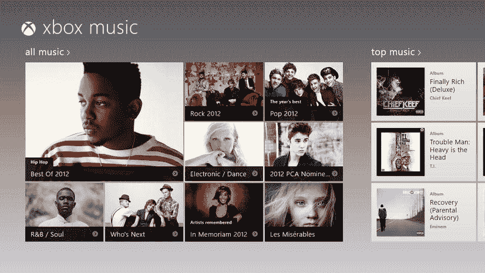

图 1-4 。Windows 8 应用将 100%的空间用于内容

将 chrome 添加到视图中有三个经典原因:导航、交互和布局。然而，这些对应用程序的可用性起着重要的作用，所以我们必须替换它们，而不是删除它们。让我们来看看这些类型的 chrome 的功能是如何在不影响内容的情况下实现的。

航行

静态导航有罪，造了很多 chrome。我们都熟悉标准的网站模型，在页面的顶部有一个标题，在页面的下方或左侧有导航链接。

为了避免点击，许多人甚至在导航菜单中填充多级悬停激活弹出菜单，甚至包括整个网站结构的树形视图。选项卡是另一种流行的现代形式的静态导航。

静态导航的问题是，它不符合我们应用程序的主要目的，即传递用户的内容。静态导航是关于用户下一步可能想去哪里的信息，但它不会告诉用户他们在哪里，因此它不是 Windows 8 应用程序中的推荐做法。那么我们如何促进导航呢？我们通过设计一个清晰的信息层次结构来实现这一点，该层次结构可以自然地将用户引导到下级或后续内容。

Windows 8 应用有两种主要的推荐导航模式。我将简要介绍每一个，但在`http://msdn.microsoft.com/en-us/library/windows/apps/hh761500.aspx#hierarchical_system`会读到更多。

三层导航

第一个模型是三层的分层导航模型。在这个模型中，所有的网站内容都存在于三个层次中——中心*、*部分*和*细节*。对于一个内容驱动的应用程序来说，这种导航模型的层级数量恰到好处。少于这一数量，应用程序就无法对所有内容进行分类，也就无法为导航提供便利。再多的话，用户就会迷失方向，找不到自己的位置。*

 *中心

中枢是应用程序的入口点，是整个应用程序的总览。当然，hub 不能显示应用程序中的所有内容，但它可以显示每个部分中足以引起用户兴趣的部分。例如，一个购物应用程序不会显示一个类别中的所有产品，但可能会显示前几个特色产品，并邀请用户查看更多。

部分

如果用户选择一个 hub 部分的标题，他们将被带到部分页面。区段页面负责传递有关该区段的任何一般信息，并为用户提供对该区段下所有单个项目或实体的访问权限。再次使用陈词滥调的产品和类别示例，*工具*部分将负责让用户使用所有可用的工具。这并不意味着所有的工具都会立即出现在页面上。通常过滤和排序功能使用户的生活更容易。

详述

当用户到达应用程序中的某个实体后，比如某个特定的产品，他们会被带到详细页面。详细页面负责显示关于该特定实体的所有信息。一个详细页面可能包含一张照片、一个描述、一些相关的实体、一个类别列表，或者谁知道还有什么。底线是细节页面是通知用户关于一个实体的专用地方。

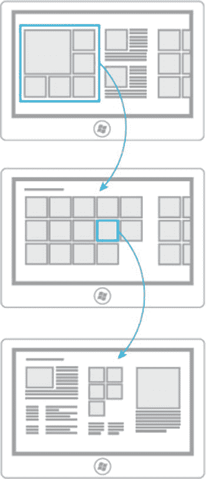

图 1-5。三层导航模型的图表，显示了中心层、部分层和细节层

平面导航

内容驱动的应用在三层导航结构中运行良好，但是有些应用并没有真正的内容结构。一些应用程序只是相似视图的集合——彼此都是对等的。Internet Explorer 是一个很好的例子，它遵循平面导航模式，因为会话中的浏览器实例彼此之间没有层次关系。

在实现平面导航的应用程序中，上面的应用程序栏(通常用于导航)提供对这些对等页面的访问，如图 1-6 所示。

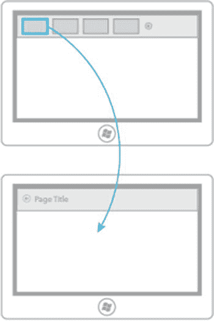

图 1-6 。平面导航模型的示意图

互动

将 chrome 添加到页面的第二个常见原因是为了交互。交互就像按钮一样，给用户一个与应用程序互动的机会。

让你的用户有机会与你的应用程序交互当然是一个好主意，但是设计界面上的传统控件不一定是提供这种交互的最佳方式。在设计界面上塞满用户可能需要或可能不需要的控件，对于让用户沉浸其中来说是次要的，同时仍然给他们机会在需要的时候调用一些交互。

屏幕上的内容通常不言自明，用户会很快知道或学会如何与之交互。一个用户(甚至是一个小孩)通常能够凭直觉感觉到触摸一些内容会给你带来更多的信息。同样，你不需要重复其他命令来影响屏幕上的内容，而是可以允许用户选择一个或多个项目，然后从应用程序栏中选择一个命令。在应用程序栏中放置命令可以让用户控制，因为应用程序栏根本不会占用任何空间，直到用户选择这样做。

我们希望设计我们的 Windows 8 应用程序，以便*内容可以自己命令*。通常，这仅仅意味着内容是可点击的。你可以在图 1-7 中看到内容命令自身的例子。


图 1-7 。通常不需要额外的命令按钮来查看内容项的更多信息。最好让用户直接与内容互动

有时命令不能直接由内容来表示，在这种情况下，我们被建议*利用边缘*。这意味着一些原本会使我们的设计界面变得混乱的命令可以被放到系统级的 Charms 栏中，或者放到更低或更高的 app 栏中。这被称为利用边缘，因为这些条准确地“隐藏”在屏幕边缘，直到用户调用它们。在这里，我们再次将用户置于控制之下。

图 1-8 显示了一个应用程序，其应用程序栏可见。这个应用程序栏由用户从屏幕外通过滑动手势、通过右击鼠标或者通过按键盘上的 WIN + Z 来调用。该栏是属于应用程序的命令的主页。更具体地说，它是您放置影响用户当前在上下文中的视图的命令的地方。

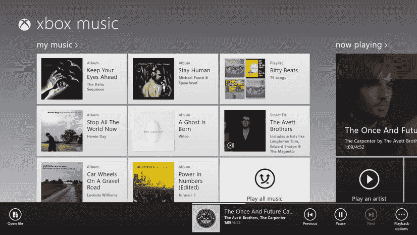

图 1-8 。应用程序栏随时准备为用户提供应用程序级别的命令，但是直到用户真正请求它时它才出现

图 1-9 显示了一个带有可见魅力栏的应用程序。该条由用户通过从屏幕右下滑动手势、用鼠标点击屏幕的右上角或右下角、或者按键盘上的 WIN + C 来调用。作为开发人员，我们实际上并没有改变 Charms 栏。它被窗户烤焦了。然而，我们能够在我们的应用程序中实现某些代码契约，因此我们的应用程序将响应用户激活的魅力。例如，我们的应用程序可以共享、搜索、共享到设备，并提供应用程序设置。

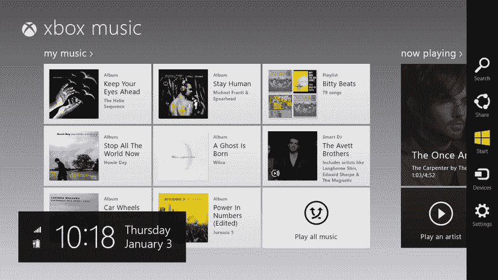

图 1-9 。Charms 栏以可预测的方式为每个应用程序带来系统级命令

应用程序栏上的命令是特定于给定应用程序的，它们位于一致的位置很好，因为曾经使用过 Windows 8 的用户会确切知道在哪里可以找到它们。用户将很快习惯搜索和分享的工作流程，并乐于在每个应用程序中使用相同的工作流程。

请记住，如果一个命令是基本工作流的一部分，那么它不应该对用户隐藏，而是应该放在设计图面上。秒表应用程序的开始和停止按钮就是一个很好的例子。隐藏这些按钮毫无意义，事实上，可以说这些命令本身就是应用程序的内容。

布局

最后，应用程序被仅仅用来分离内容的 chrome 弄得杂乱不堪。我们在谈论线条、盒子和隔断。实际上，在大多数情况下，当导航和交互 chrome 消失时，布局 chrome 往往会消失，因为布局 chrome 经常将内容与导航或内容与交互分开，而不是内容与内容分开。

因为我们将整个屏幕作为应用程序的画布，而不是画线和框，我们可以将空间花在空间上——如图 1-10 所示的空白空间。在 Windows 8 中，我们不怕在事物之间留出喘息的空间。

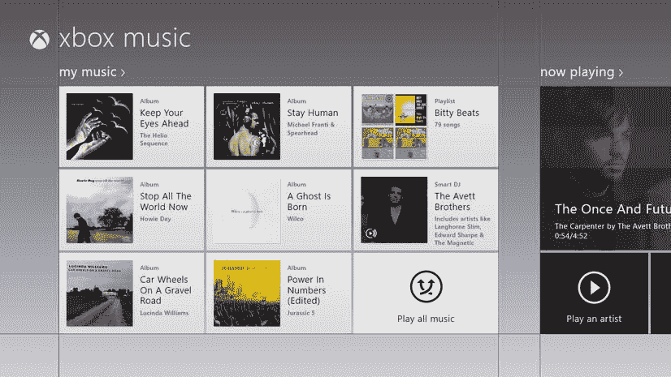

图 1-10 。Windows 8 不怕使用大量空间作为您内容的呼吸空间

我们也创造良好的布局与良好的排版。Windows 8 的字体设计有其意义和目的。标准字体和标准字体大小给了我们一个*类型的斜坡*，用于表示屏幕上元素之间的层次关系，并根据它们的角色或重要性自然地将它们分开，如图图 1-11 所示。

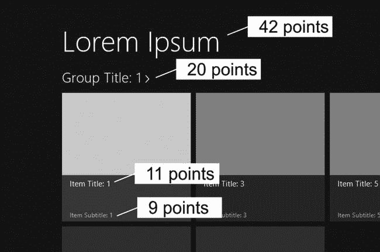

图 1-11 。类型渐变传达了类型的重要性和层次

你的应用也应该实现所谓的 *Windows 8 设计轮廓*。设计轮廓是标准的页边距、页眉位置、内容填充、字体和字号，给用户一种强烈的亲切感，如图图 1-12 所示。这种一致性应该与独特的设计风格相结合，让你的应用程序不仅熟悉，而且有自己的个性。

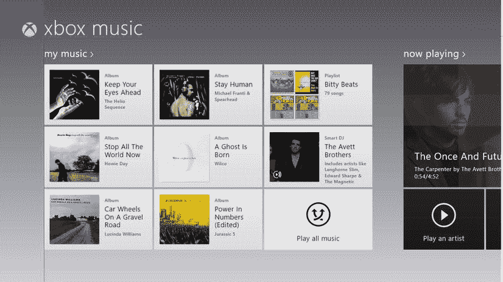

图 1-12 。标准的页边距和页眉位置为 Windows 8 用户提供了一定的一致性

快速流畅

Windows 8 应用应该始终以快速流畅的方式运行。一个快速流畅的应用程序反应迅速，流畅，使用有目的的动画和清晰的图形。

出色的用户体验的一部分是用户感觉他们是在直接与信息交互，而不是与传递信息的系统交互。触摸内容并实时拖动它是一种很好的用户体验，但前提是内容精确地跟随用户的手指，而不是抖动、滞后或落后。

在很大程度上，你创建的 Windows 8 应用会很快很流畅，即使你没有想到这一点。这是因为许多内置控件和函数在设计时都考虑到了这一点，也是因为 Windows API(Windows 运行时或 WinRT)只为任何可能需要太长时间(在这种情况下，太长时间被定义为 50 毫秒)的方法提供异步调用。

然而，有时候，作为开发人员，您将直接负责在屏幕上移动并与用户交互的元素的性能。无论何时出现这种情况，你都应该确保性能被认为是*快速和流畅的*。

动画也有助于让用户感觉他在和一个有机系统互动。我们将在第六章更深入地讨论动画。

完美地捕捉和缩放

Windows 8 不受限于固定硬件。有数百种电脑型号和许多外形规格将乐于运行 Windows 8 和您的应用程序。因此，你的应用程序应该具有适应性，你应该有意识地考虑每个页面在每个可能的视图状态下的外观。

您将处理的典型 Windows 8 视图状态包括:

*   全屏横向:整个屏幕，宽度大于高度
*   全屏纵向:整个屏幕，其高度大于宽度
*   抓拍:只是左边(或右边)，是 320 像素的风景
*   填充:当另一个应用程序被抓取时剩余的空间

您不必支持纵向视图，但必须支持快照和填充视图。无论你喜不喜欢，你的用户都可以抓拍你的应用或者你旁边的应用。即使你的应用没有刻意处理这些状态就通过了认证，当你的用户发现的时候也会很尴尬。

使用正确的合同

我们在电脑上安装操作系统的一个主要原因是，抽象出我们希望以一致的方式工作的所有琐碎任务，而不必为每个应用程序重新创建它们。打印机驱动程序过去并不存在，因此每个应用程序都必须被编程，以便与任何可能正在使用的打印机对话。对这项任务来说，艰巨是一个合适的词。

一个可能成为抽象概念的现代规范是社交网络，或者更普遍的说法是分享。Windows 8 从我们的应用程序中抽象出了分享的概念，并将其包装在一个所谓的*合同*中，作为开发人员，您可以实现该合同。如果你不熟悉的话，契约只是你的代码中遵循的一种模式，当它试图要求你的应用程序共享或搜索或其他内容时，它会满足 Windows 期望找到的内容。在代码中实现契约并不是一件困难的事情。这样做的巨大优势是，只要你的应用程序能够共享并正确实现契约，那么它突然就能够与参与同一契约的每个应用程序共享。它甚至能够与应用程序共享，而这些应用程序是在你将自己的应用程序放入商店后才出现的！

搜索是另一种流行且常用的契约。通过正确的契约实现(同样是一个相当简单的任务)，用户甚至可以在启动应用之前搜索你的应用，你可以决定当你的应用被搜索时会发生什么，以及如何产生搜索结果。

有很多 Windows 8 合同，我建议将任何可以增加实际价值的合同添加到您的应用程序中。

投资一块大瓷砖

实时互动程序是用新信息或图像更新的开始屏幕互动程序。动态磁贴很有效，因为它们是信息性的。我发现自己有时只需快速浏览一下我的开始屏幕，就能得到我需要的所有信息。我可以看到当天的天气，我的下一个约会，以及头条新闻，而不用启动任何应用程序。

请记住，应用程序的磁贴不仅会通知用户，还会邀请他们进入你的应用程序。您希望您的用户使用您的应用程序并经常使用它，您可以通过投资于您的实时磁贴的质量和功能来促进这种使用。

没有理由不投入创建丰富的磁贴支持所需的微小时间。制作一个宽版本的磁贴非常好，可以让用户在开始屏幕上更突出你的应用。如果您制作宽切片，建议您为其提供实时切片功能。什么都不做的双宽有点让人失望。

感受联系和活力

Windows 8 应用程序的设计目标之一应该是帮助用户感觉不像是在与设备交互，而更像是在直接与信息交互。

到目前为止，我们谈论的许多原则都有助于实现这一点，但是让用户保持联系并让他们的信息充满活力的一个特别重要的方法是通过屏幕通知和音频提示来真正打断他们正在做的事情。毕竟，实时磁贴是信息丰富的，但是用户更多的时间将花在应用程序上，而不是盯着他们的开始屏幕。对于用户认为重要的通知，无论他们当时正在做什么，他们都希望被打断。

当用户收到电话或即时消息时，当他们在网上拍卖中出价被超过时，当然还有当他们的彩票被抽出时，通过通知他们，让用户感觉他们的设备是活的。

漫游到云端

漫游到云是一个朗朗上口的现代术语，简单地说就是我们将某些信息保存到互联网托管的位置，而不是保存到设备上。这样，当用户在他的设备上重新加载操作系统或登录到另一个设备时，他们过去选择的设置和首选项可以无缝地使用。

在 Windows 8 中漫游的伟大之处在于它对开发者来说极其简单。所有需要做的就是通过 Windows 提供的漫游存储 API 保存设置。该设置实际上存储在本地，但 Windows 负责将所有这些设置与用户的 Microsoft 帐户同步(而不是与他们的 SkyDrive 同步)。清单 1-1 显示了一个保存到漫游存储器的示例设置，只是为了向您展示它有多简单。

***清单 1-1。*** 用户最喜欢的颜色被保存到漫游设置中，因此它将在任何设备上可用

```html
//JavaScript snippet
var appData = Windows.Storage.ApplicationData.current;
appData.roamingSettings.values["favoriteColor"] = "blue";
```

不仅要考虑漫游用户的数据，还要考虑他们的任务。如果用户正在做某事，当他们在另一台计算机上继续时，帮助他们重新开始。如果你已经使用了 Windows 应用商店中的网飞应用，你可能会注意到它会保存代表你在观看的电影中所处位置的时间戳，并在你返回时恢复它，即使你返回到不同的设备。用户喜欢这样，你应该在你自己的应用程序中寻找这个原则的应用。

遵循设计原则

我们已经看到了设计良好的 Windows 8 应用程序的许多特征，我们还有一个特征。最后一个特点是，应用程序应该遵循 Windows 设计原则。接下来我会列举并解释设计原则。这些原则比我们一直在看的特征稍微不实用，似乎更深奥，但我要提醒你不要忽视它们。理解并遵循这些一般原则将指导你设计你的应用程序，即使你不是从一个项目模板开始。

微软设计原则

在`http://msdn.microsoft.com/en-us/library/windows/apps/hh464920.aspx#traits_8_embrace_metro`的 MSDN 上，Windows 8 的设计原则得到了完整的记录和更广泛的解释。它们是简单、高层次的指导原则。这些是 Windows 8 应用程序应该尊重的价值观，目的是让应用程序做好自己的工作，让用户开心。

根据微软的说法，这些原则是:

*   对工艺表现出自豪
*   少花钱多办事
*   快速流畅
*   真正数字化
*   团结一致赢得胜利

展现对工艺的自豪感

一个应用程序设计者/开发者应该对工艺表现出自豪的原则当然说明了这些原则是多么的普遍。这意味着你永远不应该避免花费额外的时间来获得正确的细节。你应该担心的只是动画的行为和颜色的匹配。您应该关注左边距的确切大小以及用户在边缘情况下的体验。

让我用一个我不幸经常碰到的例子来说明这个原则。告诉我你是否能看出图 1-13 中的视图有什么问题。

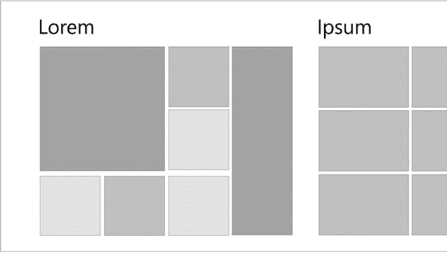

图 1-13 。典型的网格布局，但有一个微妙的设计缺陷

我希望你注意到了最左边的列表条目几乎是对齐的，但并不完全对齐。即使你的用户没有有意识地注意到一些看起来如此琐碎的事情，他们也会下意识地注意到它，这将是一个贬损者。

事半功倍

用更少的资源做更多的事情意味着你打破了现代的轨迹，在屏幕上添加了太多的东西，以至于没有一个东西达到它的目的。

当你设计用户将遵循的使用流程时，要记住的词是*本质*。问问你自己，你是否在展示信息的*本质*并给用户*本质*命令。不必要的信息和命令不仅是多余的，更糟糕的是会分散注意力。

请记住，就像 Windows 本身一样，您并不试图最终被发现。最终身临其境要好得多。

快速流畅

这个原则听起来很熟悉，因为它是设计特征的重复，这说明了这个概念的重要性。当用户使用一个他会描述为“快速和流畅”的应用程序时，他的感觉是很难描述的，但当你看到它时你就知道了。

不要害怕花一些钱在专业的设计帮助上，这些帮助不仅在静态图形方面有经验，而且在动态屏幕和用户体验方面也有经验。

真正数字化

我相信在应用程序开发中，哲学比科学更重要。如果你缩小过去 30 年，看看计算的大规模采用，很明显开发者仍然在试图找出好的架构和可用性。

我们抓住我们知道的范例，把它们拖进我们的数字系统，同时对它们的不适合做鬼脸。也许只有现在我们才知道，数字系统有自己的规则，而且这些规则往往比我们模拟世界的规则更自由，用户可以学习甚至热爱数字世界。

在我们开发应用时，我们充分利用我们拥有的数字系统，避免应用设计接受与数字世界无关的模拟世界的约束。毕竟，我们是在和屏幕上的像素打交道——这是一个必须接受的基本事实。

众志成城

用户不*使用 apps*他们*完成任务*。有时，这些任务涉及单个应用程序，但通常它们涉及应用程序的编排。想象一下下面的场景。

你的应用程序可以帮助用户在餐厅预订。你的用户可能会单独使用你的应用，但更有可能你的用户会:

*   在机场登上自动扶梯
*   查看他们的旅行管理应用程序，找到他们酒店的位置
*   查看酒店附近的餐馆
*   根据用户评论选择餐馆
*   在餐厅预订(使用您的应用程序！)
*   将预订确认发送给同事，然后走下自动扶梯

那个用户是一个快乐的用户。他不仅仅使用了一个应用程序；他在很短的时间内完成了一些重要的事情。在乘坐自动扶梯的过程中，免费的和信息丰富的动画非常重要，每个应用程序的 UX 都非常重要，应用程序到应用程序的共享也非常重要。

要制作一个成功的 Windows 8 应用，你必须考虑用户。其中一部分是确保你的应用程序能够与其他应用程序和设备很好地配合，以完成整个使用场景。

这个设计原则的另一个方面是利用已建立的约定、标准和建议。通过这样做，你将利用用户已经了解的 Windows 8 应用。他们会在你的应用中感到安全和熟悉。

我们已经看到了一些设计特点和原则，希望能在你设计应用程序的过程中有所帮助。现在让我们来看看一个虚构的应用程序设计。

设计场景

在我看来，衡量一个成功应用的标准只有一个。不是安装数量的问题。不是发射次数的问题。不是很高的收视率或很好的评论，甚至不是你银行账户里的钱。

衡量一款成功应用的标准是它给用户生活带来的价值。

永远不要忘记这一点。如果你开发了一个能带来价值的应用，你就开发了一个能带来金钱的应用。不幸的是，我们不能直接量化附加值，所以我相信我们会继续根据许多其他因素来衡量我们的应用程序，我相信你会继续欣赏积极的现金流。

范围

在应用程序开发中获胜的最好方法之一就是做好定义你的应用程序的*范围* 的工作。你的 app 要做一件事，并且做好。我们称之为你的应用程序的*最擅长的“陈述*。

你可能注意到了当今软件世界的趋势，尤其是在移动领域，从几个无所不能的应用转向许多每个都做得很好的应用。如果你的应用程序还能帮他们报税和煮咖啡，你就不会让任何人心碎。如果它做了它想做的事情，并且做得很好，你的用户会喜欢它，给它很好的评价，并给你送现金。

做好一件事意味着很好地界定你的应用。这意味着在你写任何代码之前，你要确定你的应用程序*会做什么*和*不会做什么*。你可能已经知道，确定它不能做什么——对功能说*不*——比添加新功能更困难。

明确地说，巨大的、健壮的和功能齐全的应用程序有它们的位置，如果你有办法承担这些，那就让它成为你的范围。然而，如果你是个人开发者，那么你需要练习裁剪特性。仅仅因为你*能*实现某事，仅仅因为它真的很酷并不意味着你应该去做。作为开发人员，我们倾向于成为理想主义者，我们倾向于非常想添加一些特性来证明我们可以做到。

为了保持特性的统治地位，我推荐使用一个最擅长的语句。你最擅长的陈述是一个简单、简洁的句子，通过填写下面句子中的空格形成:

*这款应用在 _______________ 是同类产品中最好的。*

确保你的回答具体、简洁、清晰。这里有一个例子:

这款应用是同类应用中最好的，它帮助用户寻找当地志愿者的机会，帮助老年人或残疾人做家务、庭院工作或其他家务。

请注意，该声明是如何具体说明谁参与其中的——志愿者加上老年人和残疾人。声明也简短明了。该应用程序不会组织志愿者活动或帮助筹集资金，也不会接受非营利组织的捐款。它只会帮助用户找到一个志愿者的机会。

这句话通过清楚地陈述它做什么和排除它不会做什么，对定义你的应用程序的范围有很大的帮助。然而，帮助人们找到志愿者的机会可能涉及不止一个使用场景。

使用场景

我们的应用程序的愿景正在形成，但它仍然是抽象的，所以为了巩固它，我们将确定使用场景是什么。对于这个应用程序，以下内容如何:

*   允许用户浏览当前位置附近和不久的将来(可能是接下来的两周)潜在的志愿者机会，并按位置和日期过滤机会。
*   允许用户查看他们所有的**当前志愿者机会**。
*   允许用户**与其他志愿者和接受帮助的人**交流。

当你头脑风暴的时候，你可能会产生很多场景，但是这个列表应该被精简，只包括那些直接支持最佳陈述的场景。

这些使用场景中的每一个都暗示了许多支持特性或功能。例如，提供潜在的志愿者机会意味着我们向用户提供每个机会的完整细节，包括位置和持续时间，可能需要什么工具等等。通常，这些使用场景会形成我们将在 hub 页面上看到的部分。

在这一点上，有一些图表纸甚至一些专门的应用程序设计纸将想法写在纸上是非常有帮助的，而不会有实际实现的阻碍。我已经创建了一个 Windows 8 应用设计表，并在`http://codefoster.com/designsheet`以 PDF 格式提供。第一页包括为应用程序设计标准三层导航模型的框架，第二页只是一个 1366 x 768 的整页设计图面，带有浅色网格以及推荐边距、快照视图和应用程序栏的指南。希望这个资源可以帮助你设计你的应用。

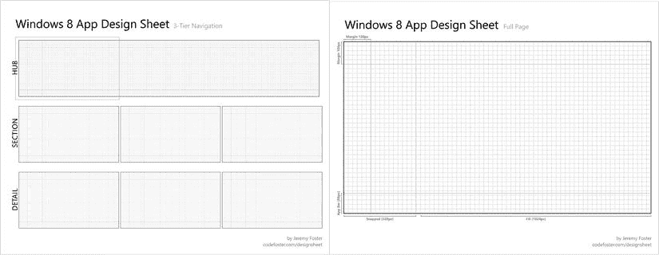

图 1-14。来自`codefoster.com/`设计表的 Windows 8 应用设计表

让我们使用这个设计表来勾画出一个枢纽网页。我们将我们的应用程序命名为*好帮手*，我们将有三个部分:*我的演唱会*、*连接*和*附近的演唱会*。这些部分直接对应于我们的三个使用场景。

请注意，该应用程序确实遵循了基本的 Windows 8 设计准则，但我们在布局上有点创意(可能还不够)，让我们的应用程序有一些自己的个性。在*我的演出*部分和*附近的演出*部分中的机会都使用相对较大的矩形，以允许我们在必要时将一些图像和大量信息带到中心页面。连接部分提供了一列较小的矩形，类似于聊天会话，因为该部分有助于应用程序成员之间的通信。

请记住，hub 页面应该作为整个应用程序范围的一瞥，因此我们应该为每个使用场景找到一个位置。用户喜欢在应用程序中有方向感，一个设计良好的 hub 可以通过不断向用户提供概览来实现这一点，并使其易于深入了解关于给定部分或实体的更多信息。

很明显，hub 页面上没有足够的空间来放置应用程序中所有可用的内容。例如，*nearly gigs*部分可能有 400 个机会，但 hub 只会显示其中的一部分。在这种情况下，将*最近的*机会带到用户中心是有意义的，因为这些机会可能是他最有可能注册的。

该中心让我们不仅可以访问应用程序中可用的部分，还可以直接访问某些项目。在图 1-15 中的概念图中，有三个项目填充了*我的工作*部分，表明用户已经注册了这三个志愿者机会。触摸其中一个项目，用户将直接导航到该机会的详细信息。

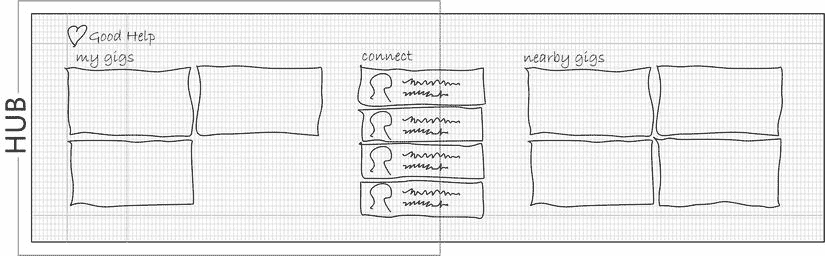

图 1-15 。Good Help 应用程序中心页面的第一张草图

让我们继续我们的应用程序的设计，并绘制一个页面的概念。我们将设计 *gig* 页面，它将传递任何一个 gig 的完整细节。这是用户通过触摸中心上的一个机会来导航到的页面。图 1-16 显示了这个概念。

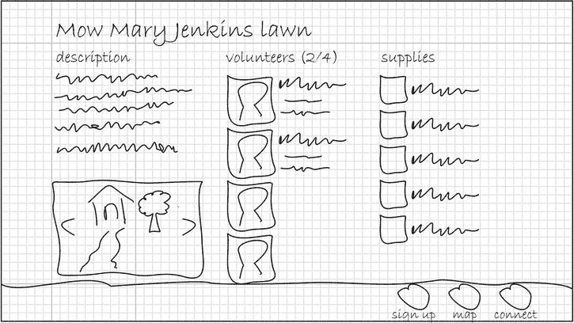

图 1-16 。详细页面的草图

这个设计场景就是这样。我希望这个明显虚构的应用程序在概念上足够接近您正在开发的应用程序，以便您能够快速应用这里的设计原则。

摘要

在这一章中，我们探讨了一个设计良好的 Windows 8 应用程序的一些特征，以及一些需要牢记的设计原则，以帮助指导您完成应用程序的设计和实现过程。

我们访问的最重要的设计特点鼓励我们使用微软的设计风格，包括让用户沉浸在他们的内容中，尽我们所能消除干扰。Windows 8 应用更注重内容的沉浸感和一致性，而不是可发现性。

应用程序开发人员必须打破为 *chrome* 使用设计界面的习惯，这可能是静态导航、用户交互或显式布局。相反，我们学习在不转移用户注意力的情况下替换这种功能的技术。例如，我们通过让内容执行自己的命令来学习如何导航。我们学习了如何让用户通过利用屏幕边缘进行交互——使用应用程序栏和魅力栏。最后，我们学习了如何通过有意识地使用空间和排版来布局我们的内容，而不需要显式的布局工件。

我们通过运行部分设计场景得出结论，在该场景中，我们处理应用程序的范围，然后粗略定义其中心页面和一个详细页面。这个练习与你创建的每个应用程序的过程大致相同(尽管规模较小)。

设计过程是伟大的，当然也是关键和先决条件，但现在是时候让我们动手，投入代码，并学习创建一个实际的 Windows 8 应用程序的基础知识了。*