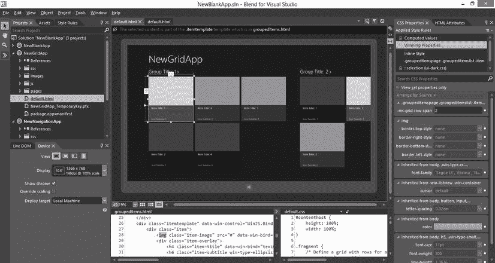

# 二、Windows 8 开发简介

 **注意**对于软件开发人员来说，这是一个激动人心的时刻。

这本书的目标是帮助你深入了解 CSS，尤其是当你为 Windows 8 开发应用程序时它的应用方式。然而，如果你没有任何开发 Windows 8 应用程序的经验，你将很难实践你所学的任何东西。因此，如果这对你来说是一个全新的世界，我们将利用这一章来了解 Windows 8 架构、对你开发应用有价值的工具，以及如何在本地和 Windows 应用商店分发你的应用。

Windows 8 架构

在 Windows 8 进入我们的生活之前，Windows 应用程序可以使用 C++编写，并且可以本地访问 Windows 核心 Win32 库。他们可能更愿意坐得高一点(逻辑上)，用 C#或 Visual Basic 编写，在。NET 框架。或者，如果你稍微扩展一下你的思维，想象一个 web 应用程序是一个 Windows 应用程序，那么一个应用程序可以使用 web 语言编写，托管在一个 web 服务器上(无论是本地的还是远程的)，然后甚至位于 web 浏览器的更高位置。

Windows 8 并没有抛弃任何现有的应用程序创建模式，但它确实引入了一种全新的、令人兴奋的模式。

Windows 8 引入 WinRT。WinRT 是一个全新的现代 API，是为现代应用程序而从头设计和构建的。它不仅仅是 Win32 库或。NET 框架。

Window 的新架构令人兴奋的原因之一是，它可以被几种不同的技术堆栈所瞄准。它可以被 C++和 XAML、C++和 DirectX、C#/VB 和 XAML 以及 JavaScript 和 HTML 作为目标。不同的语言被*投射*到 WinRT 域中，所以它们不构成额外的层次，并且该模型为将来将其他语言投射到 WinRT 中留下了可能性。图 2-1 显示了目前 WinRT 上的不同的语言堆栈。


图 2-1 。可以针对 WinRT 的语言的宏观视图

这些堆栈中的每一个都有其独特的环境和优势。如果你用 C++创作，你可以使用一些现有的 C 和 C++组件。如果你是 C#/VB 和 XAML 的作者，你会对。NET 框架。它不是整个框架，但它是为这些现代应用程序量身定制的子集。

如果您使用 JavaScript 和 HTML 进行创作，您将获得广泛的、基于标准的 web 堆栈，供全球大量开发人员使用。你得到了浏览器的文档对象模型，你得到了我们非常喜欢但又不太喜欢的动态持久语言——JavaScript。也许您得到的最令人兴奋的东西是已经编写了数量惊人的 JavaScript 代码来做许多您可能想做的事情。

然而，当你使用 web stack 为 Windows 8 开发一个应用程序时，该应用程序并不在针对 web 服务器的浏览器中运行；它在平台上本地运行。该应用程序是硬件加速的，并由系统信任以访问系统本身和所有连接的硬件。这对开发者来说是一个全新的空间。

除了直接访问底层 WinRT 之外，Windows 8 开发人员还可以获得 Windows JavaScript 库(WinJS)的额外帮助。WinJS

WinJS 提供了一些 JavaScript 和一些 CSS 样式。稍后，我们将更深入地研究 WinJS 提供的 CSS 样式。

当我们开始编写应用程序时，我们需要一些好的工具，幸运的是，微软提供的工具是首屈一指的。接下来我们将对此进行研究。

工具

微软的旗舰开发工具是 Visual Studio。它已经存在了足够长的时间，在设计和功能上经历了一些重大的演变。除了 Visual Studio，开发人员也可以使用 Blend。

Visual Studio 2012

Visual Studio 2012 (VS2012)是最新的版本，这一版本的设计中没有遗漏任何改进！VS2012 在许多方面与它的前辈几乎没有相似之处，但它没有失去任何功能。您仍然可以创作许多不同的项目类型，现在也可以创作 Windows 8 应用程序。

VS2012 产品之一——Express——只针对 Windows 8 应用，完全免费。当然，它不具备高端付费产品的所有功能，但它仍将从头到尾管理你的应用。这对于学生开发者来说尤其令人兴奋，因为他们没有大的开发机会，也没有钱购买开发工具。

如果你想开发一个 Windows 8 的应用，你必须有 Windows 8，你必须有 Visual Studio 2012。早期版本的 Windows 将运行 VS2012，但无法创建 Windows 8 应用。

项目模板

面向 Windows 8 项目的 VS2012 项目模板将让您快速上手。这些基本模板中的任何一个都将引导你开始使用我们将在本书中学习的 CSS，所以不要觉得你已经走了很远。

让我们从简单的模板开始，然后逐步完善。从以下每个模板创建新项目，然后按照我指出的构成项目的各个页面的结构进行操作。

空白模板

空白模板的稀疏内容不会让您感到惊讶。毕竟，它应该是空白的。然而，如果你是那种对空白模板产生的少量明显的魔力感到好奇的人，你可以访问我的博客文章`http://codefoster.com/Windows-8-Building-Up-to-Blank`,阅读更多关于这个简单模板的内容。

要创建新的空白项目:

1.  在运行 Windows 8 的计算机上启动 Visual Studio 2012
2.  Click File | New Project

     **注意**如果你使用的是 Visual Studio 的专业版，你会看到一个类似于图 2-2 的屏幕。如果你使用 Visual Studio 速成版，那么你的选择会更少，但概念仍然存在。

    

    图 2-2 。“新建项目”窗口为您提供了几个项目类型选项

3.  从左侧窗格中选择“JavaScript”|“Windows 应用商店”,然后从模板列表中选择“空白应用”。确保您对项目的位置和名称满意，然后单击“确定”。

几秒钟后，你就可以运行一个成熟的 Windows 8 应用了。你可以点击工具栏上的绿色箭头在本地运行这个应用程序，但是结果并不令人兴奋。图 2-3 显示了当你运行一个从空白模板创建的项目时的样子。


图 2-3 。从空白模板创建的项目的第一次运行。你几乎看不清的白色文字写着“内容在此处”,并作为占位符供你添加内容

让我们看一下为我们创建的项目，确保我们对所涉及的文件有一个坚实的理解。

如果您有任何使用网站的经验，您可能会注意到解决方案资源管理器中的文件在许多方面类似于 web 项目。像 web 项目一样，有像`js`、`images`和`css`这样的文件夹，像 web 项目一样，在根级别有一个`default.html`文件。您可以深入到所有级别，亲自查看我们没有处理太多的文件。当你试图获得核心概念时，有一个简单的开始是很好的。

在我们查看所涉及的 HTML、CSS 和 JavaScript 文件之前，让我们先来看一个您可能不熟悉的文件— `package.appxmanifest`。这个文件包含了你的 Windows 8 应用的所有元信息。当应用提交到 Windows 应用商店时，这是描述应用的重要信息。

`package.appxmanifest`文件(也称为清单)只是一个简单的 XML 文件，但您很少需要直接盯着 XML，因为双击清单时 Visual Studio 启动的 GUI 设计器相当不错。

现在我们来看 HTML 文件。双击`default.html`打开它，或者如果你面前没有你的项目，就看一下清单 2-1 。

***清单 2-1 。***伴随一个新的空白项目的 default.html 文件

```html
1<!DOCTYPE html>
 2 <html>
 3 <head>
 4     <meta charset="utf-8" />
 5     <title>NewBlankApp</title>
 6
 7     <!-- WinJS references -->
 8     <link href="//Microsoft.WinJS.1.0/css/ui-dark.css" rel="stylesheet" />
 9     <script src="//Microsoft.WinJS.1.0/js/base.js"></script>
10     <script src="//Microsoft.WinJS.1.0/js/ui.js"></script>
11
12     <!-- NewBlankApp references -->
13     <link href="/css/default.css" rel="stylesheet" />
14     <script src="/js/default.js"></script>
15 </head>
16 <body>
17     <p>Content goes here</p>
18 </body>
18 </html>
```

我想强调的是，这个文件中完全没有任何专有的东西。如果你看过 HTML5，你会认出简洁的`DOCTYPE`指令，带有脚本和样式表链接的基本`head`部分，以及世界上最简单的内容体“内容在这里”。

第 13 行和第 14 行引用的脚本和样式表文件以正斜杠(`/`)开始，因此从项目的根开始，继续引用来自`css`文件夹的`default.css`文件和来自`js`文件夹的`default.js`。您将逐渐习惯这种约定，因为所有内置的模板文件都被分成了共享一个名称的`.html`、`.css`和`.js`文件。

清单 2-1 的第 8-10 行乍一看可能很奇怪，但是我会解释为什么这些都是由完全标准的 HTML5 标记组成的。统一资源标识符(URI)，比如第 8–10 行的`link`和`script`元素所包含的，以一个 scheme(比如 http)开始，然后是一个冒号(`:`)。冒号后的所有内容都由 scheme 定义。

对于流行的 http 方案，URI 的剩余部分被定义为`http://{hostname}/{path}`，其中`hostname`通常是服务器的名称或 IP 地址，`path`是被请求文件的完整路径。

然而，清单 2-1 中的 URI 省略了这个方案，规则是如果 URI 的一个段被省略，那么它默认为当前请求的相同段的值。对于网站来说，默认请求通常是 times `http`，但 Windows 8 应用的方案是`ms-appx`。所以第 8-10 行可以写成类似于清单 2-2 的形式。

***清单 2-2 。***ms-appx 方案是 Windows 8 应用的默认方案

```html
8 <link href="ms-appx: //Microsoft.WinJS.1.0/css/ui-dark.css" rel="stylesheet" />
 9  <script src="ms-appx: //Microsoft.WinJS.1.0/js/base.js"></script>
10   <script src="ms-appx: //Microsoft.WinJS.1.0/js/ui.js"></script>
```

在`ms-appx`方案中，双斜杠后面的 URI 段是代码所在的包。在图 2-4 中可以看到，`ui-dark.css`文件(来自清单 2-2 的第 8 行)存在于项目引用下的`Windows Library for JavaScript 1.0`中，该引用包的包名为`Microsoft.WinJS.1.0`。


图 2-4 。ui-dark.css 文件位于被引用的包中

只要请求正在使用`ms-appx`方案，系统就知道它们是安全的请求，并且这些请求被认为是在*本地上下文*中。另一方面，对`http`方案的请求不被认为是安全的，Windows 8 在所谓的*网络环境中运行它们。你可以通过访问`http://aka.ms/win8contexts`找到更多的信息。*

好了，HTML 文件中没有什么神奇的事情发生，所以我要继续向你保证 CSS 或 JavaScript 文件中也没有发生。

空白模板的 CSS 文件位于`css`文件夹中，名为`default.css`。文件中没有功能代码，但是包含了一点框架来帮助您入门。清单 2-3 向您展示了在`default.css`的默认实例中您会发现什么。

***清单 2-3 。*** 空白项目模板附带的 default.css 文件

```html
body {
}

@media screen and (-ms-view-state: fullscreen-landscape) {
}

@media screen and (-ms-view-state: filled) {
}

@media screen and (-ms-view-state: snapped) {
}

@media screen and (-ms-view-state: fullscreen-portrait) {
}
```

这些都只是没有任何效果的样式规则和媒体查询的空壳。然而，这是你的空白画布。当第三章开始向你展示如何定义样式规则时，这就是它们要去的地方。

我们要看的最后一页是 JavaScript。`default.js`文件在清单 2-4 中，正如你所看到的，它比 HTML 和 CSS 文件要长。

***清单 2-4*** 。空白项目模板中包含的 default.js 文件

```html
// For an introduction to the Blank template, see the following documentation:
// http://go.microsoft.com/fwlink/?LinkId=232509
(function () {
    "use strict";

    WinJS.Binding.optimizeBindingReferences = true;

    var app = WinJS.Application;
    var activation = Windows.ApplicationModel.Activation;

    app.onactivated = function (args) {
        if (args.detail.kind === activation.ActivationKind.launch) {
            if (args.detail.previousExecutionState !==
                activation.ApplicationExecutionState.terminated) {
                // TODO: This application has been newly launched. Initialize
                // your application here.
            } else {
                // TODO: This application has been reactivated from suspension.
                // Restore application state here.
            }
            args.setPromise(WinJS.UI.processAll());
        }
    };

    app.oncheckpoint = function (args) {
        // TODO: This application is about to be suspended. Save any state
        // that needs to persist across suspensions here. You might use the
        // WinJS.Application.sessionState object, which is automatically
        // saved and restored across suspension. If you need to complete an
        // asynchronous operation before your application is suspended, call
        // args.setPromise().
    };

    app.start();
})();
```

我不会花时间解释这个文件中发生的所有事情，但是我想指出几件事情。

首先，您应该知道这整个文件是标准的 JavaScript——从技术上讲是 ECMAScript 5。

其次，流程生命周期管理(PLM)在这里处理。PLM 是您编写的代码，用于确保您的应用程序在启动、暂停、重新激活和终止时表现良好。如果你写对了代码，你的用户对你的应用的体验将会是快速和无缝的。

最后，注意 JavaScript 文件中的所有代码都包装在所谓的*立即函数*中，如清单 2-5 所示。

***清单 2-5 。*** 一个立即函数包装代码，就像一个命名空间，并保持它与其他模块和全局命名空间隔离

```html
(function () {

    ...

})();
```

这个立即函数定义一个函数，然后立即运行它。起初，这似乎是一件非常奇怪的事情。为什么需要定义一个函数并立即调用它？你就不能写代码让它执行吗？是的，你可以。immediate 函数是 JavaScript 中的一个常见技巧，它利用了 JavaScript 的函数作用域。功能就像拉斯维加斯。函数中发生的事情留在函数中。因此，你可以在即时函数中任意使用变量和函数定义，而不会添加一堆应用程序其他部分可以看到的垃圾，这些垃圾肯定会造成混乱和冲突。

记住，我们只是触及 JavaScript，因为这毕竟是一本关于 CSS 的书。不过，还有一件事我希望你至少能够认识到，那就是一个*事件*。

事件在许多现代编程语言中都很流行。事件是当某件事情发生时触发的方法。如果用户单击一个按钮，就会触发一个事件。如果用户在屏幕上滚动某些东西，应该会触发一个事件(即使他们只滚动了一个像素)。

我们编写的 JavaScript 应该响应事件，为了做到这一点，我们需要定义方法并将它们绑定到正确的事件。我举一个很基本的例子。

让我们在用户点击按钮时显示一个对话框。为此，我们可以使用清单 2-6 中的代码。

***清单 2-6 。*** 一个简单的事件处理程序，通过点击按钮来启动一个消息框

```html
document.getElementById("myButton").onclick = function(e) {
    Windows.UI.Popups.MessageDialog("Hello").showAsync();
};
```

现在，让我们把这段代码拆开来理解到底发生了什么，以及事件处理程序是如何工作的。

第一部分说`document.getElementById("myButton")`只是引用了一个在 HTML 中定义的 id 为`myButton`的`button`。

`.onclick`是该按钮的点击事件。它的值最初是`null`，但是它希望我们提供一个函数，当按钮被点击时调用这个函数。

清单的其余部分是函数，它只是显示一个对话框，在用户每次单击按钮时显示“Hello”。

为什么选择空白项目？

如果您的应用程序只需要一个页面，空白项目是一个很好的起点。如果你正在开发一个游戏，游戏中的所有动作都发生在一个`canvas`元素中，那么就没有理由将用户导航到另一个页面。

如果您不喜欢有人为您编写代码，您也可以选择使用空白模板。如果你想从零开始(或者几乎从零开始)，那么这里有另一个很好的理由。

关于空白项目模板，还有很多东西需要学习，但这只是一个概述，在深入了解之前，我们将继续学习其他项目模板。接下来，我们将了解导航项目模板。

导航模板

图 2-5 展示了一个用导航模板创建的应用程序。它看起来几乎和图 2-3 中的空白模板一样稀疏，但是它确实有一个页眉。不过，页眉并不是唯一的区别。


图 2-5 。从导航模板创建的项目的第一次运行。我们仍然有白色的小文本，上面写着“内容在这里”，但是现在我们也有了页眉

导航项目模板在空白模板之外添加了一些东西，主要目的是为您提供从一个页面到另一个页面的导航框架。这种改进的导航实际上是由 WinJS 库提供的。我将向您展示所有的差异，并告诉您为什么这个导航框架对我们来说是一个好东西。

如果您要使用文件差异实用程序来查看空白项目模板和导航模板，您会看到两者之间的以下差异。在导航模板中:

*   default.css 中有一些基本的样式更改，提供了符合 Windows 8 设计原则的页眉。
*   default.html 文件不再包含主要内容(“内容放在这里”)，而是包含一个名为 *contenthost 的东西。*
*   项目中的 js 文件夹包含一个 navigator.js 文件，该文件定义了 contenthost 的行为方式。default.html 页面引用 navigator.js
*   该项目有一个 *pages* 文件夹，其中有一个 *home* 文件夹，home 文件夹包含它自己的 HTML、CSS 和 JavaScript 文件。按照惯例，每个页面都将位于 pages 文件夹中自己的文件夹中。

这些几乎是所有的差异。不是很多。为什么这很有帮助？

你可能知道，在 HTML 中，你可以创建超链接，并轻松地从一个文件导航到另一个文件，但至少有几个原因可以解释为什么超链接对于 Windows 8 应用程序来说是不够的。

首先，超链接创建一个新的 HTTP GET 请求，并依赖 GET 请求中可用的查询字符串参数作为传递数据的唯一方式。另一方面，使用导航框架，我们可以在从一个页面导航到下一个页面的过程中传递健壮的 JavaScript 对象。

第二，超链接把用户从一个页面带到另一个页面，让前一个页面的所有范围和上下文完全消失。每个请求都是一个全新的上下文。这给开发人员带来了真正的痛苦，尽管 web 开发人员会发现这是一个常见的问题，但在现代的客户端应用程序中，这是不必要的。导航框架在应用程序的整个生命周期中让用户停留在`default.html`页面上，只是通过替换`default.html`的 DOM 中的内容来将用户导航到另一个页面。这种通用模式被称为单页面架构(SPA ),它越来越受欢迎，甚至在公共网页上也是如此。

图 2-6 展示了超链接导航，而图 2-7 展示了使用单页面架构改进的导航。


图 2-6 。超链接到 page2.html 打破了用户的上下文创建一个新的上下文


图 2-7 。通过 WinJS 库导航保持了上下文的完整性，使开发人员的工作更加轻松

为什么要选择导航项目？

对于任何可能实现多视图的应用程序来说，导航项目都是一个很好的起点。如果你的应用程序要向用户显示产品列表，然后允许他们选择一个产品来查看更多信息，那么你可能需要导航。

我几乎从导航模板开始每个项目，即使我知道我将实现一个网格。导航模板提供的导航功能非常有用，但编写起来很繁琐，但我喜欢从头开始创建网格。

网格模板

接下来是网格项目模板，如图图 2-8 所示。这个庞大的模板包含了大量的代码，如果不小心的话，你会被吓到的。仅网格项目模板就包含了将近 500 行 JavaScript 代码。大小的原因是，除了实现导航框架(我们在上一节中讨论过)，它还定义了一堆样本数据，并包含三个独立的完整页面，实现良好的三层导航。


图 2-8 。从网格模板创建的项目的第一次运行。我们看到的是为我们创建的三层导航模型的中心

网格模板实现了一个名为 *3 层导航的应用导航模型。*强烈建议 Windows 8 应用采用这种三层导航模式。遵循它会给你的用户带来一致性，而设计你自己的模型会有迷惑或失去他们的风险。使用这种导航模型有两个重要原因。首先，它背后有大量的用户研究，其次，它是用户已经熟悉的惯例。

网格模板的核心是 ListView。我们将在本书中深入探讨列表视图。现在，只需知道 ListView 是为您提供熟悉的实体网格的控件。这些实体以*瓦片*的形式出现是相当普遍的，但这当然是可选的。

为什么选择网格项目？

当您的应用程序类似于基本的三层导航模型时，网格项目可以让您快速从 0 到 60。这是一个很好的学习工具，我建议你使用这个模板创建一个应用程序，然后浏览并尝试对代码进行逆向工程。网格模板最大的一个优点就是已经实现了 Windows 8 的设计原则。边距宽度合适，字体大小合适，ListView 组之间的间距合适。

当您更加熟练地创建自己的 ListViews 并使用 CSS 实现设计原则时，我建议您放弃这个模板，使用导航模板。我觉得网格模板引入的复杂性超过了它的价值，但这只是我的看法。

我已经向您介绍了我认为最重要的三个项目模板。还有更多我没讲的。拆分项目模板有它的位置，但它适用于相对狭窄的一组应用程序。固定宽度的项目模板添加的实际代码非常少，如果我需要它的功能，我倾向于自己编写。

唐总管

如果您使用过任何主流浏览器的开发工具，那么您应该熟悉获取 HTML 文档的实时版本的概念。这种对象形式的实时文档被称为*文档对象模型(DOM)* 。

当您使用 Visual Studio 2012 在调试模式下运行 Windows 8 的 HTML/JavaScript 应用程序时，您会在 Visual Studio 中获得另一个名为 DOM Explorer 的窗格。如果您没有看到 DOM Explorer，那么请在 Windows | DOM Explorer 下的调试菜单中查找。

DOM Explorer 为当前运行的应用程序提供了 DOM 的分层表示。它有效地向您展示了 HTML 的外观，但包括了您的脚本(或 WinJS 脚本)在应用程序运行时可能进行的任何动态添加或修改。如果您使用 JavaScript 向 HTML 页面动态添加一个按钮，您将不会在 HTML 文件中看到该按钮，但是它会在 DOM Explorer 中显示。

DOM Explorer 对于开发和调试非常有帮助。图 2-9 显示了 DOM Explorer 的典型视图。


图 2-9 。当你的应用程序运行在调试模式时，Visual Studio 中的 DOM Explorer 显示你的文档对象模型(DOM)的实时视图

在 DOM 浏览器的左侧(在图 2-10 中突出显示)，你可以看到整个 DOM。如果你的应用程序中没有任何花哨的 JavaScript，那么这个 DOM 看起来就像你的`default.html`文件。


图 2-10 。DOM 包括您编写的 HTML 以及运行时动态注入的任何东西

在图 2-9 中的 DOM 上方，注意选择元素按钮。当您单击该按钮时，您的应用程序将成为焦点(在 Visual Studio 前面)，您有机会选择您可能感兴趣的元素。一条细细的蓝线在这次冒险中帮助你。

DOM Explorer 的右窗格(在图 2-11 中突出显示)提供了五个面板，每个面板都给我们不同的视角来观察左侧突出显示的元素。


图 2-11 。使用 CSS 的应用程序开发人员将从 DOM Explorer 中的五个选项卡中受益匪浅

当你设计你的应用时，这些额外的标签是非常重要的。当您按照这本书的内容创建应用于 UI 中的元素的 CSS 样式时，这些样式将出现在这些选项卡中。

前两个选项卡非常相似。 *Styles* 选项卡显示了当前应用于所选元素的所有样式的列表，按照它们来自的样式表排列。*跟踪样式*选项卡也显示了当前应用的所有样式，但是现在它们是按照 CSS 属性排列的。我发现“跟踪样式”选项卡更有帮助。*布局*选项卡显示了一个叫做盒子模型的东西，我们将在第五章中讨论。 *Attributes* 选项卡允许您向所选元素添加 HTML 属性，最后 *Events* 选项卡显示与所选元素相关的任何 JavaScript 事件。

调试 

调试是 Visual Studio 最强大的功能之一。整个执行周期可以一行一行地进行，在应用程序运行时可以观察甚至修改值。深入的调试当然超出了我们的范围，但是我希望简短的介绍将有助于说服或鼓励您选择工具。

当需要运行你的应用程序并观察它的行为时，你有几个选择。标准工具栏上的调试目标选择框如图 2-12 所示，允许您在本地(本机)、远程机器或模拟器上运行应用程序。

您可能通常会在本地机器上调试应用程序。本地跑是最快最简单的路线。当您想要定位另一台机器时，您可以选择远程机器，当您需要模拟开发机器上没有的特性或环境条件时，您可以选择模拟器。

模拟器可以让你模拟触摸、地理位置、屏幕大小和屏幕分辨率。


图 2-12 。Visual Studio 允许您在本地计算机、远程计算机或模拟器中调试应用程序

迸

到目前为止，我们讨论的所有内容都涉及到 Visual Studio 来编写和编辑驱动应用程序的原始代码。这当然是典型的开发方法，但是历史已经表明许多公司尝试实现可视化工具来为我们编写代码。就我而言，我从未被打动过。我看到的每一次尝试都以某种方式失败，最终阻止我使用它，并迫使我回到 Visual Studio 中编辑原始代码。也就是说，直到混合。

Blend 是 Visual Studio 2012 附带的免费产品。它甚至附带了 Visual Studio Express 2012，这也是免费的，所以你可以使用 Blend 而不用支付一分钱。Blend 不同于 Expression Blend。Expression Blend 是一个设计 XAML 组件的工具，但 Blend 是一个设计 XAML 或 HTML/CSS 格式的 Windows 8 应用程序的工具。

Blend 是一个不可思议的工具。大多数视觉设计者强迫用户区分设计模式和执行模式；视图以一种模式设计，然后执行程序来查看结果。在 Blend 中，你总是在设计*和*执行模式 。您的应用程序由 HTML、CSS 和 JavaScript 组成，在 Blend 中运行，就像在机器上运行一样。因此，Blend 可以给你一个动态的 DOM(就像 Visual Studio 的 DOM Explorer 一样，只是它总是动态的！)而且它可以带来你所有的真实数据。在图 2-13 中，你可以看到融合的效果。虽然一开始你可能不会注意到，但是图 2-13 中的网格项目块是从 JavaScript 数据中动态加载的。



图 2-13 。图 2-8 中的 网格 app，现在却在交融中打开

当你点击一个视觉元素，比如一个灰色的图块(在图 2-14 中高亮显示)，Blend 认为你想要改变它的设计，所以它渲染典型的选择矩形和手柄来调整它的大小。如果我们拖动一个句柄并调整对象的大小，那么决定该图块大小的 CSS 将被修改，并且您将看到所有其他图块的大小也发生了变化。


图 2-14 。Blend 运行您的应用程序，但可以设计一个元素

正如我所说的，当你点击一个磁贴时，Blend 假设你对高亮显示磁贴感兴趣，这样你就可以设计它，但是你可能想充当应用程序的用户，并在你点击时实际导航。这就是交互模式的作用。在文档区的右上角，你会发现一个类似于图 2-15 的交互模式图标。激活交互模式会通知 Blend 你想表现得像一个用户，并且实际上*使用*该应用。


图 2-15 。互动模式图标 在交融

最棒的是，当您再次单击交互模式按钮返回到设计模式时，Blend 会保持您的应用程序状态，并允许您从那里继续设计。

也许 Blend over Visual Studio 最重要的贡献是它让您在操作底层样式 HTML 和 CSS 代码时以可视化方式工作。您可能已经有足够的 CSS 经验，知道它的声明可能相当复杂。应用于任何给定元素的样式可以从任意数量的样式规则向下级联，每个规则覆盖下一个规则。尽管这个结构相当复杂，但是当你在 Blend 中改变一个属性时，它能够改变正确的样式。

此外，图 2-16 中的所示的【应用的样式规则】窗格(通常位于 Blend 工作区的右上角)给出了所有应用于各种样式表的 CSS 样式规则的列表。


图 2-16 。应用的样式规则窗格 显示了应用于所选元素的整个样式层次

当您需要创建自己的全新样式规则时，样式规则选项卡 ( 图 2-17 )列出了当前页面引用的所有样式表，明确指出新样式将位于哪个样式表中，并让您有机会更改它。


图 2-17 。样式规则页签 表示将在哪个样式表中创建新规则

我喜欢 Blend 的最后一点是 3 窗格视图，它非常适合同时编辑 HTML 文件及其相关的 CSS 和 JS 文件。

然而，有一点需要注意，Blend 在 JavaScript 方面并不出色。如果您正在处理编程任务，请使用 Visual Studio。幸运的是，这两个工具都共享一个公共的项目格式，所以它们之间的切换是无缝的。事实上，Visual Studio 提供了一个“以混合方式打开”的选项(图 2-18 )，右击一个项目即可使用。


图 2-18 。项目快捷方式使从 Visual Studio 切换到 Blend 变得快速而简单

分发您的应用程序

当你完成第一个应用程序时，这是多么美好的一天。毫无疑问，你会有很多的自豪感和对美元符号的憧憬。在写这篇文章的时候，我在 Windows 商店里有两个应用程序，我希望能写更多。

将你的应用提交到 Windows 应用商店并不是一件困难的事情。过程非常简单，认证要求很明确，沿途的反馈也很有帮助。我不会花时间详细描述商店提交过程，因为商店几乎会全程牵着你的手。不过，我会介绍它，带你进去。

此外，当您的应用程序处于开发阶段并且在发布之前，您可能需要将其安装在另一台设备上进行测试，因此我也将向您展示如何进行测试。

侧装

在设备上安装 Windows 8 商店应用而不使用 Windows 商店的行为通常被称为*侧装*。这绝对是一个受支持的场景，我会让你知道怎么做。

显然，您可以将源代码复制到另一个安装了 Visual Studio 的系统中，打开项目并运行它。这将有效地把你的应用程序安装到第二台设备上。然而，并不是每个设备都有 Visual Studio，Windows RT 设备*不能*有 Visual Studio。不过，还有另一种方法。如果您想在应用程序完成之前进行练习，可以从一个默认的项目模板开始。以下是将你的应用下载到另一台设备的步骤:

1.  在开发计算机上的 Visual Studio 中打开您的应用程序。
2.  Choose Create App Packages from the Store menu (the Store menu is under the Project menu in professional versions of Visual Studio) as shown in Figure 2-19.

    

    图 2-19 。商店菜单中的创建应用程序包选项

3.  Choose No when you are asked Do you want to build packages to upload to the Windows Store? as shown in Figure 2-20. Click Next.

    

    图 2-20 。如果您知道您只打算下载这个版本的应用程序，请选择“否”

    你可以在`http://aka.ms/devlicenseinfo`获得更多关于开发者许可的信息，在`http://aka.ms/sideloading`获得更多关于侧装的信息。

4.  对于选择和配置包步骤，默认值应该是好的。如果您需要针对不同的处理器架构，您可以这样做，如果您不知道这意味着什么，那么就不要去管它，您应该没问题。单击创建。
5.  包创建应该完成并指明位置。按确定。
6.  The package that gets created consists of a folder and an .appxupload file. The .appxupload file is for uploading to the Windows Store when you’re ready to submit it, but the folder is what you want for installing on another device. Use whatever means necessary to get the entire contents of that folder (Figure 2-21) copied to another device.

    

    图 2-21 。创建后的示例应用程序包。ps1 文件负责安装打包的应用程序

7.  在新设备上，您只需右键单击`Add-AppDevPackage.ps1`文件并选择使用 PowerShell 运行。PowerShell 将启动并询问您几个问题，您可以接受默认设置。

这就是相对简单的侧向装载过程。

当然，为了扩大你的覆盖范围并避免在目标机器上要求开发者许可，你需要将你的应用提交到 Windows 应用商店。

发布到 Windows 商店

Windows Store 将让你的应用出现在数千万(很快会是数亿)消费者的眼前。如果你提供给他们的生活增加价值的应用程序，他们会很高兴地安装并使用它，如果你决定收费，他们甚至可能会放弃一些零钱。

要完成提交应用程序的过程，请转到`http://dev.windows.com`并按照说明获取您的开发者帐户。设置好之后，请遵循以下一般步骤:

1.  按照与创建用于侧面加载的包相同的步骤构建应用包，直到您进入创建向导的第一个屏幕，在该屏幕中，它会询问您是否要构建要上传到 Windows 应用商店的包。很明显，这次你会对这个问题做出肯定的回答。
2.  回到`dev.windows.com`，找到并点击 Windows 应用商店应用、仪表板，然后提交应用。
3.  填写关于你的应用程序的大量信息，并在适当的步骤中上传你在步骤 1 中生成的`.appxupload`文件。

有关提交应用程序的完整流程的更多信息，请参考`http://aka.ms/appsubmit`。

摘要

欢迎来到极其激动人心的 Windows 8 开发世界。

在本章中，您已经了解了 Windows 8 的体系结构，它支持广泛的计算机体系结构，以及一套有价值的工具和开发语言。所有这些，至少部分是由一种新的编程模型和一种叫做 WinRT 的现代 API 结合在一起的。

然后，您将接触到世界一流的工具，在您构建应用程序的每一天，它都将是您最好的朋友。广受欢迎的 Visual Studio 的最新版本将 Windows 8 商店应用程序邀请到其目标项目中，并从一些好的项目模板开始，让你在几秒钟内从零到完成产品。

Visual Studio 还欢迎 Blend 作为一个免费的伴侣来帮助应用程序的可视化设计。这两个工具共享一个通用的项目格式，使得设计和开发之间的协作对每个人来说都是流畅的体验。

最后，向您介绍了在本地运行应用程序、在另一台设备上安装应用程序以及将应用程序提交到 Windows 应用商店的选项。

我希望在读完前两章后，你觉得自己至少具备了开始设计和开发你的第一个应用程序的基本技能。还有更多的东西要学，也有很多可以学习的资源。对于 CSS 部门，只要坚持住，因为我们就要深入下去了。