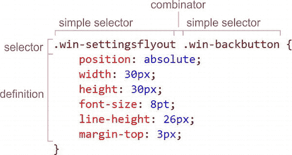

# 三、选择器和样式规则

 **注意** CSS 不过是样式规则的集合，每个样式规则都由一个选择器和一个定义组成。不要让事情变得更复杂。

样式规则的选择器决定它影响什么，而定义决定它如何被影响。

因此，正如 HTML 的全部工作是定义文档的结构一样，CSS 的全部工作是对该结构进行布局和样式设计，使其在应该出现的地方出现。

通过结合 HTML 的文档对象模型(DOM)和 CSS 的元素选择功能，我们有了一种非常有效且相对独特的方式来表达潜在的复杂结构，然后在该结构中单独设计独特的元素集，而不会过于模糊或重复。

我称之为相对独特，因为许多其他 UI 语言的样式往往与文档结构混在一起。然而，对于 HTML 和 CSS，两者可以保持分离。其优势(除了对开发人员来说更清晰)是能够轻松地交换样式表，并在这样做时，完全改变应用程序的布局和风格。

因此，CSS 的强大之处在于它能够定义样式规则，然后确定该规则应该应用于 UI 中的哪些元素。

在图 3-1 中，你可以找到领先于所有其他应用的应用:Windows 应用商店应用。


图 3-1 。Windows 应用商店 app

这个应用程序有内容，但也有很多风格。该应用程序的标题是一个更大的字体和定位；这些应用程序有图像、标题和背景颜色，页面上的一切都有一个非常有意识的布局。总的来说，该应用程序有很好的内容和很好的内容呈现。这才是我们真正的目标。

样式格式和位置

CSS 适用于或描述 HTML。实际上，它一般描述 XML，但就我们创建 Windows 8 应用程序而言，HTML 是我们唯一的考虑因素。这意味着，任何时候你创建一个 HTML 文件，并希望用样式影响该文件中的元素，你需要编写和应用一些 CSS。

这些样式可以存在于三个地方:

*   在一条直线上的
*   在嵌入的样式表中
*   在外部样式表中

内嵌样式

内联样式是在样式属性中定义的，该属性直接添加到它们应该影响的元素中。

内联样式通常被认为是糟糕的形式，因为它们混合了项目中的结构和样式，很快会变得难以处理。我通常从不使用内联样式，我强烈地感觉到，即使有，也是极少的情况下，它们应该被投入生产。它们可能对一些开发人员有帮助，比如快速原型或故障排除设计，但是它们不应该用在最终产品中。清单 3-1 展示了内嵌样式的样子。

***清单 3-1 。*** 一个简单的 HTML5 文档，在 div 标签上有一个内嵌样式属性

```html
<!-- default.html -->
<!DOCTYPE html>

<html lang="en" FontName2">http://www.w3.org/1999/xhtml ">
<head>
    <meta charset="utf-8" />
    <title></title>
</head>
<body>
    <divstyle="font-weight: bold;" ></div>
</body>
</html>
```

嵌入样式表

嵌入式样式表是在它们影响的页面上定义的。一个`style`元素被添加到页面的`head`元素中，并包含样式规则来确定如何将样式属性应用于各种元素。嵌入式样式表通常没有第三个选项常见，在 Windows 8 应用程序中应该很少见。清单 3-2 是一个嵌入式 CSS 样式表的例子。

***清单 3-2 。*** 一个简单的嵌入了样式标签的 HTML5 文档

```html
<!-- default.html -->
<!DOCTYPE html>

<html lang="en" FontName2">http://www.w3.org/1999/xhtml ">
<head>
    <meta charset="utf-8" />
    <title></title>
    <style>
        #myDiv { font-weight: bold; }
    </style>
</head>
<body>
    <divid="myDiv" ></div>
</body>
</html>
```

外部样式表

最后，外部样式表是定义和应用样式的最佳方法。对于外部样式表，受影响的 HTML 文件不会被打印出来。事实上，唯一的痕迹是对样式表的引用，它只需要在`head`元素中使用一行代码，剩下的 HTML 代码完成它的工作，提供文档的结构。使用外部样式表的另一个主要优点是可以轻松地动态交换它们，以支持多主题、多语言甚至多平台。

清单 3-3 展示了一个引用外部样式表的 HTML 文件的好例子。

***清单 3-3 。*** 一个简单的 HTML5 文档，引用了一个外部 CSS 样式表

```html
<!-- default.html -->
<!DOCTYPE html>

<html lang="en" FontName2">http://www.w3.org/1999/xhtml ">
<head>
    <meta charset="utf-8" />
    <title></title>
    <link href="default.css" rel="stylesheet" />
</head>
<body>
    <div id="myDiv"></div>
</body>
</html>

/* default.css */
#myDiv {
    font-weight: bold;
}
```

这些样式表文件(。css)可以保存在任何地方，只要它们可以通过来自 HTML 页面的 HTTP 请求来访问。你可以链接到一个存储在互联网上完全不同的服务器上的样式表，或者它可以在你的 web 项目的中心文件夹中(也许叫做`css`或`styles`，或者它可以就在你的 HTML 文件旁边，你可以在链接的`href`属性中使用绝对引用或相对引用。

在一个 web 项目中，将所有样式表放在一个中心位置是一个相当强的惯例，但这也很常见，尤其是在创建单页面 web 应用程序时，为项目中的每个 HTML 页面创建一个样式表，这是 Windows 8 应用程序中的惯例。当你设计你的 Windows 8 应用时，你可以选择把 CSS 文件放在你选择的任何地方，但是遵循惯例是一个好的实践。内置的 Windows-8 项目模板之一是导航应用程序模板，它遵循这一约定，将每个页面的 CSS 文件、HTML 文件和 JavaScript 文件放在各自的文件夹中，这些文件夹位于`pages`文件夹内。

基本样式规则语法

外部样式表的内容(就此而言，还有嵌入的样式表)很简单——只不过是由一个接一个的样式规则组成的大列表。有时候，样式规则可能会被媒体查询块包装起来，但是我们将稍后再讨论这个主题。

清单 3-4 展示了填充了一些规则的样式表(无论是外部样式表还是嵌入样式表)看起来会是什么样子。

***清单 3-4 。*** 典型格式为样式规则

```html
selector {
    property: value;
    property: value;
    property: value;
}

selector {
    property: value;
    property: value;
    property: value;
}

selector {
    property: value;
    property: value;
    property: value;
}
```

对于一些较短样式的规则，你可能像我一样，宁愿放弃规则之间的换行，而在一行上格式化你的规则，更像清单 3-5 中的。

***清单 3-5 。*** 当样式规则简单时，用于节省垂直空间的更紧凑的格式

```html
selector { property: value; property: value; }
selector { property: value; property: value; }
selector { property: value; property: value; }
```

这样可以节省一些垂直空间，也许还可以延长鼠标滚轮的寿命，但是和它的姐妹技术 HTML 一样，CSS 忽略了多余的空白，所以你可以随意设置格式，并且知道它会被同样地解释。

另一个典型且非常有用的约定是样式规则的缩进，它只影响前面样式规则下面的元素。在命令式编码语言中，缩进被广泛用于向开发人员传达代码结构，使其更易于阅读。在 CSS 中，缩进的代码表示样式规则之间的层次关系。记住空白被忽略，所以这个缩进对功能没有影响。请注意清单 3-6 中的第二个样式规则是如何包含与前一个规则相同的选择器(“selectorA”)的，以及一些更多的细节。这意味着它在它前面的规则的上下文中，这就是缩进所表示的。您将在本书的示例代码中看到这种约定。

***清单 3-6 。*** 缩进严格地作为表示层次的视觉辅助

```html
selectorA {
    property: value;
    property: value;
    property: value;
}

    selectorA selector1 {
        property: value;
        property: value;
        property: value;
    }

selectorB {
    property: value;
    property: value;
    property: value;
}
```

你现在知道什么是风格规则了，是时候学习如何作曲了。我们将从讨论选择器开始。

选择器

想象你正在用一个典型的文字处理器工作。当您完成了文档的撰写和编辑后，您的工作就变成了格式化。要确定文档各部分的格式，需要采取两个步骤:用鼠标拖动选择要格式化的区域，然后应用各种样式规则，通常是通过单击命令按钮或键盘快捷键。例如，您可以选择整个第一段，然后决定将字体大小增加到 16 磅。或者，您可以只选择一个单词，并将其设置为带下划线。

这些正是您将对 CSS 采取的步骤，只是您使用选择器进行选择，并使用样式属性应用样式。您的选择器指定了您想要选择的 HTML 元素，并且相关联的样式属性决定了该选择应该发生什么。

因此，编写能够准确选择您想要的内容的选择器显然是非常重要的一步，我恳请您不要跳过这一部分。事实上，我发现比那些缺乏格式化技巧的开发人员更缺乏 CSS 选择技巧的开发人员。这相当于浪费时间、空间和复杂性，要么用不必要的类和 ID 装饰符过度定义 HTML，要么在 CSS 中使用冗余或冗长的样式规则。任何一个失误都会增加项目的复杂性，即使网站或应用程序运行良好，也会有明显的不利影响。

选择器是一个表达式，它被求值并产生一个零到多个 DOM 元素(或者伪元素，但我们稍后会讲到)的列表。

例如，对选择器的评估可能导致选择页面上的每个`div`元素、`body`中的第一个`p`或页面`footer`元素。然而，选择器可以变得非常具体，导致排序列表中的每三个列表项(`li`)或称为`myDiv`的`div`第三段的第一个字母。

定义选择器的目标是选择您想要的，仅此而已。定义了一个选择器和样式规则，却发现规则影响的元素比预期的要多，这是很常见的。

有几种不同的方式来引用同一个元素。你可以通过它的类型(也就是它的标签名或元素名，即`div`、`p`、`video`、`body`等)来引用它。).如果它有唯一的`id`属性，你可以引用它。您可以通过它的`class`属性中的任何值来引用它。或者，最后，你可以用其他创造性的方法来引用它，我们会在适当的时候讲到。

在我们深入研究不同的选择技术之前，让我们定义几个术语:

*   **`style rule`**。样式规则是一个完整的声明，它将决定哪些元素将受到样式的影响，并定义将应用的样式。它由选择器和声明块组成。
*   **`selector`****。**选择器是在 DOM 中定位一个或多个元素的模式。选择器可以由多个简单的选择器和组合子组成。
*   **`combinator`****。**组合符是一个符号，它定义了左边的简单选择器所指向的元素和右边的简单选择器所指向的元素之间的上下文关系。
*   **`declaration block`****。**样式规则的声明块定义了样式属性及其值，它们将应用于样式规则选择器的结果。

图 3-2 说明了这些术语。



图 3-2 。CSS 样式规则的剖析

现在，让我们学习选择元素的各种方法。

类型选择器

你应该知道的第一个选择器是*型选择器*。类型选择器只是 HTML 元素的名称；使用一个会选择该类型的每个元素。清单 3-7 中的选择器将定位页面上的所有`div`元素，并将文本加粗。

***清单 3-7 。*** 一个针对文档中每个 div 的类型选择器

```html
/* CSS snippet */
div {
    font-weight: bold;
}
```

清单 3-8 将整个正文中的所有文本加粗。从技术上讲，这将尝试定位所有的 body 元素，但是让我们希望你只有一个！

***清单 3-8 。*** 针对文档正文的类型选择器

```html
/* CSS snippet */
body {
    font-weight: bold;
}
```

如果您没有指定类型，而是使用星号(*)，那么您使用的是通用类型选择器，它匹配所有类型。清单 3-9 中的 CSS 将匹配整个页面上的每个元素，并将其字体设置为粗体！

***清单 3-9 。*** 显式使用通用类型选择器

```html
/* CSS snippet */
* {
    font-weight: bold;
}
```

这个通用选择器本身并不经常使用，但是理解它是很重要的，原因我们很快就会谈到。

不要忘记，这些类型选择器单独使用时，将匹配该类型的任何和所有匹配元素。为了只选择一个 *div* 元素，您必须更加具体(我们将在后面介绍更多)。

这很重要。在表达式中，类型选择器必须位于任何其他选择器之前。如果你已经做过 CSS 开发，这可能会让你大吃一惊。你可能使用过选择器，比如清单 3-10 中的选择器。

***清单 3-10 。*** 一些选择器其中包含了隐式使用的通用类型选择器

```html
/* CSS snippet */
.first {
    font-size: 18pt;
}

#firstName {
    border: 1px solid black;
}

:hover {
    color: green;
}
```

在这个例子中，在类选择器、ID 选择器和伪类选择器之前似乎没有类型选择器。但是请注意，如果您没有显式指定类型选择器，那么通用类型选择器(*)会隐式地为您分配。因此，清单 3-11 中的选择器与前面的例子是一样的。

***清单 3-11 。*** 同样的三个规则加上一个显式的通用类型选择器

```html
/* CSS snippet */
*.first {
    font-size: 18pt;
}

*#firstName {
    border: 1px solid black;
}

*:hover {
    color: green;
}
```

这是有意义的，因为你想用类似于`#firstName`的东西来表示的是任何带有`firstName`的`id`的元素。

班级选择器

与类型选择器不同，类选择器除了简单地声明元素之外，还需要你在 HTML 文件中做一些工作。具体来说，你需要用一个类来修饰你的元素。清单 3-12 展示了给一个`div`元素一个`important`类的样子。

***清单 3-12 。*** 一个指定了类的 div 元素

```html
<!-- HTML snippet -->
<div class="important"></div>
```

理解类选择器的预期用途很重要。许多开发人员在应该使用 ID 选择器的地方使用了它们(即将推出)。

添加到 HTML 元素中的类名通常应该是与它们相关的元素的形容词。类描述了它们的元素的一些永久或暂时的特征。当一个`div`包含应该在首页突出显示的内容时，它可能有一个`featured`类。当用户选择一个列表项时，它可能有一个`selected`类。或者一个视频可能有一个`hidden`类，当它应该等待用户动作来显示它时。

注意，我说过这些类可能是一个*瞬态*特征。在您的 HTML 应用程序中，您可能会根据应用程序的逻辑使用 JavaScript 在某些元素中添加或删除类。当用户选择一个元素时，JavaScript 事件可能会触发，并将`selected`类添加到该元素中。这样做时，元素会突然采用适用于所选元素的样式规则。例如，在清单 3-13 中，带有`mydiv`的`id`的`div`并没有启动类，但是当 JavaScript 代码片段中的代码触发时(这可能是对用户所做的事情的反应)，将`bigAndBold`类添加到元素中，由该样式规则定义的所有样式属性突然生效。

***清单 3-13 。*** 以编程方式添加类

```html
<!-- HTML snippet -->
<div id="mydiv">Lorem ipsum</div>

/* CSS snippet */
.bigAndBold {
    font-size: large;
    font-weight: bold;
}

// JavaScript snippet
document.querySelector("mydiv").className = "bigAndBold";
```

用一个类值来修饰你的元素本身并不会对你的元素做任何事情，除非这个类为它定义了一个样式规则。将视频元素的类设置为`hidden`并不会隐藏它，除非你也为隐藏的类编写一个样式规则，比如`display:none`或`visibility:hidden`。

要将某个类作为所有元素的目标，只需在类名前加一个句点(。)在您的选择器中，如清单 3-13 中的所示。

***清单 3-13 。*** 一个引用元素的类选择器带有一个类【重要】

```html
/* CSS snippet */
.important {
    color: red;
}
```

元素不限于单个类。例如，清单 3-14 中的 HTML 标记定义了三个不同的类，完全有效。

***清单 3-14 。*** 一个元素定义了三个类

```html
<!-- HTML snippet -->
<div class="important featured hidden"></div>
```

在这种情况下，我们描述的是一个重要的、有特色的、隐藏的`div`。这没什么不好。

类似地，也许很明显，同一个类名可以修饰任意多的元素。重要的是你永远不要使用一个类来唯一地标识一个元素。唯一地标识元素是`id`属性和 ID 选择器的工作，我们很快就会看到。当您试图指定一组具有共同点的实体时，应该使用类。类本质上与元素集相关。

如果内容的结构可能会改变，那么应该用类选择器来代替类型选择器。当您在选择器中指定一种类型时，比如`div`，您就使您的样式依赖于文档结构，并使将来更改该结构变得更加困难。例如，你可以从定义菜单项的`div`标签列表开始，如清单 3-15 所示。

***清单 3-15 。*** 使用 div 定义的菜单

```html
<!-- HTML snippet -->
<div class="menu">
    <div>Home</div>
    <div>About</div>
    <div>Products</div>
    <div>Services</div>
    <div>Contact</div>
</div>
```

然而，你应该能够预见这种变化的可能性，比如清单 3-16 中的无序列表。

***清单 3-16 。*** 同一个菜单现在被定义为列表项的无序列表

```html
<!-- HTML snippet -->
<ul class="menu">
    <li>Home</li>
    <li>About</li>
    <li>Products</li>
    <li>Services</li>
    <li>Contact</li>
</ul>
```

在这种情况下，您可以通过按类(`menu`)引用菜单来保持 CSS 样式的抽象性，而无需指明类型。那么可以在不影响样式的情况下更改实际使用的元素类型。

所以你应该从清单 3-18 中选择一个，而不是清单 3-17 中的样式规则。

***清单 3-17 。*** 一种类型菜单元素的具体引用方式

```html
/* CSS snippet */
div.menu {
    /* menu styles */
}
```

***清单 3-18 。*** 一种更好、更抽象的指代菜单元素的方式

```html
/* CSS snippet */
.menu {
    /* menu styles */
}
```

第一个要求你有一个`menu`类的`div`。第二个也是首选的例子只需要你有类`menu`的任何元素。第一个例子只适用于第一个例子(使用`div`元素的例子)，但是第二个例子适用于两个例子。

类选择器也可以相互链接，只匹配指定类的所有元素。

ID 选择器

我提到元素的类值应该被认为是元素的形容词——比如`hidden`、`bigger`、`emphasized`、`header`。元素的`id`值应该是它的名字，并且必须是唯一的。一个`img`标签可能有`mainLogo`的`id`，这给了我们一个明确的定义，以供将来参考，并且整个页面上不会有其他的`mainLogo`。

您也必须确信这一点，因为如果您获得具有相同`id`值的多个元素，可能会出现一些奇怪的行为。

当您通过类引用元素时，您可以期望找到从零到许多的任何位置，但是当您通过 ID 引用元素时，您应该只期望一个，因为正如我们已经提到的，ID 应该总是唯一的。

要按 ID 选择元素，可以在元素前使用井号(#)。例如，清单 3-19 显示了一个选择器，它将选择一个`id`值为`mainLogo`的元素，并将其`width`设置为`80px`。

***清单 3-19 。*** 一个 ID 选择器，它应该只匹配一个元素

```html
/* CSS snippet */
#mainLogo {
    width:80px;
}
```

没有必要明确指出类型，因为 ID 选择器总是引用单个特定的元素。

ID 选择真的没有比这更多的了。很简单。

属性选择器

到目前为止，我们已经看到了如何通过类型、类和 ID 来选择元素。然而，元素通常都有属性，可以根据这些属性的值来选择它们。

可以想象，这开启了很多可能性。HTML 元素的数量是有限的，但是有大量可能的属性，甚至每个属性可能有更多的值。

查看清单 3-20 中的选择器，它将为页面上所有的 ListView 控件设置 120 像素的左边距。

***清单 3-20 。*** 匹配 ListView 控件的属性选择器

```html
/* CSS snippet */
 [data-win-control='WinJS.UI.ListView'] {
    margin-left: 120px;
}
```

这里最大的优势是我们的 HTML 元素不需要比现在更具描述性。 *div* 已经通过属性声明它是一个 ListView，所以我们可以使用它，而不是浪费字节来添加 ID 或类属性。

最后一个例子使用了等式选择器([=])来检查`data-win-control`属性的值是否为`WinJS.UI.ListView`。不过，也可以使用其他属性选择器。

如果您只在方括号中指定了一个值，它将检查该属性是否存在，而不管它的值是什么(或者它是否有值！).清单 3-21 将把所有具有`required`属性的`input`元素的文本改为红色。

***清单 3-21 。*** 一个简单检查某个属性是否存在的属性选择器

```html
/* CSS snippet */
input[required] {
    color: red;
}
```

请记住，HTML5 中的`required`属性不像在 HTML 的以前版本中那样需要值。因此，这种存在比较对于这些“无价值”的属性是有帮助的，并且可能还有许多其他原因。

当指定属性的值完全等于指定值时，使用[|=]连字符选择器将会匹配，但如果属性的值中有后跟连字符的指定值，它也会匹配。因此清单 3-22 中的属性选择器将匹配阿郎值为`en`、`en-us`和`en-au`的段落，但不匹配`es`。

***清单 3-22 。*** 所有的 lang 属性都带有英语的派生词

```html
/* CSS snippet */
p[lang|='en'] {
    direction:ltr;
}
```

【`^=]`选择器被称为前缀选择器 ，但我记得是“开头为”。使用这个来查看属性是否有以某个值开始的值。清单 3-23 将为所有 ID 以`item`开头的`div`元素添加一些左边距。

***清单 3-23 。*** 【始于】选择器

```html
/* CSS snippet */
div[id^='item'] {
    margin-left:10px;
}
```

这将匹配`item`、`item1`、`item02`、`item-3`等等，但不会匹配`selecteditem`。

[]选择器也是类似的。它被称为后缀选择器 (我称之为“ends with”)，当属性以您指定的值结束时，它将进行匹配。清单 3-24 将匹配`selecteditem`、`firstitem`和`item`，但不匹配`itemOne.`

***清单 3-24 。*** 【结尾用】选择器

```html
/* CSS snippet */
div[id$='item'] {
    margin-left:10px;
}
```

子串选择器 [ `*=` ]更容易记为“包含”，当属性值的任何部分匹配时，它就匹配。清单 3-25 将匹配所有 ID 包含字符串‘sidebar’的 *div* 元素。

***清单 3-25 。**??【包含】选择器*

```html
/* CSS snippet */
div[id*='sidebar'] {
    margin-left:10px;
}
```

最后，有一个空格选择器 [ `∼=` ]，它将在一个空格分隔的值列表中匹配您的值。这个有时会非常有用。看看清单 3-26 中的 span，它有一个名为`data-food-types,`的自定义属性，该属性将在一个空格分隔的属性值中包含类似`meat`、`vegetable`或`dairy`的内容。在这种情况下，空白选择器非常适合确定`meat`是否是列表中的一个值。值必须完全匹配；它们不能是部分匹配。

***清单 3-26 。*** 空白选择器的一个用例

```html
<!-- HTML snippet -->
<span data-food-types="dairy meat">meal</span>

/* CSS snippet */
span[data-food-type∼='meat'] {
    font-style:italic;
}
```

像类和 ID 选择器一样，属性选择器默认为通用类型选择器，所以下面两行是相同的:

```html
[data-win-control='WinJS.UI.ListView']
*[data-win-control='WinJS.UI.ListView']
```

顺便说一下，在这种情况下，让显式类型选择器(`div`)处于关闭状态非常有意义，因为`data-win-control`只会出现在`div`元素上。

您可以为任何可能描述一个`HTML`元素的属性创建一个属性选择器。对于 HTML，只有被识别的属性才被认为是有效的，但是对于 HTML5，任何被识别的属性或者任何以 *data-* 开头的属性都被认为是有效的，所以开发者可以自由添加以`data-`开头的自定义属性。可能的属性选择器的数量是无限的。

清单 3-27 展示了一些在使用 HTML5 的 Windows 8 应用程序中使用属性选择器的实际例子。

***清单 3-27 。***Windows 8 应用中的属性选择器示例

```html
/* CSS snippet */
section[role=main] {
    /* styles to affect the main section */
}

[data-win-control] {
    /* styles to affect all Windows 8 control in the document */
}

[data-win-control^='WinJS.UI'] {
    /* styles to affect just the UI controls */
}
```

| 属性选择器 |
| --- |
| 标志 | 名字 | 描述 |
| --- | --- | --- |
| `[=]` | 平等 | 匹配具有指定名称和值的属性的元素 |
| `[]` | 存在 | 匹配具有指定名称的属性的元素 |
| `&#124;=` | 连字号 | 匹配具有指定值或指定值后跟连字符的属性的元素 |
| `[^=]` | 前缀 | 匹配具有以指定值开头的属性的元素 |
| `[$=]` | 后缀 | 匹配具有以指定值结尾的属性的元素 |
| `[*=]` | 子链 | 匹配具有包含指定值的属性的元素 |
| `[∼=]` | 空白 | 匹配具有指定值或由空白包围的指定值的属性的元素 |

您可能会感兴趣地注意到，您实际上可以使用属性选择器通过 ID 来选择元素，但是这种形式很糟糕，因为有一个 ID 选择器就是专门为此设计的。

伪类和伪元素选择器

我希望你现在已经有了类的概念。记住，类是一个形容词。它描述了它所修饰的元素，并且是由您——开发人员——显式添加的。另一方面，伪类是固有的。它们是形容词，就像类一样，但是你不需要在 HTML 中指定任何东西。

例如，当用户悬停在一个表格行上时，单词 hover 可以用来描述该行，对吗？其中一个伪类是`:hover`(如您所见，伪类前面有一个冒号)，只要用户将鼠标悬停在该元素上，就可以用它来选择该元素。向选择器中添加伪类比以编程方式向元素中添加类更容易、更简洁。

像其他选择器一样，可以单独指定一个伪类并调用默认的类型选择器。所以`:hover`和`*:hover`是一样的，将匹配悬停在上面的任何元素。

伪元素的概念与伪类的概念非常相似。就像伪类的行为类似于类，但它是固有的，不需要由开发人员指定一样，伪元素的行为类似于元素，但它是固有的，也不需要由开发人员指定。

列表中的第一个列表项就是这样，不管你是否明确指定，对吗？其中一个伪类是:`first-child`，它将选择第一个列表项。这里，我们再次选择元素，而不必被迫编写无关的标记。

您可能会对伪类和伪元素之间的区别感到困惑，这是因为在 CSS3 之前的标准中语法没有区别。CSS3 引入了双冒号(::)语法来引用伪元素，并将单冒号(:)留给伪类。为了向后兼容，以前使用单个冒号的伪元素保留在规范中，所以在下面标准伪类和伪元素的完整列表中，您将会看到它们两次:`::after, ::before, ::first-letter, ::first-line, ::selection, :active, :after, :before, :checked, :default, :disabled, :empty, :enabled, :first-child, :first-letter, :first-line, :first-of-type, :focus, :hover, :in-range, :indeterminate, :invalid, :lang(), :last-child, :last-of-type, :link, :not(), :nth-child(), :nth-last-child(), :nth-last-of-type(), :nth-of-type(), :only-child, :only-of-type, :optional, :out-of-range, :read-only, :read-write, :required, :root, :target, :valid, :visited.`

除了标准的伪类和伪元素之外，还有一些特定于微软供应商的伪类和伪元素，在 Windows 8 应用中工作时，您应该熟悉它们。分别是`:-ms-input-placeholder`、`:-ms-keyboard-active`、`::-ms-browse`、`::-ms-check`、`::-ms-clear`、`::-ms-expand`、`::-ms-fill`、`::-ms-fill-lower`、`::-ms-fill-upper`、`::-ms-reveal`、`::-ms-thumb`、`::-ms-ticks-after`、`::-ms-ticks-before`、`::-ms-tooltip`、`::-ms-track`、`::-ms-value`。供应商特定的伪选择器通常用于访问各种控件的子元素。

我不会带您浏览伪选择器的整个列表，但是我想突出几个我认为最有帮助的。

:词根

`:root`伪类有一个简单的功能，那就是在上下文中定位文档的根元素。例如，当 CSS 描述一个 HTML 文档时，根总是 HTML 元素。你永远不知道这个什么时候会派上用场，所以把它放在你的后口袋里。

*第一个字母

`::first-letter`非常适合在段落中创建首字下沉。我无法想象它还有什么其他用途，但是正如它的名字所表明的，它代表了它所应用的元素的文本中的第一个字母。请记住，有时伪类或伪元素被显式地附加到选择器中的元素上，如在`p::first-letter`中。其他时候，它是隐含在`div ::first-letter`中的。不要错过其中的细微差别。前者的意思是“段落标记的第一个字母”。后者在 div 后面有一个空格，因此意味着“作为 div 后代的每个元素的第一个字母”。

清单 3-28 定义了`::first-letter`伪元素最常见的用法——创建首字下沉。图 3-3 展示了最终的首字下沉。


图 3-3 。样式定义创建首字下沉效果

***清单 3-28 。*** 使用::首字母伪元素定位段落中的首字母

```html
/* CSS snippet */
.dropCap::first-letter {
    font-size: 500%;
    float: left;
    line-height: 0.8em;
    padding: 0 4px 0 0;
    font-family: Serif;
    font-weight: bold;
    position: relative;
    left: -3px;
}
```

:勾选

`:checked` 是一个伪类(你可以通过前面的单个冒号来辨别),它会将选中的复选框(或单选按钮)限制为已经被选中的复选框。清单 3-29 和图 3-4 展示了`:checked`伪类的作用。


图 3-4 。标记为选中的复选框已获得边框样式

***清单 3-29 。**??:选中的伪类选择器在起作用*

```html
<!-- HTML snippet -->
    <div id="checkboxes">
        <input type="checkbox" />
        <input type="checkbox" checked />
        <input type="checkbox" />
        <input type="checkbox" checked />
        <input type="checkbox" />
    </div>

/* CSS snippet */
#checkboxes :checked {
    border: 1px solid red;
}
```

::之前，::之后，和内容

与`content`样式属性结合使用的`::before`和`::after` 伪元素，用于在选择器的目标元素之前或之后注入一些内容。首先，您可能会想知道这个功能在 CSS 中是干什么的。毕竟，这看起来像是应该由 HTML 和/或 JavaScript 处理的内容问题。

然而，在有些情况下，内容的注入实际上更像是一个样式问题。假设您想要在悬停的段落旁边呈现一个小的补充字形，以向用户指示哪一个是焦点。或者，您可能希望在用户已经访问过的链接旁边显示一个复选标记。如果没有`::before`和`::after`伪元素和`content`属性，这两者都是不可能的。

关于`content`属性，至少还有一件有趣的事情。它允许使用一个`attr()`函数来引用上下文中元素的一个属性值。例如，看一下清单 3-30 ，当你悬停在它上面时，它会在每个链接旁边呈现一个弹出工具提示，包括链接的标题。

***清单 3-30 。***::. after 伪元素，用于呈现悬停链接的工具提示

```html
/* CSS snippet */
a:hover::after {
    content: attr(title);
    background-color: lightyellow;
    border: 1px solid black;
    color: black;
    position: relative;
    left: 10px;
    white-space: nowrap;
    padding: 5px;
}
```

:必需的

这个`:required`伪类被大量用于向标记为必需的字段添加样式。清单 3-31 显示了一个例子。通常，web 开发人员会用红色边框、可选背景色或附赠符号来修饰必填字段。如果与我们刚刚学习的`::before`和`::after`伪元素以及`content`属性结合使用，可以将符号添加到必填字段，而不需要任何额外的标记。

***清单 3-31 。*** 一个 HTML 元素，有一个必需的属性和一个 CSS 规则来设置它的样式

```html
<!-- HTML snippet -->
<input type="text" required />

/* CSS snippet */
input:required {
    border: 1px solid red;
    color: red;
}
```

::-ms-expand

`::-ms-expand`伪元素表示呈现在选择控件上的小下拉箭头。

::-ms-浏览

通过使用`::-ms-browse`属性，可以将使用文件输入控件时呈现的浏览按钮作为目标。能够像这样瞄准子元素，可以对应用程序设计的细节进行非常精细的控制。

位置伪类

许多伪类都与元素在 DOM 中的位置有关。他们是`:first-child, :first-of-type, :last-child, :last-of-type, :nth-child(), :nth-last-child(), :nth-last-of-type(), :nth-of-type(), :only-child,`和`:only-of-type`。

这些位置伪类 非常有助于选择正确的元素，而不必用 id 或 class 属性来修饰 HTML 元素。你可以用它们来指代

*   页面上的第一个 div
*   每隔一行表格
*   一节中的最后一段
*   奇怪的菜单项
*   每三个列表项目
*   更多

您会注意到，这些伪类中大约有一半以`-child`为后缀，另一半以`-of-type`为后缀。`-child`不受限于元素类型，而`-of-type`则受限于元素类型。考虑清单 3-32 和清单 3-33 之间的细微差别。

***清单 3-32 。*** 带有-child 后缀的位置伪类之一

```html
/* CSS snippet */
div p:first-child {
    font-weight: bold;
}
```

***清单 3-33 。*** 带有-of-type 后缀的位置伪类之一

```html
/* CSS snippet */
div p:first-of-type {
    font-weight: bold;
}
```

清单 3-32 将选择“其同级中第一个子段的每个段落”，而清单 3-33 将选择“其同级中第一个*段落*的每个段落”。当然，这两个匹配的段落也必须是一个`div`元素的后代，因为选择器是以`div`开始的。

那么，你已经看到了`first-child`和`first-of-type`伪类做了什么，并且你可能猜到了`last-child`和`last-of-type`做了什么。现在看看`:nth-child()`、`:nth-of-type()`、`:nth-last-child()`和`:nth-last-of-type()`。这些伪类是功能性的，这就是它们有括号的原因。

为了说明所有这些位置伪类，考虑清单 3-34 中的表格。

***清单 3-34 。*** 一张桌子有五排

```html
<!-- HTML snippet -->
<table id="myTable">
    <tr><td>Beans</td><td>2.7</td><td>67%</td></tr>
    <tr><td>Corn</td><td>1.7</td><td>40%</td></tr>
    <tr><td>Beets</td><td>2.9</td><td>77%</td></tr>
    <tr><td>Carrots</td><td>7.0</td><td>62%</td></tr>
    <tr><td>Celery</td><td>12.3</td><td>50%</td></tr>
</table>
```

如果我们的目标是选择所有的表格行并将它们的背景涂成灰色，我们可以使用。。。

```html
/* CSS snippet */
#myTable tr {
    background-color: gray;
}
```

另一方面，如果我们的目标是只选择某些行，我们将使用`first-`、`last-`或`nth-`中的一个。

为了选择表格的第一行，我们将使用清单 3-35 中的。

***清单 3-35 。*** 这个:第一个子伪类用来给表格中的第一行着色

```html
/* CSS snippet */
#myTable tr:first-child {
    background-color: gray;
}
```

为了选择最后一个表格，我们将使用清单 3-36 中的。

***清单 3-36 。*** 这个:last-child 伪类用来给表格中的最后一行着色

```html
/* CSS snippet */
#myTable tr:last-child {
    background-color: gray;
}
```

为了每隔一行选择一行，我们可以使用清单 3-37 中的。

***清单 3-37 。**??:第 n 个子伪类，用于对表格中的每隔一行进行着色*

```html
/* CSS snippet */
#myTable tr:nth-child(2n) {
    background-color: gray;
}
```

现在，这个需要解释一下。`:nth-child`伪类的行为就像一个函数，您可以传入一个形式为`an + b`的公式。CSS 引擎会将一组以`0`开始的正整数插入到`n`的公式中。结果将是一组整数。CSS 将忽略负值和零值，并使用产生的正整数来确定哪些项目应该匹配。

在清单 3-37 中，我只提供了`2n`，它相当于`2n + 0`并计算为`[0,2,4,6,8,...]`。`0`被省略，我们实质上是高亮显示每一个偶数行。这是一个常见的场景，所以 CSS 也定义了`even`关键字，并允许我们简单地使用`#myTable tr:nth-child(even)`来创建相同的效果。

然后考虑公式`2n-1`，它将计算出类似于`[−1,1,3,5,7,9,...]`的整数集。然后 CSS 会忽略`1`(因为它小于零)，并将该样式应用于元素 1、3 和 5。就像`even`一样，CSS 定义了`odd`关键字来简化问题。

您传递给一个`nth-`伪类的公式可能会非常有趣。这里有一些例子。。。

 ***。*** 第 n 个伪类的示例公式

```html
2n /* every other (starting with the second) */
2n - 1 /* every other (starting with the first) */
3n /* every third */
3n + 3 /* every third starting with 3 */
-n + 3 /* only the first three */
n + 3 /* all, starting with the third */
```

最后，我们来看看`:only-child`和`:only-of-type`伪类。清单 3-39 使用了它们中的每一个。

***清单 3-39 。*** 示例使用:独生子女和:唯类型伪类

```html
/* CSS snippet */
div p:only-child {
    font-size: larger;
}

div p:only-of-type {
    font-size: larger;
}
```

第一个规则将选择“div 中的段落，只要它是该 div 下的唯一元素”，第二个规则将选择“div 中的段落，只要它是该 div 下的唯一段落元素”。

:目标

您可以使用`:target`伪类向您的应用程序添加一些相当有趣的交互，而无需引入任何 JavaScript。

它是这样工作的。如果文档中有一个元素的`id`值与当前 URL 中的片段标识符相匹配，那么该元素将与`:target`伪类相匹配。

例如，如果您的 URL 是`http://www.mysite.com/#image01`，那么带有`image01`的`id`的元素将匹配`:target`伪类。

片段标识符用于在单个文档中导航用户，所以通过使用这个伪类，您可以添加样式，让用户知道他的焦点在哪里或者他在做什么。

:not( )

最后要给大家看的是:非伪类 。这个是有用的，因为它颠倒了括号内的内容。在前面的例子中，我向您展示了如何使用。。。

```html
#checkboxes :checked {
    border: 1px solid red;
}
```

我们可以颠倒这个逻辑，使用。。。

```html
#checkboxes :not(:checked) {
    border: 1px solid red;
}
```

组合子

我们现在知道如何使用以下方法选择一个柠檬或一组元素:

*   元素的类型
*   元素的一个或多个类
*   元素的唯一 ID
*   匹配元素属性的存在或值的表达式
*   一个或多个伪类
*   一个或多个伪元素

这涵盖了很多情况，但这不是我们用选择器能做的全部。选择者可以在团队中工作。可以使用组合子将它们组合在一起，以指定元素之间的层次结构和可能复杂的逻辑关系，从而到达目标元素。

我们可以很容易地选择页面上的所有`div`元素，并在它们上面添加一些空间，方法是:

```html
div {
    margin-top: 6px;
}
```

然而，如果我们实际上只想在一个节中的 *div* 元素之前添加空格，那么我们就必须使用一个组合符。我们实际上必须使用下降组合子，它看起来像清单 3-40 。

***清单 3-40 。*** 两个简单样式的选择器被一个后代组合符(一个空格)隔开

```html
/* CSS snippet */
section div {
    margin-top: 6px;
}
```

清单 3-40 中的选择器中有一个空格。它将`section`和`div`分开，这在两者之间建立了一个层次关系。它表示只有作为`section`的子节点的`div`应该匹配。这个空间被称为*派生组合子*，我们将更深入地研究它和其他三个。

下降的

使用一个空格(`˽`)来表示一个后代组合符。

在两个选择器之间使用这个空格意味着:“选择匹配第二个选择器的所有元素，其中该元素是匹配第一个选择器的元素的后代”。听起来好像满嘴都是，但是看着也不难。一个例子将澄清这一点。

```html
div p {
    padding: 2px;
}
```

前面的代码将在`div`内的所有段落标签周围添加一些填充。这意味着它们可以嵌套任意多级，并且可以位于任何`div`的内部。这是一个非常自由的选择器。

子

*子组合子*是一个大于号(`>`)。

子组合子类似于后代组合子，只是它更加具体。只有当右边选择器匹配的元素是左边选择器匹配的元素的直接后代时，子组合子才匹配。

当你忘记了子组合子，并且懒散地在你的选择器之间留出一个空间时，你可能会遇到麻烦。例如，`div p`的选择器将匹配任何一个`div`的子段落，当你的`div`下只有一层子段落时，这很好。然而，它也将匹配`div`的远祖`p`元素，这可能是也可能不是你想要的。

这就是子组合子的用武之地。它要求右边的元素是左边元素的*直接*子元素。

一般同胞

后代和子组合符表示元素之间的垂直父子关系，但是*兄弟组合符* ( `∼`)表示同一父元素的子元素之间的水平关系。

一般的兄弟姐妹意味着兄弟姐妹的顺序，但没有说兄弟姐妹之间有多近或多远。给定`A ∼ B`,`A`和`B`必须有相同的父元素，并且`B`必须在`A`之后，但是中间可能有许多元素。

相邻的兄弟姐妹

*相邻兄弟组合子* ( `+`)类似于一般的兄弟组合子，只是更具体一些。相邻的兄弟元素表明，与任一侧的选择器匹配的元素不仅是兄弟元素，而且它们彼此紧挨着，并按照指定的顺序排列。

你可能不会像其他人一样经常使用相邻兄弟组合符，但是当你需要它的时候，它是一种很好的资产。清单 3-41 显示了一个这样的例子，如果一个`H1`元素紧跟在另一个`H1`元素之后，那么这个例子的意图就是删除这个`H1`元素上面的空格。

***清单 3-41 。*** 相邻兄弟组合子的绝佳用法

```html
/* CSS snippet */
H1 + H1 {
    margin-top: -10px;
}
```

选择器组

我们已经看到了在类型、类、ID、属性等方面匹配的简单选择器。我们已经看到了使用组合子将简单的选择器串在一起形成层次结构。选择器还有一个非常重要的特性，那就是我们对它们进行分组的能力。希望用相同的样式属性来描述多个目标元素集是很常见的。例如，也许我们希望确保每个标题标签上方有 10 个像素的空间，无论它是`h1`、`h2`还是其他。

这可以用单独的样式规则来描述，但是这是非常多余的，所以应该使用分组语法。分组就是简单地在选择器之间添加一个逗号。清单 3-42 展示了我们如何给所有的标题标签增加空间。

***清单 3-42 。*** 一种样式规则，使用选择器链接来应用于五个级别的标题标签

```html
/* CSS snippet */
h1, h2, h3, h4, h5 {
    margin-top: 10px;
}
```

重要的是要注意，当使用更复杂的选择器时，逗号表示选择链的完全重置。你可能会尝试类似于清单 3-43 中的代码，例如，对某个`div`下的所有标题标签应用相同的样式，但是结果并不是你想要的。因为逗号中断了选择链，所以`h1`将正确工作，但是`h2`、`h3`和`h4`选择器实际上将匹配文档中的每个`h2`、`h3`和`h4`。

***清单 3-43 。***

```html
/* CSS snippet */
#topDiv #childDiv h1, h2, h3, h4 {
    margin-top: 10px;
}
```

这个难题的解决方案是在链中的每个术语上包含完全限定的样式选择器。清单 3-44 展示了这个相当冗长但精确的解决方案。

***清单 3-44 。*** 修正了选择器链，为每个术语添加了完整的层次结构

```html
/* CSS snippet */
#topDiv #childDiv h1, #topDiv #childDiv h2, #topDiv #childDiv h3, #topDiv #childDiv h4 {
    Margin-top: 10px;
}
```

样式定义

记住，样式规则是由它的选择器和定义(也就是声明块)组成的。还要记住一个简单的概念，即在定义要修改的内容之前，必须先选择一些内容。我们已经详细讨论了如何选择你想要的东西，现在是时候实际做些什么了！

样式规则的定义非常容易理解，因为它只是一个键值对形式的样式属性集合。键和值总是用冒号(`:`)分隔，对之间用分号(`;`)分隔。

键是您将很快了解的许多 CSS 样式属性之一，值是该属性的有效值之一。

例如，颜色是 CSS 样式属性，红色是它的许多有效值之一。定义一个元素的文本颜色需要用一个选择器来定位该元素，然后为颜色属性键提供一个红色值。

清单 3-45 中的规则将使所有段落文本变成红色。

***清单 3-45 。*** 将所有段落文本设置为红色

```html
/* CSS snippet */
p {
    color: red;
}
```

你现在应该能认出选择器了。`p`是选择器。这是一个类型选择器，它将匹配文档中的每个段落标签。该定义由一个键值对组成。键是`color`，值是`red`。

这是样式规则最简单的部分，但是它们也不会变得更复杂。选择器可能更长、更具体，这里多个样式属性对替换了单个属性对。

学习 CSS 主要涉及两件事:

1.  学习如何使用选择器和
2.  了解可供您使用的所有可能的样式属性

查看可用样式属性的最简单方法是在 Visual Studio 中使用 IntelliSense。当您在样式定义中调用智能感知时，您将看到所有可能的样式定义的完整列表(图 3-5 )。IntelliSense 不会根据哪些属性适用于您选择的元素类型来筛选列表。


图 3-5 。应用于 CSS 样式属性的 Visual Studio 智能感知

有数百个属性，我将在后续章节中介绍其中的许多属性。现在，我只是想确保你理解一些使用它们的基本原则。

正如我所说的，定义一个样式属性非常简单，只需键入一个冒号(:)，键入值，然后用分号(；).

清单 3-46 显示了在一个样式规则中定义的几个样式属性，该规则将应用于所有的`p`元素，并将指示其中的文本为蓝色和粗体。

***清单 3-46 。*** 具有两个属性的样式规则

```html
/* CSS snippet */
p {
    color: blue;
    font-weight: bold;
}
```

速记属性

您的样式规则可能很短，只有几个属性，也可能很长，有很多属性。这完全取决于需要对目标元素应用多少样式。

现在考虑下面的大尺寸样式规则，它将应用于所有的`div`元素，并指示它有一个 2px 宽、虚线和红色的边框。

```html
div {
    color: blue;
    border-left-color: red;
    border-left-style: dashed;
    border-left-width: 2px;
    border-top-color: red;
    border-top-style: dashed;
    border-top-width: 2px;
    border-right-color: red;
    border-right-style: dashed;
    border-right-width: 2px;
    border-bottom-color: red;
    border-bottom-style: dashed;
    border-bottom-width: 2px;
}
```

令人生畏，不是吗？对于像在元素周围添加红色虚线边框这样简单的事情来说，这显然不是一种优雅的方式，这也是速记属性存在的原因。速记属性允许您一次定义多个样式属性。让我们利用简写属性可以节省的空间和时间重写最后一个例子。

```html
div {
    color: blue;
    border: 2px dashed red;
}
```

那好多了。一处房产取代了 12 处！`border`属性是一个速记属性。它以空格分隔的特定顺序获取属性值列表，并将它们应用于更长的实际属性列表。

同样，Visual Studio 是您的朋友。当您输入一个简写属性时，您会得到一个工具提示，向您显示它所期望的以空格分隔的属性列表(图 3-6 )。


图 3-6 。Visual Studio 的工具提示建议速记属性的值

看看这些常见的简写属性。。。

```html
border:3px groove black;
font:bold 12px arial;
margin:4px 7px 2px 4px; /* sets the top, right, bottom, and left margins */
padding:10px 2px 7px 1px; /* sets the top, right, bottom, and left padding values */
background:url(image.png) no-repeat gray;
```

边距和填充属性(我们将在第三章中详细讨论)甚至有一些替代形式。

```html
margin:4px 7px; /* sets the top/bottom margins to 4px, left/right margins to 7px */
padding:10px; /* sets padding to 10px on all sides */
```

属性值

有效属性值(冒号后面和分号前面的值)因样式属性而异，但它们都遵循一些基本规则。所有属性共享一个公共的有效值，即`inherit`。值`inherit`将指示属性应该从其父元素获取其值。

长度值必须是数字，后面紧跟下表中的一个标准 CSS 度量单位。

| 单位 | 描述 |
| --- | --- |
| `em` | 计算出的字体大小 |
| `Ex` | 小写“x”的高度 |
| `Px` | 像素，相对于观察设备 |
| `rem` | 根元素的字体大小 |
| `vw` | 视口宽度 |
| `vh` | 视口高度 |
| `vm` | 视口宽度或高度的较小值 |
| `ch` | 零宽度(呈现字体中零字符的宽度) |
| `in` | 英寸 |
| `cm` | 厘米 |
| `mm` | 毫米 |
| `pt` | 点数(1 点= 1/72 英寸) |
| `pc` | 十二点活字(1 点活字= 12 点) |

除了这些测量单位之外，您还可以指定一个后跟百分号(`%`)的值来计算您相对于其容器的长度。例如，宽度为`50%`的表格单元格将(至少试图)占据表格宽度的一半。

CSS3 引入了一些函数，可以用来给单元添加一些额外的魅力。即使涉及不同的单元，函数也会为你做一些计算。下面的代码将`div`的宽度设置为比其父容器的全宽小 20 个像素，这在页面上放置对象时可能非常有用。

```html
div {
    width:calc(100% - 20px);
}
```

而`min()`和`max()`将接受任意数量的参数，并分别返回较小的或最大的。要将左填充设置为 10%和 20 像素中较小的一个，您可以使用以下内容:

```html
div {
    padding-left:min(10%,20px);
}
```

级联顺序、特异性和范围

使用 CSS 的最终目标是获得应用于文档元素的属性。因此，重要的是要考虑一些会影响哪些应用，哪些不应用的细节。

层叠

CSS 中的 *C* 代表级联，所以你可能会猜测它是这项技术的旗舰特性之一，你可能是对的。

级联是指将样式规则应用于目标元素的方式。一个样式规则可能只应用于一个元素，而被另一个更重要的样式规则覆盖。

您的浏览器(遵循 CSS 标准)决定这些规则中哪一个更重要的方式是一件相当复杂的事情。我会尽量保持简单，但你应该明白这里发生了什么，所以你不会发现自己抓耳挠腮，想知道为什么你的文本是绿色的，而你的意思是它是黑色的。

样式规则确实是按顺序应用的。但是那个顺序是什么？还记得将样式属性应用于页面元素的三种方法吗？内嵌样式、嵌入样式表和外部样式表。嵌入样式中的样式规则会覆盖外部样式表中的样式规则，内联属性会覆盖这两种规则。

查看清单 3-47 中的 HTML 页面和外部样式表，您能确定`div`中的`Hello, World!`文本是否要加粗吗？

***清单 3-47 。***CSS 样式规则的层叠性质

```html
<!-- default.html -->
<!DOCTYPE html>
<html>
    <head>
        <title></title>
        <link href="default.css" rel="stylesheet" />
    </head>
    <body>
        <div id="myDiv"style="font-weight:normal;" >
            Hello, World!
        </div>
    </body>
</html>

/* default.css */
#myDiv {
    font-weight: bold;
}
```

答案是不会大胆。外部样式表指示它应该是，但是内联样式用`font-weight: normal`属性覆盖了它。

如果您不确定哪些规则将被应用，哪些规则将被覆盖，请使用样式跟踪工具。大多数现代浏览器在开发人员工具中包含这样一个功能，当使用 Windows 8 应用程序时，Visual Studio 中也提供了同样的功能。

特异性

特殊性在这件事上也起了作用。特异性是一个奇特的词，用来描述计算机对你的选择器有多具体的最佳猜测，从而在与其他规则竞争时应该给它多少权重。如果两个样式规则以同一元素为目标，但其中一个以更具体的方式这样做，那么它被确定为具有更高的特异性，它获胜，并且应用该样式规则的属性而不是另一个。

例如，ID 选择器就非常具体。如果某个`div`元素是两个样式规则的目标，每个都试图给它一个不同的颜色边框，但是一个通过它的`id`引用它，另一个通过它的类型引用它，那么前者将获胜。下例中的`div`将会有一个红色的边框，尽管我们已经给了它一个蓝色的类。

 ***。***

```html
<!-- HTML snippet -->
        <divid="myDiv" class="blue" >
            Hello, World!
        </div>

/* CSS snippet */
#myDiv {
    border: 1px solid red;
}

.blue {
    border: 1px solid blue;
}
```

为了更深入地了解 CSS 特异性，我推荐 David Powers 的书 *Beginning CSS3* 。

范围

当您学习 JavaScript 时，您将学习一种称为模块化模式的模式，这种模式旨在为某些 JavaScript 块提供范围，否则这些块将完全暴露给全局名称空间，从而暴露给应用程序中的所有其他代码。

CSS 没有这种东西。CSS 没有任何作用域！这意味着，如果在任何给定的 HTML 页面上引用了 100 个样式表，那么所有的 CSS 样式对于所有的页面都是可用的。

然而，Windows 8 应用程序往往遵循一种导航模式，即让用户停留在单个页面上(default.html)，并加载用户导航到的页面的 HTML、CSS 和 JavaScript，而不是实际改变范围。这对开发者和用户来说都是一个非常好的实践。这实际上也是现代网站应用程序中一个非常流行的趋势，但是如果你在一个单页应用程序的一个页面上定义了一个 CSS 样式规则，你可能会不小心让这个规则影响到其他页面。因此，建议您在 CSS 样式的规则选择器前面加上 Windows 8 赋予所有页面片段的类，这只是页面的名称。

如果你在 Visual studio 的 Windows 8 项目中创建了一个名为`orders.html`的新项目，那么默认情况下你的页面的 HTML 将包含一个`orders`类的`div`。如果您在所有的选择器前面加上`.orders`和一个空格(记住，那是后代组合符)，那么您的样式规则将只匹配页面中存在的元素。这是一个很好的实践。

媒体查询

CSS3 的前身 CSS2 有媒体类型。根据指定的媒体值，媒体类型允许应用不同的样式表。两个常见的媒体值是`screen`或`print`。这意味着当用户代理(通常是浏览器)将文档呈现到屏幕上时，开发人员可以指定一个应用于文档的样式表，而另一个样式表用于将文档呈现到打印机上。

CSS3 随着媒体查询的引入得到了很好的发展，极大地增加了功能。

有了媒体查询，我们不再需要引用完全不同的样式表，而是能够更精确地指定应用于各种媒体相关特征的 CSS 样式规则块。

媒体查询可以确定应该应用单个样式规则(比整个表单更细粒度)，而不是仅仅确定在给定的情况下应该应用样式表(尽管这仍然是可能的)。

通过媒体查询，不仅可以区分各种媒体类型(如`screen`和`print`以及`handheld`、`projection`和`tv`)，还可以区分方向(纵向和横向)以及各种大小、分辨率和纵横比。

将不同风格应用于不同媒体配置的能力对于 Windows 8 开发来说绝对至关重要。Windows 8 可以安装在大量的系统上；这些系统中的大多数都有不同的尺寸和分辨率屏幕——有些可以旋转——最重要的是，Windows 8 提供了捕捉应用程序的能力，将其设置为 320 像素宽，并将其放在屏幕上另一个应用程序的旁边。这引入了更多可能的渲染配置。

谢天谢地，媒体的询问让我们作为开发者的工作变得容易多了。

媒体查询以关键字`@media`开始，接着是媒体类型和一些特征，最后得到真或假的值。只有当类型和所有特征都匹配时，媒体查询才为真。

因此，有效的媒体查询语法如下所示:

```html
@media type and feature1 and feature2 and featureN {
    styleRule1;
    styleRule2;
    styleRuleN;
}
```

类型的有效值为:`screen`、`print`、`braille`、`handheld`、`print`、`projection`、`tty`、`tv`、`embossed`、`speech`、`all`，特征的有效值为:`width`、`height`、`device-width`、`device-height`、`orientation`、`aspect-ratio`、`device-aspect-ratio`、`color`、`color-index`、`monochrome`、`resolution`、`scan`、`grid`。在使用 Windows 8 应用时，`-ms-view-state`将会是你最好的朋友。这是您确定应用程序处于哪个视图状态的方法。它可以是全屏横向、全屏纵向、快照或填充(当一个应用程序被快照到你的应用程序旁边时)。

上面列举的特征值的子集可以以`min-`和`max-`为前缀。例如，`min-device-width: 800px`的值将是有效的，并且有助于指定仅在所使用的设备至少 800 像素宽时才匹配的媒体查询。此外，如果设备支持 256 色或更少的颜色，`max-color-index: 256`的值将是有效的，并且将匹配。

可以通过用逗号分隔多个媒体查询来构建媒体查询列表。这只是在多种情况下应用同一套样式规则。在清单 3-49 中，当输出介质在屏幕或彩色打印机上时，颜色样式属性将应用于所有段落。

***清单 3-49 。*** 针对屏幕和彩色打印机的媒体查询

```html
/* CSS snippet */
@media screen, print and (color) {
    p {
        color: red;
    }
}
```

除了指定介质查询应适用的介质类型，您还可以指定介质查询应排除的介质类型。您可以使用以下命令进行媒体查询，该查询适用于除打印机之外的所有内容。。。

```html
@media not print {
    p {
        color: red;
    }
}
```

这将在除打印之外的所有情况下应用颜色，在打印中可能希望节省彩色墨水。

如果你正在创建一个 Windows 8 应用程序，你肯定会想要处理至少两个视图状态——全屏景观和快照视图，如果没有其他的，媒体查询是可行的。

摘要

我们已经知道 CSS 的目的是用样式影响 HTML，而用样式影响 HTML 是一个双重过程，首先，选择一个或多个 HTML 元素，其次，定义应用于该选择的样式。

我们详细研究了选择过程——使用多种选择器类型和使用多种组合器类型将它们放在一起，这样我们的选择可以更加具体。

我们详细讨论了样式定义以及如何在样式定义中定义多个属性。我们还看到了速记属性的作用，使我们的样式属性更容易编写。

我们看到了样式规则如何级联、生效以及可能相互覆盖，我们还看到了如何使用媒体查询使样式规则仅在与设备、设备大小和视图状态相关的特定情况下生效。

接下来，我们将看看真实的、实时的样式属性，我们将从与样式文本相关的属性开始。