# 四、文本属性

 **注意**伟大的排版有一些非常引人注目的地方，会让用户喜欢你的应用。

如果你已经阅读了第一章，那么你知道如何选择元素，你知道如何为这些元素定义样式规则，现在，你已经准备好把单纯的结构变成既美观又实用的东西了。

我们将详细了解许多样式属性中的一些。在这一章中，我们将介绍与排版相关的属性——与应用程序中的文本相关的属性。我们将查看文本颜色和字体属性，以决定文本呈现的字体、大小和粗细。我们将探索在 Windows 8 应用中比在传统网页设计中更受欢迎的多栏布局，我们将学习如何控制文本栏中的断字。

让我花点时间让你相信在你的 Windows 8 应用中高质量排版的重要性。排版不仅仅是让文本看起来很花哨——至少在 Windows 8 应用中是这样。在 Windows 8 中，排版用于传达风格，但也用于传达结构和层次。它帮助用户的眼睛和大脑快速判断屏幕上内容的意义。它用于帮助他们区分应用程序的标题、部分的类别以及组成应用程序内容的文本正文。

因此，花时间学习如何更好地控制应用程序中的文本显示，然后考虑微软设计风格原则的第一条——*对工艺表现出自豪*。这意味着你应该花时间来确保你的应用程序是完美的，有意识地让你的字体美观是一种完美应用程序的重要方式。

文本

页面上的文本有一个传递信息的基本功能，但小心选择字体和文本布局可以区分一个看起来像字典的应用程序和一个真正吸引用户的应用程序。

在这一部分，我们将会看到一些基本的文本属性，这些属性可以让我们控制文本的颜色、不透明度、粗细、大小和字体。先说颜色和不透明度。

颜色和不透明度

颜色属性 决定了选中元素的前景色。它主要影响元素包含的文本。

定义颜色有三个常见的地方:`color`属性、`background-color`属性(参见第三章)和`border-color`属性(同样，参见第三章)，颜色总是以相同的方式定义——实际上是以*方式*定义——有四种常见的方式来定义颜色:

*   按颜色名称
*   按十六进制值
*   通过 rgb()或 rgba()函数
*   通过 hsl()或 hsla()函数

命名颜色

对大多数人来说，用颜色的名字来定义颜色可能是最直观的，所以如果有一种已命名的颜色符合你的要求，那就一定要使用它。您可以通过名称定义颜色，只需将颜色名称作为值提供给`color`属性。在 HTML/CSS 标准中有 147 种命名颜色，你可以在`http://www.w3.org/TR/css3-color/#svg-color`看到它们的列表。其中一些是基本的像:`Red`、`Green`、`Blue`。其中一些是像`DarkRed`、`LightGreen`和`DarkSlateBlue`这样的基础的派生。其中一些完全是深奥的，如`DarkGoldenRod`、`LemonChiffon`和`PapayaWhip`。命名的颜色不区分大小写，所以`papayawhip`和`PapayaWhip`一样有效。

十六进制颜色

使用十六进制值来定义颜色，你可以拥有远不止 147 种颜色——实际上更像是 1680 万种颜色。也许您还记得早期 web 开发中的建议，即您应该坚持使用窄范围的“web 安全色”，但是在当今时代，浏览器只能使用窄范围的调色板的情况少之又少，这个建议几乎没有意义。如果您正在创建一个 Windows 8 应用程序，那么您知道您正在使用 Internet Explorer 浏览器引擎的最新 web 标准，您当然不需要担心像这样的遗留兼容性问题。

十六进制颜色值是一个六位数的十六进制值，前面有一个哈希(`#`)。例如，`#FFEFD5`将给出等同于`PapayaWhip`的值，十六进制值也不区分大小写，所以`#ffefd5`也能很好地工作。第一对十六进制数字代表红色级别，第二对代表绿色级别，第三对代表蓝色级别。

表 4-1。一些十六进制值和它们的颜色等价物

| 十六进制值 | 颜色 |
| --- | --- |
| #000000 | 黑色 |
| #ffffff | 白色 |
| #ff0000 | 红色 |
| #00ff00 | 绿色的 |
| #0000ff | 蓝色 |
| #ffff00 | 黄色 |
| #00ffff | 蓝绿色 |
| #ff00ff | 品红 |

即使是我们当中更狂热的数字骑师也需要一些时间来转换十进制和十六进制，因此任何现代图形软件包都应该提供您选择的任何颜色的十六进制等价物，这很方便。用十六进制值来指定颜色并不能提供不透明度，所以如果你需要某种程度的透明度，那就继续读下去。

对于带有重复对的十六进制值，如`#000000`、`#ffffff`，甚至是`#aa33dd`，有一种指定十六进制值的简写方法。如果您指定一个只有三个字符的十六进制值，那么它将成对重复这三个值。用这个速记技巧，用`#000`代替`#000000` ( `black`)，`#fff`代替`#ffffff` ( `white`)，或者`#ff0`代替`#ffff00` ( `yellow`)。

颜色

用`rgb()`和`rgba()`函数定义颜色非常简单。`rgb()`函数的工作方式与十六进制值类似，只是三个颜色分量作为十进制参数传递给函数，而不是三个十六进制对。颜色值`rgb(0,0,0)`将产生黑色，就像十六进制值`#000000`一样。rgba()函数在接受 alpha 值方面更进了一步。alpha 值定义颜色的不透明度；也就是说，它决定了颜色出现的程度，而不是让它的背景透过。这是透明的反面。完全不透明(零透明度)的蓝色是蓝色，并完全覆盖其背景，而一半不透明(半透明度)的蓝色让一些背景通过，就好像它是蓝色的玻璃。作为一个例子，`rgb(0,0,255)`将完全是蓝色的，而`rgba(0,0,255,0.5)`将产生类似蓝色玻璃的东西。

红色、绿色和蓝色的值可以是从 0 到 255 的整数值，也可以是百分比值(后跟一个%符号)。alpha 值应该始终是从 0.0(完全透明)到 1.0(完全不透明)的十进制值。

HSL 颜色

与`rgb()`和`rgba()`类似，您可以使用`hsl()`和`hsla()`功能根据色调、饱和度和亮度值指定颜色。HSL 是表示独特颜色的另一种方法。色调代表颜色在彩虹中的位置，饱和度大致对应于颜色的丰富程度，明度代表颜色的明暗程度。使用 HSL 值代替 RGB 值的好处是它们相对直观。一旦你有了正确的色调，你就可以调整它的饱和度和明度值来对颜色进行明智的调整，这对于 RGB 来说就不可说了。任何 RGB 值的微小变化都会产生完全不同色调的颜色。这在创建色带时特别有用，在色带中，选择一种色调作为主题颜色，并使用不同的饱和度或亮度值来创建应用程序的视觉资产。

这些函数将它们的第一个参数(色调)作为一个从 0 到 255 的整数，将它们的第二个和第三个参数(饱和度和亮度)作为一个百分比，`hsla()`将第四个参数(alpha)作为一个从`0.0`(完全透明)到`1.0`(完全不透明)的小数。

不透明

`opacity`属性是相关的。文本的不透明度决定了允许透过文本显示多少背景。显式设置文本的不透明度与在`rgba()`或`hsla()`函数中使用 alpha 值是一样的(并且可以结合使用)。不透明度实际上与透明度相反，因此最大值`1.0`将导致文本不允许任何背景通过(100%不透明度或完全不透明)，最小值`0.0`将允许背景完全通过(0%不透明度或完全透明)。

当我们开始制作动画时，不透明度变成了一个更加有用和相关的话题。通常，不透明度从 0 到 1 的动画会使其淡入，从 1 到 0 的动画会使其淡出。

字体和文本样式

大多数与版式相关的属性(前面的例子除外)都以`text-`或`font-`开头，现在你会看到其中的许多属性。字体属性非常多，所以有一个速记属性，非常有用。在谈论速记语法之前，我将介绍一下各个属性。在接下来的章节中，我们将对字体的可能性进行更深入的探讨。

字体风格〔??〕

属性主要用于斜体显示你的文本。这些值(除了所有属性共享的继承值之外)实际上是`normal`、`italic`和`oblique`。使用`italic`将选择正在使用的斜体版本。然而，使用`oblique`非常相似，你可能会挠头想知道它们之间的区别。不同的是，`italic`选择斜体版本的字体，`oblique`只倾斜普通版本的字体。通常它们看起来非常相似，但有时它们实际上非常不同。

大多数印刷工人不喜欢使用`oblique`而不是利用合适的斜体，但它在紧要关头肯定会起作用。如果你不太在乎完美的排版，那么这将省去你嵌入额外的斜体子集字体的麻烦。清单 4-1 中的代码定义了字体样式的三个值，图 4-1 描绘了结果。

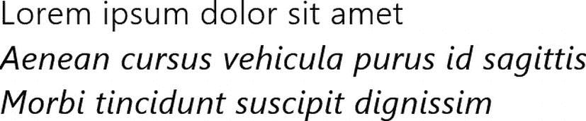

图 4-1 。在大多数情况下，斜体字看起来和斜体一样，但是用斜体字代替真正的斜体字体可能会被严肃的印刷者所反对

***清单 4-1*** 。使用 font-style 属性使文本倾斜

```html
<!-- HTML snippet -->
<div class="normal">Lorem ipsum dolor sit amet</div>
<div class="italic">Aenean cursus vehicula purus id sagittis</div>
<div class="oblique">Morbi tincidunt suscipit dignissim</div>

/* CSS snippet */
.normal { font-style: normal; }
.italic { font-style: italic; }
.oblique { font-style: oblique; }
```

字体变体

`font-variant`非常简单，只有`normal`和`smallcaps`表示值。小型股可能是标准资本化的一个有趣而有效的变体。在小型大写字母文本中，所有字母都是大写的，但只比小写字母稍微高一点。你可以在清单 4-2 和图 4-2 中看到小型大写字母变体的例子。

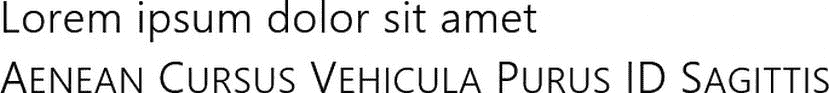

图 4-2 。请注意，第二行中的所有字母都是大写的，但是实际的大写字母只比小写字母高一点点

***清单 4-2*** 。使用 font-variant 属性将文本转换为小型大写字母

```html
<!-- HTML snippet -->
<div class="normal">Lorem ipsum dolor sit amet</div>
<div class="smallCaps">Aenean Cursus Vehicula Purus ID Sagittis</div>

/* CSS snippet */
.normal { font-variant: normal; }
.smallCaps { font-variant: small-caps; }
```

字体粗细

您可能会经常使用`font-weight`属性来决定您的文本是否应该加粗。一个`normal`值将是正常的，一个`bold`值将是粗体的。字体的粗细可以通过指定从`100`-`900`到`100`的任意增量进行数值设置。`400`的值与`normal`相同，而`700`的值与`bold`相同。您也可以使用`bolder`或`lighter`使文本比它所继承的值逐渐变粗或变亮。清单 4-3 和图 4-3 提供了一个例子。

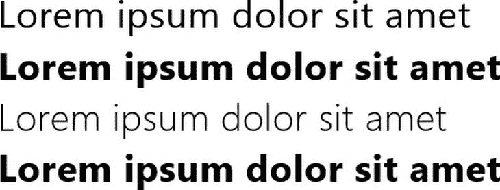

图 4-3 。第二行(粗体)明显比第一行(正常)要粗，第三行(100)明显要浅，最后一行虽然是最大的字体粗细，但几乎看不出来

***清单 4-3*** 。使用 font-weight 属性使文本加粗或不加粗

```html
<!-- HTML snippet -->
<div class="normal">Lorem ipsum dolor sit amet</div>
<div class="bold">Lorem ipsum dolor sit amet</div>
<div class="_100">Lorem ipsum dolor sit amet</div>
<div class="_900">Lorem ipsum dolor sit amet</div>

/* CSS snippet */
.normal { font-weight: normal; }
.bold { font-weight: bold; }
._100 { font-weight: 100; }
._900 { font-weight: 900; }
```

字体大小

您可以选择指定字体大小。

*   **`absolute sizes`。**可以使用绝对尺寸:`xx-small`、`x-small`、`small`、`medium`、`large`、`x-large`和`xx-large`。指定绝对大小让用户代理决定实际大小。
*   **`relative sizes`。**您可以指定`larger`或`smaller`的字体大小，这将使字体大小比其继承的值大或小一个增量。
*   **`length.`** 你可以使用一个长度值作为字体大小，这将设置字体大小绝对不考虑用户代理。
*   **`percentage`。**如果你使用一个字体大小的百分比，它将设置相对于其父字体大小的字体大小。

我们将主要关注 Windows 8 应用程序的像素——至少是要出现在屏幕上的元素。请记住，Windows 8 会自动放大以获得更高分辨率的显示器，因此开发人员不需要动态修改字体大小。清单 4-4 和图 4-4 显示了使用中的各种字体大小。

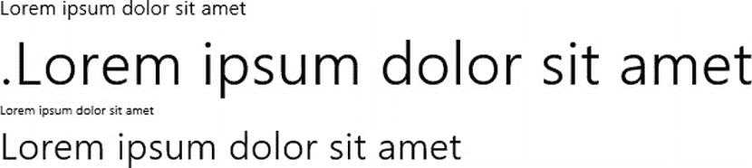

图 4-4 。字体大小的差异不言自明

***清单 4-4*** 。使用 font-size 属性放大或缩小文本

```html
<!-- HTML snippet -->
<div class="pt">Lorem ipsum dolor sit amet</div>
<div class="in">.Lorem ipsum dolor sit amet</div>
<div class="px1">Lorem ipsum dolor sit amet</div>
<div class="px2">Lorem ipsum dolor sit amet</div>

/* CSS snippet */
.pt { font-size: 12pt; }
.in { font-size: .5in; }
.px1 { font-size: 10px; }
.px2 { font-size: 30px; }
```

行高

与`font-size`相似和相关的是`line-height` (也称为前导)，它控制每行文本上下的空白。`line-height`的值也是长度值，两倍于`font-size`的`line-height`将有效地产生双倍行距文本。您也可以使用百分比值。清单 4-5 和图 4-5 显示了行高示例。

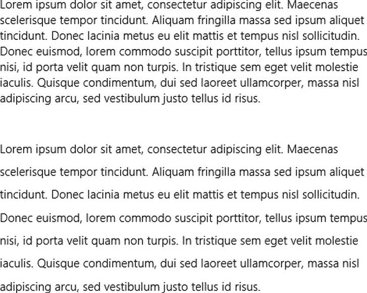

图 4-5 。通过将行高指定为 200%,第二段被赋予双倍行距

***清单 4-5*** 。使用 line-height 属性设置一行文本的垂直间距

```html
<!-- HTML snippet -->
<div>Lorem ipsum dolor sit amet...</div>
<div class="doubleHeight">Lorem ipsum dolor sit amet...</div>

/* CSS snippet */
.doubleHeight { line-height:200%; }
```

字体系列

`font-family`的值决定了使用哪种字体来呈现目标元素的文本。这是一个逗号分隔的系统字体列表，通常被称为*字体堆栈*。用户代理将继续尝试应用字体堆栈中的字体，直到成功找到用户系统上实际安装的字体。

除了实际的字体名称，您还可以指定五个通用字体关键字中的任意一个:`serif`、`sans-serif`、`monospace`、`cursive`、`fantasy`。如果用户代理找到了字体堆栈中的通用字体，它将从安装在设备上的通用类型中选择一种字体。一些样本字体系列值在列表 4-6 和图 4-6 中说明。

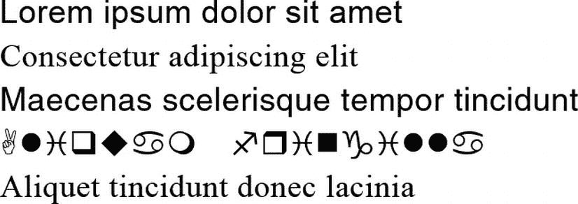

图 4-6 。呈现系统上可用的第一种字体。请注意 serif 和 sans-serif 后退，并注意最后一种字体“垃圾”在系统中找不到，因此使用默认字体

***清单 4-6*** 。使用 font-family 属性选择字体

```html
<!-- HTML snippet -->
<div class="f1">Lorem ipsum dolor sit amet</div>
<div class="f2">Consectetur adipiscing elit</div>
<div class="f3">Maecenas scelerisque tempor tincidunt</div>
<div class="f4">Aliquam fringilla</div>
<div class="f5">Aliquet tincidunt donec lacinia</div>

/* CSS snippet */
.f1 { font-family: arial, sans-serif; }
.f2 { font-family: 'times new roman', serif; }
.f3 { font-family: trebuchet, helvetica, sans-serif; }
.f4 { font-family: wingdings; }
.f5 { font-family: garbage; }
```

字体速记属性

所有上述字体相关属性都可以封装在字体速记属性中。font 属性需要很多值，所以语法正确很重要。最重要的是它们以正确的顺序提供。

提供属性的顺序是:`font-style`、`font-variant`、`font-weight`、`font-size`、`line-height`，然后是`font-family`。不过也有一些警告。

*   `font-style`、`font-variant`和`font-weight`是可选的，如果它们顺序不对也可以工作，但是它们必须在`font-size`和`font-family`之前。
*   `font-size`和`line-height`应该用斜线(/)而不是空格分隔。
*   `line-height`是可选的，显然，如果你不包含斜线，就不应该包含它。
*   `font-size`和`font-family`是强制性的。没有任何一项，整行都将被忽略。

清单 4-7 展示了几个字体速记属性值，图 4-7 展示了结果。

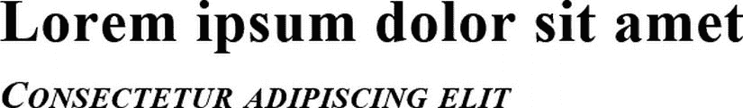

图 4-7 。如果属性值的顺序正确，它们都将生效

***清单 4-7*** 。使用字体速记属性一次设置多个字体属性

```html
<!-- HTML snippet -->
<div class="f1">Lorem ipsum dolor sit amet</div>
<div class="f2">Consectetur adipiscing elit</div>

/* CSS snippet */
.f1 { font: bold 36pt trebuchet; }
.f2 { font: italic small-caps bold 24pt/48pt 'times new roman'; }
```

文本转换

属性用来控制文本的大小写。`capitalize`值将每个单词的第一个字母大写，`uppercase`值将整个单词大写，`lowercase`值将所有字符转换成小写。文本转换属性在清单 4-8 和图 4-8 中进行了说明。

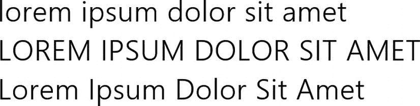

图 4-8 。第一行被转换为小写，第二行被转换为大写，第三行被转换为大写，每个单词的第一个字母大写

***清单 4-8*** 。使用 text-transform 属性更改文本的大小写

```html
<!-- HTML snippet -->
<div class="lowerCase">LOREM IPSUM DOLOR SIT AMET</div>
<div class="upperCase">lorem ipsum dolor sit amet</div>
<div class="capitalize">lorem ipsum dolor sit amet</div>

/* CSS snippet */
.lowerCase { text-transform: lowercase; }
.upperCase { text-transform: uppercase; }
.capitalize { text-transform: capitalize; }
```

 **全部大写！**你会注意到微软在 Windows 8 的很多地方都选择了全大写——菜单就是其中之一。与人们的设想相反，使用全部大写是降低文本相对重要性的有效方法。人类的大脑被训练来阅读小写或标题大小写的文本，但是大写的文本在视觉上更像是一种补充元素，更倾向于被引用而不是被阅读。请记住，这并不适用于全大写的段落文本。大写的段落文字会吸引读者的注意力，但方式不恰当。微软风格手册上说“不要全部用大写来强调”。用句子结构来强调。最好避免为了强调而格式化，但是如果一定要为了强调而使用格式化，那就用斜体格式，不要全大写。”(微软出版社，2012 年)

文本装饰

您可以使用`text-decoration`属性更改出现在文本上方、下方和中间的线条。实际上，CSS3 调用了对`text-decoration`属性的扩展，以允许伴随文本的线条的颜色和样式。新标准将`text-decoration`属性本身变成了`text-decoration-line`、`-color`和`-style`的简写属性。不幸的是，在撰写本文时，这个新标准还没有被任何现代浏览器实现。这包括支持 Internet Explorer 10 和 Windows 8 应用程序的 Trident 引擎。

在标准实现之前，只需使用值为`overline`、`line-through`或`underline`的`text-decoration`属性，在文本之上、之中或之下添加分数，如清单 4-9 和图 4-9 所示。

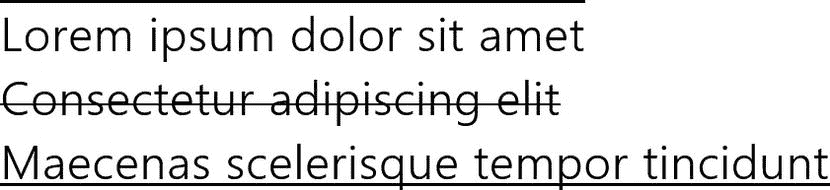

图 4-9 。导致文本上方、中间和下方出现线条

***清单 4-9*** 。设置为上划线、划线和下划线的文本装饰值

```html
<!-- HTML snippet -->
<div id="style1">Lorem ipsum dolor sit amet</div>
<div id="style2">Consectetur adipiscing elit</div>
<div id="style3">Maecenas scelerisque tempor tincidunt</div>

/* CSS snippet */
#style1 { text-decoration: overline; }
#style2 { text-decoration: line-through; }
#style3 { text-decoration: underline; }
```

字体-面

我们已经讨论了如何指定颜色、大小，甚至字体系列，但是有一个相当明显的警告。如果你指定了`font-family: pickle;`，那么用户必须在他的机器上安装 *pickle* 字体才能正确看到它。

无论你的目标是网络还是 Windows 8，这都是一个重大问题。有几个字体，你可以很好地打赌，将在您的用户系统，但没有一个可以保证。你可以使用通用的字体类型，但是这并不能保证你的排版看起来和你设计的一样。你需要的是确定用户能够通过提供字体来查看你的页面。这就是`@font-face`的用武之地。`@font-face`是自定义字体定义。`@`语法表明它不是一个属性或值，而是一个特殊的 CSS 实体，很像`@media`关键字。

`@font-face`关键字允许我们定义自定义字体名称和字体源的 URL。很可能你的字体会出现在你的项目中，我建议你按照惯例把你的字体放到一个名为`type`的文件夹中。在这种情况下，您可以简单地提供一个根级别的 URL，如`/type/myfont.ttf`。

清单 4-10 展示了一个简单的`@font-face`定义以及该字体在 HTML 中的实现。注意，`font-family`值在`@font-face`块中定义，然后在`.nifty`样式规则中引用。这个名称是您自己选择的，但是引用必须与定义相匹配。

***清单 4-10*** 。引用存储在项目类型文件夹中的字体文件的字体定义

```html
<!-- HTML snippet -->
<span class="nifty">This is my nifty font!</span>

/* CSS snippet */
@font-face {
    font-family: "niftyfont";
    src: url("/type/nifty_n.woff") format(woff)
}

.nifty {
    font-family: niftyfont;
}
```

你可以在`src`属性中指定多个值来创建一个兼容性堆栈，但是当你在 Windows 8 应用上工作时，你的优势是不必担心其他浏览器作为目标。示例中的格式是 WOFF，但是您可能没有使用过这种字体格式。

WOFF (Web 开放字体格式)是由 Opera、微软和 Mozilla 共同提出的开放格式标准。WOFF 格式实际上不是一种新的字体格式，而只是现有的 EOT，TTF，OTF 字体的包装。包装 WOFF 的现有字体以用于您的应用程序有几个强大的优势:

*   WOFF 被压缩，因此换行字体比其相关的原始字体小。
*   元数据可以包含在字体包中，以传递关于字体来源的信息，甚至是它的许可信息。

不过，无论你使用传统字体还是 WOFF 字体，如果你希望你的应用程序具有可访问性、适应性和可搜索性，添加良好的排版是一个好主意，定义字体(而不是仅仅在位图中嵌入你的自定义类型)是一个好主意。

Microsoft 供应商特定的文本属性

微软提供了一些供应商特定的、文本相关的 CSS 属性，即:`-ms-text-autospace`、`-ms-text-align-last`、`-ms-text-justify`、`-ms-text-kashida-space`、`-ms-text-overflow`和`-ms-text-underline-position`。这些属性不会被广泛使用，但在某些情况下，它们实际上是至关重要的。

属性允许处理表意文字——传达思想的亚洲字符——周围的间距。

属性决定了如何处理一个段落的最后一行的间距。

属性控制 kashida 间距，这是阿拉伯书写系统中某些字符的扩展。

最后，`-ms-text-underline-position`属性可以决定文本的下划线(如果应用的话)是显示在字符的下面还是上面。值为`above`和`below`，默认为`auto`。

对齐和对齐

对齐是文本布局的一个重要部分。对齐方式控制渲染引擎处理文本前后左右空间的方式。很可能，每个人都有在文字处理器中左对齐、居中、右对齐和对齐文本的经验。这正是`text-align`属性的工作。

您可以将`text-align`属性设置为`left`、`right`、`center`或`justify`的值。

除了设置文本的水平对齐，你还可以做很多事情来控制它的垂直布局。`vertical-align`属性取值如下:`auto`、`baseline`、`sub`、`super`、`top`、`middle`、`bottom`、`text-top`、`text-bottom`。默认值`baseline`将文本行的底部(不包括下行)与其父行的基线对齐。`vertical-align`属性也将接受一个长度或百分比值作为偏移量。

`vertical-align`属性并不总是如您所料。事实上，根据它所应用到的元素的类型，它的行为略有不同。

当您在图像标签上使用`vertical-align`时，它的行为类似于旧的`valign`属性，并确定图像相对于包含它的文本的位置。

当您在表格的单元格中使用`vertical-align`属性时，它会影响单元格中文本(或其他元素)的垂直对齐，如清单 4-11 中的所示。

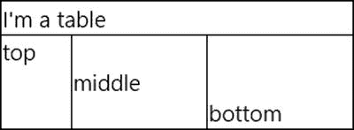

图 4-10 。单元格文本按照定义正确垂直对齐

***清单 4-11*** 。简单表格中的垂直对齐

```html
<!-- HTML snippet -->
<table>
    <tr>
        <td colspan="3">I'm a table</td>
    </tr>
    <tr>
        <td>top</td>
        <td>middle</td>
        <td>bottom</td>
    </tr>
</table>

/* CSS snippet */
table { width: 300px; border-collapse:collapse; }
table tr:nth-of-type(2)  { height: 80px; }
table td { border: 1px solid; }
table tr:nth-of-type(2) td:nth-of-type(1) { vertical-align: top; }
table tr:nth-of-type(2) td:nth-of-type(2) { vertical-align: middle; }
table tr:nth-of-type(2) td:nth-of-type(3) { vertical-align: bottom; }
```

关于清单 4-11，我想指出一些与主题无关的事情:

*   边界-崩溃:崩溃；属性用于移除表中单元格之间固有的间距
*   n-of-type()选择器用于根据位置选择表格行和单元格

在图 4-10 的表格单元格中，可以看到文本已经垂直居中。

然而，当你试图在`div`中使用`vertical-align`时，你可能会大吃一惊。注意在清单 4-12 中，我们是如何试图指示被称为`va`的`div`将其文本水平居中和垂直居中对齐的。

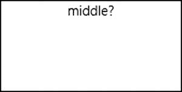

图 4-11。我们提供的文本没有垂直居中

***清单 4-12*** 。关于使用垂直对齐的一个常见错误

```html
<!-- HTML snippet -->
<div id="va">
    middle?
</div>

/* CSS snippet */
div#va {
    height: 100px;
    width: 200px;
    vertical-align: middle;
    text-align: center;
    border: 1px solid black;
}
```

它在水平方向上到达了中间，但在垂直方向上显然不在中间。为什么这个属性被忽略了？属性不只是在 CSS 中奇怪地实现。对于表格单元格，它实际上是垂直对齐的，但是如果我们的 *div* 包含行内元素(行内元素像文本一样流动并换行)，那么`vertical-align`会做一些完全不同的事情。它相当于旧的`valign` HTML 属性，调整元素相对于基线的垂直位置。这丝毫不会影响它们在父容器中的位置。

这个问题似乎已经困扰网页设计师几十年了，我知道这也是我自己一些不眠之夜的原因。网页从来没有真正被设计来指定垂直行为。HTML 的本质是水平伸缩，内容从上到下垂直流动。这些标准已经发展并取得了进步，但是仍然存在过去的残余。

有一些变通方法可以帮助解决这个问题，但是没有一个是好的，这就是为什么微软 CSS3 实现中的新网格非常受欢迎。第六章将带您深入了解网格的实现，以解决这个重大问题。

`vertical-align`的另一个重要用途是将文本设置为上标或下标。`sub`和`super`值将为您执行此校准。您经常会在`span`元素中找到这个。例如，下面可以用来构造等式`y = x` <sup>`2`</sup> 。

```html
<div>y = x<span style="vertical-align:super;">2</span></div>
```

列

许多现代 HTML 应用和网站严重依赖大量文本，CSS3 通过引入多栏文本管理将这些应用带入了可行性领域。对多列的支持也不仅仅是微弱的支持。它功能强大，功能齐全。

在引入多栏之前，开发人员被迫手动或以编程方式布置栏。新的多列 CSS 属性真的让任何类型的阅读器应用程序不仅成为可能，而且富有表现力和趣味性。

多列支持对 Windows 8 来说尤其重要，因为设计语言是水平布局而不是垂直布局。经常听到有人质疑这是为什么，那么下面是几个原因。。。

*   首先，水平平移是独特的，是差异化的。这是 Windows 8 重塑用户体验的另一种方式，也是它在竞争中脱颖而出的另一种方式。
*   世界上大多数语言都是从左向右阅读的，因此从左向右平移对人类来说是很自然的。
*   大量文本水平排列的应用程序读起来就像一本杂志，新内容从右边显示出来。这再次使它成为一个熟悉的范例。
*   人体手臂和手的解剖结构水平移动比垂直移动更容易。试着左右滑动，然后上下滑动，你就会看到了。
*   最后，屏幕传统上是横向的，随着屏幕纵横比从 4:3 变为 16:9，屏幕变得更加夸张。

对于垂直布局，完全有可能有一个与屏幕宽度相同的列，但对于从右侧显示新内容的水平布局，列就成了必需的。

请注意，从垂直滚动改为水平滚动的一个含义是，文本将不再逐行显示，而是逐列显示(图 4-12 )。在第六章中，我们将学习捕捉点。对齐点有助于让用户停留在文本的每一列。其结果很像翻页——电子书阅读器已经使用了多年，纸质书已经使用了几个世纪。

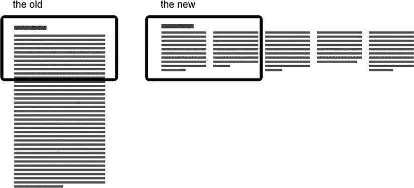

图 4-12 。垂直文本布局与水平文本布局

垂直滚动和水平滚动之间的差异相当于布局的巨大变化。查看图 4-13 和图 4-14 以查看每个版面中相同内容的示例——一篇关于巴黎的文章。

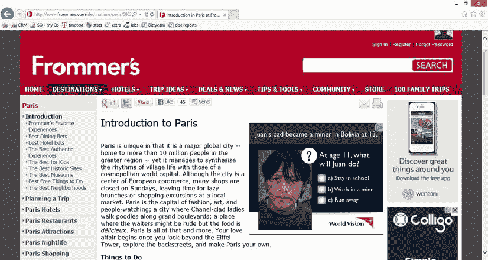

图 4-13 。使用垂直滚动文本在屏幕底部运行的网络文章

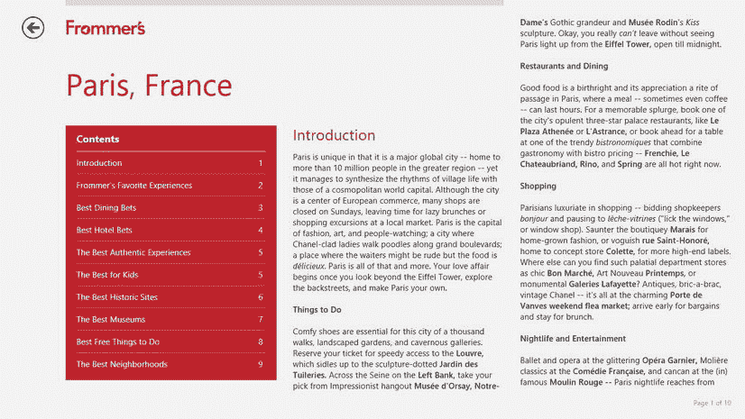

图 4-14 。同一篇文章在一个 Windows 8 应用中水平放置，邀请用户向右平移

列宽和列数

您可以通过选择列计数*或列宽*将您的文本块转换成多列文本块——只需要设置一个，另一个将被计算出来。如果在 1366 像素宽的设备上设置列数`2`，那么列数将按 683 像素计算(减去页边距和装订线的宽度)。当您确切知道要在给定容器中呈现多少列时，请使用列计数。想象一下你的用户将你的文本移动到大屏幕格式。如果你的用户在他们的小屏幕上有两列文本，然后把你的应用程序移到大屏幕上，你还想要两列(现在很宽)的文本吗？可能不会。更有可能的是，您想要设置列宽*和*，并让屏幕上生成尽可能多的列。看看图 4-15 就明白我的意思了。更大的屏幕需要更多的文本栏。

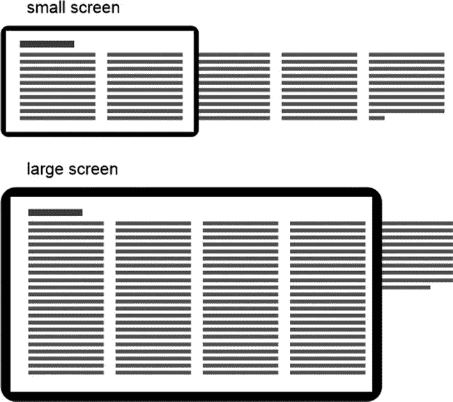

图 4-15 。设置列宽允许在更大的屏幕上显示更多的列

属性本身是`column-width`和`column-count`，还有一个简写属性`columns`。有趣的是，你很少需要同时使用`column-width`和`column-count`，所以你可能会在大部分时间或所有时间里只使用一种速记方法。

速记属性叫做`columns`。它需要宽度和/或计数。正如我所说的，你可能会选择其中之一，所以通常你的列属性看起来就像清单 4-13 中的那些。

***清单 4-13*** 。确定多列的典型属性

```html
/* CSS snippet */
.columns {
    columns: 4;
}

.columns {
    columns: 200px;
}

.columns {
    columns: 400px;
}
```

列间距和列规则

`column-gap`和`column-rule`属性让您可以控制列之间的空间发生了什么。

`column-gap`接受一个长度值，并确定列之间的间距。Windows 8 设计指南没有对多列文本之间的间距宽度给出建议，但它建议列表中的列之间的间距为 40 像素，这也是我对文本列的建议。

`column-rule`实际上是一个简写的属性，它一次轻松地封装了`column-rule-width`、`column-rule-style`和`column-rule-color`。规则只是分隔文本列的一行。它在美学上是有帮助的，但也可能有点花哨，所以要谨慎使用列规则。当两列文本彼此不相关时，为了清楚起见，在它们之间添加一条规则可能会有所帮助。

列填充

对于列中的文本流动，呈现引擎可以选择两种可能的行为。如果您有三列，但没有足够的文本填满所有三列，引擎可以填充第一和第二列，让第三列变短，或者它可以平衡所有三列中的内容量(垂直)。

属性是你如何控制这些行为中的哪一个被使用。`auto`和`balance`值的结果行为显示在图 4-16 中。

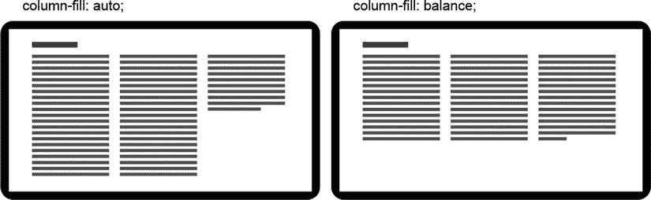

图 4-16 。自动和平衡列填充的区别

多列样品

我们将会看到许多不同的多栏配置，对于每一个，我们将会使用你在清单 4-14 中看到的相同的 HTML。

***清单 4-14*** 。一个包含五段大小合适的文本的 div

```html
<!-- HTML snippet -->
<div id="columns">
    <p>Lorem ipsum dolor sit amet ... </p>
    <p>Sed rhoncus, erat in eleifend ... </p>
    <p>Nam mollis iaculis neque ut ... </p>
    <p>In eleifend purus et leo ... </p>
    <p>Sed quis sapien vitae elit ... </p>
</div>
```

ID 为 columns 的`div`包含五段文本。为了简洁起见，我对实际的段落文本进行了裁剪，但实际上每个段落都是典型的段落大小。让我们看看一些可能的 CSS 样式规则，以各种方式将这五个段落格式化成列。

列表 4-15 和图 4-17 显示了自动列填充的结果。另一方面，清单 4-16 和图 4-18 展示了平衡的列填充。

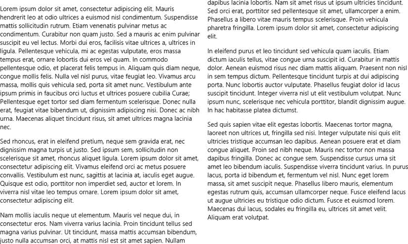

图 4-17 。两个 400 像素的列适合，列填充的自动值导致每个列在溢出到下一列之前被填充到底部

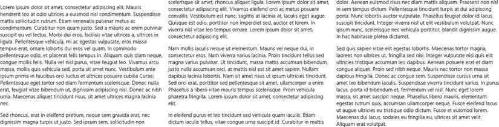

图 4-18 。三列适合空间，文本溢出，以便所有具有相同数量的文本

***清单 4-15*** 。列宽度为 400 像素，自动填充列

```html
/* CSS snippet */
#columns {
    columns: 400px;
    column-fill: auto;
    height: 600px;
}
```

让我们看看，当我们有多列时，我们可以做些什么来垂直平衡文本。

***清单 4-16*** 。三列，列填充值为 balance

```html
/* CSS snippet */
#columns {
    columns: 3;
    column-fill: balance;
    height: 600px;
}
```

某些类型的内容适合窄栏。我可以想象一个类似字典的东西，它主要是一系列简短的内容。当您考虑您的设计时，您可能会发现一些列间距和列之间的一些规则会有所帮助。清单 4-17 展示了一些窄列，列之间有一点间隙和浅灰色的标尺。

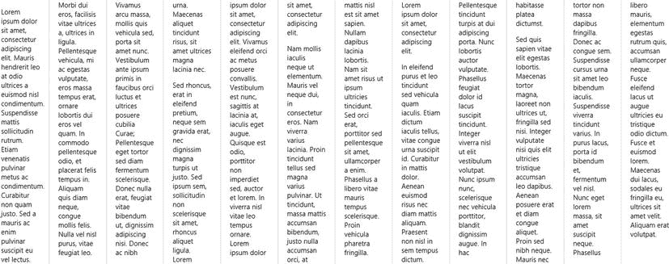

图 4-19。有规则的窄栏看起来很优雅

***清单 4-17*** 。尽可能多的 80 像素列，以适合 40 像素的间隙和其间的浅灰色嵌线

```html
/* columns.css */
#columns {
    columns: 80px;
    column-gap: 40px;
    column-rule: 1px solid #ddd;
}
```

 **孤儿寡母**当个别单词或行滞留在一列的开头或结尾时，它们往往会显得格格不入，而且是无意的。我们称这些人为寡妇和孤儿。避免寡妇和孤儿使用 CSS3 的唯一方法是在段落元素中添加`break-inside:avoid`。这将导致一个段落试图保持在一起，而不是分裂自己的列。这不是一个理想的解决方案，因为它要么全有，要么全无。如果一个段落连一行都放不下，那么整个段落就会跳到下一列，可能会留下一个大洞，看起来比小寡妇还要无意。

列表样式

有两种列表:有序列表和无序列表。有序列表通常用数字或字母标记，无序列表通常用项目符号标记。您可以使用`list-style`属性:`list-style-type`、`list-style-position`、`list-style-image`和速记属性`list-style`来控制它们。

`list-style-type`属性很有趣，因为不管标记是什么，它的值都可以将列表转换成有序列表或无序列表。因此，如果 HTML 指定了一个`ul`(无序列表)标签，您可以简单地应用一个`list-style-type`，它将呈现为一个有序列表，就像您使用了`ol`标签一样。

`list-style-type`属性的有效值为:`none`、`circle`、`disc`、`square`、`Armenian`、`decimal`、`decimal-leading-zero`、`Georgian`、`lower-alpha`、`lower-greek`、`lower-latin`、`lower-roman`、`upper-alpha`、`upper-latin`和`upper-roman`。

当您试图让列表正确对齐时,`list-style-position`属性会非常方便。值`outside`确定项目符号在文本之外，并且换行文本缩进，因此项目符号保持悬挂在左侧。另一方面，`inside`的值确定项目符号在文本内，并且换行文本与项目符号对齐。

属性允许你指定一个自定义的图片用于你的列表的项目符号。该值应该采用`url('folder/image.png')`的形式。

清单 4-18 和图 4-20 展示了一个没有应用 CSS 修改的标准无序水果列表。

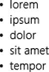

图 4-20 。创建简单的项目符号列表并不令人惊讶

***清单 4-18*** 。没有应用样式的标准无序列表

```html
<!-- HTML snippet -->
<ul>
    <li>lorem</li>
    <li>ipsum</li>
    <li>dolor</li>
    <li>sit amet</li>
    <li>tempor</li>
</ul>
```

清单 4-19 向列表中添加了一些样式，将无序列表(通常使用项目符号)转换成有序列表(使用十进制数字)，并确保数字在列表中。我将列表宽度限制为 200 像素，并重复了单词 mangoes，只是为了说明这个`list-style-position`属性。你可以在图 4-21 中看到结果。

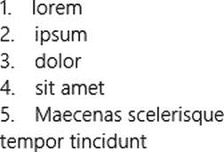

图 4-21 。即使标记将其定义为无序列表，也会创建有序列表(编号值为 1–5)。此外，请注意第 5 项一直换行到数字级别的方式

***清单 4-19*** 。标准无序列表现在应用了样式

```html
<!-- HTML snippet -->
<ul>
    <li>lorem</li>
    <li>ipsum</li>
    <li>dolor</li>
    <li>sit amet</li>
    <li>Maecenas scelerisque tempor tincidunt</li>
</ul>

/* CSS snippet */
ul {
    list-style-type: decimal;
    list-style-position: inside;
    width: 200px;
}
```

使用 CSS 来设计列表的样式是非常容易的，所以列表是一种很好的、语义化的方式来指示 UI 中任何重复的项目或实体列表。例如，您可以将一个项目列表转换成一个列表、一个菜单或一堆小块。

用连字符号连接

断字是在文本块换行时断开单词，以提高对齐效果。如果渲染引擎被迫将整个单词放在一起，它可能会在文本列中造成一些令人尴尬的大范围空白。但是，如果允许引擎在中间断开一个单词，并在下一行继续，并用连字符表示这一点，那么它可以对文本的换行进行更多的控制。

直到最近，网页中还没有断字。CSS3 已经定义了连字符属性，但是还没有被很多浏览器实现。IE10 和 Windows 8 实际上不识别标准的`hyphens`属性，但是它们也支持同一属性的供应商特定版本。除了特定于供应商的前缀之外，语法也是一样的。然后，属性是`-ms-hyphens.`。像所有其他供应商特定的属性和属性值一样，微软致力于 CSS 标准，并且微软将通过去掉供应商前缀尽快切换到标准属性。今天你使用`-ms-hyphens`，但最终，你只会使用`hyphens`。

-连字符

指示一个文本块进行断字非常简单。清单 4-20 用值为`auto`的单个`-ms-hyphens`属性实现了这一点。`-ms-hyphens` 属性可以有三个有效值之一(除了`inherit` ): `none`、`auto`和`manual`。一个`none`值显然不允许任何断字操作。`manual`值将只允许在内容中明确建议了断点的地方使用断字符-通过出现硬连字符()或软连字符(`&shy;`)来指示。软连字符表示单词可以在给定点断开，但是除非必须断开，否则连字符不会出现。另一方面，一个`auto`值将允许渲染引擎在那些建议的点以及没有建议的单词中间中断。

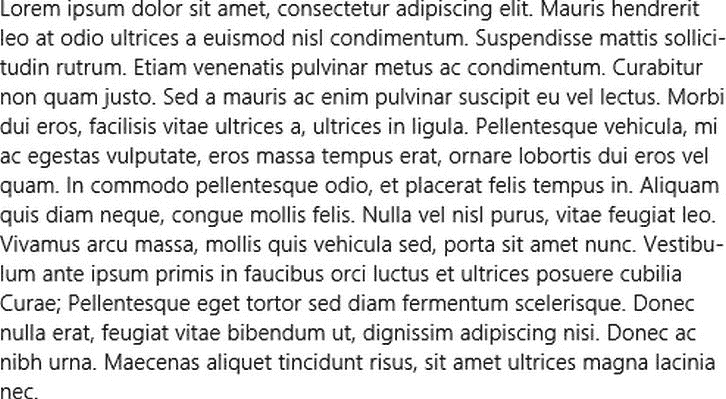

图 4-22。连字符用于减少文本右边距的锯齿

***清单 4-20*** 。使用-ms-hyphens: auto 打开断字功能

```html
<!-- HTML snippet -->
<p>Lorem ipsum dolor sit amet...</p>

/* CSS snippet */
p {
    width: 500px;
    -ms-hyphens: auto;
}
```

在大多数情况下，这就是你所需要做的，但是如果你需要对断字的呈现方式有更多的控制，那么你需要查看其他属性。

-ms-连字符-限制-区域

属性决定了行尾可以保留的最小空白量。如果你指定了一个区域`50px`,并且在对齐发生之前，在一行中将会有超过 50 个像素的空白，那么下一行的单词将会被连字符连接并向上拉以填充其中的一些空间。数字越小，允许的空白就越少，因此需要更多的连字符。如果区域太大，则根本不会出现断字。

如果清单 4-21 和图 4-23 中的 CSS 被应用于清单 4-20 中的同一个 HTML，那么我们将以一个连字符行结束——以 *adipis 结尾的那一行。*如果单词*ADI pissing*的那一部分没有被提取出来并使用连字符连接，那么单词 *dignissim* 后面的空格将会超过 50 个像素。

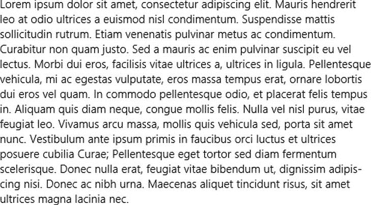

图 4-23 。如果将此图与图 4-22 进行比较，可以看出连字符的行为受到了影响

***清单 4-21*** 。用-ms-hyphenate-limit-zone 设置断字区

```html
/* CSS snippet */
p {
    width: 500px;
    -ms-hyphens: auto;
    -ms-hyphenate-limit-zone: 50px;
}
```

-ms-连字符-限制-字符

下一个`-ms-hyphenate`属性是`-ms-hyphenate-limit-chars`。该属性设置可以断字的单词的最小大小。您可以为所讨论的整个单词指定一个最小大小，为连字符之前的部分指定一个最小大小，为连字符之后的部分指定一个最小大小。这三个值由空格分隔。值`5 2 2`将指示带连字符的单词必须至少有 5 个字符，并且在带连字符后，连字符前至少有 2 个字符，连字符后至少有 2 个字符。

您可以使用关键字`auto`来代替这三个值中的任何一个。auto 的默认值是`5 2 2`，所以如果`auto`替换了第一个值，那么它将再次代表一个`5`，第二个`2`，第三个`2`。值`8 4 4`将非常保守，仅允许大的单词断开，并且将要求至少 4 个字符保留在一行中，并且至少 4 个字符向下移动到下一行。

清单 4-22 中的 CSS 使用了一个值`7 3 3`作为例子，注意在图 4-24 中，单词 *sollicitudin* 被允许断开，因为它超过了 7 个字符(其中至少有 3 个字符可以保留在连字符之前)，但是 *Curae* 不允许断开，因为它只包含 5 个字符。

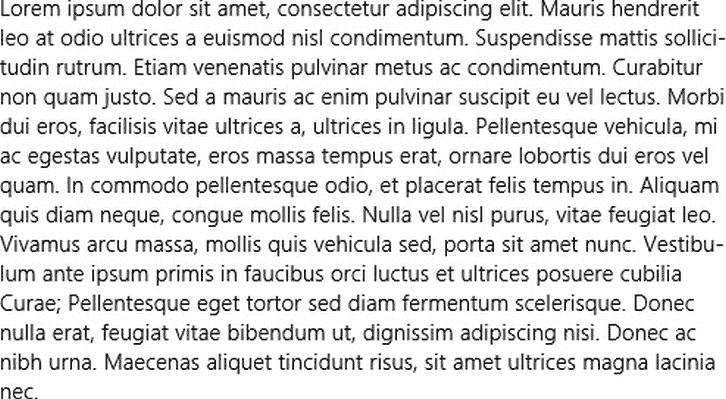

图 4-24 。同样，断字行为与前面的示例有所不同

***清单 4-22*** 。设置一个单词必须有多大才能断字和断字

```html
/* CSS snippet */
p {
    width: 500px;
    -ms-hyphens: auto;
    -ms-hyphenate-limit-chars: 7 3 3;
}
```

-ms-连字符-限制-行

`-ms-hyphenate`家族的最后一名成员是`-ms-hyphenate-limit-lines`。该属性将确保连续的连字符行不超过指定的数量。在清单 4-23 中，`-ms-hyphenate-limit-zone`被设置为`3px`，这将导致大量的断字，但是`-ms-hyphenate-limit-lines`被设置为`2`，这意味着一行中不超过 2 行可以被断字。如果你查看图 4-25 中的结果，你会注意到以 *Donec* 结尾的行是一个在行尾之前至少有 3 个像素空白的断字候选行，但是前面两行(以 *Vestibu-* 和 *Pel-* 结尾)已经被断字，所以它不能被断字。

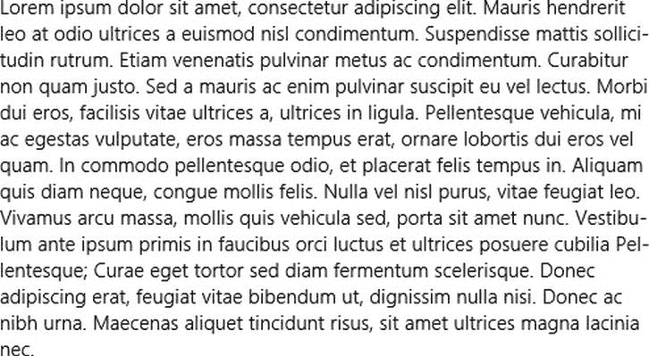

图 4-25 。-ms-hyphenate-limit-lines 限制了连续连字符的行数，可以防止您的文本看起来过于支离破碎

***清单 4-23*** 。使用-ms-hyphenate-limit-lines 设置允许多少个连续的连字符行

```html
/* CSS snippet */
p {
    width: 500px;
    -ms-hyphens: auto;
    -ms-hyphenate-limit-zone: 3px;
    -ms-hyphenate-limit-lines: 2;
}
```

摘要

在这一章中，我们已经讨论了很多与文本样式相关的内容。我们已经介绍了可以用来定制文本颜色和不透明度的 CSS 属性，影响字体的各种方法，我们还介绍了一些强大的文本布局控件的多列和断字，这对 CSS 世界来说是相当新的。

在你的应用中，清晰、干净、有目的的字体设计的重要性怎么强调都不为过。它是一个重要的工具，可以让 Windows 8 应用程序的设计足够引人注目，让用户喜欢它，与朋友谈论它，并给你的应用程序带来高评分。