# 五、盒子属性

 **注意**HTML 中的一切都适合一个盒子，知道如何控制这些盒子的格式和布局对于扎实理解 CSS 至关重要。

框属性是 HTML 元素的属性，描述了它的大小、填充、边框和间距`等内容。`

 `我们将研究元素大小和间距，以及使这些元素看起来更好的所有填充和边框颜色，并使它们在视图状态改变时发挥应有的作用。让单一视图工作正常是一回事，但是当用户将设备旋转到纵向时会发生什么呢？如果一个元素的框属性设置不正确，那么整个布局会受到不利影响。我们将在本章中探讨的属性对于让您的 Windows 8 应用达到应有的效果至关重要。图 5-1 展示了一些按照微软设计原则设计的 Windows 8 应用。

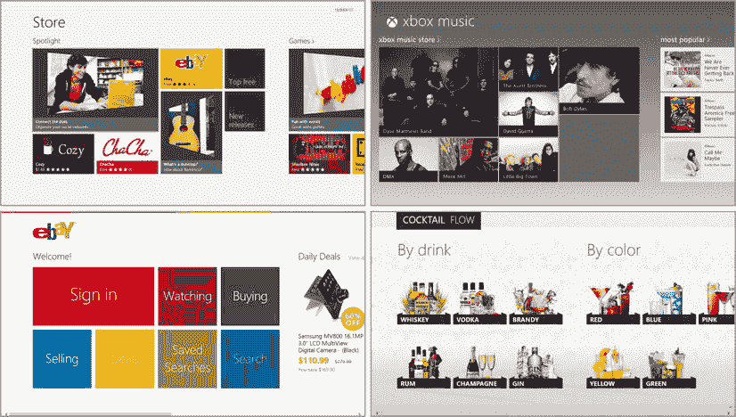

图 5-1 。一些根据微软设计原则设计的 Windows 8 应用程序

指导 Windows 8 外观和感觉的设计语言融入了大量的设计、思考和测试。从触摸目标的大小到它们之间的间距，一切都在设计原则中占有一席之地。在图 5-1 中，注意内容上方、下方和左侧的一致空间。请注意，内容没有被压缩在屏幕上，而是被给予了一点喘息的空间。请注意，除了内容本身之外，用于交互或导航的视觉元素非常少。所有这些都是设计语言的一部分，甚至更多。

要实现这些原则，你必须非常依赖于盒子模型和各种布局技术。本章介绍盒子模型，第七章将介绍布局。为了彻底理解盒子模型，你必须理解大小、边距、边框和填充。我们将花更多的时间来覆盖渐变和阴影，因为它们有时可以补充你的核心图形，为你的设计增加价值。

盒子模型

如果您想单独理解边距、边框、填充和背景属性，您必须理解框模型。确保图 5-2 中显示的术语已被记忆。

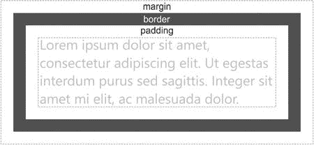

图 5-2 。HTML/CSS 盒子模型

标记为*边距* 的空间是该元素与其周围所有东西之间的空间。*边框* 在这里显示为灰色线条，但它实际上可以是多种样式、颜色和粗细中的任何一种。边框和框内实际内容之间的空间称为*填充* 。

这里的内容表示为文本，但是请记住，您的内容可能是文本，也可能是更多嵌套为子元素的元素。

我需要定义更多基于这个盒子模型的术语。边框是图表中包括边框区域、填充区域和内容，但不包括边距的区域。填充框是包括填充区域和内容区域(不包括边距和边框)的矩形区域。而内容框就是内容区。一会儿你就会明白为什么这些术语很重要。

尺寸

HTML 容器元素可以在没有指定大小信息的情况下定义，并根据其父元素的大小或其内容的大小做出反应，但您也可以显式声明它们应该是什么大小。在 Windows 8 应用程序中指定大小特别有帮助，因为视觉伪像会出现在各种设备上，一些设备实际上会应用系统级缩放，以保持一致和可触摸的用户体验。换句话说，与现有的 Windows 设计环境不同，像按钮这样的东西不会随着用户分辨率的提高而变小。

大多数 HTML 元素可以指定宽度和高度属性来确定它们的显式大小。除了这个绝对值之外，还可以为每个值指定最小值和最大值。以下是可用属性的列表:`width`、`min-width`、`max-width`、`height`、`min-height`、`max-height`。

最小值和最大值属性对于创建良好的自适应布局非常有帮助。`80px`的`min-width`值将允许目标元素的宽度增长到大于 80 像素(例如，如果用户正在向元素中键入内容)，但不会变窄。

在设置一个元素的宽度和高度之前，一定要问自己是应该使用最小值还是最大值属性。你的元素应该是一个绝对的大小，还是应该能够适应，在某些情况下变得更小或更大？正如我们已经讨论过的，这两个属性的值应该是标准的长度单位。清单 5-1 展示了如何用各种单位来指定元素的大小。

***清单 5-1。*** 一个 div，包含五个宽度不同的子元素

```html
<!-- HTML snippet -->
<div id="parent">
    <div></div>
    <div></div>
    <div></div>
    <div></div>
    <div></div>
</div>

/* CSS snippet */
#parent { width:200px; border: 1px solid black;}
    #parent > div { background:green; height: 20px; margin:2px; color:white; }
    #parent div:nth-of-type(1) { width: 10px; }
    #parent div:nth-of-type(2) { width: 50%; }
    #parent div:nth-of-type(3) { width: 100px; }
    #parent div:nth-of-type(4) { width: calc(100% - 10px); }
    #parent div:nth-of-type(5) { width: 1in; }
```

关于清单 5-1 中的，你应该注意一些事情。

*   请注意除了第一行之外的所有行都缩进了。这是前面提到的表示层次结构的约定的一个例子。
*   注意第四个子元素的宽度使用了`calc()`函数来表示宽度应该是“100%差 10 个像素”。
*   注意`:nth-of-type()`伪类的使用。这是按顺序为一系列相似元素定义样式规则的好方法。因为使用了`:nth-of-type()`而不是:n-child，所以我们可以稍后在`div`元素的序列上方添加一个标题，并且不会对它们的样式产生任何影响。

清单 5-1 产生的 HTML 看起来像图 5-3 。你可以看到彼此之间不同的宽度。

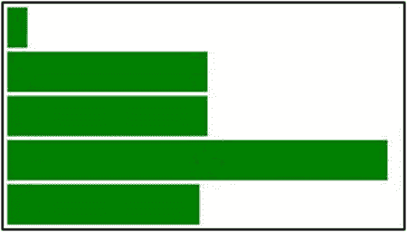

图 5-3 。各种大小的矩形说明了宽度属性

在 CSS3 之前，当设置了对象的宽度和高度时，指定的值会影响内容区域的宽度和高度(参见框模型)。在某些情况下，这可能是一种直观的方法，但也会引起一些恐慌。举个例子，将`div`的宽度设置为`100%`会导致它采用其父项的宽度，但是添加一些填充和边框会导致它看起来比其父项更宽。所以即使这种测量盒子的方法经常令人沮丧，它仍然是 W3C 标准。

CSS3 还引入了两个增强功能，极大地改善了我们的规模场景。第一个我们已经讨论过了，它是用于指定宽度的`calc()`方法 ，比如`calc(100% - 20px)`。第二个是`box-sizing`房产 。`box-sizing`属性取值为`border-box`或`content-box`(默认)。指定`border-box`表示`width`和`height`应该被转换为整个框的宽度和高度(包括填充和边框),而不仅仅是内容。

让我们看看清单 5-2 中的例子，以确保我们清楚这种行为。

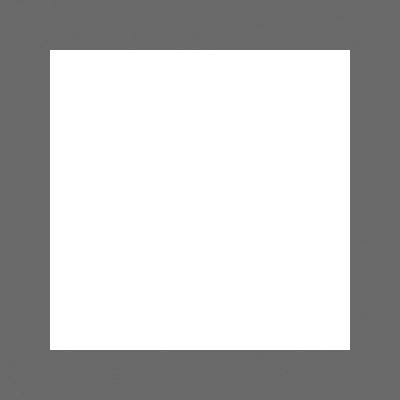

图 5-4。一个具有 50 像素边框的 div，其整体宽度明显超过 200 像素

***清单 5-2*** 。使用默认内容框大小调整方法 的 200 像素框

```html
<!-- HTML snipppet -->
<div id="box"></div>

/* CSS snippet */
#box {
    margin: 50px;
    padding: 50px;
    border: 50px solid gray;
    width: 200px;
    height: 200px;
}
```

现在，如果我告诉你，结果框中的边框是 50 像素厚，你会相信整个框是 200 像素宽 200 像素高吗？这似乎意味着更多。使用标准的大小调整方法，内容为 200 像素宽，填充和边框各为 50 像素，将整个框的外观宽度增加到 400 像素！

清单 5-3 重复了相同的 CSS，但是引入了一个新的属性，看看这显著不同的结果。

***清单 5-3。*** 一个 200 像素的盒子使用了边框大小调整方法

```html
<!-- HTML snipppet -->
<div id="box"></div>

/* CSS snippet */
#box {
    margin: 50px;
    padding: 50px;
    border: 50px solid gray;
    width: 100px;
    height: 100px;
    box-sizing: border-box;
}
```

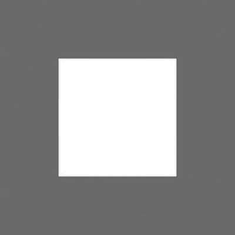

图 5-5。一个 div 已经通过框大小调整设置了它的大小调整方法，现在看起来真正的整体宽度是 200 像素

溢出

盒子模型及其大小、边距和填充让您可以很好地控制页面上所有容器的形状。页面上这些容器的全部意义在于包含你的应用程序的内容，通常这些内容会太大或太长而不适合。在这种情况下，容器的行为就是我们所说的溢出。

例如，如果一个`div`元素的高度足以显示 10 行文本，并且其中有超过 10 行的文本，那么我们就有一些溢出。

您可以使用`overflow`属性来控制这种行为。有效值为`visible`(该值为默认值)、`hidden`、`scroll`和`auto`。

*   `visible` 决定了溢出的内容应该可见。即使它是可见的，也不会影响它可能碰撞到的任何元素的布局。
*   `hidden` 使任何溢出的内容不可见。
*   `scroll` 给元素添加滚动条，这样用户可以选择滚动到溢出的内容。
*   只有在有理由的情况下才添加滚动条。

`overflow`属性实际上是`overflow-x`和`overflow-y`的简写属性，因此您可以独立地控制容器在两个轴上的行为方式。

清单 5-4 展示了我提到的例子，一个`div`的大小可以显示 10 行文本，但包含更多。还没有设置`overflow`属性，所以使用默认值`visible`，事实上，额外的文本在结果中清晰可见。这种溢出的文本的一个有趣的行为是，它不会将其他内容推来推去，这种行为对您来说可能直观，也可能不直观。包含的`div`作为一个块级元素，将后续内容向下推，但是它溢出的文本对页面上其他任何内容的位置没有进一步的影响。

***清单 5-4。*** 一个内容溢出的 div 不指定其溢出

```html
<!-- HTML snippet -->
<div id="container">
    <p>Lorem ipsum dolor sit amet ... </p>
</div>

/* CSS snippet */
#container {
    height: 220px;
    width: 300px;
    border: 1px solid gray;
    margin: 10px;
    padding: 10px;
}
```

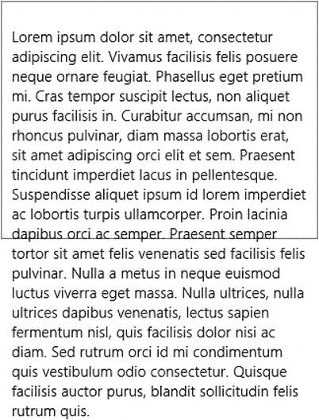

图 5-6。如你所见，默认溢出是可见的

让我们来看看应用了不同的`overflow`值的同一个 HTML。在清单 5-5 的中，你可以看到我们可以通过将`overflow`属性设置为`hidden`来消除这个可见的溢出。

***清单 5-5*** 。溢出值“隐藏”应该会改变行为

```html
<!-- HTML snippet -->
<div id="container">
    <p>Lorem ipsum dolor sit amet ... </p>
</div>

/* CSS snippet */
#container {
    height: 220px;
    width: 300px;
    border: 1px solid gray;
    margin: 10px;
    padding: 10px;
    overflow: hidden;
}
```

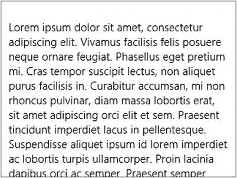

图 5-7。溢出的内容现在是隐藏的，但没有办法访问它

不过，这让我们无法查看隐藏的文本。清单 5-6 通过将`overflow-y`设置为`auto`对此进行了改进，这导致`div`保持相同的大小，但是突然具有了滚动的能力。你可能想知道为什么我不选择`scroll`值而不是`auto`。`scroll`值 强制容器总是处于滚动模式，但是`auto`值足够智能，只在确实有溢出的内容需要滚动时才呈现滚动条。请注意，在 Windows 8 中，系统会确定用户当前使用的是鼠标还是触摸，并相应地呈现滚动条。当使用鼠标时，用户将看到传统的滚动条，但当使用触摸时，用户将看到更干净、更小的滚动位置指示器，该指示器提供信息，而不必是交互式的。

***清单 5-6。*** 设置溢出为“自动”使内容可滚动

```html
<!-- HTML snippet -->
<div id="container">
    <p>Lorem ipsum dolor sit amet ... </p>
</div>

/* CSS snippet */
#container {
    height: 220px;
    width: 300px;
    border: 1px solid gray;
    margin: 10px;
    padding: 10px;
    overflow-y: auto;
}
```

添加一个属性`overflow-y: auto`；会导致容器在其内容溢出时呈现垂直滚动条。图 5-8 说明了这一点，并强调了用户使用鼠标和触摸时滚动条外观的不同。

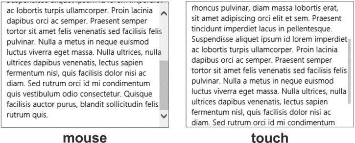

图 5-8 。滚动条在使用触摸和鼠标时呈现不同

能见度

可以修改元素的可见性来确定该元素是否出现。

有两种不同的样式属性会影响元素的可见性:`visibility`和`display`。

`visibility`属性可以设置为`visible`、`hidden`或`collapse`。默认值是`visible`，显然设置了一个元素出现。`hidden`值使元素完全不可见。即使一个元素被隐藏，它仍然会影响布局，所以如果你设置它为 100 像素高，那么它仍然会占用 100 像素的垂直空间。最后，`collapse`值的工作方式与`hidden`值非常相似，除了对于表格的行和列，它还折叠行或列，因此它不会占用空间。

属性可以设置成许多不同的东西，但是大多数与目标元素的布局有关，而不是它的可见性。然而，一个可能的值是`none`。将`display`设置为`none`不仅会隐藏目标元素，还会有效地将它从 DOM 中取出，使其不再影响布局。

jQuery 等一些库提供了一些函数(在 jQuery 中是`show()`和`hide()`)，使得修改这些属性以及显示或隐藏元素变得更加容易。在附录 A 中，我将讨论一些 CSS 相关的库，以及如何在你的 Windows 8 应用中使用它们。

边距

元素的边距是元素外部和周围的空间量。元素是矩形的，每边都有属性，所以我们有以下属性:`margin-top`、`margin-right`、`margin-bottom`和`margin-left`。

为了说明边距，让我们创建三个元素，一个在另一个之上，然后对它们应用一些边距来查看效果。清单 5-7 包含了 HTML 和初始 CSS，没有任何与边距相关的样式。

***清单 5-7。*** 一些没有应用边距的 div 元素

```html
<!-- HTML snippet -->
<div id="parent">
    <div></div>
    <div></div>
    <div></div>
</div>

/* CSS snippet */
#parent > div {
    width: 200px;
    height: 80px;
    border: 1px solid black;
}
```

这三个`div`元素被一个接一个地放置，导致图 5-9 中的三个盒子也被一个接一个地放置。

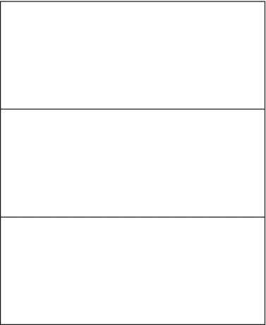

图 5-9 。div 元素相互对接，看起来可能很拥挤

您可以看到`div`元素紧挨着彼此。事实上，他们甚至似乎共享同一边界。现在让我们在这些元素之间留出一点空间。要做到这一点，我们可以在每个页面的底部、顶部或两者都增加一些边距。根据 Windows 8 的设计原则，我们应该在磁贴之间留出 10 个像素的空间，让我们在每个元素周围添加 5 个像素的空白。清单 5-8 展示了如何使用 CSS 来完成这个任务。HTML 将与前面的清单相同。

***清单 5-8*** 。一些应用了 5 像素边距 的 div 元素

```html
/* default.css */
#parent > div {
    width: 200px;
    height: 80px;
    border: 1px solid black;
    margin: 5px;
}
```

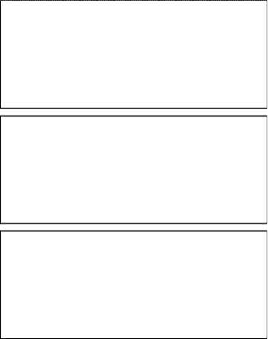

图 5-10。div 元素之间现在有了一点空间

这就是元素之间 10 个像素的样子。这没什么难的。为了好玩，清单 5-9 给这些元素增加了不同级别的左边距。

***清单 5-9*** 。仍然指定相同的 5 像素边距，现在增加了一些额外的左边距

```html
/* default.css */
#parent > div {
    width: 200px;
    height: 80px;
    border: 1px solid black;
    margin: 5px;
}

    #parent > div:nth-child(1) {
        margin-left: 5px;
    }

    #parent > div:nth-child(2) {
        margin-left: 50px;
    }

    #parent > div:nth-child(3) {
        margin-left: 100px;
    }
```

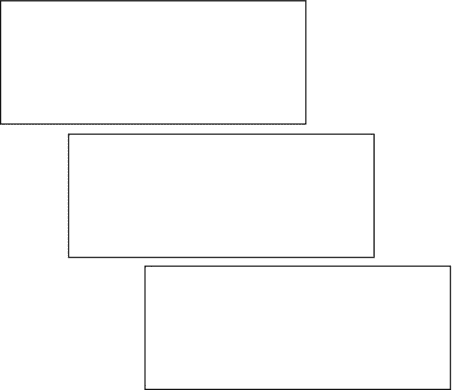

图 5-11。元素之间的边距仍然可见；额外的左边距也是如此

然而,`margin`速记属性使得同时设置这四个属性变得更加容易。简写属性 将采用以下任何一种形式。

*   所有四边的页边距都可以通过依次指定顶部、右侧、底部和左侧页边距来表示，并由空格分隔，如`margin: 10px 8px 7px 2px;`所示
*   水平和垂直对称的页边距可以采用一个值来表示顶部和底部，另一个值表示左侧和右侧，如`margin: 20px 5px;`所示，在这种情况下，顶部和底部页边距将被设置为 20px，左侧和右侧被设置为 5px。
*   最后，四周相同的边距可以取一个值，如`margin: 10px;`所示，这将在四边创建 10px 的空间。

属性对于所有类型的间距都是非常有用的。它用于控制文本块中段落上方或下方的间距，以及列表中图块组之间的间距。它还用于遵循 Windows 8 的设计原则，并在每个视图的左侧添加 120 像素的空间。事实上，为了适应这种左边距，如果你使用导航应用项目模板来创建你的项目，那么每次你创建一个新的页面，你的 CSS 文件看起来就像清单 5-10 中的样式规则。

***清单 5-10*** 。Visual Studio 中新页面控件的默认样式表

```html
/* CSS snippet */
.pageTitle p {
    margin-left: 120px;
}
```

此规则为页面默认获得的“内容在此处”段落设置 120 像素的左边距。我不觉得这有什么帮助，因为我很快替换了股票段落，很少在我的主要部分出现一个标签。因此，通过为我在主要部分(也就是角色为`main`的部分)放置的任何东西设置左边距，用下面的规则替换这条规则效果很好，如清单 5-11 所示。

***清单 5-11。*** 更好的设置标准左边距的方式来影响主节中的一切

```html
/* CSS snippet */
.pageTitle section[role=main] > * {
    margin-left: 120px;
}
```

如果你使用网格项目模板创建一个新的 Windows 8 项目，你的应用程序看起来马上就像图 5-12 ，你已经可以看到左边距的特征 120 像素已经被编程到该项目模板中。

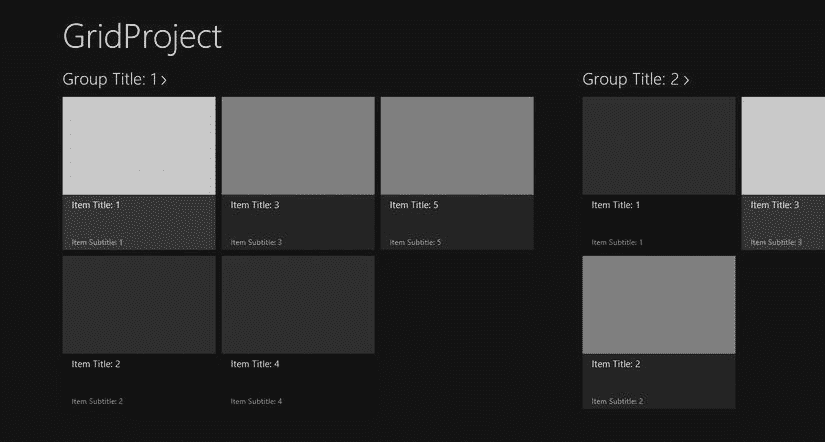

图 5-12 。Windows 8 应用程序典型的 120 像素左边距在 grip 项目模板中显而易见。推荐的标准页边距还描述了列表项和组

边框

边框是围绕元素的线条。同样，这次我们得到了一个简写属性`border—`，这样我们就不用每次都键入`border-width`、`border-style`和`border-color`了。清单 5-12 展示了如何在`div`周围创建一个细的黑色边框。

***清单 5-12*** 。div 周围的细黑边框

```html
/* CSS snippet */
div {
    border: 1px solid black;
}
```

您可以为`border-width`使用任何长度单位。`border-style`的值有`dashed`、`dotted`、`double`、`groove`、`hidden`、`inset`、`none`、`outset`、`ridge`和`solid`。我在第三章中介绍了`border-color`可以用无数种方式定义颜色。

清单 5-13 显示了更多的边框属性组合。

***清单 5-13*** 。一些边界属性组合

```html
/* CSS snippet */
.border1 { border: 1px solid red; } /* thin red */
.border2 { border: 8px solid rgb(0,255,0,.5) /* partially transparent, thick, green */
.border3 { border: 3px double black; }
```

填充

就像`margin`决定元素外的空间一样，`padding`决定元素内的空间(但在其内容外)。就像`margin`属性一样，`padding`是一个简写属性，它比每次都使用`padding-top`、`padding-right`、`padding-bottom`和`padding-left`更容易，并且设置它的工作方式也与`margin`完全相同。

清单 5-14 显示了一个简单的`div`，带有黑色边框，包含一段文本。`div`的`padding`被设置为`50px`，你可以在结果中看到这么多填充的效果。

***清单 5-14*** 。50 像素的填充为文本在其边框内提供了一些空间

```html
<!-- default.html -->
<!DOCTYPE html>

<html lang="en" FontName2">http://www.w3.org/1999/xhtml ">
<head>
    <meta charset="utf-8" />
    <title></title>
</head>
<body>
    <div>
        <p>Lorem ipsum dolor sit amet...</p>
    </div>
</body>
</html>

/* default.css */
div {
    border: 1px solid black;
    padding: 50px;
    width:50%;
}
```

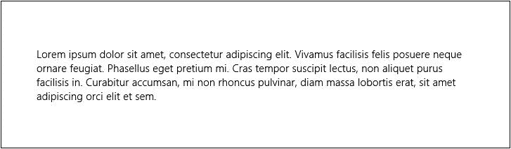

图 5-13。在一段文字周围增加了一些夸张的呼吸空间

背景

当您想要用颜色或图像影响元素的背景时，可以使用背景属性。分别是`background-color`、`background-image`、`background-size`、`background-repeat`、`background-position-x`、`background-position-y`、`background-origin`、`background-clip`、`background-attachment`。

背景属性可用作背景图像、背景重复和背景颜色的速记属性，背景位置可用作背景属性 x 和背景属性 y 的速记属性。

背景色

您可以使用我们讨论过的所有标准颜色属性值来设置颜色。如果你回头看看我们讨论过的盒子模型，`background-color`(以及`background-image`)将填充内容、填充和边界区域。它呈现在内容、填充和边框之后。如果你设置你的边框有点透明，你会看到背景显示通过。

背景图像

`background-image`的值应该是到一个或多个图像的绝对或相对链接，每个都用`url(`“`)`包裹，并用逗号分隔。包含多个图像会导致图像堆叠在一起，首先声明的那些图像会放在最上面。

清单 5-15 展示了一个 Windows 8 徽标被用作`div`元素后的背景图像的例子。

***清单 5-15*** 。指定为 div 背景图像的图像(Windows 8 徽标)

```html
<!—HTML snippet -->
<div id="container"></div>

/* CSS snippet */
div#container {
    width:600px;
    height:400px;
    border:1px solid gray;
    background-image: urlimg/win8logo.png');
}
```

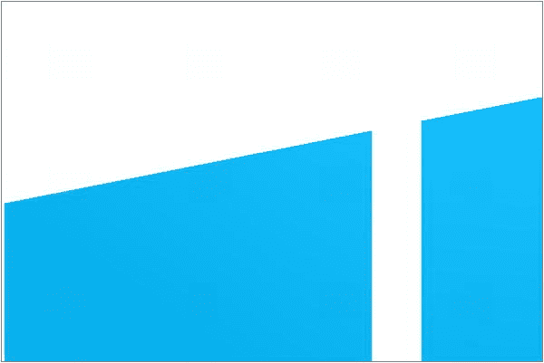

图 5-14 。图像出现在 div 元素的背景中，但是您可以看出它太大了

在图 5-14 的中，我们设置为 dev 元素背景的 Windows 8 logo 需要调整大小以适合 div，这个工作属于`background-size`属性。

`background-size`

`background-size`属性值可以是一对代表宽度和高度的长度或百分比。可以使用关键字`auto`代替宽度或高度值，让长度值根据图像的长宽比和其他维度来确定，为宽度和高度指定`auto`等同于根本不设置该属性。

除了明确指定背景图像的大小之外，`cover`或`contain`值可以用来以一种巧妙而有用的方式调整图像的大小。`cover`值缩小图像以完全适合容器，`contain`值放大图像以适合容器。在这两种情况下，都会调整图像的大小，但会保持其纵横比。

如果存在一个以上的背景图像，那么大小对它们的影响是一样的。让我们使用清单 5-16 中的这个属性来调整我们的 Windows 8 徽标的大小，以更好地适应我们的`div`元素。

***清单 5-16*** 。添加了一个背景大小属性来控制背景图像的大小

```html
<!—HTML snippet -->
<div id="container"></div>

/* CSS snippet */
div#container {
    width:600px;
    height:400px;
    border:1px solid gray;
    background-image: urlimg/win8logo.png");
    background-size: auto 100px;
}
```

图 5-15 显示了添加`background-size`属性的效果。

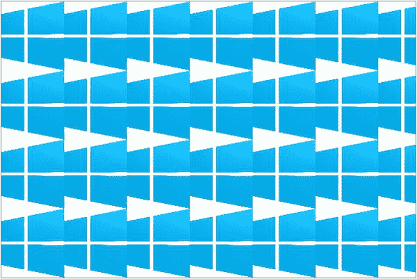

图 5-15 。背景图像的大小已经被适当地调整了，但是这并不是我们想要的效果

图 5-15 中的图像是我们指定的 100 像素高，但是它重复并平铺整个背景。这是背景图像的默认行为，要覆盖它，我们需要使用`background-repeat`属性。

 **提示**`cover`和`contain`值提供的使背景图像适合其容器的功能在一个名为 ViewBox 的 WinJS 控件中扩展。视图框影响任何单个元素，即使该元素包含复杂的内容层次结构。这是一个非常强大的工具，可以根据当前屏幕的大小和形状动态调整内容。你会在第七章中读到更多关于视图框控件的内容。

背景-重复

默认情况下重复背景是有意义的，考虑到它们最初和主要的意图是用连续的图像贴墙纸。然而，这种行为是非常可定制的。属性提供了一些非常巧妙的功能。可以取值为`no-repeat`、`repeat`、`repeat-x`、`repeat-y`、`round`或`space`。

默认值是`repeat`，要完全关闭该行为，可以使用`no-repeat`。如果你想让图像只在 x 方向重复，那么使用`repeat-x`，同样使用`repeat-y`。`round`值实际上会在两个方向上重复图像，但如果元素大小不是大小的整数倍，则不允许裁剪。适合的图像随后被放大以适合元素。`space`值与此类似，但它不是放大结果图像，而是在它们之间添加空间来填充空间。

***清单 5-17。*** 添加一个背景重复属性，其值为不重复

```html
<!—HTML snippet -->
<div id="container"></div>

/* CSS snippet */
div#container {
    width:600px;
    height:400px;
    border:1px solid gray;
    background-image: urlimg/win8logo.png');
    background-size: auto 100px;
    background-repeat: no-repeat;
}
```

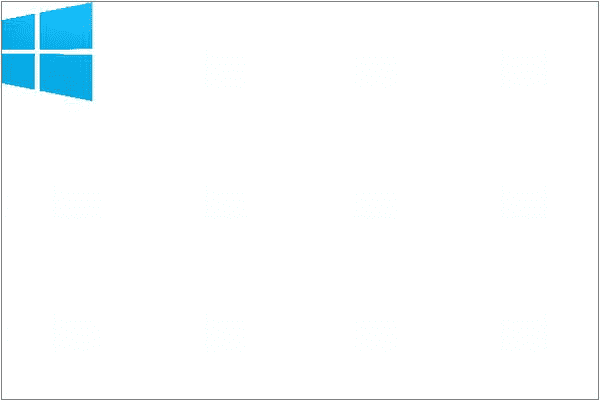

图 5-16。背景图像不再重复

背景-位置

CSS 还让我们可以控制背景图像应该呈现在包含元素中的什么位置。如果您关闭了重复，并且只有一个图像，那么您可以使用带有类似于`left top`、`right center`或`center bottom`的值组合的`background-position`属性。您也可以使用一对长度单位或百分比来分别表示 x 和 y 方向上的位置。

使用这种技术来设置一个相对暗淡的图像，使其出现在视图的右下角，这是一个添加你的品牌的好方法。无论用户如何滚动内容，图像都将保留在那个角落。

清单 5-18 将`background-position`属性添加到我们的容器中。

***清单 5-18*** 。添加一个值为“不重复”的背景重复属性

```html
<!—HTML snippet -->
<div id="container"></div>

/* CSS snippet */
div#container {
    width:600px;
    height:400px;
    border:1px solid gray;
    background-image: urlimg/win8logo.png');
    background-size: auto 100px;
    background-repeat: no-repeat;
    background-position: center center;
}
```

你在图 5-17 中看到的结果开始看起来像是我们想要做的事情！

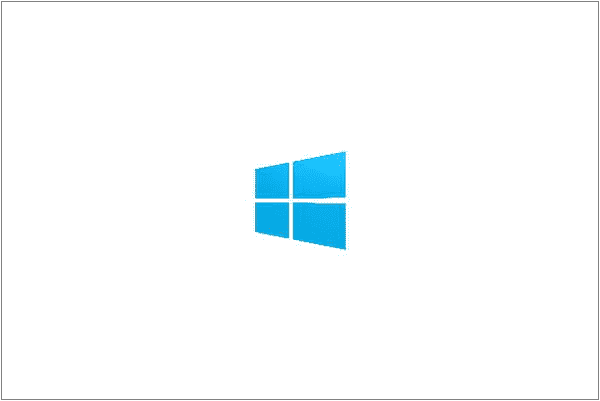

图 5-17 。背景图像水平和垂直居中

在这里，我们选择了使用关键字`center`将图像居中，但是我们也可以使用类似于`background-position: 100px 100px`的东西将图像绝对放置，这样就可以将 logo 设置为距离容器顶部和左侧 100 个像素。

背景-原点

`background-origin`用于确定`background-position`坐标的起点。默认值是`padding-box`，因此`0% 0%`的`background-position`或`0px 0px`或`left top`将意味着背景图像从填充的顶部和左侧开始对齐(即使默认情况下背景图像实际上也延伸到边框之下)。

`background-clip`

我前面提到过元素的背景会影响内容下面的区域、填充和边框，但是`background-clip`属性给了我们一点控制权。该属性取值与`background-origin` : `border-box`，`padding-box`，`content-box`相同。省略它将意味着它使用其默认值`border-box`。裁剪到边框意味着背景位于内容、填充和边框下的整个区域之下。然而，将`background-clip`属性设置为值`padding-box`将有效地剪切边框下的部分，这样背景仅在填充和内容下可见。最后，`content-box`的值甚至会将它裁剪到填充区内，使它仅位于内容下方。

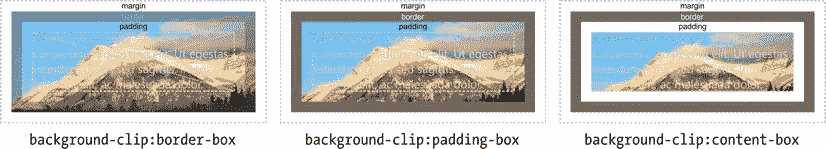

图 5-18。背景图像被剪切到盒子模型的特定区域

背景-附件

属性决定了当前景内容滚动时背景图像的行为。

值`fixed` 将背景图像附加到视口(通常是整个窗口),其效果是将其固定在页面上。

值`scroll` 将背景图像附加到文档上，因此如果正文的全部内容溢出页面并强制滚动，那么背景图像将随之滚动。

CSS3 中引入了第三个值`local` ,它将元素的背景图像附加到该元素的内容中。只有引入这个值，我们才能够用滚动的内容来滚动背景图像`div`。

作为一个例子，请看清单 5-19 。一个包含三个相当大的文本段落的`div`被分配了一个 CSS 样式规则，除了别的以外，该规则将它设置为在其中心呈现一个小的背景图像。`overflow-y`使它可以滚动，但是我们很快会讨论这个属性。需要注意的属性是`local`的`background-attachment`。这将导致背景图像与其余内容一起滚动，正如您在结果中看到的那样。

***清单 5-19*** 。local 的背景附件值用于将背景图像粘贴到它所在的滚动容器中

```html
<!—HTML snippet -->
<div>
    <p>Lorem ipsum dolor sit amet... </p>
    <p>Sed rhoncus, erat in eleifend... </p>
    <p>Nam mollis iaculis neque ut... </p>
    <p>In eleifend purus et leo... </p>
    <p>Sed quis sapien vitae elit... </p>
</div>

/* CSS snippet */
div {
    padding: 10px;
    border: 1px solid gray;
    width: 500px;
    height: 500px;
    background: urlimg/win8logo.png') no-repeat;
    background-position: center center;
    background-attachment: local;
    background-size: 80px 80px;
    overflow-y: scroll;
}
```

将这个属性添加到我们的目标元素实际上将背景图像固定到包含元素的滚动部分。

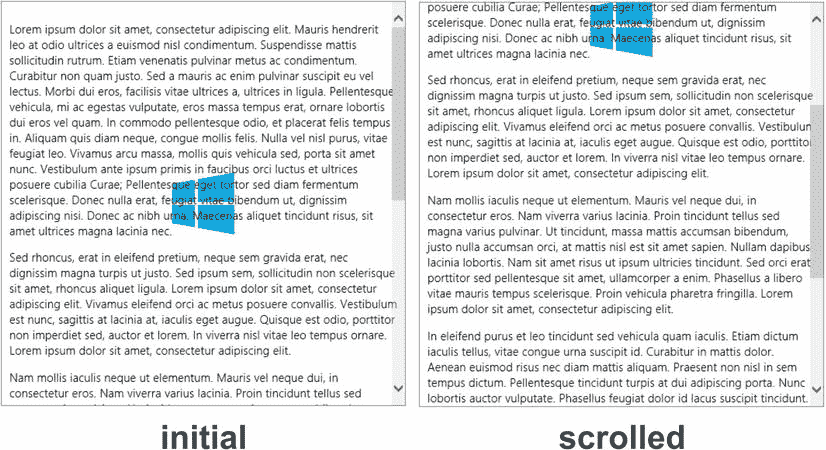

图 5-19。带有本地附加背景图像的可滚动 div 将滚动图像及其内容

渐变

如果你有 web 开发的背景，你会非常清楚如何给文档的宽度或高度添加颜色渐变。我所指的 hack 是一个包含所需梯度的图像，在垂直于梯度的方向上只有一个像素。然后，该图像被设置为背景图像，并允许在页面上重复显示。它可以工作，但是不够优雅，而且有一些缺点。我想到的一种情况是，用户滚动到渐变的边缘，或者升级到更高分辨率的屏幕，然后出现渐变的突变边缘。这让网页设计师很尴尬，但是随着 CSS3 渐变的出现，这个问题已经解决了。

我想在这里加入一个软警告，不要不加考虑地使用渐变。渐变是有帮助的，但是微妙是关键。多余的图形工件通常会违反微软的设计原则，即使用颜色和形状作为信息，而不仅仅是为了吸引眼球。也就是说，在某些情况下，微妙的渐变背景可能正好合适。

渐变是在`background-image`属性中实现的，使用`linear-gradient()`函数实现线性渐变，或者使用`radial-gradient()`函数实现径向渐变。

`linear-gradient()`函数 接受渐变方向，然后至少两个颜色停止。清单 5-20 显示了从左到右从黑到白的渐变。

***清单 5-20*** 。定义为 div 背景的线性渐变

```html
<!-- HTML snippet -->
<div class="gradient"></div>

/* CSS snippet */
.gradient {
    width:400px;
    height:400px;
    background-image: linear-gradient(to right, black 0%, white 100%)
}
```

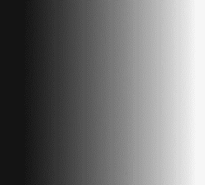

图 5-20。平滑渐变 由黑变白

添加色标也很容易。清单 5-21 每 20%黑白交替一次。

***清单 5-21*** 。带有交替色标的线性渐变

```html
<!-- HTML snippet -->
<div class="gradient"></div>

/* CSS snippet */
.gradient {
    width:400px;
    height:400px;
    background-image: linear-gradient(to right, black 0%, white 20%, black 40%,
        white 60%, black 80%, white 100%);
}
```

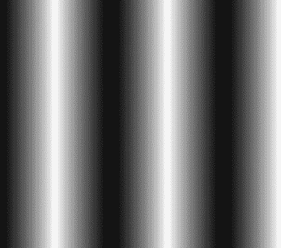

图 5-21。更复杂的线性渐变

指示方向的第一个参数可以接受一个边(`left`、`right`、`top`、`bottom`)、一个角(`top left`、`top right`、`bottom left`、`bottom right`)，或者像`45deg`或`320deg`这样的自定义度数。

你可以在微软的网站上找到更多关于线性渐变实现的信息。

创建径向渐变的函数有点复杂，我只展示一个例子，并再次鼓励你在`http://msdn.microsoft.com/en-us/library/windows/apps/hh453718(v=vs.85).aspx`访问微软关于这个主题的文档，当你准备好自己实现它的时候。清单 5-22 将创建一个渐变，从中间的黑色开始，以白色向外辐射到最远的角落。

***清单 5-22*** 。从中心到最远角的径向渐变

```html
<!-- HTML snippet -->
<div class="gradient"></div>

/* CSS snippet */
.gradient {
    width:400px;
    height:400px;
    background-image: radial-gradient(circle at 50% 50%, black 0%, white 100%);
}
```

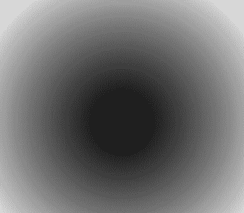

图 5-22。从中间的黑色到外部的白色的径向渐变

影子

多年来，网页设计者想出了各种各样的技巧来创建阴影，因为直到现在，标准中还没有相关的规定。现在实现投影很容易，但更好的是它是标准的。

我会像对待渐变一样，对阴影的使用发出同样的警告。这是一种视觉装饰。阴影是一种 skeuemorphic 人工制品，因为它试图使你的应用程序中的一些元素看起来像在现实世界中一样。但这并不在现实世界中，不是吗？这是在数字世界中，Windows 8 的设计原则建议我们将我们的应用程序设计成真正的数字，而不要考虑现实世界效果可能带来的所有依赖和限制。

推荐与否，框阴影非常容易实现。清单 5-23 显示了一个带有简单阴影的小白框。这些值表示水平偏移、垂直偏移、模糊半径、扩散距离和阴影颜色。

***清单 5-23*** 。div 元素上的方框阴影定义

```html
<!-- HTML snippet -->
<div class="shadow"></div>

/* CSS snippet */
.shadow {
    width: 100px;
    height: 100px;
    background-color: white;
    border: 1px solid black;
    box-shadow: 10px 10px 10px 0px hsla(0,0%,0%,.5);
}
```

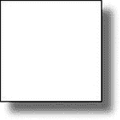

图 5-23。白色方框 下的简单方框阴影

关于阴影的一个有趣的事情是，它们不仅仅可以用来创造阴影。清单 5-24 显示了两个例子。在第一个示例中，添加了一个没有水平或垂直偏移的阴影来创建发光效果。在第二个例子中，一个实心的阴影被用来明显地将盒子向外延伸，并且在一个虚线的边框之下，使得元素看起来像是在它的周围缝了针。

***清单 5-24*** 。框阴影属性 的两种可选用法

```html
<!-- HTML snippet -->
<div class="flex">
    <div class="glowBox"></div>
    <div class="stitches"></div>
</div>

/* CSS snippet */
.flex {
    display:-ms-flexbox;
    -ms-flex-pack:distribute;
    -ms-flex-align:center;
    height:200px;
    width:600px;
}

.glowBox {
    border:1px solid gray;
    width:100px;
    height:100px;
    box-shadow: 0px 0px 40px 10px hsla(0,0%,0%,.5);
}

.stitches {
    background-color: lightgray;
    border:2px dashed black;
    box-shadow: 0 0 0 4px lightgray;
    color: black;
    padding: 10px;
    border-radius: 4px;
    width:100px;
    height:100px;
}
```


图 5-24。两个 div 元素——一个发光，另一个明显是缝合在一起的

摘要

在这一章中，我们已经了解了影响任何 HTML 元素的矩形模型的所有属性(我们称之为*box*)。我们定义影响大小(宽度和高度)、边距(外部空间)、边框、填充(内部空间)等的 CSS 属性。我们学习了设置内容的宽度和高度的相对值或绝对值，以确定其呈现的大小。我们还学习了如何处理对于它们的空间来说太大和溢出的元素内容。我们学习了单独或一起定义元素的左、右、上、下边距。我们学习了如何使用线条样式、大小和颜色来确定元素的边框。我们学习了如何定义填充，让内容在框架内有一点喘息的空间。

我们还研究了元素中的背景设置，可以是纯色、图像，甚至是线性或径向渐变。最后，我们学习了盒子阴影，并使用它们给我们的元素一些明显的深度和一点点创造性的兴趣。在理解后续概念之前，理解这些概念是很重要的，尤其是第七章中的高级布局概念。

现在我们对盒子属性有了基本的了解，我们将继续元素的转换和动画。我们不是确定元素的静态外观，而是确定它们的过渡和动画，真正让我们的 Windows 8 应用变得生动起来。`