# 六、变换、过渡和动画属性

 **注意**动画在一个成功的 Windows 8 应用中远不止是点缀；相反，它通过吸引用户并使应用程序变得生动而变得重要。而一个引人入胜、生动活泼的 app 才是成功的 app。

一个没有足够动画的 Windows 8 应用程序至少会给用户留下一种潜意识的感觉，即缺少了什么或者什么东西死了。太多的动画可能会分散注意力，分散注意力，甚至可能会令人厌烦。所以动画应该足以让你的应用程序的视觉效果栩栩如生，仅此而已。

适量的动画是 Windows 8 设计的核心原则。涵盖 Windows 8 设计的原则之一是真正的数字化，也就是说，拥抱现代数字系统的功能和自由，摆脱物理系统的束缚。强调用户任务的动画和过渡符合这个原则。

与这个主题相关的还有另一个原则——你的 UI 应该快速流畅。你的界面不仅应该在性能上或与用户的接触上没有停顿，而且应该从一个屏幕流到下一个屏幕。有很好的理由让 UI 动画化，甚至有更好的理由不要动画化太多。

在动画方面，微软再次采用并实现了 W3C 标准，并在必要的地方对其进行了扩展，以满足现代应用程序的需求。由于您的动画在 Windows 8 中运行，它们将拥有操作系统硬件加速的巨大优势。您不必接受使用 web 堆栈带来的性能损失。

在这一章中，我们将讨论所有与 CSS 和动画相关的东西。我们将涵盖二维和三维的变换、过渡和动画。比起我们现在的时间和空间，更多的页面可以很容易地用于这些广泛的主题，但我希望传达这个概念，并让你对可能的事情感到兴奋。

变换

转换只是简单的变化。它可能是宽度的改变、颜色的改变或一些其他的属性。但是，您已经知道，这些属性的更改可以通过简单地修改属性值来完成，那么，当您可以简单地调整元素的位置属性并看到相同的效果时，为什么您要添加一个转换，例如，将元素向右移动一些像素呢？或者，当您可以增加其宽度和高度属性时，为什么要应用缩放变换来使某些东西增长呢？

答案是转换很容易应用和移除(甚至是通过编程)。它会在目标元素呈现后影响它，并且会影响整个目标元素，包括子元素。

此外，转换允许您以单独使用属性无法实现的方式影响元素。例如，如果没有变换，就不能给元素添加旋转。事实上，有一个完整的 CSS 转换子集可以用类似 3D 的效果来影响元素，而这些效果肯定不可能用标准属性来实现。

有许多可用的变换效果，然而只有大约六个 CSS 属性需要记住，它们是`perspective`、`perspective-origin`、`backface-visibility`、`transform-origin`、`transform-style`和`transform`。还有更多关于这些属性的细节。在`http://www.w3.org/TR/css3-transforms/#transform-property`可以看到完整的列表。

变换函数

到目前为止，最有趣的属性是`transform`属性。对于它的值，它期望一个或多个*转换函数*的列表。我将首先描述每个与转换相关的属性，然后非常详细地关注转换属性。

`perspective`

不要混淆这个属性值和马上要讨论的`perspective()`函数的区别。它们有相同的视觉效果，但是这个(`transform`函数的`perspective`值)影响它所有子元素的变换，而`perspective()`函数只影响它所在元素的变换。我将等到下一节来描述`perspective()`函数的实际效果。`perspective`属性值仅影响 3D 变换元素。

`perspective-origin`

`perspective-origin`属性是虚拟摄像机从目标元素正前方的偏差(使用 x 和 y 坐标)。如果你看着一个正方形建筑的墙，并且你向右走得足够远，从你的角度来看，墙会改变形状，这正是你在修改这个属性时应该想到的。与`perspective`一样，`perspective-origin`影响其子变换的变换，但不影响自己的变换。

`backface-visibility`

属性决定了当我们旋转一个元素并看到它的背面时，它的内容会发生什么。如果在这种情况下您应该看到内容的后面，请将其设置为`visible`,如果不应该，请将其设置为`hidden`。

`transform-origin`

如果你在正方形的一个角附近插上一根针并旋转它，你会得到一个不同于把针插在正方形中心的结果。这就是`transform-origin`属性为您做的事情。它指示转换应该从元素的哪个部分开始。根据转换的不同，它的行为会有所不同。

`transform-style`

您可以指定`flat`或`preserve-3d`作为`transform-style`属性的值。如果您选择`preserve-3d`，那么嵌套元素将保持它们在 3D 空间中的相对位置。但是，如果您选择`flat`，那么所有元素都会折叠到一个共享平面。

`transform`

`transform`函数是完成大部分繁重工作的函数。它的值可能很大，因为它由一个或多个可用的转换函数组成(用空格分隔)。transform 属性及其众多函数都非常复杂。欢迎你去 w3c.org，得到你所需要的公式和理论，但是我会保持我所有的描述和例子简单实用。我将更多地谈论你可能选择在你的应用程序中使用转换的原因，而不是背后的数学和理论。

2D 变换函数

有许多变换函数可供选择。您可以使用以下任何二维变换来影响您的目标元素:`rotate()`、`scale()`、`scaleX()`、`scaleY()`、`skew()`、`skewX()`、`skewY()`、`translate()`、`translateX()`、`translateY()`或`matrix()`。

`rotate()`

rotate 函数的目的一点也不含糊。它将目标元素顺时针旋转指定的度数。度数单位为`deg`，遵循从负无穷大到正的值。负值将逆时针旋转目标元素，正值将顺时针旋转目标元素。

`rotate()`函数完全愿意接受大于 360 度旋转的数字，它将继续旋转。因此，`440deg`的值将顺时针方向旋转目标一次半，最终将等于`180deg`的值。

清单 6-1 展示了具有三个不同旋转值的相同`div`元素。

 **注意**在本章的代码清单中，您可能会注意到父容器的`display`值可能被设置为`-ms-flexbox`或`-ms-grid`。目前，只知道这些是布局技术。flexbox 非常适合将它的孩子一个接一个地排列起来，在这种情况下，网格用于将他们堆叠在一起。我们将在第七章中详细讨论这些和其他布局技术。

***清单 6-1 。*** 分别为 5 度、-45 度和 180 度的文本块

```html
<!-- HTML snippet -->
<div class="parent">
    <div>Lorem ipsum dolor sit amet...</div>
    <div>Lorem ipsum dolor sit amet...</div>
    <div>Lorem ipsum dolor sit amet...</div>
</div>

/* CSS snippet */
.parent {
    display: -ms-flexbox;
}

.parent div {
    border: 2px solid gray;
    width: 200px;
    height: 200px;
    padding: 5px;
    margin: 5px;
}

.parent div:nth-of-type(1) {
    transform: rotate(5deg);
}

.parent div:nth-of-type(2) {
    transform: rotate(-45deg);
}

.parent div:nth-of-type(3) {
    transform: rotate(180deg);
}
```

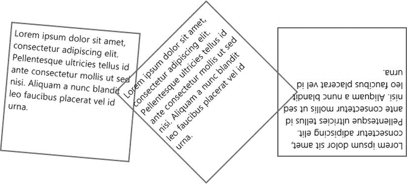

图 6-1。具有不同旋转级别的变换元素

`scale()`

缩放是调整目标元素及其所有内容的大小，它在呈现目标后生效。这意味着元素的子内容不会根据其父元素的大小进行布局，而是随着父元素一起缩放。

`scale()`函数要求一个值的乘数。值`0.5`会将对象缩放到其原始大小的一半，`1`会保持其大小不变，`2`会使其翻倍。清单 6-2 经历了完全相同的场景。

***清单 6-2 。*** 将对象缩放到原来的一半再到两倍

```html
<!-- HTML snippet -->
<div class="parent">
    <div>Lorem ipsum dolor sit amet...</div>
    <div>Lorem ipsum dolor sit amet...</div>
    <div>Lorem ipsum dolor sit amet...</div>
</div>

/* CSS snippet */
.parent {
    display: -ms-flexbox;
}

.parent div {
    border: 2px solid gray;
    width: 200px;
    height: 200px;
    padding: 5px;
    margin: 5px;
}

.parent div:nth-of-type(1) {
    transform: scale(1);
}

.parent div:nth-of-type(2) {
    transform: scale(0.5);
}

.parent div:nth-of-type(3) {
    transform: scale(2);
}
```

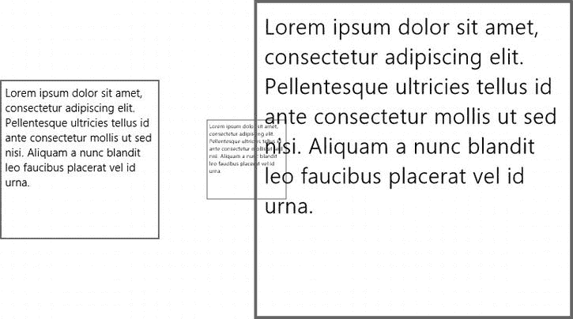

图 6-2 。三个级别的规模

注意缩放后，图 6-2 中的 div 实际上是重叠的。仅仅基于传统的 HTML 经验，这似乎是不可能的。缩放仅在目标元素完全呈现后发生，这意味着这与简单地为宽度和高度属性指定替代值有很大的不同。

考虑清单 6-3 中的元素。它的内容有一个段落，其尺寸为 400 像素宽，200 像素高。

***清单 6-3 。*** 一个 400 像素乘 200 像素的带文本内容的 div 元素

```html
<!-- HTML snippet -->
<div id="textDiv">
    <p>Lorem ipsum dolor sit amet...</p>
</div>

/* CSS snippet */
#textDiv {
    width: 400px;
    height: 200px;
}
```

现在让我们看看清单 6-4 中的，其中我们使用宽度和高度属性来调整`div`的大小。您会注意到段落文本已经对其父文本的大小变化做出了反应。

***清单 6-4 。*** 通过操作样式属性将 div 的大小调整为 800 像素乘 400 像素

```html
/* CSS snippet */
#textDiv {
    width: 800px;
    height: 400px;
}
```

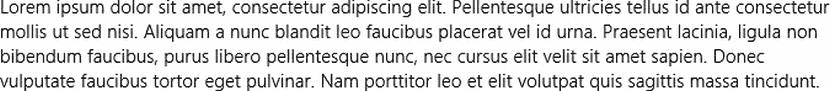

图 6-4。div 文本的布局适合其更大的容器

现在，相反地，清单 6-5 缩放元素。您会注意到，段落文本没有改变其布局，但形状保持不变，尽管大小是原来的两倍。

***清单 6-5 。*** 使用变换而不是缩放来放大 div

```html
/* CSS snippet */
#textDiv {
    width: 200px;
    height: 100px;
    transform: scale(2,2);
}
```

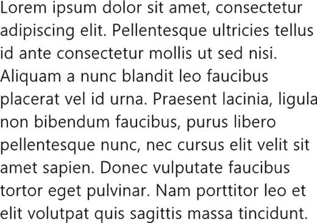

图 6-5。文本完全按照它在较小容器中的样子进行布局，只是后来进行了缩放

可以在 x 轴和 y 轴上统一进行缩放，也可以独立于其中一个轴进行缩放。函数`scaleX()`和 scaleY()存在并将只变换适当的轴，但是同样的事情可以通过简单地向 *scale* 方法提供两个值并确保将其中一个设置为值`1`来完成。那么，清单 6-6 中的两个表达式是相同的。

***清单 6-6 。*** 两种交替方式将目标元素的宽度增加一倍

```html
/* CSS snippet */
div {
    transform: scale(2,1);
}

div {
    transform: scaleX(2);
}
```

`skew()`

`skew()`函数向相反的方向平移目标元素的对边，扭曲元素的形状及其内容。它可以用来创造各种各样的效果。

倾斜可以用来显示透视效果。此外，如果您在屏幕上制作元素动画，可以使用倾斜来显示元素的加速和减速，但那只是动画。倾斜变换本身是静态的。

清单 6-7 显示了一个基本的倾斜变换，这次再次影响了一段文本。

***清单 6-7 。*** 文本沿单轴的基本倾斜

```html
<!-- HTML snippet -->
<div class="parent">
    <div>Lorem ipsum dolor sit amet...</div>
    <div>Lorem ipsum dolor sit amet...</div>
    <div>Lorem ipsum dolor sit amet...</div>
</div>

/* CSS snippet */
.parent {
    display: -ms-flexbox;
}

.parent div {
    border: 2px solid gray;
    width: 200px;
    height: 200px;
    padding: 5px;
    margin: 5px;
}
.parent div:nth-of-type(1) {
    transform: skew(0deg,10deg);
}

.parent div:nth-of-type(2) {
    transform: skew(-5deg,0deg);
}

.parent div:nth-of-type(3) {
    transform: skew(15deg,15deg);
}
```

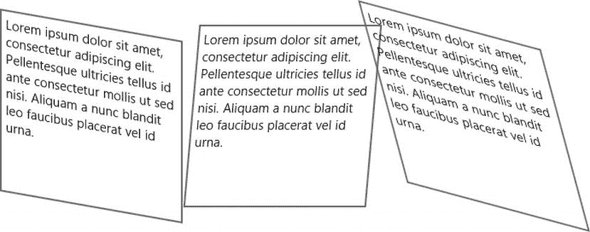

图 6-6。垂直倾斜、水平倾斜以及两者的组合

像缩放变换一样，倾斜变换也有`skewX()`和`skewY()`两种，但是我个人认为不值得使用它们，因为使用`skew(n,n)`和传入两个值一样容易。

`translate()`

像它的表亲 scale 和 skew 一样，translate 也有独立的轴版本，正如你可能猜到的那样，它们是`translateX()`和`translateY()`。我有没有提到我个人认为它们不值得？

平移变换是一个非常重要的变换。翻译就是简单地移动。`translateX()`功能沿 x 轴左右移动目标，`translateY()`功能沿 y 轴上下移动目标。然后`translate()`函数取两个值，并可以沿着 xy 平面移动它的目标。你可以想象这样一个函数有多少种用途。

清单 6-8 使用 flexbox 将 5 个`div`元素并排放置。它们都有一个预先确定 75 像素的正方形，一些空白，和一个白色的边界来区分。然后，突出显示的块挑选出第 5 个`div`，并应用变换将其向右下方移动 20 个像素。

***清单 6-8 。***rotate()、scale()和 translate()的组合赋予第一个字母一些活力

```html
<!-- HTML snippet -->
<div class="parent">
    <div>Lorem ipsum dolor sit amet...</div>
    <div>Lorem ipsum dolor sit amet...</div>
    <div>Lorem ipsum dolor sit amet...</div>
</div>

/* CSS snippet */
.parent {
    display: -ms-flexbox;
}

.parent div {
    border: 2px solid gray;
    width: 200px;
    height: 200px;
    padding: 5px;
    margin: 5px;
}

.parent div:nth-of-type(1){
    transform: translate(0,0)
}

.parent div:nth-of-type(2){
    transform: translate(20px,20px);
}

.parent div:nth-of-type(3){
    transform: translate(0,0);
}
```

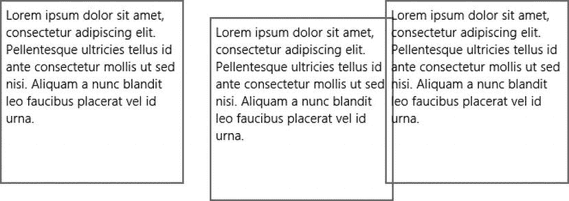

图 6-7。中间的 div 从其原始位置向右移动了 20 个像素，向下移动了 20 个像素

`matrix()`

我们已经讨论过的函数背后的所有功能以及更多功能都可以通过`matrix`函数实现。`matrix`功能不适合心脏虚弱的人。这很乏味也很复杂，但是当你需要深入了解并使你的变换看起来如此时，这个函数(以及对你书架上的线性代数书的一点回顾)将带你去那里。

3D 变换功能

首先，3D 这个术语有点误导。这些所谓的三维变换并不比二维计算机屏幕上发生的任何事情更三维，但定义计算机上 3D 技术的东西是对象在投影到二维屏幕之前呈现的 3D 空间。这种效果充其量只能产生 3D 效果。

有许多可用的三维变换函数。可以选择`perspective()`、`perspective-origin()`、`rotate3d()`、`rotateX()`、`rotateY()`、`rotateZ()`、`scale3d()`、`scaleZ()`、`translate3d()`、`translateZ()`、`matrix3d()`。

对于所有的 3D 变换，您应该想象您的平面的、渲染的元素在 3D 空间中站立，虚拟相机指向它们。一些属性将操作这个虚拟摄像机的位置，其他的将操作渲染元素的位置。

`perspective()`

`perspective()`函数操纵被转换元素的虚拟摄像机。它采用具有较高值的长度值，这意味着虚拟相机离对象更远，并且元素将看起来更平，而较低值，这意味着虚拟相机离对象更近，并且元素将看起来更有深度。

很容易注意到引入的戏剧性深度，因为`perspective()`功能被配置为使相机更靠近对象。清单 6-9 展示了缩小视角的视觉效果。

***清单 6-9 。*** 三个 div 都以相同的角度旋转，透视值分别为无、400 像素和 200 像素

```html
<!-- HTML snippet -->
<div class="parent">
    <div>Lorem ipsum dolor sit amet...</div>
    <div>Lorem ipsum dolor sit amet...</div>
    <div>Lorem ipsum dolor sit amet...</div>
</div>

/* CSS snippet */
.parent {
    display: -ms-flexbox;
}

.parent div {
    border: 2px solid gray;
    width: 200px;
    height: 200px;
    padding: 5px;
    margin: 5px;
}

.parent div:nth-of-type(1) {
    transform: rotate3d(1,1,1,45deg);
}

.parent div:nth-of-type(2) {
    transform: perspective(400px) rotate3d(1,1,1,45deg);
}

.parent div:nth-of-type(3) {
    transform: perspective(200px) rotate3d(1,1,1,45deg);
}
```

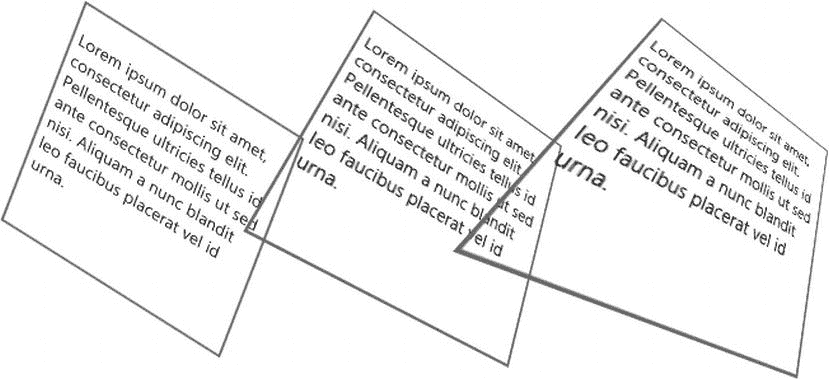

图 6-8。减少透视值会导致表观深度增加

正如我前面提到的，您应该小心不要将这个`perspective()`函数与`perspective`属性混淆。同样，该函数会影响它所应用到的元素的变换。还要记住，`perspective`对没有应用任何其他 3D 变换功能的对象没有任何效果。

`rotate3d()`

当然，当我们看 2D 变换时，旋转也是可用的，但是你可能期望在 3D 环境中有一些额外的功能，你是对的。在我们的新空间中，我们将能够使用`rotate3d()`、`rotateX()`、`rotateY()`和`rotateZ()`围绕所有三个轴旋转。后三种功能没有什么是前一种功能做不到的。`rotate3d()`函数有四个参数。前三个是向量的 x、y 和 z 坐标，将被规范化为单位向量，第四个是元素围绕该向量旋转的度数(顺时针)。

然后，调用`rotate3d(1,0,0,45deg)`，将围绕 x 轴顺时针旋转元素 45 度；`rotate3d(0,1,0,45deg)`将绕 y 轴顺时针旋转 45 度；而`rotate3d(1,1,0,45deg)`将围绕一个向量旋转它 45 度，这个向量从原点开始，直接投影在 xy 平面上的 x 轴和 y 轴之间。

在任何旋转函数中，正的角度值将围绕轴或单位向量顺时针旋转元素，负的角度值将逆时针旋转元素。

清单 6-10 旋转三维平面元素。

***清单 6-10 。***rotate 3d()函数用于围绕 x 轴、y 轴以及两者的组合旋转一个 div

```html
<!-- HTML snippet -->
<div class="parent">
    <div>Lorem ipsum dolor sit amet...</div>
    <div>Lorem ipsum dolor sit amet...</div>
    <div>Lorem ipsum dolor sit amet...</div>
</div>

/* CSS snippet */
.parent {
    display: -ms-flexbox;
}

.parent div {
    border: 2px solid gray;
    width: 200px;
    height: 200px;
    padding: 5px;
    margin: 5px;
}

.parent div:nth-of-type(1) {
    transform: rotate3d(1,0,0,45deg);
}

.parent div:nth-of-type(2) {
    transform: rotate3d(0,1,0,45deg);
}

.parent div:nth-of-type(3) {
    transform: rotate3d(1,1,0,45deg);
}
```

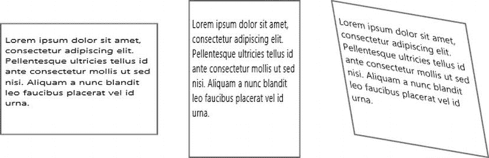

图 6-9。围绕 x 轴的旋转看起来就像元素被垂直挤压，围绕 y 轴的旋转看起来就像被水平挤压，结合起来看起来就像是 3D 的

 **注意**从技术上讲，上述三种变换中的任何一种都可以使用正确的二维变换函数来实现，但这需要一个坐标系映射。换句话说，让我们想象你正试图让一个正方形的视觉元素看起来像是朝着用户打开的，就像一扇客厅的门。要使用二维变换做到这一点，您需要弄清楚什么样的倾斜、缩放和平移组合会产生这种效果。然而，使用三维变换只需要一个简单的`rotateY()`函数调用，几乎不需要思考！

`scale3d()`

一旦你把你的元素放入三维空间，所有主要的变换功能——旋转、缩放和平移——都必须实现。像它的对应物一样，`scale3d()`函数也伴随着`scaleX()`、`scaleY()`和`scaleZ()`函数，同样，`scale3d()`函数可以执行其他函数可以执行的任何函数。你发现一种模式了吗？

`scale3d()`函数要求我们提供三个参数，它们是沿 x、y 和 z 轴的比例因子。清单 6-11 使用了三个后续的`scale3d()`函数调用来最好地说明区别。

***?? 列表 6-11 。*** 一个 div 配置为不按比例缩放(1，1，1)，第二个 div 配置为按比例缩小(0.8，0.8，0.8)，第三个 div 在 y 和 z 轴按比例放大，在 x 轴按比例缩小

```html
<!-- HTML snippet -->
<div class="parent">
    <div>Lorem ipsum dolor sit amet...</div>
    <div>Lorem ipsum dolor sit amet...</div>
    <div>Lorem ipsum dolor sit amet...</div>
</div>

/* CSS snippet */
.parent {
    display: -ms-flexbox;
    perspective: 800px;
}

.parent div {
    border: 2px solid gray;
    width: 200px;
    height: 200px;
    padding: 5px;
    margin: 5px;
}

.parent div:nth-of-type(1) {
    transform: rotate3d(1,1,0,45deg) scale3d(1,1,1)
}

.parent div:nth-of-type(2) {
    transform: rotate3d(1,1,0,45deg) scale3d(0.8,0.8,0.8)
}

.parent div:nth-of-type(3) {
    transform: rotate3d(1,1,0,45deg) scale3d(0.5,1.2,1.2);
}
```

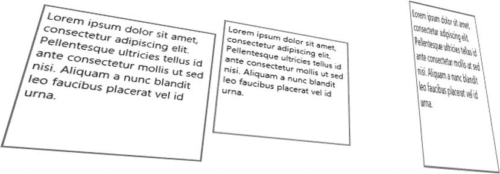

图 6-10。三维缩放的结果

`translate3d()`

当涉及到在二维空间移动元素时，`translateX()`和`translateY()`函数覆盖了基础，但随着第三维空间的到来，需要一个`translateZ()`，事实就是如此。`translateZ()`功能将物体移近或移离观看者(假设观看者仍在他或她的原始位置`perspective-origin: 50% 50%`)。

清单 6-12 显示了一个例子，三个不透明的元素直接堆叠在一起。使用沿 z 轴的 3D 平移在堆叠的元素之间增加了一些距离。整个场景已被旋转以显示隐藏的元素。

***清单 6-12 。*** 样式规则旋转和平移三个元素。那个。覆盖父规则以使用网格使元素堆叠在彼此之上

```html
<!-- HTML snippet -->
<div class="parent">
    <div>Lorem ipsum dolor sit amet...</div>
    <div>Lorem ipsum dolor sit amet...</div>
    <div>Lorem ipsum dolor sit amet...</div>
</div>

/* CSS snippet */
.parent {
    display: -ms-grid;
}

.parent div {
    border: 2px solid gray;
    background-color: white;
    width: 200px;
    height: 200px;
    padding: 5px;
    margin: 5px;
}

.parent div:nth-of-type(1) {
    transform: rotate3d(1, -1, 0, 45deg) translate3d(0, 0, 0);
}

.parent div:nth-of-type(2) {
    transform: rotate3d(1, -1, 0, 45deg) translate3d(0, 0, 60px);
}

.parent div:nth-of-type(3) {
    transform: rotate3d(1, -1, 0, 45deg) translate3d(0, 0, 120px);
}
```

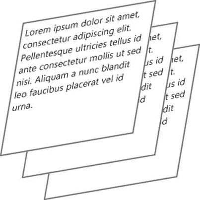

图 6-11。场景的旋转和每个元素的不同平移级别使我们能够看到每个元素，即使它们是堆叠的

`matrix3d()`

`matrix3d()`函数是所有其他转换函数的母体。所有其他的都是基于它的，所以它能做其他函数能做的一切，甚至更多。唯一的缺点是，除非你有高等数学学位，否则很难弄清楚如何使用它。

我只辅修过数学，所以清单 6-13 借用了 MSDN 网站上`matrix3d`函数的一个例子(`http://msdn.microsoft.com/en-us/library/windows/apps/jj193609.aspx`)。

***清单 6-13 。***matrix 3d()函数的十六个值导致目标元素发生组合转换

```html
<!-- HTML snippet -->
<div class="parent">
    <div>Lorem ipsum dolor sit amet...</div>
</div>

/* CSS snippet */
.parent {
    display: -ms-flexbox;
}

.parent div {
    border: 2px solid gray;
    width: 200px;
    height: 200px;
    padding: 5px;
    margin: 5px;
}

.parent div:nth-of-type(1) {
    transform: matrix3d(
         0.359127,  -0.469472, 0.806613, 0,
         0.190951,   0.882948, 0.428884, 0,
        -0.913545,   0,        0.406737, 0,
         0,          0,        0,        1
    );
}
```

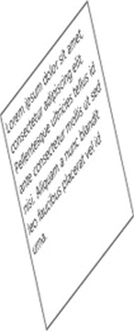

图 6-12。使用 matrix3d()函数完成的转换组合

转换是一种变化，但它是静态的，在应用程序的视图渲染时应用，并在视图渲染时保持不变。我们真正需要做的是让事情向前发展。例如，当从一个页面切换到下一个页面时，我们可能需要最微妙的动画来指示一个页面飞入，另一个页面飞出。当我们将字体从正常变为粗体时，我们可能希望文本加粗，而不仅仅是在看不清的瞬间加粗。

为了让事情进展顺利，我们需要使用过渡。

过渡

你可能认为动画是一个脚本函数，想知道它们在 CSS 而不是 JavaScript 中做什么。不过，过渡和动画都与风格有关。唯一的区别是，它们不仅考虑了静态风格，还考虑了动态风格。

过渡为介于两种风格之间的风格提供了一种实现。它们是从这里到那里应该发生的事情的描述。当一个元素突然被添加到屏幕上时，它应该如何到达那里？当它被移除时，它应该如何离开？

就像变换一样，没有大量的 CSS 属性适用于过渡——实际上只有四个，外加一个简写。您可以从`transition-property`、`transition-duration`、`transition-timing-function`和`transition-delay`中选择，或者您可以跳过长的属性名称，将它们全部组合成`transition`速记法。这是更常见的方法。

一旦某个元素成为样式规则的目标，过渡就会生效，它们的动画也会开始。在下面的例子中，您将看到我们的转换在一个样式规则中，选择器中有一个:hover 伪类。这意味着用户将悬停在一个元素上，此时将成为包含转换的样式规则的目标；因此，它们将被转换，而不是简单地将样式属性从原来的样子更改为新规则要求的样子。

如果一个转换介于两个状态之间，那么我们显然是在处理某个开始状态和某个结束状态。转换总是由结束状态定义的。如果我们将一个`div`从矮变高，那么这个变化是由定义高状态的样式规则定义的。

清单 6-14 和图 6-13 显示了一个非常简单的过渡。一个`div`元素以每边 100 像素的大小开始。它有一个白色的背景和灰色的能见度边界。定义了第二个样式规则，该规则应用于处于悬停状态的框——也就是说，当用户将鼠标悬停在 div 上时。第二帧代表用户悬停的时刻。

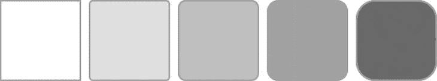

图 6-13 。过渡的五个帧试图说明产生的动画

在第二个规则中，我们指定了两个属性，然后指定了一个非常简单的转换属性，该属性简单地表明该样式规则中的所有属性需要两秒钟才能生效。这意味着五帧代表两秒钟，这是白盒变成灰色和方形边缘获得边框半径所需的时间。

***清单 6-14 。*** 一个非常简单的转换，配置为花费两秒钟，当目标元素悬停时应用于背景颜色和边框半径属性

```html
<!-- HTML snippet -->
<div id="box">
</div>

/* CSS snippet */
#box {
    width: 100px;
    height: 100px;
    border: 2px solid hsl(0,0%,70%);
}

#box:hover {
    background-color: gray;
    border-radius: 25px;
    transition: 2s;
}
```

在最后一个例子中，我们创建了一个省略了所有属性的转换，并将其应用于所有属性。如果要限制过渡实际应用到哪些属性，必须指定它们。清单 6-15 显示了前一个例子中`#box:hover`样式规则的另一个版本，图 6-14 显示了结果。当然，不同之处在于，虽然边框半径看起来像以前一样有动画效果，但是过渡属性不再考虑背景色，因为存在一个明确的属性列表，并且没有邀请背景色。因此，当用户将鼠标悬停在上面时，`div`会变成灰色，在我们的图 6-14 中，第二帧和随后的帧描述的正是这种情况。


图 6-14 。导致背景色从翻译属性中排除，并且在第二帧中明显立即应用背景色

***清单 6-15 。*** 边界半径属性明确包含在平移属性中

```html
#box:hover {
    background-color: gray;
    border-radius: 25px;
    transition: border-radius 2s;
}
```

指定过渡应该花费两秒钟是假设对象的渐进变化应该根据缓动功能发生。“减缓”功能的作用方式更像我们世界中受重力约束的真实对象，因为它开始时慢一点，结束时也慢一点。放松功能对眼睛来说很容易，因为即使它是潜意识的，它看起来也像我们人类大脑习惯看到的东西。

不过，我们不必遵循这个函数。在清单 6-16 中，注意速记属性仍然在使用，但是我们现在已经指定应该使用线性函数。在我的 5 帧动画中，动画的变化太细微了，无法察觉，所以你只能自己尝试了。定时功能的有效值为`linear`、`ease`、`ease-in`、`ease-out`、`ease-in-out`、`cubic-bezier()`、`step-start`、`step-end`或`steps()`。

***清单 6-16 。**??【线性计时功能】增加了转场速记属性*

```html
/* CSS snippet */
#box:hover {
    background-color: gray;
    border-radius: 25px;
    transition: border-radius linear 2s;
}
```

`linear`、`ease`、`ease-in`、`ease-out`和`ease-in-out`的值很方便，而`cubic-bezier()`允许你指定任何你想要的连续函数。`step-start`和`step-end`值和`steps()`功能允许非连续计时，以便过渡以阶梯方式生效。

最后，如果你没有为`transition-delay`属性指定一个值，那么就不会有延迟，CSS 样式规则生效的时候转换就开始了。增加延迟值`2s`将在状态改变整整两秒后开始转换。

您也可以应用多个过渡属性，但不是通过添加多个样式属性来实现。相反，您将多个属性放入同一个`transition`属性中，并用逗号分隔它们。

清单 6-17 将为我们的`div`制作背景色和边框半径的动画，但是背景色在 2 秒内不会开始，需要 10 秒才能完成。希望这个例子能激发你对 CSS 转换可能性的想象。

***清单 6-17 。*** 为两个属性指定不同的时序

```html
/* CSS snippet */
#box:hover {
    background-color: gray;
    border-radius: 25px;
    transition: border-radius 2s, background-color 10s;
}
```

不是每一个 CSS 属性都适合转换，但差不多如此。根据 W3C，可转换属性的实际列表包含`background-image`、`background-position`、`border-color`、`border-width`、`border-spacing`、`bottom`、`color`、`crop`、`font-size`、`font-weight`、`grid-*`、`height`、`left`、`letter-spacing`、`line-height`、`margin`、`max-height`、`max-width`、`min-height`、`min-width`、`opacity`、`outline-color`、`outline-offset`、`outline-width`

转换让我们可以很好地控制元素从一种状态到另一种状态的变化。但是，如果我们真的要掌握应用程序中的东西是如何移动的，我们就需要深入研究适当的 CSS 动画这个主题。

动画

CSS 动画比过渡给了我们更多的对目标元素的控制。过渡允许我们定义从开始状态到结束状态的单个过渡，但是动画允许定义任意数量的关键帧，整个动画可以按顺序通过这些关键帧。有了转场，我可以把我的`div`从白色变成灰色，但是有了动画，我可以把它从白色变成红色，变成绿色，变成紫色，然后变成灰色，而且我可以控制每一步的时间。

动画比过渡稍微复杂一点，但是像大多数 CSS 概念一样，肯定不会太难理解。动画分两步完成。

第一步是定义动画本身，除了它最终可能应用的任何目标元素。这是使用与媒体查询定义和字体定义类似的语法来完成的。一个动画定义看起来像清单 6-18 中的。

***清单 6-18 。**??【一个动画定义的基本结构】*

```html
@keyframes myAnimation {
    {keyframe1} {
        {properties}
    }
    {keyframe1} {
        {properties}
    }
    ...
    {keyframeN} {
        {properties}
    }
}
```

动画可以有任意数量的关键帧。每个关键帧的标识符可以是`from`、`to`或数字百分比值。`from`值相当于`0%`，`to`值相当于`100%`。您不必指定开始关键帧(`from`)或结束关键帧(`to`)。如果您关闭其中任何一个，它会将目标元素的属性值恢复到应用动画之前的位置。

清单 6-19 定义了一个动画，它将把它的目标元素从原来的颜色变成灰色，然后再变回灰色。

***清单 6-19 。*** 单个中点关键帧(开始和结束关键帧将被隐式假定)

```html
/* CSS snippet */
@keyframes toGrayAndBack {
    50% {
        background-color: gray;
    }
}
```

第二步是将动画应用到元素上。这可以简单地通过将`animation-name`属性添加到元素样式集合中来完成(或者将一个类应用到包含`animation-name`属性的元素中)。

像过渡一样，动画在应用程序生效时开始。如果一个元素是用 animation-name 属性定义的，那么动画将在页面加载时开始。要使用 JavaScript 触发动画，您可以将动画应用到某个样式，然后以编程方式将该样式添加到您希望制作动画的元素中。

动画属性有`animation-name`、`animation-duration`、`animation-timing-function`、`animation-iteration-count`、`animation-direction`、`animation-play-state`、`animation-delay, animation-fill-mode`和`animation`速记属性。我推荐使用`animation`速记属性，因为它使得代码更加可读。

一个动画应用程序可能看起来像清单 6-20 中的，它将确定名为`myAnimation` 的动画等待一秒钟的延迟，然后执行一个缓时功能五秒钟，并重复三次。

***清单 6-20 。***my animation 动画对 myElement 元素的应用

```html
#myElement {
    animation: myAnimation 5s ease 1s 3;
}
```

注意清单 6-19 的中定义名称`myAnimation`的方式，以及在清单 6-20 的中使用了完全相同的动画名称的事实。如果这些名称不完全匹配，则动画将不适用。

在清单 6-21 中，我们将把定义和应用放在一起。代码获取我们创建的`toGrayAndBack`动画，并将其应用到一个`div`元素。你可以看到图 6-15 中的`div`花了四秒钟从白色变成灰色，然后又变回灰色。注意，第一个(`from`)和最后一个(`to`)状态在这个动画中没有定义。只定义了中间(`50%`)。因此`div`是白色的，因为没有其他背景色应用于它，这是动画默认的状态。


图 6-15 。显示元素背景色从白色到灰色再变回白色的动画的五帧

***清单 6-21 。*** 将动画定义和应用结合在一起

```html
<!-- HTML snippet -->
<div id="box"></div>

/* CSS snippet */
@keyframes toGrayAndBack {
    50% {
        background-color: gray;
    }
}
#box { animation: toGrayAndBack 4s; }
```

现在，我们将通过定义多个关键帧来进行一些改进。清单 6-22 包括三个关键帧，其中第一个和最后一个不是从对象中假定的，而是明确指定的。请记住，如果您的第一个和最后一个关键帧不相同，那么您将很难在不引入不和谐过渡的情况下创建循环动画。

***清单 6-22 。*** 明确包含开始和结束关键帧

```html
<!-- HTML snippet -->
<div id="box">
</div>

/* CSS snippet */
@keyframes toBlackToGray {
    start {
        background-color: white;
    }
    50% {
        background-color: black;
    }
    end {
        background-color: gray;
    }
}

#box {
    animation: toBlackToGray 4s;
}
```

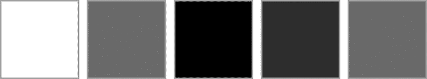

图 6-16。五帧说明背景从白色到黑色再到灰色的动画

我应该在这里记下一条方便的捷径。如果块定义相同，关键帧名称如`start`、`50%`和`end`可以组合，并用逗号分隔。很多时候你会以相同的属性集开始和结束，你可以用这种方法简化它。清单 6-23 提供了一个将目标元素从白色变成黑色再变回白色的技术例子。

***清单 6-23 。**?? 两个关键帧被定义在一起。不按顺序定义关键帧没有问题。*

```html
/* CSS snippet */
@keyframes toBlackAndBack {
    start, end {
        background-color: white;
    }
    50% {
        background-color: black;
    }
}
```

最后，清单 6-24 通过使用三个中间关键帧在轨道上移动一个`div`绕着另一个`div`更进一步。

***清单 6-24 。*** HTML 和 CSS 创建两个 div 元素和动画，一个环绕另一个

```html
<!-- HTML snippet -->
<div id="fixed"></div>
<div id="orbit"></div>

/* CSS snippet */
#fixed {
    background-color: black;
    width: 100px;
    height: 100px;
    position: relative;
    left: 150px;
    top: 250px;
}

#orbit {
    background-color: gray;
    width: 100px;
    height: 100px;
    position: relative;
    left: 0px;
    top: 0px;
    animation: orbit 10s linear infinite;
}

@keyframes orbit {
    25% {
            left: 300px;
            top: 0px;
        }
    50% {
            left: 300px;
            top: 300px;
        }
    75% {
            left: 0px;
            top: 300px;
        }
}
```

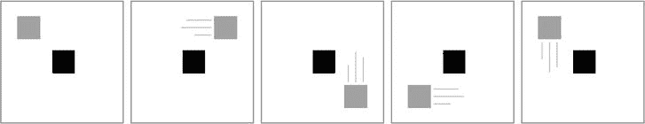

图 6-17。灰色 div 遵循黑色 div 周围的线性时序路径

除了应该生效的属性列表之外，关键帧还可以指定计时功能。这意味着，您可以通过将计时功能放入目标元素的动画应用程序中，为所有关键帧指定一个计时功能，或者可以在每个关键帧中指定多个计时功能，并让它们按照您喜欢的方式工作，即使它们互不相同。

令人印象深刻的是，这么多的动画可以单独用声明式 CSS 完成，但很可能您需要将一些逻辑合并到您的视觉资产的动画中，并且您需要为此使用 JavaScript。例如，在一个纸牌游戏中，在用户做出选择之前，你不知道他/她会做出什么样的选择，你需要做出相应的反应和动画。

CSS 动画的首要特性之一是捕捉基于动画的事件的能力。可用的事件有`animationstart`、`animationiteration`和`animationend`，每个事件的功能从其名称就很明显，所以我就不解释了。这些事件是在目标元素上触发的，所以你可以像清单 6-25 中的那样连接你的事件处理程序。

***清单 6-25 。*** 为 animationstart 事件实现一个事件处理程序

```html
ready: function (element, options) {
    document.querySelector("#myElement").addEventListener("animationstart", function(e) {
        // do something
    });
}
```

当您需要对某个元素的动画状态做出逻辑反应时，动画事件当然非常有用。例如，您可能希望在一个动画结束时触发另一个动画的开始。该代码可能看起来像清单 6-26 ，其中当`elementA`完成其动画时，一个类被添加到`elementB`。

***清单 6-26 。*** 给一个元素添加一个类，当另一个结束时触发一个动画

```html
ready: function (element, options) {
    var elementA = document.querySelector("#elementA");
    var elementB = document.querySelector("#elementB");
    elementA.addEventListener(“animationend”, function(e) {
        elementB.classList.add(“flash”);
    });
}
```

MSCSSMatrix 对象

我们已经讨论了无数种应用 CSS 属性来改进带有转换的应用程序的方法，但是如果没有 MSCSSMatrix 对象的介绍，这个讨论将是不完整的。除了您在 CSS 文件中指定的所有这些属性之外，`MSCSSMatrix` JavaScript 对象允许您在脚本中应用我们到目前为止讨论过的所有转换。这意味着你可以添加逻辑和更复杂的时间。

一个简单的例子就能说明问题。清单 6-27 根本不包含 CSS，只包含 HTML 和 JavaScript。假设 JavaScript 存在于一个 ready 方法中，该方法在 DOM 就绪时触发。

***清单 6-27 。*** 一个简单的 div，其文本由 JavaScript 指示绕 z 轴逆时针旋转 10 度

```html
<!-- HTML snippet -->
<div class="parent">
    Hello world
</div>

// JavaScript snippet
var d = document.querySelector(".parent");
d.style.transform = new MSCSSMatrix(d.style.transform).rotate(0, 0, -10);
```

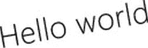

图 6-18。结果，旋转的文本，完成没有显式的 CSS 编写

在这个例子中，我们使用了`rotate`函数，但是所有其他的转换函数都是可用的，当然，你也可以手动设置你的矩阵值。

想象一下用 JavaScript 中 CSS 转换的力量可以做些什么是令人兴奋的。你可以在微软 MSDN 网站`http://msdn.microsoft.com/en-us/library/windows/apps/hh453593.aspx`上找到更多关于 MSCSSMatrix 对象的信息。

CSS3 中变换、过渡和动画的引入只是 web stack 成为世界上最强大的(也是无处不在的)用户界面技术的部分原因。

摘要

到目前为止，我们一直在看只包含少量基本元素的例子。在一个真实的应用程序场景中，你需要在屏幕上获得更多的视觉资产，并以一种有意义和实现良好设计的方式来布局它们。

你将在 CSS 中得到的布局元素和技术，以及来自 WinJS 库的一些帮助，将会给你把你的设计变成一个工作模型所需要的能力，我们将在下一章中研究那些布局技术。