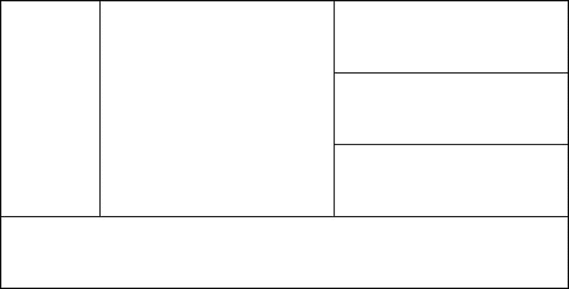
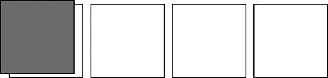

# 七、布局属性

 **注** CSS 能够驱动布局而不把开发者逼疯的能力由来已久。这几乎一直是一个痛处。

在我看来，web stack 长期以来对布局的支持并不多，这是由几个原因造成的。首先，我们有桌子，桌子在某种程度上已经足够了。当然，它们从来都不是定义你的布局的正确位置，但是已经足够了。第二，web 开发面向各种设备上的许多浏览器，并试图定义一个适应其显示的文档。相比之下，在印刷世界中，一张标准的纸永远不会改变大小，视觉伪像可以放在任何地方。

布局在 HTML 中仍然具有挑战性，但是开发人员哀叹缺少选择的日子已经一去不复返了。今天，我们看到越来越多的开发人员就众多选项中的哪一个在特定场景中最有效展开建设性的争论。

传统布局

表格是 HTML 中非常早期的元素。很有可能你对 HTML 表格有过一些经验，但是如果你没有，那么只需要知道它们不仅仅用于表格数据。它们也被用于布局。

我认为唯一和表格一样基本的 HTML 实现(或者更基本)是框架集。网站的布局有导航窗格、页眉和页脚窗格，框架集通过在每个窗格中加载不同的 HTML 文件来实现它们。框架集给开发人员和用户都带来了一系列的麻烦，所以推荐使用在一个 HTML 文件中定义了所有内容的表格。

除了表格之外，遗留布局的主题还应该包括使用带有显示和位置属性的普通旧`div`元素，以便将它们放置到位。

表格布局

表格布局实际上非常灵活和有效，我可以想象许多网站设计者今天仍然依赖它。我还敢打赌，这些设计师对他们的同行隐瞒了这个事实，因为表格绝不是当前的推荐。不推荐使用它们，因为它们与保持关注点分离的目的不一致，并且不具有适应性——这是 web 设计的两个核心原则。

还记得 HTML 定义结构，CSS 定义样式吗？HTML 允许你定义使用中的元素和它们之间的层次关系，但是不应该说这些元素的位置。更确切地说，布局是一种风格，它属于 CSS。将你的布局以表格的形式放入你的 HTML 也许能完成任务，但是它会导致一个网站不能像现代应用程序和设备所需要的那样具有适应性。

用表格定义布局会产生某些断言，如“此内容必须在此内容之下”或“此内容必须包含在此区域中”，他们会将站点锁定在这些断言中。

清单 7-1 显示了一个可以很好定义文档布局的表格。

***清单 7-1*** 。用作布局的表格元素

```html
<!-- HTML snippet -->
<table>
    <tr><td rowspan="3" id="nav"></td><td rowspan="3"></td><td></td></tr>
    <tr><td></td></tr>
    <tr><td></td></tr>
    <tr><td colspan="3" id="footer"></td></tr>
</table>

/* CSS snippet */
table{
    width:1100px;
    height: 560px;
    border-collapse: collapse;
}

table td {
    border: 2px solid black;
    padding: 5px;
}

#nav {
    width:180px;
}

#footer {
    height:80px;
```

`}`



图 7-1。这个示例布局看起来很不错，但是使用表格来定义布局从来都不是一个好主意

显示和定位

如果表格是布局上的禁忌，那怎么办？下一个更好的解决方案是使用带有显示和位置属性的`div`元素，手动将它们发送到屏幕上应该出现的位置。一个`div`(division 的缩写)是一个抽象元素，通常用来将内容的各个部分分开。它以块模式呈现，这意味着前面和后面的元素呈现在它的上面和下面。这与行内元素形成对比，行内元素像文字处理器中的文本一样流动。

这些`div`元素可以用样式属性进行格式化和定位，这使它们成为布局中表格的良好替代品。今天，它们在 web 上无处不在，但这并不是说开发人员乐于处理它们！使用`div`元素作为布局的技术带来了自己的痛苦，这就是为什么各地的 web 开发人员对已经出现或即将出现的新格式功能感到兴奋。然而，我们将在这里详细讨论经典的`div`定位，因为它是基础性的，因为你肯定会在“野外”看到它

`display`属性决定了它的目标将如何显示，成为布局主题中非常重要的属性。`display`属性的有效值(包括特定于微软供应商的值)为`inline`、`block`、`list-item`、`run-in`、`inline-block`、`table`、`inline-table`、`table-row-group`、`table-header-group`、`table-footer-group`、`table-row`、`table-column-group`、`table-column`、`table-cell`、`table-caption`、`-ms-flexbox`、`-ms-inline-flexbox`、`-ms-grid`、`-ms-inline-grid`和`none`。

显示属性

有很多值，所以我认为我们至少需要粗略地介绍一些显示属性，以便对布局有一个全面的了解。

在一条直线上的

当一个元素为`inline`时，它的行为就像文字处理器中的文本——也就是说，它相对于其前一个兄弟元素水平呈现，从一行流到下一行，并影响其自身的行高。尝试使用`width`和`height`调整内联元素的大小不会影响它们。

街区

块元素占用尽可能多的宽度，这迫使它们在自己的行上。指定多个块元素会导致元素在渲染时垂直堆叠。可以调整块元素的大小。

内嵌块

从父元素的角度来看，设置为显示为`inline-block`的元素的行为类似于内联元素，但是它们将自身及其子元素呈现为块元素。这是创建多个`div`元素的有效方法，这些元素像文本一样一个挨着一个显示。

列表项目

设置为`display: list-item`的元素就像列表中的一个项目一样呈现。为元素创建了一个*标记框*和一个*块框*，给它一个你所期望的项目符号和左边距。

试车

`run-in`值是一个有趣且颇具艺术性的单次使用值，通常用于标题。如果一个标题被设置为显示为`run-in`，那么它将和它下面的一段文字显示在同一行，并迫使文字移动以腾出空间。

内嵌表格和表格*

表格中各种组件(行、单元格等)的所有行为。)可以通过将元素显示设置为各种表格属性来模拟。你会记得，在 HTML 中使用表格是不好的做法，因为布局不是 HTML 的工作。但是，如果您使用这些样式属性实现您的表格，那么您将获得表格布局的所有优点，而没有缺点。不过我还是不推荐。

-ms-flexbox 和-ms-inline-flexbox

flexbox 是布局内容的一个非常强大的元素。Flexboxes 能够智能地处理其子对象的渲染方式，并为您提供流动、包裹、拉伸、对齐以及更多功能。接下来会有一整节专门介绍 flexboxes。使用`-ms-flexbox`值将创建一个块样式元素，使用`-ms-inline-flexbox`将创建一个内嵌 flexbox。

-ms 网格和-ms 内嵌网格

网格还可以让您很好地控制子元素的布局。网格允许内容的特定放置方式仍然可以适应大小和位置的变化。就像 flexbox 一样，有一个块和一个内嵌版本。

一旦为元素选择了合适的显示值，就应该知道定位它的选项。

位置属性

通过`position`属性进行定位，值为`static`、`absolute`、`relative`和`fixed`。`static`的值为默认值。位置值的好处将在以下章节中介绍。

静电

默认的`static`值不做任何额外的工作来定位对象。无论是内联元素还是块元素，它的位置都是由它在 HTML 文件中的位置决定的。

绝对的

一个`absolute`值设置一个元素，如果它的父元素被定位，它将被放置在相对于它的父元素的任何地方。如果它的父级没有被定位，那么它将相对于文档体。绝对定位的元素被从文档流中取出并停止影响它。他们不再把其他元素推来推去，也不再被它们推来推去。

亲戚

像`absolute`值一样，`relative`值设置您显式地放置您的元素，但是放置值被认为是相对于元素在它是静态的情况下呈现的位置。这是将元素向左移动一点的好方法。

固定的；不变的

`fixed`值的工作方式类似于`absolute`，但是它考虑到了它所在的视口，所以如果它在滚动的`div`中被渲染，它可以相对于`div`被放置。

除了 static 之外的每个位置值都决定了元素的位置，通过指定 left、right、top 和 bottom 的值可以做到这一点。对于绝对位置和固定位置，这些属性决定了元素的四个边相对于另一个元素的位置，但是对于相对位置，它们决定了该边相对于静态元素呈现位置的位置。

清单 7-2 展示了一个简单的正方形`div`元素行的例子(使用 flexbox 布局，我们很快会讨论到)。第三个元素的位置值为 relative(与默认的 static 相反),然后向右下方移动 15 个像素。效果是将盒子从原来的位置移开，如图 7-2 中的所示。

***清单 7-2*** 。将元素的位置设置为相对位置，将其左侧和顶部设置为 15 像素

```html
<!-- HTML snippet -->
<div id="dpFlexbox">
    <div></div>
    <div></div>
    <div></div>
    <div></div>
    <div></div>
</div>

/* CSS snippet */
#dpFlexbox {
    display: -ms-flexbox;
}

#dpFlexbox > div {
    border: 1px solid black;
    width: 100px;
    height: 100px;
    margin: 5px;
}

#dpFlexbox > div:nth-of-type(3) {
    position: relative;
    background-color: gray;
    left: 15px;
    top: 15px;
```

`}`


图 7-2 。该元素从它本应占据的空间偏移

清单 7-3 显示了同样的五个盒子，第三个盒子的左边和上边同样被赋予了 15 像素的值，但是这次`position`被设置为`absolute`。正如您所看到的，灰色框现在已经从文档的左上角移动到了 15 个像素。在图 7-3 的中也要注意，其他`div`元素已经一起折叠，因为第三个元素已经从流程中取出。

***清单 7-3*** 。这次将位置设置为绝对位置

```html
<!-- HTML snippet -->
<div id="dpFlexbox">
    <div></div>
    <div></div>
    <div></div>
    <div></div>
    <div></div>
</div>

/* CSS snippet */
#dpFlexbox {
    display: -ms-flexbox;
}

#dpFlexbox > div {
    border: 1px solid black;
    width: 100px;
    height: 100px;
    margin: 5px;
}

#dpFlexbox > div:nth-of-type(3) {
    position: absolute;
    background-color: gray;
    left: 15px;
    top: 15px;
}
```



图 7-3 。该元素位于文档的左上角，并失去了它在 div 元素列表中的位置

我们已经讨论了边距、边框和填充属性，但是我想提醒您，它们在内容布局中确实起着很大的作用。Windows 8 设计的核心原则之一是*少即是多*。这意味着我们没有尽力在屏幕上显示尽可能多的信息。我们并不试图让用户一次点击就能完成所有事情，这似乎是网站设计的趋势。所以我们不怕给我们的内容布局增加一些有意的、有目的的呼吸空间。这通常采用边距或填充的形式，所以要准备好使用它们。

浮动

可以使用`float`属性告诉块级元素*浮动*。浮动元素允许后续的内联内容呈现在自身旁边(而不是下面)。您可以提供`left`或`right`的值来决定应该填充块级元素内容的哪一侧。

当按照预期使用时，浮动工作得很好，但是 web 开发人员已经使用它一段时间来获得块级元素以方便布局。

使用`float`进行布局会提醒你，它的强制作用并不那么舒服。

现代布局

幸运的是，我们不局限于旧的内容布局方式。我们现在有了更多的现代化设备，它们比预期的更简单，同时也更强大。web 开发中特别痛苦的部分有办法激发对新事物的足够需求。

flex box(flex box)的缩写形式

在 flexboxes 的标准建议和实现中仍然有一些混乱，但是 IE10 和 Windows 8 已经很好地实现了这种非常有用的布局技术。

Flexboxes 解决了一个老问题。我们长期以来用于布局内容的抽象元素被设计成块元素。现代用户界面，尤其是 Windows 8 中的界面充满了流动的产品列表、朋友的图片和图片。

虽然使用经典的`div`定位和浮动来实现必要的布局几乎是不可能的，但这通常是痛苦的。Flexboxes 减轻了大部分或全部痛苦。

指导元素列表作为 flexbox 进行布局就像在父元素上设置`display: -ms-flexbox;`一样简单。默认的布局方向是水平的，所以一旦添加了这个属性，子元素将开始从左向右流动。这本身是有帮助的，但这仅仅是开始。Flexboxes 还使您能够沿布局轴以及垂直于布局轴调整项目和空间的大小。它们还允许您控制内容的布局方向和顺序，而不管它在 HTML 中是如何指定的。

柔性盒属性

让我向您介绍 flexbox 的其他相关属性和值，并解释它们的功能。以下属性将被添加到父元素(我们添加了`display: -ms-flexbox;`的元素)。

-ms-flex-方向

确定子元素的流向。您可以使用默认值`row`从左到右排列项目，或者使用默认值`column`从上到下排列项目。您也可以使用`row-reverse`从右到左或`column-reverse`从下到上。

-ms-flex-align

属性处理垂直于项目排列方向的间距。假设我们有一个方向设置为`row`的 flexbox，`start`的值会将子元素沿着行的顶部排列，`center`会将它们排列在中间，`end`会将它们沿着底部排列。此外，`baseline`将对齐前沿，`stretch`(这是默认设置)将增长每个元素以适应空间。对于方向设置为`column`的柔性盒，情况正好相反。

-ms-flex 包装

类似于`-ms-flex-align`处理垂直于方向的间距，`-ms-flex-pack`处理垂直于方向的间距*。使用`start`值，您可以指示所有子元素打包到左侧(仍然假设 flexbox 的方向为`row`)，使用`center`打包到中间，使用`end`打包到右侧，使用`justify`您可以指示子元素均衡它们的间距，以便它们从头到尾都很好地适合它们的分配空间。*

ms-flex-wrap

属性让你控制当子元素到达 flexbox 末尾时会发生什么。包装是布局内容的一种很好的方式。使用`wrap`打开包装，或将其设为默认值`none`关闭包装。

-ms-flex-flow

`-ms-flex-direction`和`-ms-flex-wrap`是公共属性，并且提供了一个简写属性`-ms-flex-flow`来封装它们。

同样，到目前为止提到的属性应该应用于*父*元素 flexbox 本身。另一方面，以下属性应该添加到*子元素*中:

-ms-flex

属性是一个相当重要的属性。它最多采用三个值(如您所料，用空格分隔)，即*正伸缩量*、*负伸缩量*和*首选大小*。您也可以使用`none`的值，它相当于`0 0 auto`的值。一个项目的正伸缩是它沿着方向轴增长的能力，负伸缩是它收缩的能力。您为 flex 设置的整数值决定了相对(相对于其他 flex 项目)大小变化。如果这还不清楚，那么请看清单 7-7 中的例子。

-ms-flex-订单

最后，`-ms-flex-order`也是一个整数值，指定子项目所属的组。一开始，设置一个组似乎与排序无关，但是如果你给每个项目分配了自己的组号(0，1，2，3，…)，那么 flex order 就会相应地排列你的项目。如果您没有为 flex order 提供值，或者如果您将所有项目放在同一个组中，那么它们的顺序将不会改变 DOM 中指定的顺序。

这是对属性的细分，但让我们来看看一些正在运行的 flexboxes，以便更好地了解我们应该何时以及如何使用它们。

清单 7-4 定义了一个非常简单的 flexbox。这种方法只需要一行 CSS 代码，就能有效地水平布局子元素。

***清单 7-4*** 。将父 div 的显示属性设置为-ms-flexbox

```html
<!-- HTML snippet -->
<div id="flexbox">
    <div></div>
    <div></div>
    <div></div>
    <div></div>
    <div></div>
</div>

/* CSS snippet */
#flexbox {
    display: -ms-flexbox;
}

#flexbox > div {
    border: 1px solid black;
    width: 100px;
    height: 100px;
    margin: 5px;
}
```


图 7-4 。默认情况下，flexbox 是水平的，可以很好地布局 div 元素

flexbox 的价值是轻量级的，易于定义，一旦你开始寻找，你会发现它到处都有很好的用途。

图 7-4 中的柔性盒没有指定尺寸，所以它只是符合其内容的尺寸。注意在清单 7-5 中，当我们向 flexbox 添加`width`和`height`属性(并添加一个`border`用于可见性)时，内容是如何布局的。

***清单 7-5*** 。向 flexbox 添加一些尺寸和边界

```html
<!-- HTML snippet -->
<div id="flexbox">
    <div></div>
    <div></div>
    <div></div>
    <div></div>
    <div></div>
</div>

/* CSS snippet */
#flexbox {
    display: -ms-flexbox;
    width: 800px;
    height: 300px;
    border: 3px solid lightgray;
}

#flexbox > div {
    border: 1px solid black;
    width: 100px;
    height: 100px;
    margin: 5px;
}
```


图 7-5。默认情况下，所有子元素都靠左上方对齐

内容在顶部和左侧。到目前为止，您看到的所有功能都只涉及到一个与 flexbox 相关的属性:`display: -ms-flexbox`。布局由许多默认值控制。让我来揭示这些。

首先，direction 属性默认为 row，这也是内容水平布局的原因。此外,“打包”和“对齐”属性默认为“开始”,这会将内容放在 flexbox 的左上角。然而，我们可以对这些属性进行创新，并真正控制这些盒子的行为。

在清单 7-6 中，我们设置了要分发的 flexbox 包。我们还将盒子的宽度和高度最小化，让它们自由生长。“要对齐的项目”属性的默认值是“拉伸”。请记住，pack 是沿布局方向的间距，在本例中为水平方向，align 是垂直于布局方向的间距，在本例中为垂直方向。

***清单 7-6*** 。包装设置为分配，对齐将采用其默认值拉伸

```html
<!-- HTML snippet -->
<div id="flexbox">
    <div></div>
    <div></div>
    <div></div>
    <div></div>
    <div></div>
</div>

/* CSS snippet */
#flexbox {
    display: -ms-flexbox;
    -ms-flex-pack: distribute;
    width: 800px;
    height: 300px;
    border: 3px solid lightgray;
}

#flexbox > div {
    border: 1px solid black;
    min-width: 100px;
    min-height: 100px;
    margin: 5px;
}
```


图 7-6。子元素均匀分布，并垂直拉伸以填充它们的容器

我们从来没有在 HTML 中见过如此简单的项目布局控制，而且它还没有结束。

这些元素都被拉伸到相同的高度，但是如果不是这样，那么我们的 align 属性将能够处理许多不同的配置来排列它们。

除了对齐(`-ms-flex-align`)和打包(`-ms-flex-pack`)控制之外，我们对项目*如何伸缩*也有一些发言权。弯曲沿着布局的方向发生，是一个项目的扩展或收缩，以填充空白空间。到目前为止，我们已经设置了 flexbox 级别的属性，但是 flex 属性作用于项目本身，因为它们可能是不同的值。

在清单 7-7 中，我们从项目中移除了最小宽度值，指示第二个和第四个项目(偶数项目)以相对值 2 伸缩，并告诉第一个、第三个和第五个项目(奇数项目)以相对值 1 伸缩。在图 7-7 的结果中，你可以看到项目已经按照我们的要求完成，并采用它们的相对宽度值来填充 flexbox 中的所有空间。太棒了。

***清单 7-7*** 。指示子项以不同的相对伸缩值“伸缩”

```html
<!-- HTML snippet -->
<div id="flexbox">
    <div></div>
    <div></div>
    <div></div>
    <div></div>
    <div></div>
</div>

/* CSS snippet */
#flexbox {
    display: -ms-flexbox;
    width: 800px;
    height: 300px;
    border: 3px solid lightgray;
}

#flexbox > div {
    border: 1px solid black;
    min-height: 100px;
    margin: 5px;
}

    flexbox > div:nth-child(odd) {
        -ms-flex: 1;
    }

    #flexbox > div:nth-child(even) {
        -ms-flex: 2;
    }
```


图 7-7 。所有项目都在伸缩，但偶数项目占据了两倍的水平空间

在我们继续研究网格之前，还有一个 flexbox 人才您应该看到。

如果 flexbox 的项目有明确的大小，并且它们溢出了 flexbox，flexbox 会像任何其他有溢出的`div`一样处理它们——默认情况下，它会显示溢出溢出了它的边界。它看起来有点像图 7-8 。


图 7-8 。有太多子项目并且没有包装的 flexbox 会溢出它的边界

常规的`div`元素允许我们隐藏或滚动溢出的内容，但是 flexbox 更进一步，允许你包装内容，正如你在清单 7-8 中看到的。瞧啊。

***清单 7-8*** 。向 flexbox 添加包装

```html
<!-- HTML snippet -->
<div id="flexbox">
    <div></div>
    <div></div>
    <div></div>
    <div></div>
    <div></div>
    <div></div>
    <div></div>
    <div></div>
    <div></div>
</div>

/* CSS snippet */
#flexbox {
     display: -ms-flexbox;
     -ms-flex-wrap: wrap;
     width: 800px;
     height: 300px;
     border: 3px solid lightgray;
     -ms-flex-pack: start;
}

#flexbox > div {
    border: 1px solid black;
    width: 100px;
    height: 100px;
    margin: 5px;
}
```


图 7-9。项目会换行到下一行

在 Windows 8 应用中使用 Flexbox

我已经从技术上向您展示了 flexbox 的各种属性和功能，但我认为在 Windows 8 应用程序中查看 flexbox 的运行会有所帮助。

本例的目标是创建一个容器，在该容器中可以看到单个子项，后续的子项从右边窥视，邀请用户滑动以显示它。捕捉点应该帮助用户将滚动位置精确地移动到下一项。Flexboxes 在这种情况下非常出色，所以让我们看看如何实现它。清单 7-9 显示了一个简单有效的解决方案，它利用了我们的朋友 flexbox。

***清单 7-9*** 。创建包含可切换内容的容器的完整 HTML、CSS 和 JavaScript

```html
<!-- HTML snippet -->
<div class="swiper">
    <div>
        <h3>Lorem Ipsum</h3>
        <p>Lorem ipsum dolor sit amet, consectetur adipiscing. . .</p>
        <p>Donec dignissim tempor risus, in iaculis odio. . .</p>
    </div>
    <div>
        <h3>Maecenas velit</h3>
        <p>In hac habitasse platea dictumst. Quisque facilisis. . .</p>
        <p>Maecenas velit nisi, accumsan tempor tincidunt vel. . .</p>
    </div>
    <div>
        <h3>Nisl augue</h3>
        <p>Nulla rhoncus, nulla at convallis pretium, nisl augue. . .</p>
        <p>Donec tempor urna venenatis neque ornare congue. . .</p>
    </div>
</div>

/* CSS snippet */
.swiper {
    border:2px solid gray;
    display:-ms-flexbox;
    height:400px;
    width:600px;
    overflow-x:auto;
    -ms-scroll-snap-x:mandatory snapInterval(0%,80%);
}

.swiper > div {
    width: 80%;
    padding-left:40px;
    box-sizing: border-box;
    overflow-y:auto;
    margin-bottom:16px; /* room for vertical scrollbar */
    padding-right:16px; /* room for vertical scrollbar */
}

.swiper > div:last-child {
    width:100%;
}
```

清单 7-9 中的解决方案确实需要解释。

首先，HTML 定义了一个简单的 div 元素，它有三个子 div 元素，每个元素都包含自己的内容。包含的 div 已被分配了一个类`swiper`。使用一个类来添加这个功能是一个聪明的方法，因为这意味着通过简单地添加这个类就可以很容易地将这个功能添加到我们想要的任何元素中。

第一个样式规则以那个`swiper`类的元素为目标。对于这个规则，我们使用最重要的`display:-ms-flexbox;`属性。仅这个属性就将所有子元素设置为一个接一个地布局。border 和 height 和 width 属性是任意的，只是用于可见性。不过，最后两个属性很重要。

如果元素的内容比容器宽，属性设置元素水平滚动。最后一个属性`-ms-scroll-snap-x:mandatory snapInterval(0%,80%);`负责以合理的增量停止用户的平移手势，即当一个项目的边缘位于容器的左侧时。注意，属性值中的`snapInterval`的第二个参数是`80%`。在看到下一个样式规则中子元素的宽度后，原因就清楚了。

下一个样式规则的选择器是`.swiper > div`。您将认识到子组合，它使得使用该选择器的样式规则以每个 div 元素为目标*，该 div 元素是 swiper* 类元素的直接子元素。

flexbox 的子元素应该有 80%宽(并且应该匹配包含元素的`-ms-scroll-snap`属性的值。这允许下一个子项的 20%的内容“窥视”到框架中，避开即将到来的内容并邀请用户请求它。此外，每个孩子应该在左侧有 40 个像素的填充，以将他们彼此分开，但我们选择的 80%宽度应该使用`border-box`的`box-sizing`值来包括总宽度的填充值。

允许任何子项垂直溢出是不理想的。这样做会让用户在两个不同的滚动方向之间感到困惑。然而，`overflow-y: auto;`属性将确保如果内容变得太高，至少不会溢出底部，而是呈现一个滚动条。

该规则的最后两个属性提供了底部边距和右填充，以便在不覆盖内容的情况下为滚动条提供呈现空间。

最后一个样式规则很简单，它只声明最后一个子元素的宽度不应该是 80%，而是 100%。如果不将此属性应用于最后一个子元素，强制捕捉点将不允许您导航到最后一个元素。

你可以在图 7-10 中看到这段代码的结果，但更好的是你应该通过查看源代码来探究这个解决方案的行为。


图 7-10 。随后的内容显示在右侧，只需展示一个预告片就能让大家知道

flexbox 是 CSS 家族中令人兴奋的新成员，但它的主要功能是将数据排列到分配给它的空间中。为了采取更结构化的方法，请看一下新的 CSS 网格。

格子

网格的用途与 flexbox 非常不同。作为一个例子，flexbox 可以帮助你为一个目录制作一个产品列表，但是网格将会布局你的整个 UI，并极大地提高它的适应性。

通过简单地添加 display 属性和一个值`-ms-grid`，一个元素就变成了一个网格。看看在清单 7-10 中的`div`元素栈发生了什么，当我们唯一的改变是将它们的父元素指向一个网格时。

***清单 7-10*** 。将 div 设置为显示值为-ms-grid

```html
<!-- HTML snippet -->
<div id="grid">
    <div id="a">A</div>
    <div id="b">B</div>
    <div id="c">C</div>
    <div id="d">D</div>
</div>

/* CSS snippet */
#grid {
    display: -ms-grid;
    width: 800px;
    height: 300px;
    border: 3px solid lightgray;
}

#grid > div {
    border: 1px solid black;
    width: 100px;
    height: 100px;
    margin: 5px;
}
```


图 7-11。子项目一个堆叠在另一个之上

乍一看，这似乎有点奇怪。所有的物品都堆叠在一起。它看起来还不太像一个布局工具。为了解决这个问题，我们还应该定义一些行和列。清单 7-11 就是这么做的，定义了一个简单的 2 乘 2 的网格，这样我们的每个盒子都可以有自己的空间。然而，除了定义行之外，我们还必须告诉每个元素它属于哪一行和哪一列。网格中未分配行或列的任何子元素都采用默认值 1，并显示在第一行或第一列中。

***清单 7-11*** 。为每个子项添加列和行分配

```html
<!-- HTML snippet -->
<div id="grid">
    <div id="a">A</div>
    <div id="b">B</div>
    <div id="c">C</div>
    <div id="d">D</div>
</div>

/* CSS snippet */
#grid {
    display: -ms-grid;
    -ms-grid-rows: 1fr 1fr;
    -ms-grid-columns: 1fr 1fr;
    width: 800px;
    height: 300px;
    border: 3px solid lightgray;
}

#grid > div {
    border: 1px solid black;
    width: 100px;
    height: 100px;
    margin: 5px;
}

#a { -ms-grid-row: 1; -ms-grid-column: 1; }
#b { -ms-grid-row: 1; -ms-grid-column: 2; }
#c { -ms-grid-row: 2; -ms-grid-column: 1; }
#d { -ms-grid-row: 2; -ms-grid-column: 2; }
```


图 7-12。子项目会移至其指定的储存格

网格的行被定义为 1fr 1fr。这是以空格分隔的所有行的行高列表。在这种情况下，我们使用了代表`fraction`的`fr`单元标志符。如果所有行都被赋予小数值 1，那么每一行都将被赋予相等的可用网格高度。

也可以将一些行定义为具有绝对高度，在这种情况下，分数值确定总高度减去所有绝对值定义后的每行部分。网格行定义`100px 1fr 100px`将创建一个网格，在顶部和底部有一个 100 像素的行，剩余的空间给中间的行。

在应用所有绝对长度后，小数部分应用于剩余空间的分数*。例如，列值为`200px 1fr 3fr`的 1000 像素宽的网格将得到一列 200 像素(绝对定义的)加上一列 200 像素(剩余 800 像素的 1/4)加上一列 600 像素(剩余 800 像素的 3/4)。*

假设我们现在想要定义一个应用程序布局，它包括一个固定的标题，一些固定的左边空间，然后剩余的空间被平分(垂直)。看看清单 7-12 中的，看看这是如何实现的。

***清单 7-12*** 。使用网格设置应用程序布局

```html
<!-- HTML snippet -->
<div id="grid">
    <div id="header">header</div>
    <div id="left">left</div>
    <div id="firstHalf">first half</div>
    <div id="secondHalf">second half</div>
</div>

/* CSS snippet */
#grid {
    display: -ms-grid;
    -ms-grid-rows: 120px 1fr;
    -ms-grid-columns: 120px 1fr 1fr;
    width: 1000px;
    height: 540px;
    border: 3px solid lightgray;
}

#grid > div {
    border: 1px solid black;
    margin: 5px;
    padding: 10px;
}

#header { -ms-grid-row: 1; -ms-grid-column: 1; }
#left { -ms-grid-row: 2; -ms-grid-column: 1; }
#firstHalf { -ms-grid-row: 2; -ms-grid-column: 2; }
#secondHalf { -ms-grid-row: 2; -ms-grid-column: 3; }
```


图 7-13。布局的实现只有一个小问题

这个布局看起来很好，但是我们有一个小问题:标题项只占第一列。网格与它的旧表祖先的另一个相似之处在于它跨行或跨列的能力。在前面的例子中，我们在主内容会话中添加了一个分割，但是我们可能不希望它影响我们的标题。清单 7-13 中的解决方案简单地定义了我们的`#header`元素来跨越占据整个布局顶部的三列。这些跨度定义适用于单个网格子元素，因此指示一个元素位于单个单元格中，而另一个元素跨越多个单元格是完全有效的。这是相对于表格的一个相当大的优势。

***清单 7-13*** 。将单元格范围添加到标题子项

```html
<!-- HTML snippet -->
<div id="grid">
    <div id="header">header</div>
    <div id="left">left</div>
    <div id="firstHalf">first half</div>
    <div id="secondHalf">second half</div>
</div>

/* CSS snippet */
#grid {
    display: -ms-grid;
    -ms-grid-rows: 120px 1fr;
    -ms-grid-columns: 120px 1fr 1fr;
    width: 1000px;
    height: 540px;
    border: 3px solid lightgray;
}

#grid > div {
    border: 1px solid black;
    margin: 5px;
    padding: 10px;
}

#header { -ms-grid-row: 1; -ms-grid-column: 1;-ms-grid-column-span: 3; }
#left { -ms-grid-row: 2; -ms-grid-column: 1; }
#firstHalf { -ms-grid-row: 2; -ms-grid-column: 2; }
#secondHalf { -ms-grid-row: 2; -ms-grid-column: 3; }
```


图 7-14。标题横跨三列，占据了应用程序布局的整个顶部

在 Windows 8 应用程序中使用网格

就像我们对 flexbox 所做的一样，我们将看一个在真实的 Windows 8 应用程序中使用网格的例子。

让我们想象一下，我们正在显示一个用户的个人资料，其中包括他的面部照片和一些关于他的信息，这些信息形成了一个布局，就像你在图 7-15 中看到的。


图 7-15 。所需轮廓布局的粗略描述

这是 CSS 网格的完美候选。首先，请注意我们的布局已经分成三列。接下来，请注意，虽然我们的内容没有形成漂亮的行，但我们可以使用三行，然后进行一些跨越来达到相同的效果。


图 7-16。轮廓布局与一些重叠的线条描绘了我们的网格应该如何设置

现在让我们深入了解解决方案。

 。定义一个网格，并相应地放置和跨越各个元素

```html
<!-- HTML snippet -->
<div class="profile">
    <div class="image">image</div>
    <div class="section1">section 1</div>
    <div class="section2">section 2</div>
    <div class="section3">section 3</div>
    <div class="section4">section 4</div>
</div>

/* CSS snippet */
.profile {
    display:-ms-grid;
    width:1025px;
    height:576px;
    -ms-grid-columns: 7fr 14fr 9fr;
    -ms-grid-rows: 120px 2fr 3fr;
}

.profile > div {
    border: 1px solid black;
    margin: 5px;
    padding: 5px;
    font-size:x-large;
}

.image {
    -ms-grid-row-span: 2;
}

.section1 {
    -ms-grid-row: 3;
}

.section2 {
    -ms-grid-column: 2;
    -ms-grid-row-span: 3;
}

.section3 {
    -ms-grid-column: 3;
}

.section4 {
    -ms-grid-column: 3;
    -ms-grid-row: 2;
    -ms-grid-row-span: 2;
}
```

图 7-17 是结果，大致相当于初始图。我希望这能让你相信，使用 CSS 网格功能可以轻松实现 Windows 8 视图的自定义布局。


图 7-17 。最终的结果看起来很像我们想要的配置文件布局

视图框和列表视图

我们已经介绍了 CSS 为我们提供的传统和现代布局实现，但当您在 Windows 8 应用程序上工作时，您可以使用 Windows Library for JavaScript(WinJS ),并且 WinJS 为您提供了一些更现代的布局控制。尽管它们不是 CSS 属性，但在本书的上下文中还是值得一看的。

首先是`WinJS.UI.ViewBox`。ViewBox 是一个控件，当您希望内容根据应用程序视图状态的变化自动缩放时，可以向其添加内容。例如，如果一个应用程序在平板电脑上运行，它可能会旋转到纵向方向，在这种情况下，可能需要放大或缩小其中的内容。我说的不是基于新的维度重新呈现它的内容。我说的是内容的直接缩放，就像在 ViewBox 介入之前呈现的那样。

这种缩放之所以成为可能，要感谢我们在第六章中已经学过的缩放和平移变换函数。ViewBox 很乐意为您应用这种效果，它唯一要求的是您只给它一个子项目。这并不是一个大问题，因为即使你有多个子项，你所要做的就是把它们像一个简单的 div 一样包装在一个容器中。

如图 7-18 中的所示，查看框适合子项目而不改变其纵横比。在横向方向上，高度将约束孩子的尺寸，而在纵向方向上，宽度将是约束。


图 7-18 。在完整(a)、对齐(b)、填充(c)和纵向(d)视图状态下，如何在视图框中呈现简单形状

关于内容布局的另一个 WinJS 条款是非常强大的`WinJS.UI.ListView`控件。在一个 app 里把事情罗列出来是很常见的。我们习惯于看到朋友列表、股票价格列表和电子邮件列表。ListView 很好地涵盖了这些情况，它能够将项目布局为具有多行和多列的网格，或者垂直或水平的列表。与更原始的 flexboxes 和网格相比，ListView 有一些优势，包括但不限于:

*   项目选择
*   同步或异步数据源的数据绑定
*   不对称的跨单元布局
*   项目分组
*   自定义渲染函数

清单 7-15 显示了最基本的 ListView，它被绑定到数字 1 到 11。请注意如何在项目模板中使用网格，以便其内容可以水平和垂直居中。

***清单 7-15*** 。实现 ListView 的 HTML、CSS 和 JavaScript

```html
<!-- HTML snippet -->
<div id="list" data-win-control="WinJS.UI.ListView"></div>
<div id="template" data-win-control="WinJS.Binding.Template">
    <div>
        
        <div data-win-bind="innerText:name"></div>
    </div>
</div>

/* CSS snippet */
.win-listview {
    height: 100%;
}

.win-listview .win-item .grid {
    display:-ms-grid;
    -ms-grid-rows:160px;
    -ms-grid-columns:160px;
    background-color:gray;
    color:white;
}

.win-listview .win-item .grid div {
    font-size: 36px;
    font-weight: bold;
    -ms-grid-column-align: center;
    -ms-grid-row-align: center;
}

// JavaScript snippet
var numbersList = new WinJS.Binding.List();

var list = document.getElementById("list").winControl;
list.itemTemplate = document.getElementById("template");
list.itemDataSource = numbersList.dataSource;

for (var i = 1; i <= 14; i++) {
    numbersList.push(i);
```

`}`

您可能想知道 ListView 控件本身是使用 grid 还是 flexbox 来实现，但实际上两者都没有使用。ListView 负责如此多的情况和组合，以至于需要更多的控制，所以它是用自定义定位属性实现的。

在第九章中，我们将讨论更多关于 ListView 的内容，并学习如何使用 CSS 样式规则来定位所有的组件。

在图 7-19 中，你可以看到一个非常基本的列表视图，但是列表视图有很多扩展功能，包括项目分组。在这种情况下，标题呈现在每组项目的上方，开发人员必须提供一个标题模板来定义标题的外观。


图 7-19 。实现了 ListView，并为效果选择了单个项目

清单 7-16 从与清单 7-15 相同的 ListView 开始，然后添加头部模板和必要的 JavaScript 代码来进行简单的分组。

***清单 7-16*** 。添加 HTML 和 JavaScript 来实现 ListView 上的分组

```html
<!-- HTML snippet -->
<div id="list" data-win-control="WinJS.UI.ListView"></div>
<div id="template" data-win-control="WinJS.Binding.Template">
    <div class="grid">
        <div data-win-bind="innerText:this"></div>
    </div>
</div>
<div id="headerTemplate" data-win-control="WinJS.Binding.Template">
    <h2 data-win-bind="innerText:this"></h2>
</div>

/* CSS snippet */
.win-listview {
    height: 100%;
}

.win-listview .win-item .grid {
    display:-ms-grid;
    -ms-grid-rows:160px;
    -ms-grid-columns:160px;
    background-color:gray;
    color:white;
}

.win-listview .win-item .grid div {
    font-size: 36px;
    font-weight: bold;
    -ms-grid-column-align: center;
    -ms-grid-row-align: center;
}

// JavaScript snippet
var numbersList = new WinJS.Binding.List().createGrouped(
    function(n) { return (n % 2 == 0 ? "even" : "odd"); },
    function(n) { return (n % 2 == 0 ? "even" : "odd"); }
) ;

var list = document.querySelector("#list").winControl;
list.itemTemplate = document.querySelector("#template");
list.itemDataSource = numbersList.dataSource;
list.itemHeaderTemplate = document.querySelector(“.lst0714 #headerTemplate”);
list.groupDataSource = numbersList.groups.dataSource;

for (var i = 1; i <= 11; i++) {
    numbersList.push(i);
}
```

正如你在图 7-20 中看到的，偶数和奇数编号的项目被分成不同的组，我们在标题模板中定义的`h2`元素宣布哪个是哪个。选择了几个项目来产生效果。


图 7-20 。ListView 项目按偶数和奇数分组

到目前为止，我们已经看到了两个列表视图，它们的条目大小是对称的，但是也可以允许条目扩展，只要它们的宽度和高度都是最小平铺尺寸的倍数(加上边距)。清单 7-15 中的和清单 7-16 中的的图块宽和高均为 160 像素。一个更大的拼贴(宽度和高度都扩展了)将是 330 个像素，即 160 乘以 2 加上 10 个像素的边距。我们不仅要将一些项目设置为新的大小，还必须在列表的布局中添加一个`groupInfo`函数。清单 7-17 完全实现了一个不对称的列表视图。

***清单 7-17*** 。ListView 被升级为允许单元格跨越

```html
<!-- HTML snippet -->
<div id="list" data-win-control="WinJS.UI.ListView"></div>
<div id="template" data-win-control="WinJS.Binding.Template">
    <divdata-win-bind="className:size;" >
        <div data-win-bind="innerText:number" class="number"></div>
    </div>
</div>

/* CSS snippet */
.win-listview {
    height: 100%;
}

.normal {
    display:-ms-grid;
    -ms-grid-rows:160px;
    -ms-grid-columns:160px;
    background-color:gray;
    color:white;
}

.oversized {
    display:-ms-grid;
    -ms-grid-rows:330px;
    -ms-grid-columns:330px;
    background-color:gray;
    color:white;
}

.number {
    font-size: 36px;
    font-weight: bold;
    -ms-grid-column-align: center;
    -ms-grid-row-align: center;
}

// JavaScript snippet
var numbersList = new WinJS.Binding.List();

var list = document.querySelector(".lst0715 #list").winControl;
list.itemTemplate = document.querySelector(".lst0715 #template");
list.itemDataSource = numbersList.dataSource;
list.layout.groupInfo = function () {
    return { enableCellSpanning: true, cellWidth: 160, cellHeight: 160 };
};

for (var i = 1; i <= 11; i++) {
    numbersList.push({ number: i, size:calculateSize(i) });
}
function calculateSize(n) { return (n == 1 ? "oversized" : "normal"); }
```

注意在图 7-21 中，第二个和第三个瓦片被第一个替换了，但是所有的槽都被填满了。如果不同大小的项目以错误的顺序添加到 ListView 中，布局中可能会出现缺口。可能有必要添加一些逻辑来确保根据项目大小添加项目的顺序。


图 7-21 。ListView 项目是不对称的，第一个项目比其他项目大

滚动控制

当一个元素的内容溢出该元素的边界，并且该元素的`overflow`属性被设置为`auto`或`scroll`时，滚动条将被呈现，用户将能够使用鼠标或触摸来滚动。这是一个解决内容多于屏幕的老办法。

传统上，对容器如何滚动的大部分控制都留给了用户代理，但一些特定于微软供应商的属性给了应用程序作者一些发言权。我们将对滚动限制、轨道、捕捉点以及一个叫做*链接*的行为有发言权。我们现在来看一下每一项。

限制

容器滚动的距离由`scrollLeft` DOM 属性控制，可以设置该属性的最小值和最大值，从而通过设置`-ms-scroll-limit-*`属性来约束容器的滚动。

限制属性

让我们看看一些极限性质。

-ms-scroll-limit-x-min 和-ms-scroll-limit-y-min

为这些属性指定一个长度值，以分别约束容器在水平和垂直方向上的最小滚动距离。例如，`100px`的`-ms-scroll-limit-x-min`值将导致容器从已经滚动了 100 个像素的地方开始，并且不可能从那里向左滚动。

-ms-scroll-limit-x-max 和-ms-scroll-limit-y-max

最大值决定了用户可以在容器内从内容开始滚动多远。一个`500px`的`-ms-scroll-limit-x-max`值将使得从容器内容的开始滚动超过 500 像素成为不可能。

-毫秒滚动限制

该速记属性可用于一次性设置`-ms-scroll-limit-x-min`、`-ms-scroll-limit-y-min`、`-ms-scroll-limit-x-max`、`-ms-scroll-limit-y-max`。

我通常建议尽可能使用速记属性，因为 CSS 有时会变得非常长，使用速记属性是一个更简洁的机会。

轨道

滚动属性还有助于控制微软术语中称为*轨道*的滚动行为。当滚动处于 rails 模式时，内容滚动的方向被锁定在用户开始滚动的第一个轴上。如果用户开始向下滚动，那么 rails 模式将允许沿垂直轴滚动，但不允许沿水平轴滚动。当 rails 模式关闭时，用户可以自由地向任一方向滚动。

rails 模式之所以存在，是因为用户在浏览网页时通常会阅读一长列垂直文本，并希望保持水平滚动位置不变以保持方向不变。rails 行为试图根据用户的初始滚动方向来预测该约束是否应该生效。如果用户垂直滚动，那么滚动将被锁定到 y 轴。如果用户水平滚动，那么滚动将被锁定到 x 轴。如果用户在任一对角线方向上滚动，那么滚动将是自由形式的，并且用户将被允许在任一轴上滚动。

赋予你的内容轨道的唯一属性是`-ms-scroll-rails`。数值为`none`或`railed`，默认值为`railed`。

捕捉点

有时，内容完全是线性的，应该从头到尾平滑滚动，无论用户在哪里停止，都应该停止，但其他时候，内容是以数字单位或部分排列的，帮助用户着陆更有意义，以便下一部分的开始与容器的开始对齐。这些点称为捕捉点。

微软已经在其浏览器引擎中实现了捕捉点，尽管它们在 CSS 标准中并不存在。这就是相关属性具有特定于供应商的前缀的原因。

可以用两种方法之一定义捕捉点:强制或近似。

将容器定义为使用强制捕捉点意味着它将始终停在最近的捕捉点。它永远不会停在中间的某个地方。然而，将它定义为使用邻近捕捉点意味着，如果它足够接近捕捉点，那么它会找到到达捕捉点的路径，但是如果它不够接近，那么它会让步，在点之间停止。

捕捉点属性

让我们看看一些捕捉点属性。

-ms-scroll-snap-points-x 和-ms-scroll-snap-points-y

使用两个函数之一定义捕捉点:`snapInterval()`或`snapList()`。

`snapInterval()`功能采用起始长度和捕捉长度。传入`0px`和`100px`将从 0 开始每 100 个像素创建一个捕捉点。当您的内容重复且有规律，并且您可以预测宽度时，请使用`snapInterval`。

当内容不规则时，`snapList()`函数是更好的选择。您可以手动将捕捉点定义为参数。因此`snapList(0px,200px,500px)`将在 0、200 和 500 像素处设置捕捉点，即使这些显然不是规则的间隔。

-ms-scroll-snap-type

ms-scroll-snap-type 属性让开发人员有机会在*邻近*捕捉点和*强制*捕捉点之间进行选择。如果用户平移动作将在一个捕捉点附近停止，则值`proximity`将捕捉到该点，而值`mandatory`将永远不会在两个捕捉点之间停止。

-ms-scroll-snap-x 和-ms-scroll-snap-y

`-ms-scroll-snap-x`和`-ms-scroll-snap-y`属性是封装了捕捉点和类型的简写属性。

回头看看清单 7-9 ，注意到-ms-scroll-snap-x 捕捉点被用来同时设置点和类型。那个属性是`-ms-scroll-snap-x:mandatory snapInterval(0%,80%)`，它要求平移仅在 flexbox 宽度的 80%的某个增量处停止。

链接

滚动链接是当子容器到达其内容的末尾时，将用户的滚动手势从子容器向上传递到其父容器的行为。例如，如果您在能够水平平移的页面上放置了一个水平平移列表视图，并且用户触摸该列表视图并水平滑动，则该手势将在列表视图级别被识别，并将平移其内容。然而，一旦 ListView 用尽内容并达到其极限，相同的滑动手势将继续平移整个页面。`-ms-scroll-chaining`属性是负责这一行为的属性。`none`的默认值不会将滚动手势传递给父对象，而是简单地显示一个反弹动画来指示内容的边缘。该值必须改为设置为`chained`以获得链接行为。

总结

我们已经讨论了很多关于布局的内容。我们看了一些在网络上展示内容的传统方法，然后我们看了一些令人兴奋的现代替代方法。

我们看到的第一个遗留方法是通过表格进行布局。表格非常适合显示表格数据，但不适合布局应用程序。它们之所以不合适，是因为在 HTML 标记中定义它们会使它们变得僵化，难以在运行时操作。我们还研究了在布局的标准`div`元素上使用显示和定位属性。这是一个体面且相当受欢迎的策略，但它有其痛点，而且现在存在更容易和更具表现力的现代选择。

我们讨论的现代布局技术是 CSS flexbox 和 grid，但我们还通过 WinJS JavaScript 库查看了 Windows 8 应用程序中的一些控件，这些控件称为 ViewBox 和 ListView，为我们做了一些非常有用的布局工作。

我喜欢概括说，flexbox *流动*它的孩子，网格*放置*它的孩子。flexbox 允许您轻松地布置一些元素来创建水平或垂直的内容列表。在列表中，单个项目可以按照设计要求进行打包、对齐和调整大小，以处理它们的空间。网格可以让你创建一个框架，在里面放置孩子非常容易。相对于网格结构形成的任何单元，项目可以放置在网格内的任何位置。

ViewBox 和 ListView——我们探索的两个 WinJS 布局实现——是原生的 Windows 8 控件，不可用于(因为它们已经存在)公共网站的开发。视框响应用户视图状态的变化，例如当用户将他们的图形输入板旋转到纵向时。然后，它将 CSS 转换应用于其内容，以翻译和缩放它们。ListView 是展示数据项列表的终极工具。它有助于项目选择、排序、分组等等。

应用程序的布局是其设计和功能的基础，但 web 开发人员传统上很难执行这样一个简单的任务，如将视觉元素放在他们想要的地方。然而，最新 CSS 标准的 Windows 8 实现提供了一些很棒的功能，肯定会减轻这种痛苦。

在第八章、第九章和第十章中，我们将从更高的层面来看内置 WinJS 库中的样式规则集合和我们自己的自制样式表。我们还会将这些规则应用到我们的应用程序中，并覆盖和扩展它们，使它们成为我们自己的规则。

所以和我一起换挡，让我们继续巡航！