# 八、全局样式

 **注意**WinJS 库提供了大量已经为你编写好的 CSS 实际上差不多有 4000 行。这种风格规则的大集合使你的应用在 Windows 8 中看起来就像在家一样。

在我称之为*全局样式*的这一章中，我们将看看 WinJS 库中影响你的 Windows 8 应用的一般环境和排版的样式。我们还将了解应用程序栏、设置面板、弹出菜单和菜单的样式。WinJS 控件的样式有很多规则，而第九章正是致力于此。

我强烈推荐两种快速全面学习 Windows 8 CSS 的方法。首先，花时间滚动浏览 *ui-light.css* 文件，你可以在 Visual Studio 的任何 Windows 8 JavaScript 项目的 References 部分找到该文件。你可以在`http://msdn.microsoft.com/en-us/library/windows/apps/hh465498.aspx`找到一些非常有用的参考资料。其次，学习本章中各种控件和结构固有的类名。例如，一旦您知道包含设置弹出按钮的元素包含一个类值`win-settingsflyout`，您就可以使用一个简单的类选择器来确定该元素的样式范围并添加您自己的样式。

排版

字体设计在 Windows 8 应用中起着非常重要的作用。有目的地选择字体和大小来传达关于屏幕上各种内容的相对重要性的信息。用户很快就能下意识地识别出定位一致的大标题，而逐渐变小的标题易于定位和关联。

来源

主要的 Windows 字体是 Segoe UI(读作 SEE-go)。这是一个干净的，现代的，无衬线字体，支持拉丁语，西里尔语，希腊语，阿拉伯语，希伯来语，亚美尼亚语和格鲁吉亚语，所以它是超级通用的。Windows 8 设计指南并不严格要求您的应用程序使用 Segoe UI 字体。这是一个很好的选择，因为它给你的应用带来熟悉的感觉，帮助用户感觉它是一个有凝聚力的平台的一部分。然而，如果你的品牌有一个标准的字体，人们可能认为这是你品牌的一个特征，那么这可能是一个更好的选择。

Calibri 字体也是 Windows 8 应用程序的推荐字体。与 Segoe UI 相比，它更像是一种阅读或书写字体，并且支持拉丁语、希腊语和西里尔字母。Calibri 适用于电子邮件和聊天应用。最后，Cambria 字体用于阅读较大的文本块，你可以在图书阅读器或类似设备中找到。在`http://msdn.microsoft.com/en-us/library/windows/apps/hh700394.aspx`可以找到关于 Windows 8 排版指南的更多内容。

WinJS 样式表做的第一件事就是定义(使用@font-face，就像我们在第四章中学到的那样)许多围绕 Segoe UI 的字体系列值。它们都是相同的字体，但是它们使用不同的字体粗细值。字体粗细为:

*   Segoe UI Light - 200 重量
*   Segoe UI 半轻型- 300 重量
*   Segoe UI - 400(正常)重量
*   Segoe UI Semibold - 600 重量
*   Segoe UI Bold - 700 重量

要使用这些，你只需要指定一个 CSS `font-family`属性和定义好的字体族名称(比如 Segoe UI Light，Segoe UI 等)。).

类型样式

类型样式是由 WinJS 定义的样式规则，会影响应用程序中的文本。我们在第一章中了解到，type ramp 是一组标准的字体大小，为 Windows 8 应用程序提供了其特有的可识别外观。从最大到最小的类型渐变为 42 点、20 点、11 点和 9 点。这是一个相当宽的字体大小范围，其原因是为了在屏幕上提供文本内容的快速视觉层次。看到 42 磅的标题和 20 磅的子标题会使内容自己说明其结构和相对重要性。

你可以在图 8-1 中看到这种斜坡的一个典型例子。请注意，识别应用程序的标题、区分各个部分以及阅读标题和正文内容是多么容易。还要注意，这是通过文字斜坡和一些空间的战略性使用实现的。我们的布局不需要任何线条或方框来分隔应用程序的各个部分。

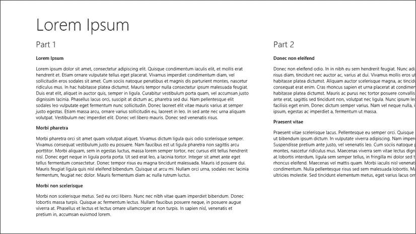

图 8-1 。Windows 8 的文字渐变使得辨别内容的相对重要性变得容易

图 8-1 中的示例应用程序屏幕使用了标准的 Windows 8 light 主题(`ui-light.css`)。这个主题是白色背景和黑色文字的原因。与之形成鲜明对比的还有一个暗黑主题(`ui-dark.css`)。图 8-2 显示了这次使用黑暗主题的相同视图。应用程序开发者可以选择使用哪个主题，这是一个应用程序一个应用程序的决定。它不受操作系统级别设置的控制。黑暗主题中的斜坡字体显然在传达结构方面也同样有效。

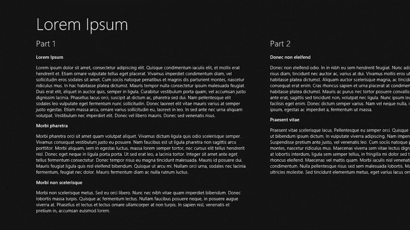

图 8-2 。与图 8-1 相同的视图，这次使用了 ui-dark 主题

42 点的页面标题相对较大，使用户能够快速轻松地定位当前页面。这可能看起来不重要，但非常重要。当用户从一个应用程序切换到另一个应用程序，抓取旁边的应用程序，并启动新的应用程序时，无意识地瞥一眼屏幕顶部可以缓解应用程序的眩晕。

20 点的部分标题将很快成为用户熟悉的组织指示器，他们会寻找它们来查看应用程序是如何分类或细分的。用户将看到这些部分从屏幕右侧溢出，自然地滑动以查看更多内容。

11 点和 9 点的副标题和正文当然是可读的，但它也明显不如页面标题和章节标题重要。

清单 8-1 定义了所有六个级别的标题文本以及段落文本，图 8-3 显示了渲染结果。请注意，标题 3、标题 4、标题 5 和标准段落文本都是相同的磅值(11)，只有粗细不同。

***清单 8-1 。*** 六个表头层次和一个段落

```html
<!-- HTML snippet -->
<h1>Heading 1</h1>
<h2>Heading 2</h2>
<h3>Heading 3</h3>
<h4>Heading 4</h4>
<h5>Heading 5</h5>
<h6>Heading 6</h6>
<p>Paragraph text</p>
```

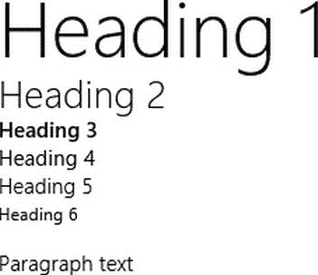

图 8-3 。根据 WinJS 样式表呈现的结果

只有在 HTML 中定义了标题标签(`h1`、`h2`、`h3`、`h4`、`h5`和`h6`)时，每种标题样式才适用，但是每种样式都有一个相应的类，可以添加到您想要的任何元素中。

`h1`的阶级对应是`win-type-xx-large`，`h2`的是`win-type-x-large`，`h3`的是`win-type-large`，`h4`的是`win-type-medium`，`h5`的是`win-type-small`，`h6`的是`win-type-xx-small`。还有一个用于`win-type-x-small`的样式，尽管它没有映射到标题级别。要使用这些样式中的一种，您只需将正确的类添加到您试图影响的任何元素中。

当您想要匹配文字渐变但不明确使用标题标签时，您可以选择使用样式。标题标签有某些你可能不总是想要的行为，最大的是它是一个块级元素。清单 8-2 提供了一个标准按钮(用于比较),后面是一个被赋予了`win-type-x-large`类的按钮，以有效地赋予它一个`h2`的外观。图 8-4 中第二个按钮的较大文字很明显。在改变任何默认元素的样式之前，你应该三思而行，只有在为了支持你的应用程序的整体设计而有意改变时，才应该向前推进。

***清单 8-2 。*** 在一个标准的 HTML 按钮上定义了 win-type-x-large 类

```html
<!-- HTML snippet -->
<div><button>Button 1</button></div>
<div><button class="win-type-x-large">Button 2</button></div>

/* CSS snippet */
.lst0802 button {
    margin: 5px;
```

`}`

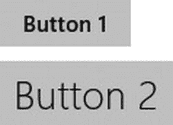

图 8-4 。结果是一个样式像 h2 元素的按钮

还有两个赢型风格规则，分别是`win-type-ellipsis`和`win-type-interactive`。

`win-type-ellipsis`定义包含值为省略号(“...”)的文本溢出属性)，当文本不适合其容器时，它会呈现一个省略号字符。

`win-type-interactive`样式规则非常有助于使文本呈现为链接，即使它实际上不是链接，这在遵循标准单页应用导航模式的 Windows 8 应用中很常见。

WinJS 也为用户选择的文本提供了标准样式。使用`::selection`伪元素识别所选文本。例如，在 light 主题中，所选文本的背景颜色是蓝色，文本颜色是白色。

请记住，基于类的样式规则可以与一个元素结合使用，因为可以在一个元素上指定多个类。在清单 8-3 中，段落中间的一段文本被赋予了多个类，以使其像 h3 一样呈现并具有交互性。在图 8-5 中，你可以看到简单地将这个类添加到一个 span 中的效果。

***清单 8-3 。*** 两个类被应用于围绕某些段落文本的跨度

```html
<!-- HTML snippet -->
```

`<p>Lorem ipsum dolor sit amet, <span`**class = " win-type-x-large win-type-interactive "**


图 8-5 。由于 win-type-interactive 类的缘故，文本的跨度呈现得比其余部分大，并且将提供悬停反馈

抓拍视图

当用户在使用另一个应用程序时，如果他希望保持该应用程序可用(尽管是较小的格式),他会对该应用程序进行快照。对于用户来说，在使用 Windows 8 时获得次要任务的简洁垂直视图是一个很好的功能。对于开发人员来说，这是一个设计考虑，也是一个必要的考虑，因为没有办法配置您的应用程序来禁止捕捉。当你的应用被抓取时，会有很多变化；最值得注意的是，可用的水平像素从至少 1024 降低到只有 320。毫无疑问，每个应用程序都可以被抓拍，所以你必须考虑到这种情况，即使只是通知用户应用程序在被抓拍之前无法正常运行。

至少 WinJS 为您完成了一些为快照视图转换应用程序的工作。WinJS 中的 CSS 文件定义了一个媒体查询，以检测您的应用程序是否处于快照视图中，并设置各种样式属性来保持您的应用程序的可用性和设计。

图 8-6 和 8-7 显示了一个全屏状态和快照状态的样本 app。在这种情况下，没有规定在抓取时调整应用程序，所以它本质上只是显示全屏应用程序的左侧 320 像素。首先，这绝对是您应该避免交付到 Windows 应用商店的行为。

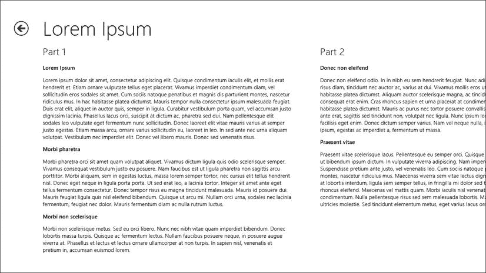

图 8-6 。全屏显示的示例应用程序

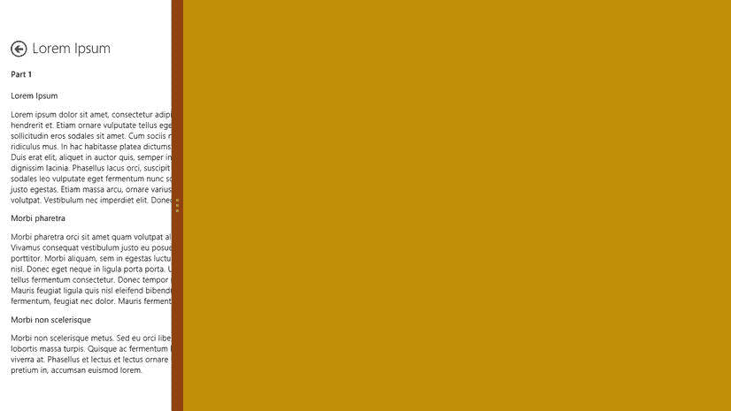

图 8-7 。同一个应用程序捕捉到了屏幕的左侧，说明了全屏视图状态和捕捉视图状态之间的内在风格差异

但是，您可以看到，全视图和快照视图中最左侧的 320 像素之间存在一些差异。应用程序标题更小，因为`h1`元素和`win-type-xx-large`类被更改为使用 20 磅的字体，而不是正常的 42 磅。部分标题(第一部分和第二部分)也变小了，因为`h2`元素和`win-type-x-large`类的样式规则被改为使用 11 磅的字体，而不是普通的 20 磅。后退按钮也更小。所有这些都是 WinJS 内置的功能。

显然，这个应用程序并不完全支持快照视图，但随着更多的媒体查询和风格属性，它可以。

App bar

Windows 8 应用有可选的应用栏。开发人员可以选择定义一个可以从屏幕底部向上滑动的下部应用程序栏或一个可以从顶部向下滑动的上部应用程序栏。这两个应用程序栏显然也可以定义。用户只需简单的滑动、鼠标右键单击或键盘快捷键(Win + Z)就可以访问这两个选项。

记得我在第一章中提到过，好的 Windows 8 设计的核心原则是让用户沉浸其中，消除干扰。这就是为什么应用程序栏是放置命令的好地方，因为它们不会分散用户对内容的注意力，而且在用户选择之前，它们不需要有价值的设计界面。

图 8-8 显示了必应地图应用 ，显示了下方的应用栏。这个下方的应用程序栏应该用于命令。命令是应用程序用户与应用程序交互或发布命令的一种方式。最常见的命令是按钮，应该符合推荐的设计——带有简单图标的圆形按钮。如果该命令可以用一个默认的 Windows 8 图标来表示，那么它应该是。仅当无法使用内置集合中的图标表示时，才创建自定义图标。

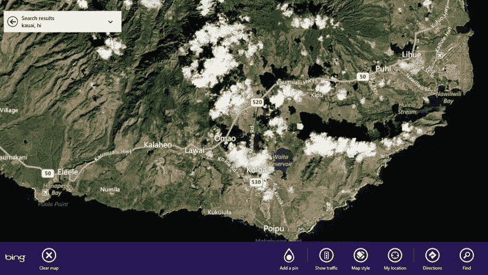

图 8-8 。除非用户显示下面的应用程序栏，否则 Bing 地图应用程序只会显示一张地图。这就是用户沉浸在内容中的含义

除了下面的应用程序栏用于命令之外，上面的应用程序栏可供开发者使用，应该主要用于某种形式的导航。在图 8-9 中，可以看到 Internet Explorer 10 应用(Windows Store 版本)，可以看到上面的应用栏是用来显示浏览器选项卡缩略图的。

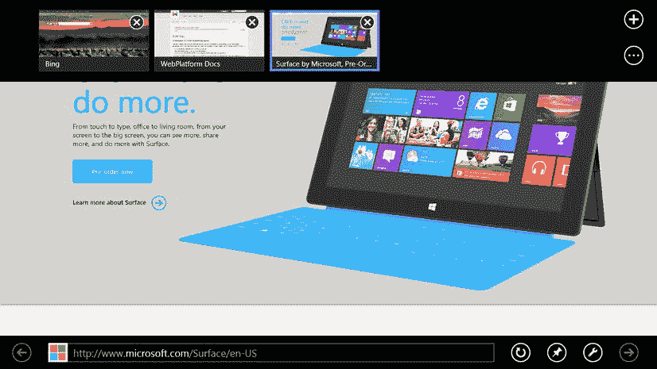

图 8-9 。Internet Explorer 实现了一个上层和一个下层的应用程序栏

图 8-10 展示了必应团队打造的预装在 Windows 8 中的运动 app 。在这个应用程序中，下方和上方的应用程序栏都在使用中。上部用于导航到各种可用的运动，而下部的应用程序栏可用于刷新运动数据。

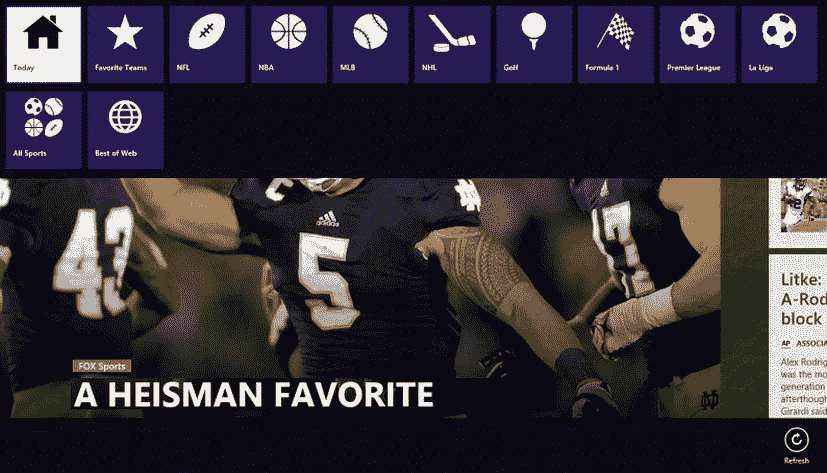

图 8-10 。Bing Sports 应用程序的上部应用程序栏会将用户导航到不同的体育赛事

应用程序栏在不同的应用程序中具有统一的外观和功能是很重要的，所以你会发现你通常不需要在应用程序栏中添加样式规则。通常情况下，它们的默认样式就足够了。

在一本关于使用 CSS 样式化应用程序的书中，我们真正想做的是理解应用程序栏的一般结构，以及它是用什么类来修饰的，这样我们就有希望通过添加或覆盖样式来定制它。为了做到这一点，我们将查看实现应用程序栏的完整代码，然后我们将看到生成的 DOM 是什么样子，并突出显示重要的部分(参见图 8-11 )。

`})();`

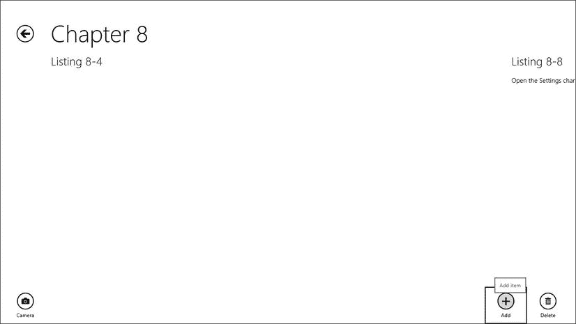

图 8-11 。应用程序栏仅由声明性标记创建，具有 Windows 8 应用程序栏的所有个性

在清单 8-4 中，我们声明了一个带有命令按钮的应用程序栏(粗体)。这些元素的声明很简单，但它会产生一个健壮的控件，该控件由许多在 DOM 中构建的本地 HTML 元素组成。

***清单 8-4 。*** 在 Windows 8 应用中全面实现应用栏

```html
<!-- lst0804.html -->
<!DOCTYPE html>
<html>
<head>
<meta charset="utf-8" />
<title>Listing 8-4</title>

<!-- WinJS references -->
<link href="//Microsoft.WinJS.1.0/css/ui-light.css" rel="stylesheet" />
<script src="//Microsoft.WinJS.1.0/js/base.js"></script>
<script src="//Microsoft.WinJS.1.0/js/ui.js"></script>

<link href="lst0804.css" rel="stylesheet" />
<script src="lst0804.js"></script>
</head>
<body>
<div class="lst0804 fragment">
<section aria-label="Main content" role="main">

</section>
<div id="myAppBar" data-win-control="WinJS.UI.AppBar">
<button
                data-win-control="WinJS.UI.AppBarCommand"
                data-win-options="{ id:'cmdAdd', label:'Add', icon:'add', section:'global',
                    tooltip:'Add item' }"></button>
<button
                data-win-control="WinJS.UI.AppBarCommand"
                data-win-options="{ id:'cmdDelete', label:'Delete', icon:'delete',
                    section:'global', tooltip:'Delete item' }"></button>
<button
                data-win-control="WinJS.UI.AppBarCommand"
                data-win-options="{ id:'cmdCamera', label:'Camera', icon:'camera',
                    section:'selection', tooltip:'Take a picture' }"></button>
</div>
</div>
</body>
</html>

/* lst0804.css */
(empty)

// lst0804.js
(function () {
    "use strict";

    WinJS.UI.Pages.define("/pages/chapter8/lst0804/lst0804.html", {
        ready: function (element, options) {
            //empty
        }
    });
```

注意，CSS 和 JavaScript 文件本质上是空的。应用程序栏及其按钮可以完全以声明方式创建。我已经包括了`.css`和`.js`文件，只是为了让你知道没有奇迹发生。

清单 8-4 的中的`lst0804.html`文件将定义我们的应用程序栏，但它并不代表应用程序运行时最终出现在 DOM 中的实际 HTML。这是因为 WinJS 处理控件的方式。通过向标准 HTML 元素添加一个`data-win-control`属性来创建一个控件。然后，当执行`WinJS.UI.processAll`函数时，所有这些声明的控件都被转换成真实的交易。在这个过程中，类名被添加到每个元素中，在许多情况下是一些内联样式。

为了更好地理解这个过程中发生了什么，让我们在应用程序运行时查看一下 DOM Explorer，看看真实的 DOM。前一个例子中的应用程序栏产生了清单 8-5 中的代码。

***清单 8-5 。***DOM 来自我们创建的应用程序栏

```html
<!-- HTML snippet from DOM Explorer -->
<divclass="win-overlay win-appbar win-commandlayout win-bottom" id="myAppBar" role="menubar"
style="visibility: hidden; opacity: 0;" aria-label="App Bar"
    data-win-control="WinJS.UI.AppBar" unselectable="on">
<buttonclass="win-command win-global" id="cmdAdd" role="menuitem" aria-label="Add"
        type="button" data-win-options="{ id:'cmdAdd', label:'Add', icon:'add',
        section:'global', tooltip:'Add item' }"
        data-win-control="WinJS.UI.AppBarCommand">
<span tabindex="-1"class="win-commandicon win-commandring" aria-hidden="true">
<span tabindex="-1"class="win-commandimage" aria-hidden="true"> </span>
</span>
<span tabindex="-1"class="win-label" aria-hidden="true">Add</span>
</button>
<buttonclass="win-command win-global" id="cmdDelete" role="menuitem" aria-label="Delete"
        type="button" data-win-options="{ id:'cmdDelete', label:'Delete', icon:'delete',
        section:'global', tooltip:'Delete item' }"
        data-win-control="WinJS.UI.AppBarCommand">
<span tabindex="-1"class="win-commandicon win-commandring" aria-hidden="true">
<span tabindex="-1"class="win-commandimage" aria-hidden="true"></span>
</span>
<span tabindex="-1"class="win-label" aria-hidden="true">Delete</span>
</button>
<buttonclass="win-command win-selection" id="cmdCamera" role="menuitem" aria-label="Camera"
        type="button" data-win-options="{ id:'cmdCamera', label:'Camera', icon:'camera',
        section:'selection', tooltip:'Take a picture' }"
        data-win-control="WinJS.UI.AppBarCommand">
<span tabindex="-1"class="win-commandicon win-commandring" aria-hidden="true">
<span tabindex="-1"class="win-commandimage" aria-hidden="true"> </span>
</span>
<span tabindex="-1"class="win-label" aria-hidden="true">Camera</span>
</button>
</div>
```

清单 8-5 中粗体显示的内容是已经添加到 DOM 元素中的类属性。这些类名充当我们选择控件不同部分的句柄，并为它们添加或覆盖样式规则。

app bar 本身(清单 8-5 中的最高层`div`)被赋予了四个类名:`win-overlay`、`win-appbar`、`win-commandlayout`和`win-bottom`。这些类中的每一个都将 WinJS CSS 中定义的样式规则应用于应用程序栏，并且每一个类都有不同的用途；这就是为什么有四个类，而不是只有一个。例如，开发人员可以选择将应用程序栏的`placemen` t 选项设置为`top`以将其呈现在屏幕顶部，在这种情况下，`win-bottom`类将被省略并替换为`win-top`。

同样，我们的目标是理解 HTML 的结构，这样我们就可以添加或覆盖影响它的样式。让我们举一个例子，并把它进行到底。我们在应用程序栏上声明的按钮都被赋予了内容，使它们看起来像一个正确的应用程序栏按钮——一个下面有图标和标签的圆圈。这是使用定义了类的 span 元素实现的。环被赋予 win-commandicon 和 win-commandring 类，下面的标签是具有 win-label 类的 span。想象一下，我们的项目需求规定，当用户将鼠标悬停在应用程序栏按钮上时，按钮的边框应该是灰色的，而不是标准的白色。

首先，让我们通过查看 ui-light.css 的第 2511–2599 行来看看按钮是如何获得它们的白色边框的(清单 8-6 )。请特别注意粗体部分。该样式规则影响具有类`win-commandring`的元素，该类是当前被悬停的按钮的子元素。这正是我们想要推翻的。

***清单 8-6 。*** 从 ui-light.css (第 2511–2599 行)中，我们可以看到当用户将鼠标悬停在命令按钮上时，命令按钮周围的圆圈所获得的样式

```html
/*
Command ring colors.
*/
...
.win-commandring, button:active .win-commandring {
    background-color: transparent;
    border-color: rgb(0, 0, 0);
}
button:hover .win-commandring {
    background-color: rgba(0, 0, 0, 0.13);
    border-color: rgb(0, 0, 0);
}
button:hover:active .win-commandring {
    background-color: rgb(0, 0, 0);
    border-color: rgb(0, 0, 0);
}
button:-ms-keyboard-active .win-commandring {
    background-color: rgb(0, 0, 0);
    border-color: rgb(0, 0, 0);
}
button:disabled .win-commandring,
button:disabled:active .win-commandring {
    background-color: transparent;
    border-color: rgba(0, 0, 0, 0.4);
}
button[aria-checked=true] .win-commandring,
button[aria-checked=true]:active .win-commandring {
    background-color: rgb(0, 0, 0);
    border-color: rgb(0, 0, 0);
}
button[aria-checked=true]:hover .win-commandring {
    background-color: rgb(33, 33, 33);
    border-color: rgb(33, 33, 33);
}
button[aria-checked=true]:hover:active .win-commandring {
    background-color: transparent;
    border-color: rgb(0, 0, 0);
}
button[aria-checked=true]:-ms-keyboard-active .win-commandring {
    background-color: transparent;
    border-color: rgb(0, 0, 0);
}
button[aria-checked=true]:disabled .win-commandring,
button[aria-checked=true]:disabled:active .win-commandring {
    background-color: rgba(0, 0, 0, 0.4);
    border-color: rgba(0, 0, 0, 0.4);
}
```

虽然这与我们当前修改边框颜色的需求无关，但是请注意，当背景色被悬停时，它的不透明度值为 0.13。这使得只有当用户悬停在按钮上时，按钮才不完全透明。

边框颜色是我们想要影响的，在这种情况下，边框颜色在悬停状态下和正常状态下是完全一样的。我们不能修改`ui-light.css`文件，但是我们可以覆盖正在讨论的样式规则。如果我们将清单 8-7 中的样式规则添加到我们自己页面的 CSS 文件中，那么我们将得到我们想要的效果。图 8-12 显示了带有灰色边框的效果。

***清单 8-7 。*** 对悬停状态的边框颜色进行轻微的覆盖样式改变

```html
button:hover .win-commandring {
    background-color: rgba(0, 0, 0, 0.13);
    border-color: gray;
```

`}`

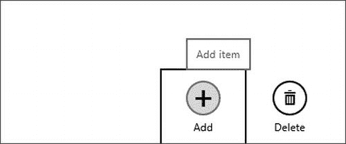

图 8-12 。将鼠标悬停在命令按钮上，它周围的圆形边框会变成灰色

这里要注意的是，没有什么是对开发者隐藏的。用于创建 Windows 8 应用程序的所有样式属性都可以浏览、附加和覆盖。

设置窗格

像应用程序栏一样，Windows 8 应用程序中的设置面板对用户来说是可预测的。从屏幕右侧向外滑动符咒并选择设置符咒(参见图 8-13 )即可访问。从主设置面板中选取一个设置类别会在屏幕右侧弹出一个特定的设置面板。这个特定的设置面板是我们将要使用 *WinJS 定制的。UI . SettingsFlyout 弹出*控件。

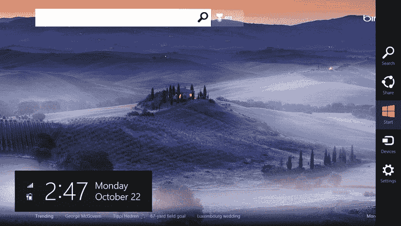

图 8-13 。设置符总是作为齿轮图标出现在符条的底部

与应用程序栏不同，设置面板是一个白板，开发者需要设计和实现它，所以你有很大的自由，但你不是没有帮助。有许多样式会影响设置面板，并使其具有标准的 Windows 8 设计。我将在这里强调这些。

考虑一下清单 8-8 中的 HTML 片段和图 8-14 中产生的设置窗格。

***清单 8-8 。*** 完成一个设置弹出按钮的定义

```html
<!-- lst0808.html -->
<!DOCTYPE html>
<html>
<head>
<meta charset="utf-8" />
<title>Listing 8-8</title>

<!-- WinJS references -->
<link href="//Microsoft.WinJS.1.0/css/ui-light.css" rel="stylesheet" />
<script src="//Microsoft.WinJS.1.0/js/base.js"></script>
<script src="//Microsoft.WinJS.1.0/js/ui.js"></script>

<link href="lst0808.css" rel="stylesheet" />
<script src="lst0808.js"></script>
</head>
<body>
<div class="lst0808 fragment">
<section aria-label="Main content" role="main">

<p>Open the Settings charm and choose Listing 8-8 to see the resulting settings pane</p>

<!-- BEGINSETTINGSFLYOUT -->
<div id="sampleSettings" data-win-control="WinJS.UI.SettingsFlyout"
            aria-label="App Settings Flyout">
<div class="win-ui-dark win-header">
<button type="button" onclick="WinJS.UI.SettingsFlyout.show()"
                    class="win-backbutton"></button>
<div class="win-label">Preferences</div>
</div>
<div class="win-content">
<div class="win-settings-section">
<h3>Toggle switch</h3>
<p>Use toggle switches to let users set Boolean values.</p>
<div id="Toggle1" data-win-control="WinJS.UI.ToggleSwitch"
                        data-win-options="{title:'Download updates automatically',
                            checked:true}">
</div>
<div id="Toggle2" data-win-control="WinJS.UI.ToggleSwitch"
                        data-win-options="{title:'Install updates automatically'}">
</div>
</div>
</div>
</div>
<!-- ENDSETTINGSFLYOUT -->
</section>
</div>
</body>
</html>
/* lst0808.css */
// lst0808.js
(function () {
    "use strict";
    WinJS.UI.Pages.define("/pages/chapter8/lst0808/lst0808.html", {
        ready: function (element, options) {
            addSettingsContract()
        }
    });
    function addSettingsContract() {
        app.onsettings = function (e) {
            e.detail.applicationcommands = {
                "sampleSettings": {
                    title: "Listing 8-8",
                    href: "/pages/chapter8/lst0808/lst0808.html"
                }
            };
            WinJS.UI.SettingsFlyout.populateSettings(e);
        };
    }
```

`})();`

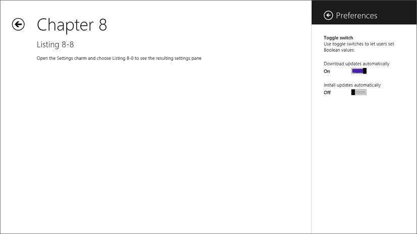

图 8-14 。“设置”弹出按钮可从“设置”窗格中找到

这个设置面板的样式规则已经存在，我们只需通过编写结构，然后用正确的 CSS 类值装饰元素来应用它们。

我们将再次使用 DOM explorer 查看清单 8-9 中的结果 DOM。WinJS 添加的类和样式以粗体显示。同样以粗体显示的是添加的两个`div`元素(`win-firstdiv`和`win-finaldiv`),尽管我们现在不太关心它们，因为它们与控件的样式没有太大关系

***清单 8-9 。*** 这是设置弹出按钮渲染到动态 DOM 后的样子

```html
<!-- HTML snippet from DOM Explorer -->
<divclass="win-overlay win-settingsflyout" id="Div1" role="dialog" aria-hidden="true"
style="left: auto; right: -346px; display: none; visibility: hidden; opacity: 1;"
    aria-label="App Settings Flyout" data-win-control="WinJS.UI.SettingsFlyout"
    unselectable="on">
<div tabindex="0" class="win-firstdiv" role="menuitem"
        aria-hidden="true" style="display: inline;"></div>
<div class="win-ui-dark win-header">
<button class="win-backbutton" aria-label="Back"
            onclick="WinJS.UI.SettingsFlyout.show()" type="button"></button>
<div class="win-label">Preferences</div>
</div>
<div class="win-content win-ui-light" style="opacity: 1;">
<div class="win-settings-section">
<h3>Toggle switch</h3>
<p>Use toggle switches to let users set Boolean values.</p>

            ...

</div>
</div>
<div tabindex="0" class="win-finaldiv" role="menuitem" aria-hidden="true"
        style="display: inline;"></div>
</div>
```

包含后退按钮和设置标题的`div`元素用`win-ui-dark`和`win-header`类值修饰，`background-color`使用我们必须在 CSS 片段中编写的唯一样式规则设置。back 按钮是一个带有 win-backbutton 类的标准 HTML 按钮，它与为页面声明 back 按钮的方式相同。然而，这两个后退按钮是不一样的，CSS 辨别的方式是使用带有选择器`.win-settingsflyout .win-backbutton`的样式规则(同样在 ui-light.css 文档中)。从`.win-settingsflyout`的出现可以看出，这种样式规则将仅限于设置弹出按钮中的后退按钮。

弹出按钮和菜单

弹出菜单和菜单是由 WinJS 库提供的，是更加全局的应用程序级控件，所以我现在将介绍它们的样式。

弹出菜单和菜单密切相关，因为它们具有相似的行为。弹出菜单和菜单都显示为覆盖在现有的设计图面上(很像大多数编程框架中的对话框)。它们也是轻消除的，这意味着用户可以通过触摸或点击外部的任何地方来消除它们。

弹出菜单让你可以自由控制内容的格式，而菜单更加结构化，更容易创建一致的菜单系统。你可以在`http://msdn.microsoft.com/en-us/library/windows/apps/hh465325.aspx`找到更多关于弹出菜单和菜单的信息。

弹出型按钮

弹出按钮只是一个 HTML 容器，所以你可以在里面随意创建任何你想要的东西。弹出型按钮是一种很好的提示用户输入的方式，它在用户启动动作的地方显示一个小的输入面板。例如，你可以通过提供一个*添加用户*按钮来提示用户添加一个新项目，然后当用户触摸它时，在按钮附近显示一个弹出按钮，提示他们输入名称。清单 8-10 和图 8-15 显示了一个*添加用户*按钮，该按钮显示了一个弹出按钮(位于按钮的右侧)。当用户触摸它时，会执行一个显示弹出按钮的事件。同样，我们将看到实现按钮和弹出按钮的完整示例，以及由 WinJS 创建的结果 DOM。

***清单 8-10 。*** 一个弹出型实现的完整例子

```html
<!-- lst0810.html -->
<!DOCTYPE html>
<html>
<head>
<meta charset="utf-8" />
<title>Listing 8-10</title>

<!-- WinJS references -->
<link href="//Microsoft.WinJS.1.0/css/ui-light.css" rel="stylesheet" />
<script src="//Microsoft.WinJS.1.0/js/base.js"></script>
<script src="//Microsoft.WinJS.1.0/js/ui.js"></script>

<link href="lst0810.css" rel="stylesheet" />
<script src="lst0810.js"></script>
</head>
<body>
<div class="lst0810 fragment">
<section aria-label="Main content" role="main">
<button id="showFlyoutButton">Add user</button>

<div id="flyout1" data-win-control="WinJS.UI.Flyout"
                data-win-options="{placement: 'right'}">
<label for="input">Name</label>
<input type="text" />
</div>
</section>
</div>
</body>
</html>

/* lst0810.css */
(empty)

// lst0810.js
(function () {
    "use strict";

    WinJS.UI.Pages.define("/pages/chapter8/lst0810/lst0810.html", {
        ready: function (element, options) {
            var showFlyoutButton = element.querySelector("#showFlyoutButton");
            var flyout = element.querySelector("#flyout1");
            showFlyoutButton.onclick = function(e) {
                flyout.winControl.show(showFlyoutButton);
            }
        }
    });
```

`})();`

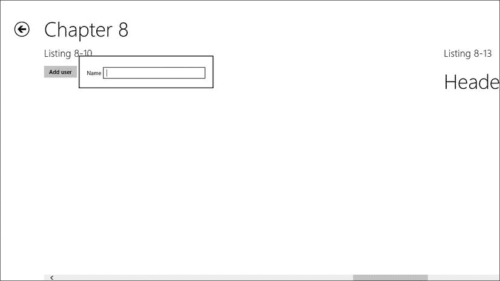

图 8-15 。提示用户输入用户名的弹出控件

清单 8-11 是添加了 WinJS 添加的类和内联样式的结果 DOM，以粗体显示

***清单 8-11 。*** 生成的 DOM 为弹出型控件

```html
<divclass="win-overlay win-flyout win-ui-light" id="Div1" role="dialog"
    aria-hidden="true"style="left: 210px; top: 146.5px; right: auto;
        bottom: auto; display: none; visibility: hidden; opacity: 0;"
        aria-label="Flyout" data-win-options="{placement: 'right'}"
    data-win-control="WinJS.UI.Flyout" unselectable="on">
<div tabindex="0" class="win-firstdiv" role="menuitem" aria-hidden="true"
        style="display: inline;"></div>
<label for="input">Name</label>
<input class="win-hidefocus" type="text">
<div tabindex="0" class="win-finaldiv" role="menuitem" aria-hidden="true"
        style="display: inline;"></div>
</div>
```

像所有其他控件一样，弹出控件是使用标准 HTML 元素实例化的——通常是一个`div`元素。当然，您可以使用您给它的 ID 来引用您创建的任何弹出按钮，但是如果您想引用应用程序中的每个弹出按钮呢？如果您知道每个弹出控件在结果 DOM 中都有一个`win-flyout`类，那么您就知道可以通过使用类选择器(`.win-flyout`)来引用应用程序中的所有弹出控件(或者在您选择的任何给定范围内)。然后，清单 8-12 中的 CSS 将你的应用程序中的弹出控件设置为灰色背景和细的深蓝色边框。

***清单 8-12 。*** 影响所有带有灰色背景和深蓝色边框的弹出按钮

```html
/* CSS snippet */
.win-flyout {
    background-color: gray;
    border: 1px solid darkblue;
}
```

菜单

菜单由一个或多个 MenuCommand 对象组成。清单 8-13 和图 8-16 包括了一个带有标题菜单的 Windows 8 页面的完整例子。标题菜单是一种推荐的设计，用于将用户从应用程序的一部分快速导航到另一部分。页面标题旁边有一个小的人字形符号，它给用户提示标题是一个菜单，可以通过触摸来调用标题菜单。

***清单 8-13 。*** 一个 WinJS。菜单在 HTML 中声明，并添加 JavaScript 以在用户单击 时显示它

```html
<!-- lst0813.html -->
<!DOCTYPE html>
<html>
<head>
<meta charset="utf-8" />
<title>Listing 8-13</title>

<!-- WinJS references -->
<link href="//Microsoft.WinJS.1.0/css/ui-light.css" rel="stylesheet" />
<script src="//Microsoft.WinJS.1.0/js/base.js"></script>
<script src="//Microsoft.WinJS.1.0/js/ui.js"></script>

<link href="lst0813.css" rel="stylesheet" />
<script src="lst0813.js"></script>
</head>
<body>
<div class="lst0813 fragment">
<section aria-label="Main content" role="main">
<h1 class="menu win-type-ellipsis">
<span class="title">Header Menu</span>
<span class="chevron win-type-x-large">&#xe099</span>
</h1>

<div id="headerMenu" data-win-control="WinJS.UI.Menu">
<button data-win-control="WinJS.UI.MenuCommand"
                    data-win-options="{id:'s1',label:'Section One'}"></button>
<button data-win-control="WinJS.UI.MenuCommand"
                    data-win-options="{id:'s2',label:'Section Two'}"></button>
<button data-win-control="WinJS.UI.MenuCommand"
                    data-win-options="{id:'s3',label:'Section Three'}"></button>
<hr data-win-control="WinJS.UI.MenuCommand"
                    data-win-options="{id:'separator',type:'separator'}" />
<button data-win-control="WinJS.UI.MenuCommand"
                    data-win-options="{id:'sHome',label:'Home'}"></button>
</div>

</section>
</div>
</body>
</html>

/* lst0813.css */
. lst0813 .chevron {
    vertical-align:8px;
}

// lst0813.js
(function () {
    "use strict";

    WinJS.UI.Pages.define("/pages/chapter8/lst0813/lst0813.html", {
        ready: function (element, options) {
            element.querySelector(".menu").onclick = function () { showHeaderMenu(element); };
        }
    });

    function showHeaderMenu(element) {
        var title = element.querySelector(".menu");
        var menu = element.querySelector("#headerMenu").winControl;
        menu.anchor = title;
        menu.placement = "bottom";
        menu.alignment = "left";

        menu.show();
    }
```

`})();`

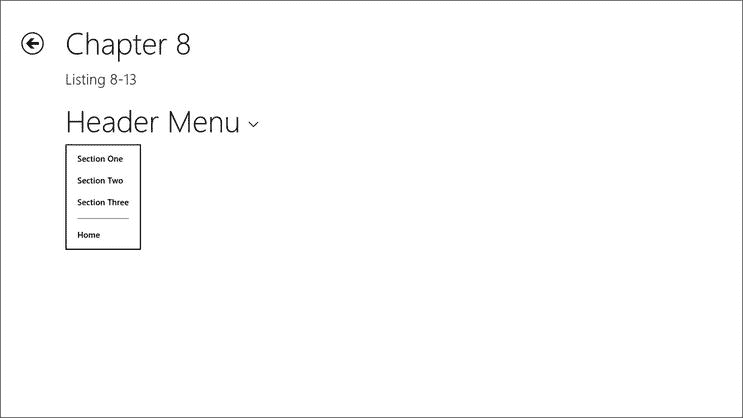

图 8-16 。标题已经变成了操作菜单

既然您已经看到了如何创建这个简单的菜单，那么让我们来看看实际为应用程序呈现的 HTML。这可以使用 DOM Explorer 找到。

从清单 8-14 中的粗体文本可以看出，每个按钮都被赋予了一个类别`win-command`。这对于我们这些 WinJS 的消费者来说非常方便。UI.Menu 控件，因为这意味着将一种样式应用于所有菜单项将变得足够容易。

***清单 8-14 。*** 结果 DOM 为在清单 8-13 中创建的菜单

```html
<!-- HTML snippet from DOM Explorer -->
<div class="win-overlay win-flyout win-ui-light win-menu " id="headerMenu" role="menu"
style="display: none; visibility: hidden; opacity: 0;" aria-label="Menu"
    data-win-control="WinJS.UI.Menu" unselectable="on">
<buttonclass="win-command" id="s1" role="menuitem" aria-label="Section One"
        type="button" data-win-options="{id:'s1',label:'Section One'}"
        data-win-control="WinJS.UI.MenuCommand">Section One</button>
<buttonclass="win-command" id="s2" role="menuitem" aria-label="Section Two"
        type="button" data-win-options="{id:'s2',label:'Section Two'}"
        data-win-control="WinJS.UI.MenuCommand">Section Two</button>
<buttonclass="win-command" id="s3" role="menuitem" aria-label="Section Three"
        type="button" data-win-options="{id:'s3',label:'Section Three'}"
        data-win-control="WinJS.UI.MenuCommand">Section Three</button>
<hrclass="win-command" id="separator" data-win-options="{id:'separator',type:'separator'}"
        data-win-control="WinJS.UI.MenuCommand">
<buttonclass="win-command" id="sHome" role="menuitem" aria-label="Home" type="button"
        data-win-options="{id:'sHome',label:'Home'}"
        data-win-control="WinJS.UI.MenuCommand">Home</button>
</div>
```

让我们用清单 8-15 中的粗体样式规则来修改 CSS。

***清单 8-15 。*** 清单 8-13 中的 CSS 覆盖了菜单按钮，使它们变成斜体

```html
/* menus.css */
.lst0813 .chevron {
    vertical-align:8px;
}

.lst0813 .win-command {
    font-style: italic;
}
```

如你所料，在图 8-17 中可以看到，每个菜单命令都是斜体的。

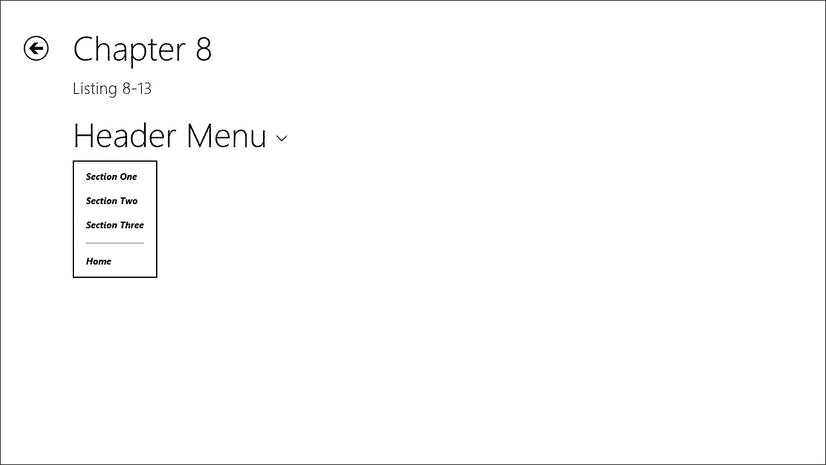

图 8-17 。将样式应用到 win-command 类会影响每个菜单项

高对比度模式

Windows 8 通过提供高对比度模式来适应弱视用户，用户可以从 PC 设置|轻松访问中选择该模式，并期望该选择将应用于其系统上的所有应用程序。

在大多数情况下，如果你使用标准的样式和方法来创建你的应用程序中的视觉元素，你就不需要做任何事情来实现你的应用程序中的高对比度支持。但是，关于高对比度模式下的可见性，您可能有一些自定义的注意事项，并且您应该熟悉为实现这一点而需要覆盖的样式。

通过媒体查询的方式应用高对比度样式。特定于供应商的值-ms-high-contrast 可作为媒体查询的表达式，当用户在其设备上选择高对比度模式时，该值为真。

有高对比度的风格规则来控制你的应用程序的几乎每一个视觉方面。

我将只画一个在高对比度模式下影响应用程序的样式属性的例子，并向您展示如何覆盖它。 *ui-light.css* 中的第 2848 行开始高对比度模式的主媒体查询，第 3068–3074 行(清单 8-16 )定义了 *win-appbar* 类的样式。

***清单 8-16 。*** 只是-ms-高对比度介质查询中定义的众多样式规则之一

```html
@media (-ms-high-contrast)
{
    ...

    /*
    AppBar high contrast colors.
    */
    .win-appbar {
        background-color: ButtonFace;
        border-color: Highlight;

    ...
}
```

让我们假设我们正在开发的客户已经确定纯白色的应用程序栏背景同样可见，并且更好地匹配他们的品牌，并要求我们覆盖默认值。为此，我们只需要在页面的 CSS 文件中克隆这个样式规则(包括媒体查询)，如清单 8-17 中的所示。

***清单 8-17 。*** 在高对比度模式下覆盖应用程序栏的背景颜色

```html
@media (-ms-high-contrast)
{
    .win-appbar {
        background-color: white;
}
```

如果您确实需要覆盖内置的高对比度样式，请注意始终保持良好的可视性。一个没有很好地提供高对比度模式的应用程序可能会在应用程序认证过程中被发现，更糟糕的是，会阻止弱视用户享受你的应用程序。

摘要

在这一章中，我们看到了 WinJS 影响我们应用程序风格的许多方式，并将其扩展到我们作为开发人员，这样我们不仅可以展现 Windows 8 生态系统的个性，还可以展示我们自己的个性。

我们已经了解了如何设计应用程序的版式、应用程序栏、设置窗格弹出菜单和菜单，我们还了解了如何实现高对比度模式以及如何在必要的地方扩展它。

在下一章中，我们将保持同样的思路，但是更多地关注 WinJS 提供给我们的许多控件的样式。