# 九、WinJS 控件样式

 **注意** HTML 给了我们标准元素，WinJS 用自定义控件扩展了它们。我们所需要的就是设计好它们。

我们已经学习了如何使用样式规则来选择和样式化元素。我们已经知道我们在样式表中创建这些规则。我们了解到，您的 Windows 8 应用中的 WinJS 库为我们提供了两个主题版本的样式表，为我们的应用赋予了 Windows 8 个性。样式表会影响背景颜色、字体和文本大小。

WinJS 库中的样式表也会影响所有的标准 HTML 控件。当你在 HTML 中声明一个`button`控件时，由于 WinJS 样式表，它看起来像一个 Windows 8 按钮。当您添加选择框、文本框、复选框或任何其他内置 HTML 控件时，它们将看起来像 Windows 8 控件，这也是因为 WinJS 样式表。

但 WinJS 也给了你更多的控件(和一个框架来编写你自己的控件)，并定义了它们以这样一种方式呈现，你可以影响它们的样式，给它们你自己的应用程序的个性。

这些内置 HTML 控件和 WinJS 扩展控件的样式是我们将在本章中讨论的内容。我们将查看每个的默认样式，我们将查看添加的自定义类和定义的伪元素，它们将为我们提供对样式规则的良好控制。

记住 WinJS 给我们提供了两种不同的 CSS 样式表:`ui-dark.css`和`ui-light.css`。他们的名字揭示了他们的目的。`ui-dark.css`样式表为我们提供了一个黑色背景和一个白色前景，而`ui-light.css`给了我们相反的效果。为了简单起见，我们只看一下`ui-light.css`文件，因为两者在结构上是相同的。

除了这两个主题样式表之外，我们还讨论了两个主题类，这两个主题类可以将深色或浅色主题应用于整个应用程序，而不是应用于它的某些子部分。不要混淆样式表(`ui-dark.css`和`ui-light.css`)和类(`win-ui-dark`和`win-ui-light)`)。

我们在前一章看到了一些以`win-`为前缀的类，我们将在这里看到更多。有了这个命名约定，可以方便地提醒我们什么是 WinJS 带来的，什么是 WinJS 带来的。我们将要介绍的大多数类都属于或应用于某个控件，但是`win-scrollview`类可以附加到几乎任何元素上。它只应用了四个样式属性，使目标元素能够让用户滑动(通过触摸)或滚动(通过鼠标)来查看屏幕外的更多内容。

HTML 控件

HTML 标准定义了许多控件。实际上，最近在 HTML 的最新版本中——在 HTML5 中——引入了相当多的这种方法。HTML 控件涵盖了许多常见的用户交互任务，鼓励 Windows 8 应用程序开发人员在 HTML 控件存在并适合工作时使用它们。

对于每个 HTML 控件，我将讨论 WinJS 样式表分配给它们的默认样式、它们可用的伪类和伪元素，以及可以添加到元素以影响其呈现方式的任何类。我将讨论以下 HTML 控件:

*   纽扣
*   文件上传
*   文本输入
*   单选按钮
*   复选框
*   范围
*   选择框
*   进度指示器

与 WinJS 控件不同，HTML 控件不会被“搞乱”。当您在标记中放入类似于``的东西时，它会原封不动地一直传到客户端。WinJS 控件的工作方式非常不同。您在标记中放置了一个 WinJS 控件，但是在呈现给用户之前，它会被一些 JavaScript 处理。我们将在后面的部分中讨论这一点。

对于我们的 HTML 控件(元素)，我们将只看 WinJS 库中的样式表如何默认设置这些控件的样式。请记住，您将能够完全覆盖这些风格，我们将在第十章中对此进行详尽的研究。

纽扣

一个按钮发出命令。用户知道按钮，并且早在计算机出现之前就一直在按按钮。按钮也早已成为 HTML 的一部分。

在 HTML 中声明一个按钮有多种方法。您可以使用 input 元素声明一个按钮，并使用下面三个代码片段中的*类型*属性之一来确定它的行为:`<input type="button"/>`、`<input type="reset"/>`和`<input type="submit"/>`。这些按钮看起来是一样的，但是它们的功能会有所不同。

*   `button`的一个`type`声明了一个没有任何功能的按钮。这需要编写一些 JavaScript 来赋予它一些实际的功能。
*   `reset`中的`type`声明了一个按钮，当按下该按钮时，会将表单中的所有其他控件重置为初始值。
*   `submit`的`type`创建一个按钮，当按下该按钮时，将发出一个包含所有表单值的 POST HTTP 请求。

HTML5 引入了一种更简单的新方法来定义按钮——使用`button`元素。元素相当于`<input type="button"/>`,它声明了一个按钮，但是没有分配任何功能。`button`元素比输入元素更具语义性。我的意思是，它对人类读者来说更容易理解。我建议只使用`button`元素。

***清单 9-1。*** 一个超级简单的按钮

```html
<!-- HTML snippet -->
<button>click me!</button>
```

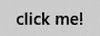

图 9-1。一个简单的按钮

对于第一个控件，我们来讨论发现元素上应用的样式属性。要发现`button`元素的应用属性，请遵循以下步骤:

1.在 Visual Studio 2012 中创建新的 Windows 8 项目(或现有项目中的新页面)

2.在 HTML 中添加一个简单的 HTML 按钮

*   `<button>My Button</button>`

3.通过按 F5 启动应用程序进行调试

4.切换回 Visual Studio 并转到 DOM Explorer 选项卡。如果没有 DOM Explorer 选项卡，请转到调试菜单，转到 Windows，然后选择 DOM Explorer。

5.按下 DOM Explorer 左上角的选择元素按钮。你应该会自动切换到正在运行的应用程序。

6.将鼠标悬停在按钮上，注意蓝色轮廓，然后点按按钮。您应该会自动切换回仍处于调试模式的 Visual Studio。

7.单击 DOM Explorer 右窗格中的“跟踪样式”选项卡。

“跟踪样式”面板列出了影响所选元素的所有样式属性，并告诉您这些属性是在哪里定义的，如果这些属性被其他地方的另一个规则覆盖，它甚至会用删除线呈现这些属性。在上面步骤中创建的按钮的跟踪样式面板中，您应该会看到标题为`::-ms-browse background-color`的规则。在该属性下有一个针对`button:hover`(以及其他链接的选择器)的规则，它将`background-color`定义为`rgba(205,205,205,0.82)`。此方法可用于确定影响文档中任何元素的所有应用的样式属性。

无论使用哪种方法声明按钮，WinJS 都确定按钮的最小宽度应为 90 像素，最小高度应为 32 像素。这个最小按钮尺寸的主要原因之一是保持*的可触摸性*。即使是大手指也应该能够始终如一地停留在按钮上，任何小于 90 x 32 的尺寸都可能太小。

按钮也被赋予了一点填充，2 像素的边框和 11 磅的字体。按钮的背景颜色是灰色的，略透明，实际颜色值为 rgba (182，182，182，0.7)，正如我们在前面的练习中看到的，它的悬停颜色略浅。这种背景颜色的差异创造了一个微妙但重要的视觉线索，即按钮正被悬停。

还有许多其他属性对按钮有效，您可以在 DOM Explorer 的 Trace Styles 面板中找到所有这些属性。

所有这些属性一起构成了 Windows 8 中的 home 按钮外观。你可以在图 9-2 中看到微软设计风格的简单性。

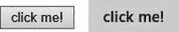

图 9-2 。IE10 中按钮的默认呈现与应用 WinJS 样式表后出现在 Windows 8 应用程序中的版本相比较

以下伪类与按钮元素相关:

*   **:悬停。**如前所述，被悬停按钮的背景颜色比正常颜色稍浅。
*   **:禁用。**默认情况下，禁用的按钮具有透明背景、白色文本和低透明度(40%)的边框。

如果你声明了一个按钮并包含了一个`win-backbutton`类，WinJS 样式表会把这个按钮变成后退按钮。后退按钮是圆形的，内部呈现一个箭头字形。这一典型的 Windows 8 功能可以通过以下非常简单的 HTML 标记添加到您的应用程序中:

```html
<button class="win-backbutton"/>
```

文件上传控制

文件上传控件对 HTML5 来说并不陌生，但是它已经得到了一些重要的改进。它在浏览器中看起来几乎是一样的——只显示一个文本框和一个浏览按钮。该控件允许用户一次上载一个或多个文件。

***清单 9-2。*** 一个带有“文件”类型的输入会呈现一个文件上传控件。

```html
<input type="file"/>
```

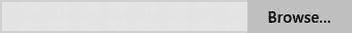

图 9-3。默认文件上传控件

由于文件上传控件呈现多个可视元素(即文本框和浏览按钮)，过去很难确定样式。复合元素可以很容易地被定位，但是不可能单独定位文本框和浏览按钮。然而，在 Internet Explorer 中，`::-ms-value`和`::-ms-browse`伪元素被识别并允许这种更精细的控制。

WinJS 将文件上载控件的样式设置为 340 像素宽，32 像素高，周围有自定义边距。`::-ms-value`(代表文本框)和`::-ms-browse`(代表浏览按钮)都有两个像素的边框。

文本输入控件

一些 HTML 控件相当于具有单一行为的单一控件，但是`input`元素不在其中。元素的行为取决于它的属性`type`的值。但是，许多值会导致控件在用户看来像一个文本框，并接受(正如所料)字母数字键盘输入。`type`属性中的任何下列值将产生一个字母数字文本框:`text`、`password`、`email`、`number`、`tel`、`url`或`search`。此外，`textarea`元素也会产生一个接受字母数字输入的文本框。所有这些结果控件的样式几乎都是一样的，所以我们将在清单 9-3 中一起查看它们。

***清单 9-3。*** 七种方式声明一个文本框

```html
<!-- HTML snippet -->
<input type="text"/> text<br />
<input type="password" /> password<br />
<input type="email" /> email<br />
<input type="number" /> number<br />
<input type="tel" /> tel<br />
<input type="url" /> url<br />
<input type="search" /> search<br />
<textarea></textarea> textarea
```

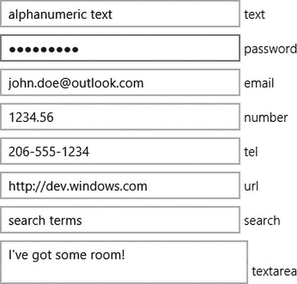

图 9-4。几种不同的文本框类型

从 HTML5 开始，Internet Explorer 和 Windows 8 应用程序会在大多数文本框类型的右侧显示一个小的 *X* ，这样用户可以更容易地清除文本框的值。在 Internet Explorer 10 和 Windows 8 应用程序中，您可以通过使用 *::-ms-clear* 伪元素将这个小字形作为样式。这对于那些想要很好地控制自己造型的人来说很有帮助。

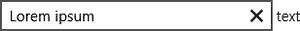

图 9-5。一个小的“x”字形呈现在文本框中，使清除框变得简单

同样，对于密码文本框，Internet Explorer 和 Windows 8 应用程序会呈现一个小的眼球字形，只要用户按下该字形，就会显示在字段中输入的密码。当用户知道没有人躲在他们身后或通过屏幕共享观看时，能够看到输入的密码以确保没有错误是有帮助的。

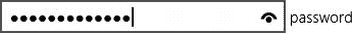

图 9-6。还会为密码字段呈现一个字形，以临时取消屏蔽并显示内容

文本框的高度至少为 28 像素，宽度至少为 64 像素，具有 2 像素的实心边框。

`textarea`元素的最小高度为 39 像素，宽度为 260 像素，具有相同的 2 像素实心边框。对于`textarea`元素，默认情况下垂直溢出被设置为滚动，因此如果用户输入太多文本，滚动条将被呈现，并且仍然使用户能够访问和编辑他们的所有文本。

您可以向任何元素添加一个`win-textarea`类，赋予它一个`textarea`的样式特征，而不管实际的元素是什么。

单选按钮

单选按钮用于选择——非此即彼的选择。当您想让用户只决定一个值时，您可以给他们单选按钮。大多数人会认出熟悉的小圆形单选按钮。清单 9-4 显示了它们在 Windows 8 中的样子。

***清单 9-4。*** 三个广播类型输入用标签指定。所有三个元素都有“水果”这个名称，因此它们的功能是互斥的(选择一个元素将取消选择其他元素)

```html
<!-- HTML snippet -->
<label><input type="radio" name="fruit" value="Apple"/> Apple</label><br />
<label><input type="radio" name="fruit" value="Orange"/> Orange</label><br />
<label><input type="radio" name="fruit" value="Banana"/> Banana</label>
```

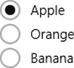

图 9-7。准备好交互的三个单选按钮

单选按钮(及其密切相关的兄弟，复选框)被选中时会填充一个字形，开发人员可以使用`::-ms-check`伪元素来定位该字形本身。如果你想在你的单选按钮上有一个更多彩的点，这个伪元素将是你唯一的希望。

像许多 Windows 8 控件一样，单选按钮有一个 2 像素的实心边框。它们的默认大小也是 23 像素见方。

复选框

复选框和单选按钮在幕后有很多共同点，但对用户来说，它们是完全不同的。复选框用于选项；它们代表二进制标志。然而，如果这是你的目标，你应该考虑 WinJS 提供的 ToggleSwitch 控件。这是一个更友好和更易触摸的控制，有很多 Windows 8 的个性。更重要的是，ToggleSwitch 向用户暗示更改将立即生效，而复选框暗示更改只有在表单提交后才会生效。清单 9-5 展示了一个垂直列表中复选框的基本示例。

***清单 9-5。*** 现在的类型是“复选框”。

```html
<!-- HTML snippet -->
<label><input type="checkbox" value="Apple"/> Apple</label><br />
<label><input type="checkbox" value="Orange"/> Orange</label><br />
<label><input type="checkbox" value="Banana"/> Banana</label>
```

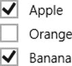

图 9-8。呈现复选框，允许选择多个项目

默认情况下，复选框为 21 像素见方，具有典型的 2 像素实心边框。

范围

范围(或滑块控件)是 HTML5 的新控件。范围控件为用户提供了一个用户界面(UI ),以便于从一个范围的值(如整数范围的值)中进行选择。

***清单 9-6。*** 一个简单的输入类型“范围”被声明

```html
<!-- HTML snippet -->
<input type="range" />
```

组成范围控件的许多部分可以作为伪元素的目标。

*   **::-ms-track。** -代表可能值范围的滑块轨迹
*   **::-女士-拇指。** -用户拖动的代表控件上当前值的部分
*   **::-毫秒-滴答-之前。** -适用于出现在轨道顶部(从左到右布局)或左侧(从上到下布局)的刻度线
*   **::-毫秒-滴答-之后。** -适用于出现在轨道底部(从左到右布局)或底部(从上到下布局)的刻度线
*   **::-ms-填充-降低。** -适用于从最小值到当前值的轨迹部分
*   **::-ms-fill-upper。** -适用于从当前值到最大值的轨迹部分

正如您在图 9-9 的示例中所看到的，范围指示器呈现为一个简单的矩形，带有一个小的拇指滑块，范围的*下部*部分用颜色填充。您也可以看到，默认情况下，范围控件水平显示。但是，您可以给它添加`win-vertical`类值，它将垂直显示。根据您自己独特的用户界面决定范围指示器是水平的还是垂直的。


图 9-9 。呈现 Windows 8 样式的范围控件

选择框

选择框实际上是 HTML 世界中的古董。该控件在列表中有一个或多个选项。它可以被配置为显示整个选项列表，或者只显示一个选项，在这种情况下，当用户展开列表时，其余的选项将被列出。它也可以配置为允许单个选定值或多个值。

***清单 9-7。*** 三个水果被声明为选择列表中的选项，但只有其中一个被选中

```html
<!-- HTML snippet -->
<select>
    <option selected>Apple</option>
    <option>Orange</option>
    <option>Banana</option>
</select>
```

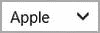

图 9-10。将呈现一个选择列表，其中显示选定的值

默认情况下，选择列表采用与其他具有 2px 矩形边框的控件相同的简单朴素的外观。呈现在选择列表右侧的扩展字形显示为一个简单的人字形，但是它可以用`::-ms-expand`伪元素作为目标，因此您可以非常容易地更改该字形。您还可以使用`::-ms-value`伪元素来定位列表中的单个元素。

进度指示器

进度指标无处不在，坦率地说，非常有用。在 HTML5 推出其语义标签版本之前，你在网上看到过它们，但它们是定制的，有点困难。现在声明一个进度指标是极其简单的；就像造型一样。清单 9-8 实际上在相同数量的代码行中声明了三个进度指示器。

***清单 9-8。*** 进度指标设置为渲染为 3 种基本类型

```html
<!-- HTML snippet -->
<progress value="1"></progress>
<progress></progress>
<progress class="win-ring"></progress>
```


图 9-11。进度指示器的三种基本类型

您可以通过使用`::-ms-fill`伪元素来定位填充进度指示器的条。

如果您没有覆盖并指定其他内容，并且没有向进度指示器添加任何类，那么它将是 180 像素宽，6 像素高，没有边框。像所有其他控件一样，progress 元素的默认样式相当于一个干净简单的 UI 元素。

如果你没有为你的进度控制的`value`属性提供一个值，那么它将被认为是一个*不确定的*进度指示器。这意味着它不会呈现为一个填满的条形，而是一个花哨的飞行点，指示任务正在运行，但不会承诺任务可能何时完成。您可以使用`:indeterminate`伪类来选择不确定的进度元素。

WinJS 样式表可以识别一些类，因此您可以将它们添加到 progress 元素中以影响其外观。它们是:

*   **`win-medium.`** 带有`win-medium`类的进度指示器将为 280 像素宽而不是默认的 180 像素。
*   **`win-large.`** 带有`win-large`类的进度指示器将在其父容器中对齐到 100%宽度。
*   **`win-paused.`** 当一个确定的进度指示器被分配一个类别`win-paused`时，它将从完全不透明变为 50%的动画。所以简单来说，当你暂停一个进度指示器时，它会淡出。
*   **`win-error.`** 当一个进度指示器出错时(当它有一个赢-错类时)，指示器的`::-ms-fill`将完全隐藏。
*   **`win-ring.`** 在你的进度指示器上添加一类`win-ring`，将它完全转换成一个旋转的圆点圆圈。这种紧凑的格式可能更适合您的设计。

WinJS 控件

像 HTML 元素一样，WinJS 控件产生的 UI 允许用户与应用程序进行交互。然而，相似之处也就到此为止。HTML 元素在您的标记中被指示一次，然后呈现在用户代理上。另一方面，WinJS 控件以具有特殊`data-win-control`属性的`div`元素开始，然后由 WinJS 库中的 JavaScript 处理，最后呈现用户代理知道如何处理的 HTML 元素。

因此，在这一节中，我们不仅要看控件的默认样式，还要广泛地看 JavaScript 处理到底呈现了什么。实际上，我们将使用非常有价值的 DOM Explorer 来获取呈现的 HTML，并查看它包含的所有内容。

您将看到呈现的 HTML 元素是用类值绘制的，这些类值充当句柄，让您为每个可能的复杂控件的各个方面添加样式。让我给你举个例子来说明我所说的。

DatePicker 控件产生多个元素，表示数据的组成部分。如果您需要单独为 month 组件添加一些样式，那么您很幸运，因为 month 组件将呈现在 WinJS 用`win-datepicker-month`修饰的 HTML 元素中。

所有这些类都以`win-datepicker-`开头，所以它们应该很容易被发现和区分。

让我们继续详细介绍许多 WinJS 控件，它们默认呈现什么，以及它们如何允许你用类值控制它们的样式。我们将查看以下 WinJS 控件:

*   绑定模板
*   日期选择器
*   TimePicker(时间选择器)
*   评级
*   切换开关
*   列表视图
*   语义缩放
*   FlipView
*   view box-检视方块
*   HtmlControl
*   页

绑定模板

大多数 WinJS 控件都可以在 WinJS 中找到。UI 命名空间，但模板控件在 WinJS。绑定名称空间，因为它与该名称空间的功能关系密切。

模板用于创建样板文件，对象可以呈现到其中。呈现旨在允许开发人员编写代表对象的简洁 HTML，但允许显示最终可能呈现到其中的任何对象。

关于模板的样式不需要说太多，因为大部分样式都留给了开发人员。然而，一个单独的值——`win-template`——被添加到模板的类中，这允许您有效地定位它们。

日期选择器

我们将要讨论的 DatePicker 和其余的 WinJS 控件都可以在 WinJS 中找到。UI 命名空间。就像它的名字一样，DatePicker 允许用户选择一个日历日期。这是一个非常简单的控件，它实际上只是将三个 HTML 选择列表呈现给标记——月份、日期和年份。默认的日期选择器如图 9-12 中的所示。

***清单 9-9。*** 一个来自 WinJS 的 DatePicker 控件，使用带有 data-win-control 属性的标准 div 声明

```html
<!-- HTML snippet -->
<div data-win-control="WinJS.UI.DatePicker"></div>
```

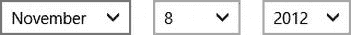

图 9-12 。日期选择器呈现为三个选择框

当你查看图 9-12 中的输出时，很明显这一行 HTML 标记已经被处理了。结果包含三个独立的选择框。让我们看看清单 9-10 中在处理过程中实际创建的 HTML。

***清单 9-10。***

```html
<!-- DOM Explorer snippet -->
<div class="win-datepicker " role="group" lang="en-US" dir="ltr"
    data-win-control="WinJS.UI.DatePicker">
    <select tabindex="0" class="win-datepicker-month win-order0 "
        aria-label="Select Month">
        <option value="January">January</option>
        <option value="February">February</option>
        <option value="March">March</option>
        ...
        <option value="October">October</option>
        <option value="November">November</option>
        <option value="December">December</option>
    </select>
    <select tabindex="0" class="win-datepicker-date win-order1 "
        aria-label="Select Day"><option value="1">1</option>
        <option value="2">2</option>
        <option value="3">3</option>
        ...
        <option value="28">28</option>
        <option value="29">29</option>
        <option value="30">30</option>
    </select>
    <select tabindex="0" class="win-datepicker-year win-order2 "
        aria-label="Select Year">
        <option value="1912">1912</option>
        <option value="1913">1913</option>
        <option value="1914">1914</option>
        ...
        <option value="2110">2110</option>
        <option value="2111">2111</option>
        <option value="2112">2112</option>
    </select>
</div>
```

time picker〔??〕

如果你理解了日期选择器的工作原理，你就不会有时间选择器的问题了。他们几乎一模一样。TimePicker 控件提供小时、分钟和时间段，而不是呈现月、日和年的选择列表。

***清单 9-11。*** 所有的 WinJS 控件都使用相同的语法进行声明

```html
<!-- HTML snippet -->
<div data-win-control="WinJS.UI.TimePicker"></div>
```

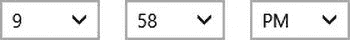

图 9-13 。TimePicker 控件也使用三个选择框

同样，我们添加了一行 HTML 标记，但是我们的输出包含三个不同的选择框。清单 9-12 显示了 DOM Explorer 生成的 HTML。

***清单 9-12。***清单 9-11 和图 9-13 中的时间选择器产生三个选择列表，分别是小时、分钟和时间段(为简洁起见，将其缩短)

```html
<!-- DOM Explorer snippet -->
<div class="win-timepicker " role="group" lang="en-US" dir="ltr"
    data-win-control="WinJS.UI.TimePicker">
    <select tabindex="0" class="win-timepicker-hour win-order0 "
        aria-label="Select Hour">
        <option value="12">12</option>
        <option value="1">1</option>
        <option value="2">2</option>
        ...
        <option value="9">9</option>
        <option value="10">10</option>
        <option value="11">11</option>
    </select>
    <select tabindex="0" class="win-timepicker-minute win-order1 "
        aria-label="Select Minute">
        <option value="00">00</option>
        <option value="01">01</option>
        <option value="02">02</option>
        ...
        <option value="57">57</option>
        <option value="58">58</option>
        <option value="59">59</option>
    </select>
    <select tabindex="0" class="win-timepicker-period win-order2 "
        aria-label="Select A.M P.M">
        <option value="AM">AM</option>
        <option value="PM">PM</option>
    </select>
</div>
```

评级

许多应用程序包括允许用户为其他用户的商品和服务对商品和服务进行评级的功能。5 星评级系统是一个受欢迎的系统，这正是评级控制默认为您提供的，尽管它不限于 5 星，甚至不限于星。图 9-14 向您展示了典型分级控制的效果。

***清单 9-13。*** 一个 WinJS 等级控制

```html
<!-- HTML snippet -->
<div data-win-control="WinJS.UI.Rating"></div>
```


图 9-14 。使用流行的 5 星系统默认呈现分级控制

快速浏览一下 DOM explorer，看看评级控件是如何组成的，可以看到清单 9-14 中的代码。

***清单 9-14。*** 生成的 DOM 标记为默认评级控件

```html
<!-- DOM Explorer snippet -->
<div tabindex="0" class="win-rating " role="slider" aria-readonly="false" aria-valuenow="Unrated"
    aria-valuemin="0" aria-valuemax="5" aria-label="User Rating" aria-valuetext="Unrated"
    data-win-control="WinJS.UI.Rating">
    <div class="win-star win-empty win-user "></div>
    <div class="win-star win-empty win-user "></div>
    <div class="win-star win-empty win-user "></div>
    <div class="win-star win-empty win-user "></div>
    <div class="win-star win-empty win-user "></div>
    <div class="win-star win-average win-full win-user " style="-ms-flex: 0 0 auto;
        padding-right: 0px; padding-left: 0px; border-right-color: currentColor;
        border-left-color: currentColor; border-right-width: 0px; border-left-width: 0px;
        border-right-style: none; border-left-style: none; display: none;"></div>
</div>
```

向分级控制添加一个类别`win-small`将导致分级控制的大小是标准分级控制的一半。星星将是 14 像素，而不是正常的 28 像素。不要认为“正常”和“小”是分级控制的唯一选择。与所有这些控件一样，权力掌握在作为开发人员的您手中。例如，你可以通过使用类似于清单 9-15 中的样式规则，使用巨大的星星作为你的分级控制。我们将在第十章中看到更多这样的覆盖和扩展样式，但这里只是我所说的一个例子。

在清单 9-15 的中，我们看到样式规则(包含在 WinJS 中)使开始变小，在同一个清单中我们看到一个名为`win-huge`的自定义规则，它做了相反的事情，使星星变大。

***清单 9-15。*** 自定义样式规则增加星星的大小

```html
/* .win-small (from WinJS) */
.win-rating.win-small .win-star {
    width: 14px;
    height: 14px;
    font-size: 14px;
    padding: 0 3px;
}

/* custom .win-huge style */
.win-rating.win-huge .win-star {
    width: 56px;
    height: 56px;
    font-size: 56px;
    padding: 0 12px;
}
```

切换开关

正如我前面提到的，ToggleSwitch 控件是传统 checkbox 的一个很好的替代品。ToggleSwitch 是一个更大、触摸更友好的二元决策目标。例如，使用它可以让用户选择打开或关闭游戏中的音乐。

清单 9-16 显示了控件，图 9-15 显示了典型的拨动开关。

***清单 9-16。*** 一个 WinJS ToggleSwitch 控件

```html
<!-- HTML snippet -->
<div data-win-control="WinJS.UI.ToggleSwitch"></div>
```


图 9-15 。ToggleSwitch 是回答二元问题(如是/否)的一种更加用户友好的方式

为 ToggleSwitch 控件生成的 HTML 可能会让您感到惊讶。HTML 没有看起来像切换控件的本地元素。根本就不存在。然而，WinJS 控件不呈现新的图形元素。Windows 团队在这种情况下发挥了创造性，使用了进度指示器，但改变了滚动条本身和滑块的尺寸，使其看起来像一个开关。您可以在清单 9-17 中的结果 HTML 中看到进度指示器。

***清单 9-17。*** 由此产生的 DOM 输出为一个默认的 ToggleSwitch 控件

```html
<!-- DOM Explorer snippet -->
<div class="win-toggleswitch win-off " data-win-control="WinJS.UI.ToggleSwitch">
    <div class="win-title " id="ms__id32" role="note"></div>
    <div style="display: -ms-grid;">
        <div class="win-label ">On</div>
        <div class="win-label win-hidden ">Off</div>
        <input class="win-switch " role="checkbox" aria-checked="false"
            aria-disabled="false" aria-labelledby="ms__id32" type="range"
            max="1" step="1"></div>
</div>
```

注意，ToggleSwitch 控件实际上是使用一个`<input type="range"/>`元素实现的。`1`的一个`max`值和`1`的一个`step value`值使范围控制像一个二进制开关。这是一个非常聪明的方法来重复使用已经存在的东西。

因为 ToggleSwitch 使用范围控件，所以应用于范围元素的所有相同伪元素也可以应用于 ToggleSwitch。toggle 中的 range 元素被赋予一个 win-switch 类，所以一个`#myToggle .win-switch::-ms-thumb`的 CSS 选择器将选择一个`id`为`myToggle`的 ToggleSwitch 的滑块。这是伪元素列表:`::-ms-thumb`、`::-ms-tooltip`、`::-ms-ticks-before`、`::-ms-ticks-after`、`::-ms-track`、`::-ms-fill-upper`和`::-ms-fill-lower`。

列表视图

ListView 是 Windows 8 应用程序中的一个重要控件。我在第七章向你介绍了它的功能，但是现在是时候为它的类剖析控件，并且弄清楚我们如何能以我们想要的方式设计它。图 9-16 再次向你展示了第七章中的 ListView 的样子。

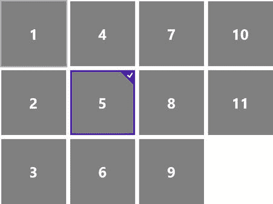

图 9-16 。典型的 ListView 借用自图 7-19 中的第七章

声明 ListView 的语法与其他 WinJS 控件是一样的，正如你在清单 9-18 中看到的，但是声明本身会导致一个空的 ListView，当你执行你的应用程序时你甚至看不到它。然而，查询 DOM Explorer 向我们保证它就在那里，您可以在清单 9-19 中看到结果。

***清单 9-18。*** 声明为一个简单(且为空)的 ListView 控件

```html
<!-- HTML snippet -->
<div data-win-control="WinJS.UI.ListView"></div>
```

在清单 9-19 中，DOM Explorer 向我们展示了一个简单的 ListView 控件生成的 HTML，它没有绑定任何数据。

***清单 9-19。*** 为空 ListView 的标记

```html
<!-- DOM Explorer snippet -->
<div tabindex="-1" class="win-listview win-swipeable " role="listbox"
    style="position: relative;" data-win-control="WinJS.UI.ListView">
    <div tabindex="-1" class="win-viewport win-horizontal " role="group"
        aria-label="Scrolling Container">
        <div id="ms__id31" aria-flowto="ms__id32"></div>
        <div class="win-surface ">
            <div class="win-backdrop " aria-hidden="true" style="width: 0px; height: 0px;"></div>
            <div class="win-backdrop " aria-hidden="true" style="width: 0px; height: 0px;"></div>
            <div class="_win-proxy"></div>
            <div tabindex="0" aria-hidden="true"></div>
            <div style="left: 0px; top: 0px; width: 100%; height: 100%; position: absolute;">
            </div>
            <div tabindex="0" aria-hidden="true"></div>
        </div>
        <div id="ms__id32" x-ms-aria-flowfrom="ms__id31"></div>
    </div>
    <div tabindex="0" aria-hidden="true"></div>
    <div aria-hidden="true" style="left: 50%; top: 50%; position: absolute;">
        <div tabindex="0" aria-hidden="true"></div>
        <div aria-hidden="true" style="width: 0px; height: 0px;"></div>
        <div tabindex="0" aria-hidden="true"></div>
    </div>
    <div tabindex="0" aria-hidden="true"></div>
</div>
```

正如您所看到的，这一条有很多内容(请记住，这是一个空列表！)现在让我们来看看一个只有少量数据填充的 ListView。

***清单 9-20。*** HTML 和 JavaScript 不仅用于声明 ListView，还用于填充它

```html
<!-- HTML snippet -->
<div data-win-control="WinJS.UI.ListView"></div>
<div data-win-control="WinJS.Binding.Template">
    <span data-win-bind="innerText:this"></span>
</div>

// JavaScript snippet
var list = new WinJS.Binding.List(["one", "two", "three"]);
var listViewElement = element.querySelector("[data-win-control='WinJS.UI.ListView']");
var templateElement = element.querySelector("[data-win-control='WinJS.Binding.Template']");
listViewElement.winControl.itemDataSource = list.dataSource;
listViewElement.itemTemplate = templateElement;
```

***清单 9-21。***ListView 的结果 DOM 标记，其中绑定了一些数据

```html
<!-- DOM Explorer snippet -->
<div tabindex="-1" class="win-listview win-swipeable " role="listbox" style="position: relative;"
    data-win-control="WinJS.UI.ListView">
    <div tabindex="-1" class="win-viewport win-horizontal " role="group"
        style="opacity: 1; -ms-scroll-limit-x-min: 0px;" aria-label="Scrolling Container">
        <div id="ms__id42" aria-flowto="ms__id35"></div>
        <div class="win-surface " style="width: 35px; opacity: 1;">
            <div class="win-backdrop " aria-hidden="true"
                style='left: 35px; top: 0px; width: 0px; height: 390px;
                background-image: url("data:image/png;base64,…");'></div>
            <div class="win-backdrop " aria-hidden="true"
                style='left: 0px; top: 0px; width: 0px; height: 390px;
                background-image: url("data:image/png;base64,…");'></div>
            <div class="_win-proxy"></div>
            <div tabindex="0" aria-hidden="true"></div>
            <div style="left: 0px; top: 0px; width: 100%; height: 100%;
                position: absolute; clip: auto;">
                <div class="win-container " style="left: 0px; top: 0px;
                    width: 25px; height: 20px;">
                    <div tabindex="0" aria-hidden="true"></div>
                    <span class="win-item " id="ms__id35" role="option" aria-posinset="1"
                        aria-setsize="3" aria-flowto="ms__id37" x-ms-aria-flowfrom="ms__id42">
                        one
                    </span>
                    <div tabindex="0" aria-hidden="true"></div>
                </div>
                <div class="win-container " style="left: 0px; top: 30px;
                    width: 25px; height: 20px;">
                    <span class="win-item " id="ms__id37" role="option" aria-posinset="2"
                        aria-setsize="3" aria-flowto="ms__id39" x-ms-aria-flowfrom="ms__id35">
                        two
                    </span>
                </div>
                <div class="win-container " style="left: 0px; top: 60px;
                    width: 25px; height: 20px;">
                    <span class="win-item " id="ms__id39" role="option" aria-posinset="3"
                        aria-setsize="3" aria-flowto="ms__id43" x-ms-aria-flowfrom="ms__id37">
                        three
                    </span>
                </div>
            </div>
            <div tabindex="0" aria-hidden="true"></div>
        </div>
        <div id="ms__id43" x-ms-aria-flowfrom="ms__id39"></div>
    </div>
    <div tabindex="0" aria-hidden="true"></div>
    <div aria-hidden="true" style="left: 50%; top: 50%; position: absolute;">
        <div aria-hidden="true" style="width: 0px; height: 0px;"></div>
    </div>
    <div tabindex="0" aria-hidden="true"></div>
</div>
```

很明显，这个数据绑定 ListView 中还有更多的内容，包括我想引起您注意的一些事情:

*   请注意，整个 ListView 位于一个包含类`win-listview`的元素中。这成为整个控件的一个方便的句柄。
*   注意类`win-swipeable`的使用。如果您在默认样式表中查找`win-swipeable`的样式，您会发现它负责滚动行为。
*   注意`win-horizontal`类的使用。ListView 控件也可以设置为垂直的，这是最终决定方向和行为的类。
*   注意列表中每个单独项目周围的`win-container`和`win-item`元素。当您需要样式化列表中的项目时，这两个类中的一个是缩小您的选择范围，只列出容器或列表项目的好方法。
*   注意绝对位置。第一项设置有`0px`的`top`值，第二项设置有`30px`，第三项设置有`60px`。
*   请注意 win-viewport 和 win-surface 类的使用。这两个组件之间的区别很重要，你马上就会看到。

Windows Dev Center 上的文章`http://msdn.microsoft.com/en-us/library/windows/apps/hh850406.aspx`非常有助于可视化组成 ListView 的可视(和功能)组件。看看图 9-17 ，出自那篇文章。理解`win-listview`、`win-surface`和`win-viewport`类是绝对必要的。

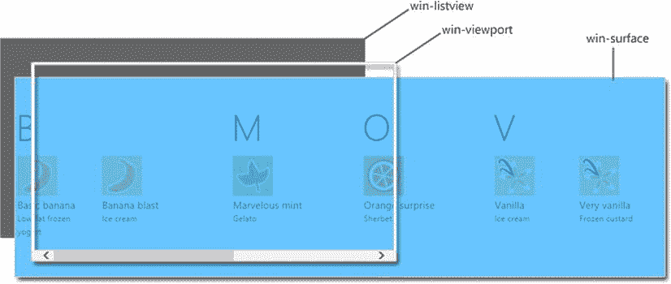

图 9-17 。一个图,显示了组成列表视图的各种组件，这在试图添加或覆盖影响这个相对复杂的 WinJS 控件的样式时非常有用

可以把`win-viewport`想象成一个框架，当用户滚动时，`win-surface`可以在这个框架后面滑动。在`win-listview`上添加或操作样式属性，如果它会影响整个控件的话。`win-viewport`包含滚动行为(`overflow-x`和`overflow-y`)。Style `win-surface`如果你想影响实际出现在列表项后面的背景。

语义缩放

与 ListView 相关的是 SemanticZoom 控件。SemanticZoom 控件意味着包含两个 ListView 控件——标准 ListView(视图附近的*)和另一个表示同一数据的逻辑缩小视图(*视图和*视图)。通常，远视图显示代表近视图中数据的组。组列表比完整的数据集更简洁，并且附加的特征是用户能够从远视图中选择一个组，并直接导航到近视图中的该组。*

图 9-18 显示了语义缩放控件的简化模型。在第一个图像中，显示了多个组及其关联的项目。在用户在列表上做了缩放手势后，它们被动画化并转换成第二个图像，其中显示组，但不显示它们的项目。

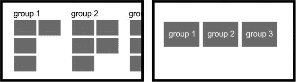

图 9-18 。语义缩放为用户定位,也方便了导航

请注意，第三组在放大列表中并不完全可见(图 9-18 中的第一幅图像),但它在缩小列表中。从语义上缩小数据列表不仅是定位和消化大型列表的一种方式，也是导航大型列表的一种更简单的方式。

语义缩放是 Windows 8 独有的功能，旨在帮助用户更轻松地定位和导航大型数据列表。

您可能需要将 SemanticZoom 控件作为目标来设置其样式或对其进行操作。SemanticZoom 控件的呈现版本有点复杂，但是要引用它，只需知道 WinJS 分配给它的类就足够了。您可以在清单 9-23 中看到，这个类名是`win-semanticzoom`。你也可以看到我提到的复杂性。列表中的近视图和远视图列表已被折叠并变暗，但仍然存在相当多的标记。这种标记样式和定位控件，并向其添加转换和过渡，以赋予其作为 Windows 8 SemanticZoom 控件的独特个性和行为。

***清单 9-22。*** 用于创建 SemanticZoom 控件的 HTML、CSS 和 JavaScript

```html
<!-- HTML snippet -->
<div data-win-control="WinJS.UI.SemanticZoom">
    <div id="list1" data-win-control="WinJS.UI.ListView"></div>
    <div id="list2" data-win-control="WinJS.UI.ListView"></div>
</div>
<div id="itemtemplate" data-win-control="WinJS.Binding.Template">
    <span data-win-bind="innerText:this"></span>
</div>
<div id="grouptemplate" data-win-control="WinJS.Binding.Template">
    <h2 data-win-bind="innerText:this"></h2>
</div>
<div id="semantictemplate" data-win-control="WinJS.Binding.Template">
    <div data-win-bind="innerText:this"></div>
</div>

/* CSS snippet */
.lst0922  #list1 .win-item { width:80px; }

// JavaScript snippet
var numbersList = new WinJS.Binding.List([1,2,3,4,5,6,7,8,9,10]).createGrouped(
    function(item) { return (item <= 5 ? "1-5" : "6-10"); },
    function (item) { return (item <= 5 ? "1-5" : "6-10"); }
);
var list1 = element.querySelector("#list1").winControl;
list1.itemDataSource = numbersList.dataSource;
list1.itemTemplate = element.querySelector("#itemtemplate");
list1.groupDataSource = numbersList.groups.dataSource;
list1.groupHeaderTemplate = element.querySelector("#grouptemplate");

var list2 = element.querySelector("#list2").winControl;
list2.itemDataSource = numbersList.groups.dataSource;
list2.itemTemplate = element.querySelector("#semantictemplate");
```

***清单 9-23。***semantic zoom 控件的结果 DOM 标记(为简洁起见，列表变暗并折叠)

```html
<!-- DOM Explorer snippet -->
<div class="win-semanticzoom " role="ms-semanticzoomcontainer" aria-checked="false"
    style="overflow: hidden; position: relative;" aria-label=""
    data-win-control="WinJS.UI.SemanticZoom">
    <div style="left: 0px; top: 0px; width: 1264px; height: 400px; overflow: hidden;
        position: absolute;">
        <div style="left: 0px; top: 0px; width: 1264px; height: 400px; overflow: hidden;
            visibility: visible; position: absolute; transition-property: transform;
            transition-duration: 0s; transition-timing-function: linear;">
            <div style="transform-origin: 695.615px 200px; transition: transform 0.33s
                ease-in-out 34ms, opacity 0.33s ease-in-out 34ms; left: -680.61px; top: 0px;
                width: 2625.23px; height: 400px;overflow: hidden; position: absolute;
                opacity: 1; transform: scale(1);">

                <div class="win-listview win-swipeable win-groups" id="list1" ...>...</div>

            </div>
        </div>
        <div style="left: 0px; top: 0px; width: 1264px; height: 400px; overflow: hidden;
            visibility: hidden; position: absolute; transition-property: transform;
            transition-duration: 0s;transition-timing-function: linear;">
            <div style="transform-origin: 78.2px 200px; transition: transform 0.33s
                ease-in-out 34ms, opacity 0.33s ease-in-out 34ms; left: -63.2px; top: 0px;
                width: 1390.4px; height: 400px; overflow: hidden; position: absolute;
                opacity: 0; transform: scale(1.53846);">

                <div class="win-listview win-swipeable" id="list2" ...>...</div>

            </div>
        </div>
    </div>
    <button tabindex="-1" class="win-semanticzoom-button win-semanticzoom-button-location ltr "
        style="visibility: hidden; opacity: 0;"></button>
    <div tabindex="-1" aria-hidden="true"></div>
</div>
```

翻页视图

在许多情况下，FlipView 控件是一个很好的选择。它可以用来浏览图像、文章或应用程序的整个部分。一个简单的左右滑动手势就可以命令 FlipView 切换到下一个项目，包括动画、缓动和捕捉。

FlipView 是另一个需要用一点代码来演示的控件，原因是它是一个数据绑定控件。这意味着，就像 ListView 一样，我们将把我们的 FlipView 绑定到一个 *WinJS。只要列表中的任何内容发生变化，我们的 FlipView 就会自动响应，而无需我们手动捕捉事件并更新 FlipView 中的项目。*

此外，像 ListView 一样，FlipView 让我们有机会指定用于呈现每个项目的模板。

***清单 9-24。*** 绑定了一些简单图像的 FlipView

```html
<!-- HTML snippet -->
<div id="flipview" data-win-control="WinJS.UI.FlipView"></div>
<div id="template" data-win-control="WinJS.Binding.Template">
    
</div>

/* CSS snippet */
.lst0924 .win-flipview {
    width: 480px;
    height: 320px;
}

//JavaScript
var flipview = element.querySelector("#flipview").winControl;
var template = element.querySelector("#template");

var fruitList = new WinJS.Binding.List([
    "/pages/chapter9/lst0924/peaches.png",
    "/pages/chapter9/lst0924/grapes.png",
    "/pages/chapter9/lst0924/orange.png
"]);
flipview.itemDataSource = fruitList.dataSource;
flipview.itemTemplate = template;
```

图 9-19 看起来是一个单独的图像，但是你可以看到箭头被绘制在每条边上。箭头是可见的，所以鼠标用户可以点击一些东西，但是触摸用户可以简单地滑动列表以改变到新的图像。

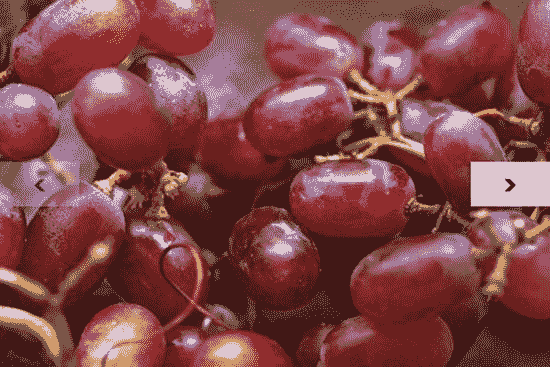

图 9-19 。当您使用鼠标与 Windows 8 交互时，下一个和上一个箭头会呈现在 FlipView 的每一侧。你也可以随时使用滑动手势进行切换

整个 FlipView 本身有一个`win-flipview`类，这使得在运行的应用程序中引用 FlipView 控件变得很容易。但是，填充 FlipView 的项目会呈现在一个嵌入的 div 上，该 div 具有 win-surface 类。像 ListView 一样，您可以将这个元素想象成一个包含所有项目的长条，它可以滑动以一次显示一帧。

最后，FlipView 有两个导航按钮，只有在用户使用鼠标时才会出现。如果用户一直使用触摸进行交互，导航按钮就没有必要出现，因为只需一个简单的滑动手势就可以向前或向后导航。你可以在清单 9-25 中看到这些按钮的标记。它们是 HTML 按钮，被赋予了类值`win-navbutton`和`win-navleft`或`win-navright`。您当然不必满足于默认情况下为 FlipView 呈现的左右箭头。您可以通过引用这些类值来覆盖它。我们将在第十章中了解更多。

***清单 9-25。***WinJS flip view 声明产生的标记

```html
<div tabindex="-1" class="win-flipview " id="flipview" role="listbox" style="overflow: hidden;"
    aria-label="" data-win-control="WinJS.UI.FlipView">
    <div style="width: 100%; height: 100%; position: relative; z-index: 0;">
        <div tabindex="0" aria-hidden="true"></div>
        <div class="win-surface " role="group" style="-ms-scroll-snap-x: mandatory
            snapInterval(0px, 480px); width: 100%; height: 100%; position: relative;
            -ms-overflow-x: scroll; -ms-overflow-y: hidden; -ms-scroll-limit-x-min: 240000px;
            -ms-scroll-limit-x-max: 240960px; -ms-overflow-style: none;"
            aria-label="Scrolling Container">
            <div style="width: 100%; height: 100%; position: relative;">
                <div id="ms__id5" aria-flowto="ms__id36"></div>
                <div style="left: 240000px; width: 480px; height: 320px; overflow: hidden;
                    position: absolute;">
                    <div class="win-item " style="-ms-overflow-style: auto;">
                        <div tabindex="0" aria-hidden="true"></div>
                        <div tabindex="0" class="win-template " id="ms__id36" role="option"
                            aria-selected="true" aria-posinset="1" aria-setsize="3"
                            aria-flowto="ms__id37" x-ms-aria-flowfrom="ms__id5">
                            
                        </div>
                        <div tabindex="0" aria-hidden="true"></div>
                    </div>
                </div>
                <div style="left: 240480px; width: 480px; height: 320px; overflow: hidden;
                    position: absolute;">
                    <div class="win-item " style="-ms-overflow-style: auto;">
                        <div tabindex="0" class="win-template " id="ms__id37" role="option"
                            aria-selected="false" aria-flowto="ms__id38"
                            x-ms-aria-flowfrom="ms__id36">
                            
                        </div>
                    </div>
                </div>
                <div style="left: 240960px; width: 480px; height: 320px; overflow: hidden;
                    position: absolute;">
                    <div class="win-item " style="-ms-overflow-style: auto;">
                        <div tabindex="0" class="win-template " id="ms__id38" role="option"
                            aria-selected="false" aria-flowto="ms__id6"
                            x-ms-aria-flowfrom="ms__id37">
                            
                        </div>
                    </div>
                </div>
                <div style="left: 239040px; width: 480px; height: 320px; overflow: hidden;
                    position: absolute;">
                    <div class="win-item " style="-ms-overflow-style: auto;"></div>
                </div>
                <div style="left: 239520px; width: 480px; height: 320px; overflow: hidden;
                    position: absolute;">
                    <div class="win-item " style="-ms-overflow-style: auto;"></div>
                </div>
                <div id="ms__id6" x-ms-aria-flowfrom="ms__id38"></div>
            </div>
        </div>
        <div tabindex="0" aria-hidden="true"></div>
        <button tabindex="-1" class="win-navbutton win-navleft " aria-hidden="true"
            style="visibility: hidden; z-index: 1000; opacity: 0;" aria-label="Previous"
            type="button">·</button>
        <button tabindex="-1" class="win-navbutton win-navright " aria-hidden="false"
            style="visibility: hidden; z-index: 1000; opacity: 0;" aria-label="Next"
            type="button">·</button>
    </div>
</div>
```

view box-检视方块

第七章的中介绍了视图框的功能，但是让我们快速回顾一下。视图框与其父容器的大小对齐，然后缩放单个子项(只能有一个),而不影响其纵横比以适应视图框的大小。它还会响应视图状态的变化，因此当用户旋转平板电脑时，ViewBox 会相应地处理其内容的缩放。

我们没有花时间在第七章来看一个视图框是如何实现的。现在，让我们看看渲染视图框的完整 DOM Explorer 输出。

在清单 9-26 中，我们有一个*父* div，它包含一个包含*子* div 的视图框。请注意，在 CSS 中，父级是垂直定向的，宽度为 100 像素，高度为 300 像素。还要注意，孩子的方向是水平的，宽度为 300 像素，高度为 100 像素。ViewBox 没有剪切子元素、拉伸父元素或呈现滚动条来显示隐藏的内容，而是保留了子元素并简单地缩放它以适合父 div。

***清单 9-26。*** 包含 ViewBox 的父 div，view box 包含子 div

```html
<!-- HTML snippet -->
<div class="parent">
    <div data-win-control="WinJS.UI.ViewBox">
        <div class="child"></div>
    </div>
</div>

/* CSS snippet */
.lst0926 .parent {
    width: 100px;
    height: 300px;
    border: solid 2px gray;
}

.lst0926 .child {
    width: 300px;
    height: 100px;
    border: solid 2px;
}
```

***清单 9-27。*** 视图框缩放了子 div 以适合其父 div

```html
<div class="parent">
    <div class="win-viewbox " data-win-control="WinJS.UI.ViewBox">
        <div class="horizontal" style="transform-origin: left top;
            transform: translate(0px, 133.333px) scale(0.333333); "></div>
    </div>
</div>
```

ViewBox 行为的一个巨大优势是子 *div* 可以包含任何形式的内容，但它的缩放和定位是相同的。举例来说，这是一个很好的方法，可以将整个游戏板缩放到适合横向模式或纵向模式。

html control〔??〕

HtmlControl 使得从另一个文档中引入 HTML 并将其呈现到另一个文档的任何区域变得非常简单。您可以使用 HtmlControls 从更小的页面组件中构建页面，这些组件可能更易于维护或协作。

***清单 9-28。*** 使用 WinJS HtmlControl 将 HTML“导入”到单独文件中的 HTML 代码片段

```html
<!-- HTML snippet -->
<div class="parent">
    <div data-win-control="WinJS.UI.HtmlControl"
        data-win-options="{uri:'/pages/chapter9/lst0928/page.html'}">
   </div>
</div>

/* CSS snippet */
.parent {
    border: solid 2px gray;
    width: 200px;
    padding: 5px;
}

<!-- page.html -->
<!DOCTYPE html>
<html>
    <head>
        <title></title>
    </head>
    <body>
        Hello, I came from page.html
    </body>
</html>
```

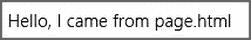

图 9-20。将外部 HTML 导入 div 的结果

你可以看到“你好，我来自 page.html”在一个单独的 html 文件中，但是我们使用了一个 HtmlControl 来声明性地(在清单 9-28 中没有 JavaScript)将它导入代码片段中的 HTML。

***清单 9-29。***html control 的结果 DOM 标记包含一个 pagecontrol 类

```html
<!-- DOM Explorer snippet -->
<div class="parent">
    <div class="pagecontrol " data-win-options="{uri:'/pages/chapter9/lst0929/page.html'}"
        data-win-control="WinJS.UI.HtmlControl">
        Hello, I came from page.html
    </div>
</div>
```

我们最初赋予属性`data-win-control`和`data-win-options`的 div 也被赋予了一个类名`pagecontrol`，这将再次使我们易于识别和定位。

页

在 WinJS 中的一个*页面*是一套完整的 HTML、CSS 和 JavaScript，代表一个单一的视图。在传统的 web 开发中，页面通常使用超链接进行导航。Windows 8 当然仍然支持这种风格的导航，但使用内置框架进行单页面导航通常是一个更好的主意。当实现这种导航模型时，逻辑页面仍然是一个实际的 HTML 页面(通常也是一个 CSS 和 JavaScript 文件)，但是您通常不会超链接到它。相反，您将使用导航框架*将*导航到它，这将导致页面的最终呈现被附加到起始页的 DOM(default . html)。

出于几个原因，理解这些页面的标识方式变得相当重要。幸运的是，这是一个非常优雅且易于理解的约定。

就在每个页面的 HTML 文件的`body`元素中，您会发现一个具有两个类名的`div`元素。第一个是页面名称，第二个是`fragment`。然后，`helloworld`页面看起来就像你在清单 9-30 中看到的一样。

***清单 9-30。*** 一个使用 WinJS 导航模型的页面包含一个片段——一个简单的 div，有两个类名，让 WinJS 和我们更容易定位

```html
<!-- helloworld.html -->
<!DOCTYPE html>
<html>
<head>
    <meta charset="utf-8" />
    <title>Orders Page</title>

    <!-- WinJS references -->
    <link href="//Microsoft.WinJS.1.0/css/ui-light.css" rel="stylesheet" />
    <script src="//Microsoft.WinJS.1.0/js/base.js"></script>
    <script src="//Microsoft.WinJS.1.0/js/ui.js"></script>

    <link href="helloworld.css" rel="stylesheet" />
    <script src="helloworld.js"></script>
</head>
<body>
    <div class="helloworld fragment ">
        <section aria-label="Main content" role="main">
            <p>Hello, World!</p>
        </section>
    </div>
</body>
</html>
```

注意加粗的类名。第一个匹配页面的名称，第二个是`fragment`。正是这整个片段将被注入到`default.html`页面中。

不过，您也可以将这些类用作自己的句柄。如果你想创建一个影响页面的样式，你可以给它加上前缀`.fragment`。如果你想应用一个只影响`helloworld`页面的样式，你可以在它前面加上`.helloworld`。

对 WinJS 提供给我们的基本 HTML 控件和额外控件的样式的一瞥不足以彻底理解这个用于创建 Windows 8 应用程序的强大库，所以我建议你花一些时间在`ui-light.css`文档中，以理解它对各种控件做了什么，从而理解你可以扩展或覆盖什么。

下一章是关于扩展和重写的。如果 WinJS 已经确定一个按钮的边框是灰色的，而你希望它是深绿色的，那么这将是一个覆盖。如果 WinJS 根本没有提到按钮的背景颜色，但是你需要它，那么这就是按钮样式的扩展。

摘要

在这一章中，我们了解到 WinJS 在 Windows 8 应用程序中帮了我们很多。WinJS 提供了许多只由本地 HTML 元素组成的控件。它们提供了更丰富的用户交互和更一致的 Windows 8 体验。

WinJS 也给了我们一个 CSS 样式规则的大集合，这些规则同样适用于本地 HTML 元素和 WinJS 控件。这些样式规则使您的应用程序中的视觉元素的布局和样式看起来像 Windows 8 应用程序一样简单，并赋予它自己独特的风格。

WinJS 库使我们可以轻松地声明它的控件，同时它处理我们的简单声明，将其转换为本机 HTML 元素。当它创建最终被呈现的 HTML 时，它将有用的类名添加到各个部分，这样我们就有了“钩子”,我们可以使用它来设计整个控件的样式或针对单个组件。

这一切都是为了给用户提供更好的控制和更容易的开发之间的平衡，而且非常有效。