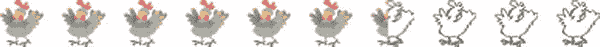

# 十、替代和定义样式

 **注意**你已经了解了 CSS 以及它是如何在 Windows 8 应用中实现的。现在是时候开始创建你自己的风格，覆盖和扩展 WinJS 提供的风格，让你的应用程序有自己的个性，同时符合微软的设计原则。

这一章的目标是学习如何按照我们的需要来设计我们的应用程序。好的设计不完全是客观的，但是有很多原则适用，当然也有很多围绕*好的 Windows 8 设计*的原则可以极大地促进你的应用程序的成功。

为了控制我们的应用程序中的 UI，我们将首先找到 WinJS 样式表中定义的应用于我们的应用程序中的元素的样式规则，然后我们将覆盖这些规则中定义的样式属性，或者我们将添加自己的属性来扩展它们。此外，我们将创建自己的样式规则，应用于页面上的元素或者我们编写的自定义控件。

定位样式选择器

在我们可以覆盖和扩展 WinJS 中定义的样式规则之前，我们必须找到影响相关视觉元素的一个或多个规则。有这么多的规则，这不是一个微不足道的任务。

我们已经看到，WinJS 为我们提供了丰富的样式，这就是为什么在没有任何样式代码的情况下，我们从一个看起来像 Windows 8 应用程序的应用程序开始。WinJS 库中的样式不仅数量众多，而且有些还相当长。清单 10-1 显示了在`ui-light.css`样式表中可以找到的许多样式规则选择器中的两个。第一个简单地选择了*一个按钮*，但是第二个显示了它们可以变得多具体，并且为列表视图中没有“selection style filled”的选定的、悬停的容器选择了*选择边框。*

***清单 10-1*** 。一个非常简单和一个非常复杂的风格选择器

```html
button {
   ...
}

.win-listview:not(.win-selectionstylefilled)
    .win-container.win-selected:hover .win-selectionborder {
   ...
}
```

如果没有 DOM Explorer 中的 Trace Style 窗格的帮助，发现在哪里以及如何应用样式规则将是一项充满猜测的艰巨任务。它将原本痛苦的任务变成了无痛的任务。

让我们通过一个练习来发现相关的风格规则。首先，我们将寻找影响 ListView 控件的规则。

练习 10-1:在列表视图中定位选择边框

当您在 ListView 中选择一个项目时，您会得到一些视觉指示器，让您知道您已经选择了一个项目。您可以在 ListView 上设置属性，以确定用户是否可以选择零个、一个或多个项目。在本练习中，我们将深入研究动态 DOM，并找到决定 ListView 的选择边框和复选标记的样式规则。毕竟，如果我们要改变他们，我们必须找到他们。

清单 10-2 恢复了第七章中的一个列表视图示例。在图 10-1 中，注意列表项 5 上的边框、角填充和勾号。

***清单 10-2*** 。这里有一些你以前在第七章中见过的代码。这是一个绑定到一系列数字的列表视图。

`<!-- HTML snippet -->`

`<div id="list" data-win-control="WinJS.UI.ListView"></div>`

`<div id="template" data-win-control="WinJS.Binding.Template">`

`<div class="grid">`

`<div data-win-bind="innerText:this"></div>`

`</div>`

`</div>`

`/* CSS snippet */`

`.win-listview {`

`height: 100%;`

`}`

`.win-listview .win-item .grid {`

`display:-ms-grid;`

`-ms-grid-rows:160px;`

`-ms-grid-columns:160px;`

`background-color:gray;`

`color:white;`

`}`

`.win-listview .win-item .grid div {`

`font-size: 36px;`

`font-weight: bold;`

`-ms-grid-column-align: center;`

`-ms-grid-row-align: center;`

`}`

`//JavaScript snippet`

`var numbersList = new WinJS.Binding.List();`

`var list = document.querySelector("#list").winControl;`

`list.itemTemplate = document.querySelector("#template");`

`list.itemDataSource = numbersList.dataSource;`

`for (var i = 1; i <= 11; i++) {`

`numbersList.push(i);`

`}`


图 10-1 。右键单击第五个项目后，可以看到选择样式

该图块的这些额外功能之所以存在，是因为该项已被选中。我们知道所选项目的样式将会在 WinJS 库中，并且因为我们已经选择在这个页面上使用`ui-light.css`文件，所以我们知道它将会在那个文件中。让我们看看这个边框和复选标记是在样式表中什么地方定义的，这样我们就有希望修改它们。

在本练习中，您可以使用本书附带的示例项目，该项目可在`www.apress.com/9781430249832`和`http://codefoster.com/cssbookcode`获得。

1.  Run the app in debug mode by pressing F5.

    当您按下`F5`或选择 Debug | Start Debugging 时，您的应用程序就会启动，Visual Studio 会将其调试工具与其相关联，并为您提供 DOM Explorer。你应该在 Visual Studio 中看到类似图 10-2 的东西。

    

    图 10-2 。当 Visual Studio 2012 在调试模式下运行时，非常有用的 DOM Explorer 始终可用(但仅适用于 HTML/JS 应用程序)

2.  在运行的应用程序中，导航到第十章的部分，然后导航到清单 10-2 。
3.  通过右键单击选择项目编号 5。
4.  Switch to Visual Studio and press the Select Element button (CTRL + B) at the top of the DOM Explorer.

    Visual Studio 应该会将您切换到正在运行的应用程序，您应该会注意到，将鼠标悬停在元素上方会以蓝色突出显示它们，以便更容易选择您想要的目标。

5.  Click on the selected ListView item.

    选择目标元素应该会将您带回 Visual Studio 中的 DOM Explorer，您选择的元素会在 DOM 中突出显示，并允许您查看定义元素的 HTML 标记。它是 *live* DOM，因此它不局限于您在开发中在`.html`文件中创作的 HTML，而是甚至包括可能已经在运行时以编程方式附加的 DOM 元素。这让人松了一口气，因为几乎整个 ListView 都是由 WinJS 在运行时创建的。记住，我们在标记中声明 ListView 所做的只是`<div data-win-control="WinJS.UI.ListView"></div>`。

    顺便说一句，如果您不能直接单击您感兴趣的元素，您可以尝试只在它附近单击，然后通过在 DOM Explorer 中手动导航 DOM 来完成对确切元素的定位。

6.  Locate the div with a class value of `win-selectionbordercontainer`, expand it, and select one of its child elements.

    当您选择 ListView 项目时，您被带回 Visual Studio，并且很可能 DOM 中突出显示的元素是`<div class="grid">`，再往下一点，您应该会看到添加了更多的`div`元素(当您选择项目编号 5 时)，其中一个元素有一个类`win-selectionbordercontainer`。

    如果您展开这个`div`，您会发现它有四个单独的`div`元素组成了所选项目的边框。选择其中一个。图 10-3 应该清楚地表明选择哪个元素。

    

    图 10-3 。win-selectionbordercontainer 仅在选择项目时出现在 DOM 中

7.  Select the Trace Styles tab in the right pane of the DOM Explorer.

    您应该会看到一个影响所选元素的所有样式属性的列表，该列表应该类似于图 10-4 。

    

    图 10-4 。应用于所选对象的所有样式及其值和跟踪信息都显示在 DOM Explorer 的“跟踪样式”窗格中

    在查找颜色的来源时，Visual Studio 做的一件非常有用的事情是在“跟踪样式”窗格中的值旁边呈现一个小的正方形颜色样本。我意识到当你读到这里的时候，图 10-4 可能会以灰度呈现，但是请相信我，它显示的颜色和我们在图 10-1 中所选项目周围看到的颜色是一样的。因此，看起来我们已经找到了样式属性的来源。

8.  展开其中一个边框颜色属性以查看原点。

例如，当你扩展`border-left-color`属性时(通过点击它旁边的小三角符号)，你会看到类似于图 10-5 的东西。


图 10-5 。“跟踪样式”窗格不仅显示样式规则的值，还显示它的定义位置

最右边的一列告诉我们这个样式规则已经在`ui-light.css`文件中定义了。我们可能已经猜到了，因为我们的大部分规则都在里面。单击文件名将在 Visual Studio 中启动该文件。如果您尚未安装 Visual Studio 2012 Update 1，您将被带到该文件，但不幸的是，您不会直接导航到样式规则。但是，安装了 Update 1 后，您将直接进入有问题的规则。您不能依赖的一件事是跟踪样式窗格和实际 CSS 文件之间的样式规则是一字不差的。有时类和伪类选择器的顺序会被重新安排。我发现图 10-5 中的样式规则来源于`ui-light.css`的 2250–2252 行:

`win-listview:not(.win-selectionstylefilled) .win-container.win-selected .win-selectionborder {`

`border-color: rgb(70, 23, 180);`

`}`

找到了所选 ListView 项目具有边框颜色`rgb(70, 23, 180)`(深紫色)的来源和原因，我们就有了覆盖该边框颜色或向其添加其他属性所需的工具。

然而，在我们开始覆盖和添加属性之前，让我们再看一个样式规则位置的练习。

练习 10-2:定位进度元素的填充颜色

在本练习中，我们将找到赋予`progress`元素填充颜色的样式规则。清单 10-3 和产生的图 10-6 显示了这些简单的进度元素之一。你可以看到进度值左边的区域默认填充了我们在 ListView 中发现的选择矩形的颜色:深紫色。

***清单 10-3*** 。一个简单的进度标签填充到 60%

`<!-- HTML snippet -->`

`<progress value="60" max="100"></progress>`


图 10-6 。填充区域用颜色表示，而未填充区域是浅灰色

在这个练习中，遵循你在练习 10-1 中使用的相同步骤，你应该得到一个看起来像图 10-7 的跟踪样式窗格。


图 10-7 。“跟踪样式”窗格还指示哪些样式已被覆盖。如果您希望应用一种样式，但不知道哪一个规则覆盖了它，这将非常有帮助

如图 10-7 所示，扩展颜色属性揭示了与上一个练习有些不同的东西。有两条规则，第一条被删除了。这表明第一个样式规则在该元素上生效，但是后来(在样式表的后面)被另一个更具体的或后续的规则覆盖。回想一下第三章中的内容，这种有意的样式级联是 CSS 的一个正常功能，跟踪样式窗格非常有助于告诉我们哪些规则被应用了，哪些没有，以及为什么。

单击有问题的规则旁边的样式表链接，将我们带到`ui-light.css`文件中的第 2172–2175 行，它们是:

`progress {`

`background-color: rgba(0, 0, 0, 0.2);`

`color: rgb(70, 23, 180);`

`}`

我们再次找到了罪魁祸首。这个样式规则不仅确定填充颜色是相同的深紫色，而且确定背景颜色(未填充部分的颜色)是 20%不透明度的黑色。

覆盖和扩展样式

WinJS 自带的样式表是烤出来的。它们是只读的，不建议也没有必要考虑更改它们。相反，您应该覆盖并扩展内置样式。

覆盖样式

在前面的练习中，我们学习了如何找出影响 UI 中某个元素的样式规则，这很重要。重要的是要知道为什么有些元素看起来像它们的样子或者被放置在它们的位置。在`ui-light.css`样式表中定位样式规则似乎无关紧要，因为该文件是只读的，我们没有希望对其进行修改。

确实我们不能(或者至少*不应该*！)改变 WinJS 样式表中的样式，但是我们能够改变特定元素的外观，我们通过覆盖规则中的样式属性来实现。

请记住，WinJS 样式表是在所有其他样式表之前定义的。清单 10-4 展示了一个典型的 HTML 文件的`<head>`在 Windows 8 应用程序中的样子。

***清单 10-4*** 。来自 Windows 8 HTML 页面的典型< head >部分，显示了样式表被引用的顺序

```html

<head>
    <meta charset="utf-8" />
    <title>Lorem Ipsum</title>

    <!-- WinJS references -->
    <link href="//Microsoft.WinJS.1.0/css/ui-light.css" rel="stylesheet" />
    <script src="//Microsoft.WinJS.1.0/js/base.js"></script>
    <script src="//Microsoft.WinJS.1.0/js/ui.js"></script>

    <link href="lorem.css" rel="stylesheet" />
    <script src="lorem.js"></script>
</head>
```

首先声明的是`ui-light.css`样式表，随后是仅适用于该页面的`lorem.css`样式表。这意味着假设特异性相同或更高，我们在`lorem.css`中定义的样式规则中的属性将覆盖来自`ui-light.css`的样式规则中的属性。

如果你还不清楚第三章中的*特异性*这个话题，你可能会想重温一下，因为这是它出现的地方。如果`ui-light.css`使用比`lorem.css`中的规则更具体的样式规则来设置属性，那么前者将获胜，并且没有覆盖。

这意味着我们可以简单地在本地 CSS 文件中编写一个样式规则(在前面的例子中为`lorem.css`)，匹配已经存在的样式规则的选择器，并期望样式规则中的属性覆盖`ui-light.css`中的属性。你可以在清单 10-5 中看到这样的例子。

***清单 10-5*** 。下面的进度规则与 WinJS 样式表中已存在的规则选择器相匹配。不过，定义的属性在 WinJS 样式表之后，所以我们可以预期它们会被覆盖。

```html
<!-- HTML snippet -->
<progress value="60" max="100"></progress>

/* CSS snippet */
progress {
    background-color: gray;
    color: lightgray;
}
```

正如你在图 10-8 中看到的，我们的覆盖相当于反转了进度条 ?? 的颜色。填充区域现在更亮(`lightgray`)，未填充区域现在更暗(`gray`)。


图 10-8 。正如所料，填充颜色是浅灰色，背景(未填充)现在更深了

可以将术语`important!`(包括感叹号)添加到样式属性中，以强制发生覆盖，即使特异性值已经以其他方式确定。

清单 10-6 显示了一个 HTML 段落，它有两个似乎都适用的样式规则。但是，在特异性方面，ID 选择器胜出，所以即使`.error`样式规则在`#footerText`规则之后，它也不会有任何影响。

***清单 10-6*** 。两个样式规则竞争设置元素的文本颜色

```html
<!-- HTML snippet -->
<p id="footerText" class="error">
    There was an error loading the file.
</p>

/* CSS snippet */
#footerText {
    color: black;
}

.error {
    color: red;
}
```

然而，我们可以用清单 10-7 中的强制覆盖。

***清单 10-7*** 。两个样式规则竞相设置同一个元素

```html
<!-- HTML snippet -->
<p id="footerText" class="error">
    There was an error loading the file.
</p>

/* CSS snippet */
#footerText {
    color: black;
}

.error {
    color: red  important! ;
}
```

我建议不要使用`important!`关键字。今天可能会产生预期的结果，但是明天你就会遇到麻烦。这是一个明确的代码味道，通常会导致糟糕的 CSS 架构，难以阅读和维护。

扩展样式

在 WinJS(或任何其他)库中定位样式规则不仅有助于我们覆盖它们定义的属性，而且有助于我们添加它们没有定义的属性。使用相同的选择器确保了我们添加的属性将总是应用于完全相同的元素，并节省了我们从头开始编写选择器的时间。

让我们再看一下 progress 控件来说明如何扩展一个样式。在清单 10-5 中，我们*覆盖了*一个样式属性，方法是在本地样式表中用与 WinJS 样式表相同的选择器定义一个样式规则，然后重新定义一个已经存在的属性。为了*扩展*样式，我们做了同样的事情，除了我们添加了最初没有定义的样式属性。

我们在清单 10-5 中重新定义的进度样式规则已经包含了一个`color`属性。在清单 10-8 中，我们改变了覆盖属性，给进度控件一个灰色的填充颜色和一个白色的未填充颜色，并且我们添加了一个新的属性(`border`)，这在 WinJS 中没有定义。

***清单 10-8*** 。除了覆盖已经存在的样式属性，我们还可以指定没有的新属性

```html
<!-- HTML snippet -->
<progress value="60" max="100"></progress>

/* CSS snippet */
progress {
    background-color: white;
    color: gray;
    border: 1px solid gray;
}
```

添加灰色的实线边框给了我们的 progress 元素一个包含框，如图 10-9 所示。


图 10-9 。边框赋予此进度指示器全新的外观

一些例子有助于了解什么样的样式覆盖和扩展在 Windows 8 应用程序中是有用的。我们已经看到了进度控制的例子。接下来我们再看两个。我们将看看:

*   格式化范围输入元素上的滑块
*   更改分级控制中的默认图标

格式化范围输入元素上的滑块

让我们来改变默认的范围输入元素(`<input type="range"/>`)，使用户触摸的滑块是圆形的，其轮廓颜色与元素较低的填充颜色相匹配。图 10-10 显示了一个范围输入元素的默认外观。


图 10-10 。范围输入元素的默认外观

“跟踪样式”窗格为我们提供了一些关于样式的有用信息，这些样式使范围输入元素看起来如此，并帮助我们知道在我们自己的样式选择器中使用什么选择器来覆盖和扩展属性并影响我们所追求的更改。清单 10-9 显示了我们应该放在本地样式表中的 CSS 来完成这个任务。

***清单 10-9*** 。用于在范围输入上获得圆形滑块的 HTML 和 CSS

```html
<!-- HTML snippet -->
<input type="range" />

/* CSS snippet */
input[type=range]::-ms-track {
    height:16px;
}
input[type=range]::-ms-fill-lower {
    background-color:gray;
}

input[type=range]::-ms-thumb {
    background-color:white;
    border:1px solid gray;
    height:14px;
    width:14px;
    border-radius:14px;
```

`}`


图 10-11。对于你的应用程序的个性来说，圆形滑块可能是一个更好的设计选择

更改评级控件中的默认图标

接下来，我们将看看评级控制。与 range input 元素不同，Rating 控件是由 WinJS 提供的自定义控件。一般来说，WinJS 控件会比基本 HTML 元素更复杂，因为它们通常由大量的基本 HTML 元素组成。当深入 WinJS 控件了解如何覆盖和扩展样式时,“跟踪样式”窗格是我们最好的朋友。

我将改变默认的 5 颗星星的数量，然后我将改变图标，以摆脱无聊，旧的恒星系统。通常，评级系统使用五颗星，并要求用户从一到五进行评级。这是一个常见的系统，但假设我们正在为一家鸡肉餐馆开发一个应用程序。我们可能想给顾客一个从 1 到 10 的系统，用鸡而不是星星来评价他们的饭菜。这才是有个性的应用！

图 10-12 显示了选择了三颗星的评级控件的默认外观。


图 10-12 。默认分级控制使用星形图标和最高分级值 5

我在`http://office.microsoft.com`的时候在免费的微软 Office 图片库里发现了一个小鸡图标。然后我用我最喜欢的矢量编辑工具——CorelDRAW——为图像可能出现的所有状态做了四种变化。结果如图 10-13 中的所示。


图 10-13 。小鸡图标的四种变体，涵盖了分级控制元素可能处于的每个状态

在清单 10-10 中，我声明了一个 Rating 控件，并给了它一个任意的值 6.4 来说明控件如何显示部分值。通常`averageRating`的值不会被硬编码，而是从数据表中计算出来。

通过简单的搜索，很容易在`ui-light.css`文件中找到评级控制样式。请注意样式规则如下所示:

```html

.win-rating .win-star:before {
    content: "\E082";
}
```

如果你还记得《??》第三章，那么`content`属性是一个有趣的属性，它通过样式化来添加内容。这就是默认分级控制获得星级的方式。如果你能找到一个合适的，你可以改变这里引用的字符，但是你也可以放弃这个字符而使用一个图像来代替。这就是我们在清单 10-10 中所做的。再看覆盖`.win-rating .win-star:before`的样式规则。它清除了内容值，因此省略了星形符号。

一旦星星消失了，我们可以自由地添加我们自己的图像，你可以在清单 10-10 中的样式规则中看到我们是如何做的。

***清单 10-10*** 。把五星变成十只鸡的密码

```html
<!-- HTML snippet -->
<div class="chicken" data-win-control="WinJS.UI.Rating"
    data-win-options="{averageRating: 6.4, maxRating: 10}"></div>

/* CSS snippet */
.win-rating.chicken .win-star:before
{
    content: ""; /*hide the default star glyph*/
}

.win-rating.chicken .win-star
{
    background-repeat: no-repeat;
    background-origin: content-box; /*to allow putting padding between chickens*/
    background-position: left;
    height: 30px;
    background-size: 100% 100%;
}

.win-rating.chicken .win-star.win-empty, .win-rating.chicken .win-star.win-tentative.win-empty
{
    background-image: urlimg/chicken_empty.svg");
}

.win-rating.chicken .win-star.win-full, .win-rating.chicken .win-star.win-tentative.win-full
{
    background-image: urlimg/chicken_full.svg");
}

.win-rating.chicken .win-star.win-disabled.win-empty
{
    background-image: urlimg/chicken_disabled_empty.svg");
}

.win-rating.chicken .win-star.win-disabled.win-full
{
    background-image: urlimg/chicken_disabled_full.svg");
}
```

图 10-14 显示了生成的小鸡图标。我设计的`chicken_empty.svg`图像看起来像一个占位符，这样用户就能清楚地知道他能选择多少种可能的鸡肉评级。



图 10-14 。我们看到平均 10 只鸡中有 6.4 只

也有可能(尽管清单 10-10 中的代码还没有到此为止)区分用户选择的图像和代表所有用户选择的平均图像。我们可以通过向一些规则添加一个类`.win-user`并向其他规则添加一个类`.win-average`来实现。

覆盖和扩展已经定义的样式规则是非常常见的，但 WinJS 样式表实际上只是一个起点，您会发现有很多理由在您的应用程序中创建自己的样式规则。在下一节中，我们将会看到一些技巧以及一些在应用程序中定义我们自己风格的策略。

定义样式

在很多情况下，你会覆盖现有的风格，更多的情况下，你会定义自己的风格。对于您自己的样式定义，您可能正在创建简单的类规则，或者您可能正在创建您自己的整个自定义控件，包括它自己的类、它自己的默认样式，以及任何开发人员使用它来覆盖它的样式的能力，就像我们对 WinJS 库所做的那样。

在下面的每个例子中，我都将包含完整的代码清单。目标是学习 CSS 样式，并且解决方案的整个上下文应该对此有所帮助。您将在 CSS 样式中看到前缀，如`.lst1011`，它将 CSS 的范围限定为特定的代码清单。

ListView 中的特色项目

举个例子，假设我们正在开发一个销售点应用程序的 hub 页面，上面有两个 ListView 控件。第一个是产品列表，第二个是可能适用的折扣列表。折扣列表中的项目都是相同的，但是产品列表中的项目可能是“特色”的，以引起注意。特色项目的概念应该只适用于第一个列表。特色项目应该有一个纯灰色的背景，而所有其他非特色项目应该有一个简单的白色背景。使用 ID 选择器将样式限定在适当的列表中，使用类选择器处理特色项目。

本例中的解决方案相当简单，但是它涉及到针对产品列表(而不是折扣列表)，并且在产品列表中，它涉及到区分特色产品和其他产品。显然可能有不止一个特色项目，所以我们应该使用一个类选择器。类选择器就是为此而生的。

清单 10-11 中的表示了整个解决方案，下面是对代码的解释。

***清单 10-11*** 。在列表视图中显示项目的完整解决方案代码

```html
<!-- lst1011.html -->
<!DOCTYPE html>
<html>
<head>
    <meta charset="utf-8" />
    <title>Listing 10-11</title>

    <!-- WinJS references -->
    <link href="//Microsoft.WinJS.1.0/css/ui-light.css" rel="stylesheet" />
    <script src="//Microsoft.WinJS.1.0/js/base.js"></script>
    <script src="//Microsoft.WinJS.1.0/js/ui.js"></script>

    <link href="lst1011.css" rel="stylesheet" />
    <script src="lst1011.js"></script>
</head>
<body>
    <div class="lst1011 fragment">
        <section aria-label="Main content" role="main">

            <div id="productsList" data-win-control="WinJS.UI.ListView"></div>
            <div id="discountsList" data-win-control="WinJS.UI.ListView"></div>

            <div id="productItemTemplate" data-win-control="WinJS.Binding.Template">
                <div xsdata-win-bind="className:isFeatured
                    lst1011.Converters.isFeaturedToString;" >
                    <h3 data-win-bind="innerText:name"></h3>
                    <div data-win-bind="innerText:price" class="win-type-xx-small"></div>
                </div>
            </div>
            <div id="discountItemTemplate" data-win-control="WinJS.Binding.Template">
                ...
            </div>
        </section>
    </div>
</body>
</html>

/* lst1011.css */
.lst1011 #productsList .widget {
    width:200px;
    height:100px;
    border: 1px solid gray;
    padding:10px;
}
.lst1011 #productsList .widget.featured {
    background-color: lightgray;
}

// lst1011.js
(function () {
    "use strict";

    var products = [
        {name: "Widget 1", isFeatured: true, price: 72.99},
        {name: "Widget 2", isFeatured: false, price: 149.99},
        {name: "Widget 3", isFeatured: true, price: 14.99},
        {name: "Widget 4", isFeatured: true, price: 50.99},
        {name: "Widget 5", isFeatured: false, price: 71.99},
        {name: "Widget 6", isFeatured: false, price: 65.99},
        {name: "Widget 7", isFeatured: false, price: 66},
        {name: "Widget 8", isFeatured: false, price: 165.99},
        {name: "Widget 9", isFeatured: true, price: 60.99},
        {name: "Widget 10", isFeatured: false, price: 6.99}
    ];

    WinJS.Namespace.define("lst1011.Converters", {
        isFeaturedToString: WinJS.Binding.converter(function(value) {
            return (value ? "widget featured" : "widget");
        })
    });

    WinJS.UI.Pages.define("/pages/chapter10/lst1011/lst1011.html", {
        ready: function (element, options) {
            var productsList = element.querySelector("#productsList").winControl;
            productsList.itemDataSource = new WinJS.Binding.List(products).dataSource;
            productsList.itemTemplate = element.querySelector("#productItemTemplate");

        }
    });
```

`})();`


图 10-15。特色项目以灰色背景突出显示

lst 1011 . html

`lst1011.html`文件声明了产品和折扣列表视图及其惟一的 ID 属性。这个 ID 属性很重要，因为它允许我们确定将要创建的样式的范围，以便只影响产品列表。

产品项模板中的第一个 div 包含一个名为`data-win-bind`的属性，在该属性中我们定义了(粗体)数据绑定项的一个属性(`isFeatured`)和元素的一个属性(`className`)。我们还实现了一个叫做转换器的东西，这当然不在我们的主题范围之内。然而，我想让您注意到这一点，这样您就不会想知道属性值`isFeatured`如何变成类名，比如`widget featured`。

lst1011.js

lst1011.js 文件负责的列表绑定也超出了范围，但是您已经见过几次了，所以无论如何您可能会学到语法。然而，代码定义了一个小部件数组，每个小部件都有一个名为`isFeatured`的属性，其中的布尔值`true`应该表示一个特色产品。这个简单的数组变成了一个绑定。列表，以便它可以绑定到 ListView。

lst1011.css

最后，我们的 lst1011.css 文件使特色项目真正脱颖而出。它定义了两个样式规则:一个用于具有`widget`类的项目，另一个用于同时具有`widget`和`featured`类的项目。

所有的小部件都应用了第一个规则，但是只有有特色的小部件获得了额外的`background-color`属性，该属性将项目的背景设置为`lightgray`。

自定义 WinJS 控件

在下面的例子中，假设我们发现自己重复了一些我们不希望的标记，因此我们决定创建一个自定义的 WinJS 控件来封装它。我们发现重复的标记是地址字段:地址、城市、州和邮政编码。在我们的应用程序中，我们需要收集帐单和送货地址。

WinJS 不仅提供了许多自定义的复合控件供我们使用，还允许我们创建自己的控件。我们完全用 JavaScript 创建控件，然后用与内置 WinJS 控件相同的方式在 HTML 中声明它们。在我看来，这是一个非常优雅和强大的模式。

从消费页面(我们实际上*使用*这个自定义控件)，我们仍然需要访问地址控件的单个元素，这样我们就可以，例如，向地址字段添加一些 CSS 属性。这正是我们在这个例子中要做的。我们将在两个控件中的地址周围添加一个双边框，以显示我们具有该功能。清单 10-12 把所有这些都放在一起，后面是对每个文件的解释。

***清单 10-12*** 。创建自定义 WinJS 控件并在标记中轻松声明其中两个控件的代码

```html
<!-- lst1012.html -->
<!DOCTYPE html>
<html>
<head>
    <meta charset="utf-8" />
    <title>Listing 10-12</title>

    <!-- WinJS references -->
    <link href="//Microsoft.WinJS.1.0/css/ui-light.css" rel="stylesheet" />
    <script src="//Microsoft.WinJS.1.0/js/base.js"></script>
    <script src="//Microsoft.WinJS.1.0/js/ui.js"></script>

    <link href="lst1012.css" rel="stylesheet" />
    <script src="AddressControl.js"></script>
    <script src="lst1012.js"></script>
</head>
<body>
    <div class="lst1012 fragment">
        <section aria-label="Main content" role="main">
            <h3>Billing Address</h3>
            <div data-win-control="lst1012.Controls.Address"></div>

            <h3>Shipping Address</h3>
            <div data-win-control="lst1012.Controls.Address"></div>
        </section>
    </div>
</body>
</html>

/* lst1012.css */
.lst1012 .abc-address {
    background-color: lightgray;
}

// lst1012.js
(function () {
    "use strict";

    WinJS.UI.Pages.define("/pages/chapter10/lst1012/lst1012.html", {
        ready: function (element, options) {

        }
    });
})();

// AddressControl.js
WinJS.Namespace.define("lst1012.Controls", {
    Address: WinJS.Class.define(
        function (element) {
            element.innerHTML =
                "Address: <input class='abc-address ' style='width:300px;'/><br/>" +
                "City/St/Zip: <input class='abc-city '/><select class='abc-state '>
                <option></option><option>Alabama</option><option>Alaska</option>
                <option>...</option></select><input class='abc-zip ' style='width:80px;'/><br/>";
        }
    )
```

`});`


图 10-16。两个地址字段都按照我们确定的方式进行了样式化，因为地址字段被赋予了一个类名，并且页面样式表中的规则已经将该类作为目标

地址控制

`AddressControl.js`文件完成了定义自定义地址控件的所有工作，我们完全控制它生成的标记，包括控件消费者可以使用的类属性(粗体)。

此时，这些类属性是您真正需要注意的唯一事情，所以如果您现在推迟了 JavaScript 学习，您可以浏览文件的其余部分。请注意，我已经大大简化了自定义控件的创建。一个实现良好的自定义控件当然会有更多的功能。

lst 1012 . html

在`lst1012.html`文件中，您会注意到对`AddressControl.js`文件的引用和引用控件的标记(粗体)。我在这里手动声明了自定义控件的两个实例，但是它们也可以在 ListView 的模板中声明，或者动态添加到页面中。

lst 1012 . CSSt1]

最后，`lst1012.css`中一个简单的 CSS 规则证明了我们可以通过在地址字段周围添加双边框来访问单个元素。如果您是自定义控件的作者和消费者，那么您将不会有问题匹配类定义(在您的控件的 JavaScript 文件中)和样式定义(在您的 CSS 文件中)。如果您正在使用第三方控件，那么发现它们定义了什么元素和类是一件简单的事情，就像我已经展示的那样使用 DOM Explorer。

lst1012.js

`lst1012.js`文件本质上是空的，但是我把它留在了清单中，这样你就知道它没有在你背后做任何事情。

摘要

我们已经看到了如何深入 DOM 并查看其元素的结构，无论这些元素是由我们显式编写的还是通过包含自定义 WinJS 控件编写的。然后，我们学习了如何从 WinJS 库中找到已经应用于这些元素的样式规则。

找到这些元素和已经针对它们的样式规则是理解如何覆盖和扩展这些样式以赋予应用程序我们自己的品牌和个性的重要的第一步。

除了覆盖现有的内容，我们还能够显式地创建自己的元素和类，或者通过创建自定义控件，然后定义自己的样式来控制它们的外观。

本章中的例子是你可以在你的应用程序中设计元素的无数方法中的一个很小的例子。请记住，您也可以使用相同的技术在其他 CSS 库中定位和覆盖样式(我们将在附录 A 中讨论除 WinJS 之外的 CSS 库)。