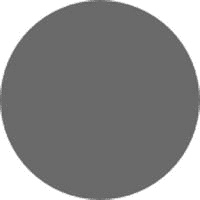
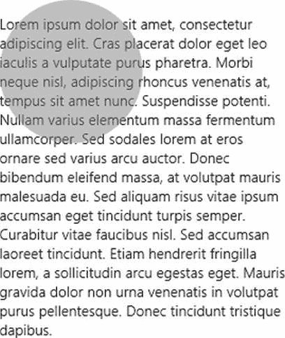
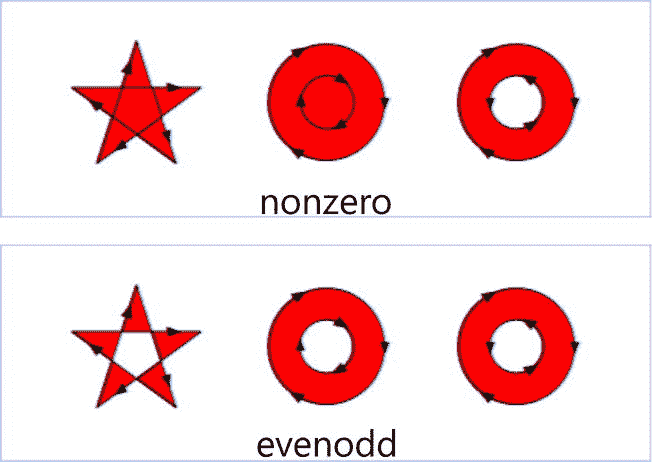
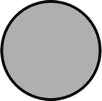
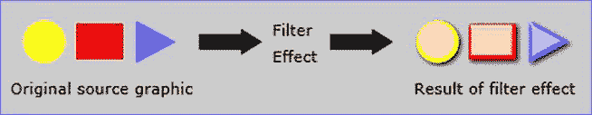
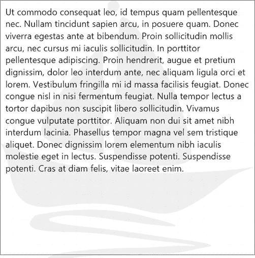
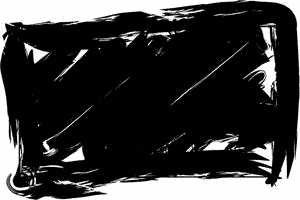
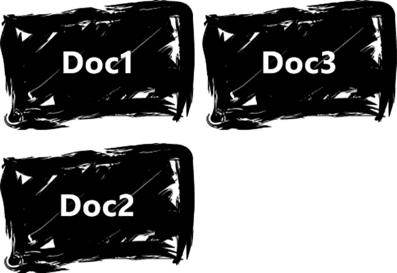

# 十二、附录 B：样式化 SVG

 **注意**太多的现代开发者忽略了矢量图形在图像生成和显示解决方案方面的强大功能。

SVG 格式介绍

可缩放矢量图形(SVG) 是用于定义基于矢量图形的的 XML 格式。像 HTML、CSS 和 JavaScript 一样，SVG 是 W3C 的众多项目之一。这也不是一个新项目——它从 1999 年就开始了。

尽管 SVG 很难获得关注，但我认为这有几个不同的原因。一个原因是矢量图形不像位图那样为人们所熟悉。很多人都知道像 Adobe Photoshop 这样的图形软件包，但是很少有人深入研究 Adobe Illustrator 或其他任何处理矢量图形的优秀工具。如果你是矢量图像编辑的新手，那么让我澄清一下。

首先，考虑位图图像如何存储为颜色值的二维矩阵。当正方形颜色值(像素)足够小时，人眼会被骗去看图像。另一方面，矢量图像的存储方式完全不同。在矢量插图中，我们使用的不是像素的集合，而是对象的集合，这些对象可能是熟悉的形状(如矩形和椭圆形)，也可能是由许多点和曲线值定义的复杂线条。反过来，这些对象由顶点(或其他基本形状描述符)组成。存储的是这些顶点或形状描述符，而不是像素矩阵。

当您比较位图和矢量图形时，SVG 有一些很大的优势。其中一些优势会影响图形的*创建(当你从零开始或者编辑一个现有图形的时候)，其他的会影响矢量图像*在一个正在运行的应用*中的使用。*

对于图形创建，SVG 的一些显著优势是:

*   以矢量格式创建和存储的插图**可缩放**。这意味着你存储多大的矢量插图并不重要，因为你总是可以从它生成你喜欢的位图。您可以使用相同的矢量图像来打印邮票或路边广告牌。
*   矢量插图更容易**修改**。组成合成图像的所有组件对象都单独存在，并且可以单独修改。你可以打开一个摩托车的矢量图像，只选择前灯，然后修改它的形状。对于位图图像来说，这一壮举要困难得多。
*   由于可以进行修改以匹配您自己项目的配色方案，因此使用基于矢量的库存图像通常要容易得多。

在跑步应用中使用矢量图像的其他一些显著优势包括:

*   对于几乎所有的图像，矢量版本将会小得多。描述*一个圆的形状并不需要像用像素明确描绘它那样多的信息。*
*   矢量插图，由描述的物体形状组成，更容易动画化。软件可以计算两点之间的中间步骤，颜色值的差异，甚至是将一个形状变形为另一个形状的数学模型。用同样的方式制作像素动画几乎是不可能的。
*   矢量插图可以根据用户碰巧使用的屏幕大小调整大小。Windows 8 会自动缩放应用中的所有资产。为了让你的位图图像看起来不错，你必须提供它的多个版本。但是，如果资源是矢量图像，您不需要这样做，并且可以确保它在任何大小下看起来都很棒。

我发现太多的开发者(甚至设计师！)仍然试图在 Photoshop 等位图编辑器中完成所有的图形工作。位图编辑器对于照片、绘画和许多其他事情来说是非常优秀的，但是在许多图形创建用例中，学习和切换到矢量包将极大地提高您的生产力。

我选择的矢量编辑器是 CorelDRAW。我已经使用 Corel 的矢量包很多年了，发现它的界面非常精确和直观。还有一些其他专业的矢量设计应用程序可供你研究，但是如果你正在寻找一个仍然提供很多功能的免费应用程序，试试 inkscape.org 的 InkScape。这个开源的矢量图形编辑器做的非常好。InkScape 没有自己的矢量文件格式，而是完全依赖于 SVG 格式。

矢量图像的另一个主要优点是可以制作动画。因为矢量图像是被描述的对象(而不仅仅是像素)，所以它们可以被动态地改变形状，并且因为矢量图像是由离散的元素组成的，所以那些元素可以被相当容易地移动。想象一下一只基于向量的狗的下颚移动来模拟说话。

HTML 中嵌入的 SVG

SVG 只是 XML，而 HTML 几乎是 XML，所以这两种语言很好地结合在一起，SVG 可以毫不费力地嵌入到 HTML 文档中。这两种语言都类似于 XML，这也是 CSS 能够自然地对它们进行样式和布局的原因。

过去，在 HTML 中嵌入 SVG 要困难得多，但是 HTML5 使它变得容易得多。HTML 不是严格意义上的 XML，但 SVG 是，所以嵌入式 SVG 需要清楚地定界并给定一个适当的名称空间。清单 B-1 显示了在 HTML 中放入一些 SVG 的样子。

***清单 B-1。***SVG 中带有填充属性的简单圆

```html
<!-- HTML snippet -->
<!DOCTYPE html>
<head>
<title>SVG</title>
<meta charset="utf-8" />
</head>
<body>
<h2>SVG in HTML5</h2>
<svg id="mySvg" height="200" FontName2">http://www.w3.org/2000/svg ">
    <circle id="graycircle" r="75" cx="75" cy="75" fill="gray" />
</svg>
</body>
</html>
```

清单 B-1 中的代码描述了你在图 B-1 中看到的半径为 75 像素的圆。它在一个具有与`http://www.w3.org/2000/svg`相等的`xmlns` (XML 名称空间)属性的`svg`标签中这样做。如果名称空间对你来说是新的，只需知道这实际上并没有链接到 w3.org 网站。它只是使用这个 URL 作为名称空间来惟一地将这个标记的内容标识为 SVG。



图 B-1 。灰色圆圈

SVG 的 CSS 属性

在清单 B-1 中，我们以一个灰色圆圈结束，因为我们使用了值为`gray`的`fill`属性。您可以在 SVG 元素上使用类似这样的各种属性来设计它们的样式，但是我不推荐这种方法。最好所有的样式都在 CSS 中完成，以便以后可以修改。清单 B-2 产生了与清单 B-1 相同的灰色圆圈，只是这次的灰色填充是在一个单独的样式表中使用 CSS 样式属性提供的，而不是使用 fill 属性。

***清单 B-2。*** 同样的灰色圆圈除了使用了 CSS 属性

```html
<!-- HTML snippet -->
<!DOCTYPE html>
<head>
<title>SVG</title>
<meta charset="utf-8" />
</head>
<body>
<h2>SVG in HTML5</h2>
<svg id="mySvg" height="200" FontName2">http://www.w3.org/2000/svg ">
    <circle id="graycircle" r="75" cx="75" cy="75" />
</svg>
</body>
</html>

/* CSS snippet */
#graycircle {
    fill: gray;
}
```

这是我将在本附录中介绍的所有内容的基础。我们将探索可以在 CSS 中指定的影响 SVG 图形的各种样式属性。您会发现这些属性中有许多是 HTML 共有的，但也有一些是 SVG 特有的。我将介绍一些更常见的属性。有关所有可用属性的更多信息，请访问`http://www.w3.org/TR/SVG11/propidx.html`,在那里您可以找到详尽的参考资料。

填充

在 HTML 中，使用`color`属性来指定像文本这样的东西的前景色，使用背景色来指定应该填充元素背景的颜色。在 SVG 中，使用`fill`属性来指定图形元素的颜色。你已经在清单 B-2 中看到了这一点，其中我们的圆圈*用灰色填充*。

除了指定元素应该填充的颜色，您还可以指定不透明度。在清单 B-3 中，我使用 CSS 网格将一个 SVG 元素堆叠在一段文本的顶部。添加一个设置为`0.5` (50%)的`fill-opacity`属性，然后通过 SVG 使段落可见，正如你在图 B-2 中清楚看到的。

***清单 B-3。*** 一个部分不透明的灰色圆圈，使其在一段文本上透明

```html
<!-- HTML snippet -->
<div id="parent">
    <p id="text">Lorem ipsum dolor sit amet . . . </p>
    <svg id="mySvg" height="200" FontName2">http://www.w3.org/2000/svg ">
        <circle id="graycircle" r="75" cx="75" cy="75" />
    </svg>
</div>

/* CSS snippet */
.lstb03 #parent {
    display:-ms-grid;
}

.lstb03 #text {
    width:300px;

}
.lstb03 #graycircle {
    fill: gray;
    fill-opacity: 0.5;
}
```



图 B-2 。一个部分透明的圆圈显示它下面的段落文本

fill-rule 属性确定当样式引擎应用填充以确定形状的哪些部分被填充时所使用的算法。这两个选项是`nonzero`和`evenodd`。你不需要知道这些算法是如何工作的细节。我总是两个都尝试，看看哪一个能给我想要的结果。图 B-3 中的图形是 W3C 如何说明这两种算法之间的一些差异的。



图 B-3 。填充闭合形状的两种不同方法

笔画

笔画是独立的线条(直线或曲线)或环绕形状的线条。您将使用描边属性来设定描边的颜色、宽度、不透明度等等。

您可能想知道的前两个与笔画相关的属性是`stroke`和`stroke-width`。属性`stroke`控制笔画的颜色，属性`stroke-width`控制粗细。清单 B-4 设置了这两个属性，在我们正在处理的灰色圆圈周围添加了一条黑线。

***清单 B-4。*** 给我们的灰色圆圈添加一个粗黑的轮廓

```html
<!-- HTML snippet -->
<svg id="mySvg" height="200" FontName2">http://www.w3.org/2000/svg ">
    <circle id="graycircle" r="75" cx="75" cy="75" />
</svg>
/* CSS snippet */
.lstb04 #graycircle {
    fill: gray;
    fill-opacity: 0.5;
    stroke:black;
    stroke-width: 4px;
}
```

在清单 B-4 的中描述的圆圈将有一个 4 像素的黑色边框，正如你在图 B-4 中看到的。



图 B-4 。stroke 属性在我们的元素周围添加一个轮廓

除了这两个简单的属性，还有很多与中风相关的属性。分别是:`stroke-dasharray`、`stroke-dashoffset`、`stroke-linecap`、`stroke-linejoin`、`stroke-miterlimit`、`stroke-opacity`。这些属性允许您控制 SVG 元素上线条的许多其他方面，例如线条的虚线/圆点，以及线条在拐角周围和线条末端的行为。

关于这些扩展属性和 SVG 元素笔画所有方面的更深入的信息可以在`http://www.w3.org/TR/SVG11/painting.html#StrokeProperties`的 W3.org 上找到。

标记

标记是出现在线条两端或中间的字形。标记最常用于在元素末端创建箭头，但实际上标记可用于显示任何自定义形状，并使其出现在任何顶点。

创建标记是一个两步过程。首先定义标记的形状，然后将该标记定义应用于任何 SVG 元素。你可以在`http://www.w3.org/TR/SVG11/painting.html#Markers`找到标记的详细解释。

过滤器

滤镜就像镜头一样，可以将许多不同的效果应用到 SVG 图形的某些区域。你可以在 SVG 圆形的内容中添加一个滤镜，比如对圆形及其内容应用高斯模糊。图 B-5 是一个过滤器运行的好例子(同样来自 W3C)。



图 B-5 。一个应用过滤器的 W3C 示例

当然，使用您最喜欢的图形应用程序也可以实现该过滤器提供的相同效果，但是在运行时应用该过滤器有巨大的优势。在运行时应用的过滤器可以被你的应用程序的逻辑作为目标，因此可以有条件地应用。例如，只有当用户将鼠标悬停在图像上时，滤镜才会生效。同样，这可以通过提供多个位图图像的传统方式来实现，但是这种技术肯定有一定的限制。图像您想要一个过滤器的效果是动画。实际上用传统的方法是不可能做到的。

滤镜效果分两个阶段添加到元素中。首先使用`filter` *元素*创建一个过滤器，然后使用`filter` *属性*将该过滤器应用于一个元素。

过滤器是相对复杂的，所以为了简洁起见，我就不深入讨论了。然而，我确实想提到它们的一般功能，并让您知道它们是可用的。如果您想深入了解滤波器的主题，请访问`http://www.w3.org/TR/SVG11/filters.html#FilterProperty`。

面具

蒙版是一种将透明层(也称为 alpha 通道)应用到任何 SVG 元素的方法，方法是提供一个显式蒙版，然后应用它。面具也可能是一个很长的话题，但是你至少应该知道它们是什么。

关于应用程序中相对冗长的属性(如遮罩、标记和过滤器)的快速说明:试图手动定义这些属性是疯狂的，因为记住语法并花时间键入它们是不允许的。通常，当您使用 Adobe Illustrator、CorelDRAW 或 InkScape 等矢量编辑图形软件时，这些会自动应用。

你可以在`http://www.w3.org/TR/SVG/masking.html`找到更多关于面具的信息。

指针事件

正如你已经看到的，SVG 形状有一个内部(?? 填充 ??)和一个外部(?? 描边 ??)。填充或描边中的一个或两个可能具有值`none`，因此将呈现不可见。这意味着当用户点击你的元素时需要做出一个有趣的选择。如果您创建了一个没有填充的圆，并在另一个元素的顶部结束，您可能希望也可能不希望该圆捕获单击事件。对于笔画来说也是如此。

在这种情况下，`pointer-events`属性是您指定行为的机会。默认情况下，这个值是`visiblePainted`，这是一个非常直观的选择，所以您可能不需要经常更改这个属性。

`pointer-events`属性的可用值有:`visiblePainted`、`visibleFill`、`visibleStroke`、`visible`、`painted`、`fill`、`stroke`、`all`和`none`。设置了`visiblePainted`(默认)后，只有当元素被填充且可见时，元素才会捕捉填充上的点击(和其他指针事件),只有当笔画被设置且可见时，元素才会捕捉笔画上的点击。设置了`visibleFill`之后，如果你的元素是可见的(即使你的元素没有被填充),那么这个元素将会在填充时捕获点击。).设置了`visibleStroke`后，如果元素可见，它将捕获笔画上的点击(即使您没有设置笔画)，但它不会捕获填充上的点击。使用`painted`、`fill`和`stroke`值具有相似的功能，除了它们忽略元素是否实际可见。`all`值将导致总是点击——即使您没有设置填充或描边，并且两者都设置为不可见！最后，`none`值不会传递给指针事件。

如果将编程逻辑添加到像 SVG 这样的动态的、基于向量的图形语言中的想法让你兴奋，那么花些时间研究一下`http://www.w3.org/TR/SVG/interact.html#PointerEventsProperty`的指针事件。

能见度

就像 HTML 元素一样，SVG 元素的可见性可以被操纵来显示或隐藏单个元素，并且就像 HTML 一样，`visible`属性的值是`visible`、`hidden`和`collapse`。然而，`collapse`值的行为就像`hidden`一样，它隐藏了元素。`visible`值显然允许元素显示。

这就是我在这篇关于在 HTML 应用中使用 CSS for SVG 的简介中所要介绍的全部内容，但我想看看这些概念在 Windows 8 中的一些实际应用。

运用你所学的知识

让我们在几个例子中实现一些我们已经学到的 SVG CSS 概念。我们首先来看看如何在应用程序的背景中使用 SVG 图像作为带水印的图像。接下来，我们将创建一些自定义的 SVG 图像，显示在 ListView 的主项目标题后面。最后，我们将使用 JavaScript 动态构建一个时间线图形来生成 SVG。

带有 SVG 水印的背景图像

这里的目标是找到一个好的帆船的 SVG 图像，然后将它放置在我们的应用程序的背景中，光线要足够亮，这样它就不会阻碍出现在它上面的视觉元素和文本。

当我寻找好的矢量图像时，我通常从 office.microsoft.com 开始。如果你进行图像搜索，你可以指定你正在寻找的*插图*并且你希望它们的大小是*可调整的*，这将指示矢量图像应该被返回。这些图像通常是另一种矢量图像格式—WMF (Windows 图元文件)。要将图像保存为 SVG，您只需从网站上复制图像，粘贴到您的软件包中，然后将其保存为 SVG 文件。

我找到了一个我想使用的帆船图像(图 B-6 )，将其保存为 SVG，并且清单 B-5 显示了生成的 SVG 代码。我特意将 SVG 文件的全部内容留在清单中，这样您就可以了解描述这个简单的帆船需要多少 SVG 代码。


图 B-6 。简单的帆船图像

作为比较，SVG 格式的帆船在未压缩时占用 7098 字节的磁盘空间，在压缩时占用 3505 字节的磁盘空间。如果我们愿意，这个 7kb 的文件可以用来创建一艘 75 英尺高的帆船。同一艘帆船以 768 像素的高度呈现为未压缩的全色(尽管我意识到这不是必需的)位图，占用了 1，983，798 字节。以无损格式(PNG)压缩位图会将其压缩到 35，410 字节，但您肯定会看到矢量格式比位图有更大的优势。

***清单 B-5。*** 组成一艘简单帆船的整个 SVG 文件

```html
<?xml version="1.0" encoding="UTF-8"?>
<!DOCTYPE svg PUBLIC "-//W3C//DTD SVG 1.1//EN" " http://www.w3.org/Graphics/SVG/1.1/DTD/svg11.dtd ">
<!-- Creator: CorelDRAW X6 -->
<svg FontName2">http://www.w3.org/2000/svg " xml:space="preserve" width="509px" height="571px"
version="1.1" style="shape-rendering:geometricPrecision;
text-rendering:geometricPrecision; image-rendering:optimizeQuality; fill-rule:evenodd; clip-rule:evenodd"
viewBox="0 0 50900 57045"
 xmlns:xlink=" http://www.w3.org/1999/xlink ">
 <defs>
  <style type="text/css">
   <![CDATA[
    .fil0 {fill:black}
   ]]>
  </style>
 </defs>
 <g id="Layer_x0020_1">
  <metadata id="CorelCorpID_0Corel-Layer"/>
  <g id="_695569408">
   <polygon class="fil0" points="22632,2398 22872,2368 23112,2308 23292,2188 23472,2038 23621,1859
23741,1679 23801,1439 23831,1199 23801,959 23741,719 23621,540 23472,360 23292,210 23112, 90
22872,30 22632,0 22392,30 22153,90 21973,210 21793,360 21643,540 21523,719 21463,959 21433,1199
21463,1439 21523,1679 21643,1859 21793,2038 21973,2188 22153,2308 22392,2368 "/>
   <polygon class="fil0" points="23741,5845 23681,6865 23561,9562 23352,13399 23142,17896
22932,22482 22782,26649 22722,29857 22752,31595 22932,32015 23382,32375 24011,32704 24850,33004
25840,33244 26919,33484 28118,33634 29347,33783 30606,33843 31865,33903 33094,33873 34263,33813
35312,33694 36212,33514 36961,33304 37531,33004 37890,32554 38100,31835 38160,30906 38070,29827
37890,28568 37590,27189 37201,25720 36781,24191 36271,22662 35762,21163 35192,19665 34653,18286
34113,16997 33604,15858 33154,14898 32734,14149 32315,13399 31775,12500 31146,11481 30456,10342
29707,9203 28957,8034 28178,6895 27398,5875 26649,4976 25960,4227 25300,3717 24761,3447 24311,3507
23981,3867 23771,4646 "/>
   <polygon class="fil0" points="8843,28178 9652,28687 10522,29167 11451,29587 12440,29946
13429,30246 14419,30516 15378,30726 16307,30936 17206,31086 18046,31205 18795,31295 19425,31385
19964,31415 20384,31445 20624,31475 20714,31475 20504,8933 20324,9113 19844,9652 19065,10462
18106,11511 16967,12800 15738,14239 14449,15798 13160,17446 11901,19125 10732,20774 9742,22392
8933,23921 8393,25300 8184,26499 8303,27458 "/>
   <polygon class="fil0" points="29017,35372 27968,35312 26949,35282 25960,35192 24970,35132
24041,35042 23112,34953 22213,34833 21313,34743 20414,34623 19515,34503 18615,34383 17686,34233
16757,34113 15828,33963 14838,33843 13849,33694 12860,33544 11811,33304 10702,33034 9562,32704
8393,32345 7254,31985 6115,31595 5036,31205 3987,30816 3058,30456 2188,30126 1439,29827 839,29587
390,29377 90,29257 0,29227 570,30186 989,31265 1319,32375 1589,33544 1829,34743 2068,35912
2338,37051 2668,38130 3088,39149 3627,40079 4347,40858 5216,41517 6325,41997 7674,42267 9323,42357
11271,42177 12740,41997 14149,41847 15468,41727 16727,41667 17896,41637 19035,41637 20084,41667
21073,41727 22033,41817 22932,41937 23771,42057 24581,42177 25330,42327 26050,42477 26739,42627
27398,42776 28028,42926 28628,43076 29197,43226 29767,43346 30306,43466 30846,43556 31385,43646
31895,43676 32435,43706 32944,43706 33484,43676 34023,43586 34563,43466 35132,43316 35702,43106
36301,42866 36931,42567 37560,42237 38190,41877 38819,41517 39479,41098 40108,40708 40738,40288
41338,39869 41907,39449 42477,39029 43016,38610 43496,38220 43945,37860 44365,37531 44755,37231
45055,36961 45384,36691 45744,36421 46104,36182 46493,35942 46853,35732 47243,35522 47633,35342
48022,35162 48412,35012 48802,34863 49191,34713 49551,34593 49911,34443 50270,34323 50600,34203
50900,34083 50360,34173 49791,34263 49191,34353 48562,34443 47872,34533 47183,34623 46434,34683
45684,34743 44935,34833 44125,34893 43346,34953 42537,34983 41727,35042 40888,35102 40079,35132
39269,35162 38460,35222 37650,35252 36841,35282 36092,35312 35312,35312 34593,35342 33873,35372
33184,35372 32524,35372 31895,35402 31295,35402 30756,35402 30246,35402 29797,35402 29377,35372 "/>
   <polygon class="fil0" points="32464,48442 31745,48322 31056,48232 30336,48112 29617,47992
28867,47902 28088,47782 27219,47663 26319,47513 25330,47393 24281,47243 23112,47093 21823,46943
20444,46763 18915,46583 17266,46404 15438,46194 13729,45984 12350,45774 11301,45564 10552,45384
10042,45204 9802,45025 9742,44845 9862,44695 10132,44575 10522,44425 11031,44335 11571,44245
12170,44155 12770,44095 13340,44065 13879,44065 14359,44065 14838,44065 15318,44095 15768,44095
16277,44125 16817,44185 17386,44245 18016,44305 18735,44365 19545,44485 20444,44575 21433,44725
22572,44875 23831,45055 25240,45264 26829,45474 28418,45714 29887,45894 31205,46044 32345,46164
33304,46254 34053,46314 34623,46314 34983,46254 35072,46164 34953,46044 34563,45834 33903,45594
32944,45294 31685,44965 30126,44545 28238,44065 27219,43826 26199,43616 25180,43436 24161,43286
23172,43166 22213,43076 21223,42986 20294,42926 19365,42896 18436,42896 17566,42866 16697,42896
15858,42926 15048,42956 14239,43016 13489,43076 12770,43136 12081,43196 11421,43286 10821,43376
10252,43436 9712,43526 9203,43616 8753,43676 8363,43766 8004,43826 7704,43886 7434,43945 7254,44005
7104,44035 7014,44065 6985,44065 6355,44755 5995,45324 5905,45834 6055,46224 6415,46553 6955,46823
7674,47003 8543,47153 9503,47273 10582,47333 11751,47393 12920,47423 14149,47453 15348,47483
16547,47543 17686,47603 18705,47693 19605,47752 20384,47842 21073,47902 21703,47992 22302,48052
22932,48142 23561,48232 24251,48352 25030,48472 25900,48592 26949,48712 28148,48862 29527,49041
31146,49221 33004,49431 34803,49611 36242,49791 37321,49911 38100,50031 38610,50121 38879,50181
38939,50241 38819,50270 38550,50300 38190,50300 37770,50300 37321,50300 36841,50300 36421,50270
36062,50270 35822,50270 35582,50270 35282,50300 34923,50300 34473,50330 33963,50360 33424,50390
32824,50450 32195,50480 31505,50510 30816,50570 30126,50600 29407,50630 28687,50660 27968,50660
27249,50690 26559,50690 25840,50690 25090,50720 24311,50720 23502,50750 22632,50810 21793,50840
20924,50900 20054,50960 19185,51020 18316,51080 17476,51140 16637,51230 15858,51290 15108,51380
14389,51440 13729,51530 13130,51619 12590,51679 12081,51769 11631,51859 11211,51949 10851,52039
10522,52159 10192,52309 9892,52459 9622,52639 9383,52848 9113,53088 8873,53358 8633,53628 8393,53988
8124,54347 7944,54737 7914,55097 8004,55426 8214,55726 8513,55996 8873,56236 9263,56446 9682,56626
10102,56775 10492,56895 10821,56985 11061,57045 11241,57045 11301,57045 11181,56985 10941,56895
10282,56685 9712,56446 9293,56146 9083,55846 9083,55456 9353,55037 9982,54527 10941,53928
11541,53628 12140,53388 12800,53148 13489,52968 14209,52789 15018,52639 15858,52549 16787,52429
17806,52369 18885,52309 20084,52249 21403,52219 22812,52189 24341,52159 25990,52129 27788,52099
29557,52069 31086,52009 32405,51949 33574,51859 34563,51799 35432,51679 36152,51589 36811,51470
37381,51350 37920,51230 38400,51110 38909,50990 39389,50870 39929,50750 40528,50660 41188,50540
41757,50420 42057,50330 42117,50181 41967,50061 41607,49941 41098,49791 40438,49641 39659,49491
38819,49371 37890,49221 36931,49071 35942,48922 35012,48802 34083,48682 33214,48562 "/>
  </g>
 </g>
</svg>
```

现在是时候让 SVG 文件包含在一些 HTML 后面了。在我们的 HTML 中，实际上有几种显示 SVG 的方法。

*   我们实际上可以将清单 B-5 中的 SVG 代码粘贴到我们的页面中，或者使用 JavaScript 将它附加到我们的 DOM 中。
*   `img`标签直接支持 SVG 文件，所以我们可以使用类似于`.`的东西
*   我们还可以设置希望它显示在后面的元素的`background-image`属性。

在这种情况下，没有理由不使用`img`标签或设置`background-image`属性。这更容易，也更符合我们的情况。如果要对 SVG 进行操作、设计样式或制作动画，我们需要将 SVG 代码添加到 DOM 中(手动或使用 JavaScript)。在这种情况下，我们不是，所以我们将保持简单。清单 B-6 将帆船图形放在主`div`元素后面，将它们放入一个网格中。你可以在图 B-7 中看到结果。

***清单 B-6。*** 在一段文字后面添加帆船水印

```html
<!-- HTML snippet -->
<div class="grid">
    
    <div id="main">
        Ut commodo consequat leo . . .
    </div>
</div>

/* CSS snippet */
.lstb06 #sailboat {
    opacity:0.05;
}

.lstb06 .grid {
    display:-ms-grid;
}

.lstb06 #main {
    border:solid 1px gray;
    font-size:large;
    width:500px;
    height:500px;
    padding:10px;
}
```



图 B-7 。一艘几乎透明的黑色帆船在段落文本后面显得非常暗淡

集线器上精美的 SVG 磁贴

许多 Windows 8 应用程序使用内置的 ListView 控件来显示项目网格。典型的 Windows 8 网格项目是矩形的，看起来像瓷砖。你不会拘泥于这种外观，尽管它实现的极简主义和效率是一个应该考虑的强大设计功能。

让我们假设您正在创建一个绘画应用程序，您的网格的一部分显示了所有正在绘制文档的用户，您希望这些项目以一种形状来表示，这种形状看起来大致像一个矩形，只是由几个笔画组成。在这种情况下，我们仍然希望有瓷砖——除了有点花哨。在这种情况下，您可以渲染出一个位图并将其放在每个项目的后面，但是您会失去我提到的 SVG 的优势。因此，让我们使用 SVG，让我们自己创建图形。

我跳到 CorelDRAW 上，很快找到了一个笔刷，让我可以创建图 B-8 中的图形。



图 B-8 。一个使用 CorelDRAW 生成的图形，我们希望用于我们的中心瓷砖

CorelDRAW 可以将图形保存为 SVG。我不会列出这段代码，因为它相当长——不过仍然只有大约 125kb 未压缩。

我们的下一步是在 ListView 的图块后面获得图形。清单 B-7 应该可以搞定。

***清单 B-7。*** 一个带有 CSS 的 ListView，将笔画图形放在每个项目的后面

```html
<!-- HTML snippet -->
<section aria-label="Main content" role="main">
    <div id="listview" data-win-control="WinJS.UI.ListView"></div>
</section>

<!--Templates-->
<div id="itemtemplate" data-win-control="WinJS.Binding.Template">
    <h2 data-win-bind="innerText:name"></h2>
</div>

/* CSS snippet */
.lstb07 #listview .win-item {
    display:-ms-grid;
    -ms-grid-columns:1fr;
    -ms-grid-rows:1fr;
    width:250px;
    height:174px;
    background: url(paint.svg) no-repeat;
    background-size:250px auto;
}

    .lstb07 #listview .win-item h2 {
        -ms-grid-column-align:center;
        -ms-grid-row-align:center;
        color:white;
        font-family:'Segoe WP';
        font-size:40px;
        font-weight:bold;
        position:relative;
        top:-10px;
    }

// JavaScript snippet
var list = new WinJS.Binding.List(
    [{ name: "Doc1" }, { name: "Doc2" }, { name: "Doc3" }]
);
var listview = element.querySelector("#listview").winControl;
listview.itemDataSource = list.dataSource;
listview.itemTemplate = element.querySelector("#itemtemplate");
listview.onloadingstatechanged = function (e) { debugger; };
```

所有这些代码的结果是一个 ListView，就像你在图 B-9 中看到的那样，带有定制的项目形状和覆盖的文本。



图 B-9 。生成的笔画项目赋予项目一些特征

使用 SVG 构建的时间线图形

前两个应用程序使用了包含 SVG 的简单方法——即使用`img`标签和`background-image` CSS 属性，并简单地引用一个 SVG 文件。现在让我们采取一个稍微困难一点的方法，让我们更好地控制我们的矢量图像。

假设我们想要创建一个简单的时间线图形，其中包含一个代表某个时间长度的灰色条，然后是每个时间点的白点。为了实现这一点，我们将创建 SVG 图像，然后查看它是如何组成的。

我在 CorelDRAW 重新开始。这次我创建了一个非常简单的灰色时间线，用白点标记时间点。同样，这个特殊的图形非常简单，我当然可以通过在记事本中手动编写 SVG 来编写它，但是在现实生活中，您可能会使用更复杂的图形。我创建的简单时间线图形可以在图 B-10 中看到。


图 B-10 。我们希望用 JavaScript 动态构建的时间线

然后我生成了 SVG，对它进行了一些调整，然后使用记事本查看它(清单 B-8 )。

***清单 B-8。***CorelDRAW 为图 B-10 中的时间轴图形生成的 SVG 代码。

```html
<svg FontName2">http://www.w3.org/2000/svg " width="1000px" height="200px" >
 <defs>
  <style type="text/css">
   <![CDATA[
    .str0 {stroke:black;stroke-width:2}
    .fil0 {fill:gray}
    .fil1 {fill:white}
   ]]>
  </style>
 </defs>
 <g>
  <rect class="fil0" x="30" y="90" width="940" height="20"/>
  <circle class="fil1 str0" cx="30" cy="100" r="10"/>
  <circle class="fil1 str0" cx="70" cy="100" r="10"/>
  <circle class="fil1 str0" cx="400" cy="100" r="10"/>
  <circle class="fil1 str0" cx="970" cy="100" r="10"/>
 </g>
</svg>
```

元素本身在`g`元素内部。这些元素的样式在嵌入的样式表中。我们将使用本文档告诉我们的关于如何创建时间线图形的内容，并使用 JavaScript 自己创建它。这将给我们以编程方式放置点的灵活性。我们还将提取 CSS 样式，将它们放入文档的样式表中，并为它们赋予更有意义的类名。很高兴我们所有的风格都在一个地方。就像 HTML 一样，我们希望 SVG 是图形结构的定义，让样式表处理颜色等。清单 B-9 和图 B-11 展示了如何动态创建这个时间线。

***清单 B-9。*** 构建时间轴的 HTML、CSS 和 JavaScript

```html
<!-- HTML snippet -->
<div id="container"></div>

/* CSS snippet */
.lstb09 .circle {
    stroke:black;
    stroke-width:2;
    fill:white;
}

.lstb09 .line {
    fill:gray;
}

// JavaScript snippet
var points = [0,1,3,7,10];
var container = element.querySelector("#container");

//transform the points and generate SVG
var result;
points.forEach(function (p) {
    result += format("    <circle class='circle' cx='{0}' cy='100' r='10'/>", (p * 94) + 30);
});

//add resulting SVG to the DOM
container.innerHTML = format(
    "<svg xmlns=' http://www.w3.org/2000/svg ' width='1000px' height='200px' >" +
    "  <g>" +
    "    <rect class='line' x='30' y='90' width='940' height='20'/>" +
    "    {0}" +
    "  </g>" +
    "</svg>", result);
```


图 B-11 产生的时间线正是我们所寻找的，现在可以很容易地改变这些值

将它转换成 WinJS 自定义控件是一个好主意，这样您就可以使用`<div data-win-control="MyApp.Controls.Timeline"></div>`在代码中的任何地方创建它们。

顺便说一句，如果你想更深入地使用 JavaScript 来生成和操作 SVG 图形，在`http://www.farinspace.com/top-svg-javascript-libraries-worth-looking-at/`有一个很棒的帖子，它将向你介绍 11 个 JavaScript 库，这些库将对你有所帮助。

您已经了解了令人兴奋的 SVG 空间，并看到了它如何增强您的 Windows 8 应用程序。我们研究了许多影响 SVG 元素的 CSS 样式属性(尽管肯定不是全部),并在 Windows 8 应用中浏览了三个强大的 SVG 应用。

我希望你在阅读这篇文章时学到了一些东西，但更重要的是，我希望你受到启发，去尝试它，研究你不知道的领域，这样你就可以掌握将 SVG 编织到你的应用程序中，并使用 CSS 对它进行样式化。