# 六、搜索 Web 部件的内容和显示模板

自从 SharePoint 出现以来，搜索一直在它的使用中扮演着重要的角色。无论是网站搜索、企业搜索还是自定义解决方案，SharePoint 的主要优势之一就是能够轻松找到所需内容。在 SharePoint 中简化搜索的方法之一是通过内容搜索 Web 部件。这可以很容易地放在页面上，并配置为向用户返回特定的结果。这是一个久经考验的 web 部件，已经存在很长时间了。在最新版本的 SharePoint 中，内容搜索 Web 部件利用了结果源和显示模板形式的新功能。

结果源允许您创建特定的搜索标准，以快速定位您正在寻找的内容。显示模板允许您根据您的业务需求设计和呈现这些搜索结果。这项新功能为开发人员在 SharePoint 中创建丰富的自定义解决方案提供了另一种途径。在这一章中，我们将看看这些领域，并创建一些自定义搜索解决方案。

## 添加文档

在开始使用 SharePoint 中的搜索功能构建解决方案之前，您需要实际搜索一些文档。如果您正在使用现有的 SharePoint 环境，您可能已经有了一些要搜索的文档。如果您已经为这本书设置了环境，您需要上传一些文档来执行一些搜索。在本例中，您可以搜索各种文档类型，包括 Word、Excel 和 PDF。图 6-1 显示了文档库中的一些样本文件。

图 6-1。

Excel, PDF, and Word documents in the Documents library Note

本例中使用的文档可以从一个网站下载。访问 Apress ( [`www.apress.com`](http://www.apress.com/) )并搜索这本书的书名来定位文档和源代码。

我使用了开箱即用的“文档”文档库，它是在我创建名为 Apress 的团队站点时创建的。无论您将文档存储在哪里，这里的主要要点是将一些文件上传到 SharePoint，以便您可以搜索它们。现在，一些文件已经上传并将最终被编入索引，您可以创建一个定制的结果源来方便搜索。

## 结果来源

在 SharePoint 2010 中，您有了自定义搜索范围的概念。它们允许您将搜索结果限制为特定内容，从而为您的最终用户提供更有针对性的搜索，而无需他们知道如何设计复杂的搜索查询。在 SharePoint 2013 中，您可以使用自定义结果源完成完全相同的事情。

在 SharePoint 2013 中执行搜索时，系统会将查询与结果源进行匹配以提供结果。结果源是指定以下内容的定义:

*   协议——这可以是本地搜索服务索引、远程 SharePoint 安装、Exchange，甚至是另一个使用 OpenSearch 协议的搜索引擎。
*   源 URL -如果您使用的是本地 SharePoint 以外的协议，您需要为返回搜索结果的服务提供一个 URL。
*   类型-使用本地或远程 SharePoint 时，您可以指定 SharePoint 搜索或人员搜索。
*   查询转换——使用查询转换，您可以使用 KQL 属性限制来缩小给定搜索的结果范围。
*   凭据-您可以指定用于搜索的凭据。

SharePoint 附带了许多预配置的结果源供您使用，包括对话、文档和图片等。还可以在整个 SharePoint 中的不同级别创建自定义结果源，创建结果源的位置决定了您需要的权限级别。下面列出了可以创建结果源的级别以及创建结果源时所需的权限:

*   网站集-您必须是网站集管理员，并且网站集中的任何网站都可以使用结果源。
*   站点-您必须是该站点所有者组的成员，并且结果源只能由该站点使用。

您还可以在搜索服务应用级别或 SharePoint 管理中心为 Office 365 指定结果源，结果源可用于任何使用搜索服务应用的网站集。本书不会涉及这一层，但是，在这一层创建结果源的步骤也是完全相同的。

创建自定义结果源时，您需要决定的第一件事是创建它的级别。这取决于您打算如何使用源代码；例如，如果要突出显示特定站点中的项目，那么站点级别就有意义。但是，如果您想要一个更全面的结果源，您可能希望在网站集级别创建它。两者的步骤完全相同。如果您计划在网站集或网站级别创建新的结果源，只需导航到“网站设置”页面，选择“网站级别”的“搜索”标题下的“结果源”,或“网站集级别”的“网站集管理”标题下的“搜索结果源”。图 6-2 显示了网站集的网站设置页面。

图 6-2。

Accessing Result Sources from the Site Collection site settings page

正如您在网站集级别看到的，您可以为整个网站集创建结果源，也可以只为根级别的网站创建结果源。对于这个例子，我们将导航到其他代码样本所在的 Apress 子站点，并仅为这个站点创建一个新的结果源，如图 6-3 所示。

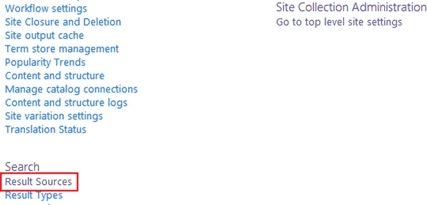

图 6-3。

Accessing Result Sources from the Site’s site settings page

单击“结果源”链接会将您带到“管理结果源”页面。此页面显示所有已设置的当前结果来源。它还包括 SharePoint 附带的所有现成的结果源。您不能更改任何现成的结果源；但是，您可以查看它们的设置。要开始创建自定义结果源，请单击页面顶部的新结果源链接，如图 6-4 所示。

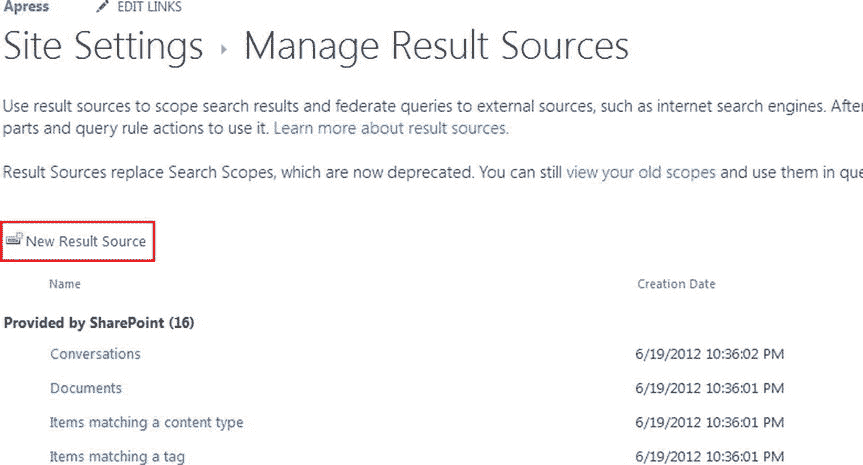

图 6-4。

Manage Result Sources page in site settings

一旦进入 Add Result Source 页面，首先需要提供名称和描述。描述是可选的，但是您应该为其他用户提供一个描述。图 6-5 显示了新结果源所需的初始属性。

图 6-5。

Providing a name and description for the new result source

在本例中，您将创建一个结果源，该结果源将只返回网站文档库中的 PDF 文档。为此，我们将提供标题 Custom PDF Source 和适当的描述，以便用户确切地知道使用这个结果源时会发生什么。接下来，您需要提供一个协议和类型；在这种情况下，协议将是本地 SharePoint，类型将是 SharePoint 搜索结果，如图 6-6 所示。根据您的需要，您可能需要选择不同的协议和类型，并提供附加信息。在这种情况下，页面将更新以显示所选选项所需的附加字段。

图 6-6。

Protocol and Type options for the new result source

接下来，您需要提供一个查询转换，它将实际限制搜索结果。这是使用关键字查询语言完成的，关键字查询语言是一组搜索选项、属性限制和操作符。查询转换将始终以标记{searchTerms}开始；这将被替换为用户输入的任何搜索词。之后，您可以提供任何有效的属性限制和/或操作符。我们稍后将对此进行更深入的探讨。现在，您可以在文本框中看到{searchTerms}标记，以及启动查询生成器按钮，如图 6-7 所示。

图 6-7。

Query Transform options and the Launch Query Builder option

最后，您可以指定用于该结果源的凭据。您可以指定默认身份验证，以便在执行搜索时使用用户身份验证。这通常是期望的结果。认证类型如图 6-8 所示。

图 6-8。

Credentials Information for the result source

单击保存创建新的结果源。您将返回到管理结果源页面，其中将列出自定义结果源，如图 6-9 所示。新的结果源列在页面顶部的标题“为此网站定义”下。

图 6-9。

The new result source in the Manage Result Sources page

由于我们没有在查询转换部分提供任何细节，这个新的结果源将简单地接受用户的输入并执行搜索。我们绝对不需要创造一个新的结果来达到那个结果。让我们更新它，使它只从 Documents 文件夹返回 pdf。打开结果源快捷菜单，点击编辑，如图 6-10 所示。

图 6-10。

Editing the result source we just created

编辑结果源会将您带到“编辑结果源”页面，您将看到刚才输入的所有先前设置。向下滚动到查询转换部分，并单击启动查询构建器按钮，如图 6-11 所示。

图 6-11。

Query Transform section with the Launch Query Builder button

将打开“构建查询模式”窗口，这将帮助您构建查询转换。通过访问提供的下拉列表，您可以在此窗口中使用许多现成的过滤器。您也可以在这里应用排序和测试您的查询。您也可以选择只输入您的查询，如图 6-12 所示。

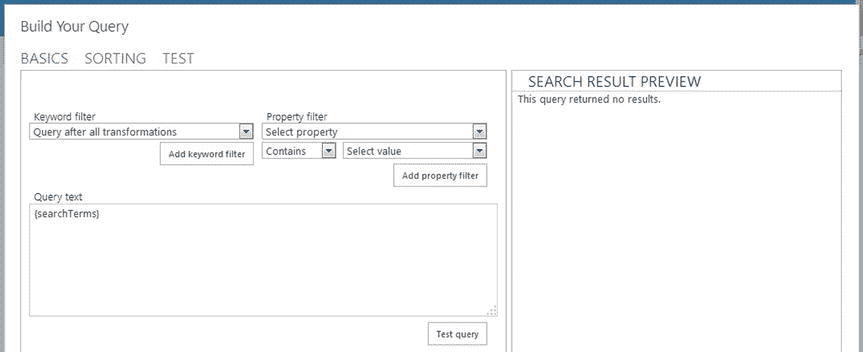

图 6-12。

The Build Your Query modal window

查询是使用关键字查询语言(简称 KQL)在 SharePoint 中构建的。使用 KQL，您可以指定传递给 SharePoint 搜索服务的搜索词或属性限制。KQL 查询并不复杂，由以下一个或多个元素组成:

*   自由文本关键字——可以是单词或短语，比如白皮书、事件、Bob Smith 等等。
*   属性限制——这些可以是文件类型、作者、文件名等等。

属性限制顾名思义就是限制搜索结果。例如，您可以添加一个文件类型限制器，并通过使用`FileType:docx`只返回 Word 文件来只返回特定的文档类型。有许多可用的属性限制，使得 KQL 在你的搜索需求中非常健壮。

Note

关键字查询语言虽然易于实现，但具有非常丰富和深刻的语法。这对于精心设计完全满足您需求的查询来说是很棒的，但是对于本书来说这是一个太大的主题。我们将简单地描述一下你能完成的事情。有关 KQL、财产限制等详细信息，请访问 [`http://msdn.microsoft.com/en-us/library/office/ee558911(v=office.15).aspx`](http://msdn.microsoft.com/en-us/library/office/ee558911(v=office.15).aspx) 。

KQL 查询必须包含一个自由文本关键字，或者一个属性限制，或者两者的组合才有效。首先，我们将删除查询的{searchTerms}部分。我们不会使用它，因为我们的内容搜索 Web 部件将简单地返回结果，而不需要用户的任何交互。接下来，我们将使用`path`属性添加一个属性限制:

`path:"``https://brandonatkinson.sharepoint.com/apress/Shared Documents`

`path`属性指示查询，我们只需要来自指定路径及其下的任何内容的结果，包括文件夹、子网站等等。路径必须是完全限定的 URL，如果它包含任何空格，URL 必须用引号括起来。在我的环境中，我使用现成的文档文件夹，它实际上是共享文档文件夹。您始终可以通过在导航面板中单击文件夹的实际名称并在浏览器的地址栏中检查 URL 来仔细检查该文件夹的实际名称。将该属性限制放置在查询文本文本框中并点击测试查询按钮将产生如图 6-13 所示的结果。

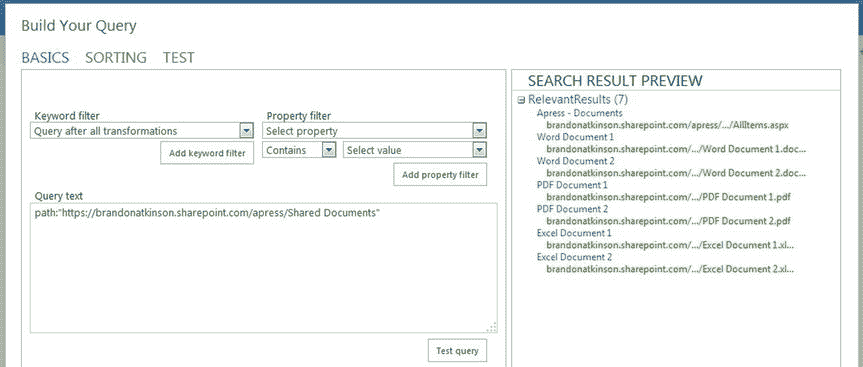

图 6-13。

Path property restriction returning only files from the specific document library

属性限制将搜索结果限制在文档库中，只有七个文档被返回。我们现在可以使用`FileType`属性再次限制它:

`FileType:pdf`

该属性指示查询只返回扩展名为`.pdf`的文件。将此添加到查询中并单击测试查询按钮将进一步限制结果，如图 6-14 所示。

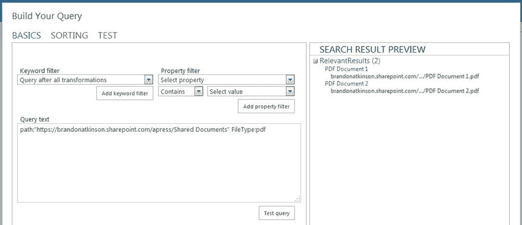

图 6-14。

FileType property restriction limiting results to only PDF files

现在只有两个文件被返回，因为我们在文档库中只有两个 PDF 文件。虽然这是一个非常简单的例子，但是它应该说明了 KQL 在构造查询时所提供的强大功能。由于只有两个属性限制，我们已经能够很好地限制搜索结果。您可以想象，如果您要求只显示位于特定站点的 Office 文件，不管它们在哪个文件夹中，您的 KQL 查询将类似于以下内容:

`path:"``http://SERVER/SITE`

正如您所看到的，您可以组合相同类型的属性限制器来制作您所需要的东西。KQL 非常灵活；找到符合您需求的搜索词和属性限制的正确组合应该没有问题。

既然我们已经按照我们想要的方式设置了查询，那么在 Build Your Query 窗口中单击 OK。然后在“编辑结果源”页面上单击保存。自定义结果源现在已经设置好，可以使用了。接下来，让我们在页面上放置一个内容搜索 Web 部件，并使用结果源。

## 内容搜索 Web 部件

内容搜索 Web 部件是 SharePoint 2013 的另一个新功能。当内容搜索 Web 部件放置在页面上时，它会在用户加载页面时自动发出搜索查询。根据 web 部件的配置方式，用户很可能甚至不知道正在进行搜索。这使得内容搜索 Web 部件成为创建基于搜索的自定义解决方案的强大方法。这是一个易于使用和配置的 web 部件，正如您在上一节中看到的，根据您的需要设置特定的搜索查询非常容易。

Note

内容搜索 Web 部件是搜索 Web 部件功能的一部分。这仅适用于 SharePoint Online E3 和 E4 计划，以及企业内部许可。如果没有这些功能，您会发现内容搜索 web 部件不可用于向页面添加新的 Web 部件。您可以在 [`http://technet.microsoft.com/en-us/library/sharepoint-online-service-description.aspx`](http://technet.microsoft.com/en-us/library/sharepoint-online-service-description.aspx) 找到有关 SharePoint Online 计划可用功能的更多信息。

首先，导航到放置本书的其他 web 部件的页面，然后从前面的章节中删除任何现有的 web 部件。在页面仍处于编辑模式的情况下，通过从功能区中选择“插入”选项卡来放置新的内容搜索 Web 部件。从类别部分选择内容汇总，然后选择内容搜索，如图 6-15 所示。

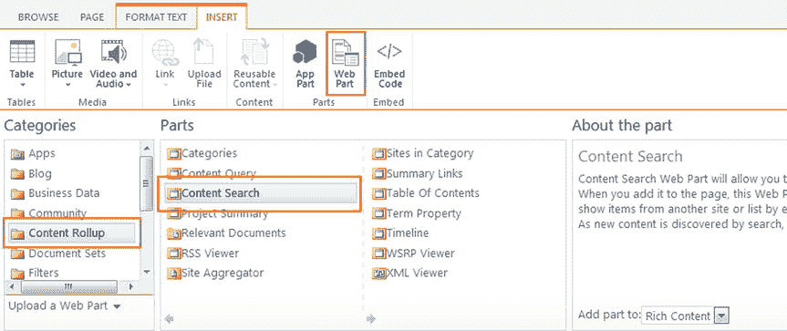

图 6-15。

Inserting the Content Search Web Part onto the page

单击“添加”将 web 部件放置在页面上。web 部件将立即显示搜索结果。内容搜索 Web 部件的默认搜索名为“最近更改的项目”,它只显示最近更改的项目列表。在这种情况下，列表由最近添加到文档库中的文档组成，如图 6-16 所示。

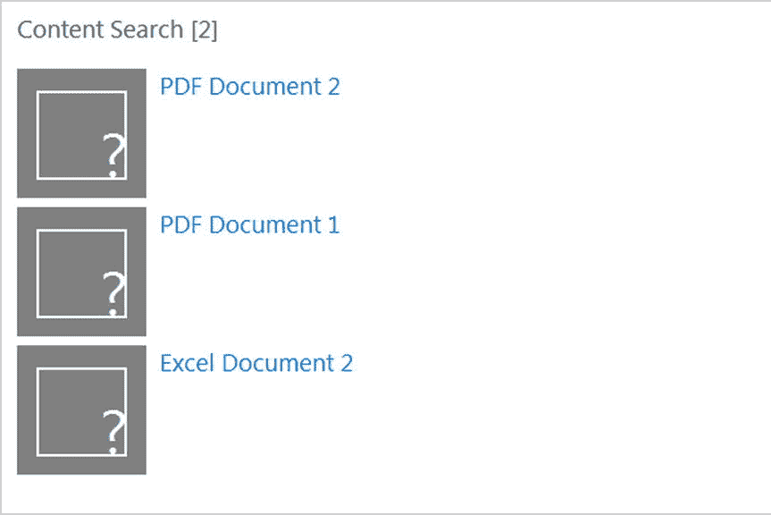

图 6-16。

The Content Search Web Part using the Recently Changed Items search

乍一看，这个 web 部件几乎正在做我们从一开始就想做的事情，即只显示 PDF 文档。事实上，这两个 PDF 文档显示在这个 web 部件只是运气。例如，根据您上传文档的顺序，您可能会在顶部看到两个 Word 文档。我们将更新 web 部件以使用我们在上一节中创建的自定义结果源，从而确保我们在结果中仅获得 PDF 文档。将内容搜索 Web 部件置于编辑模式，在属性折叠窗格中，单击更改查询按钮，如图 6-17 所示。

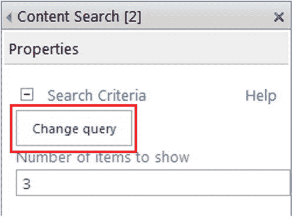

图 6-17。

Accessing the query settings of the Content Search Web Part

单击此按钮将打开“构建您的查询模式”窗口。在“基本”选项卡下，您会看到“选择查询”标题和“最近更改的项目(系统)”选项，如图 6-18 所示。

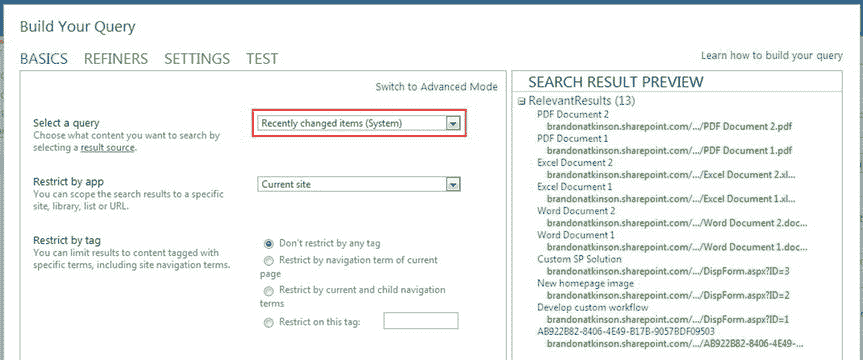

图 6-18。

The Build Your Query modal window with the “Recently changed items” result source selected

正如您在此窗口中所看到的，内容搜索 Web 部件有许多设置，而且这些设置只与搜索查询有关！可以对该 web 部件进行配置，以提供非常准确的结果，并且它能够满足各种各样的业务需求。现在，让我们将结果源更改为自定义 PDF 源。点击切换到高级模式窗口右上角的链接，如图 6-19 所示。

图 6-19。

Switch to Advanced Mode link in the Build Your Query modal window

单击此链接会弹出一个窗口，该窗口看起来很像您在构建自定义结果源时看到的构建查询窗口。您可以键入查询，使用关键字过滤器和属性过滤器，甚至可以在右窗格中看到搜索查询的预览。当我们创建自定义结果源时，所有这些设置都可用；但是，这里有一个新的下拉菜单，名为“选择查询”。打开它将显示一个结果源列表，您可以选择用于查询。打开下拉列表，选择自定义 PDF 源，如图 6-20 所示。

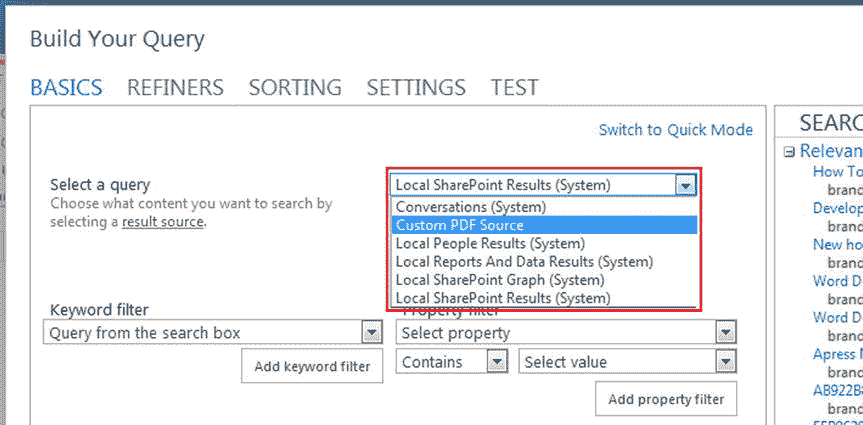

图 6-20。

Choosing the custom result source Custom PDF Source from the drop-down menu

从下拉列表中选择结果源后，单击模式窗口底部的“测试查询”按钮预览自定义结果源查询。如图 6-21 所示，它正在执行仅从 documents 文件夹返回 PDF 文档的适当搜索。

图 6-21。

The Custom PDF Source result source search shown in the preview window

在“构建查询模式”窗口中，单击“确定”。接下来，在内容搜索 Web 部件工具窗格中单击“确定”保存更改。保存页面。自定义结果源将被激活，仅显示 PDF 文档，如图 6-22 所示。

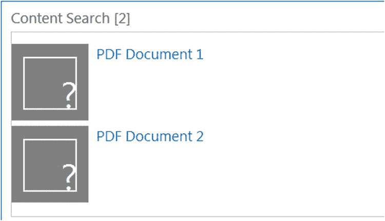

图 6-22。

Custom result source displaying only PDF documents

现在，我们已经创建了一个自定义结果源，并成功地将其应用于内容搜索 Web 部件。只有结果源指定的文档被返回并显示给用户。然而，显示效果并不令人满意。虽然内容是正确的，但看起来不太好。接下来，让我们探索显示模板，看看如何应用定制样式来匹配定制结果。

Note

内容搜索 Web 部件相当复杂。它有许多设置可以配置，以帮助您实现非常精确的结果为您的解决方案。有关这些设置的更多详细信息，请访问 [`https://support.office.com/en-us/article/Configure-a-Content-Search-Web-Part-in-SharePoint-0dc16de1-dbe4-462b-babb-bf8338c36c9a`](https://support.office.com/en-us/article/Configure-a-Content-Search-Web-Part-in-SharePoint-0dc16de1-dbe4-462b-babb-bf8338c36c9a) 。

## 显示模板

SharePoint 允许您完全控制搜索结果，包括它们在页面上的显示方式。这是通过显示模板实现的。您可以使用显示模板来设计您的搜索结果，无论您喜欢使用 HTML。您可以创建两种类型的显示模板:

*   控件-这些模板处理搜索结果显示的整体结构，可以包括页眉和页脚之类的内容。此模板在每个 web 部件上只会呈现一次。
*   Item -这些模板处理每个搜索结果项的显示方式。该模板将为返回的每个搜索结果呈现一次。

您可以通过将内容搜索 Web 部件置于编辑模式来查看这些显示模板，并且在工具窗格中，您可以在属性折叠中找到显示模板标题，如图 6-23 所示。

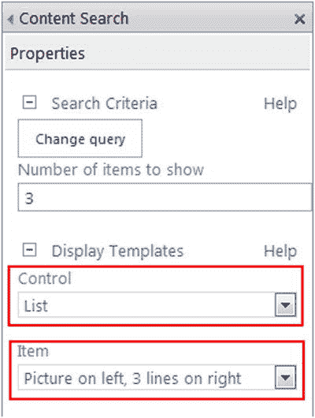

图 6-23。

Control and Item display templates in the Content Search Web Part tool pane

有许多现成的显示模板可用，您可以通过单击每种类型的下拉列表来查看它们。例如，控制模板包括列表、分页列表和幻灯片。项目模板甚至有更多的选项可供选择。要开始创建新的显示模板，最简单的方法是从现有模板开始。若要查看所有当前的搜索显示模板，请导航到母版页样式库，该样式库位于“网站设置”和“网站设计者样式库”下。点击“母版页和页面布局”链接，如图 6-24 所示。

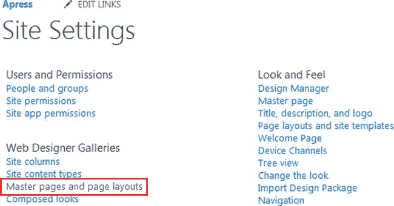

图 6-24。

The “Master pages and page layouts” link in Site Settings

进入母版页样式库后，您会发现它比以前版本的 SharePoint 多了很多。靠近顶部有一个名为显示模板的文件夹。通过打开此文件夹，您将看到对应于 SharePoint 中不同区域的多个文件夹；其中之一是内容 Web 部件，如图 6-25 所示。

图 6-25。

Content Web Parts folder inside the Display Templates folder

打开“内容 Web 部件”文件夹，查看 SharePoint 自带的所有可用显示模板。如图 6-26 所示，这里有不少。在页面顶部，您可以看到在内容搜索 Web 部件工具窗格中看到的控件模板。

图 6-26。

Out-of-the-box display templates in the Content Web Parts folder

每个显示模板都有一个与之相关联的 JavaScript 文件。在幕后，SharePoint 使用这个 JavaScript 文件来呈现显示模板。您不需要创建或修改该文件；当你上传一个新的显示模板到这个文件夹时，一个相应的 JavaScript 文件被创建，我们将在本章的后面看到。

Note

显示模板可以非常简单，也可以非常复杂。您可以很好地控制哪些属性可用以及内容如何布局，甚至可以向模板添加额外的 JavaScript。显示模板的总体主题非常庞大和复杂，无法在本章中完全涵盖。更多信息请访问 [`http://msdn.microsoft.com/en-us/library/office/jj945138%28v=office.15%29.aspx`](http://msdn.microsoft.com/en-us/library/office/jj945138%28v=office.15%29.aspx) 。

为了开始构建新的显示模板，我们将下载另一个模板的副本，并将其用作基础。显示模板可能相当复杂，从头构建一个模板可能是一项艰苦的任务。使用一个现有的模板开始将大大减少创建一个新模板的时间。对于这个例子，我们将关注一个项目模板，并使用默认的“图片在左边，3 行在右边”模板。在内容 Web 部件文件夹中，该模板的标题为`Item_Picture3Lines.html`。在文件夹中勾选此模板，在功能区中点击下载副本，如图 6-27 所示。

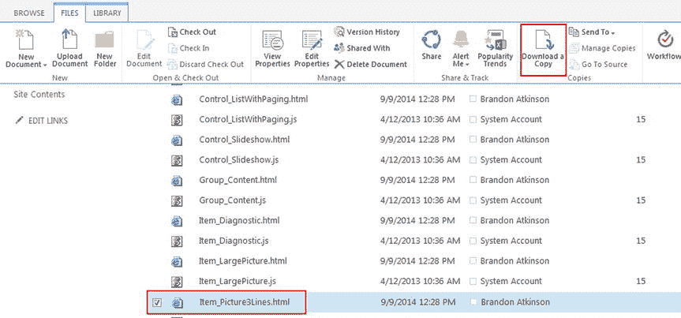

图 6-27。

Downloading a copy of an existing display template

一旦下载了副本，就可以在 Visual Studio 中打开它。检查一下这份文件，你会发现它有点复杂。它有一个 HEAD 部分、一个 TITLE 和一个 BODY——正如您所期望的 HTML 文档一样——以及许多呈现代码。实际的渲染发生在身体里。您会注意到在主体内部有几个包含所有逻辑的 div。Visual Studio 中的文件如图 6-28 所示。

图 6-28。

Item_Picture3Lines.html file open in Visual Studio

让我们将这个文件按每个部分进行分解，以便了解正在发生的事情。首先，保存文件并将其命名为 Item_CustomPdf.html。这些标签没有什么特别的。TITLE 标记非常重要，因为在内容搜索 Web 部件中选择项目模板时，它将显示在下拉列表中。将标题更改为自定义 PDF 模板。

`<html xmlns:mso="urn:schemas-microsoft-com:office:office" xmlns:msdt="uuid:C2F41010-65B3-11d1-A29F-00AA00C14882">`

`<head>`

`<title>Custom PDF Template</title>`

下一节是名为 CustomDocumentProperties 的一节中的属性集合。这些属性向 SharePoint 提供有关显示模板的附加信息。其中一些是自动为您填充的，而其他的您将需要更新。以下是一些比较重要的例子:

*   `ManagedPropertyMapping` -该属性获取搜索使用的托管属性，并将它们映射到显示模板可以使用的值。
*   `MasterPageDescription` -该属性为显示模板提供友好的描述，并显示给用户。
*   `TargetControlType` -该属性指定显示模板使用的上下文；例如，内容 Web 部件。

`ManagedPropertyMapping`属性允许您在搜索中使用托管属性，并将它们映射到显示模板可以使用的值。它是一个逗号分隔的值列表，使用以下格式:

`'property display name'{property name}:'managed property'`

例如，在这个显示模板中的`ManagedPropertyMapping`中，您可以找到以下内容:`'Link URL'{Link URL}:'Path'`。这将托管属性`Path`映射到一个名为`Link URL`的变量。`ManagedPropertyMapping`映射了几个托管属性:

`<mso:ManagedPropertyMapping msdt:dt="string">'Picture URL'{Picture URL}:'PublishingImage;PictureURL;PictureThumbnailURL','Link URL'{Link URL}:'Path','Line 1'{Line 1}:'Title','Line 2'{Line 2}:'Description','Line 3'{Line 3}:'','SecondaryFileExtension','ContentTypeId'</mso:ManagedPropertyMapping>`

映射属性后，您可以使用以下 JavaScript 获取其值:

`var linkURL = $getItemValue(ctx, "Link URL");`

`getItemValue()`函数有两个参数。第一个称为`ctx`，代表当前上下文。你会注意到它没有被定义。正好可以用。你需要记住的是，你必须把它传入，它会一直在那里使用。第二个参数是用单引号括起来的属性显示名，用在`ManagedPropertyMapping`元素中。在本例中，`Link URL`是属性名。

我们要更新的另一个属性是`MasterPageDescription`属性，只是为了更新描述，以免混淆。

`<mso:MasterPageDescription msdt:dt="string">This Item Display Template will display custom PDF results.</mso:MasterPageDescription>`

紧跟在`<body>`标记之后，您会发现一个``

在这一部分，您可以添加自己的脚本或 CSS 引用。默认情况下，它包含一个对名为`CustomStrings.js`的文件的引用，该文件存在于所有显示模板中。您可以使用以下几行来添加额外的引用:

*   位于同一站点的脚本:`$includeScript(this.url, "∼site/Webparts/CustomScript.js");`
*   位于外部站点的脚本:`$includeScript(this.url, "` `http://www.contoso.com/CustomScript.js` `");`
*   位于同一站点的 CSS 文件:`$includeCSS(this.url, "∼site/Webparts/CustomCSS.css");`

紧接在`<script>`标签之后，您会发现一个`
`元素，它包含了将包含在显示模板中的所有 HTML 和代码。这个 DIV 的 ID 必须与显示模板文件的名称相匹配。例如，本例中的 DIV 如下所示:

`
`

在 DIV 元素之后，您会看到注释块中的代码以`<!--#_`开始，以`_#-->`结束。在这个块中，您可以使用任何您喜欢的 JavaScript 代码，在这里您还可以获得任何托管属性的所有值。我们将保持这个显示模板的简单，只使用两个托管属性，代码如下:

`<!--#_`

`var linkURL = $getItemValue(ctx, "Link URL");`

`var line1 = $getItemValue(ctx, "Line 1");`

`_#-->`

如您所见，我们简单地声明了两个变量来保存在`ManagedPropertyMapping`中定义的托管属性的值。我们将在 HTML 代码中使用这两个变量。我们将用下面的代码保持 HTML 的简单:

`
`

`<strong>_#= line1 =#_</strong>`

` `

`<a href="_#= linkURL =#_">`

`_#= linkURL =#_`

`</a>`

`
`

在这段代码中，我们简单地用一个 DIV 包装所有内容。我们通过内联 CSS 应用了一个简单的边框和填充。接下来，我们将使用下面的语法`: _#= line1 =#_`显示`line1`变量。通过使用以下语法，可以在显示模板中使用 JavaScript 变量。接下来，我们将使用一个`<a>`元素显示 PDF 文件的链接。完整的文件如图 6-29 所示。

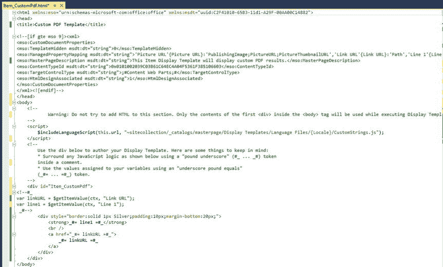

图 6-29。

Display template in Visual Studio

导航回母版页样式库中的内容 Web 部件文件夹，并从功能区将`Item_CustomPdf.html`文件上载到库中。文件上传后，会出现一个模态窗口提示您，您可以在其中设置文件的属性，如图 6-30 所示。

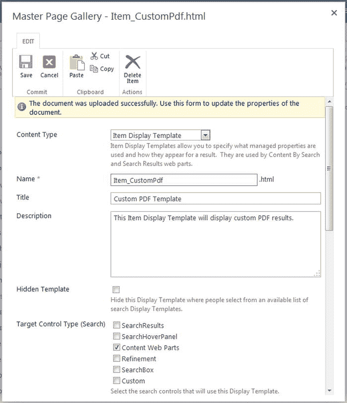

图 6-30。

Properties dialog for the display template

该对话框具有您在显示模板的 HTML 文件中看到的许多属性。文件中的所有属性都将被提取并填充到此窗口中。因此，您几乎可以保持所有属性不变，然后单击 Save。你会看到显示模板已经上传到库中，如图 6-31 所示。

图 6-31。

The newly uploaded display template and generated JavaScript file

您还会看到已经创建了一个同名的配套 JavaScript 文件。SharePoint 根据您上载的 HTML 文件生成此文件。这是它在呈现内容时使用的内容。你不需要担心这个文件，也不应该试图修改它。如果您需要进行更改，只需更改 HTML 文件并再次上传即可。每次您上传 HTML 的新副本时，都会生成一个新的 JavaScript 文件。

导航回包含内容搜索 web 部件的页面，并将该 Web 部件置于编辑模式。如果您单击显示模板部分中的项目下拉菜单，您将看到自定义 PDF 模板作为一个选项，如图 6-32 所示。选择此选项，单击确定，然后保存页面。

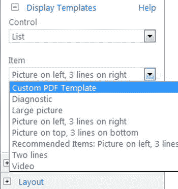

图 6-32。

The new display template is available for use

页面重新加载，呈现新的显示模板，如图 6-33 所示。

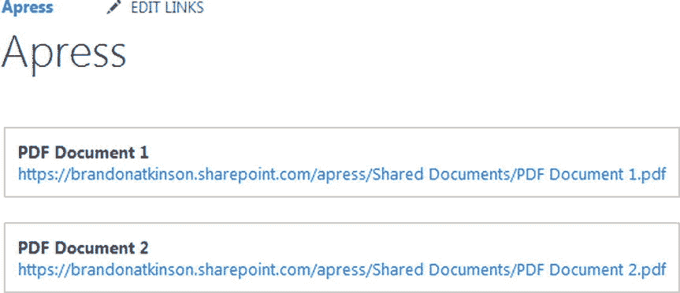

图 6-33。

The new display template being used to render the Content Search Web Part

这个例子是你能得到的最基本的例子，但是希望它展示了显示模板和搜索 web 部件的简单和强大。使用这些模板，您可以构建利用托管属性、JavaScript 和 CSS 的自定义搜索解决方案。创建丰富体验所需的所有工具都已准备就绪。

Note

花些时间下载并探索 SharePoint 附带的现成显示模板。只需浏览这些文件并查看每个文件中使用的代码，就可以找到许多有用的信息。

## 摘要

在本章中，我们探讨了如何使用内容搜索 Web 部件、自定义结果源和自定义显示模板来构建自定义搜索解决方案。您了解了结果源，并了解了如何构建新的源并将其用于内容搜索 Web 部件。我们很快研究了显示模板，并创建了一个简单的例子来说明如何应用自定义渲染。搜索将永远在 SharePoint 中发挥重要作用，现在您有了一些工具来为您的业务需求构建自定义搜索解决方案。

在下一章中，我们将继续探索 SharePoint 在设计定制解决方案时所提供的功能。我们将研究一些内置的 JavaScript 功能，这些功能在编写代码时唾手可得。我们已经看到了一些这种功能，我们将更深入地探究什么是可能的。