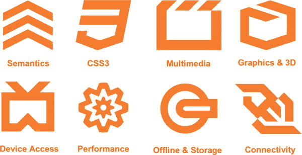
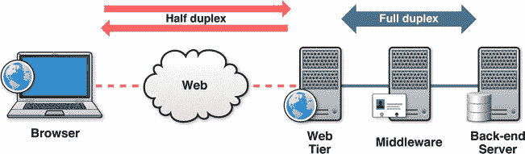
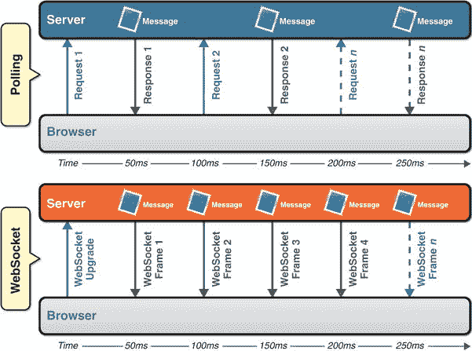

# 一、HTML5 WebSocket 简介

这本书是为任何想学习如何构建实时 web 应用的人准备的。你可能会对自己说，“我已经这样做了！”或者问“那到底是什么意思？”让我们澄清一下:这本书将向您展示如何使用一种革命性的新的、被广泛支持的开放式行业标准技术 webSocket 来构建真正*实时的 Web 应用，这种技术可以在您的客户端应用和远程服务器之间通过 Web 实现全双工、双向通信——无需插件！*

还在迷茫？几年前我们也是，在我们开始使用 HTML5 WebSocket 之前。在本指南中，我们将解释您需要了解的 WebSocket 知识，以及为什么您现在应该考虑使用 WebSocket。我们将向您展示如何在您的 web 应用中实现 WebSocket 客户端，创建您自己的 WebSocket 服务器，将 WebSocket 与 XMPP 和 STOMP 等高级协议一起使用，保护您的客户端和服务器之间的流量，以及部署您的基于 WebSocket 的应用。最后，我们将解释为什么你现在应该考虑使用 WebSocket。

HTML5 是什么？

首先，让我们检查“HTML5 WebSocket”的“HTML5”部分。如果你已经是 HTML5 的专家，已经阅读过，比如说， *Pro HTML5 Programming* ，并且已经在开发非常现代和响应迅速的 web 应用，那么请随意跳过这一部分，继续阅读。但是，如果你是 HTML5 的新手，这里有一个快速介绍。

HTML 最初是为互联网上静态的、基于文本的文档共享而设计的。随着时间的推移，由于 web 用户和设计者希望在他们的 HTML 文档中有更多的交互性，他们开始通过添加表单功能和早期的“门户”类型功能来增强这些文档。现在，这些静态文档集合，或者网站，更像是基于富客户机/服务器桌面应用的 web 应用。这些网络应用几乎可以在任何设备上使用:笔记本电脑、智能手机、平板电脑——应有尽有。

HTML5 是设计来使这些富 web 应用的开发更容易、更自然、更符合逻辑，开发者可以设计和构建一次，然后部署到任何地方。HTML5 也使得网络应用更加有用，因为它不再需要插件。有了 HTML5，你现在可以使用像`<header>`这样的语义标记语言来代替`<div class="header">.`多媒体也更容易编码，通过使用像`<audio>`和`<video>`这样的标签来引入和分配适当的媒体类型。此外，由于具有语义，HTML5 更容易访问，因为屏幕阅读器可以更容易地读取它的标签。

HTML5 是一个总括术语，涵盖了 web 技术中发生的大量改进和变化，包括从您在网页上使用的标记到 CSS3 样式、离线和存储、多媒体、连接性等等。图 1-1 显示了不同的 HTML5 特性区域。



图 1-1 。HTML5 功能区(W3C，2011)

有很多资源深入研究 HTML5 的这些领域。在本书中，我们关注连接性领域，即 WebSocket API 和协议。让我们来看看 HTML5 连接的历史。

HTML5 连接性

HTML5 的连接领域包括 WebSocket、服务器发送事件和跨文档消息传递等技术。这些 API 包含在 HTML5 规范中，有助于简化浏览器限制阻止 web 应用开发人员创建他们想要的丰富行为或 web 应用开发变得过于复杂的一些领域。HTML5 简化的一个例子是跨文档消息传递。

在 HTML5 之前，由于安全原因，浏览器窗口和框架之间的通信受到限制。然而，随着 web 应用开始将来自不同网站的内容和应用集合在一起，这些应用之间的相互通信变得很有必要。为了解决这个问题，标准团体和主要浏览器厂商同意支持跨文档消息传递，这使得跨浏览器窗口、选项卡和 iFrames 的跨来源通信变得安全。跨文档消息传递将 postMessage API 定义为发送和接收消息的标准方式。有许多使用来自不同主机和域的内容的用例，例如地图、聊天和社交网络，以便在 web 浏览器内部进行通信。跨文档消息传递提供了 JavaScript 上下文之间的异步消息传递。

跨文档消息传递的 HTML5 规范还通过引入由方案、主机和端口定义的*源*的概念来澄清和细化域安全性。基本上，当且仅当两个 URIs 具有*相同的方案、主机和端口*时，它们才被认为来自相同的来源。原点值中不考虑路径。

以下示例显示了不匹配的方案、主机和端口(以及不同的来源):

*   `https://www.example.com and http://www.example.com`
*   `http://www.example.com and http://example.com`
*   `http://example.com:8080 and http://example.com:8081`

下面的例子是同源的 URL:`http://www.example.com/page1.html`和`http://www.example.com/page2.html`。

跨文档消息传递通过允许消息在不同来源之间交换，克服了同源限制。当您发送邮件时，发件人会指定收件人的来源，当您收到邮件时，发件人的来源会包含在邮件中。消息的来源是由浏览器提供的，不能被欺骗。在接收方，您可以决定处理哪些消息，忽略哪些消息。您还可以保留一个“白名单”*，只处理来自来源可信的文档的消息。*

 *跨文档消息传递是一个很好的例子，说明 HTML5 规范用一个非常强大的 API 简化了 web 应用之间的通信。但是，它的重点仅限于跨窗口、选项卡和 iFrames 的通信。它没有解决在协议通信中变得势不可挡的复杂性，这就把我们带到了 WebSocket。

HTML5 规范的主要作者伊恩·希克森在 HTML5 规范的通信部分增加了我们现在所说的 WebSocket。WebSocket 最初名为 TCPConnection ，现在已经演变成了自己独立的规范。虽然 WebSocket 现在不属于 HTML5 的范畴，但它对于在现代(基于 HTML5 的)web 应用中实现实时连接非常重要。WebSocket 也经常被讨论为 HTML5 的连接领域的一部分。那么，为什么 WebSocket 在今天的 Web 中有意义呢？让我们首先来看看协议通信非常重要的较老的 HTTP 架构。

旧 HTTP 架构概述

为了理解 WebSocket 的重要性，让我们先来看一下旧的架构，特别是那些使用 HTTP 的架构。

HTTP 101 (或者说，HTTP/1.0 和 HTTP/1.1)

在旧的架构中，连接是由 HTTP/1.0 和 HTTP/1.1 处理的。HTTP 是客户端/服务器模型中的请求-响应协议，其中客户端(通常是 web 浏览器)向服务器提交 HTTP 请求，服务器使用请求的资源(如 HTML 页面)以及关于页面的附加信息进行响应。HTTP 也是为获取文档而设计的；HTTP/1.0 足以满足来自服务器的单个文档请求。然而，随着 Web 的发展超出了简单的文档共享，并开始包含更多的交互性，连接性需要改进，以实现浏览器请求和服务器响应之间更快的响应时间。

在 HTTP/1.0 中，对服务器的每个请求都要为*建立一个单独的连接，至少可以说，这样做的扩展性不好。HTTP 的下一个版本 HTTP/1.1 增加了可重用的连接。随着可重用连接的引入，浏览器可以初始化到 web 服务器的连接来检索 HTML 页面，然后重用相同的连接来检索图像、脚本等资源。HTTP/1.1 通过减少从客户端到服务器的连接数量，减少了请求之间的延迟。*

HTTP 是无状态的，这意味着它将每个请求视为唯一和独立的。无状态协议有一些优点:例如，服务器不需要保存关于会话的信息，因此不需要存储这些数据。然而，这也意味着为每个 HTTP 请求和响应发送关于请求的冗余信息。

让我们看一个从客户机到服务器的 HTTP/1.1 请求的例子。清单 1-1 显示了一个包含几个 HTTP 头的完整的 HTTP 请求。

***清单 1-1 。**??【HTTP/1.1】客户端到服务器的请求头 *

```html
GET /PollingStock/PollingStock HTTP/1.1
Host: localhost:8080
User-Agent: Mozilla/5.0 (Windows; U; Windows NT 5.1; en-US; rv:1.9.1.5) Gecko/20091102 Firefox/3.5.5
Accept: text/html,application/xhtml+xml,application/xml;q=0.9,*/*;q=0.8
Accept-Language: en-us
Accept-Encoding: gzip,deflate
Accept-Charset: ISO-8859-1,utf-8;q=0.7,*;q=0.7
Keep-Alive: 300
Connection: keep-alive
Referer:http://localhost:8080/PollingStock/
Cookie: showInheritedConstant=false; showInheritedProtectedConst
ant=false; showInheritedProperty=false; showInheritedProtectedPr
operty=false; showInheritedMethod=false; showInheritedProtectedM
ethod=false; showInheritedEvent=false; showInheritedStyle=false;
showInheritedEffect=false;
```

清单 1-2 显示了一个从服务器到客户端的 HTTP/1.1 响应的例子。

***清单 1-2 。**HTTP/1.1 Response Headers 从服务器到客户端*

```html
HTTP/1.x 200 OK
X-Powered-By: Servlet/2.5
Server: Sun Java System Application Server 9.1_02
Content-Type: text/html;charset=UTF-8
Content-Length: 321
Date: Wed, 06 Dec 2012 00:32:46 GMT
```

在清单 1-1 和 1-2 中，总开销是 871 字节的单独头信息(也就是说，没有实际数据)。这两个例子只显示了请求的头部信息，这些信息通过网络在每个方向上传输:从客户机到服务器，以及从服务器到客户机，而不管服务器是否有实际的数据或信息要传递给客户机。

对于 HTTP/1.0 和 HTTP/1.1，效率低下的主要原因如下:

*   HTTP 是为文档共享而设计的，而不是我们在桌面和现在的网络上已经习惯的丰富的交互式应用
*   客户机和服务器之间的交互越多，HTTP 协议在客户机和服务器之间通信所需的信息量就越大

从本质上来说，HTTP 也是*半双工*，意思是流量每次单向流动:客户端向服务器发送请求(单向)；然后，服务器响应请求(单向)。半双工是非常低效的。想象一次电话交谈，每次你想交流时，你必须按一个按钮，陈述你的信息，然后按另一个按钮来完成它。与此同时，你的对话伙伴必须耐心地等待你结束，按下按钮，然后最终以同样的方式回应。听起来熟悉吗？我们小时候在小范围内使用这种交流方式，我们的军队一直在使用这种方式:这是一种对讲机。虽然对讲机肯定有好处和很大的用途，但它们并不总是最有效的沟通方式。

多年来，工程师们一直在用各种众所周知的方法解决这个问题:轮询、长轮询和 HTTP 流。

绕远路:HTTP 轮询、长轮询和流

通常，当浏览器访问一个网页时，一个 HTTP 请求被发送到承载该网页的服务器。web 服务器确认该请求，并将响应发送回 web 浏览器。在许多情况下，返回的信息，如股票价格、新闻、交通模式、医疗设备读数和天气信息，在浏览器呈现页面时可能已经过时。如果您的用户需要获得最新的实时信息，他们可以不断地手动刷新页面，但这显然是不切实际的，也不是一个特别好的解决方案。

当前提供实时 web 应用的尝试主要围绕一种称为*轮询* 的技术，以模拟其他服务器端推送技术，其中最流行的是 *Comet* ，它基本上延迟了 HTTP 响应的完成，以将消息传递给客户端。

轮询是一种定时的同步调用，客户端向服务器发出请求，以查看是否有任何可用的信息。这些请求是定期提出的；无论是否有信息，客户端都会收到响应。具体来说，如果有可用的信息，服务器会发送它。如果没有可用信息，服务器将返回否定响应，客户端将关闭连接。

如果您知道消息传递的确切时间间隔，轮询是一个很好的解决方案，因为只有当您知道服务器上有可用的信息时，您才能同步客户端来发送请求。然而，实时数据通常是不可预测的，不必要的请求和多余的连接是不可避免的。因此，在低消息速率的情况下，您可能会不必要地打开和关闭许多连接。

*长轮询* 是另一种流行的通信方式，客户端向服务器请求信息，并在设定的时间段内打开连接。如果服务器没有任何信息，它会保持请求打开，直到它有客户端的信息，或者直到它到达指定的超时结束。此时，客户端向服务器重新请求信息。长轮询也被称为 Comet，我们前面提到过，或者反向 AJAX。Comet 延迟 HTTP 响应的完成，直到服务器有东西要发送给客户机，这种技术通常被称为挂起-获取或挂起-发送。重要的是要明白，当您的消息量很大时，长轮询并不能提供比传统轮询更好的性能，因为客户端必须不断地重新连接到服务器以获取新信息，导致网络行为等同于快速轮询。长轮询的另一个问题是缺乏标准实现。

使用*流* ，客户端发送一个请求，服务器发送并维护一个开放响应，该响应不断更新并保持开放(无限期地或在设定的时间段内)。每当消息准备好传递时，服务器都会更新响应。虽然流听起来像是适应不可预测的消息传递的一个很好的解决方案，但是服务器从不发出完成 HTTP 响应的信号，因此连接一直保持打开。在这种情况下，代理和防火墙可能会缓冲响应，从而增加消息传递的延迟。因此，在存在防火墙或代理的网络上，许多流式传输尝试都是脆弱的。

这些方法提供了几乎实时的通信，但是它们也涉及 HTTP 请求和响应头，其中包含大量额外的和不必要的头数据和延迟。此外，在每种情况下，客户端必须等待请求返回，然后才能启动后续请求，因此大大增加了延迟。

图 1-2 显示了这些连接在网络上的半双工性质，集成到一个架构中，在你的内部网中，你有通过 TCP 的全双工连接。



图 1-2 。网络上的半双工；后端 TCP 上的全双工

WebSocket 简介

那么，这会给我们带来什么？为了消除这些问题，HTML5 规范的连接部分包含了 WebSocket。WebSocket 是一种自然的全双工、双向、单路连接。使用 WebSocket，您的 HTTP 请求变成了打开 WebSocket 连接的单个请求(WebSocket 或 TLS(传输层安全性，以前称为 SSL)上的 WebSocket)，并重用从客户端到服务器以及从服务器到客户端的相同连接。

WebSocket 减少了延迟，因为一旦 WebSocket 连接建立，服务器就可以在消息可用时发送消息。例如，与轮询不同，WebSocket 只发出一个请求。服务器不需要等待来自客户端的请求。类似地，客户端可以随时向服务器发送消息。这个请求大大减少了轮询的延迟，轮询每隔一段时间发送一个请求，而不管消息是否可用。

图 1-3 比较了一个样本轮询场景和一个 WebSocket 场景。



图 1-3 。轮询 vs WebSocket

本质上，WebSocket 符合语义和简化的 HTML5 范式。它不仅消除了对复杂工作区和延迟的需求，还简化了体系结构。让我们更深入地探究一下原因。

为什么需要 WebSocket？

现在我们已经探索了 WebSocket 的历史，让我们看看为什么你应该使用 WebSocket。

WebSocket 讲的是*性能*

WebSocket 使得实时通信更加高效。

您总是可以使用 HTTP 上的轮询(有时甚至是流)来接收 HTTP 上的通知。然而，WebSocket 节省了带宽、CPU 功率和延迟。

WebSocket 是性能上的创新。

WebSocket 讲的是*简洁*

WebSocket 使得客户机和服务器之间通过 Web 的通信更加简单。

那些已经经历过在 WebSocket 之前的体系结构中建立实时通信的痛苦的人知道，通过 HTTP 进行实时通知的技术过于复杂。跨无状态请求维护会话状态增加了复杂性。跨源 AJAX 很复杂，用 AJAX 处理有序请求需要特别考虑，用 AJAX 通信也很复杂。每次试图将 HTTP 扩展到非设计用例中都会增加软件的复杂性。

WebSocket 使您能够大大简化实时应用中面向连接的通信。

WebSocket 大约是*标准*

WebSocket 是一个底层网络协议，它使您能够在其上构建其他标准协议。

许多 web 应用本质上是单一的。大多数 AJAX 应用通常由紧密耦合的客户端和服务器组件组成。因为 WebSocket 自然支持高级应用协议的概念，所以您可以更加灵活地独立发展客户端和服务器。支持这些高级协议支持模块化，并鼓励可重用组件的开发。例如，您可以使用相同的 XMPP over WebSocket 客户端登录不同的聊天服务器，因为所有的 XMPP 服务器都理解相同的标准协议。

WebSocket 是互操作 web 应用的创新。

WebSocket 大约是*html 5*

WebSocket 是为 HTML5 应用提供高级功能的努力的一部分，以便与其他平台竞争。

每个操作系统都需要联网功能。应用打开套接字并与其他主机通信的能力是每个主要平台都提供的核心特性。从许多方面来说，HTML5 是使 web 浏览器成为类似于操作系统的全功能应用平台的趋势。像套接字这样的低级网络 API 无法与 Web 的原始安全模型或 API 设计风格相适应。WebSocket 为 HTML5 应用提供 TCP 风格的网络，而不会破坏浏览器的安全性*和*它有一个现代的 API。

WebSocket 是 HTML5 平台的一个关键组件，对于开发者来说是一个非常强大的工具。

你需要 WebSocket！

简单来说，你需要 WebSocket 来构建世界级的 web 应用。WebSocket 解决了使 HTTP 不适合实时通信的主要缺陷。WebSocket 支持的异步双向通信模式是对 Internet 上传输层协议所提供的一般灵活性的回归。

想想使用 WebSocket 并在应用中构建真正的实时功能的所有好方法，如聊天、协作文档编辑、大型多人在线(MMO)游戏、股票交易应用等等。我们将在本书的后面看一下具体的应用。

WebSocket 和 RFC 6455

WebSocket 是一个协议，但也有一个 WebSocket API，它使您的应用能够控制 WebSocket 协议并响应服务器触发的事件。API 由 W3C(万维网联盟)开发，协议由 IETF(互联网工程任务组)开发。现代浏览器现在支持 WebSocket API，它包括使用全双工、双向 WebSocket 连接所需的方法和属性。API 使您能够执行必要的操作，如打开和关闭连接、发送和接收消息，以及侦听服务器触发的事件。第二章更详细地描述了 API，并举例说明了如何使用 API。

WebSocket 协议支持客户端和远程服务器之间通过 Web 进行全双工通信，并支持二进制数据和文本字符串的传输。该协议由一个开始握手和随后的基本消息组帧组成，位于 TCP 之上。第三章更详细地描述了该协议，并向您展示了如何创建自己的 WebSocket 服务器。

WebSocket 的世界

WebSocket API 和协议有一个蓬勃发展的社区，这反映在各种 WebSocket 服务器选项、开发人员社区和目前正在使用的无数现实生活中的 WebSocket 应用上。

WebSocket 选项

现在有各种各样的 WebSocket 服务器实现，比如 Apache mod_pywebsocket、Jetty、Socket。IO，以及 Kaazing 的 WebSocket 网关。

HTML5 WebSocket 的权威指南的想法源于分享我们多年来在 Kaazing 使用 WebSocket 和相关技术的知识、经验和观点的愿望。Kaazing 五年来一直在构建一个企业 WebSocket 网关服务器及其客户端库。

WebSocket 社区:它活了！

我们已经列出了一些使用 WebSocket 的理由，并将探索如何自己实现 WebSocket 的真实、适用的例子。除了各种可用的 WebSocket 服务器，WebSocket 社区也在蓬勃发展，特别是在 HTML5 游戏、企业消息和在线聊天方面。每天都有更多的会议和编码会议，不仅致力于 HTML5 的特定领域，还致力于实时通信方法，尤其是 WebSocket。即使是构建广泛使用的企业消息服务的公司也在将 WebSocket 集成到他们的系统中。因为 WebSocket 是基于标准的，所以很容易增强您现有的架构，标准化和扩展您的实现，以及构建以前不可能或难以构建的新服务。

围绕 WebSocket 的兴奋也反映在 GitHub 这样的在线社区中，在那里每天都有更多与 WebSocket 相关的服务器、应用和项目被创建。其他蓬勃发展的在线社区是`http://www.websocket.org`，它托管了一个 WebSocket 服务器，我们将在后续章节中以此为例，还有`http://webplatform.org`和`http://html5rocks.com`，它们是开放的社区，鼓励共享所有与 HTML5 相关的信息，包括 WebSocket。

 **注**更多 WebSocket 服务器在附录 b 中列出

WebSocket 的应用

在写这本书的时候，WebSocket 正被广泛应用。以前的“实时”通信技术(如 AJAX)可以实现一些应用，但是它们已经显著提高了性能。外汇和股票报价应用也受益于 WebSocket 提供的减少的带宽和全双工连接。我们将在第三章中了解如何检查 WebSocket 流量。

随着浏览器应用部署的增加，HTML5 游戏开发也出现了热潮。WebSocket 是网络游戏的天然选择，因为游戏玩法和游戏交互对响应能力的依赖令人难以置信。使用 WebSocket 的 HTML5 游戏的一些示例是流行的在线赌博应用、通过 WebSocket 与 WebGL 集成的游戏控制器应用以及游戏中的在线聊天。还有一些非常令人兴奋的大型多人在线(MMO)游戏，广泛应用于各种移动和桌面设备的浏览器中。

相关技术

您可能会惊讶地发现，还有其他技术可以与 WebSocket 结合使用，或者作为 web socket 的替代技术。以下是一些其他新兴的网络通信技术。

服务器发送的事件

当您的架构需要双向、全双工通信时，WebSocket 是一个不错的选择。但是，如果您的服务主要是向其客户端广播或推送信息，并且不需要任何交互性(例如新闻提要、天气预报等)，那么使用服务器发送事件(SSE)提供的 EventSource API 是一个不错的选择。SSE 是 HTML5 规范的一部分，它整合了一些 Comet 技术。可以将 SSE 用作 HTTP 轮询、长时间轮询和流式传输的通用互操作语法。使用 SSE，您可以获得自动重新连接、事件 id 等等。

 **注意**虽然 WebSocket 和 SSE 连接都是以 HTTP 请求开始的，但是你看到的性能优势和它们的能力可能会有很大的不同。例如，SSE 不能将流数据从客户端向上游发送到服务器，并且只支持文本数据。

SPDY

SPDY(发音为“speedy”)是 Google 正在开发的一种网络协议，并且受到越来越多浏览器的支持，包括 Google Chrome、Opera 和 Mozilla Firefox。本质上，SPDY 通过压缩 HTTP 头和多路复用来增强 HTTP 以提高 HTTP 请求的性能。其主要目的是提高 web *页面*的性能。虽然 WebSocket 专注于优化 web 应用前端和服务器之间的通信，但 SPDY 也优化了交付应用内容和静态页面。HTTP 和 WebSocket 的区别是架构上的，而不是增量的。SPDY 是 HTTP 的修订版，所以它共享相同的架构风格和语义。它修复了 HTTP 的许多非固有问题，增加了多路复用、工作流水线和其他有用的增强。WebSocket 消除了请求-响应风格的通信，支持实时交互和替代的架构模式。

WebSocket 和 SPDY 是互补的；您将能够将您的 SPDY 增强的 HTTP 连接升级到 WebSocket，从而在 SPDY 上使用 WebSocket，并从两个世界的优点中获益。

网络实时通讯

Web 实时通信 (WebRTC )是增强现代 web 浏览器通信能力的又一努力。WebRTC 是用于 Web 的对等技术。浏览器可以直接通信，不需要通过服务器传输所有数据。WebRTC 包括 API，让浏览器能够实时地相互通信。在写这本书的时候，WebRTC 仍然是万维网联盟(W3C)的草案格式，可以在`http://www.w3.org/TR/webrtc/`找到。

WebRTC 的第一个应用是实时语音和视频聊天。对于媒体应用来说，WebRTC 已经是一项引人注目的新技术，网上有许多可用的示例应用，使您能够通过 Web 上的视频和音频来测试这一点。

WebRTC 稍后将添加数据通道。为了一致性，这些数据通道计划使用与 WebSocket 类似的 API。此外，如果您的应用使用流媒体和其他数据，您可以同时使用 WebSocket 和 WebRTC。

摘要

在这一章中，我们向你介绍了 HTML5 和 WebSocket，并了解了一点 HTTP 的历史，它把我们带到了 WebSocket。我们希望到现在为止，您和我们一样兴奋地学习更多关于 WebSocket 的知识，进入代码，并梦想您能够用它做所有美好的事情。

在随后的章节中，我们将更深入地研究 WebSocket API 和协议，解释如何将 WebSocket 与标准的、更高级别的应用协议一起使用，讨论 WebSocket 的安全方面，并描述企业级的特性和部署。*