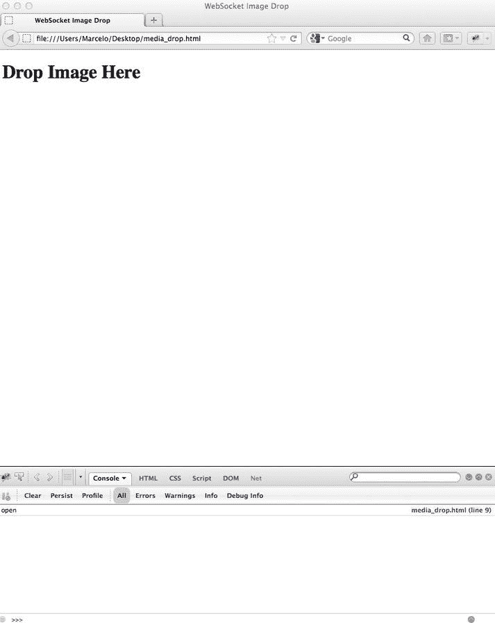
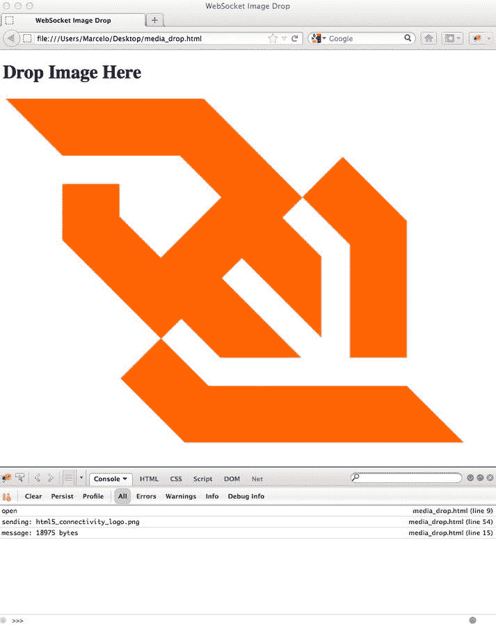

# 二、WebSocket API

本章向您介绍 WebSocket 应用编程接口 (API)，您可以使用它来控制 WebSocket 协议和创建 WebSocket 应用。在本章中，我们将研究 WebSocket API 的构建块，包括它的事件、方法和属性。为了学习如何使用 API，我们编写了一个简单的客户端应用，连接到一个现有的、公开可用的服务器(`http://websocket.org`)，它允许我们通过 WebSocket 发送和接收消息。通过使用现有的服务器，我们可以专注于学习使您能够创建 WebSocket 应用的易于使用的 API。我们还将逐步解释如何使用 WebSocket API 来支持使用二进制数据的 HTML5 媒体。最后，我们讨论浏览器支持和连接。

本章重点介绍 WebSocket 的客户端应用，它使您能够将 WebSocket 协议扩展到您的 web 应用。后续章节将描述 WebSocket 协议本身，以及在您的环境中使用 WebSocket。

WebSocket API 概述

正如我们在第一章中提到的，WebSocket 由网络协议和 API 组成，使您能够在客户端应用和服务器之间建立 WebSocket 连接。我们将在第三章中更详细地讨论这个协议，但是让我们先来看看 API。

WebSocket API 是一个使应用能够使用 WebSocket 协议的接口。通过在应用中使用 API，您可以控制一个全双工通信通道，应用可以通过该通道发送和接收消息。WebSocket 界面非常简单易用。要连接到远程主机，只需创建一个新的 WebSocket 对象实例，并为新对象提供一个 URL，该 URL 表示您希望连接的端点。

在客户端和服务器之间的初始握手期间，通过相同的底层 TCP 连接，通过从 HTTP 协议升级到 WebSocket 协议来建立 WebSocket 连接。一旦建立，WebSocket 消息可以在 WebSocket 接口定义的方法之间来回发送。在应用代码中，然后使用异步事件侦听器来处理连接生命周期的每个阶段。

WebSocket API 是纯粹的(也是真正的)事件驱动的。一旦建立了全双工连接，当服务器有数据要发送到客户端时，或者如果您关心的资源改变了它们的状态，它会自动发送数据或通知。有了事件驱动的 API，您不需要向服务器轮询目标资源的最新状态；相反，客户端只是监听想要的通知和更改。

我们将在后续章节谈到更高层协议时看到使用 WebSocket API 的不同例子，比如 STOMP和 XMPP 。但是现在，让我们仔细看看 API。

WebSocket API 入门

WebSocket API 使您能够通过 Web 在客户端应用和服务器端进程之间建立全双工双向通信。WebSocket 接口指定了客户端可用的方法以及客户端如何与网络交互。

首先，通过调用 WebSocket 构造函数，创建一个 WebSocket 连接。构造函数返回一个 WebSocket 对象实例。您可以监听该对象上的事件。这些事件告诉您连接何时打开、消息何时到达、连接何时关闭以及何时发生错误。您可以与 WebSocket 实例交互来发送消息或关闭连接。随后的章节将探讨 WebSocket API 的每一个方面。

WebSocket 构造函数

要建立到服务器的 WebSocket 连接，可以使用 WebSocket 接口通过指向表示要连接的端点的 URL 来实例化 WebSocket 对象。WebSocket 协议定义了两种 URI 方案，`ws`和`wss`，分别用于客户端和服务器之间的未加密和加密流量。`ws` (WebSocket) 方案类似于 HTTP URI 方案。`wss` (WebSocket Secure) URI 方案代表了一个基于传输层安全 (TLS，也称为 SSL)的 WebSocket 连接，并使用与 HTTPS 保护 HTTP 连接相同的安全机制。

 **注**我们将在第七章中深入讨论 WebSocket 安全性。

WebSocket 构造函数采用一个必需的参数`URL`(您要连接的 URL)和一个可选参数`protocols`(服务器必须在其响应中包含的单个协议名或协议名数组，以建立连接)。可以在`protocols`参数中使用的协议示例有 XMPP(可扩展消息和存在协议)、SOAP(简单对象访问协议)或自定义协议。

清单 2-1 展示了 WebSocket 构造函数中的一个必需参数，它必须是一个以`ws://`或`wss://`方案开头的全限定 URL。在本例中，完全限定的 URL 是`ws://` `www.websocket.org`。如果 URL 中有语法错误，构造函数将抛出异常。

***清单 2-1 。*** 样本 WebSocket 构造函数

```html
// Create new WebSocket connection

var ws = new WebSocket("[ws://www.websocket.org](http://www.websocket.org)");
```

当连接到 WebSocket 服务器时，可以选择使用第二个参数来列出应用支持的协议，即协议协商。

为了确保客户端和服务器发送和接收它们都理解的消息，它们必须使用相同的协议。WebSocket 构造函数使您能够定义客户端可以用来与服务器通信的一个或多个协议。服务器依次选择要使用的协议；在客户端和服务器之间只能使用一种协议。这些协议在 WebSocket 协议上使用。正如你将在第三章到第六章中了解到的，WebSocket 的一大好处是能够在 WebSocket 上对广泛使用的协议进行分层，这让你可以做一些伟大的事情，比如将传统的桌面应用带到网络上。

 **注意**WebSocket 协议(RFC 6455)指的是可以作为“子协议”、与 web socket 一起使用的协议，即使它们是更高级的、完全形成的协议。在本书中，为了避免混淆，我们通常将可以与 WebSocket 一起使用的协议简称为“协议”。

在我们走得太远之前，让我们回到 API 中的 WebSocket 构造函数。在最初的 WebSocket 连接握手过程中，你会在第三章中了解到更多，客户端发送一个带有协议名的`Sec-WebSocket-Protocol`头。服务器选择零个或一个协议，并以与客户端请求的名称相同的`Sec-WebSocket-Protocol`报头进行响应；否则，它会关闭连接。

协议协商对于确定给定的 WebSocket 服务器支持哪个协议或协议版本非常有用。应用可能支持多种协议，并使用协议协商来选择特定服务器使用哪种协议。清单 2-2 显示了支持一个假想协议“myProtocol”的 WebSocket 构造函数:

***清单 2-2 。*** 支持协议的示例 WebSocket 构造函数

```html
// Connecting to the server with one protocol called myProtocol

var ws = new WebSocket("ws://echo.websocket.org", "myProtocol");
```

 **注意**在清单 2-2 中，假设的协议“myProtocol”是一个定义明确的，甚至可能是注册的和标准化的，客户端应用和服务器都能理解的协议名称。

WebSocket 构造函数还可以包含一组客户机支持的协议名称，这让服务器决定使用哪一个。清单 2-3 显示了一个样本 WebSocket 构造函数，它有一个它支持的协议列表，用数组表示:

***清单 2-3 。*** 支持协议的 WebSocket 构造器示例

```html
// Connecting to the server with multiple protocol choices

var echoSocket = new WebSocket("ws://echo.websocket.org", [ "com.kaazing.echo", "example.imaginary.protocol"])

echoSocket.onopen = function(e) {
   // Check the protocol chosen by the server
   console.log( echoSocket.protocol);
}
```

在清单 2-3 中，因为 [ws://echo.websocket.org](http://ws://echo.websocket.org) 的 WebSocket 服务器只理解`com.kaazing.echo`协议而不理解`example.imaginary.protocol`，所以当 WebSocket `open`事件触发时，服务器选择 *com.kaazing.echo* 协议。使用数组可以让您的应用灵活地对不同的服务器使用不同的协议。

我们将在下一章深入讨论 WebSocket 协议，但本质上，有三种类型的协议可以用 protocols 参数来表示:

*   已注册协议:已根据 RFC 6455(web socket 协议)正式注册的标准协议，并已向 IANA(Internet Assigned Numbers Authority，互联网号码分配机构)正式注册的协议。注册协议的一个例子是微软的 SOAP over WebSocket 协议。更多信息见`http://www.iana.org/assignments/websocket/websocket.xml`。
*   开放协议 : 广泛使用的标准化协议，如 XMPP 和 STOMP，这些协议尚未注册为官方标准协议。我们将在随后的章节中研究如何在 WebSocket 中使用这些类型的协议。
*   自定义协议: 您已经编写并希望与 WebSocket 一起使用的协议。

在这一章中，我们将重点介绍如何使用 WebSocket API，就像您使用自己的自定义协议一样，并在后面的章节中研究如何使用开放协议。让我们分别看一下事件、对象和方法，并将它们放在一个工作示例中。

WebSocket 事件

WebSocket API 完全是事件驱动的。您的应用代码侦听 WebSocket 对象上的事件，以便处理传入的数据和连接状态的变化。WebSocket 协议也是事件驱动的。您的客户端应用不需要向服务器轮询更新的数据。服务器发送消息和事件时，它们将异步到达。

WebSocket 编程遵循异步编程模型，这意味着只要 WebSocket 连接是打开的，您的应用就只是侦听事件。您的客户端不需要主动轮询服务器来获取更多信息。要开始监听事件，只需向 WebSocket 对象添加回调函数。或者，可以使用`addEventListener()` DOM 方法将事件监听器添加到 WebSocket 对象中。

WebSocket 对象调度四个不同的事件:

*   打开
*   消息
*   错误
*   关闭

与所有 web APIs 一样，您可以使用`on<eventname>`处理程序属性以及`addEventListener();`方法来监听这些事件。

WebSocket 事件:打开

一旦服务器响应 WebSocket 连接请求，就会触发`open` 事件并建立连接。对`open`事件的相应回调称为`onopen` 。

清单 2-4 展示了当 WebSocket 连接建立后如何处理事件。

***清单 2-4 。*** 示例打开事件处理程序

```html
// Event handler for the WebSocket connection opening
ws.onopen = function(e) {
   console.log("Connection open...");
};
```

当 open 事件触发时，协议握手已经完成，WebSocket 准备好发送和接收数据。如果您的应用接收到一个 open 事件，您可以确定 WebSocket 服务器成功地处理了连接请求，并同意与您的应用进行通信。

WebSocket 事件:消息

WebSocket 消息包含来自服务器的数据。您可能也听说过 WebSocket 框架，它包含 WebSocket 消息。我们将在第三章中更深入地讨论消息和帧的概念。为了理解消息如何与 API 一起工作，WebSocket API 只公开完整的消息，而不公开 WebSocket 框架。收到消息时触发`message`事件。消息事件对应的回调称为`onmessage` 。

清单 2-5 显示了一个接收文本消息并显示消息内容的消息处理器。

***清单 2-5 。*** 短信事件处理程序示例

```html
// Event handler for receiving text messages
ws.onmessage = function(e) {
   if(typeof e.data === "string"){
      console.log("String message received", e, e.data);
   } else {
      console.log("Other message received", e, e.data);
   }
};
```

除了文本，WebSocket 消息还可以处理二进制数据，它们被处理为 Blob 消息，如清单 2-6 所示，或者被处理为 ArrayBuffer 消息，如清单 2-7 所示。因为 WebSocket 消息二进制数据类型的应用设置会影响传入的二进制消息，所以在读取数据之前，您必须决定要在客户端上为传入的二进制数据使用的类型。

***清单 2-6 。**Blob 消息的示例消息事件处理程序*

```html
// Set binaryType to blob (Blob is the default.)
ws.binaryType = "blob";

// Event handler for receiving Blob messages
ws.onmessage = function(e) {
   if(e.data instanceof Blob){
      console.log("Blob message received", e.data);
      var blob = new Blob(e.data);
   }
};
```

清单 2-7 显示了一个检查和处理 ArrayBuffer 消息的消息处理器。

***清单 2-7 。***array buffer 消息的示例消息事件处理程序

```html
// Set binaryType to ArrayBuffer messages
ws.binaryType = "arraybuffer";

// Event handler for receiving ArrayBuffer messages
ws.onmessage = function(e) {
   if(e.data instanceof ArrayBuffer){
      console.log("ArrayBuffer Message Received", + e.data);
      // e.data is an ArrayBuffer. Create a byte view of that object.
      var a = new Uint8Array(e.data);
   }
};
```

WebSocket 事件:错误

为了响应意外失败，触发了`error`事件。对`error`事件的相应回调称为`onerror` 。错误还会导致 WebSocket 连接关闭。如果您收到一个错误事件，您可以期待一个关闭事件紧随其后。close 事件中的代码和原因有时可以告诉您是什么导致了错误。`error event handler`是调用服务器的重新连接逻辑和处理来自 WebSocket 对象的异常的好地方。清单 2-8 显示了一个如何监听`error`事件的例子。

***清单 2-8 。*** 样本错误事件处理程序

```html
// Event handler for errors in the WebSocket object
ws.onerror = function(e) {
   console.log("WebSocket Error: " , e);
   //Custom function for handling errors
   handleErrors(e);
};
```

WebSocket 事件:关闭

WebSocket 连接关闭时会触发`close`事件。对`close`事件的相应回调被称为`onclose`。一旦连接关闭，客户端和服务器就不能再接收或发送消息。

 **注意**web socket 规范还定义了可用于保持活动、心跳、网络状态探测、延迟检测等的`ping`和`pong`帧，但是 WebSocket API 目前并没有公开这些特性。尽管浏览器收到了一个`ping`帧，但它不会在相应的 WebSocket 上触发一个可见的`ping`事件。相反，浏览器会自动用一个`pong`框架来响应。然而，浏览器发起的 `ping`在一段时间后未被`pong`应答也可能触发连接`close`事件。第八章详细介绍了 WebSocket pings 和 pongs。

当您调用`close()`方法并终止与服务器的连接时，您也触发了`onclose`事件处理程序，如清单 2-9 所示。

***清单 2-9 。*** 样本关闭事件处理程序

```html
// Event handler for closed connections
ws.onclose = function(e) {
   console.log("Connection closed", e);
};
```

WebSocket `close`事件在连接关闭时被触发，这可能是由于多种原因，如连接失败或 WebSocket 关闭握手成功。WebSocket 对象属性`readyState`反映了连接的状态(2 表示关闭，3 表示关闭)。

`close`事件有三个有用的属性可以用于错误处理和恢复 : `wasClean`、`code`和`error`。`wasClean`属性 是一个布尔值，指示连接是否被干净地关闭。如果 WebSocket 响应来自服务器的关闭帧而关闭，则属性为`true`。如果连接由于其他原因关闭(例如，因为底层 TCP 连接关闭)，则`wasClean`属性为`false`。code 和 reason 属性指示从服务器传送的结束握手的状态。这些属性与`WebSocket.close()`方法中给出的代码和原因参数是对称的，我们将在本章后面详细描述。在第三章中，我们将在讨论 WebSocket 协议时讨论结束代码及其含义。

 **注**关于 WebSocket 事件的更多细节，参见`http://www.w3.org/TR/websockets/`的 WebSocket API 规范。

WebSocket 方法

WebSocket 对象有两种方法:`send()`和`close()`。

WebSocket 方法:send()

一旦使用 WebSocket 在客户机和服务器之间建立了全双工的双向连接，就可以在连接打开时调用`send()`方法(也就是说，在调用`onopen`监听器之后和调用`onclose`监听器之前)。您使用`send()`方法将消息从您的客户机发送到服务器。发送一条或多条消息后，您可以保持连接打开，或者调用`close()`方法来终止连接。

清单 2-10 是一个如何向服务器发送文本消息的例子。

***清单 2-10 。*** 通过 WebSocket 发送短信

```html
// Send a text message
ws.send("Hello WebSocket!");
```

`send()`方法在连接打开时传输数据。如果连接不可用或关闭，它将引发一个关于无效连接状态的异常。当开始使用 WebSocket API 时，人们犯的一个常见错误是试图在连接打开之前发送消息，如清单 2-11 所示。

***清单 2-11 。*** 在打开连接之前尝试发送消息

```html
// Open a connection and try to send a message. (This will not work!)
var ws = new WebSocket("ws://echo.websocket.org")
ws.send("Initial data");
```

清单 2-11 不会工作，因为连接还没有打开。相反，你应该在新构建的 WebSocket 上发送第一条消息之前等待`open`事件，如清单 2-12 所示。

***清单 2-12 。**?? 发送消息前等待打开事件*

```html
// Wait until the open event before calling send().
var ws = new WebSocket("ws://echo.websocket.org")
ws.onopen = function(e) {
   ws.send("Initial data");
}
```

如果您想发送消息来响应另一个事件，您可以检查 WebSocket `readyState`属性并选择仅在套接字打开时发送数据，如清单 2-13 所示。

***清单 2-13 。*** 检查打开的 WebSocket 的 readyState 属性

```html
// Handle outgoing data. Send on a WebSocket if that socket is open.
function myEventHandler(data) {
   if (ws.readyState === WebSocket.OPEN) {
      // The socket is open, so it is ok to send the data.
      ws.send(data);
   } else {
      // Do something else in this case.
      //Possibly ignore the data or enqueue it.
   }
}
```

除了文本(字符串)消息之外，WebSocket API 还允许您发送二进制数据，这对于实现二进制协议尤其有用。这种二进制协议可以是典型地位于 TCP 之上的标准互联网协议，其中有效载荷可以是 Blob 或 ArrayBuffer。清单 2-14 是一个如何通过 WebSocket 发送二进制消息的例子。

第六章展示了一个如何通过 WebSocket 发送二进制数据的例子。

***清单 2-14 。*** 通过 WebSocket 发送二进制消息

```html
// Send a Blob
var blob = new Blob("blob contents");
ws.send(blob);

// Send an ArrayBuffer
var a = new Uint8Array([8,6,7,5,3,0,9]);
ws.send(a.buffer);
```

Blob 对象在与 JavaScript 文件 API 结合用于发送和接收文件时特别有用，这些文件主要是多媒体文件、图像、视频和音频。本章末尾的示例代码将 WebSocket API 与 File API 结合使用，读取文件的内容，并将其作为 WebSocket 消息发送。

WebSocket 方法: *close()*

要关闭 WebSocket 连接或终止连接尝试，请使用`close()`方法。如果连接已经关闭，则该方法不执行任何操作。调用`close()`后，就不能在关闭的 WebSocket 上再发送任何数据了。清单 2-15 显示了一个`close()`方法的例子:

***清单 2-15 。*** 调用`close()`方法

```html
// Close the WebSocket connection
ws.close();
```

您可以选择向`close()`方法传递两个参数:`code`(一个数字状态代码)和`reason`(一个文本字符串)。传递这些参数会将有关客户端关闭连接的原因的信息传递给服务器。我们将在第三章中更详细地讨论状态代码和原因，当我们讨论 WebSocket 关闭握手时。清单 2-16 显示了一个用参数调用`close()`方法的例子。

***清单 2-16 。*** 调用`close()`方法有原因

```html
// Close the WebSocket connection because the session has ended successfully
ws.close(1000, "Closing normally");
```

清单 2-16 使用代码 1000，正如代码中所述，这意味着连接正常关闭。

WebSocket 对象属性

有几个 WebSocket 对象属性可以用来提供关于 WebSocket 对象的更多信息:`readyState`、`bufferedAmount`和*协议*。

WebSocket 对象属性:readyState

WebSocket 对象通过只读属性`readyState`报告连接的状态，您在前面的章节中已经了解了一些。该属性根据连接状态自动更改，并提供有关 WebSocket 连接的有用信息。

表 2-1 描述了四个不同的值，可以将`readyState`属性设置为这些值来描述连接状态。

表 2-1 。就绪状态属性，值和状态描述

| 属性常数 | 价值 | 状态 |
| --- | --- | --- |
| WebSocket。连接 | Zero | 连接正在进行中，但尚未建立。 |
| websxmlsocket . open | one | 连接已经建立。消息可以在客户端和服务器之间流动。 |
| WebSocket。结束的 | Two | 连接正在通过结束握手。 |
| WebSocket。关闭的 | three | 连接已关闭或无法打开。 |

*(万维网联盟，2012 年)*

正如 WebSocket API 所描述的，当 WebSocket 对象第一次被创建时，它的`readyState`是`0`，表示套接字正在连接。了解 WebSocket 连接的当前状态可以帮助您调试应用，例如，确保在尝试开始向服务器发送请求之前已经打开了 WebSocket 连接。这些信息也有助于理解您的连接的生命周期。

WebSocket 对象属性:bufferedAmount

设计应用时，您可能希望检查为传输到服务器而缓冲的数据量，特别是当客户端应用向服务器传输大量数据时。尽管调用`send()`是即时的，但通过互联网传输数据却不是。浏览器将代表您的客户端应用缓冲传出的数据，因此您可以随时调用`send()`,使用您喜欢的数据。但是，如果您想知道数据流出网络的速度有多快，WebSocket 对象可以告诉您缓冲区的大小。您可以使用`bufferedAmount`属性来检查已经排队但尚未传输到服务器的字节数。此属性中报告的值不包括协议引起的帧开销或操作系统或网络硬件完成的缓冲。

清单 2-17 展示了一个如何使用`bufferedAmount`属性每秒发送更新的例子；如果网络无法处理该速率，它会相应地进行调整。

***清单 2-17 。*** bufferedAmount 示例

```html
// 10k max buffer size.
var THRESHOLD = 10240;

// Create a New WebSocket connection
var ws = new WebSocket("ws://echo.websocket.org/updates");

// Listen for the opening event
ws.onopen = function () {

   // Attempt to send update every second.
   setInterval( function() {
      // Send only if the buffer is not full
      if (ws.bufferedAmount < THRESHOLD) {
         ws.send(getApplicationState());
      }
   }, 1000);
};
```

使用`bufferedAmount`属性有助于限制应用向服务器发送数据的速率，从而避免网络饱和。

 **专业提示**在尝试关闭连接之前，您可能希望检查 WebSocket 对象的`bufferedAmount`属性，以确定是否有任何数据尚未从应用传输。

WebSocket 对象属性:协议

在我们之前关于 WebSocket 构造函数的讨论中，我们提到了`protocol`参数，它让服务器知道客户端理解并可以通过 WebSocket 使用哪个协议。WebSocket 对象`protocol`属性提供了另一条关于 WebSocket 实例的有用信息。客户端和服务器之间的协议协商结果在 WebSocket 对象上是可见的。`protocol`属性包含 WebSocket 服务器在开始握手时选择的协议名称。换句话说，`protocol`属性告诉您特定的 WebSocket 使用哪种协议。在开始握手完成之前，`protocol`属性是一个空字符串，如果服务器没有选择客户端提供的协议之一，它就仍然是一个空字符串。

将所有这些放在一起

既然我们已经走过了 WebSocket 构造函数、事件、属性和方法，那么让我们把我们所学到的关于 WebSocket API 的东西放在一起。这里，我们创建一个客户机应用，通过 Web 与远程服务器通信，并使用 WebSocket 交换数据。我们的示例 JavaScript 客户机使用托管在`ws://echo.websocket.org`的“Echo”服务器，它接收并返回您发送给服务器的任何消息。使用 Echo 服务器对于纯客户端测试非常有用，特别是对于理解 WebSocket API 如何与服务器交互。

首先，我们创建连接，然后在网页上显示由我们的代码触发的事件，这些事件来自服务器。该页面将显示有关客户端连接到服务器、向服务器发送消息和从服务器接收消息，然后从服务器断开连接的信息。

清单 2-18 显示了一个与服务器通信和消息传递的完整例子。

***清单 2-18 。*** 使用 WebSocket API 完成客户端应用

```html
<!DOCTYPE html>
<title>WebSocket Echo Client</title>
<h2>Websocket Echo Client</h2>

<div id="output"></div>
<script>

// Initialize WebSocket connection and event handlers

function setup() {
   output = document.getElementById("output");
   ws = new WebSocket("ws://echo.websocket.org/echo");

// Listen for the connection open event then call the sendMessage function
   ws.onopen = function(e) {
      log("Connected");
      sendMessage("Hello WebSocket!")
   }

// Listen for the close connection event
   ws.onclose = function(e) {
      log("Disconnected: " + e.reason);
   }

// Listen for connection errors
   ws.onerror = function(e) {
      log("Error ");
   }

// Listen for new messages arriving at the client
   ws.onmessage = function(e) {
      log("Message received: " + e.data);
      // Close the socket once one message has arrived.
      ws.close();
   }
}

// Send a message on the WebSocket.
function sendMessage(msg){
   ws.send(msg);
      log("Message sent");
   }

// Display logging information in the document.
function log(s) {
   var p = document.createElement("p");
   p.style.wordWrap = "break-word";
   p.textContent = s;
   output.appendChild(p);

   // Also log information on the javascript console
   console.log(s);
}

// Start running the example.
setup();
</script>
```

运行网页后，输出应类似于以下内容:

```html
WebSocket Sample Client

Connected

Message sent

Message received: Hello WebSocket!

Disconnected
```

如果你看到这个输出，恭喜你！您已经成功地创建并执行了第一个示例 WebSocket 客户端应用。如果这个例子不起作用，你需要调查它失败的原因。您可以在浏览器的 JavaScript 控制台中找到有用的信息。虽然可能性越来越小，但您的浏览器可能不支持 WebSocket。虽然每个主流浏览器的最新版本都包含对 WebSocket API 和协议的支持，但仍有一些旧浏览器不支持这种支持。下一节将向您展示如何确保您的浏览器支持 WebSocket。

检查 WebSocket 支持

因为(令人惊讶的)并非所有的 web 浏览器都支持 WebSocket，所以在代码中包含一种确定浏览器支持的方法是一个好的实践，如果可能的话，提供一个后备。大多数现代浏览器都支持 WebSocket，但是根据用户的不同，您可能希望使用这些技术中的一种来覆盖您的基础。

 **注** 第八章讨论了各种 WebSocket 回退和仿真选项。

有几种方法可以确定自己的浏览器是否支持 WebSocket。用来研究代码的一个便利工具是 web 浏览器的 JavaScript 控制台。每个浏览器都有不同的方式来启动 JavaScript 控制台。例如，在谷歌 Chrome 中，你可以通过选择**视图开发者开发者工具**，然后点击**控制台**来打开控制台。有关 Chrome 开发者工具的更多信息，请参见`https://developers.google.com/chrome-developer-tools/docs/overview`。

 **专业提示**谷歌的 Chrome 开发者工具也能让你检查 WebSocket 流量。为此，在“开发工具”面板中，单击“网络”，然后在面板底部，单击“WebSockets”。附录 A 详细介绍了有用的 WebSocket 调试工具。

打开浏览器的交互式 JavaScript 控制台，评估表达式`window.WebSocket`。如果您看到 WebSocket 构造函数对象，这意味着您的 web 浏览器本机支持 WebSocket。如果您的浏览器支持 WebSocket，但是您的示例代码不工作，您将需要进一步调试您的代码。如果对同一个表达式求值，得到的结果是空的或未定义的，那么您的浏览器本身就不支持 WebSocket。

为了确保您的 WebSocket 应用在不支持 WebSocket 的浏览器中工作，您需要考虑回退或仿真策略。您可以自己编写(这非常复杂)，使用 polyfill(一个为旧浏览器复制标准 API 的 JavaScript 库)，或者使用 Kaazing 这样的 WebSocket 供应商，它支持 WebSocket 仿真，使任何浏览器(回到 Microsoft Internet Explorer 6)都支持 HTML5 WebSocket 标准 API。作为将 WebSocket 应用部署到企业的一部分，我们将在第八章中进一步讨论这些选项。

作为应用的一部分，您可以添加一个对 WebSocket 支持的条件检查，如清单 2-19 所示。

***清单 2-19 。**中的*客户端代码确定浏览器中的 WebSocket 支持

```html
if (window.WebSocket){
    console.log("This browser supports WebSocket!");
} else {
    console.log("This browser does not support WebSocket.");
}
```

 **注意**网上有很多描述 HTML5 和 WebSocket 与浏览器兼容的资源，包括手机浏览器。两个这样的资源是`http://caniuse.com/`和`http://html5please.com/`??。

通过 WebSocket 使用 HTML5 媒体

作为 HTML5 和 Web 平台的一部分，WebSocket API 被设计为能够很好地与 HTML5 的所有特性一起工作。可以用 API 发送和接收的数据类型对于传输应用数据和媒体非常有用。当然，字符串允许您表示像 XML 和 JSON 这样的 web 数据格式。二进制类型集成了 API，如拖放、FileReader、WebGL 和 Web Audio API。

让我们来看看如何通过 WebSocket 使用 HTML5 媒体。清单 2-20 显示了一个完整的客户端应用使用 HTML5 媒体和 WebSocket。您可以基于这段代码创建自己的 HTML 文件。

 **注意**要构建(或简单地遵循)本书中的示例，您可以选择使用我们创建的虚拟机(VM ),它包含了我们在示例中使用的所有代码、库和服务器。有关如何下载、安装和启动虚拟机的说明，请参考附录 B。

***清单 2-20 。*** 通过 WebSocket 使用 HTML5 媒体完成客户端应用

```html
<!DOCTYPE html>
<title>WebSocket Image Drop</title>
<h1>Drop Image Here</h1>
<script>

// Initialize WebSocket connection
var wsUrl = "ws://echo.websocket.org/echo";
var ws = new WebSocket(wsUrl);
ws.onopen = function() {
 console.log("open");
}

// Handle binary image data received on the WebSocket
ws.onmessage = function(e) {
   var blob = e.data;
   console.log("message: " + blob.size + " bytes");
   // Work with prefixed URL API
  if (window.webkitURL) {
      URL = webkitURL;
   }

   var uri = URL.createObjectURL(blob);
   var img = document.createElement("img");
   img.src = uri;
   document.body.appendChild(img);
}

// Handle drop event
document.ondrop = function(e) {
   document.body.style.backgroundColor = "#fff";
   try {
      e.preventDefault();
     handleFileDrop(e.dataTransfer.files[0]);
     return false;
   } catch(err) {
     console.log(err);
   }
}

// Provide visual feedback for the drop area
document.ondragover = function(e) {
   e.preventDefault();
   document.body.style.backgroundColor = "#6fff41";
}
document.ondragleave = function() {
  document.body.style.backgroundColor = "#fff";
}

// Read binary file contents and send them over WebSocket
function handleFileDrop(file) {
   var reader = new FileReader();
   reader.readAsArrayBuffer(file);
   reader.onload = function() {
     console.log("sending: " + file.name);
     ws.send(reader.result);
   }
}
</script>
```

在您最喜欢的现代浏览器中打开此文件。当 WebSocket 连接打开时，查看一下浏览器的 JavaScript 控制台。图 2-1 显示了运行在 Mozilla Firefox 中的客户端应用。注意，在这个图的底部，我们显示了 Firebug(一个强大的 web 开发和调试工具，可在`http://getfirebug.com`获得)中提供的 JavaScript 控制台。



图 2-1 。使用 HTML5 媒体的客户端应用，带有在 Mozilla Firefox 中显示的 WebSocket】

现在，试着将一个图像文件拖放到这个页面上。将图像文件拖放到页面上之后，您应该会看到呈现在网页上的图像，如图 2-2 所示。请注意 Firebug 是如何显示添加到页面中的图像文件的信息的。



图 2-2 。使用 HTML5 媒体和 Mozilla Firefox 中的 WebSocket 在客户端应用中显示的图像(PNG)

 **注意**服务器`websocket.org`目前只接受小消息，所以这个例子只适用于小于 65kb 的图像文件，尽管这个限制可能会改变。您可以在自己的服务器上试验更大的媒体。

这个演示的“惊喜”因素可能会因为媒体来自最终显示它的同一个浏览器而减少。你可以用 AJAX 甚至不用网络来实现同样的视觉效果。当客户端或服务器发送一些媒体数据，并由不同的浏览器显示时，事情变得非常有趣——甚至是成千上万的其他浏览器！在广播场景中，读取和显示二进制图像数据的机制与这个简化的 echo 演示相同。

摘要

在本章中，您学习了 WebSocket API 的各个方面，它使您能够从浏览器中运行的客户端应用启动 WebSocket 连接，并通过 WebSocket 连接从服务器向客户端发送消息。您了解了 WebSocket API 背后的基本概念，包括事件、消息和属性，还了解了一些 API 的实际例子。您还了解了如何使用公开可用的 WebSocket Echo 服务器创建自己的 WebSocket 应用，您可以使用它来进一步测试自己的应用。有关该接口的权威定义，请参见位于`http://www.w3.org/TR/websockets/`的完整 WebSocket API 规范。

在第三章中，您将学习 WebSocket 协议，并逐步构建您自己的基本 WebSocket 服务器。