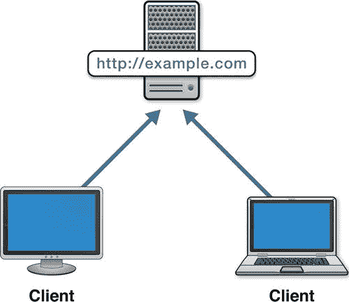
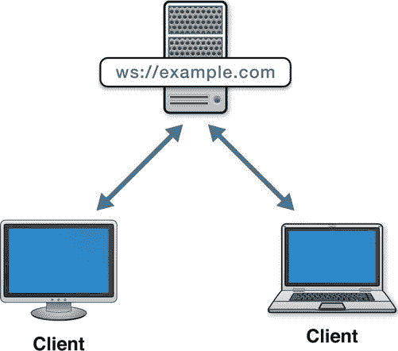
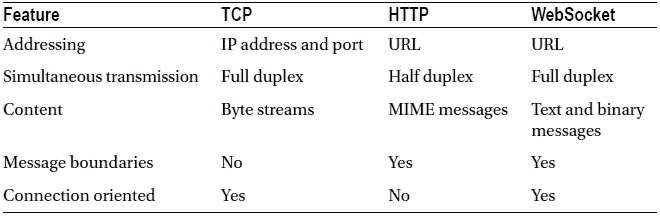
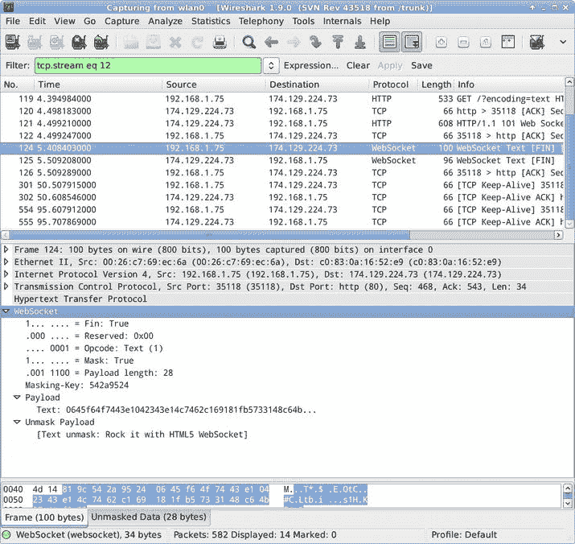
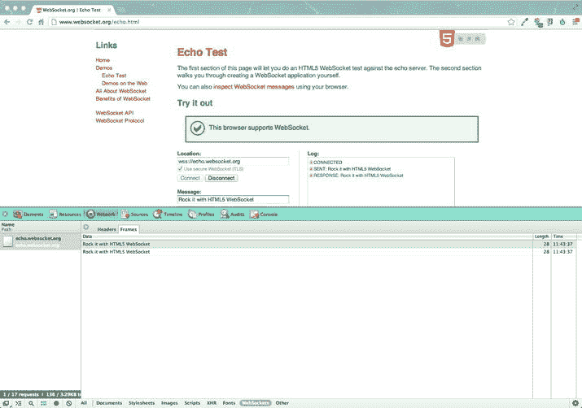
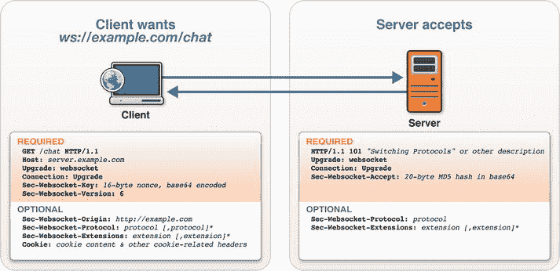
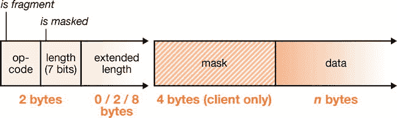
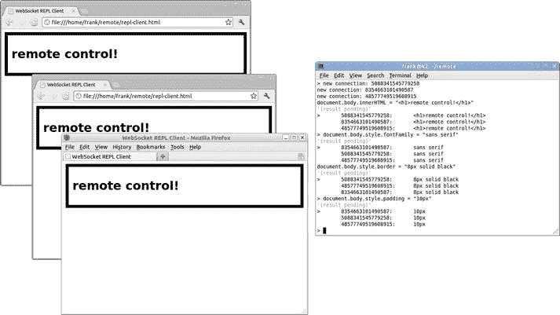

# 三、WebSocket 协议

WebSocket 是一种网络协议，它定义了服务器和客户端如何通过 Web 进行通信。协议是商定的通信规则。组成互联网的一套协议由互联网工程任务组 IETF 发布。IETF 发布了称为 RFC 的征求意见稿，RFC 精确地指定了协议，包括 RFC 6455:web socket 协议。RFC 6455 发布于 2011 年 12 月，包含了实现 WebSocket 客户端或服务器时必须遵循的确切规则。

在前一章中，我们探讨了 WebSocket API，它允许应用与 WebSocket 协议进行交互。在这一章中，我们将带您了解互联网和协议的简史，为什么创建 WebSocket 协议，以及它是如何工作的。我们使用网络工具来观察和了解 WebSocket 网络流量。使用一个用 JavaScript 和 Node.js 编写的示例 WebSocket 服务器，我们研究 WebSocket 握手如何建立 WebSocket 连接，消息如何编码和解码，以及连接如何保持活动和关闭。最后，我们使用这个示例 WebSocket 服务器同时远程控制几个浏览器。

在 WebSocket 协议之前

为了更好地理解 WebSocket 协议，让我们通过快速浏览来看看 WebSocket 如何适应一个重要的协议家族，从而了解一些历史背景。

协议！

协议是计算最重要的部分之一。它们跨越编程语言、操作系统和硬件架构。它们允许由不同的人编写并由不同的代理操作的组件在房间内或世界范围内相互通信。在开放的、可互操作的系统中，许多成功的故事都归功于设计良好的协议。

在万维网及其组成技术(如 HTML 和 HTTP)出现之前，互联网是一个非常不同的网络。一方面，它要小得多，另一方面，它本质上是一个同辈人的网络。当在互联网主机之间进行通信时，两种协议过去是并且现在仍然是流行的:互联网协议(IP，其负责在互联网上的两个主机之间简单地传输分组)和传输控制协议(TCP，其可以被视为在互联网上延伸的管道，并且在两个端点之间的每个方向上承载可靠的字节流)。总之，TCP over IP (TCP/IP)一直是并将继续是无数网络应用使用的核心传输层协议。

互联网简史

一开始，互联网主机之间有 TCP/IP 通信。在这种情况下，任何一台主机都可以建立新的连接。TCP 连接一旦建立，任何一台主机都可以随时发送数据，如图图 3-1 所示。


图 3-1 。互联网主机之间的 TCP/IP 通信

网络协议中可能需要的任何其他功能都必须建立在传输协议之上。这些更高层被称为*应用协议* 。例如，在 Web 出现之前的两个重要的应用层协议是用于聊天的 IRC 和用于远程终端访问的 Telnet 。IRC 和 Telnet 显然需要异步双向通信。当另一个用户发送聊天消息或远程应用打印一行输出时，客户端必须收到提示通知。由于这些协议通常在 TCP 上运行，异步双向通信总是可用的。IRC 和 Telnet 会话保持持久的连接，客户机和服务器可以在任何时候自由地互相发送消息。TCP/IP 也是另外两个重要协议的基础:HTTP 和 WebSocket。不过，在我们开始之前，让我们先简要地看一下 HTTP。

Web 和 HTTP

1991 年，万维网项目以其最早的公开形式被宣布。网络是一个使用统一资源定位符(URL)链接超文本文档的系统。当时，URL 是一项重大创新。URL 中的 U 代表 universal，表明了当时革命性的想法，即所有超文本文档都可以相互连接。Web 上的 HTML 文档通过 URL 链接到其他文档。因此，网络协议是为获取资源而定制的是有道理的。HTTP 是一种简单的同步请求-响应式文档传输协议。

最早的 web 应用使用表单和整页重载。每次用户提交信息时，浏览器都会提交一个表单并获取一个新页面。每次有更新的信息要显示时，用户或浏览器都必须刷新整个页面，才能使用 HTTP 获取完整的资源。

有了 JavaScript 和 XMLHttpRequest API，一套被称为 AJAX 的技术被开发出来，以允许更无缝的应用，在每次交互过程中不会有突然的转变。AJAX 让应用只获取感兴趣的资源数据，并在没有导航的情况下更新页面。用 AJAX，网络协议还是 HTTP 尽管有 XMLHttpRequest 名称，但数据有时(但不总是)是 XML。

网络已经变得相当流行。如此受欢迎，事实上，许多人混淆了网络和互联网，因为网络通常是他们使用的唯一重要的互联网应用。 NAT(网络地址转换)、HTTP 代理和防火墙也变得越来越普遍。今天，许多互联网用户没有公开可见的 IP 地址。用户没有唯一的 IP 地址的原因有很多，包括安全措施、过度拥挤和缺乏必要。地址的缺乏妨碍了可寻址性；例如，需要公共地址的蠕虫无法访问未编址的用户。此外，没有足够的 IPv4 地址供所有 Web 用户使用。NAT 允许用户共享公共 IP 地址，同时仍能在网上冲浪。最后，占主导地位的协议 HTTP 不需要可寻址的客户端。HTTP 对于由客户端应用驱动的交互工作得相当好，因为客户端发起每个 HTTP 请求，如图图 3-2 所示:



图 3-2 。HTTP 客户端将连接到一个网络服务器

本质上，HTTP 通过其对文本 (从而支持我们互连的 HTML 页面)、URL 和 HTTPS(安全 HTTP over 传输层安全性(TLS) )的内置支持使 Web 成为可能。然而，在某些方面，HTTP 也因其流行而导致互联网*倒退*。因为 HTTP 不需要可寻址的客户端，所以网络世界中的寻址是不对称的。浏览器可以通过 URL 访问服务器上的资源，但是服务器端应用无法主动将资源发送给客户端。客户端只能发出请求，服务器只能响应未完成的请求。在这个不对称的世界里，要求全双工通信的协议并不奏效。

解决这一限制的一种方法是让客户机打开 HTTP 请求，以防服务器有更新要共享。使用 HTTP 请求来逆转通知流的总称称为“Comet”正如我们在前面章节中所讨论的，Comet 基本上是一组技术，通过轮询、长时间轮询和流式传输将 HTTP 扩展到极限。这些技术本质上模拟了 TCP 的一些功能，以便处理相同的服务器到客户端用例。由于同步 HTTP 和这些异步应用之间的不匹配，Comet 往往是复杂的、非标准的和低效的。

 **注**在服务器对服务器的通信中，每台主机都可以寻址对方。当有新数据可用时，一个服务器可以简单地向另一个服务器发出 HTTP 请求，这就是用于服务器到服务器提要更新通知的 PubSubHubbub 协议的情况。PubSubHubbub 是一个开放协议，扩展了 RSS 和 Atom ，支持 HTTP 服务器之间的发布/订阅通信。虽然使用 WebSocket 可以实现服务器到服务器的通信，但本书主要关注实时 web 应用中的客户机-服务器通信。

介绍 WebSocket 协议

这一简短的互联网历史课程将我们带到了今天。现在，web 应用非常强大，具有重要的客户端状态和逻辑。通常，现代 web 应用需要双向通信。更新的即时通知更像是常规而非例外，用户越来越期望响应性的实时交互。让我们来看看 WebSocket 给了我们什么。

WebSocket:网络应用的互联网功能

WebSocket 保留了我们喜欢的 HTTP for web 应用的许多特性(URL、HTTP 安全性、更简单的基于消息的数据模型和对文本的内置支持)，同时支持其他网络架构和通信模式。和 TCP 一样，WebSocket 是异步的，可以作为更高层协议的传输层。WebSocket 是消息协议、聊天、服务器通知、流水线和多路复用协议、自定义协议、压缩二进制协议和其他用于与 Internet 服务器互操作的标准协议的良好基础。

WebSocket 为 web 应用提供了 TCP 风格的网络功能。寻址仍然是单向的。服务器可以异步地向客户端发送数据，但是只有在有一个打开的 WebSocket 连接时。WebSocket 连接总是从客户端建立到服务器。WebSocket 服务器也可以充当 WebSocket 客户端。然而，使用 WebSocket，像浏览器这样的 web 客户端不能接受不是由它们发起的连接。图 3-3 显示了连接到服务器的 WebSocket 客户端，客户端或者服务器可以随时发送数据。



图 3-3 。连接到服务器的 WebSocket 客户端

WebSocket 桥接了网络世界和互联网世界(或者更具体地说，TCP/IP)。以前不容易与 web 应用一起使用的异步协议现在可以使用 WebSocket 轻松地进行通信。表 3-1 比较了 TCP、HTTP 和 WebSocket 的主要领域。

表 3-1 。TCP、HTTP 和 WebSocket 的比较



TCP 只传递字节流 ，所以消息边界必须用更高层的协议来表示。初学使用 TCP 的 socket 程序员常犯的一个错误是，假设每个对`send()`的调用都会导致一个成功的`receive.`，虽然对于简单的测试来说这可能是真的，但是当负载和延迟变化时，在 TCP socket 上发送的字节会不可预测地被分段。根据操作系统的判断，TCP 数据可以分布在多个 IP 数据包上，也可以组合成较少的数据包。TCP 中唯一的保证是到达接收端的单个字节将按顺序到达。与 TCP 不同，WebSocket 传输一系列离散的消息 。有了 WebSocket，多字节的消息会完整有序的到达，就像 HTTP 一样。因为消息边界内置于 WebSocket 协议中，所以可以发送和接收单独的消息，并避免常见的分段错误。

值得一提的是，在互联网出现之前，另一种网络模型正在被采用:开放系统互连(OSI) ，它包括七层:物理层、数据链路层、网络层、传输层、会话层、表示层和应用层。然而，尽管术语可能相似，OSI 在设计时并没有考虑到互联网。TCP/IP 模型是为互联网设计的，它只包括四层:链路层、Internet 层、传输层和应用层，并且是今天驱动互联网的模型。

IP 位于互联网层，TCP 位于 IP 之上的传输层。WebSocket 位于 TCP(因此也是 IP)之上，它也被认为是传输层，因为您可以在 WebSocket 之上放置应用级协议。

检测 WebSocket 流量

在第二章中，我们使用了 WebSocket API，却没有真正看到网络层发生了什么。如果您想要查看网络上的 WebSocket 流量，您可以使用 Wireshark ( `http://www.wireshark.org/`)或 tcpdump ( `http://www.tcpdump.org/`)等工具，并检查通信堆栈内部的内容。Wireshark 使您能够“剖析”WebSocket 协议，这使您可以在一个方便的 UI 中查看我们将在本章稍后讨论的 WebSocket 协议的各个部分(例如，操作码、标志和有效载荷)，如图图 3-4 所示。它甚至会显示从 WebSocket 客户端发送的消息的非屏蔽版本。我们将在本章后面讨论屏蔽。



图 3-4 。在 Wireshark 中查看 WebSocket 会话

 **注** 附录 A 详细介绍了 WebSocket 流量调试工具。

WebKit (驱动谷歌 Chrome 和苹果 Safari 的浏览器引擎)最近也增加了对检查 WebSocket 流量的支持。在最新版本的 Chrome 浏览器中，你可以在开发者工具的网络标签中看到 WebSocket 消息。图 3-5 展示了这个用 WebSocket 开发的必备工具。



图 3-5 。使用谷歌浏览器开发工具查看网络套接字会话

我们强烈建议使用这些工具来观察 WebSockets 的运行，不仅是为了了解协议，也是为了更好地理解 WebSocket 会话期间发生的事情。

WebSocket 协议

让我们仔细看看 WebSocket 协议。对于协议的每个部分，我们将查看 JavaScript 代码来处理特定的语法。之后，我们将把这些片段组合成一个示例服务器库和两个简单的应用。

WebSocket 开场握手

每个 WebSocket 连接都以一个 HTTP 请求开始。这个请求与其他请求很相似，除了它包含一个特殊的头:`Upgrade`。`Upgrade`报头表示客户端想要将连接升级到不同的协议。在本例中，不同的协议是 WebSocket。

让我们看一个在连接到`ws://echo.websocket.org/echo`时记录的握手示例。在握手完成之前，WebSocket 会话符合 HTTP/1.1 协议。客户端发送如清单 3-1 所示的 HTTP 请求。

***清单 3-1。***来自客户端的 HTTP 请求

```html
GET /echo HTTP/1.1
Host: echo.websocket.org
Origin:http://www.websocket.org
Sec-WebSocket-Key: 7+C600xYybOv2zmJ69RQsw==
Sec-WebSocket-Version: 13
Upgrade: websocket
```

清单 3-2 显示了服务器发回响应。

***清单 3-2。*** 来自服务器的 HTTP 响应

```html
101 Switching Protocols
Connection: Upgrade
Date: Wed, 20 Jun 2012 03:39:49 GMT
Sec-WebSocket-Accept: fYoqiH14DgI+5ylEMwM2sOLzOi0=
Server: Kaazing Gateway
Upgrade: WebSocket
```

图 3-6 说明了从客户端到服务器的对 WebSocket 的 HTTP 请求升级，也称为 WebSocket 开放握手。



图 3-6 。WebSocket 开放式握手示例

图 3-6 显示了必需和可选的接头。一些头是严格必需的，必须存在并且精确，WebSocket 连接才能成功。这个握手中的其他头是可选的，但是是允许的，因为握手是一个 HTTP 请求和响应。成功升级后，连接的语法切换到用于表示 WebSocket 消息的数据帧格式。除非服务器用`101`响应码、`Upgrade`报头和`Sec-WebSocket-Accept`报头响应，否则连接不会成功。`Sec-WebSocket-Accept`响应头的值来源于`Sec-WebSocket-Key`请求头，包含一个特殊的键响应，它必须与客户端期望的完全匹配。

计算按键响应

为了成功完成握手，WebSocket 服务器必须用一个计算出的密钥进行响应。这个响应表明服务器特别理解 WebSocket 协议。如果没有确切的响应，就有可能欺骗一些毫无戒心的 HTTP 服务器，使其意外地升级连接！

这个响应函数从客户端发送的`Sec-WebSocket-Key`头中获取键值，并在返回的`Sec-WebSocket-Accept`头中返回客户端期望的计算值。清单 3-3 使用 Node.js 加密 API 来计算组合密钥和后缀的 SHA1 散列:

***清单 3-3。*** 使用 Node.jspto API Crypto API 计算密钥响应

```html
var KEY_SUFFIX = "258EAFA5-E914-47DA-95CA-C5AB0DC85B11";
var hashWebSocketKey = function(key) {
   var sha1 = crypto.createHash("sha1");
   sha1.update(key + KEY_SUFFIX, "ascii");
   return sha1.digest("base64");
   }
```

 **注**清单 3-3 中的 KEY_SUFFIX 是协议规范中包含的一个常量 KEY 后缀，每个 WebSocket 服务器都必须知道。

在 WebSocket 开始握手和计算密钥响应时，WebSocket 协议依赖于 RFC 6455 中定义的 Sec-header。表 3-2 描述了这些 web socket Sec-header。

表 3-2 。WebSocket Sec- Headers 及其描述(RFC 6455

| 页眉 | 描述 |
| --- | --- |
| sec-web 套接字密钥 | 在 HTTP 请求中只能出现一次。用于从客户端到服务器的开放式 WebSocket 握手，以防止跨协议攻击。参见 Sec-WebSocket-Accept。 |
| sec-web socket-接受 | 在 HTTP 响应中只能出现一次。用于从服务器到客户端的 WebSocket 握手，以确认服务器理解 WebSocket 协议。 |
| sec-web socket-扩展 | 可以在 HTTP 请求中出现多次(逻辑上与包含所有值的单个 Sec-WebSocket-Extensions 头字段相同)，但在 HTTP 响应中只能出现一次。用于 WebSocket 从客户端到服务器，然后从服务器到客户端的开放握手。这个头帮助客户机和服务器就一组协议级扩展达成一致，以便在连接期间使用。 |
| sec-web 套接字协议 | 用于从客户端到服务器的 WebSocket 握手，然后从服务器协商一个子协议。这个头通告了客户端应用可以使用的协议。服务器使用相同的报头来选择这些协议中的最多一个。 |
| sec-web socket-版本 | 在从客户端到服务器的开始 WebSocket 握手中使用，以指示版本兼容性。RFC 6455 的版本始终是 13。如果服务器不支持客户端请求的协议版本，它会用此报头进行响应。在这种情况下，服务器发送的标题列出了它支持的版本。这只有在客户端早于 RFC 6455 时才会发生。 |

消息格式

当 WebSocket 连接打开时，客户端和服务器可以随时相互发送消息。这些消息在网络上用二进制语法表示，该语法标记消息之间的边界，并包括简明的类型信息。更准确地说，这些二进制头标记了其他东西之间的边界，称为*帧*。帧是可以组合形成消息的部分数据。在关于 WebSocket 的讨论中，您可能会看到“帧”和“消息”交替使用。使用这两个术语是因为(至少目前)很少在每条消息中使用一个以上的帧。此外，在早期的协议草案中，帧*是*消息，网络上的消息表示被称为成帧。

你会回忆起第二章中的内容，WebSocket API 没有向应用公开框架级的信息。即使 API 是根据消息工作的，也可以在协议层处理子消息数据单元。一条消息中通常只有一个帧，但是一条消息可以由任意数量的帧组成。在全部数据可用之前，服务器可以使用不同数量的帧来开始传送数据。

让我们仔细看看 WebSocket 框架的各个方面。图 3-7 说明了 WebSocket 帧头。



图 3-7 。WebSocket 帧头

WebSocket 成帧代码负责:

*   操作码
*   长度
*   解码文本
*   掩饰
*   多帧消息

操作码

每个 WebSocket 消息都有一个指定消息有效负载类型的操作码。操作码由帧头第一个字节的后四位组成。操作码有一个数值，如表 3-3 所述。

表 3-3 。定义的操作码

| 操作码 | 消息负载的类型 | 描述 |
| --- | --- | --- |
| one | 文本 | 消息的数据类型是文本。 |
| Two | 二进制的 | 消息的数据类型是二进制的。 |
| eight | 关闭 | 客户端或服务器正在向服务器或客户端发送结束握手。 |
| nine | 砰 | 客户端或服务器向服务器或客户端发送 ping 命令(参见第八章了解更多关于使用 ping 和 pong 的详细信息)。 |
| 10(十六进制 0xA) | 恶臭 | 客户端或服务器向服务器或客户端发送一个 pong(参见第八章关于使用 ping 和 pong 的更多细节)。 |

由于操作码使用四位，因此最多可以有 16 个不同的值。WebSocket 协议只定义了五个操作码，其余的操作码都是预留给将来在扩展中使用的。

长度

WebSocket 协议使用可变位数对帧长度进行编码，这允许小消息使用紧凑的编码，同时仍然允许协议承载中等大小甚至非常大的消息。对于 126 字节以下的消息，长度被打包成头两个字节中的一个。对于 126 和 216 之间的长度，使用两个额外的字节。对于大于 126 字节的消息，包括 8 个字节的长度。长度编码在帧头第二个字节的后七位中。该字段中的值 126 和 127 被视为特殊信号，附加字节将跟随该信号以完成编码长度。

解码文本

文本 WebSocket 消息使用 UCS 转换格式(8 位或 UTF-8)进行编码。UTF-8 是 Unicode 的可变长度编码，也向后兼容 7 位 ASCII。UTF-8 也是 WebSocket 文本消息中唯一允许的*编码。将编码保持在 UTF-8 可以防止无数“纯文本”格式和协议中不同编码的混杂妨碍互操作性。*

在清单 3-4 中，`deliverText`函数使用 Node.js 中的`buffer.toString()` API 将传入消息的有效载荷转换为 JavaScript 字符串。UTF-8 是`buffer.toString()`的默认编码，但为了清晰起见，在此指定。

***清单 3-4。***【UTF-8】文本编码

```html
case opcodes.TEXT:
   payload = buffer.toString("utf8");
```

屏蔽

从浏览器向上游发送到服务器的 WebSocket 帧被“屏蔽”以混淆其内容。屏蔽的目的不是防止窃听，而是出于特殊的安全原因，并提高与现有 HTTP 代理的兼容性。参见第七章进一步解释屏蔽旨在防止的跨协议攻击。

帧头第二个字节的第一位表示帧是否被屏蔽；WebSocket 协议要求客户端屏蔽它们发送的每个帧。如果有掩码，它将是帧头的扩展长度部分之后的四个字节。

WebSocket 服务器接收到的每个有效负载在处理之前首先被解除屏蔽。清单 3-5 显示了一个简单的函数，该函数在给定四个屏蔽字节的情况下，对 WebSocket 帧的有效载荷部分进行去屏蔽。

***清单 3-5。*** 揭开有效载荷

```html
var unmask = function(mask_bytes, buffer) {
   var payload = new Buffer(buffer.length);
   for (var i=0; i<buffer.length; i++) {
      payload[i] = mask_bytes[i%4] ^ buffer[i];
      }
   return payload;
}
```

解除屏蔽后，服务器拥有原始的消息内容:二进制消息可以直接传送，文本消息将被 UTF-8 解码，并作为字符串通过服务器 API 公开。

多帧消息

帧格式中的 fin 位允许多帧消息或部分可用消息的流，这些消息可能是分段的或不完整的。要传输不完整的消息，您可以发送 fin 位设置为零的帧。最后一帧的 fin 位设置为 1，表示消息以该帧的有效载荷结束。

WebSocket 关闭握手

我们在本章的前面已经讨论了 WebSocket 开放式握手。在人际交往中，我们经常在初次见面时握手。有时我们分手时也会握手。本协议的情况也是如此。WebSocket 连接总是从开始握手开始，因为这是初始化对话的唯一方式。在 Internet 和其他不可靠的网络上，连接随时都可能关闭，因此不能说连接总是以关闭握手结束。有时候底层的 TCP 套接字会突然关闭。关闭握手优雅地关闭连接，允许应用区分有意和无意终止的连接。

当 WebSocket 关闭时，正在终止连接的端点可以发送一个数字代码和一个原因字符串来表明它为什么选择关闭套接字。代码和原因用 close 操作码(8)编码在帧的有效载荷中。该代码表示为一个无符号的 16 位整数。原因是一个短的 UTF-8 编码字符串。RFC 6455 定义了几个特定的结束代码。代码 1000–1015 指定用于 WebSocket 连接层。这些代码表示网络或协议中出现了故障。表 3-4 列出了该范围内的代码、它们的描述以及每种代码可能适用的场景。

表 3-4 。定义 WebSocket 关闭代码

| 密码 | 描述 | 何时使用此代码 |
| --- | --- | --- |
| One thousand | 常闭 | 当您的会话成功完成时发送此代码。 |
| One thousand and one | 离开 | 在关闭连接时发送此代码，因为应用正在离开，并且不希望尝试后续连接。服务器可能正在关闭，或者客户端应用可能正在关闭。 |
| One thousand and two | 协议错误 | 由于协议错误而关闭连接时发送此代码。 |
| One thousand and three | 不可接受的数据类型 | 当您的应用收到它无法处理的意外类型的消息时，发送此代码。 |
| One thousand and four | 内向的; 寡言少语的; 矜持的 | 不要发送此代码。根据 RFC 6455，此状态代码是保留的，将来可能会被定义。 |
| One thousand and five | 内向的; 寡言少语的; 矜持的 | 不要发送此代码。WebSocket API 使用这个代码来表示没有收到代码。 |
| One thousand and six | 内向的; 寡言少语的; 矜持的 | 不要发送此代码。Websocket API 使用此代码来指示连接已异常关闭。 |
| One thousand and seven | 无效数据 | 收到格式与消息类型不匹配的消息后发送此代码。如果一条文本消息包含格式错误的 UTF-8 数据，连接应该用这个代码关闭。 |
| One thousand and eight | 邮件违反了策略 | 当您的应用由于其他代码未涉及的原因而终止连接时，或者当您不想公开消息无法处理的原因时，发送此代码。 |
| One thousand and nine | 消息太大 | 当收到的消息太大，应用无法处理时，发送此代码。(请记住，帧的有效载荷长度最长可达 64 位。即使你有一个大的服务器，一些消息仍然太大。) |
| One thousand and ten | 需要扩展 | 当您的应用需要一个或多个服务器没有协商的特定扩展时，从客户端(浏览器)发送此代码。 |
| One thousand and eleven | 意外情况 | 当您的应用由于不可预见的原因无法继续处理连接时，请发送此代码。 |
| One thousand and fifteen | TLS 失败(保留) | 不要发送此代码。WebSocket API 使用此代码在 WebSocket 握手之前指示 TLS 何时失败。 |

 **注** 第二章描述了 WebSocket API 如何使用关闭代码。有关 WebSocket API 的更多信息，请参见`http://www.w3.org/TR/websockets/`。

其他代码范围保留用于特定目的。表 3-5 列出了 RFC 6455 中定义的四类关闭代码。

表 3-5 。WebSocket 关闭代码范围

| 密码 | 描述 | 何时使用此代码 |
| --- | --- | --- |
| 0-999 | 禁止 | 低于 1000 的代码无效，永远不能用于任何目的。 |
| 1000-2999 | 内向的; 寡言少语的; 矜持的 | 这些代码保留用于 WebSocket 协议本身的扩展和修订版本。按照标准规定使用这些代码。参见表 3-4。 |
| 3000-3999 | 需要注册 | 这些代码旨在供“库、框架和应用”使用这些代码应在 IANA(互联网号码分配机构)公开注册。 |
| 4000-4999 | 私人的 | 在您的应用中将这些代码用于自定义目的。因为它们没有注册，所以不要指望它们能被其他 WebSocket 软件广泛理解。 |

支持其他协议

WebSocket 协议支持更高级别的协议和协议协商。矛盾的是，RFC 6455 将可以与 WebSocket 一起使用的协议称为“子协议”， ，即使它们是更高级的、完全形成的协议。正如我们在第二章中提到的，在本书中，我们通常将可以与 WebSocket 一起使用的协议简称为“协议”，以避免混淆。

在第二章中，我们解释了如何用 WebSocket API 协商更高层的协议。在网络层，这些协议使用`Sec-WebSocket-Protocol`报头进行协商。协议名是客户端在初始升级请求中发送的头值 :

```html
Sec-WebSocket-Protocol: com.kaazing.echo, example.protocol.name
```

该报头表示客户端可以使用协议(`com.kaazing.echo`或`example.protocol.name`)并且服务器可以选择使用哪个协议。如果您在升级请求中向`ws://echo.websocket.org`发送此报头，服务器响应将包括以下报头:

```html
Sec-WebSocket-Protocol: com.kaazing.echo
```

这个响应表明服务器已经选择使用`com.kaazing.echo`协议。选择协议不会改变 WebSocket 协议本身的语法。相反，这些协议位于 WebSocket 协议之上，为框架和应用提供更高级别的语义。在接下来的章节中，我们将研究在 WebSocket 上分层广泛使用的、基于标准的协议的三种不同的用例。

为了简单地扩展 WebSocket 协议，还有另一种机制，称为扩展。

扩展名

像协议一样，扩展是用一个`Sec-`头协商的。连接客户端发送包含它支持的扩展名称的`a Sec-WebSocket-Extensions`头。

 **注意**虽然您不能一次协商多个协议，但您可以一次协商多个扩展。

例如，Chrome 可能会发送下面的头来表明它将接受一个实验性的压缩扩展:

```html
Sec-WebSocket-Extensions: x-webkit-deflate-frame
```

扩展如此命名是因为它们扩展了 WebSocket 协议。扩展可以向成帧格式添加新的操作码和数据字段。您可能会发现部署新的扩展比部署新的协议(或“子协议”)更困难，因为浏览器供应商必须显式地构建对这些扩展的支持。您可能会发现，编写一个实现协议的 JavaScript 库比等待所有浏览器供应商标准化一个扩展和所有用户更新他们的浏览器到支持该扩展的版本要容易得多。

用 Node.js 用 JavaScript 写一个 WebSocket 服务器

既然我们已经研究了 WebSocket 协议的要点，那么让我们一步一步地编写我们自己的 WebSocket 服务器。WebSocket 协议有许多现有的实现；您可以选择在应用中使用现有的实现。但是，出于必要或者仅仅因为可以，您可能需要编写一个新的服务器或者修改一个现有的服务器。编写自己的 WebSocket 协议实现既有趣又有启发性，并且可以帮助您理解和评估其他服务器、客户端和库。最重要的是，它能让你对网络、交流和网络有新的认识。

本章中的示例服务器是使用 Node.js 提供的 IO API 用 JavaScript 编写的。我们选择这些技术只是为了将本书中的代码示例限制为单一语言。因为您很可能在前端开发中使用 JavaScript 和 HTML5，所以您也很有可能能够流利地阅读这些代码。当然，您没有必要用 JavaScript 编写您的服务器，并且有充分的理由选择另一种语言。WebSocket 是一种语言无关的协议，这意味着您可以选择任何能够监听套接字的编程语言来创建服务器。

我们编写这个例子是为了使用 Node.js 0.8。它不能在 Node.js 的早期版本上运行，如果节点 API 发生变化，将来可能需要进行一些修改。`websocket-example`模块将前面的代码片段和一些额外的代码组合起来，形成一个 WebSocket 服务器。这个例子并不完全健壮，也不适合生产，但它确实是该协议的一个简单、独立的例子。

 **注意**要构建(或简单地遵循)本书中的示例，您可以选择使用我们创建的虚拟机(VM ),它包含了我们在示例中使用的所有代码、库和服务器。关于如何下载、安装和启动虚拟机的说明，请参考附录 B 。

构建简单的 WebSocket 服务器

清单 3-6 让我们从构建一个简单的 WebSocket 服务器开始。您也可以打开文件`websocket-example.js`来查看示例代码。

***清单 3-6。*** 用 Node.js 用 JavaScript 写的 WebSocket 服务器 API

```html
// The Definitive Guide to HTML5 WebSocket
//  Example WebSocket server

// See The WebSocket Protocol for the official specification
//http://tools.ietf.org/html/rfc6455

var events = require("events");
var http = require("http");
var crypto = require("crypto");
var util = require("util");

// opcodes for WebSocket frames
//http://tools.ietf.org/html/rfc6455#section-5.2

var opcodes = { TEXT  : 1
   , BINARY: 2
   , CLOSE : 8
   , PING  : 9
   , PONG  : 10
};

var WebSocketConnection = function(req, socket, upgradeHead) {
   var self = this;

   var key = hashWebSocketKey(req.headers["sec-websocket-key"]);

   // handshake response
   //http://tools.ietf.org/html/rfc6455#section-4.2.2

   socket.write('HTTP/1.1 101 Web Socket Protocol Handshake\r\n' +
      'Upgrade: WebSocket\r\n' +
      'Connection: Upgrade\r\n' +
      'sec-websocket-accept: ' + key +
      '\r\n\r\n');

   socket.on("data", function(buf) {
      self.buffer = Buffer.concat([self.buffer, buf]);
      while(self._processBuffer()) {
      // process buffer while it contains complete frames
      }
   });

   socket.on("close", function(had_error) {
      if (!self.closed) {
         self.emit("close", 1006);
         self.closed = true;
      }
   });

   // initialize connection state

   this.socket = socket;
   this.buffer = new Buffer(0);
   this.closed = false;
}
util.inherits(WebSocketConnection, events.EventEmitter);

// Send a text or binary message on the WebSocket connection

WebSocketConnection.prototype.send = function(obj) {
   var opcode;
   var payload;
   if (Buffer.isBuffer(obj)) {
      opcode = opcodes.BINARY;
      payload = obj;
   } else if (typeof obj == "string") {
   opcode = opcodes.TEXT;
// create a new buffer containing the UTF-8 encoded string
   payload = new Buffer(obj, "utf8");
   } else {
      throw new Error("Cannot send object. Must be string or Buffer");
   }
   this._doSend(opcode, payload);
}

// Close the WebSocket connection

WebSocketConnection.prototype.close = function(code, reason) {
   var opcode = opcodes.CLOSE;
   var buffer;

// Encode close and reason

if (code) {
   buffer = new Buffer(Buffer.byteLength(reason) + 2);
   buffer.writeUInt16BE(code, 0);
   buffer.write(reason, 2);
   } else {
      buffer = new Buffer(0);
   }
   this._doSend(opcode, buffer);
   this.closed = true;
}

// Process incoming bytes

WebSocketConnection.prototype._processBuffer = function() {
   var buf = this.buffer;

   if (buf.length < 2) {
      // insufficient data read
      return;
   }

   var idx = 2;

   var b1 = buf.readUInt8(0);
   var fin = b1 & 0x80;
   var opcode =  b1 & 0x0f;      // low four bits
   var b2 = buf.readUInt8(1);
   var mask = b2 & 0x80;
   var length = b2 & 0x7f;      // low 7 bits

   if (length > 125) {
      if (buf.length < 8) {
      // insufficient data read
      return;
   }

   if (length == 126) {
      length = buf.readUInt16BE(2);
      idx += 2;
      } else if (length == 127) {
      // discard high 4 bits because this server cannot handle huge lengths
      var highBits = buf.readUInt32BE(2);
      if (highBits != 0) {
      this.close(1009, "");
      }
      length = buf.readUInt32BE(6);
      idx += 8;
      }
   }

   if (buf.length < idx + 4 + length) {
      // insufficient data read
      return;
   }

   maskBytes = buf.slice(idx, idx+4);
   idx += 4;
   var payload = buf.slice(idx, idx+length);
   payload = unmask(maskBytes, payload);
   this._handleFrame(opcode, payload);

   this.buffer = buf.slice(idx+length);
   return true;
}

WebSocketConnection.prototype._handleFrame = function(opcode, buffer) {
var payload;
switch (opcode) {
   case opcodes.TEXT:
   payload = buffer.toString("utf8");
  this.emit("data", opcode, payload);
   break;
   case opcodes.BINARY:
   payload = buffer;
   this.emit("data", opcode, payload);
   break;
   case opcodes.PING:
   // Respond to pings with pongs
   this._doSend(opcodes.PONG, buffer);
   break;
   case opcodes.PONG:
   // Ignore pongs
    break;
    case opcodes.CLOSE:
   // Parse close and reason
   var code, reason;
   if (buffer.length >= 2) {
   code = buffer.readUInt16BE(0);
   reason = buffer.toString("utf8",2);
    }
    this.close(code, reason);
   this.emit("close", code, reason);
    break;
    default:
    this.close(1002, "unknown opcode");
    }
}

// Format and send a WebSocket message

WebSocketConnection.prototype._doSend = function(opcode, payload) {
   this.socket.write(encodeMessage(opcode, payload));
}

var KEY_SUFFIX = "258EAFA5-E914-47DA-95CA-C5AB0DC85B11";
var hashWebSocketKey = function(key) {
   var sha1 = crypto.createHash("sha1");
   sha1.update(key+KEY_SUFFIX, "ascii");
   return sha1.digest("base64");
}

var unmask = function(maskBytes, data) {
   var payload = new Buffer(data.length);
   for (var i=0; i<data.length; i++) {
      payload[i] = maskBytes[i%4] ^ data[i];
   }
   return payload;
}

var encodeMessage = function(opcode, payload) {
   var buf;
   // first byte: fin and opcode
   var b1 = 0x80 | opcode;
   // always send message as one frame (fin)

// Second byte: mask and length part 1
// Followed by 0, 2, or 8 additional bytes of continued length
var b2 = 0; // server does not mask frames
var length = payload.length;
if (length<126) {
   buf = new Buffer(payload.length + 2 + 0);
   // zero extra bytes
   b2 |= length;
   buf.writeUInt8(b1, 0);
   buf.writeUInt8(b2, 1);
   payload.copy(buf, 2);
} else if (length<(1<<16)) {
   buf = new Buffer(payload.length + 2 + 2);
   // two bytes extra
   b2 |= 126;
   buf.writeUInt8(b1, 0);
   buf.writeUInt8(b2, 1);
   // add two byte length
   buf.writeUInt16BE(length, 2);
   payload.copy(buf, 4);
} else {
   buf = new Buffer(payload.length + 2 + 8);
   // eight bytes extra
   b2 |= 127;
   buf.writeUInt8(b1, 0);
   buf.writeUInt8(b2, 1);
   // add eight byte length
   // note: this implementation cannot handle lengths greater than 2³²
   // the 32 bit length is prefixed with 0x0000
   buf.writeUInt32BE(0, 2);
   buf.writeUInt32BE(length, 6);
   payload.copy(buf, 10);
 }
return buf;
}

exports.listen = function(port, host, connectionHandler) {
   var srv = http.createServer(function(req, res) {
});

srv.on('upgrade', function(req, socket, upgradeHead) {
   var ws = new WebSocketConnection(req, socket, upgradeHead);
   connectionHandler(ws);
});

srv.listen(port, host);
};
```

测试我们的简单 WebSocket 服务器

现在，让我们测试我们的服务器。Echo 是网络的“Hello，World ”,所以我们用新的服务器 API 做的第一件事是创建一个服务器，如清单 3-7 所示。回显服务器简单地用连接的客户机发送的任何东西来响应。在这种情况下，我们的 WebSocket echo 服务器将使用它接收到的任何 WebSocket 消息进行响应。

***清单 3-7。*** 使用新的服务器 API 构建 Echo 服务器

```html
var websocket = require("./websocket-example");

websocket.listen(9999, "localhost", function(conn) {
   console.log("connection opened");

   conn.on("data", function(opcode, data) {
      console.log("message: ", data);
      conn.send(data);
   });

   conn.on("close", function(code, reason) {
      console.log("connection closed: ", code, reason);
   });
});
```

您可以在命令行上使用 node 启动该服务器。确保`websocket-example.js`在同一个目录中(或者作为一个模块安装)。

```html
> node echo.js
```

如果您随后从浏览器将一个 WebSocket 连接到这个 echo 服务器，您将会看到您从客户端发送的每一条消息都被服务器回显。

 **注意**当你的服务器监听本地主机时，浏览器必须在同一台机器上。您也可以使用第二章中的 Echo 客户端示例来尝试一下。

构建远程 JavaScript 控制台

JavaScript 最好的一个方面是它非常适合交互式开发。Chrome 开发工具和 Firebug 中内置的控制台是 JavaScript 开发如此高效的原因之一。控制台，也称为“真实求值打印循环”的 REPL，允许您输入表达式并查看结果。我们将利用 Node.js `repl`模块并添加一个定制的`eval()`函数。通过添加 WebSocket，我们可以通过互联网远程控制 web 应用！有了这个基于 WebSocket 的控制台，我们将能够从命令行界面远程评估表达式。更好的是，我们可以输入一个表达式，并查看对并发连接的每个客户端评估该表达式的结果。

在这个例子中，您将使用在清单 3-6 中显示的同一个服务器，然后构建两个小片段:一个作为远程控制，另一个作为您控制的对象。图 3-8 显示了你将在下一个例子中构建什么。



图 3-8 。远程 JavaScript 控制台

在构建这个例子之前，确保你已经构建了清单 3-6 中的例子。如果您还构建了 Echo 服务器部分(清单 3-7 ，您需要在测试随后的代码片段之前关闭 Echo 服务器。清单 3-8 包含了远程控制的 JavaScript 代码。

***清单 3-8。***web socket-repl . js

```html
var websocket = require("./websocket-example");
var repl = require("repl");

var connections = Object.create(null);

var remoteMultiEval = function(cmd, context, filename, callback) {
   for (var c in connections) {
   connections[c].send(cmd);
   }
   callback(null, "(result pending)");
}

websocket.listen(9999, "localhost", function(conn) {
   conn.id = Math.random().toString().substr(2);
   connections[conn.id] = conn;
   console.log("new connection: " + conn.id);

   conn.on("data", function(opcode, data) {
   console.log("\t" + conn.id + ":\t" + data);
   });
   conn.on("close", function() {
   // remove connection
   delete connections[conn.id];
   });
});

repl.start({"eval": remoteMultiEval});
```

我们还需要一个简单的网页来控制。这个页面上的脚本简单地打开一个到我们的控制服务器的 WebSocket，评估它接收到的任何消息，并以结果作为响应。客户端还将传入的表达式记录到 JavaScript 控制台。如果你打开浏览器的开发者工具，你会看到这些表达式。清单 3-9 显示了包含脚本的网页。

***清单 3-9。***

```html
<!doctype html>
<title>WebSocket REPL Client</title>
<meta charset="utf-8">
<script>
var url = "ws://localhost:9999/repl";
var ws = new WebSocket(url);
ws.onmessage = function(e) {
   console.log("command: ", e.data);
   try {
      var result = eval(e.data);
      ws.send(result.toString());
   } catch (err) {
      ws.send(err.toString());
   }
}
</script>
```

现在如果你运行`node websocket-repl.js`，你会看到一个交互式解释器。如果你在几个浏览器中加载`repl-client.html`，你会看到每个浏览器都在评估你的命令。清单 3-10 显示了两个表达式`navigator.userAgent`和`5+5`的输出。

***清单 3-10。*** 表情从控制台输出

```html
> new connection: 5206121257506311
new connection: 6689629901666194
navigator.userAgent
'(result pending)'
>     5206121257506311:    Mozilla/5.0 (X11; Ubuntu; Linux x86_64; rv:13.0) Gecko/20100101 Firefox/13.0.1
   6689629901666194:    Mozilla/5.0 (X11; Linux x86_64) AppleWebKit/537.1 (KHTML, like Gecko) Chrome/21.0.1180.15 Safari/537.1
5+5
'(result pending)'
>     6689629901666194:    10
   5206121257506311:    10
```

建议的扩展名

远程 JavaScript 控制台是一些有趣项目的良好起点。下面是扩展这个例子的几种方法:

*   为远程控制台创建一个 HTML5 用户界面。使用 WebSocket 在用户界面和控制服务器之间进行通信。考虑一下，与使用 AJAX 的 HTTP 等通信策略相比，使用套接字如何简化发送流水线命令和接收延迟响应。
*   一旦你阅读了第五章，修改远程控制服务器来使用 STOMP。您可以使用主题向每个连接的浏览器会话广播命令，并在队列中接收回复。考虑如何将远程控制服务等新功能融入到消息驱动的应用中。

摘要

在这一章中，我们探讨了互联网和协议的简史，以及为什么会创建 WebSocket 协议。我们详细研究了 WebSocket 协议，包括线路流量、开始和结束握手以及帧格式。我们使用 Node.js 构建了一个示例 WebSocket 服务器,为一个简单的 echo 演示和一个远程控制台提供支持。虽然这一章很好地概述了 WebSocket 协议，但是您可以在这里阅读完整的协议规范:`http://tools.ietf.org/html/rfc6455`。

在接下来的章节中，我们将在 WebSocket 上使用更高级的协议来构建功能丰富的实时应用。