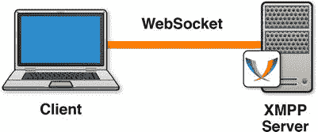

# 四、使用 XMPP 通过 WebSocket 构建即时消息和聊天

聊天是一个很好的例子，在一个只有 HTTP 的世界里，互联网应用变得越来越难构建。聊天和即时消息应用本质上是异步的:任何一方都可以随意发送消息，而不需要特定的请求或响应。这些应用是 WebSocket 的优秀用例，因为它们极大地受益于减少的延迟。当你与朋友和同事聊天时，你希望尽可能少的延迟，以便进行自然的对话。毕竟，如果有大量的延迟，它就很难成为即时消息。

即时通讯非常适合 WebSocket 聊天应用是这种技术的常见演示和例子。最常见的例子是使用简单的定制消息，而不是标准协议。在这一章中，我们将比这些基本演示更深入地探究，使用一个成熟的协议来挖掘大量不同的服务器实现、强大的功能以及经过验证的可伸缩性和可扩展性。

首先，我们探索 WebSocket 的分层协议，以及在构建使用 WebSocket 上的更高级协议的应用之前需要做出的一些关键选择。在这个例子中，我们使用 XMPP，它代表可扩展消息和存在协议，并且是在即时消息应用中广泛使用的标准。我们通过在 WebSocket 传输层上使用该协议来利用该协议进行通信。在我们的示例中，我们使用 XMPP over WebSocket 逐步将 web 应用连接到 Jabber Instant Messaging (IM) 网络，包括添加指示用户状态和在线状态的功能。

分层协议

在第三章中，我们讨论了 WebSocket 协议的简单演示，包括直接在 WebSocket 层发送和接收消息。我们的远程控制控制台示例演示了使用 WebSocket 构建涉及双向通信的简单应用是可能的。想象一下，扩展像遥控器这样的简单演示来构建更全功能的应用，如聊天客户端和服务器。WebSocket 的一个伟大之处在于，您可以在 WebSocket 的基础上构建其他协议，从而通过 Web 扩展您的应用。让我们来看看 WebSocket 上的分层协议。

图 4-1 显示了 TCP 上互联网应用层协议的典型分层。应用使用 XMPP 或 STOMP (简单的面向文本的消息协议 ??，我们将在第五章中讨论)之类的协议在客户端和服务器之间进行通信。XMPP 和 STOMP 依次通过 TCP 进行通信。使用加密通信时，应用层协议位于 TLS(或 SSL)之上，而 TLS 又位于 TCP 之上。


图 4-1 。互联网应用层图表

WebSocket 对世界的看法大同小异。图 4-2 显示了一个类似的图表，WebSocket 作为应用层协议和 TCP 之间的附加层被插入。XMPP 和 STOMP 分层在 WebSocket 之上，web socket 分层在 TCP 之上。在加密的情况下，使用`wss://`方案的安全 WebSocket 通信是通过 TLS 连接执行的。WebSocket 传输层是一个相对较薄的层，它使 web 应用能够建立全双工网络连接。WebSocket 层可以像图 4-1 中的 TCP 层一样处理，并用于所有相同的协议。


图 4-2 。Web 应用层图

图 4-2 包含 HTTP 有两个原因。首先，它说明了 HTTP 是作为 TCP 之上的应用层协议而存在的，可以直接在 web 应用中使用。AJAX 应用使用 HTTP 作为所有网络交互的主要或唯一协议。二、图 4-2 说明使用 WebSocket 的应用不需要完全忽略 HTTP。静态资源几乎总是通过 HTTP 加载。例如，即使您选择使用 WebSocket 进行通信，组成用户界面的 HTML、JavaScript 和 CSS 仍然可以通过 HTTP 提供服务。因此，在您的应用协议栈中，您可以通过 TLS 和 TCP 同时使用 HTTP 和 WebSocket。

当用作标准应用级协议的传输层时，WebSocket 确实大放异彩。这样做，您可以获得标准协议的惊人好处以及 WebSocket 的强大功能。让我们通过研究广泛使用的标准聊天协议 XMPP 来看看这些好处。

XMPP:一英里的 XML 流

您很有可能已经阅读和编写了 XML(可扩展标记语言)。XML 是基于尖括号的标记语言的悠久遗产的一部分，可以追溯到几十年前的 SGML、HTML 和它们的祖先。万维网联盟(W3C)发布了它的语法，许多 Web 技术都使用它。事实上，在 HTML5 之前，XHTML 是 HTML4 的继任者。XML 中的 X 代表可扩展，XMPP 利用了它提供的可扩展性。扩展 XMPP 意味着使用 XML 的扩展机制来创建名称空间，称为 xep(XMPP 扩展协议)。在`http://xmpp.org`有一个庞大的 xep 库。

XML 是一种文档格式；XMPP 是一种协议。那么，XMPP 是如何使用文档语法进行实时通信的呢？实现这一点的一种方法是在一个单独的文档中发送每条消息。然而，这种方法会不必要的冗长和浪费。另一种方法是将对话视为一个增长久而久之的长文档并传输消息，这就是 XMPP 处理文档语法的方式。XMPP 连接期间发生的双向会话的每个方向都由一个流式 XML 文档表示，该文档在连接终止时结束。该流式文档的根节点是一个`<stream/>`元素。流的顶层孩子是协议的单个数据单元，称为*节*。一个典型的小节可能看起来像清单 4-1 中的，去掉了空格以节省带宽。

***清单 4-1。*** XMPP 节

```html
<message type="chat" to="desktopuser@localhost">
<body>
  I like chatting. I also like angle brackets.
</body>
</message>
```

标准化

今天，您可以在 WebSocket 上使用 XMPP(XMPP/WS ),尽管没有这样做的标准。在工作和时间之后，IETF 有一个规范草案，也许有一天会激发出一个标准。还有几种 XMPP/WS 的实现，其中一些比另一些更具实验性。

WebSocket 上的 XMPP 标准将使独立的服务器和客户端实现以更高的成功概率进行互操作，并将确定将 XMPP 通信绑定到 WebSocket 传输层的所有选择。这些选择包括 WebSocket 和 TCP 之间的每个语义差异的选项，以及如何利用消息边界和操作码，如第三章中所讨论的。标准还将为 WebSocket 客户端和服务器能够识别的 WebSocket 握手中的协议头定义一个稳定的子协议名。在试验阶段，您找到或创建的使用 XMPP over WebSocket 的软件可能在这些选择上有所不同。每一种变化都有可能导致期望特定行为的客户机和服务器之间的不兼容。

虽然标准化的好处很多，但我们不需要等待一个完全成熟的标准来构建一个很酷的应用。我们可以选择一台客户机和一台服务器，我们知道它们可以很好地协同工作。例如，ejabberd-websockets 模块捆绑了一个 JavaScript 客户端库，它实现了 WebSocket 上 XMPP 的草案提案。或者，Kaazing WebSocket Gateway 是一个网关(服务器),包含一套兼容的客户端。

选择连接策略

使用 WebSocket 连接到 XMPP 服务器有两种方法:修改 XMPP 服务器以接受 WebSocket 连接或使用代理服务器。虽然您可以让 XMPP 服务器通过 WebSocket 接受 XMPP，但是这样做需要更新服务器，如果您不控制服务器操作，这可能是不可能的。像`talk.google.com`和`chat.facebook.com`这样的公共 XMPP 端点就是这种情况。在这些情况下，你需要根据`http://tools.ietf.org/html/draft-moffitt-xmpp-over-websocket-01`的规范创建你自己的模块。或者，在写这本书的时候，有一些实验性的模块:ejabberd-websockets 和 Openfire 的支持 WebSocket 的模块。图 4-3 显示了一个客户端连接到一个支持 WebSocket 的 XMPP 服务器。



图 4-3 。连接到支持 WebSocket 的 XMPP 服务器

第二种方法是使用一个代理服务器，它接受来自客户端的 WebSocket 连接，并与后端服务器建立相应的 TCP 连接。在这种情况下，后端服务器是标准的 XMPP 服务器，接受 TCP 连接上的 XMPP。Kaazing WebSocket 网关中的 XmppClient 采用了这种网关方法。在这里，应用可以通过 Kaazing 的网关连接到任何 XMPP 服务器，甚至是没有明确支持 WebSocket 的服务器。图 4-4 显示了一个 WebSocket 网关服务器接受 WebSocket 连接并对后端 XMPP 服务器进行相应的 TCP 连接的例子。


图 4-4 。通过 WebSocket 代理连接到 XMPP 服务器

节到消息对齐

在选择连接策略时，理解 WebSocket 消息(通常包含一个 WebSocket 框架)如何与 XMPP 节对齐是很重要的，因为这两种方法是不同的。在支持 WebSocket 的 XMPP 服务器的情况下，节被一对一地映射到 WebSocket 消息上。每个 WebSocket 消息只包含一个节，不能有重叠或分段。WebSocket 子协议的 XMPP 草案规定了这种一致性。在网关场景中，节到消息的对齐是不必要的，因为它将 WebSocket 转发给 TCP，反之亦然。TCP 没有消息边界，所以 TCP 流可能被任意分割成 WebSocket 消息。然而，在网关的情况下，客户机必须能够通过理解流式 XML 将字符整理成段。图 4-5 显示了 XMPP over WebSocket 子协议草案提案中描述的节到消息的对齐。关于注册 WebSocket 子协议草案的讨论，参见第二章和第三章。

下图显示了在 XMPP 服务器可以通过 WebSocket 直接与客户机通信的情况下，WebSocket 消息是如何与 XMPP 节对齐的。


图 4-5 。节到消息的一致性(XMPP over WebSocket 子协议草案提案)

图 4-6 显示了一个节与信息不一致的例子。该图显示了 WebSocket 消息如何不需要与节对齐，其中代理服务器接受 WebSocket 连接并通过 TCP 连接到后端 XMPP 服务器。


图 4-6 。没有节到消息的对齐(WebSocket 到 TCP 代理

联合会

许多即时通讯网络是有围墙的花园。拥有特定网络帐户的用户只能相互聊天。相反，Jabber ( `http://www.jabber.org`)是联合的，这意味着独立运行的服务器上的用户可以在服务器合作的情况下进行通信。Jabber 网络由不同域上的数千个服务器和数百万个用户组成。为联合配置服务器超出了本书的范围。在这里，我们着重于将客户机连接到一台服务器。您可以稍后将您的服务器连接到更大的联邦世界。

通过 WebSocket 构建聊天和即时消息应用

既然我们已经了解了在 WebSocket 上使用 XMPP 背后的一些重要概念，那么让我们来看一个工作示例，并深入研究更实际的细节。这里，我们将使用支持 WebSocket 的 XMPP 服务器，并构建一个典型的聊天应用，该应用通过 WebSocket 使用 XMPP 与服务器进行通信。

使用支持 WebSocket 的 XMPP 服务器

为了构建和运行本章的示例聊天应用，您需要一个支持 WebSocket 的 XMPP 聊天服务器，它与客户端库兼容。正如我们提到的，在撰写本书时，有几个选项，包括 ejabberd-websockets，一个 Openfire 模块，以及一个名为 node-xmpp-bosh 的代理，它理解 WebSocket 协议，这是一个由 Dhruv Matan 构建的开源项目。由于这些模块的实验性质，您的收获可能会有所不同。然而，这些模块正在被快速开发，在这本书出版(或你的阅读)之前，你可能会有许多可靠的选择。

 **注意**对于这个前沿例子，我们选择 Strophe.js 作为客户端库。要自己构建这个示例，请选择一个支持 WebSocket 的 XMPP 服务器(或者更新您自己的 XMPP 服务器),并确保它与 Strophe.js 兼容。或者，如前所述，要构建(甚至遵循)本书中的示例，您可以使用我们创建的虚拟机(VM ),它包含我们在示例中使用的所有代码、库和服务器。关于如何下载、安装和启动虚拟机的说明，请参考附录 B 。由于本章中使用的技术的实验性质以及出于学习目的，我们强烈建议您使用我们提供的 VM。

设置测试用户

为了测试您的聊天应用，您需要一个至少有两个用户的消息传递网络来演示交互。为此，在支持 WebSocket 的聊天服务器上创建一对用户。然后，您可以使用这些测试用户使用您将在本章中构建的应用来来回回地聊天。

为了确保您的服务器配置正确，请尝试连接两个桌面 XMPP 客户端。例如，您可以安装以下任意两个客户端:Pidgin、Psi、Spark、Adium 或 iChat。你可以在`http://xmpp.org`找到更多信息。很可能你已经安装了一两个。在第一个聊天客户端中，您应该看到第二个用户的在线状态。同样，您应该在第二个客户机中看到第一个用户的状态。让其中一个用户保持登录状态，这样您就可以在开发 WebSocket 聊天应用时对其进行测试。

客户端库 : Strophe.js

要使您的聊天应用能够通过 WebSocket 使用 XMPP 与您的聊天服务器进行通信，您需要一个客户端库，使客户端能够与 XMPP 进行交互。在这个例子中，我们使用 Strophe.js，这是一个可以在 web 浏览器中运行的 JavaScript 的开源 XMPP 客户端库。js 提供了一个与 XMPP 交互的底层 API，并包含了构造、发送和接收节的函数。要构建像聊天客户端这样的高级抽象，您需要一些 XMPP 知识。然而，Strophe.js 具有天然的可扩展性，并为使用该库的开发人员提供了精确的控制。

在写这本书的时候，Strophe.js 的稳定分支使用了一个叫做 BOSH 的通信层。在 XEP-0124 扩展中指定的 BOSH 代表同步 HTTP 上的双向流。这是一种特定于 XMPP 的方式，通过半双工 HTTP 实现双向通信，类似于第一章中提到的 Comet 技术。BOSH 比 WebSocket 更早，是出于解决 HTTP 的局限性的类似需求而开发的。

WEBSOCKET，不是 BOSH

ejabberd-websocket 自述文件将 websocket 上的 XMPP 称为“对 Bosh 更优雅、更现代、更快速的替代”当然，现在 WebSocket 已经被标准化，并且即将被普遍部署，类似 Comet 的通信技术很快就会过时。

关于 WebSocket 仿真的讨论，请参见第八章，其中讨论了如何将 WebSocket 与没有本地支持的技术一起使用。

连接和开始使用

在开始聊天之前，您需要将客户端连接到 XMPP/WS 服务器。在这一步中，我们将建立一个从运行在 web 浏览器中的 HTML5 客户端应用到支持 WebSocket 的 XMPP 服务器的连接。一旦连接，套接字将在会话期间在客户机和服务器之间来回发送 XMPP 节。

首先，创建一个名为`chat.html`的新文件，如清单 4-2 所示。应用的 HTML 部分只是一个基本页面，包括 Strophe.js 库和组成聊天应用的 JavaScript。

***清单 4-2。*** 聊天. html

```html
<!DOCTYPE html>
<title>WebSocket Chat with XMPP</title>
<meta charset="UTF-8">
<link rel="stylesheet" href="chat.css">
<h1>WebSocket Chat with XMPP</h1>

<!-- connect -->
<div class="panel">
   <input type="text" id="username" placeholder="username">
   <input type="password" id="password" placeholder="password">
   <button id="connectButton">Connect</button>
</div>

<div id="presenceArea" class="panel"></div>
<div id="chatArea" class="panel"></div>
<div id="output"></div>

<!-- scripts -->
<script src="strophe.js"></script>
<script src="chat_app.js"></script>
```

我们将把这个 HTML 文档与一个小小的 CSS 文件链接起来，为用户界面增加一点风格，如清单 4-3 所示。

***清单 4-3。*** 聊天. css

```html
body {
 font-family: sans-serif;
}

#output {
  border: 2px solid black;
  border-radius: 8px;
  width: 500px;
}
   #output div {
     padding: 10px;
   }
   #output div:nth-child(even) {
     background-color: #ccc;
   }

panel {
 display: block;
 padding: 20px;
 border: 1px solid #ccc;
}
```

我们将从最小版本的`chat_app.js`开始，随着我们扩展这个例子的功能，我们将增加它。首先，脚本将简单地用 Strophe.js 连接到 XMPP 服务器，并记录其连接状态。它还使用两个输入值:用户名和密码。这些值用于在建立连接时验证用户。

***清单 4-4。***chat _ app . js 初始版本

```html
// Log messages to the output area
var output = document.getElementById("output");
function log(message) {
   var line = document.createElement("div");
   line.textContent = message;
   output.appendChild(line);
}

function connectHandler(cond) {
 if (cond == Strophe.Status.CONNECTED) {
   log("connected");
   connection.send($pres());
   }
}

var url = "ws://localhost:5280/";
var connection = null;

var connectButton = document.getElementById("connectButton");
connectButton.onclick = function() {
   var username = document.getElementById("username").value;
   var password = document.getElementById("password").value;
connection = new Strophe.Connection(
   {proto: new Strophe.Websocket(url)});
   connection.connect(username, password, connectHandler);
}
```

请注意，这个示例要求用户输入他或她的凭证。在生产中，确保凭据不在未加密的情况下通过网络发送是非常重要的。实际上，根本不通过网络发送凭证要好得多。有关使用 WebSocket 加密和认证的信息，请参见第七章。如果您的聊天应用是一个更大的 web 应用套件的一部分，您可能希望使用单点登录机制，特别是如果您正在为一个更大的站点构建一个聊天小部件，或者如果您的用户使用外部凭证进行身份验证。

如果一切按计划进行，您应该看到页面上登录了“connected”。如果是这样，那么您已经成功地使用 XMPP over WebSocket 将用户登录到了聊天服务器。您应该会在之前保持连接的另一个 XMPP 客户端的花名册 UI 中看到连接的用户已经上线(参见图 4-7 )。


图 4-7 。从 chat.html 登陆，用洋泾浜语出现在网上。开发人员工具中显示的每个 WebSocket 消息都包含一个 XMPP 节

 **注意**connect 处理程序中的`$pres()`函数调用是必要的，用于指示用户已经在线登录。这些存在更新可以传达更多的细节，我们将在下一节中看到。

存在和状态

现在我们知道我们可以连接用户，让我们看一下跟踪用户的存在和状态。web 用户在桌面用户的联系人列表中看起来在线的方式是由于 XMPP 的在线特性。甚至当你不聊天的时候，在线状态信息也不断地从服务器中推出。当您的联系人在线登录、变为空闲状态或更改其状态文本时，您可能会收到状态更新。

在 XMPP 中，每个用户都有一个存在。存在具有可用性值，由*显示*标签和*状态消息*表示。要更改这个存在信息，发送一个存在节，如清单 4-5 所示:

***清单 4-5。*** 在场小节示例

```html
<presence>
<show>chat</show>
   <status>Having a lot of fun with WebSocket</status>
</presence>
```

让我们为用户添加一个方法来改变他们的状态为`chat_app.js`(参见清单 4-6 )。首先，我们可以添加一些基本的表单控件来设置状态的在线/离线部分，在 XMPP 的说法中称为`show`。这些控件将显示为下拉菜单，其中包含四个可用性选项。下拉菜单中的值具有简短的指定名称，如“请勿打扰”的“dnd”我们还会给这些人类可读的标签，如“离开”和“忙碌”

***清单 4-6。*** 存在更新 UI

```html
// Create presence update UI
var presenceArea = document.getElementById("presenceArea");
var sel = document.createElement("select");
var availabilities = ["away", "chat", "dnd", "xa"];
var labels = ["Away", "Available", "Busy", "Gone"];
for (var i=0; i<availabilities.length; i++) {
   var option = document.createElement("option");
   option.value = availabilities[i];
   option.text = labels[i];
   sel.add(option);
}
presenceArea.appendChild(sel);
```

状态文本是自由格式的，所以我们将使用 input 元素，如清单 4-7 所示。

***清单 4-7。*** 状态文本的输入元素

```html
var statusInput = document.createElement("input");
statusInput.setAttribute("placeholder", "status");
presenceArea.appendChild(statusInput);
```

最后，我们将添加一个按钮，使得更新被发送到服务器(见清单 4-8 )。函数构建了一个 presence 节。为了更新连接用户的状态，presence 节包含两个子节点:`show`和`status`。尝试一下，注意桌面客户端几乎即时反映了 web 用户的状态。图 4-8 说明了到目前为止的例子。

***清单 4-8。*** 按钮事件发送更新

```html
var statusButton = document.createElement("button");
statusButton.onclick = function() {
   var pres = $pres()
   .c("show").t("away").up()
   .c("status").t(statusInput.value);
   connection.send(pres)
}
presenceArea.appendChild(statusButton);
```


图 4-8 。从浏览器更新在线状态。客户端发送的最新 WebSocket 消息包含客户端的 presence stanza.message

要在我们的 web 应用中查看其他用户的状态更新，我们需要理解传入的状态节。在这个简化的例子中，这些存在更新将被记录为文本。清单 4-9 展示了如何在`chat_app.js`中做到这一点。在成熟的聊天应用中，在线状态更新通常在聊天对话旁边更新。

***清单 4-9。*** 处理状态更新

```html
function presenceHandler(presence) {
   var from = presence.getAttribute("from");
   var show = "";
   var status = "";
   Strophe.forEachChild(presence, "show", function(elem) {
      show = elem.textContent;
   });
Strophe.forEachChild(presence, "status", function(elem) {
   status = elem.textContent;
});

//
   if (show || status){
      log("[presence] " + from + ":" + status + " " + show);
   }

// indicate that this handler should be called repeatedly
   return true;
}
```

为了用这个函数处理存在更新，我们用连接对象注册了处理程序(见清单 4-10 )。对`addHandler()`的调用将把`presenceHandler()`函数与每个 presence 节关联起来。

***清单 4-10。*** 注册出席处理器

```html
connection.addHandler(presenceHandler, null, "presence", null);
```

图 4-9 显示了当 websocketuser 使用桌面客户端将他的在线状态更新为“去钓鱼-请勿打扰”时，浏览器客户端会立即显示出来。


图 4-9 。在浏览中观察存在变化 r

交换聊天信息

在这里，我们得到了任何即时消息应用的核心:聊天消息。聊天消息被表示为消息节，其类型属性被设置为`chat`。Strophe.js 连接 API 有一个`addHandler()`函数，让我们监听与该类型匹配的传入消息节，如清单 4-11 所示。

***清单 4-11。*** 监听传入的“聊天”消息小节

```html
function messageHandler(message) {
   var from = message.getAttribute("from");
   var body = "";
   Strophe.forEachChild(message, "body", function(elem) {
      body = elem.textContent;
});

// Log message if body was present
if (body) {
   log(from + ": " + body);
}

// Indicate that this handler should be called repeatedly
   return true;
}
```

我们还需要在连接后将这个处理程序与连接关联起来，如清单 4-12 所示。

***清单 4-12。*** 将 addHandler 与连接关联

```html
connection.addHandler(messageHandler, null, "message", "chat");
```

现在，试着从你的聊天客户端，比如 Pidgin，发送一条消息给网络用户。应该用消息节调用消息处理函数。图 4-10 说明了一个聊天消息交换。


图 4-10 。洋泾浜语和 chat.html 语的聊天

要将消息发送回 web 用户，您需要向服务器发送一个消息节。这个消息节必须有一个类型属性`"chat"`和一个包含实际聊天文本的主体元素，如清单 4-13 所示。

***清单 4-13。*** 向服务器发送消息段

```html
<message type="chat" to="desktopuser@localhost">
<body>

   I like chatting. I also like angle brackets.
</body>
</message>
```

要用 Strophe.js 构建这个消息，使用`$msg` builder 函数。创建一个消息节，将*类型*属性设置为`chat`，将*到*属性设置为您想与之聊天的用户。在您通过连接发送消息后，其他用户应该会很快收到消息。清单 4-14 显示了这个消息节的一个例子。

***清单 4-14。*** 用 Strophe.js 构建消息

```html
// Create chat UI
var chatArea = document.getElementById("chatArea");
var toJid = document.createElement("input");
toJid.setAttribute("placeholder", "user@server");
chatArea.appendChild(toJid);

var chatBody = document.createElement("input");
chatBody.setAttribute("placeholder", "chat body");
chatArea.appendChild(chatBody);

var sendButton = document.createElement("button");
sendButton.textContent = "Send";
sendButton.onclick = function() {
   var message = $msg({to: toJid.value, type:"chat"})
  .c("body").t(chatBody.value);
 connection.send(message);
}
chatArea.appendChild(sendButton);
```

现在，你们在聊天。当然，您可以在 web 客户端、桌面客户端或两者的组合之间聊天。这个聊天应用是 HTML5 和 WebSocket 的一个很好的例子，通过与标准网络协议的集成，在 web 浏览器中实现了桌面级的体验。这个 web 应用是桌面客户端的真正对等体。它们都是同一网络中的一流参与者，因为它们理解相同的应用层协议。是的，XMPP 是一个标准协议，即使这个特定的 WebSocket 层还没有标准化。它保留了 XMPP 相对于 TCP 的几乎所有优点，即使是作为草案。

任何数量的 web 和桌面客户端之间的对话都是可能的。相同的用户可以从任一客户端连接。在图 4-11 中，两个用户都在使用 web 客户端。


图 4-11 。网络客户之间的对话

乒乒乓乓

根据您的服务器配置，该应用可能会在一段时间后自动断开连接。断开连接可能是因为服务器发送了一个 ping，而客户端没有立即响应一个 pong。在 XMPP 中使用 Pings 和 pongs 的目的与在 WebSocket 中使用的目的相同:保持连接活动并检查连接的健康状况。Pings 和 pongs 使用 *iq* 节。在 XMPP 中，“iq”代表 info/query，是在异步连接之上执行请求/响应查询的一种方式。阿萍长得像清单 4-15 。

***清单 4-15。***XMPP 服务器 ping

```html
<iq type="get" id="86-14" from="localhost"
   to="websocketuser@localhost/cc9fd219" >
   <ping />
</iq>
```

服务器将期待一个带有匹配 ID 的 *iq* 结果形式的响应(见清单 4-16 )。

***清单 4-16。***设置客户端响应

```html
<iq type="result" id="86-14" to="localhost"
   from "websocketuser@localhost/cc9fd219" />
```

为了处理 Strophe.js 中的 pings，我们需要注册一个函数来处理所有带有`urn:xmpp:ping`名称空间和`type="get"`的 iq 节(参见清单 4-17 )。和前面的步骤一样，我们通过在 connection 对象上注册一个处理程序来实现这一点。处理程序代码构建适当的响应，并将其发送回服务器。

***清单 4-17。*** 为 iq 节注册一个处理程序

```html
function pingHandler(ping) {
   var pingId = ping.getAttribute("id");
   var from = ping.getAttribute("from");
   var to = ping.getAttribute("to");
   var pong = $iq({type: "result", "to": from, id: pingId, "from": to});
   connection.send(pong);

// Indicate that this handler should be called repeatedly
   return true;
}
```

清单 4-18 显示了处理程序是如何注册的。

***清单 4-18。*** 注册 addHandler

```html
connection.addHandler(pingHandler, "urn:xmpp:ping", "iq", "get");
```

已完成的聊天应用

清单 4-19 显示了完整的端到端聊天应用，包括 pings 和 pongs。

***清单 4-19。*** 最终版 chat_app.js

```html
// Log messages to the output area
var output = document.getElementById("output");
function log(message) {
   var line = document.createElement("div");
   line.textContent = message;
   output.appendChild(line);
}

function connectHandler(cond) {
   if (cond == Strophe.Status.CONNECTED) {
      log("connected");
      connection.send($pres());
   }
}

var url = "ws://localhost:5280/";
var connection = null;

var connectButton = document.getElementById("connectButton");
connectButton.onclick = function() {
   var username = document.getElementById("username").value;
   var password = document.getElementById("password").value;
   connection = new Strophe.Connection({proto: new Strophe.Websocket(url)});
   connection.connect(username, password, connectHandler);

// Set up handlers
   connection.addHandler(messageHandler, null, "message", "chat");
   connection.addHandler(presenceHandler, null, "presence", null);
   connection.addHandler(pingHandler, "urn:xmpp:ping", "iq", "get");
}

// Create presence update UI
var presenceArea = document.getElementById("presenceArea");
var sel = document.createElement("select");
var availabilities = ["away", "chat", "dnd", "xa"];
var labels = ["Away", "Available", "Busy", "Gone"];
for (var i=0; i<availabilities.length; i++) {
   var option = document.createElement("option");
   option.value = availabilities[i];
   option.text = labels[i];
   sel.add(option);
}
presenceArea.appendChild(sel);

var statusInput = document.createElement("input");
statusInput.setAttribute("placeholder", "status");
presenceArea.appendChild(statusInput);

var statusButton = document.createElement("button");
statusButton.textContent = "Update Status";
statusButton.onclick = function() {
   var pres = $pres();
      c("show").t(sel.value).up();
      c("status").t(statusInput.value);
   connection.send(pres);
}
presenceArea.appendChild(statusButton);
function presenceHandler(presence) {
   var from = presence.getAttribute("from");
   var show = "";
   var status = "";

Strophe.forEachChild(presence, "show", function(elem) {
   show = elem.textContent;
});

Strophe.forEachChild(presence, "status", function(elem) {
   status = elem.textContent;
});

if (show || status){
   log("[presence] " + from + ":" + status + " " + show);
}

// Indicate that this handler should be called repeatedly
   return true;
}

// Create chat UI
var chatArea = document.getElementById("chatArea");
var toJid = document.createElement("input");
toJid.setAttribute("placeholder", "user@server");
chatArea.appendChild(toJid);

var chatBody = document.createElement("input");
chatBody.setAttribute("placeholder", "chat body");
chatArea.appendChild(chatBody);

var sendButton = document.createElement("button");
sendButton.textContent = "Send";
sendButton.onclick = function() {
   var message = $msg({to: toJid.value, type:"chat"})
   .c("body").t(chatBody.value);
   connection.send(message);
}
chatArea.appendChild(sendButton);

function messageHandler(message) {
   var from = message.getAttribute("from");
   var body = "";
   Strophe.forEachChild(message, "body", function(elem) {
      body = elem.textContent;
});

// Log message if body was present
if (body) {
   log(from + ": " + body);
}

// Indicate that this handler should be called repeatedly
   return true;
}

function pingHandler(ping) {
   var pingId = ping.getAttribute("id");
   var from = ping.getAttribute("from");
   var to = ping.getAttribute("to");

   var pong = $iq({type: "result", "to": from, id: pingId, "from": to});
   connection.send(pong);

// Indicate that this handler should be called repeatedly
   return true;
}
```

建议的延期

既然我们已经构建了一个基本的基于浏览器的聊天应用，您可以利用这个例子并做许多其他很酷的事情来将它变成一个成熟的应用。

构建用户界面

我们的示例网页`chat.html`，显然没有最漂亮或最有用的用户界面。考虑增强您的聊天客户端的 UI，加入更多用户友好的功能，如选项卡式对话、自动滚动和可见的联系人列表。将它构建为 web 应用的另一个好处是，您拥有许多强大的工具，可以用 HTML、CSS 和 JavaScript 来实现华丽而灵活的设计。

使用 XMPP 扩展

XMPP 有丰富的扩展生态系统。在`http://xmpp.org`上有数百个扩展提案或“xep”。这些功能从头像和群聊到 VOIP 会话初始化。

XMPP 是向 web 应用添加社交功能的好方法。对联系人、状态和聊天的内置支持提供了一个社交核心，您可以在此基础上添加协作、社交通知等。很多扩展都有这个目标。其中包括用于微博、评论、头像和发布个人事件流的 xep。

连接到 Google Talk

你可能从 Gmail 和 Google+中熟悉的聊天服务 Google Talk 实际上是 Jabber IM 网络的一部分。有一个可公开访问的 XMPP 服务器在端口`5222`上监听`talk.google.com`。如果你有一个 Google 帐户，你可以将任何兼容的 XMPP 客户端指向那个地址并登录。要使用您自己的 web 客户端连接到 Google Talk，请将 WebSocket 代理服务器指向该地址。该服务器需要加密，因此请确保该服务器配置为通过 TLS 进行连接。

摘要

在这一章中，我们探讨了如何在 WebSocket 上分层协议，特别是标准协议，以及 XMPP 这样的标准应用层协议如何适应标准的 web 架构。我们通过 WebSocket 构建了一个简单的聊天客户端，它使用了广泛使用的聊天协议 XMPP。在这样做的过程中，我们看到了使用 WebSocket 作为传输层以及这个标准应用层协议将 web 应用连接到交互式网络的强大功能。

在下一章中，我们将在 WebSocket 上使用 STOMP 来构建一个功能丰富的实时消息应用。