# 五、通过 STOMP 使用 WebSocket 上的消息传递

在前一章中，我们探讨了在 WebSocket 上分层协议的概念，以及在 WebSocket 上分层基于标准的协议的一些主要好处。具体来说，我们着眼于在 WebSocket 上构建一个标准的即时消息和存在协议 XMPP。在这一章中，我们将研究如何在 WebSocket 中使用消息传递协议。

消息传递是一种架构风格，其特点是在独立组件之间发送异步消息，允许您构建松散耦合的系统。消息传递为通信模式提供了一个抽象层，因此是编写网络应用的一种非常灵活和强大的方式。

消息传递中的关键角色是消息代理和客户端。消息代理接受来自客户端的连接，处理来自客户端的消息，并向客户端发送消息。代理还可以处理身份验证、授权、消息加密、可靠的消息传递、消息节流和扇出等职责。当客户机连接到消息代理时，它们可以向代理发送消息，也可以接收代理发送给它们的消息。这种模型称为发布/订阅，其中消息代理发布大量消息，客户端订阅所有消息，或者更常见的是订阅消息的子集。

消息传递也广泛用于企业中，以集成不同的企业应用。除了松散耦合的企业系统，企业消息传递还关注关键的企业需求，包括加密、单点登录、授权、高可用性和可伸缩性。

类似于我们如何在 WebSocket 上分层 XMPP，您也可以在 WebSocket 上分层发布/订阅协议。发布/订阅(或通俗地说，发布/订阅)协议的一个例子是 STOMP(简单或面向流文本的消息协议)。图 5-1 显示了 STOMP over WebSocket 如何与其他协议的分层相关联。

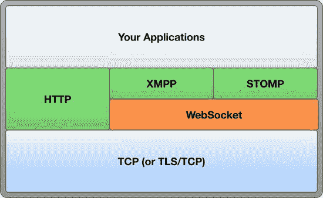

图 5-1 。在 WebSocket 上分层踩踏

WebSocket 非常适合典型的消息传递体系结构，在这种体系结构中，可能有大量的消息以很快的速度从消息代理流向客户端。例如，消息传递的一个典型用例是客户订阅外汇或股票信息；在这种情况下，消息(汇率、股票价值等)非常小，但是客户端实时、低延迟地接收消息对于应用的成功至关重要。基于到目前为止您在本书中学到的东西，您可以看到 WebSocket 是如何非常适合这种应用的。

在这一章中，我们将研究 pub/sub 模型，一个广泛使用的协议(STOMP ),然后逐步构建你自己的 pub/sub 应用——一个游戏！—使用 STOMP over WebSocket。我们将使用流行的开源消息代理 Apache ActiveMQ ,并探索在您自己的架构中使用 STOMP 和 WebSocket 的一些方法。

 **注意**STOMP 定义的*文本*部分表示该协议是面向文本的。第六章关注 RFB 协议，描述了如何在 WebSocket 上使用面向二进制的协议。

发布和订阅模型概述

一种常见的消息传递模式是发布/订阅模式(pub/sub)。在发布/订阅模式中，客户端连接到分发消息的代理。客户端可以向代理发布消息和/或订阅一个或多个消息源。

在消息世界中，有两种常用的消息分发技术，如图 5-2 中的所示:

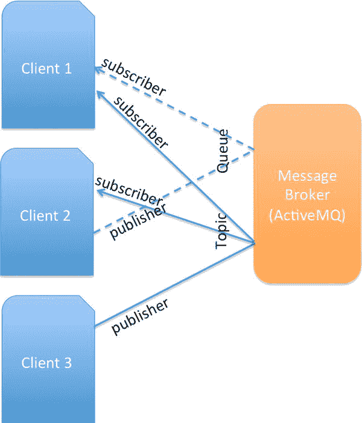

图 5-2 。带主题和队列的消息传递

*   队列:将消息传递给单个消费者的分发机制。任意数量的客户端(发布者)可以向队列发布消息，但是每个消息都由一个且只有一个客户端(消费者)使用。
*   主题:向多个消费者传递消息的分发机制。任意数量的客户机(发布者)可以向一个主题发布消息，任意数量的客户机(消费者)可以消费它们。

 **注意**不是每个消息代理都使用主题和队列。不过，在本章中，我们使用 Apache ActiveMQ，它支持主题和队列。

使用 WebSocket 的次数越多，就越会意识到构建基于 WebSocket 的应用的需求类似于经典的消息传递概念。例如，您可能希望通过向大量客户端分发大量消息来将企业消息传递协议的范围扩展到 Web。或者，假设您正在构建一个协作应用，该应用要求您的 WebSocket 客户端向其他 WebSocket 客户端发送数据，并从其他 web socket 客户端接收数据。这两个例子说明了消息传递应用和 WebSocket 应用。正如您将在本章中看到的，这两种技术配合得很好，通过 WebSocket 对消息进行分层使您能够构建强大的消息应用。

消息系统在与客户端集成的方式上有所不同。有些，比如支持 STOMP 的代理，提供协议级的互操作性。任何实现兼容协议客户端的人都可以从任何平台和语言连接到这些系统。其他的提供了为系统供应商选择的一些平台提供的 API。

最简单、开放、广泛使用的消息传递协议是 STOMP:简单(或流)面向文本的消息传递协议。企业中使用最广泛的消息传递 API 是 JMS: Java 消息服务。与 STOMP 不同，它通过定义一个有线协议来促进互操作性，JMS 只是一个 API。STOMP 已经为许多不同的语言实现了；由于其 API 的性质，JMS 几乎独占了 Java 世界。

一个新标准化的开放消息协议是 AMQP :高级消息队列协议。AMQP 1.0 于 2012 年 10 月成为绿洲标准。虽然 AMQP 的创建得到了业界的广泛支持，但它是否能像 STOMP 和 JMS 那样受欢迎并取得成功还有待观察。要了解更多关于 AMQP 的信息，请参见`http://amqp.org`。

在本章中，我们将通过 WebSocket 使用 STOMP(STOMP/WS)。但是，如果您对 JMS 或 WebSocket 上的 AMQP 感兴趣，有供应商和项目可以为您提供这些功能。此外，WebSocket 上有几个专有的发布/订阅实现:有些很简单，有些更复杂。请参见附录 B 了解当前可能提供您所需支持的 WebSocket 服务器列表。本章中的步骤也有望帮助您对 WebSocket 上的发布/订阅实现的工作原理有一个总体的了解。

STOMP 简介

STOMP 是一种用于消息传递的开放协议，最初是为了与 Apache ActiveMQ 一起使用而开发的，现已广泛传播到其他系统。STOMP 没有主题或队列。从目的地发送和接收 STOMP 消息；STOMP 服务器决定这些目的地的行为方式。这种行为类似于 HTTP，因为服务器只有 URL，由服务器决定如何服务这些 URL。在本章构建的例子中，我们使用了带有 ActiveMQ 的 STOMP。ActiveMQ 使用目的地名称来公开消息传递特性，包括主题和队列、临时目的地和分层订阅。

关于名字中包含“简单”一词的标准，有一个流传已久的笑话:它们几乎普遍过于复杂。示例包括 SNMP(简单网络管理协议)、SOAP(简单对象访问协议)和 SMTP(简单邮件传输协议)。STOMP 是一个真正简单的 ?? 协议:它面向文本，在外观上类似于 HTTP。每个帧由命令、帧头和帧体组成。STOMP 消息正文可以包含任何文本或二进制数据。清单 5-1 显示了一个包含文本主体的示例`SEND`框架。这个例子描述了一个空终止的`SEND`帧，它发送一个消息到一个名为`/topic/hello/world`的目的地。消息末尾的黑色方块表示 NULL，这是一个不可打印的字符。

***清单 5-1。*** 一个空终止发送帧

```html
SEND

destination: /topic/hello/world

content-type: text/plain

hello, world!
```


content-length 标头传达了帧体的大小。这个标题是可选的。没有内容长度头的消息以空(`0x00`)字节结束，以标记其正文内容的结束。以这种方式终止的消息在其有效负载中间不能包含空字节。

 **注意**STOMP 帧的语法由您可以在应用中使用的客户端和服务器软件处理，但是如果您想开发自己的实现，可以参考`http://stomp.github.com`中的规范。

您可以像任何 TCP 级协议一样在 WebSocket 上分层 STOMP，或者对齐它，使每个 STOMP 帧正好占用一个 WebSocket 帧。

网络信息入门

现在我们已经研究了消息传递的概念，以及 WebSocket 可以给 STOMP 这样的消息传递协议带来的一些好处，让我们构建一个消息传递应用的工作示例，它使用 STOMP over WebSocket 通过消息代理向客户端传递消息。

在这个例子中，我们将使用广泛可用的开源消息代理 Apache ActiveMQ，它支持 WebSocket。我们将逐步配置 ActiveMQ 来接受 WebSocket 连接，允许我们使用 STOMP over WebSocket 进行通信。ActiveMQ 还方便地包含了开箱即用的演示，我们将使用它来浏览我们已经讨论过的一些概念。然后，我们将构建自己的 STOMP/WS 应用。你可以在`http://activemq.apache.org`了解更多关于 ActiveMQ 的信息。

 **注意**为了构建(甚至跟随)本书中的例子，你可以选择使用我们已经创建的虚拟机(VM ),它包含了我们在例子中使用的所有代码、库和服务器。关于如何下载、安装和启动虚拟机的说明，请参考附录 B 。

设置消息代理

首先，从`http://activemq.apache.org/download.html`下载消息代理。在写这本书的时候，最新的可用 ActiveMQ 版本是 5.7，支持 STOMP 1.1，但是更新的版本应该也可以。

 **注意**ActiveMQ 下载有两种版本:一种用于 Windows ( `*.zip`)，一种用于各种 Unix 版本:Linux、Unix 和 Mac ( `*.tar.gz`)。

下载并解压 ActiveMQ 后，你的目录结构应该类似于图 5-3 所示。

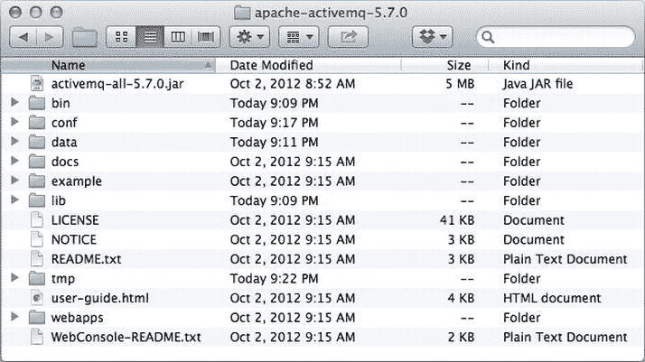

图 5-3 。安装后的 ActiveMQ 主目录

要启动 ActiveMQ，请打开终端并导航到 ActiveMQ 主目录中的`bin`目录，这是您提取 ActiveMQ 的目录。运行清单 5-2 中的命令。

***清单 5-2。*** 启动 Apache ActiveMQ

```html
$> ./activemq console
```

成功启动 ActiveMQ 后，可以在`http://0.0.0.0:8161`打开浏览器，导航到欢迎页面，如图图 5-4 所示。

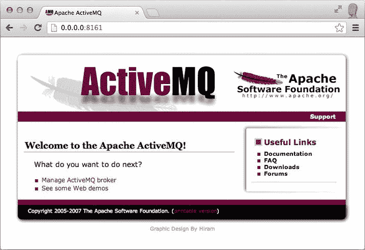

图 5-4 。Apache ActiveMQ 欢迎页面

欢迎页面列出了有用的链接。第一个链接 Manage ActiveMQ broker 将您带到 ActiveMQ 管理控制台，我们将在后面更深入地描述它。第二个链接“查看一些 Web 演示”会将您带到产品附带的演示的启动页面。单击查看一些 Web 演示链接，或者简单地将`/demo`附加到 URL: `http://0.0.0.0:8161/demo`。

列表中的第一个演示是 WebSocket 示例。为了让这个演示工作，我们需要配置实现 STOMP over 的 WebSocket 传输。在您的终端中，停止 ActiveMQ 例如，如果您使用清单 5-1 中的命令启动它，只需按 Ctrl+C。一旦您停止了 ActiveMQ，您现在就可以配置消息代理使用 WebSocket。

首先，打开文件`ActiveMQ_HOME/conf/activemq.xml`，搜索字符串`transportConnectors`。在 openwire 传输连接器下面，添加清单 5-3 中的代码片段。

***清单 5-3。*** 声明 WebSocket 连接器

```html
<transportConnectors>
<transportConnector name="websocket" uri="ws://0.0.0.0:61614"/>
</transportConnectors>
```

现在，您的`activemq.xml`文件 的传输连接器部分应该看起来类似于清单 5-4 (突出显示了新添加的部分)。

***清单 5-4。*** 带有 WebSocket 连接器的 activemq.xml 片段

```html
<!-- The transport connectors expose ActiveMQ over a given
protocol to clients and other brokers. For more
      information, see:
      http://activemq.apache.org/configuring-transports.html-->
<transportConnectors>
   <transportConnector name="openwire" uri="tcp://0.0.0.0:61616"/>
</transportConnectors>
<transportConnectors>
      <transportConnector name="websocket" uri="ws://0.0.0.0:61614"/>
</transportConnectors>
```

保存`activemq.xml`文件并再次启动 ActiveMQ，如清单 5-2 所示。通过在控制台中查找清单 5-5 中显示的行，确认 WebSocket 连接器已经启动。

***清单 5-5。*** 表示 WebSocket 连接器已经启动的日志消息

```html
INFO | Connector websocket Started
```

现在，您已经准备好开始作为 ActiveMQ 的一部分提供的 WebSocket 示例了。导航到`http://0.0.0.0:8161/demo`，点击 WebSocket 示例链接，或者直接在浏览器地址栏`http://0.0.0.0:8161/demo/websockets.html`中输入直接 URL 。

图 5-5 显示了在这个网址显示的页面。

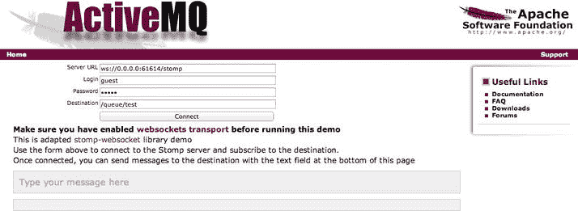

图 5-5 。Apache ActiveMQ 附带的 WebSocket 演示

 **注意**要对演示进行故障排除或了解更多有关使用 ActiveMQ 配置 WebSocket 的信息，请参见`http://activemq.apache.org/websockets.html`中的产品说明。

看到 STOMP 概念的实际应用

ActiveMQ 的 WebSocket 演示演示了我们在本章前面讨论的一些基本的 STOMP 概念，并提供了一种在我们自己构建应用之前查看它们的简单方法。让我们看看这些概念是如何出现在这个演示中的。

要开始，您必须首先连接到服务器。当我们更新`activemq.xml`文件时，我们在`ws://0.0.0.0:61614/stomp`设置了服务器 URL。您现在可以使用此 URL。然后，您需要提供用户凭证:用户名和密码。我们将使用`guest`作为用户名(在示例中标记为 Login)和密码。最后，必须提供一个队列作为目的地。默认情况下，它被称为测试。前缀`/queue`表示这是一个队列，`/test`是队列的名称。随意更改字符串的后半部分，比如:`/queue/stompDemo`。

 **注意**为了让演示工作，你只需要改变服务器的 URL。一定要用`0.0.0.0`而不是`localhost`。所有其他字段都是为您预先填充的，您不需要更改它们。

点击连接后，显示您的应用，如图图 5-6 所示。

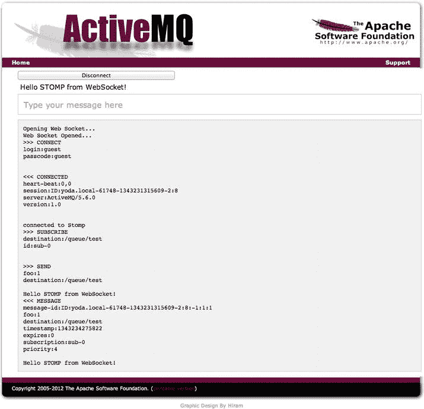

图 5-6 。运行 Apache ActiveMQ WebSocket 演示

在图 5-6 中，注意记录了 STOMP 消息。让我们仔细看看这些消息。首先，建立 WebSocket 连接，用提供的凭证打开 STOMP 连接:`guest/guest`。然后发送心跳消息。成功创建 STOMP 连接后，演示应用订阅了`stompDemo`队列。

现在，打开第二个浏览器窗口(您可以打开同一浏览器的新窗口或启动不同的浏览器)，并提供与上面使用的完全相同的连接数据。此时，您可以开始在浏览器窗口之间来回发送消息。

构建 STOMP over WebSocket 应用

既然我们已经看了一个 STOMP/WS 应用 的简单演示，让我们试着构建一个。在这里，我们逐步构建一个应用，允许用户玩流行的手游戏石头剪刀布，也称为“roshambo”如果你不熟悉这个游戏，维基百科提供了大量关于它的信息:`http://en.wikipedia.org/wiki/Rock-paper-scissors`。

游戏的流程

让我们回顾一下游戏的要求和流程。传统的游戏方式要求参与者同时呼唤他们的物体(石头、布或剪刀)。为了实现这一点，游戏之前有一个“同步阶段”，之后玩家大声说出他们的选择。

在浏览器中玩游戏的好处在于用户可以远程操作，这也意味着这种“同步阶段 ”的工作方式会略有不同。为了模仿在线设置中的“同步阶段”，我们将相互隐藏玩家的选择，直到两个玩家都选择了他们的对象。

以下是基于浏览器的游戏如何在两个玩家之间进行的概述:

1.  玩家 1(首先移动的玩家)选择一个选项(石头、布或剪刀)。玩家 1 的应用显示此选项。
2.  玩家 2(速度较慢的玩家)的应用接收到玩家 1 的移动(但不显示选择)，并指示玩家 1 已经做出了选择。
3.  玩家 2 选择一步棋(石头、布或剪刀)。
4.  玩家 1 的应用接收并显示玩家 2 的选择。
5.  玩家 2 的应用显示玩家 1 和玩家 2 的选择。

构建这个应用的挑战在于，我们能否让它只在浏览器中运行，而不需要任何后端代码或逻辑。我们如何做到这一点？当然是通过消息和 WebSocket。

首先，我们必须考虑应用如何通信。出于演示的目的，我们将通过两个玩家来构建这个游戏，其中两个应用直接相互通信。你会从图 5-2 中回忆起，我们可以使用队列(向单个消费者传递消息)，而不是主题(向多个消费者分发消息)。

为了实现我们的目标，并保持我们的应用相当简单，我们用两个队列构建应用，其中玩家 1 的应用发布到一个队列，玩家 2 的应用从同一个队列消费。然后，玩家 2 的应用发布到第二个队列，玩家 1 的应用使用第二个队列中的消息。

游戏开始前，我们会要求玩家输入他们的名字，以此来识别队列。

基于这些需求，让我们来看看玩家与应用的交互。app 启动时，等待玩家输入姓名，如图图 5-7 所示。

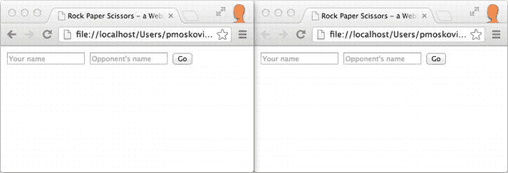

图 5-7 。在两个浏览器窗口中并排运行石头剪子布应用

玩家输入自己的名字，点击 Go 按钮，如图图 5-8 所示。

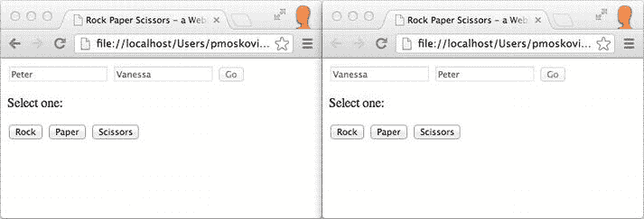

图 5-8 。用户在石头剪子布应用中输入他们的名字

一号玩家(彼得)做出选择。该选择反映在界面上，如图图 5-9 所示。在玩家 2(Vanessa)的屏幕上，显示一条消息，向玩家表明对手已经做出选择:你的对手正在等你。行动吧。

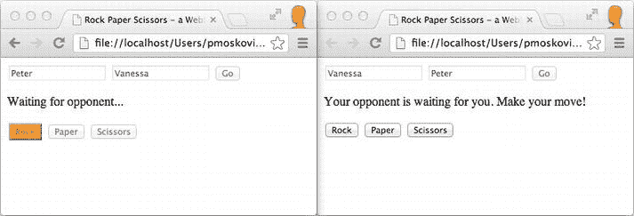

图 5-9 。一号玩家行动

第二个玩家做出选择后，结果会立即显示给双方玩家，如图图 5-10 所示。

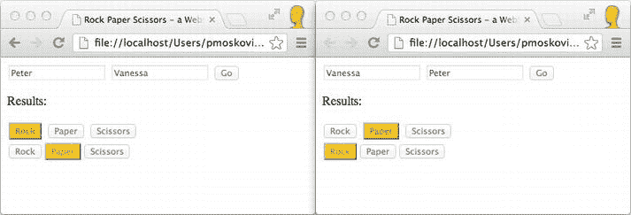

图 5-10 。参与人 2 移动

在“真正的”石头剪子布 游戏中，每一轮过后你都要宣布一个赢家。为了保持这个演示的简单和源代码的重点，我们不包括这个特性。

创建游戏

我们的简单应用由我们自己的 HTML 和一个 JavaScript 文件组成，并利用了两个外部开源 JavaScript 资源。第一个 JavaScript 库叫做`stomp.js`，由 Jeff Mesnil 编写。该库包含在本书的发行版中，但也可以在 GitHub: `https://github.com/jmesnil/stomp-websocket`上找到。这个库使 JavaScript 应用能够使用我们的支持 WebSocket 的 ActiveMQ 消息代理来说 STOMP/WS。

第二个 JavaScript 库是 jQuery，我们使用它是为了简单，并帮助我们以更简洁的方式编写代码。我们将包含应用逻辑的 HTML 和 JavaScript 文件分别称为`index.html`和`rps.js`。

 **注**我们构建了我们的 app jQuery 版本 1.8.2 。本书的发行版中包含了缩小版的 jQuery 库`jquery-1.8.2.min`，不过你也可以从 jQuery 官方下载网站:`http://jquery.com/download`下载。

构建 HTML 文件

在这个例子中，我们保持我们的 HTML 代码简单，以便我们可以专注于应用的消息传递逻辑。在包含了 JavaScript 库之后，我们需要为玩家的名字创建表单域和按钮，如图图 5-11 所示。


图 5-11 。为玩家的名字创建表单域

然后，我们为指令创建一个`div`，为按钮创建另一个`div`，如图 5-12 中的所示，这允许玩家做出选择。

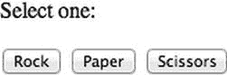

图 5-12 。代表用户选择的按钮

最后，我们有一个空的`div`来显示对手的选择。清单 5-6 显示了我们的 HTML 文件的源代码。

***清单 5-6。***index.html 文件的源代码

```html
<!DOCTYPE html><html><head>   <title>Rock Paper Scissors - a WebSocket Demo</title>   <!-- JavaScript libraries used: jQuery and the        open source STOMP library -->   <script src="js/jquery-1.8.2.min.js"></script>   <script src='js/stomp.js'></script>   <script src='js/rps.js'></script></head><body>   <!-- Form fields and button for the players' names.        The queues are named after the users -->    <div id="nameFields">   <input id="myName" type="text" placeholder="Your name"/>
   <input id="opponentName" type="text" placeholder="Opponent's name"/>
   <button id="goBtn" onclick="startGame();">
      Go
   </button>
   </div>
   <!-- Instructions and buttons for the users to make their selections, hidden initially -->
   <div id="instructions" style="visibility:hidden;">
   <p>Select one:</p>
   </div>
   <div id="buttons" style="visibility:hidden;">
   <button id="rockBtn" name="rock" onclick="buttonClicked(this);">
      Rock
   </button>
   <button id="paperBtn" name="paper" onclick="buttonClicked(this);">
      Paper
   </button>
   <button id="scissorsBtn" name="scissors" onclick="buttonClicked(this);">
      Scissors
   </button>
   </div>
   <!-- div to display opponent's choice, initially empty; populated by JavaScript code in rps.js -->
   <div id="opponentsButtons"></div></body></html>
```

编写游戏代码

现在，我们已经为我们的应用构建了一个简单的用户界面，让我们仔细看看 JavaScript 代码 。首先，我们声明变量，如清单 5-7 所示。请注意，我们将我们的连接 URL 包含到启用 WebSocket 的基于 STOMP 的消息代理 ActiveMQ 中。

***清单 5-7。*** 声明 JavaScript 代码中使用的变量

```html
// ActiveMQ STOMP connection URL
var url = "ws://0.0.0.0:61614/stomp";
// ActiveMQ username and password. Default value is "guest" for both.
var un, pw = "guest";

var client, src, dest;

// Variables holding the state whether the local and
// remote user had his/her turn yet
var hasUserPicked, hasOpponentPicked = false;

// HTML code for the opponent's three buttons and variable
// for opponent's pick
var opponentsBtns = '<button id="opponentRockBtn" name="opponentRock" disabled="disabled">Rock</button>' + '<button id="opponentPaperBtn" name="opponentPaper" disabled="disabled">Paper</button>' + '<button id="opponentScissorsBtn" name="opponentScissors" disabled="disabled">Scissors</button>';
var opponentsPick;

// Variables for this user's three buttons
var rockBtn, paperBtn, scissorsBtn;
```

在 DOM 层次结构完全构建之后，我们检查浏览器是否支持 WebSocket。如果没有，我们隐藏由 HTML 页面呈现的`div`，并显示一个警告(清单 5-8 )。

***清单 5-8。***检查浏览器是否支持 WebSocket

```html
// Testing whether the browser supports WebSocket.
// If it does, fields are rendered for users' names
$(document).ready(function() {
    if (!window.WebSocket) {
        var msg = "Your browser does not have WebSocket support. This example will not work properly.";
        $("#nameFields").css("visibility", "hidden");
        $("#instructions").css("visibility", "visible");
        $("#instructions").html(msg);
    }
});
```

`startGame()`函数 由`goBtn`的`onclick`事件调用。这个函数，如清单 5-9 所示，禁用先前填写的表单的所有元素，使指令和按钮`div`可见，并为源(`src`)和目的(`dest`)队列构造名称。

***清单 5-9。***`startGame()`功能

```html
var startGame = function() {
    // Disabling the name input fields
    $("#myName").attr("disabled", "disabled");
    $("#opponentName").attr("disabled", "disabled");
    $("#goBtn").attr("disabled", "disabled");
    // Making the instructions and buttons visible
    $("#instructions").css("visibility", "visible");
    $("#buttons").css("visibility", "visible");
    // Queues are named after the players
    dest = "/queue/" + $("#opponentName").val();
    src = "/queue/" + $("#myName").val();
    connect();
};
```

清单 5-9 中的最后一个函数调用调用了`connect()`函数，该函数建立了 STOMP 连接，如清单 5-10 中所示。`connect()`函数内部的调用由我们使用的开源 STOMP JavaScript 库提供:`stomp.js`。

***清单 5-10。*** 利用 connect()函数，建立 STOMP 连接

```html
// Establishing the connectionvar connect = function() {   client = Stomp.client(url);
   client.connect(un, pw, onconnect, onerror);};
```

`client.connect` API 有两个回调函数。第一个是`onconnect()`，在成功连接时调用；第二个，`onerror(),`在错误发生时被调用。

我们来仔细看看 `onconnect()`回调函数。在我们成功连接到控制台的日志之后，我们订阅由`src`变量定义的队列。这个队列是以这个玩家的名字命名的。每当有消息到达这个队列时，定义为`client.subscribe`的第二个参数的回调就会被执行。当收到的信息表明对手已经选择了，我们将`hasOpponentPicked`设置为`true`。然后，我们画出代表对手玩家选择的按钮，但是如果这个玩家还没有移动，就隐藏它们，如清单 5-11 所示。

***清单 5-11。*** 代码渲染游戏按钮

```html
// Function invoked when connection is established
var onconnect = function() {
    console.log("connected to " + url);
    client.subscribe(src, function(message) {
        console.log("message received: " + message.body);
        // The incoming message indicates that the
        // opponent had his/her turn (picked).
        // Therefore, we draw the buttons for the opponent.
        // If this user hasn't had his/her move yet,
        // we hide the div containing the buttons,
        // and only display them
        // when this user has had his/her move too.
        hasOpponentPicked = true;
        if (!hasUserPicked) {
            $("#opponentsButtons").css("visibility", "hidden");
            $("#instructions").html("<p>Your opponent is waiting for you. Make your move!</p>");
        } else {
            $("#instructions").html("<p>Results:</p>");
            client.disconnect( function() {
                console.log("Disconnected...");
            });
        }
        $("#opponentsButtons").html(opponentsBtns);
        switch (message.body) {
            case "rock"     :
                opponentsPick = "#opponentRockBtn";
                break;
            case "paper"    :
                opponentsPick = "#opponentPaperBtn";
                break;
            case "scissors" :
                opponentsPick = "#opponentScissorsBtn";
                break;
        }
        $(opponentsPick).css("background-color", "yellow");
    });
    console.log("subscribed to " + src);
};
```

如果出现错误，我们可以使用`onerror()`回调函数轻松处理，如清单 5-12 所示。测试该函数执行情况的一个简单方法是首先创建一个连接，然后停止 ActiveMQ。这样，您将在控制台上看到一条错误消息，指示连接已丢失。

***清单 5-12。*** 用 onerror 回调函数捕捉错误

```html
var onerror = function(error) {
    console.log(error);
};
```

当用户从三个选项中选择一个时，我们代码的最后一个函数被调用:石头、布或剪刀。客户端对象的`send()`函数有三个参数:目的地、头(在我们的例子中为空)和消息(按钮 DOM 对象的名称)。我们将`hasUserPicked`标志切换到`true`，表示用户已经选择了。然后，我们禁用表单字段。根据对手是否移动，我们或者显示对手的移动，或者改变指令信息，让这个玩家知道我们在等待对手(清单 5-13 )。

***清单 5-13。*** 向用户选择(石头、布或剪刀)添加交互

```html
// ActiveMQ STOMP connection URL
var url = "ws://0.0.0.0:61614/stomp";
// ActiveMQ username and password. Default value is "guest" for both.
var un, pw = "guest";

var client, src, dest;

// Variables holding the state whether the local and remote user had his/her turn yet
var hasUserPicked, hasOpponentPicked = false;

// HTML code for the opponent's three buttons and
// variable for opponent's pick
var opponentsBtns = '<button id="opponentRockBtn" name="opponentRock"
disabled="disabled">Rock</button>' + '<button id="opponentPaperBtn"
name="opponentPaper" disabled="disabled">Paper</button>' +
'<button id="opponentScissorsBtn" name="opponentScissors"
disabled="disabled">Scissors</button>';
var opponentsPick;

// Variables for this user's three buttons
var rockBtn, paperBtn, scissorsBtn;

// Testing whether the browser supports WebSocket.
// If it does, fields are rendered for users' names
$(document).ready(function() {
   if (!window.WebSocket) {
      var msg = "Your browser does not have WebSocket support. This example will not work properly.";
      $("#nameFields").css("visibility", "hidden");
      $("#instructions").css("visibility", "visible");
      $("#instructions").html(msg);
   }
});

// Getting started with the game. Invoked after
// this user's and opponent's name are submitted
var startGame = function() {
   // Disabling the name input fields
   $("#myName").attr("disabled", "disabled");
   $("#opponentName").attr("disabled", "disabled");
   $("#goBtn").attr("disabled", "disabled");
   // Making the instructions and buttons visible
   $("#instructions").css("visibility", "visible");
   $("#buttons").css("visibility", "visible");
   // Queues are named after the players
   dest = "/queue/" + $("#opponentName").val();
   src = "/queue/" + $("#myName").val();
   connect();
};

// Establishing the connection
var connect = function() {
   client = Stomp.client(url);
   client.connect(un, pw, onconnect, onerror);
};

// Function invoked when connection is established
var onconnect = function() {
   console.log("connected to " + url);
   client.subscribe(src, function(message) {
      console.log("message received: " + message.body);
      // The incoming message indicates that the
      // opponent had his/her turn (picked).
      // Therefore, we draw the buttons for the opponent.
      // If this user hasn't had his/her move yet,
      // we hide the div containing the buttons, and only display
      // them when this user has had his/her move too.
      hasOpponentPicked = true;
      if (!hasUserPicked) {
         $("#opponentsButtons").css("visibility", "hidden");
         $("#instructions").html("<p>Your opponent is waiting for you. Make your move!</p>");
      } else {
         $("#instructions").html("<p>Results:</p>");
         client.disconnect( function() {
            console.log("Disconnected...");
         });
      }
        $("#opponentsButtons").html(opponentsBtns);
        switch (message.body) {
            case "rock"     :
                opponentsPick = "#opponentRockBtn";
                break;
            case "paper"    :
                opponentsPick = "#opponentPaperBtn";
               break;
            case "scissors" :
               opponentsPick = "#opponentScissorsBtn";
               break;
      }
      $(opponentsPick).css("background-color", "yellow");
   });
   console.log("subscribed to " + src);
};

var onerror = function(error) {
   console.log(error);
};

var buttonClicked = function(btn) {
   client.send(dest, null, btn.name);
   hasUserPicked = true;
   console.log("message sent: " + btn.name);

   // Setting the background color of the button
   // representing the user's choice to orange.
   // Disabling all the buttons (to prevent changing the vote).
   $("#" + btn.id).css("background-color", "orange");
   $("#rockBtn").attr("disabled", "disabled");
   $("#paperBtn").attr("disabled", "disabled");
   $("#scissorsBtn").attr("disabled", "disabled");
   // Checking if the other user has moved yet. If so,
   // we display the buttons that were drawn beforehand
   // (see onconnect)
   if (hasOpponentPicked) {
      $("#opponentsButtons").css("visibility", "visible");
      $("#instructions").html("<p>Results:</p>");
      client.disconnect(function() {
         onerror = function() {};
         console.log("Disconnected...");
      });
   } else {
      $("#instructions").html("<p>Waiting for opponent...</p>");
   }
};
```

要运行应用，确保 ActiveMQ 支持 WebSocket(如清单 5-4 所示)，运行 ActiveMQ，然后在支持 WebSocket 的浏览器中打开`index.html`。

监控 Apache ActiveMQ

ActiveMQ 提供了一个简单的监视界面，让您能够深入了解幕后发生的事情。要访问管理界面，请单击 ActiveMQ 欢迎页面上的管理 ActiveMQ 代理链接，或者导航到`http://0.0.0.0:8161/admin/`。运行一次石头剪刀布演示后，您将有两个队列，每个玩家一个。在我们的例子中，对手是 Peter 和 Vanessa，队列以他们的名字命名。如图图 5-13 所示，每个队列有一个消费者(对手玩家)，我们向每个队列发送一条消息(消息入队)。这两个消息很快就出列了(消息出列)。

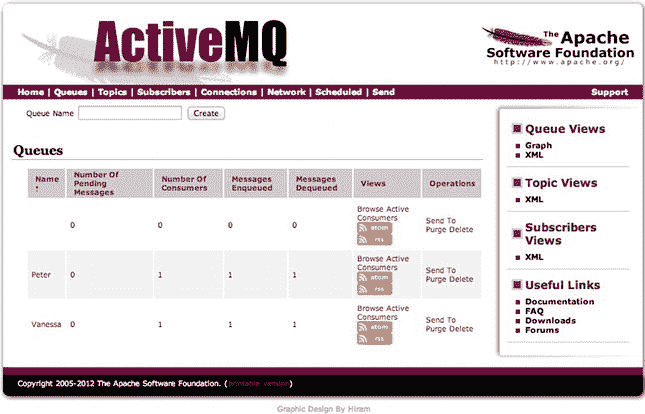

图 5-13 。ActiveMQ 管理接口:监控消息队列

管理控制台还列出了当前活动的连接。在我们的演示中，我们有两个通过 ActiveMQ WebSocket 连接器创建的活动 WebSocket 连接，如图 5-14 所示。

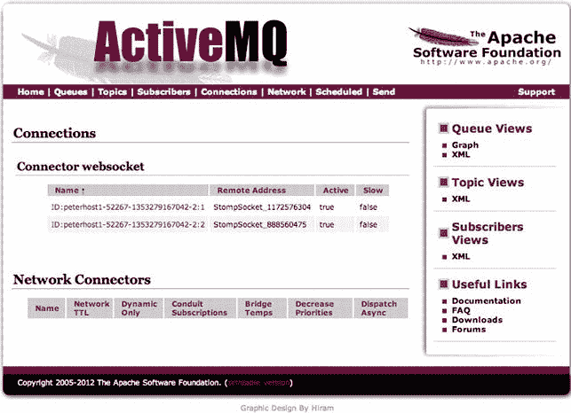

图 5-14 。通过 WebSocket 连接器创建的活动 ActiveMQ 连接

建议的扩展

虽然我们已经构建了一个非常简单的游戏来展示 WebSocket 上的消息传递，但是有许多方法可以扩展这个游戏，使其功能更加全面，甚至更加激动人心。当亲自玩石头剪子布时，找出赢家是游戏刺激的一部分。在网络环境中，情况就不一样了。宣布获胜者将是对该应用的一个简单但意义重大的增强。

另一个扩展是让游戏更安全。您可以通过创建一个接受移动的专用队列和另一个分发结果的队列来集中游戏逻辑，而不是依赖应用逻辑来隐藏对手的移动。这种逻辑会阻止玩家(或他们的浏览器)提前发现这些动作。此外，您可以使用主题通知所有玩家游戏结果，给获胜的玩家宣传。

要改善玩家互动，您可以:

*   自动匹配没有对手的孤独玩家。队列是循环配对的理想选择。
*   建造一个使用人工智能的机器人，玩家可以选择它作为对手。

网络信息的未来

将消息传递概念 与低延迟 WebSocket 通信相结合，为无数令人难以置信的应用打开了大门。正如我们在本章中看到的，实时协作的“点对点”网络和移动应用可以非常容易地构建。这些应用可以包括共享文档编辑、交互式社交演示和学习工具，以及具有实时活动流的社交软件。几乎任何类型的受众都可以利用这类应用，包括消费市场、教育、医疗和交通。

web 消息传递的另一个关键应用是机器对机器(M2M)通信领域。M2M，有时被称为“物联网”(IoT)，专注于将日常物品连接到互联网。实现智能电表来跟踪并自动报告公用事业的使用情况，与家用电器互动(如检查门是否锁上或烤箱是否关闭)，安装信用卡大小的计算机(如 Raspberry Pi)，监控设备和移动车辆，遥测和增强现实只是 M2M 解决的几个用例。

大多数现代实时企业采用企业服务架构作为高效 IT 基础设施的一部分。面向不同客户的应用或内部应用向通用服务发出请求，以高效地交付收入和生产力。十多年来，企业服务总线(ESB ) 的概念已经成为全球公司接受的模型。WebSocket 现在允许将这些企业服务安全地扩展到任何 web 设备，从而允许与客户、合作伙伴和移动员工建立更加协作的关系。

通过在用户的浏览器会话、移动设备或胖桌面客户端应用期间消费、分析和主动响应事件，复杂事件流程引擎也可以从 WebSocket 架构中受益。

以类似的方式，BPMS (业务流程管理系统)将能够更新任务的状态，这些任务是在整个企业中执行的大型业务流程的一部分，并向用户实时显示业务的相关部分正在发生什么。

很明显，网络正在从一个文档的世界变成一个活动的世界，在这个世界里，活跃的是应用，而不是文档。WebSocket 是这个新网络的关键组成部分，它将极大地改变我们在企业甚至日常生活中使用网络的方式。WebSocket 的性质提供了与内部公司客户已经用来连接到企业服务总线的连接相同的类型，但是将它们扩展到了 Web。

一组新的和不断发展的功能组合在 Web RTC(实时协作)保护伞下，具有基于浏览器的视频和音频馈送，正在带我们超越实时数据，踏上更加令人兴奋的旅程。

摘要

在本章中，我们回顾了消息传递的概念，这是一种以发送异步消息来构建松耦合系统为特征的架构风格。您了解了 pub/sub 模式，以及 STOMP，一种开放的消息传递协议。我们探索了一个开源的 STOMP 和支持 WebSocket 的消息代理 Apache ActiveMQ。在了解了简单的配置更改后，我们运行了 ActiveMQ STOMP-WebSocket 演示，然后我们自己构建了一个:石头剪子布。最后，我们回顾了 Apache ActiveMQ 的监控和管理功能。

在下一章中，我们将在 WebSocket 的基础上使用 RFB，VNC 使用的协议，建立一个纯粹使用 HTML5 的实时桌面共享体验。