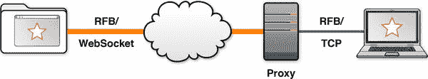
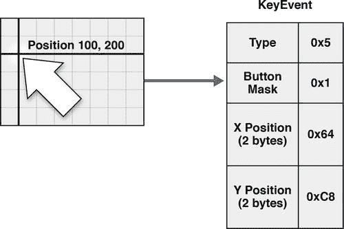
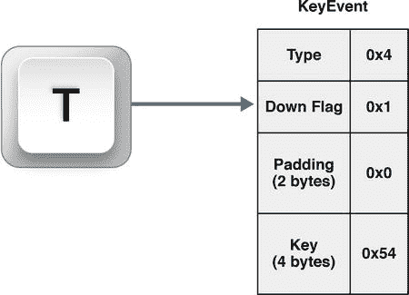

# 六、VNC 与远程帧缓冲协议

在前面的章节中，您学习了如何在 WebSocket 上分层两个强大的协议，XMPP 和 STOMP。有了这些协议，我们能够检查聊天、在线状态和消息传递，所有这些都可以用来创建丰富的应用和实现系统，为我们基于浏览器的世界提供动力。在第四章中，我们看到了如何将广泛使用的标准聊天协议与 WebSocket 结合使用，并支持在 Web 上使用传统的基于桌面的聊天应用，同时见证了将 WebSocket 与标准聊天协议分层的好处。同样，在第五章中，我们看了如何从 web 应用中与基于 TCP 的消息代理交互。在这两种情况下，我们探索了从传统的基于桌面应用的世界到支持 web 的世界的过渡，并研究了 WebSocket 提供的全双工、低延迟的 Web 连接如何有利于此类应用。在这一章中，我们来看一个更复杂的(标准的)协议，以及如何使用 WebSocket 作为通信平台来转换它。

随着应用分布在使用各种操作系统、程序和浏览器版本的台式机上，用户不依赖于系统、信息技术团队能够从任何地方支持任何系统以及应用开发人员能够在任何系统上操作变得越来越重要。有时，用户需要访问特定的操作系统。访问特定系统的一种流行方式是使用 VNC(虚拟网络计算)。

VNC 让你在任何网络上共享桌面。它本质上允许你远程查看和控制另一台计算机的界面，并且可以被认为是等同于 Telnet 的 GUI(图形用户界面)。你也可以把 VNC 想象成一根长长的虚拟电缆，它可以让你通过鼠标、键盘和视频信号来查看和控制另一个桌面。

顾名思义，VNC 用于网络。由于我们将在本章中探讨的挑战，VNC 还不容易在 Web 上使用。借助 HTML5 和 WebSocket，我们可以克服其中一些挑战，并研究高度可移植的富互联网应用如何利用 HTML5 和 WebSocket 来使用 VNC。

在本章中，我们将探索如何使用 WebSocket 和远程帧缓冲(RFB)协议来将虚拟网络计算扩展到 Web。我们还将看看，作为一个二进制协议，RFB 如何以不同于我们在前两章讨论的面向文本的协议的方式使用 WebSocket API。在看了 RFB 和 VNC 之后，我们将逐步介绍如何通过 WebSocket 使用 RFB 构建一个连接到开源 VNC 服务器的 VNC 客户端。我们将介绍通过 WebSocket 实现屏幕共享(VNC 的典型用例)的技术，并研究如何通过键盘和鼠标实现远程设备输入。声音复杂？RFB 确实是一个比 XMPP 和 STOMP 更复杂的协议。

本书附带的代码示例包含完整的端到端 RFB over WebSocket 应用，您可以在 VNC 服务器上运行该应用。但是，如果您不希望解决 RFB 的复杂性，您可以参考我们提供的虚拟机(VM)来遵循本章中的步骤(有关说明，请参见附录 B )。VM 包含您可以随意运行、检查和消化的工作代码。在本章的动手操作部分，我们将重点介绍应用中与 WebSocket 和在 WebSocket 客户端上构建 RFB 的技术特别相关的代码片段。在您从高层次上探索了本章中的思想之后，您可以自己运行代码，看看它们是如何一起工作的。然后，为了更仔细地分析代码，您可以在 VM 中打开代码示例。

RFB 在 WebSocket 上的分层可能不适合胆小的人，但这个引人注目的例子与一些更常见的 WebSocket 用例(如聊天)形成了对比，因为它说明了使用 HTML5 和 WebSocket 可以实现更多的交互式和图形化功能。此外，它还展示了 WebSocket 如何帮助连接 HTML5 和遗留系统。

 **注意**我们在本章中使用的 WebSocket 上的 VNC 演示最初是由 Kaazing 在 2010 年开发的，用于展示 WebSocket 技术。

虚拟网络计算概述

几十年来，桌面计算一直非常流行。从历史上看，流行的桌面操作系统都有联网的窗口系统和远程访问协议，使用户能够从终端和其它 PC 上使用它们的系统。在过去的几十年里，个人电脑的兴起也刺激了桌面应用的爆炸。这些桌面应用中的大部分现在都是遗留应用，并且不是所有这些遗留应用都有可比较的替代方案。VNC 是一种标准方式，使用户和系统能够继续访问传统应用和系统，而无需考虑操作系统的兼容性。VNC 还使您能够与另一台计算机上的系统和应用进行远程交互，就好像您实际上正在使用那台计算机一样。

图 6-1 显示了一个桌面通过网络控制另一台计算机的鼠标和键盘。远程显示器的像素在控制机器上被复制。


图 6-1 。通过互联网访问另一台电脑的桌面

从软件测试和部署到教育，VNC 在很多方面都非常有用。在软件开发环境中，您可以在操作系统、应用和应用版本的各种组合中测试您的应用，而无需离开您自己的桌面。例如，您可以在任何类型的系统上的任何浏览器(传统或非传统)中测试新的 STOMP 或 XMPP over WebSocket 应用，例如 Mac OS 上的 Google Chrome。当您需要访问不可用或无法亲自安装的遗留应用时，这种能力非常有用。

VNC 对于协作或教育也非常有用，不仅需要屏幕共享，还需要访问他人的桌面来帮助使用特定的应用。例如，想象一下，一名建筑系学生使用 CAD(计算机辅助设计)应用来设计一个房间。助教可能能够更好地向学生解释在哪里调整尺寸，而不需要在他或她自己的计算机上安装 CAD 应用，也不需要亲自与学生见面。类似地，技术人员可以诊断和修复用户的计算机，而不需要在现场。

远程访问桌面有几种协议。其中一些是特定于平台的，如微软的远程桌面协议(RDP) ，X Window 系统或 X11 (用于 UNIX、Linux 和 Mac OS X)，Chromoting(用于谷歌 Chromebook)，苹果远程桌面(ARD) ，以及 NX(用于 Linux 和 Solaris)。其他的，像远程帧缓冲区(RFB)，是跨平台的。

VNC 是一种基于 RFB 协议的开源技术，因此是独立于平台的。RFB 是一个 IETF 规范，是许多 VNC 服务器的基础，也是一个蓬勃发展的社区，可以在您需要时提供优化。因为它被广泛使用，所以有许多资源可以帮助你开始使用，并帮助你让 VNC 在你的网络中工作。

虽然 VNC 在您的网络中相当普遍且易于实现，但 VNC 协议通常在 web 应用中工作得不太好。已经有了用于远程桌面访问的 AJAX 应用，但是它们并不是特别理想，因为 HTTP 的请求-响应通信对于传输这些协议来说并不理想。远程桌面应用本质上是双向的。用户可以随时执行输入操作。同样，显示可以随时更新。双向传输层协议对于创建高效的远程桌面应用至关重要。有基于插件的远程桌面应用在浏览器中运行，但通过 WebSocket，我们可以将这些应用带到纯 HTML5 环境中。

为了更好地理解 VNC 的底层技术如何与 WebSocket 一起工作，让我们仔细看看 RFB，以及面向二进制和面向文本的协议之间的区别。

远程帧缓冲协议概述

远程帧缓冲区(RFB)协议是来自 IETF (RFC 6143)的信息规范。虽然它不是官方标准，但它被广泛使用，并且有许多可互操作的实现。RFC 6143 本身已经有十多年的历史了，并且已经修改过几次。

让我们来分解一下协议定义。*帧缓冲区*是包含图形计算机系统显示的所有像素值的数组，是台式计算机的最小公分母模型。因此，RFB 是远程访问帧缓冲区的一种方式。对于任何有键盘、鼠标和屏幕的系统，可能都有一种通过 RFB 访问它们的方法。

RFB 协议被设计成让服务器去做“繁重的工作”，使客户机变得简单和瘦。根据 RFB 协议构建的客户端也是无状态的，这意味着如果客户端断开连接并重新连接，新会话不会丢失帧缓冲区的状态。

面向二进制和文本的协议

协议通常面向二进制数据或文本字符串。二进制协议可以比面向文本的协议更紧凑，并且可以灵活自然地嵌入图像、音频和视频等任意二进制数据结构。二进制协议旨在由机器而不是人类来阅读，并且可以优化以任何形式发送的数据结构以保持效率。

面向文本的协议，如 STOMP 和 XMPP，倾向于在网络上传输相对较大的消息，因此，与二进制协议相比，解析起来更昂贵。然而，面向文本的协议实际上可以由任何语言实现，是人类可读的，并且具有灵活的可变长度字段。虽然二进制协议可能是传输数据的更有效的方式，但是面向文本的协议可能给你更多的灵活性，并且更容易实现和部署。

RFB 是一种二进制协议，传输二进制图像数据。数据可以被压缩，并且可以以非常高的更新频率流入和流出服务器。图像数据可以以高频率从服务器流出；类似地，客户端可以生成由用户移动鼠标和按键引起的输入事件流。这些输入事件以二进制格式压缩编码，传输时只需很少的字节。WebSocket 协议可以处理二进制数据或文本字符串。因此，二进制 WebSocket 消息非常适合 RFB 协议。

 **注意** Wireshark 支持分析 RFB 协议会话，这在调试新实现时会很有用。有关更多信息，请参见第三章，其中我们讨论了检查 WebSocket 协议，以及附录 A ，其中我们讨论了使用 Wireshark 剖析和调试 WebSocket 流量。

选择通过 WebSocket 使用 RFB

正如我们在第四章中讨论的，你可以建立自己的聊天协议；类似地，您可以构建自己的远程访问协议，该协议只适用于您的应用。但是，正如我们也提到的，您将错过使用广泛使用的、开放的、可互操作的协议的巨大好处。例如，有许多为 VNC 设计的基于 RFB 的跨平台服务器，其中许多都被不断增长的开发人员社区不断优化和增强。随着新操作系统的开发和版本化，您可以与社区合作来利用这些好处，并专注于您希望您的应用做什么。

在下一节中，我们将介绍一个使用 VNC 的基本示例，该示例说明了如何通过 WebSocket 使用 RFB:使用 web 客户端查看另一台计算机的屏幕并对其进行控制(使用键盘和鼠标)。图 6-2 说明了我们例子中的信息流。在这里，一个 RFB 客户端在浏览器选项卡中运行，并使用 web 客户端和 RFB 服务器之间的 WebSocket to TCP 代理与 RFB (VNC)服务器通信。使用这个客户端，用户可以通过 WebSocket 和 RFB 完全在 web 应用中查看和控制远程桌面。



图 6-2 。通过 WebSocket 与 RFB 连接

通过 WebSocket 构建 VNC (RFB)客户端

既然我们已经研究了基于 WebSocket 的 VNC 背后的一些概念，让我们来看一个工作示例。

 **注意**在本节中,“VNC”指的是使用 RFB 作为底层协议的远程桌面连接，我们将使用 RFB 作为 VNC 的组件称为“RFB 组件”(特别是“RFB 客户端”和“RFB 服务器”)。通过使用 RFB，您可以有效地构建一个 VNC 应用。

在这个例子中，我们来看看如何将这种流行且广泛使用的技术与 WebSocket 结合起来。我们研究了使用 HTML5 和 WebSocket 构建的 RFB 客户端的关键组件，该客户端可以查看和控制另一台计算机的图形用户界面。

我们已经看到 WebSocket 如何将 HTML5 应用提升为一流的网络参与者。本节中的客户端应用在各方面都很像桌面 RFB 客户端，只是它是使用 web 技术实现的，并且在浏览器中运行。我们还添加了远程设备输入，这允许您使用键盘和鼠标控制其他 GUI。本节中的步骤不仅向您展示了如何通过 RFB 和 WebSocket 控制远程计算机的 GUI，当您构建自己的使用 WebSocket 的图形应用时，您可能会发现这个示例很有启发性。最后，我们将研究一些令人兴奋的应用，您可以构建这些应用来让您的用户远程控制另一台计算机——所有这些都可以在浏览器选项卡中完成。

这个应用的客户端被分成两层。协议库，`RfbClient.js`，包括 JavaScript 中 RFB 协议的实现。这个库处理由所有兼容服务器理解的规范定义的 RFB 语法。

客户端的用户界面由`vnc.html`、`ui.js`和`vnc.css`组成。这些文件分别定义了 VNC 应用的页面结构、应用行为和外观。在服务器端，我们使用 Node.js 脚本将 WebSocket 连接代理到 TCP 连接。该代理连接到运行在远程桌面上的后端 RFB 服务器。

设置代理服务器

RFB 是一种应用层协议，它将 TCP 用于传输层。这种分层现在应该相当熟悉了，因为它是前两章中的协议所共有的主题。正如在第四章中所讨论的，当在 WebSocket 上使用标准 TCP 协议时，您可以选择升级服务器以接受 WebSocket 连接，或者使用代理在 WebSocket 和 TCP 之间进行中继。

在清单 6-1 所示的例子中，我们使用了一个简单的代理，它改编自我们在第三章中编写的 Node.js 服务器。这个代理不知道 RFB，并且完全与应用无关。它只是处理传入的 WebSocket 连接，并建立传出的 TCP 连接。数据流在代理的一端作为 WebSocket 消息流入，在另一端作为 TCP 流出。在我们完成的应用中，代理将处理来自 RFB 客户端的连接，并通过 TCP 代理 WebSocket 连接到后端 RFB 服务器。参考上一节的图 6-2 ，它显示了代理服务器在我们架构中的位置。

***清单 6-1。*** 代理服务器代码

```html
var websocket = require("./websocket-example");
var net = require("net");

var remotePort = 5900;
var remoteHost = "192.168.56.101";

websocket.listen(8080, "localhost", function(websocket) {
    // set up backend TCP connection
    var tcpsocket = new net.Socket({type:"tcp4"});
    tcpsocket.connect(remotePort, remoteHost);

    // TCP handler functions
    tcpsocket.on("connect", function() {
      console.log("TCP connection open");
    });
    tcpsocket.on("data", function(data) {
      websocket.send(data);
    });
    tcpsocket.on("error", function() {
      console.log("TCP connection error", arguments);
    });

    // WebSocket handler functions
    websocket.on("data", function(opcode, data) {
        tcpsocket.write(data);
    });
    websocket.on("close", function(code, reason) {
        console.log("WebSocket closed")
        // close backend connection
        tcpsocket.end();
    });

    console.log("WebSocket connection open");
});
```

虽然有许多 RFB 服务器直接接受 WebSocket 连接，但是在这个例子中，您可以灵活地使用任何兼容的 RFB 服务器。但是，请注意，因为 RFB 到 WebSocket 的绑定还没有被指定，所以可能会有一些潜在的复杂性和不兼容性。在我们的例子中，我们在一个虚拟机上使用流行且广泛使用的开源 TightVNC 服务器(基于 RFB)。TightVNC 目前还不支持 WebSocket，但是可以与我们的代理服务器一起工作。

虚拟机的地址被硬编码到代理脚本中。硬编码地址方便开发但是*不*适合生产。要在您的环境中使用它，您可能需要更改主机名和端口变量。此外，我们应该强调的是，这个例子中的 WebSocket 服务器和 VNC 服务器都没有对传入的连接进行身份验证，这对于除了简单的演示之外的任何目的来说都是非常不明智的。更好的安全措施见第七章。

RFB 客户端

既然我们已经设置了一个可以通过 WebSocket 连接接受 RFB 的代理服务器，我们就可以构建前端部分，或者说客户端了。虽然 RFB 客户端本质上是瘦的，但我们希望它能够查看 RFB 服务器的屏幕，这包括接收关于屏幕上正在发生的事情的图形信息。我们还希望能够控制远程计算机(也称为 RFB 服务器)。

在本节中，我们将探索:

*   用 JavaScript 构建简单的客户端
*   处理来自 RFB 协议和 WebSocket 协议的二进制数据的技术
*   连接到服务器
*   使客户端能够接受帧缓冲区更新
*   使用 HTML5

    <canvas>呈现帧缓冲区</canvas>

*   处理设备输入

在 JavaScript 中实现 RFB

这个 RFB 应用的客户端是一个运行在浏览器中的 HTML5 应用。它利用了 HTML、CSS 和 JavaScript。基本的用户界面是由一些 HTML 标记定义的。应用的逻辑，包括使用 RFB 协议进行通信的库，是用 JavaScript 编写的。

清单 6-2 显示了包含协议库和应用脚本的起始 HTML :

***清单 6-2。*** 用协议库和应用脚本启动 HTML】

```html
<!DOCTYPE html>
<title>RFB over WebSocket</title>

<script src="bytes.js"></script>
<script src="RfbClient.js"></script>
<script src="ui.js"></script>
```

 ** Pro 提示**因为 JavaScript 完全是事件驱动的，所以没有办法在运行的函数内部等待更多的字节变得可用。每个函数都必须运行到完成并快速返回。为了使 JavaScript 应用能够接收 RFB 协议消息，我们将该协议映射到可以在浏览器中运行的事件处理程序。这种设计技术对于实现许多不同类型的协议非常有用。

使用字节流

在第二章中，我们演示了如何使用 WebSocket API 发送和接收二进制数据。编写二进制消息就像用 Blob 和 ArrayBuffer 参数调用`WebSocket.send()` 一样简单。读取二进制消息是自动的，因为传入消息事件的类型与`WebSocket.binaryType`匹配。通过 WebSocket API 使用 WebSocket 消息进行通信，并通过与 WebSocket 协议的消息对齐绑定来实现协议是很简单的。相比之下，像 RFB 这样的任意应用级协议都不符合 WebSocket 框架。这种协议的语法是根据字节流定义的。每个对`WebSocket.onmessage`的调用不能保证包含一个且只有一个完整的 RFB 消息。RFB 消息可以被分割或合并成比预期数量更多或更少的 WebSocket 消息。流抽象有助于弥合两种通信模式之间的差距。在清单 6-3 中，文件`bytes.js`包含了`RfbClient.js`用来简化字节流读写的实用程序。特别是，它包含一个 CompositeStream API，将离散的 ArrayBuffers 序列连接到逻辑字节流中。当二进制 WebSocket 消息到达时，`RfbClient.js`调用`CompositeStream.append()` 将新字节添加到入站流中。为了在 RFB 协议层读取和解析消息，RFB 处理程序代码调用`CompositeStream.consume()` 从流中提取字节。类似地，`RfbClient.js`使用`bytes.js`中的函数将数字以字节形式写入给服务器的消息中。这些函数利用标准的`DataView`类型，调用 ArrayBuffers 上的 setter 方法，用字节表示 8、16 和 32 位整数。清单 6-3 显示了`bytes.js`中的数值函数。

***清单 6-3。***bytes . js 中的数值函数

```html
$prototype.appendBytes = function appendBytes() {
    ba = new Uint8Array(arguments);
    this.append(ba.buffer);
}

$prototype.appendUint16 = function appendUint16(n) {
    var b = new ArrayBuffer(2);
    var dv = new DataView(b);
    dv.setUint16(0, n);
    this.append(b);
}

$prototype.appendUint32 = function appendUint32(n) {
    var b = new ArrayBuffer(4);
    var dv = new DataView(b);
    dv.setUint32(0, n);
    this.append(b);
}
```

这些函数使得用 RFB 协议的语法编写包含消息的字节数组变得更加容易。

设置连接

`RfbProtocolClient connect`函数设置初始客户端状态，并为该套接字创建一个空流、一个 WebSocket 和事件处理程序。该函数还将第一个`readHandler`设置为`versionHandler`，因为 RFB 协议从服务器和客户端之间的版本信息交换开始。清单 6-4 显示了`RfbProtocolClient`连接函数，我们必须设置它来连接我们的服务器。connect 函数还构造了一个空的*复合流*。该流将包含代表来自服务器的部分 RFB 消息的字节。

***清单 6-4。*** RfbProtocolClient 连接函数

```html
RfbProtocolClient = function() {};

$prototype = RfbProtocolClient.prototype;

$prototype.connect = function(url) {
    this.socket = new WebSocket(url);
    this.socket.binaryType = "arraybuffer";
    this.stream = new CompositeStream();

    bindSocketHandlers(this, this.socket);

    this.buttonMask = 0;
    // set first handler
    this.readHandler = versionHandler;
}
```

`bindSocketHandlers()` 函数设置该协议客户端使用的 WebSocket 事件处理程序。消息处理程序做了一些有趣的事情:它将任何传入的数据添加到字节流中，并调用当前的读取处理程序，然后继续调用当前的读取处理程序，直到该处理程序返回`false`。这个函数允许消息处理程序有效地遍历传入的数据，并处理任意数量的消息。如果流中还有部分消息，它将一直保留在那里，直到套接字产生另一个消息事件。这时，最后一个返回`false`的读取处理程序被再次调用。额外字节的存在可能会导致处理程序返回`true`。清单 6-5 显示了`bindSocketHandlers()`功能。

***清单 6-5。***bindSocketHandlers()函数

```html
var bindSocketHandlers = function($this, socket) {
    socket.onopen = function(e) {
        // Ignore WebSocket open event.
        // The server will send the first message.
    }

    var stream = $this.stream;
    socket.onmessage = function messageHandler(e) {
        // Append bytes to stream.
        stream.append(e.data);
        // Read handler loop.
        while($this.readHandler($this, stream)) {
            // Do nothing.
        }
    }

    socket.onclose = socket.onerror = function() {
        console.log("Connection closed", arguments);
    }
}
```

每个事件处理程序都期望一定数量的字节能够读取完整的消息。如果传入流中的字节较少，处理程序返回`false`，这将 WebSocket 消息事件处理程序重新置于等待状态。如果有足够的字节来读取一个完整的协议数据消息，处理程序将从流中读取足够多的字节，对它们进行处理，并返回 true。每个处理程序还可以在返回`true`之前设置下一个处理程序变量。

在清单 6-6 的中，`versionHandler()`函数将`readHandler`变量设置为`numSecurityTypesHandler`，因为客户端进入的下一个状态将读取包含服务器支持的安全类型数量的消息。

***清单 6-6。***version handler()函数

```html
var versionHandler = function($this, stream) {
    if (stream.length < 12) {
        return false;
    }

    var version = new Uint8Array(stream.consume(12));
    // Echo back version.
    sendBytes($this, version.buffer)

    // Set next handler.
    $this.readHandler = numSecurityTypesHandler;
    return true;
}
```

使客户端能够接受帧缓冲区更新

一旦您将客户端连接到服务器，客户端必须发送请求帧缓冲区更新的消息。这样做将使客户端能够从 RFB 服务器接收数据。

RFB 协议定义了不同类型的帧缓冲区更新。每种类型都在协议消息中用数字代码表示。在这个例子中，我们将只使用两种基本的编码类型:Raw 和 CopyRect。Raw，正如您可能猜到的，将像素数据表示为原始的、未压缩的位图。CopyRect 是来自服务器的指令，用于将当前位图的一部分复制到屏幕上的其他位置。由于许多用户界面包含大的纯色区域，这可能是更新客户端屏幕的非常有效的方式。

当流中不再有矩形时，客户端可以请求另一次更新。如清单 6-7 中的所示，这种实现是轮询和流式传输数据之间的一种折衷，目的是抑制服务器发送的更新，而又不至于过于冗长。

***清单 6-7。*** 帧缓冲请求

```html
var doUpdateRequest = function doUpdateRequest($this, incremental) {
    var request = new CompositeStream();

    request.appendBytes(3);             // type (u8 3)
    request.appendBytes(1);             // incremental

    request.appendBytes(0,0,0,0);       // top left corner: x (u16 0) y (u16 0)
    request.appendUint16($this.width);  // width (u16 800)
    request.appendUint16($this.height); // height (u16 600)

    sendBytes($this, request.consume(request.length));
}
```

清单 6-7 显示了 framebuffer 请求，它指定了要更新的区域左上角的位置。它们还包含区域的高度和宽度，这允许客户端选择只更新帧缓冲区的一部分。对于这个例子，我们将总是在整个画布上请求更新。增量字节向服务器指示客户端具有当前帧缓冲区的副本，并且可以应用更新。这比一遍又一遍地发送整个屏幕的内容更有效。

使用 HTML5

<canvas>绘制一个帧缓冲区</canvas>

既然客户端可以接受 framebuffer 更新，那么让我们在客户端上呈现这些信息，这使得客户端能够查看来自 RFB 服务器(或者在我们的例子中是 TightVNC )的 GUI 信息。

HTML5 中最重要的新元素之一是`<canvas>`。`<canvas>`元素支持 2d 绘图 API，该 API 赋予 HTML5 应用操纵像素图形的能力。为了在应用中有效地显示帧缓冲区，需要低级绘图，因为应用代码必须能够单独设置每个像素的颜色。

清单 6-8 创建一个`canvas`元素，设置它的初始宽度和高度，并获得一个绘图上下文。

***清单 6-8。*** 创建画布元素

```html
Screen = function(width, height) {
    this.canvas = document.createElement("canvas");
    this.canvas.setAttribute("height", height);
    this.canvas.setAttribute("width", width);
    this.context = this.canvas.getContext("2d");
}
```

2d 绘图上下文提供了用于与 canvas 元素交互的绘图 API。许多 2d 上下文函数处理绘制原始形状。像`fillRect`这样的函数非常适合显示大多数编程生成的图形。为了显示一个帧缓冲区，我们需要使用 canvas 2d context 公开的底层函数。`putImageData()`函数是一个理想的低级像素函数，直接从颜色数据数组中设置画布的像素值。清单 6-9 显示了这个函数的一个例子。

***清单 6-9。***putImageData()函数

```html
context.putImageData(imageData, xPos, yPos);
```

类似地，有一个`getImageData()`函数可以从画布上下文中检索像素值，如清单 6-10 中的所示。

***清单 6-10。*** 一个 getImageData()函数

```html
context.getImageData(xSrc, ySrc, width, height);
```

我们将使用这些画布函数用来自 RFB 协议的帧缓冲区更新来更新画布。方便起见，`ImageData`是一种兼容 WebSocket 发送和接收的二进制消息的类型。事实上，在现代浏览器中，`getImageData()`返回一个`Uint8ClampedArray`，可以包装数组缓冲区的 TypedArray 视图之一。

 **注意**支持 canvas 的老浏览器用的是一个过时的`ImageData`类型，不是类型化数组；必须转换成一个。

为了呈现客户端帧缓冲区，`RfbClient.js`处理两种更新:Raw 和`CopyRect`。更高级的客户端也可以处理其他像素编码。

原始像素数据

最简单的帧缓冲区更新由原始像素数据组成。在 RFB 协议中，原始像素用编码类型零(0x0)表示。清单 6-11 显示了像素数据，它仅仅由帧缓冲区更新部分中每个像素的红、绿、蓝值组成。

***清单 6-11。*** 原始像素数据

```html
$prototype.putPixels = function putPixels(array, width, height, xPos, yPos) {
    var imageData = this.context.createImageData(width, height);
    copyAndTransformImageData(array, imageData);
    this.context.putImageData(imageData, xPos, yPos);
}
```

copy rect 的缩写形式

本例中使用的第二种编码类型是`copyRect`，它是 RFB 协议中的编码类型一(0x01)。这个函数是一个巧妙的操作，非常适合传送主要由相同的重复像素值组成的帧缓冲区更新。

就像原始编码一样，`copyRect`矩形消息指定位置、宽度和高度。该信息表示更新将填充的帧缓冲区中的目标矩形。然而，`copyRect`消息并没有发送该矩形的当前像素数据，而是多了两个有效载荷值:源矩形的 X 和 Y 位置。源矩形与目的矩形或目标矩形具有相同的宽度和高度。源中的每个像素都被一字不差地复制到目标区域的相应像素中。

要实现`copyRect`，我们需要`getImageData`和`putImageData`。`copyRect()`函数包含源像素的位置、宽度和高度以及目标像素的位置。它在 framebuffer 画布上的操作与 raw `putPixels`函数非常相似，只是它从当前画布上获取像素数据。清单 6-12 显示了带有`getImageData`和`putImageData`的`copyRect()`功能

.

***清单 6-12。***copyRect()函数

```html
$prototype.copyRect = function copyRect(width, height, xPos, yPos, xSrc, ySrc){
 // get pixel data from the current framebuffer
 var imageData = this.context.getImageData(xSrc, ySrc, width, height);
 // put pixel data in target region
 this.context.putImageData(imageData, xPos, yPos);
```

其他编码和效率

虽然通过互联网发送原始像素是非常低效的，但是当你足够幸运地在你的帧缓冲区中有重复的像素值时，`copyRect`是非常高效的。真实的桌面比这更复杂，因此有更多的高级编码可用于减少 RFB 的带宽使用。这些编码使用压缩算法来减少发送像素数据所需的带宽。例如，编码 16 (0x10)使用 ZLIB 进行压缩。这是您在真正的基于 RFB 的应用中最想使用的编码风格。大多数 RFB 客户端和服务器支持压缩更新。

在客户端处理输入

到目前为止，我们已经构建了足够的 RFB 客户端，能够实时观察桌面更新(实际上是屏幕共享)。为了与桌面交互，我们需要处理用户输入，这将允许 RFB 客户端控制 RFB 服务器的鼠标和键盘。在本节中，我们将研究如何在客户端接受鼠标和键盘输入，并将输入信息传递给 RFB 服务器。

客户端到服务器的消息

RFB 协议定义了客户端发送给服务器的消息类型。这些消息类型表示客户端发送给服务器的消息类型。如前所述，消息类型是客户端到服务器消息的第一个字节，用整数表示。表 6-1 描述了 RFB 规范中存在的消息类型。

表 6-1。RFB 规范中的消息类型

| 消息类型号 | 消息类型 |
| --- | --- |
| Zero | `SetPixelFormat` |
| Two | `SetEncodings` |
| three | `FramebufferUpdateRequest` |
| four | `KeyEvent` |
| five | `PointerEvent` |
| six | `ClientCutText` |

在这一节中，我们将重点关注 RFB 客户端到服务器的消息类型 4 和 5，分别是键盘和鼠标事件。

鼠标输入

处理鼠标和键盘输入是我们的示例实现的重要部分，它代表了从键盘和鼠标点击中捕获动作。这些动作触发从客户机发送到服务器的 JavaScript 事件。这使得 VNC 用户可以控制远程系统上运行的应用。在我们的应用中，我们将检测 JavaScript 中的输入事件，并通过我们的 open WebSocket 发送相应的 RFB 协议消息。

在 RFB 协议中，`PointerEvent`代表移动或点击设备按钮或释放。`PointerEvent`消息是一个二进制事件消息，包括一个消息类型字节，指定哪种消息被发送到服务器(例如，定点设备点击、定点设备移动等等)，一个按钮掩码字节，携带由比特 0 到 7 表示的从 1 到 8 的定点设备按钮的当前状态，其中 0 表示按钮被抬起，1 表示按钮被按下或按下， 以及两个位置值，每个位置值由一个无符号短整数组成，代表相对于屏幕的 X 和 Y 坐标(见图 6-3 )。



图 6-3 。按下鼠标左键会产生一个 6 字节的二进制指针事件消息

清单 6-13 显示了鼠标事件。

***清单 6-13。*** 鼠标事件

```html
var doMouseEvent = function ($this, e) {
    var event = new CompositeStream();

    event.appendBytes(5);     // type (u8 5)
    event.appendBytes($this.buttonMask);

    // position
    event.appendUint16(e.offsetX);
    event.appendUint16(e.offsetY);

    sendBytes($this, event.consume(event.length));
}
```

清单 6-14 表明当检测到鼠标移动时，鼠标事件被发送到 VNC 服务器。

***清单 6-14。*** 鼠标事件传到 VNC 服务器

```html
$prototype.mouseMoveHandler = function($this, e) {
 doMouseEvent($this, e);
}
```

类似地，当检测到鼠标点击时，被点击的按钮作为鼠标事件被传输，如清单 6-15 中的所示。

***清单 6-15。*** 发送鼠标点击作为鼠标事件

```html
$prototype.mouseDownHandler = function($this, e) {
    if (e.which == 1) {
        // left click
        $this.buttonMask ^= 1;
    } else if (e.which == 3) {
        // right click
        $this.buttonMask ^= (1<<2);
    }
    doMouseEvent($this, e);
}
```

表 6-2 描述了与 RFB 事件监听器相关的鼠标事件类型。

表 6-2。鼠标事件类型

| 事件类型 | 描述 |
| --- | --- |
| `mousedown` | 指示定点设备在元素上被按下 |
| `mouseup` | 指示在元素上释放了定点设备 |
| `mouseover` | 指示定点设备位于元素上方 |
| `mousemove` | 指示定点设备在元素上时被移动 |

键盘输入

除了`PointerEvent`消息之外，RFB 协议规定`KeyEvent`消息指示按键被按下或释放。`KeyEvent`消息是一个二进制事件消息，包括一个消息类型字节，指定发送给服务器的消息类型(在这种情况下是一个键盘事件)，一个 down-flag 字节，指示当值为 1 时按键是否被按下，或者如果值为 0 时按键是否被释放，两个字节的填充，以及在 key 字段的四个字节中指定的按键本身。图 6-4 显示了键盘输入和`KeyEvent`之间的关系。



图 6-4 。按下“T”键会生成一个 8 字节的二进制按键事件消息

RFB 协议使用与 X Window 系统相同的键码，即使客户机(或服务器)没有运行 X Window 系统。这些代码与 DOM KeyboardEvents 上的键码不同，因此映射函数是必要的。清单 6-16 展示了我们例子中的`KeyEvent`函数。

***清单 6-16。*** 按键事件()功能

```html
var doKeyEvent = function doKeyEvent($this, key, downFlag) {
    var event = new CompositeStream();

    event.appendBytes(4);     // type (u8 4)
    event.appendBytes(downFlag);
    event.appendBytes(0,0);   // padding

    event.appendUint32(key);

    sendBytes($this, event.consume(event.length));
}
```

在清单 6-16 中， `doKeyEvent()` 函数接受一个键值和一个`downFlag`并构造相应的 RFB 客户端消息。填充字节似乎很浪费。今天显然是这样，因为网络带宽和延迟比 CPU 周期更宝贵。将整数值与 32 位边界对齐是协议设计中残留的优化，在一些计算平台上，这种优化用网络带宽的字节来换取处理速度。因为我们是在 JavaScript 中生成这些值的，而 JavaScript 甚至没有 32 位整数类型，所以看起来非常有趣！

 **注意**键盘事件依赖于设备，这意味着要生成键盘事件，必须与操作系统进行映射。

表 6-3 描述了 DOM 键盘事件的类型。

表 6-3。 DOM 键盘事件类型

| 事件类型 | 描述 |
| --- | --- |
| `keydown` | 表示在键盘上按下了特定的键，并在`keypress`事件之前触发 |
| `keyup` | 指示释放了特定的键 |

这个例子使用了`event.which`属性来检测键盘按键。该属性是一个传统的 DOM API，但适用于本示例的目的。属性返回被按下或释放的键所代表的字符的值。我们可以将该值映射到 RFB 在`KeyEvent`消息中使用的键值。

把这一切放在一起

此时，我们已经准备好连接到 RFB 服务器，并开始使用远程桌面。在支持所需 JavaScript APIs 的现代浏览器中打开`vnc.html`。这可能会在您的本地文件系统中工作。否则，从一个可以用浏览器访问的位置提供这个示例的所有静态文件。

启动 WebSocket-to-TCP 代理和后端 RFB 服务器。当您在应用中按下 Connect 按钮时，您应该会在浏览器选项卡中看到一个远程桌面。尝试使用远程系统的用户界面。太神奇了。

 **注意**请记住，您可以简单地从虚拟机安装和启动服务器和客户端。更多信息参见附录 B 。

增强应用

为了增强这个应用，您有几个显而易见的选择。首先，您可以尝试将 WebSocket 移除到 TCP 代理，并直接连接到包含集成 WebSocket 支持的 RFB 服务器。您还可以实现其他 RFB 功能；RFB 支持本例中未包括的许多其他像素编码机制。还有一些可协商的认证机制，您可以添加对它们的支持。此外，RFB 服务器可以配置为支持不同的颜色深度。您可以将这些模式添加到 RFB 客户端协议库中。

借助 VNC/RFB 在 WebSocket 技术上的力量，你应该能够设计一个 web 应用，连接到同一个网页上的多个桌面，作为与它们一起工作的一种方式。想象一下，你在一个网页上有三个面板，每个面板都通过 WebSocket 上的 VNC 连接到一个远程系统，你可以在一个控制 Windows 系统的面板上执行一个操作，切换到另一个控制 Linux 系统的面板，然后最后关注控制 Mac OS 的第三个面板。当这三个远程系统并行运行时，您可以在浏览器或桌面上执行其他任务。

你在本章中学到的机制仅仅是你可以用 WebSocket 开发的一个开端，即从一个网页同时远程连接到几台不同的机器，而不需要在你的系统上安装任何东西。

摘要

在本章中，我们讨论了网络计算历史中的一些要点，特别是虚拟网络计算。我们研究了广泛实现的远程帧缓冲区(RFB)协议，逐步介绍了如何对 RFB 和 WebSocket 进行分层，使您能够远程控制另一台计算机的 GUI，并重点介绍了通过 WebSocket 使用 RFB 的关键技术。我们还研究了 VNC 相对于 WebSocket 的一些教育和技术优势，以及面向二进制和面向文本协议的比较。我们还探索了潜在的令人兴奋的用途和应用，您可以构建这些用途和应用，使用户能够执行他们以前无法执行的任务，例如从同一个网页查看和控制多个桌面。

现在我们已经完成了一些 WebSocket 的真实演示和用例，我们将在下一章讨论 WebSocket 安全性以及如何保护 WebSocket 应用。