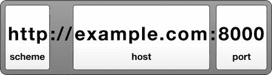
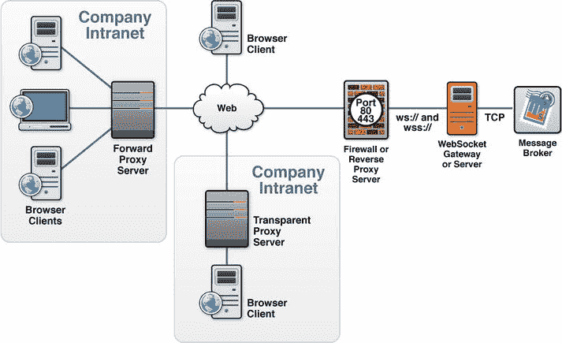
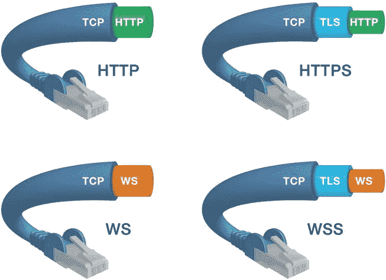
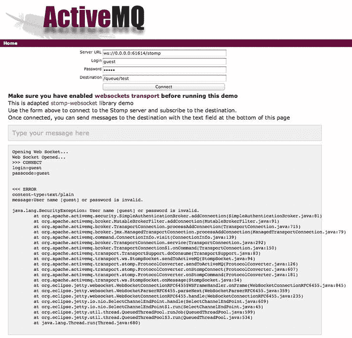
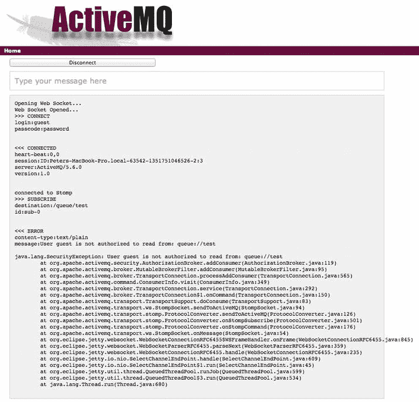
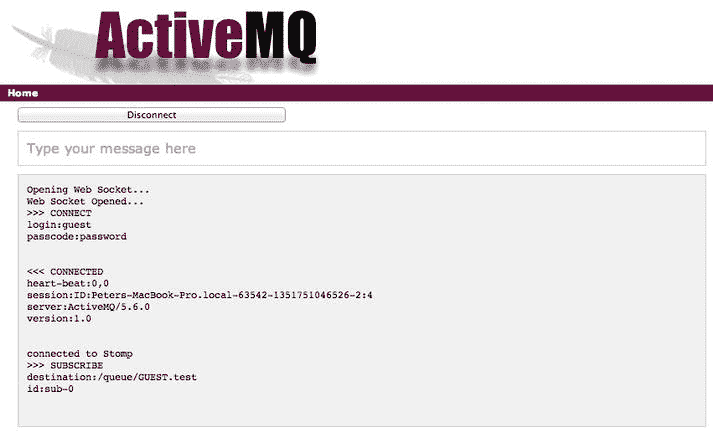

# 七、WebSocket 安全性

到目前为止，本书中的章节已经向您展示了 WebSocket 是如何在 Web 上实现全双工、双向通信的。我们已经了解了如何将 WebSocket 与常用的标准协议如 XMPP 和 STOMP 进行分层，使您能够将基于 TCP 的架构带到 Web 上，并允许从几乎任何地方访问您的应用。您还了解了如何使用 VNC 通过互联网远程控制系统。

伴随这些能力而来的是安全性的挑战和复杂性。网络安全是一个既重要又被误解的话题。尽管软件系统的各个方面都可以在考虑安全性的情况下进行设计，但是由于许多不同组件的交互作用，与安全性相关的系统属性可能会非常复杂。增强系统的安全性意味着将技术应用于软件系统以抵御威胁。

Web 安全的话题跨越网络和浏览器安全，包括应用级安全，甚至操作系统的安全。当您使您的用户能够通过 Internet 访问系统时，您的资产(您的数据库、服务器、应用等)就暴露在所有类型的预期和非预期风险中。网络安全技术可以减轻和解决互联网上的威胁。

WebSocket 标准通过提供未加密和加密的传输，以及将 WebSocket 定义为所有现有安全协议都可以在其中运行的框架，来处理核心安全性。我们无法证明 WebSocket 本身拥有所谓的“安全性”或提供任何最终的防弹配方。但是，我们可以检查与 WebSocket 相关的特定类型的威胁，并推荐最佳实践来帮助编写和部署更安全的应用。

本章详细描述了 WebSocket 安全性，解释了在协议和 API 设计中做出的安全决策，并推荐了部署 WebSocket 服务和应用的实践。有许多 Web 安全资源可供您阅读，尤其是那些与您想用 WebSocket 分层的任何协议相关的资源。在这一章中，我们主要关注与 WebSocket 直接相关的安全方面。

WebSocket 安全概述

在决定使用 WebSocket 时，通过 Web 部署应用会带来您必须考虑的安全挑战。这种挑战包括对服务器的攻击，这些攻击可能利用 WebSocket 服务器中的缺陷来获得对它们的控制。还有拒绝服务攻击，这种攻击试图使系统用户无法使用资源。这种攻击的目标是阻止网站、服务或服务器高效工作——暂时甚至无限期地。

允许用户访问您的 web 应用也会使您的用户受到攻击。恶意的人和邪恶的机器人不断试图复制、删除和修改珍贵的用户数据。这些攻击中的一些可能依赖于模仿，而另一些可能是更被动的窃听和拦截。这些常见的威胁通常通过身份验证和加密通信来缓解。

除了这些众所周知的攻击类型之外，还有针对那些既没有使用也没有部署 WebSocket 的人的非故意和不明确的攻击。这些例子包括混淆 WebSocket 流量和 HTTP 流量的遗留代理和监控系统。

我们在第三章中研究的许多 WebSocket 协议设计选择在安全性方面是有意义的，并被添加来减轻特定的攻击。毕竟，如果 WebSocket 的目的是在两个端点之间打开一个自由流动的字节管道，那么其他一切都是装饰性的。碰巧的是，这些陷阱中的一些是挫败非常特殊类型的攻击所必需的。这些威胁可能会影响协议的用户，或者更奇怪的是，碰巧在同一个网络上的无辜旁观者。

表 7-1 描述了其中一些安全问题，并简要描述了 WebSocket 协议的一些特性是如何专门设计来缓解这些攻击的。我们将在随后的小节中更深入地研究这些领域，并探索更高级别的 WebSocket 安全领域，如身份验证和应用级安全。

表 7-1。web socket API 和协议解决的攻击类型

| 这种攻击 | 。。。是由这个 WebSocket API 或协议特性解决的 |
| --- | --- |
| 拒绝服务 | 原始标题 |
| 通过连接泛滥拒绝服务 | 使用源标头限制新连接 |
| 代理服务器攻击 | 掩饰 |
| 中间人，偷听 | WebSocket 安全(`wss://`) |

WebSocket 安全特性

在我们研究 WebSocket API 和协议解决特定安全领域的方面之前，让我们回顾一下 WebSocket 握手。WebSocket 握手包含几个有助于在 WebSocket 连接上建立安全性的组件。

正如我们在第三章中所描述的，WebSocket 连接从一个包含特殊头的 HTTP 请求开始。该请求的内容是为了安全性和与 HTTP 的兼容性而精心设计的。回顾一下，清单 7-1 是一个客户端发送 WebSocket 握手的例子:

***清单 7-1*** 。客户端发起 WebSocket 握手

```html
Request
GET /echo HTTP/1.1
Host: echo.websocket.org
Origin:http://www.websocket.org
Sec-WebSocket-Key: 7+C600xYybOv2zmJ69RQsw==
Sec-WebSocket-Version: 13
Upgrade: websocket
```

服务器发回一个响应，如清单 7-2 所示。

***清单 7-2*** 。服务器响应并完成 WebSocket 握手

```html
Response
101 Switching Protocols
Connection: Upgrade
Date: Wed, 20 Jun 2012 03:39:49 GMT
Sec-WebSocket-Accept: fYoqiH14DgI+5ylEMwM2sOLzOi0=
Server: Kaazing Gateway
Upgrade: WebSocket
```

握手中需要注意的两个重要区域是 Origin 头和`Sec-`头，我们将在下一节中研究它们。

原点表头

WebSocket 协议(RFC 6455 ) 与另一个文档同时发布，该文档定义了 WebSockets 在 Web 上安全部署所必需的关键思想:origin。起源概念出现在早期的规范中，如跨文档消息传递和跨域资源共享，现在被广泛使用。然而，为了让 WebSocket 标准有效且安全地推广到 Web 上，需要更精确地定义起源概念。RFC 6454 通过定义和描述相同起源策略背后的原则来实现这一点，更重要的是，定义和描述起源报头。

 **注**完整的 RFC 6454 规范见`http://www.ietf.org/rfc/rfc6454.txt`。

源由方案、主机和端口组成。在序列化形式中，源看起来像一个 URL:方案和主机由`://`分隔，冒号在端口前面。对于端口与方案的默认端口相匹配的源，该端口将被省略。

 **注意**由于大多数序列化的起源使用端口 80，这与默认的 HTTP 端口相匹配，所以该端口通常从起源中省略。典型的序列化来源如下:`http://example.com`

图 7-1 显示了一个示例源，包含一个方案、主机和端口。



图 7-1 。原点图

如果两个原点的任何组件不同，浏览器会将这些原点视为完全独立的原点。浏览器可以强制执行一致的规则，以便在来源之间进行通信和共享数据。例如，不同来源的应用可以使用`postMessage()` API 、进行通信，但是它们能够基于发送者和接收者的来源来确定消息的范围。

Origin 取代了旧的、不太标准化的、更复杂的规则，有时被称为“同域策略”同域政策并不全面:页面仍然可以热链接图片并嵌入来自任何来源的 iframes。这个策略包括 referer 头的规则，除了规范拼写错误之外，还包括 URL 路径，因此泄露了太多信息。因此，引用者经常是隐藏的，并且不能依赖于访问控制。对于跨域脚本，对于仅在端口或方案上有所不同的部分匹配来源的页面，实施非标准规则。简而言之，同域政策一团糟。

origin 模型为 web 应用清理了所有的跨域规则。它将源定义为三元组(方案、主机和端口)。如果两个 URL 在这三个方面有任何不同，那么它们就有不同的来源。

origin 模型还使得托管公共和半公共服务成为可能。例如，一个服务器可以允许多个源，允许连接与整个 Web 上的应用交换数据。公共服务甚至可以尝试默认允许所有来源，只阻止那些已知有问题的来源。因此，origin 比旧的同域策略更加灵活，在旧的同域策略下，*所有*不相似的 origin 都被认为是恶意的，并在默认情况下被阻止。

缓解拒绝服务

Origin 允许接收方拒绝不想处理的连接。Web 服务器可以检查传入请求的来源标头，并选择不处理来自未知或可能恶意来源的连接。这种能力对于减少拒绝服务(DoS)攻击非常有帮助。

针对网络服务器的拒绝服务攻击有很多种。一些 DoS 攻击开始于由成千上万台受损电脑组成的僵尸网络；这种攻击完全在攻击者的控制之下。有些人可能认为僵尸网络只是现代互联网生活的一部分。但是，web origin security 还可以直接应对其他攻击。网络平台使得滥用网络功能发动 DoS 攻击变得更加困难。在 WebSocket 的情况下，因为接收服务器可以使用 origin 头来验证传入请求的来源，所以 DoS 攻击更加难以完成。服务器可以禁止来自未知或攻击源的连接，通过拒绝连接来节省服务器资源。

浏览器发出的所有 WebSocket 请求中都包含正确的 origin 头。完全不能在浏览器中运行的应用怎么办？您可能会注意到，没有什么可以阻止您在控制台应用中打开一个套接字，并编写您喜欢的任何源代码。服务器并不真的知道带有特定 origin 头的请求来自 web 应用；他们只知道一个请求不是来自不同来源的 web 应用。人们反复问的一个问题是，如果 origin 如此容易被欺骗，它提供了什么安全保障？理解答案需要理解 WebSockets 的真正本质，如下一节所述。

什么是 WebSocket(从安全角度来看)？

如果您已经在本书中读到这里，您就会知道在您的应用中使用 WebSocket 所带来的许多好处。正如第一章中所描述的，WebSocket 有许多可取的特性。WebSocket 是一个简单、标准、低开销的全双工协议，可用于构建可伸缩的、接近实时的网络服务器。如果你是一个聪明的计算学生，或者回忆一下早期的日子，你会知道这些特征中的大多数同样适用于简单、纯粹的 TCP/IP。也就是说，它们是套接字(尤其是 SOCK_STREAM)的特征，而不是 WebSockets 的特征。那么，为什么要把“网络”加到“插座”上呢？为什么不简单地在 TCP 之上构建传统的互联网应用呢？

要回答这个问题，我们需要区分“非特权”和“特权”应用代码。无特权代码是在已知来源内运行的代码，通常是在网页内运行的 JavaScript。在 Web 安全模型中，TCP 连接不能被“非特权代码”安全地打开如果允许无特权的应用代码打开 TCP 连接，脚本就有可能发起带有伪造标头的 HTTP 请求，这些标头看起来似乎来自不同的来源。如果相同的脚本可以通过在 TCP 上重新实现 HTTP 来绕过这些规则，那么以这种方式欺骗报头的能力将使得管理脚本如何进行 HTTP 连接的规则变得毫无意义。允许来自 web 应用的 TCP 连接将打破原始模型。

因此，由非特权代码形成的 WebSocket 连接必须遵循与 AJAX 和其他允许非特权代码的网络功能相同的模型。HTTP 握手将连接初始化置于浏览器的控制之下，并允许浏览器设置源头和保留源模型所需的其他头。通过这种方式，WebSocket 允许应用在与 HTTP 应用、服务器和沙箱规则共存的同时，通过轻量级双向连接执行互联网风格的联网。

从特权代码形成的 WebSocket 连接通常可以打开任何网络连接；这种能力不是问题(或者至少对 Web 来说不是问题)，因为特权应用一直开放使用任何网络连接，并且必须由用户安装和执行。本机应用不在 web 起源中运行，因此起源规则不需要应用于由特权代码形成的 WebSockets。

不要让用户困惑

过去，授予非特权代码网络访问权的一种方法是，当应用请求时，提示用户授予选择性的网络使用权限。理论上，这种方法为同样的问题提供了解决方案。当用户授予选择性权限时，虽然应用会将知道应用应该如何运行的责任放在用户身上，但是当用户明确允许时，代码可以被允许进行网络连接。实际上，用户并不知道向代码授予权限的影响，大多数用户会愉快地点击 OK。用户只是希望应用能够正常工作。

与安全相关的提示通常令人讨厌、困惑，并且经常被忽略，从而导致严重的后果。WebSocket 方法拒绝应用打开非中介 TCP 连接；但是，它提供了与典型网络相同的功能，其安全性更好，并且不会因为来源而对用户的用户界面产生影响。Origin 让接收服务器拒绝连接，而不是要求用户允许连接。

节流新连接

尽管 origin 报头可以防止在 HTTP 层建立大量连接，但是在 TCP 层打开的大量连接仍然存在潜在的 DoS 威胁。即使开放的 TCP 连接不携带任何数据成本资源，也有可能出现大量客户端使服务器不堪重负的情况，即使这些连接最终会被服务器拒绝。为了防止连接过载，WebSocket API 要求浏览器限制新连接的打开。正如你在第二章中看到的，每次调用 WebSocket 构造函数都会产生一个新的、开放的网络套接字。浏览器限制底层 TCP 套接字打开的速率，这反过来防止 TCP 连接的洪流打开到不接受它们作为 WebSocket 升级的主机，并且不会过度减慢合法地想要打开到同一主机的一个或少量连接的应用。

带有“Sec-”前缀的标题

在 WebSocket 开始握手中，有几个必需的 HTTP 头，如清单 7-1 和 7-2 所示。其中一些头文件在 web 平台上很普遍，比如 origin，而其他一些新的头文件是为了支持 WebSocket 而引入的。新的头经过精心选择和命名，以防止滥用 AJAX APIs 来欺骗 WebSocket 请求。

客户端向服务器发送 HTTP 请求，要求将协议升级到 WebSocket。如果服务器支持这种升级，它会用相应的头进行响应。正如在第三章中所解释的，为了成功完成升级，其中一些头文件是必需的。服务器和浏览器都强制执行这种交换和报头确认。在这些报头中，有些以前缀“`Sec-`”开头，在 RFC 6455 中有描述。这些头在开始的 WebSocket 握手中使用(见表 3-2 对这些`Sec-`头的完整描述):

*   `Sec-WebSocket-Key`
*   `Sec-WebSocket-Accept`
*   `Sec-WebSocket-Extensions`
*   `Sec-WebSocket-Protocol`
*   `Sec-WebSocket-Version`

在 XMLHttpRequest 规范中，浏览器为平台级使用保留了几个头名称，因此在应用中是禁止使用的。这些头名包括以 Sec-开头的头名，以及常见的安全关键头名，如 referer、host 和 cookie。

RFC 6455 中定义的新报头都带有前缀`Sec-`。这样命名这些前缀是因为浏览器代表应用打开 WebSocket 连接，但是握手中的低级、安全敏感参数是应用代码禁止使用的。这有效地锁定了升级请求，使得它们只能通过 WebSocket 构造函数这样的 API 而不是通过 XMLHttpRequest 这样的通用 HTTP APIs 来进行。

WebSocket 安全握手:接受密钥

您可能还记得我们对 WebSocket 协议的讨论，WebSocket 连接的成功是基于服务器的响应。服务器必须用 101 响应代码、WebSocket 升级头和`Sec-WebSocket-Accept`头来响应初始 WebSocket 握手。`Sec-WebSocket-Accept`响应头的值来自于`Sec-WebSocket-Key`请求头，并且包含一个特殊的密钥响应，该响应必须与客户端期望的完全匹配。

客户端和服务器之间需要交换`Sec-WebSocket-Key`和`Sec-WebSocket`报头的原因并不明显。这些密钥只在连接初始化期间使用，很容易被截获，并且显然不能为 WebSocket 客户端或服务器提供保护。这些钥匙能保护什么？这些密钥实际上保护了非 ?? 的 WebSocket 服务器，并消除了跨协议攻击的可能性。跨协议攻击的例子是那些向非 WebSocket 服务器发出巧尽心思构建的 WebSocket 请求以建立连接或以其他方式利用它们的攻击，以及通过与另一个协议建立巧尽心思构建的连接来混淆期望一个协议的服务器。为了防止使用 WebSocket 的跨协议攻击，握手要求服务器转换客户端提供的密钥。如果服务器没有按预期回复，客户端将关闭连接。WebSocket RFC 包含一个全球唯一标识符(GUID ),这是一个用来标识*协议*而不是连接或用户或系统中任何其他参与者的神奇密钥。GUID 是`258EAFA5-E914-47DA-95CA-C5AB0DC85B11` **。**

服务器读取`Sec-WebSocket-Key`报头的值，并执行以下步骤:

1.  服务器添加 GUID: `258EAFA5-E914-47DA-95CA-C5AB0DC85B11`
2.  服务器使用 SHA1 哈希转换结果
3.  服务器使用 Base64 编码转换结果
4.  服务器将结果作为`Sec-WebSocket-Accept`头的值发送回来

通过对所提供的密钥执行特定的转换，服务器证明它特别理解 WebSocket 协议，因为不知道散列的服务器不是真正的 WebSocket 服务器。这种转换避免了直接的跨协议攻击，因为真正的 WebSocket 客户端和服务器将坚持只在它们之间进行对话。

HTTP 代理和屏蔽和

在第二章和第三章中，我们讨论了 WebSocket 框架，它包含了 WebSocket 消息。从浏览器发送到服务器的 WebSocket 帧被屏蔽，以混淆帧的内容，因为拦截代理服务器会被 WebSocket 流量混淆。在第三章的中，我们讨论了屏蔽 WebSocket 框架如何提高与现有 HTTP 代理的兼容性。然而，屏蔽还有另一个与安全有关的不寻常且微妙的原因。

与常规的 HTTP 请求-响应流量不同，WebSocket 连接可以长时间保持开放。在较旧的体系结构中，代理服务器被配置为允许这样的连接，并且可以很好地处理流量，但是它们也会干扰 WebSocket 流量并引起麻烦。

代理服务器充当客户端和另一个服务器之间的中介，通常用于监控流量，如果连接打开时间过长，有时会关闭连接。代理服务器可能会选择关闭长期 WebSocket 连接，因为代理服务器会将这些连接视为试图与无响应的 HTTP 服务器连接。

图 7-2 显示了一个简单的网络拓扑的例子，包括 WebSocket、代理服务器和 web 应用。这里，浏览器中的客户端应用使用 WebSocket 连接访问后端基于 TCP 的服务。其中一些客户端位于企业内部网中，受企业防火墙保护，并配置为通过显式代理服务器访问 Web(见图 7-2)；这些代理服务器可以缓存内容并提供一定程度的安全性。其他客户端应用直接访问 WebSocket 服务器。在这两种情况下，客户端请求可以通过透明代理服务器进行路由。



图 7-2 。使用代理服务器的网络拓扑

图 7-2 显示了三种类型的代理服务器:

*   转发代理服务器:通常由服务器管理员安装、配置和控制。转发代理服务器将从内部网发出的请求定向到互联网。
*   反向代理服务器:通常由服务器管理员安装、配置和控制。反向代理服务器(或防火墙)通常部署在服务器前面的网络 DMZ 中，执行安全功能以保护内部服务器免受来自互联网的攻击。
*   透明代理服务器:通常由网络运营商控制。透明代理服务器通常拦截网络通信，用于缓存或阻止公司内部网用户出于特定目的访问 Web。网络运营商可以使用透明代理服务器来缓存经常访问的网站，以减少网络负载。

所有这些拦截代理服务器都可能被 WebSocket 流量混淆，对于透明代理服务器来说尤其如此。例如，攻击者可能会毒害透明代理服务器上的 HTTP 缓存。HTTP 缓存中毒是一种攻击，在这种攻击中，攻击者对 HTTP 缓存进行控制，以提供危险的内容来代替请求的资源。在一组研究人员撰写了一篇论文，概述了对使用 HTTP 升级请求的透明拦截代理的理论攻击之后，缓存中毒成为 WebSocket 标准化期间的一个主要问题。这篇名为【与自己交谈以获取乐趣和利益】的论文(黄、陈、巴斯、瑞斯寇拉、&杰克森，2011)让工作组相信，如果没有针对这些可能的攻击的保护，WebSocket 标准化是危险的。如何预防中毒？经过工作组的激烈辩论，屏蔽被添加到 WebSocket 协议中。屏蔽是一种隐藏(但不加密)协议内容的技术，以防止透明拦截代理中的混乱。正如在《??》第三章中所讨论的，屏蔽通过将内容与几个随机字节进行异或来转换从浏览器发送到 WebSocket 服务器的每个消息的有效载荷。

之前我们提到过，插件和扩展如果请求权限可以打开套接字，安装的应用一直使用任意流量的网络连接。是什么阻止了这种代理背后的人打开终端，手动创建这种网络流量？答案是:完全没有。屏蔽不能修复代理中的问题，尽管它不会加剧现有的问题。在 Web 上，没有安装应用，你只需浏览一下就可以运行来自不同来源的数千个脚本，一切都被放大了。Web APIs 必须更加偏执。

与 origin 一样，屏蔽也是一种安全功能，不需要针对窃听进行加密保护。如果双方和任何中间人愿意，他们都可以理解屏蔽的有效载荷。然而，对于不理解屏蔽有效载荷的中间人，他们受到严格保护，不会将 WebSocket 消息的内容误解为 HTTP 请求和响应。

安全 WebSocket 使用 TLS(你也应该！)

正如我们在第三章中讨论的，WebSocket 协议定义了 WebSocket ( `ws://`)和 WebSocket Secure ( `wss://`)前缀；两种连接都使用 HTTP 升级机制来升级到 WebSocket 协议。传输层安全性(TLS)是访问 URL 以`https://`开头的安全网站时使用的协议。TLS 在传输过程中保护数据并验证其真实性。WebSocket 安全连接通过使用 WebSocket 安全(WSS) URL 方案`wss://`的隧道通过 TLS 来保护。通过保护与 TLS 的 WebSocket 通信，您可以保护网络通信的机密性、完整性和可用性。在这一章中，我们关注与 WebSocket 安全性相关的机密性和完整性，并在第八章中从部署的角度探讨 TLS 的好处。

 **注意** TLS 有自己的 RFC，由 IETF 定义:`http://tools.ietf.org/html/rfc5246`。

您可以使用普通的、未加密的 WebSocket 连接(前缀为`ws://`)来进行测试，甚至是简单的拓扑。如果您在网络上部署服务，有线级加密的好处是巨大的，缺点相对较小。

随着 TLS 协议和现代机器的改进，在 Web 上使用加密的主要历史缺陷都大大减少了。在过去，你可能会选择不使用 HTTPS，因为高 CPU 成本，缺乏虚拟主机，以及新连接的启动时间慢。现代的改进减轻了这些担忧。

部署 TLS 也有一些令人愉快的副作用。加密的 WebSocket 流量通常通过代理运行得更顺畅。加密阻止代理检查流量，所以它们通常只让字节通过，而不试图缓冲或改变流量。有关部署加密 WebSocket 服务的更多信息，请参见第八章。

就像 WebSocket 在升级到 WebSocket 之前以 HTTP 握手开始一样， WebSocket Secure (WSS) 握手以 HTTPS 握手开始。HTTPS 和 WSS 协议非常相似，都运行在 TCP 连接上的 TLS 之上。为 WebSocket 网络流量配置 TLS 加密的方式与为 HTTP 配置相同:使用证书。使用 HTTPS，客户端和服务器首先建立安全连接，然后才开始 HTTP 协议。类似地，WSS 建立安全连接，开始 HTTP 握手，然后升级到 WebSocket wire 协议。这样做的好处是，如果您知道如何为加密通信配置 HTTPS，那么您也知道如何为加密 WebSocket 通信配置 WSS。

图 7-3 顶部的电缆显示了 HTTPS 不是一个独立的协议，而是运行在 TLS 连接上的 HTTP 的组合。通常，HTTPS 使用不同于 HTTP 的端口(HTTPS 的默认端口是 443，HTTP 的默认端口是 80)。HTTP 直接运行在 TCP 上，HTTPS 运行在 TLS 上，而 TLS 又运行在 TCP 上。

图底部的电缆显示，WebSocket 安全(WSS)连接也是如此。WebSocket (WS)协议运行在 TCP 上(像 HTTP 一样)，WSS 连接运行在 TLS 上，而 TLS 又运行在 TCP 上。WebSocket 协议与 HTTP 兼容，因此 WebSocket 连接使用相同的端口:WebSocket 默认端口是 80，WebSocket Secure (WSS)默认使用端口 443。



图 7-3 。HTTP、HTTPS、WS 和 WSS

认证

为了确认通过 WebSocket 连接到我们服务器的用户的身份，WebSocket 握手可以包含 cookie 头。使用 cookie 头允许服务器使用用于验证 HTTP 请求的相同 cookie 进行 WebSocket 验证。

在写这本书的时候，浏览器不允许来自 WebSocket API 的其他形式的 HTTP 认证。有趣的是，API 并不禁止这些机制；它们不能在浏览器上运行。例如，如果服务器响应 WebSocket 升级请求，要求状态 401 身份验证，浏览器将简单地关闭 WebSocket 连接。这个模型中的假设是，在应用尝试打开 WebSocket 连接之前，用户已经通过 HTTP 登录到应用。

或者，身份验证可以在 WebSocket 升级完成后通过应用层协议进行。XMPP 和 STOMP 之类的协议在这些层中内置了标识用户和交换凭证的语义。可以部署未经身份验证的 WebSockets，但需要在下一个协议层进行身份验证。在下一节“应用级安全性”中，我们还将讨论如何在应用协议级实施授权。

应用层安全

应用级安全性规定了应用如何保护自己免受可能暴露隐私信息的攻击。这个安全级别保护应用公开的资源。如果您使用 XMPP、STOMP 或高级消息队列协议(AMQP) 等标准协议，那么您可以在基于 WebSocket 的系统上利用应用级安全性。配置权限是针对服务器的。

在第五章中，我们使用了 Apache ActiveMQ 消息代理来说明如何使用 STOMP over WebSocket 构建应用。在这里，我们将继续构建 ActiveMQ 配置并限制对其资源的访问，我们将通过实现 Apache ActiveMQ 附带的示例 WebSocket 应用的安全性来实现这一点。

在本节中，我们回顾两种应用安全措施。首先，我们来看一个简单的身份验证插件，它要求用户在访问 ActiveMQ 之前进行身份验证。然后，我们看一下如何配置授权来保护特定的队列和主题。

在我们开始之前，让我们确保您可以在不提供凭据的情况下访问演示，以确保您尚未配置应用身份验证和授权。使用以下命令，启动 ActiveMQ:

```html
$> bin/activemq console
```

导航到 ActiveMQ 欢迎页面，默认情况下位于`http://0.0.0.0:8161/`。点击*查看一些 web 演示*链接，并打开 WebSocket 示例。这个演示的默认 URL 是:`http://0.0.0.0:8161/demo/websocket/index.html`。

将服务器 URL 字段中的主机名从`localhost`修改为`0.0.0.0`，并点击连接。如图图 7-4 所示，你现在应该被连接上了。


图 7-4 。Apache ActiveMQ 配置的没有认证

因为 ActiveMQ 没有配置为执行身份验证，所以您输入的任何凭据都会被忽略。您可以通过将登录和密码字段更改为任意值，然后再次单击连接来确认此行为。你应该还能连接。现在，让我们向应用添加身份验证。

应用认证

配置后，身份验证会阻止用户访问 ActiveMQ，除非他们提供正确的凭据。让我们回顾一下如何配置身份验证，以及如何为用户定义凭据。

清单 7-3 显示了一个示例配置片段，您可以将其添加到我们在第五章中使用的配置中。当您将它添加到 Apache ActiveMQ 安装目录中的`conf/activemq.xml`文件中时，您限制了用户对系统的访问，ActiveMQ 用用户名和密码询问用户。

 **注意**你可以为 Apache ActiveMQ 定义各种配置文件。为了使我们的例子简单，这里我们修改默认的例子。有关其他 Apache ActiveMQ 配置，请参见 ACTIVEMQ_HOME/conf 目录。

***清单 7-3*** 。样本 Apache ActiveMQ 配置

```html
<plugins>
<simpleAuthenticationPlugin>
<users>
<authenticationUser username="system"
password="${activemq.password}"
groups="users,admins"/>
<authenticationUser username="user"
password="${guest.password}"
groups="users"/>
<authenticationUser username="guest"
password="${guest.password}" groups="guests"/>
</users>
</simpleAuthenticationPlugin>
</plugins>
```

清单 7-3 在`conf/activemq-security.xml`文件中也是一个例子。

让我们用新的配置启动 Apache ActiveMQ 消息代理。在 ACTIVEMQ_HOME 目录中，输入以下内容:

```html
$> bin/activemq console
```

现在，当您尝试使用演示提供的相同用户名和密码访问示例应用时，会导致系统拒绝用户登录，如图图 7-5 所示。这是因为默认情况下，登录和密码字段的预填充值是`guest`，而您刚刚添加的配置引用了`${guest.password}`属性，正如在`ACTIVEMQ_HOME/conf/credentials.properties`文件中指定的那样。



图 7-5 。Apache ActiveMQ 拒绝使用新配置的用户登录

提供正确的用户名和密码组合将允许用户访问系统。访客用户的默认密码是`password`(定义见`ACTIVEMQ_HOME/conf/credentials.properties` ) *。*

清单 7-4 显示了认证插件配置中的一行，告诉 Apache ActiveMQ 消息代理用户`guest`有他或她自己的密码，并且该用户是`guests`组的一部分。

***清单 7-4*** 。为用户 Guest 设置密码和组

```html
<authenticationUser username="guest" password="${guest.password}"
groups="guests"/>
```

申请授权

身份验证成功后，您希望授予对某些应用资源的访问权限，同时拒绝对其他一些资源的访问权限。在本节中，我们将回顾您需要做些什么来授予用户和组对特定队列和主题的访问权限。

清单 7-5 显示了一个配置，当添加到`the ACTIVEMQ_HOME/conf/activemq.xml`文件时，限制对消息代理目的地的故意访问。该配置显示了如何根据应用要求启用或禁用用户访问。类似于认证片段，`authorizationPlugin`必须被`<plugins>`标签包围。插件标签中授权和认证的顺序是不相关的。

***清单 7-5*** 。限制对消息代理目的地的故意访问

```html
<authorizationPlugin>
<map>
<authorizationMap>
<authorizationEntries>
<authorizationEntry queue=">" read="admins"write="admins" admin="admins" />
<authorizationEntry queue="USERS.>" read="users" write="users" admin="users" />
<authorizationEntry queue="GUEST.>" read="guests"
write="guests,users" admin="guests,users" />
<authorizationEntry queue="TEST.Q" read="guests" write="guests" />
<authorizationEntry topic=">" read="admins" write="admins" admin="admins" />
<authorizationEntry topic="USERS.>" read="users" write="users" admin="users" />
<authorizationEntry topic="GUEST.>" read="guests" write="guests,users" admin="guests,users" />
<authorizationEntry topic="ActiveMQ.Advisory.>" read="guests, users" write="guests,users" admin="guests,users"/>
</authorizationEntries>
</authorizationMap>
</map>
</authorizationPlugin>
```

清单 7-5 中的示例配置指定`admins`拥有对所有队列和主题的完全访问权，而来宾只能访问具有`GUEST` *的队列和主题。*在自己的名字前加前缀。

重新启动 ActiveMQ 以获取配置更改。当您在 web 浏览器中重新加载示例演示应用时，请确保将默认密码更改为值`password`，然后单击 Connect。用户将被验证，但不能发送或接收消息，因为主题名称没有正确的前缀。

图 7-6 显示用户可以连接到系统，但不能发送到`test`队列。



图 7-6 。用户成功连接但无法发送消息

现在，将目的地字段设置为`/queue/GUEST.test`，然后点击连接。图 7-7 显示了成功登录的结果，用户现在被授权在该队列上发送和接收消息。



图 7-7 。用户成功连接并被授权接收消息

用户现在能够发送和接收消息，因为您在 ActiveMQ 配置中设置了一个授权策略,允许用户，即*来宾*组的一部分，读取、写入和管理任何带有前缀`GUEST`的队列和主题。清单 7-6 显示了授权策略。

***清单 7-6*** 。ActiveMQ 中的授权策略

```html
<authorizationEntry queue="GUEST.>" read="guests" write="guests,users"
admin="guests,users" />
```

 **注意** Apache ActiveMQ 利用目的地通配符为联合名称层次结构提供支持。

正如您所看到的，您可以简单地通过配置后端消息代理来控制应用的安全性。增强应用资源的安全性进一步加强了 WebSocket 上的安全模型，从 WebSocket 上的后端服务器，一直到浏览器中的应用。

摘要

安全性是 Web 应用部署的一个极其重要的方面，对于 WebSocket 应用来说同样重要。在本章中，我们研究了与 WebSocket 相关的 Web 安全领域，以及如何使用 TLS 等常用的安全协议、WebSocket 中内置的屏蔽等功能以及 origin 头(其定义专门针对 WebSocket 规范进行了细化)来解决这些问题。最后，我们通过一个示例演示了如何通过应用身份验证和授权来实现应用级别的安全性，从而从源头保护资源。

在下一章中，我们将进一步探讨与部署相关的安全性，并讨论当您决定将 WebSocket 应用部署到 Web 时需要考虑的事项。