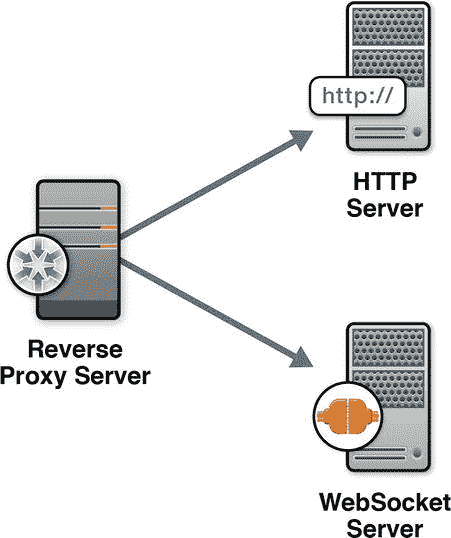
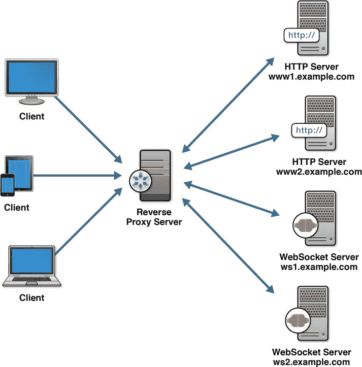
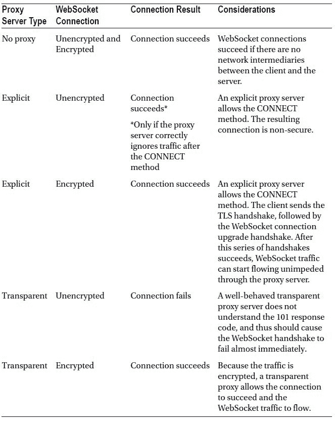
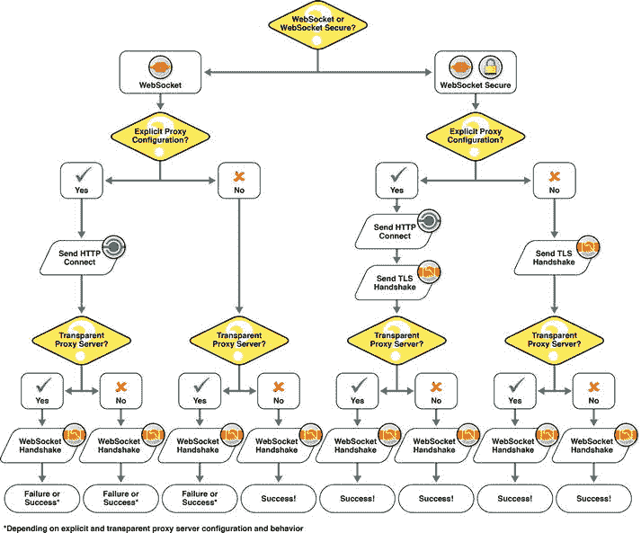

# 八、部署考虑事项

在构建、保护和测试任何 web 应用之后，下一个合乎逻辑的步骤就是部署它。在部署 WebSocket 应用时，您必须考虑的许多事项与任何 web 应用类似。在这一章中，我们将重点关注 web 应用部署的各个方面，尤其是在部署 WebSocket 应用时应该考虑的方面。

在部署应用时，您必须考虑许多因素，尤其是对企业而言，例如业务需求、客户端将如何与应用交互、应用使用的信息、在任何给定时间将使用应用的客户端数量等等。一些应用可能需要高可用性，并且必须支持许多并发连接，而其他应用可能更强调性能和低延迟。对于 WebSocket 应用，您需要提供相同的需求，记住 WebSocket 协议的本质和您正在构建的应用的类型。在这一章中，我们将研究部署的一些主要方面，因为它们特别与 WebSocket 相关，如 WebSocket 仿真、代理和防火墙、负载平衡和容量规划。

WebSocket 应用部署概述

在部署任何 web 应用时，您都需要考虑一些一般要求，例如将使用您的应用的各种浏览器、应用的类型、服务器必须处理的流量的性质，以及应用是由服务器驱动还是由用户交互驱动。现在，您的脑海中充满了可以使用 WebSocket 构建的各种新应用，您需要在部署它们时考虑这些应用需求。

例如，你可以想象一个基于 WebSocket 的消息传递应用(使用 STOMP over WebSocket，正如我们在第五章中所描述的)，其中你的应用必须支持数千个——不，是数万个——并发连接。您的应用可能是一个股票投资组合应用，其中您的用户可以跟踪每天发生的数百万次股票交易。为了使应用有用，这些数据必须立即实时刷新；因此，您可能会看到一个系统，其中服务器使用全双工连接将连续的股票信息传输到用户的浏览器或移动设备，几乎没有用户交互。在另一种情况下，您可能希望使用 WebSocket 创建一个可定制的视频流应用，其中大量数据(几分钟长的视频文件)可以通过连接进行流式传输，但一次只能传输到几千个客户端；这种流量在一天中可能是零星的，在一天中的特定时间达到高峰，并且用户请求、共享和发布视频的交互量很大。每个场景都非常适合 WebSocket，并且每个场景都有不同的部署需求。

在本书的前几章中，您还了解了通过 WebSocket 使用标准协议的不同方式。您可以做出的选择之一是，您可以选择在您的服务器中启用 WebSocket(例如，您可以让您的 XMPP 聊天服务器使用 WebSocket ),或者选择使用位于基于 TCP 的服务器和您的客户端之间的网关，但允许您在 WebSocket 上放置标准协议以利用全双工连接。在每一种情况下，您可能需要考虑支持 WebSocket 的后端服务器或 WebSocket 网关将如何处理各种客户端连接。

*应用部署*和 *WebSocket 应用部署*之间的差别并不大，但是在部署您的 WebSocket 应用时，有一些地方需要考虑。

WebSocket 仿真和回退

虽然现代浏览器原生支持 WebSocket，但仍然有许多没有原生 WebSocket 支持的旧版本浏览器被广泛使用，其中许多是在企业环境中或在严格控制浏览器和版本的业务需求下。作为一名开发人员，您通常无法控制用于访问应用的浏览器的类型，但是您仍然希望能够适应尽可能广泛的受众。通过使用协作客户端库和服务器之间的其他通信策略，有多种方法可以实现 WebSocket 功能的“仿真”。作为最后的手段，还可以选择使用另一种通信技术。

插件〔??〕

建立全双工通信的一种方法是使用插件。一个常见的插件是 Adobe Flash，它可以让你打开 TCP 套接字。虽然大多数桌面浏览器都倾向于安装 Flash，但如果没有，用户必须显式下载，这会影响用户体验。由于 Flash 和应用代码之间昂贵的通信，使用插件进行通信也会影响应用的性能。更糟糕的是，使用 Flash sockets 会导致您的应用在连接时挂起三秒钟。此外，请记住，Adobe Flash 在流行的 iOS、Android 和 Windows RT 环境中并不完全受支持。这种支持的缺乏意味着随着浏览器继续远离基于插件的可扩展性，基于插件的回退策略变得越来越不可行。

多填充物

插件的一个可行替代方案是 polyfill，它是一个使用传统浏览器功能实现标准 API 的库。Polyfills 允许开发人员在创建应用的同时瞄准新的 web 标准，并且仍然能够接触到使用旧浏览器的用户。对于各种 HTML5 功能，包括图形、表单和数据库，存在许多聚合填充。Polyfills 可以使用多种策略来实现标准 API。例如，Kaazing 为 WebSocket API 提供了一个 polyfill，它使用 secret sauce 流技术，并为在不支持 WebSocket 的浏览器上运行的 WebSocket 应用提供了一个后备解决方案。

Modernizr ，是一个 HTML5 最佳实践的开源项目，它维护着一个 wiki，其中有一个最新的 polyfills 列表及其对各种 HTML5 技术的描述，包括在`https://github.com/Modernizr/Modernizr/wiki/HTML5-Cross-Browser-Polyfills`的 WebSocket。

不同的抽象层

还有其他像 Socket.io 这样的库，它们使用 WebSocket 和 Comet 技术来公开单个 API。其中一些库具有与标准 WebSocket API 相同的 API，因此是 polyfills。其他库包括不同于 WebSocket API 的 API，但是使用 WebSocket 作为传输策略来提供不同的通信抽象。这种技术并不一定使它们不如 polyfills 更理想，但是针对标准接口编写的代码更具可移植性，并且在预期有一天不再需要后备库时是未来的证明。

即使是采用 Comet 技术的最好的回退实现也有其缺点。从本质上讲，这些是在应用中使用 WebSocket 作为传输层协议的好处的另一面。仿真对于确保与传统浏览器和不利网络的连接是必不可少的，但是当您诉诸回退策略时，了解您正在失去什么也是很重要的。许多原因是迫使 WebSocket 首先被开发的原因。在选择和设计回退策略时，您可能希望记住这些模拟技术:

*   **是非标准:** 正如我们在第一章中所描述的，这些回退选项是非标准的，这也是 WebSocket 被创建的原因之一。使用这些非标准的技术，不同的 WebSocket 仿真客户端和服务器之间无法相互通信。
*   **提供降低的性能:** 高性能的 Comet 实现只能单向传输数据:从服务器到浏览器。即使通过 AJAX 实现的最佳 WebSocket 仿真也无法将数据从浏览器传输到服务器。
*   **有浏览器连接限制:**浏览器限制每台主机的 HTTP 连接数。彗星连接不受此限制。
*   **拥有复杂的(或无功能的)跨起源部署 :** WebSocket 从第一天起就内置了起源安全性。跨源 AJAX 需要额外的配置才能在遗留浏览器上工作。

代理和其他网络中介

在第七章中，我们讨论了代理服务器以及它们与 WebSocket 安全性的关系。代理属于“中介体”的范畴，它是位于 web 应用和服务器之间的网络中介。

有两种截然不同的类中间体会影响部署:位于服务器和互联网之间的中间体，以及位于用户和互联网之间的中间体。在服务器端，您或您的组织通常控制防火墙和反向代理，它们是服务器基础结构的一部分。添加这些服务器端中介是为了支持您的基础设施或实施安全策略。

在客户端，用户通常位于防火墙和转发代理之后。它们的连接通过这些中介到达网络。除了一些封闭的环境，您无法控制用于连接到服务器的网络。但是，您可以在部署 WebSocket 服务器时做出决定，使通过这些网络的连接更顺畅、更频繁地成功。

当考虑部署您的 WebSocket 应用时，您将需要考虑能够处理客户端和服务器之间流量的各种可能的中介。

反向代理和负载平衡

反向代理是代表一台或多台服务器接受 web 客户端连接的特定类型的服务器。反向代理有多种用途，包括隐藏原始服务器、应用防火墙、 TLS(或 SSL)终端的存在和特征，以及卸载、负载平衡、缓存静态内容和通过 WebSocket 启用动态内容。当必须从单个公共 IP 地址和端口访问多个 web 服务器时，也可以使用反向代理。

图 8-1 显示了一个简单的拓扑结构，在一个 HTTP 服务器和一个 WebSocket 服务器前面有一个反向代理服务器。

图 8-1 。HTTP 和 WebSocket 服务器前的反向代理服务器

使用反向代理服务器有几个好处，包括使您能够独立于网络中的其他服务器部署、管理和更新 WebSocket 服务器。虽然反向代理服务器可以使您的应用使用单个端口来访问拓扑中的服务器，但是随着用户数量的增加，您需要考虑负载平衡选项。例如，您可能有一个为静态内容提供服务的 HTTP 服务器和多个为 web 应用提供动态内容的 WebSocket 服务器。

您可以使用一个反向代理作为您的服务器前面的负载平衡器，通过配置代理服务器来平衡许多 WebSocket 服务器之间的负载。比如你可以通过使用反向代理服务器指向`ws1.example.com,ws2.example.com,`等方式创建一个 HTTP 和 WebSocket 服务器的网络，如图图 8-2 所示。

图 8-2 。反向代理服务器作为负载平衡器

反向连接

反向代理服务器连接到安全网络内部的服务器，以便建立端到端通信。有时，您希望使用的后端服务器无法接收连接，这通常发生在两种情况下:在早期开发期间，您希望允许连接到在本地主机或本地网络上运行的 WebSocket 服务器，以及在一些企业部署中，应用服务器位于阻止所有传入连接的防火墙之后(通常是出于安全原因和/或您组织的策略)。

You may recall our discussion about addressability in Chapter 3, where we identified a fundamental problem: some machines on the Internet can only make outgoing connections and cannot be directly addressed. WebSocket essentially solves this problem for web clients, which cannot be directly accessed by servers. Servers can only send newly available data to a client on a connection that was initiated by that client. By keeping a persistent connection open from web clients, WebSocket removes this limitation. Similarly, reverse connectivity or tunneling keeps a persistent connection open from WebSocket servers. Reverse connectivity for servers uses persistent connections from non-addressable hosts to publicly available endpoints. The publicly available endpoint forwards connections over this persistent tunnel to servers that would otherwise be unable to accept connections. If your WebSocket server does not have a public address, you may want to use reverse connectivity to make it available.

穿越代理 和带传输层安全的防火墙(TLS 或 SSL )

在本书中，我们经常提到传输层安全性(TLS，以前称为 SSL ),这是因为一个重要的原因。TLS 隐藏网络流量，使其免受中间人攻击者的检查和干扰。TLS 也有助于连接顺利地通过一些常见的 web 代理。在本节中，我们将研究不同类型的代理对 WebSocket 连接的影响。希望在本节结束时，您会明白为什么我们建议在 TLS 上部署 WebSocket，即使这不是一个安全需求。

因为转发代理管理专用网络和 Internet 之间的流量，所以如果连接打开的时间过长，它们也可以关闭连接。代理服务器的这种预期行为对需要持久连接的技术(如 WebSocket)来说是一种风险。我们将在本章的后面讨论如何用 pings 和 pongs 来抵消这种影响。代理也更有可能缓冲未加密的 HTTP 响应，从而在 HTTP 响应流期间引入不可预测的延迟。

不需要任何中间服务器，只要双方都理解 WebSocket 协议，就可以顺利建立 WebSocket 连接。然而，随着您和互联网之间网络中介的激增，在部署基于 WebSocket 的应用时，有些情况您需要了解，如表 8-1 中所述。

表 8-1 。使用加密/未加密的 WebSocket 和显式透明的代理服务器

代理通常分为两类:显式代理和透明代理。当浏览器被显式配置为使用代理服务器时，代理服务器是显式的。对于显式代理，您必须为您的浏览器提供代理的主机名、端口号以及可选的用户名和密码。当浏览器不知道流量被代理拦截时，代理服务器是透明的。

使用 WebSocket Secure (WSS) 增加了连接成功的几率，即使网络上有中间盒对传出连接进行透明检查和修改。

图 8-3 进一步说明了 WebSocket 连接成功或失败的情况，这取决于变量的组合，例如普通 WebSocket 协议与 WebSocket 安全和显式代理配置以及透明代理服务器。

图 8-3 。WebSocket 如何与代理服务器交互

正如你在图 8-3 中所看到的，使用 WSS 可以极大地增加你的 WebSocket 连接成功的机会，即使流量必须通过显式和透明的代理。

部署 TLS

部署 TLS 需要用于标识 WebSocket 服务器的加密数字证书。在生产环境中，这些证书必须由 web 浏览器已知并信任的证书颁发机构(CA)签名。如果您使用不受信任的证书，用户在访问您的服务器时会看到安全错误，这就是 TLS 防止中间人攻击在连接打开时劫持连接的方式。在开发过程中，您可以签署自己的证书，并将浏览器配置为信任这些证书并忽略安全警告。

WebSocket Pings 和 pong

连接可能会因为许多您无法控制的原因而意外关闭。任何 web 应用都应该被编码成能够优雅地处理间歇性连接并适当地恢复。然而，有一些原因可以而且应该避免连接关闭。*可以避免的连接丢失的一个常见原因是 TCP 层的不活动，这反过来会影响 WebSocket 连接。*

 **注意**因为 WebSocket 连接位于 TCP 连接之上，所以发生在 TCP 层的连接问题会影响 WebSocket 连接。

在您的客户端和 WebSocket 服务器之间使用全双工连接时，可能会出现连接上没有数据流的情况。此时，网络中介可以终止连接。具体来说，不知道“始终在线”连接的网络组件有时会关闭不活动的 TCP 连接，从而关闭 WebSocket 连接。例如，代理服务器和家庭路由器有时会终止它们认为是空闲的连接。WebSocket 协议支持 pings 和 pongs 来对连接执行健康检查并保持连接打开。

使用 WebSocket pings 和 pongs 保持连接打开，并为数据流做好准备。Pings 和 pongs 可以来自开放 WebSocket 连接的任何一端。WebSocket 协议支持客户端发起的和服务器发起的 pings 和 pongs。浏览器或服务器可以在适当的时间间隔发送 pings 和/或 pongs，以保持连接活动。注意，我们说的是浏览器，而不是 WebSocket 客户端:正如我们在第二章中提到的，WebSocket API 目前不支持客户端发起的 pings 和 pongs。虽然浏览器可以根据自己的保持活动和健康检查策略发送 ping 和 pong，但大多数 ping 和 pong 都是由服务器发起的；然后，WebSocket 客户端可以用 pong 来响应 ping。或者，浏览器或服务器可以发送 pong 而不接收 ping，这使您可以灵活地保持连接。您使用的确切间隔取决于应用的受众以及应用的 WebSocket 连接上的正常数据流量。保守地说，每 30 秒发送一次 pong 应该可以保持大多数连接的活动，但是不频繁地发送 pong 可以节省带宽和服务器资源。

WebSocket 缓冲和节流

对于使用全双工连接的 WebSocket 应用，您可以控制应用向服务器发送数据的速率，也称为“节流”限制流量有助于避免网络中的饱和或瓶颈，这可能会受到其他限制的影响，如互联网带宽和服务器 CPU 限制，我们将在后续部分中讨论。WebSocket API 使你能够控制应用向服务器发送数据的速率，使用 WebSocket `bufferedAmount`属性，我们在第二章中讨论过。`bufferedAmount`属性表示已经排队但尚未传输到服务器的字节数。

您还可以限制客户端到服务器的连接，并允许服务器根据服务器中预定义的设置来决定是接受还是拒绝客户端连接。

监控

要评估系统性能，您还可以配置一个监视工具来跟踪用户活动、服务器性能，并在必要时终止客户端会话。监控非常有用，不仅可以分析网络和系统的健康状况，还可以诊断性能瓶颈或故障的根本原因，并确定可以在哪些方面优化系统以获得更好的性能。

理想情况下，您应该能够提供所需的可见性和控制，以确保业务事务顺利地通过系统，并满足服务级别协议(SLA)。

产能规划

在您的架构中实现 WebSocket 使您能够构建灵活且可伸缩的框架。即使有了这种灵活性，您仍然必须规划部署需求，包括规模考虑，特别是与硬件容量相关的考虑。这些领域包括服务器的内存和 CPU(无论是支持 WebSocket 的后端服务器，还是支持 WebSocket 流量在客户端和后端服务器之间流动的网关)，以及网络优化。一般来说，*调整*意味着估计您的应用的硬件需求。

表 8-2 描述了在考虑 WebSocket 应用的硬件需求时你可能需要考虑的方面。此清单中的项目包含部署任何应用时要考虑的因素，并且随着用户群、数据和系统的增长，这些因素肯定会随着时间的推移而变化。

表 8-2 。产能规划清单

或者，有许多基于云的 WebSocket 服务产品，它们基本上消除了 WebSocket 开发人员考虑容量规划的需要。服务提供商负责确保为他们的客户提供足够的容量，允许部署的应用进行弹性扩展。

插座限制

如您所知，WebSocket 服务器同时保持许多连接打开。您应该意识到，如果您在不改变任何操作系统设置的情况下运行服务器，您可能无法维持几千个以上的开放套接字。您将看到错误报告，指出您无法打开更多文件，即使有足够的 CPU 和内存资源可用。(记住，在 UNIX 中，几乎所有东西都是文件，包括套接字！即使您没有使用磁盘，也可能会看到有关文件的错误信息。)操作系统限制每个用户打开文件的数量；默认情况下，这个限制相当低。这些限制是为了防止共享系统上的滥用，在共享系统中，许多用户不得不争夺相同的资源。但是，在服务器上，您可能希望允许一个进程全速运行，并尽可能多地使用打开的文件。

例如，在 Linux 上，命令`ulimit -a`显示当前的用户限制，包括打开文件的最大允许数量。幸运的是，您可以在 Linux 上提高这个限制(例如，您可以运行`ulimit -n 10000`将用户限制设置为一万个打开的文件)。还有一个系统范围的最大值`fs.file-max`，您可以使用`sysctl`命令提高它。这些命令可能因您的操作系统而异，因为文件限制取决于操作系统。例如，在 Microsoft Windows 上，命令因版本而异；在某些情况下，您不能修改限制。请查阅您的系统的参考资料，以便为您的 WebSocket 服务器设置打开的套接字的最大数量。

WebSocket 应用部署清单

表 8-3 总结了部署 WebSocket 应用的注意事项。

表 8-3 。WebSocket 应用部署清单

 

摘要

在本章中，我们研究了在构建了 WebSocket 服务器和应用，并添加了必要的安全增强功能以准备供公众使用的应用之后可以采取的步骤。我们研究了应用开发人员可以执行的一些任务，以允许所有类型的用户访问他们的 WebSocket 应用，即使用户没有支持 WebSocket 的浏览器。我们探讨了如何使用反向代理服务器和 TCP keepalive 来维护 WebSocket 连接，使用 TLS 来保护数据(不仅防止入侵者，还防止代理和防火墙)，以及规划企业范围的部署。

现在，您已经和我们一起回顾了 WebSocket API 和协议的历史，并研究了使用 WebSocket 优于旧 HTTP 架构的优势。我们已经查看了样本 WebSocket 流量，并通过这次检查见证了性能改进的可能性。我们已经逐步使用 WebSocket API，并看到在客户机和服务器之间创建全双工双向通信比使用更老的(更复杂的)基于 AJAX 的架构要简单得多。我们探索了一些可以使用 WebSocket 通过广泛使用的标准(如 XMPP 和 STOMP)在 Web 上扩展 TCP 层应用协议的强大方法。通过这些用例，我们了解了如何为标准聊天和消息协议提供全双工实时功能。我们已经看到了如何使用 WebSocket 上的 VNC 到无插件的 HTML5 浏览器客户端轻松实现桌面共享。我们还研究了 WebSocket 应用的安全性和部署，以及在公开应用之前应该考虑的事项。

在阅读了 HTML5 WebSocket 的权威指南之后，我们希望您不仅对 WebSocket 有了很好的理解，而且能够利用这一技术来提升您现有的应用和架构，并开发以前难以实现的新应用。它仍处于早期阶段，我们相信 webSocket 不仅会改变 Web 开发，还会改变用户通过 Web 与信息和设备交互的方式。