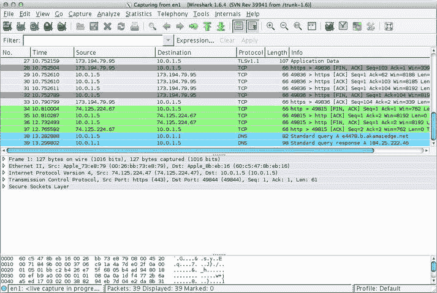

# 九、附录 A：检查 WebSocket 流量

当使用 WebSockets 试验和构建应用时，有时您可能需要仔细看看幕后到底发生了什么。在本书中，我们使用了一些工具来检查 WebSocket 流量。在本附录中，我们将回顾三个方便的工具:

*   Google Chrome 开发者工具:Chrome 附带的一组 HTML5 应用，允许您检查、调试和优化 Web 应用
*   Google Chrome Network Internals(或“net-internals”):一组工具，允许您检查网络行为，包括 DNS 查找、SPDY、HTTP 缓存以及 WebSocket
*   Wireshark:使您能够分析网络协议流量的工具

使用谷歌 Chrome 开发工具进行 WebSocket 框架检查

谷歌 Chrome 开发者工具提供了广泛的功能来帮助网络开发者。在这里，我们重点关注它如何帮助您了解和调试 WebSockets。如果你有兴趣了解更多关于谷歌 Chrome 开发者工具的知识，网上有很多信息。

要访问开发者工具，请打开 Google Chrome，然后单击地址栏右侧的自定义和控制 Google Chrome 图标。选择**工具开发者工具**，如图 A-1 所示。大多数使用该工具的开发人员通常更喜欢键盘快捷键，而不是菜单选项。


图 A-1 。打开谷歌浏览器开发者工具

Google Chrome 开发者工具通过八个面板为您提供关于您的页面或应用的详细信息，允许您执行以下任务:

*   元素面板 : 检查并修改 DOM 树
*   资源面板 : 检查加载的资源
*   网络面板 : 检查网络通信；这是您在构建支持 WebSocket 的应用时最常用的面板。
*   源代码面板 : 检查源文件并调试 JavaScript
*   时间轴面板 : 分析加载页面或与页面交互时花费的时间
*   配置面板 : 配置时间和内存使用情况
*   审计小组 : 在页面加载时对其进行分析，并提出改进建议。
*   控制台:显示错误信息，执行命令。控制台可以与上述任何面板一起使用。按键盘上的 Esc 键打开和关闭控制台。除了网络面板，控制台是 Web 和 WebSocket 开发者最好的朋友。

首先，让我们仔细看看网络面板。打开 Chrome 并导航至`http://www.websocket.org`。我们将使用`websocket.org`上的 Echo 测试来了解 Google Chrome 开发者工具提供的 WebSocket 框架检查。要访问 Echo 演示，请单击页面上的 Echo 测试链接，这将带您进入`http://www.websocket.org/echo.html`。如果尚未打开 Google Chrome 开发者工具，请打开它，然后单击网络面板。确保您的网络面板是空的。如果不是空的，点击 Chrome 窗口底部的 Clean 图标，图 A-2 中左起第六个图标。


图 A-2 。使用 Google Chrome 开发工具检查 WebSocket 连接的创建

注意，location 字段包含一个我们将连接到的 web socket URL:`ws://echo.websocket.org`。单击“连接”按钮创建连接。请注意，WebSocket 连接显示在您的网络面板中。点击标题选项卡下的名称`echo.websocket.org`；这样做可以让你看到 WebSocket 握手(图 A-3 )。列表 A-1 展示了整个 WebSocket 握手过程。


图 A-3 。检查 WebSocket 握手

***列举 A-1。***web socket 握手

```html
Request URL:ws://echo.websocket.org/?encoding=text
Request Method:GET
Status Code:101 Web Socket Protocol Handshake
Request Headers
Connection:Upgrade
Cookie:__utma=9925811.531111867.1341699920.1353720500.1353725565.33;
__utmb=9925811.4.10.1353725565; __utmc=9925811; __utmz=9925811.1353725565.33.30.
utmcsr=websocket.org|utmccn=(referral)|utmcmd=referral|utmcct=/
Host:echo.websocket.org
Origin:http://www.websocket.org
Sec-WebSocket-Extensions:x-webkit-deflate-frame
Sec-WebSocket-Key:JfyxfhR8QIm3BSb0q/Tw5w==
Sec-WebSocket-Version:13
Upgrade:websocket
(Key3):00:00:00:00:00:00:00:00
Query String Parameters
encoding:text
Response Headers
Access-Control-Allow-Credentials:true
Access-Control-Allow-Headers:content-type
Access-Control-Allow-Origin:http://www.websocket.org
Connection:Upgrade
Date:Sat, 24 Nov 2012 03:08:27 GMT
Sec-WebSocket-Accept:Yr3WGnQMtPOktDVP1aBU3l5DfFI=
Server:Kaazing Gateway
Upgrade:WebSocket
(Challenge Response):00:00:00:00:00:00:00:00:00:00:00:00:00:00:00:00
```

现在，您可以随意更改消息字段的内容，并单击 Send 按钮。要检查 WebSocket 框架，你需要再次点击最左边的名称，这将刷新右边的面板，增加框架选项卡，如图 A-4 所示。


图 A-4 。检查 WebSocket 框架

WebSocket Frame inspector 显示数据(本例中为文本)、数据长度、发送时间以及数据方向:浅绿色背景表示从浏览器到 WebSocket 服务器的流量(上传)，白色表示从服务器到浏览器的流量(下载)。

 **注意**当你发送 WebSocket 消息时，确保总是点击 Name 列来触发 Frames 标签的刷新。

当您导航到 Sources 选项卡并定位到`echo.js`文件时，您会看到一个名为`"websocket"`的变量，它表示我们的 WebSocket 连接。通过显示控制台，您可以使用`send()`函数简单地向 WebSocket 服务器发送消息，如清单 A-2 中的所示。

***清单 A-2。*** 使用 Chrome 控制台发送 WebSocket 消息

```html
websocket.send("Hello World!");
```

在图 A-5 中，我们从控制台发送了一个`Hello World!`消息，您可以在日志窗口中看到，Echo 服务向我们发送了一个响应。如果您显示您的网络选项卡，您还可以看到相应的 WebSocket 框架。


图 A-5 。从 Chrome 控制台发送 WebSocket 消息

如前所述，Chrome 开发者工具为 web 开发者提供了一种简单有效的方法来“查看”他们的应用。Chrome 的网络选项卡不仅提供了对 WebSocket 握手的独特见解，还允许您轻松检查 WebSocket 帧。

谷歌 Chrome 网络内部

大多数时候，Chrome 开发者工具显示的信息足以高效地开发和调试 web 应用。但是，有时较低级别的详细信息可以帮助诊断异常的连接故障，或者在调查浏览器本身的行为时提供无法访问的信息。Chrome 有内部诊断页面，这在你想观察浏览器内部状态的罕见情况下非常有用。Chrome 的内部工具公开了与 DNS 请求、SPDY 会话、TCP 超时、代理和浏览器的其他内部工作相关的事件。

谷歌 Chrome 包括几个额外的工具。要查看它们的列表，请在浏览器的地址栏中键入`chrome://about`。

 **注意**在谷歌 Chrome 中，网址`about:about`重定向到`chrome://about`。其他浏览器，如 Mozilla Firefox，在它们的`about:about`页面上列出了有用的网址。

该页面显示以下有用的内部 Chrome 工具列表:

*   `chrome://appcache-internals`
*   `chrome://blob-internals`
*   `chrome://bookmarks`
*   `chrome://cache`
*   `chrome://chrome-urls`
*   `chrome://crashes`
*   `chrome://credits`
*   `chrome://dns`
*   `chrome://downloads`
*   `chrome://extensions`
*   `chrome://flags`
*   `chrome://flash`
*   `chrome://gpu-internals`
*   `chrome://history`
*   `chrome://ipc`
*   `chrome://inspect`
*   `chrome://media-internals`
*   `chrome://memory`
*   `chrome://nacl`
*   `chrome://net-internals`
*   `chrome://view-http-cache`
*   `chrome://newtab`
*   `chrome://omnibox`
*   `chrome://plugins`
*   `chrome://policy`
*   `chrome://predictors`
*   `chrome://profiler`
*   `chrome://quota-internals`
*   `chrome://settings`
*   `chrome://stats`
*   `chrome://sync-internals`
*   `chrome://terms`
*   `chrome://tracing`
*   `chrome://version`
*   `chrome://print`

在地址栏中，键入`chrome://net-internals`。net-internals 的一个用途是检查 TCP 套接字事件。这些 TCP 套接字用于传输 WebSocket 和浏览器用于通信的其他协议。当你点击左边的 Sockets 时，Chrome 会显示套接字池。我们感兴趣的是当前活动的实时套接字，因此单击查看实时套接字链接。在一个单独的窗口或标签中，在`http://www.websocket.org/echo.html`打开 WebSocket Echo 测试，并点击 Connect。一个新的条目马上出现，伴随着下面的 URL: `ws://echo.websocket.org/?encoding=text`。点击条目，在右边你会看到网络内部，如列表 A-4 所示。

***列举 A-4。*** 网络内部握手

```html
830: SOCKET
ws://echo.websocket.org/?encoding=text
Start Time: 2012-11-23 20:08:27.489

t=1353730107489 [st=  0] +SOCKET_ALIVE  [dt=?]
                          --> source_dependency = 828 (SOCKET_STREAM)
t=1353730107489 [st=  0]   +TCP_CONNECT  [dt=91]
                            --> address_list = ["174.129.224.73:80"]
t=1353730107489 [st=  0]      TCP_CONNECT_ATTEMPT  [dt=91]
                              --> address = "174.129.224.73:80"
t=1353730107580 [st= 91]   -TCP_CONNECT
                            --> source_address = "10.0.1.5:57878"
t=1353730107582 [st= 93]    SOCKET_BYTES_SENT
                            --> byte_count = 470
t=1353730107677 [st=188]    SOCKET_BYTES_RECEIVED
                            --> byte_count = 542
```

现在，让我们从显示`websocket.org`的窗口发送一条消息。net-internals 面板刷新，显示发送的字节数(参见图 A-6 )。


图 A-6 。Google Chrome net-内部实用程序

与 Google 开发者工具非常相似，net-internals 是与 Google Chrome 一起打包和发货的。如果需要更深入、更低级别的网络诊断，Net-internals 是一个非常方便的工具。

使用 Wireshark 分析网络数据包

Wireshark 是一个非常强大的免费开源工具(可在`http://www.wireshark.org`下载)，它提供了对网络接口的详细了解，允许您查看和分析网络上传输的内容。Wireshark 是 WebSocket 开发人员手中的有用工具，但也被网络管理员广泛使用。Wireshark 可以通过网络接口捕获实时网络数据，然后您可以对这些数据进行导出/导入、过滤、颜色编码和搜索。

图 A-7 显示了 Wireshark 捕获网络数据包时的用户界面。在菜单栏和主工具栏下，您可以看到过滤器工具栏，它用于过滤收集的数据。该数据以表格形式显示在数据包列表窗格中。数据包详细信息窗格显示数据包列表窗格中所选数据包的信息。状态栏正上方的数据包字节窗格显示在数据包列表窗格中选择的数据包数据。



图 A-7 。Wireshark 捕获网络数据包

启动 Wireshark 并选择您正在使用的网络适配器:如果您硬连线到网络，您的适配器将与您使用 WiFi 时不同。在我们的 Wireshark 实验中，我们将检查运行在`websocket.org`上的浏览器和 WebSocket 服务器之间的 WebSocket 流量。首先，使用浏览器导航至`http://www.websocket.org`。然后，点击回声测试链接。你也可以将浏览器直接指向`http://www.websocket.org/echo`。现在，您已经准备好建立 WebSocket 连接了。单击连接按钮。

由于网络上的流量很大，你的浏览器和 websocket.org 之间的流量很快就会消失。为了确保我们看到一些有用的数据，我们将过滤去往`www.websocket.org`的流量。

图 A-8 展示了如何过滤掉带有特定 IP 地址的数据包:ip.dst_host==174.129.224.73。Wireshark 支持条件中的双等号，以及`eq`运算符。在此图中，还要注意数据包详细信息页面中的 WebSocket 握手。


图 A-8 。过滤网络数据包网络数据包

Wireshark 的另一个重要特性是它可以遵循各种协议流。在图 A-9 中，你可以看到它是如何跟随 TCP 流的。它显示与所选数据包在同一 TCP 连接上的 TCP 段。您可以通过在数据包列表窗格中右键单击数据包并从上下文菜单中选择 follow 来跟踪协议流。


图 A-9 。跟随 TCP 流

要查看 Wireshark 如何实时更新数据包列表，请在浏览器中提交一条 WebSocket 消息。图 A-10 显示了如何将文本*通过 WebSocket* 提交给 Wireshark 中的 Echo 服务。


图 A-10 。Wireshark 更新直播

摘要

在本附录中，我们解释了一些用于检查、分析和调试 WebSocket 流量的有用工具。这些工具将帮助您构建支持 WebSocket 的应用。下一个附录讨论了我们提供的虚拟机(VM ),其中包括我们用来构建本书中的示例的开放源代码(库、工具和服务器)。