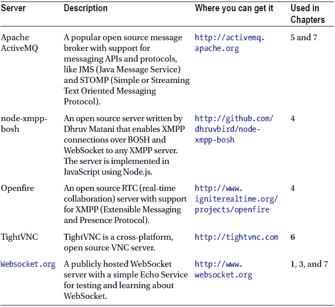
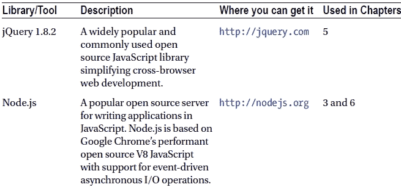

# 十、附录 B：WebSocket 资源

在本书中，我们使用了大量的资源来帮助我们每天构建 WebSocket 应用。在本附录中，我们将介绍如何使用 VM(虚拟机),其中包含您构建或遵循本书中的示例所需的所有预安装代码和软件。我们还总结了从哪里获得本书中使用的所有库、服务器和其他技术。最后，我们列出了在写这本书时可用的 WebSocket 服务器和客户机。

使用虚拟机

这本书附带的 VM 可以从出版商的网站上下载。只需导航到`http://apress.com`并搜索这本书的书名(或直接进入`www.apress.com/9781430247401`)。单击源代码/下载选项卡，然后单击立即下载。下载后，您可以使用 VirtualBox 启动虚拟机。VirtualBox 可以从`http://virtualbox.org`免费下载，适用于 Windows、Mac、Linux 和 Solaris 主机操作系统。

打开虚拟机，解压后双击`WebSocketBook.ova`文件，或者从 VirtualBox 菜单中选择**文件导入设备**，选择`WebSocketBook.vbox`文件。虚拟机的操作系统是 Ubuntu。

下载并安装虚拟机后，您会注意到桌面上有几个项目:

*   第二章–第六章的图标
*   一个`README.txt`文件

首先，打开并阅读`README.txt`，它解释了安装 VM 时自动为您启动的服务器和服务。要构建第二章–第六章中描述的示例，您可以简单地根据 VM 中提供的服务器和库开始构建，这将在相关章节中描述。

表 B-1 和 B-2 描述了我们在整本书中使用的服务器和库，以及它们是否包含在 VM 中。

表 B-1。本指南中使用的服务器

表 B-2。本指南中使用的库和其他工具

WebSocket 服务器

虽然您可以让服务器接受 WebSocket 连接或者编写自己的 WebSocket 服务器，但是有一些现有的实现可能会让您在开发自己的 WebSocket 应用时更加轻松。在撰写本书时，以下是一些可用的 WebSocket 服务器(列表由`http://refcardz.dzone.com/refcardz/html5-websocket`提供):

*   炼金术-Websockets(。NET): `http://alchemywebsockets.net/`
*   Apache ActiveMQ:??]
*   apache-websocket (Apache 模块):`http://github.com/disconnect/apache-websocket#readme`
*   APE 项目(C): `http://www.ape-project.org/`
*   Autobahn(虚拟设备):`http://autobahn.ws/`
*   橡胶树脂(Java): `http://www.caucho.com/`
*   牛仔:`http://github.com/extend/cowboy`
*   抽筋(红宝石):`http://cramp.in/`
*   扩散(商业产品):`http://www.pushtechnology.com/home`
*   EM-WebSocket (Ruby): `http://github.com/igrigorik/em-websocket`
*   可扩展 WebSocket 服务器(PHP): `http://github.com/wkjagt/Extendible-Web-Socket-Server`
*   gevent-websxmlsocket(python):`http://www.gelens.org/code/gevent-websocket/`
*   GlassFish (Java): `http://glassfish.java.net/`
*   歌利亚(红宝石):`http://github.com/postrank-labs/goliath`
*   Jetty (Java): `http://jetty.codehaus.org/jetty/`
*   jWebsocket (Java): `http://jwebsocket.org/`
*   Kaazing WebSocket 网关(商业产品):`http://kaazing.com/`
*   libwebsockets (C): `http://git.warmcat.com/cgi-bin/cgit/libwebsockets/`
*   弥赛亚(杨二郎):`http://github.com/ostinelli/misultin`
*   net.websocket (Go): `http://code.google.com/p/go.net/websocket`
*   Netty (Java): `http://netty.io/`
*   掘金(。NET): `http://nugget.codeplex.com/`
*   phpdaemon (PHP): `http://phpdaemon.net/`
*   推送器(云服务):`http://pusher.com/`
*   pywebsockets （Python）： `http://code.google.com/p/pywebsocket/`
*   rabbitmq(杨二郎):`http://github.com/videlalvaro/rabbitmq-websockets`
*   Socket.io (Node.js ): `http://socket.io/`
*   SockJS-node(节点):`http://github.com/sockjs/sockjs-node`
*   SuperWebSocket (.NET): `http://superwebsocket.codeplex.com/`
*   Tomcat (Java): `http://tomcat.apache.org/`
*   龙卷风(巨蟒):`http://www.tornadoweb.org/`
*   txweb socket(Python/Twisted):`http://github.com/rlotun/txWebSocket`
*   绿. x (Java): `http://vertx.io/`
*   Watersprout (PHP): `http://github.com/chrisnetonline/WaterSpout-Server/blob/master/server.php`
*   web-socket-ruby (Ruby): `http://github.com/gimite/web-socket-ruby`
*   Webbit (Java): `http://github.com/webbit/webbit`
*   WebSocket-Node (Node.js): `http://github.com/Worlize/WebSocket-Node`
*   websockify (Python): `http://github.com/kanaka/websockify`
*   XSockets(。NET): `http://xsockets.net/`
*   雅司病(二郎)`http://yaws.hyber.org/websockets.yaws`