# 三、HTML 入门

每个开发人员至少对 HTML 有所了解。近年来，它已经变得无孔不入，即使你从未需要编写任何 HTML，你也很可能至少*看过*一些 HTML。在这一章中，我将回到 HTML 的基础，以确保你掌握了正确的基础——从 HTML 的用途和工作原理开始。我将定义 HTML 使用的基本术语，并向您展示几乎每个网页都使用的一些核心 HTML 元素。

顾名思义，HTML 是一种标记语言。这种标记采用应用于*内容*的*元素*的形式，通常是文本。在下面几节中，我将解释 HTML 元素的不同方面，解释如何用属性配置元素，并描述可以在所有 HTML 元素上使用的一组全局属性。表 3-1 对本章进行了总结。

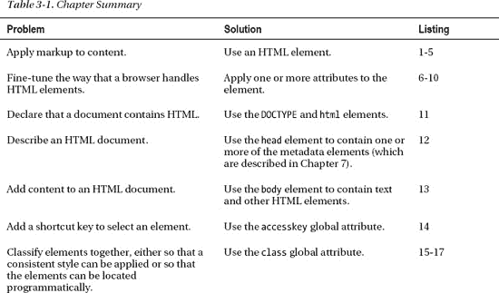

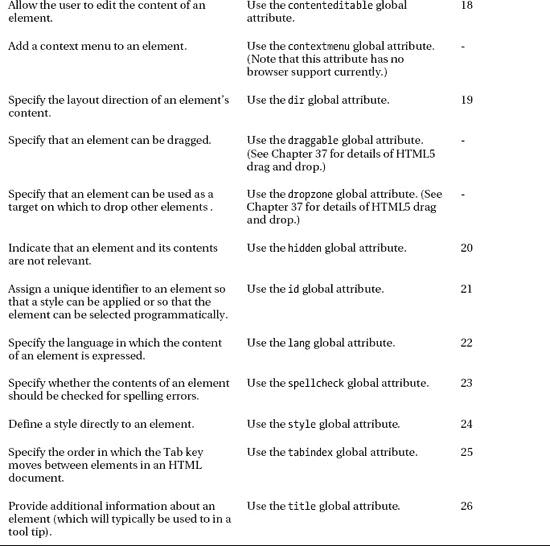

### 使用元素

清单 3-1 显示了一个简单的 HTML 元素应用于一些文本的例子。

*清单 3-1。一个 HTML 元素的例子*

`I like **<code>** apples**</code>** and oranges.`

我用粗体显示了该元素，它有三个部分。前两个被称为*标签*。开始标签是`<code>`，结束标签是`</code>`。标签之间是元素的内容(在本例中，单词*apple*)。标签和内容一起构成了`code`元素，如图 3-1 所示。

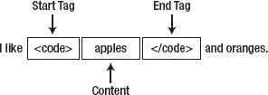

*图 3-1。HTML 元素的剖析*

元素是你告诉浏览器你的内容的方式。元素的效果应用于元素内容。每一个 HTML 元素都有不同且非常具体的含义——例如,`code`元素代表一段计算机代码。

 **提示**元素名称不区分大小写——浏览器会将`<CODE>`和`<code>`，甚至`<CoDe>`识别为`code`元素的开始标签。一般来说，惯例是采用单一案例格式并坚持下去。近年来，更常见的风格是通篇使用小写字符。这是我将在本书中使用的格式。

HTML 定义了不同类型的元素，它们在 HTML 文档中扮演不同的角色——`code`元素是*语义元素*的一个例子。语义元素允许我们定义内容的含义以及内容不同部分之间的关系。我会在第八章的中对此做更多解释。你可以在图 3-2 中看到`code`元素的效果。

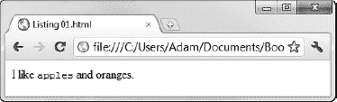

*图 3-2。显示在浏览器中的代码元素的效果*

请注意，浏览器并不显示元素标记，它的工作是解释 HTML 并向用户呈现一个考虑了元素的视图。

**演示与内容的分离**

有些 HTML 元素会影响显示，这意味着当浏览器遇到这些元素时，它会改变内容向用户显示的方式。`code`元素就是一个很好的例子。如图图 3-1 所示，当浏览器遇到`code`元素时，它使用固定宽度的字体显示被包围的内容。

现在强烈反对使用 HTML 元素来管理内容的呈现方式。其思想是使用 HTML 元素来定义内容的结构和含义，并使用层叠样式表(CSS)来控制内容呈现给用户的方式。我们将在第四章中讨论 CSS。

影响表示的元素往往是那些起源于 HTML 早期版本的元素，当时将表示和内容分开的想法并没有被严格执行。浏览器将对这些元素应用默认的表示样式，比如通常用于`code`元素的固定宽度字体。正如我将在第四章中解释的，你可以使用 CSS 来覆盖那些默认样式。

#### 理解本章中使用的元素

为了复习 HTML，我需要使用一些我在后面章节才描述的元素。表 3-2 列出了这些要素，以及简要说明和可以找到全部细节的章节。

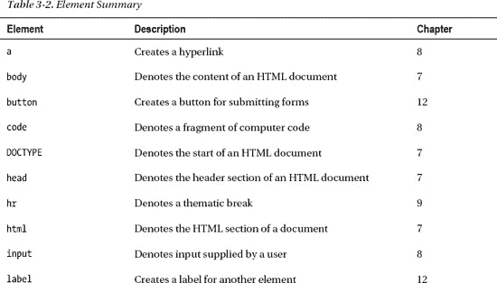

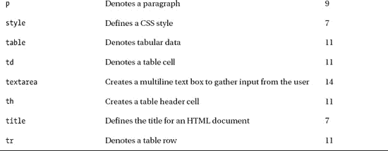

#### 使用空元素

您不需要在开始和结束标记之间放置任何内容。如果不这样做，就创建一个空元素，如清单 3-2 所示。

*清单 3-2。一个空的 HTML 元素*

`I like **<code></code>** apples and oranges.`

当元素为空时，并不是所有的元素都有意义(而`code`就是其中之一)，但即使如此，这仍然是有效的 HTML。

#### 使用自结束标签

您可以使用单个标签更简洁地表达空元素，如清单 3-3 所示。

*清单 3-3。用一个标签表示一个空元素*

`I like <code/> apples and oranges.`

您将开始和结束标签合并为一个标签—通常用于表示结束标签开始的笔画字符(`/`)被放置在单个标签的末尾。清单 3-2 中的元素和清单 3-3 中的元素是等价的——单个标签是表达空元素的更简洁的方式。

#### 使用空元素

有一些元素*必须*使用单个标签来表达 HTML 规范规定在其中放置任何内容都是非法的。这些被称为*无效元素*。一个这样的元素是`hr`，它是一个*分组元素*，用于表示内容中的段落级中断。(你会在第九章的中看到其他分组元素。)你可以以两种方式之一使用 void 元素——第一种是只指定一个开始标签，如清单 3-4 所示。

*清单 3-4。仅使用开始标签*指定一个空元素

`I like apples and oranges.
**
**
Today was warm and sunny.`

浏览器知道`hr`是一个空元素，并不期望看到结束标签。你也可以包含一个笔划来使元素与空元素一致，如清单 3-5 所示。

*清单 3-5。使用空元素结构表示空元素*

`I like apples and oranges.
**
**
Today was warm and sunny.`

这是我喜欢的格式，并将在本书中使用。顺便说一下，`hr`元素是具有表示意义的元素的另一个例子——在本例中，显示水平标尺(因此得名)。你可以在图 3-3 中看到`hr`元素的默认解释。

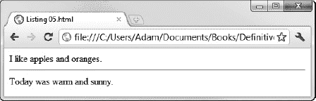

*图 3-3。hr 元素的默认呈现*

**(非)使用可选的开始和结束标签**

许多 HTML5 元素都有特殊的规则，根据这些规则，您可以选择省略其中一个标签。举个例子，`html`元素(我在第七章中描述过)允许省略它的结束标签，如果“*元素后面没有紧跟注释，并且元素包含一个非空的 body 元素或者它的开始标签没有被省略*”。斜体文本来自官方 HTML5 规范文档之一。我鼓励您阅读这些规范(您可以在`w3c.org`获得)，但要注意:它们都是以这种生动的风格编写的。

我认为在标记中有这样的灵活性是很好的，但我也认为这令人困惑，并导致维护问题。应用于 HTML 的元素不只是由浏览器处理，当你回来维护和更新你的应用时，它们必须被你的同事和你自己的未来版本阅读。浏览器也许能够确定为什么一个给定的标签被省略了，但是对于你的同事或者当你返回到 HTML 进行修改的时候，这就不那么明显了。为此，我在本书中不详述这些特殊规则，我使用元素的开始和结束标记，除非有令人信服的理由不这样做(在这种情况下，我将解释为什么)。

### 使用元素属性

您可以通过使用*属性*来配置您的元素。清单 3-6 显示了一个应用于`a`元素的属性。这个元素允许您创建一个超链接，当它被点击时，加载一个不同的 HTML 文档。

*清单 3-6。使用元素属性*

`I like <a **href="/apples.html"**>apples</a> and oranges.`

属性只能添加到开始标签或单个标签，不能添加到结束标签。属性有名称和值，如图图 3-4 所示。

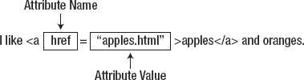

*图 3-4。将属性应用于 HTML 元素*

有一组全局属性可以应用于任何 HTML 元素——我将在本章后面描述这些属性。除了这些全局属性，元素还可以定义自己的属性，这些属性提供特定于元素角色的配置信息。`href`属性是`a`元素的本地属性，它配置作为超链接目的地的 URL。元素定义了许多特定的属性，我在第八章的中描述了这些属性。

 **提示**我在清单中使用了双引号(`"myvalue"`)来分隔属性值，但是您也可以使用单引号(`'myvalue'`)。如果您想为一个本身必须包含引号的属性指定一个值，您可以使用两种样式(`"my'quoted'value"`或`'my"quoted"value'`)。

#### 对一个元素应用多个属性

通过用一个或多个空格字符分隔属性，可以将多个属性应用于一个元素。清单 3-7 提供了一个例子。

*清单 3-7。在一个元素中定义多个属性*

`I like <a` **class="link" href="/apples.html" id="firstlink"**`>apples</a> and oranges.`

属性的顺序并不重要，您可以自由地将全局属性与特定于元素的属性混合，这就是我在清单中所做的。`class`和`id`属性是全局的。(我将在本章后面解释这些属性。)

#### 使用布尔属性

有些属性是*布尔属性*。您不必为这些属性指定一个值——只需将属性名称添加到元素中，如清单 3-8 所示。

*清单 3-8。布尔属性*

`Enter your name: <input **disabled**>`

这个例子中的布尔属性是`disabled`，我刚刚给元素添加了属性名。元素为用户提供了一种在 HTML 表单中输入数据的方法(我在第十二章的中对此进行了描述)。添加`disabled`属性会阻止用户输入数据。布尔属性有点奇怪，因为配置元素的是属性的*存在*，而不是您分配给属性的值。我没有指定`disabled="true"`——我只是加了一个词`disabled`。通过指定空字符串(`""`)或者将值设置为属性的名称，可以达到同样的效果，如清单 3-9 所示。

*清单 3-9。分配了空字符串值*的布尔属性

`Enter your name: <input **disabled=""**>
Enter your name: <input **disabled="disabled"**>`

#### 使用自定义属性

只要您使用的名称以`data-`为前缀，您就可以定义自己的属性。清单 3-10 展示了这些属性的使用。

*清单 3-10。将自定义属性应用于元素*

`Enter your name: <input disabled="true" **data-creator="adam" data-purpose="collection"**>`

这些属性的正确名称是*作者定义的属性*，它们有时被称为 *expando 属性*，但是我更喜欢更常用的术语*自定义属性*。

自定义属性是一种广泛使用的 HTML4 技术的正式定义，在这种技术中，浏览器会忽略它们无法识别的任何属性。您可以在这些属性前面加上前缀`data-`,以避免与未来版本的 HTML 可能创建的属性名称冲突。自定义属性在处理 CSS(在第四章的中介绍)和 JavaScript(在第五章的中介绍)时很有用。

### 创建 HTML 文档

元素和属性并不是孤立存在的——你用它们在一个 *HTML 文档*中标记你的内容。创建 HTML 文档最简单的方法是创建一个文本文件——惯例是这些文件的扩展名为`.html`。然后你可以直接从磁盘或者通过网络服务器将文件加载到浏览器中。(在本书中，我一般使用 web 服务器。我的服务器叫做`titan`，你会经常在截图显示的浏览器窗口中看到这个名字。)

**浏览器和用户代理**

在本章(以及本书的大部分内容)中，我将浏览器称为我们创建的 HTML 的目标。这是思考 HTML 的一种便捷方式，也是 HTML 最常见的消费方式，但它并没有说明全部情况。软件组件和可能使用 HTML 的组件的统称是*用户代理*。尽管浏览器是最普遍的一种用户代理，但它们不是唯一的一种。

非浏览器用户代理仍然很少见，但预计会越来越流行。HTML5 越来越强调内容和表示的分离，这一点很重要，因为它认识到并不是所有的 HTML 内容都显示给用户。在这本书里，我仍然会提到浏览器(因为浏览器是用户代理中最重要和最主要的类别)，但是记住一些其他类型的软件可能是你的 HTML5 提供服务的对象是很有用的。

一个 HTML 文档有一个特殊的结构——你至少需要有一些关键的元素。本书中的大多数例子都是以完整的 HTML 文档的形式展示的——这意味着你可以快速而容易地看到一个元素是如何应用的以及它的效果。我将在后面的章节中解释清单中的所有元素，但是作为一个快速的开始，我将带您浏览一个基本的 HTML 文档。我还将提供后面章节的参考，在那里你可以得到更多的细节。

**HTML 与 XHTML**

虽然这是一本关于 HTML 的书，但如果我没有提到 *XHTML* (那是 *HTML* 前面加了一个 *X* )的话，那我就失职了。HTML 语法允许你做一些导致非法 XML 文档的事情。这意味着很难使用标准的 XML 解析器处理 HTML 文档。

要解决这个问题，您可以使用 XHTML，它是 HTML 的 XML 序列化(也就是说，您以一种有效的 XML 的方式来表达您的内容和 HTML 元素和属性，并且可以很容易地被 XML 解析器处理)。您还可以创建*多语言文档*，它们是有效的 HTML *和*有效的 XML，尽管这需要使用 HTML 语法的子集。我在本书中不涉及 XHTML，但是你可以在下面的网址获得更多关于 XHTML 的信息:`[`wiki.whatwg.org/wiki/HTML_vs._XHTML`](http://wiki.whatwg.org/wiki/HTML_vs._XHTML)`。

#### 外部结构

有两个元素提供了 HTML 文档的外部结构——`DOCTYPE`和`html`元素，如清单 3-11 所示。

*清单 3-11。一个 HTML 文档的外部结构*

`<!DOCTYPE HTML>
<html>
    <!-- elements go here -->
</html>`

元素告诉浏览器它正在处理一个 HTML 文档。这通过 HTML `boolean`属性来表达:

`<!DOCTYPE **HTML**>`

您可以在`DOCTYPE`元素后面加上`html`元素的开始标记。这告诉浏览器元素的内容应该一直被当作 HTML，直到`html`关闭标签。使用`DOCTYPE`元素，然后立即使用`html`元素，这可能看起来很奇怪，但是当 HTML 作为标准出现时，还有其他的标记语言被赋予了同等的权重，人们期望文档包含多种标记类型。

如今，HTML 是占主导地位的标记语言，即使您省略了`DOCTYPE`元素和`html`元素，大多数浏览器也会认为它们在处理 HTML。这并不意味着你应该把他们排除在外。这些元素服务于一个重要的目的，依赖浏览器的默认行为就像信任陌生人一样——大多数情况下事情会很好，但有时会出现非常严重的错误。关于`DOCTYPE`和`html`元素的更多细节，参见第七章。

#### 元数据

HTML 文档的元数据区域允许您向浏览器提供关于文档的信息。元数据包含在一个`head`元素中，如清单 3-12 所示。

*清单 3-12。向 HTML 文档添加 head 元素*

`<!DOCTYPE HTML>
<html>
    <head>
        **<!-- metadata goes here -->**
        **<title>Example</title>**
    **</head>**
</html>`

在清单中，我提供了最少量的元数据，即`title`元素。所有 HTML 文档都应该包含一个`title`元素，尽管浏览器通常会忽略任何遗漏。大多数浏览器将`title`元素的内容显示在浏览器窗口的菜单栏中，或者显示页面的选项卡的顶部。`head`和`title`元素在第七章中有完整的描述，以及所有其他可以放在`head`元素中的元数据元素。

这个清单演示了如何在 HTML 文档中创建注释。你以标签`<!--`开始，以`-->`结束。浏览器会忽略你放在这些标签里的任何东西。

除了包含描述 HTML 文档的元素之外，`head`元素还用于定义与外部资源(如 CSS 样式表)的关系，定义内联 CSS 样式，以及定义和加载脚本。所有这些活动都在第七章中演示。

#### 内容

文档的第三部分也是最后一部分是内容，你把它放在一个 body 元素中，如清单 3-13 所示。

*清单 3-13。将 body 元素添加到 HTML 文档中*

`<!DOCTYPE HTML>
<html>
    <head>
        <!-- metadata goes here -->
        <title>Example</title>
    </head>
    **<body>**
        **<!-- content and elements go here -->**
        **I like <code>apples</code> and oranges.**
    **</body>**
</html>`

`body`元素告诉浏览器向用户显示文档的哪一部分——当然，这本书的大部分内容都交给了可以放在 body 元素中的内容。添加了`body`元素后，您就有了我将在本书的大部分示例中使用的框架 HTML 文档。

#### 了解父母、子女、后代和兄弟姐妹

HTML 元素定义了与 HTML 文档中其他元素的关系。包含另一个元素的元素是第二个元素的父元素。在清单 3-13 中，`body`元素是`code`元素的父元素，因为`code`元素包含在`body`元素的开始和结束标签之间。相反，`code`元素是`body`元素的*子元素*。一个元素可以有多个子元素，但只能有一个父元素。

元素可以包含元素，元素又可以包含其他元素。在清单 3-13 中也可以看到这一点:`html`元素包含`body`元素，后者包含`code`元素。body 和 code 元素是`html`元素的*后代*，但是只有`body`元素是`html`元素的子元素。孩子是直系后代。共享同一个父元素的元素称为*兄弟元素*。在清单 3-13 中，`head`和`body`元素是兄弟元素，因为它们都是`html`元素的子元素。

元素之间关系的重要性贯穿 HTML。正如您将在下一节中看到的，元素对哪些其他元素可以成为它们的父元素或子元素有限制。这些限制通过*元素类型*来表达。元素关系在 CSS 中也是必不可少的——我在第四章中介绍过——选择元素应用样式的方法之一就是通过它们的父/子关系。最后，当您阅读第四部分中的文档对象模型(DOM)时，您将通过浏览*文档树*找到文档中的特定元素，它是元素之间关系的表示。在 HTML 世界中，从你的后代中了解你的兄弟姐妹是一项重要的技能。

#### 了解元素类型

HTML5 规范将元素分为三类:*元数据元素*、*流元素*和*语法元素*。

元数据元素用于创建 HTML 文档的基本结构，并向浏览器提供关于如何处理文档的信息和方向。我在第七章中描述了元数据元素。

其他两个类别略有不同，您可以使用它们来为元素指定有效的父元素和子元素集。语法元素是 HTML 的基本构件。第八章包含了最常用的语法元素的描述。流元素类别是语法元素的超集——也就是说所有的语法元素也是流元素，但不是所有的流元素都是语法元素。

并非所有的元素都属于某一个元素类别——那些没有特殊意义或者只能在非常有限的情况下使用的元素。受限元素的一个例子是`li`元素，它表示一个列表项，并被限制为三个父元素之一:`ol`(表示一个有序列表)、`ul`(表示一个无序列表)和`menu`(表示一个菜单)。你可以在第九章的中了解更多关于`li`元素的知识。在第六章开始的元素描述中，我会告诉你每个元素属于哪个类别。

### 使用 HTML 实体

正如你在本章的例子中看到的，在 HTML 文档中有一些字符有特殊的含义——最明显的是`<`和`>`字符。您有时需要在内容中使用这些字符，而不希望它们被解释为 HTML。为此，您可以使用 *HTML 实体*。实体是浏览器用来代替特殊字符的代码。在表 3-3 中可以看到一些常见的实体。

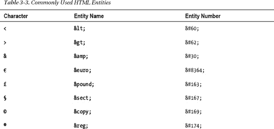

每个特殊字符都有一个实体编号，您可以在内容中包含它来表示该字符——例如,“与”字符是`&#30;`。更受欢迎的特殊字符也有一个名称—例如，`&#30;`和`&`对浏览器来说有相同的含义。

### html 5 全局属性

在本章的前面，我展示了如何使用属性配置元素。每个元素都可以定义自己的属性——这些属性被称为*局部属性*。当我在第六章开始详细描述元素时，我会给你一个元素定义的每个局部属性的列表，并告诉你如何使用它们。每个局部属性使您能够控制元素独特行为的某些方面。

还有第二类属性，即*全局属性*。这些配置了*所有*元素共有的行为。您可以将每个全局属性应用于每个元素，尽管这并不总是会导致有意义或有用的行为改变。在接下来的部分中，我将描述每个全局属性并给出一个演示。其中一些属性与更广泛的 HTML 特性相关联，我将在本书后面更深入地讨论这些特性。在这些情况下，我会给出相关章节的参考。

#### 访问键属性

`accesskey`属性允许您指定一个或多个键盘快捷键来选择页面上的元素。清单 3-14 以简单的形式展示了这个属性的用法。表单是第十二章到第十四章的主题，所以在阅读完这些章节后，你可能想回到这个例子。

*清单 3-14。使用访问键属性*

`<!DOCTYPE HTML>
<html>
    <head>    
        <title>Example</title>
    </head>
    <body>
       <form>
            Name: <input type="text" name="name" **accesskey="n"**/>
            

            Password: <input type="password" name="password" **accesskey="p"**/>
            

            <input type="submit" value="Log In" **accesskey="s"**/>
       </form>
    </body>
</html>`

在这个例子中，我已经向三个`input`元素添加了`accesskey`属性。(我在第十二章和第十三章中描述了`input`元素。这个想法是让经常使用网页或网站的用户能够使用键盘快捷键在常用元素之间移动。触发`accesskey`设置所需的组合键因平台而异——对于 Windows，是同时按下`Alt`键和`accesskey`值。你可以在图 3-5 中看到`accesskey`属性的效果。我按下`Alt+n`来聚焦第一个`input`元素并输入我的名字。然后，我按下`Alt+p`来聚焦第二个`input`元素，并输入我的密码。`Alt+s`按下`Log In`按钮，提交表单。

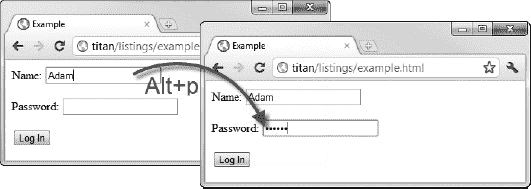

*图 3-5。accesskey 属性的效果*

#### 类属性

`class`属性用于对元素进行分类。通常这样做是为了在文档中定位属于给定类的元素，或者应用 CSS 样式。清单 3-15 展示了如何应用`class`属性。

*清单 3-15。应用类别属性*

`<!DOCTYPE HTML>
<html>
    <head>    
        <title>Example</title>
    </head>
    <body>
        <a **class="class1 class2"** href="http://apress.com">Apress web site</a>
        

        <a **class="class2 otherclass"** href="http://w3c.org">W3C web site</a>
    </body>
</html>`

通过用空格分隔类名，可以将多个类应用于每个元素。您创建的类的名称是任意的，但是使名称有意义是一个好主意，特别是如果您有一个包含许多类的文档。就其本身而言，`class`属性不做任何事情。图 3-6 显示了浏览器中显示的 HTML。如你所见，你只得到几个超链接。

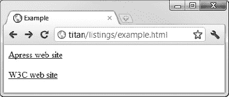

*图 3-6。一对应用了 class 属性的 a 元素*

利用`class`属性的第一种方法是创建一个样式，该样式以您已经定义的一个或多个类为目标。清单 3-16 提供了一个例子。

*清单 3-16。定义依赖于类的样式*

`<!DOCTYPE HTML>
<html>
    <head>    
        <title>Example</title>
        ****
    </head>
    <body>
        <a class="class1 class2" href="http://apress.com">Apress web site</a>
        

        <a class="class2 otherclass" href="http://w3c.org">W3C web site</a>        
    </body>
</html>`

在这个例子中，我使用了一个`style`元素来定义两种样式——第一种应用于分配给`class2`的元素，第二种应用于`class1`。

我在第七章的中解释了`style`元素，并在第四章的中介绍了样式以及它们如何以不同的方式用于目标元素。

当您在浏览器中加载 HTML 时，样式会应用到元素。效果如图图 3-7 所示。使用类分配样式的优点是，您不必在每个元素上复制相同的样式设置。

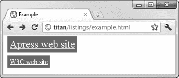

*图 3-7。使用类属性来应用样式*

使用`class`属性的另一种方式是在脚本中。清单 3-17 提供了一个演示。

*清单 3-17。在脚本中使用 class 属性*

`<!DOCTYPE HTML>
<html>
    <head>    
        <title>Example</title>
    </head>
    <body>
        <a class="class1 class2" href="http://apress.com">Apress web site</a>
        

        <a class="class2 otherclass" href="http://w3c.org">W3C web site</a>
        ****
    </body>
</html>`

本例中的脚本找到了所有分配给`otherclass`类的元素，并应用了一些样式。我在第七章中解释了`script`元素，在第十九章到第二十四章中解释了每个样式属性，在第二十六章中解释了如何在文档中找到元素。该脚本的效果如图图 3-8 所示。

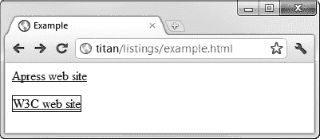

*图 3-8。在脚本中使用 class 属性*

#### 内容可编辑属性

`contenteditable`属性是 HTML5 中的新特性，允许用户更改页面中的内容。清单 3-18 提供了一个简单的演示。

*清单 3-18。使用内容可编辑属性*

`<!DOCTYPE HTML>
<html>
    <head>    
        <title>Example</title>
    </head>
    <body>
        
It is raining right now

    </body>
</html>`

我已经将`contenteditable`属性应用到了一个`p`元素上(我在第九章中对此进行了描述)。将属性值设置为`true`允许用户编辑元素内容，将其设置为`false`会禁用该特性。(如果不指定值，元素将从其父元素继承该属性的设置。)你可以在图 3-9 中看到属性的效果。用户点击文本并开始输入。

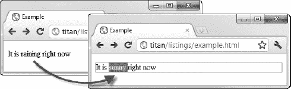

*图 3-9。使用内容可编辑属性*启用编辑

#### context menu 属性

属性允许你定义元素的上下文菜单。当用户触发它们时(例如，当 Windows PC 用户右击时)，这些菜单会弹出。在撰写本文时，没有浏览器支持`contextmenu`属性。

#### 目录属性

属性指定了元素文本的方向。两个支持的值是`ltr`(用于从左到右的文本)和`rtl`(用于从右到左的文本)。清单 3-19 显示了正在使用的两个值。

*清单 3-19。使用目录属性*

`<!DOCTYPE HTML>
<html>
    <head>    
        <title>Example</title>
    </head>
    <body>
        
This is right-to-left

        
This is left-to-right

    </body>
</html>`

你可以在图 3-10 的中看到`dir`属性的效果。

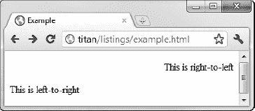

*图 3-10。显示从左到右和从右到左的文本*

#### 可拖动属性

`draggable`属性是 HTML5 对拖放支持的一部分，它用于指示一个元素是否可以被拖动。我在第三十七章中详细解释了拖放操作。

#### drop zone 属性

`dropzone`属性是 HTML5 支持拖放的一部分。它是我刚刚描述的`draggable`属性的对应物。我在第三十七章中解释了这两个元素。

#### 隐藏属性

`hidden`属性是一个布尔属性，表示一个元素目前不相关。浏览器通过隐藏元素来解释这个属性。清单 3-20 显示了`hidden`属性的效果。

*清单 3-20。使用隐藏属性*

`<!DOCTYPE HTML>
<html>
    <head>    
        <title>Example</title>
        
    </head>
    <body>
        <button onclick="toggleHidden()">Toggle</button>
        <table>
            <tr><th>Name</th><th>City</th></tr>
            <tr><td>Adam Freeman</td><td>London</td></tr>
            <tr id="toggle" **hidden**><td>Joe Smith</td><td>New York</td></tr>
            <tr><td>Anne Jones</td><td>Paris</td></tr>
        </table>
    </body>
</html>`

我把这个例子做得比实际需要的更加复杂。我定义了一个包含一个隐藏的`attribute`存在的`tr`元素(代表表中的一行)的`table`元素。我还定义了一个`button`元素，当按下它时，调用在`script`元素中定义的`toggleHidden` JavaScript 函数。这个脚本在属性`hidden`出现时删除它，否则添加它。暂时不要担心这一切是如何运作的。我解释第十一章的中的`table`、`tr`、`th`、`td`元素、第七章中的`script`元素、第三十章中的事件。

我把这些都放在适当的位置来演示当`hidden`属性被应用时会发生什么，你可以在图 3-11 中看到按下按钮的效果。

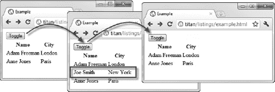

*图 3-11。移除和添加隐藏元素的效果*

当`hidden`属性应用于一个元素时，浏览器根本不会呈现它。就好像它不包含在 HTML 中一样，所以用减少的行数来呈现`table`。

#### Id 属性

属性用来给一个元素分配一个唯一的标识符。这些标识符通常用于对元素应用样式，或者用 JavaScript 选择元素。清单 3-21 展示了如何基于`id`属性的值应用一个样式。

*清单 3-21。使用 id 属性*

`<!DOCTYPE HTML>
<html>
    <head>    
        <title>Example</title>
    </head>
    
    <body>
        <a href="http://apress.com">Apress web site</a>
        

        <a **id="w3clink"** href="http://w3c.org">W3C web site</a>
    </body>
</html>`

要应用基于`id`属性值的样式，您可以在定义样式时在`id`前面加上#字符。我在第十七章和第十八章中给出了更多关于 CSS 选择器的细节，并且我在第十九章到第二十四章中描述了可以应用的各种样式。你可以在图 3-12 中看到应用样式的效果。

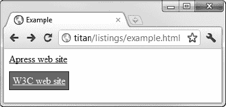

*图 3-12。基于元素的 id 属性值应用样式*

 **提示**`id`属性也可以用于导航到文档中的特定部分。如果您想象一个名为`example.html`的文档包含一个`id`属性值为`myelement`的元素，您可以通过请求`example.html#myelement`直接导航到该元素。URL 的最后一部分(?? 加上 ??)被称为 ?? URL 片段标识符 ??。

#### lang 属性

属性用来指定元素内容的语言。清单 3-22 展示了如何使用这个属性。

*清单 3-22。使用 lang 属性*

`<!DOCTYPE HTML>
<html>
    <head>    
        <title>Example</title>
    </head>
    <body>
        
Hello - how are you?

        
Bonjour - comment êtes-vous?</>
        
Hola - ¿cómo estás?

    </body>
</html>`

`lang`属性的值必须是有效的 ISO 语言代码。您可以在`http://tools.ietf.org/html/bcp47`获得如何指定语言的全部细节。但是要注意:处理语言可能是一件复杂的技术性的事情。

`lang`属性旨在允许浏览器调整显示元素的方式。例如，这可能意味着更改引号，并且当使用文本到语音阅读器(或其他辅助工具)时，还必须正确地发出文本。

您还可以使用`lang`属性来选择给定语言的内容——也许是应用一种样式或者只显示用户选择的语言的内容。

#### 拼写检查属性

属性用于指定浏览器是否应该检查元素内容的拼写。只有当这个属性应用于用户可以编辑的元素时，使用这个属性才有意义，如清单 3-23 所示。我在第十四章中描述了`textarea`元素。

*清单 3-23。使用拼写检查属性*

`<!DOCTYPE HTML>
<html>
    <head>    
        <title>Example</title>
    </head>
    <body>
        <textarea **spellcheck="true"**>This is some mispelled text</textarea>
    </body>
</html>`

`spellcheck`属性的允许值是`true`(启用拼写检查)和`false`(禁用拼写检查)。不同的浏览器执行拼写检查的方式不同。在图 3-13 中，你可以看到谷歌 Chrome 是如何处理这一功能的，这是一种即查即输的方法。其他浏览器要求用户明确执行拼写检查。

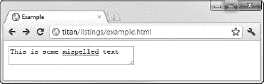

*图 3-13。Chrome 实现的拼写检查*

 **注意**当前在最常用的浏览器中实现的拼写检查忽略了我刚刚描述的`lang`元素。拼写检查将使用用户操作系统或单独的浏览器设置定义的语言来执行。

#### 样式属性

`style`属性允许您直接在元素上定义 CSS 样式(而不是在`style`元素或外部样式表中)。清单 3-24 提供了一个演示。

*清单 3-24。使用样式属性*

`<!DOCTYPE HTML>
<html>
    <head>` `        <title>Example</title>
    </head>
    <body>
        <a href="http://apress.com" **style="background: grey; color:white; padding:10px"**>
            Visit the Apress site
        </a>
    </body>
</html>`

我在第五章中更详细地描述了 CSS 样式，你可以在第十九章到第二十四章中了解不同的样式选项。

#### tabindex 属性

属性允许您控制 Tab 键在 HTML 页面中移动焦点的顺序，覆盖默认顺序。清单 3-25 展示了如何使用这个属性。

*清单 3-25。使用 tabindex 属性*

`<!DOCTYPE HTML>
<html>
    <head>    
        <title>Example</title>
    </head>
    <body>
        <form>
            <label>Name: <input type="text" name="name" **tabindex="1"**/></label>
            

            <label>City: <input type="text" name="city" **tabindex="-1"**/></label>
            

            <label>Country: <input type="text" name="country" **tabindex="2"**/></label>
            

            <input type="submit" **tabindex="3"**/>
        </form>
    </body>
</html>`

将被选择的第一个元素是具有`1`的`tabindex`值的元素。当用户按 Tab 键时，`tabindex`为`2`的元素将被选中，以此类推。`-1`的`tabindex`值确保当用户按 Tab 键时不会选择元素。清单中的`tabindex`值的作用是，当 Tab 键被按下时，焦点从第一个`input`元素转移到`third`，然后转移到`Submit`按钮，如图 3-14 中的所示。

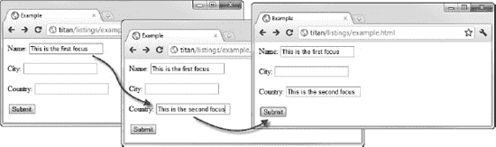

*图 3-14。用 tabindex 属性控制焦点序列*

#### 标题属性

属性提供了关于元素的附加信息，浏览器通常使用它来显示工具提示信息。清单 3-26 展示了如何使用`title`属性。

*清单 3-26。使用标题属性*

`<!DOCTYPE HTML>
<html>
    <head>    
        <title>Example</title>
    </head>
    <body>
        <a **title="Apress Publishing"** href="http://apress.com">Visit the Apress site</a>
    </body>
</html>`

图 3-15 显示了 Google Chrome 是如何处理这个值的。

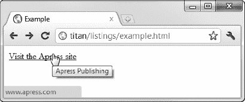

*图 3-15。显示为工具提示的标题属性值*

### 有用的 HTML 工具

我认为使用 HTML 时只有两种工具有帮助。首先是一个好的 HTML 编辑器，它会突出显示无效的元素和属性，通常会让您走上正确的道路。正如我在第二章中提到的，我和 Komodo Edit 相处得很好，但是有无数可用的编辑器，你一定会找到一个适合你工作风格的(只要确保它支持 HTML5)。

另一个工具是大多数浏览器内置的`View Source`菜单(或其等价物)。能够看到文档背后的 HTML 标记是验证您自己的工作和从他人那里学习新技术的一个很好的方式。

### 总结

在这一章中，我给了你一个快速浏览 HTML 文档的结构和本质，并向你展示了如何应用 HTML 元素来标记内容和创建 HTML 文档。我解释了如何用属性配置浏览器解释元素的方式，并描述了局部属性和全局属性之间的区别。我描述了每个全局属性，并简要解释了组成 HTML 文档的基本元素和结构。