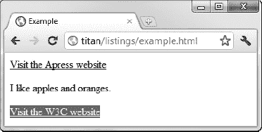

# 四、CSS 入门

层叠样式表(CSS)是你指定一个 HTML 文档的表现形式(外观和格式)的方法。在这一章中，我将向你展示如何创建和应用 CSS 样式，解释为什么它们被称为*级联*样式表，并为以后的章节提供一个整体基础。表 4-1 对本章进行了总结。

### 定义和应用风格

CSS 样式由一个或多个用分号分隔的声明组成。每个声明由一个 CSS 属性和该属性的值组成，用冒号分隔。清单 4-1 展示了一种简单的风格。

*清单 4-1。一个简单的 CSS 样式*

`background-color:grey; color:white`

图 4-1 显示了这种风格的声明、属性和值。

*图 4-1。CSS 样式的剖析*

在这个例子中，样式有两个声明。第一个为`background-color`属性设置值`grey`，第二个为`color`属性设置值`white`。

有很多种 CSS 属性可用，每种属性都控制它所应用到的元素的外观的某些方面。在第 19 到 24 章中，我描述了可用的 CSS 属性并演示了它们的效果。

#### 理解本章中使用的 CSS 属性

为了演示 CSS 是如何工作的，我需要使用一些 CSS 属性，在后面的章节中我才会完整地描述这些属性。表 4-2 列出了这些属性，给出了非常简短的描述，并显示了哪一章包含了全部细节。

#### 应用内嵌样式

仅仅定义一个样式是不够的——你还需要应用它，有效地告诉浏览器该样式应该影响哪些元素。将样式应用到元素的最直接的方法是使用`style`全局属性(在第三章中描述)，如清单 4-2 所示。

*清单 4-2。使用样式全局属性*应用样式

`<!DOCTYPE HTML>
<html>
    <head>
        <title>Example</title>

    </head>
    <body>
        <a href="http://apress.com" **style="background-color:grey; color:white"**>
            Visit the Apress website
        </a>
        
I like apples and oranges.

        <a href="http://w3c.org">Visit the W3C website</a>
    </body>
</html>`

这个 HTML 文档中有四个内容元素——两个超链接(用`a`元素创建)和一个包含`span`元素的`p`元素。我使用了`style`全局属性将样式应用到第一个`a`元素——链接到 Apress 网站的那个。(您可以在第八章和第九章中了解更多关于`a`、`p`和`span`元素的信息。目前，您只对应用样式感兴趣。)如图 4-2 中的所示，`style`属性只作用于它所应用的元素。

*图 4-2。将样式直接应用于元素*

从图中可以看出示例中使用的两个 CSS 属性的影响。`background-color`属性设置元素背景的颜色，`color`属性设置前景的颜色。HTML 文档中的另外两个内容元素不受样式的影响。

**CSS 宗教问题**

CSS 似乎是一个吸引狂热者的话题。如果你开始阅读任何关于如何用 CSS 达到某种效果的在线讨论，你很快就会看到关于哪种方式是正确的争论。我没有时间给那些争论不休的人——解决任何问题的唯一正确的方法是使用你现有的知识和工具来支持尽可能多的用户。将自己束缚在结中以达到 CSS 的完美是愚蠢的。我的建议是忽略这些争论，适应和发展适合你的、你觉得愉快和有效的技巧和技术。

#### 创造嵌入式风格

对单个元素应用样式可能是一种有用的技术，但是当应用于可能需要几十种不同样式的复杂文档时，这种方法效率很低。不仅要对每个元素应用正确的样式，还要小心地正确应用更新，这是一个容易出错的过程。相反，您可以使用`style`元素(与`style` *属性*相对)来定义一个*嵌入的*样式，并使用 *CSS 选择器*来指示浏览器应用该样式。清单 4-3 显示了如何在一个简单的 CSS 选择器中使用`style`元素。

*清单 4-3。使用样式元素*

`<!DOCTYPE HTML>
<html>
    <head>
        <title>Example</title>
        <**style type="text/css">**
            **a {**
                **background-color:grey;**
                **color:white**` `            **}**
        **</style>**
    </head>
    <body>
        <a href="http://apress.com">Visit the Apress website</a>
        
I like apples and oranges.

        <a href="http://w3c.org">Visit the W3C website</a>
    </body>
</html>`

我在第七章中描述了`style`元素及其属性。在这一章中，我们感兴趣的是如何在`style`元素中指定一个样式。你仍然使用声明，但是它们被包在大括号里(?? 和 ?? 字符)并跟随一个选择器，如图 4-3 中的 ?? 所示。

*图 4-3。样式元素内定义的样式的剖析*

本例中的选择器是`a`，它指示浏览器将样式应用于文档中每个 `a`元素的*。你可以在图 4-4 中看到浏览器是如何做到这一点的。*

*图 4-4。a 选择器的作用*

您可以在一个样式元素中定义多个样式，只需重复定义一个选择器和一组声明的过程。清单 4-4 显示了一个有两种样式的`style`元素。

*清单 4-4。在一个样式元素中定义多种样式*

`<!DOCTYPE HTML>
<html>
    <head>
        <title>Example</title>
        
    </head>
    <body>
        <a href="http://apress.com">Visit the Apress website</a>
        
I like apples and oranges.

        <a href="http://w3c.org">Visit the W3C website</a>
    </body>
</html>`

这个新样式有一个选择器`span`(这意味着浏览器会将该样式应用于文档中的所有`span`元素，并使用`border`和`padding`属性)。属性`border`在目标元素周围定义了一个`border`，属性`padding`在它周围创建了一些空间。你可以在图 4-5 中看到效果。这些例子中的选择器和属性是非常基本的。我在第十七章和第十八章中描述了选择器的全系列，并在第十九章和第二十章中描述了特性。

*图 4-5。应用多种样式*

#### 使用外部样式表

您可以创建一个单独的`stylesheet`，而不是在每个 HTML 页面中定义相同的样式集。这是一个独立的文件，通常扩展名为`.css`，你可以将自己的风格放入其中。清单 4-5 显示了文件`styles.css`的内容，你可以在本章附带的源代码下载中找到，也可以从`apress.com`获得。

*清单 4-5。styles.css 文件*

`a {
    background-color:grey;
    color:white
}
span {
    border: thin black solid;
    padding: 10px;
}`

您不需要在样式表中使用`style`元素——您只需要使用选择器，后跟您需要的每种样式的声明。然后，您可以使用`link`元素将样式引入您的文档，如清单 4-6 所示。

*清单 4-6。导入外部样式表*

`<!DOCTYPE HTML>
<html>
    <head>
        <title>Example</title>
        <**link rel="stylesheet" type="text/css" href="styles.css"></link>**
    </head>
    <body>
        <a href="http://apress.com">Visit the Apress website</a>
        
I like apples and oranges.

        <a href="http://w3c.org">Visit the W3C website</a>
    </body>
</html>`

您可以根据需要链接到任意多个样式表——每个`link`元素一个。我在第七章的中详细描述了`link`元素。与`style`元素一样，如果用同一个选择器定义两个样式，导入样式表的顺序很重要。最后加载的将是应用的那个。

##### 从另一个样式表导入

可以使用`@import`语句将样式从一个样式表导入到另一个样式表中。为了演示这个特性，我创建了第二个样式表`combined.css`，其内容如清单 4-7 所示。

*清单 4-7。combined.css 文件*

`**@import "styles.css";**
span {
    border: medium black dashed;
    padding: 10px;
}`

您可以导入任意数量的样式表，每个样式表使用一个`@import`语句。在定义任何新样式之前，`@import`语句必须出现在样式表的顶部。在`combined.css`样式表中，我导入了`styles.css`，然后为`span`元素定义了新的样式。清单 4-8 显示了从一个 HTML 文档链接的`combined.css`样式表。

*清单 4-8。链接到包含导入的样式表*

`<!DOCTYPE HTML>
<html>
    <head>
        <title>Example</title>
        <**link rel="stylesheet" type="text/css" href="combined.css"/>**
    </head>
    <body>
        <a href="http://apress.com">Visit the Apress website</a>
        
I like apples and oranges.

        <a href="http://w3c.org">Visit the W3C website</a>
    </body>
</html>`

`combined.css`中的`@import`语句的作用是导入在`styles.css`样式表中定义的两种样式，然后覆盖将应用于`span`元素的样式。你可以看到如图图 4-6 所示的效果。

*图 4-6。从另一个样式表导入样式*

`@import`语句并没有被广泛使用。这部分是因为它的存在并不广为人知，但也是因为浏览器实现倾向于以这样一种方式处理`@import`语句，以提供比使用多个`link`元素和依赖样式级联方式(我将在下一节解释)更慢的性能。

##### 指定样式表的字符编码

CSS 样式表中唯一可以出现在`@import`语句之前的是`@charset`语句，它指定样式表使用的字符编码。清单 4-9 展示了如何指定 UTF-8 编码(这是最流行的)。

*清单 4-9。在样式表中指定字符编码的类型*

`**@charset "UTF-8";**
@import "styles.css";
span {
    border: medium black dashed;
    padding: 10px;
}`

如果不指定字符编码类型，浏览器将使用加载样式表的 HTML 文档中指定的编码。如果没有为 HTML 文档指定编码，默认情况下将使用 UTF-8。

### 理解风格是如何级联和继承的

理解样式表的关键是理解它们*如何级联*和*如何继承*。级联和继承是浏览器在显示元素时确定属性应使用哪些值的方法。每个元素都有许多 CSS 属性，当浏览器需要呈现页面时会用到这些属性。对于这些属性中的每一个，浏览器都需要浏览它拥有的所有样式源。您已经看到了定义样式的三种不同方式(内嵌、嵌入和来自外部样式表)，但是您还需要了解另外两种样式来源。

#### 了解浏览器风格

如果没有指定其他样式，*浏览器样式*(更确切地说是*用户代理样式*)是浏览器应用于元素的默认样式。这些风格在不同的浏览器之间略有不同，但大体上是相似的。例如，考虑当 HTML 文档中没有定义其他样式时，浏览器如何显示一个`a`元素——一个超链接。清单 4-10 显示了一个不包含样式的简单 HTML 文档。

*清单 4-10。不包含样式的 HTML 文档*

`<!DOCTYPE HTML>
<html>
    <head>
        <title>Example</title>
    </head>
    <body>
        <a href="http://apress.com">Visit the Apress website</a>
        
I like apples and oranges.

        <a href="http://w3c.org">Visit the W3C website</a>
    </body>
</html>`

这个清单只是前一个例子的变体，没有任何样式。你可以在图 4-7 中看到浏览器是如何渲染`a`元素的。

*图 4-7。超链接元素的默认样式*

我们如此习惯于看到浏览器应用于链接的样式，以至于它变得不可见。然而，如果你停下来考虑你正在看的东西，你可以看到风格的细节。链接的文本内容以蓝色显示，并带有下划线。你可以从你所看到的进行推断，并假设浏览器正在应用一个类似于清单 4-11 所示的样式。

*清单 4-11。外推创建一个元素的默认浏览器样式*

`a {
    color: blue;
    text-decoration: underline;
}`

浏览器并没有为每一个 HTML 元素设置默认的样式，但是很多元素都是使用这种样式显示的。在这本书描述 HTML 元素的每一章中，我都包括了你可以期望常见浏览器应用的典型默认样式。你可以在第八章的中看到对`a`元素的描述。

#### 了解用户风格

大多数浏览器允许用户定义自己的样式表。这些样式表包含的样式被称为*用户样式*。这不是一个广泛使用的特性，但是定义自己的样式表的用户通常非常重视能够这样做——尤其是因为它提供了一种使页面更易访问的方法。

每个浏览器都有自己的用户风格机制。例如，Google Chrome 在用户的个人资料目录中创建了一个名为`Default\User StyleSheets\Custom.css`的文件。添加到这个文件中的任何样式都将应用到用户访问的任何*站点上，服从我在下一节中描述的级联规则。作为一个简单的演示，清单 4-12 展示了我添加到我的`Custom.css`文件中的一个样式。*

*清单 4-12。向用户样式表添加样式*

`a {
    color: white;
    background:grey;
    text-decoration: none;
    padding: 2px;
}`

该样式应用于`a`元素并覆盖默认的浏览器样式。图 4-8 显示了如果我在清单 4-9 中重新加载 HTML 文档，我的用户风格的效果。

*图 4-8。定义用户风格*

#### 了解风格如何级联

现在您已经看到了浏览器必须考虑的所有样式来源，您可以看看浏览器在显示元素时查找属性值的顺序。顺序非常明确:

1.  内联样式(使用元素上的`style`全局属性定义的样式)
2.  嵌入样式(在`style`元素中定义的样式)
3.  外部样式(使用`link`元素导入的样式)
4.  用户样式(由用户定义的样式)
5.  浏览器样式(浏览器应用的默认样式)

假设用户需要显示一个`a`元素。浏览器需要知道的一件事是文本应该以什么颜色显示。要回答这个问题，需要为 CSS `color`属性找到一个值。首先，它将检查它试图呈现的元素是否有一个定义了`color`值的内联样式，如下所示:

`<a **style="color: red"** href="http://apress.com">Visit the Apress website</a>`

如果没有内联样式，浏览器将查找包含应用于该元素的样式的`style`元素，如下所示:

``

如果没有这样的`style`元素，浏览器会查看通过`link`元素加载的样式表，依此类推，直到浏览器找到 color 属性的值——这意味着如果没有其他值可用，就使用默认浏览器样式中定义的值。

属性的前三个来源(内嵌样式、嵌入样式和样式表)统称为*作者样式*。用户样式表中定义的样式称为*用户样式*，浏览器定义的样式称为*浏览器样式*。

#### 调整重要样式的顺序

您可以通过将属性值标记为*重要*来覆盖正常的层叠顺序，如清单 4-13 所示。

*清单 4-13。将样式属性标记为重要*

`<!DOCTYPE HTML>
<html>
    <head>
        <title>Example</title>
        
    </head>
    <body>
        <a **style="color:red"** href="http://apress.com">Visit the Apress website</a>
        
I like apples and oranges.

        <a href="http://w3c.org">Visit the W3C website</a>
    </body>
</html>`

通过将`!important`追加到声明中，可以将单个值标记为重要。浏览器优先选择重要的样式，而不管它们是在哪里定义的。您可以在图 4-9 中看到属性重要性的影响，其中`color`属性的嵌入值覆盖了内联值。(这在打印页面上可能有点看不出来。)

*图 4-9。重要属性值覆盖内联属性值*

 **提示**唯一优先于您定义的重要值的是用户样式表中定义的重要值。对于常规值，作者样式在用户样式之前使用，但是在处理重要值时，情况正好相反。

#### 通过特异性和顺序评估打破僵局

如果有两种样式可以应用于在同一级别定义的元素，并且它们都包含浏览器正在寻找的 CSS 属性值，则进入了平局决胜的情况。为了决定使用哪个值，浏览器会评估每种样式的特殊性，并选择最具体的一个。浏览器通过计算三种不同的特征来确定一种风格的特殊性:

1.  样式选择器中的`id`值的数量
2.  选择器中其他属性和伪类的数量
3.  选择器中元素名称和伪元素的数量

我将在第十七章和第十八章中解释如何创建包含所有这些不同特征的选择器。浏览器会组合每个评估的值，并应用最具体的样式的属性值。你可以在清单 4-14 中看到一个非常简单的具体例子。

*清单 4-14。风格独特*

`<!DOCTYPE HTML>
<html>
    <head>
        <title>Example</title>
        <**style type="text/css">**
            **a {**
                **color: black;**
            **}**
            **a.myclass {**
                **color:white;**
                **background:grey;**
            **}**
        **</style>**
    </head>
    <body>
        <a href="http://apress.com">Visit the Apress website</a>
        
I like apples and oranges.

        <a class="myclass" href="http://w3c.org">Visit the W3C website</a>
    </body>
</html>`

在评估特异性时，您以`a` - `b` - `c`的形式创建一个数字，其中每个字母都是所统计的三个特征之一的总和。这不是一个三位数的数字——如果样式的`a`值最大，则该样式更具体。只有当`a`值相等时，浏览器才会比较`b`值——在这种情况下，具有较大`b`值的样式更具体。只有当`a`和`b`值相同时，浏览器才会考虑`c`值。这意味着 1-0-0 的特异性分数比 0-5-5 更特异。

在这种情况下，选择器`a.myclass`包含一个 class 属性，这意味着样式的特异性是`0` - `1` - `0` ( `0` id 值+ `1`其他属性+ `0`元素名称)。另一种样式具有`0` - `0` - `0`的特异性(即不包含`id`值、其他属性或元素名称)。当呈现已经分配给`myclass`类的`a`元素时，浏览器为`color`属性找到一个值。对于所有其他`a`元素，将使用其他样式的值。在图 4-10 中，您可以看到浏览器是如何选择和应用本例中的值的。

*图 4-10。基于特异性应用样式中的值*

当样式中定义了具有相同特性的值时，浏览器会根据定义值的顺序选择它使用的值，最后定义的值将被使用。清单 4-15 显示了一个包含两种相同特定样式的文档。

*清单 4-15。同样独特的风格*

`<!DOCTYPE HTML>
<html>
    <head>
        <title>Example</title>
        ****
    </head>
    <body>
        <a href="http://apress.com">Visit the Apress website</a>
        
I like apples and oranges.

        <a class="myclass1 myclass2" href="http://w3c.org">Visit the W3C website</a>
    </body>
</html>`

在`style`元素中定义的两种风格具有相同的特异性分数。当浏览器呈现页面中的第二个`a`元素时，它将为`color`属性选择`white`属性，因为这是后一种样式中定义的值。你可以在图 4-11 中看到这一点。

*图 4-11。根据定义样式的顺序选择属性值*

你可以颠倒样式的顺序来证明这是浏览器为`color`属性选择值的方式，如清单 4-16 所示。

*清单 4-16。颠倒定义样式的顺序*

`<!DOCTYPE HTML>
<html>
    <head>
        <title>Example</title>
        
    </head>
    <body>
        <a href="http://apress.com">Visit the Apress website</a>
        
I like apples and oranges.

        <a class="myclass1 myclass2" href="http://w3c.org">Visit the W3C website</a>
    </body>
</html>`

不出所料，浏览器为`color`属性选择的值现在是`black`，如图图 4-12 所示。

*图 4-12。改变样式定义顺序的影响*

选择值的概念是基于在逐个属性的基础上执行的特性和顺序。在本节的示例中，我还为 background 属性定义了一个值。因为这个值没有在两种样式中定义，所以没有冲突，因此不需要寻找替代值。

#### 了解继承

如果浏览器在一个可用的样式中找不到属性值，它将使用*继承*，这意味着获取由父元素定义的属性值。清单 4-17 提供了一个演示。

*清单 4-17。CSS 属性继承*

`<!DOCTYPE HTML>
<html>
    <head>
        <title>Example</title>
        
    </head>
    <body>
        <a href="http://apress.com">Visit the Apress website</a>
        
I like apples and oranges.

        <a class="myclass1 myclass2" href="http://w3c.org">Visit the W3C website</a>
    </body>
</html>`

在这个例子中，我们感兴趣的是浏览器应用于`span`元素的属性，该元素的父元素是`p`元素。你可以在图 4-13 中看到浏览器是如何渲染这个文档的。

*图 4-13。继承的 CSS 属性值的应用*

在这个文档中，我没有在应用于`span`元素的样式中为`color`属性定义值，但是浏览器已经使用值`white`来显示文本内容。这个值是从父元素`p`继承而来的。

令人困惑的是，并非所有的 CSS 属性都是继承的。根据经验，与元素外观相关的属性会被继承(文本颜色、字体细节等)，而与页面上元素布局相关的属性不会被继承。您可以通过在样式中使用特殊值`inherit`来强制继承，该值明确指示浏览器使用父元素的值作为属性。清单 4-18 显示了正在使用的`inherit`值。

*清单 4-18。使用特殊继承值*

`<!DOCTYPE HTML>
<html>
    <head>
        <title>Example</title>
        <**style type="text/css">
            p {
                color:white;
                background:grey;
                border: medium solid black;
            }
            span {
                border: inherit;
            }
        </style>**
    </head>
    <body>
        <a href="http://apress.com">Visit the Apress website</a>
        
I like apples and oranges.

        <a class="myclass1 myclass2" href="http://w3c.org">Visit the W3C website</a>
    </body>
</html>`

在这个例子中，我创建了一个样式，它将应用于`span`元素，并继承父元素的`border`属性值。你可以在图 4-14 中看到这样做的效果。现在在`span`元素和包含它的`p`元素周围有了一个边框。

*图 4-14。使用继承属性*

### 使用 CSS 颜色

颜色在网页中非常重要，当使用 CSS 时，你可以用一系列不同的方法来指定颜色。最简单的方法是使用预定义的颜色名称之一，或者对每个红色、绿色和蓝色分量使用十进制或十六进制值。十进制值用逗号分隔，十六进制值通常以`#`为前缀——比如`#ffffff`，代表白色。你可以在表 4-3 中看到一些预定义的颜色名称及其十进制和十六进制的对等物。

这些被称为基本颜色名称——CSS 也定义了扩展颜色。颜色名称太多，无法在此一一列举，但在`[www.w3.org/TR/css3-color](http://www.w3.org/TR/css3-color)`可以找到完整的列表。扩展颜色定义了许多新的色调，包括基本列表中颜色的细微变化。作为一个例子，表 4-4 显示了可以使用的灰色阴影扩展集。

#### 指定更复杂的颜色

颜色名称和简单的十六进制值不是指定颜色的唯一方式。有许多功能可以让您选择颜色。表 4-5 描述了每个可用的功能。

### 了解 CSS 长度

许多 CSS 属性要求你指定一个*长度*。两个例子是用于指定元素宽度的`width`属性和用于指定呈现元素内容的字体大小的`font-size`属性。清单 4-19 展示了一种使用这两种属性的风格。

*清单 4-19。在属性中指定测量单位*

`<!DOCTYPE HTML>
<html>
    <head>
        <title>Example</title>
        
    </head>
    <body>
        <a href="http://apress.com">Visit the Apress website</a>
        
I like apples and oranges.

        <a class="myclass1 myclass2" href="http://w3c.org">Visit the W3C website</a>
    </body>
</html>`

指定长度时，将单位数和单位标识符连接在一起，中间没有任何空格或其他字符。在清单中，我将`width`属性的值指定为`5cm`，这意味着由`cm`标识符表示的单位的`5`(厘米)。同样，我将`font-size`属性的值指定为`20pt`，这意味着由`pt`标识符表示的 20 个单元(点数，将在下面的部分中解释)。CSS 定义了两种长度单位——绝对长度单位和相对于另一个属性的长度单位。我将在接下来的章节中解释这两个问题。

#### 使用绝对长度

在前面的清单中，我使用了`cm`和`pt`单位，它们都是*绝对单位*的例子。这些单位是真实世界的测量值。CSS 支持五种绝对单位，在表 4-6 中有描述。

您可以在样式中混合和匹配单位，也可以混合绝对和相对单位。如果您事先知道内容将如何呈现，例如在设计印刷时，绝对单位会很有用。我在 CSS 样式中不怎么使用绝对单位。我发现相对单位更灵活，更容易维护，我很少创建必须符合真实世界测量的内容。

提示你可能想知道像素在绝对单位表中的位置。事实上，CSS 试图让像素成为一个相对的度量单位——尽管，正如我在本章后面所解释的，事情并不是这样发展的。您可以在“使用像素”部分了解更多信息。

#### 使用相对长度工作

相对长度比绝对单位更复杂，更难指定和实现，它们需要简洁明了的语言来明确定义它们的含义。相对单位是用其他单位来衡量的。不幸的是，CSS 规范中的语言不够精确(这个问题已经困扰 CSS 多年)。这意味着 CSS 定义了广泛的有趣和有用的相对度量，但你不能使用其中的一些，因为它们没有广泛或一致的浏览器支持。表 4-7 显示了 CSS 定义的、在主流浏览器中可以依赖的相对单位。

在接下来的章节中，我将向您展示如何使用这些单位来表示长度。

##### 相对于字体大小工作

当您使用相对单位时，您实际上是指定了另一个度量的倍数。我们要看的第一个单位是相对于字体大小的。清单 4-20 给出了一个例子。

*清单 4-20。使用相对单位*

`<!DOCTYPE HTML>
<html>
    <head>
        <title>Example</title>
        
    </head>
    <body>
        <a href="http://apress.com">Visit the Apress website</a>
        
I like apples and oranges.

        
I also like mangos and cherries.

        <a class="myclass1 myclass2" href="http://w3c.org">Visit the W3C website</a>
    </body>
</html>`

在这个例子中，我将`height`属性的值指定为`2em`，这意味着`p`元素应该被呈现为元素在屏幕上的高度是字体大小的两倍。该倍数是在显示时为每个元素计算的。我在样式元素中定义了默认的`15pt`的`font-size`，并在文档中的第二个`p`元素上指定了一个`12pt`的内联值。你可以在图 4-15 中看到浏览器如何显示这些元素。

*图 4-15。使用相对测量的效果*

你可以用相对单位来表示另一个相对度量的倍数。清单 4-21 给出了一个用`em`单位表示`height`属性的例子。`em`单位来自于`font-size`属性的值，我已经用`rem`单位表示过了。

*清单 4-21。使用从其他相对值得到的单位*

`<!DOCTYPE HTML>
<html>
    <head>
        <title>Example</title>
        
    </head>
    <body style="font-size: 14pt">
        <a href="http://apress.com">Visit the Apress website</a>
        
I like apples and oranges.

        <a class="myclass1 myclass2" href="http://w3c.org">Visit the W3C website</a>
    </body>
</html>`

`rem`单位是相对于`html`元素的字体大小——也称为根元素。在这个例子中，我使用一个样式指定了绝对字体大小为`0.2`英寸(尽管我也可以通过直接在`html`元素上定义样式属性来创建一个内联样式)。另一种样式中的`font-size`值表示为`2rem`，这意味着应用该值的每个元素中的字体大小将是根元素字体大小的两倍——`0.4`英寸。相同样式的`height`属性被指定为`2em`，又多了一倍。这意味着浏览器将使用`0.4`英寸高的字体显示`p`元素，并且整个元素将为`0.8`英寸高。你可以在图 4-16 中看到浏览器是如何处理这些样式的。

*图 4-16。根据其他相对单位定义相对单位*

第三个字体相关的相对单位是`ex`，是当前字体的 *x 高度*。这是从字体基线到中线的距离，但一般是字母`x`的高度左右(因此得名)。根据经验，`1ex`大约是`0.5em`。

##### 使用像素

CSS 中的像素可能不是你所期望的。术语*像素*的通常含义是指显示器上最小的可寻址单元——一个像素。CSS 尝试做一些不同的事情，定义一个像素如下:

*参考像素是像素密度为 96dpi 的设备上一个像素的视角，与阅读器的距离为一臂之长。*

这就是困扰 CSS 的那种模糊定义。我不想咆哮，但是依赖于用户手臂长度的规范是有问题的。幸运的是，主流浏览器忽略了 CSS 定义的像素和显示中的像素之间的差异，它们将 1 个像素视为 1/96thin。(这是标准的 Windows 像素密度。具有不同像素密度显示器的平台上的浏览器通常实现一种转换，因此 1 个像素仍然大约是 1/96 英寸。

 **提示**虽然没什么用，但是你可以在`[www.w3.org/TR/CSS21/syndata.html#length-units](http://www.w3.org/TR/CSS21/syndata.html#length-units)`阅读 CSS 像素的完整定义。

这样做的净效果是，尽管 CSS 像素是一个相对的度量单位，但它们被浏览器视为一个绝对的单位。清单 4-22 演示了在 CSS 样式中指定像素。

*清单 4-22。在样式中使用像素单位*

`<!DOCTYPE HTML>
<html>
    <head>
        <title>Example</title>
        
    </head>
    <body>
        <a href="http://apress.com">Visit the Apress website</a>
        
I like apples and oranges.

        <a class="myclass1 myclass2" href="http://w3c.org">Visit the W3C website</a>
    </body>
</html>`

在这个例子中，我用像素表示了`font-size`和`width`属性。你可以在图 4-17 中看到浏览器是如何应用这种风格的。

*图 4-17。以像素为单位指定单位*

**提示**虽然我经常在 CSS 中使用像素作为单位，但这只是习惯问题。我发现`em`单位更灵活。这是因为当我需要改变时，我只需要改变字体的大小，而样式的其他部分可以无缝地工作。请记住，虽然 CSS 像素是相对单位，但实际上它们是绝对单位，因此会变得有点不灵活。

##### 使用百分比

您可以将度量单位表示为另一个属性值的百分比。你可以使用`%`(百分比)单位来完成，如清单 4-23 中的所示。

*清单 4-23。将单位表示为另一个属性值的百分比*

`<!DOCTYPE HTML>
<html>
    <head>
        <title>Example</title>
        
    </head>
    <body>
        <a href="http://apress.com">Visit the Apress website</a>
        
I like apples and oranges.

        <a class="myclass1 myclass2" href="http://w3c.org">Visit the W3C website</a>
    </body>
</html>`

使用百分比作为单位有两个复杂之处。第一个复杂的问题是，并不是所有的属性都可以用这种方式表达。第二是*可以*表示为百分比的每个属性分别定义了百分比指的是哪个*的其他*属性。例如，`font-size`属性使用继承的字体大小值，`width`属性使用包含块的宽度。

这并不像看起来那么令人困惑。我会在第十六章中解释*包含块*是什么意思。(这是一个重要且反复出现的概念。)我还会告诉你哪些 CSS 属性支持百分比单位，以及百分比是如何计算的，因为我会在第十九章开始描述每个 CSS 属性。

##### 没有广泛支持的 CSS 单位

除了我列出的相关单元，CSS 还定义了一些尚未得到广泛支持的单元。表 4-8 列出了这些新单元。当它们被广泛和一致地实现时，它们将是有用的，但是在这种情况发生之前，应该避免使用它们。

`vw`、`vh`和`wm`单元有可能在广泛的情况下有用，但目前它们仅在 Internet Explorer 中实现。即便如此，我的简短测试表明，实现并不完全符合 CSS 规范。

##### CSS 单位计算

CSS3 定义了一个有趣的特性，让您可以计算单位。这是一种灵活的方法，可以在创建样式时提供控制和精度。清单 4-24 提供了一个例子。

*清单 4-24。计算单位*

`<!DOCTYPE HTML>
<html>
    <head>
        <title>Example</title>
        
    </head>
    <body>
        <a href="http://apress.com">Visit the Apress website</a>
        
I like apples and oranges.
` `        <a class="myclass1 myclass2" href="http://w3c.org">Visit the W3C website</a>
    </body>
</html>`

您使用`calc`关键字和括号来包含一个计算。你可以混合其他单位，并执行基本的算术。在你兴奋之前，我应该指出，在我写这篇文章的时候，只有 Internet Explorer 实现了对`calc()`特性的支持。我通常避免在本书中描述那些没有得到广泛支持的特性，但是我希望这个特别的特性会得到关注，并且我相信它值得被采用。

### 其他 CSS 单位

长度不是唯一的 CSS 单位。事实上，有许多不同的单位，但只有一小部分被广泛使用。在接下来的章节中，我描述了我们将在本书中使用的单位。

#### 使用 CSS 角度

在第二十三章的中，你将需要用到角度。您将角度表示为一个数字后跟一个单位，例如`360deg`。表 4-9 显示了支持的角度单位集。

#### 使用 CSS 次数

您可以使用所用的 CSS 时间来测量间隔。您可以将时间表示为单位数后跟时间单位，例如，`100ms`。表 4-10 显示了支持的时间单位。

### 测试对 CSS 特性的支持

CSS 规范的碎片化本质及其在浏览器中不完整的实现意味着你可能会发现很难弄清楚哪些 CSS 特性是可用的。我发现有几个工具在确定支持方面很有用。

第一个是网站`[`caniuse.com`](http://caniuse.com)`，全面分析了哪些版本的浏览器支持 HTML5 和 CSS3 特性。在各种操作系统上的各种桌面和移动浏览器上都可以获得详细信息。此外，还有一些简单的决策支持工具与浏览器的普及和市场渗透率密切相关。当开始一个新项目时，我发现这个网站非常有用，可以帮助我了解哪些功能是我可以合理依赖的。它使得跟踪分散的标准流程和浏览器实现变得相当简单。

第二个工具是`Modernizr` ( `[www.modernizr.com](http://www.modernizr.com)`)，它动态地测试各个特性。它采用小型 JavaScript 库的形式，测试关键 HTML5 和 CSS 特性的存在，允许您适应用户浏览器支持的特性。它还有一些其他的好特性，比如在旧版本的 ie 浏览器中启用新的 HTML5 语义元素的样式(在第十章中有描述)。

### 有用的 CSS 工具

有一些工具我没有在本书中讨论，但你可能会发现在使用 CSS 时有用。以下各节描述了这些工具中的一种。所有这些工具都是免费提供的，或者包含在主流浏览器中。

#### 浏览器风格报告

所有主流浏览器都将样式检查作为其开发工具的一部分。实现略有不同，但基本前提是您可以从呈现的文档或文档标记中选择一个元素，并查看浏览器应用的样式。

这些样式检查器显示样式级联的顺序和*计算的样式*(通过处理所有级联和继承的样式，这是应用于元素的整体样式)。他们甚至可以让你编辑和创建新的风格，看看他们的效果。你可以在图 4-18 中看到谷歌 Chrome 风格检查器。

*图 4-18。用谷歌浏览器检查 CSS 样式*

#### 用 SelectorGadget 创建选择器

在第十七章和第十八章中，我解释了 CSS 支持的所有不同的选择器。它们有很多，可以组合起来创造出强大而灵活的效果。掌握 CSS 选择器需要时间，我发现在这方面最有帮助的工具之一是 *SelectorGadget* ，它是一个 JavaScript bookmarklet，可在`[www.selectorgadget.com](http://www.selectorgadget.com)`获得。

这个工具已经有一段时间没有更新了，但它仍然可以在现代浏览器上工作。遵循安装说明。当您加载脚本时，您可以单击浏览器中的元素来创建 CSS 选择器。图 4-19 显示了工作中的 SelectorGadget。

*图 4-19。使用 SelectorGadget 创建 CSS 选择器*

#### 用更少的资源增强 CSS

当你开始使用 CSS 时，你会很快意识到它是一种冗长且重复的表达风格的方式。有许多重复，这可能会使您的样式的长期维护耗时且容易出错。

可以使用 *LESS* 来扩展 CSS，后者使用 JavaScript 来增强 CSS。它支持一些很好的特性，比如变量、从一种风格到另一种风格的继承以及函数。我最近用得少了很多，我对结果很满意。您可以在 http://lesscss.orgT3*??【下载 JavaScript 库】了解详情。*

#### 使用 CSS 框架

有许多高质量的 CSS 框架可供您用作网站和 web 应用的基础。这些框架包含多种风格，这意味着您不必重新发明轮子。更好的框架还消除了浏览器之间实现上的差异。

我推荐的 CSS 框架是 Blueprint，可以在`[www.blueprintcss.org](http://www.blueprintcss.org)`下载。它使用简单，非常灵活，并且有一个很好的创建网格布局的系统。

### 总结

在这一章中，我描述了如何创建和应用样式，这些样式如何级联，以及 CSS 如何处理度量单位。我还提到了一些用于确定和检测浏览器中对特定 CSS 特性的支持的有用工具，以及一些在使用 CSS 时有用的附加资源。