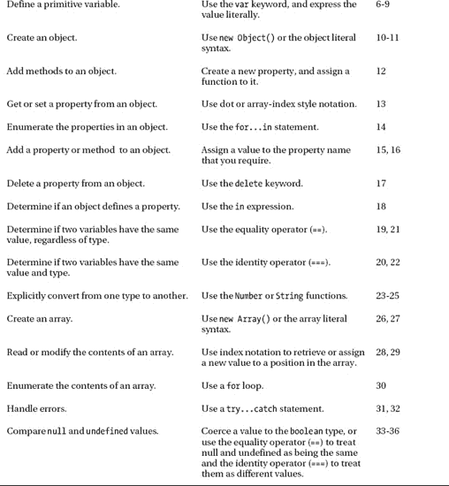

# 五、JavaScript 入门

JavaScript 经历了艰难的一生——艰难的诞生，随后是痛苦的青春期——直到最近几年，JavaScript 才赢得了有用和灵活的编程语言的声誉。您可以用 JavaScript 做很多事情，尽管它远非完美，但它值得认真对待。在这一章中，我将充实您的 JavaScript 知识，并在此过程中描述您将在本书后面用到的功能和特性。

 **提示**要想从本书中获得最大收益，你需要一些编程经验和对变量、函数和对象等概念的理解。如果你是编程新手，一个很好的起点是在流行网站 lifehacker.com 上发布的一系列文章，这里不需要任何编程知识，所有的例子都是用 JavaScript 编写的。该指南可从这里获得:`[`lifehacker.com/5744113/learn-to-code-the-full-beginners-guide`](http://lifehacker.com/5744113/learn-to-code-the-full-beginners-guide)`。

在这一章中，我的重点是 web 编程所需的核心 JavaScript 特性。如果你想进一步学习 JavaScript，我推荐几本书。对于一般的语言信息，我喜欢大卫·弗拉纳根的《JavaScript:权威指南》( ?? ),由 O'Reilly 出版。对于更高级的概念和特性，我推荐由罗斯·哈梅斯和达斯汀·迪亚兹所著，由 Apress 出版的 *Pro JavaScript 设计模式*。表 5-1 对本章进行了总结。

### 准备使用 JavaScript

有几种方法可以在 HTML 文档中定义脚本。您可以定义一个*内联脚本*，其中脚本的内容是 HTML 文档的一部分。您还可以定义一个*外部脚本*，其中 JavaScript 包含在一个单独的文件中，并通过 URL 引用。这两种方法都依赖于`script`元素，我在第七章的中对此进行了详细描述。在这一章中，为了简单起见，我使用内联脚本。你可以在清单 5-1 中看到这种脚本风格的例子。

*清单 5-1。一个简单的内联脚本*

`<!DOCTYPE HTML>
<html>
    <head>
        <title>Example</title>
    </head>
    <body>
        ****
    </body>
</html>`

这是一个非常简单的脚本，将单词`Hello`附加到文档中。`script`元素出现在文档中的其他内容之后，这样浏览器在执行脚本之前已经解析了其他元素。我会在第七章中解释为什么这很重要(以及如何对脚本执行施加一些控制)。

 **提示**当我介绍 JavaScript 时，我展示的许多例子将使用`document.writeln`方法作为显示脚本结果的简单方式。这个方法只是在 HTML 文档中添加一行文本。你可以在第二十六章的中了解更多关于`document`对象及其`writeln`方法的信息。

你可以在图 5-1 中看到浏览器如何渲染脚本的内容和效果。

*图 5-1。使用 JavaScript 向 HTML 文档追加内容*

在这一章，我不会显示截图，只是从一些例子的结果。例如，对于清单 5-1 中的，输出如下:

* * *

`Hello`

* * *

我对一些结果进行了格式化，以便于阅读。在接下来的小节中，我将向您展示 JavaScript 语言的核心特性。如果你有过用其他现代语言编程的经验，你会发现 JavaScript 的语法和风格很熟悉。

### 使用语句

基本的 JavaScript 构建块是语句。每条语句代表一条命令，语句通常以分号(`;`)结束。事实上，分号是可选的，但是使用分号会使您的代码更容易阅读，并且允许在一行中有多个语句。清单 5-2 显示了脚本中的几条语句。

*清单 5-2。使用 JavaScript 语句*

`<!DOCTYPE HTML>
<html>
    <head>
        <title>Example</title>
    </head>
    <body>
        
    </body>
</html>`

浏览器依次执行每条语句。在这个例子中，我只写出了一对简单的消息。结果如下(您可能会在一行中看到结果):

* * *

`This is a statement

This is also a statement`

* * *

### 定义和使用函数

如果你直接在脚本元素中定义语句，就像我在前面的清单 5-2 中所做的那样，浏览器会在到达这些语句时立即执行它们。或者，你可以将多条语句打包成一个*函数*，直到浏览器遇到一条调用该函数的语句，它才会被执行，如清单 5-3 所示。

*清单 5-3。定义一个 JavaScript 函数*

`<!DOCTYPE HTML>
<html>
    <head>
        <title>Example</title>
    </head>
    <body>
        
    </body>
</html>`

一个函数包含的语句用大括号(`{`和`}`)括起来，称为*代码块*。这个清单定义了一个名为`myFunc`的函数，它在代码块中包含一条语句。JavaScript 是一种区分大小写的语言，这意味着关键字`function`必须是小写的。在浏览器到达另一个调用`myFunc`函数的语句之前，函数中的语句不会被执行，就像这样:

`myFunc();`

这个例子并不特别有用，因为函数在定义后会立即被调用。当你在本章后面看事件时，你可以看到一些函数更有用的例子。

#### 用参数定义函数

与大多数编程语言一样，JavaScript 允许你为函数定义参数，如清单 5-4 所示。

*清单 5-4。用参数定义函数*

`<!DOCTYPE HTML>
<html>
    <head>
        <title>Example</title>
    </head>
    <body>
        
    </body>
</html>`

在这个清单中，我向`myFunc`函数添加了两个参数:`name`和`weather`。JavaScript 是一种松散类型的语言，这意味着在定义函数时不必声明参数的数据类型。在这一章的后面，当你看 JavaScript 变量的时候，我会回到松散类型。要调用带参数的函数，需要在调用函数时提供值作为参数，如下所示:

`myFunc("Adam", "sunny");`

该清单的结果如下:

* * *

`Hello Adam. It is sunny today`

* * *

调用函数时使用的参数数量不需要与函数中的参数数量相匹配。如果调用函数时参数个数少于实参个数，则任何未提供值的实参的值都是未定义的。如果调用函数时使用的参数多于实际参数，那么多余的参数将被忽略。这样做的结果是，您不能创建两个具有相同名称和不同参数的函数，并期望 JavaScript 根据您在调用函数时提供的参数来区分它们。如果您定义了两个同名的函数，第二个定义将替换第一个定义。

#### 定义返回结果的函数

您可以使用`return`关键字从函数中返回结果。清单 5-5 展示了一个返回结果的函数。

*清单 5-5。从函数返回结果*

`<!DOCTYPE HTML>
<html>
    <head>
        <title>Example</title>
    </head>
    <body>
        
    </body>
</html>`

该函数定义一个参数，并使用它生成一个简单的结果。我调用函数并将结果作为参数传递给`document.writeln`函数，如下所示:

`    document.writeln(myFunc("Adam"));`

请注意，您不必声明该函数将返回一个结果或表示结果的数据类型。该清单的结果如下:

* * *

`Hello Adam.`

* * *

### 使用变量和类型

您可以使用`var`关键字定义变量，并且可以像在单个语句中赋值一样，有选择地为变量赋值。函数中定义的变量是局部变量*，并且只能在该函数中使用。在脚本元素中直接定义的变量是*全局变量*，可以在任何地方访问，包括在其他脚本中。清单 5-6 展示了局部和全局变量的使用。*

 **清单 5-6。使用局部和全局变量*

`<!DOCTYPE HTML>
<html>
    <head>
        <title>Example</title>
    </head>
    <body>
        
        
    </body>
</html>`

JavaScript 是一种松散类型的语言。这并不意味着 JavaScript 没有类型——这只是意味着您不必显式声明变量的类型，并且您可以毫无困难地为同一个变量分配不同的类型。JavaScript 根据您分配给变量的值来确定类型，并根据使用它们的上下文在类型之间自由转换。清单 5-6 的结果如下:

* * *

`Hello Adam. Today is sunny. I like apples`

* * *

#### 使用原始类型

JavaScript 定义了一小组基本类型。这些是`string`、`number`和`boolean`。这似乎是一个很短的列表，但是 JavaScript 设法将很大的灵活性融入到这三种类型中。

##### 使用字符串

您可以使用双引号或单引号字符来定义`string`值，如清单 5-7 所示。

*清单 5-7。定义字符串变量*

`<!DOCTYPE HTML>
<html>
    <head>
        <title>Example</title>
    </head>
    <body>
        
    </body>
</html>`

您使用的引号字符必须匹配。例如，你不能用单引号开始一个字符串，然后用双引号结束。

##### 使用布尔值

`boolean`类型有两个值:`true`和`false`。清单 5-8 显示了两个值都被使用，但是这种类型在条件语句中使用时最有用，我将在本章后面描述。

*清单 5-8。定义布尔值*

`<!DOCTYPE HTML>
<html>
    <head>
        <title>Example</title>
    </head>
    <body>
        ` `    </body>
</html>`

##### 使用数字

`number`类型用于表示*整数*和*浮点*(也称为*实数*)。清单 5-9 提供了一个演示。

*清单 5-9。定义数值*

`<!DOCTYPE HTML>
<html>
    <head>
        <title>Example</title>
    </head>
    <body>
        
    </body>
</html>`

您不必指定使用哪种数字——您只需表达您需要的值，JavaScript 就会相应地执行。在清单中，我定义了一个整数值和一个浮点值，并在一个值前面加上了`0x`来表示一个十六进制值。

#### 创建对象

JavaScript 支持对象的概念，并且有不同的方法可以创建它们。清单 5-10 给出了一个简单的例子。

*清单 5-10。创建一个对象*

`<!DOCTYPE HTML>
<html>
    <head>
        <title>Example</title>
    </head>
    <body>
        ` `    </body>
</html>`

我通过调用`new Object()`创建一个对象，并将结果(新创建的对象)赋给一个名为`myData`的变量。创建对象后，我可以通过赋值来定义对象的属性，如下所示:

`myData.name = "Adam";`

在这个语句之前，我的对象没有名为`name`的属性。在语句执行之后，属性确实存在，并且它被赋予了值`Adam`。您可以通过将变量名和属性名与句点组合来读取属性值，如下所示:

`document.writeln("Hello " + **myData.name** + ". ");`

##### 使用对象文字

您可以使用*对象文字*格式在一个步骤中定义一个对象及其属性。清单 5-11 展示了这是如何做到的。

*清单 5-11。使用对象文字格式*

`<!DOCTYPE HTML>
<html>
    <head>
        <title>Example</title>
    </head>
    <body>
        
    </body>
</html>`

使用冒号(`:`)将您要定义的每个属性与其值分开，使用逗号(`,`)将属性分开。

##### 将函数用作方法

正如您可以向对象添加属性一样，您也可以向对象添加功能。属于一个对象的函数被称为*方法。*这是我最喜欢的 JavaScript 特性之一。不知道为什么，我觉得这很优雅，让人赏心悦目。清单 5-12 展示了如何以这种方式添加方法。

*清单 5-12。给一个对象添加方法*

`<!DOCTYPE HTML>
<html>
    <head>
        <title>Example</title>
    </head>
    <body>
        
    </body>
</html>`

在这个例子中，我使用了一个函数来创建一个名为`printMessages`的方法。注意，为了引用对象定义的属性，我必须使用`this`关键字。当一个函数作为一个方法使用时，该函数通过特殊变量`this`被隐式传递给调用该方法的对象作为参数。清单的输出如下所示:

* * *

`Hello Adam. Today is sunny.`

* * *

在创建和管理对象方面，JavaScript 提供了更多的特性，但是你不需要这些特性就可以使用 HTML5。如果你想更深入地研究这门语言，可以看看我在本章开始时推荐的书籍。

#### 使用对象

创建对象后，您可以对它们执行许多操作。在接下来的部分，我将描述在本书后面会有用的活动。

##### 读取和修改属性值

对对象做的最明显的事情是读取或修改分配给对象定义的属性的值。您可以使用两种不同的语法风格，这两种风格都显示在清单 5-13 中。

*清单 5-13。读取和修改对象属性*

`<!DOCTYPE HTML>
<html>
    <head>
        <title>Example</title>
    </head>
    <body>
        
    </body>
</html>`

第一种风格是大多数程序员都熟悉的，也是我在前面的例子中使用的。用句点将对象名和属性名连接在一起，如下所示:

`myData.name = "Joe";`

第二种样式是数组样式的索引，如下所示:

`myData["weather"] = "raining";`

在这种样式中，您可以在方括号(`[`和`]`)之间指定您想要的属性的名称。这是一种非常方便的访问属性的方法，因为您可以使用变量传递您感兴趣的属性，如下所示:

`var myData = {
    name: "Adam",
    weather: "sunny",
};

var propName = "weather";
myData[ **propName**] = "raining";`

这是如何枚举一个对象的属性的基础，我将在下面描述。

##### 枚举一个对象的属性

使用`for...in`语句枚举对象的属性。清单 5-14 展示了如何使用这个语句。

*清单 5-14。枚举对象的属性*

`<!DOCTYPE HTML>
<html>
    <head>
        <title>Example</title>
    </head>
    <body>
        
    </body>
</html>`

`for...in`循环在代码块中为`myData`对象中的每个属性执行语句。在每次迭代中，`prop`变量被赋予正在处理的属性的名称。我使用一个数组样式的索引(也就是说，使用`[`和`]`括号)从对象中检索属性值。该清单的输出如下(我对结果进行了格式化，以便于阅读):

* * *

`Name: name Value: Adam

Name: weather Value: sunny

Name: printMessages Value: function () { document.writeln("Hello " + this.name + ". ");
document.writeln("Today is " + this.weather + "."); }`

* * *

从结果可以看出，我定义为方法的函数也被枚举了。这是 JavaScript 灵活处理函数的结果，也是因为方法本身被认为是对象的属性。

##### 添加和删除属性和方法

即使使用了 object literal 样式，您仍然可以为对象定义新的属性。清单 5-15 给出了一个演示。

*清单 5-15。向对象添加新属性*

`<!DOCTYPE HTML>
<html>
    <head>
        <title>Example</title>
    </head>
    <body>
        
    </body>
</html>`

在这个清单中，我向名为`dayOfWeek`的对象添加了一个新属性。–我使用了点符号(用句点连接对象和属性名)，但是我也可以使用数组样式的索引符号。

正如你现在所期望的，你也可以通过将一个属性的值设置为一个函数来给一个对象添加新方法，如清单 5-16 所示。

*清单 5-16。向对象添加新方法*

`<!DOCTYPE HTML>
<html>
    <head>
        <title>Example</title>
    </head>
    <body>
        
    </body>
</html>`

你可以使用`delete`关键字从一个对象中删除一个属性或方法，如清单 5-17 所示。

*清单 5-17。从对象中删除属性*

`<!DOCTYPE HTML>
<html>
    <head>
        <title>Example</title>
    </head>
    <body>
        
    </body>
</html>`

##### 确定对象是否具有属性

你可以使用`in`表达式检查一个对象是否有属性，如清单 5-18 所示。

*清单 5-18。检查对象是否有属性*

`<!DOCTYPE HTML>
<html>
    <head>
        <title>Example</title>
    </head>
    <body>
        
    </body>
</html>`

在这个例子中，我测试了一个存在的属性和一个不存在的属性。`hasName`变量的值将是`true`,`hasDate`属性的值将是`false`。

### 使用 JavaScript 操作符

JavaScript 定义了一组非常标准的操作符。我在表 5-2 中总结了最有用的。

#### 使用等式和等式运算符

等式和等式运算符特别值得注意。相等运算符试图将操作数强制为同一类型，以便评估相等性。只要你意识到它的作用，这是一个方便的特性。清单 5-19 展示了等式操作符的作用。

*清单 5-19。使用等式运算符*

`<!DOCTYPE HTML>
<html>
    <head>
        <title>Example</title>
    </head>
    <body>
        
    </body>
</html>`

该脚本的输出如下:

* * *

`They are the same`

* * *

JavaScript 将两个操作数转换为相同的类型并进行比较——本质上，相等运算符测试值是否相同，而不管它们的类型如何。如果你想测试以确保值*和*的类型是相同的，你需要使用恒等运算符(`===`，它是三个等号而不是两个等号的等号运算符)，如清单 5-20 所示。

*清单 5-20。使用恒等运算符*

`<!DOCTYPE HTML>
<html>
    <head>
        <title>Example</title>
    </head>
    <body>
        
    </body>
</html>`

在这个例子中，identity 操作符认为这两个变量是不同的——这个操作符不强制类型。该脚本的结果如下:

* * *

`They are NOT the same`

* * *

**提示**注意，我在清单 5-19 和清单 5-20 中使用了`if`条件语句。该语句评估一个条件，如果条件评估为`true`，则执行代码块中的语句。`if`语句可以与可选的`else`子句一起使用，该子句包含一个代码块，如果条件为`false`，将执行该代码块的语句。

JavaScript 原语(内置类型，如字符串和数字)通过值进行比较，但 JavaScript 对象通过引用进行比较。清单 5-21 展示了 JavaScript 如何处理对象的相等和相同测试。

*清单 5-21。对对象执行相等和相同测试*

`<!DOCTYPE HTML>
<html>
    <head>
        <title>Example</title>
    </head>
    <body>
        
    </body>
</html>`

该脚本的结果如下:

* * *

`Test 1: false Test 2: true

Test 3: false Test 4: true`

* * *

清单 5-22 显示了对原语执行的相同测试。

*清单 5-22。对原语执行相等和相同测试*

`<!DOCTYPE HTML>
<html>
    <head>
        <title>Example</title>
    </head>
    <body>
        
    </body>
</html>`

该脚本的结果如下:

* * *

`Test 1: true Test 2: true

Test 3: false Test 4: true`

* * *

#### 明确地转换类型

字符串连接运算符(`+`)的优先级高于加法运算符(`+`)。这可能会造成混乱，因为 JavaScript 会自由地转换类型以产生结果，而结果并不总是预期的。清单 5-23 显示了一个例子。

*清单 5-23。字符串连接运算符优先级*

`<!DOCTYPE HTML>
<html>
    <head>
        <title>Example</title>
    </head>
    <body>
        
    </body>
</html>`

该脚本的结果如下:

* * *

`Result 1: 10

Result 2: 55`

* * *

第二种结果是引起混乱的那种。通过运算符优先级和过急类型转换的组合，原本可能是加法运算的操作被解释为字符串串联。为了避免这种情况，可以显式转换值的类型，以确保执行正确的操作。表 5-3 描述了最有用的转换方法。

##### 将数字转换为字符串

如果你正在处理多个数字变量，并且你想把它们连接成字符串，你可以用`toString`方法把数字转换成字符串，如清单 5-24 所示。

*清单 5-24。使用 Number.toString 方法*

`<!DOCTYPE HTML>
<html>
    <head>
        <title>Example</title>` `    </head>
    <body>
        
    </body>
</html>`

注意，我将数值放在括号中，然后调用了`toString`方法。这是因为在调用`number`类型定义的方法之前，您必须允许 JavaScript 将文字值转换成`number`。我还展示了一种替代方法来实现与调用`toString`相同的效果，即调用`String`函数，并将数值作为参数传入。这两种技术具有相同的效果，都是将一个`number`转换成一个`string`，这意味着`+`操作符用于字符串连接而不是加法。该脚本的输出如下:

* * *

`Result: 55`

* * *

还有一些其他的方法可以让我们更好地控制一个数字如何被表示成一个字符串。我在表 5-3 中简单描述了这些。表中显示的所有方法都由数字类型定义。

##### 将字符串转换为数字

相反的问题是将字符串转换成数字，这样就可以执行加法而不是连接。你可以用`Number`函数来完成，如清单 5-25 中的所示。

*清单 5-25。将字符串转换成数字*

`<!DOCTYPE HTML>
<html>
    <head>
        <title>Example</title>
    </head>
    <body>
        
    </body>
</html>`

该脚本的输出如下:

* * *

`Result: 10`

* * *

`Number`函数解析字符串值的方式非常严格，但是您可以使用另外两个更灵活的函数，它们会忽略后面的非数字字符:`parseInt`和`parseFloat`。我在表 5-4 中描述了所有三个功能。

### 使用数组

JavaScript 数组的工作方式非常类似于大多数其他编程语言中的数组。清单 5-26 展示了如何创建和填充一个数组。

*清单 5-26。创建并填充一个数组*

`<!DOCTYPE HTML>
<html>
    <head>
        <title>Example</title>
    </head>
    <body>
        
    </body>
</html>`

我通过调用`new Array()`创建了一个新数组。这创建了一个空数组，我将它赋给了变量`myArray`。在随后的语句中，我为数组中的不同索引位置赋值。

在这个例子中有一些事情需要注意。首先，在创建数组时，我不需要声明数组中的项数。JavaScript 数组调整自身大小以容纳任意数量的项目。要注意的第二点是，我不必声明数组将保存的数据类型。任何 JavaScript 数组都可以包含任何混合的数据类型。在这个例子中，我给数组分配了三个项目:一个`number`、一个`string`和一个`boolean`。

#### 使用数组文字

数组文字风格允许你在一个语句中创建和填充一个数组，如清单 5-27 所示。

*清单 5-27。使用数组文字样式*

`<!DOCTYPE HTML>
<html>
    <head>
        <title>Example</title>
    </head>
    <body>
        
    </body>
</html>`

在这个例子中，我通过在方括号(`[`和`]`)之间指定我想要的数组中的项目，指定了应该给`myArray`变量分配一个新的数组。

#### 读取和修改数组的内容

使用方括号(`[`和`]`)读取给定索引处的值，将所需的索引放在括号之间，如清单 5-28 所示。JavaScript 使用从零开始的数组索引。

*清单 5-28。从数组索引中读取数据*

`<!DOCTYPE HTML>
<html>
    <head>
        <title>Example</title>
    </head>
    <body>
        
    </body>
</html>`

只需给索引赋值，就可以修改 JavaScript 数组中任何位置的数据。就像常规变量一样，您可以在索引处切换数据类型，不会有任何问题。清单 5-29 演示了修改一个数组的内容。

*清单 5-29。修改数组的内容*

`<!DOCTYPE HTML>
<html>
    <head>
        <title>Example</title>
    </head>
    <body>
        
    </body>
</html>`

在这个例子中，我将一个`string`赋值给数组中的位置`0`——这个位置以前由一个`number`占据。

#### 枚举数组的内容

使用一个`for`循环来枚举数组的内容。清单 5-30 展示了如何应用循环来显示一个简单数组的内容。

*清单 5-30。枚举数组的内容*

`<!DOCTYPE HTML>
<html>
    <head>
        <title>Example</title>
    </head>
    <body>
        
    </body>
</html>`

JavaScript 循环的工作方式与许多其他语言中的循环一样。使用`length`属性确定数组中有多少个元素。清单的输出如下所示:

* * *

`Index 0: 100 Index 1: Adam Index 2: true`

* * *

#### 使用内置数组方法

JavaScript `Array`对象定义了许多可以用来处理数组的方法。表 5-5 描述了这些方法中最有用的。

### 处理错误

JavaScript 使用`try...catch`语句来处理错误。在很大程度上，你不会担心本书中的错误，因为我的重点是解释 HTML5 的特性，而不是核心编程技能。清单 5-31 展示了如何使用这种语句。

*清单 5-31。处理异常*

`<!DOCTYPE HTML>
<html>
    <head>
        <title>Example</title>
    </head>
    <body>
        
    </body>
</html>`

这个脚本中的问题很常见——我试图使用一个没有正确初始化的变量。我在语句的`try`子句中包装了我怀疑会导致错误的代码。如果没有出现问题，语句会正常执行，并且会忽略`catch`子句。

但是，如果有错误，则`try`子句中语句的执行会立即停止，控制权会传递给`catch`子句。您遇到的错误由一个`Error`对象描述，该对象被传递给`catch`子句。表 5-6 显示了由`Error`对象定义的属性。

`catch`条款是你从错误中恢复或事后清理的机会。如果有需要执行的语句，不管是否有错误，你可以把它们放在可选的`finally`子句中，如清单 5-32 所示。

*清单 5-32。使用 finally 子句*

`<!DOCTYPE HTML>
<html>
    <head>
        <title>Example</title>
    </head>
    <body>
        
    </body>
</html>`

### 比较未定义值和空值

JavaScript 定义了几个特殊值，在比较它们时需要小心:`undefined`和`null`。当你读取一个没有赋值的变量或者试图读取一个不存在的对象属性时，就会返回`undefined`值。清单 5-33 展示了`undefined`在 JavaScript 中的用法。

*清单 5-33。未定义的特殊值*

`<!DOCTYPE HTML>
<html>
    <head>
        <title>Example</title>
    </head>
    <body>
        
    </body>
</html>`

该清单的输出如下:

* * *

`Prop: undefined`

* * *

JavaScript 很奇怪，因为它还定义了另一个特殊值`null`。`null`值与`undefined`值略有不同。当没有定义值时，返回`undefined`值，当您想要指示您已经分配了一个值，但是该值不是有效的`object`、`string`、`number`或`boolean`(即，您已经定义了一个值*没有值*)时，使用`null`。为了帮助澄清这一点，清单 5-34 显示了从`undefined`到`null`的过渡。

*清单 5-34。使用未定义和空值*

`<!DOCTYPE HTML>
<html>
    <head>
        <title>Example</title>
    </head>
    <body>
        
    </body>
</html>`

我创建了一个对象，然后尝试读取`weather`属性的值，该值没有在代码片段的前面部分定义:

`document.writeln("Var: " + myData.weather);
document.writeln("Prop: " + ("weather" in myData));`

还没有`weather`属性，所以调用`myData.weather`返回的值是`undefined`，使用`in`关键字确定对象是否包含属性返回`false`。这两条语句的输出如下:

* * *

`Var: undefined

Prop: false`

* * *

然后，我给`weather`属性赋值，这样做的效果是将属性添加到对象中:

`myData.weather = "sunny";
document.writeln("Var: " + myData.weather);
document.writeln("Prop: " + ("weather" in myData));`

我读取属性的值，并再次检查对象中是否存在该属性。如您所料，您了解到对象*的确*定义了属性，并且它的值是`sunny`:

* * *

`Var: sunny

Prop: true`

* * *

现在我将属性的值设置为`null`，如下所示:

`myData.weather = null;`

这有一个非常特殊的效果——属性仍然由对象定义，但是我指出它不包含值。当我再次执行检查时，我得到以下结果:

* * *

`Var: null

Prop: true`

* * *

#### 检查变量或属性是否为空或未定义

如果你想检查一个属性是`null`还是`undefined`(你不在乎哪个)，你可以简单地使用一个`if`语句和否定运算符(`!`，如清单 5-35 所示。

*清单 5-35。检查属性是否为空或未定义*

`<!DOCTYPE HTML>
<html>
    <head>
        <title>Example</title>
    </head>
    <body>
        
    </body>
</html>`

这种技术依赖于 JavaScript 执行的类型强制，因此您检查的值被视为`boolean`值。如果变量或属性是`null`或`undefined`，则强制的`boolean`值是`false`。

#### 区分空和未定义

如果你想比较两个值，你有一个选择。如果您想将一个`undefined`值视为与一个`null`值相同，您可以使用等号运算符(`==`)并依靠 JavaScript 转换类型——例如，一个`undefined`变量将被视为等于一个`null`变量。如果要区分`null`和`undefined`，需要使用恒等运算符(`===`)。两种比较如清单 5-36 所示。

*清单 5-36。空值和未定义值的相等性和同一性比较*

`<!DOCTYPE HTML>
<html>
    <head>
        <title>Example</title>
    </head>
    <body>
        
    </body>
</html>`

该脚本的输出如下:

* * *

`Equality: true

Identity: false`

* * *

### 有用的 JavaScript 工具

有很多工具可以帮助简化 JavaScript 的使用。有两点我认为特别值得注意。

#### 使用 JavaScript 调试器

当前一代的浏览器包括复杂的 JavaScript 调试器(或者通过插件如 Firebug for Mozilla Firefox 来支持它们)。这些可以用来设置断点、检测错误，并在脚本执行时单步执行脚本。当你在脚本中遇到困难时，调试器是第一个求助的地方。我首选的浏览器是谷歌 Chrome，我和内置的调试器相处得很好。然而，当我遇到一个特别棘手的问题时，我发现自己在 Firefox 上使用 Firebug。在处理复杂问题时，Firebug 调试器似乎更加健壮。

#### 使用 JavaScript 库

使用 JavaScript 最简单的方法之一是通过 JavaScript 工具包或库。这样的工具包不缺，但是有两个我特别推荐。第一个，也是我最有经验的一个，是 jQuery。jQuery 和它的同伴 jQuery UI 非常受欢迎，正在积极开发，并且包含了许多有用的特性。jQuery 使得使用 JavaScript 变得更加简单和愉快。

另一个工具包——也是 jQuery 的主要竞争对手——是 Dojo。Dojo 具有与 jQuery 非常相似的功能，同样得到了很好的支持和广泛的使用。我使用 Dojo 的经验比 jQuery 少，但是我使用 Dojo 的时间是积极的。你可以在`jquery.com`下载 jQuery，在`[`dojotoolkit.org`](http://dojotoolkit.org)`可以下载 Dojo。冒着被视为我自己的书的风险，如果你想了解更多关于 jQuery 的细节，可以考虑阅读同样由 Apress 出版的 *Pro jQuery* 。

### 总结

在这一章中，我向您展示了将在本书中使用的核心 JavaScript 特性。JavaScript 是 HTML5 不可或缺的一部分，对该语言及其用法的基本理解是必不可少的。*