# 六、上下文中的 HTML 元素

在接下来的章节中，我将描述 HTML5 定义的元素。其中许多元素也存在于 HTML4 中，但在许多情况下，元素的含义已经改变，或者元素的使用方式已经不同。在我们看这些元素之前，我想把它们放在上下文中，并为后面的内容奠定基础。知道如何使用这些元素和理解它们的重要性一样重要。

### 理解语义/表现的差异

HTML5 的主要变化之一是哲学上的——元素的语义意义和元素对内容表示的影响之间的分离。原则上，这是一个明智的想法——使用 HTML 元素为内容赋予结构和意义，然后通过对元素应用 CSS 样式来控制内容的表示。并不是每个 HTML 文档的消费者都需要显示它们，通过将表示作为一项独立的工作，您可以使 HTML 更容易处理并自动提取含义。

HTML5 中添加的大多数新元素都为您的内容添加了特定的含义。您可以使用`article`元素(在第十章中有描述)来表示适合联合的自包含内容，或者使用`figure`元素来表示一个数字。

HTML4 中存在的大量元素起源于没有将表示和意义分开的概念——这将我们置于一个奇怪的境地。一个很好的例子是`b`元素。在 HTML5 之前，`b`元素指示浏览器将开始和结束标签包含的内容显示为粗体文本。在 HTML5 中，你不希望元素只是表示性的，所以你有了一个新的定义。这是:

> *`b`元素表示从其周围内容偏移的一段文本，没有传达任何额外的强调或重要性，并且对于该段文本，传统的印刷呈现是粗体文本；例如，文档摘要中的关键字，或者评论中的产品名称。*
> 
> –HTML:标记语言，w3c.org

这是一种冗长的方式，告诉我们`b`元素告诉浏览器将文本加粗。`b`元素没有语义意义；这是所有关于介绍。这个含糊其辞的定义告诉我们一些关于 HTML5 的重要事情:我们正处于一个过渡时期。我们需要保留旧元素，因为它们被广泛使用，在 HTML5 中丢弃 HTML4 元素是不可想象的，因为这肯定会减慢采用。所以我们有一个双速标准。有些元素，尤其是新的元素，只有语义上的意义。其他元素，主要是那些带有一个字母标签的元素，已经被很好地建立起来，以至于我们愿意打破表示/语义的鸿沟，即使我们不愿意尽可能公开地承认这一点。

从下一章开始，当你通读元素的描述时，你会发现在思维的新方式和旧方式之间保持这种张力是有帮助的。这肯定有助于解释你将会遇到的一些小问题。

我的建议是在语义方面出错，在合理的情况下，尽量避免主要(或仅仅)是表示性的元素。定义一个自定义类并应用所需的样式是一件简单的事情。只要你使用基于内容类型的样式(而不仅仅是你希望内容出现的方式)，你至少会保留语义精神。

### 了解如何选择元素

即使抛开表示问题不谈，HTML5 规范也有一些模糊之处。有些元素非常通用，一开始您可能会觉得这令人不快。

元素*是*通用的，但那是因为 HTML 元素被用来标记如此多不同种类的内容。我的大部分写作都是为了这样的书，所以当我听到像*章节*、*文章*、*标题*和*图*这样的术语时，我会想到出版社需要作者提供的结构和风格。当应用于其他类型的内容时，相同的术语具有不同的含义。例如，规范、法律合同和博客文章可能都有部分，但是每个部分的含义完全不同。我们没有图书部分、规范部分、合同部分和博客部分的定义，我们只有通用术语，需要某种程度的解释。在选择应用于内容的元素时，我建议您遵循一些基本规则。下面几节将对它们进行描述。

#### 少可以多

很容易忘乎所以，最终在文档中留下大量标记。您只需要添加标记来赋予内容所需的语义意义。如果不需要定义复杂的标题，就不需要`hgroup`元素(在第十章中有描述)，只有在引用很重要的文档(比如期刊论文)才需要带有`cite`元素的详细引用(第八章)。

判断应用多少标记是一个经验问题，但是这里有一个经验法则:问问你自己元素的语义将如何被使用。如果我没有立即的答案，我不会应用该元素。

#### 不要滥用元素

每个元素代表一种特定的内容，甚至是那些棘手的仅用于表示的元素，如`b`。当标记内容时，只为定义的目的使用元素，避免创建私有语义。如果您找不到具有所需意义的元素，可以考虑使用一个通用元素(如`span`或`div`)并使用`class`全局属性来表示文档中的含义。类不一定只用于 CSS 样式。

#### 具体而一致

你需要选择最具体的元素来代表你的内容。这意味着当存在表示适当内容类型的元素时，抵制使用通用元素构建页面的诱惑。HTML4 中有一种倾向，依靠`div`元素(在第九章中描述)来构建页面结构，但问题是，对于试图处理你的内容的任何人来说，语义并不立即显而易见。您可能决定创建一个名为`article`的类，并使用该类应用您的样式，但是这并不像使用`article`元素那样赋予其他人相同的含义。

同样地，当你使用一个元素时，要确保在你的页面、站点或 web 应用中应用它。这将使您更容易维护您的 HTML 标记，也使其他人更容易处理您的 HTML。

#### 不要对观众做出假设

很容易假设 HTML 的消费者只关心页面如何在浏览器中呈现，因此，您不必担心标记的语义准确性。语义/表示划分的全部目的是使 HTML 更容易以编程方式处理，因此，随着 HTML5 被更广泛地采用和实现，可以预期这种风格的 HTML 消费会逐渐增加。假设您不必担心您的标记的准确性或一致性，您会使处理您的 HTML 更加困难，这将限制用户可以为您的内容找到的目的范围。

### 理解元素描述

在描述每个元素时，我提供了一个汇总表，其中包含了您需要了解的关键事实，在对内容应用标记时，您可以参考这些事实。表 6-1 是这种总结的一个例子——它描述了`ol`元素，用来表示一个有序列表。(你可以在第九章的中看到 HTML 列表的全部细节。)

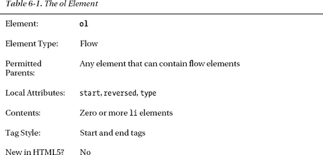

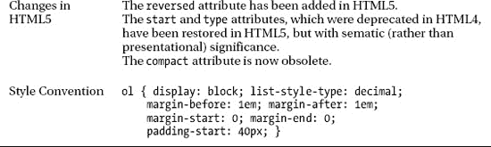

本章中的表格告诉您哪些父元素适合该元素，元素可以包含的内容种类，所需的标记样式，默认的表示样式，以及该元素在 HTML5 中是新的还是更改的。关于合适的父母和内容的信息是基于我在第三章中描述的元素类别，主要是 ?? 流和 ?? 元素。

### 元素快速参考

下面的表格是我在后面章节中描述的所有 HTML5 元素的快速参考。

#### 文档和元数据元素

表 6-2 总结了文档和元数据元素，在第七章中有详细描述。这些元素用于创建 HTML 文档的上层结构，向浏览器提供关于文档的信息，并定义脚本和 CSS 样式以及在浏览器中禁用脚本时将显示的内容。

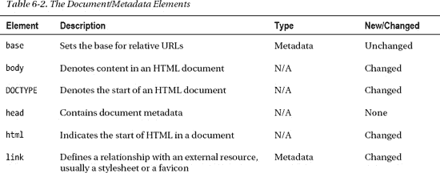

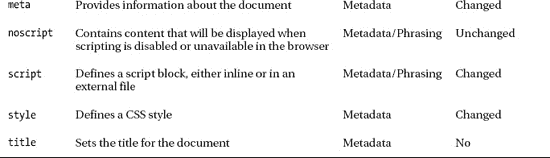

#### 文本元素

文本元素被应用于内容以给出基本的结构和含义。表 6-3 总结了这些要素，这些要素在第八章中有详细描述。

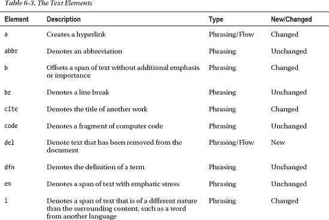

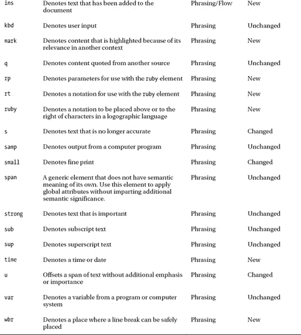

#### 分组内容

表 6-4 中的元素用于关联分组中的相关内容。这些元素的全部细节可以在第九章中找到。

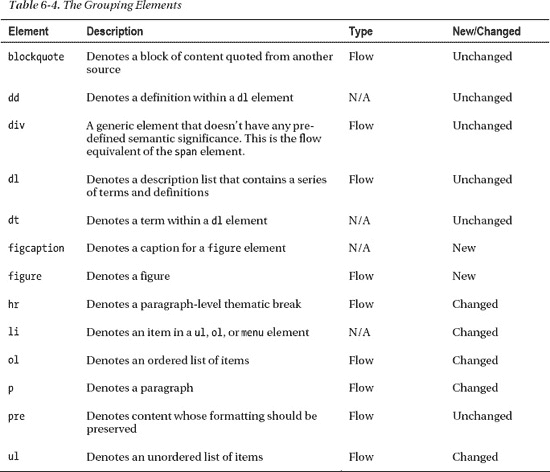

#### 切片内容

表 6-5 中的元素用于分解内容，以便每个概念、想法或主题都是独立的。这些元素中有许多是新的，它们为将元素的含义与它们的外观分开提供了很多基础。你可以在第十章中了解更多关于这些元素的知识。

#### 创建表格

表 6-6 中的元素用于创建表格以在网格中显示数据。HTML5 的主要变化是你不能再用表格来管理页面的布局。相反，你必须使用 CSS 表格特性，我在第二十一章中描述过。

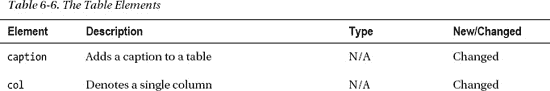

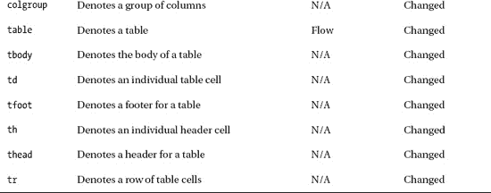

#### 创建表单

表 6-7 中的元素用于创建 HTML 表单，你可以用它来请求用户输入。在 HTML5 中，HTML 的这个领域受到了很多关注，它有许多新元素和特性，包括在用户能够提交表单之前在客户端验证输入的能力。我在第 12、13 和 14 章描述了 HTML 表单元素。特别有趣的是新类型的`input`元素，我在第十二章的中介绍了它，并在第十三章的中深入讨论了它。

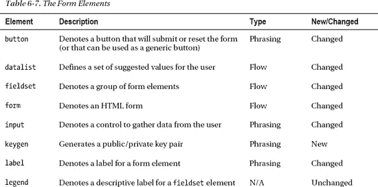

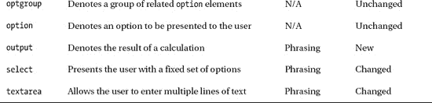

#### 嵌入内容

表 6-8 中的元素用于将内容嵌入到 HTML 文档中。其中一些元素在第十五章的中有所描述，其他的将在本书的后面部分介绍。

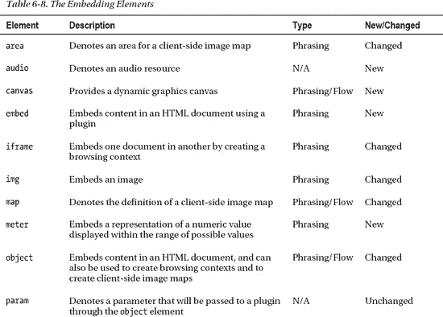

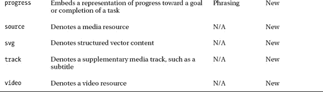

### 未实现的元素

有两个元素目前没有浏览器实现，并且在 HTML5 规范中只是模糊地描述。这些元素是`command`和`menu`。在高层次上，它们旨在简化菜单和用户界面元素的操作，但我无法在本书中提供任何详细信息。我希望浏览器的后续版本将开始对这些元素的含义形成事实上的共识。

### 总结

在本章中，我为后面章节中出现的 HTML5 元素的详细描述提供了一些上下文。我还提供了一个快速参考，以便您在将来需要刷新记忆时可以找到某个元素的描述。当您开始学习 HTML 中的元素和属性时，您应该记得我在本章开始时提供的核心建议:尽可能使用最具体的元素，不要误用元素，并且在您的文档中和整个 web 站点或 web 应用中一致地使用元素。