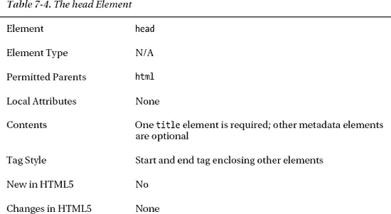
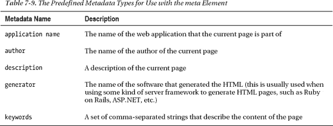

# 七、创建 HTML 文档

在这一章中，你将看到 HTML5 定义的最基本的元素:*文档*和*元数据元素*。这些是您用来创建 HTML 文档和描述其内容的元素。

这些是 HTML 定义的最不有趣的元素，然而它们却至关重要。无论如何，请随意跳过这一章，稍后再回来——但请务必回来。每个 HTML 文档都至少使用这些元素中的一些(通常是全部)，知道如何正确使用它们对于创建符合标准的 HTML5 文档来说至关重要。表 7-1 对本章进行了总结。

### 设置基本文档结构

让我们从*文档元素*开始。这些是定义 HTML 文档形状并为浏览器设置初始上下文的构件。只有四个文档元素，但是它们在任何 HTML 文档中都是必需的。

#### doctype 元素

元素是独一无二的，自成一类。您需要用一个`doctype`元素开始您创建的每个 HTML 文档；这是告诉浏览器它将处理 HTML 的元素。如果你省略了`doctype`元素，大多数浏览器仍然可以正确显示你的内容，但是依赖浏览器的这种行为是一种不好的做法。表 7-2 总结了`doctype`要素。

在 HTML5 中只有一种方法可以使用`doctype`元素，如清单 7-1 所示。在学习本章的过程中，您将应用每个元素来创建一个简单但完整的 HTML5 文档。清单 7-1 显示了第一行。

*清单 7-1。使用 doctype 元素*

`<!DOCTYPE HTML>`

这个元素告诉浏览器两件事:它正在处理 HTML，内容是用哪个版本的 HTML 规范注释的。您不必提供版本号。浏览器将自动检测到您正在使用 HTML5(这是因为这个元素在 HTML5 中的形式与早期的 HTML 版本略有不同)。此元素没有结束标记。您只需在文档的开头放置一个标签。

#### html 元素

`html`元素，更恰当地称为*根元素*，表示文档中 HTML 的开始。表 7-3 总结了`html`要素。

`html`元素表示文档中 HTML 标记的开始。清单 7-2 显示了使用中的`html`元素。

*清单 7-2。使用 html 元素*

`<!DOCTYPE HTML>
**<html>**
*   …content and elements omitted…*
**</html>**`

#### 头部元素

`head`元素包含文档的元数据。在 HTML 中，元数据为浏览器提供关于文档中的内容和标记的信息，但也可以包括脚本和对外部资源的引用(如 CSS 样式表)。您将在本章后面看到元数据元素。表 7-4 总结了`head`要素。

清单 7-3 显示了使用中的`head`元素。每个 HTML 文档应该包含一个`head`元素，反过来，它必须包含一个`title`元素，如清单所示。`title`元素的全部细节将在本章的后面给出。

*清单 7-3。使用头部元件*

`<!DOCTYPE HTML>
<html>
    **<head>**
        <title>Hello</title>
    **</head>**
</html>`

#### 身体元素

元素封装了 HTML 文档的内容，而元素封装了元数据和文档信息。`body`元素总是跟在`head`元素后面，所以它是`html`元素的第二个子元素。表 7-5 描述了`body`元素。

清单 7-4 显示了使用中的`body`元素。

*清单 7-4。使用主体元素*

`<!DOCTYPE HTML>
<html>
    <head>
        <title>Example</title>
    </head>
**    <body>**
        

            I like <code id="applecode">apples</code> and oranges.
        

        <a href="http://apress.com">Visit Apress.com</a>
**    </body>**
</html>`

我给`body`元素添加了一些简单的内容。我使用的单个元素(`p`、`code`和`a`)在第八章和第九章中有描述。您已经拥有了一个简单但完整的 HTML 文档。你可以在图 7-1 中看到浏览器如何显示该文档。

*图 7-1。在浏览器中显示一个简单的 HTML 文档*

### 用元数据元素描述文档

元数据元素允许您提供关于 HTML 文档的信息。它们本身并不满足，但是它们提供了关于随后内容的信息。元数据元素被添加到`head`元素中。

#### 设置文档标题

元素设置文档的标题或名称。浏览器通常在浏览器窗口或选项卡的顶部显示该元素的内容。表 7-6 描述了`title`元素。

每个 HTML 文档应该只有一个`title`元素，由开始和结束标签包围的文本应该对用户有意义。至少，它应该允许用户区分浏览器标签或窗口，并识别它们属于你的 web 应用。清单 7-5 显示了使用中的`head`元素。

*清单 7-5。使用头部元件*

`<!DOCTYPE HTML>
<html>
    <head>
        **<title>Example</title>**
    </head>
    <body>
        

            I like <code id="applecode">apples</code> and oranges.
        

        <a href="http://apress.com">Visit Apress.com</a>
    </body>
</html>`

你可以在图 7-2 中看到浏览器处理`head`元素的方式。图中显示的是谷歌浏览器，但其他浏览器做的事情大体相似。

*图 7-2。使用标题元素的效果*

#### 设置相对 URL 的基础

元素设置了一个基本 URL，包含在 HTML 文档中的相对链接将根据这个 URL 进行解析。相对链接是一种省略了 URL 的协议、主机和端口部分的链接，并根据其他 URL 进行评估——或者是由`base`元素指定的 URL，或者是用于加载当前文档的 URL。`base`元素还指定了当用户点击链接时链接是如何打开的，以及表单提交后浏览器的行为(我在第十二章中解释了 HTML5 表单)。表 7-7 总结了`base`要素。

一个 HTML 文档应该最多包含一个`base`元素。它通常是放置在`head`元素中的第一个元素。这确保了基本 URL 应用于后续元数据元素中使用的相对 URL。

##### 使用 href 属性

`href`属性指定了基本 URL，文档其余部分的相对 URL 将根据该基本 URL 进行解析。清单 7-6 显示了使用中的`base`元素。

*清单 7-6。在基本元素中使用 href 属性*

`<!DOCTYPE HTML>
<html>
    <head>
        <title>Example</title>
**        <base href="http://titan/listings/"/>**
    </head>
    <body>
        

            I like <code id="applecode">apples</code> and oranges.
        

        <a href="http://apress.com">Visit Apress.com</a>
        <a  **href="page2.html**>Page 2</a>
    </body>
</html>`

在这个例子中，我将基本 URL 设置为`[`titan/listings/`](http://titan/listings/)`。`Titan`是我的开发服务器的名称，`listings`是服务器上包含本书示例的目录。

在文档的后面，我添加了一个`a`元素来创建一个使用相对 URL `page2.html`的超链接(我在第八章中解释了如何使用`a`元素)。当用户点击超链接时，浏览器组合基本 URL 和相对 URL 以创建组合 URL `[`titan/listings/page2.html`](http://titan/listings/page2.html)`。

 **提示**如果您不使用`base`元素，或者使用`href`属性指定一个基本 URL，那么浏览器将认为它应该根据当前文档的 URL 解析任何相对链接。因此，举例来说，如果你从 URL `[`myserver.com/app/mypage.html`](http://myserver.com/app/mypage.html)`加载一个文档，它包含一个相对 URL 为`myotherpage.html`的超链接，那么浏览器将尝试从完全合格的 URL `[`myserver.com/app/myotherpage.html`](http://myserver.com/app/myotherpage.html)`加载第二个页面。

##### 使用目标属性

属性告诉浏览器如何打开 URL。您为该属性指定的值代表一个*浏览上下文*。当你查看`a`和`iframe`元素时，你会在第八章和第十五章看到这些上下文的一些例子以及如何使用它们。

#### 使用元数据描述文档

元素允许您在文档中定义不同种类的元数据。您可以以多种不同的方式使用这个元素，一个 HTML 文档可以包含多个`meta`元素。表 7-8 提供了`meta`要素的汇总。

在接下来的小节中，我将向您展示使用`meta`元素的不同方式。注意，`meta`元素的每个实例只能用于其中一个目的。如果您想要利用这些特性中的一个以上的特性，您必须向`head`元素添加多个`meta`元素。

#### 指定名称/值元数据对

`meta`元素的第一个用途是在名称/值对中定义元数据，为此使用了`name`和`content`属性。清单 7-7 提供了一个演示。

*清单 7-7。使用 meta 元素在名称/值对中定义元数据*

`<!DOCTYPE HTML>
<html>
    <head>
        <title>Example</title>
        <base href="http://titan/listings/"/>
        **<meta name="author" content="Adam Freeman"/>**
        **<meta name="description" content="A simple example"/>**`
`    </head>
    <body>
        

            I like <code id="applecode">apples</code> and oranges.
        

        <a href="http://apress.com">Visit Apress.com</a>
        <a href="page2.html">Page 2</a>
    </body>
</html>`

使用`name`属性指定元素引用的元数据类型，使用`content`属性提供一个值。表 7-9 列出了可用于`meta`元素的预定义元数据类型。

除了五个预定义的元数据名称，您还可以使用元数据扩展。转到`[`wiki.whatwg.org/wiki/MetaExtensions`](http://wiki.whatwg.org/wiki/MetaExtensions)`查看这些扩展的列表，它们会随着时间的推移而变化。其中一些扩展被广泛使用，而另一些则相当专业，几乎不使用。`robots`元数据类型是广泛使用的扩展的一个例子。它允许 HTML 文档的作者指定搜索引擎应该如何处理该文档。例如:

`<meta name="robots" content="noindex">`

大多数搜索引擎会识别的三个值是`noindex`(不索引该页面)`noarchive`(不创建该页面的存档或缓存版本)`nofollow`(不跟踪该页面的链接)。还有更多可用的元数据扩展，我建议您通读在线列表，看看哪些适合您的项目。

 **提示**过去，`keywords`元数据是告诉搜索引擎应该如何对你的内容进行分类和排名的主要方式。如今，搜索引擎对`keywords`元数据的关注要少得多，因为它可能会被滥用，给人一种页面相关性和内容的错觉。改善搜索引擎考虑你内容的方式的最好方法是采纳搜索引擎自己的建议——大多数搜索引擎为优化你的页面或整个网站提供指导。你可以在`[`google.com/support/webmasters/bin/topic.py?topic=15260`](http://google.com/support/webmasters/bin/topic.py?topic=15260)`找到谷歌的指南。

#### 声明字符编码

元素的另一个用途是声明 HTML 文档内容使用的字符编码。清单 7-8 中显示了一个这样的例子。

*清单 7-8。使用 meta 元素声明一个字符编码*

`<!DOCTYPE HTML>
<html>
    <head>
        <title>Example</title>
        <base href="http://titan/listings/"/>
        <meta name="author" content="Adam Freeman"/>
        <meta name="description" content="A simple example"/>
        **<meta charset="utf-8"/>**
    </head>
    <body>
        

            I like <code id="applecode">apples</code> and oranges.
        

        <a href="http://apress.com">Visit Apress.com</a>
        <a href="page2.html">Page 2</a>
    </body>
</html>`

在这种情况下，我已经指定我的页面使用`UTF-8`编码。UTF-8 是一种常见的字符编码，因为它可以用最少的字节数表示所有的 Unicode 字符。(当我写这篇文章时，大约 50%的网页使用 UTF-8 编码。)

##### 模拟一个 HTTP 头

元素的最后一个用途是覆盖一个 HTTP(超文本传输协议)头的值。HTTP 通常用于在服务器和浏览器之间传输 HTML 数据。我不打算进一步描述 HTTP，只想说来自服务器的每个响应都包含一系列向浏览器描述内容的头，您可以使用`meta`元素来模拟或替换其中的三个头。清单 7-9 显示了`meta`元素这种用法的一般形式。

*清单 7-9。使用 meta 元素模拟 HTTP 头*

`<!DOCTYPE HTML>
<html>
    <head>`
`        <title>Example</title>
        <base href="http://titan/listings/"/>
        <meta name="author" content="Adam Freeman"/>
        <meta name="description" content="A simple example"/>
        <meta charset="utf-8"/>
        **<meta http-equiv="refresh" content="5"/>**
    </head>
    <body>
        

            I like <code id="applecode">apples</code> and oranges.
        

        <a href="http://apress.com">Visit Apress.com</a>
        <a href="page2.html">Page 2</a>
    </body>
</html>`

您使用`http-equiv`属性来指定您想要模拟的标题，使用`content`属性来提供您想要使用的值。在本例中，我指定了`refresh`标题和一个值`5`，其效果是要求浏览器每五秒钟重新加载一次页面。

 **提示**如果在刷新间隔后加上分号和 URL，浏览器会在间隔过后加载指定的 URL。有关示例，请参见“noscript 元素”一节。

`http-equiv`属性有三个允许的值，我在表 7-10 中描述了这些值。

#### 定义 CSS 样式

`style`元素允许您在 HTML 文档中内联定义 CSS 样式(与`link`元素相反，后者允许您从外部样式表导入样式)。表 7-11 总结了`style`要素。

清单 7-10 给出了一个使用中的`style`元素的例子。

*清单 7-10。使用样式元素*

`<!DOCTYPE HTML>
<html>
    <head>
        <title>Example</title>
        <base href="http://titan/listings/"/>
        <meta name="author" content="Adam Freeman"/>
        <meta name="description" content="A simple example"/>
        <meta charset="utf-8"/>
        ****
    </head>
    <body>`
`        

            I like <code id="applecode">apples</code> and oranges.
        

        <a href="http://apress.com">Visit Apress.com</a>
        <a href="page2.html">Page 2</a>
    </body>
</html>`

在这个例子中，我为`a`元素创建了一个新的样式。它用灰色背景、白色文本和一些填充来显示链接。(如果你是 CSS 新手，可以在第四章获得快速入门，全面覆盖从第十六章开始。)你可以在图 7-3 中看到这种风格的效果。

*图 7-3。使用样式元素创建内联样式*

您可以在整个 HTML 文档中使用`style`元素，一个文档可以包含多个`style`元素。这意味着你不必在`head`部分定义你所有的风格。如果您通过模板引擎生成页面，这将非常有用，因为这意味着您可以用特定于特定页面的样式来补充模板定义的样式。

##### 指定样式类型

属性让你告诉浏览器你要定义什么样的样式；但是浏览器支持的唯一样式机制是 CSS，所以这个属性的值永远是`text/css`。

##### 指定样式的范围

如果样式元素中存在`scoped`属性，那么样式只应用于元素的父元素和父元素的子元素。如果没有`scoped`属性，HTML 文档中任何地方定义的样式都会应用到文档中的所有元素。

 **注意**当我写这篇文章时，没有一个主流浏览器支持样式的`scoped`属性。

##### 指定样式的媒体

`media`属性允许您指定何时将样式应用于文档。清单 7-11 给出了一个如何使用这个属性的例子。

*清单 7-11。使用样式元素*的媒体属性

`<!DOCTYPE HTML>
<html>
    <head>
        <title>Example</title>
        <base href="http://titan/listings/"/>
        <meta name="author" content="Adam Freeman"/>
        <meta name="description" content="A simple example"/>
        <meta charset="utf-8"/>
        ****
        ****
    </head>
    <body>
        

            I like <code id="applecode">apples</code> and oranges.
        

        <a href="http://apress.com">Visit Apress.com</a>
        <a href="page2.html">Page 2</a>
    </body>
</html>`

在清单中，我定义了两个`style`元素，它们对于`media`属性有不同的值。当 HTML 在屏幕上显示时，浏览器将应用第一种样式，当页面被打印时，应用第二种样式。

您可以创建非常具体的条件来使用样式。首先，您可以指定您感兴趣的设备。我在表 7-12 中总结了支持的值。

浏览器解释设备属于哪个类别。浏览器一致地处理一些设备类型(比如`screen`和`print`，但是其他设备(比如`handheld`设备类型)可能会得到更自由的解释。检查您的目标浏览器对特定设备的解释是否与您相同是值得的。使用`media`功能可以让您更加具体。清单 7-12 提供了一个例子。

*清单 7-12。向样式元素添加特异性*

`<!DOCTYPE HTML>
<html>
    <head>
        <title>Example</title>
        <base href="http://titan/listings/"/>
        <meta name="author" content="Adam Freeman"/>
        <meta name="description" content="A simple example"/>
        <meta charset="utf-8"/>
        ****
        ****
    </head>
    <body>
        

            I like <code id="applecode">apples</code> and oranges.
        

        <a href="http://apress.com">Visit Apress.com</a>`
`        <a href="page2.html">Page 2</a>
    </body>
</html>`

在这个清单中，我使用了`width`特性来区分两种风格。当浏览器窗口窄于 500 像素时，将使用第一个选项；当窗口宽于 500 像素时，将使用第二个选项。如果你在浏览器中显示来自清单 7-12 的 HTML，然后拖动窗口改变其大小，你可以看到这个特性的效果，如图图 7-4 所示。

*图 7-4。根据浏览器窗口宽度应用不同的样式*

注意我是如何使用`AND`将一个设备与一个特性结合起来的。除了`AND`，还可以用`NOT`，或者逗号(`,`来表示或。这允许您创建应用样式的复杂且非常具体的条件。

你通常使用带有`min`和`max`修饰符的`width`来使它们更加灵活；尽管您可以通过省略特定的窗口条件来应用样式。我已经在表 7-13 中列出并描述了可用的特性及其修饰符。除非另有说明，您可以使用`min-`或`max-`来修改这些特性，以创建阈值而不是特定值。

与设备一样，每个功能的解释留给浏览器，并且在识别哪些功能以及何时认为这些功能是存在的和可用的方面可能存在变化。如果您依赖这些特性来应用样式，那么您应该进行彻底的测试，并定义一个在预期的特性不可用时将应用的备用样式。

#### 表示外部资源

元素在 HTML 文档和外部资源(通常是 CSS 样式表)之间创建一个关系。表 7-14 总结了`link`要素。

元素定义了六个局部属性，我在表 7-15 中总结了这些属性。这些属性中最重要的是`rel`，它定义了 HTML 页面和与`link`项相关的资源之间关系的本质。我将很快向你展示一些最常见的关系类型。

分配给`rel`属性的值决定了浏览器如何处理`link`元素。表 7-16 显示了`rel`属性的一些更常见的值，并对它们进行了描述。定义了额外的`rel`值，但这仍然是 HTML5 的一个易变区域。你可以在`[`iana.org/assignments/link-relations/link-relations.xml`](http://iana.org/assignments/link-relations/link-relations.xml)`找到`rel`价值观最完整的定义。

##### 加载样式表

为了以这种方式演示`link`元素，我创建了一个名为`styles.css`的样式表，其内容如清单 7-13 所示。

*清单 7-13。styles.css 文件*

`a {
    background-color: grey;
    color: white;
    padding: 0.5em;
}`

这是以前使用`style`元素应用的 CSS 样式，但是放在外部样式表中。为了利用这个样式表，使用`link`元素，如清单 7-14 所示。

*清单 7-14。将 link 元素用于外部样式表*

`<!DOCTYPE HTML>
<html>
    <head>
        <title>Example</title>
        <base href="http://titan/listings/"/>
        <meta name="author" content="Adam Freeman"/>
        <meta name="description" content="A simple example"/>`
`        <meta charset="utf-8"/>
        **<link rel="stylesheet" type="text/css" href="styles.css"/>**
    </head>
    <body>
        

            I like <code id="applecode">apples</code> and oranges.
        

        <a href="http://apress.com">Visit Apress.com</a>
        <a href="page2.html">Page 2</a>
    </body>
</html>`

您可以使用多个`link`元素来加载多个外部资源。使用外部样式表的优点是可以在多个文档中使用一组样式，而不必复制样式。浏览器加载并应用样式，就像你在`style`元素中设置 CSS 属性一样，如图图 7-5 所示。

*图 7-5。应用通过外部样式表获得的样式*

##### 为你的页面定义一个 Favicon

在 CSS 样式表之后，`link`元素最常见的用途是定义一个与页面相关联的图标。不同的浏览器以不同的方式处理图标，但通常图标出现在页面选项卡上，并且当用户将您的页面添加到收藏夹列表时。为了演示这一点，我采用了 Apress 在`[www.apress.com](http://www.apress.com)`使用的 favicon。这是一个 32 像素乘 32 像素的图像文件，格式为`.ico`。浏览器普遍支持这种格式。你可以在图 7-6 中看到这个图像。图像文件是`favicon.ico`。

*图 7-6。进展图标*

然后你可以通过添加一个链接元素到你的页面来使用这个图标，如清单 7-15 所示。

*清单 7-15。使用链接元素添加图标*

`<!DOCTYPE HTML>
<html>
    <head>
        <title>Example</title>
        <base href="http://titan/listings/"/>
        <meta name="author" content="Adam Freeman"/>
        <meta name="description" content="A simple example"/>
        <link rel="stylesheet" type="text/css" href="styles.css"/>
        **<link rel="shortcut icon" href="favicon.ico" type="image/x-icon" />**
    </head>
    <body>
        

            I like <code id="applecode">apples</code> and oranges.
        

        <a href="http://apress.com">Visit Apress.com</a>
        <a href="page2.html">Page 2</a>
    </body>
</html>`

当加载 HTML 页面时，浏览器会加载并显示 favicon，如图图 7-7 所示。该图显示了 Google Chrome，它在页面选项卡的顶部显示了 favicon。

*图 7-7。浏览器标签顶部显示的收藏夹图标*

 **提示**如果 favicon 位于`/favicon.ico`(即在 web 服务器的根目录中)，则不必使用 link 元素。大多数浏览器会在页面加载时自动请求这个文件，即使没有出现`link`元素。

##### 抢先获取资源

您可以要求浏览器抢先获取您预计很快就会需要的资源。清单 7-16 展示了使用`link`元素来指定预取。

*清单 7-16。预取链接资源*

`<!DOCTYPE HTML>
<html>
    <head>
        <title>Example</title>
        <base href="http://titan/listings/"/>
        <meta name="author" content="Adam Freeman"/>
        <meta name="description" content="A simple example"/>
        <link rel="stylesheet" type="text/css" href="styles.css"/>
        <link rel="shortcut icon" href="favicon.ico" type="image/x-icon" />
        **<link rel="prefetch" href="/page2.html"/>**
    </head>
    <body>
        

            I like <code id="applecode">apples</code> and oranges.
        

        <a href="http://apress.com">Visit Apress.com</a>
        <a href="page2.html">Page 2</a>
    </body>
</html>`

我已经将`rel`属性设置为`prefetch`，并指定加载一个 HTML 页面`page2.html`，期望用户点击一个链接来执行一些需要这个页面的其他操作。

 **注意**在编写的时候，只有 Firefox 支持`link`预取。

### 使用脚本元素

有两个脚本元素。第一个是`script`，允许您定义脚本并控制它们的执行。第二个是`noscript`，允许您定义当浏览器不支持脚本或者禁用脚本时会发生什么。

 **提示**你通常在`head`元素中使用`script`元素，但是你也可以在 HTML 文档的任何地方使用它。我建议将所有脚本元素放在文档的`head`部分，因为这样更容易跟踪，而且大多数人希望在那里找到脚本定义。

#### 脚本元素

`script`元素允许您在页面中包含脚本，可以在文档中内联定义，也可以引用外部文件。最常用的脚本类型是 JavaScript——这也是我将关注的类型——但是浏览器确实支持其他脚本语言，包括我在第一章 中描述的浏览器战争的一些残余，表 7-17 描述了`script`元素。您为每个需要定义或导入的脚本使用一个`script`元素。

该元素的类型根据其使用位置而有所不同。在`head`元素中定义的`script`元素是元数据，但是在其他元素(如`body`或`section`)中定义的`script`元素是语法元素。

在接下来的几节中，我将向您展示如何使用`script`元素来实现不同的效果。表 7-18 描述了`script`元素定义的属性。

##### 定义内联脚本

定义脚本最简单的方法是内联。这意味着您在 HTML 页面中包含 JavaScript 语句。清单 7-17 提供了一个演示。

*清单 7-17。定义内联脚本*

`<!DOCTYPE HTML>
<html>
    <head>
        <title>Example</title>
        <base href="http://titan/listings/"/>
        <meta name="author" content="Adam Freeman"/>
        <meta name="description" content="A simple example"/>
        <link rel="stylesheet" type="text/css" href="styles.css"/>
        <link rel="shortcut icon" href="favicon.ico" type="image/x-icon" />
        ****
    </head>
    <body>
        

            I like <code id="applecode">apples</code> and oranges.
        

        <a href="http://apress.com">Visit Apress.com</a>
        <a href="page2.html">Page 2</a>
    </body>
</html>`

如果不使用`type`属性，浏览器会认为你使用的是 JavaScript。这个简单的脚本向 HTML 文档添加了一些文本。默认情况下，一旦在页面中遇到脚本，就会立即执行。你可以在图 7-8 的中看到这样的效果，其中脚本的文本出现在浏览器窗口中，在`body`中包含的`p`元素之前。

*图 7-8。一个简单脚本的效果*

##### 加载外部脚本库

您可以将脚本分成单独的文件，并使用`script`元素加载它们。这些文件可以很简单(比如下面的演示)，也可以很复杂(比如复杂的库，比如 jQuery)。为了演示一个外部脚本，我创建了一个名为`simple.js`的文件，其内容如清单 7-18 所示。

*清单 7-18。simple.js 脚本文件的内容*

`document.write("This is from the external script");`

该文件包含一条语句，类似于我在内联脚本中使用的语句。清单 7-19 展示了如何使用`script`元素中的`src`属性来引用这个文件。

 **提示**如果脚本元素使用了`src`属性，那么它必须为空。您不能使用同一个 script 元素来定义内联脚本和外部脚本。

*清单 7-19。使用 src 属性*加载外部脚本

`<!DOCTYPE HTML>
<html>
    <head>
        <title>Example</title>
        <base href="http://titan/listings/"/>
        <meta name="author" content="Adam Freeman"/>
        <meta name="description" content="A simple example"/>
        <link rel="stylesheet" type="text/css" href="styles.css"/>
        <link rel="shortcut icon" href="favicon.ico" type="image/x-icon" />
        ****
    </head>
    <body>
        

            I like <code id="applecode">apples</code> and oranges.
        

        <a href="http://apress.com">Visit Apress.com</a>
        <a href="page2.html">Page 2</a>
    </body>
</html>`

`src`属性的值是您想要加载的脚本文件的 URL。我在与 HTML 文件相同的目录中创建了`simple.js`文件，所以在这个例子中我可以使用相对 URL。你可以在图 7-9 中看到脚本的效果。

*图 7-9。外部脚本的效果*

 **提示**注意，我为`script`元素添加了一个结束标签，尽管该元素没有内容。如果在引用外部脚本时使用自结束标记，浏览器将忽略该元素，并且不加载文件。

##### 推迟脚本的执行

您可以通过使用`async`和`defer`属性对脚本的执行进行一些控制。`defer`属性告诉浏览器在页面被加载和解析之前不要执行脚本。为了理解`defer`属性可以提供的好处，您需要看看它所解决的问题。清单 7-20 显示了`simple2.js`脚本文件的内容，该文件包含一条语句。

*清单 7-20。simple2.js 脚本文件*中包含的语句

`document.getElementById("applecode").innerText = "cherries";`

我将在本书的第四部分中分解这个语句的各个部分，但是现在只要知道当这个脚本运行时，它将找到一个具有`applecode`的`id`属性值的元素，并将该元素的内部文本更改为`cherries`就足够了。清单 7-21 显示了一个使用`script`元素引用脚本文件的 HTML 文档。

*清单 7-21。引用脚本文件*

`<!DOCTYPE HTML>
<html>
    <head>
        <title>Example</title>
        <base href="http://titan/listings/"/>
        <meta name="author" content="Adam Freeman"/>
        <meta name="description" content="A simple example"/>
        <link rel="stylesheet" type="text/css" href="styles.css"/>
        <link rel="shortcut icon" href="favicon.ico" type="image/x-icon" />
        ****
    </head>`
`    <body>
        

            I like <code id="applecode">apples</code> and oranges.
        

        <a href="http://apress.com">Visit Apress.com</a>
        <a href="page2.html">Page 2</a>
    </body>
</html>`

当你加载前面的 HTML 页面时，你没有得到想要的结果，如图图 7-10 所示。

*图 7-10。一个脚本计时问题*

浏览器在遇到`script`元素时的默认行为是停止处理 HTML 文档，加载脚本文件，并执行其内容。只有在脚本执行完成后，浏览器才继续解析 HTML。这意味着浏览器在解析 HTML 的其余部分并发现`code`元素之前，加载并执行了`simple2.js`中的语句。脚本没有找到它正在寻找的元素，因此没有应用任何更改。脚本完成后，浏览器继续解析 HTML，并找到`code`元素。但是，到那时对脚本来说已经太晚了，它不会再次执行。解决这个问题的一个显而易见的方法是将`script`元素放在文档的末尾，如清单 7-22 所示。

*清单 7-22。通过移动脚本元素*解决脚本计时问题

`<!DOCTYPE HTML>
<html>
    <head>
        <title>Example</title>
        <base href="http://titan/listings/"/>
        <meta name="author" content="Adam Freeman"/>
        <meta name="description" content="A simple example"/>
        <link rel="stylesheet" type="text/css" href="styles.css"/>
        <link rel="shortcut icon" href="favicon.ico" type="image/x-icon" />
    </head>
    <body>
        

            I like <code id="applecode">apples</code> and oranges.
        

        <a href="http://apress.com">Visit Apress.com</a>
        <a href="page2.html">Page 2</a>
        ****`
`    </body>
</html>`

这种方法考虑了浏览器响应`script`元素的方式，确保在脚本感兴趣的元素被解析之前，脚本不会被加载和执行。正如你在图 7-11 中看到的，你从脚本中得到了你想要的结果。

*图 7-11。脚本的效果，应用于一个 a 元素*

这种方法非常有效，但是在 HTML5 中，您可以通过使用`defer`属性达到同样的效果。当浏览器遇到包含`defer`属性的`script`元素时，它会推迟加载和执行脚本，直到 HTML 文档中的所有元素都被解析完。清单 7-23 显示了一个使用了`defer`元素的`script`元素。

*清单 7-23。使用具有 defer 属性的脚本元素*

`<!DOCTYPE HTML>
<html>
    <head>
        <title>Example</title>
        <base href="http://titan/listings/"/>
        <meta name="author" content="Adam Freeman"/>
        <meta name="description" content="A simple example"/>
        <link rel="stylesheet" type="text/css" href="styles.css"/>
        <link rel="shortcut icon" href="favicon.ico" type="image/x-icon" />
        ****
    </head>
    <body>
        

            I like <code id="applecode">apples</code> and oranges.
        

        <a href="http://apress.com">Visit Apress.com</a>
        <a href="page2.html">Page 2</a>
    </body>
</html>`

将该页面加载到浏览器中的效果与将`script`元素移动到页面末尾的效果相同。该脚本能够定位`code`元素并改变文本内容，产生与你在图 7-11 中看到的相同效果。

 **提示**您只能在外部脚本文件上使用`defer`属性。它不适用于内联脚本。

##### 异步执行脚本

您可以使用`async`属性解决一个不同的问题。正如我前面提到的，当遇到一个`script`元素时，默认的浏览器行为是在加载和执行脚本时停止处理页面。每个脚本元素被同步执行(即，当脚本被加载和运行时，没有其他事情发生)并且依次执行(即，按照它们被定义的顺序)。

同步和顺序执行作为处理脚本的默认方式是有意义的，但是有些脚本并不需要这样做，您可以通过使用`async`属性来提高性能。跟踪脚本就是一个很好的例子。例如，这种类型的脚本可以报告您访问了哪些网站，以便广告商可以根据您的浏览习惯来描述和锁定您，或者它可以收集访问者统计数据以进行网站分析。这种脚本是自包含的，并且倾向于不与 HTML 文档中的元素交互。在等待这种脚本加载并向服务器报告时，延迟页面的呈现是没有任何意义的。

当您使用`async`属性时，浏览器异步加载并执行脚本，同时继续解析 HTML 中的其他元素，包括其他`script`元素。对于正确的脚本，这可以显著提高整体负载性能。清单 7-24 显示了应用于`script`元素的`async`属性。

*清单 7-24。使用异步元素*

`<!DOCTYPE HTML>
<html>
    <head>
        <title>Example</title>
        <base href="http://titan/listings/"/>
        <meta name="author" content="Adam Freeman"/>
        <meta name="description" content="A simple example"/>
        <link rel="stylesheet" type="text/css" href="styles.css"/>
        <link rel="shortcut icon" href="favicon.ico" type="image/x-icon" />
        
    </head>
    <body>
        

            I like <code id="applecode">apples</code> and oranges.
        

        <a href="http://apress.com">Visit Apress.com</a>
        <a href="page2.html">Page 2</a>
    </body>
</html>`

使用`async`属性的一个重要影响是，页面中的脚本可能不会按照定义的顺序执行。这使得`async`特性不适合依赖于其他脚本定义的函数或值的脚本。

#### noscript 元素

`noscript`元素允许您向禁用 JavaScript 的用户或使用不支持 JavaScript 的浏览器的用户显示内容。表 7-19 总结了`noscript`要素。

与`script`元素一样，`noscript`元素的类型取决于它在文档中的位置。

尽管目前 JavaScript 支持很普遍，但仍有一些专门的浏览器不支持它。即使浏览器实现了 JavaScript，用户也可以禁用它——许多大公司对他们的计算机用户强制执行无 JavaScript 规则。`noscript`元素允许您通过显示不需要 JavaScript 就能操作的内容来处理这些用户，或者至少说明他们不能使用您的站点或页面，除非他们启用了 JavaScript。清单 7-25 显示了为显示一条简单消息而设置的`noscript`元素。

*清单 7-25。使用 noscript 元素*

`<!DOCTYPE HTML>
<html>
    <head>
        <title>Example</title>
        <base href="http://titan/listings/"/>
        <meta name="author" content="Adam Freeman"/>
        <meta name="description" content="A simple example"/>
        <link rel="stylesheet" type="text/css" href="styles.css"/>
        <link rel="shortcut icon" href="favicon.ico" type="image/x-icon" />
        
        **<noscript>**`
`            **<h1>Javascript is required!</h1>**
            **
You cannot use this page without Javascript
**
        **</noscript>**
    </head>
    <body>
        

            I like <code id="applecode">apples</code> and oranges.
        

        <a href="http://apress.com">Visit Apress.com</a>
        <a href="page2.html">Page 2</a>
    </body>
</html>`

你可以在图 7-12 的中看到`noscript`元素的效果。为了达到这个效果，我禁用了 Google Chrome 中的 JavaScript 支持，并加载了清单中的 HTML。

*图 7-12。noscript 元素的效果*

请注意，页面的其余部分照常处理，内容元素仍然显示。

 **提示**你可以向一个页面添加多个`noscript`元素，使它们对应于需要脚本的各个功能区域。这种方法对于提供不依赖于 JavaScript 的回退标记最有用。

另一种方法是，如果不支持 JavaScript，将用户的浏览器重定向到不同的 URL。你可以通过在`noscript`元素中放置一个`meta`元素来实现，如清单 7-26 所示。

*清单 7-26。使用 noscript 元素重定向用户的浏览器*

`<!DOCTYPE HTML>
<html>
    <head>
        <title>Example</title>
        <base href="http://titan/listings/"/>
        <meta name="author" content="Adam Freeman"/>
        <meta name="description" content="A simple example"/>
        <link rel="stylesheet" type="text/css" href="styles.css"/>
        <link rel="shortcut icon" href="favicon.ico" type="image/x-icon" />
        
        **<noscript>**
            **<meta http-equiv="refresh" content="0; http://www.apress.com"/>**
        **</noscript>**
    </head>
    <body>
        

            I like <code id="applecode">apples</code> and oranges.
        

        <a href="http://apress.com">Visit Apress.com</a>
        <a href="page2.html">Page 2</a>
    </body>
</html>`

当不支持 JavaScript 或禁用了 JavaScript 的浏览器试图加载该页面时，这会将用户重定向到`[www.apress.com](http://www.apress.com)`站点。

### 总结

在本章中，我已经向您介绍了文档和元数据元素。这些不是 HTML5 定义的最动态、最令人兴奋的元素，但是它们非常重要。理解如何定义 HTML 文档的核心构建块对于获得最佳结果至关重要——尤其是当涉及到用`script`元素控制脚本执行以及用`style`和`link`元素管理样式等方面时。