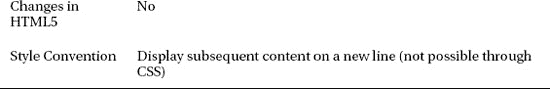

# 八、标记文本

我们将从大的结构化文档元素切换到更细粒度的元素:文本级元素(为简洁起见，为文本元素)。当你把这些元素添加到你的文本中，你就增加了结构和意义。当你学习本章中的例子时，这一点会变得很明显。

HTML5 规范明确指出，您应该只根据元素的语义值来使用元素。然而，为了使生活更容易，规范也清楚地表明，与这些元素相关的传统样式是某些元素语义的一部分。这有点瞎扯，但有助于保持与旧 HTML 版本的兼容性。

其中一些元素有非常具体的含义。例如，`cite`元素仅用于引用另一部作品的标题，如一本书或一部电影。然而，许多其他元素更加模糊，尽管 HTML5 标准的意图是，本质上与表示有关。

我的建议是采取务实的方法。首先，使用特定于任务的元素(如果有的话)。第二，考虑避免那些以前只是表示性的元素，以及那些在回顾中应用了语义的元素——比如`b`元素——并使用 CSS 来管理表示。最后，不管你选择使用哪种元素，都要在你的 HTML 中一致地使用它们。表 8-1 对本章进行了总结。

### 创建超链接

超链接是 HTML 中的一项重要功能，它为用户在同一文档内和跨页面浏览内容提供了基础。您使用`a`元素创建超链接，这在表 8-2 中进行了总结。

`a`元素定义了六个局部属性，如表 8-3 所述。这些属性中最重要的是`href`，您将在本节的后面看到。

#### 创建外部超链接

通过将`href`属性设置为以`http://`开头的 URL，可以创建指向其他 HTML 文档的超链接。当用户点击超链接时，浏览器将加载指定的页面。清单 8-1 显示了用于链接外部内容的`a`元素。

*清单 8-1。使用 a 元素链接到外部资源*

`<!DOCTYPE HTML>
<html>
    <head>
        <title>Example</title>
        <base href="http://titan/listings/"/>
        <meta name="author" content="Adam Freeman"/>
        <meta name="description" content="A simple example"/>
        <link rel="shortcut icon" href="favicon.ico" type="image/x-icon" />
    </head>
    <body>
        I like **<a href="http://en.wikipedia.org/wiki/Apples">apples</a>** and
        <a href="http://en.wikipedia.org/wiki/Orange_(fruit)">oranges</a>.
    </body>
</html>`

在这个例子中，我创建了两个链接到维基百科文章的`a`元素。单击任一链接都会加载适当的文章并显示给用户。你可以在图 8-1 中看到超链接的默认样式约定。

*图 8-1。超链接的默认外观*

不是所有的 URL 都必须指向其他网页。虽然`http`协议是最广泛使用的 URL 形式，但浏览器也支持其他协议，如`https`和`ftp`。如果要引用电子邮件地址，可以使用`mailto`协议；例如，`mailto:adam@mydomain.com`。

 **提示**您可以使用`a`元素创建基于图像的超链接(用户点击图像而不是文本来跟随超链接)。这需要使用`img`元素。你可以在第十五章中找到`img`元素的细节和一个基于图像的超链接的演示。

#### 创建相对 URL

如果`href`属性的值不是以一个可识别的协议开始的，比如`http://s`，那么浏览器会将超链接视为一个相对引用。默认情况下，这意味着浏览器假定目标资源与当前文档位于同一位置。清单 8-2 给出了一个相对 URL 的例子。

*清单 8-2。在超链接中使用相对 URL*

`<!DOCTYPE HTML>
<html>
    <head>
        <title>Example</title>
        <base href="http://titan/listings/"/>
        <meta name="author" content="Adam Freeman"/>
        <meta name="description" content="A simple example"/>
        <link rel="shortcut icon" href="favicon.ico" type="image/x-icon" />
    </head>
    <body>
        I like <a href="http://en.wikipedia.org/wiki/Apples">apples</a> and
        <a href="http://en.wikipedia.org/wiki/Orange_(fruit)">oranges</a>.
        You can see other fruits I like **<a href="fruitlist.html">here</a>**.
    </body>
</html>`

在这个例子中，我已经将属性`href`的值设置为`fruitlist.html`。当用户单击链接时，浏览器使用当前文档的 URL 来确定如何加载链接的页面。以为例，如果当前文档是从`[`www.mydomain.com/docs/example.html`](http://www.mydomain.com/docs/example.html)`加载的，那么浏览器将从`[`www.mydomain.com/doc.fruitlist.html`](http://www.mydomain.com/doc.fruitlist.html)`加载目标页面。

 **提示**你可以覆盖这个默认行为，通过`base`元素提供一个可选的基本 URL，我在第七章中描述过。

#### 创建内部超链接

您可以创建超链接，将另一个元素显示在浏览器窗口中。你可以使用 CSS 样式的 ID 选择器`#<id>`来完成，如清单 8-3 中的所示。

*清单 8-3。创建内部超链接*

`<!DOCTYPE HTML>
<html>
    <head>
        <title>Example</title>
        <meta name="author" content="Adam Freeman"/>
        <meta name="description" content="A simple example"/>
        <link rel="shortcut icon" href="favicon.ico" type="image/x-icon" />
    </head>
    <body>
        I like <a href="http://en.wikipedia.org/wiki/Apples">apples</a> and
        <a href="http://en.wikipedia.org/wiki/Orange_(fruit)">oranges</a>.
        You can see other fruits I like **<a href="#fruits">**here</a>.

        

            I also like bananas, mangoes, cherries, apricots, plums, peaches and grapes.
        

    </body>
</html>`

我已经用`#fruits`的`href`值创建了一个超链接。当用户单击链接时，浏览器将在文档中查找一个元素，该元素的`id`属性的值为`fruits`。如果元素在屏幕上不可见，浏览器将滚动文档使其可见。

 **提示**如果浏览器找不到具有所需`id`属性值的元素，就会再次搜索，寻找与目标匹配的`name`属性。

#### 以浏览上下文为目标

属性让你告诉浏览器你想要链接的资源显示在哪里。默认情况下，浏览器使用显示当前文档的窗口、选项卡或框架，这意味着新文档将替换现有文档。然而，你还有其他选择。表 8-4 描述了`target`属性支持的值。

这些值中的每一个都代表一个*浏览上下文*。`_blank`和`_self`值是不言而喻的；其他的与框架的使用有关，我会在第十五章中解释。

### 用基本文本元素注释内容

您将看到的第一组文本元素已经在 HTML 中出现了一段时间。其中一些元素在过去代表文本格式，但是随着 HTML 的发展，表示从更广泛的语义中分离出来意味着它们现在有了更广泛的意义。

#### 表示关键词和产品名称

元素用于偏移一段文本，但不表示任何额外的强调或重要性。HTML5 规范中给出的例子是文档摘要中的关键字和评论中的产品名称。表 8-5 描述了`b`元素。

`b`元素非常简单:包含在开始和结束标签之间的内容从周围的内容偏移。您通常会用粗体显示内容，但是您可以使用 CSS 来改变应用于`b`元素的样式。清单 8-4 展示了使用中的`b`元素。

*清单 8-4。使用 b 元素*

`<!DOCTYPE HTML>
<html>
    <head>
        <title>Example</title>
        <base href="http://titan/listings/"/>
        <meta name="author" content="Adam Freeman"/>
        <meta name="description" content="A simple example"/>
        <link rel="stylesheet" type="text/css" href="styles.css"/>
        <link rel="shortcut icon" href="favicon.ico" type="image/x-icon" />
    </head>
    <body>
        I like **<b>apples</b>** and **<b>oranges</b>**.
    </body>
</html>`

你可以在图 8-2 的中看到`b`元素的默认样式约定。

*图 8-2。使用 b 元素*

#### 添加强调

元素代表一段带有强调重音的文本。你可以用它来给读者一种关于句子或段落意思的背景。我将按照描述`em`元素的表 8-6 向您展示这意味着什么。

*清单 8-5。使用 em 元素*

`<!DOCTYPE HTML>
<html>
    <head>
        <title>Example</title>
        <base href="http://titan/listings/"/>
        <meta name="author" content="Adam Freeman"/>
        <meta name="description" content="A simple example"/>
        <link rel="stylesheet" type="text/css" href="styles.css"/>
        <link rel="shortcut icon" href="favicon.ico" type="image/x-icon" />
    </head>
    <body>
        **<em>I</em>** like <b>apples</b> and <b>oranges</b>.
    </body>
</html>`

该元素的样式惯例是使用斜体，如图 8-3 中的所示。

*图 8-3。使用 em 元素*

在这个例子中，我把重音放在句子开头的 I 上。当考虑`em`元素时，大声朗读句子并考虑句子可能回答的问题会有所帮助。比如，想象一下，我问:“谁喜欢苹果和橘子？”你的回答会是，“*我*喜欢苹果和橘子。”(当你大声朗读并把重点放在 *I* 上时，你就是在表明你是喜欢这些水果的人。)

但如果我问:“你喜欢苹果，还喜欢什么？”你可能会回答:“我喜欢苹果和橙子。“在这种情况下，你的重点应该放在最后一个词上，强调橙子是你喜欢的另一种水果。您可以用 HTML 来表示这种变化，如下所示:

`I like apples and **<em>**oranges**</em>**.`

#### 表示外国或技术术语

`i`元素表示与周围内容性质不同的文本范围。这是一个相当宽松的定义，但常见的例子包括来自其他语言的单词，一个技术或科学术语，甚至一个人的思想(相对于语音)。表 8-7 描述了`i`元素。

清单 8-6 展示了使用中的`i`元素。

*清单 8-6。使用 I 元素*

`<!DOCTYPE HTML>
<html>
    <head>
        <title>Example</title>
        <base href="http://titan/listings/"/>
        <meta name="author" content="Adam Freeman"/>
        <meta name="description" content="A simple example"/>
        <link rel="stylesheet" type="text/css" href="styles.css"/>
        <link rel="shortcut icon" href="favicon.ico" type="image/x-icon" />
    </head>
    <body>
        <em>I</em> like <b>apples</b> and <b>oranges</b>.
        My favorite kind of orange is the mandarin, properly known
        as **<i>citrus reticulata</i>**.
    </body>
</html>`

你可以在图 8-4 中看到`i`元素的效果。注意，`i`元素的样式约定与`em`元素的相同。这是一个很好的例子，说明了一个元素的含义与其外观是如何不同的。

*图 8-4。使用 I 元素*

#### 显示错误或改正

使用`s`元素来表示不再正确或准确的文本范围。样式约定是用一条穿过文本的线来显示文本。表 8-8 描述了`s`元素。

清单 8-7 展示了使用中的`s`元素。

*清单 8-7。使用 s 元素*

`<!DOCTYPE HTML>
<html>
    <head>
        <title>Example</title>
        <base href="http://titan/listings/"/>
        <meta name="author" content="Adam Freeman"/>
        <meta name="description" content="A simple example"/>
        <link rel="stylesheet" type="text/css" href="styles.css"/>
        <link rel="shortcut icon" href="favicon.ico" type="image/x-icon" />
    </head>
    <body>
        <em>I</em> like <b>apples</b> and <b>oranges</b>.
        My favorite kind of orange is the mandarin, properly known
        as <i>citrus reticulata</i>.
        Oranges at my local store cost **<s>$1 each</s>** $2 for 3.
    </body>
</html>`

你可以在图 8-5 中看到`s`元素的默认样式约定。

*图 8-5。使用 s 元素*

#### 表示重要的文本

元素表示一段重要的文本。表 8-9 描述了该元素。

清单 8-8 展示了使用中的`strong`元素。

*清单 8-8。使用强力元素*

`<!DOCTYPE HTML>
<html>
    <head>
        <title>Example</title>
        <base href="http://titan/listings/"/>`
`        <meta name="author" content="Adam Freeman"/>
        <meta name="description" content="A simple example"/>
        <link rel="stylesheet" type="text/css" href="styles.css"/>
        <link rel="shortcut icon" href="favicon.ico" type="image/x-icon" />
    </head>
    <body>
        I like apples and oranges.
        **<strong>Warning:</strong>** Eating too many oranges can give you heart burn.
    </body>
</html>`

我已经从前面的例子中删除了一些文本，使清单更容易阅读。你可以在图 8-6 中看到`strong`元素的默认样式约定。`strong`元素和`b`元素有相同的样式约定。然而，在标记你的内容时，选择正确的元素是很重要的；注意，`b`元素并没有赋予它所包含的文本任何重要性。

*图 8-6。使用强力元素*

#### 给文本加下划线

`u`元素从周围的内容中偏移一段文本，但并不意味着增加任何重要性或强调。这是一个模糊的描述，因为`u`元素以前只具有表示上的影响(给文本加下划线)而没有真正的语义意义。实际上，这仍然是一个表示元素，它的效果是给文本加下划线(虽然您可以使用 CSS 来改变这种行为，但我不建议以这种方式改变元素的用途；看看如何使用`span`元素)。表 8-10 总结了`u`要素。

`u`元素的样式约定类似于`a`元素的样式约定，这意味着用户经常会将带下划线的文本误认为是超链接。为了防止这种混淆，尽可能避免使用`u`元素。清单 8-9 显示了使用中的`u`元素。

*清单 8-9。使用 u 元素*

`<!DOCTYPE HTML>
<html>
    <head>
        <title>Example</title>
        <base href="http://titan/listings/"/>
        <meta name="author" content="Adam Freeman"/>
        <meta name="description" content="A simple example"/>
        <link rel="stylesheet" type="text/css" href="styles.css"/>
        <link rel="shortcut icon" href="favicon.ico" type="image/x-icon" />
    </head>
    <body>
        I like apples and oranges.
        <strong>Warning:</strong> Eating <u>too many</u> oranges can give you heart burn.
    </body>
</html>`

您可以在图 8-7 中看到浏览器如何使用默认样式惯例显示该元素。

*图 8-7。使用 u 元素*

#### 添加小字

`small`元素表示细则，通常用于免责声明和澄清。表 8-11 总结了`small`要素。

清单 8-10 展示了使用中的`small`元素。

*清单 8-10。使用小元素*

`<!DOCTYPE HTML>
<html>
    <head>
        <title>Example</title>
        <meta name="author" content="Adam Freeman"/>
        <meta name="description" content="A simple example"/>
        <link rel="shortcut icon" href="favicon.ico" type="image/x-icon" />
    </head>
    <body>
        Oranges at my local store are $1 each <small>(plus tax)</small>
    </body>
</html>`

你可以在图 8-8 中看到浏览器是如何应用默认样式约定的。

*图 8-8。使用小元素*

#### 添加上标和下标

使用`sub`和`sup`元素分别表示下标和上标。在一些语言中需要上标，并且在简单的数学表达式中使用上标和下标。表 8-12 总结了这些要素。

清单 8-11 显示了使用中的`sub`和`sup`元素。

*清单 8-11。使用 sub 和 sup 元素*

`<!DOCTYPE HTML>
<html>
    <head>
        <title>Example</title>`
`        <meta name="author" content="Adam Freeman"/>
        <meta name="description" content="A simple example"/>
        <link rel="shortcut icon" href="favicon.ico" type="image/x-icon" />
    </head>
    <body>
        The point x**10** is the 10**th** point.
    </body>
</html>`

你可以在图 8-9 中看到浏览器是如何应用默认样式约定的。

*图 8-9。使用 sub 和 sup 元素*

### 创建休息

有两个元素可以用来处理内容中的换行符:`br`和`wbr`元素。

#### 强制换行

元素引入了一个换行符。样式约定是将后续内容移到新的一行。表 8-13 总结了`br`要素。

清单 8-12 显示了使用中的`br`元素。

 **注意**`br`元素只能在换行符是内容的一部分时使用，如清单 8-12 中的所示。不得使用`br`元素创建段落或其他内容分组；我在第九章和第十章中描述了这项任务的其他要素。

*清单 8-12。使用 br 元素*

`<!DOCTYPE HTML>
<html>
    <head>
        <title>Example</title>
        <meta name="author" content="Adam Freeman"/>
        <meta name="description" content="A simple example"/>
        <link rel="shortcut icon" href="favicon.ico" type="image/x-icon" />
    </head>
    <body>        
        I WANDERED lonely as a cloud** **
        That floats on high o'er vales and hills,** **
        When all at once I saw a crowd,** **
        A host, of golden daffodils;
    </body>
</html>`

在图 8-10 中，你可以看到`br`元素的使用是如何使浏览器显示内容的。

*图 8-10。使用 br 元素*

#### 表示安全分割线的机会

`wbr`元素是 HTML5 中的新元素，它指示浏览器可以在何处插入换行符来换行大于当前浏览器窗口的内容。是浏览器决定是否实际使用了*换行符。`wbr`元素只是一个合适位置的指南。表 8-14 总结了`wbr`元素。*

 *

清单 8-13 展示了使用`wbr`元素来帮助浏览器显示一个长单词。

*清单 8-13。使用 wbr 元素*

`<!DOCTYPE HTML>
<html>
    <head>
        <title>Example</title>
        <meta name="author" content="Adam Freeman"/>
        <meta name="description" content="A simple example"/>
        <link rel="shortcut icon" href="favicon.ico" type="image/x-icon" />
    </head>
    <body>
        This is a very long word: Super**<wbr>**califragilistic**<wbr>**expialidocious.
        We can help the browser display long words with the <code>wbr</code> element.
    </body>
</html>`

要理解`wbr`元素的价值，您必须了解浏览器在使用和不使用该元素的情况下是如何操作的。图 8-11 显示了当`wbr`元素不存在时，浏览器如何处理内容。

*图 8-11。不带 wbr 元素的包装内容*

如果没有`wbr`元素，浏览器会遇到长单词，并将其视为一个单元。这意味着你在第一行文字的末尾浪费了大量的空间。如果你添加了`wbr`元素，如清单 8-13 所示，那么你给了浏览器更多的选项，如图 8-12 所示。

*图 8-12。用 wbr 元素包装内容*

使用`wbr`元素，浏览器能够将很长的单词视为一系列更小的片段，并且能够更优雅地包装内容。当您使用`wbr`元素时，您是在告诉浏览器在哪里断开一个单词最合适。

### 代表输入和输出

有四个元素暴露了 HTML 令人讨厌的起源。您使用这些元素来表示计算机的输入和输出。表 8-15 总结了这些要素。这些元素都没有定义本地属性，也没有在 HTML5 中新增或更改。

清单 8-14 展示了文档中使用的这四个元素。

*清单 8-14。使用代码、var、samp 和 kbd 元素*

`<!DOCTYPE HTML>
<html>
    <head>
        <title>Example</title>
        <meta name="author" content="Adam Freeman"/>
        <meta name="description" content="A simple example"/>
        <link rel="shortcut icon" href="favicon.ico" type="image/x-icon" />
    </head>
    <body>
        

        **<code>var fruits = ["apples", "oranges", "mangoes", "cherries"]; **
            **document.writeln("I like " + fruits.length + " fruits");</code>**
        

        
The variable in this example is **<var>fruits</var>**

        
The output from the code is: **<samp>I like 4 fruits</samp>**

        
When prompted for my favorite fruit, I typed: **<kbd>cherries</kbd>**
    </body>
</html>`

你可以在图 8-13 中看到这些元素的默认样式约定。请注意，其中三个元素具有相同的样式约定。我已经使用了`p`元素来给内容添加一些结构(我在第九章中描述了`p`元素)。

*图 8-13。使用代码、var、samp 和 kbd 元素*

### 创建引用、引述、定义和缩写

接下来您将看到的四个元素允许您表示引用、引用、定义和缩写。这些在科学和学术文献中被广泛使用。

#### 表示缩写

元素允许你表示一个缩写。当使用这个元素时，使用`title`属性来提供缩写代表的扩展文本。表 8-16 总结了这一要素。

清单 8-15 显示了使用中的`abbr`元素。

*清单 8-15。使用缩写元素*

`<!DOCTYPE HTML>
<html>
    <head>
        <title>Example</title>
        <meta name="author" content="Adam Freeman"/>
        <meta name="description" content="A simple example"/>
        <link rel="shortcut icon" href="favicon.ico" type="image/x-icon" />
    </head>
    <body>
        I like apples and oranges.
        The **<abbr title="Florida Department of Citrus">FDOC</abbr>** regulates the Florida
        citrus industry.
    </body>
</html>`

`abbr`元素没有样式约定，因此该元素中包含的内容不会以任何方式偏移。

#### 定义术语

`dfn`元素表示一个术语的定义实例。这是解释一个单词或短语的意义或重要性的例子。表 8-17 总结了这一要素。

关于如何使用`dfn`元素有一些规则。如果`dfn`元素有一个标题属性，那么`title`属性的值必须是被定义的术语。你可以在清单 8-16 中看到一个这样使用`dfn`元素的例子。

*清单 8-16。使用 dfn 元素*

`<!DOCTYPE HTML>
<html>
    <head>
        <title>Example</title>
        <meta name="author" content="Adam Freeman"/>
        <meta name="description" content="A simple example"/>
        <link rel="shortcut icon" href="favicon.ico" type="image/x-icon" />
    </head>
    <body>
        I like apples and oranges.
        The <abbr title="Florida Department of Citrus">FDOC</abbr> regulates the Florida
        citrus industry.

        

            The **<dfn title="apple">apple</dfn>** is the pomaceous fruit of the apple tree,
            species Malus domestica in the rose family.
        

    </body>
</html>`

如果`dfn`元素包含一个`abbr`元素，那么缩写就是被定义的术语。如果没有`title`属性，并且元素的内容是文本，那么文本代表被定义的术语。没有与该元素相关联的样式约定，因此该元素的内容不会以任何方式偏移。

#### 引用其他来源的内容

`q`元素表示从另一个来源引用的内容。表 8-18 总结了`q`要素。

上一节中*苹果*这个词的定义来自维基百科，应该正确归属。`cite`属性用于指定源文档的 URL，如清单 8-17 所示。

*清单 8-17。使用 q 元素*

`<!DOCTYPE HTML>
<html>
    <head>
        <title>Example</title>
        <meta name="author" content="Adam Freeman"/>
        <meta name="description" content="A simple example"/>
        <link rel="shortcut icon" href="favicon.ico" type="image/x-icon" />
    </head>
    <body>
        I like apples and oranges.
        The <abbr title="Florida Department of Citrus">FDOC</abbr> regulates the Florida
        citrus industry.
        

            **<q cite="http://en.wikipedia.org/wiki/Apple">The**
            **<dfn title="apple">apple</dfn> is the pomaceous fruit of the apple tree,**
            **species Malus domestica in the rose family.</q>**
        

    </body>
</html>`

这里，`q`元素的样式约定使用 CSS `:before`和`:after`伪元素选择器将引用的文本用引号括起来，如图 8-14 中的所示。你可以在第十七章和第十八章中了解伪元素选择器。

*图 8-14。使用 q 元素*

#### 引用另一部作品的标题

`cite`元素表示被引用作品的标题，比如一本书、一篇文章、一部电影或一首诗。表 8-19 总结了`cite`要素。

清单 8-18 展示了`cite`元素的使用。

*清单 8-18。使用引用元素*

`<!DOCTYPE HTML>
<html>
    <head>`
`        <title>Example</title>
        <meta name="author" content="Adam Freeman"/>
        <meta name="description" content="A simple example"/>
        <link rel="shortcut icon" href="favicon.ico" type="image/x-icon" />
    </head>
    <body>
        I like apples and oranges.
        The <abbr title="Florida Department of Citrus">FDOC</abbr> regulates the Florida
        citrus industry.
        

            <q cite="http://en.wikipedia.org/wiki/Apple">The
            <dfn title="apple">apple</dfn> is the pomaceous fruit of the apple tree,
            species Malus domestica in the rose family.</q>
        

        My favorite book on fruit is **<cite>Fruit: Edible, Inedible, Incredible</cite>**
        by Stuppy & Kesseler
    </body>
</html>`

你可以在图 8-15 中看到默认样式约定的应用。

*图 8-15。使用引用元素*

### 使用语言元素

有五个 HTML 元素，其中四个是 HTML5 中的新元素，为使用非西方语言提供支持。以下部分描述了这些元素。

#### 红宝石、rt 和 rp 元素

拼音字符是位于徽标语言(如中文或日文)中字符上方或右侧的符号，有助于读者正确发音。`ruby`元素表示包含红宝石的文本范围。表 8-20 总结了这一要素。

将`ruby`元素与`rt`和`rp`元素结合使用，这在 HTML5 中也是新的。`rt`元素标记 ruby 符号，`rp`元素表示注释周围的括号，可以由不支持 ruby 注释的浏览器显示。

我不会说任何标识语，这意味着我没有使用标识语创建示例的基础。在这一节中，我能做的最好的事情就是使用英文文本来演示浏览器是如何显示 ruby 注释的。清单 8-19 包含了这样一个注释。

*清单 8-19。使用 ruby、rt 和 rp 元素*

`<!DOCTYPE HTML>
<html>
    <head>
        <title>Example</title>
        <meta name="author" content="Adam Freeman"/>
        <meta name="description" content="A simple example"/>
        <link rel="shortcut icon" href="favicon.ico" type="image/x-icon" />
    </head>
    <body>
        I like apples and oranges.
        The <abbr title="Florida Department of Citrus">FDOC</abbr> regulates the Florida
        citrus industry.
        

            <q cite="http://en.wikipedia.org/wiki/Apple">The
            <dfn title="apple">apple</dfn> is the pomaceous fruit of the apple tree,
            species Malus domestica in the rose family.</q>
        

        
`
`            Oranges are often made
            into**<ruby> OJ <rp>(</rp><rt>Orange Juice</rt><rp>)</rp></ruby>**
        

    </body>
</html>`

当文档在支持 ruby 批注的浏览器中显示时，`rp`元素及其内容被忽略，`rt`元素的内容显示为批注，如图图 8-16 所示。

*图 8-16。使用 ruby、rt 和 rp 元素*

如果在不支持 ruby 注释的浏览器中显示文档，则会显示`rp`和`rt`元素的内容。在我写这一章的时候，Firefox 不支持 ruby 注释；你可以在图 8-17 中看到它将如何显示内容。

*图 8-17。不支持注释的浏览器中的红宝石*

#### bdo 元素

`bdo`元素为其内容指定了明确的文本方向，覆盖了通常应用的自动方向。表 8-21 总结了`bdo`要素。

您必须使用带有`dir`属性的`bdo`元素，该属性具有允许的值`rtl`(用于从右向左布局)和`ltr`(用于从左向右布局)。清单 8-20 显示了使用中的`bdo`元素。

*清单 8-20。使用 bdo 元素*

`<!DOCTYPE HTML>
<html>
    <head>
        <title>Example</title>
        <meta name="author" content="Adam Freeman"/>
        <meta name="description" content="A simple example"/>
        <link rel="shortcut icon" href="favicon.ico" type="image/x-icon" />
    </head>
    <body>
        I like apples and oranges.
        The <abbr title="Florida Department of Citrus">FDOC</abbr> regulates the Florida
        citrus industry.
        

            This is left-to-right: **<bdo dir="ltr">I like oranges</bdo>**
        

        

            This is right-to-left: **<bdo dir="rtl">I like oranges</bdo>**
        

    </body>
</html>`

你可以在图 8-18 中看到浏览器如何显示该元素的内容。

*图 8-18。使用 bdo 元素*

#### BDI 元素

`bdi`元素表示出于文本方向性的目的而与其他内容隔离的文本范围。表 8-22 总结了这一要素。

当显示没有方向信息的内容时，可以使用此元素。发生这种情况时，浏览器会自动确定方向，这可能会打乱页面的格式。清单 8-21 给出了一个简单的例子。

*清单 8-21。处理没有 bdi 元素的文本*

`<!DOCTYPE HTML>
<html>
    <head>
        <title>Example</title>
        <meta name="author" content="Adam Freeman"/>
        <meta name="description" content="A simple example"/>
        <meta charset="utf-8"/>
        <link rel="shortcut icon" href="favicon.ico" type="image/x-icon" />
    </head>
    <body>
        I like apples and oranges.

        Here are some users and the fruit they purchased this week:

        
Adam: 3 applies and 2 oranges

        
: 2 apples

        
Joe: 6 apples

    </body>
</html>`

当您显示该文档时，阿拉伯名字会导致浏览器中的文本方向性算法在名字前而不是名字后显示数字`2`，如图 8-19 中的所示。

*图 8-19。混合格式时双向文本算法的效果*

你可以使用`bdi`元素来解决这个问题，如清单 8-22 中的所示。

*清单 8-22。使用 bdi 元素*

`<!DOCTYPE HTML>
<html>
    <head>
        <title>Example</title>
        <meta name="author" content="Adam Freeman"/>
        <meta name="description" content="A simple example"/>
        <meta charset="utf-8"/>`
`        <link rel="shortcut icon" href="favicon.ico" type="image/x-icon" />
    </head>
    <body>
        I like apples and oranges.

        Here are some users and the fruit they purchased this week:

        
**<bdi>Adam</bdi>**: 3 applies and 2 oranges

        
**<bdi>****</bdi>** : 2 apples

        
**<bdi>Joe</bdi>**: 6 apples

    </body>
</html>`

你可以在图 8-20 中看到这个元素的矫正效果。

*图 8-20。使用 bdi 元素*

### 包装:其他文本元素

还有另外四个元素不能完全归入其他组。我将在下面的章节中描述它们。

#### 表示内容的一般范围

元素本身没有任何意义。您可以使用它将一个全局属性应用到一个内容区域。表 8-23 总结了`span`要素。

清单 8-23 显示了与`class`属性一起使用的`span`元素，这样我就可以用 CSS 样式来定位内容。

*清单 8-23。使用跨度元件*

`<!DOCTYPE HTML>
<html>
    <head>
        <title>Example</title>
        <meta name="author" content="Adam Freeman"/>
        <meta name="description" content="A simple example"/>
        <link rel="shortcut icon" href="favicon.ico" type="image/x-icon" />
        
    </head>
    <body>
        I like **apples** and **oranges**.
    </body>
</html>`

你可以在图 8-21 中看到样式的应用。

*图 8-21。使用 span 元素定位样式*

#### 高亮显示文本

元素对于 HTML5 来说是新的，它代表了一段文本，这段文本由于在另一个上下文中的相关性而被突出显示。表 8-24 总结了`mark`要素。

清单 8-24 展示了`mark`元素。

*清单 8-24。使用标记元素*

`<!DOCTYPE HTML>
<html>
    <head>
        <title>Example</title>
        <meta name="author" content="Adam Freeman"/>
        <meta name="description" content="A simple example"/>
        <link rel="shortcut icon" href="favicon.ico" type="image/x-icon" />
    </head>
    <body>

        Homophones are words which are pronounced the same, but have different spellings
        and meanings. For example:
        

            I would like a **<mark>pair</mark>** of **<mark>pears</mark>**
        

    </body>
</html>`

你可以在图 8-22 中看到样式约定。

*图 8-22。使用标记元素*

#### 表示增加或删除的内容

您可以使用`ins`和`del`元素来表示文档中添加或删除的文本。`ins`元素表示插入的内容，汇总在表 8-25 中。

您使用`del`元素表示已从文档中删除的文本，该元素总结在表 8-26 中。

`ins`和`del`元素定义了相同的局部属性。`cite`属性指定了一个文档的 URL，该文档解释了为什么添加或删除文本，而`datetime`属性指定了修改的时间。你可以在清单 8-25 的中看到正在使用的`ins`和`del`元素。

*清单 8-25。使用 del 和 ins 元素*

`<!DOCTYPE HTML>
<html>
    <head>
        <title>Example</title>
        <meta name="author" content="Adam Freeman"/>
        <meta name="description" content="A simple example"/>
        <link rel="shortcut icon" href="favicon.ico" type="image/x-icon" />
    </head>
    <body>

        Homophones are words which are pronounced the same, but have different spellings
        and meanings. For example:
        

            I would like a <mark>pair</mark> of <mark>pears</mark>
        

        

            **<del>I can <mark>sea</mark> the <mark>see</mark></del>**`
`            **<ins>I can <mark>see</mark> the <mark>sea</mark></ins>**
        

    </body>
</html>`

默认样式惯例如图 8-23 所示。

*图 8-23。使用 ins 和 del 元素*

#### 表示时间和日期

您使用`time`元素来表示一天中的时间或日期。表 8-27 总结了`time`要素。

如果布尔型的`pubdate`属性存在，那么`time`元素被假定为整个 HTML 文档的出版日期或者最近的`article`元素(我在第十章中描述了`article`元素)。`datetime`属性以 RFC3339 指定的格式指定日期或时间，这可以在`[`tools.ietf.org/html/rfc3339`](http://tools.ietf.org/html/rfc3339)`找到。使用`datetime`属性意味着您可以在元素中以人类可读的形式指定日期，并且仍然确保计算机可以明确地解析日期或时间。清单 8-26 显示了使用中的`time`元素。

*清单 8-26。使用时间元素*

`<!DOCTYPE HTML>
<html>
    <head>
        <title>Example</title>
        <meta name="author" content="Adam Freeman"/>
        <meta name="description" content="A simple example"/>
        <link rel="shortcut icon" href="favicon.ico" type="image/x-icon" />
    </head>
    <body>        
        I still remember the best apple I ever tasted.
        I bought it at **<time datetime="15:00">3 o'clock</time>**
        on **<time datetime="1984-12-7">December 7th</time>**.
    </body>
</html>`

### 总结

在这一章中，我带你浏览了文本元素——那些你用来给你的内容赋予结构和意义的元素。这些元素从基本的到复杂的都有，您可以看到在 HTML5 中将意义从表示中分离出来的愿望和保持与 HTML4 兼容的愿望之间的矛盾。

请确保您选择的文本元素是基于它们的含义，而不是与它们相关联的默认样式约定。您可以以意想不到的方式将 CSS 样式应用于您的内容，如果您没有正确一致地标记您的内容，用户将会得到奇怪的结果。*