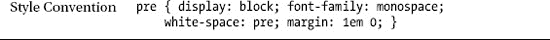
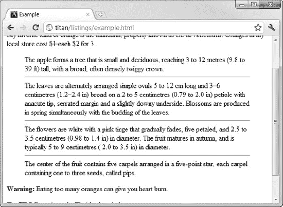

# 九、分组内容

在这一章中，我描述了可以用来将相关内容组合在一起的 HTML 元素，这将为文档中的内容增加更多的结构和意义。本章中的元素主要是流程元素。有一个例外:`a`元素，其元素类别的区别是由它包含的内容决定的。表 9-1 对本章进行了总结。

### 了解分组内容的需求

HTML 要求浏览器将多个空白字符折叠成一个空格。这通常是一个有用的特性，因为它将 HTML 文档的布局与浏览器窗口中的内容布局分开。清单 9-1 显示了比我迄今为止在示例中使用的内容块更长的内容。

*清单 9-1。HTML 文档中较长的内容部分*

`<!DOCTYPE HTML>
<html>
    <head>
        <title>Example</title>
        <meta name="author" content="Adam Freeman"/>
        <meta name="description" content="A simple example"/>
        <link rel="shortcut icon" href="favicon.ico" type="image/x-icon" />
    </head>
    <body>

        I like apples and oranges.

        I also like bananas, mangoes, cherries, apricots, plums, peaches and grapes.
        You can see other fruits I like <a href="fruitlist.html">here</a>.

        <strong>Warning:</strong> Eating too many oranges can give you heart burn.

        My favorite kind of orange is the mandarin, properly known
            as <i>citrus reticulata</i>.
        Oranges at my local store cost <s>$1 each</s> $2 for 3.        

        The <abbr title="Florida Department of Citrus">FDOC</abbr> regulates the Florida
            citrus industry.

        I still remember the best apple I ever tasted.
        I bought it at <time datetime="15:00">3 o'clock</time>
            on <time datetime="1984-12-7">December 7th</time>.
    </body>
</html>`

`body`元素中的文本跨越多行。其中一些行是缩进的，并且在各组行之间有换行符。浏览器将忽略所有这些结构并将所有内容显示为一行，如图 9-1 所示。

*图 9-1。浏览器折叠 HTML 文档中的空白*

以下各节中的元素将帮助您通过将相关的内容区域组合在一起，为文档添加结构。对内容进行分组有许多不同的方法，从简单的段落到复杂的列表。

### 创建段落

元素代表一个段落。段落是包含一个或多个相关句子的文本块，用来表达一个观点或想法。段落也可以由陈述不同观点，但分享一些共同主题的句子组成。表 9-2 总结了`p`要素。

清单 9-2 展示了`p`元素在示例内容中的应用。

*清单 9-2。使用 p 元素*

`<!DOCTYPE HTML>
<html>
    <head>
        <title>Example</title>
        <meta name="author" content="Adam Freeman"/>
        <meta name="description" content="A simple example"/>
        <link rel="shortcut icon" href="favicon.ico" type="image/x-icon" />
    </head>
    <body>
       **
**I like apples and oranges.

        I also like bananas, mangoes, cherries, apricots, plums, peaches and grapes.
        You can see other fruits I like <a href="fruitlist.html">here</a>.**
**

        **
**<strong>Warning:</strong> Eating too many oranges can give you heart burn.**
**

        **
**My favorite kind of orange is the mandarin, properly known
            as <i>citrus reticulata</i>.
        Oranges at my local store cost <s>$1 each</s> $2 for 3.**
**

        **
**The <abbr title="Florida Department of Citrus">FDOC</abbr> regulates the
            Florida citrus industry.**
**

        **
**I still remember the best apple I ever tasted.
        I bought it at <time datetime="15:00">3 o'clock</time>
            on <time datetime="1984-12-7">December 7th</time>.**
**
    </body>
</html>`

我在`body`元素中添加了一些`p`元素，将相关的句子组合在一起，并赋予内容一些结构。一个`p`元素中的多个空格仍然被折叠成一个字符，如图 9-2 中的所示。

*图 9-2。p 元素的作用*

### 使用 div 元素

元素没有特定的含义。当其他 HTML 元素不足时，您可以使用它来创建结构并赋予内容以意义。通过应用全局属性(在第三章中描述)，通常是`class`或`id`属性来添加这个含义。表 9-3 总结了`div`要素。

 **注意**只有当那些具有语义意义的元素不合适时，才应该使用`div`元素。在使用 div 元素之前，考虑使用新的 HTML5 元素，比如`article`和`section`(在第十章中描述)。`div`本身没有什么问题，但是您应该尽可能在 HTML5 文档中包含语义信息。

`div`元素相当于`span`元素的流量。它是一个没有特定含义的元素，因此可用于向文档添加定制的结构。创建自定义结构的问题在于，其意义是特定于您的 web 页面或 web 应用的，而对其他人来说并不明显。当您的 HTML 由第三方处理或设计时，这可能会有问题。清单 9-3 显示了使用中的`div`元素。

*清单 9-3。使用 div 元素*

`<!DOCTYPE HTML>
<html>
    <head>
        <title>Example</title>
        <meta name="author" content="Adam Freeman"/>
        <meta name="description" content="A simple example"/>
        <link rel="shortcut icon" href="favicon.ico" type="image/x-icon" />
        ****
    </head>
    <body>

        **
**

        
I like apples and oranges.

        I also like bananas, mangoes, cherries, apricots, plums, peaches and grapes.
        You can see other fruits I like <a href="fruitlist.html">here</a>.

        
My favorite kind of orange is the mandarin, properly known`
`            as <i>citrus reticulata</i>.
        Oranges at my local store cost <s>$1 each</s> $2 for 3.

        **
**

        
<strong>Warning:</strong> Eating too many oranges can give you heart burn.

        
The <abbr title="Florida Department of Citrus">FDOC</abbr> regulates the
            Florida citrus industry.

        
I still remember the best apple I ever tasted.
        I bought it at <time datetime="15:00">3 o'clock</time>
            on <time datetime="1984-12-7">December 7th</time>. 

    </body>
</html>`

在这个例子中，我展示了`div`元素的一个稍微不同的用法，那就是将不同类型的多个元素组合在一起，这样它们就可以保持一致的样式。我本可以为包含在`div`中的两个`p`元素添加一个 class 属性，但是这种方法可能更简单，并且依赖于样式的继承方式(如第四章中所述)。

### 使用预格式化的内容

`pre`元素允许你改变浏览器处理内容的方式，这样空格就不会被折叠，格式也会被保留。当一部分内容的原始格式很重要时，这可能很有用。但是，不应该使用这个元素，因为它会破坏使用元素和样式来控制表示的灵活性。表 9-4 总结了`pre`要素。

当与`code`元素一起使用时，`pre`元素会特别有用。例如，编程语言中的格式通常很重要，您不希望使用元素重新创建该格式。清单 9-4 展示了使用中的`pre`元素。

*清单 9-4。使用前置元素*

`<!DOCTYPE HTML>
<html>
    <head>
        <title>Example</title>
        <meta name="author" content="Adam Freeman"/>
        <meta name="description" content="A simple example"/>
        <link rel="shortcut icon" href="favicon.ico" type="image/x-icon" />
        
    </head>
    <body>

        **<pre><code>**
    **var fruits = ["apples", "oranges", "mangoes", "cherries"];**
    **for (var i = 0; i < fruits.length; i++) {**
        **document.writeln("I like " + fruits[i]);**
    **}**
        **</code></pre>**

        

        
I like apples and oranges.

        I also like bananas, mangoes, cherries, apricots, plums, peaches and grapes.
        You can see other fruits I like <a href="fruitlist.html">here</a>.

        
My favorite kind of orange is the mandarin, properly known
            as <i>citrus reticulata</i>.
        Oranges at my local store cost <s>$1 each</s> $2 for 3.

        

    </body>
</html>`

在清单 9-4 中，我在一些 JavaScript 代码中使用了`pre`元素。这段代码不会被执行，因为它不在`script`元素中，但是代码的格式将被保留。浏览器不会做任何事情来重新格式化`pre`元素中的内容，这意味着每行的前导空格或制表符将显示在浏览器窗口中。这就是为什么`pre`元素中的各个语句没有缩进以匹配 HTML 文档的结构。你可以在图 9-3 中看到浏览器如何显示格式化的内容。

*图 9-3。显示带有前置元素*的预格式化内容

### 从其他来源引用

`blockquote`元素表示从另一个来源引用的内容块。该元素的目的类似于第八章的中描述的`q`元素，但通常适用于大量引用的内容。表 9-5 总结了`blockquote`元素。

属性可以用来提供内容原始来源的 URL，如清单 9-5 所示。

*清单 9-5。使用 blockquote 元素*

`<!DOCTYPE HTML>
<html>
    <head>
        <title>Example</title>
        <meta name="author" content="Adam Freeman"/>
        <meta name="description" content="A simple example"/>
        <link rel="shortcut icon" href="favicon.ico" type="image/x-icon" />
    </head>
    <body>

        
I like apples and oranges.

        I also like bananas, mangoes, cherries, apricots, plums, peaches and grapes.
        You can see other fruits I like <a href="fruitlist.html">here</a>.

        
My favorite kind of orange is the mandarin, properly known
            as <i>citrus reticulata</i>.
        Oranges at my local store cost <s>$1 each</s> $2 for 3.

        **<blockquote cite="http://en.wikipedia.org/wiki/Apple">**
        **The apple forms a tree that is small and deciduous, reaching 3 to 12 metres**
        **(9.8 to 39 ft) tall, with a broad, often densely twiggy crown.**
        **The leaves are alternately arranged simple ovals 5 to 12 cm long and 3–6**
        **centimetres (1.2–2.4 in) broad on a 2 to 5 centimetres (0.79 to 2.0 in) petiole**
        **with anacute tip, serrated margin and a slightly downy underside. Blossoms are**
        **produced in spring simultaneously with the budding of the leaves.**
        **The flowers are white with a pink tinge that gradually fades, five petaled,**
        **and 2.5 to 3.5 centimetres (0.98 to 1.4 in) in diameter.**
        **The fruit matures in autumn, and is typically 5 to 9 centimetres (**
        **2.0 to 3.5 in) in diameter.**
        **The center of the fruit contains five carpels arranged in a five-point star,**
        **each carpel containing one to three seeds, called pips.</blockquote>**

        
<strong>Warning:</strong> Eating too many oranges can give you heart burn.

        
The <abbr title="Florida Department of Citrus">FDOC</abbr> regulates the
            Florida citrus industry.
`
`            
        
I still remember the best apple I ever tasted.
        I bought it at <time datetime="15:00">3 o'clock</time>
            on <time datetime="1984-12-7">December 7th</time>. 

    </body>
</html>`

你可以在图 9-4 中看到浏览器如何应用样式约定。

*图 9-4。使用 blockquote 元素*

 **提示**你可以在图 9-4 中看到浏览器忽略了`blockquote`元素中的任何格式。您可以通过添加其他分组元素来为引用的内容添加结构，如`p`或`hr`(如下例所示)。

### 添加专题休息

`hr`元素表示段落级别的主题中断。这是另一个奇怪的术语，它产生于将语义和表示分开的需要。在 HTML4 中，`hr`元素代表一条水平线(字面意思是页面上的一条线)。在 HTML5 中，`hr`元素代表一个独立但相关的主题。HTML5 中的样式约定是页面上的一条线。表 9-6 总结了`hr`要素。

HTML5 规范对于什么构成了对`hr`元素的有效使用有些模糊，但是给出了两个例子:故事中的场景变化，或者参考书中某个章节中另一个主题的过渡。清单 9-6 显示了应用于内容的`hr`元素。

*清单 9-6。使用 hr 元素*

`<!DOCTYPE HTML>
<html>
    <head>
        <title>Example</title>
        <meta name="author" content="Adam Freeman"/>
        <meta name="description" content="A simple example"/>`
`        <link rel="shortcut icon" href="favicon.ico" type="image/x-icon" />
    </head>
    <body>

        
I like apples and oranges.

        I also like bananas, mangoes, cherries, apricots, plums, peaches and grapes.
        You can see other fruits I like <a href="fruitlist.html">here</a>.

        
My favorite kind of orange is the mandarin, properly known
            as <i>citrus reticulata</i>.
        Oranges at my local store cost <s>$1 each</s> $2 for 3.

        <blockquote cite="http://en.wikipedia.org/wiki/Apple">
        The apple forms a tree that is small and deciduous, reaching 3 to 12 metres
        (9.8 to 39 ft) tall, with a broad, often densely twiggy crown.
        **
**
        The leaves are alternately arranged simple ovals 5 to 12 cm long and 3–6
        centimetres (1.2–2.4 in) broad on a 2 to 5 centimetres (0.79 to 2.0 in) petiole
        with anacute tip, serrated margin and a slightly downy underside. Blossoms are
        produced in spring simultaneously with the budding of the leaves.
        **
**
        The flowers are white with a pink tinge that gradually fades, five petaled,
        and 2.5 to 3.5 centimetres (0.98 to 1.4 in) in diameter.
        The fruit matures in autumn, and is typically 5 to 9 centimetres (
        2.0 to 3.5 in) in diameter.
        **
**
        The center of the fruit contains five carpels arranged in a five-point star,
        each carpel containing one to three seeds, called pips.</blockquote>

        
<strong>Warning:</strong> Eating too many oranges can give you heart burn.

        
The <abbr title="Florida Department of Citrus">FDOC</abbr> regulates the
            Florida citrus industry.

        
I still remember the best apple I ever tasted.
        I bought it at <time datetime="15:00">3 o'clock</time>
            on <time datetime="1984-12-7">December 7th</time>. 

    </body>
</html>`

在这个例子中，我向一个`blockquote`添加了一些`hr`元素来增加一些结构。你可以在图 9-5 中看到这是如何影响 HTML 的默认外观的。

*图 9-5。将 hr 元素添加到 blockquote 元素*

### 将内容分组为列表

HTML 定义了许多可以用来创建内容项列表的元素。正如我在下面几节中所描述的，您可以创建有序的、无序的和描述性的列表。

#### ol 元素

`ol`元素表示有序列表。列表中的项目使用`li`元素表示，这将在下一节中描述。表 9-7 总结了`ol`元素。

清单 9-7 显示了用于创建简单有序列表的`ol`元素。

*清单 9-7。用 ol 元素创建一个简单的列表*

`<!DOCTYPE HTML>
<html>
    <head>
        <title>Example</title>
        <meta name="author" content="Adam Freeman"/>
        <meta name="description" content="A simple example"/>
        <link rel="shortcut icon" href="favicon.ico" type="image/x-icon" />
    </head>
    <body>

        I like apples and oranges.

        I also like:
        **<ol>**
            **<li>bananas</li>**
            **<li>mangoes</li>**
            **<li>cherries</li>**
            **<li>plums</li>**
            **<li>peaches</li>**
            **<li>grapes</li>**
        **</ol>**

        You can see other fruits I like <a href="fruitlist.html">here</a>.

    </body>
</html>`

你可以在图 9-6 中看到浏览器如何显示这个列表。

*图 9-6。简单有序列表*

您可以使用由`ol`元素定义的属性来控制列表中项目的管理方式。您使用`start`属性来定义列表中第一项的序数值。如果未定义该属性，则第一项被赋予序数值`1`。您使用`type`属性来指示哪个标记应该显示在每个项目的旁边。表 9-8 显示了该属性支持的值。

如果定义了`reversed`属性，那么列表按降序编号。然而，在我写这篇文章的时候，主流浏览器都没有实现`reversed`属性。

#### ul 元素

使用`ul`元素来表示无序列表。与`ol`元素一样，`ul`元素中的项目使用`li`元素表示，这将在下面描述。表 9-9 总结了`ul`元素。

`ul`元素包含许多`li`项。该元素没有定义任何属性，您可以使用 CSS 控制列表的显示。您可以在清单 9-8 的中看到使用的`ul`元素。

*清单 9-8。使用 ul 元素*

`<!DOCTYPE HTML>
<html>
    <head>
        <title>Example</title>
        <meta name="author" content="Adam Freeman"/>
        <meta name="description" content="A simple example"/>
        <link rel="shortcut icon" href="favicon.ico" type="image/x-icon" />
    </head>
    <body>

        I like apples and oranges.

        I also like:
        **<ul>**`
`            <li>bananas</li>
            <li>mangoes</li>
            <li>cherries</li>
            <li>plums</li>
            <li>peaches</li>
            <li>grapes</li>
        **</ul>**

        You can see other fruits I like <a href="fruitlist.html">here</a>.

    </body>
</html>`

每个列表项都显示有一个项目符号。您可以通过`list-style-type` CSS 属性来控制使用哪种样式的子弹，这在第二十四章中有描述。你可以在图 9-7 中看到默认的样式约定(使用`disc`项目符号样式)。

*图 9-7。应用于 ul 元素的样式约定*

#### 李元素

`li`元素表示列表中的一个项目。您可以将它与`ul`、`ol`和`menu`元素一起使用(主流浏览器尚不支持`menu`元素)。表 9-10 总结了`li`项。

`li`项很简单。它表示其父元素中的列表项。然而，你可以使用`value`属性来创建不连续的有序列表，如清单 9-9 所示。

*清单 9-9。创建不连续的有序列表*

`<!DOCTYPE HTML>
<html>
    <head>
        <title>Example</title>
        <meta name="author" content="Adam Freeman"/>
        <meta name="description" content="A simple example"/>
        <link rel="shortcut icon" href="favicon.ico" type="image/x-icon" />
    </head>
    <body>

        I like apples and oranges.

        I also like:
        <ol>
            <li>bananas</li>
            <li **value="4"**>mangoes</li>
            <li>cherries</li>
            <li **value="7"**>plums</li>
            <li>peaches</li>
            <li>grapes</li>
        </ol>

        You can see other fruits I like <a href="fruitlist.html">here</a>.

    </body>
</html>`

当浏览器遇到一个具有`value`属性的`li`元素时，列表项的计数器将被提升到属性值。你可以在图 9-8 中看到这个效果。

*图 9-8。创建非连续有序列表*

#### 创建描述列表

描述列表由一组术语/描述分组(即多个术语，每个术语都附有该术语的定义)组成。您使用三个元素来定义描述列表:`dl`、`dt`和`dd`元素。这些元素没有定义属性，在 HTML5 中也没有改变。表 9-11 总结了这些要素。

你可以在清单 9-10 中看到这些元素。注意，一个`dt`元素可以使用多个`dd`元素，这允许您为一个术语提供多个定义。

*清单 9-10。创建描述列表*

`<!DOCTYPE HTML>
<html>`
`    <head>
        <title>Example</title>
        <meta name="author" content="Adam Freeman"/>
        <meta name="description" content="A simple example"/>
        <link rel="shortcut icon" href="favicon.ico" type="image/x-icon" />
    </head>
    <body>

        I like apples and oranges.

        I also like:

        **<dl>**
            **<dt>Apple</dt>**
                **<dd>The apple is the pomaceous fruit of the apple tree</dd>**
                **<dd><i>Malus domestica</i></dd>**
            **<dt>Banana</dt>**
                **<dd>The banana is the parthenocarpic fruit of the banana tree</dd>**
                **<dd><i>Musa acuminata</i></dd>**
            **<dt>Cherry</dt>**
                **<dd>The cherry is the stone fruit of the genus <i>Prunus</i></dd>**
        **</dl>**

        You can see other fruits I like <a href="fruitlist.html">here</a>.
    </body>
</html>`

#### 创建自定义列表

HTML 对列表的支持比看起来更灵活。您可以使用`ul`元素结合 CSS 的两个特性来创建复杂的列表排列:`counter`特性和`:before`选择器。我在第十七章的中描述了`counter`特性和`:before`选择器(及其同伴`:after`)。在这一章中，我不想深入讨论 CSS，所以我给出这个例子作为一个独立的演示，当你阅读了本书后面的 CSS 章节，或者当你迫切需要一些高级列表时，你可以回头再看。清单 9-11 显示了一个包含两个嵌套列表的列表。所有三个列表都使用自定义值进行编号。

*清单 9-11。带有自定义计数器的嵌套列表*

`<!DOCTYPE HTML>
<html>
    <head>
        <title>Example</title>
        <meta name="author" content="Adam Freeman"/>
        <meta name="description" content="A simple example"/>
        <link rel="shortcut icon" href="favicon.ico" type="image/x-icon" />
        
    </head>
    <body>

        I like apples and oranges.

        I also like:

        **<ul id="outerlist" style="list-style-type: none">**
            **<li>bananas</li>**
            **<li>mangoes, including: </li>**
                **<ul class="innerlist">**
                    **<li>Haden mangoes</li>**
                    **<li>Keitt mangoes</li>**
                    **<li>Kent mangoes</li>**
                **</ul>**
            **<li>cherries</li>**
            **<li>plums, including:**
                **<ul class="innerlist">**
                    **<li>Elephant Heart plums</li>**
                    **<li>Stanley plums</li>**
                    **<li>Seneca plums</li>**
                **</ul>**
            **</li>**
            **<li>peaches</li>**
            **<li>grapes</li>**
        **</ul>**

        You can see other fruits I like <a href="fruitlist.html">here</a>.
    </body>
</html>`

你可以在图 9-9 中看到浏览器如何显示列表。

*图 9-9。使用 CSS 功能自定义列表*

在前面的例子中有一些事情需要注意。这个 HTML 文档中的所有列表都是无序的，并且是使用`ul`元素创建的。这样我就可以禁用标准项目符号(使用`list-style-type`属性)并依赖于由`:before`选择器生成的内容。

还要注意，外部列表(水果列表)的编号从`7`开始，并以`2`的步长递增。这是你不能用标准的`ol`元素来安排的。CSS `counter`特性使用起来有点笨拙，但是非常灵活。

最后要注意的一点是，内部列表(芒果和李子的品种)的编号是连续的。您可以通过使用`li`元素的`value`属性或者`ol`元素的`start`属性来实现类似的效果。然而，这两种方法都要求您事先知道您正在处理多少个列表项，这在处理 web 应用时并不总是可能的。

### 与数字打交道

最后一个分组元素与数字有关。HTML5 将图表定义为“一个内容单元，可选地带有一个标题，它是自包含的，通常作为一个单元从文档的主流程中引用，并且可以从文档的主流程中移出而不影响文档的含义。”这是一个相当普遍的定义，可以比传统的图形概念应用得更广泛，传统的图形概念是某种形式的说明或图表。您使用`figure`元素定义图形，该元素在表 9-12 中进行了总结。

`figure`元素可以有选择地包含一个`figcaption`元素，它表示图的标题。表 9-13 总结了`figcaption`要素。

你可以在清单 9-12 中看到一起使用的`figure`和`figcaption`元素。

*清单 9-12。使用 fig 和 figcaption 元素*

`<!DOCTYPE HTML>
<html>
    <head>
        <title>Example</title>
        <meta name="author" content="Adam Freeman"/>
        <meta name="description" content="A simple example"/>
        <link rel="shortcut icon" href="favicon.ico" type="image/x-icon" />
    </head>
    <body>

        I like apples and oranges.

        **<figure>**
            **<figcaption>Listing 23\. Using the code element</figcaption>**
            **<code>var fruits = ["apples", "oranges", "mangoes", "cherries"]; **
                **document.writeln("I like " + fruits.length + " fruits");**
            **</code>**
        **</figure>**

        You can see other fruits I like <a href="fruitlist.html">here</a>.
    </body>
</html>`

在这个例子中，我使用了`figure`元素在`code`元素周围创建了一个图形。我使用了`figcaption`元素来添加标题。注意，`figcaption`元素必须是`figure`元素的第一个或最后一个子元素。你可以在图 9-10 中看到浏览器如何应用这些元素的样式约定。

*图 9-10。使用 fig 和 figcaption 元素*

### 总结

在这一章中，我已经向您展示了 HTML 元素，它们可以让您将相关的内容组合在一起——可以是一个段落、一段来自其他来源的冗长引文，或者是一个相关条目的列表。本章中描述的元素非常有用，使用起来也很简单，尽管一些更复杂的列表选项可能需要一些练习来完善。