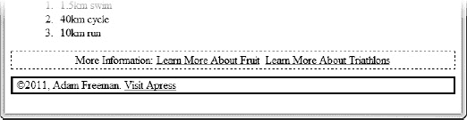
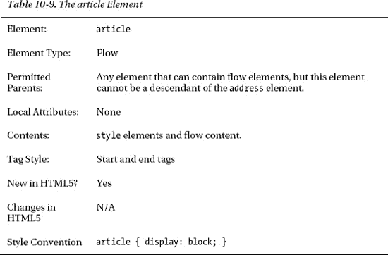

# 十、创建小节

在这一章中，我将向您展示用来表示内容中各部分的元素——实际上，就是如何将内容分开，使每个主题或概念与其他主题或概念隔离开来。本章中的许多元素都是新的，它们构成了将元素的含义从它们的表现中分离出来的重要基础。不幸的是，这意味着这些元素很难演示，因为它们对内容几乎没有视觉影响。为此，我在本章的许多示例中添加了一些 CSS 样式，以强调这些元素带来的结构和变化。

在这一章中，我不解释 CSS 样式的含义。第四章包含了 CSS 关键特性的提示，从第十六章开始描述了 CSS 的各个属性。表 10-1 对本章进行了总结。

### 添加基本标题

`h1`元素代表一个标题。HTML 定义了标题元素的层次结构，其中`h1`是最高等级的。其他标题元素是`h2`、`h3`，一直到`h6`。表 10-2 总结了`h1`–`h6`要素。

相同等级的标题通常用于分解内容，以便每个主题都在各自的部分中。降序排列的标题通常用于表示同一主题的不同方面。这些元素的另一个好处是，它们创建了一个文档大纲，用户只需通过查看标题就可以对文档的整体性质和结构有所了解，并通过跟踪标题层次结构更快地导航到感兴趣的区域。清单 10-1 显示了使用中的`h1`–`h3`元素。

*清单 10-1。使用 h1–H3 元素*

`<!DOCTYPE HTML>
<html>
    <head>
        <title>Example</title>
        <meta name="author" content="Adam Freeman"/>
        <meta name="description" content="A simple example"/>
        <link rel="shortcut icon" href="favicon.ico" type="image/x-icon" />
    </head>
    <body>
            **<h1>Fruits I like</h1>**
            I like apples and oranges.
            **<h2>Additional fruits</h2>**
            I also like bananas, mangoes, cherries, apricots, plums, peaches and grapes.
            **<h3>More information</h3>**
            You can see other fruits I like <a href="fruitlist.html">here</a>.

            **<h1>Activities I like</h1>**
            
I like to swim, cycle and run. I am in training for my first triathlon,
            but it is hard work.

            **<h2>Kinds of Triathlon</h2>**
            There are different kinds of triathlon - sprint, Olympic and so on.
            **<h3>The kind of triathlon I am aiming for</h3>**
            I am aiming for Olympic, which consists of the following:
            <ol>
                <li>1.5km swim</li>
                <li>40km cycle</li>
                <li>10km run</li>
            </ol>
    </body>
</html>`

我在清单中只显示了`h1`、`h2`和`h3`标题，因为很少有内容值得进一步深入。例外往往是非常技术性和精确的内容，如合同和规范。大多数内容最多需要两三级标题。举个例子，我在我的新书中使用了三个层次的标题。虽然 Apress 模板定义了五个级别的标题，但是如果我使用第四和第五个级别，文字编辑会感到不舒服。

你可以在图 10-1 中看到浏览器如何显示列表中的`h1`、`h2`和`h3`元素。

*图 10-1。使用默认的样式约定显示 h1、h2 和 h3 元素*

如图所示，每一级标题都有不同的样式约定。表 10-3 显示了每个标题元素的样式约定。

您不必考虑`h1`–`h6`元素的层次结构，但是如果您偏离了它，就会有使用户困惑的风险。分层标题如此普遍，以至于用户对它们的工作方式有一个固定的预期。

### 隐藏副标题

元素允许你在不影响 HTML 文档轮廓的情况下，将多个 header 元素作为一个单独的项目来处理。表 10-4 总结了`hgroup`要素。

`hgroup`解决的最常见的问题就是字幕。假设我想在文档中创建一个标题为“我喜欢的水果”的部分，副标题为“我是如何爱上柑橘的”。我可以使用`h1`和`h2`元素，如清单 10-2 中的所示。

*清单 10-2。使用 h1 和 h2 元素创建一个带有副标题的标题*

`<!DOCTYPE HTML>
<html>
    <head>
        <title>Example</title>
        <meta name="author" content="Adam Freeman"/>
        <meta name="description" content="A simple example"/>
        <link rel="shortcut icon" href="favicon.ico" type="image/x-icon" />
    </head>
    <body>
            **<h1>Fruits I Like</h1>**
            **<h2>How I Learned to Love Citrus</h2>**
            I like apples and oranges.
            <h2>Additional fruits</h2>
            I also like bananas, mangoes, cherries, apricots, plums, peaches and grapes.
            <h3>More information</h3>
            You can see other fruits I like <a href="fruitlist.html">here</a>.

            <h1>Activities I Like</h1>
            
I like to swim, cycle and run. I am in training for my first triathlon,
            but it is hard work.

            <h2>Kinds of Triathlon</h2>
            There are different kinds of triathlon - sprint, Olympic and so on.
            <h3>The kind of triathlon I am aiming for</h3>
            I am aiming for Olympic, which consists of the following:
            <ol>
                <li>1.5km swim</li>
                <li>40km cycle</li>
                <li>10km run</li>
            </ol>
    </body>
</html>`

这里的问题是，您无法区分作为副标题的`h2`元素和作为较低级标题的`h2`元素。如果您编写了一个脚本，遍历您的文档，根据`h1`–`h6`元素构建一个大纲，您将得到一个扭曲的结果，如下所示:

`Fruits I Like
    How I Learned to Love Citrus
    Additional fruits
        More information
Activities I Like
    Kinds of Triathlon
        The kind of triathlon I am aiming for`

这给人的感觉是`How I Learned to Love Citrus`是一个章节标题，而不是副标题。您可以使用`hgroup`元素来解决这个问题，如清单 10-3 所示。

*清单 10-3。使用 hgroup 元素*

`<!DOCTYPE HTML>
<html>
    <head>
        <title>Example</title>
        <meta name="author" content="Adam Freeman"/>
        <meta name="description" content="A simple example"/>
        <link rel="shortcut icon" href="favicon.ico" type="image/x-icon" />
        ****
    </head>
    <body>
           **<hgroup>**
                **<h1>Fruits I Like</h1>**
                **<h2>How I Learned to Love Citrus</h2>**
            **</hgroup>**
            I like apples and oranges.
            <h2>Additional fruits</h2>
            I also like bananas, mangoes, cherries, apricots, plums, peaches and grapes.
            <h3>More information</h3>
            You can see other fruits I like <a href="fruitlist.html">here</a>.

            <h1>Activities I like</h1>
            
I like to swim, cycle and run. I am in training for my first triathlon,
            but it is hard work.

            <h2>Kinds of Triathlon</h2>
            There are different kinds of triathlon - sprint, Olympic and so on.
            <h3>The kind of triathlon I am aiming for</h3>
            I am aiming for Olympic, which consists of the following:
            <ol>
                <li>1.5km swim</li>
                <li>40km cycle</li>
                <li>10km run</li>
            </ol>
    </body>
</html>`

一个`hgroup`元素在`h1`–`h6`层次结构中的位置由`hgroup`中的第一个标题元素子元素决定。例如，清单中的`hgroup`相当于一个`h1`元素，因为它是第一个子元素。只有第一个`h1`–`h6`元素包含在文档的大纲中，它给出了这样一个大纲:

`Fruits I Like
    Additional fruits
        More information
Activities I Like
    Kinds of Triathlon
        The kind of triathlon I am aiming for`

subtitle `h2`元素不再令人困惑——`hgroup`元素告诉您忽略它。你必须处理的第二个问题是使字幕在视觉上与常规的`h2`元素有所区别。你可以看到我在清单中应用了一些简单的样式，其效果可以在图 10-2 中看到。你可以在第十七章的中了解列表中的 CSS 选择器是如何工作的。

*图 10-2。使 h 组中元素之间的关系直观明了*

我不建议您采用这种简单的样式，但是您可以看到，您可以通过应用样式来消除标题元素的一些边距，并使用共同的背景色将元素放在一起，从而使`hgroup`元素中的元素之间的关系在视觉上更加清晰。

### 创建章节

`section`元素是 HTML5 的新元素，顾名思义，它表示文档的一部分。当你使用标题元素时，你创建了*隐含的*部分，但是这个元素允许你显式地显示它们，也允许你将文档的部分从`h1`–`h6`元素中分离出来。对于何时使用`section`元素没有严格的规则，但是根据经验，`section`元素应该用于包含文档大纲或目录中列出的内容。Section 元素通常包含一段或多段内容和一个标题，尽管标题是可选的。表 10-5 总结了`section`元素。

清单 10-4 展示了使用中的`section`元素。

*清单 10-4。使用截面元素*

`<!DOCTYPE HTML>
<html>
    <head>
        <title>Example</title>
        <meta name="author" content="Adam Freeman"/>
        <meta name="description" content="A simple example"/>
        <link rel="shortcut icon" href="favicon.ico" type="image/x-icon" />
        
    </head>
    <body>
        **<section>**
            <hgroup>
                <h1>Fruits I Like</h1>
                <h2>How I Learned to Love Citrus</h2>
            </hgroup>
            I like apples and oranges.
            **<section>**
                <h1>Additional fruits</h1>
                I also like bananas, mangoes, cherries, apricots, plums,
                peaches and grapes.
                **<section>**
                    <h1>More information</h1>
                    You can see other fruits I like <a href="fruitlist.html">here</a>.
                **</section>**
            **</section>**
        **</section>**

        <h1>Activities I like</h1>
        
I like to swim, cycle and run. I am in training for my first triathlon,
                    but it is hard work.

        <h2>Kinds of Triathlon</h2>
        There are different kinds of triathlon - sprint, Olympic and so on.
        <h3>The kind of triathlon I am aiming for</h3>
        I am aiming for Olympic, which consists of the following:
        <ol>
            <li>1.5km swim</li>
            <li>40km cycle</li>
            <li>10km run</li>
        </ol>
    </body>
</html>` 

我在这个清单中定义了三个`section`元素，其中一个嵌套在另一个中。注意，每个标题元素都是一个`h1`。当使用`section`元素时，浏览器负责计算出标题元素的层次结构，使您不必确定和维护`h1`–`h6`元素的适当顺序——至少原则上如此。实际的浏览器实现略有不同。Google Chrome、Internet Explorer 9 (IE9)和 Firefox 能够导出隐含的层次结构，并计算出每个`h1`元素的相对排名，如图图 10-3 所示。

*图 10-3。在 Chrome 中使用带有嵌套 h1 元素的 section 元素*

这很好，但是如果您很细心，您会注意到用于显示内容为`Fruits I Like`的`h1`元素的字体比用于同一级别的另一个`h1`元素——`Activities I like`元素的字体要小。这是因为一些浏览器(包括 Chrome 和 Firefox)对出现在`section`、`article`、`aside`和`nav`元素中的`h1`(以及`h2`–`h6`)元素应用了不同的样式。(后三种将在本章后面介绍。)这个新样式与`h2`元素的样式约定相同。IE9 不应用特殊样式，如图图 10-4 所示。这才是正确的行为。

*图 10-4。在 Internet Explorer 中使用带有 h1 元素的 section 元素*

此外，并不是所有的浏览器都支持创建相同类型的嵌套标题元素的隐含层次结构。你可以在图 10-5 中看到 Opera 是如何处理这些元素的。Safari 以同样的方式处理这些元素——忽略由`section`元素创建的层次结构实现。

*图 10-5。在 Opera* 中使用带有 h1 元素的 section 元素

你可以通过创建自己的风格来克服 Chrome 和 Firefox 应用的特殊风格，这些风格优先于浏览器定义的风格(正如我在第四章中解释的那样)。Internet Explorer 会做您所期望的事情。但是你对 Opera 和 Safari 无能为力——在浏览器实现变得更加一致之前，这个方便的功能应该谨慎使用。

### 添加页眉和页脚

`header`元素表示一个节的标题。它可以包含您希望表示为标题的任何内容，包括刊头或徽标。就其他元素而言，`header`元素通常包含一个`h1`–`h6`元素或一个`hgroup`元素，它还可以包含该部分的导航元素。参见`nav`元素(在即将到来的“添加导航块”一节中讨论)了解导航的细节。表 10-6 总结了`header`元素。

`footer`元素是对`header`的补充，代表一个部分的页脚。一个`footer`通常包含一个章节的摘要信息，可以包括作者的详细信息、权利信息、相关内容的链接、徽标和免责声明。表 10-7 总结了`footer`要素。

您可以在清单 10-5 中看到`header`和`footer`元素。

*清单 10-5。使用页眉和页脚元素*

`<!DOCTYPE HTML>
<html>
    <head>
        <title>Example</title>
        <meta name="author" content="Adam Freeman"/>
        <meta name="description" content="A simple example"/>
        <link rel="shortcut icon" href="favicon.ico" type="image/x-icon" />
        
    </head>
    <body>
        **<header>**
            **<hgroup>**
                **<h1>Things I like</h1>**
                **<h2>by Adam Freeman</h2>**
            **</hgroup>**
        **</header>**
        <section>
            **<header>**
                **<hgroup>**
                    **<h1>Fruits I Like</h1>**
                    **<h2>How I Learned to Love Citrus</h2>**
                **</hgroup>**
            **</header>**
            I like apples and oranges.
            <section>
                <h1>Additional fruits</h1>
                I also like bananas, mangoes, cherries, apricots, plums,
                peaches and grapes.
                <section>    
                    <h1>More information</h1>
                    You can see other fruits I like <a href="fruitlist.html">here</a>.
                </section>
            </section>
        </section>

        <section>
            **<header>**
                **<h1>Activities I like</h1>**
            **</header>**
            <section>
                
I like to swim, cycle and run. I am in training for my first
                triathlon, but it is hard work.

                <h1>Kinds of Triathlon</h1>
                There are different kinds of triathlon - sprint, Olympic and so on.
                <section>
                    <h1>The kind of triathlon I am aiming for</h1>
                    I am aiming for Olympic, which consists of the following:
                    <ol>
                        <li>1.5km swim</li>
                        <li>40km cycle</li>
                        <li>10km run</li>
                    </ol>
                </section>
            </section>
        </section>
        **<footer id="mainFooter">**
            **&#169;2011, Adam Freeman. <a href="http://apress.com">Visit Apress</a>**
        **</footer>**
    </body>
</html>`

在这个例子中，我定义了三个`header`元素。当一个标题是`body`元素的子元素时，它被假定为整个文档的`header`(但是要小心——这与`head`元素不同，我在第七章中描述了后者)。当`header`元素是一个节的一部分时(使用`section`元素隐式或显式定义)，它是该节的`header`。我在文档中添加了一些样式，以便更容易看到各个部分和标题之间的层次关系。你可以在图 10-6 中看到这一点。

注意字体的相对大小。这大概就是为什么 Google Chrome 和 Firefox 在`section`元素中重新定义了`h1`–`h6`元素。这是为了区分顶级`h1`头和那些嵌套在节中的头。这并不能为风格的无端重新定义开脱，但它确实把它放在了上下文中。

*图 10-6。使用标题元素*

你可以在图 10-7 中看到`footer`的效果。

*图 10-7。添加页脚元素*

### 添加导航块

`nav`元素表示包含到其他页面或同一页面其他部分的链接的文档部分。显然，并不是所有的超链接都必须在一个`nav`元素中。这个元素的目的是标识文档的主要导航部分。表 10-8 描述了`nav`元素。

清单 10-6 显示了`nav`元素的用法。

*清单 10-6。使用导航元素*

`<!DOCTYPE HTML>
<html>
    <head>
        <title>Example</title>
        <meta name="author" content="Adam Freeman"/>
        <meta name="description" content="A simple example"/>
        <link rel="shortcut icon" href="favicon.ico" type="image/x-icon" />
        
    </head>
    <body>
        <header>
            <hgroup>
                <h1>Things I like</h1>
                <h2>by Adam Freeman</h2>
            </hgroup>
            **<nav>**
                **<h1>Contents</h1>**
                **<ul>**
                    **<li><a href="#fruitsilike">Fruits I Like</a></li>**
                    **<ul>**
                        **<li><a href="#morefruit">Additional Fruits</a></li>**
                    **</ul>**
                    **<li><a href="#activitiesilike">Activities I Like</a></li>**
                    **<ul>**
                        **<li><a href="#tritypes">Kinds of Triathlon</a></li>**
                        **<li><a href="#mytri">The kind of triathlon I am**
                            **aiming for</a></li>**
                    **</ul>**
                **</ul>**
            **</nav>**
        </header>
        <section>
            <header>
                <hgroup>
                    <h1 id="fruitsilike">Fruits I Like</h1>
                    <h2>How I Learned to Love Citrus</h2>
                </hgroup>
            </header>
            I like apples and oranges.
            <section>
                <h1 id="morefruit">Additional fruits</h1>
                I also like bananas, mangoes, cherries, apricots, plums,
                peaches and grapes.
                <section>    
                    <h1>More information</h1>
                    You can see other fruits I like <a href="fruitlist.html">here</a>.
                </section>
            </section>
        </section>

        <section>
            <header>
                <h1 id="activitiesilike">Activities I like</h1>
            </header>
            <section>
                
I like to swim, cycle and run. I am in training for my first
                triathlon, but it is hard work.

                <h1 id="tritypes">Kinds of Triathlon</h1>
                There are different kinds of triathlon - sprint, Olympic and so on.
                <section>
                    <h1 id="mytri">The kind of triathlon I am aiming for</h1>
                    I am aiming for Olympic, which consists of the following:
                    <ol>
                        <li>1.5km swim</li>
                        <li>40km cycle</li>
                        <li>10km run</li>
                    </ol>
                </section>
            </section>
        </section>
        **<nav>**
            **More Information:**
            **<a href="http://fruit.org">Learn More About Fruit</a>**
            **<a href="http://triathlon.org">Learn More About Triathlons</a>**
        **</nav>**
        <footer id="mainFooter">
            &#169;2011, Adam Freeman. <a href="http://apress.com">Visit Apress</a>
        </footer>
    </body>
</html>`

我在文档中添加了几个`nav`元素，以体现这个元素的灵活性。第一个`nav`元素为用户提供文档内的导航。我使用了`ul`、`li`和`a`元素来创建一组层次化的相对超链接。你可以在图 10-8 中看到浏览器是如何显示的。

*图 10-8。使用 nav 元素创建内容导航部分*

我将这个`nav`元素放在文档的主`header`元素中。这不是强制性的，但我喜欢这样做，以表明这是主要的`nav`元素。请注意，我将`h1`元素与其他内容混合在一起。`nav`元素可以包含任何流内容，而不仅仅是超链接。我在文档的末尾添加了第二个`nav`元素，为用户提供一些链接来获取更多信息。你可以在图 10-9 中看到浏览器是如何渲染的。

*图 10-9。使用导航元素提供外部导航*

在`nav`元素的两个实例中，我在文档中给`style`元素添加了样式，以使添加的内容在视觉上与众不同。`nav`元素的样式约定没有明确表示`nav`元素的内容。

### 使用文章

`article`元素表示 HTML 文档中一段独立的内容，原则上可以独立于页面的其余部分进行分发或使用(比如通过 RSS 提要)。这并不是说你*有*来独立发布它，只是说独立性是何时使用这个元素的指导。好的例子包括一篇新文章和一个博客条目。表 10-9 总结了`article`元素。

清单 10-7 显示了使用中的`article`元素。

*清单 10-7。使用文章元素*

`<!DOCTYPE HTML>
<html>
    <head>
        <title>Example</title>
        <meta name="author" content="Adam Freeman"/>
        <meta name="description" content="A simple example"/>
        <link rel="shortcut icon" href="favicon.ico" type="image/x-icon" />
        
    </head>
    <body>
        <header>
            <hgroup>
                <h1>Things I like</h1>
                <h2>by Adam Freeman</h2>
            </hgroup>
            <nav>
                <h1>Contents</h1>
                <ul>
                    <li><a href="#fruitsilike">Fruits I Like</a></li>
                    <li><a href="#activitiesilike">Activities I Like</a></li>
                </ul>
            </nav>
        </header>

        **<article>**
            <header>
                <hgroup>
                    <h1 id="fruitsilike">Fruits I Like</h1>
                    <h2>How I Learned to Love Citrus</h2>
                </hgroup>
            </header>
            I like apples and oranges.
            <section>
                <h1 id="morefruit">Additional fruits</h1>
                I also like bananas, mangoes, cherries, apricots, plums,
                peaches and grapes.
                <section>    
                    <h1>More information</h1>
                    You can see other fruits I like <a href="fruitlist.html">here</a>
                </section>
            </section>
            <footer>
                <nav>
                    More Information:
                    <a href="http://fruit.org">Learn More About Fruit</a>
                </nav>
            </footer>
        **</article>**

        **<article>**
            <header>
                <hgroup>
                    <h1 id="activitiesilike">Activities I like</h1>
                    <h2>It hurts, but I keep doing it</h2>
                </hgroup>
            </header>
            <section>
                
I like to swim, cycle and run. I am in training for my first
                triathlon, but it is hard work.

                <h1 id="tritypes">Kinds of Triathlon</h1>
                There are different kinds of triathlon - sprint, Olympic and so on.
                <section>
                    <h1 id="mytri">The kind of triathlon I am aiming for</h1>
                    I am aiming for Olympic, which consists of the following:
                    <ol>
                        <li>1.5km swim</li>
                        <li>40km cycle</li>
                        <li>10km run</li>
                    </ol>
                </section>
            </section>
            <footer>
                <nav>
                    More Information:
                    <a href="http://triathlon.org">Learn More About Triathlons</a>
                </nav>
            </footer>
        **</article>**

        <footer id="mainFooter">
            &#169;2011, Adam Freeman. <a href="http://apress.com">Visit Apress</a>
        </footer>
    </body>
</html>`

在这个例子中，我重新组织了我的文档，使其更符合博客的一般风格，尽管它可能不是最有趣的博客。文件的主要部分分为三个部分。第一个是`header`，它超越了单个条目，为文档的其余部分提供了一个定位点。第二部分是`footer`，它平衡标题，并为用户提供一些适用于其余内容的基本信息。新增加的是第三部分:`article`元素。在这个例子中，每篇文章都描述了我喜欢的一种事物。这符合独立性测试，因为我喜欢的东西的每个描述都是独立的，可以独立发布，同时仍然有某种意义。我再次添加了一些样式来突出元素的截面效果，你可以在图 10-10 中看到。

*图 10-10。应用文章元素*

`article`元素可以像其他新的语义元素一样灵活应用。例如，您可以嵌套`article`元素来指示原始文章以及您收到的每个更新或评论。和其他一些元素一样，`article`的价值是与上下文相关的——在一种内容中增加有意义的结构可能不会在另一种内容中增加价值。需要判断(和一致性)。

### 创建侧边栏

`aside`元素表示与周围元素关系不大的内容。这类似于书籍或杂志中的侧边栏。内容与页面的其余部分、`article`或`section`有关，但它不是主流的一部分。它可以是一些额外的背景，一组相关文章的链接，等等。表 10-10 总结了`aside`要素。

清单 10-8 显示了使用中的`aside`元素。我给其中一篇文章添加了旁白，并添加了样式，使它看起来像一个简单的杂志风格的侧边栏。

*清单 10-8。添加和样式化辅助设备*

`<!DOCTYPE HTML>
<html>
    <head>
        <title>Example</title>
        <meta name="author" content="Adam Freeman"/>
        <meta name="description" content="A simple example"/>
        <link rel="shortcut icon" href="favicon.ico" type="image/x-icon" />
        
    </head>
    <body>
        <header>
            <hgroup>
                <h1>Things I like</h1>
                <h2>by Adam Freeman</h2>
            </hgroup>
            <nav>
                <h1>Contents</h1>
                <ul>
                    <li><a href="#fruitsilike">Fruits I Like</a></li>
                    <li><a href="#activitiesilike">Activities I Like</a></li>
                </ul>
            </nav>
        </header>

        <article>
            <header>
                <hgroup>
                    <h1 id="fruitsilike">Fruits I Like</h1>
                    <h2>How I Learned to Love Citrus</h2>
                </hgroup>
            </header>
            **<aside>**
                **<h1>Why Fruit is Healthy</h1>**
                    **<section>**
                    **Here are three reasons why everyone should eat more fruit:**
                    **<ol>**
                        **<li>Fruit contains lots of vitamins</li>**
                        **<li>Fruit is a source of fibre</li>**
                        **<li>Fruit contains few calories</li>**
                    **</ol>**
                **</section>**
            **</aside>**
            I like apples and oranges.    
            <section>
                <h1 id="morefruit">Additional fruits</h1>
                I also like bananas, mangoes, cherries, apricots, plums,
                peaches and grapes.
                <section>    
                    <h1>More information</h1>
                    You can see other fruits I like <a href="fruitlist.html">here</a>
                </section>
            </section>
            <footer>
                <nav>
                    More Information:
                    <a href="http://fruit.org">Learn More About Fruit</a>
                </nav>
            </footer>
        </article>
        <article>
            <header>
                <hgroup>
                    <h1 id="activitiesilike">Activities I like</h1>
                    <h2>It hurts, but I keep doing it</h2>
                </hgroup>
            </header>
            <section>
                
I like to swim, cycle and run. I am in training for my first
                triathlon, but it is hard work.

                <h1 id="tritypes">Kinds of Triathlon</h1>
                There are different kinds of triathlon - sprint, Olympic and so on.
                <section>
                    <h1 id="mytri">The kind of triathlon I am aiming for</h1>
                    I am aiming for Olympic, which consists of the following:
                    <ol>
                        <li>1.5km swim</li>
                        <li>40km cycle</li>
                        <li>10km run</li>
                    </ol>
                </section>
            </section>
            <footer>
                <nav>
                    More Information:
                    <a href="http://triathlon.org">Learn More About Triathlons</a>
                </nav>
            </footer>
        </article>
        <footer id="mainFooter">
            &#169;2011, Adam Freeman. <a href="http://apress.com">Visit Apress</a>
        </footer>
    </body>
</html>`

你可以在图 10-11 中看到`aside`元素和附加样式的效果。我向图中所示的文档添加了一些填充文本，以使内容的流动更加明显。

*图 10-11。应用和设计侧边元素*

### 提供联系信息

`address`元素用于表示文档或`article`元素的联系信息。表 10-11 总结了`address`元素。

当`address`元素是`article`元素的后代时，它被假定为那个`article`提供联系信息。否则，当一个`address`元素是一个`body`元素的子元素时(并且在`body`和`address`元素之间没有`article`元素)，则假定`address`为整个文档提供联系信息。

元素不能用来表示不是文档或文章的联系信息的地址。例如，您不能使用该元素在文档内容中表示客户或用户的地址。清单 10-9 显示了使用中的`address`元素。

*清单 10-9。使用地址元素*

`...
<body>
    <header>
        <hgroup>
            <h1>Things I like</h1>
            <h2>by Adam Freeman</h2>
        </hgroup>
        **<address>**
            **Questions and comments? <a href="mailto:adam@myboringblog.com">Email me</a>**
        **</address>**
        <nav>
            <h1>Contents</h1>
            <ul>
                <li><a href="#fruitsilike">Fruits I Like</a></li>
                <li><a href="#activitiesilike">Activities I Like</a></li>
            </ul>
        </nav>
    </header>

    <article>
        <header>
            <hgroup>
...`

我将`address`元素添加到文档的标题中。在这种情况下，我提供了一个用户/读者联系我的电子邮件地址。您可以在图 10-12 中看到添加内容。

*图 10-12。添加地址元素*

### 创建详细信息部分

`details`元素创建了文档的一个部分，用户可以展开它来获得关于主题的更多细节。表 10-12 总结了`details`要素。

`details`元素通常包含一个`summary`元素，它为细节部分创建一个标签或标题。表 10-13 描述了`summary`元素。

您可以看到在清单 10-10 中使用的`details`和`summary`元素。

*清单 10-10。使用概要和细节元素*

`<!DOCTYPE HTML>
<html>
    <head>
        <title>Example</title>
        <meta name="author" content="Adam Freeman"/>
        <meta name="description" content="A simple example"/>
        <link rel="shortcut icon" href="favicon.ico" type="image/x-icon" />
        
    </head>
    <body>
        <header>
            <hgroup>
                <h1>Things I like</h1>
                <h2>by Adam Freeman</h2>
            </hgroup>
        </header>
        <article>
            <header>
                <hgroup>
                    <h1 id="activitiesilike">Activities I like</h1>
                    <h2>It hurts, but I keep doing it</h2>
                </hgroup>
            </header>
            <section>
                
I like to swim, cycle and run. I am in training for my first
                triathlon, but it is hard work.

                **
**
                    **
Kinds of Triathlon
**
                    **There are different kinds of triathlon - sprint, Olympic and so on.**
                    **I am aiming for Olympic, which consists of the following:**
                    **<ol>**
                        **<li>1.5km swim</li>**
                        **<li>40km cycle</li>**
                        **<li>10km run</li>**
                    **</ol>**
                **
**
            </section>
        </article>
    </body>
</html>`

你可以在图 10-13 中看到浏览器是如何显示这些元素的。并非所有的浏览器都支持`details`元素。比如 IE9 就有困难。

*图 10-13。使用详细信息和摘要属性*

如图所示，浏览器提供了一个界面控件，当它被激活时，会打开并显示`details`元素的内容。当`details`元素关闭时，只有`summary`元素的内容可见。要在页面首次显示时打开`details`元素，请应用`open`属性。

### 总结

在本章中，我向您介绍了用于在文档中创建节和隔离不相关内容的元素。这些元素中的大部分都是 HTML5 的新内容。虽然您不必使用它们来创建兼容的 HTML5 文档，但是这些新元素是为 HTML 带来语义的主要增强之一。