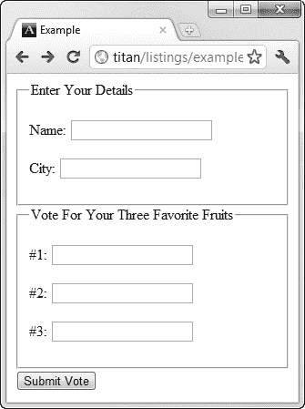
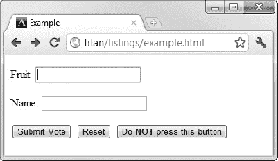

# 十二、使用表单

表单是收集用户输入的 HTML 机制。表单对 web 应用非常重要，但是多年来，HTML 中定义的功能落后于表单的使用方式。在 HTML5 中，整个表单系统都经过了彻底检查和修饰，使标准与表单的使用方式保持一致。

在这一章中，我描述了 HTML 表单的基础。我首先定义一个非常简单的表单，并在此基础上演示如何配置和控制表单的操作方式。我介绍了一个 Node.js 脚本，您可以用它来测试您的表单并查看从浏览器发送到服务器的数据。

在接下来的章节中，我将介绍高级表单特性，包括最受关注的 HTML5 变化——从用户处收集特定数据类型的新方法，以及在浏览器中验证数据的能力。这些都是重要的增强，但是许多其他的变化也值得注意。这一章和下一章都值得密切关注。

在我写这篇文章时，主流浏览器对 HTML5 表单的支持是好的，但并不完美，在采用它之前，值得检查一下每个特性的实现范围。表 12-1 对本章进行了总结。

### 创建基本表单

要创建一个基本表单，您需要三个元素:`form`、`input`和`button`元素。清单 12-1 显示了一个包含简单表单的 HTML 文档。

*清单 12-1。一个简单的 HTML 表单*

`<!DOCTYPE HTML>
<html>
    <head>
        <title>Example</title>
        <meta name="author" content="Adam Freeman"/>
        <meta name="description" content="A simple example"/>
        <link rel="shortcut icon" href="favicon.ico" type="image/x-icon" />
    </head>
    <body>
**        <form method="post" action="http://titan:8080/form">
            <input name="fave"/>
            <button>Submit Vote</button>
        </form>**
    </body>
</html>`

你可以在图 12-1 中看到这是如何出现在浏览器中的。

*图 12-1。在浏览器中显示基本表单*

这个表单太简单了，没什么用，但是在你看完三个核心元素之后，你可以开始添加表单，让它更有意义和有用。

#### 定义表单

起点是`form`元素，它表示 HTML 页面中表单的存在。表 12-2 总结了`form`要素。

在本章的后面，我将回头向您展示如何使用元素属性来配置`form`元素。目前，知道`form`元素告诉浏览器它正在处理一个 HTML 表单就足够了。

第二个关键元素是`input`，它允许您收集来自用户的输入。你可以在图 12-1 中看到，`input`元素已经被浏览器显示为一个简单的文本框，用户可以在其中输入内容。这是最基本类型的`input`元素，正如你将看到的，有很多选项可以让你收集用户的输入(包括 HTML5 中一些不错的新增内容)。我会在第十三章中解释这些。表 12-3 总结了`input`要素。

根据`type`属性的值，有 29 个属性可以应用于`input`元素。在第十三章的中，我将展示这些属性，并解释它们的用途。

 **提示**您可以使用除了`input`之外的元素从用户那里收集数据。我在第十四章中解释并演示了这些。

示例中的最后一个元素是`button`。您需要一些方法让用户向浏览器表明所有的数据都已输入，浏览器应该将数据发送给服务器。`button`元素是最常用的方法(尽管，你会在第十三章的中看到，你还可以使用另一种机制)。表 12-4 总结了`button`元素。

元素是一个多用途元素，我将在本章后面的“使用按钮元素”一节中解释它的用途。当在一个没有任何属性的`form`元素中使用时，`button`元素告诉浏览器将从用户那里收集的数据提交给服务器。

#### 查看表单数据

您需要一个服务器，以便浏览器向其发送数据。为此，我编写了一个简单的 Node.js 脚本，该脚本生成一个 HTML 页面，其中包含表单从用户那里收集的数据。获取和设置 Node.js 的细节见第二章。清单 12-2 显示了我们将使用的脚本。正如我在第二章的中提到的，我不会深究服务器端脚本的细节，但是因为 Node.js 是基于 JavaScript 的，所以通过阅读第五章中对 JavaScript 语言特性的描述以及阅读`[`nodejs.org`](http://nodejs.org)`中的一些文档，你可以很容易地看到这个脚本做了什么。

*清单 12-2。formecho.js 脚本*

`var http = require('http');
var querystring = require('querystring');

http.createServer(function (req, res) {
  switch(req.url) {
    case '/form':
        if (req.method == 'POST') {
         console.log("[200] " + req.method + " to " + req.url);
         var fullBody = '';
         req.on('data', function(chunk) {
           fullBody += chunk.toString();
         });
         req.on('end', function() {
           res.writeHead(200, "OK", {'Content-Type': 'text/html'});  
           res.write('<html><head><title>Post data</title></head><body>');
           res.write('');
           res.write('<table border="1"><caption>Form Data</caption>');
           res.write('<tr><th>Name</th><th>Value</th>');
           var dBody = querystring.parse(fullBody);
           for (var prop in dBody) {
            res.write("<tr><td>" + prop + "</td><td>" + dBody[prop] + "</td></tr>");
           }
           res.write('</table></body></html>');
           res.end();
         });
       } else {
         console.log("[405] " + req.method + " to " + req.url);
         res.writeHead(405, "Method not supported", {'Content-Type': 'text/html'});
         res.end('<html><head><title>405 - Method not supported</title></head><body>' +
                 '<h1>Method not supported.</h1></body></html>');
       }
      break;
    default:
      res.writeHead(404, "Not found", {'Content-Type': 'text/html'});
      res.end('<html><head><title>404 - Not found</title></head><body>' +
              '<h1>Not found.</h1></body></html>');
      console.log("[404] " + req.method + " to " + req.url);
  };
}).listen(8080);`

这个脚本收集浏览器提交的数据，并返回一个简单的 HTML 文档，在 HTML 表中显示这些数据。(我在第十一章中描述了`table`元素。)这个脚本监听端口`8080`上的浏览器连接，并且只处理使用 HTTP POST 方法从浏览器发送到`/form` URL 的表单。当您在本章后面查看由`form`元素支持的属性时，您将看到端口`8080`和`/form` URL 的重要性。我将这个脚本保存到一个名为`formecho.js`的文件中。为了启动这个脚本，我在`titan`上打开了一个命令提示符，并输入了以下内容:

* * *

`bin\node.exe formecho.js`

* * *

Titan 运行 Windows Server 2008 R2，因此如果您使用另一个操作系统，启动 Node.js 的确切命令会有所不同。图 12-2 显示了浏览器显示在示例表单的文本框中输入`Apples`并按下`Submit Vote`按钮产生的输出。

*图 12-2。使用 Node.js* 查看浏览器提交的表单数据

只有一项数据，因为在示例表单中只有一个`input`元素。`Name`列中的值是`fave`，因为这是我分配给`input`元素中的`name`属性的值。`Value`列中的值是`Apples`，因为这是我在按下`Submit Vote`按钮之前输入到文本框中的值。在我们创建更复杂的表单时，我将展示 Node.js 脚本的表格输出。

### 配置表单

我们创建了一个包含基本表单的 HTML 文档，并使用 Node.js 显示发送到服务器的数据。现在是时候向您展示可以应用于表单及其内容的基本配置选项了。

#### 配置表单动作属性

`action`属性指定当`form`被提交时，浏览器应该将从用户那里收集的数据发送到哪里。我希望将数据提交给我的 Node.js 脚本，这意味着我希望将表单发送到我的开发服务器`titan`的端口`8080`上的`/form` URL。你可以看到我已经在清单 12-1 中以原始形式表达了这一点，就像这样:

`...
**<form method="post" action="http://titan:8080/form">**
...`

如果不将`action`属性应用到`form`元素，浏览器会将表单数据发送到加载 HTML 文档的 URL。这并不像最初看起来那样毫无用处，一些流行的 web 应用开发框架都依赖于这一特性。

如果你指定了一个相对 URL，这个值将被附加到当前页面的 URL 上，或者如果你使用了在第七章的中描述的`base`元素，这个值将被附加到该元素的`href`属性的值上。清单 12-3 展示了如何使用`base`元素来设置表单数据的目的地。

*清单 12-3。使用基本元素设置表单数据的目的地*

`<!DOCTYPE HTML>
<html>
    <head>
        <title>Example</title>
        <meta name="author" content="Adam Freeman"/>
        <meta name="description" content="A simple example"/>
        <link rel="shortcut icon" href="favicon.ico" type="image/x-icon" />
**        <base href="http://titan:8080"/>**
    </head>
    <body>
        <form method="post" action="**/form**">
            <input name="fave"/>
            <button>Submit Vote</button>
        </form>
    </body>
</html>`

 **注意**`base`元素影响*HTML 文档中所有的*相对 URL，而不仅仅是`form`元素。

#### 配置 HTTP 方法属性

属性指定使用哪种 HTTP 方法将表单数据发送到服务器。允许的值是`get`和`post`，它们对应于 HTTP `GET`和`POST`方法。不应用`method`属性时使用的缺省值是`get`，这很不幸，因为大多数表单都需要 HTTP POST。您可以看到我为示例中的`form`指定了`post`值，如下所示:

`...
**<form method="post" action="http://titan:8080/form">**
...`

GET 请求是针对*安全交互*的，这意味着你可以任意多次发出相同的请求，而且不会有副作用。POST 请求是针对*不安全的交互*，提交数据的行为改变了某种状态。在处理 web 应用时，这是最常见的情况。这些约定是由万维网联盟(W3C)制定的，你可以在`[www.w3.org/Provider/Style/URI](http://www.w3.org/Provider/Style/URI)`读到。

根据经验，GET 请求应该用于所有的只读信息检索，而 POST 请求应该用于任何改变应用状态的操作。使用正确的请求很重要。如果你不确定，为了谨慎起见，使用 POST 方法。

 **提示**我在本章中使用的 Node.js 脚本将只响应 POST 请求。

#### 配置数据编码

`enctype`属性指定了浏览器如何编码和向服务器显示数据。该属性有三个允许值，在表 12-5 中描述。

为了理解不同的编码是如何工作的，您需要在表单中添加第二个`input`元素，如清单 12-4 中的所示。

*清单 12-4。向表单添加输入元素*

`<!DOCTYPE HTML>
<html>
    <head>
        <title>Example</title>
        <meta name="author" content="Adam Freeman"/>
        <meta name="description" content="A simple example"/>
        <link rel="shortcut icon" href="favicon.ico" type="image/x-icon" />
    </head>
    <body>
        <form method="post" action="http://titan:8080/form">
            <input name="fave"/>
**            <input name="name"/>**
            <button>Submit Vote</button>
        </form>
    </body>
</html>`

您需要第二个`input`元素，这样您就可以从用户那里收集两项数据。正如您可能已经猜到的那样，您正在构建一个允许用户为他们喜欢的水果投票的表单。新的`input`元素将用于收集他们的名字。从清单中可以看出，我将这个元素的`name`值设置为`name`。为了演示不同表单编码的效果，我向表单添加了`enctype`属性，并将其设置为每种支持的编码类型。在每个实例中，我都在文本框中输入了相同的数据。在第一个文本框中，我输入了`Apples`，在第二个文本框中，我输入了`Adam Freeman`(在我的名字和名字之间留有空格)。

##### application/x-www-form-urlencoded 编码

这是默认编码，适用于除了向服务器上传文件的表单之外的所有表单。每个数据项的名称和值使用与编码 URL 相同的方案进行编码(因此，名称的`urlencoded`部分)。这是编码如何应用于示例表单中的数据:

* * *

`fave=Apples&name=Adam+Freeman`

* * *

特殊字符被替换为它们对应的 HTML 实体。数据项的名称和值由等号(`=`)分隔，数据/值元组由&符号(`&`)分隔。

##### 多部分/形式数据编码

`multipart/form-data`编码采用了不同的方法。它更冗长，处理起来也更复杂，这就是为什么它通常只用于需要向服务器上传文件的表单——这是使用默认编码无法做到的。下面是示例表单中数据的编码方式:

* * *

`------WebKitFormBoundary2qgCsuH4ohZ5eObF

Content-Disposition: form-data; name="fave"

Apples

------WebKitFormBoundary2qgCsuH4ohZ5eObF

Content-Disposition: form-data; name="name"

Adam Freeman

------WebKitFormBoundary2qgCsuH4ohZ5eObF--

fave=Apple

name=Adam Freeman`

* * *

##### 文本/普通编码

应该谨慎使用这种编码。对于使用这种方案时应该如何对数据进行编码，没有正式的规范，并且主流浏览器以不同的方式对数据进行编码。例如，Google Chrome 编码数据的方式与`application/x-www-form-urlencoded`方案相同，而 Firefox 编码数据的方式如下:

* * *

`fave=Apple

name=Adam Freeman`

* * *

每个数据项放在一行上，特殊字符不编码。我建议避免这种编码。浏览器之间的差异使其不可预测。

#### 控制表单完成

浏览器帮助用户记住他们输入到表单中的数据，并在再次看到类似的表单时自动重用这些数据。这种技术减少了用户反复输入相同数据的需要。一个很好的例子是用户在网上购买商品或服务时输入的姓名和送货细节。每个网站都有自己的购物车和注册流程，但我的浏览器使用我在*其他*表格中输入的数据来加快结账流程。浏览器使用不同的技术来确定要重用的数据，但是一种常见的方法是寻找`input`元素的`name`属性。

一般来说，自动完成表单对用户是有益的，对 web 应用没有什么影响。但是有些时候你不希望浏览器填写表单。清单 12-5 展示了如何在`form`元素上使用`autocomplete`属性来实现这一点。

*清单 12-5。禁用表单元素自动完成属性*

`<!DOCTYPE HTML>
<html>
    <head>
        <title>Example</title>
        <meta name="author" content="Adam Freeman"/>
        <meta name="description" content="A simple example"/>
        <link rel="shortcut icon" href="favicon.ico" type="image/x-icon" />
    </head>
    <body>
        <form **autocomplete="off"** method="post" action="http://titan:8080/form">
            <input name="fave"/>
            <input name="name"/>
            <button>Submit Vote</button>
        </form>
    </body>
</html>`

`autocomplete`属性有两个允许的值:`on`和`off`。`on`值允许浏览器填写表单，并且是不应用该属性时采用的默认值。

您可以通过将`autocomplete`属性应用到单个的`input`元素来更加具体，如清单 12-6 所示。

*清单 12-6。将 autocomplete 属性应用于输入元素*

`<!DOCTYPE HTML>
<html>
    <head>
        <title>Example</title>
        <meta name="author" content="Adam Freeman"/>
        <meta name="description" content="A simple example"/>
        <link rel="shortcut icon" href="favicon.ico" type="image/x-icon" />
    </head>
    <body>
        <form autocomplete="off" method="post" action="http://titan:8080/form">
            <input **autocomplete="on"** name="fave"/>
            <input name="name"/>
            <button>Submit Vote</button>
        </form>
    </body>
</html>`

`form`元素上的`autocomplete`属性为表单中的`input`元素设置默认策略。但是，如清单所示，您可以为单个元素覆盖该策略。在这个例子中，`form`元素上的属性禁用了自动完成，但是应用于第一个`input`元素的相同属性将其重新打开——但是只针对该元素。第二个`input`元素，还没有应用`autocomplete`属性，服从于`form`范围的策略。

一般来说，您应该让`autocomplete`处于启用状态——用户习惯于自动填充表单，并且在任何类型的 web 事务中通常会面对多个表单。对于你来说，取消这个功能侵犯了你的用户的偏好和工作习惯。我从自己的经验中知道，当我试图从禁用自动完成功能的网站购买商品时，尤其是当我试图填写的表单需要非常基本的信息，如我的姓名和地址时，这是很不和谐的。一些网站禁用信用卡数据的自动完成功能，这更有意义，但即使这样，这种方法也应该谨慎使用，并且应该充分考虑使用该功能的原因。

#### 指定表单响应的目标

浏览器的默认行为是在提交表单后用服务器返回的响应替换包含表单的页面。您可以通过使用`form`元素上的`target`属性来改变这种行为。该属性的工作方式与`a`元素上的`target`属性相同，您可以从表 12-6 所示的目标范围中进行选择。

这些值中的每一个都代表一个*浏览上下文*。`_blank`和`_self`值是不言而喻的。其他的与框架的使用有关，我会在第十五章中解释。清单 12-7 显示了应用于`form`元素的`target`属性。

*清单 12-7。使用目标属性*

`<!DOCTYPE HTML>
<html>
    <head>
        <title>Example</title>
        <meta name="author" content="Adam Freeman"/>
        <meta name="description" content="A simple example"/>
        <link rel="shortcut icon" href="favicon.ico" type="image/x-icon" />
    </head>
    <body>
        <form **target="_blank"** method="post" action="http://titan:8080/form">
            <input autocomplete="on" name="fave"/>
            <input name="name"/>
            <button>Submit Vote</button>
        </form>
    </body>
</html>`

在这个例子中，我指定了`_blank`目标，它告诉浏览器在一个新窗口或标签中显示来自服务器的响应。你可以在图 12-3 中看到这种变化的效果。

*图 12-3。在新标签中显示来自服务器的响应*

#### 设置表单的名称

`name`属性允许您为表单设置一个唯一的标识符，以便在使用文档对象模型(DOM)时可以区分表单。我在第二十五章中介绍了 DOM。`name`属性不同于`id`全局属性，在大多数情况下，HTML 文档使用 CSS 选择器的`id`属性。清单 12-8 显示了一个`name`和`id`属性被应用到的`form`元素。为了简单起见，我对这两个属性使用了相同的值。

*清单 12-8。在表单元素上使用 name 和 id 属性*

`<!DOCTYPE HTML>
<html>
    <head>
        <title>Example</title>
        <meta name="author" content="Adam Freeman"/>
        <meta name="description" content="A simple example"/>
        <link rel="shortcut icon" href="favicon.ico" type="image/x-icon" />
    </head>
    <body>
        <form **name="fruitvote" id="fruitvote"**
              method="post" action="http://titan:8080/form">
            <input name="fave"/>
            <input name="name"/>
            <button>Submit Vote</button>
        </form>
    </body>
</html>`

表单提交时，`name`属性的值不会发送到服务器，这就是为什么这个属性只在 DOM 中有值，并且没有`input`元素上的`name`属性重要。如果一个`input`元素没有`name`属性，当`form`被提交时，用户输入的数据不会被发送到服务器。

### 给表格添加标签

您有一个从用户那里收集数据的表单，但是它不是很容易使用。你可以在图 12-4 中看到上一节添加的`input`元素是如何被浏览器显示的。

*图 12-4。示例表单*

显而易见的问题是完全缺乏对用户的指导，用户必须阅读源 HTML 来弄清楚每个文本框是干什么的。您可以通过使用`label`元素来解决这个问题，它允许您为表单中的每个元素提供一些上下文。表 12-7 总结了`label`要素。

清单 12-9 显示了如何给用户一些上下文。

*清单 12-9。使用标签元素*

`<!DOCTYPE HTML>
<html>
    <head>
        <title>Example</title>
        <meta name="author" content="Adam Freeman"/>
        <meta name="description" content="A simple example"/>
        <link rel="shortcut icon" href="favicon.ico" type="image/x-icon" />
    </head>
    <body>
        <form method="post" action="http://titan:8080/form">
            
**<label for="fave">**Fruit: <input id="fave" name="fave"/>**</label>**

            
**<label for="name">Name:** <input id="name" name="name"/>**</label>**

            <button>Submit Vote</button>
        </form>
    </body>
</html>`

我为每个`input`元素添加了一个`label`。注意，我向`input`元素添加了一个`id`属性，并使用这些`id`作为`label`元素上`for`属性的值。这就是将标签与输入关联起来的方式，对于屏幕阅读器和其他辅助技术来说，这使得处理表单更加简单。你可以在图 12-5 中看到标签是如何出现的。

*图 12-5。向表单添加标签*

在清单中，我将`input`元素作为`label`元素的内容。这不是必需的，这两个元素可以彼此独立地定义。在布局复杂表单时，通常独立于`input`来定义`label`。

 **注意**我在表单中添加了一些`p`元素来提供一个非常基本的布局。这是我在本章的大部分例子中要做的事情，因为它会让我们更容易看到 HTML 文档中添加的内容对表示的影响。为了给表单元素创建更漂亮的布局，你可以使用 CSS 表格特性，我在第二十一章中描述了这个特性。第九章的中描述了`p`元素。

### 自动聚焦输入元素

您可以选择显示表单时浏览器关注的`input`元素。这意味着用户可以直接开始在所选字段中键入内容，而不必先明确选择它。用`autofocus`属性指定焦点应该应用于哪个`input`元素，如清单 12-10 中的所示。

*清单 12-10。使用自动对焦属性*

`<!DOCTYPE HTML>
<html>
    <head>
        <title>Example</title>
        <meta name="author" content="Adam Freeman"/>
        <meta name="description" content="A simple example"/>
        <link rel="shortcut icon" href="favicon.ico" type="image/x-icon" />
    </head>
    <body>
        <form method="post" action="http://titan:8080/form">
            

                <label for="fave">Fruit: <input **autofocus** id="fave" name="fave"/></label>
            

            
<label for="name">Name: <input id="name" name="name"/></label>

            <button>Submit Vote</button>
        </form>
    </body>
</html>`

浏览器一显示页面，就会关注第一个输入元素。在图 12-6 中，你可以看到谷歌浏览器给用户的视觉提示，指示一个聚焦的元素。

*图 12-6。在输入元素上自动聚焦*

您只能将`autofocus`属性应用于一个`input`元素。如果您尝试多次应用该元素，浏览器将关注文档中包含该元素的最后一个元素。

### 禁用单个输入元素

您可以禁用`input`元素，这样用户就不能在其中输入数据。这并不像听起来那么奇怪。您可能希望呈现一个用于几个相关任务的一致的界面，但是并不是所有的`input`元素都与之密切相关。您还可以使用 JavaScript 基于用户的操作来启用元素。一个常见的例子是，当用户选择送货地址而不是用户的账单地址时，启用一组`input`元素来捕获地址。(你可以通过 DOM 启用这些元素，这将在第 25-31 章中描述。在第十三章的中描述了向用户显示复选框。)

您可以通过应用`disabled`属性来禁用`input`元素，如清单 12-11 所示。

*清单 12-11。在输入元素上使用禁用属性*

`<!DOCTYPE HTML>
<html>
    <head>
        <title>Example</title>
        <meta name="author" content="Adam Freeman"/>
        <meta name="description" content="A simple example"/>
        <link rel="shortcut icon" href="favicon.ico" type="image/x-icon" />
    </head>
    <body>
        <form method="post" action="http://titan:8080/form">
            

                <label for="fave">Fruit: <input autofocus id="fave" name="fave"/></label>
            

            

                <label for="name">Name: <input **disabled** id="name" name="name"/></label>
            

            <button>Submit Vote</button>
        </form>
    </body>
</html>`

在这个例子中，我将`disabled`属性应用于收集用户名的`input`元素。你可以在图 12-7 的中看到谷歌浏览器如何显示一个被禁用的`input`元素。其他浏览器使用类似的风格。

*图 12-7。禁用输入元件*

### 将表单元素分组在一起

当您构建更复杂的表单时，将一些元素组合在一起会很方便，这可以使用`fieldset`元素来实现。表 12-8 总结了这一要素。

您可以在清单 12-12 的中看到`fieldset`元素是如何应用的。我在这个例子中添加了额外的`input`元素，以演示一个`fieldset`可以应用于表单中元素的子集。

*清单 12-12。使用字段集元素*

`<!DOCTYPE HTML>
<html>
    <head>
        <title>Example</title>
        <meta name="author" content="Adam Freeman"/>
        <meta name="description" content="A simple example"/>
        <link rel="shortcut icon" href="favicon.ico" type="image/x-icon" />
    </head>
    <body>
        <form method="post" action="http://titan:8080/form">
            <fieldset>
                
<label for="name">Name: <input id="name" name="name"/></label>

                
<label for="name">City: <input id="city" name="city"/></label>

            </fieldset>
            <fieldset>
                
<label for="fave1">#1: <input id="fave1" name="fave1"/></label>

                
<label for="fave2">#2: <input id="fave2" name="fave2"/></label>

                
<label for="fave3">#3: <input id="fave3" name="fave3"/></label>

            </fieldset>
            <button>Submit Vote</button>
        </form>
    </body>
</html>`

我用一个`fieldset`元素将两个收集用户详细信息的`input`元素组合在一起，用另一个`fieldset`元素将三个`input`元素组合在一起，允许用户为她最喜欢的三种水果投票。你可以在图 12-8 中看到浏览器如何显示`fieldset`元素的默认样式约定。

*图 12-8。使用 fieldset 元素将输入元素组合在一起*

#### 向字段集元素添加描述性标签

您将`input`元素分组在一起，但是仍然缺乏用户上下文。您可以通过向每个`fieldset`元素添加一个`legend`元素来解决这个问题。表 12-9 总结了这一要素。

`legend`元素必须是`fieldset`元素的第一个子元素，如清单 12-13 所示。

*清单 12-13。使用图例元素*

`<!DOCTYPE HTML>
<html>
    <head>
        <title>Example</title>
        <meta name="author" content="Adam Freeman"/>
        <meta name="description" content="A simple example"/>
        <link rel="shortcut icon" href="favicon.ico" type="image/x-icon" />
    </head>
    <body>
        <form method="post" action="http://titan:8080/form">
            <fieldset>
**                <legend>Enter Your Details</legend>**
                
<label for="name">Name: <input id="name" name="name"/></label>

                
<label for="name">City: <input id="city" name="city"/></label>

            </fieldset>
            <fieldset>
**                <legend>Vote For Your Three Favorite Fruits</legend>**
                
<label for="fave1">#1: <input id="fave1" name="fave1"/></label>

                
<label for="fave2">#2: <input id="fave2" name="fave2"/></label>

                
<label for="fave3">#3: <input id="fave3" name="fave3"/></label>

            </fieldset>
            <button>Submit Vote</button>
        </form>
    </body>
</html>`

你可以在图 12-9 中看到浏览器如何显示图例元素。

*图 12-9。使用图例元素*

#### 使用字段集元素禁用输入组

在本章的前面，我已经向您展示了如何禁用单独的 `input`元素。您还可以通过将`disabled`属性应用到`fieldset`元素，在一个步骤中禁用多个 `input`元素。当你这样做时，`fieldset`包含的所有`input`元素都将被禁用，如清单 12-14 所示。

*清单 12-14。使用字段集元素*禁用输入元素

`<!DOCTYPE HTML>
<html>
    <head>
        <title>Example</title>
        <meta name="author" content="Adam Freeman"/>
        <meta name="description" content="A simple example"/>
        <link rel="shortcut icon" href="favicon.ico" type="image/x-icon" />
    </head>
    <body>
        <form method="post" action="http://titan:8080/form">
            <fieldset>
                <legend>Enter Your Details</legend>
                
<label for="name">Name: <input id="name" name="name"/></label>

                
<label for="name">City: <input id="city" name="city"/></label>

            </fieldset>
            <fieldset **disabled**>
                <legend>Vote For Your Three Favorite Fruits</legend>
                
<label for="fave1">#1: <input id="fave1" name="fave1"/></label>

                
<label for="fave2">#2: <input id="fave2" name="fave2"/></label>

                
<label for="fave3">#3: <input id="fave3" name="fave3"/></label>

            </fieldset>
            <button>Submit Vote</button>
        </form>
    </body>
</html>`

你可以在图 12-10 中看到禁用输入元素的效果。

*图 12-10。通过字段集元素*禁用输入元素

### 使用按钮元素

`button`元素比它第一次出现时更加灵活。有三种方法可以使用`button`。这些不同操作模式的关键是`type`属性，它有三个值。这些在表 12-10 中描述。

在接下来的部分中，我将描述这些值和它们提供的功能。

#### 使用按钮元素提交表单

当您将`type`属性设置为`submit`时，按下按钮将提交包含该按钮的表单。当您没有应用`type`属性时，这是默认行为。当您以这种方式使用按钮时，您可以访问一些附加属性，这些属性在表 12-11 中有所描述。

在大多数情况下，这些属性允许您覆盖或补充`form`元素的配置，指定动作、方法、编码方案和目标，并控制客户端验证。这些元素是 HTML5 中的新内容。清单 12-15 展示了如何将这些属性应用到`button`元素中。

*清单 12-15。使用按钮元素属性*

`<!DOCTYPE HTML>
<html>
    <head>
        <title>Example</title>
        <meta name="author" content="Adam Freeman"/>
        <meta name="description" content="A simple example"/>
        <link rel="shortcut icon" href="favicon.ico" type="image/x-icon" />
    </head>
    <body>
        <form>
            

                <label for="fave">Fruit: <input autofocus id="fave" name="fave"/></label>
            

            

                <label for="name">Name: <input id="name" name="name"/></label>
            

            <button **type="submit" formaction="http://titan:8080/form"**
                    **formmethod="post"**>Submit Vote</button>
        </form>
    </body>
</html>`

在这个例子中，我从`form`元素中省略了`action`和`method`属性，并通过`button`元素上的`formaction`和`formmethod`属性提供了配置。

#### 使用按钮元素重置表单

如果将`type`属性设置为`reset`，按下按钮会导致表单中的所有输入元素被重置为初始状态。以这种方式使用 button 元素时，没有其他属性可用。清单 12-16 展示了在 HTML 文档中添加一个重置`button`。

*清单 12-16。使用按钮元素重置表单*

`<!DOCTYPE HTML>
<html>
    <head>
        <title>Example</title>
        <meta name="author" content="Adam Freeman"/>
        <meta name="description" content="A simple example"/>
        <link rel="shortcut icon" href="favicon.ico" type="image/x-icon" />
    </head>
    <body>
        <form method="post" action="http://titan:8080/form">
            

                <label for="fave">Fruit: <input autofocus id="fave" name="fave"/></label>
            

            

                <label for="name">Name: <input id="name" name="name"/></label>
            

            <button type="submit">Submit Vote</button>
**            <button type="reset">Reset</button>**
        </form>
    </body>
</html>`

你可以在图 12-11 中看到重置表单的效果。

*图 12-11。重置表单*

#### 使用按钮作为通用元素

如果将`type`属性设置为`button`，就创建了一个`button`元素...只是一个按钮。没什么特别的意思，按了也不会怎么样。清单 12-17 展示了在示例 HTML 文档中添加这样一个`button`。

*清单 12-17。使用通用按钮*

`<!DOCTYPE HTML>
<html>
    <head>
        <title>Example</title>
        <meta name="author" content="Adam Freeman"/>
        <meta name="description" content="A simple example"/>
        <link rel="shortcut icon" href="favicon.ico" type="image/x-icon" />
    </head>
    <body>
        <form method="post" action="http://titan:8080/form">
            

                <label for="fave">Fruit: <input autofocus id="fave" name="fave"/></label>
            

            

                <label for="name">Name: <input id="name" name="name"/></label>
            

            <button type="submit">Submit Vote</button>
            <button type="reset">Reset</button>
**            <button type="button">Do <strong>NOT</strong> press this button</button>**
        </form>
    </body>
</html>`

这似乎不是使用元素的有效方法，但是正如我在第三十章中解释的，当按钮被按下时，你可以使用 JavaScript 来执行动作。这允许您在网页中创建自定义行为。

注意，我设计了包含在`button`元素中的文本。你可以使用任何语法元素来标记文本。你可以在图 12-12 中看到这个标记的效果。

*图 12-12。添加通用按钮元素*

### 使用表单外的元素

在 HTML4 中，`input`、`button`和其他与表单相关的元素必须包含在`form`元素中，就像我在本章迄今为止的所有例子中演示的那样。在 HTML5 中，这种限制已经取消，您可以在文档的任何地方将元素与表单相关联。你可以使用属性`form`来实现，这个属性由`input`、`button`以及我在第十四章中描述的其他表单相关元素来定义。要将一个元素与不是先行元素的`form`相关联，只需将`form`属性设置为`form`的`id`值。清单 12-18 给出了一个例子。

*清单 12-18。使用表单属性*

`<!DOCTYPE HTML>
<html>
    <head>
        <title>Example</title>
        <meta name="author" content="Adam Freeman"/>
        <meta name="description" content="A simple example"/>
        <link rel="shortcut icon" href="favicon.ico" type="image/x-icon" />
    </head>
    <body>
        <form **id="voteform"** method="post" action="http://titan:8080/form">
            

                <label for="fave">Fruit: <input autofocus id="fave" name="fave"/></label>
            

        </form>
        

            <label for="name">Name: <input **form="voteform"** id="name" name="name"/>
            </label>
        

        <button **form="voteform"** type="submit">Submit Vote</button>
        <button **form="voteform"** type="reset">Reset</button>
    </body>
</html>`

在这个例子中，只有一个`input`元素是`form`元素的后代。另一个`input`元素和两个`button`元素都在`form`元素之外，但是它们使用`form`属性将自己与表单关联起来。

### 总结

在这一章中，我向你展示了 HTML5 对表单支持的基础。您看到了如何使用`form`元素来表示一个表单并配置表单的工作方式。我向您展示了基本的`input`元素，它允许您从用户那里收集简单的文本数据，还展示了`button`元素，它允许用户提交或重置表单(您可以将它用作通用按钮)。

HTML5 中有一些有用的新表单特性。标题项将在下一章介绍，但即使是基本的表单操作也有所改进。将一个元素与一个不是先行元素的表单相关联的能力、对自动聚焦元素的支持以及对`button`元素的增强都是受欢迎的新增功能。