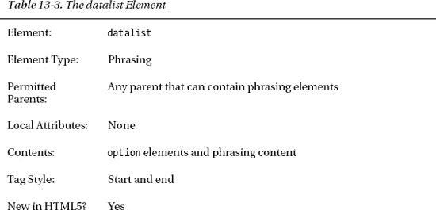
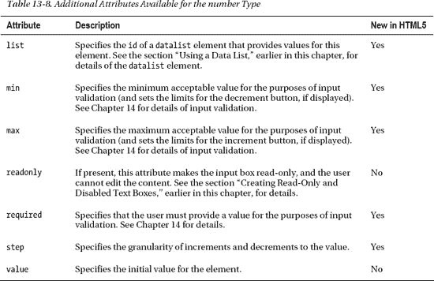

# 十三、定制输入元素

在前一章中，我向您展示了`input`元素的基本用法，它生成了一个简单的文本框，用户可以在其中输入数据。这种方法的问题是用户可以输入任何数据。这在某些情况下可能没问题，但在其他情况下，您可能希望从用户那里得到一个特定于*的*类型的数据值。在这种情况下，您可以配置`input`元素以不同的方式从用户那里收集数据。通过`type`属性配置`input`元素，HTML5 中有 23 个不同的值。在你选择了你想要的`type`值后，你就可以访问更多的属性了。总共有 30 个属性可用于`input`元素，其中许多只能用于某些`type`值。我将在本章中解释所有不同的类型和相关的属性。表 13-1 对本章进行了总结。

### 使用 input 元素进行文本输入

如果将`type`属性设置为`text`，浏览器将显示一个单行文本框。这与您在上一章中看到的`input`元素的样式相同，也是您完全省略`type`属性时使用的样式。表 13-2 总结了该`input`元素类型可用的属性(这些属性是对前一章所述属性的补充)。

在接下来的部分中，我将描述这种类型的`input`的可用属性。

 **提示**对于多行文本框，使用`textarea`元素，我在第十四章中描述过。

#### 指定元素尺寸

有两个属性会影响文本框的大小。`maxlength`属性指定用户可以输入的字符数的上限，而`size`属性指定文本框可以显示多少个字符。对于这两个属性，字符数都表示为正整数值。清单 13-1 展示了这两种属性的使用。

*清单 13-1。使用 maxlength 和 size 属性*

`<!DOCTYPE HTML>
<html>
    <head>
        <title>Example</title>
        <meta name="author" content="Adam Freeman"/>
        <meta name="description" content="A simple example"/>
        <link rel="shortcut icon" href="favicon.ico" type="image/x-icon" />
    </head>
    <body>        
        <form method="post" action="http://titan:8080/form">
            

                <label for="name">
                    Name: <input **maxlength="10"** id="name" name="name"/>
                </label>
            

            

                <label for="city">
                    City: <input **size="10"** id="city" name="city"/>
                </label>
            
            
            

                <label for="fave">
                    Fruit: <input **size="10" maxlength="10"** id="fave" name="fave"/>
                </label>
            

            <button type="submit">Submit Vote</button>
        </form>
    </body>
</html>`

对于第一个`input`元素，我应用了值为`10`的`maxlength`属性。这意味着浏览器可以自由决定文本框在屏幕上所占的空间，但用户最多只能输入十个字符。如果用户试图输入超过十个字符，浏览器将会丢弃输入。

对于第二个`input`元素，我已经应用了`size`属性，值也是`10`。这意味着浏览器必须确保调整文本框的大小，使其能够显示十个字符。`size`属性对用户可以输入的字符数没有任何限制。

我已经将这两个属性应用于第三个`input`元素。这具有固定屏幕大小和限制用户可以输入的字符数的效果。你可以在图 13-1 中看到这些属性是如何影响显示和数据输入的。

*图 13-1。使用 maxlength 和 size 属性*

在图 13-1 中，你可以看到浏览器中的布局以及提交表单时传递给服务器的数据。我在这个例子中使用了 Firefox，因为我的首选浏览器 Chrome 没有正确实现`size`属性。当查看已经提交给服务器的数据时，请注意`city`数据项包含的字符比屏幕上显示的要多。正如我提到的，这是因为`size`属性不限制用户可以输入的字符数，只限制浏览器可以显示的字符数。

#### 设置值和使用占位符

到目前为止，所有表单示例中的文本框都是空的，但情况不一定如此。您可以使用`value`属性指定一个默认值，使用`placeholder`属性给用户一个有用的提示，告诉他们应该输入哪种数据。清单 13-2 展示了这些使用中的属性。

*清单 13-2。使用值和占位符属性*

`<!DOCTYPE HTML>
<html>
    <head>
        <title>Example</title>
        <meta name="author" content="Adam Freeman"/>
        <meta name="description" content="A simple example"/>
        <link rel="shortcut icon" href="favicon.ico" type="image/x-icon" />
    </head>
    <body>        
        <form method="post" action="http://titan:8080/form">
            

                <label for="name">
                    Name: <input **placeholder="Your name"** id="name" name="name"/>
                </label>
            

            

                <label for="city">
                    City: <input **placeholder="Where you live"** id="city" name="city"/>
                </label>
            
            
            

                <label for="fave">
                    Fruit: <input **value="Apple"** id="fave" name="fave"/>
                </label>
            

            <button type="submit">Submit Vote</button>
        </form>
    </body>
</html>`

当您需要用户输入数据，并且希望提供一些上下文来帮助用户决定提供什么数据时，请使用`placeholder`属性。使用`value`属性提供一个默认值，或者是因为用户以前已经提供了这个信息，或者是因为这是一个很可能是正确的常见选择。你可以在图 13-2 中看到浏览器如何表示这些属性指定的值。

*图 13-2。提供占位符和默认值*

 **提示**当你使用按钮元素重置表单时(如第十二章所述)，浏览器会恢复占位符和默认值。

#### 使用数据列表

属性允许您指定一个`datalist`元素的`id`值，当用户在文本框中输入数据时，它将被用来向用户建议选项。表 13-3 描述了`datalist`元素。

`datalist`元素是 HTML5 中的新增元素，它允许您定义一组值来帮助用户提供您需要的数据。不同类型的输入元素使用`datalist`元素的方式略有不同。对于`text`类型，这些值被显示为自动完成建议。你通过`option`元素指定你想给用户的值，这在表 13-4 中有描述。

清单 13-3 显示了用于为文本框创建一组值的`datalist`和`option`元素。

 **提示**在第十四章中查看`select`和`optgroup`元素时会再次看到`option`元素。

*清单 13-3。使用数据列表元素*

`<!DOCTYPE HTML>
<html>
    <head>
        <title>Example</title>
        <meta name="author" content="Adam Freeman"/>
        <meta name="description" content="A simple example"/>
        <link rel="shortcut icon" href="favicon.ico" type="image/x-icon" />
    </head>
    <body>        
        <form method="post" action="http://titan:8080/form">
            

                <label for="name">
                    Name: <input placeholder="Your name" id="name" name="name"/>
                </label>
            

            

                <label for="city">
                    City: <input placeholder="Where you live" id="city" name="city"/>
                </label>
            
            
            

                <label for="fave">
                    Fruit: <input **list="fruitlist"** id="fave" name="fave"/>
                </label>
            

            <button type="submit">Submit Vote</button>
        </form>

**        <datalist id="fruitlist">
            <option value="Apples" label="Lovely Apples"/>
            <option value="Oranges">Refreshing Oranges</option>
            <option value="Cherries"/>
        </datalist>**

    </body>
</html>`

包含在`datalist`中的每个`option`元素代表一个您想要向用户建议的值。如果选择了`option`，则`value`属性指定将在`input`元素中使用的数据值。通过使用`label`属性或者通过在`option`元素中定义内容，您可以使用不同的标签来描述选项。你可以看到我已经为清单 13-3 中的`Apples`和`Oranges` `option`元素做了这些。图 13-3 显示了浏览器如何使用在`datalist`中定义的`option`元素。

*图 13-3。使用带有文本输入元素的数据表*

使用文本`input`类型时，使用不同的`label`时要小心；用户可能不明白为什么点击一个名为`Lovely Apples`的条目只会导致在文本框中输入`Apples`。有些浏览器，比如 Opera，在标签和值不同时会采取稍微不同的做法，如图图 13-4 所示。

*图 13-4。Opera 显示不同的值和标签*

这是一个改进(虽然注意到检测到了`label`属性，但是忽略了`option`元素的内容)，但是仍然会令人困惑。

#### 创建只读和禁用的文本框

属性`readonly`和`disabled`允许你创建用户不能编辑的文本框。每一种都创造了不同的视觉效果。清单 13-4 显示了这两个属性。

*清单 13-4。使用只读和禁用属性*

`<!DOCTYPE HTML>
<html>
    <head>
        <title>Example</title>
        <meta name="author" content="Adam Freeman"/>
        <meta name="description" content="A simple example"/>
        <link rel="shortcut icon" href="favicon.ico" type="image/x-icon" />
    </head>
    <body>        
        <form method="post" action="http://titan:8080/form">
            

                <label for="name">
                    Name: <input value="Adam" **disabled** id="name" name="name"/>
                </label>
            

            

                <label for="city">
                    City: <input value="Boston" **readonly** id="city" name="city"/>
                </label>
            
            
            

                <label for="fave">
                    Fruit: <input id="fave" name="fave"/>
                </label>
            

            <button type="submit">Submit Vote</button>
        </form>
    </body>
</html>`

你可以在图 13-5 中看到浏览器是如何处理这些属性的。

*图 13-5。使用禁用和只读属性*

清单 13-4 中的第一个`input`元素具有`disabled`属性，其作用是使文本框变灰，防止用户编辑文本。第二个`input`元素有`readonly`属性，它阻止用户编辑文本，但不影响文本框的外观。当你提交表单时，用`value`属性定义的值被提交给服务器，如图 13-6 所示。

*图 13-6。来自具有禁用和只读属性的输入元素的表单数据*

请注意，`input`元素中带有`disabled`属性的数据没有提交给服务器。如果您想要使用这个属性，并且您需要确保服务器接收到`input`元素的值，那么可以考虑添加一个`hidden`类型的`input`元素(参见本章后面的“使用输入元素创建隐藏数据项”一节)。

我的建议是谨慎使用`readonly`属性。尽管数据被提交给了用户，但是用户并不知道这个字段是不可编辑的；浏览器只是忽略击键，这可能会导致混乱。

#### 指定文本方向

`dirname`属性允许您指定提交给服务器的数据值的名称，并包含用户输入的数据的文本方向。在撰写本文时，主流浏览器都不支持该属性。

### 使用输入元件进行密码输入

`type`属性的`password`值创建了一个用于输入密码的`input`元素。用户键入的字符由屏蔽字符表示，例如星号(`*`)。表 13-5 列出了当`type`属性设置为`password`时可用的附加属性。其中许多与`text`型共享，工作方式相同。

清单 13-5 显示了正在使用的`password`类型。

*清单 13-5。使用密码类型*

`<!DOCTYPE HTML>
<html>
    <head>
        <title>Example</title>
        <meta name="author" content="Adam Freeman"/>
        <meta name="description" content="A simple example"/>
        <link rel="shortcut icon" href="favicon.ico" type="image/x-icon" />
    </head>
    <body>        
        <form method="post" action="http://titan:8080/form">
            

                <label for="name">
                    Name: <input value="Adam" id="name" name="name"/>
                </label>
            

            

                <label for="password">
                    Password: **<input type="password" placeholder="Min 6 characters"**
**                        id="password" name="password"/>**
                </label>
            
            
            

                <label for="fave">
                    Fruit: <input value="Apples" id="fave" name="fave"/>
                </label>
            

            <button type="submit">Submit Vote</button>
        </form>
    </body>
</html>`

在清单 13-5 的中，我使用了`placeholder`属性来给用户一些关于我期望的密码类型的指导。当用户开始键入时，浏览器会删除占位符并用圆形项目符号替换每个键入的字符(不同的浏览器使用不同的屏蔽字符)。你可以在图 13-7 中看到这个效果。

*图 13-7。使用输入元素*的密码类型

冒着显而易见的风险，屏蔽只适用于用户输入的文本显示。当你提交表单时，服务器收到明文的密码，正如你在图 13-8 中看到的，它显示了来自`Node.js`脚本的响应。

*图 13-8。提交包含密码字段*的表单

 **注意**`input`元素的`password`类型在提交给服务器时不保护密码。用户输入的值以明文形式传输。如果安全性对您的站点和应用很重要(应该如此)，您应该考虑使用 SSL/HTTPS 来加密浏览器和服务器之间的通信。

### 使用输入元素创建按钮

`input`元素的`submit`、`reset`和`button`类型创建的按钮与使用`button`元素时创建的按钮非常相似，在第十二章中有描述。表 13-6 总结了这些`input`类型。

使用`submit`类型时可用的附加属性与使用`button`元素时相同。你可以在第十二章中找到这些属性的描述和演示。`reset`和`button`类型没有定义任何额外的属性。

对于所有这三种`input`类型，显示在按钮上的标签取自`value`属性，如清单 13-6 所示。

*清单 13-6。使用输入元素创建按钮*

`<!DOCTYPE HTML>
<html>
    <head>
        <title>Example</title>
        <meta name="author" content="Adam Freeman"/>
        <meta name="description" content="A simple example"/>
        <link rel="shortcut icon" href="favicon.ico" type="image/x-icon" />
    </head>
    <body>        
        <form method="post" action="http://titan:8080/form">
            

                <label for="name">
                    Name: <input value="Adam" id="name" name="name"/>
                </label>
            

            

                <label for="password">
                    Password: <input type="password" placeholder="Min 6 characters"
                        id="password" name="password"/>
                </label>
            
            
            

                <label for="fave">
                    Fruit: <input value="Apples" id="fave" name="fave"/>
                </label>
            

**            <input type="submit" value="Submit Vote"/>**
**            <input type="reset" value="Reset Form"/>**
**            <input type="button" value="My Button"/>**
        </form>
    </body>
</html>`

你可以在图 13-9 中看到浏览器是如何显示这些按钮的。如您所见，它们与您使用`button`元素时的外观相同。

*图 13-9。使用输入元素创建按钮*

使用`input`元素创建按钮和使用`button`元素的区别在于，你可以使用`button`元素显示标记文本(你可以在第十二章中看到一个例子)。一些老的浏览器，特别是 IE6，对`button`元素做了奇怪的事情，这就是为什么大多数网站倾向于使用`input`元素——它们传统上被更一致地处理。

### 使用输入元素来限制数据输入

HTML5 为`input`元素的`type`属性引入了一些新值，让您可以更具体地了解您希望从用户那里获得的数据类型。在接下来的部分中，我将介绍每个新的`type`值并演示其用法。表 13-7 总结了这些新的`type`值。

这些`input`类型中的一些向用户提供了关于他们可能输入或选择的数据的限制类型的强烈视觉提示(例如，`checkbox`和`radiobutton`类型)。其他的，比如`email`和`url`类型，依赖于输入验证，我在第十四章的中描述过。

#### 使用输入元素获得一个数字

`type`属性的`number`值创建了一个只接受数值的输入框。一些浏览器，特别是 Chrome，还会显示选择器箭头来增加和减少数值。表 13-8 描述了使用该输入类型时可用的附加属性。

`min`、`max`、`step`和`value`属性的值可以用整数或小数表示；例如，`3`和`3.14`都有效。清单 13-7 显示了正在使用的`input`的`number`类型。

*清单 13-7。使用数字类型的输入元素*

`<!DOCTYPE HTML>
<html>
    <head>
        <title>Example</title>
        <meta name="author" content="Adam Freeman"/>
        <meta name="description" content="A simple example"/>
        <link rel="shortcut icon" href="favicon.ico" type="image/x-icon" />
    </head>
    <body>        
        <form method="post" action="http://titan:8080/form">
            

                <label for="name">
                    Name: <input value="Adam" id="name" name="name"/>
                </label>
            

            

                <label for="password">
                    Password: <input type="password" placeholder="Min 6 characters"
                        id="password" name="password"/>
                </label>
            
            
            

                <label for="fave">
                    Fruit: <input value="Apples" id="fave" name="fave"/>
                </label>
            

            

                <label for="price">
                    $ per unit in your area:
**                    <input type="number" step="1" min="0" max="100"**
**                          value="1" id="price" name="price"/>**
                </label>
            

            <input type="submit" value="Submit Vote"/>
        </form>
    </body>
</html>`

在清单 13-7 中，我请求用户支付他们所在地区最喜欢的水果的价格。我指定了最小值`1`，最大值`100`，步长`1`，起始值`1`。你可以在图 13-10 中看到浏览器是如何显示这种类型的`input`元素的。在这个图中，我展示了 Firefox 和 Chrome 请注意，Chrome 显示了小箭头按钮，可以用来增加数值，但 Firefox 没有。

*图 13-10。Chrome 和 Firefox 显示输入元素的数字类型*

#### 使用输入元素获得一个给定范围内的数字

获取数值的另一种方法是使用`input`元素的`range`类型，它限制用户从预定的范围内选择一个值。`range`类型支持与`number`类型相同的属性集(如表 13-8 所示)，但是浏览器显示元素的方式不同。清单 13-8 显示了正在使用的`range`型。

*清单 13-8。使用输入元素*的范围类型

`<!DOCTYPE HTML>
<html>
    <head>
        <title>Example</title>
        <meta name="author" content="Adam Freeman"/>
        <meta name="description" content="A simple example"/>
        <link rel="shortcut icon" href="favicon.ico" type="image/x-icon" />
    </head>
    <body>        
        <form method="post" action="http://titan:8080/form">
            

                <label for="name">
                    Name: <input value="Adam" id="name" name="name"/>
                </label>
            

            

                <label for="password">
                    Password: <input type="password" placeholder="Min 6 characters"
                        id="password" name="password"/>
                </label>
            
            
            

                <label for="fave">
                    Fruit: <input value="Apples" id="fave" name="fave"/>
                </label>
            

            

                <label for="price">
                    $ per unit in your area: **1**
                    <input type="**range**" step="1" min="0" max="100"
                          value="1" id="price" name="price"/>**100**
                </label>
            

            <input type="submit" value="Submit Vote"/>
        </form>
    </body>
</html>`

你可以在图 13-11 中看到浏览器如何显示`range`类型。

*图 13-11。使用输入元素*的范围类型

#### 使用输入元素获得布尔响应

`input`元素的`checkbox`类型创建一个复选框，允许用户做出真/假选择。`type`属性的这个值支持表 13-9 中显示的附加属性。

清单 13-9 显示了正在使用的`input`元素的`checkbox`类型。

*清单 13-9。使用输入元素创建复选框*

`<!DOCTYPE HTML>
<html>
    <head>
        <title>Example</title>
        <meta name="author" content="Adam Freeman"/>
        <meta name="description" content="A simple example"/>
        <link rel="shortcut icon" href="favicon.ico" type="image/x-icon" />
    </head>
    <body>        
        <form method="post" action="http://titan:8080/form">
            

                <label for="name">
                    Name: <input value="Adam" id="name" name="name"/>
                </label>
            

            

                <label for="password">
                    Password: <input type="password" placeholder="Min 6 characters"
                        id="password" name="password"/>
                </label>
            
            
            

                <label for="fave">
                    Fruit: <input value="Apples" id="fave" name="fave"/>
                </label>
            

            

                <label for="veggie">
                   Are you vegetarian: **<input type="checkbox" id="veggie" name="veggie"/>**
                </label>
            
            
            <input type="submit" value="Submit Vote"/>
        </form>
    </body>
</html>`

你可以在图 13-12 中看到浏览器是如何显示这种`input`元素的。

*图 13-12。创建带有输入元素* 的复选框

使用`checkbox`类型的问题是，当提交表单时，只有当用户选中复选框时，数据值才会被发送到服务器。因此，如果我提交如图图 13-12 所示的表单，我会得到如图图 13-13 所示的`Node.js`脚本的响应。

*图 13-13。表单提交的数据项如上图*所示

请注意，`password`元素有一个值，但`checkbox`没有。缺少`checkbox`类型`input`元素的数据项表示用户没有选中该框；数据值的出现表示用户已经勾选了该复选框，如图图 13-14 所示。

*图 13-14。提交复选框被选中的表单*

#### 使用输入元素创建固定选项

元素的类型允许您创建一组单选按钮，让用户从一组固定的选项中进行选择。当只有少量有效数据值可供使用时，这很有用。表 13-10 描述了此类`input`元素支持的附加属性。

每个类型为`radio`的`input`元素代表用户的一个选项。通过确保所有的`input`元素都具有相同的`name`属性值，可以创建一组独占选项。你可以在清单 13-10 中看到这是如何工作的。

*清单 13-10。使用广播类型创建固定选择*

`<!DOCTYPE HTML>
<html>
    <head>
        <title>Example</title>
        <meta name="author" content="Adam Freeman"/>
        <meta name="description" content="A simple example"/>
        <link rel="shortcut icon" href="favicon.ico" type="image/x-icon" />
    </head>
    <body>        
        <form method="post" action="http://titan:8080/form">
            

                <label for="name">
                    Name: <input value="Adam" id="name" name="name"/>
                </label>
            

            

                <label for="password">
                    Password: <input type="password" placeholder="Min 6 characters"
                        id="password" name="password"/>
                </label>
            
            
            

**                <fieldset>
                    <legend>Vote for your favorite fruit</legend>
                    <label for="apples">
                        <input type="radio" checked value="Apples" id="apples"
                            name="fave"/>
                        Apples
                    </label>
                    <label for="oranges">
                        <input type="radio" value="Oranges" id="oranges" name="fave"/>
                        Oranges
                    </label>
                    <label for="cherries">
                        <input type="radio" value="Cherries" id="cherries" name="fave"/>
                        Cherries
                    </label>
                </fieldset>**
            
           
            <input type="submit" value="Submit Vote"/>
        </form>
    </body>
</html>`

在这个例子中，我创建了三个`radio`类型的`input`元素。这三者的`name`属性的值都是`fave`，这意味着浏览器会将它们视为彼此相关。这意味着选择其中一个按钮将导致其他两个按钮被取消选择。我使用了`value`属性来指定提交表单时发送给服务器的数据值，并使用了`fieldset`和`legend`属性来给用户一个三个按钮相关的视觉提示(这是可选的；第十二章中的描述了`fieldset`和`legend`元素。我已经在第一个`radio`元素上应用了`checked`属性，因此总是有一个值被选中。你可以在图 13-15 中看到浏览器如何显示这些输入元素。

*图 13-15。使用 input 元素创建一组单选按钮*

最多会勾选一个单选按钮。如果没有应用`checked`属性并且用户没有做出选择，则不能有选中的按钮。像`input`元素的`checkbox`类型一样，如果元素没有被选中，没有值会被提交给服务器，这意味着如果用户没有做出选择，没有数据项会出现。

#### 使用输入元素获得格式化字符串

`email`、`tel`和`url`类型值分别配置`input`元素只接受有效的电子邮件地址、电话号码或 URL 输入。这三种类型都支持表 13-11 中所示的附加属性。

`email`类型还支持`multiple`属性，当应用该属性时，允许 input 元素接受多个电子邮件地址。您可以看到清单 13-11 中使用的所有三种类型的`input`元素。

*清单 13-11。使用电子邮件、电话和 url 输入类型*

`<!DOCTYPE HTML>
<html>
    <head>
        <title>Example</title>
        <meta name="author" content="Adam Freeman"/>
        <meta name="description" content="A simple example"/>
        <link rel="shortcut icon" href="favicon.ico" type="image/x-icon" />
    </head>
    <body>        
        <form method="post" action="http://titan:8080/form">
            

                <label for="name">
                    Name: <input value="Adam" id="name" name="name"/>
                </label>
            

            

                <label for="password">
                    Password: <input type="password" placeholder="Min 6 characters"
                        id="password" name="password"/>
                </label>
            

            

                <label for="email">
                    Email: **<input type="email" placeholder="user@domain.com"**
**                        id="email" name="email"/>**
                </label>
            
            
            

                <label for="tel">
                    Tel: **<input type="tel" placeholder="(XXX)-XXX-XXXX"**
**                        id="tel" name="tel"/>**
                </label>
            
         
            

                <label for="url">
                    Your homepage: **<input type="url" id="url" name="url"/>**
                </label>
            
         
            <input type="submit" value="Submit Vote"/>
        </form>
    </body>
</html>`

这些`input`类型对用户来说是常规的文本框，只在提交表单时验证用户输入的数据。这是新的 HTML5 输入验证支持的一部分，我在第十四章中描述过。验证的质量是可变的。所有主流浏览器都能很好地处理`email`类型，并正确检测有效的电子邮件地址。`url`型有点碰运气。一些浏览器简单地将`http://`添加到用户输入的任何内容前面，一些浏览器要求用户输入以`http://`开头的值，但不验证其余的值，还有一些浏览器只让用户提交任何值而不验证。`tel`输入类型是最不受支持的。在我写这篇文章的时候，主流浏览器都没有应用任何有用的验证。

#### 使用输入元素获取时间和日期

HTML5 还引入了一些`input`元素类型来收集用户的日期和时间。表 13-12 描述了这些输入类型。

众所周知，日期和时间很难处理，可悲的是，这些新的`input`元素类型的规范与理想状态相差甚远。日期格式取自 RFC 3339(可从`http://tools.ietf.org/html/rfc3339`获得)，它描述了严格描述和格式化的时间戳。这是一种非常不同的日期表达方式，不同于实际使用的和用户所期望的许多地区差异。例如，很少用户会意识到`datetime`格式中的`T`表示时间段的开始，而`Z`表示不变的*祖鲁语*时区。表 13-12 中描述的所有`input`元素类型都支持表 13-13 中描述的附加属性。

清单 13-12 显示了正在使用的`date`型。

*清单 13-12。使用输入元素*的日期类型

`<!DOCTYPE HTML>
<html>
    <head>
        <title>Example</title>
        <meta name="author" content="Adam Freeman"/>
        <meta name="description" content="A simple example"/>
        <link rel="shortcut icon" href="favicon.ico" type="image/x-icon" />
    </head>
    <body>        
        <form method="post" action="http://titan:8080/form">
            

                <label for="name">
                    Name: <input value="Adam" id="name" name="name"/>
                </label>
            

            

                <label for="password">
                    Password: <input type="password" placeholder="Min 6 characters"
                        id="password" name="password"/>
                </label>
            
            
            

                <label for="fave">
                    Fruit: <input value="Apples" id="fave" name="fave"/>
                </label>
            

            

                <label for="lastbuy">
                   When did you last buy: <input type="date"
                      id="lastbuy" name="lastbuy"/>
                </label>
            
            
            <input type="submit" value="Submit Vote"/>
        </form>
    </body>
</html>`

浏览器对这些新的`input`类型的支持仍然非常有限。在我写这篇文章的时候，Opera 提供了最好的支持，并提供了一个日期选择器小部件，如图 13-16 所示。

*图 13-16。选择与 Opera 的约会*

下一个最好的实现是在 Chrome 中，它提供了与`input`元素的`number`类型相同的文本框，带有小的上下按钮来增加和减少时间。其他主流浏览器只是预设了一个单行文本框，让用户自己解决所有问题。我确信这种情况会得到改善，但在此之前，我建议查看流行的 JavaScript 库(如 jQuery)中的日历选择器。

#### 使用输入元素获得颜色

`input`元素的`color`类型限制用户选择颜色。这个`input`类型支持附加属性`list`，我在本章前面的“使用数据列表”一节中描述了这个属性。

颜色值精确地表示为七个字符:一个前导字符`#`，后面跟着三个两位数的十六进制值，代表红色、绿色和蓝色值(例如，`#FF1234`)。不支持 CSS 颜色名称，如`red`或`black`。你可以在清单 13-13 的中看到这种类型的`input`元素。

*清单 13-13。使用输入元素的颜色类型*

`<!DOCTYPE HTML>
<html>
    <head>
        <title>Example</title>
        <meta name="author" content="Adam Freeman"/>
        <meta name="description" content="A simple example"/>
        <link rel="shortcut icon" href="favicon.ico" type="image/x-icon" />
    </head>
    <body>        
        <form method="post" action="http://titan:8080/form">
            

                <label for="name">
                    Name: <input value="Adam" id="name" name="name"/>
                </label>
            

            

                <label for="password">
                    Password: <input type="password" placeholder="Min 6 characters"
                        id="password" name="password"/>
                </label>
            

            

                <label for="fave">
                    Favorite Fruit: <input type="text" id="fave" name="fave"/>
                </label>
            

            

                <label for="color">
                    Color: **<input type="color" id="color" name="color"/>**
                </label>
            

            <input type="submit" value="Submit Vote"/>
        </form>
    </body>
</html>`

大多数浏览器都没有实现对这种类型的`input`元素的任何特殊支持。Google Chrome 允许用户输入一个值，并在执行输入验证时报告格式问题(我在第十四章中描述过)。Opera 提供了最好的支持，它显示了一个简单的颜色选择器，可以扩展为一个全范围的颜色选择器对话框，如图图 13-17 所示。

*图 13-17。Opera 中的颜色选择器支持*

### 使用输入元素获取搜索词

`input`元素的`search`类型为用户提供了一个单行文本框，用于输入搜索词。这是一个不寻常的`input`类型，因为它实际上什么也不做。对用户可以输入的数据没有内置限制，也没有特殊功能，例如搜索本地页面或使用用户的默认搜索引擎来执行搜索。这种类型的`input`元素支持与`text`类型相同的附加属性，你可以在清单 13-14 中看到它的使用。

*清单 13-14。使用输入元素*的搜索类型

`<!DOCTYPE HTML>
<html>
    <head>
        <title>Example</title>
        <meta name="author" content="Adam Freeman"/>
        <meta name="description" content="A simple example"/>
        <link rel="shortcut icon" href="favicon.ico" type="image/x-icon" />
    </head>
    <body>        
        <form method="post" action="http://titan:8080/form">
            

                <label for="name">
                    Name: <input value="Adam" id="name" name="name"/>
                </label>
            

            

                <label for="password">
                    Password: <input type="password" placeholder="Min 6 characters"
                        id="password" name="password"/>
                </label>
            

            

                <label for="fave">
                    Favorite Fruit: <input type="text" id="fave" name="fave"/>
                </label>
            

            

                <label for="search">
                    Search: **<input type="search" id="search" name="search"/>**
                </label>
            

            <input type="submit" value="Submit Vote"/>
        </form>
    </body>
</html>`

浏览器可以选择显示文本框的方式，使其明显显示您正在收集搜索词。谷歌浏览器会显示一个标准的文本框，直到用户开始输入，这时会显示一个取消图标，如图图 13-18 所示。在撰写本文时，其他主流浏览器只是将这种类型的`input`视为普通的`text`类型。

*图 13-18。谷歌浏览器显示的输入搜索类型*

### 使用输入元素创建隐藏数据项

有时，您希望确保在提交表单时将数据项发送到服务器，而不向用户显示或允许编辑它们。一个常见的例子是当 web 应用向用户显示数据库记录以供编辑时。您经常需要在 web 页面中包含主键，这样您就能以简单、方便的方式知道用户正在编辑哪条记录，但是您不想向用户显示这些信息。您使用`input`元素的`hidden`类型来实现这种效果。清单 13-15 展示了如何使用这种类型的`input`元素。

*清单 13-15。创建隐藏类型输入元素*

`<!DOCTYPE HTML>
<html>
    <head>
        <title>Example</title>
        <meta name="author" content="Adam Freeman"/>
        <meta name="description" content="A simple example"/>
        <link rel="shortcut icon" href="favicon.ico" type="image/x-icon" />
    </head>
    <body>        
        <form method="post" action="http://titan:8080/form">
**            <input type="hidden" name="recordID" value="1234"/>**
            

                <label for="name">
                    Name: <input value="Adam" id="name" name="name"/>
                </label>
            

            

                <label for="password">
                    Password: <input type="password" placeholder="Min 6 characters"
                        id="password" name="password"/>
                </label>
            

            

                <label for="fave">
                    Favorite Fruit: <input type="text" id="fave" name="fave"/>
                </label>
            

            <input type="submit" value="Submit Vote"/>
        </form>
    </body>
</html>`

在本例中，我创建了一个`hidden` `input`元素，其`name`属性的值为`recordID`，其`value`属性为`1234`。当页面显示时，浏览器不提供任何输入元素的可视化表示，如图 13-19 所示。

*图 13-19。带有隐藏输入元素的网页*

当用户提交表单时，浏览器使用我们为`hidden` `input`元素提供的`name`和`value`包含一个数据项。你可以在图 13-20 中看到这一点，它显示了提交上图所示的表单时来自`Node.js`脚本的响应。

*图 13-20。来自服务器的响应显示隐藏的数据值*

 **注意**这种输入元素只适用于为了方便或可用性而被隐藏的数据，而不是因为它敏感或对安全性有影响。用户可以通过查看页面的 HTML 来查看隐藏的输入元素，数据值以明文形式从浏览器发送到服务器。大多数 web 应用框架都支持将敏感数据安全地保存在服务器上，并基于会话标识符(通常表示为 cookies)将其与请求相关联。

### 使用输入元素创建图像按钮和地图

`input`元素的`image`类型允许您创建显示图像的按钮，并在单击时提交表单。这种类型的`input`元素支持表 13-14 中显示的附加属性。

清单 13-16 显示了正在使用的`input`元素的`image`类型。

*清单 13-16。使用输入元素的图像类型*

`<!DOCTYPE HTML>
<html>
    <head>
        <title>Example</title>
        <meta name="author" content="Adam Freeman"/>
        <meta name="description" content="A simple example"/>
        <link rel="shortcut icon" href="favicon.ico" type="image/x-icon" />
    </head>
    <body>        
        <form method="post" action="http://titan:8080/form">
            <input type="hidden" name="recordID" value="1234"/>
            

                <label for="name">
                    Name: <input value="Adam" id="name" name="name"/>
                </label>
            

            

                <label for="password">
                    Password: <input type="password" placeholder="Min 6 characters"
                        id="password" name="password"/>
                </label>
            

            

                <label for="fave">
                    Favorite Fruit: <input type="text" id="fave" name="fave"/>
                </label>
            

**            <input type="image" src="accept.png" name="submit"/>**
        </form>
    </body>
</html>`

你可以在图 13-21 中看到浏览器是如何显示这种类型的`input`元素的。

*图 13-21。使用图像类型的输入元素*

当用户单击图像时，浏览器提交表单并包含两个代表`image` `input`元素的数据项。这些表示用户点击的 x 和 y 坐标，相对于图像的左上角。您可以在图 13-22 中看到数据值是如何提交的，图中显示了提交上图中的表单时来自`Node.js`脚本的响应。

*图 13-22。Node.js 对包含图像输入元素*的表单的响应

提供坐标的事实意味着您可以使用包含区域的图像，这些区域根据用户在图像上单击的位置来表示不同的动作和对用户的响应。

### 使用输入元素上传文件

`input`元素的最后一种类型是`file`，它允许您将文件上传到服务器，作为表单提交的一部分。这种类型的`input`支持表 13-15 中显示的附加属性。

清单 13-17 显示了正在使用的`input`元素的`file`类型。

*清单 13-17。使用输入元素的文件类型上传文件*

`<!DOCTYPE HTML>
<html>
    <head>
        <title>Example</title>
        <meta name="author" content="Adam Freeman"/>
        <meta name="description" content="A simple example"/>
        <link rel="shortcut icon" href="favicon.ico" type="image/x-icon" />
    </head>
    <body>        
        <form method="post" action="http://titan:8080/form"
**            enctype="multipart/form-data"**>
            <input type="hidden" name="recordID" value="1234"/>
            

                <label for="name">
                    Name: <input value="Adam" id="name" name="name"/>
                </label>
            

            

                <label for="password">
                    Password: <input type="password" placeholder="Min 6 characters"
                        id="password" name="password"/>
                </label>
            

            

                <label for="fave">
                    Favorite Fruit: <input type="text" id="fave" name="fave"/>
                </label>
            

            

**                <input type="file" name="filedata"/>**
            

            <input type="submit" value="Submit"/>
        </form>
    </body>
</html>`

只有当表单的编码类型为`multipart/form-data`时，您才能上传文件。如您所见，我使用了`form`元素的`enctype`属性来设置编码。你可以在图 13-23 中看到浏览器如何显示输入元素。

*图 13-23。输入元素的文件类型*

当用户点击`Choose File`按钮时，会出现一个对话框，允许用户选择一个文件。提交表单时，文件的内容将被发送到服务器。

### 总结

在这一章中，我已经向你展示了许多不同类型的`input`元素。没有其他 HTML 元素有这么多不同的功能，任何需要与用户交互的网页或 web 应用都将严重依赖于`input`元素。

在下一章，我将向你展示一些你可以在表单中使用的其他类型的元素。我还将演示新的 HTML5 输入验证特性，该特性允许您在提交表单之前检查用户是否输入了您想要处理的数据类型。