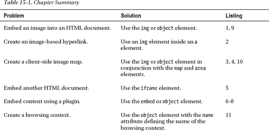
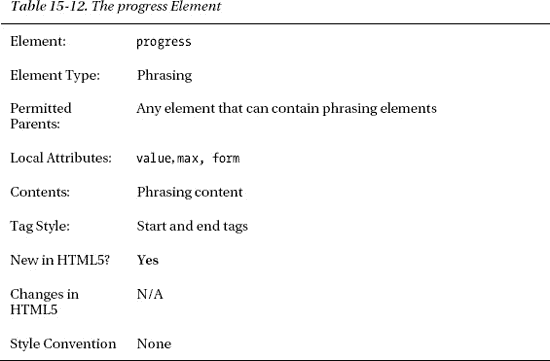
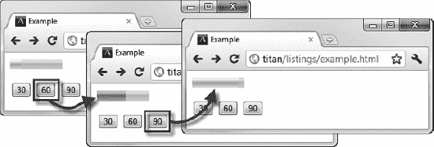

# 十五、嵌入内容

在这一章中，我介绍了可以用来在 HTML 文档中嵌入内容的元素。到目前为止，我主要关注于使用 HTML 元素在文档中创建结构和含义。本章中的元素允许您丰富这些文档。

 **注意**一些用于嵌入内容的 HTML5 元素在本书的其他地方有所涉及。有关详细信息，请参见本章末尾的“其他嵌入元素”一节。

表 15-1 对本章进行了总结。

### 嵌入图像

元素允许你在 HTML 文档中嵌入图片。表 15-2 总结了这个元素，它是 HTML 中使用最广泛的元素之一。

要嵌入图像，需要使用`src`和`alt`属性，如清单 15-1 所示。

*清单 15-1。嵌入图像*

`<!DOCTYPE HTML>
<html>
    <head>
        <title>Example</title>
        <meta name="author" content="Adam Freeman"/>
        <meta name="description" content="A simple example"/>
        <link rel="shortcut icon" href="favicon.ico" type="image/x-icon" />
    </head>
    <body>
        Here is a common form for representing the three activities in a triathlon.
        

**            **
        

        The first icon represents swimming, the second represents cycling and the third
        represents running.
    </body>
</html>`

属性指定了您想要嵌入的图像的 URL。在本例中，我为图像文件`triathlon.png`指定了一个相对 URL。`alt`属性定义了`img`元素的*回退内容*。如果图像无法显示(因为找不到图像，因为浏览器不支持图像格式，或者因为浏览器或用户使用的设备无法显示图像)，将显示此内容。你可以在图 15-1 中看到图像。

*图 15-1。用 img 元素嵌入图像*

使用`width`和`height`属性来指定由`img`元素显示的图像的大小(以像素为单位)。图像直到 HTML 标记被处理后才被加载，这意味着如果你忽略了`width`和`height`属性，浏览器不知道屏幕上有多少空间分配给图像。因此，浏览器必须从图像文件本身确定大小，然后在屏幕上重新定位内容以适应它。这可能会让用户感到不舒服，因为他们可能已经开始阅读直接包含在 HTML 中的内容了。指定`width`和`height`属性让浏览器有机会在页面上正确地布局元素，即使图像还没有被加载。

 **注意**`width`和`height`属性告诉浏览器图像的大小，而不是你想要的大小。您不应该使用这些属性来动态调整图像的大小。

#### 在超链接中嵌入图像

`img`元素的一个常见用途是结合`a`元素创建一个基于图像的超链接(我在第八章中描述过)。这是基于图像的表单提交按钮的对应按钮(在第十二章中描述)。清单 15-2 展示了如何一起使用`img`和`a`元素。

*清单 15-2。使用 img 和 a 元素创建服务器端图像映射*

`<!DOCTYPE HTML>
<html>
    <head>
        <title>Example</title>
        <meta name="author" content="Adam Freeman"/>
        <meta name="description" content="A simple example"/>
        <link rel="shortcut icon" href="favicon.ico" type="image/x-icon" />
    </head>
    <body>
        Here is a common form for representing the three activities in a triathlon.
        

**            <a href="otherpage.html">**
                
**            </a>**
        

        The first icon represents swimming, the second represents cycling and the third
        represents running.
    </body>
</html>`

浏览器显示图像没有任何不同，正如你在图 15-2 中看到的。因此，重要的是给用户视觉提示，特定的图像代表超链接。这可以通过 CSS 来完成，或者最好是通过图像的内容来完成。

*图 15-2。在超链接中嵌入图像*

如果你点击图片，浏览器将导航到由父元素`a`的`href`属性指定的 URL。如果您将`ismap`属性应用到`img`元素，您将创建一个*服务器端图像映射*，这意味着您在图像上单击的位置将被附加到 URL 上。例如，如果您单击了距离图像顶部 4 个像素和距离图像左边缘 10 个像素的位置，浏览器将导航到以下位置:

`http://titan/listings/otherpage.html?10,4`

(很明显，这个 URL 是基于我从我的开发服务器`titan`加载原始 HTML 文档的事实，`a`元素上的`href`属性是一个相对 URL。)清单 15-3 展示了`otherpage.html`的内容，它包含了一个简单的脚本，显示了点击的坐标。

*清单 15-3。otherpage.html 的内容*

`<!DOCTYPE HTML>
<html>
    <head>
        <title>Other Page</title>
    </head>
    <body>
        
The X-coordinate is <b>??</b>

        
The Y-coordinate is <b>??</b>

        
    </body>
</html>`

你可以在图 15-3 中看到鼠标点击的效果。

*图 15-3。显示鼠标点击超链接中嵌入的图像的坐标*

服务器端图像映射的假设是，当用户单击图像的不同区域时，服务器会有不同的反应，可能会返回不同的响应。如果从`img`元素中省略了`ismap`属性，鼠标点击的坐标就不会包含在请求的 URL 中。

#### 创建客户端图像地图

您可以创建一个*客户端图像地图*，点击图像中的区域会导致浏览器导航到不同的 URL。这不需要来自服务器的任何指示，这意味着您需要定义图像的区域以及它们导致使用元素的动作。客户端图像地图的关键元素是`map`，总结在表 15-3 中。

`map`元素包含一个或多个`area`元素，每个元素表示图像中可以点击的区域。表 15-4 总结了`area`要素。

`area`元素的属性可以分为两类，第一类是当用户点击`area`所代表的图像区域时，浏览器将导航到的 URL。这些在表 15-5 中有描述，类似于你在其他元素上看到的相应属性。

更有趣的属性形成了第二个类别:`shape`和`coords`属性。您使用这些来表示用户可以点击的图像区域。`shape`和`coords`属性一起工作。`coords`属性的含义取决于`shape`属性的值，如表 15-6 所述。

现在，我已经描述了元素，我们可以继续一个例子。演示图像地图的困难之一是`area`元素在浏览器屏幕上是不可见的。为此，图 15-4 展示了我打算在例子中定义的两个区域，使用了前一节的`triathlon.png`图像。为了简单起见，我把两个区域都做成矩形。

*图 15-4。规划图像地图的区域*

从这个图中，你可以创建地图和区域元素，如清单 15-4 所示。

*清单 15-4。创建图像地图*

`<!DOCTYPE HTML>
<html>
    <head>
        <title>Example</title>
        <meta name="author" content="Adam Freeman"/>
        <meta name="description" content="A simple example"/>
        <link rel="shortcut icon" href="favicon.ico" type="image/x-icon" />
    </head>
    <body>
        Here is a common form for representing the three activities in a triathlon.
        

            
        

        The first icon represents swimming, the second represents cycling and the third
        represents running.

**        <map name="mymap">**
**            <area href="swimpage.html" shape="rect" coords="3,5,68,62" alt="Swimming"/>**
**            <area href="cyclepage.html" shape="rect" coords="70,5,130,62" alt="Running"/>**
**            <area href="otherpage.html" shape="default" alt="default"/>**
**        </map>**
    </body>
</html>`

注意在`img`元素上添加了`usemap`属性。这个属性的值必须是一个*散列名称引用*，这意味着一个以`#`字符开头的字符串，后面是您想要使用的地图的`name`属性的值——在本例中是`#mymap`。这就是如何将`map`元素与图像相关联。

如果用户点击图像的游泳部分，浏览器导航到`swimpage.html`。如果用户点击图像的循环部分，浏览器会导航到`cyclepage.html`。点击图像上的任何其他地方，浏览器就会导航到`otherpage.html`。

 **提示**注意，在使用客户端图像地图时，不需要使用`a`元素来显式创建超链接。

### 嵌入另一个 HTML 文档

元素允许你在现有的文档中嵌入另一个 HTML 文档。表 15-7 总结了这一要素。

清单 15-5 展示了如何使用`iframe`元素。

*清单 15-5。使用 iframe 元素*

`<!DOCTYPE HTML>
<html>
    <head>
        <title>Example</title>
        <meta name="author" content="Adam Freeman"/>
        <meta name="description" content="A simple example"/>
        <link rel="shortcut icon" href="favicon.ico" type="image/x-icon" />
    </head>
    <body>
          <header>
            <h1>Things I like</h1>
            <nav>
                <ul>
                    <li>
                        <a href="fruits.html" **target="frame"**>Fruits I Like</a>
                    </li>
                    <li>
                        <a href="activities.html" **target="frame"**>Activities I Like</a>
                    </li>
                </ul>
            </nav>
        </header>

**        <iframe name="myframe" width="300" height="100">**
**        </iframe>  **
    </body>
</html>`

在这个例子中，我创建了一个`iframe`，它的`name`属性值为`frame`。这创建了一个名为`myframe`的*浏览上下文*。然后，我可以将这个浏览上下文与其他元素的目标属性一起使用，具体来说就是 `a`、`form`、`button`、`input`和`base`。我使用`a`元素来创建一对超链接，当跟随它们时，会将它们的`href`属性中指定的 URL 加载到`iframe`中。你可以在图 15-5 中看到这是如何工作的。

*图 15-5。使用 iframe 嵌入外部 HTML 文档*

`width`和`height`属性以像素为单位指定尺寸。`src`属性指定了最初应该在`iframe`中加载和显示的 URL，而`srcdoc`属性允许您定义一个 HTML 文档来内联显示。

HTML5 为`iframe`元素引入了两个新属性。第一个是`seamless`，指示浏览器显示`iframe`内容，就好像它们是主 HTML 文档的一个组成部分。从图中可以看到，默认情况下应用了边框，如果内容大于由`width`和`height`属性指定的大小，就会出现滚动条。

第二个属性`sandbox`，对 HTML 文档进行限制。当应用的属性没有值时，如下所示:

`...
<iframe **sandbox** name="myframe" width="300" height="100">
</iframe>  
...`

以下是禁用的:

*   剧本
*   形式
*   插件
*   指向其他浏览上下文的链接

此外，`iframe`中的内容被视为来自不同于 HTML 文档其他部分的来源，这加强了额外的安全措施。您可以通过定义`sandbox`属性的值来启用单个特性，如下所示:

`...
<iframe **sandbox="allow-forms"** name="myframe" width="300" height="100">
</iframe>  
...`

可使用的一组数值在表 15-8 中描述。不幸的是，在我写这篇文章的时候，主流浏览器都不支持沙盒和无缝属性，所以我也无法演示。

### 使用插件嵌入内容

`object`和`embed`元素都是作为一种扩展浏览器功能的方式出现的，通过增加对插件的支持，插件可以处理浏览器不直接支持的内容。这些元素是在我在《??》第一章中提到的浏览器大战期间引入的，每个元素都是由不同的阵营构想出来的。

最近，`object`元素已经成为 HTML4 规范的一部分，但是`embed`元素还没有——尽管`embed`元素已经被广泛使用。为了使这两个元素对等，HTML5 增加了对`embed`元素的支持。为了兼容，这给了你两个非常相似的元素。

虽然`object`和`embed`元素一般用于插件，但是也可以用来嵌入浏览器可以直接处理的内容，比如图片。在本节的后面，我将向您演示为什么这很有用。

#### 使用嵌入元素

我将从`embed`元素开始，由表 15-9 总结。

清单 15-6 显示了使用中的`embed`元素。对于这个例子，我嵌入了一个来自`[www.youtube.com](http://www.youtube.com)`的视频，展示了一些谷歌工程师关于 HTML5 的演讲。

*清单 15-6。使用嵌入元素*

`<!DOCTYPE HTML>
<html>
    <head>
        <title>Example</title>
        <meta name="author" content="Adam Freeman"/>
        <meta name="description" content="A simple example"/>
        <link rel="shortcut icon" href="favicon.ico" type="image/x-icon" />
    </head>
    <body>
**        <embed src="http://www.youtube.com/v/qzA60hHca9s?version=3"**
**               type="application/x-shockwave-flash" width="560" height="349"**
**               allowfullscreen="true"/>**
    </body>
</html>`

属性指定内容的位置，属性指定内容的 MIME 类型，以便浏览器知道如何处理它。`width`和`height`属性决定了嵌入内容在屏幕上占据的大小。您应用的任何其他属性都被视为插件或内容的参数。在本例中，我应用了一个名为 `allowfullscreen`的属性，YouTube 视频播放器使用它来支持全屏观看。你可以在图 15-6 中看到浏览器是如何渲染这些内容的。

*图 15-6。嵌入 YouTube 视频*

#### 使用 object 和 param 元素

`object`元素实现了与`embed`元素相同的结果，但是它的工作方式略有不同，并且有一些额外的特性。表 15-10 总结了`object`元素。

清单 15-7 展示了如何使用`object`元素来嵌入与上例相同的 YouTube 视频。

*清单 15-7。使用对象和参数属性*

`<!DOCTYPE HTML>
<html>
    <head>
        <title>Example</title>
        <meta name="author" content="Adam Freeman"/>
        <meta name="description" content="A simple example"/>
        <link rel="shortcut icon" href="favicon.ico" type="image/x-icon" />
    </head>
    <body>
**        <object width="560" height="349"**
**            data="http://www.youtube.com/v/qzA60hHca9s?version=3"**
**            type="application/x-shockwave-flash">**
**            <param name="allowFullScreen" value="true"/>**
**        </object>             **
    </body>
</html>`

`data`属性提供了内容的位置，`type`、`width`和`height`属性与`embed`元素的含义相同。使用`param`元素定义将传递给插件的参数。您为每个需要定义的参数使用一个`param`元素。该元素总结在表 15-11 中。正如您可能想象的那样，`name`和`value`属性定义了参数的`name`和`value`。

##### 指定回退内容

元素的优点之一是，如果您指定的内容不可用，您可以包含将显示的内容。清单 15-8 提供了一个简单的演示。

*清单 15-8。使用对象元素*的回退内容特性

`<!DOCTYPE HTML>
<html>
    <head>
        <title>Example</title>
        <meta name="author" content="Adam Freeman"/>
        <meta name="description" content="A simple example"/>
        <link rel="shortcut icon" href="favicon.ico" type="image/x-icon" />
    </head>
    <body>
        <object width="560" height="349" **data="http://titan/myimaginaryfile"**>
            <param name="allowFullScreen" value="true"/>
**            <b>Sorry!</b> We can't display this content**
        </object>             
    </body>
</html>` 

在这个例子中，我使用了`data`属性来引用一个不存在的文件。浏览器将尝试加载这个不存在的内容，如果加载失败，将显示`object`元素中的内容。`param`元素被忽略，只留下你的措辞和流动内容显示，如图图 15-7 所示。

*图 15-7。依靠对象元素中的后备内容*

注意，我删除了清单中的`type`属性。当不存在`type`属性时，浏览器试图从数据本身确定内容的类型。对于某些浏览器和插件的组合，即使数据不可用，插件仍然会被加载。这意味着屏幕上会显示一个空白区域，并且不会使用回退内容。

### 对象元素的其他用途

尽管`object`元素主要用于为插件嵌入内容，但它最初是作为包括`img`在内的几个元素的通用替代物。在接下来的几节中，我将描述使用`object`元素的其他一些方法。尽管这些特性出现在 HTML 规范中已经有一段时间了，但并不是所有的浏览器都支持所有的特性。为了完整起见，我包括了这些部分，但是我建议您坚持使用更具体的元素，比如`s`。

 **提示**`form`属性允许`object`元素与 HTML 表单相关联(这是第十二章的主题)。这是 HTML5 中新增的。目前，没有一个浏览器支持这个属性，HTML5 规范对于这个特性如何工作也很模糊。

#### 使用对象元素嵌入图像

正如我提到的，`object`想要替换的元素之一是`img`。因此，您可以使用`object`元素在 HTML 文档中嵌入图像。清单 15-9 给出了一个演示。

*清单 15-9。用对象元素嵌入图像*

`<!DOCTYPE HTML>
<html>
    <head>
        <title>Example</title>
        <meta name="author" content="Adam Freeman"/>
        <meta name="description" content="A simple example"/>
        <link rel="shortcut icon" href="favicon.ico" type="image/x-icon" />
    </head>
    <body>
**        <object data="triathlon.png" type="image/png">**
**        </object>**
    </body>
</html>`

在这个例子中，我使用了`data`属性来引用我在本章前面使用的图像。浏览器嵌入并显示图像，就像你使用`img`元素时一样，如图图 15-8 所示。

*图 15-8。用对象元素嵌入图像*

#### 使用 object 元素创建客户端图像地图

您也可以使用`object`元素来创建客户端图像地图。属性可以用来关联一个`map`元素和一个`object`元素，如清单 15-10 所示。我使用了与使用`img`元素执行相同任务时相同的`map`和`area`元素。

*清单 15-10。使用对象元素*创建客户端图像映射

`<!DOCTYPE HTML>
<html>
    <head>
        <title>Example</title>
        <meta name="author" content="Adam Freeman"/>
        <meta name="description" content="A simple example"/>
        <link rel="shortcut icon" href="favicon.ico" type="image/x-icon" />
    </head>
    <body>        
**        <map name="mymap">**
**            <area href="swimpage.html" shape="rect" coords="3,5,68,62" alt="Swimming"/>**
            **<area href="cyclepage.html" shape="rect" coords="70,5,130,62" alt="Running"/>**
**            <area href="otherpage.html" shape="default" alt="default"/>**
**        </map>**

        <object data="triathlon.png" type="image/png" **usemap="#mymap"**>
        </object>             
    </body>
</html>`

 **注意**并非所有浏览器都支持使用`object`元素创建的图像地图。在撰写本文时，谷歌 Chrome 和苹果 Safari 不支持这一功能。

#### 使用对象元素作为浏览上下文

您可以使用`object`元素将一个 HTML 文档嵌入到另一个文档中，就像您使用`iframe`元素一样。如果应用了`name`属性，就创建了一个可以与元素的`target`属性一起使用的浏览上下文，比如`a`和`form`。清单 15-11 显示了如何做到这一点。

*清单 15-11。使用对象元素*创建浏览上下文

`<!DOCTYPE HTML>
<html>
    <head>
        <title>Example</title>
        <meta name="author" content="Adam Freeman"/>
        <meta name="description" content="A simple example"/>
        <link rel="shortcut icon" href="favicon.ico" type="image/x-icon" />
    </head>
    <body>
          <header>
            <h1>Things I like</h1>
            <nav>
                <ul>
                    <li>
                        <a href="fruits.html" target="frame">Fruits I Like</a>
                    </li>
                    <li>
                        <a href="activities.html" target="frame">Activities I Like</a>
                    </li>
                </ul>
            </nav>
        </header>

**        <object type="text/html" name="frame" width="300" height="100">**
**        </object>  **
    </body
</html>`

只有当您将`type`属性设置为`text/html`时，这个特性才起作用——即使这样，浏览器支持也不是通用的。在撰写本文时，谷歌 Chrome 和苹果 Safari 是唯一支持该功能的主流浏览器。

### 嵌入数字表示法

HTML5 新增了两个元素，允许您在文档中嵌入数值的表示。

#### 显示进度

`progress`元素可以用来表示任务的逐步完成。表 15-12 总结了`progress`要素。

`value`属性定义了当前的进度，它在零和`max`属性的值之间。当省略`max`属性时，刻度在 0 和 1 之间。您使用浮点数来表示进度，例如`0.3`表示 30%。

清单 15-12 显示了`progress`元素和一些按钮。按下按钮更新由`progress`元件显示的值。我使用一些简单的 JavaScript 将按钮和进度元素连接在一起。我在本书的第四部分描述了我使用的技术。

*清单 15-12。使用进度元素*

`<!DOCTYPE HTML>
<html>
    <head>
        <title>Example</title>
        <meta name="author" content="Adam Freeman"/>
        <meta name="description" content="A simple example"/>
        <link rel="shortcut icon" href="favicon.ico" type="image/x-icon" />
    </head>
    <body>

**        <progress id="myprogress" value="10" max="100"></progress>**
        

            <button type="button" value="30">30%</button>
            <button type="button" value="60">60%</button>
            <button type="button" value="90">90%</button>
        

        
    </body>
</html>`

你可以在图 15-9 中看到 progress 元素是如何用来显示不同的值的。

*图 15-9。使用进度元素*

#### 显示一个范围值

`meter`元素显示了在可能值范围的上下文中显示的值。表 15-13 总结了这一要素。

`min`和`max`属性设置可能值范围的界限。这些可以用浮点数来表示。`meter`元素的显示可以分为三个部分:太低、太高和刚刚好。`low`属性设置一个值，低于该值的值被认为太低，而`high`属性设置一个值，高于该值的值被认为太高。`optimum`属性指定了“恰到好处”的值。您可以看到这些属性被应用到清单 15-13 中的`meter`元素。

*清单 15-13。使用仪表元件*

`<!DOCTYPE HTML>
<html>
    <head>
        <title>Example</title>
        <meta name="author" content="Adam Freeman"/>
        <meta name="description" content="A simple example"/>
        <link rel="shortcut icon" href="favicon.ico" type="image/x-icon" />
    </head>
    <body>
**        <meter id="mymeter" value="90"**
**               min="10" max="100" low="40" high="80" optimum="60"></meter>**

        

            <button type="button" value="30">30</button>
            <button type="button" value="60">60</button>
            <button type="button" value="90">90</button>
        

        
    </body>
</html>`

在本例中，`button`元素将`meter`元素的`value`属性设置为过低和过高范围内的值以及最佳值。你可以在图 15-10 中看到这是如何出现在浏览器中的。

*图 15-10。使用仪表元件*

在当前实现的情况下,`optimum`属性对 meter 元素的外观没有任何视觉效果。支持`meter`元素的浏览器只区分低于`low`值和高于`high`值的值，如图所示。

### 其他嵌入元素

还有一些元素可以用来在 HTML 文档中嵌入内容。这些将在后面的章节中深入讨论，但是为了完整起见，在这里提到它们。

#### 嵌入音频和视频

HTML5 定义了几个新的属性，支持在 HTML 文档中嵌入音频和视频，而不需要插件。这些元素(`audio`、`video`、`source`和`track`)在第三十四章中有详细介绍。

#### 嵌入图形

元素是 HTML5 中引入的另一个主要功能领域，允许在 HTML 文档中添加动态图形。`canvas`元素包含在第三十五章 & 第三十六章中..

### 总结

在这一章中，我介绍了允许您用嵌入内容丰富 HTML 文档的元素。这些元素的范围从简单的添加，如图像，到丰富的可扩展的插件技术。