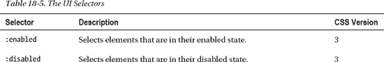

# 十八、使用 CSS 选择器——第二部分

在这一章中，我将继续你的 CSS 选择器之旅，并向你展示*伪类*。与伪元素一样，这些不是已经应用于元素的类，而是一种方便，允许您基于一些公共特征选择元素。表 18-1 对本章进行了总结。

### 使用结构化伪类选择器

*结构伪类*选择器允许您根据元素在文档中的位置来选择元素。这些选择器以冒号字符(`:`)为前缀；比如`:empty`。您可以单独使用这些选择器，也可以与另一个选择器结合使用；例如，`p:empty`。

#### 使用:根选择器

`:root`选择器选择文档中的根元素。这可能是伪类选择器中最没用的，因为它总是返回`html`元素。表 18-2 总结了`:root`选择器。

清单 18-1 显示了正在使用的`:root`选择器。

*清单 18-1。使用:根选择器*

`<!DOCTYPE HTML>
<html>
    <head>
        <title>Example</title>
**        **
    </head>
    <body>
         <a href="http://apress.com">Visit the Apress website</a>
        
I like apples and oranges.

        <a href="http://w3c.org">Visit the W3C website</a>
    </body>
</html>`

你可以在图 18-1 中看到这个选择器的效果。可能有点难以辨认，但整个文档周围有一个边框。

*图 18-1。使用:根选择器*

#### 使用子选择器

*子选择器*允许您选择直接包含在其他元素中的单个元素。表 18-3 总结了这些选择器。

##### 使用:第一个孩子选择器

`:first-child`选择器将匹配包含它们的元素定义的第一个元素(众所周知，*父元素*)。清单 18-2 显示了正在使用的`:first-child`选择器。

*清单 18-2。使用:第一个孩子选择器*

`<!DOCTYPE HTML>
<html>
    <head>
        <title>Example</title>
**        **
    </head>
    <body>           
        <a href="http://apress.com">Visit the Apress website</a>
        
I like apples and oranges.

        <a href="http://w3c.org">Visit the W3C website</a>
    </body>
</html>`

在清单 18-2 中，我单独使用了`:first-child`选择器，这意味着它将匹配任何作为其包含元素的第一个子元素的元素。你可以在图 18-2 的中看到哪些元素被选中。

*图 18-2。使用:第一个孩子选择器*

您可以使用`:first-child`选择器作为修饰符，或者将它与其他选择器结合起来，这样就更具体了。清单 18-3 展示了如何操作。

*清单 18-3。将第一个孩子选择器与其他选择器组合*

`<!DOCTYPE HTML>
<html>
    <head>
        <title>Example</title>
**        **
    </head>
    <body>           
        <a href="http://apress.com">Visit the Apress website</a>
        
I like apples and oranges.

        <a href="http://w3c.org">Visit the W3C website</a>
    </body>
</html>`

该选择器将匹配任何作为`p`元素的第一个子元素的`span`元素。在这个例子的 HTML 中只有一个这样的元素，你可以在图 18-3 中看到匹配。

*图 18-3。将第一个孩子的选择器与另一个选择器组合*

##### 使用:最后一个子代选择器

`:last-child`选择器选择由包含元素定义的最后一个元素。清单 18-4 显示了正在使用的`:last-child`选择器。

*清单 18-4。使用:最后一个孩子选择器*

`<!DOCTYPE HTML>
<html>
    <head>
        <title>Example</title>
**        **
    </head>
    <body>           
        <a href="http://apress.com">Visit the Apress website</a>
        
I like apples and oranges.

        <a href="http://w3c.org">Visit the W3C website</a>
    </body>
</html>`

你可以在图 18-4 中看到这个选择器匹配了哪些元素。请注意，内容区域周围有一个边框。这是因为`body`元素是`html`元素的最后一个子元素，因此由选择器匹配。

*图 18-4。使用:最后一个孩子选择器*

##### 使用:独生子女选择器

`:only-child`选择器匹配父元素所包含的唯一元素。清单 18-5 展示了这个选择器的使用。

*清单 18-5。使用:独生子女选择器*

`<!DOCTYPE HTML>
<html>
    <head>
        <title>Example</title>
**        **
    </head>
    <body>           
        <a href="http://apress.com">Visit the Apress website</a>
        
I like apples and oranges.

        <a href="http://w3c.org">Visit the W3C website</a>
    </body>
</html>`

唯一有一个子元素的元素是`p`元素，它包含一个`span`元素。你可以看到这是选择器在图 18-5 中唯一匹配的元素。

*图 18-5。使用:独生子女选择器*

##### 使用:仅类型选择器

`:only-of-type`选择器匹配由父元素定义的类型的唯一子元素。清单 18-6 提供了一个演示。

*清单 18-6。使用:唯一类型选择器*

`<!DOCTYPE HTML>
<html>
    <head>
        <title>Example</title>
**        **
    </head>
    <body>           
        <a href="http://apress.com">Visit the Apress website</a>
        
I like apples and oranges.

        <a href="http://w3c.org">Visit the W3C website</a>
    </body>
</html>`

你可以在图 18-6 中看到这个选择器匹配的元素。您可以看到，这个选择器在单独使用时匹配范围非常广。在任何文档中，通常都有一些元素，它们是由它们的父元素定义的类型中唯一的元素。当然，您可以通过将该选择器与其他选择器组合来缩小匹配范围。

*图 18-6。使用:唯一类型选择器*

#### 使用第 n 个子选择器

第 n 个子选择器类似于我在上一节中描述的子选择器，但是它们允许您指定一个索引来匹配特定位置的元素。表 18-4 总结了第 n 个子选择器。

每个选择器都有一个参数，它是您感兴趣的元素的索引；索引从 1 开始。清单 18-7 显示了正在使用的`:nth-child`选择器。

*清单 18-7。使用:第 n 个子选择器*

`<!DOCTYPE HTML>
<html>
    <head>
        <title>Example</title>
**        **
    </head>
    <body>           
        <a href="http://apress.com">Visit the Apress website</a>
        
I like apples and oranges.

        <a href="http://w3c.org">Visit the W3C website</a>
    </body>
</html>`

在清单 18-7 的中，我选择了作为`body`元素的第二个子元素的所有元素。这样的元素只有一个，如图图 18-7 所示。

*图 18-7。使用第 n 个子元素*

我不打算演示其他第 n 个子选择器，因为它们的功能与相应的常规子选择器相同，只是增加了一个索引值。

### 使用 UI 伪类选择器

UI 伪类选择器允许您根据元素的状态来选择元素。表 18-5 描述了用户界面选择器。

#### 选择启用/禁用的元素

一些元素有启用和禁用状态。这样做的是那些可以用来收集用户输入的。`:enabled`和`:disabled`选择器不会匹配任何不能被禁用的元素。清单 18-8 给出了一个使用`:enabled`选择器的例子。

*清单 18-8。使用:启用选择器*

`<!DOCTYPE HTML>
<html>
    <head>
        <title>Example</title>
**        **
    </head>
    <body>           
        <textarea> This is an enabled textarea</textarea>
        <textarea **disabled**> This is a disabled textarea</textarea>
    </body>
</html>`

清单 18-8 中的 HTML 包含两个`textarea`元素，其中一个定义了`disabled`属性。`:enabled`选择器将选择第一个`textarea`而不是第二个，如图 18-8 中的所示。

*图 18-8。使用:启用选择器*

#### 选择选中的元素

被选中的单选按钮和复选框(通过`checked`属性或由用户)可以通过`:checked`选择器选择。演示这个选择器的问题是，没有多少样式可以应用于复选框和单选按钮。清单 18-9 展示了`:checked`选择器的应用。

*清单 18-9。使用:选中的选择器*

`<!DOCTYPE HTML>
<html>
    <head>
        <title>Example</title>
        <meta name="author" content="Adam Freeman"/>
        <meta name="description" content="A simple example"/>
        <link rel="shortcut icon" href="favicon.ico" type="image/x-icon" />
**        **
    </head>
    <body>        
        <form method="post" action="http://titan:8080/form">
            

                <label for="apples">Do you like apples:</label>
                <input type="checkbox" id="apples" name="apples"/>` `                This will go red when checked
            
            
            <input type="submit" value="Submit"/>
        </form>
    </body>
</html>`

为了避开样式限制，我使用了兄弟选择器(在第十七章的中描述)来改变复选框旁边的`span`元素的外观。在图 18-9 中可以看到从未选中到选中的转变。

*图 18-9。选择选中的元素*

对于未检查的元素没有特定的选择器，但是您可以将`:checked`与否定选择器结合使用，这将在本章后面的“使用否定选择器”一节中描述。

#### 选择默认元素

`:default`元素从一组相似元素中选择默认元素。例如,“提交”按钮总是表单中的默认按钮。你可以看到清单 18-10 中使用的`:default`选择器。

*清单 18-10。使用:默认元素*

`<!DOCTYPE HTML>
<html>
    <head>
        <title>Example</title>
        <meta name="author" content="Adam Freeman"/>
        <meta name="description" content="A simple example"/>
        <link rel="shortcut icon" href="favicon.ico" type="image/x-icon" />
**        **
    </head>
    <body>
        <form method="post" action="http://titan:8080/form">
            

                <label for="name">Name: <input id="name" name="name"/></label>
            

            <button type="submit">Submit Vote</button>
            <button type="reset">Reset</button>
        </form>
    </body>
</html>`

这个选择器最常用于`outline`属性，我在第十九章的中描述过。你可以在图 18-10 的中看到这个选择器的效果。

*图 18-10。使用:默认选择器*

#### 选择有效和无效的输入元素

`:valid`和`:invalid`选择器分别匹配符合或不符合输入验证要求的`input`元素。你可以在第十四章中了解更多关于输入验证的信息。清单 18-11 展示了这些选择器的使用。

*清单 18-11。使用:有效和:无效选择器*

`<!DOCTYPE HTML>
<html>
    <head>
        <title>Example</title>
        <meta name="author" content="Adam Freeman"/>
        <meta name="description" content="A simple example"/>
        <link rel="shortcut icon" href="favicon.ico" type="image/x-icon" />
        
    </head>
    <body>
        <form method="post" action="http://titan:8080/form">
            

                <label for="name">Name: <input required id="name" name="name"/></label>
            

            

                <label for="name">City: <input required id="city" name="city"/></label>
            

            <button type="submit">Submit</button>
        </form>
    </body>
</html>`

在清单 18-11 中，我为无效元素应用了红色轮廓，为有效元素应用了绿色轮廓。文档中有两个`input`元素，都有`required`属性。这意味着它们只有在输入了值的情况下才有效。你可以在图 18-11 中看到这些选择器的效果。

*图 18-11。选择有效和无效的输入元素*

 **提示**注意提交按钮也受到了影响，至少在 Chrome 中是这样。发生这种情况是因为`:valid`选择器背后的逻辑相当简单，选择任何不是无效的`input`元素。要过滤掉某些输入元素，您可以使用第十七章中描述的属性选择器，或者更具体的选择器，如下所述。

#### 选择有范围限制的输入元素

输入验证的一个更具体的变化是选择对它们可以包含的值的范围有约束的`input`元素。`:in-range`选择器匹配范围内的`input`元素，而`:out-of-range`选择器选择范围外的元素。清单 18-12 展示了这些属性的使用。

*清单 18-12。使用:范围内和范围外选择器*

`<!DOCTYPE HTML>
<html>
    <head>
        <title>Example</title>
        <meta name="author" content="Adam Freeman"/>
        <meta name="description" content="A simple example"/>
        <link rel="shortcut icon" href="favicon.ico" type="image/x-icon" />
**        **
    </head>
    <body>        
        <form method="post" action="http://titan:8080/form">                       
            

                <label for="price">
                    $ per unit in your area:
                    <input type="number" min="0" max="100"
                          value="1" id="price" name="price"/>
                </label>
            

            <input type="submit" value="Submit"/>
        </form>
    </body>
</html>`

在我写这篇文章的时候，主流浏览器都没有实现`:out-of-range`选择器，只有 Chrome 和 Opera 支持`:in-range`选择器。我预计这种情况会很快改变，因为这种功能与新的 HTML5 支持紧密相关，这种支持可能会被广泛采用。你可以在图 18-12 的中看到`:in-range`选择器的效果。

*图 18-12。范围内选择器*的效果

#### 选择必需和可选的输入元素

`:required`选择器匹配具有`required`属性的输入元素。这确保了用户在提交与`input`元素相关联的 HTML 表单之前必须输入一个值(你可以在第十四章中获得关于`required`属性的更多细节)。`:optional`选择器选择没有`required`属性的`input`元素。这两个属性都显示在清单 18-13 中。

*清单 18-13。选择必需和可选输入元素*

`<!DOCTYPE HTML>
<html>
    <head>
        <title>Example</title>
        <meta name="author" content="Adam Freeman"/>
        <meta name="description" content="A simple example"/>
        <link rel="shortcut icon" href="favicon.ico" type="image/x-icon" />
**        **
    </head>
    <body>        
        <form method="post" action="http://titan:8080/form">                       
            

                <label for="price1">
                    $ per unit in your area:
                    <input type="number" min="0" max="100" **required**
                          value="1" id="price1" name="price1"/>
                </label>
                <label for="price2">
                    $ per unit in your area:` `                    <input type="number" min="0" max="100"
                          value="1" id="price2" name="price2"/>
                </label>
            

            <input type="submit" value="Submit"/>
        </form>
    </body>
</html>`

在清单 18-13 中，我定义了两个`number`类型`input`元素。一个具有`required`属性，但在其他方面两者是相同的。你可以在图 18-13 中看到选择器和相关样式的效果。注意`submit`型`input`也被选中。`:optional`选择器不区分`input`元素的类型。

*图 18-13。选择必需和可选输入元素*

### 使用动态伪类选择器

*动态伪类*选择器之所以如此，是因为它们基于变化的条件匹配元素，而不是文档的固定状态。随着 JavaScript 被广泛用于修改文档内容和元素状态，静态和动态选择器之间的界限已经变得模糊，但是它们仍然被认为是选择器的一个独立类别。

#### 使用:链接和:已访问选择器

`:link`选择器匹配超链接，而`:visited`选择器匹配用户以前访问过的超链接。表 18-6 总结了这些选择器。

用户点击链接后，浏览器可以自由决定链接保持被访问的时间。当用户清除浏览器历史记录时，或者当历史记录自然超时时，链接将返回到未访问状态。清单 18-14 展示了这些选择器的使用。

*清单 18-14。使用:link 和:visited 选择器*

`<!DOCTYPE HTML>
<html>
    <head>
        <title>Example</title>
**        **
    </head>
    <body>
        <a href="http://apress.com">Visit the Apress website</a>
        
I like apples and oranges.

        <a href="http://w3c.org">Visit the W3C website</a>
    </body>
</html>`

本例中唯一需要注意的一点是，使用`:visited`选择器只能将一些属性应用于链接。你可以改变颜色和字体，但仅此而已。你可以在图 18-14 中看到链接被访问时的变化。我从一对没有被访问过的链接开始，点击其中一个链接进入`http://apress.com`网站。当我回到示例 HTML 时，被访问的链接的样式有所不同。

*图 18-14。使用:link 和:visited 选择器*

 **提示**`:visited`选择器将匹配任何链接，其`href`属性是用户从任何页面访问过的 URL，而不仅仅是你的页面。`:visited`选择器最常见的用途是应用一种样式，使得已访问的链接与未访问的链接没有区别。

#### 使用:悬停选择器

`:hover`选择器将匹配用户鼠标悬停的任何元素。当用户在文档中移动鼠标时，选定的元素会发生变化。表 18-7 描述了这个选择器。

浏览器可以自由地以对正在使用的显示器有意义的方式解释`:hover`选择器，但是大多数浏览器将选择器与鼠标在窗口上的移动联系起来。清单 18-15 显示了正在使用的选择器。

*清单 18-15。使用:悬停选择器*

`<!DOCTYPE HTML>
<html>
    <head>
        <title>Example</title>
**        **
    </head>
    <body>
        <a href="http://apress.com">Visit the Apress website</a>
        
I like apples and oranges.

        <a href="http://w3c.org">Visit the W3C website</a>
    </body>
</html>`

这个选择器将匹配多个嵌套元素，正如你在图 18-15 中看到的。

*图 18-15。使用:悬停选择器*

#### 使用:活动选择器

`:active`选择器在用户激活元素期间匹配元素。同样，浏览器有解释这种激活的自由，但对于大多数浏览器来说，这发生在按下鼠标时(或手指在触摸屏上按下)。表 18-8 总结了`:active`选择器。

清单 18-16 给出了一个使用这个选择器的例子。

*清单 18-16。使用:活动选择器*

`<!DOCTYPE HTML>
<html>
    <head>
        <title>Example</title>
**        **` `    </head>
    <body>
        <a href="http://apress.com">Visit the Apress website</a>
        
I like apples and oranges.

        <button>Hello</button>
    </body>
</html>`

我在清单的标记中添加了一个按钮，但是`:active`选择器并不局限于用户可以与之交互的元素。鼠标按下的任何元素都会被选中，如图 18-16 中的所示。

*图 18-16。使用:活动选择器*

#### 使用:焦点选择器

最后一个动态伪类选择器是`:focus`，它在元素拥有焦点时选择元素。表 18-9 总结了该选择器。

清单 18-17 展示了这个选择器的使用。

*清单 18-17。使用:焦点选择器*

`<!DOCTYPE HTML>
<html>` `    <head>
        <title>Example</title>
**        **
    </head>
    <body>
        <form>
            Name: <input type="text" name="name"/>
            

            City: <input type="text" name="city"/>
            

            <input type="submit"/>
        </form>
    </body>
</html>`

当我浏览标记中的`input`元素时，样式依次应用于每个元素。你可以看到图 18-17 中所示的效果。

*图 18-17。焦点选择器*的效果

### 其他伪选择器

有几个选择器不完全符合我在本章中用来对选择器进行分组的类别。在接下来的几节中，我将依次解释它们。

#### 使用否定选择器

否定选择器允许您反转任何选择。它是一个非常有用的选择器，但却经常被忽视。表 18-10 总结了否定选择器。

清单 18-18 显示了使用中的否定选择器。

*清单 18-18。使用否定选择器*

`<!DOCTYPE HTML>
<html>
    <head>
        <title>Example</title>
**        **
    </head>
    <body>
        <a href="http://apress.com">Visit the Apress website</a>
        
I like apples and oranges.

        <a href="http://w3c.org">Visit the W3C website</a>
    </body>
</html>`

这个选择器匹配所有没有包含字符串`apress`的`href`元素的`a`元素。你可以在图 18-18 的中看到这个选择器的效果。

*图 18-18。使用否定选择器*

#### 使用:空选择器

`:empty`选择器匹配没有定义子元素的元素。该选择器总结在表 18-11 中。很难说明这个选择器，因为它的匹配不包含任何内容。

#### 使用:语言选择器

`:lang`选择器基于`lang`全局属性匹配元素(在第三章中描述)。表 18-12 总结了该选择器。

清单 18-19 显示了正在使用的`lang`选择器。

*清单 18-19。使用语言选择器*

`<!DOCTYPE HTML>
<html>
    <head>
        <title>Example</title>
**        **
    </head>
    <body>
        <a lang="en-us" id="apressanchor" class="class1 class2" href="http://apress.com">
            Visit the Apress website
        </a>
        
I like apples and oranges.
` `        <a lang="en" id="w3canchor" href="http://w3c.org">Visit the W3C website</a>
    </body>
</html>`

该选择器匹配具有表示它们是用英语编写的`lang`属性的元素。`:lang`选择器的效果与第十七章中的清单 17-8 中的`|=`属性选择器示例相同。

#### 使用:目标选择器

在第三章的中，我提到您可以将片段标识符附加到 URL 上，以便根据`id`全局属性的值直接导航到元素。例如，如果 HTML 文档`example.html`中有一个元素的`id`值为`myelement`，那么您可以通过请求`example.html#myelement`直接导航到该元素。`:target`选择器匹配 URL 片段标识符引用的元素。表 18-13 总结了该选择器。

清单 18-20 显示了正在运行的`:target`选择器。

*清单 18-20。使用:目标选择器*

`<!DOCTYPE HTML>
<html>
    <head>
        <title>Example</title>
        
    </head>
    <body>
        <a href="http://apress.com">Visit the Apress website</a>
        
I like apples and oranges.

        <a id="w3clink" href="http://w3c.org">Visit the W3C website</a>
    </body>
</html>`

你可以在图 18-19 中看到被请求的 URL 是如何改变由`:target`选择器匹配的元素的。

*图 18-19。使用:目标选择器*

### 总结

在这一章中，我描述了 CSS 选择器，通过它你可以识别你想要应用样式的元素。选择器允许您在大范围内匹配元素，或者通过组合选择器，将您的关注点缩小到 HTML 文档中特定部分的元素。学习选择器是充分利用 CSS 的关键。