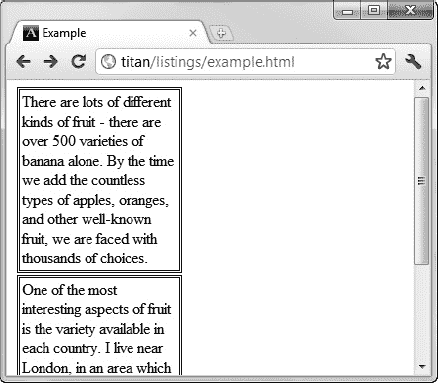

# 十二、使用盒子模型

在这一章中，我将讲述你可以用来配置一个元素的盒子模型的 CSS 属性。正如我在第十六章中解释的，盒子模型是 CSS 中的基本概念之一，你用它来配置元素的外观和文档的整体布局。表 20-1 对本章进行了总结。

### 对元素应用填充

填充在元素的内容和它的边框之间增加空间。您可以为内容框的各个边缘设置填充，或者使用简写的`padding`属性在单个声明中应用值。`padding`属性列于表 20-2 中。

当使用百分比值指定填充时，百分比总是从包含块的*宽度*得出；高度没有考虑在内。清单 20-1 展示了如何将填充应用到一个元素中。

*清单 20-1。对元素应用填充*

`<!DOCTYPE HTML>
<html>
    <head>
        <title>Example</title>
        <meta name="author" content="Adam Freeman"/>
        <meta name="description" content="A simple example"/>
        <link rel="shortcut icon" href="favicon.ico" type="image/x-icon" />
        
    </head>
    <body>
    

        There are lots of different kinds of fruit - there are over 500 varieties
        of banana alone. By the time we add the countless types of apples, oranges,
        and other well-known fruit, we are faced with thousands of choices.
    

    </body>
</html>`

在清单 20-1 中，我在盒子的两边应用了不同数量的填充。你可以在图 20-1 的中看到它的效果。我已经设置了`background-clip`属性(在第十九章中有描述)这样背景色就不会覆盖填充区域，这样会强调填充的效果。

*图 20-1。对元素应用填充*

您可以使用`padding`速记属性在一个声明中设置所有四个边缘的填充。您可以为此属性指定一到四个值。当您提供四个值时，它们分别用于设置上、右、下和左边缘的空白。当您省略值时，将使用最匹配的指定值:如果您省略左边的值，则它与右边的值相同；如果省略下限值，它与上限值相同。如果除了一个值之外都忽略，那么所有四条边都采用相同的填充值。

清单 20-2 展示了如何使用`padding`速记属性。我在这个示例中添加了一个弯曲的边框，以展示如何使用填充来确保边框不会被绘制到元素内容上。

*清单 20-2。使用填充速记属性*

`<!DOCTYPE HTML>
<html>
    <head>
        <title>Example</title>
        <meta name="author" content="Adam Freeman"/>
        <meta name="description" content="A simple example"/>
        <link rel="shortcut icon" href="favicon.ico" type="image/x-icon" />
        
    </head>
    <body>
    

        There are lots of different kinds of fruit - there are over 500 varieties
        of banana alone. By the time we add the countless types of apples, oranges,
        and other well-known fruit, we are faced with thousands of choices.` `    

    </body>
</html>`

你可以在图 20-2 中看到浏览器如何显示边框和填充。

*图 20-2。使用速记填充属性*

如果没有填充，边框会被画在文本上，就像在第十九章中一样。通过填充，您可以确保内容和边框之间有足够的空间来防止这种情况发生。

### 对元素应用边距

边距是元素边框和页面上围绕它的任何东西之间的空间。这包括其他元素和父元素。表 20-3 总结了控制余量的属性。

与 padding 属性一样，百分比值总是从包含块的宽度派生而来，即使用于填充上边缘和下边缘也是如此。清单 20-3 显示了增加边距的效果。

*清单 20-3。向元素添加边距*

`<!DOCTYPE HTML>
<html>
    <head>
        <title>Example</title>
        <meta name="author" content="Adam Freeman"/>
        <meta name="description" content="A simple example"/>
        <link rel="shortcut icon" href="favicon.ico" type="image/x-icon" />
        
    </head>
    <body>
        
        
    </body>
</html>`

在清单 20-3 中，有两个`img`元素。我为上下边缘指定了 4 个像素的边距，为左右边缘指定了 20 个像素的边距。你可以在图 20-3 中看到边距如何在元素周围创建空间，图中显示了有边距和无边距的`img`元素。

*图 20-3。对元素应用边距的效果*

即使使用 Margin 属性之一应用边距，也不会总是绘制边距。例如，如果将边距应用于具有`display`值`inline`的元素，则边距不会显示在顶部和底部边缘。我将在本章后面的“设置元素框类型”一节中解释`display`属性。

### 控制元素的大小

浏览器将根据页面上的内容流来设置元素的大小。关于如何分配大小，浏览器必须遵循一些极其详细的规则。您可以通过使用尺寸相关的属性来覆盖这种行为，这些属性在表 20-4 中有所描述。

所有这些属性的默认值都是`auto`，这意味着浏览器会计算出元素的宽度和高度。您可以使用长度或百分比明确指定大小。百分比值是根据包含块的宽度计算的(即使在处理高度时)。清单 20-4 展示了如何设置一个元素的大小。

*清单 20-4。设置元素的大小*

`<!DOCTYPE HTML>
<html>
    <head>
        <title>Example</title>
        <meta name="author" content="Adam Freeman"/>
        <meta name="description" content="A simple example"/>
        <link rel="shortcut icon" href="favicon.ico" type="image/x-icon" />
        
    </head>
    <body>
        

            
            
        

    </body>
</html>`

在这个例子中有三个关键元素。一个`div`元素包含两个`img`元素。你可以在图 20-4 中看到浏览器如何显示这些元素。

*图 20-4。设置元素*的大小

`div`元素是`body`元素的子元素。当我将`div`元素的`width`表示为`75%`时，我告诉浏览器我希望`div`元素是包含块(在本例中是`body`内容框)宽度的 75 %,无论它是什么。如果用户调整浏览器窗口的大小，`body`元素也将被调整大小，这将导致我的`div`元素被调整大小以保留`75%`关系。你可以在图 20-5 中看到调整浏览器窗口大小的效果。我在`div`元素中添加了一个`border`，以便于查看它的大小。

*图 20-5。调整浏览器窗口大小以展示相对大小关系*

您可以看到,`div`始终是`body`元素宽度的 75 %,填充了浏览器窗口。我将`div`元素的高度指定为`100px`，这是一个绝对值，不会随着包含块的大小而改变。你可以看到当我将浏览器窗口调整为长或短时，`div`元素的一部分是如何隐藏的。

我对`img`元素做了同样的事情。其中一个有一个表示为包含块的`50%`的`width`值，这意味着调整图像的大小以保持这种关系，即使这意味着图像的长宽比没有被保留。我还没有为第二个`img`元素设置宽度值，这需要浏览器自己解决。默认情况下，宽度将从高度中获得，设置宽度是为了保持纵横比。

 **提示**注意图像如何溢出`div`元素的边缘图 20-5 。这就是所谓的*溢出。在本章的后面，我会告诉你如何控制溢出。*

#### 设置尺寸框

我的例子中的两个`img`元素具有相同的`height`值(`50%`，但是它们在屏幕上看起来不同。这是因为我已经使用了`box-sizing`属性来更改元素框的一部分，其中一个元素应用了 size 属性。

默认情况下，计算高度和宽度并应用于元素的内容框。这意味着，例如，如果您将元素的`height`属性设置为`100px`，那么屏幕上的实际高度将是 100 像素，加上顶部和底部的`padding`、`border`和`margin`值。`box-sizing`属性允许您指定元素的哪个框区域将被调整大小以应用样式，这意味着您不必自己考虑变化。表 20-4 显示了允许值。

 **提示**大小属性的一个常见用途是尝试创建一个网格布局。这是可行的，但是更好的方法是使用表格布局特性。你可以在第二十一章中了解到这是如何运作的细节。

#### 设定最小和最大尺寸

您可以使用`min-`和`max-`属性来设置浏览器自由调整元素大小的限制。这允许浏览器在如何应用大小方面有一定的自由度。清单 20-5 给出了一个演示。

*清单 20-5。设定尺寸的最小和最大范围*

`<!DOCTYPE HTML>
<html>
    <head>
        <title>Example</title>
        <meta name="author" content="Adam Freeman"/>
        <meta name="description" content="A simple example"/>
        <link rel="shortcut icon" href="favicon.ico" type="image/x-icon" />
        
    </head>
    <body>
            
    </body>
</html>`

在清单 20-5 的中，我将`min-width`和`max-width`属性应用到一个单独的`img`元素中，并将初始宽度设置为包含块的 50%。这给了浏览器一些余地来调整图像的大小，以在我定义的上限和下限内保持 50%的关系。浏览器将使用这个余地来保持图像的纵横比，如图 20-6 所示。

*图 20-6。使用最小宽度属性设置元素大小的界限*

图 20-6 显示了当我调整浏览器窗口使其变小时会发生什么。随着窗口变小，浏览器会调整图像的大小，以保持`img`元素和`body`元素之间的百分比关系。当达到最小宽度时，浏览器不能再调整图像的大小。您可以在图中的最后一帧看到这一点，在这里，图像被浏览器窗口的底部裁剪掉了。

 **注意**浏览器对`box-sizing`属性的支持是可变的。

### 处理溢出的内容

当您开始更改元素的大小时，您很快就会发现内容太大，无法在元素的内容框中显示。默认行为是内容溢出并被绘制。清单 20-6 创建了一个固定大小的元素，它太小以至于无法显示它的内容。

*清单 20-6。创建一个太小而不能完全显示其内容的元素*

`<!DOCTYPE HTML>
<html>
    <head>
        <title>Example</title>
        <meta name="author" content="Adam Freeman"/>
        <meta name="description" content="A simple example"/>
        <link rel="shortcut icon" href="favicon.ico" type="image/x-icon" />
        
    </head>
    <body>
        

            There are lots of different kinds of fruit - there are over 500 varieties
            of banana alone. By the time we add the countless types of apples, oranges,
            and other well-known fruit, we are faced with thousands of choices.
        

    </body>
</html>`

我已经为`width`和`height`属性指定了绝对值，这产生了你可以在图 20-7 中看到的效果。

*图 20-7。内容太大而无法显示的元素的默认外观*

我们可以通过使用`overflow`属性来改变这种行为，这些属性在表 20-5 中有描述。

`overflow-x`和`overflow-y`属性设置水平和垂直溢出的样式，`overflow`速记属性允许您在一个声明中定义两个方向的样式。表 20-6 显示了这些属性的允许值。

清单 20-7 显示了正在使用的溢出属性。

*清单 20-7。控制内容溢出*

`<!DOCTYPE HTML>
<html>
    <head>
        <title>Example</title>
        <meta name="author" content="Adam Freeman"/>
        <meta name="description" content="A simple example"/>
        <link rel="shortcut icon" href="favicon.ico" type="image/x-icon" />
        
    </head>
    <body>
        

            There are lots of different kinds of fruit - there are over 500 varieties
            of banana alone. By the time we add the countless types of apples, oranges,
            and other well-known fruit, we are faced with thousands of choices.
        

        

            There are lots of different kinds of fruit - there are over 500 varieties
            of banana alone. By the time we add the countless types of apples, oranges,
            and other well-known fruit, we are faced with thousands of choices.
        

    </body>
</html>`

在清单 20-7 的中，`first`段有`overflow`属性的`hidden`值，`second`段有`scroll`值。你可以在图 20-8 中看到这些值的效果。

*图 20-8。使用溢出属性的隐藏和滚动值*

 **提示**这是 CSS 模块尚未解决的一个领域。有人提议扩展与溢出相关的属性集，以便支持选框行为(这是元素的内容跨越显示器的地方，以便随着时间的推移所有内容都是可见的)。以下属性由 CSS3 定义，但尚未被任何主流浏览器实现:`overflow-style`、`marquee-direction`、`marquee-loop`、`marquee-play-count`、`marquee-speed`和`marquee-style`。

### 控制元素可见性

您可以使用`visibility`属性来控制元素的可见性，这在表 20-7 中有描述。这似乎是一件奇怪的事情，但是您可以通过使用 JavaScript 的这个属性来创建一些复杂的效果。

表 20-8 描述了`visibility`属性的允许值。

清单 20-8 演示了使用 JavaScript 和一些`button`元素改变一个元素的可见性(在第十二章的中有描述)。

*清单 20-8。使用可见性属性*

`<!DOCTYPE HTML>
<html>
    <head>
        <title>Example</title>
        <meta name="author" content="Adam Freeman"/>
        <meta name="description" content="A simple example"/>
        <link rel="shortcut icon" href="favicon.ico" type="image/x-icon" />` `        
    </head>
    <body>
        <table>
            <tr>
                <th>Rank</th><th>Name</th><th>Color</th><th>Size</th>
            </tr>
            <tr id="firstchoice">
                <th>Favorite:</th><td>Apples</td><td>Green</td><td>Medium</td>
            </tr>
            <tr>
                <th>2nd Favorite:</th><td>Oranges</td><td>Orange</td><td>Large</td>
            </tr>
        </table>
        

            <button>Visible</button>
            <button>Collapse</button>
            <button>Hidden</button>
        

        ****
    </body>
</html>`

本例中的脚本定位到具有值为`firstchoice`的`id`的元素，并根据哪个按钮元素被按下来设置`visibility`属性的值。这样，您可以在`visible`、`hidden`和`collapse`值之间切换。你可以在图 20-9 中看到每个值的效果。

*图 20-9。可见性属性值的效果*

`collapse`值只适用于与表格相关的元素，如`tr`和`td`。你可以在第十一章中了解更多这些元素。有些浏览器，比如 Chrome，根本不实现`collapse`值(这也是我一直用 Firefox 做图 20-9 的原因)。

 **提示**您可以使用`display`属性的`none`值来获得与非表格元素上的`collapse`值相同的效果，或者在没有实现该特性的浏览器中获得相同的效果。接下来我介绍一下`display`属性。

### 设置元素框类型

属性为你提供了一种方法来改变一个元素的框的类型，这改变了一个元素在页面上的布局。在本书的第二部分中，您会注意到一些元素有一个样式约定，包括一个`display`属性值。许多元素使用默认值`inline`，但是一些元素指定了其他值。`display`属性的一组允许值在表 20-9 中描述。

这些值会造成很多混乱，并且对文档的布局有深远的影响。我将在接下来的章节中解释每一种盒子类型。

#### 了解块级元素

当您使用`block`值时，您创建了一个*块级元素*。这是一个在垂直方向上与其周围的元素截然不同的元素。您通常可以通过在元素前后放置一个换行符来实现这种效果，在元素及其周围环境之间创建一种分离感，就像书中出现的段落一样。表示段落的`p`元素在其默认样式约定中包含了`display`属性的`block`值，但是您可以将该值应用于任何元素，如清单 20-9 所示。

*清单 20-9。使用显示属性*的块值

`<!DOCTYPE HTML>
<html>
    <head>
        <title>Example</title>
        <meta name="author" content="Adam Freeman"/>
        <meta name="description" content="A simple example"/>
        <link rel="shortcut icon" href="favicon.ico" type="image/x-icon" />
        
    </head>
    <body>
        

            There are lots of different kinds of fruit - there are over 500 varieties
            of banana alone. By the time we add the countless types of apples, oranges,
            and other well-known fruit, we are faced with thousands of choices.
        

        

            One of the most interesting aspects of fruit is the variety available in
            each country. **I live near London,** in an area which is known for
            its apples. When travelling in Asia, I was struck by how many different
            kinds of banana were available - many of which had unique flavours and
            which were only avaiable within a small region.
        

    </body>
</html>`

您可以通过两种不同的元素类型看到块级元素对布局的影响。第一个是`p`元素，正如我提到的，它使用默认样式约定中的`display`属性的`block`值(你可以在第九章的中了解更多关于`p`元素的信息)。我还想演示您可以将这个属性值应用于任何元素，所以我包含了一个`span`元素，并在`style`元素中为这个元素类型显式设置了`display`属性。你可以在图 20-10 中看到这种盒型的视觉效果。

*图 20-10。使用显示属性*的块值

你已经看到了`p`元素是如何显示的。我在这个例子中给元素添加了一个边框，使垂直间距更加明显。请注意，我应用了`block`值的`span`元素在包含`p`元素的框中也是明显的。

#### 了解内联级元素

当您使用`inline`值时，您创建了*内联级元素*，这些元素在视觉上与周围的内容没有区别，比如一行文本中的一个单词。清单 20-10 展示了如何应用这个值，甚至是像`p`这样的元素，默认情况下是块级元素。

*清单 20-10。使用显示属性的内联值*

`<!DOCTYPE HTML>
<html>
    <head>
        <title>Example</title>
        <meta name="author" content="Adam Freeman"/>
        <meta name="description" content="A simple example"/>
        <link rel="shortcut icon" href="favicon.ico" type="image/x-icon" />
        
    </head>
    <body>
        

            There are lots of different kinds of fruit - there are over 500 varieties
            of banana alone. By the time we add the countless types of apples, oranges,
            and other well-known fruit, we are faced with thousands of choices.
        

        

            One of the most interesting aspects of fruit is the variety available in
            each country. I live near London, in an area which is known for
            its apples. When travelling in Asia, I was struck by how many different
            kinds of banana were available - many of which had unique flavours and
            which were only avaiable within a small region.
        

    </body>
</html>`

我已经将`inline`属性应用于`p`和`span`元素，你可以在图 20-11 中看到效果。您可以看到在`p`元素之间没有分隔，并且`span`元素与文本的其余部分内联显示。

*图 20-11。使用显示属性的内联值*

使用`inline`值时，浏览器会忽略某些属性，如`width`、`height`和`margin`。我已经为清单中的`span`元素定义了所有三个属性的值，但是您可以看到它们还没有应用到布局中。

#### 了解内嵌块元素

`inline-block`值创建了一个元素，它的盒子是`block`和`inline`特征的混合。盒子的外部被视为一个`inline`元素。这意味着没有纵向显著性，内容出现在周围内容的旁边。但是，盒子的内部被视为一个`block`元素，并应用了`width`、`height`和`margin`等属性。你可以在清单 20-11 中看到它的效果。

*清单 20-11。使用内嵌块值*

`<!DOCTYPE HTML>
<html>
    <head>
        <title>Example</title>
        <meta name="author" content="Adam Freeman"/>
        <meta name="description" content="A simple example"/>
        <link rel="shortcut icon" href="favicon.ico" type="image/x-icon" />
        
    </head>
    <body>
        

            There are lots of different kinds of fruit - there are over 500 varieties
            of banana alone. By the time we add the countless types of apples, oranges,
            and other well-known fruit, we are faced with thousands of choices.
        

        

            One of the most interesting aspects of fruit is the variety available in
            each country. I live near London, in an area which is known for
            its apples. When travelling in Asia, I was struck by how many different
            kinds of banana were available - many of which had unique flavours and
            which were only avaiable within a small region.
        

    </body>
</html>`

这个清单中唯一的变化是`span`元素的新的`display`属性值，但是视觉效果是显著的，因为以前被忽略的属性(当`display`值为`inline`时)现在被应用了。你可以在图 20-12 中看到效果。

*图 20-12。使用显示属性*的内嵌块值

#### 了解磨合要素

`run-in`值创建一个盒子，其类型取决于周围的元素。浏览器必须评估三种情况来确定磨合框的性质。

1.  如果一个`run-in`元素包含一个`display`值为`block`的元素，那么`run-in`元素就成为一个块级元素。
2.  否则，如果`run-in`元素的下一个同级元素是块元素，那么 run-in 元素成为同级元素中的第一个内联级元素。我在清单 20-12 中演示了这个条件。
3.  否则，磨合元素将被视为块级元素。

在这三个条件中，第二个条件具有示范性。清单 20-12 显示了一个磨合元素，它的兄弟元素是一个块级元素。

*清单 20-12。具有块级同级的磨合元素*

`<!DOCTYPE HTML>
<html>
    <head>
        <title>Example</title>
        <meta name="author" content="Adam Freeman"/>
        <meta name="description" content="A simple example"/>
        <link rel="shortcut icon" href="favicon.ico" type="image/x-icon" />
        
    </head>
    <body>
        
            There are lots of different kinds of fruit - there are over 500 varieties
            of banana alone.
        
        

            By the time we add the countless types of apples, oranges,
            and other well-known fruit, we are faced with thousands of choices.
        

    </body>
</html>`

在图 20-13 的中，你可以看到`run-in`元素是如何被视为块的一部分的(尽管我应该注意到并非所有的浏览器都正确支持这个属性)。

*图 20-13。具有块级同级的磨合元素*

如果同级元素不是块级元素，则插入部分被视为块。这种关系的一个例子显示在清单 20-13 中。

*清单 20-13。具有内嵌同级的插入元素*

`<!DOCTYPE HTML>
<html>
    <head>
        <title>Example</title>
        <meta name="author" content="Adam Freeman"/>
        <meta name="description" content="A simple example"/>
        <link rel="shortcut icon" href="favicon.ico" type="image/x-icon" />
        
    </head>
    <body>
        
            There are lots of different kinds of fruit - there are over 500 varieties
            of banana alone.
        
        

            By the time we add the countless types of apples, oranges,
            and other well-known fruit, we are faced with thousands of choices.
        

    </body>
</html>`

在本例中，`run-in`元素显示为一个块，如图 20-14 中的所示。

*图 20-14。显示为块级元素的磨合元素*

#### 隐藏元素

`none`值告诉浏览器不要为一个元素或任何派生元素创建任何类型的框。当`display`属性设置为`none`时，元素在页面布局中不占据任何空间。清单 20-14 显示了一个 HTML 文档，其中有一个简单的脚本，用于在`block`和`none`之间切换`p`元素的`display`属性。

*清单 20-14。使用显示属性*的 none 值

`<!DOCTYPE HTML>
<html>
    <head>
        <title>Example</title>
        <meta name="author" content="Adam Freeman"/>
        <meta name="description" content="A simple example"/>
        <link rel="shortcut icon" href="favicon.ico" type="image/x-icon" />
    </head>
    <body>
        

            There are lots of different kinds of fruit - there are over 500 varieties
            of banana alone. By the time we add the countless types of apples, oranges,
            and other well-known fruit, we are faced with thousands of choices.
        

        

            One of the most interesting aspects of fruit is the variety available in
            each country. I live near London, in an area which is known for
            its apples. When travelling in Asia, I was struck by how many different
            kinds of banana were available - many of which had unique flavours and
            which were only avaiable within a small region.
        

        

            <button>Block</button>
            <button>None</button>
        

        
    </body>
</html>`

在图 20-15 的中，你可以看到`none`值是如何使元素从布局中移除的。

*图 20-15。显示属性*的 none 值的效果

### 创建浮动框

您可以使用`float`属性来创建*浮动框*，这些浮动框被移动到一边，直到左边缘或右边缘接触到包含块或另一个浮动框的边缘。表 20-10 总结了该属性。

表 20-11 描述了`float`属性的允许值。

清单 20-15 显示了正在使用的`float`属性。

*清单 20-15。使用浮动属性*

`<!DOCTYPE HTML>
<html>
    <head>
        <title>Example</title>
        <meta name="author" content="Adam Freeman"/>
        <meta name="description" content="A simple example"/>
        <link rel="shortcut icon" href="favicon.ico" type="image/x-icon" />
        
    </head>
    <body>
        

            There are lots of different kinds of fruit - there are over 500 varieties
            of banana alone. By the time we add the countless types of apples, oranges,
            and other well-known fruit, we are faced with thousands of choices.
        

        

            One of the most interesting aspects of fruit is the variety available in
            each country. I live near London, in an area which is known for
            its apples.
        

        

            When travelling in Asia, I was struck by how many different
            kinds of banana were available - many of which had unique flavours and
            which were only avaiable within a small region.
        

        
` `            <button>Left</button>
            <button>Right</button>
            <button>None</button>
        

        ****
    </body>
</html>`

在这个例子中，有许多`p`元素，其中两个的浮点值为`left`。这意味着它们将被向左移动，直到碰到包含它的盒子或另一个浮动元素的边缘。因为有两个元素被移动，第一个将被移动到包含块的边缘，第二个将邻接第一个。你可以在图 20-16 中看到这种效果。

 **提示**注意，当我在 JavaScript 中引用`float`属性时，我必须使用`cssFloat`。在第二十九章的中，你会学到用 JavaScript 设计元素的样式

*图 20-16。使用浮动属性的左值*

注意其余的内容是如何围绕浮动元素流动的。在这个例子中，我还添加了一些`button`元素和一个简单的脚本，该脚本根据哪个按钮被按下来改变两个`p`元素的`float`值。如果按下`Right`按钮，可以看到元素是如何向右移动的，如图图 20-17 所示。注意元素出现的顺序:文档中定义的第一个元素在最右边。

*图 20-17。使用浮动属性的正确值*

最后一个按钮`None`，通过将`float`值设置为`none`来禁用浮动效果。这将恢复元素的默认框行为。`p`元素默认为块级元素，你可以在图 20-18 中看到效果。

*图 20-18。使用浮动属性的 none 值*

#### 防止浮动元件堆积

默认情况下，浮动元素会一个挨着一个堆叠起来。您可以通过使用`clear`属性来防止这种情况发生，该属性指定一个浮动元素的一个或两个边缘不能与另一个浮动元素的边缘相邻。表 20-12 总结了`clear`属性。

表 20-13 描述了`clear`元素的允许值。

清单 20-16 显示了正在使用的`clear`属性。

*清单 20-16。使用清除属性*

`<!DOCTYPE HTML>
<html>
    <head>
        <title>Example</title>
        <meta name="author" content="Adam Freeman"/>
        <meta name="description" content="A simple example"/>
        <link rel="shortcut icon" href="favicon.ico" type="image/x-icon" />
        
    </head>
    <body>
        

            There are lots of different kinds of fruit - there are over 500 varieties
            of banana alone. By the time we add the countless types of apples, oranges,
            and other well-known fruit, we are faced with thousands of choices.
        

        

            One of the most interesting aspects of fruit is the variety available in
            each country. I live near London, in an area which is known for
            its apples.
        
` `        

            When travelling in Asia, I was struck by how many different
            kinds of banana were available - many of which had unique flavours and
            which were only avaiable within a small region.
        

        

            <button>Left</button>
            <button>Right</button>
            <button>None</button>
        

        
    </body>
</html>`

这是上一个例子的简单扩展，增加了一个新的样式来清除第二个`p`元素的左边缘。你可以在图 20-19 的中看到这是如何改变页面布局的(图中元素向左浮动)。

*图 20-19。清除浮动元素的左边缘*

`p`元素的左边缘不允许靠近另一个浮动元素，因此浏览器将该元素在页面上下移。右边缘仍未清除，这意味着当你向右浮动元素时，它们会彼此接触，如图图 20-20 所示。

*图 20-20。右浮动元素的未清除右边缘*

### 总结

在这一章中，我展示了如何执行元素的盒子模型的基本配置，改变它在页面布局中的显示方式。您从基本属性开始，比如`padding`和`margin`，并继续深入到更复杂的概念，比如宽度和高度的范围以及溢出内容。

本章中最重要的概念是你可以为一个元素创建的不同类型的盒子的效果。理解块级元素和内联级元素之间的关系对于掌握 HTML5 布局至关重要，浮动元素和清除边缘是非常广泛使用的技术，可以在页面中创建灵活性。

在下一章，我将向你展示一些 CSS 支持的创建元素布局的更复杂的模型。