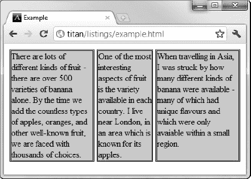

# 二十一、创建布局

在这一章中，我将向你展示用于控制页面元素布局的不同选项。随着人们越来越重视 HTML 元素的语义意义和它们的表现效果，CSS 在 HTML5 中布局元素的作用变得越来越重要。CSS3 中有一些非常有用的布局特性，当然，您可以使用 CSS 早期版本中的现有功能。

对于 CSS3，有两个推荐的布局模型还没有成熟到足以让我在本章中介绍。第一个是模板布局，它允许您灵活地包含元素。没有一个浏览器实现这个模块，但是您可以通过在`[`a.deveria.com/?p=236`](http://a.deveria.com/?p=236)`提供的 jQuery 插件来体验这个功能。另一个新模块为布局创建灵活的网格。不幸的是，在我写这篇文章的时候，规范还没有完成，也没有可用的实现。

CSS3 中的整个布局区域仍然不稳定。我在本章中介绍的一种布局风格——灵活的盒子模型——提供了很好的特性，但是标准一直在变化，我不得不使用浏览器特有的属性来演示这种布局方法，这些属性是根据标准的早期草案实现的。

鉴于这些新特性的早期性质，我建议考虑使用 CSS 框架来创建复杂的页面布局。我推荐 Blueprint，你可以从`[www.blueprintcss.org](http://www.blueprintcss.org)`下载。在 CSS3 布局特性成熟之前，CSS 框架可能会提供您需要的功能。表 21-1 对本章进行了总结。

### 定位内容

引导内容的最简单的方式是通过*定位*，这允许你改变元素在浏览器中的布局方式。表 21-2 描述了定位属性。

#### 设置职位类型

属性设置元素的定位方法。允许值在表 21-3 中描述。

`position`属性的不同值指定了元素定位的不同元素。您使用`top`、`bottom`、`left`和`right`属性来从由`position`属性指定的元素偏移元素。清单 21-1 展示了不同值的效果。

***清单 21-1。**使用位置属性*

`<!DOCTYPE HTML>
<html>
    <head>
        <title>Example</title>
        <meta name="author" content="Adam Freeman"/>
        <meta name="description" content="A simple example"/>
        <link rel="shortcut icon" href="favicon.ico" type="image/x-icon" />
        
    </head>
    <body>
        

            There are lots of different kinds of fruit - there are over 500 varieties
            of banana alone. By the time we add the countless types of apples, oranges,
            and other well-known fruit, we are faced with thousands of choices.
        

        

            One of the most interesting aspects of fruit is the variety available in
            each country. I live near London, in an area which is known for
            its apples.

        

        ****
        

            When travelling in Asia, I was struck by how many different
            kinds of banana were available - many of which had unique flavours and
            which were only avaiable within a small region.
        

        

            <button>Static</button>
            <button>Relative</button>
            <button>Absolute</button>
            <button>Fixed</button>
        

        ****
    </body>` `</html>`

在这个例子中，我在页面中添加了一个小脚本，它根据按钮的按下情况来改变`img`元素的 position 属性的值。注意，我已经将`left`属性设置为`150px`，将`top`属性设置为`5px`。这意味着当应用除`static`之外的任何`position`值时，`img`元素将沿水平轴偏移 150 个像素，沿垂直轴偏移 5 个像素。图 21-1 显示了从`static`(默认值)到`relative`的过渡。

***图 21-1。**位置属性的静态和相对值*

`relative`值应用`top`、`bottom`、`left`和`right`属性来相对于静态值下的位置定位元素。如图所示，`150px`的`left`和`top`值导致`img`元素向右下方移动。

`absolute`值使得元素相对于具有除了`static`之外的`position`值的最近祖先被定位。本例中没有这个元素，这意味着该元素是相对于`body`元素定位的，如图图 21-2 所示。

***图 21-2。**仓位属性的绝对值*

请注意，当我滚动浏览器页面时，`img`元素会随着其余内容一起移动。这与`fixed`值的工作原理相反，如图图 21-3 所示。

***图 21-3。**位置属性的定值*

当使用`fixed`值时，元素相对于浏览器窗口放置。这意味着该元素占据相同的位置，即使其余内容向上或向下滚动。

#### 设置 Z 顺序

`z-index`属性允许您指定绘制元素的前后顺序。该属性在表 21-4 中进行了总结。

`z-index`值是一个数字，允许负值。值越小，元素将被绘制得越靠后。这个属性只有在元素重叠时才有用，如清单 21-2 中的所示。

***清单 21-2。**使用 z-index 属性*

`<!DOCTYPE HTML>
<html>
    <head>
        <title>Example</title>
        <meta name="author" content="Adam Freeman"/>
        <meta name="description" content="A simple example"/>
        <link rel="shortcut icon" href="favicon.ico" type="image/x-icon" />
        
    </head>
    <body>
        

            There are lots of different kinds of fruit - there are over 500 varieties
            of banana alone. By the time we add the countless types of apples, oranges,
            and other well-known fruit, we are faced with thousands of choices.
        

        

            One of the most interesting aspects of fruit is the variety available in
            each country. I live near London, in an area which is known for
            its apples.

        
` `        
        
        

            When travelling in Asia, I was struck by how many different
            kinds of banana were available - many of which had unique flavours and
            which were only avaiable within a small region.
        

    </body>
</html>`

在这个例子中，我已经创建了两个`fixed`位置`img`元素，并设置了`top`和`left`的值，以使元素重叠。具有`apple`的`id`值的`img`元素的`z-index`值是两个值中较大的一个，因此，将被绘制在香蕉图像上，如图 21-4 中的所示。

***图 21-4。**使用 z-index 属性*

属性的默认值是零，这也是浏览器在元素上绘制图像的原因。

### 创建多栏布局

多栏功能允许您将内容排列在多个垂直栏中，就像您在报纸上看到的一样。表 21-5 描述了多列属性。

清单 21-3 显示了应用于 HTML 文档的多栏布局。

***清单 21-3。**使用多栏布局*

`<!DOCTYPE HTML>
<html>
    <head>
        <title>Example</title>
        <meta name="author" content="Adam Freeman"/>
        <meta name="description" content="A simple example"/>
        <link rel="shortcut icon" href="favicon.ico" type="image/x-icon" />
        
    </head>
    <body>
        

            There are lots of different kinds of fruit - there are over 500 varieties
            of banana alone. By the time we add the countless types of apples, oranges,
            and other well-known fruit, we are faced with thousands of choices.
            
            One of the most interesting aspects of fruit is the variety available in
            each country. I live near London, in an area which is known for
            its apples.
            
            When travelling in Asia, I was struck by how many different
            kinds of banana were available - many of which had unique flavours and
            which were only avaiable within a small region.

            And, of course, there are fruits which are truely unique - I am put in mind
            of the durian, which is widely consumed in SE Asia and is known as the
            "king of fruits". The durian is largely unknown in Europe and the USA - if
            it is known at all, it is for the overwhelming smell, which is compared
            to a combination of almonds, rotten onions and gym socks.
        

    </body>
</html>`

在这个例子中，我将一些多列属性应用于一个`p`元素。这个元素混合了文本和`img`元素，你可以在图 21-5 中看到列的效果。

***图 21-5。**多栏布局*

 **注**图中显示的是 Opera，这是本文撰写时唯一支持多栏布局的浏览器。并非所有属性都已实现，但基本功能仍然存在。

如图 21-5 所示，`p`元素的内容从一列流向下一列，很像报纸页面的样式。在这个例子中，我将`float`属性应用于`img`元素，这样`p`元素的文本内容将很好地围绕图像流动。关于`float`财产的细节可以在第二十章中找到。

我使用了`column-count`属性来指定这个布局中的三列。调整窗口大小时，浏览器将调整列的宽度，以保留列数。另一种方法是指定所需的列宽，如清单 21-4 所示。

***清单 21-4。**设置列宽*

`…

…`

当你应用这个属性时，浏览器通过添加和删除元素的列来保持指定的列宽，如图 21-6 所示。

***图 21-6。**通过宽度定义列，而不是计数*

### 创建灵活的方框布局

*柔性框布局*(也称为*柔性框*)是 CSS3 的一个增强，它为`display`属性(`flexbox`)添加了一个新值，并定义了一些附加属性。灵活的布局使您可以创建在调整浏览器窗口大小时响应良好的流畅界面。这是通过在包含的元素之间分配容器块中未使用的空间来实现的。flexbox 的规范定义了以下新属性:

*   `flex-align`
*   `flex-direction`
*   `flex-order`
*   `flex-pack`

在我写这篇文章的时候，灵活盒子布局的标准仍然不稳定。属性的名称及其值最近已经更改。主流浏览器基于以前的属性名称，使用浏览器特定的属性和值实现了该特性的核心功能。

flexbox 是对 CSS 的一个有用且重要的补充，因此我将向您展示基于早期标准草案并使用`–webkit`前缀属性的功能。这并不理想，但它会让您对 flexbox 的功能有一个大致的了解，并有望在它可用并被广泛实现时，让您能够轻松地过渡到最终的标准。考虑到规范和实现之间的差异，让我们从定义 flexbox 要解决的问题开始。清单 21-5 显示了一个有问题的简单布局。

***清单 21-5。**一个有布局问题的 HTML 文档*

`<!DOCTYPE HTML>
<html>
    <head>
        <title>Example</title>
        <meta name="author" content="Adam Freeman"/>
        <meta name="description" content="A simple example"/>
        <link rel="shortcut icon" href="favicon.ico" type="image/x-icon" />
        
    </head>
    <body>
        

            

                There are lots of different kinds of fruit - there are over 500 varieties
                of banana alone. By the time we add the countless types of apples,
                oranges, and other well-known fruit, we are faced with thousands
                of choices.
            

            

                One of the most interesting aspects of fruit is the variety available in
                each country. I live near London, in an area which is known for
                its apples.
            

            

                When travelling in Asia, I was struck by how many different kinds of` `                banana were available - many of which had unique flavours and which
                were only avaiable within a small region.
            

        

    </body>
</html>`

一个`div`中包含三个`p`元素。我想在水平行中显示`p`元素，使用`float`属性很容易做到(在第二十章中有描述)。你可以在图 21-7 中看到浏览器是如何显示这个 HTML 的。

***图 21-7。**未分配空白空间的元素*

您可以使用 flexbox 解决的问题是如何处理出现在`p`元素右边的空白空间块。有几种方法可以解决这个问题。例如，您可以使用百分比宽度，但是 flexbox 为您提供了一个更加流畅和优雅的选择。表 21-6 显示了实现 flexbox 核心功能的三个`-webkit`属性(为了简洁，我省略了`–webkit`前缀)。

#### 创建简单的 Flexbox

使用`display`属性创建一个 flexbox。标准值将是`flexbox`，但是您必须使用`–webkit-box`，直到标准完成并实现。您使用`box-flex`属性告诉浏览器如何在元素之间分配未使用的空间。您可以在清单 21-6 的中看到新的`display`值和`box-flex`属性。

***清单 21-6。**创建一个简单的 Flexbox*

`<!DOCTYPE HTML>
<html>
    <head>
        <title>Example</title>
        <meta name="author" content="Adam Freeman"/>
        <meta name="description" content="A simple example"/>
        <link rel="shortcut icon" href="favicon.ico" type="image/x-icon" />
        
    </head>
    <body>
        

            

                There are lots of different kinds of fruit - there are over 500 varieties
                of banana alone. By the time we add the countless types of apples,
                oranges, and other well-known fruit, we are faced with thousands
                of choices.
            

            

                One of the most interesting aspects of fruit is the variety available in` `                each country. I live near London, in an area which is known for
                its apples.
            

            

                When travelling in Asia, I was struck by how many different kinds of
                banana were available - many of which had unique flavours and which
                were only avaiable within a small region.
            

        

    </body>
</html>`

`display`属性应用于 flexbox 容器。这是将具有额外空间的元素，并且您希望对其内容进行灵活布局。`box-flex`属性应用于 flexbox 容器内的元素，并告诉浏览器哪些元素的大小应该随着容器大小的变化而伸缩。在本例中，我选择了`p`元素，它的`id`值为`second`。

 **提示**注意，我已经从`p`元素的样式声明中移除了`float`属性。Flexbox 元素不能包含浮动元素。

你可以在图 21-8 中看到浏览器是如何伸缩所选元素的大小的。

***图 21-8。**伸缩元件*

我已经扩展了图 21-8 中的浏览器窗口，这导致了`div`容器的扩展和`second`段落的伸缩以占据额外的空间。弯曲不仅仅是增加空间；当我缩小浏览器窗口时，伸缩元素被调整大小以适应空间损失，如图图 21-9 所示。请注意，应用了`box-flex`属性的元素在大小上没有变化。

***图 21-9。**调整大小以适应更小空间的伸缩元件*

#### 弯曲多个元件

您可以通过应用`box-flex`属性来告诉浏览器调整多个元素的大小。您设置的值决定了浏览器将用于分配空间的比率。清单 21-7 展示了对前一个例子中的样式元素的修改。

***清单 21-7。**创建多个灵活元素*

`…

…`

我已经用`first`的`id`对`p`元素应用了`box-flex`属性。这个属性的值是`3`，这意味着浏览器将分配三倍的额外空间给`first`元素，就像分配给`second`元素一样。当您创建这样的比率时，您指的只是元素的灵活性。您使用该比率来分配额外的空间或减小元素的大小，而不是更改其首选大小。你可以在图 21-10 中看到该比率是如何应用的。

***图 21-10。**创建弹性比率*

#### 处理垂直空间

属性让你告诉浏览器如何处理任何额外的垂直空间。该元素在表 21-7 中进行了总结。

默认设置是垂直拉伸元素，使它们填满空间。你可以在图 21-10 中看到这一点，其中前两个`p`元素的大小被调整为在它们的内容下面有一个空白空间。表 21-8 显示了`box-align`属性的允许值。

清单 21-8 显示了应用`box-align`属性的样式元素变化。请注意，该属性应用于 flex 容器，而不是内容元素。

***清单 21-8。**应用框对齐属性*

`…

…`

在本例中，我选择了`end`值，这意味着内容元素被放置在容器元素的底部边缘，任何垂直空间都将显示在它们的上方。你可以在图 21-11 的中看到该值的效果。

***图 21-11。**应用框对齐属性*

#### 处理最大尺寸

flexbox 模型将考虑内容元素的最大大小值。浏览器将调整元素的大小以填充额外的空间，直到达到最大大小。属性告诉浏览器，如果在所有额外的空间被分配之前，所有的灵活元素都已经达到了它们的最大尺寸，该做什么。该属性在表 21-9 中进行了总结。

表 21-10 描述了该属性的允许值。

清单 21-9 显示了正在使用的`box-pack`属性。注意，我已经为`p`元素定义了`max-width`值(你可以在第二十章的中了解更多关于`max-width`的内容)。

***清单 21-9。**使用装箱属性*

`<!DOCTYPE HTML>
<html>
    <head>
        <title>Example</title>
        <meta name="author" content="Adam Freeman"/>
        <meta name="description" content="A simple example"/>
        <link rel="shortcut icon" href="favicon.ico" type="image/x-icon" />

    </head>
    <body>
        

            

                There are lots of different kinds of fruit - there are over 500 varieties
                of banana alone. By the time we add the countless types of apples,
                oranges, and other well-known fruit, we are faced with thousands
                of choices.
            

            
` `                One of the most interesting aspects of fruit is the variety available in
                each country. I live near London, in an area which is known for
                its apples.
            

            

                When travelling in Asia, I was struck by how many different kinds of
                banana were available - many of which had unique flavours and which
                were only avaiable within a small region.
            

        

    </body>
</html>`

你可以在图 21-12 的中看到该属性的效果。在灵活的`p`元素达到其最大宽度后，浏览器开始在元素之间分配额外的空间。请注意，内容元素的之间只有*的空间；第一个元素之前和最后一个元素之后都没有空格。*

***图 21-12。**使用装箱属性*

### 创建表格布局

多年来，HTML `table`元素已经被广泛用于布局网页，但是对 HTML 元素语义重要性的日益强调使得这一点变得不可取，在 HTML5 中你必须小心只使用`table`元素来呈现表格数据(详见第十一章)。

当然，使用`table`元素如此流行的原因是因为它解决了一个非常常见的布局问题:创建简单的网格来保存内容。幸运的是，您可以使用 CSS 表格布局特性来布局页面，就像使用`table`元素一样，但是不会滥用它的语义意义。使用`display`属性创建 CSS 表格布局。与该特性相关的值在表 21-11 中描述。表中显示的每个值对应一个 HTML 元素。

应用这些值的过程在清单 21-10 中演示。

***清单 21-10。**创建 CSS 表格布局*

`<!DOCTYPE HTML>
<html>
    <head>
        <title>Example</title>
        <meta name="author" content="Adam Freeman"/>
        <meta name="description" content="A simple example"/>
        <link rel="shortcut icon" href="favicon.ico" type="image/x-icon" />
        
    </head>
    <body>
        

            

                

                    There are lots of different kinds of fruit - there are over 500
                    varieties of banana alone. By the time we add the countless types of
                    apples, oranges, and other well-known fruit, we are faced with
                    thousands of choices.
                

                

                    One of the most interesting aspects of fruit is the variety available
                    in each country. I live near London, in an area which is known for
                    its apples.
                

                

                    When travelling in Asia, I was struck by how many different kinds of
                    banana were available - many of which had unique flavours and which
                    were only avaiable within a small region.
                

            

            

                

                    This is an apple. 
                

                

                    This is a banana. 
                

                

                    No picture here
                

            

        

    </body>
</html>`

你可以在图 21-13 中看到这些值的效果。

***图 21-13。**一个简单的 CSS 表格布局*

表格布局最受推崇的行为是自动调整单元格的大小，以便最宽或最高的内容设置整列或整行的大小。你可以在图 21-13 中看到这个效果。

### 总结

在这一章中，我向你展示了创建布局的 CSS 特性，从简单的元素定位到灵活的盒子布局的流畅性。我还向您展示了如何在不滥用`table` HTML 元素的情况下创建表格布局。

布局是各种 CSS3 模块中备受关注的一个领域，但它仍处于早期阶段，并不是所有的功能集都被浏览器正确定义或实现。在此期间还有很多工作要做(特别是如果您采用 CSS 布局框架)，我建议您密切关注 CSS 新布局模块的接受度。