# 二十二、设置文本样式

在这一章中，我将向你展示可以用来设置文本样式的 CSS 属性。对于 CSS3 来说，这是一个不稳定的领域。有一些非常有用的新特性已经被广泛采用(我将在接下来的章节中解释)。还有一些非常投机的建议，其未来是不确定的。这些倾向于处理非常技术性的印刷细节，并且不确定是否有足够的需求来推动这些提议成为标准。也就是说，主流浏览器所拥有的特性使得处理文本变得更加灵活和愉快。表 22-1 提供了本章的总结。

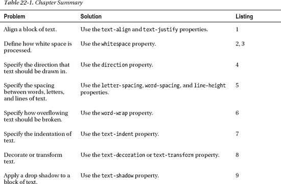

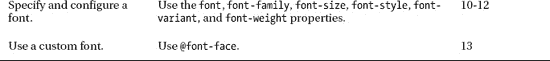

 **提示**`color`属性可以用来设置文本的颜色。这个属性在第二十四章中有描述。

### 应用基本文本样式

在下面几节中，我将向您展示如何使用应用基本文本样式的属性。

#### 对齐文本

有一些属性可用于管理文本内容的对齐和调整，如表 22-2 所述。

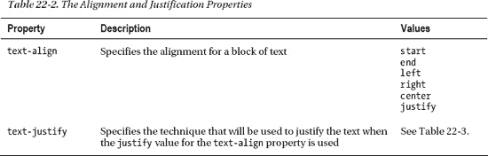

`text-align`属性非常简单，尽管需要注意的是，您可以将文本与显式命名的边缘对齐(使用`left`和`right`值)，或者与所用语言固有的边缘对齐(使用`start`和`end`值)。在处理从右向左的语言时，这是一个重要的区别。清单 22-1 显示了应用于文本块的`text-align`属性。

*清单 22-1。对齐文本*

`<!DOCTYPE HTML>
<html>
    <head>
        <title>Example</title>
        <meta name="author" content="Adam Freeman"/>
        <meta name="description" content="A simple example"/>
        <link rel="shortcut icon" href="favicon.ico" type="image/x-icon" />` `        
    </head>
    <body>
        

            There are lots of different kinds of fruit - there are over 500
            varieties of banana alone. By the time we add the countless types of
            apples, oranges, and other well-known fruit, we are faced with
            thousands of choices.
            One of the most interesting aspects of fruit is the
            variety available in each country. I live near London, in an area which is
            known for its apples.
        

        

            <button>Start</button>
            <button>End</button>
            <button>Left</button>
            <button>Right</button>
            <button>Justify</button>
            <button>Center</button>
        

        
    </body>
</html>`

在这个例子中，我添加了一个简单的脚本，它根据按钮的按下情况来改变`p`元素的`text-align`属性的值。图 22-1 显示了一些属性值对文本对齐的影响。

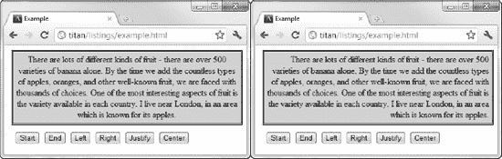

*图 22-1。文本对齐属性的居中值和右值的效果*

当使用`justify`值时，可以使用`text-justify`属性来指定如何给文本添加间距。该属性的允许值在表 22-3 中描述。

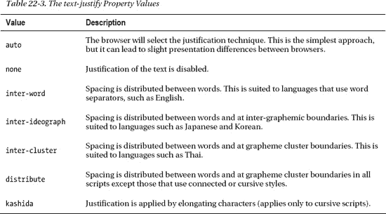

#### 处理空白

空白在 HTML 中通常被折叠或忽略。这允许您将 HTML 文档的布局与页面上的外观分开。清单 22-2 显示了一个包含空白的文本块的 HTML 文档。

*清单 22-2。一个带有空白的 HTML 文档*

`<!DOCTYPE HTML>
<html>
    <head>
        <title>Example</title>
        <meta name="author" content="Adam Freeman"/>
        <meta name="description" content="A simple example"/>
        <link rel="shortcut icon" href="favicon.ico" type="image/x-icon" />
        
    </head>
    <body>
        **

            There are lots of different kinds of fruit - there are over 500
            varieties

            of banana alone. By the time we add the countless types of
            apples, oranges, and other well-known fruit, we are faced with
            thousands of choices.

            One     of the      most interesting aspects of fruit is the
            variety available   in each country. I live near London,

            in an area which is
            known for its apples.

        
**
    </body>
</html>`

我在文本中引入了一些空格、制表符和换行符。当浏览器遇到多个空格字符(如多个空格)时，它们被*折叠*，意味着它们被替换为单个空格字符。其他类型的空白，比如换行符，会被忽略，浏览器*会对文本进行换行*，这样各个行就能符合元素的边界。你可以在图 22-2 的例子中看到浏览器显示文本的方式。

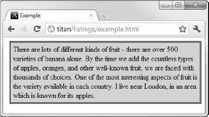

*图 22-2。HTML 文档中空白的默认处理*

这并不总是方便的——有时您希望保留文本在源 HTML 文档中的格式。您可以使用`whitespace`属性控制空白字符的处理，该属性在表 22-4 中进行了总结。

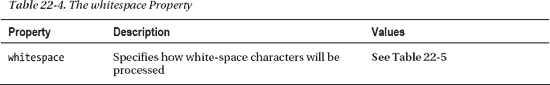

`whitespace`属性的允许值在表 22-5 中描述。

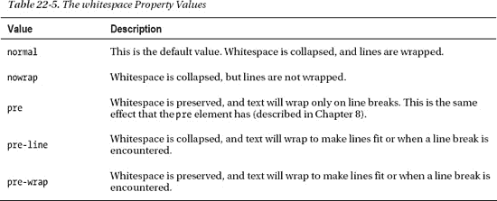

清单 22-3 展示了`whitespace`属性的应用。

*清单 22-3。使用空白属性*

`<!DOCTYPE HTML>
<html>
    <head>
        <title>Example</title>
        <meta name="author" content="Adam Freeman"/>
        <meta name="description" content="A simple example"/>
        <link rel="shortcut icon" href="favicon.ico" type="image/x-icon" />
        
    </head>
    <body>
        

            There are lots of different kinds of fruit - there are over 500
            varieties

            of banana alone. By the time we add the countless types of
            apples, oranges, and other well-known fruit, we are faced with
            thousands of choices.

            One     of the      most interesting aspects of fruit is the
            variety available   in each country. I live near London,

            in an area which is
            known for its apples.

        

    </body>
</html>`

你可以在图 22-3 中看到`pre-line`值的效果。文本换行，以便内容适合元素，但保留换行符。

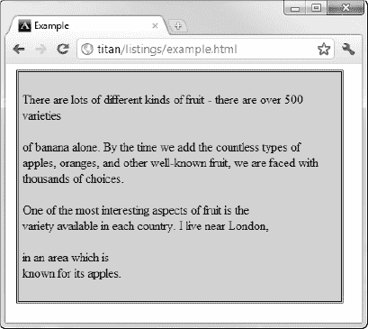

*图 22-3。使用空白属性的行前值*

 **提示**文本的 CSS3 模块将`whitespace`属性定义为另外两个属性的简写:`bikeshedding`和`text-wrap`。这两个属性都还没有实现，`bikeshedding`属性的定义也不完整。(一个突出的问题是挑选一个更有意义的名字。)

#### 指定文本方向

`direction`属性让你告诉浏览器一个文本块的方向，如表 22-6 所述。

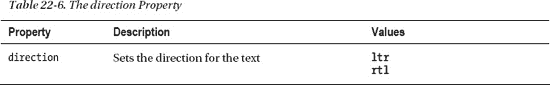

您可以在清单 22-4 的中看到`direction`属性的一个简单应用。

*清单 22-4。使用方向属性*

`<!DOCTYPE HTML>
<html>
    <head>
        <title>Example</title>
        <meta name="author" content="Adam Freeman"/>
        <meta name="description" content="A simple example"/>
        <link rel="shortcut icon" href="favicon.ico" type="image/x-icon" />
        
    </head>
    <body>
        

            This is left-to-right text
        

        

            This is right-to-lefttext
        

    </body>
</html>`

你可以在图 22-4 中看到这个属性的效果。

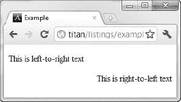

*图 22-4。使用方向属性*

 **注意**`direction`属性已经从相关 CSS 模块的最新草案中删除，尽管没有给出原因，并且可能在模块最终确定之前恢复。

#### 指定单词、字母和行之间的间距

您可以告诉浏览器在单词、字母和行之间放置多少空间。相关属性在表 22-7 中描述。

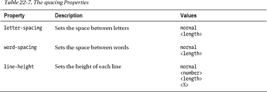

清单 22-5 显示了应用于一个文本块的所有三个属性。

*清单 22-5。使用字母间距和单词间距属性*

`<!DOCTYPE HTML>
<html>
    <head>
        <title>Example</title>
        <meta name="author" content="Adam Freeman"/>
        <meta name="description" content="A simple example"/>
        <link rel="shortcut icon" href="favicon.ico" type="image/x-icon" />
        
    </head>
    <body>
        

            There are lots of different kinds of fruit - there are over 500
            varieties of banana alone. By the time we add the countless types of
            apples, oranges, and other well-known fruit, we are faced with
            thousands of choices.
        
` `    </body>
</html>`

你可以在图 22-5 中看到这些属性的效果。

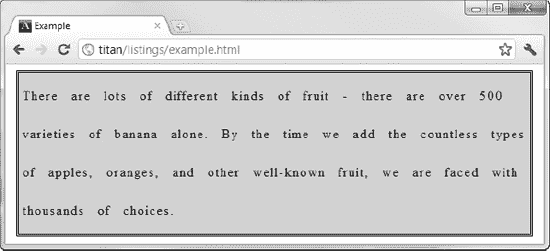

*图 22-5。应用单词间距和字母间距属性*

#### 控制断词

属性告诉浏览器当一个单词的长度超过它包含的块的宽度时该怎么做。该属性的允许值在表 22-8 中描述。

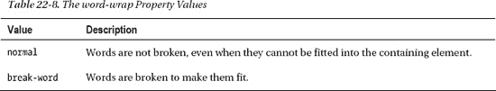

清单 22-6 展示了`word-wrap`属性的应用。

*清单 22-6。使用自动换行属性*

`<!DOCTYPE HTML>
<html>
    <head>
        <title>Example</title>
        <meta name="author" content="Adam Freeman"/>
        <meta name="description" content="A simple example"/>
        <link rel="shortcut icon" href="favicon.ico" type="image/x-icon" />` `        
    </head>
    <body>
        

            There are lots of different kinds of fruit - there are over 500
            varieties of madeupfruitwithaverylongname alone.
        

        

            There are lots of different kinds of fruit - there are over 500
            varieties of madeupfruitwithaverylongname alone.
        

    </body>
</html>`

在这个例子中有两个`p`元素，我已经对它们应用了`word-wrap`属性的值。你可以在图 22-6 中看到属性的效果。

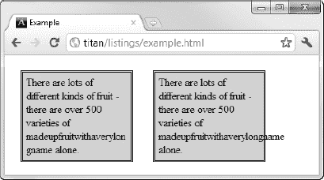

*图 22-6。使用自动换行属性*

图中最左边的`p`元素使用的是`break-word`值，所以文本中很长的单词会被打断并换行以适合它。另一个`p`元素使用默认值`normal`，这意味着浏览器不会打断这个单词，即使它溢出了`p`元素的边缘。

 **提示**你可以使用`overflow`属性(在第二十章中描述)来阻止浏览器显示溢出的文本，尽管这样做的效果只是不显示单词中不合适的部分。

#### 缩进首行

属性允许你为一个文本块的第一行指定一个缩进，用长度或者包含元素的宽度的百分比来表示。表 22-9 总结了这一特性。

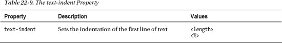

清单 22-7 显示了这个属性的用法。

*清单 22-7。使用文本缩进属性*

`<!DOCTYPE HTML>
<html>
    <head>
        <title>Example</title>
        <meta name="author" content="Adam Freeman"/>
        <meta name="description" content="A simple example"/>
        <link rel="shortcut icon" href="favicon.ico" type="image/x-icon" />
        
    </head>
    <body>
        

            There are lots of different kinds of fruit - there are over 500
            varieties of banana alone. By the time we add the countless types of` `            apples, oranges, and other well-known fruit, we are faced with
            thousands of choices.
            One of the most interesting aspects of fruit is the
            variety available in each country. I live near London, in an area which is
            known for its apples.
        

    </body>
</html>`

你可以在图 22-7 中看到该属性的效果。

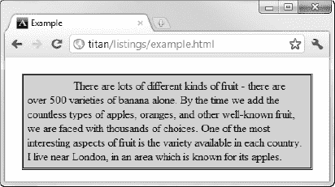

*图 22-7。缩进文本块的第一行*

### 修饰和转换文本

有两个属性，`text-decoration`和`text-transform`，允许您修饰和转换文本。这些在表 22-10 中描述。

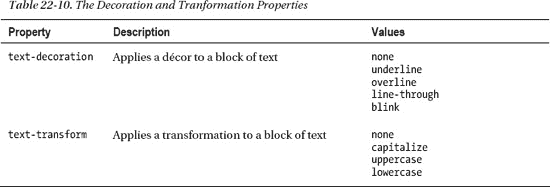

属性对文本块应用一种效果，比如给它加下划线。默认值为`none`(表示不应用任何装饰)。`text-transform`属性改变了文本块的大小写，同样，默认值是`none`。在清单 22-8 中，您可以看到这两个属性都被应用，以及在它们之间切换的脚本。

*清单 22-8。使用文本装饰和文本转换属性*

`<!DOCTYPE HTML>
<html>
    <head>
        <title>Example</title>
        <meta name="author" content="Adam Freeman"/>
        <meta name="description" content="A simple example"/>
        <link rel="shortcut icon" href="favicon.ico" type="image/x-icon" />
        
    </head>
    <body>
        

            There are lots of different kinds of fruit - there are over 500
            varieties of banana alone. By the time we add the countless types of
            apples, oranges, and other well-known fruit, we are faced with
            thousands of choices.
            One of the most interesting aspects of fruit is the
            variety available in each country. I live near London, in an area which is
            known for its apples.
        

    </body>
</html>`

图 22-8 显示了`text-transform property`的`uppercase`值和`text-decoration`属性的`line-through`值一起应用的效果。

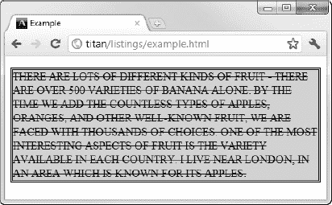

*图 22-8。装饰和改造正文*

 **提示**`text-decoration`属性的`blick`值应该尽量少用。它会产生一种非常烦人的效果，尤其是当用户长时间使用这个页面的时候。我建议找一种不那么令人恼火的方式来吸引用户的注意力。

### 创建文本阴影

在第十九章中，我向你展示了如何为元素创建阴影。你可以使用`text-shadow`属性对文本做同样的事情，在表 22-11 中有总结。

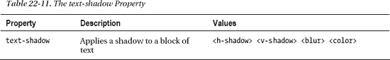

`h-shadow`和`v-shadow`值指定阴影的偏移量。值以长度表示，并且允许负值。`blur`值是另一个长度值，指定应用于阴影的模糊程度。该值是可选的。`color`值指定阴影的颜色。清单 22-9 显示了正在使用的`text-shadow`属性。

*清单 22-9。使用文本阴影属性*

`<!DOCTYPE HTML>
<html>
    <head>` `        <title>Example</title>
        <meta name="author" content="Adam Freeman"/>
        <meta name="description" content="A simple example"/>
        <link rel="shortcut icon" href="favicon.ico" type="image/x-icon" />
        
    </head>
    <body>
        <h1>Thoughts about Fruit</h1>
        

            There are lots of different kinds of fruit - there are over 500
            varieties of banana alone. By the time we add the countless types of
            apples, oranges, and other well-known fruit, we are faced with
            thousands of choices.
        

    </body>
</html>`

在这个例子中，我对文本应用了两种不同的阴影。你可以在图 22-9 中看到效果。请注意，阴影遵循文本字符的形状，而不是包含元素的形状。

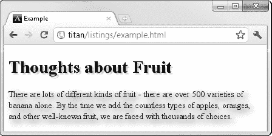

***图 22-9。**对文本应用阴影*

### 使用字体

您可以对文本进行的最基本的更改之一是用于显示字符的字体。表 22-12 描述了字体相关的属性。排版的平衡很难实现——一方面，有些高级用户想要控制他们排版的每一个方面(有很多)。另一方面，有一些普通的设计人员和程序员希望能够方便地使用关键的排版功能，但又不想陷入细节中。可悲的是，CSS 字体支持不能满足任何一方。很少暴露出字体的深层技术方面，但是那些暴露出来的对主流设计师或程序员来说用处不大。有一些提议的 CSS3 模块将增强字体支持，但它们仍处于早期阶段，尚未吸引任何主流实现。

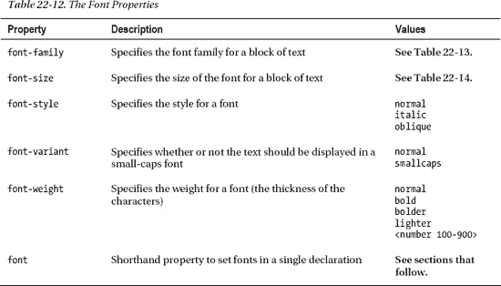

`font`属性值的格式如下:

`font: <font-style> <font-variant> <font-weight> <font-size> <font-family>`

#### 选择字体

属性指定了将要使用的字体，按照偏好的顺序。浏览器从列表中的第一种字体开始，向下搜索，直到找到可以使用的字体。这种方法是必需的，因为您可以使用安装在用户计算机上的字体，当然，不同的用户会根据操作系统和偏好安装不同的字体。

作为最后一道防线，CSS 定义了一些随处可用的通用字体。这些是字体的大类，被称为*通用字体族*，浏览器呈现它们所使用的确切字体可能会有变化。通用字体系列的总结可在表 22-13 中找到。

清单 22-10 展示了应用于文本块的`font-family`属性。

*清单 22-10。使用字体系列属性*

`<!DOCTYPE HTML>
<html>
    <head>
        <title>Example</title>
        <meta name="author" content="Adam Freeman"/>
        <meta name="description" content="A simple example"/>
        <link rel="shortcut icon" href="favicon.ico" type="image/x-icon" />
        
    </head>
    <body>
        

            There are lots of different kinds of fruit - there are over 500
            varieties of banana alone. By the time we add the countless types of
            apples, oranges, and other well-known fruit, we are faced with
            thousands of choices.
        

    </body>
</html>`

在这个例子中，我为`font-family`属性指定了`HelveticaNeue Condensed`。这是一种由 press 使用的字体，并不是在每个系统上都可用。我指定通用的`monospace`作为在`HelveticaNeue Condensed`不可用时使用的后备。你可以在图 22-10 中看到这种效果。

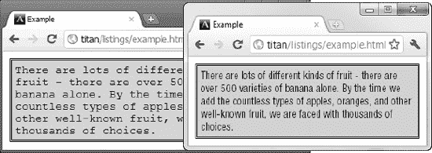

*图 22-10。使用字体系列属性*

图右边的浏览器运行在我用来写这本书的机器上。它安装了 Apress 字体，因此浏览器能够找到并使用`HelveticaNeue Condensed`。左边的浏览器来自我的一台测试机，没有安装`HelveticaNeue Condensed`。你可以看到它已经退回到使用通用的`monospace`。

 **提示**使用备用字体时可能出现的一个问题是屏幕上的字体大小不同。您可以在图中看到这一点，其中备用字体比首选字体大。`font-size-adjust`属性可以用来表示缩放比例，但目前只有 Firefox 支持。

#### 设置字体大小

`font-size`属性允许您指定字体的大小。该属性的允许值在表 22-14 中描述。

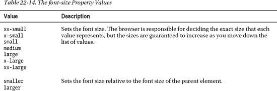

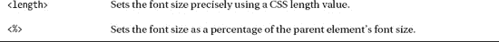

清单 22-11 显示了使用中的字体大小属性。

*清单 22-11。使用字体大小属性*

`<!DOCTYPE HTML>
<html>
    <head>
        <title>Example</title>
        <meta name="author" content="Adam Freeman"/>
        <meta name="description" content="A simple example"/>
        <link rel="shortcut icon" href="favicon.ico" type="image/x-icon" />
        
    </head>
    <body>
        

            There are lots of different kinds of fruit - there are over 500
            varieties of **banana** alone. By the time we add the
            countless types of ****apples, oranges, and other
            well-known fruit, we are faced with thousands of choices.
        

    </body>
</html>`

在这个例子中，我应用了三个`font-size`声明。你可以在图 22-11 中看到它们的效果。

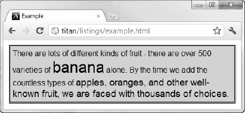

*图 22-11。使用字体大小属性*

#### 设置字体样式和粗细

您可以使用`font-weight`属性设置字体的粗细——增加粗细会使文本变得更粗。`font-style`属性允许您在正常、斜体和倾斜字体之间进行选择。斜体字和斜体字是有区别的，但是这是一个繁琐的技术问题，而且在很大程度上对文本的外观没有什么影响。清单 22-12 展示了这些特性。

*清单 22-12。使用字体粗细和字体样式属性*

`<!DOCTYPE HTML>
<html>
    <head>
        <title>Example</title>
        <meta name="author" content="Adam Freeman"/>
        <meta name="description" content="A simple example"/>
        <link rel="shortcut icon" href="favicon.ico" type="image/x-icon" />
        
    </head>
    <body>
        
` `            There are lots of different kinds of fruit - there are over 500
            varieties of **banana** alone. By the time we add the
            countless types of ****apples, oranges, and other
            well-known fruit, we are faced with thousands of choices.
        

    </body>
</html>`

你可以在图 22-12 中看到这些属性的效果。

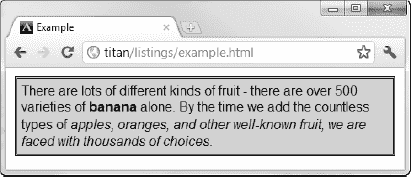

*图 22-12。使用字体粗细和字体样式属性*

### 使用网络字体

我已经提到了 CSS 字体最大的问题之一。你不能依赖你想要安装在用户机器上的字体的事实。这个问题的解决方案是使用*网络字体*，你可以下载一种字体并在你的页面上使用，而不需要用户的任何操作。你使用`@font-face`指定网页字体，如清单 22-13 所示。

*清单 22-13。使用网络字体*

`<!DOCTYPE HTML>
<html>
    <head>
        <title>Example</title>
        <meta name="author" content="Adam Freeman"/>
        <meta name="description" content="A simple example"/>
        <link rel="shortcut icon" href="favicon.ico" type="image/x-icon" />
        
    </head>
    <body>
        

            There are lots of different kinds of fruit - there are over 500
            varieties of banana alone. By the time we add the
            countless types of apples, oranges, and other
            well-known fruit, we are faced with thousands of choices.
        

    </body>
</html>`

当您使用`@font-face`时，您使用标准字体属性来描述您正在使用的字体。`font-family`属性定义了您可以用来引用下载字体的名称，`font-style`和`font-weight`属性告诉浏览器字体的样式和粗细设置，这意味着您可以创建斜体和粗体字符。`src`属性用于指定字体文件的位置。Web 字体有许多不同的格式，但 WOFF 格式似乎是最受支持和可用的。

 **提示**有些网络服务器默认不会向浏览器发送字体文件。您可能需要将文件类型或 MIME 类型添加到服务器的配置中。

你可以在图 22-13 中看到网页字体的效果。

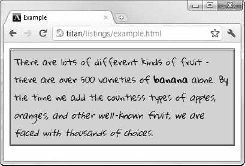

*图 22-13。使用网络字体*

有很多网络字体资源可用。我最喜欢的是谷歌提供的。您可以在`[www.google.com/webfonts](http://www.google.com/webfonts)`看到他们提供的字体，并获得如何将它们包含在您的 HTML 中的说明。(这是我在示例中使用的字体的来源。)

### 总结

在这一章中，你看到了允许你设置文本样式的 CSS 属性。您可以应用的效果从简单的(如基本对齐)到复杂的(使用自定字体和创建文本阴影)。这是 CSS 的另一个易变领域。有一些有趣的关于属性的提议，允许对文本的外观进行更大的控制，但是还不清楚是否有足够的兴趣来推动采用，并且这些提议完全有可能不会成为标准。